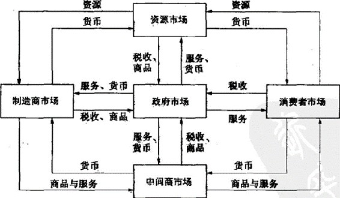
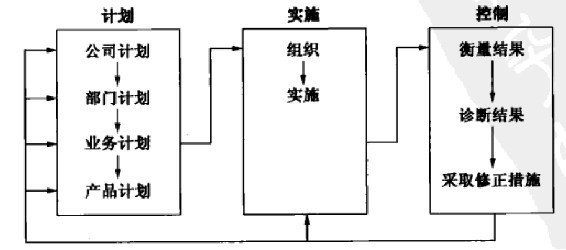

第1部分 理解营销管理
--------------------

第1章 21世纪的市场营销

第2章 制定营销战略与营销计划

### 第1章 21世纪的市场营销

本章将重点阐述以下问题：

-   1.市场营销为什么很重要？

-   2.市场营销学的范畴什么？

-   3.基本的营销理念包括哪些？

-   4.营销管理是怎样演化的？

-   5.成功的营销管理必须完成哪些任务？

营销无处不在。无论是有意识的还是无意识的，任何组织与个人都在从事着各种各样的营销活动。在当今的环境中，好的市场营销已经成为企业成功的必备条件。而且，市场营销也会对人们的日常生活产生深刻的影响，从服装到网站、到广告......因此，可以说，市场营销已经渗透到人们生活中的点点滴滴。

> 两个小女孩来到了上海当地的星巴克。其中一个来到拥挤的柜台，用"星巴克顾客友情卡"换取了薄荷味香浓奶茶和饮料，另一个则找了一张桌子坐下，并玩起了联想ThinkPad
> R60笔记本电脑。在几秒钟的时间里，她就使用星巴克的无线网络（中国移动的网络）接入了互联网。接着，她通过中国搜索引擎市场的领先者------百度来搜索由中国盛大公司发布的最新网络游戏信息。除了链接到各种评论网站、新闻网站和游戏迷的网页之外，百度搜索引擎的搜索结果中还提供了网络聊天室的链接------其中有上百个其他的游戏网友围绕游戏展开讨论并进行交流。接着，这个女孩进入了聊天室，并提出了这样的问题：已经玩过该游戏的网友是否推荐他人玩这个游戏，并征求相关的建议。在发出帖子以后，很快就收到了许多积极回应。于是，她在百度搜索引擎的搜索结果网页中选择并点击了一个赞助链接，然后就出现了百度提供的竞价推广的网站------把这个女孩带到了盛大公司的网站。在这个网站界面上，这个女孩为自己开设了一个账户。

> 这时，她的朋友端着饮料回来了，迫不及待地炫耀她父母送给她的新年礼物------色彩鲜艳的粉红色摩托罗拉RAZR手机，这是由位于芝加哥的年轻的设计师团队在经过几个月的市场调研和消费者测试之后才设计出的新产品。这时，这部精致的手机收到了一条文本广告短信："可以把盛大公司最新游戏下载到手机上"。看到这条信息，这两个女孩更是对这款手机赞不绝口。然后，这两个女孩就要开始操作笔记本电脑，以便在网上查找有关该手机版电子游戏的网络评论。

> 成功的市场营销绝非偶然，而是科学规划和有效实施的必然结果。就其实质而言，市场营销既是一门科学，又是一门艺术，是惯例化模式和创新的有机体。实际上，在市场营销的学习过程中，学习其中惯例化模式的东西要相对容易些。虽然本书中的大部分内容都是在阐述惯例化模式方面的内容，但本书也描述了许多企业在营销实践中是如何进行实际创新的。本章将通过对一系列市场营销概念、工具、框架和问题的阐述，为以后各章的学习奠定基础。

### 市场营销的重要性

企业的营销能力是企业盈利的根本保证。如果对产品和服务的需求不足，那么财务、运营、会计和其他方面的努力也只不过是虚无缥渺的东西，因为只有通过足够的需求，企业才能真正获得利润。由于市场营销是一切活动的基础，所以很多企业都设立了首席营销官（CMO），其地位相当于首席执行官（CEO）和首席财务官（CFO）等。从消费品制造商到医疗保险业，从非营利组织到工业品制造商，都会在公司网站上发布有关自己近期的营销业绩。类似地，在许多商业媒体上，也刊载了数不清的、有关营销战略和战术的文章。

在阐明企业的经营重点时，许多CEO都强调了市场营销的重要性。2006年，在全世界范围内对CEO需要面对的十大挑战进行了一项调查。该项调查结果表明：在排在前五位的挑战中，持续与稳定的成长、顾客忠诚/挽留首当其冲，而这二者都在很大程度上依赖于市场营销方面的成就。同时，许多CEO也都意识到市场营销对于构建品牌和贏得顾客忠诚的重要性。正是这些无形资产，在企业价值中占据了绝大部分比重。

然而，市场营销是一种复杂而微妙的过程，构成了许多以前辉煌一时的企业的致命弱点。实际上，诸如西尔斯公司、李维斯公司、通用公司、柯达公司、施乐公司和索尼公司等都面临着更加强大的顾客（顾客的权利正在增加）和新的竞争对手，因而不得不重新思考自己的商业模式。

即使像英特尔公司、微软公司和沃尔玛公司等市场领先企业也面临着巨大的挑战，时刻都不敢有所放松，因为其领先地位也持续地受到挑战。通用电气CEO杰克·韦尔奇曾经反复警告企业："要么变革，要么死亡。"

> 施乐公司（Xerox）

> 施乐公司已不仅仅是一家经营复印机的企业了，它必须不断更新和扩大自己的业务。现在，带有这个名字的蓝筹图标已经成为一个代表，并在客户喜爱的印刷系统市场上占据着主导地位。该公司正经历着巨大的产品线转变，正从历史悠久的光透影像技术转向数码系统。施乐公司适应了世界的变化，不再仅仅局限于黑白印刷，而是开始彩印了（彩印产生的利润可达黑白印刷的5倍）。除了改进机器之外，施乐公司正在通过提供类似于年金的产品与服务（顾客反复订购的产品与服务）一墨粉和文件管理一来扩大其销售额。由于对佳能公司的出现没有作出及时反应，由于没能及时进入较小的复印机市场，施乐公司目前正竭尽全力保持其领先地位。

对市场的变化作出及时反应并非易事。营销经理必须及时设计出新产品（把何种属性纳入到新产品之中）、为顾客设定合理的价格、到哪里去销售产品和花多少钱来做广告和进行促销或进行网站推广。同时，他们也必须关注一些细节，如为新包装确定准确的词汇或颜色。对于企业而言，最大的风险就是没有能够认真地对顾客和竞争对手进行监视，也没能够持续改进其产品与服务。他们只是注重短期利益，奉行销售至上的原则，结旲无法满足股东、员工、供应商和渠道商的需求。实际上，精妙的市场营销往往是一个永无止境的过程。

### 市场营销学的范畴

为了成为合格的营销人员，就必须知道什么是市场营销、市场营销是如何运作的以及营销什么和由谁在从事市场营销工作。

什么是市场营销

市场营销（marketing）就是辨别并满足人类和社会的需要。对市场营销最简洁的定义，就是"满足别人并获得利润"。当eBay公司意识到人们在当地不能买到最想要的物品时，就发明了网上竞拍业务；当宜家公司（IKEA）意识到人们想购买廉价、质量高的家具时，就创造了可拆卸与组装的家具业务。所有这些都证明：市场营销可以把社会需要和个人需要转变成商机。

美国市场营销协会为市场营销下了一个定义，认为市场营销是一项有组织的活动，包括创造、沟通和交付顾客价值和管理顾客关系的一系列过程，从而使利益相关者和企业都从中受益。从事如上所述的交换活动，往往需要完成很多工作和具有相应的技能。当一方考虑通过各种方式促使另一方作出预期的反应（如购买）时，就产生了营销管理。因此，我们可以把营销管理（marketing
management）看成艺术和科学的结合------选择目标市场，并通过创造、交付和传播优质的顾客价值来获得顾客、挽留顾客和提升顾客的科学与艺术。

同时，我们也可以从社会和管理两个不同的角度来界定市场营销。从社会的角度来看，强调的是市场营销在社会中所扮演的营销角色。例如，有营销人员指出，市场营销的作用就是为别人创造出高标准的生活。从这个意义上讲，下面这个定义可能更能表示市场营销的社会含义。所谓市场营销，就是个人和集体通过创造、提供、出售、同别人自由交换产品和服务的方式以获得自己所需产品或服务的社会过程。

有时，管理者认为市场营销就是"推销产品的艺术"。然而，当人们获悉推销并非市场营销中最重要的部分时，他们可能会大吃一惊。实际上，推销只是市场营销冰山上的一角而已。著名管理学家德鲁克先生曾经指出：

> 可以这样说，推销往往是需要的。然而，市场营销的目的却是使推销成为多余。市场营销的目的就在于深刻地认识和了解顾客，从而使产品和服务完全适合特定顾客的需要，从而实现产品的自我销售。因此，理想的市场营销应该可以自动生成想要购买特定产品或服务的顾客，而剩下的工作就是如何使顾客可以购买到这些产品。

当索尼公司设计出索尼PlayStation
3（PS3）游戏机产品时，当苹果公司推出了iPod
Nano数码音乐播放器时，当丰田公司推出了混合动力车普锐斯（prius）时，这些制造商的订货随之滚滚而来，因为它们都是在从事了大量的市场营销研究基础上才成功地设计出这些适销对路的产品的。

营销什么

一般而言，营销人员主要经营以下十大类产品：有形的商品、服务、节事、体验、人物、场所、产权、组织、信息和创意。

商品

在许多国家里，有形的商品都是生产和营销的主要对象。就美国而言，每年都销售大量的罐头、冷冻食品、汽车、电冰箱、电视机和各种现代经济的必需品。不仅企业可以销售商品，由于网络的出现和蓬勃发展，现在个人都可以销售商品了。

> 塑鸡卡公司（Rubber Chicken Cards）

> 有一位努力拼搏的兼职演员，他的名字叫史蒂夫·特布莱特（Steve
> Rotblatt），主要依靠在电视剧中扮演小角色或充当服务生、在高校教书和办公室管理等来谋求生计有一天，史蒂夫找到了一条可以实现其演员梦想的道路，那就是经营一家营利性的小企业。塑鸡卡公司（Rubberchikencards.com）就是他跟合伙人理查德·佐贝尔（Richard
> Zobel）共同创办的一家企业，它位于圣莫尼卡，是一家经营电子贺卡的在线信息公司。Classroom.com公司选择与塑鸡卡公司合作，由后者来开发快乐卡片，以便帮助4000万人重新联系到自己的老朋友；一家社会网公司------Me.com------也选择塑鸡卡公司（而不是许多其他的竞争对手）为其会员创作电子生日卡片。塑鸡卡公司创建于2000年，其年销售额有望在2006年达到30万美元，比上一年增长60%左右。特布莱特和佐贝尔的战略是：充分发挥自己的智慧，并尽可能减少开支。

服务

随着经济的增长，服务逐渐构成了经济活动中的主导力量，而人们也越来越关注服务的生产。时至今日，美国经济中包括70%的服务和30%的商品。其中，服务业包括航空服务、旅馆服务、汽车租赁服务、美容美发服务、保养维修服务、会计服务、律师服务、工程师、医生和软件编制人员等。而且，许多市场供应物都是商品与服务的组合体。例如，在快餐店中，顾客既享用食品，又享用服务。

节事

营销人员可以就一些节事进行宣传，如大型商业展览、艺术表演和企业庆典等。事实上，如果企业积极而大胆地利用一些全球性活动，如奥林匹克运动会和世界杯等，不仅会吸引相关爱好者（包括球迷等）的广泛关注，而且也会更为广泛地宣传自己。

体验

通过合理地把不同的商品和服务组合起来，企业往往能够创造和展示各种营销体验。其中，迪士尼公司的梦幻王国，就是这样一种体验。人们可以拜访童话王国、登上海盗船或走进鬼屋猎奇。现在，有许多提供体验各种经历的市场，如在棒球训练营花一个星期的时间与一些退役的棒球队员举行比赛，或付钱指挥芝加哥交响乐队演奏五分钟，或是攀登珠穆朗玛峰等。

人物

"名人营销"也已为营销的重要手段。艺术家、音乐家、首席执行官、医生、高收入的律师、金融家和其他专业人士都从名人营销中获益不少。大卫·贝克汉姆（David
Beckham）、奥普拉·温弗瑞（Oprah Winfrey）和滚石乐队（The Rolling
Stones）都非常成功地推销了自己。管理咨询家------汤姆·彼得斯（Tom
Peters）------是一个很善于建立自我品牌的人，他曾建议每个人都要努力使自己成为"知名品牌"。

场所

城市、州、地区和整个国家都致力于吸引游客、工厂、公司总部和新居民。场所营销人员包括专业开发专家、房地产代理商、商业银行、地方性商业协会和广告关系代理商等。拉斯维加斯会展与旅游促进局在一次煽动性的广告中投入了8000多万美元："这里发生了什么，呆在这里。"通过这一广告，拉斯维加斯会展与旅游促进局希望可以回归根本------"成人游乐场"，它希望这一广告活动可以使游客的数量从2004年的3730万人增加到2009年的4300万人。

产权

产权是所有者的无形权利，包括不动产（房地产）和金融资产（股票或债券）。产权可以买卖，而这种买卖就对市场营销产生了要求。房地产代理商为产权拥有者或出售者工作，或者是自己购买并销售住房或商业房产。投资公司和银行则面向商业机构或个人投资者营销证券产品。

组织

组织总是积极致力于在目标顾客心中建立起强势的、宜人的、独特的品牌形象。在英国，特易购公司（Tesco）"每天一点帮助"的营销计划，使其成为全国连锁市场的领先者。大学、博物馆以及一些从事艺术活动的组织和非营利组织为了获得受众和资金，也都在运用营销手段来提高其公众形象。公司识别（身份）活动往往都是密集式营销努力所产生的结果，这就正如飞利浦公司的广告语"精于心，简于形"（sense
and simplicity）所描绘的。

> 飞利浦公司（Philips）

> 飞利浦公司的研究人员曾经利用深度访谈、定量访谈和焦点小组访谈等途径，对1650个消费者和180个顾客进行了研究，请他们就下列问题发表看法：技术应用中最重要的方面是什么。来自英国、美国、法国、德国、中国香港、中国大陆、德国和巴西的受访者一致认为，他们想从飞利浦公司毫无争议的科技中获得更多利益。飞利浦公司因此设计了"精于心，简于形"的广告语，并希望自己的品牌反映出该公司的信念------简化是飞利浦科技的重要目标。显然，这样的信念是有实际意义的。在上述广告活动中，飞利浦公司让世界上医疗保健、时尚和科技领域的五个专家对广告（包栝印刷广告、网络广告和电视广告）进行指导，以便提供有关"简化之路"的外部视角。

信息

信息也可以是一种特殊的商品，诸如图书、学校和大学等都以一定的价格面向父母、学生和社区对信息进行生产和分销。诸如《道路和交通》《PC世界》和《时尚》等杂志分别向读者提供有关汽车、电脑和时尚的信息。信息的生产、包装与分销是也当代社会中的重要产业。实际上，即使是那些销售有形产品的企业也会尝试利用信息来增加产品的价值。例如，西门子医疗系统公司的首席执行官------汤姆·麦克科斯兰特（Tom
McCausland）指出："我们的产品不是X射线或MRI，而是信息。我们的业务是保健信息科技，我们的最终产品是病人的电子记录，既有声控信息，又有有关实验测试、病状和药物的信息。

观念/创意

每种市场供应物都包括基本的观念/创意。露华浓公司的查尔斯·露华森（Charles
Revson）曾经指出："在我们的工厂里，我们制作化妆品；在商店，我们出售希望。"产品和服务是传递某种观念和利益的平台。社会营销人员往往在忙于推广如"别让朋友酒后驾车"和"不要浪费才智"这样的创意。

谁是营销者

营销者和潜在顾客

营销者（marketer）是那些从潜在顾客那里寻求响应的人，如寻求他们的注意力、购买行为、选票或捐赠等。如果双方都在积极寻求把自己的产品（服务）卖给对方，那么我们就把它们都称作营销者。

其实，营销者往往很善于刺激消费者对其公司产品的需求，但是这种有关营销者需要完成任务的看法实在有点太狭隘了。实际上，与生产与物流部门的专业人士要对供应管理承担责任一样，营销者也需要对需求管理承担负责。营销经理需要努力去影响需求的水平、时机和构成，以便使其符合组织的目标。一般而言，可能存在以下八种需求：

负需求------消费者对某个产品感到厌恶，甚至花钱去回避它。

无需求------消费者对某个产品不了解或不感兴趣。

潜在需求------消费者可能对某个产品产生了强烈的需求，而现有产品又不能满足其需求。

下降需求------消费者逐渐减少或停止购买某种产品。

不规则需求------消费者的购买可能每个季节、每个月、每周，甚至每个小时都在发生变化。

充分需求------消费者恰如其分地在市场上购买自己所需要的数量的商品。

过度需求------消费者想要购买的数量超过了市场供应的数量。

不健康需求------产品可能吸引消费者，但却会对社会产生不良后果。

对于如上所述的每一种情况，营销者都必须确定每种潜在需求的基本原因，然后制定出促使该种需求朝着自己所期望的需求类型转化的行动方案。

市场

有关市场的传统观念认为，市场（market）是买方和卖方聚集在一起进行交换的实地场所。经济学家则把市场定义为"对某一特定产品或一类产品进行交易的买方与卖方的集合"（房地产市场或粮食市场）。在现代经济中，存在种类繁多的此类市场。

图1.1勾勒出五个基本市场及其流程。其中，制造商到资源市场上（原材料市场、劳动力市场和金融市场）购买各种资源，然后把它们加工成各种产品和服务，再把它们卖给中间商，中间商则把它们卖给消费者。消费者通过出售自己的劳动力，然后得到货币收入，并以此来购买自己需要的商品和服务。政府从制造商和中间商那里购买所需的产品，同时也向这些市场征税，并为这些市场提供各种公共服务。每个国家的经济乃至全球经济都是由各种市场所组成的复杂体系，而其中的这些市场则通过交换过程连接在一起。

图1.1 现代交换经济中的市场流程结构

营销者经常利用市场这个术语来指代各种各样的顾客。一般而言，他们往往把买方的集合看成行业，而把卖方看作市场。有时，他们也会谈及需求市场（如减肥市场）、产品市场（鞋类市场）、人口统计市场（青年市场）、地区市场（法国市场）或其他市场，如选举市场、劳动力市场和捐赠市场等。

图1.2描绘了行业和市场之间的关系。其中，买方和卖方通过四个流程彼此连接在一起。卖方把商品、服务和信息传递给市场；反过来，他们又获得了货币和信息（消费者的态度与销售数据）。在图1.2中，内圈表示货币和商品的交换，外圈则表示信息的交换。

图1.2 简化的营销系统

主要的顾客市场

主要的顾客市场包括消费者市场、组织市场、全球市场和非营利市场。

消费者市场    对于销售诸如软饮料、化妆品、航空机票和运动鞋或运动设备等大众消费商品与服务的企业而言，往往需要花费很多时间来建立优势品牌形象。大多数品牌优势的建立也往往离不开好的产品或包装、可获性的保证，并依靠持续的沟通和优质服务来提供支撑。

组织市场    销售组织产品和服务的企业经常会遇到受过良好训练、信息灵通的专业购买者，而且这些购买者对有竞争力的报价也很内行。组织购买者购买产品的目的是为了再销售并获得利润。因此，在组织市场上，卖方必须尽可能地展示出自己是如何有助于组织购买者获得更多收入或减少成本的。在此过程中，广告可能会起到一定的作用，但销售队伍、价格和企业在可靠性和质量方面的声誉可能发挥着更大的作用。

全球市场    在全球市场上销售产品和服务的企业往往面临更多的抉择和挑战。它们必须决定应该进入哪个国家或地区的市场、如何进入该市场（作为出口商、特许经营商、合资企业的合伙人、契约制造商或单独制造商）、如何使商品和服务更好适应该国市场、如何在不同的国家为产品定价、如何使自己的营销沟通更好地适应不同国家的具体情况。诸如此类决策的作出，往往需要充分考虑购买者、谈判者及财产拥有与处置者的不同要求，而且也要兼顾不同国家的文化、语言、法律和政治体系以及汇率的变动等。总之，要很好地应付全球市场，肯定离不开大量的情报收集与前期准备工作。当然，相应的回报也是相当诱人的。

> 阿拉斯加商务部与沃尔玛公司（Wal-Mart）

> 2005年，中国从阿拉斯加的进口达到了33700万美元------从海产品到矿石、化肥和木材，这一数字已经超过了加拿大并成为阿拉斯加的第三大出口伙伴。中国的潜在市场是巨大的，2008年北京奥林匹克运动会和2010年上海世博会的召开，使中国市场呈现出更大的吸引力。相应地，沃尔玛公司从阿拉斯加为其"中国店"购买了价值14万美元左右的海产品。为了与挪威的白鱼和大马哈鱼竞争，沃尔玛公司的五个店甚至雇用了阿拉斯加商务部的官员来主持为期14天的、野生阿拉斯加大马哈鱼和裸盖鱼烹饪演示。虽然这场烹饪演示属于劳动密集型的活动，但还是使那些能够付得起高价的中国城市年轻人很快品尝到了这种美味。

非营利组织和政府市场    把商品卖给教堂、大学、慈善机构和政府机关这些非营利组织时，企业需要对定价保持特别的谨慎态度，因为这类组织的购买力往往是非常有限的。较低的价格可能会影响卖方所提供商品的特性和质量。许多政府采购都是以招标的形式进行的，而且一般情况下都是以最低价中标，而没有对其他因素给予足够的关注。

市场地点、市场空间和大市场

市场地点（market
place）是有形的，如走近一家商店。比较而言，市场空间（market
space）往往是数字的（digital），如浏览网络商店。

西北大学的穆罕·梭尼（Mohan Sawhney）提出了大市场（meta
market）的概念，用来描述在消费者看来密切相关的，但又隶属于不同行业的一系列互补产品和服务。例如，汽车大市场就包括汽车制造商、新车和旧车的中间商、财务公司、保险公司、机械与零部件经销商、服务商店、汽车杂志、汽车广告以及汽车网站等。

如果有位顾客打算购买一辆汽车，那么他就可能会涉及上述大市场中许多要素。无疑，这就为中介代理创造了机会，它们可以为购买者提供无缝隙的贴心服务，帮助顾客完成与上述大市场中各方的交易或联系。即便大市场中各方在空间上并不相邻也是如此。例如，www.edmunds.com网站就可以向消费者提供多项服务，包括不同品牌汽车的相关属性与最新报价，而且还可以便利地链接到其他网站，以便查询融资服务成本最低的金融财务公司、售价最低的汽车零部件经销商和二手车交易的服务机构或个体。中介代理也可以为其他领域的大市场提供服务，如住房家居市场、保姆市场和婚庆服务市场等。

市场营销实践

如何从事市场营销呢？市场营销不仅仅是市场营销部门的事，它会影响到顾客体验的方方面面。这就意味着市场营销无处不在------从商店布局、包装设计、产品功能、员工培训、运输物流等所有可能与顾客接触的地方，都与市场营销息息相关。同时，市场营销也包括诸如管理创新和业务拓展等各种管理活动。

为了建立起强有力的营销组织，营销人员必须把市场营销和其他部门联系起来。沃尔玛公司的首席营销官（随后升任首席执行官）卡特·卡斯特（Carter
Cast）曾经指出："最让我感到惊讶的就是，在我成为首席营销官后我跟除了营销部门之外的其他部门之间的互动与合作越来越多了。在一开始，我并没有意识到这种关联，后来才知道我必须去了解产品供应、盈亏平衡点和会计等管理活动。"

一般而言，企业都是构建营销部门，并由该部分负责创造与交付顾客价值，但正如后来惠普公司的大卫·帕卡德所发现的：市场营销是如此的重要，以至于决不可能使营销变成只是市场营销营销部门的事情。现在，企业都知道每个员工都会对顾客产生影响，并把顾客视为企业繁荣发展的根基所在。因此，它们开始在关键流程中重视跨部门的团队合作。同时，它们也很重视对新产品创造、顾客获取与挽留以及履行订单等核心业务流程的管理。

在实践中，市场营销往往遵循着这样一个逻辑过程：营销计划过程包括分析营销机会、选择目标顾客、设计营销战略、策划营销方案并管理营销努力。但是，在竞争非常激烈的环境中，营销计划往往更富有弹性，需要不断地进行调整。企业要想实现更好的发展，就不得不重视营销计划的实施、产品和服务的创新、及时了解并满足消费者的需求，并不断寻求新的竞争优势，而不是简单地依赖过去的优势。

不断变化的、崭新的市场营销环境正对营销经理人员提出了越来越高的要求。这就要求营销者必须拥有各种各样的定量与定性技能、勇于创新的态度，并不断地去探求市场营销在企业内部是如何创造价值的。同时，营销者还必须与销售职能保持和谐的工作关系，实现完美的配合。

对于首席营销官而言，作为组织内部领导营销活动的领导入，往往要履行以下五大职能：

-   1.强化品牌优势；

-   2.测量营销效果；

-   3.根据顾客需要推动新产品的开发；

-   4.搜集富有价值的顾客意见；

-   5.充分运用新的营销技术。

哈佛大学的约翰·奎尔奇（John Quelch）和盖尔·麦葛文（Gail
McGovern）认为，对首席营销官而言，其责任和基本的工作要求可能存在着很大差异。他们为提升首席营销官的成就提供了八条建议（如表1.3所示）。

表1.3 提升首席营销官的成就

-   1.澄清使命与责任。确保领导入员深信企业确实笫要设置首席营销官职位，并确保组织的领导入物，尤其是首席执行官、董事会和直线管理人员都清晰地
    理解和认同所确定的使命。如果没有对需求形成清晰的认识（真正的需求或感知的需求），首席营销官的角色就不会得到组织的认可。\

-   2.使首席营销官角色和营销文化与结构相匹配。在市场营销导向型的企业里，设置首席营销官职位的前提，最好是拥有一个公司品牌，而不是众多的个体
    品牌------除非受命担任首席营销官的领导入物是一个八面玲珑的权威人物，可以与组织中的不同职能通力合作。

-   3.挑选与首席执行官能够很好配合并存在默契的人担任首席营销官。需要牢记的是，首席执行官虽然想要招聘一位首席营销官，但这并不意味着他会放弃
    对市场营销的控制。首席执行官应该把自己看作市场营销与品牌管理的拉拉队队长，在对营销进行控制的同时，还需要接受市场营销专家的指导。a

-   4.记住"爱炫耀的人是不会成功的"。首席营销官应该努力工作，并确保首席执行官成功地扮演了某个品牌的啦啦队队长角色。

-   5.使其个性与首席营销宮的类型相匹配。一定要确保首席营销官具有相应的技能和个性，以便可以适合三种首席营销官类型中的某一种（负责市场营销服
    务副总裁、传统的首席营销官和特级首席营销官）。切不可通过在职培训的方式再去弥补这种不匹配。

-   6.尽可能使直线经理成为营销楷模。通过充分延展相应的营销预算，首席营销官可以进一步提升某个部门的营销生产率，并帮助该部门进一步提高相应的
    收入水平。

-   7.渗透到直线组织之中。首席营销官不仅在营销活动中发挥作用，而且还应该对下列活动提供支持：把公司营销部门的营销专家派到某些部门从事营销活
    动；努力把自己的看法纳入到直线营销者的年度评价中来。

-   8.既需要"左脑"技能，又需要"右脑"技能。首席营销官不仅拥有很强的创造性营销技能和技术性营销技能，而且也应
    该拥有成为伟大领导入物和管理人员所需要拥有的政治头脑和卓越的人际技能。

### 市场营销中的核心概念

要了解营销职能，就有必须先来学习一下如下所示的一组核心概念。

需要、欲望和需求

需要（needs）是人类最基本的要求。人们需要空气、食物、水、衣服和住所才能生存。人们同样具有创新、接受教育和娱乐的需要。当存在具体的商品来满足需要的时候，需要就转变成欲望（wants）了。美国消费者需要食物，但他所需要的可能会是一个汉堡、一份法国炸鸡或一些饮料。类似地，毛里求斯的消费者也可能需要食物，但他所需要的可能是一些芒果、大米、扁豆和蚕豆。因此可见，欲望往往是受特定的社会所制约的。

需求（demands）是有支付能力购买具体的商品来得到满足的欲望。许多人都想要奔驰汽车，但是只有很少的人具有支付能力。企业不仅应该知道有多少人需要这些产品，更重要的是要测算出有多少人实际上能够买得起。

诸如此类的差别，有助于澄清经常提及的如下批判："营销者创造了需要"和"营销者诱使人们购买那些并不需要的产品"。显然，营销者不可能创造需要：需要优先手营销者而存在。不过，营销者和其他社会因素共同对人们的欲望产生影响。营销人员可能会激发为满足社会地位而购买奔驰汽车的需求。但是，他们并没有创造出购买者对社会地位的需要。

要了解顾客的需要和欲望，并不总是十分简单的事情。有些顾客并不知道自己真正需要什么，或者说他们根本不能描述出自己的需要，或者他们用来描述其需要的词汇还需要进一步加以解释才能让别人理解。当顾客说自己需要大功率的除草机、耐久的车床、性感的洗澡衣，或者一个体闲的旅店，他们到底是什么意思？营销者必须深入研究。我们可以从以下五种需要模型中得以分析：

-   1.明确表述的需要（顾客想要一辆不是很贵的汽车）。

-   2.真正的需要（顾客想要一辆使用成本很低，而不只是初始价格很低的汽车）。

-   3.未明确表述的需要（消费者期望能够从销售者那里购买到优质的服务）。

-   4.令人愉悦的需要（顾客希望得到赠送的车载导航系统）。

-   5.秘密需要（顾客希望朋友把自己当作内行）。

只是对消费者明确表述的需求作出反应，可能会误导消费者。实际上，许多消费者都不知道自己到底需要什么样的产品。当手机产品刚刚投放到市场上的时候，消费者对手机方面的知识还相对较少。这时，诺基亚公司和爱立信公司都竭力使消费者了解自己的产品，并对其产品与品牌形成一定的感知。可以说，简单地向顾客提供他们所想要的东西已经是远远不够了------要想保证具有竞争力，企业就应该帮助顾客学习，使他们认识到自己真正需要什么。

目标市场、市场定位和市场细分

营销人员往往很难满足市场上每个人的需要，并不是所有人都希望获得或消费同样的谷物、旅店房间、餐厅、汽车、大学或电影。因此，营销人员的第一项工作，就是对市场进行细分。通过分析顾客的人口统计信息、心理特征信息和行为差异信息，往往可以识别出具有不同产品与服务需求的不同顾客群体。

> 沃尔玛公司

> 沃尔玛公司运用社区店这一新概念对不同地区市场上的顾客进行细分。现在，至少有24家沃尔玛店的设计反映了它们所在社区的需求特征。举例来说，沃尔玛公司在科罗拉多州的柯林斯堡建有西方风格的沃尔玛店，而为了吸引富裕的非裔美国人则在加利福尼亚州的鲍德温山建有两层的具有艺术氛围的沃尔玛店。此外，为了更好地满足美国第四大阿米什（Amish）社区（俄亥俄州中部地区）的需要，沃尔玛公司还提供拴马桩（拴马或马车）、冰块和多种多样的牛仔裤布料。

在进行市场细分之后，营销人员还必须分析判断哪个细分市场上存在最大的市场机会，即选择自己的目标市场。然后，企业需要针对自己所选择的每个细分市场开发特定的市场供应物，并使目标市场认可该提供物能够为他们带来某些核心利益。例如，沃尔沃公司的目标市场是那些把安全作为重要因素的目标顾客。因此，沃尔沃公司把自己的汽车定位成顾客所购买的、最安全的汽车。实际上，企业都竭尽全力地在认真选择自己的目标市场，然后为自己所选择的每个细分市场设计定制化的营销方案。

供应物和品牌

企业往往需要通过提出某种价值主张（value
proposition）来满足顾客的需要，即用来满足顾客需要的一组利益。虽然上述价值主张是无形的，但它最终却可以通过实际的提供物（offering）来具体体现。其中，这里所说的提供物可以是产品、服务、信息和体验的某种组合。

品牌（brand）是具有明确供应来源的提供物的一种标志。例如，一提到麦当劳这类品牌，人们头脑中往往就会联想到汉堡、乐趣、孩子、快餐和金色拱门等等，它们就构成了品牌形象。

价值与满意

如果供应物向目标顾客传递了价值和满意，那么它就成功了。一般而言，顾客是在不同的供应物之间作出选择的，而选择的基础就是哪一种可以给他们带来最大的价值。价值是下列要素的综合反映：顾客所感知到的有形利益、无形利益与成本，往往可以看作质量、服务和价格的某种组合，因此又被称为顾客价值三角形。尽管其他要素也可能会影响价值，但价值一般会随着质量和服务的提高而提升，随着价格的下降而增加。

价值是市场营销中的一个核心概念。实际上，我们可以把市场营销看作识别、创造、沟通、交付和监督顾客价值的一种过程。满意反映的是顾客对产品的实际表现与自己的期望所进行的比较。如果产品的实际表现低于期望，那么顾客就是不满意的。如果相等，那么顾客就是满意的。如果超出了期望，那么顾客就会非常高兴。

营销渠道

为了接触到目标市场，营销者往往可以利用三种营销渠道。营销者可以通过沟通渠道发送信息，并从目标顾客那里获得信息。这种渠道包括报纸、杂志、广播、电视、信件、电话、招标栏、告示、传单、光碟、录音磁带和互联网等。除此之外，与人可以通过面部表情和衣着传递信息类似，企业也可以通过零售店的外观、公司网站和许多其他媒介来传递相应的信息。另外，营销者为了弥补广告等单向沟通渠道的不足，越来越多地增加了对双向沟通渠道的应用，如邮件、博客和免费电话等。

营销者利用分销渠道向购买者和使用者展现、销售或交付有形产品或服务。其中，分销渠道可能包括分销商、批发商、零售商和代理。

营销者也可以通过服务渠道与潜在顾客进行交易。其中，服务渠道包括仓库、运输公司、银行和保险公司等促进交易的机构或个体。营销者在为供应物选择有关沟通渠道、分销渠道和服务渠道的最佳组合时，在设计方面往往面临着一系列挑战。

供应链

供应链是一条相对很长的渠道链，包括了从原材料和零部件的供应到把产成品交付给最终顾客的整个过程。例如，女士钱包的供应链开始于皮革原料，中间经过染色、修剪和制造等环节，最终进入把产品送到顾客手中的营销渠道。实际上，在整个供应链价值交付系统当中，每家企业都只占全部价值的很小一部分比重。当一家企业收购了另外一家企业、向上游或下游扩展时，其目标往往在供应链总价值中占有更大的比重。

竞争

竞争包括所有的现实竞争对手、潜在竞争对手和购买者可能考虑的替代产品。假设汽车公司打算购买钢材来制造汽车，那么就可能有几个层次的竞争。该制造商可以从美国钢铁公司购买钢材，同时它也可从日本或韩国等外国钢铁公司那里购买钢材。当然，也可立足于节省成本的角度而从纽克公司（Nucor）那样的小型钢铁厂采购，或是从阿尔钦公司（Alcoa）那里购买铝，以便替代相应的汽车零部件并减轻汽车重量；当然也可以从沙特阿拉伯基础工业公司（Saudi
Basic
Industries）------该公司是通用电气塑料公司的客户------购买工程塑料（而不是钢铁）。显然，如果美国钢铁公司只是认为自己的竞争对手是其他的钢铁公司，那么它的思维就显得太狭隘了。实际上，从长远的观点来看，对美国钢铁公司造成最大冲击的，可能是那些替代产品的生产厂家，而不是该公司出于狭隘视角所关注的其他钢铁企业。

市场营销环境

市场营销环境主要包括任务环境和宏观环境两大类。其中，任务环境（task
environment）从事产品或服务的生产、分销和促销的组织或个体，具体包括生产企业、供应商、分销商、经销商和目标顾客。在供应商这个群体中，可能会包括原材料供应商和服务供应商，如市场调研机构、广告机构、银行、保险公司、运输公司和电信公司等。类似地，分销商和经销商也包括不同的类型，如代理人、经纪人、制造商代表和其他有助于搜寻顾客并向顾客销售的组织或个体。

一般而言，宏观环境（broad
environment）主要包括六类环境因素，分别是人口统计环境、经济环境、自然环境、技术环境、政治环境和社会文化环境。在实践中，营销人员必须密切关注这六类环境的发展变化趋势，并及时地调整自己的营销战略。

### 新的营销现实

我们可以很自信地说："当今的市场，已经不再是昔日的市场了"。营销人员必须对一系列的重要变化及其发展给予足够的关注并作出及时的反应。

主要的社会因素

目前，在一系列重要的社会因素（有时是存在密切联系的各个社会因素）的共同作用下，市场已经发生了翻天覆地的变化，它们不仅塑造了新的行为，而且也提供了不少新的机会和挑战。

 

-   网络信息技术。数字革命创造了崭新的信息时代。在工业时代里，其根本特征就是大规模生产与大众消费，商店里堆满了库存，广告随处可见，打折名目繁多。但是在信息时代里，往往以精确的生产水平、更有针对性的沟通和更适当的定价为主要特征。
-   全球化。交通、运输和通信技术的飞速发展，使企业能够比以前更容易在其他国家经销自己的产品，也使得消费者更容易在其他国家采购所需要的产品和服务。
-   放松管制。现在，许多国家都放松对某些行业的管制，以便创造更多的竞争和发展机会。例如，在美国，有关限制涉入金融、电信和电力事业的法律已经逐渐放松，从而创造出更大程度的竞争。
-   私有化。与此同时，也有许多国家使上市公司向私有化方向转变，以便提高企业的管理效率，如英国航空公司和电信公司。
-   激烈的竞争。对于品牌制造商而言，它们正面临着来自国内外的激烈竞争，这导致其促销成本不断上升，而边际利润却不断下降。同时，它们也日益感受到强势零售商的挤压------这些零售商控制着有限的货架空间，并推出与制造商品牌相互竞争的商店自有品牌。此外，也有不少优势品牌开始实施品牌延伸策略，把品牌应用在更广泛的相关产品类别上，结果造就了具有很好声誉和知名度的巨无霸品牌。
-   产业交融。随着越来越多的企业发现新的机会往往孕育在两个或更多产业的交融之中，产业之间的界限也变得越来越模糊了。例如，戴尔、盖特威和惠普等产业巨头推出了一系列的娱乐产品------从
    MP3播放器到等离子电视再到便携式摄像机，计算机和电子消费品产业出现了产业融合的趋势。而且，向数字技术转变的强劲趋势又进一步推动了上述交融趋势。
-   消费者抵制。2004年扬科洛维奇公司（Yankelovich）公布的一项研究结果表明，消费者对营销活动的抵制达到了前所未有的水平。被调查的大多数消费者都对营销和广告表现出消极情绪：他们表示，他们会避免购买那些感觉过度营销的产品。日益普及的数字录影机（如
    Tivo）使消费者可以更便利地在出现商业广告时跳过或转换频道，这也在一定程度上反映出消费者设法规避营销的欲望。
-   零售变革。一些小型零售商往往不得不听从于大型零售商和大型分类商店（category
    killer）的摆布。同时，一些零售商店也面临着目录经销商、直邮公司、直接面向消费者做广告的报纸、杂志和电视以及家庭电视购物和基于因特网的电子商务企业的竞争。结果，一批富有企业家精神的零售商开始在商店里增设咖啡厅、演讲、展示、表演等娱乐要素，开始强调体验营销，而不是单纯地增加产品的花色种类。

> MAC化妆店

> 化妆品巨头------雅诗兰黛的一个分支------MAC化妆店的杰出业绩，可以在一定程度上解释雅诗兰黛公司为什么会使其市场净收入增长了13%。实际上，世界上1000多家MAC化妆品店并不是简单地销售时尚焦点小眼影（Small
> Eye Shadow）、专业工作室两用粉饼（Studio
> Fix）、闪亮丰盈唇彩（Lustreglass）和不脱色唇脊（Pro Longwear
> Lipcolour）。相反，它们更多的是依赖那些和消费者密切接触并为消费者提供免费的化妆咨询和传授知识的化妆师。尽管这一策略在化妆品零售领域并不新颖，但不同的却是：MAC化妆店的化妆师并不是设法提高佣金，也不是劝说消费者购买过多的产品，而是接受过培训，能够与顾客进行合作，使顾客在离开MAC化妆店时会购买50多美元的产品，并产生这样的感觉："我绝对可以自己在家里用这些产品来化妆"。MAC化妆店专门负责化妆师培训与开发的经理------马修·怀特史密斯（Matthew
> Waitesmith）指出，化妆师培训和发展的目标，就是让顾客感觉到自己确实有种"艺术人物"的体验，这就意味着顾客可能还会再次来到使她们成为"艺术人物"的那个化妆店。

 

-   甩开中间商。早期网络公司所获得的成功是令人吃惊和羡慕的，诸如美国在线、亚马逊、雅虎、eBay和Erade等公司在产品和服务的交付过程中已经甩开了中间商，通过分销渠道介入传统的货物流通之中，从而深深地震撼了许多制造商和零售商。为此，许多传统公司都致力于重新构建中间商系统，并建立起自己的网络零售商------在传统的供应物中又增加了一系列在线服务。事实上，许多融实体零售商与网络零售商于一体的企业，往往比纯粹的网络公司更加强大，因为它们拥有更多的资源来展开自己的经营活动，而且它们往往也拥有强大的品牌。

在如上所述的一些社会因素的作用下，无论是对于企业，还是对于消费者而言，都产生了一系列新能力。

消费者的新能力

当今的消费者越来越难以感知到产品的差异，而且表现出较低的品牌忠诚度。在追求价值的过程中，消费者在价格与质量方面也表现出越来越大的敏感性。下面就来分析一下今天的消费者拥有的、但以前并没有的特质。

 

-   购买力的大幅增加。购买者仅仅通过点击鼠标就可以在网络上轻松便捷地比较产品价格和产品属性。他们甚至可以报出旅店房间、飞机票和抵押贷款的价格。商业顾客也可以举行逆向拍卖，使供应商为了能够与其达成交易而相互竞争。而且，他们也随时都准备与其他顾客联合起来，以便实现集团采购并获得更多的数量折扣。
-   存在各种各祥的商品和服务可供选择。亚马逊公司很快就成为世界上最大的书店了，但后来又扩展到经营音乐、电影、衣服、饰物、电子消费品、保健和美容产品以及家庭与花园产品等。世界各地的购买者都可以方便地在网上进行购物，从而不再受当地有限的产品供应物的限制，并通过在价格很低的国家进行订购而实现了最大的节约。
-   关于各种商品的大量信息。顾客似乎都可以阅读到世界各地的任何一种语言的报纸。他们可以通过网上百科全书、词典、医疗信息、影视评价、消费报告和其他各种各样的信息资源来获得所需要的信息。
-   更轻松便捷的互动、订购和收货成为可能。今天的消费者可以在家里或办公室或通过"一周七天、一天24小时"的移动电话下订单，然后可以在家里或办公室里很快就收到所订购的商品。
-   鉴别产品和服务的能力。社会网络把具有共同爱好的消费者聚集到了一起。通过Carspace.com网站，汽车爱好者可以谈论铬合金的轮圈、最新的宝马车型和在当地什么地方可以找到理想的汽车修理工等。结果，营销者持续地关注着这一网站所获得的成功。他们之所以会一直关注，是因为有资料表明：35%的年轻人在第一次买车的时候会把因特网作为最重要的购买工具。
-   影响同龄人和公众观念的声音在膨胀。因特网通过社会媒介推动了个人之间的联系，充分交流有关使用者的经验与评价等方面的信息。上面所说的社会媒介包括：我的空间和单独使用的社会网络。其中，后者包括Flickr（照片）、Delcio.us（链接）、Digg（新故事）、Wikipedia（维基百科全书）和YouTube（影像）等。美国克特耐公司（Kryptonite）是一家制造高端自行车锁的企业。在2004年下半年，有几个博客上都发出这样的信息：如何用一个塑料钢笔就可以把该公司的U形锁打开。当时，克特耐公司的处境相当尴尬。

> 肯德基（KFC）、匡威（Converse）和箭牌糖类有限公司（WM.Wrigley JR）

> 中国公民有着成千上万的论坛来抱怨糟糕的客户服务、误导的广告活动、残次的产品及安全标准等。实际上，中国消费者相当活跃，也相当善于表达。当数量足够多的顾客在抱怨时，企业往往只能洗耳恭听。当中国电视节目披露出百胜餐饮集团旗下肯德基公司描绘了这样的广告画面时：一个很勤奋的学生没有通过考试，而另外两个享受肯德基美食的学生却通过了考试，许多人都抱怨肯德基的广告有问题。结果，肯德基公司不得不对广告进行了调整，变成了三个孩子都做得一样好。实际上，一些明智的企业总是会先征求一下网络消费者的建议后才在市场上投放新产品。匡威和箭牌糖类有限公司就开展了联合促销活动，鼓励中国消费者为带有黄箭标识的匡威运动鞋提供超酷的设计。

企业的新能力

许多新的力量也相互影响，为企业造就了一系列新的能力，这些能力主要表现在：

 

-   营销者可以把因特网作为扩大其势力范围的信息渠道和销售渠道，以便在世界范围内向顾客传达相关信息并推广其产品与服务。通过建立一个或更多网络，企业也可以列出自己的产品、服务、历史、经营哲学、招聘信息以及网站浏览者感兴趣的其他信息。
-   调研者可以更全面地搜集有关市场、消费者、潜在顾客和竞争者的信息。他们可以利用因特网组织焦点小组访谈、发放一些问卷和利用其他几种方法来收集一手数据，从而进行市场调研。
-   管理人员可以促进员工之间的内部沟通，并使内部沟通更加高效便捷。通过构建基于因特网的内部网，可以通过内部网促使员工之间更好地、更快地进行沟通（属于内部沟通）。这样，员工就也可以相互交流、寻求建议，并把有关信息上传到公司的主机上或从公司主机上下载所需要的信息。
-   企业也可以通过网络社区和品牌拥护者等方式，构建在线网络或离线网络论坛，以便更快、更好地与顾客进行沟通（属于外部沟通）。在2003年，据谷底啤酒连锁酒吧报道，在雇用了口碑传播代理公司（Bzz
    Agent）和另外1000个常规代理进行了为期13周的口碑传播活动之后，其收入增长了76%。其中，口碑传播代理公司组织了国内26万名消费者，让他们参加了"他们认为值得推荐的那些产品和服务的促销宣传计划"。
-   随着面向专门读者的杂志、电视频道和因特网新闻组的出现，基于目标顾客的营销策略和双向沟通正变得越来越容易进行。把供应商与分销商连接起来的企业外部网，也使企业更高效地发送并接受信息、下订单和支付款项等成为可能。同时，企业也可以通过个性化的信息、服务和关系来与每个目标顾客进行一对一的互动。在2005年，折扣经纪商------嘉信理财公司把25%的营销沟通预算都花费在网络沟通上，以便对该公司是"投资人与每位业务代表进行沟通"（Talkto
    Chuck）活动提供支持。在2003年的时候，花费在网络上的沟通预算只占总预算的8%。
-   营销者可以向对企业提出要求或允许企业向他们发广告、优惠券、样品和信息的消费者发送广告、优惠券、样品和其他相关信息。而且，企业现在也可以收集和整理有关个体消费者购买能力、购买偏好、人口统计和盈利性方面的信息。英国超市巨头特易购公司就超越了自己的竞争对手桑斯博里公司（Sainsbury），而且做到了总是领先一步。为什么会这样呢？特易购公司的法宝就是利用其庞大的俱乐部会员信息来识别每个消费者的特点，然后向他们提供个性化的产品和服务。
-   企业也可以通过移动营销工具与"行动中"的消费者（如在路上行走的消费者）进行沟通。例如，通过使用全球定位系统（GPS），消费者在路上行走时都可以下载某公司的标识，使他们跟踪诸如唐恩都乐（Dunkin'Donuts）或芭斯罗缤（Baskin
    Robbins）等品牌成为可能。当然，企业也可以通过移动营销工具在iPod上做广告，或通过拨打消费者的手机与他们取得联系。通用汽车公司在推出旁蒂亚克G6（Pontiac）的时候就做了这样一次促销活动：让消费者利用具有照相功能的手机为跑车拍照，然后把所拍摄的照片发送给通用汽车公司，然后消费者就可以免费获取一种经典的优美手机铃声，并有机会贏取100万美元现金。在这次活动中，一共发送了将近18500张照片，其中大多数都是G6的目标消费者------年龄在25岁以下的年轻男性。
-   由于工厂定制化水平、计算机、因特网和数据库营销软件的发展，无论是个人亲自订购，还是通过电话或网络进行订购，企业都能够生产出差异化的个性化产品来满足消费者的需求。例如，顾客可以在一定的价格平下，从M&M公司购买有他们名字的蜡烛、包装上有他们照片的盒装麦片（Wheaties
    boxes）和琼斯罐装饮料（Jonessoda
    cans）、有顾客信息的亨氏番茄酱瓶子等。宝马公司的技术水平现在也使顾客拥有更多的选择，他们可以从350个品种、500个型号、90种表面颜色和170种或框架装饰中作出选择，定制自己喜欢的汽车。该公司宣称，在欧洲有80%的车是按照顾客的个性化订单生产的，在美国有30%的车也是按照顾客的个性化订单生产的。
-   管理人员可以进一步提升采购、招聘、培训、内部沟通与外部沟通的水平。例如，航空与国防承包商一波音公司已经构建起庞大的合作网络，其中包括一批非常有实力的企业，如华特迪士尼公司（Walt
    Disney）、通用汽车公司和麦当劳公司等，一起运用公司博客与公众、顾客和员工进行沟通。其中，通过外部博客，公众、顾客和员工可以同企业的营销副总裁进行对话，可以看看波音777新模型的飞行测试。通过内部博客，则可以讨论热门话题名反馈信息。
-   公司客户也可以通过因特网来比较供应商的价格水平，并通过网络竞拍或者在网络上张贴自己的采购条款等方式，实现采购成本的大幅度下降。同时，企业也可以通过不断改进自己的物流和运营水平来节约大量的成本，并提高物流或运营的准确性和提升服务质量。
-   企业也可以通过网络来招聘新员工，同时也有不少企业正准备通过网络来提升其培训效率，如开发网络培训产品，并使员工、经销商和代理可以在网络上下载这些网络培训产品。

### 由企业主导转向市场主导

鉴于上述新的营销现实，那么应该运用什么样的哲学来指导企业的营销努力呢？现在，越来越多的营销者开始采用全面营销理念。下面就先来回顾一下以前的营销理念吧。

生产观念

生产观念是商业领域中最古老的观念之一。生产观念认为，消费者喜欢那些随处能够购买到的、价格低廉的产品。生产导向型企业的管理层总是致力于提高生产效率、实现低成本和大众分销。这种导向在以中国为代表的发展中国家具有一定的可行性。在中国，最大的个人计算机制造商联想公司和家用电器巨头海尔公司，都利用国内庞大而廉价的劳动力资源而在市场上占据了垄断地位。此外，当企业想要扩大市场份额时，也可以采用这种观念。

产品观念

产品观念认为，消费者喜欢那些具有最高质量、性能水平或富有创新特色的产品。在奉行这种理念的企业里，管理人员总是生产优质的产品，并不断地加以完善。但是，管理人员有时会迷恋上自己的产品，因而有可能陷入"更好的捕鼠器"这类陷阱当中，幻想着只要生产更好的捕鼠器，人们就会踩破自家商店的门槛。实际上，对于一种新产品或改进的产品而言，如果没有制定出合适的价格并采取合理的分销、广告和销售措施，是未必能够获得成功的。

推销观念

推销观念认为，如果任其自然发展的话，消费者和企业并不会足量购买该组织的产品。因此，对于企业而言，它们必须主动推销并积极促销。推销观念可以用可口可乐公司前任营销副总裁齐曼（Zyman）的话来概括："营销的目的就是销售更多的商品给更多的人，使顾客更频繁地购买，获得更多的收入，从而贏得更多的利润。"

在那些非渴求产品的销售中，如保险产品的销售中，往往会极大限度地运用推销观念。其中，非渴求品就是购买者一般不会想到要去购买的商品，如保险、百科全书和墓地等。当产品过剩时，大多数企业也会奉行推销观念。他们的目标就是销售自己所生产的产品，而不是生产市场上所需要的产品。然而，建立在强化推销基础上的市场营销却蕴涵着很大的风险。它假设："被诱惑的消费者会喜欢所购买的产品，如果不喜欢的话，他们也不会退货，也不会进行负面的口碑传播，更不会向消费者组织抱怨，而且他们还会再次购买。"

营销观念

营销观念是在20世纪50年代中期出现的。与以产品为中心、"先制造再销售"的哲学不同，企业开始向"以顾客为中心"、"先感知、再反应"这一哲学转变。在这种营销哲学的指导下，企业的工作不再是为自己的产品找到合适的顾客，而是为顾客设计适合的产品。例如，戴尔计算机公两并不是要为目标顾客设计出完美的产品，而是为目标顾客提供一个平台，使顾客可以根据自己的偏好来配置并订购个性化的计算机产品。

营销观念认为，实现组织目标的关键是在面向目标市场创造、交付和沟通优异顾客价值的过程中比竞争对手做得更好、更有效果。

哈佛大学的西奥多·李维特（Theodore
Levitt）曾经形象地对推销观念与营销观念进行了比较：

> 推销观念注重卖方的需要，而营销观念则注重买方的需要。推销观念以卖方的需要为出发点，考虑的是如何把产品变成现金；而营销观念考虑的则是如何通过产品以及与创造、交付产品和消费最终产品有关的所有环节来满足顾客的需要。

不少学者都发现，奉行营销观念的企业往往会取得更好的业绩。首先，这已经得到了那些奉行反应型市场导向的企业的实践的证明。其中，反应型市场导向就是理解并满足顾客的显性需求。不过，有些批判者则指出，这意味着企业只是在进行一些最基本的创新。纳瓦（Narver）及其同事进一步指出，如果企业能够关注顾客的潜在需求的话，那么就可以实现更高层次的、更先进的创新了。纳瓦将其称为先动型市场导向（proactive
marketing
orientation）。诸如3M公司、惠普公司和摩托罗拉公司等都通过"探索和学习"过程来研究和描绘顾客的潜在需求。只有那些同时奉行反应型市场导向和先动型市场导向的企业，才实施了全面的市场导向，才可能成为最成功的企业。

全面营销观念

毫无疑问，定义21世纪营销的趋势和力量正促使一些领先企业接纳一套新的理念和实践方式。实际上，当今最好的营销者已经意识到必须超越传统的营销观念，必须采用一种更富有整体性、更富有关联性的方法来展开自己的营销活动。"营销备忘：营销谬误与科学"列出了企业在营销实践中容易出现错误的地方以及应该如何正确地从事营销活动。

全面管销（holistic
marketing）观念是以开发、设计和实施营销计划、过程及活动为基础的，但同时也深度地认识到上述营销计划、营销过程和营销活动的广度和彼此之间的相互依赖性。全面营销者认为，在营销实践中每个细节都是特别重要的，采纳广泛的、整合的视角不可或缺。

\@营销备忘：营销谬误与科学

 

  应该反对的十大营销原则                                    应该支持的十大营销原则 
  --------------------------------------------------------- ----------------------------------------------------------------------------------------------
  1.企业没有充分以市场为焦点，也没有做到完全的顾客驱动。    1.企业进行市场细分，选择最合适的细分市场并强化自己在所选择的每个细分市场上的地位。
  2.企业并不十分了解它的目标顾客。                          2.企业关注顾客的需要、感知、偏好和行为，并激励利益相关者关注为顾客提供服务并满足顾客的需要。
  3.企业需要更好地界定并监视它的竞争对手。                  3.企业知道谁是自己的主要竞争对手，并知道其优势和劣势。 
  4.企业并没有管理好与利益相关者的关系。                    4.企业与利益相关者建立起伙伴关系，并给他们丰厚的回报。 
  5.企业不善于发现新的机会。                                5.企业建立起识别机会、分析机会并选择最佳机会的制度或系统。 
  6.企业的营销计划和计划过程存在缺陷。                      6.企业拥有相对完善的营销计划系统，并能够制定出富有见地的长期计划和短期计划。
  7.企业需要实施从紧的产品和服务政策。                      7.企业对自己的产品和服务组合有很强的控制力。 
  8.企业的品牌塑造和沟通力很弱。                            8.企业通过经济有效的沟通与促销工具来塑造强大的品牌。 
  9.企业不能有效并高效地组织营销活动。                      9.企业树立起营销领导地位并在各个部门形成了团队精神。 
  10.企业不能充分利用科技。                                 10.企业不断增强自己的技术实力并借此强化自己在市场中的竞争地位

因此，全面营销试图充分认识并努力协调市场营销活动的范围和复杂性。图1.4勾勒出全面营销的框架，并概括出其中所包括的四个关键要素：关系营销、整合营销、内部营销和绩效营销。我们将在本书的不同章节对上述四大要索进行详细的探讨。成功的企业将是那些随着市场和市场空间的持续变化而不断调整其营销活动的企业。"营销突破：耐克公司"描述了多年来耐克公司是如何成功地适应变化并实现成长的。

图1.4 全面营销观念的主要维度

> 耐克公司

> 耐克公司始建于1962年，最初的公司名称是蓝带体育用品公司（Blue Ribbon
> Sports），主营体育用品。该公司特别关注专门为运动员设计高质量的跑鞋。其创始人菲利浦·奈特（Philip
> Knight）深信，如果从国外进口的话，可以以富有竞争力的价格生产专门面向跑步者的高技术跑鞋是可行的。可以说，该公司致力于为正式运动员设计创新运动鞋的形象，促使其在美国消费者中逐渐拥有了一大批"追随者"。

> 耐克公司认为金字塔式的影响力是不可小看的------虽然顶级运动员所占的比重不高，但他们的偏好或行为却可以对全体消费者的产品与品牌偏好产生十分重要的影响。因此，从一开始，耐克公司的营销活动就把获奖的运动员作为代言人。耐克公司的第一位代言人------史蒂夫·普里方丹（Steve
> Prefontainel）拥有着玩世不恭的态度，与耐克公司的精神相吻合。

> 在1985年，耐克公司与一代运动新星一迈克尔·乔丹（Michael
> Jordan）签约，并让他担任公司的代言人。虽然迈克尔·乔丹还是一个新秀，但他体现了卓越的竞技水平。耐克公司这次的赌注获得了可观的回报：飞人乔丹系列篮球鞋非常畅销，仅第一年就为公司带来了超过1亿美元的销售收入。

> 在1988年，耐克公司花费2000万美元第一次推出了"放胆做"（Just Do
> It）的广告活动。这项活动最终包括12场赛直播，微妙地挑战了一代运动狂热者对目标的追求，从而很自然地体现了耐克公司借由运动而自强不息的理念。

> 随着耐克公司开始向欧洲市场扩张，公司发现：美国风格的广告对于欧洲人来说显得有些太激进了。于是，耐克公司认识到了这样一种需要：在欧洲，耐克公司也必须设法使其品牌运动化，就像该公司以前在美国所做的那样。这就意味着耐克公司必须设法在欧洲建立起信任度并加强耐克品牌与欧洲运动之间的关联度，特别是与英式足球的关联度（在美国以外被称为足球）。于是，耐克公司开始积极赞助青年联合会、当地俱乐部和各个国家队。

> "运动化"也要求消费者可以注意到运动员在使用耐克公司的产品，特别是获胜的运动员穿着耐克公司的产品。在1994年，耐克公司迎来了最大的转折，巴西队获得了世界杯冠军（这是耐克公司真正赞助的、唯一的国家队）。在世界上最流行的运动项目中所获得的这次胜利，也为耐克公司在其他国际市场上获得了成功，如在中国市场，耐克公司在中国鞋类市场上占有了10%的市场份额。到2003年，耐克公司外海市场的销售收入首次超过了美国市场的销售收入。到2006年，来自国际市场的收入达到了73亿美元，而美国市场的销售收入为57亿美元。

> 除了向海外市场扩张以外，耐克公司也涉足了新的运动鞋市场、运动服市场和运动设备/产品市场。其中，耐克高尔夫品牌（鞋、服装和设备），是由国际巨星------泰格·伍兹（Tiger
> Woods）代言的。在2005年，耐克公司推出了以城市为主题的怀旧鞋和服装，上面有耐克公司前身的名字------蓝带体育用品。所设计的蓝带体育用品包括牛仔裤、腰带、运动衫和针织衬衣，都是在巴尼斯精品店（Barney's）和福瑞德·西格尔（Fred
> Segal）等高端零锤店进行销售的。

> 今天，耐克公司在运动鞋市场上占据了主导地位。耐克公司的产品范围也在快速膨胀，从手表到高尔夫再到游泳帽等。结果，伴随着地理市场与产品种类的扩张，耐克公司成为世界上领先的运动鞋和运动服企业，其2007年的公司收入已达到了160亿美元。

关系营销

市场营销的主要目标越来越集中于开发与相关组织和个体之间密切的、持久的关系上。其中，这里所说的组织与个体是指那些直接或间接对组织的营销活动是否能够获得成功产生影响的组织与个体。关系营销（relationship
marketing）就是要与关键的利益相关者建立起彼此满意的长期关系，以便赢得和维持商业业务。

关系营销中包括四个关键的利益相关者，分别是顾客、员工、营销合作伙伴（渠道、供应商、分销商、经销商和代理商）、金融界的一员（股东、投资者和分析者）。营销者应该尊重利益相关者的需求，使各个利益相关者可以各取所需，并制定出可以平衡关键利益相关者收益的政策和战略。为了与这些利益相关者形成密切的关系，就必须要了解它们的能力、资源、需要、目标和欲望。

关系营销的最终结果，就是要建立起独特的公司资产------营销网络（marketing
network），一般而言，营销网络包括企业以及为其提供支持的利益相关者------顾客、雇员、供应商、分销商、经销商、代理商和大学研究人员等，企业已经跟这些利益相关者建立起互惠互利的商业关系。在营销网络中，其运行规则非常简单，即与关键的利益相关者建立起高效的关系网络，利润会随之而来。遵循这一原则，更多的企业希望拥有品牌资产，而不是有形资产。同时，越来越多的企业开始把一些业务外包给那些可以更高效、更廉价从事外包业务的企业，而自己仅仅从事核心业务。

目前，越来越多的企业也针对不同的顾客提供不同的产品、服务和信息。当然，这主要是通过对每个顾客过去的交易数据、人口统计学信息、消费心理学信息及其对媒体和分销活动的偏好进行分析而实现的。通过关注盈利性最高的顾客、产品和渠道，这类企业希望能够实现有利可图的成长，并希望通过提升顾客忠诚来实现较高的顾客份额。而且，这类企业也会估计顾客终身价值的大小，并设计出合适的商品或服务以及价格而在顾客生命周期内获得相应的利润。

哥伦比亚商学院教授拉里·塞尔登（Larry
Selden）与他的妻子兼商业咨询伙伴杉浦·塞尔登（Sugiura
Selden）总结了这些活动，并将其称为"顾客中心论"。他们曾经列举了加拿大皇家银行（Royal
Bank of Canada）的例子来说明上述观点。

> 加拿大皇家银行

> 加拿大皇家银行正是立足于顾客细分的观念（而不是产品细分的观念），才把大概100万顾客进行了细分的，并赋予不同的顾客群体以不同的细分名称，现在，加拿大皇家银行可以对这些顾客细分群体的盈利性进行测量并进行有效的管理。在上述过程中，加拿大皇家银行发现了隐藏在"财富储存者"和"财富累积者"这些大类中的、更小的顾客群体。其中，被称为"雪鸟"（snowbird）的一类顾客群体，每个冬天都会在佛罗里达居住几个月的时间。但在那里，这类顾客在使人接受其信用水平时却存在困难，而且也失去了加拿大社区关系，特别是通晓带有法语区口音与讲着流利法语的人。因此，为了满足他们的需要，加拿大皇家银行在佛罗里达建立了加拿大皇家银行的分支机构。

关系营销的另一个目标，就是十分重视挽留顾客。吸引一位新顾客的成本，可能是挽留一位老顾客的五倍。银行的目标是增加顾客的荷包份额，超市的目标是在顾客的食品采购中尽可能占据最大的比重。通过向现有顾客提供种类繁多的产品，企业可以进一步提高顾客份额。此外，出于这一目标，许多企业还对其员工进行培训，以便进一步提升其交叉销售和升级销售的能力。

市场营销不仅仅要技巧性地进行客户关系管理，而且还应该学会进行伙伴关系管理。实际上，许多企业都在强化与关键供应商和分销商之间的关系，在向最终顾客交付价值的过程中并不是简单地把这些中间商看作自己的顾客，而是把它们看作自己的合作伙伴，从而使其中的每个参与者都受益良多。例如，以前，在送货后，通用面粉公司回程空车率大约是15%。但在与富特金斯公司（Fort
James）和十几家其他公司达成协议并展开合作之后，该公司成功地把单程送货安排整合成由合作货车公司在全国范闱内交替运输的方案。结果，通用面粉公司的货车空车返回率降低到6%，节约了7%左右的运货成本。

整合营销

营销者的任务就是设计营销活动和全面整合营销计划，以便为消费者创造、传播和交付价值。其中，营销活动可能包括多种形式。麦卡锡（McCarthy）把诸如此类的营销活动概括为四大类，并称之为4P，即产品、价格、渠道和促销。

图1.5 市场营销组合中的4P

在市场营销组合中，每个P中都包括若干特定的变量，如图1.5所示。营销者需要就市场营销组合作出决策，以便对其交易渠道和最终消费者产生积极的影响。一旦理解了这一组合，营销者就往往可以生产相应的产品或实现产品的定制化，或是提供相应的解决方案，向顾客传递相关信息------认识到还存在其他的信息来源，制定可以为顾客带来真正价值的价格水平，选择顾客可以购买到这些产品的渠道等等。

企业在短期内也可以修订价格、改变销售队伍的规模和调整广告费用。在长期内，企业则可以开发新产品，也可以调整其分销渠道。因此，在短期内，企业通常只能对市场营销组合中的一部分变量进行调整，而不是所有的市场营销组合变量。

就其实质而言，4P一般代表了销售者的看法，即从制造商的角度看可以用来影响买方的营销工具。从买方的角度看，每一种营销工具都是为买方创造或交付价值的。于是，有人提出了以顾客为中心的视角，把营销活动划分为四类活动，并为如上所述的4P提供补充。其中，这里所说的四类活动，被称为SIVA，旨在回答顾客的四类问题，分别是：

-   1.解决方案（solution）：我如何解决自己的问题？

-   2.信息（information）：我可以通过什么方式来了解更多信息？

-   3.价值（value）：我需要牺牲什么来解决这个问题？

-   4.获取（auess）：在什么地方可以得到解决方案？

成功的企业是那些可以通过有效沟通来满足顾客需求的企业，而且是能够经济有效地、便利地满足顾客需求并超越顾客期望的企业。

整合营销一般包括两大主题，分别是：（1）许多不同的营销活动都能够沟通和交付价值；（2）在有效协调的情况下，实现各项营销活动的综合效果的最大化。也就是说，营销者在设计和执行任何一项营销活动时都必须全盘考虑。

例如，运用整合沟通战略就意味着选择那些彼此之间能够相互促进、相互补充的沟通方式。营销者可以选择电视、广播和印刷广告、公共关系和节事沟通、网络沟通等不同的沟通方式，并使其中每种沟通方式在作出自己的贡献的同时，能够对其他方式所产生的效果发挥强化作用。同时，每一种沟通中也都要传递一致的品牌形象。实施整合渠道战略有助于确保"诸如网络和零售营销等直接渠道和间接渠道能够协同运作，从而实现销售与品牌权益的最大化"。

网络营销活动在塑造品牌和产品与服务的销售过程中发挥着越来越大的作用。例如，在花费了30万美元且没有发生额外的促销费用的基础上，狂欢连线网站（Carnival
Connections）使巡游爱好者可以方便地比较有关巡游目的地、船上娱乐（从娱乐场纸牌游戏航班到康茄舞航班）等相关信息。在短短几个月里，就有13000个用户完成了网站注册，其中有2000个用户决定乘坐狂欢连线网站的22艘轮船旅游，从而为该公司创造了160万美元的收入。

内部营销

在全面营销中，包含内部营销，它可以确保组织中的所有成员都坚持适当的营销准则，尤其是高层管理人员。内部营销（internal
marketing）的任务是雇用、培养、激励那些想要为顾客提供好的服务而且也有能力这样做的员工。聪明的营销者已经认识到：内部营销是同样重要的，有时甚至比外部营销更为重要。在企业员工没有准备好提供优质服务之前就向顾客做出承诺，是毫无意义的。

一般而言，企业必须在两个层面上开展内部营销活动。一方面，各种不同的营销职能（销售人员、广告、客户服务、产品管理、市场调研）必须通力合作。通常情况下，销售人员往往会认为产品经理把价格或销售额定得太高了；广告总监和品牌经理在宣传计划上不能达成一致。所有这些营销职能都要从顾客角度考虑问题，而且必须在这一前提下进行充分协调。下面的例子就反映了这样的协调问题：

> 欧洲某大型航空公司的营销副总裁希望增加该公司的市场份额。为此，他的战略是通过供应更好的食物、清洁的座舱和受过较好训练的机舱乘务员以及较低的机票价格来提升顾客的满意度。但问题是：他并没有权力处理所有这些事情。备餐部门选购食物时往往要保证较低的成本，维修部门使用的清洁服务也是要尽可能地降低清洁费用，人事部门在雇用员工时也不会考虑其该员工是否能友善地为他人提供服务；财务部门负责确定机票的价格。由于这些部门在作出决策的时候，都在坚持从降低成本的角度考虑问题，从而使这位营销副总裁在推出整合营销组合方案时处于尴尬的境地。

另一方面，营销部门也需要其他部门的支持，其他部门也必须关注市场营销，必须考虑顾客的利益。营销部门并不是企业中唯一时时念及顾客的部门，如表1.1所示。

表1.1 公司各部门顾客导向评价表

  研究与开发        
  ----------------- -------------------------------------------------------------------------------------------------------------------------
  研究与开发部门    \- 他们花费时间接见顾客并倾听他们的问题
                    \- 他们欢迎营销部门、制造部门和其他部门参与到每一个新项目中来
                    \- 他们以最好的竞争产品为基准并寻求"同行最佳"的解决方案
                    \- 他们在项目进展过程中会不断征求顾客的反应和建议
                    \- 他们在市场反馈的基础上不断改进产品产品
  采购部门          \- 他们先动性地积极寻找最好的供应商
                    \- 他们与为数不多的、提供高质量的供应商建立长期合作关系
                    \- 他们不会为了节约成本而降低质量标准
  制造部门          \- 他们邀请客户参观工厂
                    \- 他们拜访客户的工厂，以观察客户是怎样使用公司产品的
                    \- 他们为了实现已承诺的交货日期，会加班加点地工作
                    \- 他们不断寻找以更快、更低成本来生产产品的方法
                    \- 他们不断地改进产品质量，目标是零缺陷
                    \- 只要有可能，他们就会满足顾客的定制化要求
  营销部门          \- 他们研究顾客需要的欲望，以便能够更好地界定细分市场{.
                    \- 他们从目标细分市场的长期利润潜力出发来分配营销努力
                    \- 他们为每个目标细分市场开发能够盈利的市场提供物
                    \- 他们持续地衡量公司形象和顾客满意度
                    \- 他们持续地收集与评估有关新产品、产品改进和服务的构思，以便满足顾客的需要
                    \- 他们鼓励企业的所有部门和员工都要以顾客为中心
  销售部门          \- 他们对顾客所在的行业有着专业的认识
                    \- 他们努力给顾客最好的问题解决方案
                    \- 他们只作出可以履行的承诺
                    \- 他们向负责产品开发的部门反馈客户的需要和想法
                    \- 他们长期为相同的客户提供服务
  物流部门          \- 他们在服务交付时间方面制定了高标准的制度，并始终如一地坚持这个标准
                    \- 他们管理着对顾客十分友好而又知识渊博的顾客服务部门，能够以令人满意和及时的方式回答顾客的问题、处理顾客投诉并解决问题
  会计部门          \- 他们定期提供针对不同产品、细分市场、地理区域、订货数量和客户的盈利性报告
                    \- 他们根据顾客的需要准备发票，并有礼貌地、迅速地回答顾客的咨询
  财务部门          \- 他们理解并支持营销费用开支（如形象广告），这些开支有助于形成长期的顾客偏好与顾客忠诚
                    \- 他们根据顾客的财务要求定制财务方案他们对客户信用问题能够迅速地作出决策
  公关部门          \- 他们发布对公司有利的新闻，并承担化解不利新闻负面影响的任务
                    \- 他们充当为内部顾客和内部公众，促使企业制定更有利的政策和实践准则和实践准则

内部营销需要高层管理人员的垂直协调与领导，而且也离不开与其他部门之间的横向协同。因此，企业中的每个人都需要理解、认识并支持营销活动。正如雅虎公司前任市场总监唐娜薇（Dunaway）所说的："营销者必须与组织的高层管理人员保持密切的联系，而且也必须与在一线从事大量工作的工程师和科学家密切地联系起来。"庸娜薇也强调了整合营销的重要性，她把自己的工作比作管弦乐的指挥必须设法使所有营销工具协调一致，以便向市场传递最大的可信性，并使它们为整个营销计划作出自己的贡献。"

在博思艾伦咨询公司（Booz Allen
Hamilton）、全国广告协会和《品牌周刊》杂志所进行的一项市场调查中，一共对2000位经理人员进行了调查，要求他们描述本组织的营销结构并详述阐明与其使命相关的核心任务。本次调查一共识别出六种类型的营销组织（如图1.6所示）。最成功的类型是成长冠军，即市场营销影响到组织的各个方面。对于这类成长冠军而言，其实现的收入增长和盈利水平一般要高于其他营销组织20%左右。

成长冠军（14.7%）    强调支持性成长的作用，强调产品创新和新业务发展等基本的管理活动。

营销大师（38.4%）    尽管不涉及战略决策，但监视着全公司的营销活动以及产品和服务推出中以顾客为中心的工作。

高级顾问（16.9%）    尽管主要不是开发新产品，但专门制定营销战略，给首席执行官和事业部主观提供建议，并推动重要的沟通项目。

最佳实践咨询师（8.9%）    与各业务单位共同努力，以便提高营销效果，但与成长冠军和营销大师比较而言，一般与高于平均水平的成长无关。

品牌建设者（12.2%）    通过提供以沟通战略、创新性产品和营销活动的实施等营销服务为品牌的建设提供支持，但并不是战略性领导。

服务提供者（14.7%）    协调营销沟通，但更多的是在低收入和低盈利的企业中工作。

绩效营销

全面营销中也包括绩效营销（performance
marketing），关注的是营销活动和营销计划对企业收益的影响，而且同时也会从更广泛的角度考虑问题以及法律、道德、社会和环境因素的影响。高层管理人员不仅仅要重视销售收入，而且还应该关注营销记分卡，了解市场占有率、顾客流失率、顾客满意度、产品质量和其他绩效指标的具体水平。

财务责任

营销者不应该仅仅立足于品牌建立和顾客基础的增长来评价其投资回报水平，而且也应该从财务与利润的视角来评判其投资回报水平。所以，他们正采用广泛的财务指标来测评营销努力所创造的直接和间接价值。同时，他们也意识到企业的市场价值主要源于无形资产，特别是品牌、顾客基础、员工、与分销商和供应商的关系以及智力资本等。

社会责任营销

市场营销的影响不仅仅涉及企业和顾客，而且也涉及社会。营销者必须从广义的视角认识和理解自己在道德、环境、法律和社会环境下的角色。正如星巴克公司董事长霍华德·舒尔茨（Howard
Schultz）所发现的，消费者也越来越看重这类行为了：

从消费者购买产品和服务中，我们看到了一些根本性变化。现在，消费者通常会基于文化视角对供应商进行评价。他们想要通过企业如何对待员工和社区来了解企业的价值观念和伦理道德。对营销者来说，这就意味着必须在赢利和社会责任和社会敏感性之间谋求适当的平衡。这并不是一次活动或季节性促销，而是一种生活方式。企业必须把社会责任整合到自己的运营活动之中。

这无意就扩大了市场营销的概念，我们把它称之为社会营销观念（societal
marketing
concept）。社会营销观念认为，组织的任务是确定诸目标市场的需要、欲望和利益，并以保护或提高消费者和社会福利的方式，比竞争者更有效率、更有效果地向目标市场提供所期待的满意水平。在多变的环境中，可持续性已经成为企业关心的重要因素之一。以惠普公司为代表的企业已经引进了可循环使用的计算机、打印机，并努力减少温室效应；麦当劳公司也尽力建立从健康龟类食品到重新设计的包装在内的"负责任的供应链系统"。

社会营销观念要求营销者在营销活动中要充分考虑社会与道德问题。他们必须在企业利润、消费者需要的满足和公共利益这三者之间求得适当的平衡。表1.2列示了麦当劳公司所参与的各种不同的社会公益活动。

表1.2 公司的社会活动

随着产品的商品化程度在增大（同质化趋势），随着消费者越来越关注社会责任，有些企业，包括美体小铺（The
Body
Shop）、天木蓝公司（Timberland）和巴塔哥尼亚公司（Patagonia），都开始把社会责任作为把自己与竞争对手区分开来、影响顾客的偏好和实现销售收入与大量利润的重要手段。它们认为，顾客会越来越看重组织公民行为。

> 本杰里公司（Ben & Jerry's）

> 当本·科恩（Ben Cohen）和杰里·格林菲尔德（Jerry
> Greenfield）创建本杰里公司的时候，他们就奉行了绩效营销观念，把传统的盈利指标分成了两个部分------双重指标，以便可以测量出其产品和过程对环境所产生的影响。上述"双重财务指标"后来又进一步扩展成为"三重指标"，以便客观地表示出企业整个经营活动对社会的影响，包括消极的影响和积极的影响。科恩和格林菲尔德告诉公司的高层管理人员应该对两个绩效指标承担负责提高企业所在社区的生活质量并适当盈利。"科恩和格林菲尔德认识到，需要像其他企业那样聘请外部审计来衡量企业的财务绩效。同时，他们也认识到需要聘请外部审计来衡量企业经营活动对社会和环境所产生的影响。正如后来一位外部审计人员所说的："相关的测量指标仅仅是一种重要手段，是使董事会和核心经理人员深信：成为一家有社会责任的企业是合理的公司经营战略。随着该企业所收集到的数据越来越多，这一战略的科学性和正确性变得更加明显了......倡导企业经营活动的透明性并促使所有人认识到这一战略的正确性------这是最终的酸性测试。"

### 营销管理的任务

随着全面营销哲学普及度越来越高，我们可以识别出一系列具体的任务，它们是成功的营销管理和营销领导需要完成的工作。在本书中，我们将用下列情形来阐述这些任务（"营销备忘：营销者经常会问的几个问题"列出了营销经理经常会提问的一些问题清单，相关问题将会在后面的章节中加以阐述）。

宙斯有限公司（Zeus
Ina，该名字是虚构的）同时在多个行业中展开经营活动，包括化学制品、照相机和胶卷。该公司设立了多个战略业务单位。目前，公司管理层正在思考其中一个事业部------阿特拉斯照相机事业部未来的经营战略。以前，阿特拉斯照相机事业部生产的是35毫米照相机和数码相机。尽管宙斯有限公司具有庞大的市场份额，而且收入颇丰，但35毫米照相机市场正处于快速衰退阶段，其市场份额正在萎绾。在快速成长的数码相机细分市场上，宙斯有限公司面临着强大的竞争，而且其销售额增长相当缓慢。宙斯有限公司的管理层希望阿特拉斯照相机事业部的营销团队制定出一个行之有效的"业务扭转计划"。

制定营销战略和营销计划

阿特拉斯面临的第一项任务，就是根据它在市场上的经验和核心能力识别出自己的长期机会（参考本书第2章）。当然，阿特拉斯也可以为使用胶卷的照相机产品开发出更好的功能；也可以考虑设计录像式照相机，或者是利用自己在光学方面的核心能力设计出新的产品线------双筒和远程望远镜。无论选择哪一种发展方向，该事业部都必须制定出具体的营销计划，以便详细阐明即将实施的营销战略和营销战术。

获取营销视野

阿特拉斯需要建立一个可靠的营销信息系统，以便清晰地监视营销环境的变化。一般而言，该企业的微观环境包括所有影响其生产和销售照相机的组织或个人------供货商、营销中间商、顾客、竞争对手，其宏观环境包括影响其销售与利润的人口统计变量、经济因素、物质因素、技术因素、政治因素、法律和社会因素以及文化因素（参见本书第3章）。

阿特拉斯还需要建立一个可以依赖的营销调研系统。为了能够把营销战略转化成营销计划，营销经理必须测量市场潜力、预测市场需求并就营销费用、营销活动和营销资源的分配作出基本决策。要收集这些信息，营销经理可能会运用销售反应函数来进行测算，以便获取有关每在特定的营销活动上增加一定数量的营销预算会对销售和盈利所产生的影响（参见本书第4章）。

营销者经常会问的几个问题：

-   1.我们如何发现并选择正确的细分市场？

-   2.我们如何使自己的产品与众不同？

-   3.我们对根据价格决定所购产品的顾客应该作出什么样的反应？

-   4.我们如何同低成本、低价格的竞争对手进行竞争？

-   5.我们在为每位顾客提供个性化产品方面到底还可以做什么？

-   6.我们如何实现业务增长？

-   7.我们如何建立更强大的品牌？

-   8.我们如何减少获取顾客的成本？

-   9.我们如何使顾客保持长久的忠诚？

-   10.我们如何辨别哪个客户更重要？

-   11.我们如何测量广告、促销和公共关系的投资回报率？

-   12.我们如何提高销售人员的效率？

-   13.我们如何建立多种渠道并有效地管理渠道冲突？

-   14.我们如何使其他部门变得更加以顾客为导向？

连接顾客

阿特拉斯必须考虑如何为自己所选择的目标市场创造价值，并与顾客建立起牢固的、有利可图的长期关系。为此，该事业部需要理解消费者市场（参阅本书第6章）。该事业部需要知道：谁购买了公司的照相机？他们为什么购买？顾客注意哪种产品属性以及能够接受何种价格水平？他们在哪里购买公司的产品？阿特拉斯事业部同时也在组织市场上出售自己的产品------照相机，其中包括大型企业、专业企业、零售商和政府机关（参阅本书第7章）。在组织市场上，作出购买决策的，通常都是采购代理或采购委员会。因此，该事业部还必须了解组织购买者是如何进行采购的。同时，也需要建立起一支训练有素的销售团队，以便更好地阐明公司产品的所有优点。

阿特拉斯并不想面向所有顾客进行销售，它必须对市场进行细分，评估每个细分市场并确定自己能够为其最好地提供产品与服务的目标市场（参阅本书第8章）。

建立强势品牌

阿特拉斯必须明白对消费者来说宙斯有限公司品牌的优势和劣势（参见本书第9章）。在数字照相机市场上，它的35毫米胶卷是否会构成障碍？假设阿特拉斯决定重点关注消费品市场，并为其制定合理的定位战略（参阅本书第10章），它是否应该成为一个"凯迪拉克"式的名牌呢，通过卓越的服务和强大的广告攻势来收取溢价并提供性能卓越的照相机产品呢？还是提供低价照相机，并把对价格敏感的消费者作为目标顾客呢？或是处在两者之间呢？

阿特拉斯还必须关注竞争对手的情况（参阅本书第11章），了解竞争者的动向并知道如何快速地作出反应。它可能会采取一些惊人之举。在这种情况下，它应该预测到竞争对手很可能会作出反应。

设计市场供应物

营销计划的核心就是产品------企业向市场提供的有形供应物，其中包括产品质量、设计、属性和包装（参阅本书第12章）。为了获取竞争优势，阿特拉斯还可以提供各种服务，如租赁、送货、修理和培训等（参阅本书第13章）。

在营销决策中，另外一个重要因素就是价格（参阅本书第14章）。阿特拉斯必须确定批发价、零售价、折扣、津贴和信用条件。在价格决策中，所确定的价格水平应该与市场供应物的感知价值相对应。否则，顾客就会转而购买竞争对手的产品。

交付价值

阿特拉斯也必须决定如何向目标市场交付产品和服务的价值。渠道活动主要包括企业为了使其产品能够为顾客所获取（并提供便利）的所有活动（参阅本书第15章）。阿特拉斯必须识别、使用并综合运用各种营销手段，以便把产品和服务有效地交付给目标顾客。同时，它还必须了解各种类型的零售商、批发商和实体分销公司以及它们是如何出决策的（参阅本书第16章）。

沟通价值增长

阿特拉斯还必须面向其目标顾客充分地沟通体现在其产品与服务中的价值。

它可能会需要制定营销整合计划，以便实现每种沟通活动贡献的最大化和综合效果的最优化（参阅本书第17章）。阿特拉斯还需要制定大众传播计划，其中包括广告、销售促进、节事和公共关系（参阅本书第18章）。此外，它还应该制定人员沟通计划，开展直复营销和互动营销活动，并招聘和培训销售人员并对其进行有效的激励（参阅本书第19章）。

实现长期增长

基于产品定位，阿特拉斯还必须从长远的角度出发，积极进行新产品的开发、测试并及时投放到市场上（参阅本书第20章）。在制定和实施这一战略的过程中，还必须充分考虑全球机会和挑战（参阅本书第21章）。

最后，阿特拉斯还必须构建起能够实施营销计划的组织（参阅本书第22章）。由于在实施营销计划的过程中情况多变，可能会出现许多令人吃惊或不满意的地方，所以阿特拉斯还需要进行反馈和控制，以便评估其营销活动的效率和效果，并找到进行改进的方法。

### 本章小结

-   1.从管理的角度来看，市场营销就是一种组织职能，包括一套创造、沟通和交付顾客价值的过程以及以有利于组织和利益相关者的方式对顾客关系进行管理的过程。营销管理既是一门艺术，又是一门科学，是有关选择目标市场并通过创造、交付和沟通优质顾客价值来建立、维持和强化顾客关系的艺术和科学。

-   2.营销者往往具有对需求进行管理的技能：他们致力于影响需求水平、需求时机和具体的需求构成。在市场营销中，营销者往往会涉及许多营销对象，如商品、服务、节事、个人、地点、财产权、组织、信息和创意等。同时，市场营销也在不同的市场上发挥着自己的作用：消费者市场、组织市场、全球市场和非营利组织市场。

-   3.市场营销不仅仅是营销部门的事。市场营销需要影响顾客体验的所有方面。为了创造强有力的营销组织，营销者必须像其他部门中的管理人员一样考虑问题，而其他部门的管理人员则需要像营销人员那样来考虑问题。

-   4.由于一系列重大社会因素的变化，顾客和企业都是拥有了许多新的能力。所以，当今的市场已经与以前大不相同了。这些因素创造了新的机会和挑战。随着企业不断寻求实现卓越营销绩效的新方式，营销管理在最近几年里也发生了一系列重大的变化。

-   5.在从事经营活动的时候，组织往往面临着五种不同的竞争观念：生产观念、产品观念、推销观念、营销观念和全面营销观念。其中，前三种观念在今天的用处是十分有限的。

-   6.全面营销观念的基础，是开发、设计和实施营销计划、营销过程和营销活动，并充分认识到它们的广度以及相互依赖性。全面营销观念认为，市场营销中所有细节都是至关重要的，因此有必要从广义的视角、基于整合的观点来看待市场营销。全面营销主要涉及四个方面：关系营销、整合营销、内部营销和绩效营销。

-   7.成功的营销管理包括一系列重要任务，主要包括设计营销战略和营销计划、连接顾客、建立强势品牌、设计市场供应物、交付与沟通价值和实现长期增长。

### 营销应用

营销辩论：营销创造需要还是满足需要？

人们常常把市场营销定义为用来满足人的需要和欲望。然而，批评家却认为，市场营销的作用不止于此，它还可以创造出以前并不存在的需要和欲望。根据这些批评的论点，营销者实际上是鼓励消费者在那些自己实际并不需要的产品和服务上花费更多的钱。

辩论双方

正方：市场营销能够塑造消费者的需要和欲望。

反方：市场营销只能反映消费者的需要和欲望。

营销讨论

考虑到市场营销中的广泛变化，你的周围也在发生这类变化吗？它们与主要的社会因素有关联吗？是哪些因素导致了这些变化？

### 第2章 制定营销战略与营销计划

本章将重点阐述如下问题：

-   1.市场营销是如何影响顾客价值的？

-   2.组织的不同层面是如何进行战略计划的？

-   3.营销计划中通常都包括哪些内容？

在营销管理过程中，关键因素就是能够指导营销活动的、具有远见卓识的、创造性的营销战略和营销计划。一般而言，制定能够经受时间考验的、正确的营销战略，往往需要把规范性和灵活性有机地结合起来。一方面，企业必须要坚持一种有效的战略；但另一方面，企业也必须不断地运用新方法来改进自己的战略。同时，营销战略也越来越依赖于为企业的一系列产品和服务制定相应的战略。例如，作为组织市场营销（B2B）的成功典范，西门子公司必须持续地在组织的各个层面上为组织中的各个单位设计并实施各种营销活动。

> 西门子公司（Siemens AG）

> 西门子公司（Siemens
> AG）是全球最大的电子工程企业之一，拥有46万名员工，其业务遍布全球190个国家，2005年其销售收入高达960亿美元。在2005年，该公司通过新产品创新实现了持续的增长（内生成长）。同时，该公司也是世界上科研投入最大的五家企业之一。不过，西门子公司在医疗彩像、洁净煤技术、污染控制和风力发电以及水资源利用等领域也通过并购的方式实现了成长。该公司的高层管理人员遵循着这样一个管理哲学，即对于那些问题业务而言，要么是加以改进、要么是进行出售或者关闭。例如，该公司把亏损的手机部门出售给了中国台湾的一家企业------明基公司。另外，由于与全球最大的手机供应商诺基亚公司在通讯网络设备领域建立的合资企业境况不佳，该公司也对这家合资企业做出了相应的调整。

本章以探讨战略营销在顾客价值创造中的作用开始，然后从不同的视角探讨了营销计划，并阐述了如何制定正式的营销计划。

### 市场营销和顾客价值

市场营销是有关满足顾客需求与欲望的一门科学。任何企业的任务都是向顾客交付价值并从中获取相应的利润。在超强竞争的经济中，随着理性顾客数量变得越来越多，他们面临着越来越多的选择。这样，只有对价值交付过程进行调整，并选择、提供和沟通优异的价值，企业才能取胜。

价值交付过程

传统的营销观念是企业生产产品，然后进行销售。依照这种观点，市场营销是发生于价值交付过程的后半阶段的。对于奉行这种传统观念的企业而言，只有在产品短缺的经济中，由于消费者不太关心质量、属性或风格，所以才具有最大的成功机会。例如，在发展中国家市场上，基本的大宗产品就属于这种情况。

然而，这种传统的观念在人们面临着大量选择的经济条件下是不适用的。因此，大众市场实际上会裂变为众多的细分市场，而每个细分市场又具有不同的需要、感知、偏好和购买标准。明智的竞争对手必须面向清晰界定的目标市场设计并提供相应的产品或服务。在这种情况下，一种新的业务流程观就应运而生了，并把市场营销放在整个计划之首。与强调制造然后进行销售相反，现在的企业往往都把自己视为价值交付过程的一部分。

价值的创造和交付过程可以分为三个阶段。其中，第一阶段是选择价值（choosing
the
value），这是在创造任何产品之前市场营销都先必须要做的"功课"。营销者必须对市场进行细分，选择适当的目标市场，开发市场供应物的价值定位。我们所说的"市场细分、目标市场选择和定位"就代表着战略营销的核心内容。一旦业务单位选择好了价值，第二个阶段就开始了，那就是提供价值（providing
the
value）。营销者必须确定特定产品的属性、价格和分销。第三个阶段的任务，就是利用营销人员沟通价值（communicating
the
value）。在这一阶段中，通过组织销售人员、促销、广告和其他沟通工具来宣告产品的诞生、投放并进行产品促销。当然，在上述三个阶段中，都会发生相应的成本。类似地，在产品诞生和在市场上进行销售之前，即在产品的开发过程当中也会发生相应的成本。当然，在产品销售之后，可能也会发生相应的成本。

> 耐克（Nike）

> 耐克公司的批评者抱怨说：耐克鞋的制造成本很低廉，但却以高价出售给消费者。这是事实，耐克鞋的原材料和制造成本相对低廉，但卖给消费者的营销成本却很高。材料、劳工、运输和设备、进口关税以及供应商成本等，一双鞋的合计总成本不到25美元。同时，支付给销售队伍、分销商、管理人员和代言人以及研发和广告方面的费用合计为一双鞋15美元左右。耐克公司以每双鞋7美元的利润把鞋卖给零售商。因此，零售商需要以每双鞋47美元成本购买耐克鞋。再考虑到构成零售商管理成本的费用（一般来说，对于每双鞋而言，零售商需要花费30美元的成本，其中包括人力资源、租金和设备）再加上10美元的零售商利润，那么消费者需要为每双耐克鞋支付80多美元。

伦敦商学院的奈马亚·库玛（Nirmalya
Kumar）提出了"3Vs"营销方法：（1）界定价值细分（value
segment）或顾客（或其需求）细分；（2）界定价值主张（value
proposition）；（3）界定借以交付所承诺服务的价值网络（value
network）。达特茅斯的费里德里克·韦伯斯特（Frederick
Webster）认为，应该基于下列过程来理解市场营销：（1）价值界定过程，如市场调研和公司的自我评价；（2）价值创造过程，如新产品开发、原料供应战略和卖主的选择；（3）价值交付过程，如广告和分销管理。

价值链

哈佛大学教授迈克尔·波特提出了价值链（value
chain）的概念。作为可供企业使用的一种战略工具，它有助于管理人员识别能创造更多顾客价值的各种途径，如图2.1所示。根据这个模型，每家企业都包括彼此存在协同的设计、生产、营销、交付和支持其产品的一系列活动。价值链主要包括九项相互关联的战略活动------五项基础活动和四项辅助活动------它们都在特定的业务中创造着价值，并产生成本。

图2.1 全面营销框架

其中，基础活动包括企业购进原材料（内部物流）、进行加工并生产出最终产品（生产运营）、将其运出企业（外部物流）、上市销售（营销与销售）和提供售后服务（服务）这一系列依次进行的活动。辅助活动包括采购、技术开发、人力资源管理和企业基础设施建设------它们贯穿于企业的各个具体部门之间。企业的基础设施涵盖了企业的一般管理成本、计划、财务和会计、法律和政府政策等。

企业的任务是检查每项价值创造活动的成本和运营状况，并寻求改进措施。管理人员应该对竞争对手的成本和经营状况做出估计，并以此为标杆来衡量本企业经营业绩的好坏和成本的高低。同时，他们还应该领先一步，研究世界顶级企业的"最佳实践"。

> 思科系统公司（Cisco Systems Inc.）

> 虽然思科系统公司（Cisco Systems
> Inc.）还在继续成长，但与20世纪90年代突破性的成长速度相比，它已经放缓了许多。因此，该公司对供应基地的需要已经发生变化了。该公司减少了供应商的数量，并努力使自己与留下的供应商保持密切的联系。其中，上述供应商涉及每个基于产品的团队------从面向特定应用的集成电路（ASIC）到微处理器和宽波段芯片。思科系统公司全球供应管理副总裁史蒂文·达兰丁格（Steve
> Darendinger）指出：通过采用面向特定应用的集成电路（ASIC），我们把供应商的数量从20个减少到3个，这3个都具有高水平的ASIC技术。通过把供应商纳入到新产品的开发过程中来，思科系统公司可以充分利用合作伙伴在提高生产效率、削减成本和改善供应商质量方面的专长。

企业的成功不仅取决于各个部门完成其本职工作的质量，更取决于企业是否能够协调好各个部门的工作，以便更高效地完成核心业务过程。诸如此类的核心业务过程主要包括：

 

-   市场感知过程：包括收集市场信息、在企业内部发布市场信息和对市场信息作出反应的所有活动。
-   新产品实现过程：包括在预算范围内进行研究与开发和快速投放高质量的新产品的所有活动。
-   顾客获取过程：包括界定目标市场和探察潜在的新顾客的所有活动。
-   顾客关系管理过程：包括加深对顾客的理解、构建顾客关系和向目标顾客提供定制化产品与服务的所有活动。
-   订单履行过程：包括接收和批准订单并按时装船和取得货款的所有活动。

一些实力雄厚的企业正在进行工作流程的再造，正在创建跨职能的团队，并让这种团队负责每个流程。在施乐公司，顾客运营团队把销售、装船、安装、服务和账单处理等活动联系起来，以便确保各项活动之间能够紧密衔接、相互配合。在实践中，成功的企业往往是利用跨职能团队对核心业务流程进行卓越管理的企业。AT&T公司、宝丽来公司（Polaroid）和摩托罗拉公司（Motorola）已经着手对员工进行重新组织，把他们纳入到各个跨职能的团队中去。此外，在非营利组织和政府组织中，也存在跨职能团队。来爱德公司（Rite
Aid）是一家药品连锁店，它也正努力运用跨职能团队，以便使自己在药店中的排名从第三位提升到第一位。目前，该公司已经创建了跨职能的团队，由它们负责销售和毛利的增长、卓越的运营管理、市场的优化、供应链的持续改进和成本控制等。

为了获得成功，企业还需要超越自身的运营管理环节，深入分析供应商、分销商和最终顾客的价值链，以便寻求更大的竞争优势。实际上，现在有许多企业都跟特定的供应商及分销商建立起合作伙伴关系，以便创造优异的价值交付网络，或称之为供应链。

核心竞争力

从传统的意义上讲，企业往往拥有和控制着企业在某一个领域中展开经营活动所需要的大部分资源------人力、原材料、机器、信息和能源，但是，现在情况已经发生了变化。目前，只要有可能，许多企业都是从外部来获得质量更好或成本更低的非核心资源。印度在资源外包提供支持方面享有盛誉。

此时，关键是掌握和培育企业开展经营活动所必须的核心资源和能力。例如，耐克公司自己并不生产鞋子，因为亚洲国家在制鞋业务上有很强的竞争力。不过，耐克公司在鞋的设计和销售方面却培育出强大的优势，这两项构成了耐克公司的核心能力。一般来说，核心能力应该具有以下三个典型特征：（1）它是竞争优势的源泉，并能够对顾客感知利益作出重大贡献；（2）在市场上具有广泛的应用性；（3）竞争者很难模仿。

具有独特能力的企业也能够获得竞争优势。核心能力一般是指专门技术和生产方面的专长，而独特能力则是那些在更广泛的业务流程中表现出的卓越特质。下面是总部设在硅谷的DVD网上租赁的先驱------耐特弗里克公司的例子。

> 耐特弗里克公司（NetTflix）

> 早在1997年，当大多数企业正忙于开发录像机时，耐特弗里克公司的创立者------里德·哈斯蒂杰（Reed
> Hastings）便坚信，DVD产品是未来家庭视频发展的趋势，于是，他筹集了1.2亿美元，吸引了成千上万的消费者进行网上租借活动。2002年，该公司的成功上市，又获得了9000万美元的资本。该公司拥有强大的独特能力。正是这种能力，使得它即便在面临诸如百视达（Blockbuster）和沃尔玛（Wal-Mart）等强大竞争对手企图涉足时，仍然具备使自己鹤立鸡群的实力。耐特弗里克公司的独特能力源自于没有滞纳金、即时交货、超过6500种影视品种以及与专有的系统搜索软件相连接，这为顾客寻找影片和发现新的影视资料提供了极大的便利。现在，耐特弗里克公司经营着所有好莱坞影片的租借业务。通过在线社区，网民可以提供评论和反馈。正是利用这种在线社区，耐特弗里克公司可以识别出更多的潜在电影迷（潜在客户）。例如，耐特弗里克公司曾凭借自己的力量为一系列离奇的独立电影\[如《追捕弗雷德曼家族》（Capturing
> the
> Fredmans）一部描述荒岛家族中性暴力的纪录片\]吸引了大量的观众，并因此赢得了声誉。

沃顿商学院的乔治·戴（George
Day）认为，市场驱动型组织在以下三个方面拥有独特能力，即市场感知、顾客联系和渠道联系。对于市场感知而言，乔治·戴认为：巨大的机会或威胁往往是从出现在企业边界的一些细微信号开始的。因此，他提出并构建了形成"边界远景"的系统过程，并为构建"警觉性组织"提供了相应的实践工具和战略规划，以便适应环境的变化。在此过程中，关键就是询问如表2.1所示的三类问题。

表2.1 构建警觉型组织

从过去经验中学习

-   我们过去的盲点在哪里？
-   其他行业中有可供模拟的类似情况吗？
-   在本产业中，哪一家企业蕃于发现细微的信号并作出反应？

评估现在的情况

-   我们现在合理化改革的重要信号是什么？
-   分离者、局外人、抱怨者和叛离者跟我们说了什么？
-   我们外部的顾客和竞争对手到底在想什么？

憧憬未来

-   未来世界中可能会有哪些意想不到的事情会对我们产生积极的或消极的影响？
-   什么样的新技术可能会改变游戏规则？
-   存在可能会对我们的业务产生重要的消极影响的、无法想象的情境吗？  

竞争优势最终来源于企业从事如下工作的好坏：使其核心能力和独特能力与紧密交织在一起的活动系统的匹配程度。竞争对手发现，实际上很难对西南航空公司、戴尔公司或者宜家公司进行模仿。之所以这样，是因为竞争对手无法模仿这些企业的活动系统。

企业有必要使自己的核心竞争力最大化。为此，就必须对业务进行重新调整，这主要包括以下三个步骤：（1）重新界定业务的概念或"大智慧"；（2）重新划定企业的业务范围；（3）重新定位企业的品牌形象。下面就来看看柯达公司是如何重新调整其业务的。

> 柯达（Kodak）

> 随着数字化时代的到来和消费者使用计算机存贮、共享和打印相片能力的提高，柯达公司不论是在网络上还是在零售店里，都面临着比以往更激烈的竞争。在2004年，柯达公司跌破道琼斯工业平均指数之后（在此之前，该公司已连续70多年维持在道琼斯指数平均水平以上），柯达公司开始了痛苦的改革历程。这项改革从拓展数码相机、打印机以及其他数码设备的生产开始，并试图增加利润较高的医疗成像设备的市场份额。然而，进行市场转型并非易事。在2006年署期，柯达公司宣布将外购数码相机，而不再是自己生产。在2004\~2007年期间，柯达公司总共削减了30000个工作岗位，并收并购了一系列公司，组建了柯达公司的图像信息部门。柯达公司不仅要说服顾客去购买它的数码相机和家庭打印机，而且还要建立起"最方便、便宜的相片处理产品"的品牌彤象。目前，该公司更是面临着来自索尼公司、佳能公司和惠普公司等大型企业的激烈竞争。

全面营销导向和顾客价值

全面营销导向也有助于顾客价值的创造与交付。其中，有一种全面营销观认为，全面营销是"对价值探索、价值创造和价值交付过程进行整合，目的是与利益相关者建立起令人满意的、长期互动关系"。根据这一观点，全面营销的成功运用往往需要对交付优质产品、服务和速度的价值链进行管理。通过扩大顾客份额、建立顾客忠诚度、获取顾客终身价值，全面营销可以促使利润不断增长。图2.1是全面营销的框架，它表明了相关人员（顾客、企业和合作者）与基于价值的活动（价值探索、价值创造和价值传递）之间的互动是如何创造、维持和更新顾客价值的。

价值探索

发现新的价值机会需要对以下三个方面的关系和作用有所了解：（1）顾客的认知空间；（2）企业的能力空间；（3）合作者的资源空间。顾客的认知空间反映了现有的需求和潜在的需求，包括参与、稳定、自由和变化的需求等。企业的能力空间可以用宽度和深度来加以描述：所谓宽度，是指广泛的业务范围还是聚焦的业务范围；所谓深度，是指基于实体的能力还是基于知识的能力；合作者的资源空间往往涉及横向的合作者（企业选择合作者的基础，是有充分利用相关市场机会的能力）和纵向合作者（企业选择合作者的基础，是以有助于企业的价值创造为标准的）。

价值创造

营销者必备的价值创造技能主要包括：从顾客角度界定新的顾客利益、利用自身在业务领域的核心能力、在协调网络中选择和管理业务伙伴等。为了创造新的顾客利益，营销者需要了解顾客所想、顾客所需和顾客所忧，需要搞清楚顾客羡慕谁和受谁的影响。

价值交付

交付价值通常需要对基础设施投资和能力进行投资，以便使企业在顾客关系管理、内部资源管理和合作伙伴管理方面具有很高的造诣。顾客关系管理要求企业识别出谁是自己的顾客、顾客的行为以及顾客的需求。同时，这也使企业能够适当地、合理地、快速地对不同的顾客机会作出反应。为了有效地作出回应，企业必须具有卓越的内部资源管理能力，以便整合某个软件中各个模块所包括的主要业务过程（如订单处理、商品分类、薪金发放和组织生产等）。最后，合作伙伴管理有助于企业处理同合作伙伴在资源供应、处理和产品交付中的复杂关系。

战略计划的主要角色

因此，成功的营销往往要求企业具有了解、洞察、交付、捕捉和维持顾客价值的能力。少数企业成为市场的领导者（营销大师）：宝洁公司（Procter
& Gamble）、西南航空公司（Southwest
Airlines）、耐克公司（Nike）、迪士尼公司（Disney）、诺德斯通公司（Nordstrom）、巴诺公司（Barnes
Noble）、星巴克公司（Starbucks）、沃尔玛公司（Wal-Mart）、麦当劳公司（McDonald's）和亚洲的一些公司\[如索尼公司（Sony）、丰田公司（Toyota）和佳能公司（Canon）\]、欧洲的公司\[如宜家公司（IKEA）、地中海俱乐部（Club
Med）、伊莱克斯公司（Electrolux）、诺基亚公司（Nokia）和乐高公司（Lego）\]。"营销突破：英特尔公司"描述了英特尔公司是如何创造顾客价值和塑造品牌的。而此之前，多数人都认为微处理器是不需要品牌的。

上述这些企业都是以顾客为中心的，而且其组织结构可以确保它们能够对不断变化的顾客需求作出反应。同时，这些企业也都构建了卓越的营销部门，而且其他部门（如生产、财务、研发、人力资源和采购部等）也都接受了"顾客就是上帝"的观点。

战略计划对于确保选择合适的活动并加以实施至关重要。一般而言，战略计划需要包括三个主要方面的内容：首先把企业的业务作为一项投资组合进行管理；其次是通过分析市场增长率和企业在市场中的地位，评估每项业务的优势；最后是制定相应的战略。对于每一项业务而言，企业也都应该制定出一个包括长远目标的业务规划。

对于许多大型企业而言，一般包括四个组织层次：公司层、部门层、业务层和产品层。其中，公司总部负责设计公司的战略计划，以便指导整个公司的运作、总部给每个业务部门提供多少资源以及开发和放弃哪些业务等等。然后，每个部门也都必须制定相应的部门计划，以便把公司所给予的资金分配给下属的各个业务单位。当然，各业务单位也必须制定业务单位战略计划，以便确保该业务单位在将来是有利可图的。最后，在每个业务单位的各个产品层次上（产品线、品牌），也要制定相应的营销计划，以便在特定的产品市场上实现预定的目标。

营销计划（marketing
plan）是指导和协调市场营销努力的核心工具。一般而言，营销计划的制定包括两个层次：战略营销计划和战术营销计划。其中，战略营销计划（strategic
marketing
plan）是在分析当前最佳市场机会的基础上确定目标市场并提出价值主张。战术营销计划则描绘了特定时期的营销战术，包括产品特征、促销、销售规范、定价、销售渠道和服务等。

在当今的组织中，营销计划并非由营销部门单独完成的，而是各个重要部门集体参与、并由跨职能团队共同制定的。然后，管理人员负责在组织的各个层面上实施这些营销计划，监督计划实施的结果，并采取必要的修正措施。图2.2勾勒出营销计划的制定、实施和控制的整个过程。接下来，本书将逐一分析组织的四个层面上的计划过程。

图2.2 战略计划、实施和控制过程

\@营销突破：因特尔（Intel）

世界上80%的个人计算机微处理器都是英特尔公司的。在以前，英特尔公司的微处理器只是简单地以其工程数字来命名，如"80386"或"80486"，并把其芯片产品定位成最先进的微处理器芯片。但后来，英特尔公司发现，数字是不能作为商标的。竞争对手会随即生产出"486"的芯片，从而使英特尔公司无法突显自己。更槽糕的是，英特尔公司的产品是隐藏在个人计算机最里面的。因为经营的是隐藏在里面的、无商标产品，所以英特尔公司很难劝说消费者花高价来购买其优质产品。

为此，英特尔公司开展了史无前例的营销活动。该公司选择一个商标名称------奔腾（Pendium），并开展了"内置英特尔"（lntel
Inside）的营销活动，以便提高品牌认知度，并通过在个人计算机的外部贴上英特尔的商标来强化消费者的记忆。

英特尔公司还通过创新性的合作计划来拓展上述营销活动：如果生产商在广告中包含了英特尔商标，那么英特尔公司就帮助使用英特尔微处理器的计算机制造商宣传它们所生产的计算机产品。如果制造商同意在笔记本计算机外部注明英特尔商标，英特尔公司也会给它们提供一定的补偿。

直到今天，英特尔公司仍在进行基于配件的整合营销活动。例如，在把移动迅驰（Centrino）微处理器投放到市场上时，英特尔公司通过电视广告在美国和其他11个国家进行了宣传。在这些广告中，包括动画的企业标识和现在人们熟悉的五音符品牌信号旋律。然后，英特尔公司又开展了印刷广告、网络广告和户外广告宜传活动。英特尔公司还囪向重要报纸创作了长达8页纸的报纸插页广告，其中重点强化密切联系的世界里不仅可以无线联系，而且还足够清晰、没有烦恼、没有妥协、没有压力。

英特尔公司在主要城市（如纽约、芝加哥、洛杉矶和西雅图等）举行了"无线日"大型活动。除了允许参与者免费试用基于Wi-Fi的无线接入技术，英特尔公司还在每个城市举行了这样的活动一现场音乐演唱、产品展示和价格折让。

"无线日"活动是英特尔公司获得成功的另一项营销活动。英特尔公司耗资3亿美元在媒体上宣传其移动迅驰技术平台。其中，包括与制造商的合作广告费用。这笔广告投入，使英特尔公司在前九个月里就产生了20亿美元的收入。

这类活动仍在继续。在2006年，英特尔公司推出了新的品牌识别活动，并在全球范围内投入20亿美元来支持这项活动。英特尔公司推出了新的标识，其中包括不同的字体和更新的视觉图案，并提出了新的口号------"超越未来"（Leap
Ahead）。除了新的标志和新的口号以外，英特尔公司还开发了Viiv（与"five"谐音）的新微处理器平台，它的目标顾客是那些热衷于家庭娱乐的人。这些活动的目标，是为了让人觉得英特尔是令人兴奋的、不拘一格的消费品公司，拥有计算机产品之外的其他产品。英特尔仍然是世界上最有价值的品牌之一。在2006年的国际品牌和商业周刊对世界品牌的排名中，它的品牌价值是320亿美元，位于世界第五位。

### 公司和部门的战略计划

有些公司赋予其下属业务单位很大的自主权，由它们自己决定自己的销售额、利润和战略；而其他一些公司则为其业务单位制定明确的目标，但允许它们制定实现这些目标的战略。此外，也有些公司为每个业务单位制定目标，并参与制定具体的业务单位战略。

所有公司总部都从事以下四项计划活动：

 

-   确定公司使命；
-   建立战略业务单位；
-   为每个战略业务单位配置资源；
-   评估增长机会。

下面，我们就分别阐述如上所述的每一项计划活动。

确定公司使命

组织存在的目标是为了完成某些目标：制造汽车、提供贷款和提供住宿等。随着时间的推移，组织的使命可能会发生变化，以便利用新的机会或对新的市场条件作出反应。亚马逊公司就调整了自己的使命，正在从全球最大的网络书店转变为全球最大的网络商店。eBay公司的使命从经营在线的受托拍卖业务转变为所有商品的拍卖。

在确定自己的使命时，企业不妨参考彼得·德鲁克的五个经典问题：我们的企业是干什么的？顾客是谁？我们对顾客的价值是什么？我们的业务将是什么？我们的业务应该是什么？这些听上去很简单的问题，却正是公司必须时时作出回答的最大难题。成功的公司经常会向自己提出这些问题，并作出慎重而全面的解答。

组织制定使命声明（mission
statements）的目的，是使管理人员、员工和顾客可以共享公司的使命（在许多情况下是这样）。一份有效而清晰的使命声明往往可以使员工对组织目标、方向和机会达成共识，并提供指导。

当公司的使命能够反映公司的远景------一个"几乎不可能实现的梦想，可以在未来的10年到20年里为公司提供发展方向"，就达到了使命的最高境界。索尼公司的前任总裁盛田昭夫（Akio
Morita）希望每个人都可以携带供个人使用的可移动音响，结果他的公司就发明了随身听和CD随身听。弗雷德·史密斯希望"无论在美国的哪一个地方，邮件的到达时间都不迟于第二天早上10点半"，结果他创建了联邦快递（Federal
Express）公司。表2.2描述了三家公司的使命声明。

表2.2 使命声明 勒博美商业产品有限责任公司（Rubbermaid Commercial
Products，Inc.）

我们的使命是在每个我们涉足的市场领域中都成为全球的市场领先者。我们将通过向分销商和最终顾客提供创新的、高质量的、低成本的、承担环境保护责任的产品来贏得这一领先地位。我们将通过向顾客提供寓有传奇色彩的顾客服务、永不妥协地投入到提升顾客满意的努力中去来增加产品的附加价值。{.

摩托罗拉公司（Motorala）

摩托罗拉公司的目标是很荣幸地通过高质量的产品与服务以及合理的价值来满足社区的需求。在此过程中，我们也将获得可观的利润，以便确保公司的成长
，进而为员工和股东提供实现其个人目标的机会。

eBay公司

我们帮助人们在地球上便利地交换任何东西。我们将继续强化所有参与者的在线交易体验，包括收集者、经销商、小企业、独特产品的寻求者、买便宜货的
人和投机销售者和浏览者。

好的使命声明往往具有以下五个显著特点：第一，它们集中在有限的目标上。"我们要生产最高质量的产品，并以最低的价格建立最广泛的分销网络和提供服务。"这听上去还不错，但实际上却由于目标太多而导致目标不明确。第二，使命声明应该强调公司的主要政策和价值观，并有助于对员工的自主范围进行限制，从而使员工的努力与组织目标保持一致。第三，使命声明应该明确公司想要参与竞争的主要领域与范围。

 

-   产业领域。有些公司只参与一个行业的经营活动，有些公司则只限于经营一系列相关行业的产品，有些公司则只限于经营工业品、消费品或服务。例如，杜邦公司（DuPond）钟情于经营工业产品，而道康宁公司（Dow
    Corning）则同时经营工业品与消费品。

 

-   产品和应用领域。企业需要界定其所供应产品的范围和应用领域。例如，圣祖德医疗公司（St.Jude
    Medical）的目标是："为全世界心血管病人的治疗提供高质量的产品。"
-   能力领域。企业需要界定自己希望掌握和充分运用的技术与其他核心能力领域。例如，日本的NEC公司在计算机、通讯和集成组件方面拥有核心能力，它能够生产便携式电脑、电视接收机、手提电话等产品。
-   细分市场领域。企业希望提供产品或服务的市场类型或顾客类型，即细分市场。有些公司只为上流社会市场提供产品或服务。例如，阿斯顿·马丁公司（Aston
    Martin）只生产高级轿车。嘉宝公司（Gerber）则主要为婴儿市场提供产品与服务。
-   垂直渠道领域。这指的是公司希望的渠道层级的数量，包括公司参与其中的、从原材料到最终产品再到分销的全过程。其中，一个极端是公司拥有巨大的垂直渠道领域。例如，福特（Ford）汽车公司曾经拥有自己的橡胶园、绵羊饲养厂、玻璃制品厂和钢铁制造厂。另外一个极端是公司根本没有垂直结合，就像是一家"空壳公司"或"纯粹的营销公司"，只有一个人守着一部电话机、传真机、电脑和一张写字台，而把所有服务都外包出去，包括设计、制造、营销和实体分销。
-   地理区域领域。企业希望开拓的区域、国家或一组国家的范围，就是这里所说的地理区域范围。其中，一个极端是公司只在一个特定的城市或一个州展开经营活动，另外一个极端是像联合利华（Unilever）或卡特彼勒（Caterpillar）这样的跨国公司，它们几乎在全世界所有国家都有自己的业务。

第四个特征是使命声明必须立足于长期视角。使命声明必须具有持久性，管理人员只有在使命变得与企业目标完全不相关时，才可以改变或调整公司使命。最后，使命声明应该尽可能简单、容易记忆和意味深长。营销咨询专家盖伊·川崎（Guy
Kawasaki）甚至提倡用3到4个词来概括公司使命（用来替代较长的使命声明），如联邦快递公司的"平常心"（peace
of
mind）。下面给出了---组比较：其中左边是相对含糊的使命声明，右边是谷歌公司的使命声明和经营哲学。

  \| \| \| \| --- \| --- \| \|
通过过创新，比竞争对手更快、更好、更全面地交付顾客价值和确立顾客地位，以此提升品牌的总价值。
\| 谷歌公司的使命 \| \|
通过把最好的展现给你，我们可以创造品牌并使世人更加快乐。 \|
组织全世界的信息资源，使每一用户都能轻易地获得对他们有用的信息。 \| \|
\| 谷歌公司的经营哲学 \| \| \| 永不满足 \| \| \|
1.以顾客为中心，所有其他规则都要遵循这一条。 \| \| \|
2.把一件事做得最好，是很重要的。 \| \| \| 3.快比慢好。 \| \| \|
4.民主在网络上是行得通的。 \| \| \| 5.你没必要在你的办公桌上找到答案。
\| \| \| 6.不昧良心照样可以赚钱。 \| \| \| 7.你可以获得更多的信息。 \|
\| \| 8.对信息的需要超越了所有边界。 \| \| \|
9.无需监督或诉讼，你也能认真做事。 \| \| \| 10.没有最好，只有更好。  \|

建立战略业务单位

公司常常根据产品来界定自己所从事的业务：它们在从事"汽车业"或"服装业"等。但是，哈佛商学院教授李维特则提出了以下观点：基于市场来界定业务往往比基于产品来界定业务要多得多。换句话说，公司必须把业务看成是顾客满足的过程，而不是产品生产的过程。产品是短暂的，而基本需要和顾客群体则是永恒的。运输是一种需要，马车、轮船、汽车、火车、飞机和卡车都只是为了满足这种需要而生产的产品而已。

基于顾客需求来界定业务，往往可以帮助企业找到潜在的成长机会。IBM公司重新界定自己的业务，从硬件和软件制造商转变为"网络系统的建设者"。表2.3列举了从产品导向转向市场导向的例子。其中，特别强调了目标市场的界定和战略市场的界定之间的差异。

表2.3 产品导向型和市场导向型有关业务的不同界定比较表

目标市场的界定（target market
definition）关注的是向现有市场出售商品或服务。百事可乐公司把自己的目标市场界定为每个希望喝可乐饮料的人，这就意味着百事可乐公司的竞争对手就是其他的可乐公司。战略市场的界定（strategic
market
definition）关注的则是潜在市场。如果百事可乐公司认为顾客购买可乐是为了解渴，那么它就应该把非可乐软饮料、瓶装水、果汁、茶和咖啡在内的生产商也看作自己的竞争对手。为了更好地参与竞争，百事可乐公司也许决定销售其他饮料------其成长前途诱人的其他饮料产品。

一般而言，可以从以下三个方面来界定一业务领域：顾客群、顾客需要和技术。例如，有一家小型企业专门为电视摄影棚设计白炽照明系统，它的顾客群就是电视摄影棚，顾客需要的就是照明，技术就是白炽照明。当然，该公司也为其他顾客群生产照明灯，如家庭、工厂和办公室，或者是提供电视摄影棚所需要的其他服务，如暖气、通风和空调等，它也可以为电视摄影棚设计其他照明技术，如荧光照明或紫外线照明等。

大型公司往往都同时经营着一系列不同的业务，而且每项业务都有着独特的战略。通用电气公司把自己所经营的业务划分为49个战略业务单位（strategic
business units，简称SBU）。一般而言，战略业务单位具有以下三个主要特征：

 

-   它是一项独立的业务或相关业务的集合体，而且在计划工作时能够与该公司经营的其他业务分离开来而单独编制计划。
-   它有自己的竞争对手。
-   它有专门的经理人员负责战略计划、利润业绩，而且该经理可以控制对利润产生影响的大部分因素。

确定公司的战略业务单位的目的，就是要制定独立的战略，并配置适当的资金。高层管理人员知道，在公司的业务组合中，通常既包括"昨天的辉煌业务"，也包括"明天可以支撑企业生存或成长的业务"。

给每个战略业务单位分配资源

一旦界定了战略业务单位之后，公司就应该决定如何分配公司的资源。在20世纪70年代，不少企业纷纷引进了业务组合计划模型来分析投资决策。通用电气公司/麦肯锡公司矩阵就根据竞争优势和行业吸引力来区分每一个战略业务单位。面对不同类型的业务，管理人员可以作出进一步促进成长、进行收获或获取现金或加以维持的投资决策。另一种业务组合计划模型就是波士顿成长一份额矩阵，它利用相对市场份额和每年的市场增长率作为投资决策的两大标准。

诸如此类的业务组合计划模型过于简单，而且也很主观，因此已经逐渐丧失了诱惑力。现在，有些公司开始利用股东价值分析工具来进行内部投资决策，即判断公司拥有或放弃某个战略业务单位对公司市场价值的影响如何，是增加公司价值还是减少公司价值（是保留该项业务，还是出售该项业务或剥离该项业务）。一般而言，这类价值计算与分析工具，主要是根据全球扩张、重新定位或重新选择目标顾客或战略性业务外包中的潜在成长机会来评价各项业务的潜力。

评估成长机会

评估成长机会包括计划发展一项新业务、减少或终止某项老业务。如果在未来的理想销售水平和预计的销售水平之间有缺口，管理人员就必须制定一项开发或收购新业务的计划，以便弥补缺口。

图2.3列示了一家生产空白压缩式光盘的公司------音乐会公司（虚构的名字）------的战略计划缺口。最下面的曲线表明该公司现有业务组合在未来五年里的期望销售水平，最上面的则是公司希望在未来的五年内所要达到的销售水平。很明显，该公司希望的成长速度要快于现有业务组合所提供的可能性。但是，如何才能填补这一战略计划缺口呢？

首先，在公司现有的业务领域里寻找未来的发展机会（密集型增长机会）；第二，建立或收购与目前业务相关的业务（一体化成长计划）；第三，增加与公司目前业务无关的、富有吸引力的业务（多样化成长机会）。

图2.3 战略计划缺口

密集型成长

公司管理人员的第一套行动方案，就是剖析改进现有业务的各种机会。在此过程中，一种识别新的密集型成长机会的有用工具就是所谓的产品一市场扩展方格（product-marketexpansiongrid），如图2.4所示。

图2.4 三种密集型成长战略

公司应该首先考虑：在现有市场上，现有产品是否能够获得更多的市场份额（市场渗透战略）。然后，应该考虑的是能否为现有产品开发新的市场（市场开发战略）。然后，应该考虑的是能否在现有市场上开发出新的产品（产品开发战略）。最后，再去考虑是否存在为新市场开发新产品的机会，即多样化战略。

> 星巴克（Starbucks）

> 在1982年，霍华德·舒尔茨（Howard
> Schultz）开始担任星巴克公司的首席执行官，直到2000年才离任。他一来到星巴克公司就认识到：在咖啡市场上还存在未被满足的利基市场，即直接向顾客提供美味咖啡。这成为星巴克公司的市场滲透战略，并帮助星巴克公司在西雅图地区挽留了一大批忠诚的顾客。在星巴克公司的成长过程中，下一阶段的战略主要是市场开发战略：将西雅图模式成功地应用到其他市场上，首先是北太平洋沿岸的城市，接着是整个北美地区，最后是世界上的其他国家。当星巴克公司在全球各大城市都建立起品牌形象之后，星巴克开始实施产品开发战略，以便努力增加现有顾客的购买量，并开始提供一些店内商品，包括精选音乐CD和星巴克Duetto
> Visa卡，顾客在购买星巴克的产品时可以凭该卡累积积分，与通信运营商T-Mobile合作建立的星巴克"热点"无线网络系统可以保证接入互联网速度很快。最后，星巴克公司也实施了多样化成长战略，提供店内销售的、瓶装饮料Frappuccino以及星巴克冰淇淋，并收购了泰舒茶（Tazo
> Tea）零售公司。

因此，为了增加销售额，上述音乐会公司会怎样应用这三种主要的密集型成长战略呢？它可以通过展示这种产品可以给顾客带来的利益来尽量鼓励现有顾客多购买，在一定时间内使用更多的光盘，如除了用于存储音乐之外，也可以用于存储数据。如果该公司注意到竞争对手的产品或营销活动存在明显的缺陷的话，它也可以尽力去吸引竞争对手的顾客。最后，它可能也会劝说非使用者开始购买和消费其产品。

音乐会公司应该如何应用产品开发战略呢？首先，它可以试着在当前的销售领域识别潜在的用户群体。如果该公司以前一直是向消费品市场出售光盘的，那么现在它就可以考虑进入工业品市场。第二，它可以在现有市场空间中建立新的分销渠道。如果它一直是通过立体声设备商店进行分销的，那么它现在可以增加一些大众商品分销渠道。第三，该公司可以考虑在当地或国外增加新的销售点。如果音乐会公司以前只在美国销售，那么它就应该考虑进入欧洲市场。

管理人员也应该考虑开发新产品的可能性。它可以开发具有新属性的光盘。例如，增加数据存储量或光盘的耐久性。它也可以开发不同质量的光盘，或者研究开发替代技术，如闪存盘。

通过分析上述密集型成长战略，管理人员可能会找到几种可行的成长方式。然而，基于这种视角的成长可能还达不到要求。这时，管理人员就必须寻求一体化成长的可能性。

一体化成长战略

通过后向一体化、前向一体化或水平一体化，也可以实现某项业务销售额或利润的增长。例如，制药业巨头默克公司（Merck）已经不再仅仅单纯地开发和销售药品，它还收购了药品直邮销售商美克保健公司（Medco），并与杜邦公司（DuPont）合资建立了研发基地，与强生公司（Johnson
& Johnson）合资开发了"高道德标准"的非处方药等。

长期以来，媒体公司也从一体化成长中受益良多。下面是一位商业记者所描述的NBC公司在与威望迪环球娱乐公司（Vivendi
Universal）的合并中所获得的收益。尽管这是一个难以实现的例子，但却充分体现了这种成长战略的内在可能性。

当热门电影《加勒比海盗》（由环球电影公司制作）开始在电视上播放后，在博悦（Bravo，由NBC公司所有）或美国互联网（USA
Network，由环球电影公司拥有）上广泛传播，随之而来是围绕把这部电影改编成电视连续剧而展开的竞标（环球电视集团竞标）。NBC公司首先开始尝试，并成功地将其转化为电视节目，但这一作法却激活了环球电影公司所拥有的Trio有线电视频道上的电视剧（Brilliant
But
Canceled）。结果，推崇者促使商业机构发行了西班牙版本，并在特莱蒙多公司（Telemundo）放映，并造就了环球电影公司创造流行候乐公园的魅力。

公司应该如何进行一体化成长呢？该公司可以收购一家或几家供应商（如塑料生产商）以提升利润或加强控制（后向一体化）；或者，它也可以考虑收购若干批发商或零售商，特别是当后两者的利润很高时（前向一体化）；最后，它也可以收购一家或多家竞争对手，前提是政府对这种水平一体化没有限制。但是，源于一体化成长战略的成长机会可能仍然无法达到期望的水平。这时，公司就应该考虑多样化了。

多样化成长

当目前业务范围之外的领域中出现了商机时，就可以采用多样化成长战略了。其中，商机是指该行业有很大的吸引力，而且本公司也具备获得成功所必须的业务组合优势。例如，迪士尼公司最初是动画片制造商，后来就把卡通人物特许制作成各种商品，然后又进入了广播电视领域，并拥有了自己的迪士尼频道，进而并购了ABC和ESPN公司，后来又开发了主题公园、度假村和旅游点。

> 思科系统公司（Cisco Systems Inc.）

> 长期以来，思科系统公司一直因大规模生产路由器和转换器而闻名。思科系统公司正试图通过改变消费者与电视的交流和看电视的方式来实施多元化成长战略。最近，思科系统公司花了69亿美元收购了亚特兰大科技公司------后者在视频传输方面的专长受到广泛的认可。思科系统公司还企图通过提供家庭网络设备、无线DVD播放器和服务而在消费者的卧室产品市场上占有一席之地。思科系统公司的多元化成长战略已经见到了成效：在2006年第四季度，在思科系统公司总共80亿美元的收入中，亚特兰大科技公司的贡献率为7%。

对于音乐会公司而言，可行的多样化成长战略有以下几种：首先，该公司可以开发与现有产品线的技术或营销活动存在协同关系的新产品，即使这些新产品可能吸引不同的客户群（同心多样化战略），也不必担心。因为掌握着压缩光盘的制作技术，所以音乐会公司可以先从事镭射光盘的制作业务。第二，该公司可以使用水平一体化战略去开发吸引消费者的新产品，即使新产品和现有产品线不存在什么关系也无所谓。例如，音乐会公司可能生产一种CD包，尽管这种CD包的生产可能需要不同的制作程序。最后，该公司也可以开发某种与现有技术、现有产品或现有市场毫无关联的新业务（跨行业多样化战略），甚至可以考虑开辟新的业务领域，如应用软件或个人备忘记事本。

精简组织和剥离老业务

公司内部的不良业务可能不成比例地吸引了管理人员过多的注意力。因此，公司必须审慎地调整、收割或剥离这些不良的老业务，以便能够释放更多的资源并应用到其他业务中去，同时也可以降低成本。例如，美国运通公司为了集中发展旅游与信用卡业务，在2005年成功地剥离了财务顾问事业部，其提供保险、共同基金、投资建议和经纪业务以及资产管理服务\[现已更名为阿默普莱斯金融公司（Ameriprise
Financial）\]。

> 南方医疗集团（Healthsouth Corp.）

> 在2006年，美国最大的康复护理设备供应商之一南方医疗集团宣布计划撤销其门诊服务部门。南方医疗集团还没有从2003年的27亿美元假账的丑闻中恢复过来，该公司企图通过精简业务部门，把业务集中在给该公司带来86%收益、占该公司58%运营收入的核心业务上来，以便提高股东价值（如后续卫生服务业务该公司首席执行官兼总裁杰伊·格林纳（Jay
> Grinney）指出："我们试图集中南方医疗集团的资源来集中发展一项业务------基于公司的核心能力重点发展后续卫生服务业务。同时，我们也深信：由于收购这些业务的企业会把强化每一项业务作为其战略重点，所以我们原有的门诊服务、手术和诊断业务也能够重新进行定位并获得成功。"

组织和组织文化

战略计划是由特定的组织基于本组织的具体情况而制定的。一般而言，公司组织是由组织结构、组织政策和公司文化构成的。不过，所有这些构成要素在迅速变化的环境中都有可能会产生机能失调。虽然管理人员可以改变组织结构和组织政策（有一定难度），但公司文化的改变却往往十分困难。然而，使公司文化适应环境与战略的变化以作出调整是新战略能够成功实施的关键所在。

那么公司文化（corporate
culture）到底是什么呢？这个词令许多企业界人士都大伤脑筋，有人认为，"公司文化就是共享的经验、故事、信仰和标准，它们构成了一个组织的基本特征"。是的，在走进一家公司的时候，首先注意到的就是公司文化------人们的衣着、与人谈话的方式以及对待顾客的方式等。

以顾客为中心的文化可以对组织的各个方面产生影响。正如一位专家所说的："我觉得，以顾客为中心与其说是一个过程，还不如说是一个原则（公司价值的驱动者）。对公司来说，以顾客为中心，就是公司的DNA，从高层到基层，都是如此。实际上，以顾客为中心，就意味着管理人员已经认识到顾客的多样性，而且随时保持开放性，愿意进行观察并倾听顾客的建议，而不是自以为是。同时，这也意味着，不论是处于领导地位的创新者，还是仓库中负责整理包装箱的员工，都愿意充当顾客的代言人......问题是：是否认为顾客是公司的主要驱动力量？是否认为顾客是决定公司生存与发展的长期驱动因素？是否仅仅把顾客简单地看作存在饥饿需求的一个群体（存在需要去加以满足的需求），以便实现公司的短期成长呢?

有时，公司文化是自然而然形成的，是直接从首席执行官自身的个性和员工的习惯那里演变而来的。迈克·拉扎里迪斯（Mike
Lazaridis）是生产黑莓手机的RIM公司（Research in
Motion）的总裁兼首席执行官，他在自己的研究领域是一位科学家，曾获得奥斯卡电影科技成就奖。为了关注新的研究和致力于公司目标的实现，他每周都会在公司总部主持以创新为中心的"远景"系列论坛。正如他所说的："我觉得我们拥有创新性的文化，工程师绝对可以直接跟我对话和交流。我将永远致力于推动创新活动。"

市场营销创新

市场营销创新是非常重要的。传统的观点认为，高层管理者制定战略，并沿着组织层级传达给组织的各个部门。加里·哈默（Gary
Hamel）则提出了相反的观点，认为战略的灵感在公司的每个角落中都是存在的。高层管理者应该识别并鼓励在战略制定中被忽略的三类群体，以便使他们有机会提出新的观点，这三类群体是：富有朝气与活力的员工、远离总部的员工和刚接触这个行业的员工。其中，每个群体都可能提出挑战公司传统的观点，并形成新的创意。跳跃合伙公司（Jump
Associates）是一家富有创新性的战略公司。该公司提出了组织应对变化的五种关键战略：

 

-   回避创新标题：给创新团队挑选一个不会疏远其他成员的名字。
-   运用结伴系统：在组织中寻找想法相似的合作者。
-   提前建立标准：为了渐进式创新、试验创新和潜在的破坏性创新确定一系列投资、测试和绩效评价的标准。
-   先易后难：在快速进行大型变革之前，先挑选容易实施而且效果明显的创意来启动变革，以便利用所取得的先期成果向人展示其可行性。
-   利用数据支持自己的想法：通过试验来获得反馈，并改进自己的看法或决策。

"营销视野：创造创新性营销"描述了一些领先企业是如何进行创新的。

公司在制定战略的时候，实际上就是寻找有关未来的各种不同看法，然后从中作出选择。皇家荷兰壳牌集团（Royal
Dutch/Shell Group）在应用情景分析法（scenario
analysis）上一直处于领先地位。其中，情境分析主要包括：对公司的未来可能情况作出描述，对驱动市场的各个因素做出各种不同的假设，并对各种可能性（或不确定性）给予充分的考虑。在管理人员对每个情境进行分析时，都必须思考这样的问题：如果发生了这样的情况，我们应该怎么办呢？最后，管理人员应该在各种情境中挑选出最有可能发生的情境，然后对照有关征兆或迹象加以判断是否会发生这样的情况。

\@营销视野：创造创新型营销

IBM公司曾经对各公司的首席执行官和政府领导进行过调查，了解他们日常安排的重点是什么。其中，有关创新的回答特别具有启发性。商业模式创新和寻找独特的做事方法备受首席执行官和政府领导的青睐。IBM公司自身对于商业模式创新的追求动力，导致了该公司的许多合作项目，其中既包括公司内部的合作，也包括与其他企业、政府和大学研究机构的合作。IBM公司首席执行官塞缪尔·帕米萨诺（Samuel
Palmisano）指出，IBM公司基于Cell架构的单元处理器技术研究的突破（它是在IBM公司的Power架构的基础上衍生而来的），如果没有与索尼公司和任天堂这两家企业的合作以及与竞争对手微软公司和东芝公司的合作，是不能获得成功的。

类似地，宝洁公司也确定了这样的目标：在公司的新产品中，要令50%左右是来自于公司的实验室之外，即从发明家、科学家和那些自己开发新产品的供应商那里获得。

商业领袖吉姆·科林斯（Jim
Collins）的研究强调了基于广泛视角的系统性创新的重要性："一味地追求重大突破和大创意是与我们的研究结论背道而驰的。为了创建一家成功的企业，往往需要作出一个又一个决策、采取一项又一项行动，而且日复一日、月复一月。成功来自于积累，没有任何一项决策可以造就一家成功的企业。"不过，他也引用了以在主题公园领域获得成功的沃尔特·迪士尼公司和在零售业取得成功的沃尔玛公司为代表的成功企业的例子，它们都是在相当长的一段时间里实施了大的创意而获得持续成功的企业。

美国西北大学教授莫汉比尔·绍尼（Mohanbir
Sawhney）及其同事概括出业务创新的12个维度，如表2.4所示，并指出："商业创新旨在增加顾客价值，而不单指发明新产品。而且，商业创新有很多形式，在商业系统中的每一个环节中都可能会出现创新。此外，商业创新是系统性的创新，它要求对所经营业务的各个方面都要进行仔细的思考。"

著名的商业作家普拉哈拉徳（C.K.Prahalad）认为，在金融、电信服务、医疗保健和汽车行业中的大部分产业创新可能是来自新兴国家市场的，如印度。由于不得不努力用最少的资源办最多的事情，印度的企业和国际竞争对手正不断寻求新的方法，以便提高资源的利用率并以低廉的价格向顾客提供优质的产品和服务。就拿印度班加罗尔的一家医院Narayana
Hrudayalaya医院来说吧，它在为病人做心脏搭桥手术时，所收取的手术费为1500美元，而同样的手术费用在美国则是印度的50倍。廉价的劳动力、较低的运营费用以及医疗领域中的流水线思想------每个医生只负责专注于自己的领域------极大地降低了医院的成本。而这种方法确实起到了作用，该医院的死亡率只有美国医院的一半。Narayana
Hmdayalaya医院同时为成千上万的婴儿提供免费治疗，并为250万穷苦的印度人提供平均每月11美分的医疗保险服务，并有一些盈利。

最后，为了发现突破性的创意，一些企业想方设法让企业员工参与到解决企业营销问题的讨论中来。在韩国三星公司的价值创新项目中，公司把由工程师、设计者和计划者组成的产品开发团队组织起来，告诉他们日程安排和截止日期，在韩国首尔南部的公司总部独立开展创新活动，并配备50位专家进行指导。为了帮助他们作出正确的决策和权衡，团队成员又绘制了"价值曲线"，按照1分至5分分别给音质或图像效果等属性分配不同的权重。类似地，为了开发一款新车，宝马公司也几乎发挥了研发与创新中心或"项目屋"中所有成员的智慧，其中包括工程、设计、生产、营销、采购；和金融等方面的各类专家。

### 战略业务单位计划

业务单位的战略计划过程主要包括如图2.5所示的几个步骤。下面就分别对各个步骤加以阐述。

图2.5 业务单位的战略计划过程

确定业务单位使命

每个业务单位都要在广泛的公司使命的指导下确定本单位的具体使命。因此，电视摄影棚照明设备公司可能会把自己的使命界定为以主要的电视摄影棚为目标顾客，并努力成为最先进、最可靠的摄影棚灯光技术的卖主。"需要注意的是，这项使命意味着该公司并不想争夺小型电视摄影棚的生意，也并不想通过低价格来展开竞争，也不想涉足非灯光设备领域。

表格2-4 业务创新的12个维度

SWOT分析

对公司的优势（strength）、劣势（weakness）、机会（opportunity）和威胁（threat）进行全面分析，就是SWOT分析。它可以监视外部环境和内部营销环境。

外部环境分析（机会与威胁）

任何业务单位都必须监测那些对其盈利能力产生重要影响的关键宏观因素和关键微观因素。为此，任何业务单位都需要建立起一个营销情报系统，以便研究这些因素的重要发展趋势以及潜在的机会和威胁。

从某种意义上说，成功的营销就是发现、开发营销机会并从中受益的艺术。其中，营销机会（marketing
opportunity）就是指购买者存在需求和兴趣的领域，而且公司又具有较高的概率能够满足这些需求并获得利润。具体而言，市场机会主要包括三个来源。第一个来源就是提供某种供应短缺的产品。在这种情况下，由于市场需要非常明显，所以一般并不需要什么营销技巧。第二个来源是使用新的或更好的方法向顾客提供现有的产品或服务。此时，可能存在多种方式可以改进现有的产品与服务，如直接向顾客询问需求（问题探索法）、让顾客描绘有关产品或服务的理想创意（理想方法）、询问顾客获得与使用以及处理一个产品的步骤（消费链法）。第三个来源就是向顾客提供崭新的产品和服务。

在现实世界里，机会的存在方式是多种多样的，营销者必须善于发现机会。具体而言，有如下建议可供参考：

 

-   企业可能会从产业趋势的集聚和推出对市场而言全新的混合产品或服务中受益。例如，目前至少有五家大型手机制造商从推出具有数码相机功能的手机中受益。
-   企业也可以设法使购买过程变得更加便利或高效。现在，消费者可以使用互联网找到比以前更多的书，而且只要点击几下鼠标就可以搜到最低价格的图书了。
-   企业还可以设法去满足需要更多信息和建议的市场需求。例如，Guru.com网站就可以帮助顾客便利地找到各个领域的专家。
-   企业可以提供定制化的产品或服务，而以前这些产品或服务都是以标准化的方式存在着。例如，天木蓝公司允许顾客为其产品的不同部分选择不同的颜色、在产品上添加不同的字母或数字、选择不同的缝纫工艺和装饰。
-   企业也可以引进新的能力。例如，消费者现在利用新的iMac苹果电脑创造和编辑数字电影，然后传送到苹果服务器或网站上，供世界各地的朋友分享。
-   企业还可以更快速地交付产品和服务。例如，联邦快递公司找到了一种比美国邮局更快捷地递送邮件和包裹的新方法。
-   企业也可以选择以更低的价格提供某种产品。例如，一些医药公司已经创造出适合大众消费的品牌药品。

为了对机会进行评估，企业可以使用市场机会分析技术判定各项机会的吸引力和成功概率。具体而言，可以通过询问如下问题来实现：

 

-   1.是否可以有说服力地向锁定的目标市场清晰地传递有关"利益"的信息？
-   2.是否能够通过经济有效的媒体和交易渠道接触到目标市场？
-   3.公司是否拥有或使用交付顾客利益所必须的关键能力或资源？
-   4.公司是否能够比现在的或潜在的竞争对手更好地交付顾客所期望的利益？
-   5.投资回报率是否能够将到达或超过本公司一开始所设定的期望水平？

在图2.6（a）中，描绘了机会矩阵的例子。其中，电视摄影棚照明设备公司所面临的最佳机会是图2.6左上角所代表的那些机会（\#1），而位于右下部的机会则由于吸引力太小而不值得考虑（\#4），右上角（\#2）和左下角（\#3）所代表的机会应该是需要企业密切加以关注的机会，其中任何一个机会的吸引力和成功概率都可能会发生变化。

图2.6 机会与威胁矩阵

环境武胁（environmental
threat）是指不利的发展趋势所形成的挑战，在缺乏预防性营销活动的情况下，这种不利趋势很可能会侵蚀公司的销售和利润。图2.6（b）利用威胁矩阵描绘了电视摄影棚设备公司所面临的若干威胁。其中，左上角的威胁是最严重的，因为它们会严重地危害到公司的利益，而且发生的概率也很大。为了应对诸如此类的威胁，公司特别需要制定应变计划。右下角所代表的威胁相对比较弱，基本上可以忽略；右上角和左下角的威胁不需要应变计划，但企业必须给予密切的关注，并在严重程度上升时采取有效措施。

内部环境分析（优势/劣势）分析

发现有吸引力的机会是一回事，能够把握并充分利用机会是另一回事。每个业务单位都应该对其优势和劣势进行评价和分析。

> 布莱特抵押贷款公司（Loan Bright）

> 布莱特抵押贷款公司是一家经营在线抵押贷款的企业。通过该公司的网站，潜在的所有的个人贷款者（买房者）可以获得一份个性化的贷款清单和有关条款和期限。首先，该公司通过向更高一级的次贷公司（包括富林银行、美国银行和曼哈顿信贷公司）出售买房者的信息来获得利润。然后，这些公司会对所购买的信息进行处理，并识别出潜在的顾客信息，并把它们交给公司的销售团队。但是，令人担忧的内部问题也随之产生了。一方面，布莱特抵押贷款公司需要不断地花费时间和资源去使公司的大客户感到满意，而这些大客户却随着时间的推移变得越来越难以满足了。于是，该公司的高层管理人员就集中在一起，分析市场和讨论布莱特抵押贷款公司的优势和劣势。最后，他们决定与其专门为那些大客户提供服务，还不如转向为更多的个人资金提供者提供服务。这些客户会在浏览过刊登在谷歌网页上的广告而采取行动，并且只想购买少量的潜在顾客数据。为了成功地进行这种转型，就需要布莱特抵押贷款公司的营销人员改变营销方式，包括用只有一页纸长的合同取代长达12页纸的合同，并创建独立的客户服务部门。

每个业务单位可以利用特定的表格对其优势和劣势进行评价。其中的表格，如"营销备忘：优势/劣势分析检查表"所示。

\@营销备忘：优势/劣势分析检查表

很明显，公司并没有必要改进自己的所有劣势，也不是要充分利用所有的优势。最大的问题是：公司应该究是只局限于利用已有优势的机会，还是去获取和发展某些优势，以便找到更好的机会。例如，德州仪器公司（Texas
Instruments）的管理人员中就存在着两种意见：一种意见认为，公司应该坚守工业电子产品（有明显的优势）；而另外一种意见则认为，公司应该继续推出电子消费品（缺少所必需的营销优势）。

有时，业务的发展之所以不够理想，并不是因为企业缺乏必要的优势，而是因为各个部门和各个员工不能很好地协调整合，缺乏强大的合作团队。有这么一家大型电子公司，其工程师看不起销售人员，把他们看作"不懂技术的工程师"；而销售人员也瞧不起服务部门的人员，把他们看作"不会做生意的推销员"。因此，对公司内部各部门之间的工作关系进行评价，即开展内部审计工作也是非常重要的。

目标制定

一旦公司完成了SWOT分析，就可以在计划周期内去制定具体的目标，也就是企业战略计划过程中的目标制定阶段。其中，目标应该是经过量化的、有明确的时间范畴的具体目标。

大多数业务单位所追求的目标都是一种组合，包括：利润率、销售增长额、市场份额的提高、风险的分散、创新和声誉等。业务单位建立这些目标，然后进行目标管理。为了使目标管理正常进行，业务单位的各种目标必须满足以下四个条件：

-   1.目标必须按照轻重缓急有层次地加以安排。例如，在这一阶段里，某个业务单位的关键目标是提高投资报酬率。管理人员可以通过增加收入或减少成本来提升利润水平，也可以通过增加市场份额和价格以增加收入水平。

-   2.只要可能，目标都应该加以量化。例如，"增加投资回报率"这个目标，最好改写为"截至第二年年底，使投资回报率增长15%"。

-   3.目标应该是能够实现的。也就是说，目标必须是在分析机会和优势的基础上制定的，而不是主观愿望的产物。

各项目标应该协调一致。同时实现销售最大化和利润最大化往往是不可能的。其他一些需要认真加以权衡的因素有：短期利润与长期增长，现有市场渗透与开发新的市场，利润目标与非利润目标，高增长与低风险。对上述各组目标的不同选择，就会要求公司实施不同的营销战略。

许多人都认为，确立较高的市场份额增长目标就意味着减少了短期利润。多年以来，康柏公司为了在电脑市场上提升市场份额而采取了进攻性的定价方法。后来，康柏公司决定以牺牲市场增长率的方法来获取利润。然而，查拉（Charan）和迪奇（Tichy）却认为，大多数企业也可以在实现销售增长的同时获得利润。他们引用了一些成功的案例，如通用医药公司（GE
Medical）、联信公司（Allkied
Signal）、花旗银行（Citibank）和通用资本公司（GE
Capital）等都在获得利润的同时实现了可观的成长。因此，所谓的权衡实际上就可能不是真正的权衡。

战略制定

目标指明了企业想要向何处发展，而战略（strategy）则可以表明如何实现既定的目标。每项业务都必须制定达成目标的适当战略，其中包括营销战略以及相应的技术战略和原材料供应战略。

波特的通用战略

迈克尔·波特（Michael
Porter）把通用战略归纳为三种类型：总成本领先战略、差别化战略和聚焦战略。这为公司进行战略性思考奠定了基础。

 

-   总成本领先战略。实施这一战略的企业往往努力实现生产成本和分销成本的最小化，以便能够以低于竞争对手的价格获得较大的市场份额。对于这类企业而言，它们往往只需要较少的营销技能。这种战略的问题就在于：其他企业可能会用更低的成本来竞争，这样就会对在未来经营中过度依赖成本的企业造成损害。
-   差别化战略。企业集中力量在大多数目标顾客特别重视的顾客利益方面实现卓越的绩效水平。例如，寻求质量领先的企业必须使用最好的配件来生产产品，并精心安装、仔细检查、有效地传播高质量的形象。
-   聚焦战略。公司把力量集中在一个或几个范围相对较窄的细分市场上，从而使企业可以了解这些（或这个）细分市场的需求与偏好。在具体实施中，要么在选定的市场上运用总成本领先战略，要么运用差别化战略。

> 贝尔金公司（Belkin Corporation）

> 许多人往往会在计算机硬件配件店里购买电涌防护装置，并隐藏在电脑后面，和电源线搅成一团。然而，有一家公司决定集中开发能同时兼顾实用性和美观性的电涌防护装置。贝尔金公司就是同时关注这两个方面并实施差异化战略的企业案例。贝尔金公司的电涌防护装置帮助消费者重新组织工作空间并保护其设备。该公司开发出一种带有特殊防护罩的电涌防护装置，可以把网线等设备遮起来。通过区别于一般电涌防护产品的差异化战略，贝尔金公司以15美元的成本生产产品，但却可以把产品的价格定为50美元。

在线航空旅游业为上述这三种战略提供了很好的例子。在线旅游网站Trave-locity.com通过差异化战略，向旅行者提供最全面的服务；Lowestfare.com网站推行的则是总成本领先战略；而Lastmimite.com网站推行的则是利基市场战略，聚焦于那些可以在相对灵活的时间里进行短期旅行的旅游者。

根据波特的看法，那些针对相同目标市场并实施相同战略的企业构成了一个战略群体（strategic
group）。在这个群体中，最好地实施这一战略的企业往往可以贏得最高的利润。国际收割机公司（International
Harvester）就退出了农用设备行业，因为它在成本上没有优势，也没有能力提供最大的价值，而且也不是可以给该细分市场上提供最好服务的企业。

同时，波特也指出了运营效果和战略之间区别。竞争对手可以通过标杆管理和其他手段快速地模仿或复制某一企业的卓越运营方法，从而降低了卓越运营管理所带来的优势。波特认为，战略是"创造独一无二的、有价值的定位，其中也包含一系列不同的活动"。一般而言，如果某家企业在从事着与竞争对手不同的活动或以不同的方式从事着与竞争对手类似的活动，那么该企业就是具有战略的企业。

战略联盟

即使是行业巨头，如AT&T公司、IBM公司、飞利浦公司和诺基亚公司，如果不能在国内或国际上形成举足轻重的跨国公司联盟的话，往往也无法取得领先地位。

为了在其他国家开展经营活动，企业往往面临授权许可生产、与当地企业组成合资企业、购买当地原材料以满足国内要求等选择。结果，许多公司都在迅速地创造全球战略网络。谁的全球网络建得好，谁就能取得竞争的胜利。例如，明星联盟（The
Star
Alliance）联合了德国汉莎航空公司、美国联合航空公司、新加坡航空公司、新西兰航空公司等18家航空公司，建立起庞大的全球合作伙伴关系，这使旅行者在奔赴上百个旅行目的地的旅行活动中拥有着无缝的联系。

许多战略联盟都是采用营销联盟的形式，具体可以概括为以下4种类型：

-   1.产品或服务联盟。其中一家公司许可另外一家企业生产自己的产品，或是两家公司共同推销各自生产的互补产品或新产品。例如，信用卡行业是一个复杂的产品或服务联盟，由银行（如美国银行）和信用卡公司（如VISA公司）和关联公司（如阿拉斯加航空公司）共同开拓和维护市场。

-   2.促销联盟。一家公司向意为另外一家公司的产品或服务进行促销。例如，麦当劳公司联合迪士尼公司，向购买套餐的人促销迪士尼公司的电影衍生产品。

-   3.物流联盟。一家公司为另外一家公司的产品提供物流服务。例如，雅培制药公司（Abbott
    Laboratories）为3M公司储存医药产品并运送到美国的各家医院。

-   4.价格合作。一家或几家公司加入特定的价格合作中来。旅馆和租车公司往往合作推出价格折扣。

公司在寻找合作伙伴的时候要发挥更多的创造性，以便扩大它们的优势和弥补自身的劣势。一般而言，管理良好的联盟往往可以使联盟企业以较低的成本获得更高的收益。同时，为了使战略联盟可以保持生机，许多公司都开始进行组织结构的调整，以便对联盟战略提供组织支持。而且，许多企业也都纷纷把建立和管理合作伙伴关系的能力看作核心技能的重要组成部分，并把这方面的管理称为合作伙伴关系管理（partner
relationship management，简称RPM）。

制药和生物科技公司正在把伙伴关系作为其核心能力的一个重要组成部分。例如，爱比斯特（Erbitux）这种新的抗肠癌药物，就是在这样的合作下产生的。这种新药最初是由生物科技公司ImClone
Systems公司负责开发的，但后来是通过ImClone公司的合作伙伴医药巨头百时美施贵宝公司（Bristol-Myers
Squibb）进行营销的。

计划的形成和执行

再伟大的营销战略也会因为执行不力而付诸东流。如果某个业务单位想成为技术领先者，那么它就必须通过相应的计划来支持研发部门、搜集技术情报、开发先进的尖端产品、对技术销售人员进行培训并制定广告计划以宣传本企业的技术领先地位。

---旦完成了计划的制定，营销人员还必须估算营销计划的成本。具体可以考虑以下问题：某个贸易展览是否值得参加呢？开展某个销售竞赛活动是否会有利可图呢？新招的销售人员是否会有助于利润的提升呢？基于活动的成本核算方法有助于确定每项营销活动是否能够产生高于其成本的收益。

今天，企业越来越觉得：只有满足更多的利益相关者（顾客、员工、供应商和分销商），才能为股东赚取更多的利润。例如，某家企业的目标可能是：让员工开心、使顾客满意、让供应商满意。在设定这些目标的时候，企业必须尽量避免使不同的利益群体感到自己遭受了不公正的对待。

利益相关者群体之间的关系是动态的。一家明智的企业可以做到创造高水准的员工满意度，而这会促使员工更努力地工作，从而生产出更高质量的产品和服务，进而又创造了更高水平的顾客满意度，最终使企业获得更多的业务、创造更多的利润，使股东更加满意。"营销视野：营销对股东利益的贡献"强调了立足于财务贡献的视角来审视营销费用的重要意义。

\@营销视角：营销对股东利益的贡献

企业一般会追求利润最大化而非股东利益最大化。已故的彼德·多勒教授（Peter
Doyle）在其《基于价值的营销》中曾经指出，利润最大化会导致企业只关注短期计划，对营销的投资过少，过于关注销售额、市场份额和等前利润。同时，也会导致缩减成本、企业资源流向可以获得短期收益的部门以及因排除了对新市场机会的投资而侵蚀了公司的长期竞争力。

企业往往采用ROI（投资回报率，即利润总额除以投资总额）来评估其经营业绩。但这种方法有两个弊端：

-   1.利润的测量具有一定的武断性，易受人为因素的影响。比较而言，现金流可能更重要。正如有人所说的"利润只是观念中的一个数字，但现金却是实实在在的"。

-   2.忽略企业实际价值进行投资。企业的主要价值是以无形营销资产的形式存在的，包括品牌、市场知识、顾客关系和合作伙伴关系，而不是资产负债表中的资产。这些无形营销资产，往往是驱动企业长期利润增长的关键要素。

彼德·多勒认为，除非可以清晰地描述市场营销对股东价值所产生的影响，否则公司的营销活动永远没有走向成熟和专业化。其中，公司的市场价值减去负债之后，就是股东价值。而公司的市场价值就等于每股价格乘以股票数量。其中，股票价格反映了投资者对公司未来收益的现值的估计。彼德·多勒认为，管理人员在制定公司的营销战略时，应该进行股东价值分析，以便确定何种备选方案能够实现股东价值最大化的目标。

如果我们采纳彼德·多勒的观点，摒弃营销的功能只是增加销售额或提高市场份额的错误观点，那么高层管理人员就会把市场营销看作整个管理过程中的一个重要组成部分，就会依据对股东价值贡献的大小来评价营销活动的好坏。

根据麦肯锡公司（McKinsey
Company）的观点，战略仅仅是成功企业所具备的七个要素之一，这七个要素的首字母都是"s"最初的三个要素------战略（strategy）、结构（structure）和制度（system）是企业获得成功的硬件要素，后面四个要素风格（style）、技能（skill）、人员（staff）和共同的价值观（shared
values）则是企业获得成功的软件要素。

其中，第一个软件因素是风格，是指该企业的员工具有共同的行为和思想方式。麦当劳公司的员工对顾客露出同样亲切的笑容，IBM公司的许多员工在举止和服饰方面也都显示出职业修养。第二个要素是技能，是指企业员工具有实施公司战略所必需的各项技能。第三个要素是人员，是指该公司雇用有才干的员工，对其进行培训并给他们安排适当的工作，以充分发挥他们的潜能。第四个要素是共同的价值观，是指员工拥有共同的价值观念作为指导。当一家公司同时拥有这四个软件要素时，它将会在战略执行上获得更大的成功。

另一项有关管理实践的研究则表明，持续的高绩效往往依赖于充分的执行能力、着眼于高目标的公司文化、灵活的组织结构和明确而聚焦的战略方案。

反馈和控制

由于市场环境的变化总是快于公司的7S构架的变化，所以公司与环境的战略适应性不可避免地会受到损害。因此，公司必须在这种战略有效性逐渐丧失的时候，进行必要的调整以便保持高效。正如彼得·德鲁克所指出的："做正确的事（效果）比正确地做事（效率）更加重要。"当然，成功的公司往往在上述这两个方面都有卓越的表现。

一旦企业没有对重大的环境变化作出反应，它可能就会失去固有的地位，而且重新获得这种优势地位也极为不易。例如，让我们来看看莲花公司（Louis
Development
Corporation）的经历吧：该公司生产的Lotus1-2-3软件曾经是世界上处于领先地位的软件程序，但目前在台式计算机软件市场上所占的市场份额已经跌到相当低的水平了，以至于分析家都不想再去进行追踪研究了。

对于组织而言，特别是对于大型组织而言，都可能会存在一种惰性。在实践中，往往也很难只改变其中的一部分，而不去改变公司的其他部分。然而，实践中可以通过强有力的领导而对组织实施变革，特别是在危机来临之前进行变革。对于公司的健康而言，关键是愿意追踪环境的变化、确定新的目标和从事新的活动。

### 产品计划：营销计划的性质和内容

在上级所制定的计划的指导下，产品经理需要为每种产品、产品线、品牌、渠道或客户群体编制营销计划。对于每个产品层次（产品线、品牌）而言，都必须制定明确的营销计划，以实现既定的目标。所谓营销计划，就是概括了营销者对市场理解的书面文件，它明确地阐明了公司怎样实现其营销目标的具体方案。其中，既包括对营销方案的战术指导，也包括在计划期的财务分配方案。它是营销过程中最重要的产出之一。

时至今日，营销计划变得比以前更加以顾客和竞争对手为导向了，而且也比过去更加合理化、更加现实了。可以说，营销计划是在广泛地吸收了各个职能的输入的基础上制定的，是团队合作的结果。而且，为了对快速变化的市场条件作出反应，计划过程日益呈现为一个持续的过程。

大多数营销计划大概有5页到50页左右，以年度为单位。营销经理们认为，当今营销计划中最经常出现的缺点是：缺乏现实性、竞争对手分析不充分以及过于注重短期行为。"营销备忘：营销计划标准"列出了在评价营销计划时经常会问到的一些问题。

\@营销备忘：营销计划标准

在评估营销计划时，经常会问到以下几个问题：

-   1.计划本身是否简单？计划是否容易理解并容易加以贯彻执行？

-   2.计划具体吗？计划的目标是否具体？是否可以测量？计划中是否包含了具体的行动和活动说明，并标明了具体的完成时间、由具体的人来负责并给出具体的预算水平？

-   3.计划符合实际吗？销售目标、费用预算和时间节点是否具有现实性和操作性？是否进行了坦率而实际的自我评价以便找出可能的问题或反对意见？

-   4.计划完备吗？是否包含了所有的因素？计划的深度和广度是否合理？

那么营销计划是什么呢？应该包括哪些主要内容呢？

执行概要和目录。营销计划的开头，应该是高层管理者的主要目标介绍和管理建议，然后在目录中列出营销计划的其他内容、有关建议及其支持依据等细节。

情境分析。本部分给出有关销售、成本、市择、竞争和各种宏观环境因素的背景资料。如何界定细分市场？市场有多大？增长有多快？存在哪些相关趋势？面向市场提供的产品与服务是什么？公司将面临的主要问题是什么？公司可以利用所有这些信息进行SWOT分析（优势、劣势、机会与威胁）。

营销战略。这部分工作主要是由产品经理来完成的，由他们制定使命、营销与财务目标以及产品要满足哪些目标群体的什么需求。然后，产品经理还要确定产品线的竞争定位，以便在经营计划中明确地确定计划的目标。在从事上述工作的时候，往往离不开其他部门的合作，如采购部门、制造部门、销售部门、财务部门和人力资源部门等。

财务预测。财务预测主要包括销售预测、费用预测和盈亏平衡分析。在收入方面，财务预测需要预测每个月、每种产品的销售量。在费用方面，财务预测需要估计营销费用水平，进行适当的分解。盈亏平衡点分析应该指出每月平均销售量为多少时才能抵销相应的固定成本和平均每个单位的变化成本。

实施控制。这是营销计划的最后一部分，概述了监督控制和实施计划的调整。通常，需要按月或季来制定相应的目标或预算，然后管理人员就可评价每一阶段的结果并采取必须的矫正行动。同时，公司也有必要采取一系列的内部指标和外部指标，以便对进展情况进行评价并给出可能的改进措施。有些组织还会制定权变计划，以便指出管理人员对特定的环境因素的变化应该采取的行动，如遇到价格战或罢工时应该怎么做。

\@营销计划：飞马体育国际公司

-   1.0执行概要

飞马体育国际公司（Pegasus Sports
International）是一家新开办的溜冰器具配件制造商。除了配件产品以外，该公司还开发了一项溜冰旅游项目，即与当地的溜冰器具商店合作，向顾客提供溜冰器具（其中包括飞马公司的某些配件，如Skate
Sails），并把顾客带出去进行一个下午的溜冰体验。当时，溜冰器具配件市场在很大程度上是被忽视了的。虽然有几家大型溜冰器具制造商，但它们并未注意到溜冰器具配件市场。这给飞马体育国际公司提供了一个难得的成长机遇。溜冰是一项越来越受欢迎的运动。虽然大部分溜冰运动项目目前还只是休闲运动，但竞赛项目也越来越多，既有如冰球这样的团体项目，也有如速滑这样的个人项目。飞马体育国际公司计划推动这些市场的发展并开发溜冰运输器械市场。由飞马体育国际公司研发的一些产品已经申请了专利，而且本地市场调研结果显示，市场对这些产品存在庞大的需求。飞马体育国际公司打算凭借稳定的商业模式、长远的计划和能够充分利用这一良机的管理团队实现快速的市场渗透，并在短期内取得重大进展。团队的三个主要管理人员都有着30多年的行业经验------这为该公司提供了大量的信息并使团队成员对这一市场的前景充满了信心。飞马体育国际公司最初计划在网络上销售自己的产品，这种"戴尔直销"模式可以使飞马体育国际公司获得更多的毛利并与顾客保持密切的关系，这对于生产市场真正需要的产品的企业而言是至关重要的。到年底之前，飞马体育还会与不同的零售商店建立起合作关系，通过它们来销售公司的产品。

-   2.0情境分析

飞马体育国际公司开始了第一年的经营活动，它的产品很快得到了市场的认可，市场营销将成为品牌塑造、提高产品知名度和扩大顾客基础的关键因素。飞马体育国际公司可以提供多种溜冰器具的配件，可以为不断成长中的市场提供更好的服务。

-   2.1市场小结

飞马体育国际公司掌握了大量的市场信息，并了解大多数优质顾客的共同特征。这些信息有助于确定最终为谁提供服务（确定服务对象），他们的具体需要是什么以及公司应该如何与他们进行沟通。

目标市场

休闲；

健身；

速滑；

冰球；

极限运动。

-   2.1.1 市场的人口统计特点

对于飞马体育国际公司而言，其主要顾客可以通过地理、人口统计和行为方面的特征来加以描述。

地理特征

飞马体育国际公司没有运用地理变量来进行市场细分。由于通过互联网和联运服务，该公司可以同时为国内顾客和国际顾客提供产品和服务。

目标顾客的总数为3100万用户。

人口统计特征

男女顾客的比例几乎是相等的。

年龄主要集中在13~46岁。其中，48%是23~34岁的用户。而且，休闲类顾客的年龄段要更加宽泛些，健身类顾客的年龄段在20-40岁之间，竞赛类顾客多在30岁上下，冰球类用户在20岁左右，极限运动的玩家也是类似的情况。

在20岁以上的顾客中，65%是大学毕业或同等学历。

成人使用者收入（个人收入）的中位数是47000美元。

行为特征

顾客喜欢健身运动并不只是为了健身，而是为了享受该项运动本身带来的快感。

顾客愿意在体育器械上花钱。

对于具有积极生活方式的顾客而言，每周一般会进行2-3次休闲活动。

-   2.1.2市场需求

飞马体育国际公司可以为溜冰爱好者（溜冰社区）提供各式各样的溜冰器具配件产品，该公司努力提供以下这些对顾客有重要价值的利益：

精湛的手艺和质量。顾客并不想把一二年工作挣来的钱花费在购买低劣的产品上（不愿意购买只能用一到两年的产品）。

精细的设计。溜冰市场消费者的需求并没有得到很好的满足，市场上还缺少精细设计的产品。飞马体育国际公司拥有的行业经验及其员工的投入度，使其能够设计出真正满足需求的产品。

顾客服务。规范的服务对于建立由忠诚的顾客基础所支撑的可持续业务，是至关重要的。

-   2.1.3市场趋势

飞马体育国际公司所提供的产品是独一无二的，它所提供的产品是以前市场上不曾提供过的产品。在以前，企业强调的是销售冰鞋和很少的配件。溜冰的人不受国家或年龄的限制，这是一个：世界性的市场。现在，飞马体育国际公司可以为每个目标顾客群体提供产品。在所有的市场上，以健身为目标的这一部分市场成长最快。因此，营销计划也主要是针对这一部分顾客。可以暗藏刀锋的冰鞋是一种使用者不需要脱掉溜冰鞋就可以进入其他场所休息的鞋。该产品目标市场是休闲类溜冰者，这也是最大的一部分顾客群体。该公司的另外一种产品Skate
Aids则适合每一个人。

滑行也促进了溜冰运动的发展，这项运动始于中高级溜冰爱好者，该项运动发展潜力巨大。飞马体育国际公司制造的滑行器械远销欧洲，这项运动在欧洲仅次于帆板运动。

另外一种趋势是团体溜冰。在世界各地，越来越多的群体集合起来在城市里溜冰。例如，旧金山有一个夜间溜冰团体，该团体已经有上百人参加了。诸如此类的市场趋势显示：溜冰运动依然在全方位发展。

-   2.1.4市场增长

由于越来越多的公司进入溜冰市场，价格开始下降，世界各地的溜冰市场都在稳定增长。据统计，2007年的增长数量会超过3500万人。越来越多的人发现------在许多情况下是重新发现------溜冰不仅对健康有利，而且还可以带来许多乐趣。

-   2.2 SWOT分析

下面的SWOT分析列出了飞马体育国际公司的主要优势和劣势以及机会和威胁。

-   2.2.1优势

丰富的行业经验和卓越的洞察力。

富有创新和实践精神的设计师。

高效、灵活的商业模式（直接进行顾客销售与分销）。

-   2.2.2劣势

公司的成长依赖于外部投资。

缺少和顾客面对面的零售商（不能借助零售商来提高产品和品牌的知名度）。

由于公司刚刚起步，所以开发品牌知名度比较困难。

-   2.2.3机会

涉足了一个成长中的市场。

规模经济可以减低成本。

利用其他行业参与者的营销努力来促进市场的发展。

-   2.2.4威胁

来自于本行业一些大公司/或成熟企业的潜在竞争。

经济衰退可能会使人们花费在休闲和健身方面的可支配收入的减少。

有研究对溜冰的安全性提出了质疑，或是无法防止溜冰可能导致的各种危险的发生。

-   2.3竞争

飞马体育国际公司正在开拓自己的市场。虽然也有其他公司参与竞争，但飞马体育国际公司是真正从溜冰者的角度为溜冰者设计产品的唯一品牌。市场上少数竞争对手的产品并不适用于溜冰项目，多是针对帆板运动和溜冰板运动的产品，而且保管和携带起来也不方便。此外，在市场上也有一些间接的竞争对手在生产真冰鞋。经过许多年以后，这些公司将成为溜冰器具配件市场的直接竞争者。

-   2.4产品提供

现在，飞马体育国际公司提供以下几类产品：

已开发成功的第一类产品就是暗藏刀锋的冰鞋。有专门隐藏滑轮和刀锋的"槽"。在不溜冰时，使用者可以把轮子收进鞋内的槽子里，然后穿着鞋到公共场合。该鞋还配一个小袋子和绳子，便于携带，是十分体贴的设计。

第二种项产品是滑冰板，这种板是专为滑冰过程设计的。从公司收到的反馈来看，滑冰板将成为一种十分流行的运动。为该种产品注册商标的计划已在实施中了。

第三种产品是溜冰辅助器，将于年底投产。其他产品创意也在开发当中，但在公司为它们申请专利保护之前是不对外发布的。

-   2.5成功的关键

成功的关键因素是设计和生产能够满足市场需求的产品。另外，飞马体育国际公司要保证全面的顾客满意。如果这些因素都十分理想的话，该公司的利润将稳步上升。

-   2.6关键问题

作为一家刚刚起步的公司，飞马体育国际公司依然处于早期阶段，该公司面临的关键问题主要有：

把自身塑造成为溜冰器具配件行业的领先者。

努力保持合理的增长，确保收入超出费用支出，这有利于防止公司走向衰退。

持续关注顾客的满意度，确保成长战略不会对服务和产品的满意度产生不利影响。

-   3.0营销战略

对于飞马体育国际公司来说，其营销战略的关键是关注速度、健康和休闲的溜冰爱好者。由于该公司有针对不同细分市场的产品，因此可以覆盖80%的溜冰市场。虽然不同的细分市场在用户和溜冰器具方面都存在差异，但飞马体育国际公司的产品却适用所有的不同细分市场，所以飞马体育国际公司可以满足不同顾客的需求。

-   3.1使命

飞马体育国际公司的使命是为顾客提供最好的溜冰器具。"我们努力吸引并挽留顾客。只要坚持这一格言，公司将会获得成功，我们的产品和服务将会超越顾客的期望。"

-   3.2营销目标

保持积极、强劲的增长（每个季度）（尽管销售可能存在着季节性波动）。

在市场渗透方面，保持稳定的增长。

力争使顾客获取成本以每季度下降1.5%的速度下降。

-   3.3财务目标

通过提高效率和利用规模经济效应，使毛利水平以每季度1%的速度增长。

保持较充足的研究与开发预算（使用销售百分比法），以便推动未来的产品开发。

在头三年里，保持2到3倍的增长率。

-   3.4目标市场

全球溜冰市场已经超过了3100万人（体育用品制造商协会发布的数据），并且在稳定增长，该公司已经确切地识别出自己的利基市场。飞马体育国际公司的目标，是通过推动溜冰运动来开拓滑冰板市场，这项新运动现在风靡于加利福尼亚州的圣莫尼卡和威尼斯海滩。体育用品制造商协会所进行的调研结果表明：溜冰运动的参与者远多于足球、棒球和滑雪板等运动"之和"。在溜冰的参与者中，有1%以上是速滑（正在增加），8%是冰球（在下降），7%是极限运动（在下降），22%是健身（近700万人，增长速度最快），61%是为了休闲。飞马体育国际公司的目标群体是健身和休闲群体，因为这两部分人正在迅速增长。他们为了健康和健身目的，或兼而有之，在未来五年里，这部分人将占溜冰总人数的85%左右。

-   3.5定位

飞马体育国际公司将自己定位在市场领先者的位置。这一目标的实现，靠的是飞马体育国际公司的核心竞争力一丰富的行业经验和激情。该公司由一群溜冰爱好者创立，旨在服务广大的溜冰爱好者。飞马体育国际公司充分凭借自己丰富的行业经验和员工激情来开发创新性的、实用的各种溜冰器材。

-   3.6战略

唯一的目标就是把该公司定位在溜冰配件市场的龙头制造商地位，服务于国内外市场。营销战略首先是提高顾客对所供产品与服务的认知度，进而构建顾客基础。飞马体育国际公司沟通的主要信息是：该公司向顾客提供最好、最实用的溜冰产品配件。在执行中，可以通过各种方法来传播这一信息。

首先，通过公司网络提供丰富的产品信息，并给顾客提供网络交易的机会。该公司将花费大屋的时间和精力来建设公司网站，以便使顾客感受到公司产品与服务的专业度和实用性。

第二种营销方法是在大量产业杂志上做广告。在溜冰产业中，存在许多不同风格的杂志（共同促进该产业的发展）。此外，也有许多规模较小的期刊是专门针对行业中的不同细分市场的。最后一种传播方式，通过印发销售宣传手册。前面提到的两种营销方法可以创造顾客对销售宣传手册的需求，然后把销售宣传手册发放给感兴趣的顾客。这样，印发销售宣传手册的成本会保持在"最低"的水平，因为顾客可能已经浏览过网站上所发布的信息了。

-   3.7市场营销组合

飞马体育国际公司的市场营销组合主要包括以下几个方面：定价、分销、广告、促销和顾客服务。

定价：建立在单位产品零售价的基础上。

分销：最初，公司采用直销模式，随着时间的推移，将增加零售商模式。

广告和促销：将采用多种方式进行广告宣传和促销。

顾客服务：努力达到标杆企业的顾客服务水平。

-   3.8营销调研

飞马体育国际公司十分幸运地坐落在溜冰世界的中心城市------加利福尼亚州的威尼斯海滩。该公司能够充分利用这个地理优势，与当地不同层次的溜冰爱好者合作。该公司可以利用威尼斯海滩当地不同层次的溜冰爱好者来测试公司的各种产品。显然，这些来自于消费者的反馈信息，将有助于该公司以后对产品的改进。

-   4.0财务方面

本部分将回顾飞马体育国际公司与营销活动有关的财务问题，将进行盈亏平衡点分析、销售预测、费用预测并描述这些活动与营销战略的联系。

-   4.1盈亏平衡点分析

盈亏平衡点分析结果表明：只有每个月到达7760美元时，才能收支平衡。

引用得到了Palo Alto Software的许可。

贏亏平衡点分析

 

  -------------------------- ----------
  盈亏平衡时的月销售量       62
  盈亏平衡时的月销售额       \$7760
  假设：                     
  平均每单位产品的销售收入   \$125.62
  平均每单位产品的可变成本   \$22.61
  每月固定成本的估计值       \$6363
  -------------------------- ----------

-   4.2销售预测

飞马体育国际公司认为，销售预测数字相对保守些。只要广告预算允许的话，该公司将会保持销售额的稳定增长。虽然目标市场预测表列出了所有顾客群体中的潜在顾客，但本部分的销售预测把顾客划分为两大类：休闲类和竞赛类。通过减少顾客的分类可以使读者对相关信息更加一目了然，使图表更加简洁明了。

月销量预测

 

                 销售预测              单位：美元
  -------------- ---------- ---------- ------------
  销售额         2007年     2008年     2009年
  休闲类         \$455740   \$598877   \$687765
  竞赛类         \$72918    \$95820    \$110042
  销售总额       \$528658   \$694697   \$797807
  直接销售成本   2007年     2008年     2009年
  休闲类         \$82033    \$107798   \$123798
  竞赛类         \$13125    \$17248    \$19808
  销售成本合计   \$95158    \$125046   \$143606

-   4.3费用预测

费用预测的目的，是为了确保都能够按照既定的目标行事。在营销计划的实施过程中，可以综合目标和费用预测等方面的信息，在需要采取矫正措施的时候及时予以修正。

 

                         营销费用预算                单位：美元
  --------------------- --------------- ----------- -------------
   营销费用预算          2007年          2008年      2009年
   网站                  \$25000         \$8000      \$1000
   广告                  \$8050          \$15000     \$20000
   印刷材料r             \$1750          \$2000      \$3000
   销售总额与营销费用    \$34775         \$25000     \$33000
   占销售比例            6.58%           3.60%       4.14%
   毛利                  \$398725        \$544652    \$621202
   边际收益率            75.42%          78.40%      77.86%

-   5.1实施

下列里程碑概括出了主要的营销计划。在规定的时间和预算之内，完成每一项计划是非常重要的。

 

  ---------------- ---------- ---------- --------- ------ ------
  里程碑           开始日期   截止日期   预算      经理   部门
  制定营销计划     1/1/07     2/1/07     \$0       斯坦   营销
  创建网站         1/1/07     3/15/07    \$20400   外包   营销
  广告\#1          1/1/07     6/30/07    \$3500.   斯坦   营销
  广告\#2          3/1/07     12/30/07   \$4500.   斯坦   营销
  零售渠道的开发   1/1/07     11/30/07   \$0       斯坦   营销
  合计                                   \$28450          
  ---------------- ---------- ---------- --------- ------ ------

-   5.2营销组织

具体由斯坦·波莱德来负责所有营销活动。

-   5.3权变计划

困难和风险

问题很明显，该公司是一家刚刚起步且以互联网为基础的组织。

进入了一个充满挑战性（已有些成熟的竞争对手）的行业。

最糟糕的风险分析

无法维持基本的公司经营。

不得不变现设备或智力资本以偿还债务。

### 本章小结

-   1.价值交付过程包括选择（或识别）、交付（或提供）和沟通价值的过程。价值链是一种可以识别出在某项业务中创造价值和产生成本的关键活动的工具。

-   2.强大的公司往往在核心业务过程管理方面培育了卓越的能力。其中，核心业务过程可能是：新产品开发过程、存货管理过程、顾客获取和挽留过程。有效地管理这些核心过程就意味着要创建一个营销网络。在这个网络里，公司与生产与分销链中的所有合作伙伴保持密切的合作关系，包括从提供原料的供应商到零售分销商。未来的竞争不是公司间的竞争，而是营销网络间的竞争。

-   3.一种观点认为，全面营销通过理解顾客认知空间、企业自身的能力空间和其他合作者的资源空间这三者之间的联系而实现价值探索（选择）的最大化；通过从顾客外的认知空间中识别出新的顾客利益，只有在企业的业务领域中充分利用其核心能力，只有在合作网络中合理地选择和保持合作伙伴关系，才能够实现价值创新的最大化；只有强化并擅长顾客关系的管理、内部资源的管理和业务伙伴关系的管理，才能实现价值交付的最大化。

-   4.市场导向型战略计划是这样一种管理过程：在组织目标、技能、资源和不断变化的市场机会之间谋求合理的动态平衡的过程。战略计划的目标就是要塑造并不断调整公司的业务与产品，以期望获得目标利润和实现预期的成长。战略计划主要包括四个层面：公司层、部门层、业务层和产品层。

-   5.公司战略是建立一种框架。根据这个框架，各部门与业务单位分别编制自己的战略计划。公司战略往往包括以下四项活动：确定公司使命、建立战略业务单位、根据市场吸引力和业务优势为每个战略业务单位分配资源以及计划新的业务并减小老业务的规模。

-   6.面向每项业务的战略计划一般包括以下活动：确定业务使命、分析外部威胁与机会、分析内部优势与劣势、制定目标、制定战略、确定支持计划、实施计划、收集反馈信息和进行控制。

-   7.在每个业务单位的产品层次上，也都必须编制旨在实现其目标的营销计划。营销计划是营销过程中最重要的产出。

### 营销应用

营销辩论：使命声明有没有用？

很多企业都有使命声明，并通过它来指导和激励员工，而对企业之外的人来说，使命声明则可以表明什么是重要的。有关使命说明书，存在很多思考和讨论。但批评家认为，使命声明有时缺少细化的东西，而且很多情况下，每家企业的使命声明并不存在多大的差别，多是相似而空洞的承诺。

辩论双方

正方：使命声明对成功的营销组织是重要的。

反方：使命声明几乎不能提供有用的营销价值。

营销讨论

回顾一下波特的价值链模型和全面营销导向模型。它们对营销计划有何启示？在设计营销计划的框架时，可以怎样应用其中的这些概念？
