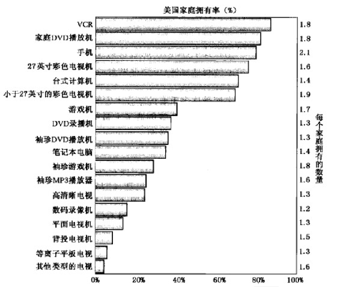

第2部分 洞察市场
----------------

第3章 收集信息和扫描环境

第4章 营销调研与需求预测

### 第3章 收集信息和扫描环境

本章将重点阐述以下问题：

-   1.现代营销信息系统的主要构成要素有哪些？

-   2.什么是有用的内部记录？

-   3.营销情报系统包括哪些内容？

-   4.有哪些方法可用来追踪和识别宏观环境中的机会？

-   5.宏观环境方面有哪些重要的新发展？

企业在编制和实施营销计划过程中会涉及一系列的营销决策。营销决策的制定既是一门艺术，也是一门科学。为了使营销决策的制定高瞻远瞩、科学可行，企业需要对反映发展趋势的宏观经济信息有所了解，也要对影响企业经营的微观信息进行全面分析和处理。所有的营销人员都应该了解，营销环境会不断地为企业带来新的机遇和新的威胁，因此持续地监控和适应外部市场环境对企业来说是十分重要的。

> 在首席执行官李·斯科特（Lee
> Scott）的领导下，沃尔玛公司（Wal-Mart）宣布斥资5亿美元用于可持续发展项目，以使沃尔玛变成"环境的良好伙伴"。在2005年11月的公司演讲中，斯科特宣誓在未来的3年里，公司车队的效率会提高25%，在未来的10年，效率要翻番；商店里的照明能源要减少30%；未来3年美国门店中的固体垃圾要减少25%。这个貌似不大的决策却使这个零售巨人发生了巨大的变化。通过减少其自由品牌Kid
> Connection玩具的额外包装，公司估计一年便会节省240万美元的运输成本、3800颗树和1万桶油。通过玉米（非石油）四种聚合物的产物中进行提炼，该公司相信能够节省800万加仑的汽油。对此，许多环境保护组织大为赞赏。但沃尔玛在工资增长率、雇员保健、性别歧视和本地竞争等方面的做法仍然面临工会组织和自由民主主义者的指责。在每一个领域，该公司已经通过一些改进来对此作出反应。

不只是沃尔玛公司在经营企业的过程中进行了这样的调整，事实上，每个行业都面临着自然环境的变化。在本章中，我们将讨论公司如何能够追踪这些变化，我们也会讨论一系列重要的宏观发展趋势。在第4章中，我们将回顾一下营销人员如何进行定制化的营销调研，从而解决具体的营销问题。

### 现代营销信息系统的构成

虽然组织中的每个管理者都需要了解外部环境，但识别外部市场变化则是营销人员的主要职责。由于营销人员具备了两项优势，因而更能胜任这份工作。这两项优势为：他们具有一整套搜集信息的专业方法；相对于组织中的其他管理者，他们能够投入更多的时间与顾客进行互动，并观察竞争对手和公司外部企业及其他组织的一些情况。

有些公司已经建立了营销信息系统，从而能够更好地向管理层提供最新的有关顾客购买欲望、购买偏好和购买行为的信息。

> 杜邦公司（DuPont）

> 为了发展涤纶（dacronpolyester）业务，杜邦公司委托一些营销人员探讨枕靠的使用习惯。枕靠是将枕头内加入一些填充物，并以Comford品牌销售。杜邦公司遇到的一个挑战是人们通常不愿丢弃旧枕头：37%的人把他们与枕头的关系描述成"一对老夫妻那样"，13%的人认为枕头是"童年的伙伴"。研究结果发现人们的枕靠使用行为可以分为几类：把几个枕头叠放（23%）、把枕头拍松软使用（20%）、把枕头折叠起来用（16%）、搂抱枕头（16%），把枕头压成一个能够舒服地枕靠的形状（10%）。女人更喜欢把枕头拍松软，男人更喜欢把枕头叠放。由于喜欢把枕头叠放着用的人多，杜邦公司更多地将枕头成对包装出售，同时推出软硬程度不同的枕头。

营销人员还必须收集更多的信息，了解不同国家的消费行为模式。例如，在西欧国家中，瑞士人消费的巧克力最多，希腊人吃奶酪最多，爱尔兰人喝茶最多，奥地利人抽烟最多。

然而，许多企业信息收集的技术与方法还不够成熟。许多公司没有营销调研部门，有些公司虽然有营销部门，但其工作只限于常规的预测、销售分析和偶尔的调查。许多经理抱怨不知道如何得到重要的信息，能得到的信息很多都用不上，而真正需要的信息又太少，重要信息来得太迟。只有能快速获得正确信息的公司才能获得竞争优势，因为这些公司能更好地选择市场、开发产品、实施营销计划。

每个公司都必须为营销经理组织和输送持续的信息流。营销信息系铳（marketing
information
system，MIS）由人员、设备和程序构成，这个系统对信息进行收集、分类、分析、评估和分发，为决策者提供所需的、及时的和精确的信息。一个营销系统依靠公司内部记录、营销情报活动和营销调研来运行。在此，我们讨论前两项内容，第三项将在下一章中讨论。

公司的营销信息系统应该提供不同部门管理人员认为他们需要的，也是他们真正需要的，并且符合经济效益的信息。公司可以设置内部营销信息系统委员会，委员会工作人员可以跨部门访问每一位营销经理，以发现他们的信息需求。表3.1所列出的一些问题可以在访问营销经理时作为参考。

表3.1 信息需求调查

-   1.你定期作哪些决策？
-   2.作这些决策时需要何种信息？
-   3.定期收到何种信息？
-   4.哪些类型的专项研究是你定期要求的？
-   5.哪些信息是你想得到但还未得到的？
-   6.你每天/每周/每月/每年想得到什么信息？
-   7.你想在杂志或贸易报道上看到什么样的信息？
-   8.你想持续地了解哪些主题的信息？
-   9.你想得到哪些数据资料分析方案？
-   10.对于目前的营销信息系统，最需要改进的四个项目是什么？

### 内部报告系统和营销情报系统    

营销经理依靠内部报告来获得订单、销售、价格、成本、库存水平、应收账款、应付账款等信息。通过分析这些信息，他们能够发现重要的市场机会和营销管理问题。

订单收款循环系统

内部报告系统的核心是订单收款循环系统（order-to-payment
cycle）。销售代表、经销商和顾客将订单送交公司，然后销售部门准备发货单，分送给各个部门。存货不足的产品项目请求延后交货；需装运的产品项目附上运单和账单，同时复印多份分送各部门。

今天的公司需要快速准确地执行这些步骤，因为顾客偏爱那些承诺能够及时交货的公司。越来越多的公司使用互联网和外部网来提高订单收款循环的速度、精确性和效率。思科在线连接（Cisco
Connection
Online）利用其在计算机网络行业的领先地位，与其所有供应商、制造商、顾客、分销商在线连接。通过减少传统的非计算机管理购物，降低库存水平，从而缩短了与供应商的付款周期。该程序使用的最初几年，思科就节省了2400万美元的材料费和5100万美元的用工成本。

销售信息系统

营销经理们需要对当前的销售进行及时和准确的报告。沃尔玛的销售数据库和库存数据库拥有每天、每一家店铺、每个顾客的有关每件商品的销售信息，并且每小时更新一次。例如：总部的信息技术（IT）人员在感恩节的第二天早上进入数据库并注意到一款节日特价的计算机显示器在东海岸销售低于预期。营销人员联系店铺并得知计算机和显示器没有摆放在一起，所以潜在购买者不清楚在优惠价格下会买到什么。营销人员会立刻电话通知全国各分店重新摆放当天的早上9点30分，公司数据库就显示出计算机的销量在增加。沃尔玛还在晚上给很多供应商下订单通知运货和换货，甚至委托一些供应商，如宝洁公司来管理它的库存。

善于利用cookies、储存个人浏览记录的公司，是进行目标营销的聪明用户。尽管有人认为大多数人为了保护隐私删除cookies，而数字调查的结果却与这种看法相反。2004年进行的调查显示，经常删除cookies的人有24%，而近期的调查证明只有8%的人经常删除cookies，24%的受访者说从不删除cookies。不仅消费者不删除cookies，而且一旦接受cookies，还希望得到定制化的能吸引他们的营销信息。

> 尤尼卡公司（Unica Corporation）

> 尤尼卡公司是马萨诸塞州林肯市的一家软件商，他们觉得顾客非常愿意接受公司向他们提供的基于cookies的信息。尤尼卡的高级营销总监安德鲁·哈利（Andrew
> Halley）说顾客不只是访问尤尼卡网站并注册，他们有特殊的需求并且正在寻找一个具有实力的卖家。"Cookies使得尤尼卡能更好地定位自己的营销沟通内容，比如电话跟踪访问消费者或者通过合适的方式像"网络研讨班"一样与消费者相会。

技术设备使销售信息系统发生了变革，使销售代表能够即时获得最新信息。过去，泰勒·梅德（Taylor
Made）高尔夫球公司的销售代表访问全国10000家分店中的任何一家商店，在手工填写新订单之前，都要花上两个小时清点高尔夫球杆的库存量。如今公司给销售代表配备了条形码读取器和互联网连接器的便携工具，销售代表们将产品上的条形码在便携工具上一照，库存清单就自动出来了。他们用省下来的那两个小时提高零售顾客的销售量，从而使生产率提高了20%。

公司必须仔细理解销售数据以避免得出错误结论。迈克尔·戴尔（Michael
Dell）讲过这样的例子："如果经销商的店里有三辆黄色野马牌（Mustang）轿车，但顾客想要的是一辆红色的轿车。销售人员可能精于推销，将黄色野马轿车卖了出去。这样返回给工厂的信号是顾客喜欢黄色野马轿车，而事实并非如此。"

数据库、数椐存储和数据挖掘

今天，公司将信息存储成数据库，如顾客数据库、产品数据库、销售人员数据库，并将不同数据库中的信息整合后进行更深入的分析。例如，顾客数据库包括每位顾客的姓名、地址、过去的交易记录甚至是人口统计信息与心理行为（活动、兴趣和观点）。公司并不向数据库中的所有顾客邮寄新商品目录单，进行"地毯式轰炸"，而是根据顾客最近购买的产品、购买次数和购买金额给不同的顾客打分，它将给那些得分最高的顾客邮寄商品目录。除了节省邮寄费用外，这种做法还经常得到两位数的回复率。

公司存储顾客数据，并使决策制定者很容易地使用这些数据资料。此外，公司雇用擅长使用统计方法的分析人员，挖掘数据价值，在那些被忽略的顾客群、新的顾客趋势和其他有用信息方面获取新的视角。通过数据挖掘，经理们能够把顾客信息与产品和销售人员信息相结合，从而能够对数据有更深刻的理解。例如，富国银行（Wells
Fargo）利用自身的技术，开发出一种新的分析能力来追踪和分析1000万个顾客的每一笔交易，无论是顾客通过自动柜员机、银行分支机构还是网络进行交易，这种技术都能够进行分析与处理。将交易数据和顾客提供的个人信息相结合，富国银行就可以设计出有针对性的产品，适应顾客生活的变化。使用结果表明，银行业中平均每个顾客购买2.2项产品，而富国银行的顾客则平均购买4项产品。其他许多公司也在使用这种新的、更为丰富的数据。参见"营销视野：深度挖掘"。

营销情报系统

内部报告系统为管理人员提供的是结果数据，而营销情报系统则为管理人员提供即时发生的数据。营销情报系统（marketing
intelligence
system）是经理使用的一整套程序和信息来源，用以获得有关营销环境发展变化的日常信息。营销经理通过几种渠道收集情报：阅读书籍、报刊和同业出版物，与顾客、供应商、分销商交谈，通过网络讨论群、电子邮件和博客掌握"社会媒体"，或是与其他经理开会等等。

一个公司可以采取以下几个步骤提高营销情报的质量：

 

-   训练和鼓励销售人员现场观察和及时报告最新进展。公司必须向销售人员"推销"一个观念：作为情报来源，销售人员是最重要的。Grace
    Performance化学品公司是W.R格雷斯公司（W.R.Grace）的一个分公司，它为建筑业和包装业提供原料和化学品。格雷斯销售代表奉命观察顾客对他们产品的创新用法，从而为新产品研发提供建议。比如，营销人员观察到一些顾客用格雷斯公司的防水材料来做汽车的隔音材料、修补靴子和帐篷。这一信息为后来七种新产品带来了创意，从而给公司带来了数百万的销售额。

 

-   激励分销商、零售商和其他中间商提供重要的情报。许多公司雇用专业人员收集营销情报。服务业和零售业经常派"神秘顾客"去自己的企业检查店面的卫生、产品质量、雇员对待顾客的态度。麦当劳的"神秘顾客"发现全国麦当劳快餐店中，只有46%的快餐店达到了内部服务速度标准，这迫使麦当劳公司重新考虑工作流程，并且进行培训。使用"神秘顾客"的医疗机构说，"神秘顾客"提供的报告让他们在患者体验环节上作了很多改变，包括改进对候诊时间的估计，更好地解释医疗程序，在候诊室用电视播放能帮助患者减压的节目。

 

-   使用外部网络。公司可以通过与外部联网来了解竞争对手。包括购买竞争对手的产品、参加展销会，阅读竞争对手出版的报告、出席股东会议，与雇员、经销商、分销商、供应商、运输代理商交谈；收集竞争对手的广告，在媒体上寻找关于竞争对手的报道等。软件开发商Cognos创造了一种内部网站叫做"街霸"，在这个网站上，该公司3000名员工可以挖掘竞争对手的信息并且可以获得奖励。

当然，在互联网发明以前，有时候营销人员必须去现场了解竞争对手情况。从事石油和天然气的企业家T·伯尼·皮金斯（T.Boone
Pickens）就是这么做的。在讲述他是如何了解竞争对手的钻井活动的时候，他回忆道："我们派人在距离竞争对手钻井平台半英里的地方用野外望远镜观察。对手不高兴却没有办法。我们派去蹲点的人看到接头和钻杆，就会计下数量，每个钻杆接头有30英尺长。把所有接头数加起来，就能推算出他们钻的油井有多深。"皮金斯知道井越深，对手将石油或天然气输送到地面的成本就越高，这一信息马上就能给他带来竞争优势。

现在的公司仍然可以从现场得到有用的信息。Fuld是剑桥的一家专门从事竞争情报收集的咨询公司。有一次在亚洲为一家美国纺织品公司进行调研时，在一个现场捕捉到了一头山羊在吃草的照片。这头羊的出现，证明了传言中竞争对手在印度尼西亚的新工厂其实并不存在。有了这个信息，美国纺织品公司就可以调整它的竞争防御策略。虽然竞争情报的获得必需是合法和道德的，但据报道，宝洁公司曾因雇用了一些外部间谍作为公司的情报团队，以不道德的手法，如"垃圾搜寻"（dumpster
driving），去了解联合利华的护发产品，而向联合利华公司支付了几百万美元达成和解。

\@营销视野：深度挖掘

随着公司获得的信息越来越多，数据收集、数据分析，并从中获得启发的能力对企业来说亦变得尤为重要。以下是几个著名公司的实例：

百思买（Best
Buy）公司安装了一个存储量超过15000G的数据库，其中记录了7500万个家庭7年当中的每个顾客每笔交易和互动的信息，从电话呼叫和网络订货，到送货和现金返回，也包括核对地址，然后公司利用复杂的算法将超过3/4的顾客，即1亿名顾客进行组合与分类。百思买将核心顾客分别归入不同档案，例如，"Buzz"（代表年轻的技术发烧友（住在郊区的中产家庭主妇）、"Barry"（富裕的专业人士）和"Ray"（居家男人）。公司还使用顾客终身价值模型来测量交易的获利能力以及能提高或降低关系价值的顾客行为因素。对顾客的充分了解，使得百思买能够运用精准营销和顾客发起的激励项目，从而获取更好的顾客响应率。

一些公司利用数据库信息来进行媒体促销。为了评估不同广告媒体的效率，一家领先的产业集团Interactive
Advertising
Bureau对30个蓝筹公司进行了一项为期18个月的测验。分析了顾客行为后，研究表明如果福特汽车公司将网络预算从2.5%增加到6%，便可以多卖出价值6.25亿美元的卡车。福特得知这一结果后，便在2005年8月宣布将其10亿美元广告预算的30%针对个体顾客进行投放，其中一半为网络广告。

获取网上顾客行为能够得到许多创意。想获得微软免费的Hotmail电子邮箱账户的顾客，需要提供姓名、年龄、性别、邮政编码。微软公司将这些信息，如所观察到的网上行为和顾客所住的地区特征结合在一起，来帮助广告人员更好地了解是否应该联系该顾客以及在何时联系、如何联系。虽然微软公司必须小心保护这些顾客的隐私------公司声称不会购买个人的收入记录，但公司仍能提供广告客户的目标市场信息。例如，微软帮助一个Dinner
To
Go公司的加盟商瞄准30\~40岁的有孩子的职业女性，使广告在上午10点前播出，这时她们正在筹划晚餐。

 

-   建立一个顾客咨询小组。小组可以包括顾客代表、公司最大的客户、最坦诚或精明的顾客。很多商学院都有由校友和招聘人员组成的咨询小组，以提供关于课程的有用的反馈信息。
-   利用政府数据资源。根据2000年的美国人口统计数据，使我们对全国281421906人口的变动、人口统计群体、地区性移民和家庭结构变化有了一个更深层次的了解。负责人口普查的公司（Claritas市场研究公司）综合参考了普查统计数字、消费者调查以及他们为诸如宝洁、道琼斯和福特汽车公司等客户作的基层调查，将提供了电话和住址的顾客信息列出来，Claritas就可以帮助客户选择和购买特定群体的邮寄名单。
-   从外界供应商购买信息。著名的信息供应商有A.C.尼尔森（A.C.Nielsen）公司和信息资源公司（Information
    Resources）（参见表3.2）。这些调研公司收集顾客样本群数据比公司自己收集数据的成本要小得多。Biz360公司已经将7000多个来源的信息数据库进行了专门化的细分，细分的依据是平面媒体、广播电视的特点以及网络媒体的覆盖面，其中网络媒体包括博客、电子布告板。
-   利用网上顾客反馈系统来收集竞争情报。顾客可以通过在线顾客反馈系统，讨论论坛、聊天室和博客等传递顾客对产品或供应商的评价，并将这些信息散布给许多其他潜在购买者，也会散布给正在搜集竞争对手信息的营销人员。在聊天室里，用户可以分享经验与感受，但是聊天室的结构特点不便于营销人员收集有用的信息。为解决这一向题，一些公司采用了结构化的系统，比如顾客讨论板或顾客评论区。（"营销备忘：点击竞争"，总结了主要网络反馈系统的分类）

> Glaxo Smith Kline PLC公司

> Glaxo Smith Kline
> PLC以及卡夫（Kraft）、惠普（Hewlett-Packard）正在学习如何使用因特网来驾驭顾客投入。他们并不是独自进行的，而是与沟通空间公司（Communispace
> Corp.）组成团队，后者组织私人网络社区。例如，Glaxo赞助一个致力于减肥的网络社区，通过这种形式收集到的信息比焦点小组访谈方法得到的更多。焦点小组访谈在营销中应用范围很广，从如何包装第一款减肥药到店铺内营销都会利用焦点小组访谈方法提供信息。而这里最重要的是，网络社区的成员们向Glaxo公司提供了他们自己减肥和节食的深刻体会。

表3.2 二手商业资料来源

 
A.C.尼尔森（A.C.Nielsen）：提供由零售店所出售的产品与品牌资料（零售指数服务）、超级市场扫描资料（扫描追踪1、电视收视资料（媒体研究服务）、杂志发行资料（新资料服务）等。

MRCA信息服务：提供每个家庭每周购买消费品资料（全国消费固定样本调查）及家庭食品消费资料（全国普查）。
.

信息资源公司（Information
Resources）：提供超级市场扫描资料及超级市场促销活动带来的影响
的相关资料（促销扫描）。

SAMI/Burke公司：提供选择性市场区域仓库提货报告（SAMI报告）及超级市场扫描资料。

Simmons市场调查机构（MRB集团）：提供有关电视市场、运动用品、专利药品等年度报告，并按性别、收入、年龄和品牌偏好区分的人口统计资料（以选择性市场和媒体来接触）。

其他出售资料的商业研究机构包括信息流通审查局、Arbitron、审查与调查机构、邓百氏、全国家庭意见调查机构
、标准比例与资料服务以及Starch。

\@营销备忘

营销人员在浏览网上信息时可以通过四种渠道来寻找有关竞争对手产品优点与缺点的相关信息，并筛选出对产品、服务与供应商的相关评论与整体绩效评价等信息。

独立的顾客产品与服务评价论坛。包括许多著名网站：Epinions.com、Retail.com、Consumerreview.com以及azrate.com。Bizrate.com是一个顾客反馈网络，收集数以百万的来源，拥有130万成员，这些成员自愿给产品评定级别和反馈来帮助其他顾客，回答店铺服务质量调查，使得BizRate.com能够直接从购买某产品的顾客那里收集反馈意见。

分销商和销售人员的反馈意见网站。这些网站提供对产品和服务正面和反面的意见。例如，在亚马逊（Amazon.com），购买者、读者、编辑和其他人士可以查看网上所有产品评论，尤其是书籍的评论，这样就提供给他们一个相互交流的机会。Eance.com是一个网上专业服务提供者，它使承包商能描述他们对转包商的满意程度和他们的体验细节。

顾客意见网站。这种类型的网站把重心放在金融服务和高科技产品上，这些都需要专业知识。Zdnet.com是一个在线的科技产品顾问，提供关于产品方便性、特点、稳定性方面的顾客评价，同时提供专家意见。这种网站的好处是产品的提供者可以比较来自专家和顾客的不同意见。

顾客抱怨网站。这个论坛主要是为了那些不满意的顾客设计的。例如，Panelteedback.com让顾客讲述对某个特定产品不满的经历。另一个网站，Complaints.com是为那些对特定公司或者其提供的产品或服务受挫折的顾客提供的。

公共博客。现存博客数量有几千万，并且还在增长。诸如Buzz
Metrics、Umbria和其他咨询公司分析博客和社会网络来给企业提供对顾客情绪的视角：制药业在听说某种药物有问题的时候，想知道患者有哪些疑问；汽车公司想找到更好的发现产品缺陷并予以解决的方法。

有些公司会将营销情报在公司内进行传播与分发。员工们会浏览互联网、主要发行刊物与相关新闻摘要，并将新闻报道传送给营销经理。当营销情报与决策制定过程中的主要使用者能够紧密合作时，竞争情报能起到更好的作用。相反，如果公司认为情报功能是独立的只是向上级提供报告，其他部门很少参与，这样情报所发挥的作用就比较低。

### 分析宏观环境

成功的公司能从宏观环境中识别出尚未满足的需要和趋势，并且能够作出相应的反应从而盈利。

需要和趋势

有事业心的个人和公司都会不断进行创新以解决消费者未被满足的需要。联邦快递（FedEx）创造了第二天送达的方法来满足需要。国际著名服装品牌Dockers的创新，是为了满足婴儿潮时期出生者想要合身的、能满足心理和生理舒适的裤子。我们需要区分时尚、趋势和大趋势。时尚（fad）是"不可预测的、短暂的和没有社会、经济及政治意义的"。一个公司也许可以抓住一些时尚并且赚钱，诸如豆娃娃（Beanie
Babies）、Furby小精灵和Tickle Me
Elmo娃娃玩具等，但这里重要的是运气和时机。

趋势（trend）是具有某些持久性的事件的演进或方向。趋势比时尚更具有可预见性，也更持久。趋势能够展示未来的雏形并且提供很多机会。例如，重视体态苗条和健康的人的百分比正逐年稳步上升，特别是30岁以下的人、年轻女性、超重人群和住在西部的人。

大趋势（mega
trend）是"社会、经济、政治和技术的大变化，它的形成速度很慢，但一旦形成，将影响7\~10年甚至更长。"你可以通过"营销备忘：形成商业景致的趋势"来了解今后10年左右会有所作为的方向。

新的市场机会也不能保证成功，即使它在技术上是可行的。例如，一些公司销售便携式电子书或者e-book，但有兴趣在电脑屏幕上读书或者愿意按定价付款的人很少。这就是为什么需要通过市场调研以确定某个市场机会的盈利潜力的原因。

为帮助营销人员通过预测文化变迁来确定营销新机会或新威胁，有些企业开始提供社会文化预测。Yankelovich
Monitor公司从1971年起，每年在世界各地访问2500人，并对35种社会倾向，如"反巨大化"、"神秘主义"、"享受当下"、"不刻意追求拥有"、"感官亨受"进行追踪。

\@营销备忘：形成商业景致的趋势

管理咨询公司麦肯锡（McKinsey）认为宏观经济因素、环境和社会事务以及商业和工业发展在未来将深刻地改变商业景致。

宏观经济趋势

-   1.经济活动的中心将被深刻改变，不论是全球范围还是地区范围。今天，亚洲（日本除外）占世界GDP的13%，西欧占30%以上，而在20年内，这两个地区的GDP会接近。比如，某些行业和职能，如制造业和信息服务的变化会更加引人注目。

-   2.公共部门活动开始，使生产率提高成为重点。发达国家前所未有的老龄人口需要公共部门具备更高的效率和创造性。许多新兴市场的政府也必须决定为需要政府提供诸如医疗和养老等服务的人提供什么水平的社会服务。私有部门将广泛地参与并提供社会服务。

-   3.消费者本身的变化将显著改变和扩展消费需求。未来10年，新兴市场中将有近10亿新消费者进入全球市场，随着经济的发展，这些消费者的年家庭收入将突破5000美元，对人们开始购买任何商品而言，这是一个不可忽视的现象。发达国家的消费者细分市场之间也会发生深刻改变。例如，到2015年，美国拉丁裔人口的购买能力将会相当于全部中国消费者购买能力的60%。

社会和环境趋势

-   4.技术性的连接将改变人们生活和互动的方式。技术使得人们行为的改变比技术本身更具有变革性。社区生活和感情生活的形式正在改变。2005年美国新婚夫妇中有12%是在网上认识的，每年有超过20亿人口使用网络电话，发送9兆字节的电子邮件。每天10亿次的谷歌（Google）搜索中有一半以上使用的不是英语。

-   5.人才争夺的变化。向知识密集型产业的转化凸显了受过良好培训的人才的重要性和稀缺性。发展中国家有3300万大学毕业生，是发达国家的2倍。对很多公司和政府来说，全球劳动力和人才战略将和全球采购和制造业战略一样重要。

-   6.大企业的作用和行为将受到日益严密的审查。现有全球思维方式的信条，例如，股东价值、自由贸易、知识产权和利润再投资等，在很多国家不被理解，更不用说被接受。商业领袖需要探讨并有力地阐明企业在知识、经济和社会方面对社会福利应当作出大量贡献。

-   7.对自然资源需求的增长将给环境带来压力。自然资源的使用达到前所未有的程度。对石油的需求在未来20年将增长50%，如果不能发现大量新油田或者彻底的能源革新，石油供应将不能满足需求。我们最缺乏的自然资源之一------大气资源，需要大幅度改变人类的行为以避免其枯竭的危险。

商业和行业趋势

-   8.新的全球商业结构正在兴起。将出现一个杠铃形的结构，少数几个巨头在最上面，中部狭窄，底部为繁荣的小企业。同样，由于供应商、生产商和顾客形成的经济体系（ecosystems）的内部联系加强，公司界限正在变得模糊。

-   9.管理将从艺术变成科学。靠"勇气和本能"（gut
    instinct）进行管理的日子将一去不复返。今天的商业领袖利用计算机技术的决策技巧，使用非常尖端的软件来管理企业。科学的管理成为企业参与游戏的先决条件。

-   10.无处不在的数据信息正在改变知识的经济意义。促进知识发展的开放的研究方法逐渐一体化，而不是个体发展，并且对改革有影响。知识产业自身也在发展，如从1990年到2004年，世界范围内的专利申请每年增加20%。

确认主要的环境因素

公司及供应商、中间商、顾客、竞争者和公众，都在一个充满影响因素和发展趋势的宏观环境中运作，这些因素和趋势在世界范围内创造机会，也带来威胁。这些因素是"不可控制的"，但公司必须对其进行监视并采取相应的行动。

新世纪的到来带来了一系列的挑战：股票市场泡沫的破裂影响到储蓄、投资及养老金；失业率不断上升；公司丑闻不断；当然还有正在升级的恐怖主义。这些戏剧化的事件还伴随着其他已经存在的长期潮流，这些潮流已经在全球范围内引起了很大影响。在2005年，成本更低的晶体管的制造数量高于粮食的生产量，美国博客的读者量相当于报纸读者量的20%。不加节制的石油消费量预期到2030年会上升50%。

随着全球面貌的迅速变化，一个公司必须掌控6种主要的因素：人口、经济、社会文化、自然环境、技术、政治法律因素。虽然这些因素有一定的独立性，但营销人员必须注意它们之间的交互作用，因为它们会导致新机会与新威胁。例如，爆炸式人口增长（人口）导致了资源在更大程度上的消耗和污染（自然环境），这使得消费者要求进一步的法律保护（政治法律），从而刺激了新技术和产品（技术），如果人们承担得起（经济因素），它又会改变人们的观念和行为（社会文化）。"突破营销：谷歌"讲述的就是该公司如何成功地在新的营销环境中盈利。

\@营销突破：谷歌

谷歌（Google）由两位斯坦福大学的博士在1998年创办。谷歌这一名字来自"google"，代表一个由"1"后面加上100个"0"组成的数字------表示网上大量的数据，代表公司所能给用户提供的帮助。谷歌的公司使命是："将全世界的信息组织起来，使其能被普遍地获得和使用。"

公司通过聚焦商业和不断的创新成为搜索引擎市场的领袖。由于谷歌是网络用户在线搜索的首选，吸引了很多网络广告商。这些广告商通过购买被叫做"搜索广告"的产品提高了谷歌的利润。搜索广告出现谷歌搜索结果旁边的小框里，通常显示为文字。只有当用户点击广告时，广告商才需付钱。谷歌的搜索广告叫做AdWards，销售带有使用关键词搜索结果的页面空间。谷歌将这些关键广告拍卖，位置最靠前的关键词和页面位置的价格最高，只有网络用户点击这些广告时，广告商才付钱。

除了提供这些网上"不动产"外，谷歌给广告商提供不同的方法来更好锁定广告目标市场以及更好地了解营销活动的效果，增加谷歌广告的价值。Google
Analytics让广告商免费使用，提供顾客报告或自动结果（dashboard，详细描述网络用户是怎样找到网址的、对广告的看法、点击哪个广告、在网上的行为、创造了多少流量）。Dashboard
Google的客户Discount
Tire发现顾客访问他们网站时碰到了问题，中途放弃了购买计划。在修改网站并更新搜索关键词后，一周内Discount
Tire测量到了14%的销售增长。

谷歌的配置数据能力，能够每分钟更新网络营销资源，持续地掌控和优化预算。谷歌把这个工具叫做"营销资产管理"，涵义是广告业应该像管理资产组合那样，在不同市场条件下，在网上的某时某地管理某些资源，在另一时间地点管理其他资源。与其跟进一项数月前开发的营销计划，公司可以使用推广当中得到的实时数据来更好地回应市场，从而改进营销活动的效果。

谷歌为网络用户增加了额外的服务和特性，提高了搜索能力。这些服务包括Google
Maps（谷歌地图），Google Local，Google
Finance（谷歌财经），Gmail（---个谷歌的电子邮件服务）和Google
Video（2006年用1.65亿美元收购视频网站YouTube.com）。这些措施通过销售公司自己创造的能更好地锁定顾客的广告空间，使谷歌得到了成长。

### 人文环境

很少有公司因为人口的突然发展而受到冲击。例如，Singer公司应该已经知道缝纫机业务的发展将逐年受到家庭结构缩小和工作女性的比例上升的威胁，但公司的反应仍然是缓慢的。

首先引起营销人员最感兴趣的环境因素是人口（population），因为市场是由人所组成的。营销人员尤其感兴趣的是不同城市、地区和国家的人口数的多寡和成长率；年龄分布和种族组合、教育水平、家庭结构、地区特征和迁移。

世界人口增长

世界人口正在爆炸性增长：2000年世界人口是61亿，2025年将达到79亿。下面是一个有趣的描述。

如果世界只是一个有1000人居住的村庄，其中有520位女性，480位男性，330个孩子，60位超过65岁的考人，10个大学生，335名不识字的成年人。该村庄有52个北美人，55个俄罗斯人，84个拉美人，95个东欧和西欧人，124个非洲人，584个亚洲人。他们之间的沟通非常困难。因为有165人讲汉语，86人讲英语，83人讲北印度语或乌尔都语，64人讲西班牙语，58人讲俄语，37人讲阿位伯语，余者则只会说200种其他语种的一种。另外，有329个基督教徒，178个穆斯林，132个印度教教徒，62个佛教徒，3个犹太教徒，167个为非宗教徒，45个无神论者，剩下的84个则为其他的宗教教徒。

人口爆炸已经成为人们所关注的问题。而且，人口增长率最高的地区和国家没有能力来承受高增长。世界一些欠发达地区人口占世界人口76%，以每年2%的速度增长，而发达国家和地区的人口仅以每年0.6%的比例递增。在发展中国家，由于现代医学的发展使得死亡率下降，但出生率却一直相当稳定。这些发展中国家能够提高人民的生活水平，但要为儿童提供食物、衣服和教育，显然还不能完全实现。

人口爆炸对商业有很大的影响。除非人们有足够的购买力，否则人口增长并不意味着市场的扩大。虽然如此，公司如果能够仔细地分析市场就能找到巨大的机会。

人口年龄结构

一个国家的人口变化反映在该国的年龄结构上。一个极端的例子便是墨西哥，它的人口年结构非常年轻且人口增长率也很高。另一个极端的例子是日本，它是世界上人口平均年龄最大的国家之一。在墨西哥，对牛奶、尿布、学校用品和玩具等产品的需求大于日本对这些产品的需求。总体来说，整个世界是老龄化的趋势。到2005年，60岁或60岁以上的人口将超过5岁以下的人口数，儿童比例大于老年人比例的情况已经很难看到了。

营销人员一般将人口按年龄分成六个群：学龄前儿童、学龄儿童、青少年、20~40岁的年轻人、40~65岁的中年成年人、65岁及以上的老年人。有些营销人员喜欢关注同期群（cohorts）。同期群是在同一个时间段内出生并经历同样事件的个人所组成的群体。当他们长成大人时，他们所经历的"关键时刻"，能够影响他们一生，包括他们的价值观、偏好和购买行为。"营销视野：陪伴终生"讲述了美国市场中的群体特征。

\@营销视野：陪伴终生

舍韦（Schewe）和梅雷迪思（Meredith）基于"关键时刻"的理论设计与开发了代际同期群的人口群体细分方案。"关键时刻"是指一个人成熟期（通常是17\~24岁）的经历，这个经历会形成人的核心价值观念，这个核心价值观会一生与其同在，陪伴终生。舍韦和梅雷迪思根据这个划分方案将美国成年人划分为7个不同的同期群，每个同期群都有自己唯一的价值结构、人口统计特征和标记。

大萧条阶段同期群：出生于1912年到1921年之间的人群，在2008年，这些人的年龄在87岁到96岁之间。这一人数骤减的人群的成熟期经历了经济大萧条和高失业率的阶段。金融安全感是当他们处于成熟阶段时最为缺乏的。他们现在已不再是劳动力，但对今天的管理活动还有深远的影响。

第二次世界大战阶段同期群：第二次世界大战阶段同期群是出生于1922年到1927年之间的人群，在2008年，这些人的年龄在81岁到86岁之间。第二次世界大战阶段同期群对于货物紧缺有目共睹c在他们的成熟阶段经历了抵御共同的外敌，他们具有很强的团队意识和爱国情操。

战后阶段同期群：战后阶段同期群是出生于1928年至1945年之间的人群。在2008年，这些人的年龄在63岁到80岁之间。尽管经历了麦凯锡主义和朝鲜战争，这部分人仍然经历了一个经济快速增长和社会较为平稳的时期。他们是中产阶级的重要力堡，安全感和稳定感扎根于他们的意识中，他们也希望这种繁荣时期能够永远地持续下去。

婴儿潮初期同期群：这个同期群出生于1946年到1954年之间，在2008年，这些人的年龄在54岁到62岁之间。约翰·F·肯尼迪的逝世对这部分人的影响很大。在他们的成熟阶段，他们经历了越南战争，也经历了人类登陆月球这一事件。他们拥护各种慈善事业（绿色和平组织、人权、妇女权利），同时他们的内心也满是享乐和放纵（大麻、自由恋爱、好色）。

婴儿潮后期同期群：这个同期群出生于1955年至1965年之间，在2008年，这些人的年龄会在43岁到53岁之间。在他们成熟阶段，他们见证了越南战争的失败、水门事件和尼克松的下台。石油禁运、通货膨胀及标准普尔指数下降超过30%等，使得这部分人对未来的经济态度没有婴儿潮前期出生的同期群乐观。

X一代阶段同期群：这个同期群出生于1966年至1976年之间，在2008年，这些人的年龄在32岁到42岁之间。这个阶段的大部分人都有很强的独立性或者经历过父母离异。他们晚婚晚育，也不是很重视承诺。与其他时代的人不同，这部分人身处的文化氛围更多元化，比起工作来更注重个人生活。这部人所表现出来的企业家精神也是其他种同期群不能比拟的。

N时代同期群：这个同期群是1977年之后出生的人，在2008年，这些人的年龄在31岁及以下。互联网的发展对这一代的影响极大，他们也是接下来20年社会的主流。尽管还在形成阶段，但是他们的核心观念结构还是和X一代的人不同。他们更理想化也关心社会活动，但不愤世嫉俗，关注自身利益，没有许多X一代人群的思维定势。

种族和其他市场

不同的国家的族裔组成也存在很大差异。一个极端的例子是日本。在日本几乎每个人都是日本裔；而美国则代表了另一个极端的例子，美国拥有几乎所有国家的族裔。

根据美国2000年的人口统计，2.672亿美国人中72%是白人，13%是非洲裔，拉丁裔为11%，拉丁裔人口增长很快，其中又以墨西哥裔为最多（5.4%），依次为波多黎各裔（1.1%）和古巴裔（0.4%）。到2020年，拉丁裔预计会达到总人口的18.9%。亚裔占美国人口总数的3.8%，其中中国人最多，其次是菲律宾人、日本人、印度人和韩国人。在美国的拉丁裔和亚裔消费者主要集中在远西部和南部各州。此外，在美国还有近2500万人（约占总人口的9%）是非美国出生的。

一个经常会被提及的大趋势是拉丁裔人口占总人口比例的增加，它代表了这个国家的重要变迁。在过去的10年中，拉丁裔新工人占新工人总数的一半，而且会在两代人的时间里再上升25%。虽然拉丁裔人的家庭收入不高，但是他们的购买力上升迅速。可支配收入是其他人口收入增速的两倍，为7600亿美元。从美国人吃的食物到穿的衣服，从所听的音乐到所开的车，拉丁裔人对美国消费市场都有着巨大的影响。

企业都在努力提高产品和营销的水平，以满足这一发展最为迅速、影响力最为巨大的消费者群体的需要。西班牙的龙头媒体Univision称70%的西班牙观众更喜欢买用西班牙语做广告的产品。锁定拉丁裔群体也影响实际交流的信息。费雪（Fisher-Price）玩具公司意识到许多拉丁裔的母亲们不熟悉他们的品牌，将原来突出传统的广告进行了改变，将主题改为母亲和孩子使用该公司的玩具玩耍时的喜悦。

> MTVTr3s

> 取代全西班牙语频道MTV en
> Espanol之后，MTVTr3s把注意力放在12岁到34岁之间的拉丁裔身上，并希望通过有线电视、卫星传播、无线广播等手段将节目传播到1500万个家庭。根据市场调查，尽管出生在美国的拉丁裔儿童只说英语，他们对自己的西班牙血统仍然感到骄傲和特别，于是，MTV
> Tr3s所播出的节目用英语和西班牙语轮番播出。在MTVTr3s上，主持人混合使用英语和西班牙语，节目会安排拉丁裔歌手吹牛老爹（Daddy
> Yankiee）和白人歌手贾斯汀·蒂姆布雷克（Justin
> Timberlake）同台出现。该台的观众不看流行的《帮你改装车》节目，而是看里面谈的都是底盘低、能上下震动的车和有阿兹特科人以及瓜达鲁佩圣母（Virgin
> of Guadalupe）形象的汽车油漆工作。

几家食品、服装及家具公司已将产品及宣传指向一个或多个少数族裔。但营销人员们必须注意不能过度推广。同一族裔内部的顾客也各不相同。"其实并不存在一个亚洲市场"，格雷格·麦卡本塔（Greg
Macabenta）说，他的少数族裔广告代理商专攻菲律宾裔市场。麦卡本塔强调五个美国亚裔族群都有各自独特的市场特点：说不同的语言，吃不同的口味，具有不同的信仰，拥有不同的民族文化。

非洲裔市场也是如此，但这些不同的市场受经济期盼和经济成就的影响会大于受文化的影响。例如，在2005年由Yankelovich做的一项跨文化营销研究显示，可以将非洲裔美国人市场分为六个社会行为细分市场：模仿者（Emulators
Seekens）、成就者（Reachers）、奋斗者（Attainers）、精英（Elites）和保守者（Conservers）。其中，人数最多的且影响力最大的是成就者（24%）和奋斗者（27%），每一类有各自的需求，成就者年龄稍大，40岁左右，慢悠悠地追求着他们的美国梦。通常，他们是单亲父母，要照顾长辈，收入处于中等水平，年收入约为2.8万美元，基本都将钱花在刀刃上。奋斗者对自己定位更准，对未来有稳定的目标。他们的年收入大约是5.5万美元，他们需要想法和信息来提高生活质量。

除了按民族和种族划分的市场外，还有其他多样化的市场。超过5000万的美国消费者是残疾人，他们的存在为快递公司（如Peapod）和许多医疗机构创造了市场。

教育人口群体

任何社会的人口都可以按教育水平分为五种：文盲、高中肄业、高中或专科毕业、本科及本科以上学位。在世界7.85亿文盲人口中，有2/3存在于8个国家中（印度、中国、孟加拉国、巴基斯坦、尼日利亚、埃塞俄比亚、印度尼西亚及埃及），其中妇女占2/3。美国是世界上受教育人口比例最高的国家之一，约占36%，在美国有大量的受过教育的群体，这使得对高质量的书籍、杂志、旅行及技能书籍的需求不断增加。

家庭类型

"传统家庭"是由丈夫、妻子和孩子（有时包括祖父母）组成的。但到2010年，只有1/5的美国家庭将会由一个有不满18岁的孩子和已婚夫妇的三口之家组成。而其他的家庭类型有单身家庭（27%）、单亲家庭（8%）、丁克家庭和空巢家庭（32%）、有名无实的家庭（5%）及其他类型的家庭（8%）。

越来越多的人选择离婚或分居、不婚、晚婚或结婚但不要孩子。每种家庭类型都有自己的需求和购买习惯，例如，SSWD（独身、分居、丧偶、离异）群体对较小的公寓、便宜的小型家用电器、家具和家居用品、小包装食品具有需求。如乔治·弗里曼公司（George
Foreman）生产的烤炉，便是将目标顾客定义为单身或注重产品方便性的群体，因而获得很大成功。

营销人员应当考虑非传统家庭的特殊需要，目前非传统家庭数量的增速远远高于传统家庭。据学术界和营销界专家估计，同性恋人口占美国人口的4%\~8%，在城市中比例更高。与普通的美国消费者相比，同性恋者中从事专业工作的人数比例是普通人的10倍，拥有度假别墅人数的比例是普通人的2倍，拥有笔记本电脑的人数比例是普通人的8倍，拥有股票的人数比例是普通人的2倍。诸如Abosolut、美国运通（American
Express）、宜家（IKEA）、宝洁（Procter
Gamble）和斯巴鲁（Subaru）都认识到了同性恋市场在整个非传统家庭市场中的强大潜力。

不过，聚焦于同性恋市场或最近被锁定的"都市中性美男"（metro
sexual）（有着同性恋购物方式的异性恋）的营销人员可能与其他男性市场失之交臂。例如，数百万的生育高峰期出生的已为人父者比他们的父辈或祖父辈有更多的购物欲望，他们结婚更晚，更多地参与育儿。例如，当今天许多推婴儿车的父亲不想让人看见他推着过去年代装饰得过于花哨的婴儿车。于是敏感的婴儿车制造商便设计了时髦的配有小型摩托车轮胎的婴儿车。高端吸尘器公司Dyson试图用广告吸引书呆子型爸爸们，其重点诉求是革命性的技术。在Dyson进入美国市场之前，男人跟吸尘器的销售根本没关系，而现在Dyson公司40%的顾客却是男士。

人口的地理迁移

现在是国内、国际人口大量迁移的时代。在20世纪90年代，由于中小城市吸引了大批的城市"难民"，美国经历了从都市到乡村的人口回流。但由于高出生率、低死亡率和外国移民的快速增长，21世纪的城市市场再次增长迅速。

营销人员应当注意消费者向哪里聚集。2000年的人口普查资料显示，5岁以上人口（1.2亿）中近1/2在1995年到2000年间至少搬过一次家。对各州的分析清楚地显示，人口从中西部和东北部向阳光地带州移动。从弗吉尼亚州到佛罗里达和西部阳光地带各州，包括得克萨斯、内华达、亚利桑那。这些"热门"地区吸引了更多的迁移者。由于人口向阳光地带州迁移，导致御寒服装及家用暖气设备的需求下降，反之对空调的需求上升。纽约、芝加哥、旧金山这些大城市不仅消费大部分昂贵的皮草、香水、旅行箱和艺术品；歌剧、芭蕾舞和其他艺术形式也受到欢迎。

在郊区，人们的生活比较休闲，喜爱户外活动，与邻居之间来往较多，收入较高，是较年轻的家庭结构。他们购买较多的客货两用车、家庭工具设备、户外家具、除草和园艺工具和野餐器具等。下面是地区之间的差异：西雅图居民人均购买牙刷比美国其他城市居民要多，盐湖城人消费更多糖块，新奥尔良人食用更多番茄酱，迈阿密人饮用更多的西梅汁。近4000万的美国人借助各种电子设备在家工作，如电脑、手机、传真机和掌上电脑。

### 其他宏观环境

其他宏观环境因素也深刻影响着营销人员的命运。在此，我们探讨经济、社会文化、自然、技术和政治法律环境的发展。

经济环境

实际经济购买力取决于目前收入、价格、储蓄、负债及信贷。营销人员必须密切注意与公司业务有紧密关联的收入与消费者支出模式中的主要变化趋势，特别是高收入、对价格敏感的消费者。

收入分配

产业结构有四种类型：自给自足的经济，如巴布亚新几内亚，对营销人员几乎没有任何市场机会；原料出口型经济，如刚果共和国（铜）和沙特阿拉伯（石油），这些国家是设备、工具、消费品和专为富人服务的奢侈品市场；工业化进程中的经济，如印度、埃及和菲律宾，新的富有阶级、增长中的中产阶级都需要某些新产品；后工业化经济，如西欧一些国家，是许多产品的市场。

营销人员按收入情况将各个国家分为五种类型：（1）收入极低；（2）多数人的收入低；（3）极低与极高收入同时存在；（4）低、中、高收入同时存在；（5）大多数人属于中等收入。假设兰博基尼（Lamborghinis）为每辆价值15万美元的汽车寻找市场，在类型（1）和类型（2）国家的市场机会是极小的。兰博基尼汽车的最大出口市场是属于收入类型（3）的葡萄牙，虽然葡萄牙是西欧最穷的国家，但那里却有足够富裕的家庭买得起这种汽车。

美国过去30年中，富人变得更富有，中产阶级萎缩，穷人仍然贫穷。在1973年到1999年间，美国家庭收入最高的5%的人，收入增长了65%；而中等家庭收入仅上升了11%。这种情况使美国市场两极分化：富裕家庭购买昂贵的物品，而工人阶级却精打细算到折扣商店和厂家零售点购物，选择廉价商店品牌。

提供中档商品的传统零售商最易受到冲击，那些能够根据这种趋势调整商品定位以适应两个市场的公司则能获利一旦意识到可能受困于"无人岛"，各个公司的渠道战略就是将重点放在目标客户是中产阶级的零售商身上，如西尔斯（Sears）。李维斯（Levi-Strauss）将高档产品如Levi's
Capital E介绍给高端零售商布鲁明戴尔（Bloomingdale's）和Barney's New
York，将价格不高的Levis Strauss
Signature产品介绍给大众市场的零售商，如沃尔玛。

储蓄、债务、信贷

消费者的支出还受消费者储蓄、债务和信贷能力的影响。美国消费者的收入负债比率较高，在住房和大额资产上的花费逐渐降低。信贷在美国非常适合低收入购买者，但利息相当高。制造业和服务业的工作的转移对美国失业的消费者的影响日益成为重要的经济议题。印度的印孚瑟斯（Infosys）为思科、诺德斯特龙（Nordstrom）、微软及其他网络公司提供外包服务。这个快速增长的价值为16亿美元的公司所雇用的5万员工，每年都在班加罗尔价值为1.12亿美元的印孚瑟斯培训基地接受培训。在那里，他们学习技术和"软"技能，如团队建立、人际关系处理和如何做一名品牌大使。

社会---文化环境

决定消费者口味和偏好的因素是社会所形成的信仰、价值观和生活准则。人们几乎是不知不觉地接受了这些信仰和价值观，并以此界定对自己、他人、组织、社会、自然及宇宙之间关系的世界观。

 

-   对自身的看法：在20世纪60年代和70年代的美国，"寻找乐趣"的人追求快乐、改变和逃避现实，其他人则追求"自我实现"。人们购买梦想中的汽车、梦想中的假期，花费较多的时间进行户外健身活动，制作艺术品和手工业品。表3.3描述了过去10年中，消费者在业余时间进行较多的活动和变化情况。今天，也有些人的行为和进取心比较保守。

表3.3 过去10年中，消费者在业余时间进行较多的活动和变化情况

 

-   对他人的看法：人们关心无家可归者、犯罪和受害者及其他社会问题。同时，人们寻求与"同道中人"保持认真和持久的联系，并回避陌生人。这就预示，以社会为基础而能增强人们相互直接沟通的产品与服务，如健康俱乐部、度假和宗教活动等的市场将扩大。这也说明，那些"社会替代品"如电视、家用电子游戏机和互联网上的聊天室的市场将会增长。
-   对组织的看法：在一场大规模的公司精简和会计丑闻风波过后，人们对组织的忠诚度下降。今天，大多数人不把工作当成满意的来源，而是为了享受生活的赚钱工具而已。公司需要寻找新的途径去贏得消费者和员工的信任，需要保证自己是好的社会公民，并保证所传递的信息是真实可靠的。
-   对社会的看法：有人保卫社会（保卫者），有人使它持续运行（创造者），有人拿取他所能拿走的（拿取者），有人想改变它（变革者），有人深入地寻找某些东西（寻求者），有人想要离开它（逃避者）。通常，人们的消费方式反映出对社会的态度。创造者是卓有成就的人，他们的衣食住行都很优越。变革者的生活俭朴得多，开小型汽车、穿朴素的衣服。逃避者和追求者是电影、音乐、冲浪和野营的主要市场。
-   对自然的看法：人们已经体会到大自然的脆弱和资源的有限。企业开始提供更多种类的与大自然亲近的活动，如露营、远足、划船、钓鱼等及其工具，诸如靴子、帐篷、背包和其他相关产品。
-   对宇宙的看法：尽管美国人的宗教信仰和习俗随着时间的流逝在日益淡薄，一些传教活动仍在努力将人们重新引入有组织的宗教活动中。还有些人对东方宗教、神秘教义、超自然、人类潜能活动感兴趣。

以下是营销人员感兴趣的其他文化特征：核心文化价值的留存和亚文化的存在。

核心文化价值观的高度持续性

大多数美国人工作、结婚、忠于慈善事业、为人诚实。核心信仰和价值观是子女从父母那继承来的，并由社会的主要组织------学校、教堂、工作单位和政府------进一步加强。而人们的次信仰与价值观是比较容易变化的。婚姻制度是一种核心信仰，但认为人们可以早婚却是一种次信仰。

营销人员们有较多的机会去改变人们的次价值观，但很少有机会和可能去改变人们的核心价值观。例如，非营利组织"母亲反对酒后驾车协会"（Mothers
Against Drunk
Drivers，MADD），并不反对美国文化中自由饮酒的风俗，但游说降低司机的酒精检验线和缩短售酒时间。尽管核心价值观念相当持久，但不断变化的文化浪潮却不断出现。20世纪60年代，由披头士乐队、猫王代表的嬉皮士文化和其他文化现象对年轻人的发型、服装、性观念和人生目标有重要影响。今天的年轻人则受到新英雄和新活动的影响，如U2乐队的波诺（Bano），NBA篮球运动员勒布朗·詹姆斯（LeBron
James）和滑板手托尼·哈克（Tony Hawk）。

亚文化的存在

每一个社会有亚文化（subcultures），即由特定的生活经历或生活环境形成的共同信仰、爱好和行为的群体。以亚文化群体为目标会得到意外收获。营销人员总是喜欢青少年，因为他们在流行、音乐、娱乐、创意和态度上代表社会趋势。营销人员还知道，只要能吸引青少年，这些人在今后多年会成为他们的顾客。百事食品（Frito
Lay）销售额的15%来自于青少年，其包装食品在日益增加。百事食品的一位营销总监说："成功的原因是我们在他们十多岁时便开始吸引他们成为我们产品的消费群。

自然环境

自然环境的恶化是全球面临的一个主要问题。人们也非常关心由石化燃料燃烧产生的"温室气体"、化学产品的使用和"温室效应"所导致的臭氧层空洞及水资源的匮乏。在西欧，"绿色团体"在报刊上宣传减少工业污染。在美国，专家撰文指出生态恶化的严重情况，一些监督机构，如西埃拉俱乐部（Sierra
Club）、地球之友（Friends of
Earth）等，还将这些问题转化为政治性与社会性活动。

新法律沉重打击了某些行业。钢铁厂和公用事业必须花几十亿美元购买控制污染的设备及更环保的燃料。制皂业必须提高产品的可降解性。这对那些能创造新的环保方案的企业和营销人员将是个很大的机会。

> 丰田普锐斯（Prius）

> 2001年，当丰田推出混合动力车型普锐斯（Prius）时，遭到一些汽车专家的嘲笑，他们认为普锐斯在5年里只能卖出30万辆，但到2004年，普锐斯非常畅销，预订排到了6个月之后。该车的优点在于强大的电动发动机、快速的能源转换、55英里/加仑的粍油量、所占空间小、家庭型、经济且美观，而售价仅为2万美元。它带来的启示是：消费者需要实用而且环保的产品。目前，丰田将这种车全面扩展，美国汽车制造商追随其后。

消费者对于环保问题通常是很矛盾的。有研究表明，虽然80%的美国消费者表示一个产品对环境来说是否安全将会影响他们的购买决定，但只有一半的人会购买再循环和环保的产品。尤其是年轻人认为个人购买决策对解决环保问题没有多大作用。日益增加的环保产品要求消费者改变已有消费习惯，打消对厂商生产环保产品背后的动机和质量水平的怀疑，改变了消费者对他们在环保中所起作用的态度。（参见"营销视野：绿色营销"）

公司环保主义（corporate
environmentalism）是公司承认所面临的环保问题的重要性，并将环保事务纳入公司战略规划之中。在环保主义中，营销人员应该注意自然环境的四种趋势所带来的相关机遇和威胁：原料短缺尤其是在水资源方面，能源成本的增加，日趋严重的污染和政府在解决环保问题方面角色的转变。

 

-   地球上的原料由无限的、有限可再生的和有限不可再生的组成。有限不可再生原料的使用成为重要问题，如石油、煤炭、白金、锡、银。使用稀有原料的企业面临成本大幅度上升的问题。这对开发替代原料的公司来说是一个巨大商机。
-   石油是一种有限而又无法再生的资源，对整个世界经济带来严重问题。油价飙升，使许多企业开始寻找可使用的替代能源，如太阳能、核能、风能等。
-   有些行业的活动不可避免地破坏自然环境。一个控制污染的大市场被创造出来，包括清洁设备、回收中心、垃圾掩埋系统。这也导致了对生产、包装产品的替代方案的研究。
-   各国政府在改善环境方面的方法不同。许多贫穷国家很少重视环保问题，最大的原因是缺乏资金或没有政府支持。帮助贫穷国家控制污染对富裕国家是有好处的，但现在，富裕国家同样也缺少必要的资金。

\@营销视野：绿色营销

盖洛普调查（Gallup）显示在2004年到2006年，对环境非常忧虑的美国消费者从62%上升到77%。2003年到2006年之间，西埃拉俱乐部（Sierra
Club）的会员人数增加了约1/3。

人们在很多行为上都能表现出对环境的关切。2002年的一份Roper调查指出，美国消费者中有58%的人在家尽量节约用电，46%的人习惯回收报纸，45%的人回收瓶子和饮料罐，23%的人买用回收材料制成或包装的产品。但人们对环境的敏感度不同。Roper调查报告将消费者按环境敏感度分为5个类型（图3.1）。

美国一家由Cook &
Fox建筑师事务所设计的银行将回收再利用提到了新的高度。屋顶接收雨水再利用；用餐厅的废料生产的沼气能满足近一半的大楼用电需求量；发电机产生的废水用来给办公室供暖和制冷。当安海斯布希（Anheuser-Busch）酿酒公司开发了一种铝罐，比过去轻33%，所节省的费用和回收计划每年共节省2亿美元。

然而从品牌的角度看，"绿色营销"还未取得完全成功。两个主要问题是：（1）消费者认为环保产品质量不好；（2）消费者认为产品不是真的绿色。成功的环保产品能克服这两个难点，让消费者确信购买环保产品在长期对自身和社会都是有益的，比如让消费者认为有机食品更健康、口味更好、更安全，节能设备用起来更经济。奥特曼（Ottman）和她的同事将过度重视产品的环保性称为"绿色营销近视症"。图3.2描述的就是摆脱这种状况的三种方法：消费者价值定位、校正消费者知识和产品的可信度。

许多大公司，如麦当劳、耐克、通用电气和杜邦都采用可持续性和绿色营销战略。UPS和联邦快递都运用了替代能源和混合动力交通工具。花旗、巴克莱及其他大银行也表示，在公共事业如修建水坝和电站，尤其是开发新市场方面，一定要符合环境和社会指标。惠普的"exclusion"项目会在全球低服务水平地区提升技术水平并促进经济发展。

-   忠实绿色主义者（30%）：环保的领导者和中坚力量。他们有着丰富的环境知识，也比普通消费者参与更多的环保行动，如回收再利用。
-   环保支持者（10%）：虽然没有时间或习惯来全力支持环保，但是他们倾向于购买环保商品。
-   观望者（26%）：对环保事业持观望态度。他们认为一些环保行动是应该得到支持的。另一些则不，他们只购买能满足他们需要的环保产品。a
-   消极者（15%）：认为个人行为对环境没有什么影响，所以也不致力于环保活动。
-   冷漠者（18%）：对环境问题漠不关心，他们认为对环境漠不关心的人占主流。

图3.1

技术环境

改变人类命运最戏剧化的力量之一是技术。技术创造了许多奇迹，如青霉素、开胸手术、避孕药；技术也创造出了恐怖的"魔鬼"，如氢弹、神经性毒气、冲锋枪；技术还创造出了诸如手机、电子游戏机这样好坏参半的产品。

每一种新技术都是一种"创造性破坏"力量。晶体管使真空管行业没落、复印机使复写纸行业衰败、汽车使铁路的经营日趋清淡、电视拉走了报纸的读者。有些老行业不但不采用新技术，反而压制忽视新技术，这使得老行业的业务萎缩。这就是资本主义市场的动态性特征，市场能够容忍价格上涨，也同样容忍技术进步带来的创造性破坏。

 

消费者价值定位

-   将环保产品设计得与其替代品一样好（甚至更好）。
-   推广并传递具有消费者需求价值的环保产品并锁定相关细分市场（如在关注健康的消费者中宣传环保产品对健康的好处）。
-   通过在环保产品中加入消费者所需求的价值吸引主流消费群体（如为回收可再生资源确定价格）。

校正消费者知识 -
在向消费者传递信息时，将产品的环保属性和消费者所需要的价值相结合。 -
设计能够满足顾客需要，帮助顾客解决问题的环保产品属性（如充电电池更耐用）。
- 创建关于环保产品的消费者价值的互动与教育网站。如Tide
Coldwater互动网站的访问者可以根据自己的洗衣习惯、电力和汽油使用情况、邮政地址来计算每年能节省多少钱。

产品可信度

-   使用环保产品和消费者对产品的利益诉求，这些利益是具体的、有意义的、诚实的和合格的（与一些其他产品相比较或相对于具体的使用情境）。
-   从可信赖的第三方处获得产品背书或生态证明，使消费者知晓这些背书和证明背后的涵义。

鼓励消费者通过互联网传播环保产品的引人注目和有趣的信息。如汰渍的"Coldwater
Challenge"网站便包括了美国地图，这样当访问者的朋友要求得到环保产品的免费样品时，访问者便可以通过地图跟踪和看到他们的个人影响。

图3.2 避免绿色营销近视症的三个方法

经济增长率深受许多重要的新技术发明的影响。遗憾的是，技术发明并不总是很有规律地出现。铁路行业曾创造了大量的投资，直到汽车行业的兴起，铁路创造的投资才消退。几项重要的发明之间可能出现空档，经济增长可能会出现停滞。在此期间，许多小发明在填补空档，如冻干咖啡、洗护二合一香波、空调和防汗除臭剂等等。小发明的风险小，但小发明可能会分散重大突破性技术的投资。

新技术还可能创造对长期不可预见的影响。例如，避孕药使家庭规模变小、更多的已婚妇女就业、可支配收入增加，使得人们有足够的钱用于度假、购买耐用消费品和奢侈品。手机、电子游戏和互联网不仅降低了人们对传统媒体的注意力，还由于人们使用手机听音乐、看电影，减少了面对面的社会活动。而不同的技术之间也有竞争。图3.3描述了不同的音像播放产品。

营销人员应注意技术发展的四种趋势：技术变革步伐加快、无限的革新机会、差异较大的研发预算和不断增加的技术革新规定。

技术变革步伐加快

今天的许多普通产品，人们在40年前闻所未闻。电子研究者们正在研究智能芯片应对汽车、房屋和办公室方面的变化。更多创意正在研究当中，从创意到研制成功之间的间隔大为缩短，新产品从上市到热卖的间隔也同样缩短。仅2006年一年，苹果公司就迅速地销售了2350万台iPod，而在过去，这需要5年多的时间才能做到。

无限的创新机会

当今最为令人兴奋的研究领域是生物技术、计算机、微电子、电信、机器人和材料科学。随着生物技术研究人员不断创造出新药品、新食品和新材料，人类基因项目将我们引入到了一个生物世纪。科学家正在加紧研究艾滋病疫苗、绝对安全的避孕技术以及不会使人发胖的食品。他们也正在设计能救火、深水探测和家庭护理的机器人。

差异较大的研发预算

许多公司投入较少资金复制竞争对手的产品，对这些产品特征或风格稍做改动就感到满足了。甚至从事基础研究的公司如杜邦、贝尔实验室、辉瑞在投入商业上也非常谨慎，更多的财团而不是单个公司正在寻求重大突破。

不断增加的技术创新规定

政府有关机构增大了检查机构的权力，以检查和禁止可能造成伤害的产品。在美国，没有联邦药品和食品管理局的批准，食品和药品是不能上市销售的。有关食品、汽车、服装、电器、建筑等领域的安全法规也更加严格了。

图3.3 视听产品

政治---法律环境

政策和法律环境包括法律、政府有关机构、社会团体，对各种组织和个人都有影响和限制。有时法律能创造新的商机。例如，管制回收的法律推动了回收业，刺激几十家新公司的创立，这些公司利用回收材料制造新产品。政治一法律环境的两个主要趋势是商业法规和特殊利益群体的增长。

商业法规的増长

企业法规有四个主要目的：保护企业免于不正当竞争，保护消费者免受商家的欺诈，保护社会利益群体免受不法企业的侵害，要求企业承担由其产品或生产过程造成的社会成本。尽管每个新法律都有其立法依据，但仍可能无意中阻碍了创造性和经济增长。

影响企业经营的法规多年来持续增长。欧洲委员会积极地建立新的法律框架，对欧盟25个成员国之间在竞争、产品标准、产品可靠性、商业交易等方面进行规范。美国有很多法律，范围覆盖了竞争、产品安全和责任、公平交易和信用、包装和标签等。

有几个国家走在美国的前面，通过了强有力的消费者保护法规。挪威禁止许多促销方式，如赠品券、竞赛、奖金等，这些被看作不公平或者不适当的促销方法。泰国要求民族品牌的食品必须生产低价产品，这样低收入的消费者也能在市场上买到经济实惠的产品。印度的食品公司若想推出与市场现有品牌重复的产品，必须经过特别的批准，例如可乐或大米。

公司通常通过建立法律审查程序、发布企业伦理标准来指导营销经理，更多企业进入虚拟空间，营销人员们必须建立有关电子商务伦理的新标准。

特殊利益群体的成长

政治行动委员会（Political Action
Committees，简称PACs）游说政府官员，向企业高管施压，让他们关注消费者、妇女、公民、少数民族、同性恋者权益。

许多公司成立公共关系部门与这些团体打交道，处理相关事宜。一项对企业影响越来越重要的力量是消费主义运动（consumerist
movement）------由公民与政府从事的有组织的活动，旨在强化买方对卖方的权力和权益。消费者能够明确了解再贷款时的真实利息成本、各竞争品牌的真实成本（单位定价）、产品的基本成本、食品的营养品质、产品的新鲜程度和产品的真实利益。

为了得到定制产品，只要消费者相信企业，就会有更多的人将个人信息提供给企业，而这将继续成为公共政策热点。消费者担心自己是否会被掠夺或欺骗，私人信息是否被不当使用，身份是否会被盗用，是否会被诱惑，孩子是否会成为目标。聪明的公司建立了消费者事务部门来帮助制定政策和方案，以便处理客户投诉。

很明显，新法律的问世、更严格的执法和各种压力群体数量的增加，给营销人员增加了更多限制。营销人员不得不协同公司法律顾问、公共关系部门、公共事务部门和消费者权益部门一起协商计划。保险公司直接或间接地影响着烟雾检测器的设计，科研团体由于谴责喷雾剂的使用而影响着喷雾产品的设计。基本上，许多私人营销交易已被纳入了公众领域范畴。

### 本章小结

-   1.营销经理为了完成分析、规划、执行、控制的任务，需要一套营销信息系统（MIS），该系统的作用是评估经理们的信息需要、开发需要的信息和及时地送达信息。

-   2.营销信息系统有三个内容：（1）内部记录系统，包括一个订单-收款循环和销售报告系统；（2）营销情报系统，是公司经理获得日常的关于营销环境发展的适当信息的一整套程序和信息来源；（3）营销调研系统，是系统地设计、收集、分析和提出数据资料以及找出与特定营销问题相关的解决方案。

-   3.营销人员有许多机会来确认与识别趋势（具有某些趋势和持久性事件的方向或演进）和大趋势（社会、经济、政治和技术的重大变化，具有长期的影响）。

-   4.为了应付迅速变化的全球形势，营销人员必须监测6个主要的环境因素：人文、经济、社会文化、自然、技术和政治法律。

-   5.在人文环境中，营销人员必须认识到世界性的人口增长、年龄结构变化、种族民族构成和教育水平改变、非传统家庭的发展和大量的人口迁移。

-   6.在经济环境中，营销人员应集中注意收入分配和储蓄、债务和信贷的水平。

-   7.在社会一文化环境中，营销人员必须了解人们对待自己、他人、组织、社会、自然和宇宙的观点，制造符合社会核心价值观和次价值观的产品，满足社会对不同亚文化的需要。

-   8.在自然环境中，营销人员需要了解公众对健康的环境日益关注。许多营销人员规在非常注重可持续性和绿色营销项目以开发更好的环保方案。

-   9.在技术领域，营销人员应该考虑加快的技术变化的步伐、创新的机会，差异巨大的研发预算、不断增加的技术革新规定。

-   10.在政治---法律环境领域中，营销人员必须遵守法律对业务活动的规定并与各种特殊利益群体和平共处。

### 营销应用

营销辩论：年龄与代群哪一个因素对消费者行为影响最大？

在选择哪个年龄段来定位营销计划时，争论最广泛的问题之一是：随着时间的推移，消费者的变化有多大？有些营销人员看重年龄差异，2002年25岁人的需要和欲望与1972年25岁人的差异不大。但另一些人对此表示质疑，认为年龄群体和代群差别的影响是重要的，因此营销计划必须适应时代的变迁。

论点：对消费者行为的影响。

辩论双方

正方：年龄的影响要比代群大。

反方：代群的影响要比年龄大。

营销讨论

你认为什么品牌和产品能成功地让你感到在和你对话，并且能有效地针对你的年龄群体？为什么？什么品牌和产品没有做到这几点？它们如何才能做得更好？

### 第4章 营销调研与需求预测

本章将重点阐述以下问题：

-   1.规范的营销调研应具有哪些组成部分？

-   2.如何更好地测定营销生产率？

-   3.营销人员如何评价营销支出与回报？

-   4.公司如何更加准确地测定和预测需求？

优秀的营销人员需要借助信息来帮助他们解读过去的经营绩效，规划未来的营销活动。营销人员需要及时、准确和可行地收集消费者、竞争对手及其品牌的信息，以制定短期战术决策和长期战略决策。因此只有挖掘消费者的内在需求和理解这些需求的营销含义，营销人员才能成功地推出新产品或推动品牌有效成长。

吉列公司准备斥资3亿美元开发专为女性设计的第一代剃刀，其中一部分资金便用于消费者调研和大量的市场测试。早期的女性剃刀基本上与男性剃刀相同，只是颜色更加鲜艳或包装上有所变化，而吉列的Venus品牌的女性剃刀设计则与其显著不同。调研发现女性在每一次使用剃刀美容过程中，其手握剃刀的动作或角度至少要更换30次。吉列所重新设计的Venus女性剃刀采用有柔软护鳍的宽体手柄，从而易于手握和控制，还有用来放置使用过的刀片的盒子可以粘贴在沐浴间的墙上。研究也发现女性并不愿意为了更换刀片而离开沐浴间，所以，存放刀片的盒子需要足够的空间。吉列的调研支出获得了收益，2001年吉列在零售渠道推出Venus品牌后，其销售额超过了20亿美元，在全球女性剃刀市场中的市场份额已经超过了50%。最近，吉列基于消费者的需求信悤又成功开发了6刀片的新产品Fusion。

本章我们首先回顾一下营销调研的过程，其次讨论营销人员如何开发有效的指标来测定营销生产率，最后概述营销人员如何做好销售预测。

### 营销调研系统

营销经理们经常需要委托他人对公司所存在的营销问题和需要识别的营销机会进行正式的营销调研。这些营销调研可能是消费者行为调查、产品偏好测验、地区销售预测或广告效果评价。正是通过营销调研人员的工作，营销经理们才能对顾客态度和消费者购买行为有更深入的理解。营销调研能够为公司为什么要观察营销活动的效果，如何观察营销活动的效果，所观察结果对于营销人员的意义等提供诊断信息。营销调研（marketing
research）是一种系统地进行信息设计、收集、分析和报告，用以解决企业某一营销问题的工作过程。根据ESOMAR（Word
Association of Opinion and Market Research
Professionals）的估计，2006年营销调研已经是一个总产值达到240亿美元的全球性产业。

大多数大型企业都设有营销调研部门，这些部门在企业运营中扮演关键角色。宝洁公司便设有营销调研部门，并称其为顾客与市场知识部（Customer
& Marketing
Knowledge，以下简称CMK），CMK对于全球范围内的宝洁企业改进品牌战略和营销计划的执行起到了很大的作用。宝洁也有一些规模较小但服务于集团的CMK，他们并不关注任何具体的企业生产线和产品，而是侧重于集团整体的发展规划。并非只有充足预算和设立营销调研部门的大公司才执行营销调研，在一些小型的公司里，每个人都可以实施营销调研，甚至包括公司的顾客。

公司的大部分营销调研工作会委托外部的专业调研公司实施。一般来讲，公司的营销调研预算会占公司销售额的1%\~2%，其中大部分支付给公司所委托的专业营销调研公司。这些营销调研公司可分为三种类型：

-   1.辛迪加服务调研公司（Syndicated-service research
    firms）：这类公司收集消费者信息和商业信息，并以收费的形式出售这些信息。例如尼尔森（Nielsen）媒体研究公司、SAMI/Burke市场调研公司。

-   2.定制化服务调研公司：这类公司接受客户的委托，执行一些具有特定研究内容的项目。公司需要完成从项目的设计到最终报告的撰写等全方位服务。

-   3.专业化服务调研公司：这些公司提供营销调研中某一阶段或某些专业内容的研究项目。例如，现场执行调研公司便专门为其他公司提供实地访问服务。

小型企业通常可以雇用企业外的这些专业营销调研公司实施营销调研，也可以用具有创意且费用不多的其他方式来执行营销调研。

-   1.委托学生或教授进行设计和执行营销调研。像美国运通公司、通用电气、希尔顿酒店、IBM、玛氏和惠而浦便热衷于用众播（crowd
    casting）方法进行营销调研。众播方法是邀请学生对某一主题进行竞赛并且向参赛者提供赞助，如创新挑战赛便是如此。由很多优秀的MBA学生组成团队参与竞赛。学生的收益是亲身体验和锻炼，而公司的收益则是获得解决问题的新视野。使用这种方法公司的支出不多，通常可能只是付给咨询公司费用中的很小部分。

-   2.用互联网。公司可以用非常低的成本，通过浏览竞争者的网站，监视聊天室的交谈内容以及评估一些公开出版资料的方式来收集所需信息。

-   3.观察竞争对手。许多小型公司会定期访问他们的竞争对手。汤姆·科希尔（Tom
    Coohill）是在亚特兰大拥有两家餐馆的主厨，他向餐厅经理提供费用让他们到外面就餐，然后带回用餐后的想法。

大多数公司将营销调研的各种资源进行组合来对他们所从事的产业、竞争对手、顾客和渠道战略进行分析。

### 营销调研的程序

如图4.1所示，一个有效的营销调研过程包括6个步骤。我们以美国航空公司为例来介绍这些步骤：

图4.1 营销调研过程

美国航空公司（American
Airlines）是在飞机上安装电话的首批公司之一。如今公司正在关注许多新的服务创意，特别是那些为满足长途飞行的头等舱乘客的需要的创意。头等舱乘客通常是商务人士，他们搭乘头等舱的机票费用占总机票收入的大部分。这些创意包括：（1）提供网络服务，使头等舱的乘客能够在飞机上游览网页与传送电子邮件；（2）提供24个卫星电视频道；（3）提供可以播放50片CD歌曲的系统，使每位头等舱的乘客能够自己选择喜爱的音乐享受旅途。这就要求营销调研经理了解头等舱的乘客对这些创意的评价，特别是对网络服务的创意的评价。同时了解乘客为此项服务所愿意支付的价格。每架飞机安装机上网络联接系统大概需要支出90000美元。据估计，航空公司在未来10年仅从空中网络接入方面可赚取700亿美元，如果头等舱的乘客愿意为机上网络联接支付25美元的话，美国航空公司则能够在合理的时间内收回成本。

步骤一：确定问题、决策选择和调研内容

营销管理层对调研问题的确定应当分外小心，调研的问题不可泛泛，也不宜过于单一。如果营销经理对营销调研人员说："找出头等舱乘客的所有需要。"则调研人员会收集许多不必要的信息。同样，如果营销经理讲："在搭乘芝加哥飞往东京的波音747航班的乘客中，是否有足够的乘客愿意支付25美元来使用网络联接服务，这种收费标准能否使美国航空公司提前一年达到收支平衡。"则这样的问题界定就显得过于狭溢单一。

营销调研人员对此可以提出这样的问题："为什么机上网络联接服务的费用需要定在25美元，而不是10美元，50美元，或其他价格呢？为什么美国航空一定要在这项服务上追求损益平衡的目标，而不是考虑它可能为美国航空吸引新的乘客呢?"另一个相关的问题是："抢先在航空市场中推出这项新服务对于美国航空有多重要？美国航空在这项新的竞争优势上又能持续多久?"

营销经理和营销调研人员达成一致，将问题界定为："在飞机上提供网络服务是否拥有足够的顾客偏好？这项服务是否能比美国航空其他的投资方案创造更多的利益?"为了更好地进行研究设计，管理者应当首先设想他可能会面临的决策，然后再回过头来考虑具体的营销调研内容。假如管理层构思了如下决策：（1）美国航空应当提供这项网络联接服务吗？（2）如果提供这项服务，是仅仅向头等舱开放，还是应当包括商务舱或经济舱？（3）这项服务的价格定在多少为好？（4）这项业务应当在哪种类型的机种或哪些航线上提供？

接着营销管理人员和营销调研人员准备确定具体的调研内容：（1）哪一类型的头等舱乘客最有可能使用机上网络服务？（2）网络服务的每一档价格，分别会有多少头等舱乘客愿意支付？（3）头等舱乘客中有多少人会因为这项新服务而选择搭乘美国航空？（4）这项新服务对美国航空的企业形象会带来多少长期声誉？（5）相对于提供电源插头或增加更多的娱乐设施，网络联接服务对于头等舱乘客的重要性有多高？

并不是所有的调研项目都可以如此明确地界定调研内容。有些研究属于探索性研究，这类研究的目的是在于找出问题的真相，提出可能的答案或新的创意。有些研究属于描述性研究，这类研究重在描述项目内容的某些数量特征，如有多少头等舱的乘客愿意以25美元来获得机上网络服务。还有一些研究是因果性研究，这种研究的目的是检测现象间是否存在因果关系。

步骤二：编制调研计划

营销调研的第二步骤是编制一个能够有效收集所需信息的调研计划，同时也要预估执行该项调研所需的费用。假设公司预估直接推出这项机上网络服务可赚取50000美元的长期利润。如果营销经理认为先进行营销调研，然后再推出机上网络服务，便可能因为在定价政策和促销计划上的改善而能将长期利润提升到90000美元。这样，执行这项营销调研的成本最多为40000美元，如果调研费用超过40000美元就不值得去做了。

设计调研计划需要涉及资料来源、调研方法、调研工具、抽样计划和接触方法等内容。

资料来源

营销研究人员能够获得二手资料、原始资料或者两者兼有。二手资料是指为了其他目的而已经收集好的资料或已经存在的资料。原始资料是指为特定目的或具体的研究项目所收集的第一手资料。

由于二手资料的支出很少，且获得容易，所以研究人员通常先检查二手资料能否解决一部分问题或全部问题，再决定是否要支付昂贵的费用去收集原始资料。例如，汽车广告商期望在他们的网络汽车广告上有一个更好的收益，他就应当购买J.D.Powerand
Associates公司的网络媒体研究报告，这个调查报告给出了某一汽车品牌的购买者，购买者所经常光顾的网站等信息。在这个网络媒体研究报告中，广告商可以得到如下发现：

 

-   在每年购买新车的成年人中，6%的成年人访问财经网站的次数，如MSN理财（MSN
    Money）和雅虎财经（Yahoo! Finance），是平均网站使用者访问次数的6倍。

 

-   购买中型皮卡车的人通常会在运动网站上逗留更多的时间。
-   购买小型货车和大型SUV的女性通常也是迪士尼在线和游戏网站的常客。

当研究者需要的资料不存在、过时、不准确、不完整或不可靠时，研究者就需要进行原始资料的搜集。大多数营销调研项目都会包括原始资料的搜集。

调研方法

营销人员可以通过五种主要方法收集原始资料，这五种方法是观察法、焦点小组访谈、调查法、行为资料分析法和实验法。

观察法    这种方法是研究人员采取不引人注目的方式来观察消费者购物和使用产品的情形，以收集最新数据资料。有时研究者请消费者佩戴呼叫器，通过设备的控制，指导消费者写下一些他们正在进行的事情，或者研究人员邀请消费者到咖啡厅或酒吧参加一些非正式的访谈。照片也能够提供一些详细且有价值的信息。

人类学研究    这是一种特殊的观察方法，研究者通过使用人类学和其他社会科学领域中的一些概念和工具，能够对人们的生活与工作方式得到深层次的了解。这种方法的目的是研究者通过深入消费者的生活，以揭示用其他研究方法所不能清楚表示的消费者无法言传的需要。一些著名公司，如IBM、英特尔和Steelcase都曾经使用过人类学研究方法设计出一些具有突破性的产品。

美国银行利用人类学研究方法对婴儿潮时期出生的妇女的购买行为进行研究，并得到两点发现：一是出于方便，这类消费群偏好于集中购买，二是有孩子的这部分消费群体发现存款非常困难。这样的研究结果导致银行推出"保存零头"（keep
the
change）这种金融产品。这是一个借记卡业务，当客户使用美国银行的VISA卡进行消费时，银行将支付给客户每次刷卡消费的零头。例如，如果花费23.36美元，美国银行将取整为24美元，并将这两个数之间的差额（即0.64美元）支付到客户的储蓄账户上。自这项业务推出以来，已有250万客户申请了"保存零头"业务，超过70万的客户在美国银行开立了支票账户，并有100万的客户开立了储蓄账户。

许多其他公司也受益于人类学研究。

 

-   摩托罗拉公司在上海观察了中国文字的流行用语之后，开发了A732手机，这款手机可使手机用户用手指直接在键区上手写输入信息。
-   万豪Towne Place
    Suites酒店经过观察发现许多房客将卧室改成工作间，公司便用可移动的套装板材代替餐桌，这样房客可以将卧室作为办公室使用，也可用来就餐。
-   OXO公司经过访问家庭装修与翻新承包商后，为消费者开发出一组专业五金工具，其中包括顶部有软的缓冲层的拔钉锤，该产品能够保证在拔出钉子后物体表面没有痕迹。
-   Sirius公司研究人们如何听音乐，如何读杂志和如何看电视之后，开发出了袖珍卫星收音播放器，该产品可以很容易地存储50个小时的数字音乐为以后播放。

人类学研究并非仅局限于成熟市场中的消费品公司。通用电气公司的塑料光纤产业的人类学研究说明了该公司不仅是为价格所驱动的商品企业，同时也看重与其想要合作的早期发展中传统手工企业的顾客。结果，通用电气公司完全地改变了塑料纤维产业中与其他企业的互动方式。人类学研究的方法在新兴市场中特别有用，特别是广泛的农村市场的消费者需求还没有被许多公司所了解与认知。

美国航空公司研究人员应当与头等舱乘客密切接触，倾听他们对各家航空公司的评论。公司研究人员也可以搭乘竞争对手的飞机去观察他们的空中服务。

焦点小组访谈    焦点小组访谈（focus
group）是由研究人员根据营销研究的目的，基于人口统计特征、心理统计特征和其他因素的考虑，谨慎地招募6到10人，然后将他们召集在一起，由主持人根据事先已经拟好的提纲，在规定时间内与这些参与者进行讨论的一种方式。参与者通常可以得到一些报酬。专业的焦点小组访谈主持人会基于与营销经理讨论确定的座谈会大纲或时间表来提出问题并进行讨论。

主持人试图辨别消费者的真正动机和为什么消费者会提及所做过的某件事。整个座谈会的过程需要记录，营销经理通常坐在座谈室隔壁的装有单面镜的房间内对座谈会的讨论过程进行观察与控制。焦点小组访谈研究方法是非常有用的探索性工作，但研究者一定要避免把焦点小组访谈受访者的感受推广到整体市场，这是因为焦点小组访谈的样本量太小且参与者抽取不随机，因而对总体没有代表性。

事实上，为了避免收集的信息受人为因素的影响，越来越多的营销人员正在采用一些其他手段来实施调研。宏盟集团（Omnicom
Group
Inc.）的一个分支，丹麦DDB广告公司便引入了一种新的服务，称为SignBank。这种服务使用互联网和广告代理商的全球网络搜集关于消费者文化变迁的数以万计的微小数据，从中识别变化趋势，并向客户解释这些变化意味着什么。该广告公司的社会学家伊娃（Eva
Steensig）说："焦点小组访谈只能确认你已经知道的"，消费者并不是描述消费模式方面的专家，所以在焦点小组访谈中他们就很容易地为主持人所引导。DDB和其他广告公司认为最好是能够解读消费者消费行为的一些可读符号，而不是让消费者自己对他们的消费模式进行评论。例如DDB的几个市场调研员注意到参加晚宴的客人用鲜花来代替巧克力作为给主人的礼物，用点头的方式来表示对于身体肥胖与健康的关注。DDB的客户，一家名为Anthem
Berg的丹麦巧克力公司正准备使用观察得到的信息去设计与各种不同社交场合相匹配的巧克力产品。

"营销视野：有效的焦点小组访谈"对于如何改进焦点小组访谈的质量给出了一些实践方面的经验提示。在美国航空公司的研究中，主持人应当以泛泛的问题开始提问，如"乘坐头等舱旅行你的感觉如何?"然后问题转向乘客对不同的航线、不同的现有服务、不同的服务建议的态度，最后是对互联网服务的看法。

\@营销视野：有效的焦点小组访谈

通过焦点小组访谈，营销人员可以了解消费者如何和为什么接受或拒绝某个概念、创意或特定见解，及其原因。成功运用焦点小组访谈的关键是倾听和观察。营销人员应当尽可能地消除他们的偏差。虽然通过焦点小组访谈可以获得许多有用的信息，但在当今不断变化的市场环境中，焦点小组访谈的效度仍然受到质疑。

有些研究人员相信消费者由于受到广告的狂轰乱炸，可能会毫无思考地重复他们从广告中所听到的内容，而不是表达他们的真实想法。也有些人认为焦点小组访谈的参加者只是试图维系他们的自我形象和公众形象或需要公众认同，因此他们可能并不愿意在公众场合披露或承认他们的行为模式与动机。还有一个常见的情形是"喋喋不休者"或"万事通"的问题。就是在焦点小组访谈中，可能会有一两位话很多的参与者主导整个讨论内容。招募到合格的满足样本标准的焦点小组访谈参加者的花费是很高的（每组3000\~5000美元），但得到正确与合适的被访者则是有效组织焦点小组访谈的关键。

即使营销人员执行了多组焦点小组访谈，也不能将研究结果扩展到总体。例如，在美国焦点小组访谈的访谈结果通常随地区的不同而有所差异。一家在焦点小组访谈研究方面非常专业的公司宣称执行焦点小组访谈最好的城市是明尼阿波利斯市，因为当地居民拥有一致的教育程度且比较真实地表达自己的想法的习惯。许多营销人员会比较谨憤地解释在纽约市或其他东北部城市执行的焦点小组访谈研究结果，因为这些地区的人较具有批判性格，而且一般不愿意将他们真正的看法说出来。

在执行焦点小组访谈时，必须让参与者尽可能地感到气氛轻松，并且觉得"有义务说真话"。环境的布置有助于形成轻松的气氛。在一场焦点小组访谈的执行中，一位研究主管说："我们在想为什么参与者总是性情乖戾，观点负面，并且拒绝提供给我们任何意见。"最后在一场焦点小组访谈中，参与者之间还出现了争论。出现这样的问题在于焦点小组访谈的房间本身：座谈室拥挤、令人窒息压抑。那位主管说："座谈室的布置就像医院和审讯室的综合体。"为了解决这个问题，该研究团队将座谈室重新进行了粉刷与布置。其他公司也正试图将座谈室房间的风格与讨论的主题相匹配，如当以孩子们为访谈对象时，将房间布置成一个游戏间会比较合适。

虽然很多公司正在用观察法来代替焦点小组访谈，但是，人类学研究方法的使用也有一些缺点，如成本昂贵，数据难于处理，研究人员必须受过良好的训练，参与者必须拥有相同背景，且所需要分析的资料要大量和充分。一位营销主管说，焦点小组访谈的优点在于它仍然是取得消费者想法中一项成本最低、速度最快、最为直接的方法。在分析焦点小组访谈的优点与缺点时，WHARTON公司的阿梅里卡斯·里德（AMEHCUS
PAED）认为："焦点小组访谈的访谈结果就像是一个连锁效应，如果你知道你在做什么，则访谈结果非常具有意义也具有效果。如果你不知道你在做什么，则你将失去很多信息。"

调查法    公司采取调查法可以了解消费者对产品与服务的认知、信任、偏好、满意度等等，测定这些指标的数值大小。如美国航空可能自己准备调查问卷以收集所需要的信息；或者以较低的成本，委托专业调查公司在其搭车调查（omnibus
survey）的项目中再加上几个问题进行调查；也可以采用固定样本组调查的方式，由自己或其他专业调研公司来进行跟踪调查。研究人员也可以到购物中心附近，采用商场拦截访问的方式，直接向购物者提问实施调查。

正如在本章后面详细讨论的一样，许多营销人员正采用在线调查的形式收集资料。在线调查开发简单，易于管理，能够方便地搜集电子邮件和基于网络的问卷。北美TNS顾客研究中心的高级副总裁，查尔斯·康韦尔（Charles
Cornwell）说："大多数公司越来越多地执行营销调研，将调查结果作为绩效考核的工具，并与管理者的薪资挂钩。"康韦尔说，他所工作的企业在过去的两年里所执行和开发的调研项目增加了20%\~30%，他们执行了调研，如在线调查、电话调查、面对面访问调查等，并为此支出了一些费用，但这些公司一定会感到他们所得到的信息是很值得的。下面有两个例子：

 

-   有线电视巨头Comcast公司采用电话调查方式每个月访问10000个到15000个用户。公司根据用户的反馈制定了比较合适的安装时间表，即公司技术人员可以在周六的下午或周日晚上7点为申请有线电视或宽带服务的用户进行安装。没有人会整天呆在家里等待"有线电视小伙"的光临。
-   旧金山富国银行（Wells
    Fargo）通过它的银行分支机构每个月进行了50000个样本的顾客调查。银行根据顾客的意见设计了更严格和科学的顾客等待时间标准，从而提高了顾客满意度。

当然，每个月公司都去执行这么多的调查会遇到被调查者的调查倦怠（surveyburnout）和反应率下降的问题，因此，调查简单有效和每月仅能访问同一顾客一次则成为数据收集工作的两个关键问题。提供激励是公司得到顾客反应的另一种方法。盖普公司（Gap
Inc.）和杰克公司（Jack in the Box
Inc.，美国快餐连锁企业）向被调查者提供折扣商店的优惠券或者是现金来激励被调查者进行配合。

行为资料分析法    商店的扫描数据、目录采购记录和顾客数据库都可以被用来观察消费者采购行为的踪迹。营销人员通过分析这些数据可以了解顾客的许多情况。顾客的实际购买数据资料可以反映顾客的实际偏好，它比消费者口头提供给研究人员的一些陈述更为可靠。例如，调查百货商店的数据表明，高收入的人们并不会像他们所说的那样购买较贵的品牌，而许多低收入消费者也会购买一些较昂贵的品牌。美国航空通过分析乘客购票记录和在线行为便可以获得很多有用的信息。

实验法    实验法（experimental
research）是最具科学效度的研究方法，它的目的是通过排除所有可能影响观测结果的因素来获得现象间真正的因果关系的一种研究方法。如果一个实验能够很好地设计并且有效地执行，研究人员与营销经理就会对其所得的结论具有信心。

实验法需要选出参与实验的配对小组，给予不同的处理，控制外生变量，然后检查所观测变量是否具有统计意义上的显著性差异。如果我们能够消除或控制外生变量，我们就能发现构建观测效果与处理或刺激变董的变化之间的关系。美国航空可以在从芝加哥飞往东京的一个固定航班上装配机上网络服务系统，第一周收费25美元，第二周在同一航班上，只收15美元。假设该航班每周搭乘头等舱的乘客人数大致相同，并且在实验的两周内没有差异，那么，航空公司就可以将使用网络服务的次数上的显著差异归因于使用网络服务的顾客对价格的不同偏好。

调研工具

调研人员在收集资料时可以选择三种主要的调研工具：调查问卷、定性测量和测量设备。

调查问卷    调查问卷（question
naire）由被调查者需要回答的一组问题所构成。由于调查问卷的灵活性，因此它是至今为止收集原始资料的最通用的工具。在大规模地使用调查问卷进行调查之前，研究人员需要认真仔细设计问卷，并对问卷中的问题进行测试和调整，然后才付诸使用。问卷中问题的格式、词序和问题的顺序都能影响问卷的填答效果。封闭式问题（closed-end
questions）给出了所有可能答案，提供的答案易于了解。开放式问题（open-end
questions）允许被调查人用自己的话来回答问题，通过这种形式经常能够获得人们更多的想法。开放式问题在探索性研究阶段特别有用，在这个阶段研究人员期望更深入了解人们的想法，而不是测量多少人有相同的想法。表4.1提供了这两种问题的表达形式，请参见"营销备忘：问卷设计的注意事项"。

> Mobiltec

> Mobiltec是位于旧金山的一家专门提供内容管理软件的无线服务提供商，Mobiltec实施了一个关于年轻人手机网络消费需求的全球性研究。手机网络消费需求表现为手机上网、彩铃、游戏、音乐和电视等。Mobiltec的实验由11个年龄从13岁到17岁之间来自于世界各地的年轻人构成。每个月这些年轻人都会使用手机搜索游戏、进入游戏、使用游戏和为不同类型游戏进行支付的消费经历，然后对他们的每个阶段的消费经历进行评价。例如，公司要求实验成员使用手机去下载四个游戏：其中两个是指定的，另两个游戏是自己选择的，然后要求年轻人评价他们下载游戏的体验，也评价对价格的感觉。因为年轻人对于手机下载的便利性、速度、画面、声音等会与互联网上的相同操作经历相比较，所以，当游戏下载超过10秒时，就会感到很沮丧。同时，他们也会认为相对于游戏的质量和长度来讲，在印度支出2美元，在美国和欧洲支出7美元的价格都有些高。

\@营销备忘：问卷设计的注意事项

-   1.确保问题描述不会导致偏差，不会对填答者给以任何暗示。

-   2.问题描述尽可能简单易懂。如果一个问项中包括多种想法或两个问题在同一个问句中都会使填答者感到困惑。

-   3.问题描述具体明确。有时将问题的描述加一些记忆线索会使问题更加明确。例如询问受访者某行为。

-   4.避免使用术语或缩写。避免使用贸易术语、缩写字或者不常用的字。

-   5.使用清晰简单的用词，只使用一般常用的词语。

-   6.避免模糊不清的用词。像"通常"或"经常"便没有确切的含义。

-   7.避免使用负面用语。最好说"请问你曾经......"，而不是使用"请问你从未......"。

-   8.避免假设性的问题。要回答想象中的情境是很困难的，而且这样的答案也未必可信。

-   9.避免使用可能被误解的词。这在实施电话访谈时特别重要。例如，电话访问中问"请问你对于sect（政党）的看法是什么？"这样的问法可能会引起误解，因为"sect"有教派、派系等多个含义，因此使用这个词可能产生些有趣但不相关的答案。

-   10.采用区间值以降低问题的敏感性。对于诸如受访者的年龄或公司员工的流失率等问题，最好提供几个区间值而不是具体数值的选项。

-   11.确保问题的备选答案没有重叠。问句所提供的固定选项，应依顺序排列且各选项的内容不能重复。

-   12.将"其他"放入问题的选项中，备选答案中应当列出"其他"选项以允许受访者不勾选已列答案。

表4.1 问句的形式

 

 

问句名称 

 

描述 

 

例子 

 

 A封闭式问题

 

 二分法

 

 只有两种答案的问句。

 

在安排此次旅行时是你亲自打电话给美国航空公司吗？ 

 

 选择题

 

 有三个或三个以上答案的问句

 

这次飞行，你与谁同行？

□没有             □小孩

□配偶              □生意伙伴/朋友/亲戚

 □配偶与小孩  □旅行团

 

李克特量表 

 

请受访者对于问题的描述表示其同意与不同意程度的句子。 

 

小型航空公司的服务通常比大型航空公司来得好。

 □非常不同意   □不同意   □没意见    □同意    □非常同意

 

 语意差别量表

 

 在两个极端语意间赋予尺度。请受访者根据其自己看法选择最适当的位置。

 

美国航空公司是：

大型公司------小型公司

有经验的------没有经验的

 现代的------老式的

 

 重要性量表

 

 衡量某项属性重要性的量表。

 

美国航空公司的饮食服务对我而言：

 □非常重要   □很重要   □有些重要   □不太重要   □极不重要

 

评比量表 

 

对某项属性从"差"到"极好"给予评比。 

 

美国航空公司的饮食服务：

 □极佳     □很好     □好     □普通     □差

 

购买意图量表 

 

描述受访者购买意愿的量表。 

 

如果在长途飞行中提供空中电话服务，我将

 □一定购买    □可能购买    □不确定   □可能不购买   □不会购买

 

B.开放式问题 

 

完全无结构 

 

受访者回答的方式几乎不受你限制的句子。 

 

对美国航空公司有何看法？ 

 

词语联想法 

 

 每次向受访者提供几个词汇，请受访者看到这些词汇后提供最先联想到的词汇。

 

当你听到下列事物时，你最先想到的字是：

飞机\_\_\_\_\_\_\_\_

美国\_\_\_\_\_\_\_\_

 旅行\_\_\_\_\_\_\_\_

 

句子完成法 

 

 请受访者将一个未完成的句子填写完。

 

当我选择航空公司时，我最先考虑的是：

 \_\_\_\_\_\_\_\_\_\_\_\_\_\_\_\_\_\_\_\_\_\_\_\_\_\_\_\_\_\_\_\_

 

 故事完成法

 

 请受访者将一个未完成的故事继续完成。

 

几天前我乘美国航空公司的班机，我注意到飞机里外均是明亮的颜色，这使我产生下列的想法与感觉......，现在请将这个故事完成。

  

 

 图画完成法

 

 图中描绘两个人物，其中一位说了一句话，请受访者假想是图中另一个人物，在空白处完成对话。

 

 

 

 主题类化测验

 

请受访者根据一个图片，试想这个图片可能发生什么事情。 

 

 

定性测测量    某些营销人员更偏好使用定性方法来识别消费者的观点，因为消费者的现实行为并不总是与他们在调查问卷中的回答相一致。定性调研技术（qualitative
research
techniques）是一种允许有多个可能答案的非结构测量方法。定性调研方法种类有限，大多由研究者的创意发展而成。

定性研究方法对于从事探索性研究的研究人员来讲费用不高，对于提供信息的消费者来讲回答自由，因此，它通常是探索消费者品牌认知与产品认知的第一步。定性研究方法也有一些缺点，由于定性研究的样本量很小，对通过定性研究方法所获得的深层次的发现需要进行推敲，且无法推广到更大的总体。而且，不同的研究人员对于同样的定性数据的分析结果可能会出现差异。请见"营销视野：用定性研究方法探索消费者的思维"，其中描述了一些流行的定性研究方法。

\@营销视野：用定性研究方法探索消费者的思维

下面是一些常用的定性研究方法，通过这些方法可以深入了解消费者心中的想法，并找出消费者对品牌与产品的知觉与评价。

-   1.词汇联想。可以询问当消费者听到某个品牌名字的时候，在他们脑海中出现了哪些词汇，他们会有什么联想。如："天美时（Timex）这个名字对你而言代表了什么？请告诉我天美时牌手表会让你想到些什么?"词汇联想的主要目的是确认消费者头脑中有哪些品牌联想，但它也可能会额外提供一些有关品牌的相对优势、偏好程度或品牌独特性等。

-   2.投射技术。请受访者完成一项未完成的刺激物或提供一个意象模糊的刺激物，并说出一些有意义的内容。例如以卡通和照片为背景进行"气泡练习"，图中描绘几个人购买、使用产品或服务的场景，请受试者将自己的想法填入气泡形状的空格中，表明他们所相信的事情正在发生。另一个方法是比喻，就是请受试者将品牌比喻为一个人，或者是城市、动物、活动、布料、职业、车、杂志、蔬菜、国籍甚至其他品牌。

-   3.形象化。请受访者用一些杂志内的相片拼成一幅图画，或将他们的感知与想法画出来。隐喻诱引技术（ZMET）便是这样一种调研方法。它要求参与者从自己可以获得的一些来源（如杂志、商品目录或家庭相册）中至少选出12张照片或图片，针对于某一研究主题来表达他们的想法与感觉。在一对一的访问中，研究人员使用一些先进的访谈技术，用以发掘参与者背后真正的想法与感觉。最后，参与者使用计算机程序拼出一张可以反映他们所有内心想法的图片。在一项使用隐喻诱引技术研究女性对连裤袜感知的调查中，研究人员邀请20位有穿连裤袜习惯的女性参与这项研究。研究人员请她们收集一些可以反映她们对连裤袜感觉的图片。在这些图片中，有些图片是许多篱笆围绕在塑胶物品上，有些图片是许多铁丝捆绑在树干上，这些图片暗示连裤袜给人一种很紧与不方便的感受。还有一些图片是很高的花插在花瓶里，暗示连裤袜这个产品让女人觉得看起来会比较瘦、高挑和性感。

-   4.品牌拟人化。当向受访者提起某个品牌时，请他们想象这个品牌像什么样的人："如果品牌是一个活生生的人，他会像谁？他会做些什么？他会住哪儿？他会穿什么衣服？他会在晚会上跟谁说话（并且会说什么）？"例如，受访者可能会说约翰·迪尔（John
    Deere）这个品牌会让他们想到粗犷的中西部男性，是个辛勤工作且值得信任的人。简言之，品牌拟人化的方法可用更多的人性特征来描述品牌个性特征。

-   5.阶梯技术。这种技术由一连串特定的"为什么"的问题所构成，以了解消费者最深层的动机与更抽象的目的。例如，当询问某人为什么想要购买诺基亚手机时，回答可能是："它是一部功能不错的手机。"（属性）再问"为什么'功能不错'很重要？"答，它说明诺基亚值得信赖。"（功能利益）再问"为什么值得信赖很重要？"答："因为它可以帮助我的同事和家庭找到我。"（情感利益）再问："为什么你每时每刻都需要被找到？"答："我可以帮助他们，如果他们有麻烦的话。"（品牌本质）根据上述这些一连串的问题，可以了解到诺基亚让这位受访者感觉自己像随时愿意帮助别人的好撒玛利亚人（圣经人物）。

测量设备    测量设备在营销调研中使用得较少。例如，电流计可用于测量研究参与者看到一幅特定广告或图画时所引起的兴趣与情绪的强度。视速器是一种仪器，给参与者打出一则广告，其曝露时间由不到百分之一秒到几秒不等；在每次曝露后，请参与者描述其所记得的每一件事。摄眼照相机可用来研究参与者眼睛移动的情形，以了解其眼睛最先注意的地方或目光在某一指定的项目中逗留多长时间等等。

近年来的技术进步，已经将一些新科技的设备用在测定消费者的反应上，如皮肤感应器、脑波扫描器与全身扫描器等。广告技术公司TACODA正在研究消费者在网上冲浪时眼球的运动和大脑的活动，以判断是哪一个广告能够引起消费者的注意。"营销视野：理解大脑活动的科学"展示了神经科学已经进入营销研究的前沿。

科技的进步已经取代过去请参与者用写日记的方式来记录其看电视的习惯的做法。一种由电子设备构成的收视测试器可以附加在参与者家中的电视机旁，它能记录该电视机开机状况与收视频道等资料。简言之，电子设备可记录一天当中一个人所观看的所有电视节目。同样，使用全球定位系统的技术，可以记录一天当中一个人走路经过或开车经过多少个广告招牌。

\@营销视野：理解大脑活动的科学

不同于传统的消费者行为研究方法，有些研究者使用神经科学开发了复杂的技术，以监控大脑的活动，更好地测量消费者对于营销刺激的反应。

例如，在加州大学洛杉矶分校的研究小组使用功能性磁共振成像（functional
magnetic resonance
imaging，FMRI）测定消费者的大脑对2006年年终职业橄榄球冠军赛中广告的反应。研究者证明了消费者所陈述的偏好与其内心的想法和情感经常是矛盾的。功能性磁共振成像则说明了这一点。"我要去迪士尼乐园"的广告中两队球员不断重复这句广告词会使受试者产生最强的正向的大脑活动，Sierra
Mist饮料的在机场安检处的旅行者广告则次之。然而，在分别进行消费者实验时，百威淡啤的广告评价最高，但其在FMRI检验中没有产生很显著的正向反应。

尽管FMRI在揭示消费者内在情感方面要比传统技术更有效果，但神经科学研究的成本是很大的，每个项目大约要10万美元。消费者神经科学研究得到的一个主要发现是：许多购买决策很少具有从前所假定的理智思考成分，而更多的是无意识的、习惯性的过程，这个结论与经济学家的理性模型、意识模型、信息处理桟型和营销教科书中的理论有所不同。即使是最简单的决策，如给汽车加油都是在次理性水平上的大脑活动所产生的结果。

神经研究能够用来测定当展示一种营销刺激时消费者所表现的情感类型。英国的一组研究者向受试者播放广告，然后使用脑电图仪（electroenc
ephalo
graph，EEG）监视受试者大脑的12个不同的区域，揭示感知功能与记忆力和注意力之间的关系。不同区域的脑电波活动表明不同的情感反应。例如，在左前额大脑皮层的高度活动是对广告的一种"接近"反应，表明对刺激物的一种吸引。相反，右前额大脑皮层的大脑的高度活动，表明对于刺激物的一个很强的反感。在大脑的另一部分，记忆信息活动的程度与购买倾向具有关系。其他的研究也说明人们在评价人的个性特征与品牌的特征时，同时也在刺激大脑的不同区域。

神经营销学这个术语已经用于描述大脑研究对于营销刺激的效果。通过引入神经技术，营销研究人员正试图描述消费者头脑中所进行的一个更加完整的图画。然而，由于人类头脑的复杂性，许多研究者警告神经研究不能作为营销决策的主要依据。这些研究活动还不能得到普遍赞同。批评者们认为这些研究活动的发展将会导致更多公司去操纵营销。

> ASI娱乐

> 有线电视经常使用营销调研去测试电视节目的创意。最大的测试公司ASI主要关注其客户中的广播和有线电视节目。在一个拥有单面镜和录像设备的小房间里，有48个志愿受试者坐在椅子上看房间前面两组同样的电视机所播放的新的电视节目。在每个座位上，受试者使用手持机去记录他们的反应，从中间位置开始拨，有"负、两个负、正、两个正"的选择。如果他们认为这个节目非常差，他们就点击红色按钮，表示他们在家里关机的行为。诸如CBS、FOX这样的电视台，每两个小时的节目要付20000美元以去测试他们节目的弱点。检测结果其实并不理想。如果营销人员听从检测结果的话，便会有三个非常受欢迎的电视剧被停播，它们是《三代家庭》、《宋飞正传》和《迷失》。

抽样计划

调研人员决定使用何种调研方法与工具后，必须设计一个抽样计划，它包括三个方面的内容：

-   1.抽样单位：向谁调查。在美国航空公司的调查中，抽样单位应该是头等舱的商务旅客，还是头等舱的观光旅客，还是两者兼有？抽样单位是否应当包括年龄低于18岁的观光者？是否包括夫妇二人？一旦调研人员确定了抽样单位，营销人员必须找出抽样框，以便目标总体中每个人都有一个相同或已知的被抽取机会。

-   2.样本大小：应调查多少人？样本量越大，结果越可信。然而，并没有必要抽取目标总体中的全部单位以取得可靠的结果。如果抽样过程科学可靠，样本量只需少于总体单位数的1%便可以得到很好的信度。

-   3.抽样过程：如何选择受访者？采用概率抽样可以计算抽样误差，构造置信区间，从而使样本更具有代表性。因此，在概率抽样以后可得到的结论为："往返芝加哥到东京之间的头等舱旅客每年搭乘飞机次数位于5\~7次的可靠程度是95%。"表4.2的A部分，描述了三种概率抽样，当概率抽样所涉及的成本太高，花费时间太多时，调研人员可以采用非概率抽样。表4.2的B部分描述了非概率抽样的三种类型。

表4.2 概率和非概率抽样的类型

 

 

 A.概率抽样

 

 简单随机抽样

 

 总体中的每个单位被抽中的机会均等。

 

 分层随机抽样

 

 把总体分为互不相同的组（例如年龄组），然后从每个组中随机抽取样本单位构成样本。

 

 整群（区域）抽样

 

 把总体分为不同的群（例如城区），然后抽出其中几个群作为样本进行访问。

 

 B.非概率抽样

 

 任意抽样

 

 研究人员选取最容易获得的总体单位。

 

 判断抽样

 

 研究人员根据本身的判断，选取最有可能获得正确信息的总体单位。

 

 配额抽样

 

 研究人员在不同类别中找出并访问一定数量的人数。

 

接触方式

调研人员必须决定如何接触受访者，包括邮寄调查、电话访问、人员访问和在线访问。

邮寄调查    邮寄调查（mailquestionnaire）是在被访问者不愿面谈，或避免受访者的意见被访问人员引导或扭曲时的一种最佳接触方法。邮寄问卷的用词要简单易懂，语意清楚。但是其回收率通常是很低的，回收速度也很慢。

电话访问    电话访问（telephoneinterviewing）是迅速收集信息的最好方法。当受访者对问题不太了解时，访问人员可随时予以澄清。电话访问的回报率一般高于邮寄访问，但访问的内容必须简短且不能过多地涉及个人问题。由于消费者对电话营销人员日益反感，所以电话访问在美国变得更加困难。在2003年年底，美国国会通过了一项联邦商业行为法案，建立了不愿接电话的名单，从而限制电话营销人员的电话销售。之后来登记不愿意接电话的消费者超过1.25亿。虽然这项法案并没有将营销调研公司纳入范围之内，但它意味着电话访问在未来可能会被禁止。在世界的其他地区，这样严格的限制并不存在。在非洲9个人中只有一个人拥有电话，在那里，手机被用来为农村地区的焦点小组访谈招募被访者，使用短信进行互相沟通。

人员访问    人员访问（personal
interviewing）是最通用的方法。访问员能够提出较多的问题，并能够通过手势或表情的观察来补充访问的不足。同时，人员访问又是最昂贵的方法，由于访问偏差的原因，它需要比其他三种方法有较多的管理规章和监督措施。人员访问有两种形式。一种是预约访问（arranged
interviews），它是先与受访者进行预约，然后再与受访者接触。这种方式经常给予受访者一些报酬或奖金以补偿对受访者的打扰。另一种方法是拦截访问（intercept
interviews），它是访问员在商店大堂或闹市街头拦截行人，并请求其接受简短的访问。拦截访问交谈需要很快速，且有非概率抽样的缺点。

在线访问    利用网络进行调查有许多方法。公司可以用不同的方法在其网页上链接一份问卷，同时给填答问题者一定的奖励，也可以在大家经常浏览的网站（如雅虎）上设置链接广告，邀请上网者回答问卷中的问题并有机会获得大奖。营销人员也可以赞助一个聊天室或电子布告版，经常提出一些讨论的问题或主持一个即时连线的消费者固定样本组调查或视频焦点小组访谈。公司可以通过跟踪每个网友的点击流向（clickstream），了解浏览公司网站的网友是从哪个网站点击到公司网站，又继续移动到哪些网站。公司可以根据不同网站上提供的价格、头条新闻、产品特色介绍来了解其产品或服务的相对竞争力。一些正在进行新产品开发的公司也开始利用在线产品测试来对其新产品试验进行评估。在线产品测试的发展速度和所提供的信息都好于传统的用以开发新产品的营销研究工具。

据估计，2006年在线调查占全部调查的33%，基于网络的问卷调查几乎占美国在同一年度营销调研的1/3。面对日益流行的在线研究方法，明智的公司正在选择使用在线调研去补充而不是替代传统的调研方法。在卡夫食品有限公司，在线研究是传统研究的补充，消费者研究和战略主任塞思·戴蒙德（Seth
Diamond）说："在线调查并不是企业面临挑战的解决方案，它只是扩展了我们的工具包（toolkit）。"例如，从卡夫食品有限公司所赞助的在线社区所得到的研究结果帮助公司开发了流行的100卡路里饼干的生产线。

"营销备忘：在线调查的优缺点"介绍了至今为止在线调查的优势与劣势。在线研究人员也开始使用即时通信软件（instant
messaging，IM）去与受访者聊天，与在线焦点小组访谈成员进行深层次探讨，或指导受访者访问网站。即时通信软件也是一个使年轻人对某一主题能够敞开心扉的好办法。

\@营销备忘：在线调查的优缺点

 

| 优点  \| 缺点  \|
| ---  \| ---  \|
| 成本低。一个典型的电子邮件调研支出只占普通调研成本的20%到50%，而回报率则可高达50%。
  \|
  小样本且有偏态。在美国有33%的家庭并不接入互联网，在美国农村以及亚洲、拉丁美洲、中欧和东欧的大部分地区，那里的经济与教育发展不平衡，低收入群体中不接入互联网的比例可能更高。尽管越来越多的人会使用互联网这已是不争之事实，但在线调研人员一定要找到具有创意的方法去接触不大可能上网的细分市场。一个选择是将传统的调研结果与在线调研结果相整合。另一个方法是在某些地方如超市和娱乐场所提供暂时的接入互联网的设备。有些调研公司运用统计学模型来填补不能上网的消费者细分市场在营销调研中所造成的数据缺失。\|
  速度快。在线调研周期短，速度快。因为调研问卷可自动传送给受访者，且受访者填写结束后可立即通过电子邮件形式回传给调研公司。有研究者估计使用在线调研，当调研问卷送给目标受访者后，有75%\~80%的受访者能在48小时内完成，而电话调查访问150个受访样本要花上70天。
  \| \|
| 回答诚实英国在线投票公司YouGov.com访问了2500个人，一半通过电话联系，另一半通过网络。对他们问一些政治问题，如"需要给非洲更多的帮助吗？"在线调研的回答比较诚实。人们在私下回答一份调查问题时，会倾向表达他真实的看法和意见，且不为其他人所评论，特别是在敏感问题上更是如此。
  \|
  技术问题和兼容性差。因为在线调研是一个比较新的方法，所以，很多调研人员还无法正确地进行调研设计。还有一些过度使用技术的情况，如重视一些声音或图形，却忽略了调查设计的基本原则。浏览器软件的多样化也会导致一些使用上的问题。网络设计师的最终产品可能会因为使用者的电脑不同而无法兼容。
  \|
| 形式多样日益增长的宽带技术为在线调研提供了更多的弹性与能力。例如，虚拟现实软件可以让访问者看到产品，如相机、汽车、医疗设备和手动产
  品特征的三维模型。甚至是问卷题目这种最基本的部分，通过在线调查也能
  够使回答问卷变得比纸笔的书面问卷更容易，更有趣。 。  \| \|

 

步骤三：收集信息

营销调研的数据收集阶段支出昂贵，易于出错。在实地访问时会有四个主要的问题。一是有些被访者不在家，因此需要再度访问或者用其他样本进行替换；二是有些被访者拒绝合作；三是有些被访者的答案具有偏差或不真实；四是访问人员也偶尔会有偏见或不诚实。

在现代计算机和通信技术的影响下，数据收集方法正在迅速变化。有些电话调研公司正在使用中心终端网络进行访问。专职的电话访问员通过显示屏向被访问者读出一组问题，然后将被访问者的回答录入计算机中。这个过程省略了审核与编码工作，减少了误差，节省了时间，并且能计算出全部数据的统计指标。也有一些调研公司已经在购物中心建立了交互式终端，被采访者坐在终端旁，阅读显示屏幕上的问题，并键入他们的回答。下面就是一个公司开发固定样本组调查所做的工作。

> Markettools公司

> Markettools公司在2005年启动了拉丁裔人固定样本组调查，调查对象为在线与非在线的拉丁裔人，样本量为10万个以上。Markettools公司也同一些直销公司进行合作，以便能够接触到一些非在线团体，并且确信这些团体能够代表在美国的拉丁文化的变迁。那些年长和低收入的拉丁裔人几乎是不可能上网的，所以他们对于文化的反应可以补充在线调查的不足。

收集跨国信息最大的障碍是信息的不一致性。南·马丁（Nan
Martin）是思纬（Synovate）公司的全球客户总监，该公司在全球46个国家都有办事处。南说："在全球调研中，我们要根据文化的不同来决定如何进行调研，在哪里执行调研以及由谁来进行调研。一个简单的调研如果在全球范围内执行则会因为文化因素的影响变得复杂，并且，我们必须对这些数据收集和解释的细微差别特别敏感。"例如拉丁美洲的受访者也许由于互联网缺少人情味而感到很不自在，在调查中需要提供互动的元素，使受访者感到他们是在和一个真正的人讲话。另一方面，在亚洲，面对面的采访可能具有更大的压力，而在线焦点小组访谈则可能是一种好的形式。

步骤四：分析信息

营销调研的第四个步骤是将资料整理列表并生成次数分布来提炼分析结果。调研人员可以计算主要变量的均值与标准差，应用一些高级的统计技术和决策模型，以期得到一些意外发现。调研人员可以检验假设与理论之间的差别，也可以应用敏感性分析检验假设和结论的信度。

步骤五：展示调研结果

在调研的最后一个步骤中，调研人员需要展示整体分析结果，这些分析结果应当与管理部门所面临的营销决策有关。调研人员要更加主动，且善于将数据和信息转换成思考和建议，从而在企业中起到咨询作用。调研人员们正越来越多地考虑如何将其调研结果用一种尽可能容易理解和引人注目的方式进行展现。

例如，有些调研人员在为企业营销人员展示调研结果时便试图将枯燥的数据赋予生命。达美航空公司（Delta
Airlines）制作了一段关于其主要商务旅客的视频，赋予拟人化角色，取名为泰德（Ted），展示给空服人员和地勤人员。克莱斯勒（Walter
P.Chrysler）设计了两个虚构的角色，一个是28岁的单身男子罗伯托·穆尔（Roberto
Moore），另一个是30岁的女性药品销售代理珍妮·西弗逊（Jenny
Sieverson），利用他们的个性、生活形态和品牌选择来推销其两款车------道奇的酷搏（Dodge
Caliber）及吉普的指南者（Jeep Compass）。特殊工具与设备经销商Campbell
Hausfeld依赖他的许多供应商，包括家得宝（Home
Depot）和劳氏（Lowe's），并同消费者保持关系。他先后开发了8个消费者形象，包括女性自我安装者和老人消费者。因此公司能够成功地推出新产品，如很轻的钻头和安装悬挂图画的水准仪。

从美国航空公司例子中得到的主要调研结果如下：

-   1.使用网络服务的主要原因：透过浏览网站与收发信件来打发时间，费用会一并计入旅客的支出明细中，且通常由旅客任职的公司来支付。

-   2.在每10位头等舱旅客中，当定价为25美元时大约有5位头等舱的乘客愿支付以使用机上网络服务；当定价为15美元时，有约6人愿意支付。因此，每次收费为15美元的收益（6X15=90美元）会比收费为25美元（5X25=125美元）的少。假设同一架飞机一年365天都有飞行，则美国航空公司一年将收入45625美元（125X365=45625美元），而这项额外服务投资成本为90000美元。因此，美国航空公司需要两年才能达到损益平衡。

-   3.提供机上网络服务可以强化美国航空公司在创新与设备先进方面的公众形象。这可使美国航空公司贏得新的旅客和更好的公众形象。

步骤六：制定营销决策

委托专业调研公司进行营销调研的营销经理们必须评估调研结果的实用性。如果营销经理对调研结果没有信心，则不会推出机上网络服务项目。如果他们原本就倾向于推出网络服务项目，则营销调研的结果便可以支持他们的决策。他们甚至可能决定进一步研究并作更多的调查。最后的决策仍由他们自己决定，但希望调研的结果可以为营销问题的解决提供一些帮助（如表4.3所示）。

表4.3 良好营销调研的七个特征

  \| \| \| \| --- \| --- \| \|  1.科学方法 \|
 科学而有效地使用营销调研的原则是：仔细观察，建立假设，预测和检验 \| \|
 2.调研创意 \|
 营销调研要尽可能地以富有创意的方式解决问题。一家服装公司为满足青少年的需求而进行调研。他挑选出几位男孩，给他们每人一架摄像机，然后根据他们所拍摄的影片录像来选择年轻人经常出入的饭店和其他场所，进行焦点小组访
\| \|  3.多种方法 \|
 优秀的营销调研人员避免过分依赖一种方法，而是使用两种或三种方法进行调研，从而增加研究结果的可信度
\| \|  4.模型和数据的互相依赖 \|
 优秀的营销调研人员认识到数据在模型下才有意义，而模型对数据收集的类型起指导作用
\| \|  5.信息的价值和成本 \|
 优秀的营销调研人员应该关心信息的价值与成本。研究成本容易量化，而价值则难估量。研究结果的价值一般取决于研究结果的信度与效度以及管理层是否愿意接受研究结果，采用该项调研结果的建议是否愿意基于研究成果做出行动
\| \|  6.合理的怀疑态度 \|
 优秀的营销调研人员对管理者所提出的市场运作的假设持一种合理的怀疑态度，并机敏应对"营销神话"所造成的问题
\| \|  7.营销伦理 \|
 营销调研对于公司与顾客都有益处。错误地使用营销调研可能危害或干扰到消费者。越来越多的消费者认为营销调研已侵犯了他们的隐私权或使他扰到消费者。越来越多的消费者认为营销调研已侵犯了他们的隐私权或使他们成为推销伎俩的牺牲品
\|

 

越来越多的企业采用营销决策支持系统来帮助营销经理作出更好的决策。麻省理工学院（MIT）的约翰·李特尔（John
Little）对营销决策支持系统（marketing decision support
system，简称MDSS）给出一个定义。营销决策支持系统是通过软件和硬件支持，将数据收集技术、分析系统、分析工具和分析技术加以整合协调，用来收集和解释企业内部和外部的相关信息，为企业营销活动与营销决策提供依据的组织体系。

一个经典的营销决策支持系统的例子是CALLPLAN，该模型帮助销售人员预测在一定时间内对预期客户和现有客户的访问次数。该模型会考虑旅行时间和销售时间。该模型曾被美国航空公司用来测试某个实验小组，结果其增加的销售额要比配对中的另一组控制小组的销售额提高了8%。《营销新闻》（Marketing
News）曾经列出了几百种当前使用的营销和销售软件程序，这些软件为在设计营销调研方案、细分市场、制定价格和广告预算、分析媒体、规划销售团队活动等方面都有所帮助。

使用营销调研时应为克服的障碍

尽管营销调研的技术在迅速发展，然而，还有很多公司未能充分或正确地使用它，其原因如下：

 

-   狭隘的营销调研概念。许多经理把营销调研仅仅看成是一种发现事实的运作方式。他们心目中的调研人员只会设计问卷、选取样本、执行访问和报告结果，而往往对调查的问题没有作出严谨的界定。当有些调查结果没有对营销决策提供帮助时，就更使管理人员认为营销调研没有作用。
-   调研人员素质参差不齐。有些经理把调研人员与办事人员的工作等同看待，并据此给予报酬。因此，他们就雇用能力较差的调研人员。由于这些人能力不够，素质较差，缺少训练，创造力不足，从而导致业绩不佳。这些令人失望的结果增加了管理层对调研人员的偏见。这类调研人员的低工资状况也会使这种困境一直持续下去。
-   研究问题设计不当。从营销调研的角度来看，当年可口可乐公司新可乐的失败主要是因为没有很好地设计调研问题。真正的问题是研究消费者如何看待可口可乐这个品牌，而非只是研究可乐的口味。
-   旷日费时与偶有错误的结果。经理需要准确的具有结论性的调研结果，并且希望隔天就能得到报告。但是高质量的营销调研需要时间和费用。当营销调研成本过高和操作时间太长时，经理们就会感到失望。
-   角色与知识差异。产品线经理和营销调研人员之间角色与知识之间的差异，阻碍了营销调研的效果。产品线经理需要的是具体、简明和确定的研究结果，而调研人员的报告可能是抽象、复杂和不确定的。然而，在日益进取的公司里，营销调研人员已逐渐成为产品管理队伍中的一员，他们在营销战略中的影响也越来越大。

如果不能正确使用营销调研则会导致错误发生，下面这个案例就证明了这一点。

> 《星球大战》

> 20世纪70年代，一位成功的调研主管为了一项大胆的赌注而离开了通用食品（General
> Foods）公司，将市场调研带入了好莱坞，让电影制片厂能够采用市场调研，希望能够复制与通用食品公司一样的成功模式。此时，刚好有一个电影制片厂正考虑拍摄一部科幻电影，便委托他进行市场调研，预测这部电影是否会成功，然后该电影制片厂再决定要不要投资拍摄。这位调研主管进行市场调研后认为电影不会成功。其中一项原因是当时的水门事件使美国政府的信任度下降，研究结论是20世纪70年代的美国公民对写实电影的偏好会胜过科幻电影。另外这个电影剧本的名字还有"战争"这个词，这份砑究报告认为那些经历过越战的人们都会对这部电影敬而远之。这部电影就是著名的《星球大战》（Star
> Wars）。这位调研者对这部电影的研究只是停留在表面，并没有深入地了解电影的内涵，实际上这是一部以外太空为背景，深入探讨人性的爱情、冲突、失去和赎罪的卖座电影。

以顾客研究为驱动力而获得利益的公司是IDEO，"营销突破：IDEO"说明了这个公司是如何使用聪明的营销调研来提出产品创新和服务设计的。

\@营销突破：IDEO

IDEO公司是美国最大的工业设计公司。该公司创造了一些工业化时代公认的标志性设计，包括第一台笔记本电脑、为苹果公司设计出的第一只鼠标、Palm
V掌上电脑、Treo手机等。除了这些高科技的产品外，公司还设计一些家庭用品，如为宝洁公司设计的Swifter
Sweeper拖把和佳洁士直立免挤压牙膏管。IDEO的客户也包括AT&T、福特汽车、百事可乐、酎克、万豪国际酒店、卡特彼勒（Caterpillar）、美国礼来医药公司（Eli
Lilly）、德国汉莎航空（Deutsche Lufthansa）、普拉达（Prada）和梅约（Mayo
Clinic）临床和医疗中心。

IDEO的成功源于公司的设计思想，这种设计思想是在消费者实际使用产品的欲望基础上开发产品，因为这种欲望能够提供超级体验。为了达到消费者能够容易接受的设计，IDEO试图采用各种各样的研究方法，以便深层次地更好地理解消费者如何进行购买，如何与产品进行互动，如何使用产品，甚至如何处理产品。在设计产品过程上，这种顾客导向的研究方法与那些只是关注自己研究能力的高科技公司正好相反。"高科技公司的设计是从里到外，而我们的设计则是从外到里，这样我们就能够将顾客放在第一位。IDEO的技术团队主任大卫·布莱克利（David
Blakely）这样说。

例如，IDEO经常使用观察研究技术去深入了解消费者的消费行为。公司的"人类因素"小组跟随消费者，对消费者的购买或使用行为与过程进行摄影和摄像，然后对这些消费者进行深度访问，并评价他们的体验与经历。例如，IDEO与Warnaco公司的服装设计人员一道陪同8位女性去商场购买内衣。这种"陪同购物"使Wamaco深切体会到自己的购物区乏善可陈：妇女们找不到内衣部位置，在琳琅满目的商品中无法找到合适的尺码，试衣间也过于狭小。随后，IDEO与Warnaco一同工作，设计了一个新的购物环境，包括宽敞的试衣间，导购员为购物者提供相关时尚资讯的导购和改进的商品陈列。

IDEO使用了许多其他的观察方法，其中一种方法称为"行为路线图"。这种方法可以用照片记录人们在某个区域（如候机大厅、候诊大厅或购物中心的餐馆）一些天内的行为，从而确定如何改进顾客体验。另一种方法称为"相机杂志"，这种方法采用参与式方法记录已知产品或类别的可视印象。第三种方法是"讲故事"，这种方法是请消费者讲述与分享他对某一产品或服务的经历。

IDEO也鼓励客户甚至高层经理参与到研究中以便他们能够了解消费者在消费他们的产品或服务时的实际感受。例如，IDEO将AT&T公司的经理们分派到捕猎游戏（Scavenger
Hunt）中，以便检测mMode手机中定位软件的效果。经理们很快意识到这个软件并不容易使用。其中一位经理不得不求助于他的妻子利用谷歌去寻找捕猎单子上的一个产品。IDEO帮助AT&T重新设计了操作界面，使其对于一般的使用者来讲更加直观。

IDEO以消费者为导向的设计方法为他的顾客，也为公司自己创造了无数的成功。2005年，公司从500个项目中创造了7000万美元的收入，同时，公司也承诺捐赠给斯坦福大学3500万美元以创办一个新的设计学院，从而使新一代设计师们分享消费者导向设计方法。

### 测定营销生产率

营销调研的一个重要的任务是评价营销活动的效果与效率。公司日益要求营销人员要对营销支出进行核算，并向高级主管清楚地说明各项营销支出的必要性。在一项美国高级营销主管的调查中，约有一半回答者对于营销支出回报的测定能力并不满意；另外，有63%的高级主管对目前的营销绩效测定体系大为失望，并希望他们的营销人员能够对营销方案的影响效果提供事先与事后的估计。

营销调研能够帮助完成这种日益增长的营销核算的需求。测定营销生产率的两个互补的方法是：（1）评价营销效果的营销绩效指标；（2）用以评估因果关系和估计营销活动如何影响绩效的营销组合模型。营销监视板则是通过测定营销生产率的两种方法所获得的信息在企业内部传播的一种结构性工具。

营销绩效指标

营销人员使用许多测定方法来评价营销效果。营销绩效指标（marketing
metrics）是一组能够帮助营销人员将企业的营销绩效进行量化、比较和解释的一组测定指标。品牌经理可以使用营销绩效指标设计营销方案，高级主管也可以使用营销绩效指标决定资金分配。

伦敦商学院的蒂姆·安布勒（Tim
Ambler）建议如果一个公司认为他们已经适当地测定了营销绩效，那么，公司应当反问自己五个问题：

-   1.公司常规性地研究顾客行为（保留、取得、使用）吗？公司了解为什么顾客会有那样的行为（认知、满意度、产品或服务质量认知）吗？

-   2.公司常规性地将研究营销绩效与财务营销指标进行整合，并向董事会报告吗？

-   3.在向董事会提交的报告中，公司有将营销绩效与之前在商业计划书中所使用的预测数字相比较吗？

-   4.公司也用同样的营销绩效指标与主要竞争对手所达到的水平进行比较吗？

-   5.公司的短期绩效是根据基于营销的资产变化情况进行了调整吗？

安布勒认为公司一定要优先考虑通过营销指标来测定和报告营销绩效。他认为营销绩效的评价应当分成两个部分：（1）短期效果；（2）品牌权益的变化。短期效果经常是通过销售额、股东价值或者这两个指标的组合来反应盈亏情况。而品牌权益则是对顾客认知、顾客态度、顾客行为、市场份额、相对市场溢价、顾客抱怨率、认知质量、顾客忠诚度和顾客维系的测量。Double
Click公司将支出大约20亿美元去投放一个月的广告，但同时提供50种不同的指标去监控这种广告大战。

公司也能够监控许多与公司内部运营有关的延伸测量指标，如公司的创新能力。例如3M公司根据近期的创新情况跟踪创新所导致的销售比例变化情况。安布勒也推荐应当开发员工测量指标，他认为："终端用户是最大的顾客，但员工则是第一个顾客，企业需要测定内部顾客是否健康。"表4.4是安布勒教授在英国的一个调查结果，表中概括出了一系列流行的内部和外部营销指标。

表4.4 营销指标举例

 

   I.外部指标                      II.内部指标
  -------------------------------- --------------------
  知名度                           目标知晓程度
  市场份额（数量或是价值）         目标承诺程度
  相对价格（市场份额价值、数量）   主动创新支持程度
  抱怨数量（不满意程度）           资源足够程度
  顾客满意度                       人员配备/技术水平
  分销/可获得程度                  渴望学习的程度
  消费者总数                       愿意接受改变的程度
  认知质量/价值                    公司接受失败的程度
  忠诚度/保留                      自主性
  相对认知质量                     相对员工满意度

营销组合模型

营销核算能力也意味着营销人员应当更加准确地估计不同营销投资的效果。公司可以使用营销组合模型（marketing-mix
modeling）分析不同的数据资源，如零售商店扫描数据、公司出货数据、定价、媒体支出和促销支出等，以便更加准确地理解具体的营销活动效果。要想深层次地理解营销活动效果，营销人员需要使用多变量分析，如回归分析，分析每一项营销元素对营销结果（如品牌销售额或市场份额）的影响。

具体地讲，快速消费品公司，如宝洁、高乐氏（Clorox）、高露洁等公司的营销人员，利用从营销组合模型中得到的结论与发现帮助公司分配与再分配营销支出。分析人员也能够发现广告预算中的哪一部分是无用的，最优支出水平是什么，最小的投资水平应当是什么。

尽管营销组合建模能够帮助我们分解营销效果，但是还不能评价不同的营销元素在组合模型中的作用。沃顿商学院的戴夫（Dave
Reibstein）也对此提出三个缺点：

-   1.营销组合建模只关注增长而不是关注基础销售或长期效果；

-   2.尽管营销组合建模很重要，但将顾客满意、顾客认知、品牌权益等指标融入模型中还是有局限性的；

-   3.营销组合建模中的指标很难与竞争对手、贸易或销售人员（一般的企业在销售人员和贸易促销方面的支出大于在广告或消费者促销方面的支出）的指标相统一。

营销监视板

公司也可应用组织运作过程与系统来确认不同的营销指标的最大价值。管理者可以通过营销监视板（marketing
dashboards）对一组相关的内部与外部测量指标进行整合和解读。营销监视板就像汽车或飞机的仪表盘，能够直观地展示即时的指标，以确信企业正常运行。虽然营销监视板展示的是一组基础信息，但复杂的可视化工具可以将这些数据变得生动，以帮助理解和分析数据。

某些公司也指派营销审计师来复查预算和支出。这些审计师越来越多地运用商业智能软件来创建数字化的营销监视板对公司内部和外部的数据资源进行整合。公司应当使用两种基于市场的计分卡记录数据，并将其输入营销监视板中，以反应绩效表现，并尽可能早地发出警示信号。

顾客绩效评分卡（customer performance
scorecard）是指，公司年复一年地记录顾客数据，并以此为基础测定公司在顾客方面的绩效。如表4.5所示，每个指标都应当设定一个标准，当公司在某个指标上的表现不佳时，管理层就会采取一些改善行动。

利益相关者评分卡（stakeholder performance
scorecard）跟踪各种与公司绩效有关或对公司绩效有影响的顾客的满意度，其中包括员工满意度、供应商满意度、银行满意度、分销商满意度、零售商满意度和股东满意度。同样，当一个或更多的利益相关者不满意程度有所增加时，公司管理当局应当采取改善的行动。

有些管理者担心如果他们太关注营销监视板中的这组数据，就会失去对公司经营状况的全面了解。有些批评则关注员工隐私和技术对员工产生的压力。但大多数专家还是感到回报大于风险，"营销视野：营销监视板的改进效率与效果"对于这些营销工具的发展提供了一个实践的例子。

表4.5 顾客绩效评分卡的举例

  - 新顾客人数占平均顾客人数的百分比 -
失去的顾客人数占平均顾客人数的百分比 -
重新获得的顾客人数占平均顾客人数的百分比 -
顾客中很不满意、不满意、一般、满意和很满意所占的百分比 -
表示会再次购买产品的顾客的百分比 - 表示会将产品介绍给别人的顾客的百分比
- 知道本品牌的顾客的百分比 - 表示公司产品是同类型中最好的顾客的百分比 -
正确识别出品牌的定位和差异的顾客的百分比 -
与主要竞争对手相比公司产品质量的一般形象 -
与主要竞争对手相比公司服务质量的一般形象

营销监视板的改进效率与效果

营销咨询专家帕特·拉普安特（Pat La
Pointe）认为营销监视板能够提供企业运营所需要的所有最新最及时的必要信息，如销售额与预测额，分销渠道与效率，品牌权益演化和人力资本开发等。按照拉普安特的观点，一个有效的监视板应当思考、改进内部沟通，揭示哪些营销支出具有回报，哪些营销支出没有回报。

拉普安特观察了四个当今营销人员共同使用的测定"路径"（图4.2）：

-   1.顾客指标路径：该路径主要监视潜在顾客如何转换成现实顾客，其路径为产品认知、偏好、试用、重复购买。许多公司通过使用层次效果模型去跟踪从主要市场潜力到具体的收益机会的演变过程。

-   2.单位指标路径：该路径反坱了营销人员所知道的单位产品或服务的销售数量，即某一地区或某一生产线销售了多少。以每个销售单位的营销成本作为标准，依据产品生产线的特征和分销渠道确定哪里是最优利润，如何获得最优利润。

-   3.现金流量路径：该路径关注营销支出如何能够最好地实现短期回报。营销方案和回报模型测定了即刻影响或根据已知投资测定期望利润的净现值。

-   4.品牌指标路径：该路径通过品牌权益测定跟踪营销的长期效果，品牌权益测定评价现有顾客和预期顾客对品牌的健康感知以及评价品牌的总体财务状况。

拉普安特认为：营销监视板能从所有的路径，利用直观的相互连接的形式帮助管理者理解各个子路径之间的关系。一个结构良好的监视板应当由一系列的表格所组成，使用者在表中能够很容易地将由顾客、产品、体验、品牌、渠道、效率、组织发展或宏观因素所构造的不同的指标群连接起来。基于使用者的需要，按照企业单位，区域或顾客细分标准进行筛选后，每个表展示三个到或四个重要指标（图4.3）。

在营销监视板中所展现的指标数目在一定时间内应当减少到可控制的范围内。毫无疑问，开发和改进营销监视板正在兴起，它会解决企业许多关键性的问题。

图4.2 营销测定路径

图4.3 重要指标

### 预测和需求测量

公司进行营销调研的主要原因之一是营销调研可协助公司确认市场机会。一旦完成营销调研，公司必须衡量与预测每一种市场机会的大小、成长与获利能力。财务部门根据销售预测筹措投资与营销所需要的现金；生产部门根据销售预测制定产能与产出水平的计划；采购部门根据销售预测规划正确的存货数量；人力资源部门根据销售预测决定所需要雇用的人数。营销部门对这类销售预测的任务必须负起责任。如果销售预测产生很大的偏差，将导致公司存货过剩或存货不足。

销售预测要以需求估计为基础。管理人员必须根据市场需求来确定与界定销售预测所具有的涵义。杜邦高效能材料集团并没有只根据杜邦特卫强（Tyvek）市值1亿美元的外墙防水透气膜市场中70%的市场份额来进行预测，而是根据美国70亿美元的建材市场来对其品牌进行估计。

市场需求的测量

公司可以根据6种不同的产品水平、5种不同的空间层次和3种不同的时间层次来实行90种不同类型的需求估算（见图4.4）。每个需求测量都有一个具体的目的。公司可能会针对某产品项目的总需求作短期预测，作为原材料采购、生产规划及安排短期融资的参考。公司也应当对主要产品线进行区域性需求预测以决定是否建立区域性的分销渠道。

图4.4 90种需求类型（6×5×3）

市场的规模决定于特定市场产品或服务的购买者人数。有许多方法将市场细分为不同的类型。

潜在市场（potential
market）是指对市场所提供的商品有某种程度兴趣的消费群体。然而，消费者的兴趣并不足以定义一个市场。潜在的市场必须要求消费者具有足够的收入且能够接近这项产品。

有效市场（available
market）是指对市场提供的产品有兴趣、有足够收入、能够接近特定产品或服务的消费群体。对某些市场所提供的产品，公司或政府机构会限制其只能提供给某些特定的群体。例如，某些州政府可能禁止向21岁以下的青少年销售摩托车，而符合条件的成年人就构成合格的有效市场，他们是对特定市场所提供的产品有兴趣、有足够的收入、可接近以及符合条件的消费群体。

目标市场（target
market）是在合格的有效市场中，公司决定从事经营的那部分市场。如公司可能决定将营销与分销努力专注于美国东海岸。

渗透市场（penetrated market）是指正在购买公司产品的消费群体。

上述这些市场定义是一项有用的营销规划工具。如果公司对目前的销售不满意，它可以考虑采取多种行动。它可从目标市场中尝试吸引更多的消费者。它可以降低潜在购买者的资格要求。它可以通过建立更多的渠道或降低定价来扩张有效市场，或者它可以在消费者心中进行重新定位。

有关需求测量的术语

需求测量中的主要概念是市场需求和公司需求。两者又可区分为需求函数、销售预测和潜力。

市场需求

营销人员评估营销机会的第一步是估计总的市场需求。产品市场需求（market
demand）是在确定的地理区域、确定的时间、确定的市场环境中确定的顾客群，在一项确定的营销方案中总购买量的估计值。

市场需求不是一个固定的数字，而是上述各种条件的函数。因此，它也被称为市场需求函数（market
demand
function）。市场总需求与环境条件存在依存关系，见图4.5（a）。横轴表示在某个特定期间内各种产业的营销支出水平，纵轴表示由此而导致的需求水平。曲线代表在不同的产业营销支出水平下估计的市场需求量。

在没有任何支出刺激市场需求的条件下，仍存在一些基本销售量，称其为最低需求量，图中用Q1表示。产业的营销支出水平越高，市场需求的水平会越高，其增加率则是先递增而后递减。以果汁饮料为例，当所有的竞争对手来自于其他类型的饮料时，营销支出的增加会帮助果汁饮料异军突起，增加需求量和销售额。当营销支出水平超过某一水准后，便无法再刺激更多的需求，因此达到市场需求的上限，称为市场潜力（market
potential）（图中用Q~2~表示）。

市场低需求量和市场潜力两者之间的差距，可显示整体需求的营销敏感性（marketing
sensitivity of
demand）。我们可以设想两个极端类型的市场，可扩张市场和不可扩张市场。诸如户外运动市场是受产业营销支出影响的可扩张市场（expansible
market），其总规模颇受产业营销支出水平的影响。在图4.5（a）中，Q1和Q~2~之间的距离相对大一些。而每周垃圾的清理则是一个非扩张市场（nonexpansible
market），它受营销支出水平的影响就不大，在Q~1~和Q~2~之间的距离相对小一些。在不可扩张市场上进行销售的公司，可以认为市场的规模（对一种产品的基本需求水平）是固定的，然后集中营销资源为该产品获取更大市场价额（market
share），即公司产品的选择性需求的更高水平。

将目前市场需求程度除以潜在需求程度，可以获得市场渗透指标（market
panetration
index）。较低的市场渗透指数表明所有公司都有巨大的增长潜力；较高的市场渗透指数表明需要花费更多的成本以吸引市场中剩下的潜在顾客。一般来说，市场渗透指数很高时，市场中的价格竞争会更激烈，利润会降低。

公司也可以将其目前市场占有率除以潜在市场占有率，可获得公司的市场占有率渗透指数（share-penetrationindex）。低市场占有率渗透指数表明公司可以大幅度扩张它的份额，其背后的原因可能是品牌认知度尚低，品牌可获得程度不高，获利不足，价格太高等。公司应当计算移除哪些获利不足的投资可以提高市场占有率渗透指数，并分析哪些投资可以使市场占有率渗透指数达到最大。

需要强调的是市场需求函数无法看出时间对市场需求的影响。反之，市场需求曲线只显示了当期产业营销活动与当期市场需求预测值间的函数关系。

图4.5 市场需求函数

市场预测

只有一种水平的产业营销支出能够实际发生，而对应此营销支出的市场需求称为市场预测（market
forecast）。

市场潜力

市场预测显示的是预期的市场需求，而不是最大的市场需求。就后者而言，我们可以想象要达到该需求程度，就必须有非常"高"的产业营销支出才能达到，并且以后再进一步增加营销努力，都无法再刺激任何需求的增加。市场潜力（market
potential）是指在既定的市场环境下，产业的营销支出达到极致时，市场需求所能达到的极限。

这个"在既定的市场环境下"非常重要。试考虑在经济繁荣期与萧条期的汽车市场潜力。经济繁荣期的市场潜力较高。图4.5（b）说明市场潜力如何受环境的影响。市场分析人员必须能够区分市场需求函数上位置的移动与曲线的移动，这两者是不同的。公司无法使整个需求函数发生改变，因为其决定于既定的市场环境，然而，公司可以由此而改变营销支出水平来影响它在需求函数上的位置。

对市场潜力有兴趣的公司特别注意产品渗透率（product-penetration
percentage），这是一种所有权的百分比，或全体人口中使用产品或服务的百分比。公司通常会假设产品渗透率越低、市场潜力越大，不过这一假设的前提是每个人都会为了购买某项产品而存在于某市场中。

公司需求

公司需求（company
demand）是公司在一定时间内，在各种不同公司营销活动的程度下，公司的市场需求占有率的估计值。公司的市场占有率与其公司的产品、服务、价格、营销沟通和相对竞争对手等情况有很大的关联。在其他条件相同的条件下，公司的市场占有率取决于与竞争对手相比较之下的市场支出的大小和效能。营销模型的创立者已经开发出一套销售反应函数，用以衡量公司的销售量如何受到营销支出水平、营销组合及营销效能的影响。

公司销售预测

营销人员估计出公司的需求程度后，下一个任务便是选择适当的营销活动水平。公司销售预测（company
sales
forecast）是指在选定的营销计划和假设的营销环境下，公司销售额的预期水平。

我们可以用纵轴表示公司销售额，用横轴表示公司营销努力，如图4.5所示。我们常听到一种说法：公司应该在销售预测的基础上制订它的营销计划。这种先预测后有计划的顺序，只有在"预测"是表示对全国经济活动的估计或当公司需求无法再扩张时才能成立。然而，当市场需求可以扩张或预测是指公司的销售估计值时，这种顺序关系便不成立了。公司销售预测并不是决定营销程度与内容的基础，反之，是在所假设的营销支出计划下的结果。

还有两个概念也很重要。销售配额（sales
quota）是指为某产品线、公司部门或销售代表所设定的销售目标。主要是一种界定及激励销售努力的管理工具。一般来说，所设定的销售配额比估计的销售额略高，以期激励销售人员更加努力。

销售预算（sales
budget）是对预期销售量的一种保守估计，它主要用来作为当前采购、生产和现金流量的决策依据。销售预算要考虑销售预测以避免过度的投资风险。销售预算的设定通常会比公司销售预测略低一些。

公司销售潜力

公司销售潜力（company sales
potential）是指公司增加营销活动较竞争者为多时，公司需求所能达到的极限。当然，公司需求的最大极限是市场潜力。当公司达到100%的市场占有率时，公司需求就等于市场潜力。在绝大多数情况下，公司销售潜力低于市场潜力，即使是公司的营销支出显著增加也是如此。这是因为每位竞争对手都有忠诚顾客，这类消费者对其他公司的营销努力常常是无动于衷的。

估计当期需求

现在来考察一下估计当期市场需求的操作方法。营销执行官要先估计总市场潜力、区城市场潜力、总产业销售额和市场份额。

总市场潜力

总市场潜力（total market
potential）是在一定时期内，在既定的产业营销努力及环境条件下，产业内所有公司所能达到的最大销售额。通常估计全部市场潜力的方法是潜在购买者数量乘以每位购买者平均购买的数量再乘以价格。

例如，如果每年有1亿人买书，平均每人每年买3本，平均每本书的价格为20美元，那么，书籍的总市场潜力是60亿美元（100000000×3×20美元）。在方程式中最难估计的变量是特定产品或市场的购买者人数。通常我们可以从美国的总人口着手，例如2.61亿人。下一步是排除显然不会购买这种产品的人数。假设不识字和12岁以下的儿童不买书，并假定他们占人口的20%。那么，这意味着只有80%的人，或2.09亿人属于潜在顾客群。我们可作进一步的调查，发现低收入和低教育水平的人不读书。他们占可能顾客群的30%以上。剔除这些人后，可以得到一个潜在顾客群，约1.463亿购15者，我们可把这个数宇作为潜在购买荞人数以讣算总市场潜力。

这种方法的另一种变化公式称为环比法（chain ratio
method），它是由数个调整的百分比乘上一个基数构成。假设某啤酒制造商要估计新淡啤酒的市场潜力。可以依下面公式计算：

新淡啤酒需求=人口数×每人可支配的个人收入×可支配收入中用于食品支出平均百分比×食品支出中用于饮料支出的平均百分比×饮料支出中用于含酒精饮料支出的平均百分比×含酒精饮料支出中用于啤酒支出的平均百分比×啤酒饮料支出中用于淡啤酒支出的预期百分比

地区市场潜力

每家公司都会面对如何选择最佳的区域并将营销预算最佳地分配到这些区域的问题，因此需要估计不同城市、州和国家的市场潜力。估计地区市场潜力的方法主要有两种：市场建立法，主要为工业产品市场营销人员所采用；另一种是多重因素指数法，主要为消费者市场营销人员所采用。

市场建立法    市场建立法（market-buildup
method）必须确认该产品在每个市场的所有潜在购买者以及估计（他们）潜在的购买量。若有潜在购买者的名单并能很好地估计他们将购买什么，这种方法就能够得到准确的结果。不幸的是这种信息通常不易获得。

例如，一家机械工具公司想要估计木材车床在波士顿区域的市场潜力。第一步是先确认波士顿地区所有木材车床的潜在购买者。车床的主要购买者为制造商，特别是那些从事木材刨削作业的制造商。该公司自波士顿制造商名录上获得一份名单，依据每千名员工或每100万美元销售额的车床数，估计每项产业可能购买的车床数目。

有效估计区城市场潜力的方法是利用北美产业分类系统（North American
Industry Classification
System，以下简称NAICS），它是由美国普查局与加拿大和墨西哥政府共同开发的NAICS将所有制造业分为20种主要的产业，每种产业进一步再分为六码的阶层结构如下：

 

-   51 产业大类（信息）
-   513 产业大类（广播和电信）
-   5133 产业组（电信）
-   51332 产业（无线电信，卫星除外）
-   513321 国家产业（美国）

 

根据每项六码的NAICS数字，公司可以购买企业名录光碟，这份企业名录提供了数百万家企业的完整信息，这些信息根据地区、员工数、年销售净值等类别加以分类。

利用NAICS体系，车床制造商必须先确定代表产品的六位数代码，这些产品的制造商可能会需要车床。为了取得所有可能使用车床的NAICS六位数代码，这家公司可以：（1）找出过去顾客的NAICS代码；（2）查阅标准产业分类体系的手册，找出可能对车床有兴趣的所有六位代码的产业；（3）邮寄问卷给曾经询问过木材车床的公司。

公司的下一步任务就是确定一个适当的基础，以估计每个产业将会使用车床的数目。假设客户所属产业的销售额是最适合的估计基础，一旦公司估计出车床需求量占顾客销售额的比例，便可计算出市场潜力。

多因素指数法    与组织营销人员一样，消费品制造公司也必须估计地区市场潜力。因为它们的顾客是如此之多，所以列出名单是不可能的。在消费品市场中最常用的估算方法是直接指数法。例如，一家药品制造商可以假设药品的市场潜力直接与人口数有关。如果弗吉尼亚州人口占美国人口的2.28%，则该公司就可以假设弗吉尼亚州市场占全美国药品销售市场的2.28%。

然而，单一因素不足以成为测定销售机会的完整指标。区域性药品销售还受个人收入和每万人中的医生数的影响。因此，必须建立一个多因素指数（multiple
factor
index），并对每个因素赋予权数。权数是附加到每一个变量上的数值。例如，假设弗吉尼亚州的个人可支配收入占全美国的2.00%，零售销货额占全美国的1.96%，人口数占美国的2.28%，则弗吉尼亚州的购买力指数为2.04=0.5×（2.00）+0.3×（1.96）+0.2×（2.28）。这就是说，预期美国弗吉尼亚州的药品销售将占美国药品销售的2.04%。

购买力指数所使用的权数是主观给定的，如果能够找到更适合的权重，则可加以改变。此外，制造商可能以市场上的竞争数目、地区的促销成本、季节性因素以及区城市场特质等更多的因素来调整市场潜力。

许多公司会计算更多地区的指数，以作为分配营销资源的准则。假设药品制造商评估表4.6中列出的6个城市。前两栏分别表示这6个城市所占美国品牌与产品类别销售额的百分比，第3列表示品牌发展指数：（brand
development
index，BDI），即品牌销售额对产品类别销售额的比值。例如，西雅图的品牌发展指数为114，表示该公司在西雅图的品牌发展优于产品类别的发展。波特兰的品牌发展指数是65，表示该公司的品牌在波兰特发展较弱。一般来说，品牌发展指数越低，市场机会越高，其品牌发展将有更大的空间。然而，其他的营销人员持有不同的看法，认为营销预算应当投入品牌最强势的市场，如此就可以强化顾客的忠诚度或获得更多的品牌占有率。

表4.6 计算品牌发展指数

 

             美国品牌销售的百分比（a）   美国产品类别销售的百分比（b）   BDI
  ---------- --------------------------- ------------------------------- --------------
  地区       销售额                      销售额                          （a/b）\*100
  西雅图     3.09                        2.71                            114
  波特兰     6.74                        10.41                           65
  波士顿     3.49                        3.85                            91
  托利多     0.97                        0.81                            120
  芝加哥     1.13                        0.81                            140
  巴尔的摩   3.12                        3.00                            104

待公司确定了每个城市所分配的预算后，可将其预算分配单位再细分为普查基本单位或邮递区号中心（ZIP+4
code
centers）。普查基本单位是指在大都市区域内有人口统计的较小地区与其他一些乡镇，一般都有明确的边界，人口约有4000人。邮递区号中心（由美国邮政总局设计）则是比邻近地区大一点的区域。这两种单位内的人口数、中等家庭的收入和其他特征的资料都是可获得的。营销人员发现这些资料对于确认在大城市中，哪个为高潜量的零售区域，或在购买直接邮寄名单方面极具价值（见第8章）。

产业销售额和市场份额

除了估计总的潜量和地区潜量外，公司还需要知道市场上实际发生的产业销售额，这意味着公司必须确认其竞争对手并估计其销售额。

产业协会虽然不能提供各公司的销售额，但它经常收集和出版产业总销售额。根据这份资料，每一家公司都可以据以评估其在整体产业内的绩效。假如某公司的销售额每年增加5%，而产业销售额的年增长率为10%，则表示该公司实际上已经失去了该产业的相对地位。

另一种估计销售额的方法是向营销公司购买有关产业的总销售额及各品牌销售资料的调查报告。例如，AC尼尔森零售调研便收集了超级市场和杂货店的各产品类别的零售资料，并将这些资料出售给对之感兴趣的公司。通过这些零售研究数据，公司可以基于总体或品牌将公司的绩效与整个产业、特定的竞争者作比较，便可知道公司的市场占有率是否增加或减少。

工业品营销人员无法从分销商那里获得这类竞争对手的数据，因此通常是在缺少市场占有率的完整信息下工作。

估计未来需求

很少有产品或服务是容易被预测的，那些容易被预测的产品通常是拥有固定需求童或稳定的需求趋势，且竞争对手并不存在（公用事业）或竞争关系稳定不变（纯粹的独占）。在大多数市场上，总需求和公司需求并不稳定。于是，良好的需求预测便成为公司成功的关键。

公司通常首先进行宏观经济预测，然后进行产业预测，最后进行公司销售额预测。宏观经济预测需要针对通货膨胀、失业、利率、消费者支出、企业投资、政府支出、净出口以及与本公司有关的其他重要变量进行预测。其结果是国民生产总值的预测，这项指标与其他指标相结合，便可预测产业销售额，基于此，公司可由假设的可在市场中获得的市场占有率推导出销售预测值。

公司怎样进行预测？公司可以自行组织预测或向外界购买预测值，如营销调研公司，这些调研公司可以访问顾客，分销商及其他具有专业知识的团体来进行预测工作。有些专业化预测公司针对某些特定的总体环境因素，如人口、自然资源及科技环境进行长期的预测。这类的公司如环球透视（Global
Insight）（一家由Data
Resources和Wharton经济预测协会合并的公司）、福瑞斯特（Forrester）调研公司和甘特（Gartner）集团。还有一些未来学研究公司可以提供充满想象力的未来情境预测信息，如著名的赫德森研究所（Hudson
Institute）和未来集团（Futures Group）。

所有的预测都建立在三种信息基础之上：人们说什么，人们做什么以及人们已经做了什么。基于人们所说的内容，就是调查购买者的意见或与其接近的其他人士，如推销员、外部专家等的意见。这方面包括三种方法：购买者意图调查法、销售人员意见组合调查和专家意见调查。基于人们所做的预测是将产品投入市场进行检验以确定购买者的反应。基于人们已经做了什么的预测是公司分析过去购买行为的记录或进行时间序列分析或进行统计需求分析。

购买者意图调查

预测（forecasting）是一种艺术，是预测购买者在一组规定的条件下可能会有的行为。在主要耐用消费品领域内（如家电），已有数个调研机构对消费者购买意图进行定期调查，这些机构所设计的问题如下：你准备在未来的6个月内买一辆汽车吗?并将受访者的回答放在购买概率量表（purchase
probability scale）内。  

  --------- ----------- ------- --------- ----------- -----
  0         0.2         0.4     0.6       0.8         1.0
  不可能    有些可能    可能    很可能    非常可能    
  --------- ----------- ------- --------- ----------- -----

还有其他的调查，这些调查还可以询问消费者目前和未来的个人财务状况以及他们对经济前景的预期。这些资料可结合消费者信心测量（Conference
Board）或消费者意见测量（密歇根大学调查研究中心）进行预测。

对于组织购买行为，许多调研公司针对工厂、设备和材料的购买者意图进行调查。它们所做的估计值和实际结果相比，误差一般在10%以内。购买者意图调查在估计工业产品、耐用消费品、需要事先规划的商品采购和新产品等需求方面是一种非常有用的工具。如果接近购买者所花费的成本不高，购买者规模不大，购买者们的意图明确，执行意图的思路清楚并愿意表达他们的意图，则采用购买者意图调查的价值将随之提高。

销售人员意见组合调查

当对购买者进行访问的方式不可行时，公司可能会询问销售人员来估计未来销售量。

大部分公司对销售人员估计的销售额都要进行修正与调整。销售代表可能比较悲观或比较乐观，他们可能不知道公司的营销计划是如何影响他们销售地区的未来销售额。他们可能为了让公司设定一个较低的销售配额而会倾向低估需求。要想鼓励更佳的估计，公司可向他们提供一些帮助或奖励。例如，关于营销计划的信息，过去的预测与实际销售对照分析等„

吸引销售人员参加预测有很多优点。销售代表在发展趋势上可能比其他任何一个人更具有洞察力。通过参与预测过程，销售代表可以对他们的销售定额充满信心，从而激励他们达到目标。而且，这种"草根"性的预测过程可对产品、地区、顾客和销售代表方面有更仔细的估计。

专家意见法

公司也可以借助专家来进行预测，专家包括经销商、分销商、供应商、营销顾问和贸易协会。经销商的估计和销售人员的估计一样，有着相同的优点和弱点。好多公司会从知名的经济预测公司那里购买经济和产业预测报告。这些预测专家有更多的数据和更好的预测技术。

有时公司也会邀请一群专家针对某项特定的问题做预测。专家们交换意见并综合出一项估计结论（小组讨论法），或者请各位专家提出个人意见，然后由一位分析人员加以汇总成一项估计值（个人估计汇总法）。如此反复，直到获得共同的意见为止\[此即德尔斐（Delphi）法\]。

过去销售额分析

销售预测可以以过去的销售情况为基础。时间序列分析（time series
analysis）把过去的销售数据分解成四个组成部分（长期趋势、循环变动、季节变动和不规则变动），然后把这些组成部分再进行组合以得到销售预测。指数平滑法（exponential
smoothing）是将过去销售的平均值与最近的销售值相结合，预测下一期的销售额，并将最近的销售额给予较高的权数。统计需求分析（statistical
demand
analysis）测定了一组原因变蛩（如收入、营销支出、价格）对销售额的影响，最后，计量经济分析（econometric
analysis）是建立一组描述预测体系的方程式，并进行统计参数的检验。

市场测试法

购买者没有详细的购买计划，或无法获得良好的专家协助时，使用直接市场测试是可行的。直接市场测试对于预测新产品的销售或原有产品在新渠道或新区域的销售方面特别有用。（市场测试会在第20章再做讨论。）

### 本章小结

-   1.公司可以由内部单位执行营销调研，也可以外包给其他公司来做调研。一个好的营销调研具有如下特征：科学的方法、充满创意、使用多种研究方法、建立正确模型、完整的成本利益分析、合理的怀疑态度与合乎道德的方法。

-   2.营销调研的过程包括：确定问题和调研内容、制订调研计划、收集信息、分析信息、展示调研结果，并协助管理层制定决策。

-   3.在调研工作中，公司必须决定它是自己收集资料还是使用现有资料。他们必须决定使用哪一种调研方法（观察法、焦点小组访谈、调查法、行为数据法或实验法）和哪一种调研工具（调查表或设备）。另外，它们还必须决定抽样计划和接触受访者的方式。

-   4.两个互补的测定营销生产率的方法。（1）使用营销指标评价营销效果；（2）使用营销组合模型估计营销活动与营销结果间的因果关系，并测定这些营销活动如何影响营销结果。营销监视板是把测定营销生产率的两种方法所获得的信息在企业内部传播的一种结构性工具。

-   5.市场需求和公司需求。要估计当前需求，公司首先要确定总市场潜力、区城市场潜力、产业销售额和市场份额。为了估算未来需求，公司可以采用购买者意图调查，征求销售人员预测，收集专家意见或进行市场测试。数学模型、高级统计技术和计算机数据收集程序都有助于所有类型的需求估计和销售预测。

### 营销应用

营销辩论：最好的营销调研应具有什么样的特征？

尽管不同的市场调研者有不同的偏好，但他们都有自己最喜欢的调研方法或技巧。有些研究人员认为要真正了解消费者态度与产品品牌的相关信息，只有透过定性研究方法深入研究才能达到，有些研究人员则认为只有采用量化方法的营销研究才具有合理性。

辩论双方

正方：营销调研应当采取定量研究方法。

反方：营销调研应当采取定性研究方法。

营销讨论

请问你上次参与一项调查访谈是什么时候？在那次调查访谈中，你认为你所提供的信息对该调查研究的帮助程度如何？该份研究是否可以再修正与调整使它能够更有效地获得所需要的信息？
