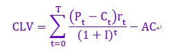

第3部分 密切联系顾客
--------------------

第5章 创造顾客价值、顾客满意和顾客忠诚

第6章 分析消费者市场

第7章 分析组织市场

第8章 识别细分市场与目标市场

### 第5章

创造顾客价值、顾客满意和顾客忠诚

本章将重点阐述以下问题：

-   1.什么是顾客价值、顾客满意以及顾客忠诚？公司如何创造顾客价值、顾客满意以及顾客忠诚？

-   2.什么顾客生命周期价值，营销者该如何使顾客终身价值最大化？

-   3.公司如何同顾客之间建立密切的关系？

-   4.公司如何获得并维持顾客？

-   5.什么是数据库营销？

今天的企业正面临前所未有的激烈竞争，而企业如果能从产品理念和销售理念走出而转向全面营销理念，就能有效地应对竞争。众所周知，营销导向的基石就是拥有牢固的顾客关系。营销人员必须通过告知顾客、鼓励顾客，甚至激励顾客的活动来与顾客保持联系。思科系统公司的首席执行官约翰·钱伯斯（John
Chambers）说得好："让顾客成为企业文化的中心。"一个以顾客为中心的企业并非只是制造产品，更需要构建顾客关系；企业不仅应在生产管理方面驾轻就熟，而且也要在营销管理方面应付自如。

属于万豪国际（Marriott
International）的丽嘉（Ritz-Carlton）连锁酒店，以向客户提供奢侈舒适环境和出色的服务而享誉世界。公司的座右铭恰当地表达了以客户为中心的宗旨："我们会像绅士和淑女一样为各位绅士与淑女提供服务。"62家丽嘉酒店分布于21个国家中，其中任何一家酒店的客人都会受到上乘的个人服务，例如在入住的那一刻起，酒店会称呼客人的名字表示欢迎。为了保证客人受到高品质的整体服务，丽嘉在所有店内都设立了"每日服务质量指数"（Service
Quality
Index，SQI），员工可以根据这个标准掌握客户服务的主要过程，并快速识别潜在问题。在其位于马里兰州的总部，每个店的SQI都会显示在中央控制室，以便对每个分店的表现作出即时评估。其他客户服务方面的创新包括顾客忠诚预期满意系统数据库（Customer
Loyalty Anticipation Satisfaction
System，CLASS），该数据库中存储了丽嘉老客户的信息，诸如偏好和要求；还有房间清扫维修系统（Cleanand
Repair
Everything，CARE）、维护系统。这些系统能确保酒店服务90天内无瑕疵。这三项创新服务让丽嘉在1999年第二次获得了马尔克姆·鲍特里奇（Malcolm
Baldrige）国家质量奖，成为唯一一家两次获得这个奖项的服务企业。丽嘉对客户的奉献也使它能够与客户保持长久关系，丽嘉在2006年度客户忠诚指数中排名前20位可以证明这一点。

正如丽嘉的经验所表明的那样，成功的营销人员需要使顾客充分满意。本章将会清楚并具体地说明公司如何能羸得顾客并战胜对手。答案在于更好地工作以满足或者超越顾客的期望。

### 创造顾客价值、顾客满意和顾客忠诚

建立忠诚顾客群是每一个企业的核心任务，正如营销专家唐·彼得斯（Don
Petters）和玛莎·罗杰斯（Martha Rogers）所说的：

> 公司不断创造的价值是来自于现有的顾客和未来顾客的价值。公司正是通过获得顾客、维系顾客、培育顾客而获得成功。顾客是企业兴建厂房、招募员工、安排会议、铺设光缆、参与商业活动的唯一原因。没有顾客，公司就没有生意。

相信顾客是公司唯一"利润中心"的经理们以图5.1（a）的传统组织结构图来思考顾客所处的位置，即金字塔顶端是总裁，管理人员在中间，一线人员和顾客在底层，这种组织架构已经过时了。

营销成功的公司将传统组织架构图倒转过来，变成5.1（b）。图的顶端是顾客；接下来是那些面对顾客和服务于顾客、使顾客满意的一线人员；再下来是中层管理者，他们的工作是支持那些一线人员，以便他们能够更好地为顾客服务；最底层才是高层管理者，他们的工作是聘用、支持中层管理者。我们在图5.1（b）的两侧也加入顾客表明每一层的管理者必须亲自了解、满足和服务顾客的需求。

图5.1 传统组织架构与现代顾客导向的公司组织架构

一些公司在创立之时便采用了这种顾客至上的经营模式，并且顾客至上已经成为他们的策略重点和竞争优势。随着数据技术的发展，如互联网的兴起，今日能够快速接收到信息的顾客期待公司能做的不只是联系顾客、让顾客满意，更期待能够取悦顾客。这些顾客希望公司能够倾听他们的心声。当Comp
USA让顾客在网站发表评论时（这种评论能够在网上搜索时显示），一个月内访问该网站的顾客增加了2万人，其中50%显示了很大的购买意向。网上购物门户网站Ebates对通过该网站购物的会员提供返现奖励。当Ebates使用在线调查软件更有效地监测消费者反馈后，他就根据客户的反馈重新设计了网站，从而使企业绩效发生了很大的变化，销售额也发生了显著的增长。

顾客认知价值

现在的顾客比以前的顾客受过更多的教育，有机会接触更多的信息，他们还有很多工具能证实公司所宣传的内容以及找出更好的选择方案。

> 惠普（Helwlett-Packard）和戴尔（Dell）

> 惠普公司（Helwlett-Packard）已经开始在客户认知价值方面超过了戴尔（Dell）。戴尔依靠提供低价电脑、高效物流及售后服务取得成功。戴尔模式成功的一个关键因素是狂热地注重低成本。当戴尔为了降低成本将客服电话中心转移到印度和菲律宾时，由于人手不足呼叫中心经常会让顾客等待30分钟。近一半的客户电话至少经过一次转接。为了减少客户电话，戴尔甚至从其网站上去掉了免费服务电话号码。随着客户满意度下降，竞争对手盯紧戴尔的产品质量和价格，改进了服务，戴尔的市场份额和股票价格都迅速下降。最后戴尔在北美电话服务中心雇用了更多员工。"团队在管理成本而不是服务和质量。"迈克尔·戴尔（Michael
> Dell）承认。与此相反，惠普正在雄心勃勃地追求以加强渠道合作伙伴关系为基础的解决方案。Sequel数据系统公司的CEO，惠普的独家合作伙伴唐·里奇（Don
> Ritchie）说，一直以来在他与惠普一起为企业寻找解决方案时，戴尔从未对他构成威胁。他还说："公司最好做的销售之一就是销售给戴尔的老客户。"

那么，顾客最后是如何作出选择的呢？顾客是在有限的搜寻成本与知识、流动性和收入约束下，追求价值最大化。顾客会估计产品或服务能够传递最大的认知价值并采取一些行动（如图5.2所示）。这个产品或服务是否能够达到顾客的期望，是否会影响顾客的满意度，是否会影响顾客再次购买的可能性呢？

顾客感知价值（customer perceived
value，CPV）是指潜在顾客评估一个产品或服务或其他选择方案整体所得利益与所付成本之差。整体顾客利益（total
customer
benefit）是顾客从某一特定的产品或服务中，由于产品、服务、人员和形象等原因，在经济性、功能性和心理性上所期望获得的一组利益的认知货币价值。整体顾客成本（total
customer
cost）是顾客在评估、获得、使用和处理该产品或服务时发生的一组认知成本支出，包括货币成本、时间成本、精力成本和心理成本。

图5.2 顾客感知价值的决定因素

因此顾客感知价值是基于顾客对不同的选择上的所获得的整体利益与所支付的整体成本之间的差。顾客得到利益，也要有所支出。营销人员能够通过提高产品或服务的经济性、功能性或情感性的利益或/和减少一种或多种成本支出的组合来提高顾客获得的产品或服务的价值。顾客根据两种价值提供物V1和V2的比值V1：V2作出选择，如果比值大于1就选择V1，如果比值小于1就选择V2，如果比值相等就无所谓。

价值观念的应用

假设一家大型建筑公司的采购员要从卡特彼勒（Caterpillar）公司或小松（Komatsu）公司购买一台推土机。相互竞争的销售员们仔细地向这位采购员介绍他们的产品特点。这位采购员想把这台推土机用于住宅建筑工地，并希望这台推土机具备一定程度的可靠性、耐用性、良好性能和转让价值。采购员对这两种推土机进行评估，并认为卡特彼勒公司在这几项产品属性上有更高的产品价值。他也认知到这两家公司在提供的服务上，如送货、培训、保养与维修方面存在着一些差异。他的结论是卡特彼勒能够提供较好的服务、职员具有丰富的知识与快速反应的能力。最后，他给卡特彼勒公司的公司形象和声望打了较高分。他将来自于产品、服务、人员、形象四个方面的经济性利益、功能性利益和心理利益进行加总，认为卡特彼勒是能够提供较大的顾客利益的公司。

那么，采购员会买卡特彼勒的推土机吗？不一定。他还要分别对与卡特彼勒和与小松进行交易所需要付出的整体顾客成本进行比较。整体顾客成本不仅指货币成本。正如亚当·斯密（Adam
Smith）在两个世纪前观察到的："任何东西的真实价格是获得该东西所付出一切心力与劳力的代价。"除了货币成本以外，整体顾客成本还包括买主在产品获得、使用、维护、拥有和处理过程中所投入的时间、体力和心力等方面的成本。采购员将这些成本与货币成本加在一起，就构成了整体顾客成本。这位采购员经过计算后还要考虑，卡特彼勒产品所带来的整体顾客成本是否高于其所带来的整体顾客利益。如果答案是肯定的，则采购员可能转而购买小松的推土机。总之，这位采购员要购买的是能提供顾客认知价值最高的产品。

现在我们利用决策理论来说明卡特彼勒如何成功地将推土机推销给这位采购员。卡特彼勒可以从三个方面改进它的产品：第一，通过改进产品、服务、人员和形象所带来的经济性利益、功能性利益和心理利益来提高整体顾客利益；第二，通过减少顾客的时间、精力和心理成本来降低顾客的非货币成本；第三，通过降价来降低顾客的货币成本。

假设卡特彼勒的结论是该采购员认为卡特彼勒的推土机价值2万美元，此外，卡特彼勒生产推土机的成本是1.4万美元。这就意味着卡特彼勒的产品扣除成本可创造6000美元的利润，所以卡特彼勒必须将价格定在1.4万美元和2万美元之间。如果定价在1.4万美元以下，就要亏本。如果定在2万美元以上则无法在市场上销售。

卡特彼勒的定价将决定让渡给顾客多少价值，有多少价值流向卡特彼勒公司。例如，如果卡特彼勒定价为1.9万美元，则他创造1000美元的顾客感知价值，并为自己保留5000美元的利润。卡特彼勒的定价越低，顾客感知价值就越高，所以，顾客的购买意愿就越高。要赢得本次交易，卡特彼勒必须比小松提供更多的顾客感知价值。

经理们经常使用顾客价值分析（customer value
analysis）来将公司与其他竞争对手相对比，揭示公司所存在的优势和劣势。其分析步骤如下：

 

-   1.确认顾客价值的主要属性和利益。询问顾客当他们选择产品和销售商时所在意的产品属性、提供的利益和绩效水平。
-   2.定量评估不同属性和利益的重要性。请顾客对不同的属性和利益按重要程度打分。如果打分差异太大，营销人员应该将这些属性和利益进行分类。
-   3.以各个属性的重要性为基础，对公司和竞争对手在不同顾客价值上的绩效进行评估。请顾客描述公司和竞争对手在每个属性或利益上的绩效。
-   4.在具体细分市场中，基于单个属性或利益，相对于主要竞争对手，检查顾客对公司绩效的评价。如果公司的产品在所有重要属性和利益方面都超过竞争对手，公司可以制定较高的价格（可以获得高利润），或者是与竞争对手定价相同，但能够获得更多的市场份额。
-   5.定期评估顾客价值。当经济、技术和产品功能发生变化时，公司应当定期分析顾客价值和竞争对手的情况。

选择与含义

有些营销人员可能会认为上面描述的过程只是出于理性。假如这位采购员最终决定购买的是小松推土机，那么该如何解释这种行为呢？这里有三种可能性：

-   1.这位采购员可能接到上级要求购买价格最低的推土机。这时，卡特彼勒公司销售员的任务就是要使这位采购员的上级经理相信只根据价格决定购买将导致降低长远利益和顾客价值。

-   2.在公司意识到小松推土机的使用费用比卡特彼勒推土机昂贵之前，这位采购员已经退休了。这位采购员会追求短期的好处，并以个人利益最大化为着眼点。卡特彼勒公司的销售员的任务就是要说服客户公司的其他成员相信卡特彼勒公司的产品能够提供更大的顾客价值。

-   3.这位采购员与小松公司的销售员已经有长期的友谊关系。在这种情况下，卡特彼勒公司的销售员应向这位采购小松的推土机的采购员说明，小松推土机的操作人员一定会因为高耗油成本与经常维修的缺点而产生许多抱怨，以坚定购买卡特彼勒公司产品的信念。

这个例子的意思很清楚：采购员的行动受不同因素影响，有时会将个人利益置于公司利益之上。

顾客认知价值是一个有用的分析框架，可应用于许多情况并提供更宽阔的视野。其含义如下：

第一，销售人员必须评估自己与竞争对手提供的整体顾客利益与整体顾客成本，以了解购买者心中对产品的评估比。

第二，不具有顾客感知价值优势的销售人员有两个选择：提高整体顾客利益或降低整体顾客成本。前者要求强化或扩充所提供的产品、服务、人员和形象的经济利益、功能利益和心理利益。后者则要求通过降低价格、简化订购和送货程序，或者提供担保减少顾客风险等手段来减少购买者的成本。

提供高水平的顾客价值

消费者对于具体的品牌、商店和公司有不同的忠诚度。奥利弗（Oliver）将忠诚度（loyalty）定义为：尽管顾客会受到外在情境的影响，且其他企业的营销努力也可能导致转换行为的发生，但该顾客仍对其所偏好的产品或服务给予深刻的承诺，保证会在未来再度购买与再次光顾。表5.1列出了根据2006年一项调查得出的顾客忠诚最高的品牌。

表5.1 顾客忠诚度排名前20的品牌

-   1.安飞士（Avis）
-   2.谷歌（Google）
-   3.L.L.Bean
-   4.三星手机（Samsung mobile phones）
-   5.雅虎（Yahoo!）
-   6.佳能复印机（Canon office copiers）
-   7.兰斯恩德（Land's End）
-   8.银子弹（Coors）
-   9.凯悦酒店（Hyatt Hotels）
-   10.万豪酒店（Marriott Hotels）
-   11.威讯通讯（Verizonlongdistance）
-   12.Key Span
-   13.Miller Genuine Draft
-   14.亚马逊（Amazon）
-   15.塔吉特（Target）
-   16.摩托罗拉手机（Motorola mobile phones）
-   17.黑莓（Black Berry）
-   18.百事轻怡（Diet Pepsi）
-   19.网景（Netscape）
-   20.丽嘉酒店（Ritz-Carlton Hotels）

价值主张（value
proposition）包括公司承诺提供的全部利益，它比产品的核心定位还要重要。例如，沃尔沃（Volvo）的核心定位是"安全"，但其承诺给购买者的并不仅仅是一辆安全的车；其他的利益包括使用寿命长、良好的服务、终身保修等。价值主张是一项陈述，它将顾客从公司在市场中所提供的产品与服务中所获得的利益，还有顾客与供应商的互动关系过程中的所有体验都陈述出来。品牌就是需要对顾客所期望的整体经验给以承诺。能否保证承诺取决于公司管理价值传递体系的能力。价值传递体系（value-delivery
system）包括顾客在获得和使用产品或服务过程中得到的全部体验。良好的价值传递体系的核心是一组帮助传递与众不同的顾客价值的核心商业过程。

下面说的是一个精于提供顾客价值的实际案例。

> 超级奎因（Superquinn）

> 超级奎因（Superquinn）是爱尔兰最大的连锁超市，它的创立者费格尔·奎因（Feargal
> Quinn）是爱尔兰的大师级营销人物。商场入口处安排了迎宾员欢迎和帮助顾客，甚至会提供咖啡，下雨时提供雨伞以及安排停车。部门经理在通道处与顾客互动并回答问题。超市中有一个高质量的沙拉吧，每四个小时会有新鲜面包出炉，还提供商品何时到达的信息，包括提供这些商品的农民的照片。超级奎因还有一个儿童看护中心。它还为顾客发放会员卡，可按购买数量积分，发现商场任何错误也可积分，如发现破了的罐头或坏了的西红柿。这种会员卡在许多其他公司（银行、加油站等）也能使用，顾客在这些地方消费时也能积分。由于这一切都超出了顾客的一般期望，超级奎因为许多人所喜爱，获得了一种狂热的追捧。2006年，超级奎因被财阀Select
> Retail控股公司买下，售价达5.9亿美元。

总体顾客满意

购买者在购买后是否满意，取决于商品所带来的性能是否符合购买者的期望，也取决于购买者对于商品所带来的性能与购买者的期望两者之间偏差的解读。一般来说，满意（satisfaction）是指一个人通过对一个产品的可感知的产品绩效（或结果）与他们的期望之间比较后所感觉到的愉悦或失望的程度。如果产品绩效小于期望，顾客就不满意。如果产品绩效与期望相匹配，顾客就满意。如果产品绩效超过期望，则顾客就会有高度满意度或愉悦。顾客对产品绩效的评价取决于很多因素，特别是顾客与该品牌的忠诚关系的类型。对于消费者已经具有正面感觉的产品，顾客对产品绩效的评价通常都是正面的。

尽管以顾客为中心的公司寻求创造更高的顾客满意，但顾客满意并不是最终目标。如果公司通过降低价格或增加服务来提高顾客的满意，可能会使利润下降。公司可以采用提高顾客满意以外的其他行动来提供企业利润（如改善其制造流程或增加研发投入等）。公司还有许多利益相关者，包括员工、经销商、供应商和股东。公司如果在提高顾客满意上付出较多，可能就会占用原来用于提高其他"合伙人"满意度的资金。最后，公司必须遵循这样一个理念，在一定资源限度内，公司必须在保证其他利益相关者能接受的满意水平上，尽力创造更高的顾客满意。

购买者的期望是如何形成的呢？期望来自于顾客过去的购买经验、朋友和伙伴的意见、营销人员和竞争者的信息及许诺。如果营销人员将预期定得太高，顾客很可能会失望。另一方面，如果公司将期望定得太低，就无法吸引足够的购买者（尽管某些买者会满意）。今天，某些成功的公司的做法是提高顾客的期望，然后提供可以符合这个期望的产品来满足顾客。韩国汽车制造商起亚（Kia）在美国取得成功，在于公司推出了低成本、高品质、可靠性高的车，还提供了长达10年的保修期。

顾客忠诚于某个公司或拋弃某个公司的决策是顾客平时与该公司交往过程中许多小事加总的结果。现在很多公司都致力于创造一个"品牌化的顾客体验"。下面的例子介绍的是旧金山的Joiede
Vivre连锁店进行顾客体验的实例。

> Joie de Vivre

> Joie de
> Vivre在旧金山地区经营小型酒店、旅馆和旅游度假场所。它的每一个经营场所都是独特的、令人愉快的，并且这个场所的主体风格常常是基于一些流行杂志。例如，Del
> Sol旅馆就是一个经过改装的汽车旅馆，有着黄色的外观，被棕榈树所环抱，棕榈树上装饰着节庆的彩灯，这些都是按照岛屿杂志的《玛莎·斯图亚特生活》的介绍所布置的。而两家在硅谷的旅店在客房内和游泳池旁装有高速上网接口。时尚理念使旅店提供许多令人惊喜的个人服务，如在枕头旁边放置维他命而不是巧克力。现在Joie
> de Vivre在沿海地区拥有最多数量的独立旅馆。

监督顾客满意度

许多公司都会系统地测定公司满足顾客的程度，识别影响顾客满意的因素，并通过改进运营方式和营销方式来提高顾客满意度。例如，沃克维亚证券（Wachovia
Securities）公司雇用神秘顾客来评估公司员工在满足顾客方面做得如何，并将结果与员工的部分薪酬挂钩。这种强调顾客服务的做法似乎发挥了作用------由市场调查机构Brand
Keys在2006年第一季度所做的调研显示，沃克维亚在满足忠诚顾客的期望方面比任何其他银行做得都好。

聪明的公司会定期地测量顾客满意度，因为留住顾客的关键之一就是顾客满意。一个高度满意的顾客通常会有较长期的忠诚行为，在公司推出新产品或对产品进行升级后会购买更多的产品，为这家公司及其产品传递良好口碑，忽视竞争品牌和竞争品牌的广告，并对价格不敏感，会关注公司的产品与服务，并将经常向公司提供与产品或服务相关的创意或想法。并且，因为交易已成惯例，与新顾客相比，公司为这些顾客服务的成本较低。顾客满意度越高，股票市场的回报越高，风险越低。

然而，顾客满意和顾客忠诚并非同比例增加。假设顾客满意度用1~5的尺度来衡量。顾客满意度很低时（水平为1），顾客很可能放弃公司，甚至说它的坏话。在顾客满意水平为2~4时，顾客比较满意，但当发现有更好的产品出现时，他们仍可能会转向其他品牌。在顾客满意度为5时，顾客很可能再次购买，甚至为公司传递良好的口碑。高度满意会使顾客对其品牌或公司形成一种情感上的依附，而不仅是理性的偏好。施乐公司的高层管理者发现在过去的18个月中"高度满意"顾客的重复购买次数是"很满意"顾客的6倍。

当顾客用公司表现的某个要素，如送货来评价其满意度时，公司需要确认顾客如何对良好的送货表现进行定义。良好的送货表现可能意味着提前送到或准时送到，或所定货物一次全部运到等等。公司也应当认识到，两个同样"高度满意"的顾客，导致他们满意的原因可能不同。有的人在大多数情况下都是比较容易满足的，而有的人则需要在公司表现极佳的情况下才能得达到满意，否则很难被取悦。

测量技术

有许多种测量顾客满意的方法。通过定期调查可以直接跟踪顾客满意状况，还可以同时询问一些其他问题以便了解顾客再购买的意向以及顾客向其他人推荐本公司及品牌的意愿与可能性。派拉蒙（Paramount）将其5座主题公园的成功归因于对那些愿意接受访问的顾客所进行的数千次网络调查。在过去的几年里，公司执行了50多次网络调查，并联系了10万位网站访客，请他们描述对主题公园中骑马、用餐、购物、游戏和看表演等相关项目的满意度。"营销视野：净推荐值和顾客满意"，描述了为什么很多公司认为良好的问题设计是评估顾客满意的必要途径。

除了定期进行顾客满意调查之外，公司还需要监测顾客流失率（customer loss
rate），并且联系那些停止购买公司产品的或者是转向其他供应商的顾客，并了解流失的原因。最后，公司可以雇用神秘顾客（mystery
shoppers），假扮成潜在顾客，报告他们在购买公司及其竞争对手产品过程中所发现的优缺点。公司经理们可以亲自去那些他们不会被认出来的部门及竞争对手的销售现场，亲身体验作为"顾客"所受到的待遇。经理们也可以打电话给自己的公司，提出各种不同的问题和抱怨，体会他们的员工如何处理这样的电话。

除了追踪本公司顾客期望价值和顾客满意外，公司还需要在这些领域监视它们的竞争对手的绩效。例如，公司可能很高兴地听到有80%的顾客对公司绩效很满意。然后，首席执行官却发现主要竞争对手的顾客满意度是90%；而当他获知这个竞争对手的顾客满意度的目标是95%时，他便更加沮丧不已了。

顾客满意的影响

对于那些以顾客为导向的公司来说，顾客满意度既是目标，也是营销工具。今夭，公司需要特别关注顾客满意程度，因为互联网给顾客提供了一个迅速向世界各个角落传播负面口碑或正面口碑的渠道。一些顾客甚至建立起自己的网站来传播他们的牢骚和不满，针对的都是利润高的品牌，如联合航空公司、沃尔玛、梅塞德斯-奔驰。他们在网站上描述了公司做错的情形，试图激起顾客的不满和抗议。

获得高顾客满意度评价的公司要确保公司的目标市场即顾客知道这一点。有些公司一旦在J.D.Powers的顾客满意评价中位居榜首，如Countrywide房屋贷款公司、大陆航空（Continental
Airlines）和京瓷复印机（Kyocera
Copiers）等公司便会宣传这个成绩，扩大影响。

密歇根大学的克拉斯·福内尔（Claes
Fomell）研发出美国顾客满意指数（American Customer Satisfaction
Index，简称ACSI），用以测量消费者对不同公司、行业、经济部门和国家经济认知感觉的满意度。在2005年的ACSI测量中得分最高的部分公司和品牌包括：亨氏（91）、丰田（87）、苹果（83）和谷歌（82）。

\@营销视野：净推荐值和顾客满意

测量顾客满意度是很多公司的头等大事，分歧在于应该如何操作。贝恩咨询公司客户忠诚度业务的创始人弗雷德里克·雷赫德（Frederick
Reichheld）认为在测量顾客满意过程中也许只有一个问题是重要的，即"你有多大可能把这个产品或服务推荐给你的朋友或同事?"雷赫德认为，客户是否愿意推荐首先取决于一线员工是否能够很好地服务客户，其次取决于对顾客体验作出贡献的职能部门。

雷赫德的灵感部分来源于租车公司Enterprise
Rent-A-Car的经验。在1998年，当该公司将顾客满意调查问卷中的问题从18个缩减到2个问题，即一个是关于顾客租赁体验，另一个是顾客是否愿意再次从该公司进行租赁。该公司发现对租赁体验评价最高的顾客要比对其评价次高的顾客多三次租赁经历。该公司还发现分析经理手中掌握的顾客不满意信息，能够使公司的业务得到进一步提高。

一项典型的净推荐调查也同样验证了雷赫德的观点。顾客被要求用0\~10点的尺度来对他们的推荐可能性进行打分。顾客可依回答分数分成三组。第一组顾客给公司打9分或10分，称之为"推荐者"（promoters）；第二组给公司打7分或8分，属于"被动者"（passively
satisfied）；第三组给公司打0至6分，是"诋毁者"（detractors）。公司的NPS值，就是以推荐者所占百分比与诋毁者所占百分比的差额。给了7~8分的人被认为是被动满意的顾客，其打分并不被计入最后的结果中。典型的一组净推荐值位于10%~30%之间，但是世界级的大公司的推荐值却能超过50%。一些在净推荐值排行榜中居于前面的公司包括USAA（82%）、哈雷-戴维森（81%）、好市多（79%）、亚马逊（73%），还有eBay（71%）。

雷赫德的观点得到了很多人的支持并付诸实践。通用电气、美国邮政、微软及其他公司，都早已采用了NPS计分制，通用电气公司将经理人员的20%的奖金与NPS结果挂钩。当发现205个通用电气欧洲医疗业务公司的分值较低时，通过后续的调查显示对顾客的回应时间过长是主要问题所在。在检查了其电话中心并增加专业人员之后，通用公司的净推荐值分数上涨了10\~15个百分点。Bearing
Point调查公司发现高的顾客净推荐值分数意味着高效益。

雷赫德说他发明的NPS比他认为过于复杂且没效率的消费者调查问卷要实用得多。毫无疑问客户公司欣赏NPS操作简单，并且同企业的财务绩效关系密切。像通用电气这样的公司很注重顾客提供的为何这样评价的理由。当Intuit公司将NPS运用在Turbo
Tax软件业上时，反馈信息表明Turbo
Tax的问题在于打折程序。在降低了人寿保险单的购买条件后，Intuit软件公司的销售额增长了6%。

> 普尔特房屋公司（Pulte Homes）

> 普尔特房屋公司（Piilte
> Homes）是美国最大的且最多元化的新兴住宅建筑公司之一，在J.D.Power的年度消费者调查中，普尔特房屋公司比其他新的建筑公司赢得了更多的殊荣。有着55年历史的普尔特房屋公司并不依靠J.D.Power来监测其消费者满意度，而是通过长时间的对顾客跟踪来了解顾客对其服务的满意度。最初普尔特房屋公司调查消费者使用该公司产品的感受。几年之后回访这些顾客确保他们的满意度不变。在2001年的调查中，该公司对其消费者的总体满意程度很不满意。于是，公司建立了一个拥有1200人的顾客关系部来确保在整个销售过程和建造过程中，公司都与顾客保持着紧密的联系。顾客关系部的副总裁埃里克表示，回头客和推介销售的飞速增长表明，"紧密的顾客关系增加了公司的销售额"。他也强调普尔特房屋公司要注重顾客问题的处理和顾客抱怨处理，这也是为什么公司使用"顾客关系"的提法替代了"顾客服务"。

顾客抱怨

某些公司认为，他们可以通过记录顾客投诉来获得顾客满意。但有关顾客不满意的研究表明，在顾客的购买行为中有25%是不满意的，但只有5%会抱怨，95%认为不值得抱怨或者不知如何、向谁抱怨，于是他们就停止购买。

在所有投诉的顾客中，有54%\~70%的投诉顾客，在其投诉得到解决后还会再次同该公司做生意；如果顾客感到投诉得到很快解决，该数字还会上升到惊人的95%。顾客对该公司的投诉得到妥善解决后，他们平均每人就会把处理的情况告诉他们遇到的5个人。而不满意的顾客，平均每人会告诉11个人。如果他们当中的每个人仍然告诉其他人，传播负面口碑的人数会以指数级数增长。

事实上，不论营销项目设计和执行得如何好，错误总会发生。一个公司能够做得最好的事情是让顾客易于抱怨。意见表、免费热线电话、网站、电子邮件都能够快速地实现双向沟通。3M公司宣称它的产品改进创意有2/3来自于顾客抱怨。

假设有一个潜在的不开心的顾客正处于情绪低下，这时候如何恰当处理这位顾客的消极经历就是尤为重要的。除此以外，下列措施可以帮助修复公司对顾客的信誉：

-   1.建立1周7天、1天24小时免费热线（通过电话、传真或电子邮件）来接受和处理顾客的抱怨。

-   2.尽可能快速回应顾客的抱怨。公司的反应速度减慢，不满意情绪就会滋长，并且会导致消极的口碑。

-   3.向失望的顾客承担责任，而不要责怪顾客。

-   4.雇用有怜悯性格的顾客服务人员。

-   5.迅速解决顾客抱怨并且使顾客满意。有些抱怨的顾客并不一定指望要求得到公司的补偿，而只是希望得到公司的关注。

产品质量而后服务质量

顾客满意还取决于产品和服务质量。什么是质量？不同的专家对质量有许多不同的定义，诸如"适合使用"、"符合要求"、"性能稳定"等等。我们将引用由美国质量控制学会所下的定义：质量（quality）是某件产品或服务所具有的能够满足现实的或潜在需要的整体性特征与特色。显然，这是一个顾客导向的质量定义。当销售的产品或服务能够符合或超过顾客的期望时，我们称此产品达到所需的质量水平。

当公司能够经常地满足大多数顾客的需要时则称该公司为具有质量的公司。然而，我们清楚地区分一致性质量和性能质量（或等级）是很重要的。一辆雷克萨斯（Lexus）车所提供的性能质量（performance
quality）比现代（Hyundai）车的性能质量高，它行驶平稳、快速、经久耐用等等。然而，如果雷克萨斯和现代车都能提供对顾客所承诺的质量水平，分别满足了它们各自的目标市场的期望，那么我们可以说两种车提供了相同的一致性质量（conformance
quality）。

正如通用电气前主席杰克·韦尔奇（Jack
Welch）所说："质量是我们维护顾客忠诚的最好保证，是我们对付外国竞争最有力的武器，是我们保持增长和盈利的唯一途径。"为了鼓励本国企业向世界市场提供高质量的产品，一些国家及国家级的组织（如下文所说的欧洲，译者注）设立质量奖项，这些奖项包括日本的戴明奖（Deming
Prize）、美国的马尔克姆·鲍特里奇国家质量奖（Malcolm Baldrige National
Quality Award）和欧洲质量奖（European Quality Award）。

质量的影响/重要性

产品和服务质量、顾客满意度及公司盈利能力是紧密相连的。高质量带来高度的顾客满意，高度顾客满意可以支持较高的价格和较低的成本。许多研究表明产品质量与公司盈利能力之间是高度相关的。那些想用削减成本来走捷径的公司，由于顾客体验质量的下降而付出了代价。

 

-   当家居零售商家得宝（Home
    Depot）决定向承包供应业扩展业务时，也在其全美1816个店铺削减成本并且简化运营流程，用兼职人员取代了专职雇员，很快兼职人员的比例就占到了40%。公司的ACS顾客满意指数下降，在全国大零售商中排名垫底。它的顾客满意指数比其竞争对手、顾客友好型的劳氏（Lowe's）低11个点，公司股价在家具业最繁荣期反而下跌了24%。
-   尽管西北航空（Northwest
    Airlines）停止在国内航班提供免费杂志、枕头、电影甚至小包装的椒盐卷饼％公司还是提高了票价并减少了班次。正如一位常坐飞机的乘客指出的西北航空的服务像廉价航空公司，但机票等方面却不如廉价航空实惠。"所以毫不奇怪，在美国各大航空公司的ASC指数和J.D.Power顾客满意度投票中西北航空均居末位。

很显然质量是创造价值和顾客满意的关键。

全面质量管理

正如营销是所有人的职责一样，全面质量管理也是每个人的职责。在帮助公司识别目标顾客并向目标顾客传递高质量产品和服务方面，营销人员也扮演着重要角色。首先，营销者在正确识别顾客需要和欲望方面承担着重要责任。其次，营销人员必须确保将顾客的要求正确地传达给产品的设计者。第三，营销人员必须确保顾客的订货能够满足顾客需求，并使货物准时送达。第四，营销人员必须检查顾客在有关如何使用产品方面是否得到了适当的指导、培训和技术性帮助。第五，营销人员在售后还必须与顾客保持接触，确保他们满意并将满意持续下去。第六，营销人员应该收集顾客有关改进产品与服务方面的意见，并将其反映到公司的各有关部门。当营销人员做了上述一切后，他们就是对全面质量管理和顾客满意以及对顾客和公司的利益作出了自己的贡献。

### 顾客终身价值最大化

从本质上说，营销是一门吸引和维系盈利顾客的艺术。然而，每个公司都会在某些顾客上损失金钱。著名的20/80法则认为，在顶部的20%顾客创造了公司80%以上的利润。在某些情况下，这一法则更为极端：20%最有价值的顾客（按人均算）创造150%~300%的利润。而10%~20%最没有价值的顾客会把利润降低50%~200%。中间60%~70%顾客持平。图5.3显示了顾客利润分布情况。说明了公司可以通过"解雇"最差的顾客来提高利润。

图5.3
150/20法则："20%的最优价值的顾客为公司创造了近150%的利润，最没有价值的顾客使公司至少损失100%的利润"

公司最大的顾客并不必然会为公司带来最大利润。最大的顾客常常需要提供相当程度的服务和最大的折扣优惠。最小的顾客虽然支付产品的全价，接受最少的服务，但其所产生的交易成本却会降低公司的获利。中等顾客受到良好的服务，支付的价格也接近全价，在很多情况下，他们带来最大的利润。

顾客盈利能力

什么样的顾客才能给公司带来利润呢？一个盈利顾客（profitable
customer）就是指能在一段时间内不断产生收入流的个人、家庭或公司，其所带来的收入超过企业能接受的，用于吸引该顾客、同该顾客进行交易、服务该顾客所需的成本支出。必须注意的是，这里强调的是终身收入和成本，不是某一笔交易所产生的利润。营销人员可以根据细分市场或渠道来测量个别顾客的盈利能力。

虽然许多公司能够测量顾客满意，但大多数公司不能测量单个顾客的盈利能力。对于银行来说，这就很难做到，因为一个顾客使用多种银行的服务，这些交易也要跨越不同部门。曾经将顾客交易成功地归并在一起的那些银行，为数量庞大的无利可图的客户的比重而感到震惊。有些银行曾指出，其零售顾客中有45%以上是亏损的。

顾客获利能力分析

图5.4显示了一种有用的盈利分析方法。

图中顾客按列排列，产品按行排列。每个方格中的正负号代表向该顾客出售某产品时的获利情况。我们看到，顾客1（C1）是一个获利很好的顾客，因为他购买了两个盈利产品（P1和P~2~）。顾客2（C~2~）则是亏损与获利混合型的顾客，因为他买了一个盈利产品和一个非盈利产品（P~1~和P~3~）。顾客3（C~3~）是个亏损顾客，因为他购买了一个盈利产品（P~1~）和两个非盈利产品（P~3~和P~4~）。

那么公司可以对顾客2和顾客3做些什么呢？（1）可以提高无利润产品的价格，或者取消这些产品；（2）也可尽力向这些顾客推销盈利产品。如果这些无利可图的顾客转向其他供应商，这可能是好事。事实上，鼓励无利可图的顾客转向竞争企业对手的产品对本企业是有利的。

图5.4 顾客产品获利分析

顾客盈利能力分析（customer profitability
analysis，CPA）可通过会计工具------作业成本法（active based
costing，ABC）来进行顾客盈利能力分析。公司估计来自于顾客的所有收入，并减去所有的成本。成本不仅应当包括制造和销售产品或服务的成本，而且包括所有与服务顾客有关的成本，如接听顾客电话的成本、拜访顾客的成本以及举办活动和发放礼物的成本。

当对每个顾客进行分析后，就可以将顾客区分为不同的收益群：白金顾客（最盈利者）、黄金顾客（盈利者）、黑铁顾客（低盈利但有理想的销售量）以及铅顾客（非盈利并且销量不理想）。公司的工作就是把黑铁顾客改造成黄金顾客以及把黄金顾客转为白金顾客，同时放弃铅顾客或通过提价、降低服务成本来使他们给公司增加盈利。更一般地来说，营销人员必须把顾客细分为值得追求的和基本上没什么利益潜力的两类。如果必须要关注的话，后者得到的关注应该相对较少。

顾客组合

营销人员者开始意识需要管理顾客组合（customer
portfolios）。顾客组合是由不同的顾客群所组成，这些顾客群根据顾客不同的忠诚度、盈利能力和其他影响因素而定义。一种观点认为公司的顾客组合包括一组不断变化的"熟人"、"朋友"、"伙伴"。这三种类型的顾客在产品需求、购买、销售、服务活动、吸引成本（acquisitioncosts）和竞争优势上各不相同。

另一种观点是将公司的顾客组合类比成公司在股票市场中的投资组合。在营销中，如同投资组合的计算公式一样，对于每个组合项目，分别计算Beta值或报酬率，然后分类是非常重要的。根据这一观点，公司应将可能产生亏损的顾客分在同一群，让盈利顾客的收益来弥补亏损顾客造成的财务赤字，这样才能将由顾客组合风险调整的顾客终身价值达到最大化。

测量顾客终身价值

企业要追求长期的顾客获利能力必须了解顾客终身价值的概念。顾客终身价值（customer
lifetime
value，CLV）是某个顾客终身购买产品的预期总利润的净现值。计算公式是将公司预期收入减去吸引、销售和服务顾客的预期成本，再以一个适当的折现率（10%\~20%之间，大小取决于资金成本和对风险的态度）进行换算。一个产品或服务的终身价值能加总到数万美元甚至数十万美元。

有许多方法可以测量顾客终身价值。"营销备忘：计算顾客终身价值"就描述了其中的一种方法。

顾客终身价值为顾客投资计划提供了一个正式的量化分析框架，并且帮助营销人员采用长期的分析视角。可是，应用终身价值概念的一个挑战就是相对成本和收益的可靠估算。使用终身价值概念的营销人员也需要小心，不要忘记短期营销活动、品牌构建活动等都可以增加顾客忠诚度。

\@营销备忘：计算顾客终身价值

研究者和实践者已经使用了不同的方法建模和估算顾客终身价值（CLV）。哥伦比亚大学的唐·莱曼（Don
Lehmann）和哈佛大学的萨尼尔·加普塔（Sunil
Gupta）推荐用以下公式来计算一个尚未获得的顾客的CLV：

其中，Pt=顾客在时间t支付的价格，

Ct=在时间t用于服务该顾客的直接成本，

i=折现率或该企业的资本成本，

rt=在时间t内顾客持续购买的概率，

AC=吸引顾客的成本，

T=估算CLV的时间区间。

估算CLV的关键决策是时间长度。一般来说3\~5年是比较合理的。有了时间与其他信息我们就可以利用电子表格计算CLV了。

在表5.2中莱曼和加普塔用10年的长度对100个顾客的CLV进行了计算，说明了CLV的计算方法。在此例中，公司吸引或获得每位顾客的成本是40美元，共获得了100名顾客。因此，在初始年度，公司支出4000美元。公司每年都会流失去一部分顾客。10年间公司从这些顾客身上共获得总利润现值为13286.52美元，总的净现值（减去吸引或获得顾客的成本）是9286.52美元，或每个顾客净现值是92.87美元。

使用无限的时间长度计算CLV可以避免主观时间确定的限制。在无限时间长度的情况下，研究人员已经表明如果边际利润（价格减去成本1和顾客维系率并不随着时间变化而改变，则现有顾客的CLV可以简化为下面的公式：

换言之，CLV简化为边际利润（m）乘利润乘数\[r/（1+I-r））\]。

表5.3说明r和I不同组合的利润乘数。表中是估计一个顾客CLV的简单方法。例如，当顾客维系率为80%，折现率为12%时，利润乘数为2.5。所以，在这种情况下，现有顾客未来的CLV就是该顾客的年利润乘以2.5。

  \|    \| 第0年  \| 第1年  \| 第2年  \| 第3年  \| 第4年  \| 第5年  \|
第6年  \| 第7年  \| 第8年  \| 第9年  \| 第10年  \|
\|-----------\|--------\|----------\|----------\|----------\|----------\|----------\|----------\|---------\|---------\|---------\|--------\|
\| 顾客数量  \| 100  \| 90  \| 80  \| 72  \| 60  \| 48  \| 34  \| 23  \|
12  \| 6  \| 2  \| \| 单位顾客收入  \|    \| 100  \| 110  \| 120  \|
125  \| 130  \| 135  \| 140  \| 142  \| 143  \| 145  \| \|
单位顾客可变成本  \|    \| 70  \| 72  \| 75  \| 76  \| 78  \| 79  \| 80 
\| 81  \| 82  \| 83  \| \| 单位顾客利润  \|    \| 30  \| 38  \| 45  \|
49  \| 52  \| 56  \| 60  \| 61  \| 61  \| 62  \| \| 单位顾客获得成本  \|
40  \|    \|    \|    \|    \|    \|    \|    \|    \|    \|    \| \|
总成本或利润  \| -4000  \| 2700  \| 3040  \| 3240  \| 2940  \| 2496  \|
1904  \| 1380  \| 732  \| 386  \| 124  \| \| 现值  \| -4000  \| 2455.55 
\| 2512.40  \| 2434.26  \| 2008.06  \| 1549.82  \| 1074.76  \| 708.16 
\| 341.48  \| 155.22  \| 47.81  \|

### 培育顾客关系

顾客价值最大化意味着要建立长期的顾客关系。现在，公司正从浪费性的大众营销（mass
marketing）转变基于建立强大的顾客关系而设计的精准营销。今天的经济是依靠商业信息支持的。信息具有更容易地实现差异化、定制化、个性化以及以惊人的速度通过网络传播的优势。

但信息是双刃剑。例如，现在的顾客通过BizRate.com、Shopping.com和Pricegrabber.com这样的网站很容易进行购物比较。因特网还是顾客之间进行交流的工具。像Epinion.com和Amazon.com这样的网站使得顾客可以分享对不同产品和服务的体验。

顾客授权已经成为许多公司的生存方式，这些公司不得不调整以适应顾客关系。见"营销视野：公司对顾客授权的反应"，其中描述了一些公司改变营销活动后的结果。

\@营销视野：公司对顾客授权的反应

宝洁公司主席A.G.拉费雷被视为营销界的风向标，2006年10月他在全国广告协会上的发言又制造了新的冲击波。他说"权力在消费者手里"，"营销人员和零售商激烈地争夺这个权力。消费者通常凭直觉来选择品牌，同时加入自己的创意。我们应该学会顺应"。为了支持自己的说法，拉费雷列举了很多例子：一位少年制作了一段品尝食品的动画并上传到YouTube.com（著名视频网站）上；潘婷公司（生产洗护发产品）发起了一个活动，鼓励女性剪短头发，把剪下的头发捐献给癌症患者（因化疗脱发）制作假发；封面女郎（Cover
Girl）在洗手间镜子上加了"你的唇膏脱色了吗?"的广告语，针对目标顾客，还播放了同一主题的为时5秒的电视广告，使得该公司的不脱色持久唇膏销量增加了25%。

其他公司在他们觉得适当的地方，从传统的由营销者主导的"自上而下"的方法，转向"自下而上"的贴近民众的方法来营销。汉堡王（Burger
King）在顾客友好型的新媒体（如YouTube、MySpace、电子游戏和iPod）上进行了有效的宣传。宣传主题为"由你作主"，让顾客凭对品牌的感觉自主发挥。其主要对手麦当劳，已经获得了更多的固定的家庭市场。

为了增加控制力，雅虎没有使用撒大网式营销方法，而是贴近那些已经喜欢某些品牌的顾客，进行了一项"参与营销"的活动。例如，为了制作一个新的音乐电视，雅虎音乐让歌手夏姬拉（Shakir）的粉丝提供他们翻唱的"Hips
Don't
Lie"的片段，用来制作新音乐电视。雅虎首席营销官指出，"所推出的营销内容不再重要，内容就是发出邀请，将顾客与你的品牌相联系"，这反映了该公司的哲学。

甚至2007年的超级碗职业橄榄球冠军赛这个世界上最贵的媒体广告，也有2个家庭制作的消费品广告。为了赶上这一让用户来制作广告的风潮，乐事（Frito
Lay）和雪佛兰（Chevrolet）都举行了广告竞赛，优胜者能获得奖金，所制作的广告也会播出。最引人注目的品牌可能来自世界级的营销大师耐克。作为Joga
Bonito（葡萄牙语"玩得漂亮"）世界杯的赞助商，耐克花费1亿美元进行多渠道宣传。其核心是Joga.com，一个覆盖140多个国家的网站。100万球迷在网站上开博客、下载视频、为他们喜欢的球员和球队成立粉丝团、通过网站来表达他们对比赛的激情。耐克的首席执行官马克·帕克（Mark
Parker）对新的营销方式总结得很好："当人们加入耐克群体或邀请耐克加入他们的团体时，就建立起来一个强的联系。"

客户关系管理

客产关系管理（Customer relationship
management，CRM）是一个过程，它是管理个体顾客的详细信息和所有顾客的"接触点"，目的是追求顾客忠诚最大化。顾客的接触点是指顾客会接触到品牌和产品的机会------从实际的接触体验、个人或大众传播的沟通，再到不经意的观察。对于旅馆来说，这个接触点包括房间预订、柜台登记和结账离开、例常项目、客房服务、商务服务、锻炼设施、洗涤服务、餐馆和酒吧。例如，四季酒店（Four
Seasons）便提供员工亲切服务，如员工亲切地称呼顾客的名字，员工能够理解忙碌商务旅客的需要以及至少有一个区域设施是服务于最尊贵的顾客的，比如一间总统套房或者SPA服务。

有时接触点在顾客的最低期望水平上，比如开具发票。微软公司的全球CRM产品经理，凯伦·史密斯（Karen
Smith）提到一个电信公司的例子。这个公司为降低成本，转为采用统一格式的发票。一个顾客要求对发票做细微改动以符合自己的要求，服务代表的回答是："先生，不行，我们只能开统一发票。"这名不满意的顾客会将2条商业电话线的业务转到另一家仍开具手工私人发票的电信公司。如果这名顾客非常不满，会将所有的业务转到新的电话公司。史密斯说："我们可能认为我们所做的都是为顾客好，但是在我们采取行动之前我们必须真正地了解顾客的需求与反应。公司通常只注重客户关系管理的功能性和综合性，但是经常会忽略一些最基本的接触点。"

顾客关系管理使得公司可以通过有效地利用客户个人信息来提供卓越的实时顾客服务。由于他们知道每个有价值的顾客的信息，公司就可以将产品、服务、项目、信息和媒体定制化。客户关系管理很重要，因为公司获利的主要动力在于以顾客为基础的总体价值。一个应用CRM技术的先锋就是哈乐斯娱乐有限公司。

> 哈乐斯（Harrah's）

> 1997年，拉斯维加斯的哈乐斯（Hairabh's）娱乐公司推出一项忠诚方案，该方案将所有顾客资料输入到中央数据库中，采用复杂的分析方法来了解赌场为顾客所带来的价值内涵。哈乐斯目前已经发展出一套可以进行实时分析的全面奖励系统，即当顾客玩老虎机、购买赌场门票或购买食物时，根据预测分析的结果顾客可以获得不同的购买奖励。这间公司已经将超过2600万个赌场来客细分为数百个顾客群体。通过针对特定顾客细分提供所需要的产品或服务，哈乐斯的市场占有率提高了一倍，从1997年的26%提高到2005年的50%。在哈乐斯的全面奖励忠诚方案中购买活跃的持卡会员便超过6000多万。

一对一营销

唐·佩珀斯和玛莎·罗杰斯已经在顾客关系管理方面做了一些基础性工作。佩珀斯和罗杰斯结合CRM营销提出了的一对一营销的框架，该框架包括四个步骤：

-   1.确定你的潜在顾客和当前顾客。不要人云亦云。从所有销售渠道和顾客接触点收集各种信息，建立、维持以及开发一个丰富的顾客数据信息库。

-   2.根据顾客需要和顾客对公司的价值来划分顾客。将更多的精力均衡地花费在最有价值的顾客群（mostvaluable
    Customers，MVCs）上。应用作业成本法（activity based
    costing），并计算顾客终身价值。对所有购买行为、利润水平与因推荐而产生的购买行为来估算其未来利益，再扣除每位特定顾客的服务成本，计算最后的净现值。

-   3.加强与个别顾客互动，了解他们的个体需要，建立更加紧密的关系。通过人性化的方式与顾客沟通以提供定制化的产品或服务。

-   4.为每一个顾客定制产品、服务和信息。通过公司联系中心和网站来推动公司与顾客的交流。

但是，一对一营销并不适用于所有公司。信息收集、硬件设施和软件设施上的花销可能会超支。当公司通常需要收集到大量顾客信息，运营大量能够交叉销售的商品或经营定期替换或更新的商品时以及销售高价值的产品时，一对一营销才能真正地发挥它的作用。

提高顾客基础的价值

公司利益相关者价值的主要驱动力是所有的顾客价值。成功的公司通过如下优秀战略来提高他们的顾客价值：

 

-   减少顾客流失率。甄选和培训有知识和提供亲切服务的员工，以提高询问不同购买问题的顾客可以获得满意答复的概率。世界最大的天然有机食品零售公司Whole
    Food用承诺推广最好的食品和员工的团队观念吸引了很多顾客。
-   提升顾客关系的寿命。顾客和公司接触得越深，他越可能成为长期交易的顾客。有些公司对待他们的顾客就像对待他们的合作伙伴一样，特别是工业产品市场中的顾客，公司会请求顾客来帮助设计新产品或改进服务。即时网络公司（Instant
    Web
    Companies，以下简称IWCO）是一家位于明尼苏达州的直邮印刷公司，它推出每月客户聚光灯方案。在这个计划中，客户公司提供一份关于业务和直邮项目的总体意见，然后对IWCO的行为、产品和服务进行评论与建议。IWCO的员工不仅在顾客端取得曝光的机会，而且也使其视野得以扩展，并了解顾客经营的事业与营销目标，了解如何提高顾客价值以及如何帮助满足他们的需求。
-   通过"钱包份额"（share-of-wallet），"交叉销售"（cross-selling）和"向上销售"（up-selling）来提高每个顾客的成长潜力。用新产品和新机会从现存的顾客中提高销售量。哈雷-戴维森公司（Harley-Davidson）不仅卖摩托车，也卖一些摩托车手的配件（比如手套、皮夹克、头盔和太阳眼镜等等）。哈雷代理商出售超过3000种衣服物品，有些代理商还提供试衣间。哈雷发授特许经营权，范围从可以想象的物品（射击用的眼镜、撞球台上的撞球、zippo牌打火机）到更加令人惊奇的物品（如古龙香水、洋娃娃和手机）。
-   使低利润顾客变得更加有利可图或者抛弃他们。为了避免直接拋弃顾客，可以尽量鼓励他们购买更多的商品，或者减少一些特色和服务，或者让他们为一些低利润项目付更高的费用。银行、电话公司、旅游代理公司现在都对曾经是免费的服务开始收费，以确保能够有最低程度的收益。
-   集中精力服务于高价值顾客。可以用一个特殊的方法来对待最有价值的顾客。一些亲切的表示，诸如生日问候、送小礼物，或者邀请其参加特别的体育或者艺术活动，都会向顾客发送一个强烈且积极的信号。

吸引和维系顾客

公司为了扩大利润和销售，就需要花费大量的时间和资源去寻找新的顾客。为了达到这个目的，公司要制作广告并在媒体上播放以吸引潜在的新顾客；公司还要给潜在的新顾客直接发送电子邮件或打电话；公司的销售人员则需要参加贸易展示会，希望在那里找到新的买家；从经销商处购买客户名单等等。

> 城市银行（Citizens Bank）

> 在波士顿竞争激烈的银行业，城市银行（Citizens
> Bank）推出一项用狗粮取代棒棒糖的业务。给顾客棒棒糖是一个过去用来吸引并留住有小孩的顾客的方法。现在城市银行给那些爱狗的顾客发放狗粮，在2005年就分发出14000（袋）。因为爱狗人士再次光顾银行并带来他们那些同样喜欢狗的朋友，城市银行在南波士顿分行采取了进一步的行动并建立了"狗狗空间"（Dog
> Spot），即当狗主人办理银行业务时，他的狗可以在指定区域自由活动。这个10英尺宽的空间里有草地、狗屋、水碗、植物和狗粮。自"狗狗空间"开放以来，银行的新顾客快速地增加，分行经理表示，有时候尽管狗的主人没有任何业务要办理，但是因为狗，主人也不得不来这待上一会。

表5.4 各种营销活动吸引顾客的成本

 

 

 活动

 

 每位新顾客成本

 

 每次招来顾客的成本

 

 人员推销

 

 \$550

 

 \$110.00

 

 直邮

 

 \$130

 

 \$1.70

 

 电话营销

 

 \$105

 

 \$3.75

 

 网站、电邮

 

 \$35

 

 \$0.07

 

-   1.成本根据代表性企业平均值计算，回复率为推算。

-   2.由于销售过程的复杂性，各企业的实际成本各不相同。 

表5.4例中举的是对典型新顾客获得成本的分析。不同的获得方法由于CLV的不同能获得不同种类的顾客。一项研究表明，通过提供35%的折扣获得的顾客是无折扣时所获得顾客长期价值的一半。

减少顾客流失

吸引新顾客还不够，公司必须留住顾客并增加他们的购买行为。很多公司承受了高度的顾客不忠（customer
churn）或顾客流失的痛苦。这就好像将水倒入一个漏水的桶里一样。例如，移动运营商和有线电视运营商受到一些反复无常的顾客的折磨。这些顾客为了寻求更好的交易，他们每年至少更换3次运营商。许多运营商每年损失25%的用户，相对付出约20亿\~40亿美元的成本。

为了减少流失率，公司必须：

-   1.确定和测定顾客维系率。对于杂志，续订率是非常好的一个顾客维系测定指标；对于大学，一年级学生升到二年级的比率或毕业率也是很好的顾客维系测定指标。

-   2.区分导致顾客流失的不同原因，并找出可改进之处。如果是因为顾客离开了该区域或退出了该行业而导致的流失，公司无能为力，但如果顾客流失是因为服务不佳、产品假冒伪劣或价格过高等原因，则公司必须致力于改善这些不足。

-   3.公司需要将从流失的顾客中损失的利润（损失的利润等于顾客的终身价值）与减少顾客流失率所付出的成本进行比较。只要减少顾客流失率所付出的成本低于所损失的利润，公司就应该尽量地去挽留顾客。

顾客维系动态变化

图5.5展示的是吸引和维系顾客的主要步骤。起点就是有购买产品或服务意图的人。这些潜在的个人或组织可能对公司的产品或服务感兴趣，但可能没有购买的方式或意向。接下来的任务就是营销人员可以通过访问顾客、检查顾客的财务状况等方法确认哪些是有动机、有能力和有机会进行购买的预期顾客。而后公司就可以将这些预期顾客转变成首次购买顾客，再将这些首次购买顾客转变成重复购买顾客，然后将重复购买顾客转变成为公司特定关照和了解的客户。下一步就是公司通过为参与的客户提供有利的方案使客户转化为会员型客户，再把会员型客户转化为拥戴型客户，拥戴型客户极力称赞公司及其产品和服务并鼓励其他人购买。而公司面临的最大的挑战是如何将拥戴型客户转化为合伙人。

图5.5 顾客发展过程

不容乐观的是，很多营销理论和营销手段只注重如何吸引新顾客，而不是注重维系和培育现有顾客。传统的营销方法只注重如何销售，而不注重建立客户关系；只注重售前服务、销售活动而不在乎售后服务。现在越来越多的公司认识到了使顾客满意和维系顾客的重要性。

满意的顾客构成公司的顾客关系资产（customer relationship
capital）。如果一个公司在被出售的时候，收购公司购买的不仅是厂房、设备和品牌资产，而且还包括转入的老客户，即与新公司进行交易的顾客数量和价值。下面是维系顾客的一组有趣的数字：

 

-   获取一个新顾客的成本是让顾客满意与保留顾客所花费的成本的5倍。要使已经满意的顾客产生转换行为，需要花费大量努力。
-   一般的公司平均每年流失10%的顾客。
-   一个公司如果将其顾客流失率降低5%，不同的行业其利润就能增加25%\~85%。
-   顾客利润率主要来自于延长老顾客的生命周期，这主要是因为老顾客会增加购买、向别人推荐、对价格不敏感和减少服务的营运成本。

建立顾客忠诚

与顾客建立一种长期的，牢不可破的关系是每个营销人员的梦想也是长期营销成功的关键所在。想要与顾客建立一种紧密关系的公司需要考虑很多方面（图5.6），一些研究人员将维系-建立活动看作是增加经济效益、社会效益或者是结构绑定。下面的内容介绍了公司用来提高消费者忠诚度和维系度的四个重要手段。

与顾客互动

对于顾客关系管理来说，倾听顾客是至关重要的。一些公司建立了一套持续运作的机制让高层经理持续知晓顾客的回应。

 

-   信用卡巨头MBNA要求每一个执行主管听取客户服务中心或顾客补救单位的顾客电话交谈内容。
-   约翰·迪尔（John
    Deere）牌拖拉机有很高的顾客忠诚率，在某些产品领域拥有将近98%的年顾客维系率。该公司雇用一些退休人员去拜访流失顾客和现有顾客。
-   Chicken of the
    Sea公司的"美人鱼俱乐部"有8万会员，会员是享有代金券和特别照顾的核心顾客群体。作为回报，俱乐部成员对公司正在做的和公司计划做的事情提供一些有价值反馈。当公司筹划推荐罐装鲑鱼时，会员们极力反对这个产品概念，公司就取消了产品上市方案。

  - 为目标顾客创造优势的产品、服务和体验。 -
让各部分人员都能参与顾客满息和顾客维系程序的规划与执行工作。 -
整合"顾客呼声"，以捕捉顾客所阐明的、未阐明的需求与欲望并将其融入企业决策中。
-
为个体顾客的需要、偏好、接觖方法、购买频率和满意度等方面的信息建立一套容易使用的信息库。
- 使顾客能够很容易地找到适当的公司员工，以表达他们的感知和抱怨。 -
评估频繁奖励与俱乐部营销方案的潜力。 - 启动奖励体系，表彰杰出员工。

图5.6 建立坚固的顾客关系

但倾听只是营销手段的一部分，成为顾客的拥护者，尽可能与顾客站在同一战线上，理解顾客的想法也同样重要。USAA保险公司服务质量的传奇给公司带来行业最高的顾客满意度。USAA的用户经常提起的事情就是公司有多么关心顾客，甚至建议顾客不要买不需要的保险。由于存在着高度的信任，USAA拥有高度的顾客满意度以及广阔的交叉销售机会，"营销备忘：创造热心顾客"，描述了六种能使顾客对公司和品牌树立起高信任度的新顾客开发方法，这些方法能使顾客不单是购买他们的产品和服务。

\@营销备忘：创造热心顾客

作者本·麦康奈尔（Ben McConnell）和杰基·休巴（Jackie
Huba）认为，热心顾客不仅购买一个公司的产品和服务，而且对公司有着高度信任，这使得他们不遗余力地宣传并自愿在其朋友和同事圈内推荐该公司。麦康奈尔和休巴研究了一些品牌，如Macintosh、Krispy
Kreme、Dallas Mavericks、Linux、Pallotta Teamworks、Solution
People，还有其他被顾客推崇的品牌。在他们的博客网站"顾客教堂"（www.Churchofthecustomer.com）中，二人提供了开发热心顾客的六个要点：

顾客增值。通过不断地收集信息来了解热心顾客的喜好。Build-A-Bear工作室用"幼儿提案组"（Cub
Advisory
Borad）作为反馈及决策输入的一个载体。成员由20个8岁到12岁的孩子组成。他们对新产品进行投票予以支持或否决。该工厂很多产品创意都来自顾客。

传播知识。将自己的知识、数据或知识产权通过快速的分销渠道发布出去。免费地分享知识，目的是使其更易被接受，消除你最大的隐患：闭塞。如果有人接受了知识，他就会有责任宣传。人们的宣传可以增加知识的认知和实际价值。

建立讨论。通过提供工具、项目和特色让热心顾客持续地讨论产品来表达他们的激情。运动鞋公司匡威（Converse）让业余电影制片人提供一段30秒的短片来描述他们从品牌符号中得到的灵感。1800个作品中最好的作品在公司的网站上展示（conversegallery.com）。匡威用这些最佳短片作广告宣传片。结果表明：在网站推出新款鞋的两个月内，通过网站营销，销售额上扬了2倍。

建立社区。给想法相近的顾客提供碰面的机会。Paetec通讯公司为酒店、大学和其他公司提供电信服务。6年内该公司的业务增加到了5亿美元，它的巨大成长主要归功于热心顾客。Paetec主要的营销战略就是为全国范围的顾客提供非正式晚餐。Paetec邀请现有顾客和重要的目标顾客共同就餐，从而使这些顾客能够相互见面。没有乏味的幻灯片展示，只是顾客间交流他们所用电信服务方面的挑战以及他们对成为
Paetec客户的真实感受。通过其他顾客，公司的产品得以销售。

购前品尝。对产品和服务在购买前的试用与品尝能够降低风险，提高营销周期，并提供最新价值。即使顾客不买，他或她也会做积极的口头宣传。这是饮料商Izze的营销战略。该公司的低碳酸果汁饮料出现在高端的慈善晚会上。在这种场合，lzze肯定容易和其他品牌混淆。Izze坚持不让主办方展示任何Izze的标识或悬挂条幅。结果是明显的：与会者认为他们发现了一种新饮品，而没有任何人向他们宣传该产品。结果星巴克Whole
Foods和塔吉特都进了Izze的饮品，而没要求入场费。

给个理由。致力于高端目标（如支持"自由"）的公司，如哈雷-戴维森（Harley-Davidson）和西南航空（Southwest）发现顾客、卖家、供应商和员工都在为其成功作贡献。热心顾客渴望情感交流和认可；一个好的理由能产生情感共鸣。当你的产品、服务鼓舞人们改变世界时，你的产品便像提倡利他主义和资本主义一样能唤起人们的激情。

开发忠诚项目

> 公司能够采用的两个顾客忠诚的项目是频繁奖励项目和俱乐部营销项目。频繁奖励项目（frequency
> programs，FP）就是给大量和经常购买产品和服务的顾客提供奖励。使用这种方法，有助于建立高顾客终身价值、顾客的长期忠诚度，和创造交叉销售机会。航空业、旅店业和信用卡业是最先使用频繁奖励项目的，现在很多行业都采用这种方法。例如，目前很多连锁超市针对某些特定商品提供会员卡，这种卡可以在特定的情况下提供一定的折扣。

> 好时（Hershey Co.）

> 2006年春，好时（Hershey's）与网上拍卖业巨头eBay一起开始一项不同寻常的忠诚项目。公司在10亿个糖纸上印上额度不等的积分，顾客收集这些积分，可以储存到好时的网站上，并可用于eBay的产品拍卖。这意味着顾客为了得到贵重商品必须吃大量糖果，也可能少许几张糖纸就可以赢得一辆跑车。这个项目成功地将网下和网上关于该品牌的体验整合在一起。比如，拍品为"做一天巧克力工厂的老板"，便会刺激顾客访问好时的网站（hersheys.com）并注册和储存（印在糖纸上的）代码。

一般而言，最先引进频繁奖励方法的公司会获益最大，特别是竞争对手反应较慢时。当竞争对手有所反应时，频繁奖励方法就会变成所有实施频繁奖励项目的公司的财务负担，但是有些公司还是能够有效与有创意地经营与使用频繁奖励方法。

许多公司设立了俱乐部会员项目。俱乐部会员项目（club membership
programs）可以对每个购买某产品或服务的人开放，也可以面向特定群体或愿意支付少量费用的顾客。尽管开放型俱乐部更适于建立数据库以及从竞争对手那里吸引顾客，有限制条件的俱乐部会对建立长期忠诚度更为有效。会费与会员条件的限制可以防止哪些贪图公司产品短期利益的顾客加入。这些俱乐部能够吸引并维系那些能给公司带来大宗业务的顾客。

以下是一些成功的俱乐部：

> 苹果（Apple）

> 苹果电脑公司一直鼓励苹果电脑的拥有者组成本地苹果用户俱乐部。到2001年，它已经拥有了600多个俱乐部，每个俱乐部的会员人数从不到25个成员到超过1000个成员的规模。这些用户俱乐部让拥有苹果电脑的顾客有机会学到更多电脑使用知识，分享许多想法，得到产品折扣。他们会赞助一些特别的活动，支援一些社区性的服务。浏览苹果网站可以帮助顾客找到附近的俱乐部地点。

> 哈雷-戴维森（Hariey-Davidson）

> 世界著名摩托车公司哈雷-戴维森赞助成立了哈雷摩托车骑士俱乐部（HOG），这个俱乐部目前拥有1200个分会，会员已有100万。第一次购买哈雷-戴维森摩托车的顾客可以免费获得一年期会员资格。参加HOG可以获得的利益包括免费的杂志《HOG故事》、一本旅游手册、紧急救援服务、一份特别设计的保险单、窃盗险服务、价格优惠的旅馆以及摩托车驾驭技巧方案，该方案为其会员在度假期间提供租用的哈雷摩托车。公司还针对HOG设计专属网站，提供各俱乐部分会的信息、举办的活动以及特别的会员专属讨论区。

个性化的营销

公司员工通过了解各种顾客的个人需求和爱好，将公司的服务个性化、私人化，来强化顾客关系。从这个意义上讲，考虑周到的公司便把顾客变成了客户。两者的区别如下：

直觉上，顾客可以没有名字，而客户则必须有名字。顾客是公司提供服务的一部分群体，或是某个较大的细分市场中的一部分，而客户则是在个别基础上提供服务的对象。顾客可由公司任何一名员工来提供服务，而客户则由公司某位特定的专业人员来提供服务。

今天，在最好的关系营销中日益重要的是正确的技术。表5.5描述了5个顾客关系管理的任务和与之相应的技术。通用电气塑料制品公司（GE
Plastics）如果没有先进的数据库软件，就无法有效地将电子邮件有目标地发给不同的顾客。戴尔（Dell）公司如果没有先进的网络技术，也不能为全球公司客户提供定制化的电脑订单。公司正在使用电子邮件、网站、电话呼叫中心、数据库、数据库软件来培养公司与顾客间的持续联系。下面是一个公司使用技术来建立顾客价值的例子。

> 美国贸易（Ameritrade）

> 折扣经济服务公司美国贸易（Ameritrade）为顾客提供详细信息，以帮助建立紧密联系。它通过电子邮件为顾客提供定制化信息，其中包括顾客选择、详细的股票浮动和分析人士的建议。公司的网站支持在线交易并提供各种研究工具。美国贸易开发了一种叫做多赢（Darwin）的家庭教学软件，以光盘的形式免费提供给顾客。顾客对此项措施做出了回应：1997年，公司客户少于10万人，2004年超过300万。2005年的一项研究表明美国贸易的顾客属于行业内最活跃的顾客之一。

表5.5 分解顾客关系管理：顾客关系管理的真正任务

 

 

 顾客关系管理的任务：

 

 获得正确的顾客

 

 提出正确的价值主张

 

 创立最优过程

 

 激励员工

 

 学习留住顾客

 

 你能够完成这个任务，只有当......

 

已识别最有价值的顾客

 已计算你的产品/服务的顾客份额

 

已了解了你的顾客对产品与服务的目前需要和未来需求

已经调查你的竞争对手目前和未来已经或将要提供的产品和服务

 你已经确定了你应该提供什么产品和服务

 

 你已经有了最好的方法把你的产品和服务传递给你的顾客，包括你加入的联盟，你需要投资的技术以及你需要开发或获得的服务能力

 

你知道你的员工需要用什么工具来培养顾客关系

 你已经确定为了增加员工忠诚度所要建立的人力资源系统

 

你知道为了什么会丢失顾吝以及如何让他们再回来。

你已经分析了你的竞争对手到底做了些什么而贏取了你的高价值顾客。

 你的高级管理人员监控顾客流失率

 

 顾客关系管理技术能够帮助你......

 

分析顾客收益和成本数据来确定当前和将来的高价值顾客

 更好地确定直复营销努力的目标

 

获取相关产品和服务行为的数据

创造新的分销

渠道开发新的定价模型

 建立社区

 

更快地处理交易给生产第一线提供更好的信息

更有效地管理物流和供应链

 促进商业合作

 

使用最适当的激励和衡量绩效方法

 展开知识管理系统

 

跟踪顾客流失和维系水平

 追踪顾客服务和满意度水平

 

 

 

 

 

希望吸引和保持顾客的电子商务公司发现个性化已经走在了建立定制化的信息的前面。例如，兰斯恩德的网站向访问者提供与公司客脤代表交谈的机会。诺德斯特龙公司在其网站上提供了类似的功能以确保网上购买者和在实体店铺访问这家公司的消费者的满意度是相同的。甚至老牌的媒体公司英国广播公司（BBC）也从其定制化的产品中获益，使其广告业务在英国广播业中领先。

> 英国广播公司（BBC）

> 正在试用阶段的My
> BBC播放器能让英国用户下载最早至7天前播出的广播电视节目。使用者不仅能下载，还能制作和上传节目与别人分享。例如其中一个项目，使英国人下载BBC新闻和科学节目的连续片段，重新混录，然后在线与他人分享。更重要的是
> http://backstage.bbc.co.uk
> 提供数据、资源，支持因特网维护者和设计者------不论是BBC内部和外部的------进行分享，目的是建立对使用BBC素材的新概念。在一个由消费者创造的典型产品就是Sport
> Map，它可以帮助人们从地图上找到最近的足球队和有关这个球队的新闻，这项服务在全国的热心球迷中很流行。

与此同时，在顾客被电脑不知所云的自动推荐轮番轰炸下，网络公司需要确保想建立顾客关系的努力不会产生逆反效果。在Amazon.com上买很多婴儿礼品时，你所收到的个性化推荐忽然不那么个性化了。网络商家应该认识到网络个性化服务的局限性，并努力寻找真正有用的技术和流程。

公司还意识到顾客关系管理中个人因素的重要性，也认识到一旦顾客真的与公司接触会发生什么。正如斯坦福大学商科权威杰弗里·普费弗（Jeffrey
Pfeffer）指出的："最好的公司建立一种文化，在这种文化中一线人员被授权根据情况来关心顾客。"他以SAS，一家斯堪的纳维亚航空公司为例，这家公司的一系列细小的互动环节的调整，包括办理登机手续、登机、用餐等，使顾客对公司的印象完全扭转过来。

建立结构性联系

公司可以向顾客提供某种特定的设备或电脑联接，以帮助客户管理他们的订单、账单、存货等。由于这涉及高昂的资金成本、搜寻成本以及可能失去忠诚顾客所获得的折扣，顾客不会轻易转向购买其他公司的产品。例如，著名的药品批发商麦克森（McKessen）公司就是一个很好的例子。该公司在电子数据交换方面投资了几百万美元，以帮助那些小药店管理其存货、订单处理和货架空间。另一个例子是美利肯（Milliken）公司向它的忠诚顾客提供具有专利性的软件程序、营销调研、销售培训和销售示范的服务。

赢回（流失）顾客

不管所提供的产品特性如何，不管公司有多么努力，出现一些顾客减少购买或者是顾客流失是不可避免的。企业所面临的一项挑战是如何通过贏回（流失）顾客策略来重新吸引不满意的顾客。通常将从前的顾客重新吸引回来比寻找新顾客更容易（因为公司知道顾客的名字和购买史）。关键是要对现有顾客进行采访，对流失的顾客做问卷调查，经过分析后，只贏回那些有较强盈利潜力的顾客。

### 顾客数据库和数据库营销   

营销者需要了解他们的顾客。为了了解顾客，公司需要收集信息并且储存在专门的数据库中，以便今后进行数据库营销。顾客数据库（customer
database）是将现有的、可接近的与可接触的个别顾客或潜在顾客的众多信息，以组织化的方式收集汇总成一个系统，以实现一些营销的目的，如产生顾客信息、挑选顾客信息、执行产品或服务的销售、维系关系等。数据库营销（database
marketing）是建立、维系与使用顾客数据库与其他数据库（产品、供应商、零售商数据库）的过程，以达到联系、处理与建立顾客关系的目的。

顾客数据库

许多公司将顾客邮递名单与顾客数据库混为一谈。顾客邮寄名单（customer
mailing
list）仅仅是一组姓名、地址和电话号码。而顾客数据库则包含许多由顾客交易、注册信息、电话询问以及与每个顾客的接触记录等所累积而来的信息。

一个理想的顾客数据库还应该包括顾客的过去购买信息、人口统计信息（年龄、收入、家庭成员、生日）、心理信息（活动、兴趣、观点）、媒体信息（喜欢的媒体）以及其他有用的信息。目录管理公司芬格赫特（Fingerfmt）在其大众顾客数据库中拥有3000万个家庭的信息，每个家庭有大约1400条信息。

一个理想的商业数据库应当包括企业顾客的过去购买记录，过去购买的数量、价格、利润；采购团队成员的名单（包括他们的年龄、生日、爱好和喜欢的食品现有合约的内容，在顾客业务中供应商的份额；竞争的供应商名录；在销售与服务方面顾客对其竞争优势与劣势的评估以及相关的采购实务、模式和政策。

例如，瑞士制药厂诺华（Novartis）在拉美的分厂保留了10万多个阿根廷农民的资料，知道他们在保护谷物时所购买的化学药剂，并将他们根据不同的价值水平进行分类，且以不同的方式对待不同的群体顾客。见"营销突破：Tesco"，其中描述了这家英国超市巨头如何利用数据库吸引和留住顾客。

数据库和数据挖掘

聪明的公司收集每次顾客与任何部门接触的相关信息。接触点包括每位顾客购买的产品项目、每位顾客的咨询电话、在线咨询或邮寄的现金退款卡。银行和信用卡公司、电话公司、目录营销人员以及其他公司都会有很多与顾客相关的信息，这些大量的信息不仅包括地址和电话号码，还包括交易记录以及经过整理的有关年龄、家庭规模、收入和其他人口统计信息。

这些数据由公司的联络中心收集并系统地储存在一个数据库（data
warehouse）中，在数据库里营销人员能获得、查询和分析这些资料，对顾客个别的需要与反应做出一些合理的推论。电话销售人员可根据对顾客关系的分析结果来回应顾客的询问。

通过数据挖掘（data
mining），营销统计分析人员可从大量的资料中将有关顾客个人、流行趋势与不同细分市场等有用的信息挖掘出来。数据挖掘使用复杂的统计方法和数学方法，如聚类分析、自动交叉检验、预测建模和人工神经网络。

有些观察家认为专用数据库可以给公司带来显著的竞争优势。美国著名通讯公司MCI对1兆字节的顾客通话资料进行分析后，精密地计算出一项新的通话折扣套餐，将不同的折扣优惠提供给不同的顾客。兰斯恩德公司通过数据库的使用，可以了解200万名顾客的特殊的服饰信息，并将这些信息转化成产品，以满足不同顾客的衣橱需要。（图5.7提供了更多例子）

> 科维斯特（Qwest）

> 该公司每年对顾客进行两次筛选，以寻找那些有较高获利潜能的顾客。公司的数据库中有许多顾客的通话记录，其中每位顾客就有200多条。通过检查顾客的人口统计资料以及市话与长途电话的拨打次数或是否有语音留言，科维斯特能够估算每位顾客的潜在通话费用。然后公司就可以计算出每位顾客的通话预算。通过这方面的了解，科维斯特就可以精准地计算在每位顾客上的营销预算应当是多少。

> 皇家加勒比（Royal Caribbean）

> 皇家加勒比为了填补客船上的空床，使用数据库找出适合的顾客提供"不需预定"的套装航程游览方案以吸引顾客。公司将目标顾客集中在退休和单身人士身上，因为这些人是容易迅速作出决策的群体。如果能够降低空床率，则这一航程可以获得更多的利润。

> 芬格赫特（Fingerimt）

> 芬格赫特巧妙地应用数据库营销和建立关系后，使这家目录公司成为美国国内最大的直邮营销公司。芬格赫特的数据库不仅有详细的人口统计资料，如年龄、婚姻状况、孩子数量，还有顾客的爱好、兴趣、生日等。芬格赫特基于每个顾客可能去购买的产品寄送目录和报价单，芬格赫特会推出定期与特别的促销活动，如年度抽奖、免费礼品以及延期付款等，它与顾客保持着持续的接触。现在，公司已经将数据库营销应用到网站经营上了。

> 玛氏（Mars）

> 玛氏不仅是糖果市场领头人，也是宠物食品的老大。在德国，玛氏通过与兽医联络以及在免费的刊物《如何照顾你的猫》上刊登广吿的方式，收集了许多养猫家庭的资料。玛氏请索要这本刊物的人填写问卷，使得玛氏了解受访者所养的猫的名字、年龄和生日。现在玛氏每年会寄猫的生卡、猫粮样品和/或玛氏品牌的折扣券给养猫家庭。

> 美国运通（American Express）

> 在凤凰城的一个秘密的地方，一群警卫小心地看守着美国运通5000亿比特的数据，这些数据是有关其顾客如何使用公司3500万张绿、金、白金卡的信息。美国运通也使用这个数据库来储存每月所邮寄的数百万顾客账单中的每笔交易项目。

图5.7 数据库营销的例子

通常，公司可以从五个方面使用数据库：

 

-   1.确定潜在顾客------许多公司通过产品和服务的广告来增进销量。广告中一般都会提供顾客回应的方式，如企业反馈卡或免费电话号码。公司从顾客反馈中建立数据库。公司就可以在这个数据库中进行筛选，确认哪些是最佳的潜在顾客，然后向他们发函、打电话或登门联系，努力把他们转变成真正的顾客。
-   2.决定哪些顾客应当收到一份特别的产品或服务------一般的公司会对其产品或服务执行销售、向上销售、交叉销售的活动。公司会设立一些准则来描述会购买其特定产品与服务的理想目标顾客。然后公司可从顾客数据库中搜索哪些顾客与理想顾客的特征最相似。在经过一段时间记录这些顾客的反应率后，公司就可以更精准地寻找目标顾客群。在与顾客完成一项交易后，公司使用一套自动的连续反馈系统来了解这名顾客的反应率：1周后，寄送感谢信；5周后，寄送新的产品介绍；10周后（如果顾客没有回应）打电话给顾客并提供一项特别折扣。
-   3.强化顾客忠诚------公司通过记住顾客的偏好、发放适当的礼物、折扣赠券和有趣读物等等，培养顾客的兴趣和热情。
-   4.恢复顾客购买行为------公司可以安装自动邮寄程序（自动营销），给顾客寄送生日贺卡或周年纪念卡、圣诞购物提示或淡季促销活动信息。该数据库可以帮助公司及时提供吸引人的产品或服务。
-   5.避免重大顾客失误------曾经有一家大银行承认，由于没有很好地利用数据库，他们犯了一系列错误。其中的一个例子是，银行向一个未按期支付抵押贷款的顾客收取滞纳金，但银行忽略了这位顾客所掌管的公司是该银行的存款大客户。于是这位大客户断绝了与这家银行的往来。在第二个例子中，两位不同的银行职员同时致电一位想要办理房屋抵押贷款的客户，但两位职员提供不同的贷款利率。这两位业务人员并不知道已有同事联络过这位客户。在第三个例子中，银行给予一位重要顾客的特别优惠方案只相当于其他国家的标准服务。

\@营销突破：Tecso

如果你问一位英国连锁超市Tesco的顾客，20世纪80年代的购物体验是什么，答案恐怕不会是"顾客友好"。在1983年，Tesco开始对店铺和备货进行升级，但公司仍被看作"薄利多销"的低端店铺，远远落在像桑斯伯里（Sainsbury）那样的高端市场领袖后面。为了从桑斯伯里手里争得市场份额，Tesco需要转变公众对公司的看法。公司决定改进购物体验，突出公司形象的提升，发起了一个名为"把我们从旧模式中提升出来"（正如1989年公司的简报中所说的那样）的活动。

-   1990年到1992年间，Tesco提出了114项改进店铺质量的方案，包括增加婴儿更衣室、储存特殊商品如法国土鸡肉，并引进了一系列高质量产品。公司开展了一项名为"每个小帮助"（Every
    Little
    Helps）的活动，通过20个广告来宣传这些改进措施，每个广告都针对不同的方面"为顾客做对的事情"。这些改进的结果是，到1990\~1995年间，Tesco吸引了130万新顾客，这些新顾客推高了公司的销售额和市场份额，使得Tesco在1995年超过桑斯伯里成为市场领袖。

之后，Tesco引入了一项活动，这项活动使其日后成为了世界级的关于如何建立长期顾客关系的案例：Tesco的会员积分卡"Clubcard"，其本质是一张积分卡，可以提供折扣和为个体顾客量身定制一些服务，Ciubcard还是有力的数据收集工具。有了它，Tesco能比对手更好地了解顾客购买模式和偏好。通过使用Clubcard的数据，Tesco对每个顾客建立了基于其购物习惯的独特的"DMAS案"。要建立这个档案，公司用了40多个维度来根据顾客的购买情况将产品分类，这些维度包括价格、尺寸、品牌、环保性、便利性、健康性。基于顾客的DNA档案，Tesco的400万个顾客每个季度都能收到内容不同的Clubcard说明，这些说明包括有针对性的特别报价和其他促销信息。公司还在店内设立了服务台，安装了信息查询系统，拥有Clubcard的购物者可以从中得到定制的折扣赠券。

Clubcard数据还帮助Tesco更有效地进行商店经营。跟踪持有Clubcard顾客的购买情况可以帮助公司了解价格弹性以及设置促销时间表，节省费用超过5亿美元。Tesco使用顾客数据来决定每家店铺的产品范围和备货风格，甚至新店选址。在Clubcard推出的15个月内，公司便发放了800万多张卡，其中500万张是经常使用的。使用Clubcard，优化了顾客对公司的关注，并带给Tesco比20世纪90年代初更大的成功。到1999年，公司在英国的市场份额提高到了15%，并在同一年被英国的公司评选为最受崇拜的公司，并连续两年获得此殊荣。

接下来的几年，Tesco继续应用顾客数据的制胜法宝来统领英国零售版图，超越了超级市场业，发展为"大型零售店"，销售普通商品或者非食物商品。Tesco不仅给那些喜欢在同一家店铺买齐所有东西的顾客提供了额外的便利，还提高了自身的获利能力，因为非食品产品的平均利润是9%，而食品是5%。到2003年，Tesco的销售收入中近20%来自非食品，其销售的CD比维京音像店（Virgin
Megastore）销售的还多，其自有品牌Cherokee成衣系列是英国增长速度最快的品牌。

Tesco还进行了广泛的顾客调查，通过电话和书面调研以及固定样本组调研来扩展其在日杂市场的地位。到2005年，公司在英国超市消费中占35%的份额，几乎是其主要竞争对手的2倍，占总零售额的14%。Tesco还用相同的以顾客为中心的战略来扩展海外市场。2005年，公司在英国以外地区开设了648家店铺，并在波兰、匈牙利、泰国、爱尔兰、斯洛伐克成为市场领袖。2006年，Tesco成为英国最大的公司，世界第六大零售商。

数据库营销和顾客关系管理的缺点

在描述了数据库营销的优点之后，我们也必须说明它的缺点。数据库营销有四大问题而使公司无法有效地执行顾客关系管理。首先，建立和维护一个数据库需要在电脑硬件、数据库软件、分析程序、通信联接和专业人员方面进行巨大的投资。收集准确的资料，尤其是收集所有公司同单个客户互动时点的信息是很困难的。在下列情形中是不值得建立数据库的：（1）公司的产品在顾客一生中只会购买一次（例如昂贵的钢琴；（2）顾客不具备品牌忠诚度（有许多顾客摇摆的例子）；（3）单位的销售量微乎其微（例如棒棒糖）；（4）信息的收集成本过高。

第二个问题是很难让公司的每个员工都以顾客为导向和利用现有信息。员工发现从事传统的营销要比顾客关系营销容易得多。有效的数据库营销需要管理和培训员工、经销商和供应商。

第三个问题是并不是所有顾客都想和公司建立关系，他们甚至不满公司收集了那么多他们的个人信息。营销人员必须关注顾客对于顾客隐私和安全的态度。例如，美国运通公司长期被看成是保护隐私问题的领先者，它不会将特定顾客交易的信息销售出去。但是，当美国运通宣布与知识基础营销公司（Knowledge
Based Marketing
Inc.）成为合作伙伴，让接受美国运通卡的企业也拥有1.75亿笔顾客资料，美国运通发现这让许多目标顾客非常愤怒。美国运通马上中止了这项合作。很重视隐私权的美国在线（AOL）也舍弃一项原本要销售订阅者电话资料的计划。网络公司应当很好地解释其隐私权政策，并给予消费者对其本身信息是否存放于数据库有同意或不同意的权利。欧洲国家就不喜欢数据库营销。欧盟15个成员国刚通过一个法案来阻碍数据库营销顺利运作，这表示欧洲比美国人更注意保护他们的个人隐私权。

第四个问题是在顾客关系管理背后的假设并不一定总是正确。例如，在为忠诚顾客服务的时候可能成本并不小。购买量大的顾客经常都清楚他们对于公司的价值，并以此为资本来要求更多的服务或价格折扣。忠诚顾客可能对公司的期望和要求更高，如果忠诚顾客得知公司有对其索取原价或更高价格的企图会非常愤怒，当他们得知其他顾客享受某些优惠时，他们也会不满意。当eBay开始追逐大公司客户如IBM、迪士尼和西尔斯时，某些曾帮助eBay建立品牌的小型企业就会产生被拋弃的不良感受。忠诚顾客并不一定是公司产品品牌的最佳代表。一项研究发现，行为忠诚度高与购买大量公司产品的顾客，和态度忠诚高与对公司有高度承诺的顾客相互比较时，在主动为公司产品传播正面口碑的行动上，前者的频率比后者少。

因此，数据库营销在收集原始顾客资料、维系与挖掘这些资料的过程与结果，不仅为公司带来利益，也会产生高额成本。然而，当数据库有效运行时，它为企业带来的效益要高于其所需的成本，但是这要求数据库必须处于良好的状态下，所挖掘的关系也有助于企业经营。

数据库营销应用较多的公司是工业品营销人员和服务提供商（如旅馆、银行、航空和保险、信用卡、电话公司），这些行业比较容易收集大量的顾客数据。采用大量的交叉销售和向上销售的公司（如通用电气和亚马逊）以及那些拥有高度差异化需要与高价值顾客的公司，都是最适合在顾客关系营销上有所投资的公司。尽管一些公司（卡夫、桂格麦片、纳贝斯克）为其品牌建立了数据库，但包装产品零售商和提供消费性包装产品的公司则很少使用数据库。顾客终生价值较低的公司，顾客流失率高的公司以及卖家和消费者之间没有直接联系的公司是无法从顾客关系管理中获利的。已成功执行顾客关系管理成功的企业有汽车租赁公司（Enterprise
Rent-A-Car）、Pioneer Hibred Seeds、富达投资公司（Fidelity
Investments）、雷克萨斯（Lexus）、Intuit和Capital One。

德勒咨询公司（Deloitte
Conuslting）发现，70%的公司在顾客关系管理实施中几乎毫无改善。原因有许多，如顾客关系管理设计漏洞百出、过于昂贵、用户没有充分利用或要求太多利益以及公司合作者不重视这套系统。一组商业评论员提出了顾客关系管理的四个主要危险。

 

-   1.在建立顾客战略之前执行顾客关系管理。
-   2.在组织未能充分适应顾客关系管理前就已经执行了顾客关系管理。
-   3.假设公司拥有越多的顾客关系管理技术就会越好。
-   4.没有积极地争取顾客。

沃顿商学院的乔治·戴（George
Day）教授总结认为，许多顾客关系管理失败的一个重要原因是公司集中在顾客接触流程上，而没有相应改变内部结构和体系。他的建议是什么？是在安装顾客关系管理之前改变结构："我们的调查结果说明优秀的顾客关系能力与企业如何建立和管理组织有很大关系，而这与其所采用的顾客关系管理工具和技术关系不大。"所有这些说明每个公司都需要决定投资多少（及投向何处）用于建立和使用数据库营销来掌控顾客关系。

### 本章小结

-   1.顾客是寻求价值最大化的。他们形成一个对价值的期望并付诸实践。购买者将从他们认知的能提供最高顾客让渡价值的公司购买产品，顾客让渡价值是整体顾客利益与整体顾客成本之差。

-   2.购买者满意是产品认知绩效与购买者期望的函数。高满意度会带来高的顾客忠诚度，许多公司将今天的目标定位于总顾客满意（TCS）。对以顾客为中心的公司来说，顾客满意既是目标，也是营销工具。

-   3.失去盈利顾客会极大地影响公司利润。有人估算吸引一个新顾客的成本是维持一个现有顾客的5倍。因此，营销的一个主要工作是留住顾客。保持顾客的关键是关系营销。

-   4.质量是一个产品或服务的全部特色和品质的综合，这些品质特色将影响产品满足各种明确的或隐含的需要的能力。营销人员在达成高水平的全面质量中起到关键作用，高水平的全面质量能让企业保持偿付能力并且盈利。

-   5.营销经理必须计算以顾客为基础的顾客终身价值，以便理解盈利可能性。他们必须决定如何提升顾客基础的价值。

-   6.公司在顾客关系管理上变得越来越有技巧，顾客关系管理把重点放在开发能吸引和保持合适的顾客，满足有价值顾客的个体需求。

-   7.顾客关系管理通常要求建立一个顾客数据库并加以挖掘来发现趋势、细分市场、个人需求。

### 营销应用

营销辩论：在线隐私与离线隐私

随着越来越多的公司实施关系营销，建立顾客数据库，隐私日益成为重要话题。顾客和公共利益群体正在仔细审视，有时批评公司的保护隐私政策，同时日益关注网上信用卡使用的潜在被盗风险以及其他潜在的敏感的和机密的财务信息的安全。另一些人则认为对在线隐私不必多虑，而且安全问题在现实世界中也同样存在很多。他们认为偷取信息的机会实际上到处都有，如何保护自己的权益在于消费者自己。

辩论双方

正方观点：网上隐私问题比网下的隐私问题严重。

反方观点：网上隐私问题与网下的隐私问题没有不同。

营销讨论

考虑顾客终身价值（CLV）。选择一个公司，说明你将如何使用定量分析的方法对这个概念进行分析。当公司完全信奉公司顾客权益概念及最大化顾客终身价值后，他们将如何改变？

### 第6章 分析消费者市场

本章将重点阐述以下问题：

-   1.消费者的特征如何影响他们的购买行为？

-   2.营销消费者回应营销方案的主要心理过程是什么？

-   3.消费者如何制定购买决策？

-   4.营销人员如何分析消费者购买决策？

企业营销的目的是要比竞争对手更好地满足目标顾客的需要和欲望。营销人员总是试图寻找新的营销机会和新兴的消费趋势。例如，手机市场，特别是青少年市场的兴起，使得营销人员重新思考他们的营销活动。

截至2006年底，全球手机用户超过26亿，其中美国的手机用户超过2亿。手机现在是广告商与消费者相互联系的主要机会，也是二者相互联接的"第三个屏幕"（继电视、电脑之后）。对于营销人员来讲，无线运营商有大量具有丰富价值的顾客信息，如个人资料、地理位置和购买习惯。美国主要无线运营商不愿意让广告业通过他们的网络来接触顾客，但随着顾客对手机营销态度的改变，2006年底开始出现手机短信广告、搜索页面广告，甚至针对有手机上网功能的条幅广告。2006年，由哈利斯互动（Harris
Interactive）所做的研究发现，80%的受访者对通过手机接收营销信息持开放的态度，前提是广告要有针对性。年轻人市场是最有吸引力的目标市场。仅在英国，99%的15\~19岁的年轻人拥有手机，2005年他们的手机下载支出达2.029亿美元，在短信上花费5.7亿美元。很多大的广告商都已经开始致力于移动营销。例如，宝洁公司（Procter
&
Gamble）就对佳洁士（Crest）超白超净牙膏进行了移动营销，通过印在酒吧餐巾纸和夜总会洗手间标牌上的系列游击广告来鼓动消费者把"IQ"两个字母用短信发给指定号码，以便参加旨在检验自己"抗拒诱惑力智商"的测试。根据Informa
Telecoms&
Media的预测，移动营销起点虽小，发展前景却非常可观，到2011年行业总收入可达110亿美元。

成功的营销要求公司和顾客打成一片。全面营销导向（holistic marketin
gorientation）意味着完全了解顾客------对他们的日常生活和一生中发生的变化要有360度的观察。彻底理解顾客才可确保以适当的方法把合适的产品卖给合适的顾客。本章将探索个体消费者的动态购买行为，并将在下一章研究企业购买者的动态购买行为。

### 消费者行为的影响因素

消费者行为（consumer
behavior）是个人、群体、组织如何挑选、购买、使用和处置产品、服务、想法、体验来满足他们的需要和欲望的过程。营销人员必须全面了解消费者行为的理论和实践。表6.1描绘了2005年美国消费者的消费行为。"营销视野：美国高消费的未来"宽泛地探讨了人文趋势是如何改变消费需求水平的。

表6.1 美国消费者年鉴

消费者的购买行为受文化、社会、个人因素的影响。文化因素的影响则是最为广泛和最为深刻的。

文化因素

文化、亚文化和社会阶层对消费者购买行为有非常重要的影响。文化（culture）是影响人的欲望和行为的最基础的决定因素。一个在美国长大的儿童通过接触家庭和其他重要机构，如学校，而形成的价值观是：追求成就感与成功、积极、讲求效率和实用主义、追求进取，喜好物质享受、自立、自由、追求外在舒适、人道主义与充满年轻朝气。一个成长于其他国家的儿童可能对自身、与他人的关系和宗教仪式有着不同的看法。营销人员必须密切注意各个国家的文化价值观，用最佳的方法推广现有产品，为新产品寻找市场机会。

每个文化都包含小的亚文化（subcultures）。亚文化可以帮助营销人员更具体地进行细分识别和社会化。亚文化包括国籍、信仰、种族、地理区域。当亚文化大到有足够的影响力时，公司通常设计特别的营销计划来为之服务。

> David's Bridal

> 随着拉丁裔美国人占美国人口的比例上升和其购买力的增加，女孩子成人仪式吸引了营销人员的注意。成人仪式在女孩们15岁时举行，是一个社会化和宗教化的庆祝女孩子成年的典礼。成人仪式包括一个入场式和华尔兹舞会，类似一个没有新郎的婚礼。毫不奇怪，许多大型零售连锁商店，把他们现在的市场瞄准在这些成人仪式的消费者上，例如，拥有250家商店的David's
> Bridal在其网站开始使用西班牙语，2007年其产品线增加了带有成人仪式特点的粉色和蓝色礼服。公司的高级副总裁说："希望在这些女孩人生中的重大日子都能有我们的参与，这是一种关系生意。"

\@营销视野：美国高消费的未来

与其他国家相比，美国消费者过度支出。2005年美国家庭平均每周的总消费超过芬兰1年的国内生产总值。不断增加的消费者基数带来一个问题，即这种高消费为什么可以持续增加。以下是3种导致需求下降的趋势和3种导致需求增加的趋势。

减少需求

-   1.低收入家庭增加，预计到2010年低收入家庭持续增加，主要原因有两个：第一，预计单身母亲家庭增加，已婚母亲和孩子居住在一起的家庭的增长率下降。单身母亲属于中等收入家庭，年收入少于27000美元，大约1/3已婚母亲年收入为中等水平。其二，预计到2010年，拉丁裔人口将增加14%，而同期非拉丁裔白人的人口增长率为1%。平均每个拉丁裔家庭年收入为45900美元，非拉丁裔白人家庭年收入则为65300美元。

-   2.财富差距扩大。2000年至2004年间，美国贫困人口增加了17%，达3700万。与此相对，年收入达9万美元的富有人口有1190万，增加了16%。预计这一差距将持续扩大。不仅如此，由于美国从以制造业为主升级为以知识经济为基础，非技术工人工资下降，导致贫困人口增加。

-   3.男性大学入学率下降。在美国18岁至24岁的人口当中，女性比男性略多，但女性大学入学率比男性高23%。2004年，全职工作的大学毕业生的平均收入是全职工作高中毕业生的两倍。由于上大学的男性减少，他们的总购买力也将下降。还要考虑的是，目前同样拥有学士学位的女性的平均工资比男性少32%。

增加需求

-   1.女性经济实力增加。女性工资与男性工资之间的差距正在缩小。扣除通货膨胀因素，2000年到2005年间，25岁到64岁的从事全职工作的女性的收入平均增加了4%，而男性收入则减少了3%。由于女性比男性的学历高，女性还将获得更多对学位要求高的工作机会，获得更高的报酬。2005年，女性占就业人口的47%，但她们占据了近52%的专业和管理职位，64%的销售和其他白领工作岗位。

-   2.富裕人口增加。超级富豪的人数在增加，支出也在增加。年总支出超过10万美元的家庭以年7%的速度增长，超过了以1%增长的全部家庭增长速度。由于以知识经济为基础的经济持续增长，富裕人口（包括白领和企业家）将持续从中获益。

-   3.生育高峰出生者老化。1946~1964年间生宵高峰期出生的人口现在约7600万人，占美国人口的26%，掌握美国1/3的财富。2005年50~59岁人口的家庭年收入平均为75000美元。随着年龄的增加，他们中的许多人不会退休，而是继续工作，继续消费。

营销调研发现，由不同种族和不同人口统计变量所构成的不同群体，大众营销广告通常不能得到理想的反应，因此，多元文化营销（Multicultural
marketing）的概念被提了出来。

近几年许多公司已经能很好地利用多元文化营销的战略，参见"营销视野：文化细分市场营销"。国家的文化变得更加多元化，但许多营销活动都是瞄准某一种文化并且对其他文化群体产生积极影响。

\@营销视野：面向文化细分市场的营销

拉丁裔美国人

拉丁裔美国人已经成为美国最大的少数民族，预计到2010年，购买力将达到1万亿美元。要充分了解拉丁裔人，这对营销人员来说是相当困难。起码有20多个国家的人口可以划作"拉丁裔人"，包括古巴、墨西哥、哥斯达黎加、多米尼加及其他中南美洲国家。拉丁裔群体在文化、体质、民族背景、价值取向上都有很大的不同。

国际儿童频道尼克少儿频道（Nickelodeon）曾成功创造出一个"泛拉丁"（Parv
Latin）角色一朵拉（Dora），她吸引了越来越多的拉丁裔学前儿童。朵拉能够说两种语言，并且展示了许多种不同的拉丁美洲文化。朵拉的创造者请了一组拥有拉丁美洲文化背景的顾问。结果是，孩子们可以在安第斯山脉看到朵拉，或者看到她与一群源于波多黎各民间传说的骄傲的青蛙在一起。调研费用没有白费，朵拉在Nick
JR. and Sister Network
Noggin上播出，这是一档在商业电视台播出的最受学龄前儿童欢迎的节目。收看者不仅仅是拉丁裔儿童，还包括所有其他学龄前儿童。朵拉还延伸出很多授权许可商品，2005年就有250多项许可商品，带来3亿美元的收益。

除了区别，拉丁裔人还有许多共同点：很强的家庭观念、对于尊重的需要、品牌忠诚、对产品质量的高度关注。营销人员们试图通过定向促销、广告、网络等方式来接近拉丁裔人，但是必须仔细区别文化和市场趋势。

尽管拉丁裔人有共同的语言，但不同的民族，不同的方言之间也有很显著的不同。例如，阿根廷人用来表示昆虫的词与加勒比海人用来表示男性生殖器的词是相同的，如果营销人员在营销活动中使用这个词就会带来非常严重的后果。

在美国出生的拉丁裔人也与国外出生的拉丁裔人不同，尽管他们都能够讲两种语言，经常用英语交流，但他们的需要、口味也是有很大差别的。为了迎合在美国出生拉丁裔人（在2006年占整个拉丁裔美国人的60%），丰田汽车在2006年美国超级杯橄榄球大赛期间推出一个"电子汽油混合车"的广告，该广告中便是拉丁裔的父亲与儿子在用双语交谈，内容是讨论这款车的特色在于油耗与电动，就如家里用西班牙语及英语交谈一样。

有些营销人员与拉丁裔媒体进行密切合作。笑乐（Miller）公司用三年时问斥资10亿美元于美国西班牙语电视网Univision，其中包括电视广告、广播广告和网络广告、电视节目赞助和与著名品牌整合。

非洲裔美国人

-   3600万非洲裔美国人的购买力在经济繁荣的20世纪90年代急剧增长，在2006年达到了8000亿美元，达到全美国购买力的8.4%。调查发现，非洲裔美国人对流行时尚最敏感，他们有强烈的表现倾向，为商品的品质和多样选择而冲动。当进行选择产品时，他们也最可能受孩子的影响，他们很少购买他们不熟悉的品牌。非洲裔美国人要比其他美国人更喜欢看电视和听广播，他们购买DVD要比拉丁裔美国人多。

许多公司通过定位以满足非洲裔美国人的需要而获得成功。Mahogany是贺曼贺卡（Hallmark
Cards）公司面向非洲裔美国人的品牌，该品牌在1987年只有16种，现在多达800种，同时还开设一条办公用品的产品线。莎莉公司（Sara
Lee）的
L'eggs子品牌，从只有一条连裤袜产品线面向黑人妇女，逐渐到全方位面向黑人妇女。目前，L'eggs所生产的流行于黑人女性当中的款式和颜色的商品大为畅销，占公司所有子品牌销售的一半。同样，2004年欧莱雅公司（L'
Oreal）推出了针对各种肤色的系列基础化妆品绝配无瑕（Ture
Match），其成功之处在于不仅区分了个少数族裔，还细化了同一族裔内的色素沉淀问题。

亚裔美国人

根据美国人口调查报告，"亚裔"指来自于远东、东南亚、印度大陆的人们。来自六个国家的人口占亚裔美国人的79%，分别为：中国（21%）、菲律宾、（18%）、印度（11%）、越南（10%）、韩国（10%）、日本（9%）。2006年，亚裔美国人的购买力为427亿美元，占总购买力的4.5%。2004年，针对亚裔的多元文化营销支出低于2%，相比之下，针对拉丁裔占68%，针对非洲裔的占30%。对此，许多研究亚裔美国人营销问题的人士将这个市场称为"看不见的市场"。

亚裔美国人比其他少数民族群体来说，更注重品牌，然而，对于某个特定品牌的忠诚度却最低。和其他群体相比，他们更在意别人的看法，比如邻居是否赞成。亚裔美国人是使用计算机和通讯技术最多的群体，他们也很可能天天上网。亚裔人口之间的差异使得针对全体亚裔的营销活动效果不佳。美国银行（Bank
of
America）推出了分别专门针对旧金山的中国裔、韩国裔和越南裔顾客的特定电视广告，取得了成功。

事实上，所有人类社会都存在社会层次，经常以社会阶层（social
classes）的形式出现，社会阶层是在一个社会中具有相对的同质性和持久性的群体，他们是按等级排列的，每一阶层内的成员具有类似的价值观、兴趣爱好和行为方式。一种经典的分类法将美国的阶层分为七个社会阶层：（1）下下层；（2）下上层；（3）劳动阶层；（4）中间层；（5）中上层；（6）上下层；（7）上上层。

社会阶层有几个特点：第一，与不同阶层的人相比，处在同一社会阶层内的人，在行为上如着装、语言模式、休闲偏好上更为相似；第二，人们以自身所处的社会阶层来判断社会中地位的高低；第三，社会阶层并非仅由一个变量决定，而是受到如职业、收入、财富、教育和价值观等多种变量的影响。第四，个人在一生之中能改变自己所处的阶层，既可以向高阶层迈进，也可以跌至低阶层。这种改变的程度取决于社会阶层是否僵化。

在诸如服装、家具、娱乐活动和汽车等领域，各社会阶层显示出不同的产品偏好和品牌偏好。在媒体选择方面，各阶层也不同，上层消费者偏爱书籍杂志，下层消费者爱看电视。即使在同一种媒体上，如电视，每一阶层的偏好也各自不同，上层消费者喜欢看新闻和戏剧，而下层消费者喜欢看肥皂剧和体育节目。此外，各阶层使用的语言也有差别，广告商们为迎合目标阶层消费者要求，而不得不制作和撰写更有针对性的文案和对话。

社会因素

消费者的购买行为同样也受到一系列社会因素的影响，如消费者的参考群体、家庭和社会角色地位。

参考群休

一个人的参考群休（reference
groups）是指那些直接（面对面）或间接影响他人的看法和行为的群体。凡对一个人有着直接影响的群体被称为成员全体（membership
groups）。某些群体是主要全体（primary
groups），如家庭、朋友、邻居与同事，他们的关系是持续性且非正式的互动。人们还从属于次要群体（secondary
groups），如宗教组织、专业群体和贸易协会，其成员之间关系一般更正式且相互影响较少。

人们至少受到相关群体三个方面的显著影响。相关群体往往会迫使个人接受新的行为和生活形态的影响，并且还影响个人的态度和自我概念；相关群体还产生某种趋于一致的压力，可能会影响个人对产品和品牌的选择。人们还经常受到一些自己并不属于的群体的影响。凡是一个人希望去从属的群体，被称为仰慕群体（aspirational
groups）；另一种群体叫分离群体（dissociative
groups），它是一种其价值观和行为被一个人所拒绝或接受的群体。

受到参考群体影响极大的产品和品牌，营销人员就必须想办法去接触和影响有关相关群体中的意见领袖。意见领袖（opinion
leader）是指在有关产品的非正式沟通过程上，会对一个特定的产品或产品种类提供意见或信息的人，例如他会指出哪些品牌是最好的，或某个产品如何使用等。营销人员们试图通过认识并掌握与意见领袖有关的一些人口统计与心理统计方面的特征，确定他们经常接触的媒体，直接将信息传达给这些意见领袖。

> 克莱斯勒（Chrysler）

> 为了接触非洲裔美国人社区的意见领袖，克莱斯勒将车带到了教堂。作为其名为"开动灵感"的巡回活动的一部分，公司在全国设置了试驾点让顾客试驾新款车型。克莱斯勒将试驾地点选在有影响力的大教堂，位于乔治亚州的路易斯安那新生传教士浸信会教堂（New
> Birth Missionary Baptist
> Church）就是其中之一。该教堂占地250英亩，有信众25000人，他们的精神领柚是艾迪·L·郎恩主教（Bishop
> Eddie
> L.Long）。郎恩主教每周在三一广播网（Trinity）主持一档节目，他还是政府决策的顾问。通过将试驾地点放在大教堂------与教堂一起筹集资金，如在帕蒂·拉贝尔（Patti
> Labelle）演唱会上为癌症研究筹集资金------克莱斯勒已经找到了接触顾客的有效途径。

在美国，青少年所听的音乐、所说的语言、所尊崇的流行热点都来自于城市。像热点（Hot
Topic）这样的服装公司希望吸引对时尚敏感且多变的年轻人。他们通过音乐会来掌握意见领袖的风格和行为。

> 热点（Hot Topic）

> 热点在美国49个州和波多黎各的购物中心拥有600多家店铺，它锐意突破传统经营风格而取得了巨大成功。这家连锁店出售书藉、漫画、首饰、CD、唱片和随身设备。热点的宣传口号是"与音乐有关的所有物品"体现出了它的经营理念：无论一个年轻人是喜欢摇滚、流行朋克、艺术派摇滚（emo）、说唱、锐舞，或是更加另类的音乐风格，热点都准备了对他们胃口的T恤服饰。为了跟上音乐的流行趋势，所有的热点员工从首席执行官到店员都经常参加各种音乐会，观察即将出现的流行热点，捕捉乐队的穿着。对于店员来说是项优待，只要他们报告观看收获，就可以报销音乐会门票。热点通过网站获取顾客建议，首席执行官每月要阅读超过1000份顾客评论卡和电子邮件。

家庭

家庭是社会上最重要的消费与购买组织，而家庭成员是最有影响力的主要参考群体，因此对它要做广泛的研究。在购买者生活中可区分出两种家庭类型。原生家庭（family
of
orientation）包括一个人的双亲和兄弟姐妹。每个人都从其父母那得到有关宗教、政治、经济、个人抱负、自我价值和爱情等方面的指导。即使购买者与其父母之间的相互影响已经减小，但父母对购买者的购买行为无意识的影响仍然是重要的。在许多父母和子女共同生活在一起的国家里，父母的影响力是显著的。近40%的家庭所购买的汽车保险与丈夫的父母相同。

对日常购买行为有更直接影响的是衍生家庭（family of
procreation），即夫妻加上子女。在美国，一般夫妻在购物上的涉入度由于产品类别的不同而相异。妻子主要购买家庭的生活用品，特别是像食物、日用杂货和服装等项目。现在传统的购买角色正在变化，营销人员们应该明智地将男性和女性都当作目标顾客。

对于贵重商品和服务，如汽车、度假和房产等更多的是由夫妻双方共同作出决策。营销人员们意识到女性实际比男性购买更多的高科技小产品，但大多数消费性电子产品专卖商店对此反应迟缓。有些聪明的电子产品专卖商店留意到女性顾客的抱怨，她们说受到了销售员的忽视、怠慢甚至冒犯。拥有7000家连锁店的Radicxshack公司就主动招聘女性经理来管理公司，目前有1/7的店铺由女性管理。

不过男人和女人对营销信息的反应是不同的。一项研究显示，女性注重人际关系，看重家庭和朋友的关系和联系，而男人们则更看重竞争，将行动视为最先考虑的重点。商家现在更直接开发以女性为目标的新产品，如桂格（Quaker）的女士营养麦片和佳洁士（Crest）防蛀增白牙膏。宣威（Sherwin-Williams）最近几年针对女性市场设计出的Dutch
Boy牌油漆，该产品的"旋转和倒出"（Twist and
Pour）油漆，非常方便女性使用。

购买形态的另一项改变是儿童与青少年的购物金额逐渐增加和他们所带来的直接与间接的影响力。直接影响力来自于孩子们的暗示、要求和需求，如"我想去麦当劳"。这些间接影响意味着父母知道这些品牌、产品的种类，还有他们孩子的偏爱，家长已不需要任何暗示或是直接的询问（"我想汤米想去麦当劳"）。2005年，14岁以下的孩子影响47%的美国家庭，涉及金额达7000亿美元，其中直接间接影响各一半。

一项研究表明，现在的青少年孩子对于家庭的消费行为的影响比以前更大，包括如买车、音响设施、选择度假地点等事实上，一项J.D.Power的研究揭示，62%的父母说他们的孩子"真正地参与到买车决策中"。这就是为什么汽车制造商将他们的营销方案的目标市场移至5岁儿童。

> 通用汽车（General Motors）

> 2006年8月，通用汽车越野车部门和麦当劳合作，在麦当劳的欢乐套餐中加上小越野车模型玩具。这是汽车制造商第一次直接在食物中加上自己的车型。同时，通用汽车开发了儿童越野网站（hummerkids.com），网站上有游戏和可打印的彩色H3车模型。对儿童市场的营销策略调整增加了销量，从儿童越野自行车到儿童帐篷的销售都有所提升。

认识到孩子的力量，营销人员正在将大量资金花在针对儿童的营销活动上。估计直接针对儿童的广告费每年超过150亿美元，约为1992年的2.5倍。

电视对于接近孩子有很大的作用，营销人员们比以前更多地用电视去瞄准儿童市场。孩子们在2岁时，便能区分人物、标识和一些特定品牌，6~7岁时，能区分广告和节目，8岁左右能理解劝说式广告的部分内容，9~10岁能够理解产品信息之间的矛盾之处。营销人员们想尽一切办法从孩子的角度来设计广告，将所有产品，从史努比维生素到艾默果汁和曲奇与孩子紧密地联系起来。

成千上万17岁以下的儿童上网，营销人员们已经和他们一起活跃在网上，通过给儿童提供赠品来换取他们的私人信息。这种办法可能引起一些问题，因为这些广告与游戏及娱乐项目没有明显的区别。由于消费者们认为商业至上的营销方式应该受到谴责，所以面向儿童的网上和网下营销的道德和法律界限一直是一个争议热点，这在第8章会就此进行讨论。

角色与地位

一个人会参加许多群体------家庭、俱乐部及各类组织。群体是一个重要的信息来源，能够帮助确认行为准则。个人在群体中的位置可通过角色和地位来确定。角色（role）是由一个人应该进行的各项活动组成。每一角色都伴随着一种地位（status）。主管营销的副总裁的地位比销售经理高，销售经理的地位比销售职员高。人们在购买商品时往往结合自己在社会中所处的地位和角色来考虑。营销人员们必须意识到产品和品牌正成为地位的象征。

个人因素

购买的决策也受到个人特征的影响，这些特征包括年龄、生命周期阶段、职业和经济情况、个性和自我概念、生活形态和价值观。因为其中许多因素对消费者的行为具有很直接的影响，营销人员们必须仔细研究这些因素。看看"营销备忘：美国消费者行为小测验"，你的预测结果如何？

\@营销备忘：美国消费者行为小测验

下列表格中的内容是用来测量美国消费者态度的。读完每句话，请从左至右，分别估计2005年多少美国已婚男女会同意该句话的比例，用百分制来计算，选择0到100%之间的数字填在下空格处。填写后，在注释中查阅答案。

 

 

  

 

消费者认可度 

 

陈述 

 

％男性 

 

％女性 

 

-   1.与全国性品牌相比，零售店品牌通常是比较好的购买选择。 

 

  

 

  

 

-   2.在过去的一年里我至少钓过一次鱼。 

 

  

 

  

 

-   3.我是个恋家的人。 

 

  

 

  

 

-   4.广告信息可以帮助我作出购买决策。 

 

  

 

  

 

-   5.我买任何东西都喜欢用现金付款。 

 

  

 

  

 

-   6.女人就该待在家里。 

 

  

 

  

 

-   7.我喜欢吃有添加调味料的辛辣食物。 

 

  

 

  

 

-   8.家里应该是父亲做主。 

 

  

 

  

 

-   9.你不得不用消毒剂才能让物品真正干净。 

 

  

 

  

 

-   10.我相信外星人访问过地球。 

 

  

 

  

注：调查的对象是美国已婚男女。根据用定额抽样的方式抽取，样本在年龄、收入、地区、人口密度方面分布均匀。

答案：1.男性=55%，女性=57%；2.男性=39%，女性=24%；3.男性=63%，女性=68%；4.男性=53%，女性=57%；5.男性=57%，女性=57%；6·男性=26%，女性=20%；7.男性=68%，女性=75%；8.男性=49%，女性=28%；9.男性=64%，女性=65%；10.男性=41%，女性=39%。以上数据是基于DDB生活形态调研得出的。

年龄和生命周期阶段

我们对于食物、服装、家具和娱乐的口味变化，通常和年龄有关。消费行为随着家庭生命周期（family
life
cycle）不断演变，还伴随家庭成员的年龄、性别、数量而不断变化。美国的家庭在不断分裂，在当今美国社会中，传统的包括丈夫、妻子和两个孩子绚成的四口之家所占的比例比从前小得多。此外，心理生命周期（psychological
life
cycle）也日益显得重要。成年人在成长阶段中都会经历一些"转变"与"转换"的过程。营销人员必须考虑到一些特殊的生命历程或变迁（如成为父母）不是固定不变，而是随着时间而改变的。

营销人员还应该考虑到人生大事或重大变迁（critical life events or
transitions），如结婚、生子、患病、搬迁、离婚、职业生涯改变、孤寡等都会导致新的需要。这些都能提醒服务提供者，如银行、律师、婚姻、求职、丧葬咨询机构等应当对他们提供协助。

职业和经济环境

职业也会影响消费者的消费模式。蓝领工人会买工作服、工作鞋和午餐饭盒。公司总裁则会买西服套装、飞行旅游、乡村俱乐部会籍。营销人员们试图识别那些对其产品和服务比一般人有更有兴趣的职业群体，甚至为特定职业群体定制其所需的产品。例如，电脑软件公司会为产品经理、工程师、律师、医生设计不同的软件。

经济环境对产品的选择也有很大影响，这些环境包括：可支配收入（收入水平、稳定性及何时支配）、储蓄和资产（包括流动资产比例）、债务、借款能力、对支出与储蓄的态度等。像古驰（Gucci）、普拉达（Prada）、巴宝莉（Burberry）这样的奢侈品制造商在经济衰退时是很脆弱的。如果经济指标显示衰退，营销人员就应当对产品进行重新设计、重新定位和重新定价，或者提高对不畅销品牌的关注，继续向目标顾客提供价值。

个性和自我概念

每个人个性特征都会影响其购买行为。个性（personality）是指一组可分辨的人类心理特质，此个性特质会导致对环境的刺激有（包括购买行为）相对一致的、持续不断的反应。个性特征通常可以用自信、控制欲、自主性、顺从性、社交能力、防范性和适应能力等术语来描述。在分析消费者品牌选择时，个性是一个很有用的变量。假设品牌也有个性，消费者很可能选择和自己个性相符的品牌。我们将品牌个性（brand
personality）定义为在一个特定品牌上所归纳出的一组人类特质的组合。

斯坦福大学的珍妮弗·阿克（Jennifer
Aaker）教授曾经对品牌个性作过研究，并找出品牌的下列个性特质：

-   1.坦诚（脚踏实地的、诚实的、有益的和愉悦的）；

-   2.兴奋（果敢的、有精神的、富有想象力的和现代感的）；

-   3.能力（可靠的、智慧的和成功的）；

-   4.优雅（上流社会的和有魅力的）；

-   5.粗矿（喜爱户外生活的，强壮的）。

她分析了一些著名品牌，发现它们当中很多都显示了某种很强的特质：李维斯（Levi's）是粗犷，MTV是兴奋，CNN是能力，金宝汤（Campbell's）是坦诚。这个发现意味着这些品牌吸引到的顾客是拥有同样特质的消费者。一个品牌的个性也可有多个属性：李维斯的个性是年轻、叛逆、可信和美国化的。公司利用产品的特色、服务内容和形象来建立品牌个性。

一项跨文化研究探索了阿克量表在美国以外地区的适用性，发现五个因素中的三个在日本和西班牙适用，在西班牙和日本"平和"取代了"粗犷"，在西班牙"激情"取代了"能力"。对韩国的品牌个性研究揭示了两种特别的文化因素------偏好被动和权势，这反映了韩国社会和经济体系中的儒家价值观。

消费者经常选择和使用的品牌是那些与自己的真实自我概念（actual
self-concept）（实际上如何看待自己）相一致的品牌，虽然有时候可能是根据理想自我概念（ideal
self-concept）（希望如何看待自己）或者他人自我概念（other-self-concept）（别人如何看待自己），而非真实自我观念来评估。这些自我概念对公共消费品所产生的影响比对私人消费品来得大。从另外一个角度来说，那些对别人看法比较敏感的消费者，很可能会选择一些符合消费趋势的品牌。最后，消费者通常对自身有着多重认识（比如严肃的专业人士，同时也是充满关爱的家庭成员，喜欢享受生活），这些多重认识在不同的情况下或面对不同人的时候可能反映出不同的侧面。

生活形态和价值观

来自相同的亚文化群、社会阶层、职业的人们也可能有着不同的生活形态。

> 印度的"新一代"（Gen Next）

> 印度30岁以下的人口占54%，其中的3%约1600万人是高收入阶层，他们是那些定位为年轻人生活形态品牌的目标市场，这些品牌代表较高社会地位和富足的生活形态。这些年轻人被称为"新一代"（Gen
> Next），他们花大量金钱购买个人服装和配饰、食品、娱乐、耐用品以及在印度境内或国外有异域情调的地方度假。豪华车和炫目的摩托车对这些新贵来说是最有吸引力的，他们当中大多数人就职于印度迅速发展的IT业。哈雷-戴维森已经设定了对印度市场的展望，李维斯印度（私人）有限公司是总部在美国的服装业巨头李维斯的分公司，其认为印度是其全球市场中成长最快的一个。

生活形态（lifestyle）是一个人在世界上通过他的活动、兴趣和看法表现出来的生活模式。生活形态描绘出同他或她的环境间互动的全貌。营销人员研究产品与具有不同生活形态的各群体之间的关系。例如，电脑制造商或许会发现大多数购买者是成就导向型，则其品牌就可以针对以成就导向为生活形态的目标顾客来进行设计。这里有一个最近被营销人员们注意的最新的生活形态趋势。

> 乐活族（LOHAS）

> 重视环境保护，希望产品能够以可持续的模式生产，并愿意花钱去提升个人发展与潜力的消费者称为乐活族（LOHAS），它的全称是"健康和可持续性的生活形态"（life
> styles of health and
> sustainability），符合乐活族市场的产品包括有机食物、省电家庭用品、太阳能设备、另类疗法、购买瑜伽音像制品、生态旅游。2000年，这些产品总共有2300亿美元的市场。据估计30%或5000万美国成人属于乐活族或文化创新类。

消费者是比较在意钱还是比较在意时间会形成不同的生活形态。对于那些比较在意钱的消费者，公司会为他们提供低成本的服务和商品，通过吸引这类消费者，沃尔玛已经成为了世界最大的公司，公司的"天天低价"战略从整个零售供应链中获利数百亿美元。"营销突破：宜家"描述了该公司在家具市场吸引价格敏感型顾客的成功模式。

表6.2 乐活族的细分市场

可持续性的经济

-   绿色建筑和绿色工业产品
-   可再生能源
-   环保产品
-   有益于社会的投入
-   环保交通方式
-   环境管理
-   美国市场：764.7亿美元

环保生活形态

-   环保家用和办公产品
-   有机/可回收的纤维制品
-   环保电器
-   环保旅游或旅行
-   美国市场：811.9亿美元
-   非化学合成药物
-   利于身心健康的医疗方法
-   针灸、居家疗法、自然疗法等
-   整体疾病预防
-   补充性医疗
-   美国市场：307亿美元

健康生活形态

-   自然、有机、营养产品
-   饮食
-   减肥产品
-   个人护理
-   美国市场：300亿美元

非化学合成药物

-   利于身心健康的医疗方法
-   针灸、居家疗法、自然疗法等
-   整体疾病预防
-   补充性医疗
-   美国市场：307亿美元

个人发展

-   有益于思想、身心的产品如CD、书籍、录像带、讨论会瑜伽、健身、减肥
-   有益于心灵的产品和服务
-   美国市场：106.3亿美元

\@营销突破：宜家

宜家（IKEA）创立于1943年，创始人是瑞典人英格瓦·卡姆普拉德（Ingvar
Kamprad）。公司成立之初销售钢笔、圣诞卡还有来自卡姆普拉德家庭农场的种子。后来宜家成长为全球家具业巨头并成为一种世界性的文化现象。这种现象被《商业周刊》称为一个"一站式的酷店"、"被疯狂崇拜的品牌"。

宜家激励了相当多的顾客光临，每天平均有110万名顾客来到宜家。在2005年伦敦的新店开张时，6000人在开门之前就来到现场。亚特兰大店的一项名为"Kul大使"（瑞典语，意为快乐）的活动选出了5名优胜者，他们为了兑奖，必须在宜家开张前住在店内整整三天，他们很愉快地这样做了。

宜家的成功来自为对消费者提供了独特的价值期望：北欧的优质设计和低廉的价格。公司低价的时尚产品包括
Klippan（瑞典语，意为岩石）沙发（249美元）、Billy书柜（120美元）、Lack茶几（13美元）。在北欧市场，宜家还根据当地居家用品的价格，销售了2500套预制家居用品，每套约4.5万美元。之所以能以如此低价销售，部分原因是大多数产品都是平板包装，顾客需要回家自行安装，同时也意味着便于运输，所占货架空间小，几乎不需要送货，这些都降低了成本。

宜家以提供价值为使命，这在创始人卡姆普拉德的论点中已经强调过。他说："人们的钱有限，我们应照顾好顾客的利益。"宜家通过每年降低2%\~3%的成本来坚持这一原则。对价值的注重也给宜家带来好处：宜家的利润是10%，比其他诸如塔吉特（7.7%）和Pierlmports（5%）都要高。

宜家的许多产品在全世界范围内销售，同时它也照顾到各地消费者的不同口味。例如，在中国，布置了25万个以农历鸡年为主题的塑料装饰品，这些产品在年后很快售完。当员工发现美国消费者买宜家的花瓶当杯子用，是因为这些顾客觉得宜家的普通杯子太小了，公司就为美国市场开发了更大尺寸的杯子。

宜家的经理登门拜访欧洲和美国的消费者，发现欧洲人通常把衣服挂起来，而美国人喜欢叠起来，就把在美国市场销售的衣橱抽屉做得更深些。访问加利福尼亚的拉丁裔家庭使得宜家在加利福尼亚店加大了就座和就餐区的空间，货架的颜色更浅，在墙上可悬挂更多的画框。

-   2006年，宜家拥有264家店铺，年销售额达222亿美元，成为一个零售帝国，并且仍然有着巨大的成长空间。宜家计划在2010年，将美国的店铺数量翻一番，2006年在全球范围内有6家新店开业。

那些缺少时间的消费者更倾向于多任务处理（multi
tasking），在同一时间做两样或者更多的事情。他们更愿意付钱叫人去做事，因为他们的时间比钱更宝贵。以他们为目标市场的公司会为这些人群创造方便的产品和服务。

制造某些产品类别的公司，特别是制造食物处理机的公司，必须注意这些时间有限的消费者都有时间充裕的幻想。营销人员将这些"既图方便又愿意花点时间烹调"的顾客定义为"追求便利与参与的细分市场。

> 汉堡料理机（Hamburger Helper）

> 为了回应当时的经济萧条的状况，一部便宜的、含有调味粉和意大利面的方便烹调器"汉堡料理机"于1971年正式推出。这部机器是被设计用来快速地处理家庭食用的肉制品的。虽然有预计表明44%的家庭晚餐准备时间少于30分钟，还有来自汽车餐厅、餐厅外送、半成品的强有力竞争，汉堡料理机的好日子似乎屈指可数了。然而，市场研究者发现一些顾客对花费很短时间的微波炉制作食品不感兴趣，他们还是很想体验做饭的乐趣。事实上，平均而言，他们更倾向于自己动手用平底锅至少花15分钟去准备一顿饭。为了能够吸引那些不愿意在厨房花很长时间但又不愿完全放弃做饭乐趣的消费者，汉堡料理机的营销人员们不断推出新调料产品来迎合那些最新的消费者口味的趋势。

消费者的决策也受核心价值（core
values）影响，核心价值观是指由消费者的态度与行为所构成的一个信念系统。核心价值观比态度或行为更深入存在于消费者心中，它决定了消费者的长期决策与需求。锁定消费者价值观的营销人员认为如果能吸引人们内在的自我，就能影响到他们外在的自我，即他们的购买行为。

### 重要的心理运作过程

研究消费者行为的起点是图6.1的刺激一反应模型。营销和环境的刺激进入消费者的意识，一套整合了消费者性格特征的心理过程导致了决策过程和购买决策。营销人员的任务就是弄清在从外部刺激到最终购买的过程中，消费者的意识中到底发生了什么。四个关键的心理过程（动机、认知、学习和记忆），从根本上影响着消费者对外部刺激的反应。

图6.1 消费者行为模式

行为动机：弗洛伊德、马斯洛、赫茨伯格

在任何时候，我们都有许多需要。一些需要源自于生理的紧张状态，如饥饿、口渴和身体上的不适。而另一些需要则是源于心理的，它是由心理状况的紧张而引起的，例如想被认同、想受人尊重、想有归属感等。当需要达到一定强度而驱使人们去采取行动时，需要就会变成动机（motive）。

最著名的人类动机理论有三种，即西格蒙德·弗洛伊德（Sigmund
Freud）、亚伯拉罕·马斯洛（Abraham
Maslow）及弗雷德里克·赫茨伯格（Frederick
Herzberg）的理论，这三种动机理论对消费者分析和营销战略来说具有不同的含义。

弗洛伊德的理论

西格蒙德·弗洛伊德认为形成人们行为的心理因素大多是无意识的，一个人不可能完全理解自己的动机。当一个人审查某特定品牌时，他或她不仅会对品牌的已知能力有所认识，也会对那些潜意识方面的特征有反应。例如：产品的形状、大小、重量、材质、颜色和品牌都能引起这个人的某种联想和感情。一种称为阶梯（laddering）的技术让我们能够追踪一个人从已陈述的话到最终内在动机。尔后，营销人员们再决定开发何种程度的信息和诉求。

动机研究者收集对几十位消费者"深入访谈"的材料，来发掘那些由产品引发的更深层次动机。他们运用各种各样的投射技术（projective
techniques），如文字联想法、句子完成法、图像解释法和角色扮演法。这些技术的先驱是由定居在美国的维也纳心理学家欧内斯特·迪希特（Ernest
Dichter）发明的。

今天，许多动机研究者仍然沿用弗洛伊德的传统解释。简·卡尔伯特（Jan
Cal-lebaut）认为一项产品可以满足顾客的不同需求，如威士忌能够满足人们对社交方面的放松、彰显社会地位或者满足喝酒的乐趣。不同的威士忌品牌都需要具备这三种需求中的任意一个特色。另一个动机研究者克罗泰尔·拉培雷（Clotaire
Rapa-ille）则致力于破解在大量商品行为背后的"密码"。

> 克莱斯勒（Chrysler）

> 克莱斯勒决定推出一款新的轿车，在这之前，它早已做了大量传统的市场调查，这些调查显示美国的消费者想要的车是低油粍、安全性能高、价格合理的车型。仅从定性的研究表明，克莱斯勒发现，被文化人类学家罗泰尔·拉培雷称为"密码"的正是人们给一个特定的市场赋予了无意识的含义。第一批参与者是站在"外星来访者"的角度上，帮助他们了解被调查的产品。尔后，参与者讲述关于产品的故事，最后，在一系列放松性的练习之后，他们写出了他们对该产品的第一次感受。通过这种方法，克莱斯勒发现"千篇一律"（cookie-cutter）是"脱码"（Off-code）的。克莱斯勒召开了很多会议来讨论这款新车------PT
> Cruiser。由于它与众不同的制动火箭式设计，PT
> Cruiser成为美国汽车行业最近40年内最成功的一款车型。

马斯洛的理论

亚伯拉罕·马斯洛试图解释在特定时间人们为何受到特定需要的驱使。马斯洛认为：人的需要是有层次的，人们总是先满足最迫切的需要，尔后再满足那些次要的需要。这些需要按其重要性的高低程度分别为生存需要、安全需要、社会需要、尊重需要和自我实现需要（图6.2）。人们都是最先满足最迫切的需要。在满足了最迫切的需要之后，就会转向满足下一个次迫切的需要。例如，一个饥寒交迫的人（第---需要）不会对最近艺术界发生的新鲜事感兴趣（第五需要），也不会注意到别人是如何看待他的（第三或第四需要），甚至他都不会在意他呼吸的空气是否洁净（第二需要但是当他有了足够的水和食物的时候，次迫切需要就会产生了。

图6.2 马斯洛的需求层级

赫茨伯格的理论

弗雷德里克·赫茨伯格提出了动机双因素理论（two-factor
theory），这个理论对不满意因素（引起不满意的因素）和满意因素（引起满意的因素）进行了区分。

只是消除不满足因素是不够的，还必须主动积极地展现满意因素。例如，电脑公司没有附加产品保修期限，产品不附保单就可能成为一个不满意因素。而产品即使有了保单也不一定就会形成满意因素或引发购买动机，因为保单并不是电脑产品的根本满意因素，它必须在性能上保证满意。

赫茨伯格的动机理论有两层含义。第一，卖家要尽可能避免不满因素的出现（如不合格的说明书或不完善的服务政策）。尽管这些因素不能令你成功地卖出商品，但是它们却能轻易地毁掉这宗交易。第二，在市场上，卖家要清楚地知道自己的产品优势是什么，或者知道什么是驱使消费者购买自己产品的满意因素，并使自己的产品具备这些因素。

认知

一个受到激励的人随时准备行动。然而他或她如何行动则受其对情境的认知的影响。在营销中，认知比实际情况更重要，因为认知影响消费者的行为。认知（perception）是指一个人选择、组织并解释外来信息输入，以产生其内心世界有意义的图像的过程。认知不但取决于刺激物的物理特征，而且还依赖于刺激物周围环境的关系以及个人所处的状况。一个顾客可能认为一位说话很快的推销员行为过分或欠诚恳，而另一位购买者却可能认为该推销员很聪明，对自己购买颇有帮助。每个人对这个销售员的反应可能有所不同。

在营销中，人们的认知比该商品的事实更重要，因为认知对消费者行为有实质性的影响。人们会对同一刺激物产生三种认知过程：选择性注意、选择性扭曲、选择性保留。

选择性注意

注意力是当面对一些刺激物时，人们能够分配的处理能力。能愿注意力是一种有目的性的注意力，非能愿注意力是由某人或某事等外界因素引起的注意力。据估计，平均每人每天要接触到1500个以上的广告。一个人不可能对所有刺激物都加以注意，其中多半被筛选掉，这个过程称为选择性注意（selective
attention）。选择性注意意味着营销人员必须努力引起消费者的注意。而真正的挑战在于解释人们会注意哪些刺激物，下面是一些调研结果：

-   1.人们会更倾向于注意那些与当前需要有关的刺激物。一个有购买电脑动机的人，会对电脑广告产生兴趣，而不会注意DVD的广告。

-   2.人们会更倾向于注意那些他们期待的刺激物。在一家电脑商店内，你会更倾向于注意这家商店的电脑产品，而对于电脑商店内是否出售收音机则不感兴趣。这是因为你没有期望一家电脑商店会同时出售收音机。

-   3.人们会更倾向于注意跟一般刺激物相比有较大差别的刺激物。在电脑报价单上，你比较可能注意一部减价100美元的电脑广告，而不大注意只减价5美元的电脑。

尽管人们筛掉很多刺激物的影响，但还是会遇到很多意想不到的刺激物的影响，例如，来自邮件、电话、销售员的意外样品。营销人员们应尽力使产品通过选择性注意阶段，而不被过滤掉。

选择性扭曲

即使是消费者注意到刺激物，也并不表示会完全接受这个刺激所要传达的信息。选择性扭曲（selective
distortion）是指信息接收者用符合自己认知的方式来解读信息。消费者通常会扭曲信息，以使其与自己对产品和品牌的理解和预期相一致。

在对产品样本测试调查中，发现消费者对产品的忠诚是很死板的。在一项测试中，消费者被蒙住眼睛并分成两组，其中一组人知道他们面前的是什么品牌，另一组不知道。最终的结果却是：尽管放在他们面前的产品是完全一样的，但两组人给出的结果却总是不同！

消费者对于有品牌标识的产品和无品牌标识的产品（尽管是一样的产品）往往给出不同的意见，这是源于对该品牌的品牌忠诚（过去的经验、品牌的营销活动等）在无形中改变了他们对于产品的认知。品牌差异的例子从任何产品上都能找到。当Coors将其产品的标识从"宴会啤酒"更改为"原味干啤"，尽管该产品没有任何变化，但消费者却认为该产品的味道也随之改变了。

当消费者把那些中立的模糊的品牌信息认为是积极的信息时，选择性扭曲对于那些拥有品牌优势的营销人员来说是有利的。换句话讲，有品牌的啤酒似乎味道更好，有品牌的汽车开起来更平稳，有品牌的银行的排队等待时间也会短一点等等，这些都是因为品牌的缘故。

选择性保留

人们会忘掉许多学习过的事物，只记忆支持其态度与信念的信息。由于存在选择性保留（selective
retention），我们很可能会记住有关产品的优点，而忘了其他竞争品牌的优点。选择性保留对强势品牌很有利。这也揭示了为什么许多营销人员不断地重复向目标顾客传递信息，这是为了确保他们的信息不会被遗漏。

潜意识认知

选择性的认知机制需要消费者主动的参与和思考。困扰针对老年人轮椅的营销人员的一个难题是潜意识认知（subliminal
perception）问题。营销人员们是否应该把这些潜意识的信息加到广告或者包装上呢？消费者对此并不清楚，但却受其影响。虽然清楚发现潜意识的效果确实存在消费者的信息处理过程中，但是没有研究结果支持营销人员可以系统地采用潜意识信息来控制消费者的论点。

学习

人们在行动的时候，就是在学习。学习（learning）是指由经验而改变行为的过程。尽管大部分的学习都是具有偶然性的，但是人类行为大都来源于学习。学习论者认为，一个人的学习是通过驱动力、刺激物、诱因、反应和强化间的相互作用而形成的。两种流行的学习方法分别是传统训练法和器材训练法。

驱动力（drive）是指促成行动的一种强烈的内在刺激。所谓诱因（Cues）是指那些决定一个人何时、何地及如何作出反应的较小刺激。假设你买了一台惠普电脑。如果你的经验证实是值得的，那么，你对电脑和惠普的肯定性反应也随之加强。在此之后，你想再买一台打印机，也许你会想惠普公司既然能生产最好的电脑，就也能生产最好的打印机。换言之，你把对电脑的肯定性反应矿敢（generalize）到类似刺激物上。扩散的相反倾向是辨别（discrimination）。辨别意味着一个人已经学会了在一系列同类刺激物中认识其中的差异，并能根据此调整自己的反应。

学习的理论告诉营销人员，他们可以通过把学习与强烈驱动力联系起来，运用刺激性暗示和提供积极强化等手段来建立对产品的需求。一家新公司能够采用跟竞争对手相同的驱动力并提供相似的诱因形式而进入市场，是因为购买者大都容易把他对原先品牌的忠诚转向与之相类似的品牌（扩散）。公司也可以设计引用一套具有不同驱动力的品牌，并提供具有强大诱因的产品来促使购买者转向他的品牌（辨别）。

当学习取决于消费者对结果所作的推论或解读时，一些研究人员更喜欢用主动性认知方法来研究（顾客一次糟糕的购物经历源于糟糕的产品还是错误的操作？）。自私偏误（hedonic
bias）认为人们有一个大致的倾向，就是把成功归结于自己，把失败归咎于外在因素。顾客也总是把过错归咎到产品上而不是他们自己，这就使得营销人员要把产品的功能仔细认真地标在设计好的外包装和标签、介绍性广告和网页等等之上。

记忆

所有在生活中积累的信息和经验都可以成为我们的长期记忆。心理学者将记忆分为短期记忆（short-term
memory，STM）（短暂储存的信息）和长期记忆（long-term
memory，LTM）（储存较长时间的信息）。

大多数学者广泛接受的观点认为长期记忆结构与关联性模式形成有关。比如，关联性网络记亿模型（associative
network memory
model）将长期记忆视为由一系列的节点和连接链组成。各强弱程度不同的连接链将许多信息汇集到节点上。任何形式的信息都可以被储存在这种网状记忆结构中，包括口述性的、可视性的、抽象性或情境的。从一个节点扩展到另一个节点的过程就可决定哪些信息被回忆起来。当外部的信息被编码（如当人们读到或听到一个单词或词组）或者从长期记忆中唤醒内部信息（如当人们想到某一概念）时，记忆中的节点就会被激活，这些被激活的节点如果和其他节点有足够强烈的关联性，则其他节点也会被激活。

在这个模型当中，我们能够认为通过一系列的联想消费者的品牌知识作为一个节点被链接存在记忆中。这些结构的强度对于这些联想是否可以被回忆起来有着至关重要的作用。品牌联想（brand
association）是由一些包含可以连接到品牌节点的所有与品牌相关的想法、感觉、知觉、印象、经验、信任、态度等所组成的联想。

> 百乐顺（Bahlsen）

> 德国最大的曲奇饼企业百乐顺每年都采取措施将一些线索嵌入消费者的思想当中，当消费者下次进行购买时就会去买百乐颀的曲奇饼。百乐顺将关注点放在几乎被人忽视的曲奇体验上------声音。百乐顺的研发总监斯蒂芬·海斯（Steffen
> Heise）说，"想象一下，你看见盘子里放着一块曲奇，看起来非常松脆，但是吃的时候却很软、口感不好，会怎样?"百乐顺雇用了一组试吃人员，他们在耳朵里放上特殊的麦克风将曲奇的脆声录制下来。然后公司调整了和面的配方达到最佳的脆声。针对年轻人市场，声音是响亮、酥脆的、令人激动的。年长者不喜欢太吵的声音或有压力的环境，他们喜欢稍柔和的脆声。这似乎有点牵强，其实声响设计在其他行业中早已成为品牌经验的一部分了。工程师们模仿从电动剃须刀转动的蜂鸣声到关车门声，都是为了让消费者的潜意识里留下一个好的记忆。

我们可以把营销看作一个方法。这个方法确保消费者有合适的产品和服务经验来产生合适的品牌知识结构并且存储在记忆中。像宝洁这样的公司，喜欢创造一种能够描绘消费者对于特定品牌的理解的心智图，这种图形是按照一些关键的因素创造的，这些因素可以是营销手段、与消费者相关的强度、喜好和独特性。图6.3给出了一个很简单的关于消费者对于国家农场保险公司（State
Farm Insurance）品牌意识的心智图的模型。

图6.3 假设的国家农场保险公司心智图

记忆处理过程

记忆是一个构建性的过程，因为我们不能完整精确地记住信息。通常我们只记住一些点滴和碎片，凭借已知的其他知识把缺少的部分添补上。

记忆编码（memory
encoding）解释了知识是怎样和在哪里进入记忆的。在记忆中形成的联想的强度取决于在编码过程中（如我们思考了多少信息）所处理的信息多少。

一般来说，在编码的过程中对于信息内容的关注程度越大，最终的记忆会越强烈，当消费者主动去了解产品和服务的详细信息，较强的关联性就会在记忆中产生。当消费者的记忆中已经存在广泛的相关知识结构时，要对新的信息建立联想就很容易了。个人经验可以建立强势的品牌联想的原因很可能是由于产品相关信息与个人已有的知识结构彼此间的高度相关性。

除了与现有的知识结构产生一致性外，新信息是否容易整合融入原有的知识结构还需要视该信息的质量而定，如简易度、显著度、具体程度。同时，信息不断重复的曝露提供了更多的信息处理机会从而强化了联想的潜力。然而，最近一项实际广告信息的研究表明，涉入程度低或说服力低的广告重复播放数次，与播放次数不多却涉入程度或说服力都很高的广告相比，前者对销售产生的影响效果比后者低。

记忆恢复

记忙恢复（memory
retrieval）指的是信息怎样从记忆中回想起来。根据关联性的网络记忆模型，一个品牌联想的强度越强，信息取得的可能性越高，且更容易从"扩展活动"中回忆起更多的信息。要成功地使消费者回忆起品牌信息，不仅要依靠储存在记忆中的信息联想强度，还要看三项重要的影响因素。

第一，记忆中其他产品信息的出现会对它产生干扰，会使得信息变得混乱和模糊。当产品类别有很多竞争对手时，营销挑战在于顾客会把竞争对手的信息混合在一起（如在航空业、金融服务业和保险业），这样产生了记忆混乱。

第二，曝露信息和编码信息之间的时间间隔。时间越长，关联性越弱。在一般情况下，记忆强度从最后一次接受该信息开始慢慢地衰退。不过也有一些心理学家认为，记忆是非常持久的，所以，当一条信息被储存在记忆当中，它衰退的过程是很缓慢的。

第三，信息可能存在于记忆中，但没有适当的暗示或提示未必能够被回想起来。对于一个品牌是否能够被忆起，取决于消费者思考该品牌时的情境。提示的线索越多，就越有可能回忆起这些信息。提示线索的影响力说明了为什么一些超市或零售商店里有那么多的信息提示显示在产品的包装上或是布告栏里。广告中所包含的信息或提醒线索以及商店外陈列的其他信息都是消费者决策制定时的主要决定因素。

但是，记忆通常能够被重建，顾客记住的一个品牌经验可能和实际使用后的不同，这是由于其他事件的干扰因素造成的。

### 购买决策过程：五阶段模型

前面讨论的基本心理过程对于理解消费者如何进行购买决策有重要的作用。表6.3列出了关于消费者行为研究的"5W1H"（谁、什么、何时、哪里、为什么和如何，即who，what，when，where，why和how）的问题。

表6.3 理解消费者行为

-   谁购买了我们的产品和服务？
-   由谁制定购买产品决策？
-   谁影响购买产品的决策？
-   购买决策是怎样作出的？哪些人担任哪些角色？
-   顾客在购买什么？哪些需求是必须满足的？
-   为什么顾客会购买某个特定的品牌？
-   他们到哪里查看或者购买产品或服务？
-   他们什么时候购买产品？是否有季节性因素？
-   顾客对我们产品的认知价值如何？
-   顾客对我们产品的态度如何？
-   有哪些社会因素会影响购买决策？
-   顾客的生命周期是否影响他们的决策？
-   顾客的生活形态会影响他们的购买决策吗？
-   个人和人口统计因素是怎样影响购买决策的？

聪明的公司试图全面了解顾客的购买决策过程，包括他们学习产品、选择品牌、使用产品甚至处理产品的经历。Bissel能够开发出Steamn'Clean吸尘器，是根据对邻近公司总部的PTA集团产品的试用经验而来的。这个试用结果促成一些改变，使产品设计在产品更名、颜色编码等方面突出了关于特别功能的信息。

营销研究者开发了一个购买决策过程的"阶段模型"（图6.4）。消费者会经历五个阶段：问题认知、信息搜索、方案评估、购买决策和购后行为。很清楚，购买过程早在实际购买发生之前就开始了，并且购买之后很久还会有持续影响。

图6.4 消费者购买过程的五阶段模型

消费者并不总是依次通过全部五个阶段的。他们可能会越过或颠倒某些阶段。当你要购买固定品牌牙膏时，你会跳过信息搜索和评估，直接从对牙膏的需要进入购买决策阶段。但是，由于图6.4提供了一个很好的参考框架，我们仍将使用这一模式，因为它阐述了消费者面对一个高度购买涉入情况时所有可能发生的过程。

问题认知

购买过程开始于消费者确认面对的问题或需要，这个需要可以由内在和外在的刺激所触发。内在刺激，比如人的正常需要------饥饿、干渴、性欲等，上升到某一阶段就会成为一种驱动力。需求也可能由外在刺激引起。一个人可能羡慕邻居的新车或者看到夏威夷度假的电视广告，这些都能激发购买欲望。

营销人员们需要识别能引起消费者某种需要的环境，通过一些从消费者处收集来的信息，就能识别一些常见的会引起对产品兴趣的刺激因素。这样，营销人员们就可以制定引起消费者兴趣的各种营销战略。这对购买奢侈品、度假产品和娱乐产品来说尤为重要。营销人员需要刺激消费者的购买动机，所以要仔细地考虑潜在的购买需求。

信息搜索

令人惊讶的是，顾客经常搜集有限的信息。调查表明对于耐用品而言，半数的消费者只逛一家店，对于家电，挑选超过一个品牌的只有30%。我们可以把这些搜寻区分为两种水平：中等搜寻称之为加强注意（heightened
attention）。在这种状态下，一个人对一个产品的信息变得更加关心。在下一阶段，这个人可能会进入积极搜寻信息状态（active
information
search）。在这种状态下，他会阅读有关资料、给朋友打电话、上网、去店铺了解产品等。

信息来源

消费者的主要信息来源分为四种：

 

-   个人来源：家庭、朋友、邻居、熟人；
-   商业来源：广告、网站、推销员、经销商、包装、展示；
-   公共来源：大众媒体、消费者评级机构；
-   经验来源：处理、检查和使用产品。

以上这些信息来源的影响随着产品的类别和购买者的特征而变化。一般来说，消费者最多的信息来源是商业来源，即营销人员们所控制的来源。然而，最有效的信息通常来自于个人来源或属于独立权威的公共来源。

每个信息来源对于购买决策会起到不同的影响作用。商业来源一般起到通知的作用，个人信息来源起着判断或评价的作用。例如，内科医生通常从商业来源获得对新药的知识，但会通过向其他医生咨询来进行评价。

搜寻动态性

通过收集信息消费者熟悉了市场上的一些竞争品牌和特性。图6.5第一个方框表示消费者可能获得的全部品牌，而消费者只熟悉其中一部分（知晓品牌组）。在这组品牌中，只有某些品牌能适应最初的购买标准（可供考虑品牌组）。当该消费者收集了这类品牌的大量信息之后，只有少数品牌被作为重点选择（选择品牌组）。消费者根据自己经历的决策评价过程，从选择组中作出最后决策。

营销人员需要识别不同的导致消费者作决策的属性的层次，来理解不同的竞争力和这些差异是如何形成的。这个识别层次的过程叫做市场划分（market
partitioning）。数年以前，大多数购车者首先考虑制造商因素，然后考虑其某个事业部的汽车（品牌主导型）。购车人可能喜欢通用汽车，然后在通用汽车产品里选择庞蒂克（Pantiac）。如今，许多购车人首先考虑是哪国生产的（产地主导型）。他们首先考虑买辆日本车，然后选择丰田公司，然后选择丰田花冠（Cordla）。

属性的层次还能揭示顾客细分市场。首先决定价格的购买者是价格主导型；最先决定汽车品牌的是品牌主导型。种类/价格/品牌主导型的消费者形成一个细分类别；质量/服务/种类主导型的形成另一类。每个细分类别在人口统计、心理统计、媒体消费习惯方面都不同，并且具有不同的认知、考虑和选择模式。

图6.5说明公司必须有战略地让品牌进入潜在顾客的知晓组、可供考虑组和选择组。如果一个食品店主首先根据品牌来摆放酸奶（如达能和优诺），然后每个品牌再根据不同口味进行陈列，则顾客可能先从同一品牌中选择口味。反之，如果所有的草莓酸奶放在一起，然后是所有香草的，以此类推，则顾客可能先挑选最想要的某个口味，然后从这一口味中挑选喜欢的品牌。澳大利亚超市中的肉类是按照烹调的方式来陈列的，商店添加很多描述性标签，例如"10分钟调味烤牛肉"。结果是澳洲人购买的肉的种类比美国人多得多，因为美国人是根据肉的种类来排列的，如牛肉、鸡肉、猪肉等。

图6.5 消费者决策过程中相继考虑的品牌组

公司还必须识别还有哪些其他品牌留在消费者选择组中，以便制定具有竞争吸引力的计划。另外，公司应该识别消费者信息来源和评估它们的相对重要性。同时，还应该询问顾客最初听到有关品牌信息时有什么感觉，之后又得到什么信息以及各种不同信息来源的相对重要性。这些答案会帮助公司与目标市场进行有效的沟通。

方案评估

消费者怎样在众多竞争性品牌信息中进行选择，并作出最后的价值判断呢？所有消费者或是同一消费者的所有购买情况，都不是只使用单一评估过程，而是数种决策评估过程并行。目前营销人员们认为消费者对产品所形成的判断大都建立在有意识的和理性的基础之上。

一些基本概念有助于我们了解消费者的评价过程。首先，我们看到消费者在努力地满足某些需要。其次，消费者从产品解决方案中寻找某些利益。第三，消费者把每个产品看成是具有各种不同属性的组合，每组属性都有不同的能力来满足消费者的需要。消费者对每种产品所感兴趣的属性依产品不同而不同，例如：

-   1.旅馆：位置、清洁度、气氛、价格。

-   2.漱口水：颜色、效力、杀菌能力、味道、价格。

-   3.轮胎：安全、耐磨寿命、行驶质量、价格。

消费者最为关注那些能够实现首选利益的属性。我们通常根据产品对于不同消费者群体的重要性来区分市场。

信念和态度

通过实践和学习，人们获得了自己的信念和态度，它们反过来影响人们的购买行为。信念（belief）是指一个人对某些事物所持有的描绘性思想。与信念一样重要的另一个概念是态度。态度（attitude）是指一个人对某些事物或观念长期持有的认识上的评价、情感上的感受和行动倾向。人们几乎对所有的事物都持有态度，如宗教、政治、服装、音乐、食物。

态度在人们脑中形成一个架构：对某一事物喜欢或不喜欢，亲近或疏远。态度使人们对相似的事物产生相当一致的行为。因为态度可以节省精力和脑力，并且非常难改变。一个企业最好使其产品与既有态度一致，而不要试图去改变人们的态度。下面是一家公司使用广吿，成功地提醒顾客对其产品的态度。

> 加州牛奶加工协会（California Milk Processor Board，CMPB）

> 在加州经历了20年的牛奶消费低谷后，全州的牛奶加工厂商于1993年成立了加州牛奶加工协会，该协会的唯一目标是，促使人们消费更多的牛奶。加州牛奶加工协会的广告代理公司研究了一个新奇的方法来竭力推销喝牛奶的好处。研究表明大多数消费者已经相信牛奶对他们是有益的因此，广告活动的目的就是提醍消费者如果没有牛奶就可能造成的不便的麻烦与恼怒，所以该宣传广告的主题被称为"牛奶匮乏"。"喝牛奶了吗？"的横幅标语提醒消费者及时购买牛奶放入家中冰箱里。在这场宣传活动的第一年，牛奶销量增长了1.07%。1995年，"喝牛奶了吗？"的广告标语授权给国家乳品委员会使用。自1994年以来一直使用"牛奶白胡子"广告标识的国家液态奶生产教育课程，该协会1998年也购买"喝牛奶了吗？"标语的使用权推出"喝牛奶了吗？"的广告活动后，加州13年来牛奶销售下降的局面得以改善，并持续取得了相当的红利回馈。

期望---价值模型

消费者通过属性评估程序来建立对各品牌的态度（判断、偏好）。他或她会形成一组关于品牌各自属性的信念。期望---价值模型（expectancy-value
model）就是消费者根据每个属性的重要性计算出品牌信念------正面的或负面的------来评估产品或服务。

假设琳达将其选择组仅局限于四种电脑（A、B、C、D），再假定她主要对四种属性感兴趣，即内存容量、图像显示能力、大小与重量以及价格。表6.4显示了她关于如何根据这四种属性对每一品牌进行打分的信念。显然，如果某一品牌的电脑在一切标准方面都优于其他品牌，我们就能预测琳达会买这台电脑。然而，她的品牌选择组是由具有不同属性要求的品牌组成的。如果琳达最看重内存容量，她就会买C电脑；如果她想要最好的图像显示能力，她就会买A电脑，如此等等。

表6.4 某消费者笔记本电脑的品牌新年

注：每个属性的评分是从0到10。10表示该属性获得最高评分。但是价格则与其相反，10表示最低价格，因为消费者偏好低价而不是高价。

如果我们知道琳达分配给四种属性的重要性权数，我们就可以更为可靠地预测她的选择。假定琳达对电脑内存容量确定的重要性是40%，图像显示能力是30%，大小与重量是20%，价格是10%。为了找到琳达对每一种电脑所理解的价值，我们将她的权数乘以她对每台电脑属性的信念，由此得到一下认知价值：

A电脑=0.4（8）+0.3（9）+0.2（6）+0.1（9）=8.0

B电脑=0.4（7）+0.3（7）+0.2（7）+0.1（7）=7.0

C电脑=0.4（10）+0.3（4）+0.2（3）+0.1（2）=6.0

D电脑=0.4（5）+0.3（3）+0.2（8）+0.1（5）=5.0

根据上面的期望模型公式，就可以预测出琳达认为A电脑（8.0）的认知价值最高。

假设大多数电脑购买者都是以相同的方式构成偏好，那么，电脑生产商B在了解这一点后，就可以做下列工作来影响消费者的决策，使消费者对B品牌更感兴趣：

 

-   重新设计电脑：这种策略称为实际再定位。

 

-   改变品牌信念：尝试改变对品牌的信念称为心理再定位。
-   改变对竞争品牌的信念：称为竞争性废除定位，这在消费者错误地以为竞争对手品牌质量比实际上好时才有意义。
-   改变重要性权数：营销人员们可以试图劝说购买者对于其品牌较占优势的属性给予较重的权数。
-   唤起对被忽视属性的注意：营销人员们可以设法使购买者重视被忽略的属性，例如风格和处理速度。
-   改变购买者的理想程度：营销人员们可以试图说服购买者改变其对一种或多种属性上的理想标准。

购买决策

在评价阶段，消费者会在选择组的各种品牌之间形成一种偏好。消费者也可能形成某种购买意图，即偏向购买他们喜爱的品牌。决定实施某项购买意图的消费者作出5种购买子决策：品牌决策（品牌A）、卖主决策（经销商2）、数量决策（1台电脑）、时间决策（周末）、支付方式决策（信用卡）

消费者选择的非补偿性模型

期望---价值模型是一种补偿性模型，一种产品的优点可以补偿其缺点。但消费者在评估过程可能不想花太多的时间，他们往往会选择捷思法（heuristics）来启动心理捷径，在决策过程中，捷思法是一种单凭经验的方法或是一种心理捷径。

对于消费者选择非补偿模型（noncompensatory
models），原先被消费者评估为正向加分与负向减分的属性并不会彼此抵消。比较独立地评估属性往往使消费者更容易作出决策，但如果一个人原先考虑的属性很多，这也会使消费者在非补偿性模式下所作出的决策与在补偿性模式下的结果会有很大的差异。以下是捷思法的三种形式：

-   1.连接捷思法（conjunctive
    heuristic），消费者会为不同的属性选择一个最低标准，所有属性都通过这个最低标准的品牌就是消费者的第一选择。例如，琳达选择所有属性的评分都必须达到最低5分，她会选择B。

-   2.词典捷思法（lexicographic
    heuristic），消费者会选择在他认为最重要属性上得分最高的品牌。根据这个决策原则，琳达会选择C电脑。

-   3.问题排除捷思法（elimination-by-heuristic），消费者会根据概率选择出来的属性比较不同的品牌，其中一项属性被选到的概率及其重要性是正相关的关系，如果其属性无法达到最低要求，该品牌就要被排除了。

品牌或者产品知识、品牌选择的数量、品牌选择相似度、品牌选择的时间压力和社会情境（需要同事的认同或老板的同意）都会影响选择模型的使用。

消费者在购买的时候不会只用一种选择方法作出购买决策。在一些情况下，他们会采用一组包含两项法则以上的决策策略。比如，他们会使用非补偿性模型中的一项法则，如连接捷思法，将品牌选择数据量减少到能够处理的数量，再以补偿性模式来对剩余品牌进行评估。20世纪90年代英特尔的成功就源自让消费者建立一项捷思法则------只买带有英特尔处理器的个人电脑，个人电脑制造商如IBM、戴尔、盖特威除了支持英特尔的营销策略外，别无选择。

干扰因素

即使消费者对品牌的评价已经完成，仍有两项因素会在购买意图和最终的购买决策间产生干扰（如图6.6所示）。第一个因素是他人的态度。他人的态度会降低一个人对于某项目方案的偏好程度，这取决于两件事：（1）他人对购买者所喜好的品牌持否定态度的强度；（2）购买者对遵从他人期望的动机的强度。他人的否定态度越强烈且与购买者的关系越密切，购买者就越是会调整他或她的购买意图。反之亦然。

图6.6 对可供选择方案的评价和购买决策之间的步骤

与其他人态度一样，信息媒体扮演着公开各种评论的作用。例如，《消费者报告》对产品和服务总是能给出专业的中立意见和观点J.D.Powers公司专门对汽车、金融服务、旅行产品和服务提供消费者大众的评价排名；专业的电影、书籍和音乐的评论；在亚马逊网站上有消费者的书评；还有在蓬勃发展的聊天室、布告板、博客等上面，人们对各种产品、服务和公司进行评论。消费者毫无疑问受这些评价的影响，小成本制作的电影《大人物拿破仑》的成功就得益于此，这部2004年拍摄的电影成本只有4400万美元，在许多网站上得到了很多电影爱好者的推崇。

第二个因素是非预期到的情境因素。某些突发事件可能会改变购买意图。琳达可能丢掉了工作，一些其他的产品或服务的购买对于她来讲可能更加迫切，或者营业员会拒绝她。甚至，偏好和购买意图都不能作为购买行为的可靠预测因素。

消费者购买决策的改变、延迟或取消很大程度是由于感知风险（perceived
risk）导致的。消费者在购买和消费产品的过程中可能感知到许多风险。

-   1.功能风险：产品功能没有达到消费者的期望。

-   2.身体风险：产品的使用对于消费者或者其他人的身体健康的影响。

-   3.金融风险：产品的价值和价格不符。

-   4.社会风险：购买这项产品让人觉得尴尬。

-   5.心理风险：产品影响使用者的心理状态。

-   6.时间风险：产品的故障会导致消费者必须承担寻找另一项使其满意的产品所需付出的机会成本。

这些感知风险的大小随着金钱数量的多寡、属性的不确定性程度以及消费者的自信程度的变化而变化。消费者会用一些常规方法来避免这些风险不确定性和风险的负面结果，避免作决策，从朋友那里收集信息或选择一些知名品牌和保修。营销人员必须了解这些可能会引起风险感觉的因素，并且为消费者提供相关的信息和支持，以减少他们的感知风险。

购后行为

购买后，消费者可能会听到一些其他品牌的优点或偏好的属性而产生认知失调的情况，这便需要一些信息来支持其原先的购买决策。营销沟通的任务是提供消费者能够强化原先选择的信念与评价，以帮助消费者对原先购买的品牌仍然留有正面的感觉。

所以，营销人员的工作并非在消费者购买后就结束了，他们必须监测消费者的购后满意度、购后行为和购后产品的使用情况。

购后满意

满意是购买者对产品期望和该产品认知绩效之间紧密程度的函数。如果产品认知绩效低于消费者期望，消费者会失望；如果能够达到期望，顾客会满意；如果超过期望，顾客会惊喜。这些感觉在顾客是否再次购买产品时存在不同的效果，并且他们会把对该产品的好感或反感告诉其他人。

绩效与期望之间的差距越大，消费者不满意程度就越大。此时，消费者的反应方式就会产生作用。有些消费者会扩大期望与产品绩效之间的差距，使不满意的程度加深；有些则会缩小这一差距，以减少不满意的程度。

购后行为

如果消费者对产品满意，非常可能在再次购买该产品。满意的顾客还会将对品牌的好感告知他人。另一方面，不满意的顾客会舍弃该产品或退货。也可能寻求能够确认产品高价值的信息。他们会采取公开行动例如向公司抱怨、找律师、向其他群体（如企业、个人、政府机构等）抱怨，或者采取个人行动，包括停止购买该产品（退场权）或告诫朋友（发言权）。

第5章曾描述了建立长期品牌忠诚的顾客关系管理（CRM）计划。对购买者来说，购后沟通可以减少退货量和减少撤销订单量。电脑公司可以发信给电脑的新持有者，祝贺他选择到了一台上乘电脑。它们也可以在广告上列出感到满意的品牌使用者。公司还可以为改进产品而面向顾客征求意见，并列出消费者可到达的维修服务点。它们还制作一些产品使用手册，还可以把载有描述如何使用新型电脑的文章的杂志送给电脑拥有者。此外，还可以为顾客投诉提供良好的沟通解决渠道。

购后使用和处置

营销人员们还应监测购买者如何使用和处置产品（如图6.7所示）。销售频率的一项主要驱动力是产品的消费率，消费者使用产品越快，消费者回头重新购买的周期就越短。

当消费者对其使用的认知与实际情形不相符合时，便增加了产品使用频率的潜在机会。消费者可能不会在短期内更换产品，因为他们会高估产品寿命。提高产品替换率的一项策略是将节假日、特殊节日或新年与产品替换联系起来。

图6.7 消费者是怎样使用或处置产品的

例如，欧乐B牙刷会在春季开始启用夏令时时发起一些促销活动。另一项战略就是向在现有品牌的水平和表现上为消费者提供更多的信息：（1）当产品是头一次使用或需要更换时，或（2）产品当前的使用状况。例如，电池在使用过程中显示还剩下多少电量；牙刷制造商在牙刷毛上增加颜色显示什么时候该更换等等。当然，提高使用频率最简单的办法是当实际的使用频率比最佳或建议的使用频率低时提醒消费者。因此，营销人员必须说服消费者使其了解更常使用产品的好处以及帮助消费者克服使用频率的障碍。

如果消费者要丢掉产品，营销人员们应了解他们怎样丢弃它，特别是会造成环境污染的产品，如电池、饮料罐、电器、尿不湿等。

### 与消费者决策有关的其他理论

消费者决策过程并不总是会经历一段仔细的规划。下面解释消费者进行购买决策的其他理论和方法。

消费者介入程度

期望---价值模型假设有一部分消费者介入程度高。我们可以将消费者介入度（consumer
involvement）定义为消费者在购买过程中对于一些营销刺激的反映和参与程度。

推敲可能模型

理查德·佩蒂（Richard Petty）和约翰·卡西波（John
Cacioppo）提出的推敲可能模型（elaboration likelihood
model）是一种影响态度形成和转变的模型，该模型描述了消费者在低度和高度介入的状态下是怎样作出评估的。模型中有两种说服方式：其一为中央路径，通过此路径所形成的态度或转变与思考有关，消费者会针对最重要的产品或服务的信息认真分析与理性思考；另一种是边陲路径，通过此路径所形成的态度或转变则与思考关系不大，而且大都是根据正面或负面的边陲线索所产生的品牌联想结果。对消费者来说这些边陲线索可能是名人背书、可信来源，或者任何可以引起正面感觉的事物。

只有消费者有充分的动机、能力和机会时，他们才能采取中央路径进行信息处理。换句话说，消费者必须是想要仔细地评估一个品牌，必须在脑子里有必要的关于品牌和商品或服务的信息，并且给予充分的时间和在适当的情境条件下进行评估活动。如果这三个条件中有一项不能满足，消费者就会按照边陲路径，较少地考虑中央路径处理方式，通过较多的外在因素进行决策。

低介入度营销战略

许多产品的购买是在消费者低度介入、品牌间无多大差别的情境下完成的。购买食盐就是个很好的例子。消费者对这类产品几乎不存在介入情况。他们去商店购买某一品牌食盐，如果他们长期保持购买同一个品牌的食盐，那只是出于习惯，而非出于对品牌的忠诚。很清楚，消费者对大多数价格低廉、经常购买的产品的介入程度很低。

营销人员可以通过四种技术使低介入度产品转变为较高介入度的产品。首先，可以通过将该产品同与之有关的主题相关联来完成，如将佳洁士牙膏与牙齿健康相联系。第二，产品也可同某些涉及个人的具体情况相联系，例如，果汁含有维生素与钙可以增强其营养价值。第三，营销人员会设计一些广告来与个人价值观或关于自我防范的强烈情感相联接，如玉米片制造商推出的广告内容强调玉米片可以帮助成人心脏健康、延年益寿、享受家庭生活等。第四，营销人员可以在产品中增加一些重要属性。例如，通用电气灯泡加入了"软白"的概念。这些战略都可将消费者从低介入度提高到一种适度的介入水平，但不一定将他们推进到高度介入的复杂购买行为的行列。

无论营销人员做些什么，如果消费者仍然处于低介入度的购买决策，他们就很可能采用边陲路径。营销人员们必须非常注意给予消费者一个或更多的正面线索，让消费者能够使用这些信息形成他们自己的品牌选择。如果消费者仅仅决定购买那些他们经常看到的和听到的品牌时，品牌的知名度就变得相当重要了。频繁的广告、令人注目的赞助治动、积极的公关都是增加知名度的很好的途径。其他一些辅助的提示也可以使用。如名人的肯定、有吸引力的包装、有效的促销手段都可以提高品牌知名度。

寻找多样化购买行为

有些购买情境属于低度介入但有明显的品牌差异。因此，消费者经常会进行大量的品牌转换。想一下饼干类食品。消费者通常对饼干拥有一些信念，不会进行太多的评估便会选择一个品牌，然后在消费的过程上评价这个品牌。下一次这位消费者又要购买饼干时，他可能会购买另一个品牌，希望更换一下口味。品牌转换的行为大都是由于品牌的多样性，而非不满意的原因。

在这种多样化购买行为的情况下，市场领导品牌和小品牌有着不同的营销策略。市场领导品牌会通过运用大量相关但不同款式的产品来占满货架空间，避免断货，支持高频率的提醒类广告，鼓励消费者形成习惯性购买行为。挑战者企业会通过低价、更好的交易条件、免费样品、优惠券和广告等行为来鼓励消费者搜寻其他产品来打破消费者购买与消费周期，鼓励消费者尝试新产品。

捷思决策与偏误

消费者并不总是以深思熟虑和理性的方式处理信息或作出购买决策。"营销视野：消费者如何作出真实决策"，描述了最新的关于消费者如何制定购买决策的研究成果。

行为决策理论已经认为消费者在每天的决策制定中有许多不同的捷思法则与偏误发生。当消费者预测未来结果或事件的可能性时，捷思模式通常就起作用了。

-   1.可得性捷思法则。当有一个先例存在于记忆当中时，消费者就会以此为基础快速简单地形成他的预测。如果这个先例很容易被回忆起来，消费者就会高估这些结果或事件发生的概率。比如，最近的一次购买的失败会导致消费者觉得接下来一次购买失败的可能性较高，从而促使消费者更有可能购买有保障的商品。

-   2.代表性捷思法。消费者会以一项结果对其他结果的代表性或相似性来形成其预测。这可解释为许多不同品牌产品在外表包装上都很相似，因为希望被视为是该产品类别的代表品牌。

-   3.锚定与调整捷思法。消费者在作出一个初步的评断后，会根据额外的信息来调整第一印象。对于服务营销人员而言，试图让消费者形成强烈的第一印象以建立一个有利的锚定点是很重要的，因此才能让消费者以一个更有利的角度来解释后续的体验。

值得注意的是营销人员在制定决策过程中也会采用捷思法并且产生偏误。"营销备忘：决策陷阱"介绍了营销人员在决策过程中所经常会犯的10个错误。

\@营销备忘：决策陷阱

在《决策陷阱》中，杰伊·罗素（Jay Russo）和保罗·斯科马克（Paul
Schoe-maker）揭示了10个经理们在决策过程中经常会犯的错误。

-   1.过于草率。在一开始收集信息或得出结论的时候没有花时间去思考所面对的问题症结，或者也没有对你做出的结论再思考一遍。

-   2.过于盲目。略微思考便在心中形成决策框架，从而忽略了最佳方案或遗漏了重要内容，导致并没有解决真正的问题。

-   3.缺乏控制。不能理智地用多个方法来界定一个问题，或者是受到其他思维框架的不当影响。

-   4.过于自信。过分相信自己的假设与意见，没能收集一些关键信息。

-   5.捷径近视。过分依赖经验，比如对最可获得的信息太过信任或过于重视那些容易获得的信息。

-   6.单凭经验。制定最后决策时只是相信自己已经掌握的信息，而不是按照程序系统地进行。

-   7.集体失误。盲目相信只要拥有一个聪明的团队，自然就能制定出好的决策方法，因此对集体决策的过程失于管理。

-   8.愚弄自己。因为要保护自尊或隐藏过去的失误，不能对过去的结果的真实含义给以解释。

-   9.缺少调查。盲目相信经验会自动地累积与改善，没有持续做系统地记录以及追踪决策的结果，也没有分析从这些结果中可以学到哪些经验教训。

-   10.没有审查决策过程。没有能够创造一个系统的方法来评价决策制定过程，所以一直将自己暴露在前9项决策陷阱中。

心理核算

研究人员发现，消费者在支配他们的金钱时会使用"心理核算"。心理核算（mental
accounting）指的是消费者在编码、分类和评估他们的决策选择的财务结果的方法。它一般被正式定义为，它是"一种对于资金或有价值的东西予以分类的倾向，即使这种分类过程没有一点逻辑基础。比如一些人会把他们的存款分别存人几个账户来满足不同的需求，而来自任何账户的资金可以用于任何用途"。

例如，假设你花了50美元去看一场音乐会。当你到达剧场时，才意识到门票丢了，这时，你会犹豫要不要再买一张价值50美元的音乐会票。另一种情况，假设你是在前往音乐厅买票的途中丢失了50美元，你会毫不犹豫地继续往前走，不假思索地直接购买价值50美元的门票。虽然两个假设的损失是同样的50美元，但反应却完全不同。在第一个情况下，在心理上你已经花了50美元去听音乐会，再买一张就超出了你心中对音乐会支出的预算。而第二个情况中，丢失的50美元现金并没有归入任何心理账户，所以，50美元的门票并没有超过你心中对音乐会支出的预算。

根据芝加哥的理查德·泰勒（Richard
Thaler）的观点，心理核算有四个核心原则。

-   1.消费者倾向分隔获益。当卖方拥有一项具有许多正面属性的产品时，让消费者分别评估每项属性是比较适当的一种办法。例如，为一项大型工业产品列举出许多利益，然后将这些个别利益进行总和，结果一定会大于整体利益。

-   2.消费者倾向于把损失汇总。在出售某些商品时其成本可以附加到另一项较大的购买中，销售该产品的营销人员就会具有明显的优势。假如住房购买者所购房子价格很高，则购房者往往对于一些附加支出更易于接受。

-   3.消费者倾向于将较小的损失与较大的收入相结合。这种"注消"（cancellation）原理可以解释为什么交付一大笔的税金比每个月扣除税金的方式更令人厌恶，数额较少的扣税能够被数额较大的付款额吸收。

-   4.消费者喜欢把大的损失和小的收入分开考虑。"银衬"（silverlining）原理可以解释为何卖方会普遍提供给大额购买者一些小额的回扣，如购买汽车。

心理核算理论部分来自于期望理论。期望理论（prospect
theory）主张消费者依据一项价值函数，对获利与损失的程度发展出不同的决策方案。消费者总是不希望有所损失，他们总是过高地估计一些低概率事件，过低地估计一些高概率事件。

研究顾客购买决策过程

营销人员应该怎样来了解消费者购买产品的过程呢？他们可以使用内省法考虑一下他们自己是怎样进行购买活动的。他们可以使用回顾法访问少量的近期购买者，询问他们回忆起促使他们购买的事件为何。他们可以使用预期顾客法找出计划购买该产品的消费者，请他们说出其购买过程，他们可以使用指示性方法请消费者描述购买产品的理想方式。每种方法都可以描绘出消费者购买过程的情形。

尝试了解消费者对产品的购买行为被称为绘制顾客的消费系统（consumption
system）、消费者行为周期（customer activity
cycle），或是顾客情境（customer
scenario）。营销人员可以把这些方法应用到一系列活动中，如洗衣、筹备婚礼、买车。例如，购买汽车有一整套活动，包括汽车的挑选、筹集资金、购买保险、购买附件等等。

### 本章小结

-   1.购买者行为受到三种主要因素的影响：文化因素（文化、亚文化和社会阶层）、社会因素（相关群体、家庭、角色和地位）、个人因素（年龄、生命周期阶段、职业、经济环境、生活形态、个性和自我观念）。所有这些因素都为如何更有效地贏得顾客和为顾客服务提供了线索。

-   2.四个主要的心理因素影响着消费者行为：动机、认知、学习和记忆。

-   3.为了了解消费者在实际上是怎样作出决策的，营销人员必须识别谁作出购买决策和影响作出购买决策的因素：人们可以是购买行为的发起者、影响者、决策者、购买者和使用者。对不同类型的人应当采用不同的营销活动。

-   4.典型的购买过程包括下述步骤：问题认识、信息搜索、方案评估、购买决策和购后行为。营销人员的工作就是要了解消费者在每一个阶段的行为。影响购买决策的还有：其他人的态度、未预期到的情况因素、感知风险对购买决策的影响以及消费者购后的满竞水平程度和公司方面的售后行为。

-   5.顾客是建设性决策的制定者，且受到很多情境因素的影响。消费者在购买决策中经常表现为较低介入，其结果是使用捷思决策。

### 营销应用

营销辩论：目标营销不好吗？

当营销人员针对一定的目标细分市场开发出营销计划，一些批评家谴责这些开发努力是误导行为。例如，在低收入郊区的烟、酒和其他产品的招牌广告会被看作是误导弱势群体的工具。对有些以非洲裔美国人和其他少数民族为目标市场的营销计划，批评尤为激烈，批评这些广告经常使用陈词溢调和不恰当的描绘。而另一些人则坚持这样的观点：认为市场细分和定位对营销来说是非常关键的，这种营销计划试图与特定消费者群建立互动的联系。

辩论双方

正方观点：目标市场指向少数群体是误导行为。

反方观点：目标市场指向少数群体是好的商业行为。

营销讨论：什么是你的心理核算？

在你购买产品或服务的过程中，你的心理核算是什么样的？在你花钱的时候有什么规律吗？和其他人有什么区别？你面对财务增加和损失的时候是否符合泰勒的四个核原则？

### 第7章 分析组织市场

本章将重点阐述以下问题：

-   1.什么是组织市场，它与消费者市场有何不不同？

-   2.组织购买者所面临的是什么样的购买情境？

-   3.谁参与了组织与组织之间的购买过程？

-   4.组织采购者如何进行此采购决策？

-   5.公司如何与组织客户建立牢固的关系？

-   6.机构采购者与政府如何进行它们的购买行为？

企业组织不只销售产品，同时还会购买大量的原材料、生产部件、厂房设备、供应品和企业服务。单是在美国就有600万家雇用员工的企业。为了创造和获取价值，销售者需要了解这些组织的需要、资源、政策以及购买过程。

思科（Cisco）是一家网络通信设备制造商，它是网络交换机和路由器的市场领导者。该公司通过在中小型企业客户市场上投入大量的研发和营销资源来获得企业的增长。中小型企业客户是指公司员工人数少于250人的企业。为了更好地了解购买者的行为，思科进行了客户研究，并且根据网络支出和购买模式将整个中小型组织市场细分为四个阶梯。处于第一层阶梯和第二层阶梯的企业，将网络看作业务的核心，这些企业占了中小型组织市场空间的30%，但其在网络方面的支出占了整体网络支出的75%。第三层阶梯和第四层阶梯的企业占了70%的市场空间，但是他们并没有在网络技术上进行很大的投资。思科根据其对市场的了解，针对这些细分市场分别设计了相应的产品和服务。该公司制定了一个名为"巧妙的业务发展蓝图"的项目，该项目与中小型企业客户所遇到的商业问题是相匹配的，并且为这些客户提供了长期的技术解决方案。Linksys
One就是其中一种解决方案，该方案子2005年推出，主营通信服务，提供了电话、视频、数据、互联网上的高速连接。思科在中小型组织市场上的研发预算增加到了20亿美元，而在该市场上的营销支出占了营销总支出的40%。这个项目使得思科在中小型组织市场上的业务增长了22%。

目前世界上最有价值的一些品牌属于企业营销者：ABB、卡特彼勒、杜邦、联邦快递、通用电气、惠普、IBM、英特尔、西门子等。大部分的营销基本原理也可以应用到企业营销中。企业营销包含了更多全面营销（holistic
marketing）的原理，如与客户建立更强有力的关系。但是当它们向其他企业进行销售时，也会面临一些独有的问题。本章将会强调企业市场的一些重要相似之处和差异。

### 什么是组织购买？

韦伯斯特（WebSter）和温德（Wind）将组织购买（organizational
buying）定义为正规组织确定购买产品和服务的需要，并在可供选择的品牌及供应商之间进行识别、评价和挑选的决策过程。

组织市场与消费者市场的比较

组织市场（business
market）包括所有购买商品和服务并将其用于生产其他商品或服务，以进行销售、出租或供应给其他组织的组织。构成组织市场的行业主要包括：农业，林业，渔业，矿业，制造业，建筑业，运输业，通讯业，公用事业，银行、金融和保险业，分销业和服务业。

与向消费者销售相比，向组织采购者销售的过程会涉及更多的项目和支出。以生产和销售一双皮鞋的过程为例，毛皮经销商必须把毛皮销售给皮革制造商，皮革制造商将它制造成皮革之后售给皮鞋制造商，皮鞋制造商制成皮鞋之后卖给批发商，批发商再将皮鞋转售给零售商，零售商最后将皮鞋卖给消费者。在供应链的每一个环节中，为了维持企业的正常运营，每一环节的参与者都需要购买很多其他产品和服务。

企业营销者会面对很多与消费者市场相同的挑战。例如，了解客户及其认为有价值的东西都是十分重要的。表7.1是2005\~2007年ISBM趋势研究中关于B2B（business-to-business）市场所面临挑战的概括。

表7.1 2005\~2007    组织营销主要面临的挑战

-   1.扩展对顾客需要、细分市场和顾客价值驱动因素的了解。
-   2.随着中国和印度市场的重塑，需要进行全球化竞争。
-   3.精通分析工具和提高定量分析技能。
-   4.再次将创新作为企业增长的引擎。
-   5.创建新的组织模式和关联。
-   6.提高营销投资回报（ROMI）决策。
-   7.说明所要传递的顾客价值和相应的价格。

然而，组织市场与消费者市场相比，还具有一些鲜明的特征。

-   购买者比较少，但购买量很大。企业营销人员通常比消费者营销人员接触更少且更大型的购买者，特别是在飞机引擎和防御武器这样的市场中，少数大企业是主要的购买者。在组织市场中，固特异轮胎公司和其他汽车零部件公司的命运取决于少数几家汽车制造商。虽然我们注意到，疲软的经济对于一些大公司的采购部来说是一种制约，但是，许多中小企业的市场对于供应商来说为他们提供了很多的新机会。通过"营销视野：小企业大销售"，我们可以进一步了解B2B市场的重要性。
-   紧密的供应商-客户关系。由于企业客户的数量少、影响力大，供应商通常需要为单一企业客户量身定做产品。组织采购者也经常将购买其产品的厂商作为供应商。例如，造纸厂从一家化学公司采购商品，而这家化学公司也打算购买该纸张制造商的大量纸张。
-   专业化采购。组织产品通常是由经过培训的采购代理进行购买的，他们必须遵守公司的采购政策、约束和要求。很多采购规定------如报价要求、建议书和购买合同，通常不会在消费者购买的过程中出现。专业采购者将其一生的工作时间都花在了学习如何更好地进行采购上。其中，许多专业人士属于美国采购经理协会（National
    Association of Purclasing
    Managers，简称NAPM）的成员，这个协会力求改善专业采购人员的效能和地位。这意味着企业营销者必须提供更多的有关其产品及该产品超过其竞争对手的优势的技术数据。

> 德州仪器公司（Taxas Instruments Inc.）

> 德州仪器公司是一家模拟和数字信号处理芯片制造商。该公司已经体会到了关注那些小型企业客户所带来的价值。在转变为一个更具创新性的组织之后，该公司通过将以前被忽略的客户纳入到客户群中来扩展销售量。如Tiny
> Life Size
> Communication公司，它在10年前由两个人所创立。在那个时候，该公司对德州仪器公司而官实在是太小了。而最近，德州仪器派了几位工程师和销售人员前往该公司，并且花费了半天的时间与该公司的四位员工进行交谈，询问他们的需求。其结果就是Lifetime
> Room系统的问世，这是一套价值8000美元到12000美元的系统，可以通过互联网传递高清的视频和CD品质的音频。Tiny
> Life Size
> Communication公司共向其客户销售了1000多套该系统，如星探公司可以通过电话会议让演员远程试演某角色。

> PPG工业公司（PPG Industries）

> 位于匹兹堡的PPG工业公司有一个特殊的项目，该项目是要将购买者与提供产品维护、修理、运营（MRO）的供应商更紧密地结合在一起。该项目将供应商附加价值努力（suppliers
> added value
> effort）称为\$AVE。通过该项目，PPG要求其供应商提交的计划书中关于每年所增加的价值/所缩减的成本至少达到PPG年总销售额的5%。其中一个受欢迎的供应商（PPG指定其提供一种特殊的商品）提出了这样一个建议，即通过谈判来获得新固定装置和荧光灯泡的折扣价格，以此将照明项目的成本减少16万美元。

\@营销视野：小企业大销售

小企业是指那些员工人数低于500人的企业，在过去的10年中，这些企业雇用的员工人数占全部私营企业所雇用员工总数的一半，其所带来的就业机会占了总的新就业机会的60%\~80%。根据小企业维护管理办公室的数据，2005年，美国共有670000家小企业开张。这些新的冒险型的投资全部都需要固定设备、技术、供给和服务。不光是在美国，环视全球新的风险投资，你会发现B2B市场非常之大，并且还在不断增长。下面是一些正在接触这一领域的企业。

微软公司通过将"运营你的业务"套装软件销售给全世界4500万个中小型企业，其年收益到2010年将会增加100亿美元。虽然微软公司不能够向所有的客户都派出销售代表，但实际上，微软公司正在将业务下放给24000家独立的计算机咨询公司，并且还增加了300个销售经理为中间商和客户提供支持。

IBM的业务中约有20%是中小型企业客户。针对这个市场，IBM公司投放了
Express，这是一种可以提供一系列硬件、软件和融资服务的产品。IBM公司通过区域销售代表和独立的软件销售商及中间商来销售该产品。为了支持这些中小型客户，公司每年会花费数百万的广告费用，投放于电视媒体和纸制出版物，如《美国银行家》（American
Banker）和《公司》（Inc.）。IBM公司还针对那些同性恋企业主，在The
Advcate和Out杂志上做了广告，另外IBM还通过非营利机构为少数种族市场提供服务。

美国运通针对小型企业客户，不断地为其信用卡业务增加特色服务，以满足一些小公司日常现金流动的需求。除了公司的信用卡业务，美国运通在它的小企业业务上扩大了领导优势。公司设立了一个小企业专用网站叫OPEN（www.openamericanexpross.com），用来将各种服务、网络工具以及与其他巨头，如埃克森美孚、戴尔、联邦快递和史泰博（Staples）等公司关于折扣问题的谈判项目整合起来。通过OPEN，美国运通不但为客户节约了成本，而且还鼓励客户在网络上记录交易数据。

虽然中小型企业带来了很多的机会，但它也同样带来了很多挑战。这个市场非常大，并且被行业、规模、经营年限的长短划分成了不同的部分。而一些小企业主很明显不愿意考虑长远的计划，他们的决策方式往往都是"需要时再购买"。以下是一些在向小型企业销售产品时的建议。

切勿将小型企业和中型企业混为一谈。拥有100万美元收入的企业与5000万美元收入的企业之间或刚成立只有10个员工的企业与拥有100位员工的成熟企业之间有很大的差距。IBM通过网站，针对小型企业和中型企业，将其入口网站设置为两个按钮与我联络"按钮和"文字聊天"按钮（www.tom.com/businesscenter/us），这两个按钮分别连接到了不同的细分市场。

不要浪费他们的时间。这意味着不需做冷淡的拜访、销售娱乐节目，并且不要通过冗长的午餐来销售产品。

让交易简单化。简单化意味着所有的服务问题在与一个供应商的接触中解决，或将所有需要的产品与服务列在同一张订单上。AT&T公司仅仅用了100个员工管理数据库、网络操作和其他的一些便于操作的技术，就可以为390万个公司提供服务。

使用互联网。在研究小型企业主购买行为的过程中，惠普发现这些时间有限的决策制定者比较愿意购买（至少是研究）网络上的产品和服务。因此，惠普公司就专门为小型和中型企业客户设计了一个网站，并且透过大量的广告、直接邮件、电子邮件、产品目录和节事等方式吸引这些中小型企业到这个网站。

别忘记直接接触。即使与许多小型企业的第一次接触是通过网站，你仍然需要采取电话联络或当面拜访。在主要大城市中，斯普林特公司通过斯普林特体验中心与小企业保持接触，在体验中心斯普林特的销售代表或经销商代表可以邀请潜在顾客进行互动。

提供售后支持。小公司需要的是合作伙伴而非推销员。当DeWiit公司（一家拥有100位员工、从事园艺产品业务的中型公司）向Moeller公司（一家德国公司）购买了大量的机械设备后，Moeller公司的总裁专门拜访了DeWiit公司的CEO，并持续提供售后服务直到所有机器都能顺利地运转为止。

做好自己的功课。中小企业和一些大企业存在本质上的差异。微软公司专门成立了一个小型调研公司Southridge，并为一些关键的决策制定者制定了一套棒球式的交易卡，以帮助公司员工更好地针对小企业制定相应的销售策略。

影响采购的多种因素。通常，许多人会影响组织的采购决策。采购委员会都由技术专家组成，在采购主要商品时甚至还有高层经理参加。组织营销者不得不雇用一些受过良好训练的销售代表和销售团队来与训练有素的采购人员打交道。

 

-   多次销售拜访。麦格劳-希尔（McGraw-Hill）进行的一项调查表明，每项工业产品销售平均需要进行4到4.5次销售拜访。在固定设备的大型销售专案中，可能要多次投入资金来从事一项销售专案，而且销售周期（从报价到产品的发送）通常是以年为单位来进行计算的。
-   衍生需求。归根到底，对组织产品的需求大多派生自对消费品的需求。因此，组织营销者必须密切关注最终消费者的购买模式。例如，底特律的三大汽车公司对一种钢带产品的需求大幅上升。这一需求大部分来自于消费者对小型货车和其他轻型卡车持续不断的需求，而生产这些汽车所消费的钢材远远超过了小轿车。组织采购者还必须密切关注现在和预期的经济因素，如生产水平、投资、消费支出和利率。在经济萧条时，企业采购者应当减少他们在工厂、设备和库存等方面的投资。组织营销者在经济萧条的市场环境中很难有所作为。他们只能努力去提升或保持其原有的需求份额。
-   需求缺乏弹性。许多组织产品和服务的总需求是缺乏弹性的，也就是说，受到价格变化的影响比较小。皮鞋制造商在皮革价格下降时，不会打算采购大量皮革；同样，当皮革价格上升时，他们也不会因此而大量减少对皮革的采购，除非他们发现了某些满意的皮革替代品。由于厂商不能快速地改变生产方式，因此在短期内需求是特别缺乏弹性的。对于占项目总成本比例很小的企业用品（如鞋带）来说，其需求也是无弹性的。
-   需求波动大。组织产品和服务的需求比消费产品和服务的需求更易变。消费者的需求增加一定百分比，企业为追加产出相应产品所必需的对工厂和设备的需求将上升更大的百分比。经济学家把这种现象称为加速效应（acceleration
    effect）。有时候，消费者需求仅上升10%，却能在下一阶段引起企业产品需求上升200%之多。而当消费者需求下降10%时，可能会导致企业产品需求的彻底崩溃。
-   采购者在地理区域上集中。美国有半数以上的企业采购者集中在以下七个州：纽约、加利福尼亚、宾夕法尼亚、伊利诺伊、俄亥俄、新泽西和密歇根。生产者在地理区域上的集中可以帮助它们降低产品的销售成本。与此同时，企业营销者还应该关注于某些产业在地理位置上的迁移。
-   直接采购。组织采购者通常直接从生产厂商那里购买产品，而非经过中间商来进行购买，尤其是那些技术复杂和昂贵的项目（如大型计算机或飞机）。

采购类型

组织采购者在进行一项采购时，会面对很多决策。而所需作出决策的数量依赖于采购情况：需解决问题的复杂程度，采购条件的新颖性，参与决策的人数以及所需时间的长短。三种采购类型分别为：直接重购、修正重购和新任务采购。

直接重购

直接重购是指采购部门根据惯例再次订购产品（如购买办公用品、大宗化工品），并且按照经过核准的"供应商名单"来选择供应商。名单内的供应商将尽力保持产品质量和服务质量，他们经常提议采用自动化再订购系统，以减少再订购的时间。名单外的供应商会试图提供新产品，或提供现有供应商未能令采购者满意的产品和服务。他们的目的是希望可以先获得小的订单，之后再不断逐步扩大其"采购份额"。

修正重购

修正重购是指购买者希望修改产品规格、价格、交货要求或其他条件。修正重购通常会从两方面增加供应商的数量。名单内的供应商会十分的紧张，并且希望可以保护自己的利益。而名单外的供应商则把修正重购看成是一个机会，它们期望通过提供更好的产品和服务来得到一些业务。

新任务采购

新任务采购是指采购者首次购买某一产品或服务（如建办公房或新的安全系统）。在新任务采购中，成本或风险越大，决策参与人数越多，所需收集的信息越多，那么，决策所需要的时间也就越长。

在直接重购中，企业购买者所作的决策数量是最少的；而在新任务采购中，其所作的决策数量是最多的。随着时间的推移，新任务采购会逐渐变为直接重购和修正重购。

新任务采购对于营销者来说是一个机会也是一个挑战。这一过程包含以下几个阶段：知晓、产生兴趣、评价、试用和采用。在最初的知晓阶段，大众媒体是最为重要的；而在产生兴趣阶段，销售人员所产生的影响最大；在评价阶段，技术性的资料来源是最为重要的。

在新任务采购中，购买者必须决定产品规格、价格范围、交货条件与次数、服务条件、支付条件、订购数量、可接受的供应商以及所选择的供应商。不同的决策参与者会对每项决策产生影响，这些决策的顺序不一定相同。

由于新任务采购中会涉及复杂的销售问题，因而许多公司采用一种特殊的销售队伍，人们称其为任务销售团队（missionary
sales
force），它是由最有效的销售人员组成的。品牌的信誉和制造商品牌名称识别对于建立信任以及购买者交易意愿是非常重要的。而营销者也会尽可能多地去接触主要的采购参与者，并向他们提供有用的信息和协助。

一旦得到了某一客户，供应商就会不断地想办法为其提供附加价值，并促使其重复购买。数据存储业的市场领导者EMC公司通过对自身进行重新定位，成功获得了一系列计算机软件大公司的合作，其重新定位的方式是管理信息而非只是储存信息，此外还要为客户提供定制化的信息。

> 奥利卡有限公司（Orica Ltd.）

> 奥利卡有限公司，前身为澳夫利亚ICI公司，从事于烈性商业炸药业务。它的客户是那些要用炸药把坚硬的巨石爆破成特定尺寸石块的矿场。奥利卡不断地尝试削减炸药的成本。作为供应商，奥利卡意识到通过提高爆炸的效能可以创造出巨大的价值。为此，它建立了影响爆破成功的20多项参数，并且开始从客户端收集信息以输入不同的参数，同时分析个别爆破的结果。通过整理这些资料，奥利卡的工程师逐步掌握产生不同爆破结果的条件。奥利卡公司可以为客户提供一项"爆破巨石"的契约，这几乎可以确保客户得到想要的结果。奥利卡公司因为成功地为矿场管理整体的爆破工作而不只是简单的销售炸药，成为了全球最大的工业炸药供应厂商。

那些要为一项大单的采购支付几十万或上百万美元的客户，一般都希望得到尽可能全面的信息。要吸引新购买者的一种方法是建立一套顾客参考方案，通过提供参考资料，能够使得既有顾客的行动与公司销售和营销部门的行动达成一致。技术公司，如惠普、朗讯科技公司和优利系统公司（Unisys）都曾采用过这样的方法。在"营销备忘：最大化客户参考"中，会介绍采取这种方法的技巧以及这一方法会产生的影响。

系统采购和销售

许多组织采购者总是希望通过一家供应商购买一套完整的解决方案。这种做法被称为系统采购（systems
buying），该方法最初应用于政府对重要武器和通讯系统的采购。政府方面会请主要的承包商投标，主要承包商要装配所有的产品组合和系统。中标的主要承包商会将一些次级系统装备对外招标，中标的厂商成为次级承包商。主承包商将提供转钥匙解决法（turnkey
solution），如此命名是因为购买者只要转动钥匙就可以得到一切所要的东西。

销售商越来越认识到采购者喜欢以系统采购的方法进行采购，而且许多销售商已经将系统销售作为一种营销工具进行使用。系统销售有不同的形式。其中，一种形式就是系统承包（systems
contracting），即由一个单独的供应商为采购者提供整套的维护、修理和操作（maintenance，repair，operating，简称
MRO）。在承包期间，供应商需要管理客户的存货。例如，壳牌石油公司要对大多数企业客户的存货进行管理，由此它们可以知道这些客户什么时候需要补货。由于减少了采购和管理成本，并且得到了合同期间的价格保护，顾客得到了利益。由于有固定的需求和文书工作的减少，卖方的经营成本也降低了。

系统销售是一种在大型工程的投标中十分有效的营销战略，如水坝、钢铁厂、水利系统、卫生系统、油气管道、公共设施，甚至新城镇的建设。工程设计公司必须在价格、质量、信誉和其他各方面进行竞争以期中标。在系统销售中，客户向潜在的供应商提供一份关于产品规格和要求的清单。但是，供应商并不会听任这些客户需求的摆布。事实上，他们会在产品规格和要求清单形成之前，就参与到客户对此清单的形成过程中。或者，他们会跳出这一清单，通过各种方式为客户提供附加价值，如下例所示。

> 日本与印度尼西亚

> 印度尼西亚政府准备在雅加达附近招标建一个水泥厂。一家美国公司提交了一份计划书，该计划书包括厂址选择、工厂设计、建筑工人的雇用、原料与设备的装配以及最后将建好的工厂交给印尼政府几个方面的内容。另一家是日本公司，该公司的计划书除了包括以上各方面的内容之外，还增加了工人的雇用和培训，通过日本企业的贸易公司替该厂把水泥向国外出口以及用该厂生产的水泥修建一些通往雅加达的公路，在雅加达建一些办公大楼等几个方面的内容。尽管日本企业的计划书所需要的资金更多，但是他们赢得了这项合作。显然，日本公司并不是仅仅从建设一个水泥厂来看问题（狭义的系统销售观点），而是把建厂与给印尼带来的经济利益联系在一起。它们并不把自己仅仅当作一个工程建筑公司，而是当作致力于印尼经济发展的一员。他们从最广阔的角度来看待客户的需要，这才是真正的系统销售。

\@营销备忘：最大化客户参考

很多公司在评估一家新企业所提交的新业务计划书时会受到他人观点和经验的影响。以下是在建立客户信息和参考项目时的一些行业经验。

在形成客户参考时常犯的五类错误：

-   1.未能清晰地对客户需要进行陈述和给出具体的建议。也就是未能清晰地陈述顾客为什么会有需要以及自己公司的产品将怎样满足这个需要。这些细节信息也可以让销售人员更好地判断哪些客户会有相似的需要和带来相似的回报。

-   2.未能对客户的结果进行量化。外部公司通常不会分享一些难以获得的数据，这恰恰反映了客户并不拥有这些信息，那么就要帮助他们获得这些信息。

-   3.未能对商业利益（量化的或非量化的）进行清晰的描述。没有强调本公司在各种技术和行业方面的专业性，也没有清楚地说明它将如何帮助客户进入或推动市场的增长。应该明确指出本公司所提供的解决方案与其对该产品的需要之间的因果关系。

-   4.未能与竞争对手的产品实现差异化。应该明确地指出为什么本公司所提供的产品与其他公司的产品或服务所提供的解决方案是不同的。

-   5.未能提供简洁的、易于理解的概要。应该确保供客户参考的概要对潜在客户来讲是易于快速了解的。

以下是成为建立客户参考的七个关键要素。

-   1.用令人说服的术语来陈述客户需要。

-   2.强调满足客户需要的障碍。

-   3.用价值来描述本公司所提供的解决方案。

-   4.将量化结果列出，尤其是要列出那些会对投资回报率有影响的结果。

-   5.将本公司所提供的产品与竞争对手区别开来。

-   6.提供一个简洁、全面的概要。

-   7.将大量的客户引证包含在内。

### 组织采购过程的参与者

谁在为组织市场所需要的价值达数千亿美元的商品和服务进行采购呢？在直接重购和修正重购中，采购人员起的作用较大；而在新任务采购中，其他组织人员所起的作用较大。在产品部件的选择上，通常工程技术人员的影响最大；而在供应商的选择上，采购人员往往具有决策权。

采购中心

韦伯斯特和温德将采购组织的决策单位称为采购中心（buying
center）。采购中心包括"所有参与购买决策过程的个人和群体，他们具有一些共同目标且一起承担由决策所引发的各种风险采购中心的所有成员在决策过程中分饰七种角色。

-   1.发起者：提出采购需求的人。他们可能是使用者或组织中的其他人。

-   2.使用者：使用产品或服务的人。在许多场合中，使用者首先提出购买建议，并协助确定产品需求。

-   3.影响者：影响购买决策的人。他们通常协助确定产品规格，并为评估方案提供情报信息，作为影响者，技术人员尤为重要。

-   4.决定者：有权决定产品需求或供应商的人。

-   5.批准者：有权批准决定者或购买者所提方案的人。

-   6.采购者：正式有权选择供应商和安排购买条款的人。采购者可以帮助制定产品规格，但主要任务是选择卖主和进行谈判。在较复杂的采购过程中，采购者中有可能会包括高层管理人员。

-   7.守门者：他们是有权阻止销售员或其信息与采购中心成员接触的人。例如，采购代理人、接待员和电话接线员可以阻止销售员与用户或决定者接触。

很多成员可能只扮演一个角色，如使用者或影响者，有些人可能扮演多重角色。例如，一个采购经理可能会同时担任采购者、影响者以及守门者多个角色：她可以决定哪位销售代表可以访问组织中的其他人；确定采购预算和在采购过程中的限制因素；决定哪家公司会得到这个生意，即使其他人（决定人）选择了两家或多家能够满足该公司需求的卖主。

典型的采购中心最少有五六个成员，通常会有更多成员。此外，采购中心还会包含一些企业以外的成员，如政府官员、咨询顾问、技术顾问，或是营销渠道上的其他成员。有研究指出，2005年企业平均参与采购决策的人数比2001年增加了3.5人。

采购中心的影响

采购中心中的成员可能会有不同的兴趣、权力、身份和说服力，有时甚至会有完全不同的决策标准。例如，工程人员希望产品的性能最好；生产人员更重视产品的易用性和可靠性；财务人员可能会更加关注采购的经济效益；采购人员就会更加关心操作和替代成本；工会的领导则会更加强调安全问题。

企业的采购者也具有个人动机、感知和偏好，而这些又会受到其年龄、收入、受教育程度、工作职位、个性、对风险的态度以及文化的影响。每个采购者一定会表现出不同的采购风格。有些是"简练"型采购者，有些是"专家"型采购者，有些是"追求完美"型采购者，有些是"事必躬亲"型采购者。也有一些年轻、受过良好教育的采购人员是计算机专家，他们在选择供应商之前都会进行周密的竞争性方案分析。其他一些采购人员则是传统的"老滑头"，会让竞争的厂商彼此对抗，以从中获利。而在某些公司中，采购方式堪称传奇。

> 通用汽车（General Motors）

> 每年通用汽车的全球采购副总裁波· L·安德森（Bo L
> Andersson）都因采购产生的20亿美元的账单受到指责。作为前瑞典军官，安德森亲自参与购买价值85亿美元的轮子、车轴、座位、门闩以及只供美国军方使用的某些顶级零部件。但是，他并没有像关注减少系统中低效率行为一样去关注减少供应商，例如使通用汽车共享更多的零部件（通用汽车目前有26种座位结构，而丰田只有2种。）不过，安德森对供应商的低效率是不能忍受的。如果供应商未能满足通用汽车的标准，那么他会舍弃该供应商，即使这将意味着该供应商的破产。例如，2006年，安德森决定舍弃3200个供应商。或许这也是通用汽车在年度供应商满意调查中名列最后的原因所在。

韦伯斯特强调采购决策最终是由个人作出的，而不是组织。个人通常会被自己的需要与认知所刺激，以追求组织提供给个人的最大报酬（收入、升职、认可和成就感）。个别的人员需要"激励"才有行动，而组织需要是将采购决定的过程和结果"合法化"。人们不是在购买"产品"，他们只是在购买解决两种"问题"的方法：组织的经济和战略问题和个人的获得"成就感"和"报酬"的问题。意识到这一点，我们就会发现企业采购决策既是理性的，也是感性的，因为他们要同时满足企业和个人的需要。

例如，由一家工业部件制造商主持的研究发现，尽管中小型企业的经理认为向其他企业购买部件是比较适宜的，但是他们对购买制造商产品时潜在的不安全性是十分厌恶的。随着技术的稳步发展，中小型企业也越来越关注于公司内部的影响。考虑到中小型企业主这种不安感，制造商重新调整了他们的销售方法，并且更加关注于情感诉求和其产品线能如何帮助客户的员工来提高工作绩效，解决管理上的难题以及加强产品部件的使用。

意识到上述外部的、人际之间的影响，越来越多的工业性企业开始更多地强调企业品牌。艾默生电气公司是一家全球性的电动工具、压缩机、电气设备、工程解决方案的提供商，该公司包含60家自治的，有些甚至是匿名的企业。一位新上任的
C M
O将之前相互独立的品牌联合起来，并且将其置于一个新的全球性品牌之下，这样艾默生电气公司就可以涉及更为广阔的市场，加上全球品牌名之后，该公司也可以进行本地化销售。在此之后，该公司的销售量很快就创下了纪录，股票价格也很快提高。

> SAS软件公司（SAS Institute Inc.）

> 拥有超过11亿美元的销售额和庞大的IT顾客"爱好者俱乐部"，商业智能软件公司SAS似乎在1999年获得了令人羡慕的地位。然而，它的形象被业内观察家称为"书呆子品牌"。为了扩大公司的范围，让公司的产品不仅仅是为那些具有数学或统计学博士学位的IT经理服务，SAS公司需要去接触那些大公司的C字头的执行官（指CEO、CFO、COO等公司高层执行官），这些人既不清楚SAS软件是什么，也不知道怎么使用，或者他们认为商业智能根本就不是一个战略问题。在与其第一个外部广告代理合作了之后，SAS公司有了一个新的商标，一个新的广告语------"知道的力量"以及一系列电视广告和平面广告（如《商业周刊》、《福布斯》和《华尔街日报》）。其中SAS的一则宣传品牌重塑的电视广告是这样的：

> 问题并不在于收割新的电子商务信息的果实，而是如何运用这些信息。有了SAS，你可以对信息进行管理，使有用的信息唾手可及。SAS------知道的力量。

> 后续的研究表明SAS已经转变成了一个主流的商务决策支持品牌，对用户而言，它不仅界面友好，而且十分必要。

采购中心的目标

为了努力发挥应有的作用，组织营销人员必须明确知道：谁是主要决策的参与者？他们对哪些决策具有影响力？其影响决策的程度如何？每一决策参与者使用的评价标准是什么？请参考以下案例：

一家公司向医院出售一次性无纺材料的外科手术服。该医院参与采购决策的人包括采购部的副主任、手术室管理人员以及一些外科医生。采购部副主任分析的是医院应该购买一次性工作衣，还是多次用工作衣。如果调查结果发现其更偏好于一次性工作衣，那么手术室管理人员就会对各种竞争产品及其价格进行比较，最终作出选择。在比较的过程中，该管理员所要考虑的是工作衣的吸水性、防菌性、设计以及成本，通常他会购买某种成本最低但又能满足工作需要的产品品牌。外科医生是通过其对某一特定品牌的满意度评价来对决策产生影响的。

尽管组织营销人员所获得的有关采购人员个性与人际关系的信息是有用的，企业营销者不太可能确切地了解客户在采购决策过程中群体动态的情况。

一些小公司则是将注意力集中于接触主要购买影响者。而大公司则是采取多层次深度推销，以便尽可能多地接触决策参与者，这些公司的推销人员与主要客户事实上是"共生"的。公司还必须更多地依赖于他们的沟通方案去接触那些背后的购买影响者，此外还要确保现有客户对信息的了解。

> 赛门铁克公司（Symantec Corporation）

> 网络安全提供商赛门铁克公司已经从主要为个人提供软件\[诺顿（Norton）\]发展到为企业提供安全问题的解决方案，包括金融服务业、健康医疗和公用事业，甚至美国国防部。为了进入这些新市场，赛门铁克公司不得不重组它的销售队伍来与顾客建立深入的关系。因此，赛门铁克公司在2003年推出了一项新的赞助计划。13名公司的主管人员加入了这个项目，他们分别和来自银行、通信和制造行业的19个企业的副总裁或首席主管一起工作。这个计划的目标就是帮助赛门铁克公司更好地了解客户以及他们所关心的问题。迄今为止，这个计划已经使赛门铁克公司成为了客户心目中具有价值的合作伙伴，而该公司的管理人员也深刻地了解到什么样的产品才能满足客户的需要。

组织营销人员应当定期评价他们对各采购中心参与者的假设。例如，多年来，柯达公司的销售战略是将
X光相片销售给医院的实验室技术人员。但调研结果发现，医院的专业管理人员在采购决策中的重要性在不断增加。为此，柯达调整了它的营销策略，并且使用新广告来吸引这些决策制定者。

### 采购/获得过程

大体上，企业采购者都是在相对低的成本上寻找最高价值的利益组合（经济、技术、服务和社会效益）。为了便于比较，他们会将所有的成本和收益转换为货币。企业采购者的购买意图是一个关于感知利益和感知成本之间差异的函数。营销人员的任务就是给目标顾客提供卓越的顾客价值。

供应商的多样化所带来的利益是没有办法用价格来表示的，但是企业采购者往往忽略了它所带来的风险。正如众多国家大公司的CEO们所看到的，多样化的供应商基础是一种商业需要，而少数族裔供应商是当今商业领域中成长最快的部分。

> 辉瑞制药（Pfizer）

> 辉瑞制药是最大的制药公司之一，该公司将供应商多样化项目看作其与客户接触时十分重要的一个工具。格温德琳·特纳（Gwendolyn
> Turner）是供应商多样化项目的经理，他说该公司在2400位少数族裔和女性供应商身上花费了7亿美元。"我们的业务会涉及所有类型的客户，因此只有当我们的供应商基础可以代表各种各样的群体时才是合理的。"辉瑞制药公司甚至建立一个辅导计划来识别那些需要帮助成长的女性和少数族裔供应商，无论是设计一个更好的网站或是建立一个更好的商业计划书。辉瑞制药的管理者会通过与供应商碰面（往往是以网络的形式）来识别出这些供应商的需要。

对采购部门的看法

在过去，尽管采购部门掌管公司过半的成本，但是在管理层中通常处于较低的地位。近来，竞争的压力促使许多公司提升了采购部门的地位，而且该部门管理人员的职位也擢升到了副总裁级别。这种新型的、更富有战略导向的采购部门，其使命就是在更少、更好的供应商那里获得最大的价值。有些跨国公司甚至将其提升为"战略供应部"，让其负责寻找全球货源和合作伙伴。如卡特彼勒公司已将采购、存货控制、生产计划、运输部门合并为一个部门。洛克希德·马丁和麦当劳是两家已经对其企业采购实践进行改进的公司。

> 洛克希德·马丁（Lockheed Martin）

> 防御性武器承包商洛克希德·马丁为了建立一个战略能源解决团队（Strategic
> Sourcing Solutions
> Group），每年要花费132亿美元，通过该团队可以将公司跨部门的采购工作集中并裁撤冗员。该团队是由52个具有丰富的跨部门经验的员工组成的，他们的使命是"成为一个整合的、领先的团队，提供行业认可的供应链相关信息与创新的采购来源策略，并追求顾客价值的最大化"。例如，根据该团队的战略焦点，洛克希德·马丁公司发现，它在加工上比应支付的费用多花了大约25%\~40%。于是公司组织了一个加工委员会来研究如何降低供应商的数量，并且巩固与那些比较好的供应商的关系。通过集中优秀供应商，不仅减小了供应商基础，并且可以进行更多的谈判以及在适当的时候推出逆向拍卖行动。

> 麦当劳（McDonald's）

> 约瑟芬·尤瑟夫（Joseph
> Youssef）作为麦当劳公司的全球技术供应商管理的负责人，其职责就是对供应商进行细分和衡量，之后再以衡量工具为基础来对供应商进行管理。此外，需要注意的是，尤瑟夫监管的只是麦当劳公司巨大的供应商基础中的一个方面------IT服务和设备。由于麦当劳公司在对其中一个IT供应商使用供应商关系管理方法后带来了好的效果，因此它将该策略推广到了其他IT合作中，如网络系统，维珍（Verizon）和MCI，及其饭店中的销售点系统。目前麦当劳公司正打算将供应商管理策略应用到间接的原材料供应商身上。

采购部门升格意味着企业营销者必须提升销售人员的专业水平以符合企业采购者更高的水准。

采购组织和管理

大多数专职采购人员都说他们的工作比以前任何时候都更加富有战略性、技术性、团队精神以及更具责任心。"与以前相比，采购工作承担了更多的跨部门工作。"安伦（Anaren）微波炉公司的一名采购人员大卫·杜普雷（David
Duprey）如是说。61%被调查的采购人员认为，与五年前相比，采购团队现在更多地参与了新产品的设计与开发；并且有半数以上的采购人员都参与跨部门团队，从事与供应商协商的工作。一些公司已开始实行集中采购。主管部门首先识别出由多个部门进行采购的材料，之后将该材料统一采购，从而在采购时获得更大的影响力。对企业营销人员来说，这一发展意味着他们必须同人数更少、级别更高的采购者打交道，也意味着销售商可能会用全国性的销售队伍来与大公司的采购人员打交道。与此同时，企业也在下放某些采购权，授权员工采购小金额的项目，如配钥匙、买咖啡机或圣诞树等，该项改革的实现是通过由信用卡组织所提供的公司采购卡来完成的。

### 采购过程中的各阶段

现在，我们讨论常见的企业采购决策过程。罗宾逊（Robinson）和他的同事将该过程分为八个阶段，称为采购阶段（buyphase），表7.2是采购方格框架。

表7.2
采购方格框架：与主要采购情况（采购等级）有关的企业采购过程中的主要阶段（采购阶段）

                     采购等级              
  ------------------ ---------- ---------- ----------
                     新任务     修正重购   直接重购
  1.问题识别         有         可能有     没有
  2.一般的需要说明   有         可能有     没有
  3.产品规格         有         有         有
  4.寻找供应商       有         可能有     没有
  5.征求供应建议书   有         可能有     没有
  6.供应商选择       有         可能有     没有
  7.常规订单规格     有         可能有     没有
  8.绩效评估         有         有         有

 

在修正重购或直接重购情况下，其中某些阶段可能被简化或跳过。例如，在直接重购阶段，购买者通常有较偏爱的供应商或有一份供应商排序名单，因此会省略掉供应商选择和征求供应建议书这两个阶段。以下是购买模式的八个阶段中每个阶段需要重点考虑的问题。

问题识别

当企业中有人意识到获得某种产品或服务就可以解决某个问题或满足某种需要时，采购过程就开始了。问题识别可能是由内在的或外在的刺激因素所引发的。内在刺激可能是公司决定推出一种新产品，或需要新的设备和原材料，抑或有台机器坏了，需要新的零部还有可能是采购的一些材料不尽如人意，公司转而寻找另一家供应商，或者价低或者质高。外在刺激可能是采购人员通过参观展销会、浏览广告，或是接到某个可以提供价廉物美产品的销售代表的电话后，便产生了一些新的购买想法。企业营销人员可以通过直接发邮件、电话销售以及拜访可能的客户等手段来激发对方对问题的确认。

需要说明和产品规格

接下来采购者需要确定所需产品的一般特征和所需要的采购数量。就标准产品而言，这是十分简单的。而对复杂产品而言，采购者需要其他人员的协作，如工程师、用户等，从而共同决定所需产品的一般特征，如产品的可靠性、耐用性或价格。企业营销者可以通过描述其产品是如何满足或超过买方需要来为购买者提供帮助。

采购组织接着编制产品的技术规格说明书。通常，这个问题是由产品价值分析工程团队负责的。产品价值分析（product
value
analysis，简称PVA）是一种降低成本的方法，通过对各部件的研究来确定能否对这些部件进行重新设计，或实行标准化，或使用更便宜的方法来生产该产品。产品价值分析小组也要检查零件是否有设计过度的部件，例如比产品本身寿命还要长的超标准设计的产品部件。编写严密的说明书可以让采购者放弃那些价格过高或不符合预期标准的产品部件。而供应商也可以将价值分析作为一种市场定位的工具来贏得新的客户。

寻找供应商

下一步，购买者可以通过交易目录、与其他公司接触、交易广告、贸易展览会和互联网来识别出最合适的供应商。互联网采购为供应商提供了一个很好的启示，并且在未来的日子里将会颠覆传统的采购模式。在互联网上进行采购的企业利用电子市场的方式如下：

 

-   目录网站。公司可以通过电子目录订购成千上万的商品，而这些电子目录是通过电子采购软件传送出去的，如固安捷（W.W.Grainger）。
-   垂直市场。公司在购买塑料、钢铁或化工品等工业用品，或后勤、媒体服务时，可以上专门的网站（称为电子商务枢纽，即e-hubs）。例如，Plastics.com允许购买者在成千上万个塑料供应商中搜寻最佳的产品价格。
-   专业拍卖网站。在如eBay和Freemarkets.com这类在线市场之前，这种业务模式是没有的。Freemarkets.com为买卖双方提供工业部件、原材料、商品和服务，共有50个产品类目，从1995年起，交易额超过了400亿美元。
-   现货（交换）市场。在交易市场上，价格每分钟都在发生变化。ChemConnect.com为诸如汽油等化工用品的买卖双方提供了一个交易场所，并且，它的B2B交易基本上都是成功的。由于是最先进入该市场的企业，ChemConnect.com目前已经成为化工品网上交易市场上最大的企业，其日交易量有100万桶之多。其客户，如休斯敦的先锋石油公司（Vanguard
    Petroleum）在
    ChemConnect.com的商品交易网站上实现大约15%的天然气的交易。
-   私下交易活动。惠普、IBM和沃尔玛通过网站邀请一些供应商与商业伙伴进行一些私下的交易活动。
-   易货市场。在这些市场上，参与者提供要交易的商品或服务。
-   采购联盟。购买相同商品的一些公司联合起来以便获得更多的折扣，如
    Transora和Covisint通过团购来获得更大的折扣。

在线企业采购的优势为：购买者和供应者双方分摊交易成本，缩短了从订单到派送之间的时间，巩固了购买系统，让合伙人和购买者之间建立了更为直接的关系。其劣势为：会破坏供应商与购买者之间的忠诚关系以及产生潜在的安全问题。

电子采购

网站由两种电子商务枢纽组成：以产业为中心的垂直枢纽（塑料、钢铁、化工品、纸张）和功能枢纽（物流、媒体购买、广告、能源管理）。除了使用这些网站，公司还有其他三种方式来进行电子采购：

 

-   直接与主要供应商链接的外部网。一个公司可以建立起与其主要供应商连接的外部网。例如，它可以去戴尔或欧迪办公（Office
    Depot）的网站上建立一个直接的电子采购账户，这样其员工就可以通过这种方式进行采购。
-   形成采购联盟。很多零售商和制造商，如 Ace
    Hardware、可口可乐、高露洁、强生、卡夫、克罗格（Kroger）、劳氏、雀巢、欧迪办公、百事可乐、宝洁、莎莉（Sara
    Lee）、史泰博、沃尔玛以及韦格曼斯食品超市都属于一个名为ISYNC的数据共享联盟。一些汽车公司（通用汽车、戴姆勒-克莱斯勒、福特汽车）也出于相同的原因形成了在线市场Covisint。Covisint是该类服务提供商的领先者，它会将重要的商业信息整合起来，并且在合作者、客户和供应商之间进行信息处理。该公司目前又将医疗保健设为目标市场，打算提供类似的服务。
-   公司采购网站。通用电气公司成立了交易网络（TNP），在那里可以获得招标意向书（requests
    for proposal，RFP）、协商条款和签订订单等。

进入电子采购时代并不仅仅是指获得相关的软件；企业还需要改变采购战略和组织结构。然而，电子采购也带来了很多的利益：跨部门的采购通过协商以获得更大的数量折扣；从核准的供应商那里采购产品，可以减少从名单外的厂商那里购买不合格产品的机会；减少所需雇用的采购人员。

领先一代

供应商的主要任务是确保当市场上的客户在寻找供应商时，自己会被考虑在内。识别出好的客户并将其转变为销量，需要营销部门和销售部门的共同协作，同时还要采用多重渠道为潜在客户提供令其信任的建议。市场营销必须与销售部门协作起来，从而可以识别出是什么形成了"准备采购"的潜在客户，并且通过销售拜访，交易展示、在线活动、公共关系、节事、直接邮寄和推荐来向这些客户传递适当的信息。

为了成为领先一代，供应商需要了解客户。他们可以从邓百氏（Dun &
Bradstreet）或info
USA那里获得其客户的背景信息，或者是通过Jigsaw和Linkedln这样的信息共享网站来获得客户的背景信息。

缺乏客户所需生产能力的供应商或信誉不好的供应商都会被拒绝。采购代理将会拜访那些具备资格的供应商，他们会检查供应商的生产设备，并且与其人事部门进行碰面。在对每个供应商进行评估之后，采购者会形成一份很短的合格的供应商名单。很多专业的采购者会迫使供应商改变他们的营销策略，从而增加其议价的可能性。

征求供应商计划书

接下来，购买者会邀请合格的供应商提交计划书。如果产品比较复杂而且十分昂贵，那么购买者会要求每一个合格的供应商提供一份详细的书面计划。在评估完计划书之后，购买者会邀请少数供应商做正式的展示。

企业营销人员必须擅长调研、撰写和展示计划书。书面计划应该是使用客户理解的术语来对价值和利益进行介绍的营销文件。口头陈述应充满自信，并且应强调公司的能力和资源处于强有力的地位，以便在竞争中脱颖而出。计划书与销售通常是团队努力的结果。匹兹堡工业区的卡特拉汉默公司组建了"一小群"销售人员，这些销售人员只关注于某一特定地理区域、行业或集中市场。销售人员应将同事的知识和专长结合起来发挥更大的作用，而不是单打独斗。

供应商选择

在选择供应商以前，采购中心将会向有意愿的供应商说明其选择供应商所依据的属性以及这些属性的重要程度。采购中心会针对这些属性对供应商加以评分，识别出最具吸引力的供应商，采购中心常用的一种供应商评估模型如表7.3所示。

表7.3 分析供应商的范例

为了形成能够引发企业采购者兴趣的价值阐述，企业营销者必须更好地了解企业采购者的评价是如何形成的。有学者研究了企业营销者是如何对客户价值进行评估的，该研究发现了八种不同的客户价值评估方法（customer
value
assessment，简称CVA）。虽然复杂的方法会对评估顾客价值形成更精确的描述，但是企业往往倾向于采用简单的方法（参见"营销备忘：形成令客户感兴趣的价值阐述"）。

\@营销备忘：形成令客户感兴趣的价值阐述

企业要想在竞争激烈的B2B市场上获取溢价，就必须创造出令客户感兴趣的价值阐述。而这其中首先要做的就是研究客户。以下是一些十分有效的方法：

-   1.内部工程学评估：企业的工程师们通过实验室的试验来评估产品的性能特性。其缺点是：该方法忽略了在实际不同的应用情况下产品会有不同的经济价值。

-   2.实地使用价值的评估：了解客户使用新产品的成本与使用已有产品的成本相比较是怎样的。该方法的主要任务是评估每个成本构成要素对购买者的价值。

-   3.焦点小组座谈价值评估：在焦点小组座谈中询问客户认为其潜在市场产品的价值有多大。

-   4.直接调查：让客户对市场供应品的一个或多个形式直接给出货币价值评价。

-   5.联合分析：让客户将其对所有可供选择的市场供应品或创意进行排序。并通过统计分析得出每一项属性的内在价值。

-   6.基准：先向客户展示一个"基准"产品，然后再展示新市场供应品。并且询问客户愿意为新市场供应品多支付多少钱，或是去除了基准产品中的某些特征后，客户希望少支付多少钱。

-   7.解构法：让客户对某一产品属性三个可供选择水平分别给出货币价值评价，依次对其他产品属性也进行相应的价值评价，最后将任何组合的总价值进行汇总。

-   8.重要性评分：让客户对不同属性的重要性程度以及每个供应商的绩效进行评分。

在做完以上研究之后，企业就可以按照以下一些重要的原则来对客户价值阐述进行说明了。

首先，就客户最为关心的一些方面，清楚地说明自己公司所提供的产品与竞争对手产品的区别。例如，罗克韦尔自动化公司（Rockwell
Automation）认为那些成本节约型的客户会根据行业标准性能和产品表现出的测量指标而选择他们公司的泵而非竞争企业的产品，这些标准为：耗电量、每年运作小时数以及每度电的价格。此外，还要明确指出相关的财务问题。

其次，证明成本缩减或价值增加后的产品所传递的价值确实对现有客户具有吸引力。化学制品生产商阿克苏·诺贝尔（Akzo
Nobel）对反应堆进行了为期两周的测试，该测试研究了潜在客户对高纯度金属有机产品的奇偶点和差异点的易证性。

最后，确保客户价值阐述在企业内部得到了很好的执行，并且就形成有趣的价值阐述对员工进行培训和激励。奎克化学公司（Quaker
Chemical）针对管理层进行了一项培训项目，在该项目中有一项是通过竞争来形成最好的计划书。

在不同的购买情境下，所选择的属性以及各个属性的重要程度是不同的。对于常规性购买的产品（routine-order
products）而言，交货的可靠性、价格及供应商信誉是最为重要的。而对程序性问题的产品（procedural-problem
products）来说，如复印机，其最重要的三个属性是技术服务、供应商灵活性以及产品的可靠性。对政策性问题的产品（political-problem
product）来说，这类产品在组织内会激起相当的争议（如选择计算机系统），其最重要的属性是价格、供应商信誉、产品可靠性、服务可靠性和供应商灵活性。

战胜价格压力

采购中心为了获得较好的价格和交易条件，在作出最终选择之前，会设法同优先考虑的供应商进行谈判。虽然各公司趋向战略采购、合伙以及采用跨部门采购团队，但采购者在与供应商讨价还价中还是花费了大量的时间。各个国家的以价格为导向的采购者可能会因为其对不同服务组合的偏好以及自身组织的特征而有所差异。

营销者可以通过各种不同的方法来抵抗低价格请求。他们可以证明其产品的整个生命周期的成本比竞争对手低。他们同样也可以强调买家所得到的服务的价值，尤其是当这些服务比竞争对手的服务更好时。研究发现服务支持和人员互动以及供应商知道如何并且具备改进客户进入市场时机的能力，是实现其关键供应商地位十分有效的差异化方法。

提高生产率可以帮助供应商减轻价格压力。Burlington
Northern将员工30%的奖金与其改善车厢每英里的运量绑定在一起。有一些企业使用技术来发明新奇的客户解决方案。通过网络技术和工具，Vista
Print印刷商可以为少数用户提供专业的印刷，而这在以前是根本承担不起的。

有一些企业通过低价格，但设定限制条件来应对价格导向型的采购者。其限制条件为：（1）有限的购买量；（2）无退款；（3）无调整；（4）无服务。

 

-   Cardinal
    Health设立了奖金计划，根据客户的购买量来返点。返点可以通过额外产品或免费咨询的方式来提供。
-   通用电气在其飞机引擎和火车引擎上安装了诊断传感器。这就抵偿了几个小时的飞行时间或火车运行时间。
-   IBM目前更像是一个产品辅助型服务企业，而非服务辅助型产品企业。它会根据顾客需求来销售"计算能力"（computer
    power）（如顾客需要视频服务）而不是只销售计算机。

> 解决方案销售是另外一种可以减轻价格压力的方法，它具有不同的形式。以下是三个相关的例子。

 

-   提高客户收入的解决方案。Hendrix
    Veders让它的销售顾问帮助农民运输体重较大的动物，其收入比竞争对手高5%\~10%。
-   降低客户风险的解决方案。ICI
    Explosives有一种更为安全的为采石场安全运输炸药的方法。
-   降低客户成本的解决方案。固安捷公司的员工帮助大客户操作设备，以减少客户的材料管理成本。
-   越来越多的公司开始寻找提高利益和降低成本的解决方案来帮助其战胜低价格压力。参考下例。

> 林肯电气公司（Lincoln Electric）

> 林肯电气公司通过成本降低保证方案，来同其客户共同降低成本已经有数十年的时间了。只要有用户要求林肯公司将价格降低到与其竞争对手相匹配的价格，该公司及其经销商就要保证在下一年里，一定让用户工厂的成本降低，而且所降低的成本要等于或者超过林肯电气公司产品与其竞争对手产品之间的差价。例如，荷兰宾克利公司，是一家十分重要的拖拉机拖车部件生产商，其生产的部件包括起落装置、悬浮架以及定制化部件，该公司多年一直购买林肯电气公司的焊条。当宾克利公司开始寻找一个价格更为合理的焊条供应商时，林肯电气公司为其提供了一整套降低成本以及共同合作的方案，该方案承诺可以为其缩减1万美元的成本，但其最终帮助宾克利公司降低了十几万美元的成本。林肯公司与宾克利公司建立了更为持久、更为密切的客户与供应商关系。

风险与收益共享可以抵消客户的降价要求。例如，Medline是一家医院供应商，它对
Highland
Park医院作出了一项承诺，即在未来的18个月中为其降低35万美元的成本，但是其在该医院所有供应商中所占的份额要提高10倍。如果
Medline所降低的成本比它所承诺的少，那么它要补足差额。如果Medline所降低的成本比其承诺的多，那么它要与医院共享这部分额外的收益。为了实现承诺，供应商将会十分愿意帮助医院建立历史数据库来测定收益和成本，并且建立讨论式决议机制。

供应商的数量

作为买方选择过程的一部分工作，采购中心还必须决定使用多少供应商。公司正在逐渐减少其供应商的数量，例如福特、摩托罗拉、霍尼韦尔公司把供应商的数量减少到了原来的20%到80%。这些公司希望被选中的供应商可以负责建立更大的供应系统，希望它们可以提供持续的质量保证和绩效改进，与此同时，还希望供应商每年将价格下降一定的比例。这些公司期望供应商在产品开发时就与自己紧密合作，供应商的建议对他们来说是十分有价值的。现在甚至有趋于单一供应商供货的趋势。

利用多家供应商的公司常说，使用单一货源时，如果遇到工人罢工会妨碍正常的生产秩序。公司不愿使用单一供应商的另一个原因是，他们担心过于满足于这种关系不利于发展，并为此而失去竞争力。

常规IT单规格

在选好供应商以后，购买方开始讨论最后的订单，内容包括产品技术说明书、需求量、预期交货时间、退货政策、担保单等。许多的工业产品购买者租用一些固定的设备，比如机器和卡车。承租人会获得许多的好处：保存资本、得到最新的产品、获得更好的服务和一些税务利益。出租人往往会获得一笔较大的现金收入并且可向那些不能承担直接购买费用的客户销售产品。

就保养、维修和操作项目而言，采购人员愈来愈多地采用统购合约，而非采用定期的购买订单。所谓统购合约是指建立一种长期关系，在这种关系下，供应商答应在特定时间内根据需要按照协议的价格向买方持续不断地供应产品。由于存货由卖方保存，因此，它又被称为无库存采购计划（stockless
purchase
plans），当需要存货时，采购者的计算机就会自动地传一份订单给销售商。这种系统锁定了供应商，它使得外部的供应商很难进入，除非买家对内部供应商的价格、服务或质量不满意了。

那些害怕原材料短缺的公司愿意持有大量的库存。它们会和供应商签订长期的合同来保证稳定的供货。杜邦、福特等大公司把一个长期稳定的供货计划看成是采购部经理的主要职责。例如，通用汽车愿意从少数的供应商处购买，这些供应商都愿意在其附近选址设厂并且提供高质量的零部件。除此之外，企业营销人员正在建立外部网络和重要客户联系，从而降低交易成本。客户们通过计算机直接输入订单，而这些订单又会被自动地传送到供应商那里。一些公司通过买方管理存货（vendor-managed
inventory）系统，把订货的责任转移给供应商。这些供应商根据客户要求存货并且负责通过连续补充计划（continuous
replenishment programs）不断地自动补充库存。

绩效评估

采购者会使用以下三种方法定期对各个供应商的绩效进行评估。采购者可以接触最终用户并询问他们的评估意见；或者采购者用几个标准对供应商进行加权评估；或者采购者把绩效差的成本加总，以修正包括价格在内的采购成本。这种绩效评估可能会引起采购者继续、修正或停止与供应商的关系。

许多公司都建立激励系统来奖励那些有出色表现的采购经理，同样，销售人员也会因为出色的业绩而得到嘉奖。这些制度将促使采购经理给予卖方压力以获得最优惠的条件。

### 管理B2B客户关系

为了提高效率和效果，企业供应商和客户不断地探索新方法来管理他们之间的合作关系。在一定程度上，紧密的合作关系是由供应链的管理、早期的供应商的参与以及采购联盟等因素所驱动的。与其他企业建立正确的合作伙伴关系，对整个全面营销计划而言是至关重要的。通用电气十分精通B2B营销，在"营销突破：通用电气"中，我们将对此进行介绍。

\@营销突破：通用电气

通用电气公司是由最近重新整合后的六个事业部组成的，这六个事业部所涉及的领域各异，包括家用电器、喷气机引擎、安全设备、风轮机设备以及财务咨询服务等。该公司的规模非常大（2005年年收入为1500亿美元），即使将这六家业务单位独立计算，这六家单位也都能排进世界500强。如果通用电气是一个国家，那它的排名为世界前50名。甚至排在芬兰、以色列和爱尔兰这些国家的前面。

该公司是由托马斯·爱迪生于1878年创立的，其前身为爱迪生电灯公司，通用电气是电灯泡和电器最早的先行者。该公司同时也会满足各个行业的电器需要，如运输业、公共事业、制造业和广播业。在20世纪50年代和60年代该公司已经成为B2B营销中众所周知的领先者，其标语为"电气化让生活更美好"（live
better
electrically）。随着该公司产品线不断地多元化，产生了很多新的商业活动，包括"为人类进步"和"为生活带来美好事物"。

在2003年，通用电气公司面临了新的挑战：如何在全球以统一的信息来对多个品牌进行促销。通用电气主要推动了一项活动------"工作中的想象力"（Imagination
at
Work），该活动重新开始关注创新和新技术。这项活动推动了一些B2B业务单位的工作，如通用电气飞机引擎、通用电气医药系统和通用电气塑料分公司都开始关注于拓展通用电气所生产产品的宽度。

通用电气每年在公司广告宣传上花费1.5亿美元，这是一笔巨款。这样做有效地让人们开始关注于通用电气的核心品牌。其目的就在于将所有的事业部都以通用电气这一个声音进行宣传。

前任营销总监贝思·科姆斯多克（Beth
Comstock）指出，"当你们的公司和通用电气一样，有11种不同的业务，那么在将这些公司进行整合时，品牌是十分重要的"，"而在各个组织和所有部门间进行品牌传播时，整合是十分重要的"。

这项新的整体活动取得了成果。通用电气全球品牌、广告部总经理朱迪·胡（Judy
Hu）说："研究表明，通用电气品牌已与诸如高科技、先进、创新以及创意这些品质联系在一起。"令人鼓舞的是，研究发现通用电气品牌仍然保留了它的一些传统品质，如值得信任、可靠。

在2005年，该公司通过另外一项首创性的活动一"绿色创想"计划对该活动进行了扩展，该计划主要强调了通用电气将努力研发有益于环境的"绿色"技术。此外该公司还通过2006年一项名为"健康创想"活动再次强化了"想象力"的影响，该活动强调了通用电气的卫生保健产品检测、预防和治疗疾病的创新特征。

同时，这项活动将通用电气的各个业务单位整合在了一起。他们的成功依赖于对市场以及商业运作流程的理解能力。通用电气对他们的客户进行换位思考。比如通用电气对飞机引擎的定价。同时通用电气也知道，对客户来说，购买一架引擎是一项数百万美元的支出（一架大的引擎价值2100万美元），而且这项支出在购买引擎后并没有结束------它们（航空公司）还要支付后续的维护保养费用以符合联邦航空局的要求，以确保引擎安全可靠。因此，在1999年通用电气提出一项新的定价选择权，这个概念为"按时论价"，就是说顾客按其每次使用引擎的时间支付固定费用。另一方面，通用电气承担所有引擎后续的维护保养费用并确保引擎安全可靠。通用电气帮助它的客户得到了一个较低的成本。

这种B2B意识有助于通用电气巩固其在《金融时报》世界最受尊敬企业调查中连续6年居于榜首。通用电气对企业市场的了解、突出的市场运作方式以及品牌营销使得该公司的品牌资产在不断地增值。确实，在2006年的Interbrand《商业周刊》全球前100强品牌的排名中，通用电气的品牌资产价值490亿美元，名列第四位。通用电气首席营销执行官科姆斯多克说："通用电气品牌不但把我们团结了起来，更让我们做得更好。"

垂直合作的利益

很多研究都提倡企业买卖伙伴之间进行垂直的合作，使得他们彼此间不仅有交易活动，更能够为彼此创造价值。彼此之间建立信任通常被认为是健全长期关系的前提条件。"营销视野：建立公司信任与信赖"就指出了关于这个观念的几项重要方面。对关系合作者的知识的了解对合作者间企业关系强度而言也是十分重要的一个因素。

\@营销视野：建立公司信任与信赖

公司信赖度（corporate
credibility）是指客户认为一个企业可以设计和传递满足其需要和欲望的产品和服务的程度，它不仅反映了供应商在市场上的声誉，而且是企业建立牢固合作关系的重要保障。

公司信赖度主要依赖于三个因素：

公司专业程度：人们认为该公司制造或销售产品或服务的能力。

公司值得信赖的程度：人们认为该公司能够真诚地、可依赖地以及敏感地发掘和满足顾客需求的能力。

公司受喜爱的程度：人们认为该公司受欢迎、具有吸引力、具有好名声和动态性的程度。

换言之，一家值得信赖的企业是非常专业的，会把客户的需求放在心上，并且是乐于合作的。

信任（trust）反映了一家公司依赖于商业合作伙伴的意愿。它依赖于大量人际和企业间因素的影响，如公司的认知能力、整合、诚信和公司良好的品行。公司内部员工之间的互动，其对公司整体的认识以及他们对信任的理解会随着经验的不断积累而变化。图7.1是对主要信任维度的概括。

在网络上，信任将变得非常重要，公司都会对它们网上的合作伙伴特别小心。组织采购者往往会担他们不能在正确的时间、正确的地点得到他们想要的产品。而卖方考虑的是是否能准时地得到货款，或是他们的信任程度能够有多大。一些公司，比如利达系统（Ryder
System），这家运输和供应链管理公司正使用一些工具（例如，自动信用检测设备和在线信任服务等）来测试其合作伙伴的信用度。

 

  低                                                        高 
  --------------------------------------- ----------------- --------------------------------------
  歪曲、隐藏信息                          透明              完全、诚实的信息 
  低的产品和服务质量，未能达到承诺水平    产品/服务质量     最好的产品和服务，达到预期 
  出于企业动机，而非客户受益              动机              出于员工信任和满足客户需要 
  让客户自己去解决问题 r                  与客户的合作      帮助客户学习，同时也是帮助自己 
  向客户销售解决方案                      共同设计          客户自己或通过社区团体帮助设计产品 {
  无比较或有偏差的比较，没有建议          产品比较与建议    与竞争产品、综合群体进行比较 a
  在渠道中存在客户信任冲突                供应链            供应链上的所有合作伙伴联合起来 
  营销推动式的服务和产品                  普遍拥护          所有功能一起来建立信任关系 

图7.1 信任维度

从下面的案例中考虑一下互利的问题。

> Motoman公司和Stillwater科技公司

> 工业自动系统的领袖Motoman公司与一家装配与机械工厂Stillwater科技公司------Motoman公司的契约工厂与主要供应商，正在进行紧密的整合工作。他们不仅在同一个区域共用办公室和制造厂房，他们的电话与电脑系统也是相互联网的，此外他们还共用一个大厅、会议室和员工自助餐厅。Motoman公司的主席兼首席执行官菲利浦·V·莫里森（Philip
> V.Morrison），称这种形式为"没有合同的合资企业"。较短的传输过程是这种不寻常合作关系的优势之一。另外一个十分关键的因素是，两个公司的员工彼此已经接触过，而且可以共享关于提高质量和降低成本的信息。这种紧密的合作关系会给公司带来新的机会。两家公司都在为本田电机公司提供产品，而且本田公司也建议它们一起合作完成系统的工程。它们的合作使得两家公司的实力比原来更大。

一项对四种差异很大的B2B合作关系的研究发现，影响企业伙伴关系发展的因素大多属于影响伙伴独立性与/或环境不确定性的因素。广告公司和广告主之间的关系说明了这种发现：

-   1.在关系形成的阶段，合作的一方有比较稳定的市场增长。制造商通过规模生产技术发展了全国性品牌，这可以增加大众媒体广告的数量和重要性。

-   2.如果公司之间的侑息不对称，若一方刻意侵犯另一方领域时，则有一方会获得更多的利益。广告公司拥有特殊而复杂的专业知识，而这是顾客无法获得的。

-   3.至少合作的一方拥有一个很高的壁垒来防止合作的另一方进入该业务。广告公司不可能轻易变成全国性的制造商，同样，制造商也不太可能成为合格的广告公司。

-   4.两者的不对称是合作的一方可以控制或影响另一方的行为。广告公司可以控制媒体通路。

-   5.合作的一方获得的经济规模利益和他们之间的合作关系紧密相连。广告公司通过对不同的客户提供相同的市场信息来获利。

研究发现购买者与供应商之间的关系会因四个因素的不同而有所差异：选择方案的可获得性，供应产品的重要性，供应产品的复杂性，供应市场的动态性。根据这四种因素，他们把购买者与供应商之间的合作关系划分为八种不同的类别：

-   1.基本购买与销售型：关系简单，只需要例行的交易和中高层次的合作与信息交换。

-   2.简单基础型：和基本购买与销售型相似，但是更需要卖方去适应买方以及较少的合作和信息交换。

-   3.契约交易型：一般没什么信任、合作和互动；只是通过合同交易。

-   4.客户供应型：传统的客户供应形式，占主导地位的是竞争，而不是合作。

-   5.合作系统型：虽然买卖双方在运营方式上紧密结合，但双方都没有通过合法的手段和适当的方法表达结构性的承诺。

-   6.合作承诺型：在协作交易中，大量的信任和承诺形成了真实的合作关系。

-   7.相互适应型：买卖双方之间必须有特殊的明确合作关系，但是无须有高度的信任和合作。

-   8.顾客至上型：虽然有比较紧密的合作关系，但卖方尽量满足客户的需求，而不期望交易过程中客户的适应或改变。

然而，这种关系的角色和本质也会依赖于不同的环境而发生变化。有些需求只要供应商最基本的表现就可以满足。购买者不需要也不想和供应商之间建立紧密的合作关系。相对地，一些供应商也会认为投资在那些没有成长潜力的客户身上是没有什么价值的。

一项研究表明，只有当供应商对客户来说十分重要，采购非常困难时，比如商品很复杂，或供应商的数量很少，买卖双方之间紧密的合作关系才会产生。另外一项研究表明，只有当环境存在高度不确定性和对特殊投资有限制时，买卖双方通过信息交换和计划形成垂直合作关系才是有必要的。

企业关系：风险和机会主义

研究发现，在建立客户-供应商关系时，要注意保护与调整之间的紧张关系。垂直合作的方式可以加强客户和卖方之间的合作，但与此同时也增加了客户和供应商在特殊投资上的风险。特殊投资（specific
investments）指的是在那些特殊的公司或供应链合作者上的投资（例如，公司特殊培训、设备、操作系统等）。特殊投资可以帮助企业增加利益并达成目标。例如，施乐公司和它的供应商紧密合作来发展自己定制化的生产过程和结构，从而使得复印机制造成本降低了30%\~40%。作为回报，供应商获得了销量和更多的订单，加深了对客户需求的了解，并且也加强了与施乐公司未来合作的地位。

然而，特殊投资对于买卖双方而言，也会产生相当程度的风险。从经济学的交易理论来分析，由于这些投资有部分已经成为沉没成本，它使公司的投资被捆锁在一项特定的关系中。对敏感的成本与过程信息需要被交换。采购者可能因高额的转换成本而无法转而与其他供应商进行交易；供应商在未来可能也无法签订其他的合约，因为投入太多的资产和/或使用太多的科技/知识。有关这些风险，参见下面这个实际的案例。

一家汽车零件的制造商得到了一份合同，为一家原始设备生产商（OEM）提供零件。这份为期一年、独家供货的合约里保证该供应商对原始设备生产商的投资会完全反映在原始设备生产商的一整条生产线上。然而，这个供应商也有义务在合约履行期间，成为次原始设备生产内部工程人员的工作伙伴，交换详细的工程信息并且在频繁的产品设计与制造改变上相互协调合作。这些互动通过改善公司对市场变动的回应能力而降低了成本和/或提高了产品质量。但这种合作也扩大了供应商在知识产权方面潜在的风险。

当购买者不能很好地监控供应商的绩效时，供应商就会有所隐瞒或是欺骗，并且不能提供顾客期望的价值。机会主义（opportunism）可以被理解为，"某种程度上的欺骗或未能实现合同中注明的或隐含的义务条款"。这就可能涉及一些为了自身的利益而故意的欺骗、误导和违反契约诚信的行为。在生产1996版福特天王星汽车时，福特公司将所有生产过程外包给了一家供应商------利亚（Lear）公司。利亚签了这项契约，而明知自己在几个方面无法履约。据福特的说法，利亚延误交期、没有达成产品重量与价格目标，所装配的零件无法运作。机会主义更消极的一种形式是拒绝或不愿意适应已改变的环境。

机会主义需要受到厂商的重视，公司必须致力于控制与监视其资源是否得到妥善地配置以达成产生更多生产力的目的。当无法侦测供应商的机会主义行为时，当公司在设备上所作的特殊投资无法作其他用途时，无法预期未来可能发生的情况时，只凭合约可能无法适当地主导供应商的交易活动。当供应商的资产特殊性程度高、监控供应商的行为变得困难以及供应商的声誉不好时，顾客与供应商可能形成合资模式。而当供应商的名声很好时，供应商为了保护这种无形资产，就很有可能会避免机会主义的发生。

注重未来的发展视野和强势的团结规范将会使顾客与供应商都致力于追求共同利益，这样就会使得特殊投资的效果有所改变，从利用（增加机会主义）转为合作（减少机会主义）。

### 机构与政府市场

到目前为止我们讨论的注意力往往集中在营利性企业的购买行为上。许多内容也适用于机构和政府组织的购买业务。当然，我们需要注意机构和政府市场明显的购买特点。

机构市场（institutional
market），包括学校、医院、疗养院、监狱和其他机构，它们向其关心的对象提供产品和服务。许多机构一般是以低预算和获取客户为特征的。例如，医院的采购部门必须决定为病人购买的食品的质量标准，由于这些食品是医院总体服务的一部分，所以说，它的采购目标不是为了获利，也不是为了使成本最小化。如果医院将劣质食品提供给病人，那么病人就会向他人抱怨诉苦，这将有损于医院的声誉。医院的采购部门必须找到一些机构性的食品销售商，其产品质量不仅要能满足最低标准，而且价格也要低廉。事实上，许多食品供应商建立了独立的业务部，以向机构购买者推销，因为它们各有其特别的购买需要和特点。例如，亨氏公司为满足医院、大学和监狱的不同要求，对食品的生产、包装和定价各不相同。阿马克公司也为运动场、竞技场、大学校园、企业以及学校提供食品服务，而且在为国家监狱提供食物方面也非常有竞争优势，而这正是该公司修正了采购行为和供应链管理后的结果。

> 阿马克公司（Aramark Corp.）

> 过去，珂马克公司从潜在供应商提供的产品清单中选择产品，而现在，该公司和供应商共同开发满足个体细分市场需求的定制化产品。在监狱及强制劳教细分市场上，以前一直都是通过降低质量来满足食品成本要求的，而对于生产者来说在其他市场上是不可能实现的。阿马克公司的食品和供应服务总裁约翰·齐尔马（John
> Zilmer）说："当你进入监狱食物的市场后，是否能赢得投标的差别可能是一分钱的百分之一，因此我们在采购端所能获得的优势就变得非常重要。"该公司与其特殊的合作伙伴以以前根本无法想象的价格生产了一系列蛋白质产品。这些合作伙伴之所以独特是因为他们对蛋白质的化学成分十分了解，并且知道如何将价格降低到阿马克公司的客户可以接受的水平。阿马克公司还将这个程序应用到了监狱和强制劳教市场上的163种不同的项目中。阿马克成功地从每餐赚取5到9美分的利润，并且仍能维持甚至提升了产品的质量。

在大多数国家，政府机构是商品和服务的主要购买者。政府采购的一个典型特点是要求供应商投标，且通常提供最低价格的供应商得标。在某些情况下，政府单位要考虑供应商良好的资质或能否按时完成合同的信誉。在另一些情况下，政府通过协议合同进行采购，这种采购类型主要发生在与复杂项目有关的交易中，经常涉及巨大的研究与开发费用及风险，或发生在缺乏有效竞争的场合。

欧洲的一家跨国公司便抱怨说，每一个国家都买自己国家的产品，而不管外国公司的供应品是多么优秀。欧盟正设法消除这种做法上的偏差。

由于政府支出决策必须受到公众的监督，所以政府组织要求供应商准备大量的书面文件。供应商会经常抱怨过量的文字工作、官僚主义、繁复的规章制度、决策拖拉和经常变换采购人员等。但是美国政府采购货物和服务的价值在2000亿美元，这就使其成为了世界上最大的也是最有吸引力的客户。

这并不仅仅是因为美元数值巨大，还因为与其交易的企业数目众多。根据资源管理采购数据中心的统计，每年所处理的个别合约案件超过2000万件。即使大多数项目的购买在2500美元和25000美元之间，政府也会有10亿美元以上的采购额，其中主要是技术。但政府决策的制定者还常常认为技术供应商没有做好事前的功课。此外，这些供应商在成本的调整上并没有给予足够的重视，而这却是政府采购专业人员最为关心的问题。那些希望成为政府承包商的企业必须协助政府机构采购人员了解产品对其预算的影响。

正如企业为政府机构提供关于如何最好地购买以及如何使用其产品的指南一样，政府要向准供应商们提供如何与政府做生意的具体指导。没有正确的指南和错误地填写表格及合同将会带来灾难性的后果。

> ADI科技公司

> 联邦玫府一直是ADI科技公司最重要的顾客，联邦政府的合同占了它每年接近600万美元总收入的90%左右。然而，这家专业服务公司的主管人士常常为争取政府合约而大伤脑筋。由于联邦政府日常文书工作的需求，一个综合的投标书一般要500页到700页。该公司总裁估计，在大部分工作时间里，仅仅准备一个投标方案就需要花费2万美元。

幸运的是，对所有企业来说，联邦政府已经及时地采取了改革措施来简化合同签订过程，并使投标显得更具吸引力。有些改革措施把重点放在购买现货，而不是按照政府规格制造产品上；与供应商的在线联系消除了庞大的日常文书工作，投标失败的供应商可以从委任的政府机构处获得相关反馈报告，从而使他们能在下一次投标中增加获胜的机会。更多地采购活动将会通过网络表格、数字签名和电子购买卡的方式得以实现。

作为政府采购代理的联邦代理机构已经发出了网上目录，这些互联网目录允许经授权的军用和民用代理机构通过网络购买从医疗用品到衣物的任何东西。"营销备忘：向政府销售技术"提供了一些如何获得千亿美元订单的技巧。例如，综合服务局（General
Services
Administration）不仅仅通过它的网站出售商品，而且还在购买者与承包商之间建立了直接联系。

\@营销备忘：向政府销售技术

美国政府准备在2006年推出一套价值659亿美元的高科技大型专案。不过，如此庞大的一套政府专案并不会全部签约转包出去。通过政府综合服务局和其他政府机构，企业可以不需要经过正式的招标过程，就可以直接销售给采购单位。以下是进入政府市场的一些技巧。

-   1.进入政府高科技产品采购目录中的供应商。政府综合服务局为代理商在网上提供了所需产品的目录和说明。有近28%的政府花费是通过这个目录实现的，其中包括了超过2000家的技术供应商。企业争取将自己列入这份目录是非常重要的。这可以通过网络申请加入，并且一定要仔细地讲清楚你的定价结构。

-   2.用你擅长的方式进入这个市场。小公司（特别是一些由妇女和少数民族人士管理的公司）经常会被一些大公司用来满足自己已经不做的一些小业务。小公司若想达成目标，要注意：

保证承包商可以找到你。使自己列入小企业管理局的网站清单或者使用美国商业商会网站。

随时关注最新、最重要的承包合约。一些网站会提供最新的交易信息及相应的机会。

运用你的有利条件。与那些对投标有影响的人保持接触，并向他们展示自己的资格条件。

-   3.主动建立网络关系。参加一些大型的贸易展示会，如FOSE、GSA
    Expo或E-Gov。

尽管联邦政府采取了上述改革措施，但由于种种原因，许多把产品出售给政府的公司并未采取营销导向。有些公司在努力寻求与政府做生意的机会，并且已经建立了独立的针对政府的市场部门。诸如盖特威（Gateway）、罗克韦尔、柯达和固特异（Goodyear）等公司都会预测政府的需要和计划，特别是在特殊产品方面，并搜集竞争情报，更仔细地拟定投标方案，而且还与政府加强联系以及通过强有力的沟通来加深政府对本公司信誉的印象。

### 本章小结

-   1.组织购买是各类正规组织为了确定购买产品和服务的需要，在可供选择的品牌与供应商之间进行识别、评价和挑选的决策过程。组织市场是由一切购买商品和服务，并将这些产品和服务用于生产其他商品或服务，以供销售、出租或供应给他人的组织所组成的。

-   2.与消费者市场相比，组织市场一般包含人数较少且购买量较大的买主。供需双方关系密切，购买者地理区域集中。组织市场的需求派生于消费者市场的需求和业务周期波动的影响。此外，许多企业商品和服务的总需求相当缺乏弹性。组织市场的营销者除需要了解专业采购员和他们的影响者的作用外，还要了解直接采购、互购和租赁的重要性。

-   3.采购中心是购买组织的决策单位。它由发起者、使用者、影响者、决定者、批准者、采购者和守门者所组成。为了促成销售，营销者必须了解环境、组织、人际和个人因素。

-   4.采购过程分八个阶段，称为购买阶段：（1）问题识别，（2）一般的需要说明，（3）产品规格，（4）寻找供应商，（5）征求供应建议书，（6）供应商选择，（7）常规订单规格，（8）绩效评估。

-   5.组织营销者必须与他们的客户建立强有力的联系和关系，并提供增值服务。但有些客户只偏好交易关系。

-   6.机构市场由学校、医院、疗养院、监狱和其他机构组成，它们必须向它们管辖范围内的人提供商品和服务。机构购买者现在更关心利润或使成本最小化。政府组织采购在选择其供应商时，要求供应商填写许多表格，倾向于公开招标和购买本国产品。供应商必须准备适应这些特定的需要和手续，以寻找机构和政府市场。

### 营销应用

营销辩论：B2B营销有什么不同？

许多B2B营销经理感叹B2B营销的挑战，进而认为许多传统的营销观念对B2B是不适用的。出于很多原因，他们认为将产品和服务出售给公司与出售给个人存在着本质的差异。其他人则不同意，他们声称营销理论仍然是适用的，只是要对营销战术稍作调整。

辩论双方

正方观点：B2B营销需要一系列特殊和独特的营销观念和原则。

反方观点：B2B营销实际没什么不同，基本营销观念和原则仍然适用。

营销讨论

在第7章中，我们讨论了一些消费者行为的话题。那么，我们怎样把它们运用到B2B市场上呢？例如，选择的非补偿性模型应用到企业市场中是否依然有效？心理核算呢？

### 第8章 识别细分市场与目标市场

本章将重点阐述以下问题：

-   1.市场细分的四个层次。

-   2.公司如何进行市场细分？

-   3.公司如何选择最有吸引力的目标市场？

-   4.有效的细分市场的标准或要求是什么？

在巨大、广阔及多样化的市场中，一个公司不可能为所有的顾客服务。然而，公司可以根据消费者不同的需要和欲望将其划分为不同的消费群体或细分市场。之后，公司还需要识别出自己能为之有效服务的细分市场。在作这些营销决策时，公司需要对消费者行为有着深刻的认识和谨慎的战略思考。为了制定最好的营销计划，管理者应该了解使每个细分市场变得独特的
因素。

婴儿潮一代（Baby
Boomers）是最有利可图的细分市场之一，大约有7600万的美国消费者出生在1946年到1964年之间。尽管婴儿潮一代十分富裕，他们的年购买力为1.2万亿美元，并且控制了3/4的国家财富，但是营销者往往会忽视这一群体。例如，对于网络电视而官，50岁以上的观众都被看作"非渴求"顾客，广告人将主要注意力放在18岁到49岁之间的消费者身上。然而随着大部分婴儿潮一代步入60岁，最年轻的也已经40多岁，他们对能够留住青春的产品产生了极大的需求。一项调查数据显示，大约有一半婴儿潮一代为其不再年轻而感到沮丧，将近1/5的人在极力阻止自己随着年龄而衰老。随着婴儿潮一代对青春的追求，生发剂、染发剂、健康俱乐部、家庭健身器材、紧肤霜、营养品以及有机食品等行业都得到了长足的发展。此外，传统的市场营销观念认为大约有50%以上的消费者具有固定的品牌偏好，而与此相反，一项研究指出在婴儿潮一代中有52%的人愿意进行品牌转换。婴儿潮一代市场的重要性只有在未来几年才会凸显出来：到2020年美国将有20%的人口超过65岁，而在2005年则只有12%。

为了更有效地进行竞争，许多公司开始致力于目标营销。它们把营销努力集中在那些公司能够最容易获得的消费者身上，而不是分散在所有消费者的身上。

为了实现有效的目标营销，营销者要求做到以下几点：

-   1.识别并描绘出具有不同需要和偏好的购买者群体（市场细分）。

-   2.选择一个或几个准备进入的细分市场（市场目标化）。

-   3.针对每个目标市场，确立并传播公司所提供产品的独特利益（市场定位）。

本章主要讨论的是前两个问题。第10章将对第三个问题（品牌与市场定位）进行讨论。

### 市场细分的层次

对细分的讨论开始于大众营销（mass
marketing）。在大众营销中，卖方为所有的购买者提供单一产品，并进行大批量的生产、分销和促销。亨利·福特（Henry
Ford）便是贯彻这一营销战略的典型，该公司为所有的顾客只提供一种颜色的T型汽车------黑色T型汽车。可口可乐公司也曾采用过大众营销，那时它只销售一种容量为6.5盎司的瓶装可乐。

大众营销的倡导者认为，大众营销能够创造最大的潜在市场，从而实现成本最低化，进而可以转化为更低的价格或更高的利润。然而，许多批评者指出，随着市场的日益分化、广告媒体和分销渠道的多元化，想要接触到大量的受众也变得越来越困难，费用也越来越昂贵。有人声称大众营销正在衰亡，许多公司已经开始转向微观营销，微观营销（micro
marketing）包含以下四个层次：细分营销、利基营销、本地营销和个体营销。

细分营销

细分市场（market
segment）是由具有相似需要和欲望的顾客组成的群体。营销人员需要做的是识别出细分市场，并确定哪些细分市场将作为目标市场，而不是创造细分市场。与大众营销相比，细分营销（segment
marketing）具有很多重要的优点。通过细分营销企业可以更好地对产品或服务进行设计、定价、宣传和分销，而且也可以更好地对营销计划和营销活动进行调整，从而更好地应对竞争者的营销活动。

然而，细分市场存在一定的假设成分，因为人们的需求并不会完全相同。B2B营销专家安德森（Anderson）和纳拉斯（Narus）极力主张营销者应为同一细分市场的所有消费者提供具有灵活性的市场供应品。而具有灵活性的市场供应品（flexible
market
offering）由两部分组成：基本选项包括细分市场中所有消费者都认为有价值的产品和服务；自由选项，细分市场中部分消费者认为有价值的产品和服务，消费者需要对每一个自由选项额外付费。例如，西门子电子设备事业部在向小型制造商出售金属包装盒时，其价格包含了免费送货和产品保证。当然该公司也提供安装、测试和定期检查服务，但是享受这些服务需要额外付费。达美航空公司为经济舱的所有乘客都提供座椅、食品和饮料，但如果乘客还需要酒精类饮品、零食及叫餐，就需要额外付费。

细分市场可以通过不同的方式来描述。偏好细分（preference
segments）就是其中一种方式。当所有消费者具有大致相同的偏好时，我们称之为同质偏好（homogeneous
preferences），这种市场不存在天然的细分市场。而另一个极端是消费者的偏好具有很大差异，称之为扩散偏好（diffused
preferences）。如果市场上同时存在几个品牌，他们可能会定位于市场的各个空间，且分别显示出他们的特色，以迎合消费者不同的偏好。最后是集群偏好（clustered
preferences），此时天然的细分市场是由市场上各种具有相同偏好的群体构成的。

利基营销

利基是指从更为狭窄的角度定义的、寻求独特利益组合的消费者群体。营销者确定利基的方法通常是把细分市场再细分。例如，当赫兹（Hertz）、安飞士（Avis）、阿拉莫（Alamo）和其他一些公司都专注于为机场的商务游客和休闲游客提供汽车租赁时，Enterprise公司则进入到了低端的保险替代品市场，它们为那些汽车被毁坏或被偷窃的顾客提供汽车租赁服务。在这个被忽视的利基市场（niche
market）中，Enterprise通过低成本与方便性的独特结合获得了很高的利润。

那么具有吸引力的利基市场是什么样子的呢？该利基市场的顾客具有一系列独特的需要；他们为了选择最能满足其需要的公司，愿意支付溢价；利基市场具有足够的规模、利润和成长潜力，而且不会吸引其他竞争者的注意力；利基营销者通过专门化来获得一定的经济利益。

像IBM这样的大公司，可能输给一些追求利基市场的厂商，这称为"游击队对抗正规军"。在在线社交网络市场上，也存在这种现象，MySpace和FaceBook正在成长为成熟的服务提供商。

> MySpace与FaceBook

> 巨大的访问量使MySpace和FaceBook成为了美国最大的社交网站。这两个网站分别拥有1.3亿和1200万的用户。这些网站主要依靠广告作为收入来源，面临的风险则是想为所有人提供所有一切。大量的社交网站利基者希望抓住个人想要和其他人共享自己特殊爱好的机会。例如，现在已有的1Up.com就是一个包含很多内容的社交网站，那些网络游戏迷可以用游戏秘籍、轶事、观念和闲谈进行交流。Gather.com是一个被称为NPR群体的社交网站：这些人都有着很好的职业，与学生不同，他们有着足够的收入来烧钱。此外还有Dogster，这是一个极端利基的网站，它共有3500个为养狗者提供的社区，并且已经吸引了大量的广告客户。

一些大公司已经开始转向利基营销了。贺曼贺卡（Hallmark）的私人传情用品在全美43000多个零售网点有售，该公司所销售的贺卡占美国贺卡总销量的一半。而贺曼公司的成功在一定程度上要归因于其对贺卡市场的严格细分。除了广受欢迎的副线贺卡品牌线以外（如幽默鞋盒贺卡），贺曼公司还引入了一些专门针对特定细分市场的产品线。其中新墨水产品线（Fresh
Ink）的目标市场是18岁到39岁的女性；温馨祝福（Warm
Wishes）产品线可以提供上百种价格为99美分的贺卡；而贺曼的三条种族产品线------Mahogany、Sinceramente
Hallmark和Tree of Life的目标市场分别为非洲裔美国人、拉丁裔人和犹太人。

利基营销者旨在更好地了解顾客的需要，从而使顾客愿意支付溢价。Tom's of
Maine公司被高露洁-棕榈公司以1亿美元收购，而这在很大程度上是因为该公司特别的环保产品及其广泛地参与慈善活动，吸引了那些曾被大公司"谢绝"的顾客，也正因此，该品牌的产品可以收取30%的溢价。

随着营销效率的提高，看似狭小的利基市场也能够让公司盈利。由于建立网络店铺成本低廉，很多小企业开始致力于利基市场。网络利基营销成功的秘诀是：选择一种难以找到的产品，消费者不需要看见，也不需要触摸到该产品。在"营销视野：追逐长尾理论"中将指出网络利基营销是多么具有煽动性。

> 互联网利基市场（Internet Niching）

> 电影《女巫布莱尔》的导演丹·迈里克（Dan
> Myrick）的经历说明了当不以大众市场为目标顾客时会发生的事情。1999年，即迈里克于电影学校毕业2年后，他花费8天时间在马里兰丛林拍摄了影片《女巫布莱尔》。该电影的制作预算只有3.5万美元，而其所获得的净利几乎高达2.5亿美元，其利润大部分来源于通过迈里克的网站而被电影吸引的观众。迈里克也利用网站发布电影《海滩》，该片属于在美国加州威尼斯海滩拍的"
> Webisodes"系列。他说："互联网的伟大之处在于它开发了微观市场领域，而且我不需要8%或9%或10%的尼尔森的收视率来取胜。而NBC会砍掉那些获利不足300万美元的电视节目。"

\@营销视野：追逐长尾理论

根据Wired杂志总编及《长尾理论》作者克里斯·安德森（Chris
Anderson）的观点，技术使以
Amazon.com、iTunes和Netflix为缩影的电子商务企业的出现成为可能，电子商务已经引起消费者购物模式的转变。

在大多数市场中，产品销售的流通符合一条曲线，其权重偏向一侧------"头"------大部分的销售额来自于少数产品。该曲线快速地向零下降并且随着X轴的延伸徘徊在零之上------"长尾"------大多数产品带来非常小的销售额。传统的大众市场关注于如何产生组成头的"风行"产品，蔑视形成尾巴的低销售收入利基市场。

安德森认为，作为消费者拥护互联网为购物媒介的结果，明显地，长尾比之前更具有价值。事实上，安德森认为，互联网直接促进需求"偏向下降的尾巴，从风行向利基转变，这包括音乐、书、服装和电影在内的大量产品"。

他在自己的博客上简短地说明了如下观点："长尾方程式是简单的：（1）流通成本越低，你就越能无需预测需求而经济性地供给；（2）供给越多，你越有可能挖掘传统零售无法触及的对少数品位的潜在需求；（3）聚集充足的少数品位，你往往会发现一个大的新市场。"

安德森识别出促成这种转换的互联网购物的两个因素。其一，增加的库存和更多的花色品种提供了更多的选择。如果让消费者从10个风行产品选择，消费者只能从10个里面挑选1个。然而，如果选择集扩大至1000个，最风行的这10个产品被挑中的频率会下降。其二，由于网上能获得丰富的信息，再加上商家能提供的用户偏好和来自互联网用户口碑的产品推荐，寻找相关新产品的"搜寻成本"被降低。

安德森发现长尾效应在媒体中尤其明显，传统上媒体是以风行产品为导向的，但现在却从网上购物的这两个因素中获利颇丰。他指出如畅销书《触及巅峰》、化学实验基地乐队（My
Chemical
Romance）、纪录片《追逐弗雷曼家族》等利基市场性质的产品的成功之处都得益于网络购物的选择和信息组织化因素，使其获得远远高于预期的成功。

麻省理工学院的埃里克和于·"杰弗里"·胡以及卡耐基·梅隆大学的迈克尔·史密斯（Michael
D.Smith）都支持长尾理论，他们通过指导两个网上与网下对比的书籍售卖和服装零售的研究来测量尾巴。书籍售卖研究得出结论为：2000年，网上书店提供的日益增长的产品种类使得消费者福利从7.31亿美元增长到10.3亿美元。在网上服装零售案例中，研究发现同时采用网络和中等规模零售商目录渠道的消费者的购买量高于通过目录渠道流通的产品量。

同样原先只关注创造风行产品的公司开始开发推进长尾中利基市场。例如，2006年环球唱片集团在互联网上提供了3000张只供下载的绝版欧洲数字唱片，该活动造成歌曲的单首下载量达25万次，在备受鼓舞的开端之后，环球计划最终发布超过10万张绝版唱片。环球甚至在新闻发布会上宣布："总体来看，结果使作者安德森的长尾理论更可信。"

但像环球这样的公司很快面临来自非传统领域的竞争。安德森预言，随着免费用户生成的内容的激增，像YouTube引发的多种创造的流行，长尾的一端会变得"无利可图"。

反驳者指出，尤其在娱乐业，聚集风行产品的"头"对消费者有价值，而不仅仅对内容创造者有价值。《经济学人》曾载一文说"大部分风行产品流行的原因是其高质量"，《纽约客》上评论指出组成长尾的大多数产品和服务来源于"长尾集成者"的小聚集网站，如Amazon.com、eBay、iTunes和Netflix。这种现象向安德森所提议的老业务已经改变的前提提出了挑战。

本地营销

本地营销（local
marketing）是将营销计划按照本地顾客群体（贸易地区、邻近区域，也可以是个性化商店）的需要和欲望来制定。很多零售公司都在本地营销中获得了很大的成功，如星巴克、好市多（Costco）、乔氏（Trader
Joe's）和REI，而其他类型的公司也已经开始进行本地营销了。花旗银行（Citibank）要求它的分支机构根据各邻近区域的人口统计特征分别提供不同的银行服务组合。Curves是一个专门针对中年妇女的连锁健身中心，该公司在冰淇淋店、比萨饼店和其他任何可能让女性产生内疚感的地方摆放了该公司的纸袋。在2004年，美国芭斯罗缤冰淇淋（Baskin-Robbins）首次放弃了其使用了17年之久的有关冰淇淋专卖店的所有电视广告，并且开始专注于"三英里营销"（three-mile
marketing），这种营销方式更关注于本地事件和本地促销，其重新设计的店铺有着更为明亮的色彩，并且还通过员工培训提高了服务质量。

本地营销反映了一个不断增长的趋势------草根营销（grassroots
marketing）。营销活动开始关注于尽可能地接近和满足消费者个性化的需求。耐克公司最初的成功在很大程度上要归功于它通过草根营销来接近目标消费者，例如作为地方学校校队的赞助商，提供队医、鞋子、衣服和相应的装备。"营销突破：汇丰银行"将会介绍另外一个成功的例子。

赞同本地营销的观点认为，全国性广告是很不经济的行为，因为它所触及的受众面太广了，以至于无法满足本地化的需要。而反对本地营销的观点认为，由于本地营销降低了规模经济效应，且带来很大的物流问题，因此会导致制造成本和营销成本的增加。此外，如果不同地区的产品与信息存在差异，那么品牌的整体形象就被削弱了。

\@营销突破：汇丰银行

汇丰银行（HSBC）希望以"世界的本土银行"而闻名。反映出汇丰作为全球发展的金融机构而关注于服务本土市场的定位。汇丰成立于1865年，其前身是香港和上海银行有限公司，主要从事为中国和英国间往来贸易提供服务。它现已成为世界第二大银行。在79个国家通过9500个分行服务于1亿多顾客，汇丰为了维系在每个地区本土的地位和知识而努力工作。和顾客保持联系是其最基本的运营战略。正如汇丰的主席约翰·邦德（John
Bond）爵士所说我们作为'世界的本土银行'的定位，能让我们将本土知识与世界范围的运营平台融合在一起，并以独特的方法接近每一个国家。"

"世界的本土银行"的广告用两种不同的文化来解释相同对象或事件。在一个电视广告上，一名美国商人在日本和他的日本对手在高尔夫球赛中一杆进洞。他很惊讶地发现按日本习俗他必须为他的球友买贵重的礼物，而不同于在美国要在俱乐部买一轮饮品。随后一轮广告显示日本运动员穿着看起来很贵重的全新服装和手表运动，而穿着商务服装的美国人把他的球座向树瞄准，使它直接跳进洞。根据不同的广告代理商，广告活动也由于地区而不同，"每个国家在最初想法上已经培育了自己的变化"。

汇丰通过营销努力展示了其对特定地方的本土知识。例如，2005年，它着手向疲倦的纽约人证明这家总部在伦敦的金融巨鳄具备本土知识。公司举办"纽约市知识最丰富的出租车司机"竞赛，获胜的司机受聘驾驶汇丰冠名的出租车全职开车一年。汇丰的顾客也可以参与。任何一个出示汇丰银行卡、支票簿或银行对账单的顾客能免费乘坐银行出租车一次。汇丰也运作过一个强调纽约人多样化的整合活动，这出现在地铁、出租车、公共汽车候车亭、报摊、咖啡杯和时代广场的广告牌还有印刷品、收音机和电视上。

在8000多英里之外，汇丰通过一个"支持香港"的活动来振兴被2003年"非典"重创后的本土经济。首先，汇丰延迟收取在受"非典"影响最重的行业（剧院、旅馆、餐馆和旅游公司1从业的顾客的个人贷款利息。其次，银行为汇丰信用卡用户在购物和外出吃饭时提供折扣和贴现。超过1500名当地商户参与了此次促销活动。

汇丰也采用独特的产品和服务以利基市场的消费者为目标对象。例如，不为人知的宠物保险业以每年125%的速度增长。银行现在通过它的汇丰保险公司在全国范围内为其储户的宠物保险。在马来西亚，汇丰通过特别的"溢价中心"银行分行为困难学生细分市场提供"智能卡"，为以高价值为目标的顾客提供没有噱头的信用卡。

该银行以"世界的本土银行"为口号把世界范围内业务整合在单一的全球品牌下。其目标在于把它的国际化规模和它在运营的每个国家里的紧密关系连接起来。汇丰每年花费6亿美元用于全球营销，它于2004年统一了WPP集团旗下的办事处。如果进展顺利，它将寻求作为"世界的本土银行"和提升其价值116亿美元的品牌价值，其品牌价值在2006年Interbrand《商业周刊》全球品牌排名上位列第18名。

个体营销

市场细分的最终层次个体营销（individual
marketing）是"细分到个人"、"定制营销"或"一对一营销"。当今的顾客在决定购买什么和如何购买时，已经具有了很大的主动性。他们登录互联网，浏览有关产品与服务的信息和评价，与供应商、用户和产品的批评者进行交谈。在很多情况下，他们还可以设计自己想要的产品。

温德（Wind）和兰恩斯沃米（Rangaswamy）看出了公司向"顾客定制化"（customerizing）的发展趋势。顾客定制化（customerization）是将大众化定制与定制化营销相结合，使得消费者可根据自己的选择来对产品和服务进行设计。此时，公司不必提前掌握有关顾客的信息，也不必自行进行生产。公司提供了平台和工具，并且将这些平台和工具"出租"给顾客，也就是说让顾客自己来设计自己的产品。当一家公司可以在一对一的基础上为个体顾客提供定制化的产品、服务和信息，那么这家公司就可以称为顾客定制化公司。

定制化并不一定适合于所有的公司。对于那些比较复杂的产品（如汽车），定制化是很难实现的。而且定制化所增加的产品成本可能会高于顾客愿意为之支付的费用。此外，有些顾客在他们看到实物商品之前，根本就不知道自己需要什么。一旦公司已经开始生产该产品，顾客就不能取消订单。定制的产品可能非常难修理，而且没有什么销售价值。尽管如此，对一些产品而言，顾客定制化还是十分有效的。

> Jack Rabbit，SBR Multisports和Signature

> 《自行车零售和行业新闻》杂志的编辑梅根·汤普金（Megan
> Tompkins）说："定制化自行车的需求正在增长，我们远没有达到饱和点。"好像是为了证明他的观点，在过去两年中有三家定制化自行车店在纽约开张：Jack
> Rabbit、SBR
> Multisports和Signature。定制化自行车的主要市场是那些富裕的，年龄为婴儿潮一代，用骑自行车来替代其他低强度有氧运动（如篮球、网球和跑步）的人。当他们来到这些时髦的商店寻找定制化的自行车时，他们就会面对详细如收养程序等的访问。但是，由于定制化自行车的价格在9000\~10000美元之间，因此消费者必须明确该自行车与他们的需要和欲望是相匹配的。在
> Jack Rabbit，花9000美元可以购买一款名为
> Guru的涂有银粉的钛合金自行车，这些车以高性能、结实耐用而闻名。然而，光顾定制化商店的顾客并不都是这个方面的行家，还有那些寻求将定制化自行车作为与身份相符的辅助品以及那些沉浸在个性化服务中的人。在传统的自行车商店中客户服务"是一种修辞。正如一个行业经理所说："这是少有的几个轻视顾客的零售行业之一。"与
> Signature不同，Jack
> Rabbit在讨论客户骑自行车的习惯时，会为其提供一杯拿破仑酒Courvoisier。

### 细分消费者市场的基础

在对消费者市场进行细分时，常用的变量可以分为两大类。其中一些研究者通过有关消费者的描述性特征来对细分市场进行定义，包括地理特征、人口统计特征和心理特征。之后，再进一步研究这些消费者细分市场是否表现出了不同的需要或对产品作出了不同的响应。例如，他们可能会分析"专业人士"、"蓝领"工作者以及其他阶层人士对美国汽车"安全性"的不同态度。

另外一些研究者则是通过观察消费者的行为来对细分市场进行定义的，如消费者对利益、使用时机以及品牌的反应。之后，再考察每个消费者细分市场是否有不同的特征。例如，那些在购买汽车时要求"质量"而非"低价"的顾客，是否在地理、人文和心理特征方面也存在差异。

无论采用哪种细分市场的方法，关键是要认识到消费者的差异，并对营销计划作出相应的调整。表8.1是对一些主要的细分变量的总结，包括地理、人口统计、心理以及行为细分变量。

表8.1 消费者市场的主要细分变量

地理变量

  ----------------------------------- ---------------------------------------------------------------------------------------------------
  区域                                太平洋海岸，西北区，西南区，东北区，东南区，南大西洋海岸，中大西洋海岸，新英格兰区

  城市或主城区大小                    \-
                                      4999人以下，5000~19999人，20000~49999人，50000~99999人，100000~249999人，250000~499999人，500000~
                                      999999人，1000000\~3999999人，4000000或4000000人以上

  人口密度                            都市，郊区，乡村

  气候                                北方，南方
  ----------------------------------- ---------------------------------------------------------------------------------------------------

人口统计变量

  ----------------------------------- -----------------------------------------------------------------------------------------------------------------------------------------------------------------------
  年龄                                \- 6岁以下，6~11岁，12~19岁，20~34岁，35~49岁，50\~64岁，65岁以上

  家庭规模                            \- 12人，34人，5人以上

  家庭生命周期                        靑年，单身；青年，已婚，无子女；青年，已婚，最小子女不到6岁；青年，已婚，最小子女6岁或6岁以上；年长，已婚，与子女同住；年长，已婚，子女都超过18岁；较年长，单身；其他

  性别                                男性，女性

  收入                                少于10000美元；10000~15000美元；15000~20000美元；20000~30000美元；30000~50000美元；50000\~100000美元；100000美元及以上

  职业                                专业人员和技术人员；管理人员，官员和业主；推销员；工匠，领班；操作员；农民；退休人员；学生；家庭主妇；失业

  受教育程度                          小学或小学以下，中学肄业，高中毕业，大学肄业，大学毕业

  宗教                                天主教，新教，基督教，伊斯兰教，印度教，其他

  种族                                白人，非裔，亚裔，拉丁裔

  代系                                婴儿潮一代，X一代

  国籍                                北美，南美，英国，法国，德国，意大利，日本

  社会阶层                            下下层，下上层，劳动阶层，中中层，中上层，上下层，上上层
  ----------------------------------- -----------------------------------------------------------------------------------------------------------------------------------------------------------------------

心理变量

  ---------- ----------------------------------
  生活方式   文化型，运动型，户外运动型
  个性       被动，爱交际，喜欢命令人，有野心
  ---------- ----------------------------------

行为变量

  -------------- ------------------------------------------------------
  时机           普通时机，特殊时机
  利益           质量，服务，经济，速度
  使用者状况     从未用过，以前用过，有可能使用，第一次使用，经常使用
  使用频率       轻度使用者，中度使用者，高度使用者
  品牌忠诚情况   无，一般，强烈，绝对
  准备程度       不知道，知道，感兴趣，想得到，企图购买
  对产品的态度   热情，正面态度，不关心，负面态度，敌视
  -------------- ------------------------------------------------------

地理细分

地理细分是将市场划分为不同的地理单位，如国家、州、地区、县、城镇或邻近地区。公司可以在一个、几个或所有区域开展业务，但是要注意地区间的差异。例如，希尔顿酒店根据酒店所处的位置来设计定制化的房间和大厅。美国东北部的酒店更雅致，更全球化；而西南部的酒店更乡村化。零售巨头，如沃尔玛（Wal-Mart）、西尔斯和凯马特都允许它们的区域经理根据当地社区的特点进行备货。

> Bed Bath & Beyond

> 家居建材零售商 Bed Bath &
> Beyond因为积极满足当地消费者的得求，而使公司取得了显著的增长。Bed Bath
> &
> Beyond各分店经理可以决定70%的货品来配合当地的需求，使得这家连锁店由原本只销售亚麻布床单，延伸到了销售许多其他商品------从书框与锅壶支撑架，到进口橄榄油与设计师设计的门前脚踏垫。例如，在曼哈顿分店所销售的油漆是在市郊分店买不到的，因为市郊地区的居民可以到家得宝（Home
> Depot）或
> Lowe去买。一位公司经理说："一些顾客感到非常的惊讶，因为他们发现商店竟然是全国连锁的，而非小店经营。"这就是最大的赞扬。

地域营销意味着营销要适应不同的邮政区域。越来越多的公司利用地图软件来显示其顾客的地理位置。通过该软件，零售商可以看到大部分顾客都在店铺的10英里半径范围内，并且主要集中于4英里范围内。通过对顾客最密集的区域进行绘图，零售商可以寻找到顾客集聚地（customer
cloning），并推断最好的潜在顾客来自于哪个地方。

有些研究将地理数据和人口统计数据相结合，从而可以对消费者及其周边地区的群体进行更为详细的描述克拉利德斯公司（Claritas
Inc.）开发了地理集群分析法（geoclustering
approach），被称为PRIZM（Potential Rating Indexby Zip
Markets，根据邮政区城市场的潜在排序指数），它把50多万的邻近居民划分为14个不同的群体和66种不同的生活方式，称为PRIZM集群。这些群体考虑了39个因素，这些因素可以分为5大类别：（1）受教育水平和富裕程度；（2）家庭生命周期；（3）城市化；（4）种族与民族；（5）流动性。居民根据邮政编码、邮政编码+4，或者人口普查区和街区来分类。这些集群是通过以下名称进行描述的，例如，贵族阶层、成功人士、衣锦还乡者、拉丁裔人、不骑马的牛仔和乡下人。归为一类的居民有着类似的生活方式，开类似的汽车，有类似的工作并读相似的杂志。以下是四种PRIZM集群。

 

-   数字化的年轻人（Young
    Digerati）。他们是居住在城市边缘时尚社区的单身人士或夫妇，熟悉高科技。这群人富有、受过高等教育，并且涵盖了各个种族。在数字化年轻人的社区内，到处都是时尚的公寓和大厦，健身俱乐部和时装专卖店，休闲餐厅以及各种酒吧------供应从果汁、咖啡到啤酒的各种饮料。
-   环城快道区域的人口（Beltway
    Boomers）。他们是人数庞大的婴儿潮群体中的一部分，上过大学，属于中上层社会阶层，拥有自己的房产。尽管这一群体的人大部分都属于晚婚，但是他们还是会养育子女，在舒适的郊区生活，他们的生活方式依然是以孩子为中心的。
-   四海为家者（Cosmopolitans）。这些移民及其后代来自不同地区，具有不同文化背景，使用多种不同语言来美国实现其美国梦。这些单亲家庭以及那些有子女或无子女的夫妇在各种贸易和公共服务领域努力工作，并以此来致富。他们通常都是大家庭，与居住在城市中的其他社会群体有很大的不同。
-   老旧的工业市镇（Old
    Milltowns）。美国一些曾经因采矿和制造业而兴旺的城市现在开始衰老，居民也都上了年纪。现有居民多是退休的单身汉和夫妇，他们居住在20世纪60年代以前建的房子中，而且收入比以前也少了很多。为了打发空闲的时间，他们热衷于园艺、缝纫、在老兵俱乐部中社交，或者是在休闲餐厅就餐。

营销人员可以使用
PRIZM法来回答一系列问题：哪个地理区域中包含最有价值的顾客？在这些细分市场中我们可以渗透到怎样的深度？在每个地区，哪些分销渠道和促销媒介能够最好地接触到企业的目标顾客群体？地理集群法可以很好地抓住美国人日益增加的多样性。

Ace Hardware公司使用
PRIZM细分法来指导企业在众多领域的决策：直接邮寄、广告、伙伴关系、选址、新概念、店铺的本土营销。在《蔬菜宝贝历险记》成功的带领下，Clear
Channel
Communications公司使用地理集群信息向各种娱乐场所中想要全国旅游的潜在目标消费者发送电子邮件。

随着数据库成本的下降，个人电脑的普及，软件变得更易使用，数据不断整合以及互联网的日益发展，使得小规模组织进行微观细分营销成为可能。

人口统计细分

在人口统计细分（demographic
segmentation）中，我们是按照基本的变量，如年龄、家庭规模、家庭生命周期、性别、社会阶层、收入、职业、受教育程度、宗教、种族、代系和国籍对市场进行划分的。营销人员之所以会如此普遍的使用人口统计变量，其中一个原因就是消费者的需要和欲望往往都是与这些变量密切相关的。另外一个原因就是这些变量比较容易测量。即使目标市场是根据非人口统计变量（如性格类型）描述的，但是为了了解目标市场的大小和有效触及目标市场的媒体，我们还是应该回过来考虑有关人口统计变量的特征。

以下将说明人口统计变量如何应用在细分市场上。

年龄和生命周期阶段

消费者的需求和能力随年龄而变化。牙膏品牌，如佳洁士和高露洁都开设了三条生产线，分别为儿童、成年人和老年人提供产品。年龄的细分可以更加精确，帮宝适把它的市场分为：出生前、新生儿（0~1个月）、婴儿（2~5个月）、婴幼儿（6~12个月）、初学走路的孩子（13~18个月）、会走路的孩子（19\~23个月）、学龄前儿童（24个月以上）。

然而，年龄和生命周期是两个复杂的变量。有些情况下，产品的目标市场可以是那些心理上比较年轻的消费者。如，本田试图把它的
Element车型定位在21岁的消费者，公司把该产品描述成"在轮子上的宿舍"。很多婴儿潮一代的消费者被广告中一群年轻性感的大学生在海滩上围绕着他们的汽车开晚会的画面所吸引，而这些消费者的平均年龄为42岁。由于婴儿潮一代的消费者希望永葆青春，本田公司的产品线在各群体年龄上的差异变得模糊了。当本田公司决定上市一款新的微型汽车时，其锁定的目标市场为Y一代和他们已经处于空巢期的父母。

生命阶段

处于生命周期中同一时期的人群可能处于不同的生命阶段。生命阶段（life
stage）定义了人生大事，如离婚、再婚、照顾年老的父母、同居、购买新居等等。对于那些可以帮助人们解决这些主要事件的营销人员而言，这些生命阶段为其提供了众多的机会。

婚庆行业吸引了一系列产品和服务的营销人员。当制作人认识到80%的百老汇音乐剧并不赚钱时，票房高达1100万美元的音乐剧《婚礼歌手》的制作人开始与婚礼网站（如
Knot网站）、杂志社（如《现代新娘》）建立广告合作关系，在NBC的《今日节目》中进行产品展示，并且与纽约市大型的婚礼用品零售商
Kleinfeld联合促销。只要有新婚夫妇说"我愿意"，那么婚礼市场的营销机会就依然在。

> 新婚夫妇

> 据估计，美国的新婚夫妇在结婚一年内要花费700亿美元在他们的家庭上，他们在新婚的6个月中的购买量比结婚后5年内的购买量还要大！营销者们都知道结婚意味着两种消费习惯和品牌偏好的结合。诸如宝洁、高乐氏和高露洁等公司将它们的产品组合为"新婚套装"，以销售给那些领取结婚证的新人。JC朋尼把"新婚夫妇"作为自己两个最主要的客户群之一。营销者们为了得到相关的名单以开展直复营销，会付给有关公司额外的酬金。一位营销者说，新婚夫妇像黄金一样，价值非凡。

性别

男性和女性在态度和行为上是具有差异的，这种差异有一部分是缘于遗传因素，还有一部分则是缘于社会化的作用。例如，女性有更强的公共倾向，而男性有更强的自我表现和目标导向。女性容易更多地投入到她们周围现实的环境中，而男性更关注环境中可以帮助他们达到目标的某一部分。一项测试男女消费方式的研究发现，男性往往是被动地接触产品，而女性往往无需促销，就会主动地接触产品；男性会仔细看产品的相关信息，而女性则更愿意按照自己的方式来对产品进行判断。

一项研究表明，在美国和英国，女性控制或影响着80%多的消费者产品和服务，在购买新居时，75%的决策是由女性作出的，有60%购买新车的决策是完全由女性作出的。性别差异长期以来被应用于服装、发型设计、化妆品和杂志中。雅芳开设了一项60亿美元的业务专门为女性提供美容产品。一些产品被定位得更男性化或女性化。吉列生产了至今为止最成功的女性去毛产品系列
Verms，占据了50%的市场，该产品系列通过产品设计、包装和广告强化了其女性特征。

然而，只是将产品分为适合男性或女性是不够的。现在男性市场和女性市场上都出现了超级细分市场。为了扩展到都会型男（metrosexual）市场，联合利华的Axe品牌就包含了"添加仙人掌精华的沙漠矿物质蛇鳗淋浴磨砂"，该产品的成分听起来比"包含植物精华的去角质香皂"更为粗矿。而且联合利华通过"真美无界限"活动，将目标市场选定为那些看上去不像，或希望自己像时尚模特的女性市场，最终活动广受赞誉。

> 多芬（DOVE）

> 多芬的"其美无界限"活动让各种体型、身材和肤色的女性身着内衣摆出自豪的姿态。该公司宣称由奥美广告公司（Ogilvy
> &
> Mather）所创意的广告系列，并不只是销售香皂的载体，而且"旨在改变现状，提供一种更为广泛、健康和民主的审美"。推动力（springboard）是一项由多芬发起的全球研究，主要研究女性看待自己和美丽的态度。在研究中，只有2%的女性认为自己是美丽的，所以神采飞扬的各种体型的楔特或长相普通的女性出现在广告中时，不仅女性，所有人都开始关注。即使是向来反对在广告中描述女性体态的全国妇女组织（National
> Organizationfor
> Women，NOW），也赞扬这是一次"将广告行业推进一步"的活动。

媒体也呈现出性别定位的趋势。营销人员可以通过Lifetime、Oxygen和WE等电视频道以及一些女性杂志很容易地接触到女性顾客；而在ESPN、Comedy
Central、Fuel和Spike等电视频道以及 Moxim和Men's
Health等一些男性杂志上则更容易接触到男性顾客。

之前比较倾向于男性市场的行业，如汽车工业，也已经认识到了要使用性别来进行市场细分，并且对汽车的设计和销售方式进行了调整。在购车时，女性与男性的区别是很大的；女性会更多地受到环境的影响，更在意车的内在风格，她们将与安全有关的属性视为在意外中帮助其生还的功能，而非避免事故发生的功能。

研究表明，80%的家庭改善项目都是由女性发起的。Lowe把商店设计成宽敞的走道------为了让购物车进退自由，并供应一些大件的用具和一些高档的家具。如今它的一半顾客都是女性，这迫使他们的很多传统竞争对手，如家得宝（Home
Depot），通过"女性之夜"活动来吸引女性顾客。另外一个比较火的零售趋势是一些运动用品店和精品店，如
Lucy、Paiva、Nike Women开始以女性作为目标市场。

收入

对于一些类别的产品而言，收入水平在市场实践中是比较常用的一种方法，如在汽车、服装、化妆品、金融服务、旅游等行业。然而，根据收入水平并不能预测出某一特定产品的最佳顾客。蓝领工作者也被列入到了最早购买彩色电视机的行列；因为对他们来说购买彩色电视机比上电影院和餐馆更便宜。

很多营销人员是特意以低收入人群作为目标顾客的，因为在某些情况下竞争压力会更小或可以具有更高的消费者忠诚度。Casual
Male公司专门建立了一个以低收入消费者为目标市场的品牌------Big-and-Tall。宝洁公司推出了两种打折品牌，对原有的品牌进行了扩展，Bounty
Basic和Charmin
Basic。而预付借记卡和无线服务账户在这类细分市场上是发展最快的。

当然，很多营销人员也在撇脂定价的产品上获得了成功。当惠而普推出高档的双桶洗衣机生产线时，在疲软的经济状况下，却预计销售额能翻倍，主要就是由于中产阶级消费者的"趋优消费"。

越来越多的企业发现它们的市场是"沙漏型"的，因为在美国很多中等市场的消费者会向折扣产品和撇脂产品市场移动。那些忽视这一新的市场风险的企业就有可能会"陷入中等市场"，并且看到他们的市场份额不断地缩小。通用汽车就曾陷入中等市场之中，具有卓越工艺的德国进口车占据了高端市场，而具有高性价比的日本和韩国汽车则占据了经济型车的市场，通用汽车的市场份额出现不断地下滑。营销视野：追逐高档商品（低档商品）：新型消费者"介绍了导致这一趋势的因素及其对营销人员的意义。

\@营销视野：追逐高档商品（低档商品）：新型消费者

根据《消费升级》（Trading UP）一书的作者迈克尔·西弗斯坦（Michael
Silverstein）和内尔·弗斯克（Neil
Fiske）的观点，近年形成了一种新的消费者行为模式。大量的中产阶级消费者定期消费他们称之为"新奢侈品"的产品和服务，这些产品和服务"和同产品类别中其他商品相比，具有更高水平的质量、品位和热情，但也没有贵得无法触及"。例如，这些消费者由于能在交易中获得情感利益而可能追逐一瓶法国进口葡萄酒、优质护肤霜或假期时在豪华宾馆里小住数日。2003年，96%的美国消费者承认他们愿意为至少一种产品支付溢价。作者认为这个数字意味着几乎1.22亿美国消费者愿意而且有能力追逐高档商品。

他们还为此发展趋势作出了大量的人口统计学和文化上的解释。总之，和过去相比，人们花费金钱更多。过去30年里，美国家庭的平均收入实现了增长，前20%家庭的收入增长速度最高，即每年超过8.2万美元。越来越多的妇女参与工作而且获得更高的薪水收入。她们有权利花费她们赚取的收入；而她们要负贵任意花费中的75%。而且，当生育高峰期出生的小孩发现他们处于空巢期，成人继续晚婚和离婚者越来越多的时候，典型的美国消费者需要负担的成员减少。2003年仅仅24%的家庭是由结婚的夫妇及其孩子组成。最后，今天的美国消费者受到更好的教育，也能更轻松地分析和满足他们的情感需求，这也是新型奢侈商品的主要目标市场。因此，作者认为，典型的美国消费者已经转变为"有着高度热情、大量购买力和影响力的高雅的有见识的消费者"。

由于这种对高档商品的追逐趋势，尽管价格高于传统的中等市场商品，新型奢侈商品比传统奢侈商品的销量却更高。作者指出了新型奢侈商品的三个主要类型：

易接近的超级溢价商品，例如维多利亚的秘密（Victors Secret）内衣和Kettle
Gourmet薯条相对中等市场的品牌来说有明显的溢价，而消费者由于这是负担得起的品类中价格相对较低的商品，因此也容易追逐它们。

传统奢侈品品牌的新系列，传统奢侈品品牌由高端向低端市场扩张，但依旧保有其特征，例如奔驰
C系列和美国运通蓝卡。

大众商品，例如契尔氏（Kiehl's）护肤品和Kendall-Jackson酒的定价位于平均中等市场品牌和超级溢价的传统奢侈品之间。它们"总是以情感为基础，消费者对它们有着更强的情感维系"。

作者指出为了追逐能提供情感利益的品牌，消费者通过在如沃尔玛和好市多的折扣店购买没有情感利益但仍然能传递质量和功能的必需商品来"追逐低档商品"。在后续著作Treasure
Hum中，西弗斯坦指出82%的美国消费者在超过5类商品中追逐低档商品（他称之为"寻宝"），而62%的消费者追逐最能提供情感利益的2类高档商品。从而造成新型消费者是"部分受难者加部分享乐主义者"，即为了体验从少量的购买中增强获益，愿意牺牲一些购买量。

西弗斯坦推论说追逐高档商品的细分市场期望从2005年的6050亿美元增加到2010年的1万亿美元，而追逐低档商品的细分市场预计从1.1万亿美元同期增长到1.5万亿美元，提供这两种价值：新型奢侈品和"寻宝"的公司会获得成功。占据中间市场的其他公司将继续面临市场份额的萎缩，就像"被困于中间"。传统的杂货商和百货店的市场份额已经分别减少了30%和50%。西弗斯坦认为大多数中等市场的公司没有提供现代消费者寻求的经济的、功能的和情感的价值。提供追逐高档商品机会的品牌，例如Coach、维多利亚的秘密、Grey
Goose和Bath & Body Works，或追逐低档商品的品牌，例如 Best Value
lnn、Kohl's、Dollar General和宜家，能为现代消费者传递他们寻求的价值。

代系

每一代人都会受到其所处时代的深远影响，包括当时的音乐、运动、政策和各种事件。人口统计学家把这些代系群体称之为同期群（cohorts）。同期群具有相同的文化、政治和经济经历，具有相似的看法和价值观。营销人员通常会使用间期群中个体共同体验过的标志和图片作为吸引这一代人的广告。"营销视野：向'Y一代'营销"，提供了当前美国主要年龄段的概貌。"营销备忘：21岁概貌"，将会介绍对Y一代的一些观察结果。

\@营销视野：向"Y一代"营销

他们被称为"婴儿潮二代"或"Y一代"。他们的成长伴随着经济的兴旺和萧条。他们的世界既有长时间的平静与和平，也经历了像"911"事件这样的灾难。他们一出生就玩电脑游戏、上互联网和下载音乐，通过网络或手机和朋友交流。他们伴随着经济的腾飞而成长，他们有很强的优越感而且被他们的父母宠坏了。他们挑剔、自信，而且没有耐心。他们想要什么就能得到什么，而且，只要用信用卡就可以了。平均每个21岁左右的人欠了3000美元左右的信用卡债务（参见"营销备忘：21岁概貌"）。

由这些人组成的"Y一代"对营销者们来说是非常重要的，因为他们将成为未来的消费者和企业市场。在1977\~1994年间出生的"Y一代"是"一代"人数的3倍。大概有7800万的人属于这个市场，在美国的历史中是最大的一个群体。他们每年的购买力估计在1870亿美元。如果你抓住这1870亿，再考虑其职业的发展、购买房屋或是组建家庭等因素及其53年的预期寿命，那么你就把握住了今天21岁人群整个生命周期中的近10万亿美元的消费能力。

这并不值得惊讶，市场研究人员和广告主都在研究"Y一代"的购买行为，因为他们常常避开明显的品牌行为和"硬性推销"，营销者们正在努力尝试各种不同的方法来接近"Y一代"。

-   1.网络迷：摇滚乐队 Foo
    Fighters创建了一个数码社区，它们向目标会员发送邮件，会员们会得到最新的信息，独特的视听产品，还有很多的机会可以获得
    Foo Fighters的奖品，并成为 Foo Fighters大家庭的一员。

-   2.学生大使：红牛（Red
    Bull）召集大学生成为他们的学生品牌经理，这些学生帮助他们分发样品，研究饮料趋势，设计校园的营销活动，并为学生报纸撰写相关故事。

-   3.非传统体育项目：由道奇（Dodge）汽车公司赞助的世界躲避球协会（World
    Dodgeball
    Association），正将这项运动发展为强调团队、策略和技巧的新运动。

-   4.清凉世界：美国公开冲浪吸引了众多赞助商，如本田、飞利浦，当然还有紧身潜水衣的发明者奥尼尔（O'
    Neil）服饰这样的公司。佛罗里达的春假带动了诸如传统的清凉小湿巾和C
    K游泳衣的销售。

-   5.电脑游戏：因为产品不受电影或电视的限制，激浪（Mountain
    Dew）、Oakley太阳镜和哈雷·戴维森都在想办法在游戏《劲瀑极限滑板3》（Tony
    Havre's Pro Skater 3）中印上自己的品牌标识。

-   6.视频：
    Burton滑雪板确保其滑板和滑雪扶手在任何相关的视频中都能被清楚地看到。

-   7.街头队伍：作为禁烟运动的一部分，美国传统基金会（American
    Legacy）雇用了一些靑少年作为"戒烟宣传队"并且针对青少年分发T恤衫、手帕和拴在狗脖子上的牌子。

\@营销备忘

在2003年，21岁的美国人有410万。下面是你为什么要了解他们的一些原因：

-   41%：21岁仍然和父母住在一起的人的比例。

-   60%：打算毕业后搬回家和父母住的大学生的比例。

-   1/4：由单亲父母带大的21岁的孩子的比例。

-   70%：21岁的人拥有全职或是兼职的工作的比例。

-   47%：21岁的人拥有手机的比例。

-   2300万：21岁的人迄今受到过影响的广告的平均数量。

-   2241141美元：21岁的人从现在到寿终的平均花费。

-   3000美元：21岁的人的平均信用卡债务。

-   5.8年：21岁的男性平均要5.8年之后才第一次结婚。

-   4.1年：21岁的女性平均要4.1年之后才第一次结婚。

-   10年：21岁的人平均要经过10年后才会购买第一套度假房。

-   43%：21岁的人在身上文身或是在身上穿洞的比例。

-   62%：21岁的人中非拉丁裔白人的比例。

尽管我们可以区分出不同的代系，但是不同代系之间还是会相互影响的。例如，Y一代中的许多成员------"回音潮一代"（Echo
Boomers）是和他们的父母一起生活的，他们的父母也会受到子女的影响，人口统计学家称之为"双潮效应"（boom-boom
effect）。同样，吸引年龄为21岁的消费者的产品也会吸引那些婴儿潮一代的人。MTV频道的真人秀节目《奥兹本一家》（The
Osbournes）获得了连续几个季度的成功，该节目是由金属摇滚乐手奥兹·奥兹本（Ozzy
Osbourne）和他的家人共同主演的真人秀节目，该节目同时受到了婴儿潮一代人和他们子女的欢迎。这就是作者以及企业咨询师克里斯托弗·诺克森（Christopher
Noxon）所说的"扮嫩族"（rejuvenile）。以下是两则有关扮嫩族现象的例子：

 

-   成年人的配件，如手机、汽车以及家庭用品已经从最初的纯实用主义转向了玩具用途。真空吸尘器的颜色被设计成了糖果红和婴儿蓝的颜色，迈克尔·格雷夫斯（Michael
    Graves）版本的电烤箱则设计成了卡通云的形状。柠檬黄的 MINI
    Cooper汽车看上去像是给初学走路的孩子设计的一样。
-   那些每天去迪士尼乐园的成年人有一半还没有自己的孩子，诺克森发现那些迪士尼狂热者为了重获童年时代的安全感和平静而开始重返魔幻王国。

社会阶层

社会阶层对个人在汽车、服装、家用设备、休闲活动、阅读习惯、零售等方面的偏好上有着强烈的影响。许多公司为特定的社会阶层设计产品和提供服务。社会阶层的品位也会随着时间的推移而变化。例如，20世纪90年代的上层社会是贪婪和铺张的。而现代富裕阶层的消费则更加适当，虽然奢侈品生产商蒂芙尼（Tiffany）、巴宝莉（Burberry）、豪雅（TAG
Heuer）和路易威登（Louis
Vuitton）成功地把产品卖给了那些追求生活品质的人。

心理细分

心理变数（psychographic）是一门运用心理学和人口统计学来更好地了解消费者的科学。心理细分（psychographic
segmentation）根据购买者的心理/个性特质、生活形态或价值观点，将其划分为不同的群体。具有相同人口统计特征的群体在心理特征上可能会存在着很大的差异。

其中以心理变数测量为基础，最为普及的商用分类系统是由斯坦福咨询研究所（SRI
Consulting Business
Intelligence，SRIC-BI）所提出的价值观念和生活形态（Valueand
Lifestyles，VALS）框架。VALS根据受试者对4个人口统计问题和35个态度问题的回答为基础，将美国成年人划分为8个群体。VALS会根据每年新获得的80000多份调查数据对系统进行更新（图8.1）。如果你想知道自己属于
VALS中的哪一类，你可以登录斯坦福咨询研究所的网站（www.sric-bi.com）。

图8.1 VALS细分系统：八种分类

VALS细分框架的主要维度是消费者动机（水平维度）和消费者资源（垂直维度）。消费者将会受到以下三种动机的鼓舞：思想、成就感和自我表达。那些以思想为主要动机的人将会以知识和原理为指导。而以成就为动机的人会用产品和服务来向同伴显示自己的成功。而以自我表达为动机的人将会热衷于社交活动，追求多样化，敢于冒险。而精力、自信、智力、寻求新奇、创新性、冲动性、领导能力和空虚等个性特质与重要的人口统计变量联合在一起，就可以确定出个体的资源。不同水平的资源会强化或限制个体主要动机的表现。

拥有较多资源的四个群体为：

-   1.创新者：成功、久经世故、积极、自尊心极强的"负责任"的人。所购买的往往是质优价高的利基市场上的产品和服务，能够反映出这一群体的文化修养。

-   2.思想者：以理想为动机，且看重秩序、知识和责任感的人，他们成熟、满意且深思熟虑。在产品选择中往往追求的是产品的耐用性、功能性和价值。

-   3.成就者：成功的、关注工作和家庭、以目标为导向的人。他们喜欢那些能够让其在同伴面前显示成功的撇脂产品。

-   4.体验者：年轻、热情、冲动、寻求多样化和刺激的人。在时尚、娱乐和社交上的支出占了他们收入的很大比重。

拥有较少资源的四个群体为：

-   1.信仰者：拥有信念，保守、遵从习俗和传统的人。他们更喜欢那些自己熟悉的美国产品，并且忠诚于知名品牌的产品。

-   2.奋斗者：喜爱流行式样和有趣的东西但资源有限的人。他们喜欢时尚流行的产品，模仿具有大量财富群体的购买行为。

-   3.生产者：实用、讲求实际、自给自足且喜欢自己动手的人。他们喜欢那些实用的或具有相应功能的美国造产品。

-   4.挣扎者：年老、在变化面前比较被动的人。他们会忠诚于自己最喜欢的品牌。

营销人员可以将他们对VALS细分市场的理解应用到市场营销计划中。例如，掌握加拿大主要机场的代理商加拿大运输，发现那些希望表现独立和品位的实现者在他们的航空旅客中所占的比重是不均衡的。根据细分市场的特征，那些公司，如
Sharper图像应该将其机场建设得更好。

心理细分市场的应用常常会根据文化环境的不同而进行相应的调整。日本版的VALS就是根据两个关键的消费者特征把社会分成10个细分市场，这两个特征为生活导向（传统型、职业型、创新型和自主型）和对社会改变的态度（反抗琐、固执型、适应型和改革型）。

行为细分

在行为细分（behavioral
segmentation）中，营销人员根据购买者对一件产品的了解程度、态度、使用情况或反应，将他们划分成不同的群体。

决策角色

就许多产品而言，识别购买者是相当容易的。在美国，剃须刀一般是由男性选择，女用裤袜是由女性选择的；尽管如此，营销者仍旧需要仔细地制定目标，因为购买角色是会改变的。英国化工公司ICI惊奇地发现，在房间涂料品牌选择决策者中女性占了60%，为此ICI决定多乐士（Dulux）牌油漆广告的目标受众为女性。

在购买决策中人们会扮演五种角色：发起者、影响者、决定者、购买者，使用者。例如，假设一个妻子提出要购买一辆健身脚踏车作为生日礼物。丈夫会通过各种渠道来获取信息，包括询问他已经拥有脚踏车的朋友，而且就其所要考虑的选项而言，朋友是个十分重要的影响者。在为妻子提供了一些可选项后，他就购买妻子最喜欢的那个选项，最终全家都可以使用这个脚踏车。在购买决策中不同的人会扮演不同的决策，但是他们对整个决策过程和最终的顾客满意度而言都是十分重要的。

行为变量

许多营销人员认为，行为变量------时机、利益、使用者状况、使用率、购买者准备阶段、忠诚状况及态度------是建立细分市场最好的出发点。

时机    时机可以被定义为一天、一周、一月或是一年中的某一时间，或是被定义成消费者生命的某一阶段。我们可以根据购买者产生需求、购买产品或使用产品的时机对其进行区分。比如，航空旅游就是由一些与公务、休假或家庭旅游相关的时机产生的。时机市场细分可以帮助公司扩大产品的使用量。在1960\~1970年间，Ocean
Spray牌酸果汁仅仅是一个单一用途的产品，原来酸果汁只是圣诞节和感恩节晚宴上加沙司的一个配料而已。然而，在一次感恩节的农药事件后，情况彻底地改变了，它成为了一种果汁饮料，打开了新的市场。Ocean
Spray开始着手一个计划，该计划希望通过生产出一种以酸果汁为基础的系列饮品来创造出整年都有需求的市场，并且可以满足不同市场的需要。

营销者们也可以配合其他的一些节假日来开展他们的营销活动。尽管圣诞节、母亲节和情人节是三大送礼的节日，但是它们及其他一些节日只占礼品购买者一半的预算。而余下的一些节日也可以成为送礼的时机，如生日、婚礼、纪念日、乔迁或是添丁之喜。

利益    顾客从同一种商品中追寻的利益可能是不同的。美国 Constellation
Wines公司在其高价酒市场上识别出了六个不同的利益细分市场。

 

-   狂热者（enthusiast，占市场的12%）：主要是那些平均年收入为7.6万美元的女性。这其中有3%的"奢侈品狂热者"倾向于高收入男性。
-   形象追求者（image
    seekers，20%）：主要包括平均年龄为35岁的男性。他们通常用酒作为其身份的标志，为了确保他们可以得到好酒，他们愿意支付更高的价格。
-   理智购买者（savvy
    shoppers，15%）：他们喜欢购物，并且认为他们没有必要为了一瓶好酒而花费很多钱。他们很喜欢廉价酒。
-   传统购买者（traditionalist，16%）：他们具有很传统的价值观，喜欢购买他们听过的品牌，并且喜欢购买老酿酒厂生产的酒。其平均年龄为50岁，有68%为女性。
-   满意的饮者（satisfied
    sippers，14%）：对酒并不是十分了解，他们倾向于购买相同的品牌。他们饮用的酒中有一半是白葡萄酒。
-   受控制者（overwhelmed，23%）：潜在的具有吸引力的目标市场，他们常常因买酒而感到困扰。

使用者状况    每个产品都有它的从未使用者、曾经使用者、潜在使用者、首次使用者和经常使用者。血库不能仅仅依赖于固定的输血者提供鲜血；它们必须不断地招募新的捐献者，并说服那些曾经捐献过血的人，而针对不同类型的人需要使用不同的营销策略。吸引潜在使用者或从未使用者的关键是要了解他们不使用该产品的原因。他们是否具有固有的态度、信念或行为，还是他们只是缺乏对该产品或品牌的益处和使用方法的了解。

包含在潜在使用者群体中的那些消费者，在某一特定的生命阶段或生活事件下将会成为使用者。准妈妈是潜在使用者，而她们很快就变成使用者了。婴儿用品和服务的提供商知道准妈妈的姓名，并向她们提供产品和进行广告宣传，以便使她们中的一部分成为公司产品的未来购买者。市场份额高的公司十分重视吸引潜在使用者，因为这可以使它们获得更多的利益。而小公司的重点则是努力把市场领袖手中的客户吸引过来。

使用率    市场也可以按产品被使用的程度，细分成少量使用者、中度使用者和大量使用者。大量使用者往往只占整个市场很小的比重，但是却占据了总消费量很大的比重。以啤酒为例，大量饮用者消费了啤酒总量的87%，几乎是少量饮用者消费量的7倍。大多数啤酒公司都把目标定在大量啤酒饮用者身上而非几个少量饮用者。然而，这之中存在的一个潜在问题是，大量啤酒饮用者要么对一个品牌极度忠诚，要么就对任何品牌都不忠诚，而只是追求低价格。此外，对于大量使用者而言，在购买量和消费量方面可以扩展的空间也很小。

购买者准备阶段    人们对于购买一件产品的准备程度各不相同。有些人还不知道该种产品，有些则已经知道了，有些已被通知，有些已产生兴趣，有些已有购买欲望，还有些则打算购买。为了更好地描述不同阶段消费者的数量以及营销人员在推动消费者阶段转换方面的表现，有些营销人员使用了一种营销漏斗（marketing
fumiel）。图8.2就是关于品牌 A和品牌
B的漏斗。在将曾试用过一次的顾客转变为最近试用顾客方面，品牌 A比品牌
B的表现差一些（品牌 A的转换比率为46%，而品牌 B的转换比率为61%）。

图8.2 品牌漏斗

不同阶段中消费者相对数量的不同会导致营销计划的巨大差异。假设有一个卫生机构，希望女性每年接受巴氏检查，以便及早发觉子宫颈癌。在开始阶段，即大部分女性还不知道巴氏检查时，营销努力应首先使用简单的广告信息来建立女性对巴氏检查的认知。之后，在广告中应该着重强调巴氏检查的优点以及不做这项检查消费者所要承担的风险。而且提供一项免费的健康检查很有可能会激励女性接受巴氏检查。

忠诚状况    营销人员通常会根据消费者的品牌忠诚程度将其分为四类：

-   1.核心忠诚者（hard-core loyals）：始终不渝地只购买一种品牌的消费者。

-   2.中度忠诚者（splitloya loyals）：对两种或三种品牌忠诚的消费者。

-   3.易变型忠诚者（shifting
    loyals）：从对一种品牌的忠诚转换到对其他品牌忠诚的消费者。

-   4.经常转换者（switchers）：对任何一种品牌都不忠诚的消费者。

一个公司可以通过分析消费者的品牌忠诚度学到很多东西：通过核心忠诚者可以识别出产品的优势；而中度忠诚者可以让公司识别出各品牌中最具竞争优势的品牌；公司通过考察从自己的品牌转移出去的顾客，以了解本公司营销方面的薄弱环节并进行相应的纠正。需要注意一点：那些看似品牌忠诚的购买行为可能是出于习惯、不关心、低价格和较高的转换成本，或是没有其他替代品牌。

态度    消费者对产品的态度可以分为五类：热衷、积极、不关心、消极和敌视。

在政治竞选运动中上门拉选票的工作人员根据选民的态度，决定在选民身上花费时间的多少。他们感谢热衷的投票者并提醒他们去投票；他们会加强与那些具有积极倾向的投票者的关系；他们力图贏得不关心投票者的选票；他们不会把时间花费在持有消极和敌视态度的选民身上。

将不同的行为细分基础结合起来使用，可以帮助企业对整个市场及其细分市场有一个更全面和更深刻的了解。图8.3就是基于不同的行为细分基础将目标市场进行细分的一个例子。

图8.3 行为市场细分的分解

转化模型

转化模型（Convension
Model）衡量的是消费者对不同品牌心理承诺的强度和进行品牌转换的开放程度。为了测定出消费者转向其他选项的可能性，该模型根据一些因素测量了消费者的承诺，这些因素包括消费者对该品牌的态度、满意度以及目前消费者在该产品类别所选择的品牌及在各品牌中作出决策的重要性。

该模型根据承诺的强度将品牌使用者细分为四类，从低到高排列如下：

-   1.易转换者：最有可能发生品牌转换的用户。

-   2.薄情者：对品牌没有作出承诺，会发生品牌转换的用户------有些用户正积极地考虑其他可供选择的品牌。

-   3.中庸者：这类用户对现有的品牌有承诺，但是程度并不强------在短期内不太可能发生品牌转换。

-   4.不易转换者：这类用户对现有品牌有很强的承诺感------在可以预见的未来都不会考虑其他的选择。

同样，该模型根据"权衡倾向"和消费者尝试该品牌的开放程度将非品牌使用者细分为四类，从低到高排列为：

-   1.坚决不使用者。这类消费者不太可能选择此品牌，因为他们非常喜欢现有品牌。

-   2.不使用者。这类消费者也不太可能选择此品牌，因为他们仍然喜欢现有的品牌，尽管不是非常喜欢。

-   3.矛盾者。对这类消费者而言，该品牌和现有品牌同样具有吸引力。

-   4.采用者。这类消费者可以在短时间内被吸引过来。

在转换模型的运用中，Lloyds
TSB银行发现其"承诺度最低"的客户所占比重在12个月中减少了14%，而那些"承诺度最高"的客户所占的比重上升了9%。12个月中，在那些"有承诺"的客户中，有超过20%的客户有可能会增加产品的持有量。为此，该银行采取行动来吸引和保持那些高承诺的客户，以增加其获利能力。

最后，与行为细分相关的一种方法是最近才提出的，该方法更多地关注于消费者对进行一项特定交易的预期，并且在决策光谱图（gravity
of decision
spectrum）中找到该预期的位置。在决策光谱图较浅的一端，消费者会选择那些他们认为会省时、省力、省钱的产品和服务，如化妆品和小零食。在对这类产品进行市场细分时，会更多地测量消费者的价格敏感度、习惯和冲动性。而在决策光谱图的另一端，即较深的一端，消费者的购买决策是最感性的，而且其核心价值也是考虑最多的，如决定为一位年长的亲人购买健身器材或购买一套新的住所。这时，营销人员应该将产品核心价值和利益的确定与消费者购买决策结合起来考虑。正如该模型所建议的，关注消费者关系及消费者在产品或产品类别中的涉入程度，可以帮助企业了解哪些消费者是其目标顾客，同时还可以更好地对其目标顾客进行营销。

### 细分组织市场的基础

在组织市场的细分中，许多细分消费者市场的变量依然可以使用，如地理因素、利益和使用率等，但除此之外组织营销人员还需使用一些其他的变量。表8.2中是关于细分组织市场的一些变量。人口统计变量是最重要的变量，其次是运营变量，最后是关于购买者个体特征的变量。

该表列出了组织营销者在确定其所要服务的细分市场和顾客时必须考虑的问题。例如，一家轮胎公司可以向汽车、卡车、农用拖拉机、铲车或飞机制造商销售产品。当该公司选定某一行业后，它还可以按照公司规模进一步来进行市场细分。对于大客户和小客户该公司可以采用不同的销售方式。

在给定目标行业和顾客规模的情况下，企业还可以进一步按照顾客的购买标准来进行细分。例如，政府实验室在购买科研设备时需要低价和服务合同；大学实验室的设备很少需要售后服务；工业实验室的设备需要高度可靠性和精确性。

一般来说，组织市场可以通过一系列的细分过程来确定细分市场。考虑一家铝制品公司的例子，该铝制品公司首先进行了宏观市场细分，宏观市场细分包括三个步骤。公司考察了想要为之服务的最终使用市场------汽车市场、住房市场或饮料容器市场。公司选定住房市场以后便确定了最有吸引力的产品用途------半成品原料、建筑构件或铝制活动房屋。公司决定选择建筑构件为目标市场，接着再考虑想要为之服务的最佳用户规模，公司选择了大用户。第二阶段由微观市场细分组成，即对建筑构件市场中的大用户进行微观市场细分。公司把大用户归为三类：根据价格而购买的一类，根据服务而购买的一类，根据质量而购买的一类。由于该铝制品公司具有优质服务的形象，所以，它决定选择根据服务而购买这一细分市场。

表8.2 组织市场的主要细分变量

 

  ---------- -------------------------------------------------------------------------------------------------------
  人文变量   1.行业：我们应把重点放在购买这种产品的哪些行业？
             2.公司规模：我们应把重点放在多大规模的公司？r
             3.地址：我们应把重点放在哪些地区？
  经营变量   4.技术：我们应把重点放在哪些顾客重视的技术？
             5.使用者/非使用者情况：我们应把重点放在大量、中度、少量使用者，还是非使用者？
             6.顾客能力：我们应把重点放在需要很多服务的顾客，还是只需要很少服务的顾客？
  采购方法   7.采购职能组织：我们应把重点放在采购组织高度集中的公司，还是采购组织高度分散的公司？
             8.权力结构：我们应把重点放在工程导向的公司、财务导向的公司，还是其他类型的公司？
             9.现有关系的性质：我们应把重点放在现在与我们有牢固关系的公司，还是追求最理想的公司？
             10.总采购政策：我们应把重点放在乐于采用租赁、服务合同、系统采购的公司，还是秘密投标等贸易方式的公司？
             11.购买标准：我们应把重点放在追求质量的公司、重视服务的公司，还是注重价格的公司？
  情景因素   12.紧急：我们是否应把重点放在那些要求迅速和突然交货或提供服务的公司？
             13.特别用途：我们是否应把重点放在那些对我们的产品有特别用途而不是一般泛泛用途的公司？
             14.订货量：我们应把重点放在大宗订货，还是少量订货？个性特征
             15.购销双方的相似点：我们是否应把重点放在那些人员与价值观念与本公司相似的公司？
             16.对待风险的态度：我们应把重点放在敢于冒风险的顾客，还是避免风险的顾客？
             17.忠诚度：我们是否应把重点放在那些对供应商非常忠诚的公司？
  ---------- -------------------------------------------------------------------------------------------------------

市场目标化

很多统计技术都可以形成细分市场。一旦公司确定了市场细分，它就必须依次对各个细分市场进行评价，并决定为多少个细分市场服务，营销者们正在不断努力通过整合几个关键的变量来明确更小的、定位更准确的细分市场。这样，一家银行就不仅仅能够识别富有的退休的成年人市场，同时能够通过现有的收入、资产、存款和风险因素来细分市场。一些市场研究人员推出了一种需要导向的市场细分方法（needs-based
market segmentation approach）。表8.3就是罗杰·贝斯特（Roger
Best）提出的七个步骤。

表8.3 细分过程中的步骤

 

  ---------------------- ----------------------------------------------------------------------------------------------------
  1.以需要为基础的细分   群体顾客细分成以相似需要和利益为基础的小组，这些顾客都希望能解决特定的消费问题
  2.细分识别             为每个以需要为基础的细分小组，根据人文、生活方式和使用行为找出他们之间的独特性和可识别性（可行性）
  3.细分吸引             使用预先确定的细分吸引力标准（如市场增长、竞争密度和渠道），确定每个细分市场的总吸引力
  4.细分概况             确定细分市场概况
  5.细分定位             以细分市场的独特需要和特征为基础，为每个细分小组制定"价值陈述"和产品价格定位战略
  6.细分"酸性测试"       创造"细分故事板"，测试每个细分定位战略的吸引力
  7.营销组合战略         把细分定位战略扩展到营销组合的每个内容：产品、价格、促销和渠道
  ---------------------- ----------------------------------------------------------------------------------------------------

 

有效细分标准

并不是所有的细分都是有效的。例如，可以根据食盐购买者头发颜色的不同，将他们分为淡黄色头发和浅黑色头发的顾客，但是购买食盐与头发的颜色无关。再者，如果所有的食盐购买者每月都购买相同数量的食盐，而且所有的食盐都相同的，所支付的价格也相同，那么从营销的观点来看，该食盐市场细分的可能性将很小。

要使市场细分有效，必须做到：

 

-   可衡量性。细分市场的大小、购买力和特性应该是能够加以衡量的。
-   足量性。细分市场足够大，并且可以获得足够的利益。一个细分市场应该最大限度上将同质化的顾客包含在内，从而值得为其设计一套相应的营销方案。例如，对于汽车制造商而言，专为身高不足4英尺的人生产汽车是不合算的。
-   可接近性。细分市场应该是能够被有效地接触到和服务到的。
-   差异性。细分市场在概念上能被区别，并且对不同的营销组合因素和方案有不同的反应。如果在已婚与未婚的妇女中，对香水的反应基本相同，那么该细分市场就不应该继续下去。
-   执行性。为吸引和服务于特定的细分市场，就应该清晰地表述有效的计划。

评估和选择细分市场

在评估各种不同的细分市场时，公司必须考虑两个因素：细分市场结构的总体吸引力，公司的目标和资源。某一细分市场在五项衡量标准上的得分如何？潜在的细分市场是否具有一些有吸引力的特征，如规模、成长性、贏利率、规模经济或低风险？根据公司现有的目标、竞争力以及资源看，在该细分市场上投资是否有意义?某些细分市场虽然有较大吸引力，但不符合公司长远目标，或公司缺乏某些提供卓越价值所必需的竞争能力。

公司在对不同细分市场评估后，可考虑五种目标市场模式，如图8.4所示。

图8.4 目标市场选择的五种模式

单一细分市场集中化

大众（Volkswagen）汽车公司集中于小型车市场，保时捷（Porsche）则集中于运动车市场。公司通过密集营销，更加了解该细分市场的需要，可在该细分市场建立巩固的市场地位。另外，公司通过生产、销售和促销的专业化分工，也获得了许多经济效益。如果公司可以细分市场上获得领导地位，公司的投资可以获得高报酬。

然而，单一细分市场集中化营销比一般情况风险更大。个别细分市场可能出现不景气或某个竞争者进入同一个细分市场的情况，例如当数码相机技术兴起后，宝丽来的收入急剧下降。由于这些原因，许多公司宁愿在若干个细分市场分散经营。公司在若干个需要服务的细分市场中进行选择时，应该密切注意在成本、业绩和技术方面各细分市场的相互关系。一个公司通过增加产品销售以吸收和分摊某些固定成本（销售队伍报酬、货架成本）。因此，现有的销售队伍能增加销售其他产品，快餐店也可以同时增设点菜的项目。范围经济（economy
of scope）与规模经济（economy of scale）同样重要。

公司应设法在超级细分市场中营销，而不是在孤立的细分市场中经营。超级细分市场（super
segment）是指一组有相同开发价值的细分市场。例如，交响乐队的目标是有广泛文化兴趣的听众，而不仅仅是参加音乐会的常客。

选择性专业化

一家公司选择若干个细分市场，客观上讲，每个细分市场都有吸引力并符合公司要求。它们在各细分市场之间很少有共鸣效应，然而，每个细分市场都有可能盈利。这种多细分市场目标优于单细分市场目标，因为这样可以分散公司的风险。当宝洁推出佳洁士深层洁白牙贴（Crest
Whitestrips）时，最初的细分市场是准新娘、新娘和男同性恋者。

产品专业化

公司集中生产一种产品，并向几个不同的细分市场进行销售。例如显微镜生产商向大学实验室、政府实验室和工商企业实验室销售显微镜，公司准备向不同的顾客群体销售不同种类别的显微镜，而不去生产实验室可能需要的其他仪器。公司通过这种战略，在某个产品方面树立起很高的声誉。但是如果产品被一种全新的技术所代替，那么企业就会面临倒闭的危险。

市场专业化

公司专门为满足某个顾客群体的各种需要而服务。例如，公司可为大学实验室提供一系列产品。公司因专门为这个顾客群体服务而获得良好的声誉，并成为这个顾客群体所需各种新产品的渠道。如果顾客突然削减费用，企业就会面临危机。

整体市场覆盖化

一个公司想用各种产品满足各种顾客群体的需求。只有大公司才能采用完全覆盖市场战略，例如，微软公司（软件市场）、通用汽车公司（汽车市场）和可口可乐公司（饮料市场）。大公司可用两种主要的方法，即通过无差异营销或差异营销，达到覆盖整个市场的目的。

在无差异营销（undifferentiated
marketing）中，公司可以不考虑细分市场间的区别，仅推出一种产品来满足整个市场。为此，它设计一种产品和制定一个营销计划来吸引最大多数的购买者。它凭借广泛的销售渠道和大规模的广告宣传，目的是在人们的心中为该产品树立一个超级印象。无差异营销是"制造业中的标准化生产和大批量生产在营销方面的化身"。狭窄的产品线可以降低研发、生产、存货和运输成本。无差异的广告方案则可缩减广告成本，而不进行细分市场的营销调研和计划工作，又可以降低营销调研和产品管理的成本。而且公司可以将低成本转化为低价格，并贏得对价格敏感的那部分细分市场。

在差异营销（differentiated
marketing）中，公司决定经营几个细分市场，并为每个细分市场设计不同的产品。雅诗兰黛（Estee
Lauder）公司针对女性和男性的不同品位来定位它的市场：原有的旗舰品牌雅诗兰黛吸引较年长的顾客；倩碧（Clinique）满足那些中年女性的需求；
M.A.C.则是针对年轻人的；艾凡达（Aveda）适合那些芳香疗法的狂热追随者；而品木宣言（Origins）则是针对那些追求天然成分化妆品的消费者。

> 喜达屋酒店及度假村（Statwood Hotels & Resorts）

> 喜达屋酒店及度假村在进行品牌再塑时，是通过情感和经验上的连接来进行差异化的，从而使其不仅仅是"睡觉的地方"为了让每个喜达屋品牌都具有明确的定义，该公司采用了创新性的共同品牌法，为每个品牌建立联盟，从而帮助强化该品牌的独特地位。在高挡的威斯汀（Westin）酒店中，其核心定义为"恢复"。在这里不仅仅有客人喜欢的药酒、蜡烛和轻音乐，而且每个房间都有威斯汀酒店的"天堂之床"，这种床只在诺德斯特龙的零售市场上销售，从而强化了该品牌的高档形象。档次不太高的酒店，如喜来登（Sheraton）的核心价值是"联系"，其形象因为该酒店与雅虎的联盟而得到了帮助，它们共同建立了Yahoo!Link@
> Sheraton的大堂和网吧。喜来登的福朋（Four
> Points）使其成为更加以价值为导向的连锁酒店，它将"舒适"作为口号，为了强化定位还与American
> Pie
> Council、雀巢纯净水和西雅图最好的咖啡店进行联合（为每个房间提供免费咖啡和瓶装水）。福朋还在广告中加入了苹果派，并且声称会让客人"像在家里一样舒服"。

差异营销一般要比无差异营销能创造更大的总销售额。然而，差异营销也会增加经营的成本。由于差异营销在使销售额增加的同时，也使得成本增加，因此事先不能预见这种战略的盈利率。企业应该慎于市场的过度细分。当这种现象发生时，它们可能会转向反细化（counter
segmentation）或拓宽顾客基础。例如，强生公司把它的洗发水目标市场从婴儿扩大到成年人；史克必成（Smith
Ktine Beecham）公司则扩大了它的
Aquafresh牙膏的使用范围，以此吸引追求清新香气、洁白牙齿、口腔防护这三种利益的细分市场。

其他因素

在评估和选择细分市场时，必须考虑另外两个因素，即逐个进入细分市场的计划和市场目标的道德选择。

逐个进入细分市场的计划

公司的明智做法应该是一次进入一个细分市场。并将全盘计划保密，不能让竞争者知道本公司下一步将要进入哪个细分市场。逐个进入细分市场的计划如图8.5所示。A、B、C这三家公司都专门经营航空、铁路及货车运输公司所需要的计算机系统。A公司专营航空公司所需要的计算机系统。B公司专门销售这三种运输公司所需要的大型计算机系统。C公司专门生产和销售货车运输公司所需要的微型计算机。

图8.5 逐个细分市场的侵入计划

问题是C公司下一步将如何发展？图中的箭头表明C公司的竞争者不知道该公司将要向哪个细分市场发展。C公司将开始向货车运输公司提供中型计算机；然后，为了不让B公司注意到失去了部分与货车运输公司的大型计算机生意，公司转入销售铁路公司需要的微型计算机。以后，它就向铁路公司提供中型计算机。最后，它就对专向货车运输公司销售大型计算机的B公司发动全面进攻。当然，这一顺序在很大程度上取决于此过程中其他公司在细分市场内如何行动和反应。

遗憾的是，许多公司都没有制定包括进入细分市场的顺序和时间安排在内的长期发展计划。在这方面，百事可乐公司是个例外。它通过全盘计划向可口可乐公司发动进攻。首先，向可口可乐公司的食品杂货市场进攻，接着向可口可乐公司的自动售货机市场进攻，然后，再向可口可乐公司的快餐市场进攻等等。日本公司也制定了发展目标顺序计划。它们先在市场上找到立足点，然后用新产品进入新的细分市场。丰田公司将一种小型汽车（如雄鹰和花冠）推上市场，然后再推出中型汽车（凯美瑞、亚洲龙），最后推出豪华型汽车（雷克萨斯）。

一个公司的拓展计划常常受到封闭市场的阻挠。因此拓展者必须设计打破封闭市场的方法。进入一个封闭市场的问题在于需要采用宏观营销的方法。宏现营销（mega
marketing）是进行经济、心理、政治和公共关系技能的战略协调，以获得有关各方的支持配合，从而进入该特定市场并开展经营活动。百事可乐公司应用宏观营销进入了印度市场。

> 百事可乐（Pepsi co）

> 在可口可乐公司撤离印度后，百事可乐公司开始计划进入这个巨大的市场。百事和印度的企业集团合资，以跳过印度国内软饮料厂商和反跨国公司立法机关的反对。百事帮助印度出口一定数量的农产品，并且出口额大于进口软饮料浓缩液的成本。此外，百事还答应帮助农村地区的经济发展。并且进一步把食品加工、包装和水处理技术提供给了印度。百事所提供的一揽子利益赢得了印度各利益集团的支持。

市场目标的道德选择

市场目标的选择应该尽量避免消费者的激烈反对。有些消费者坚决反对被打上标签。单身群体可能会拒绝独立的食品包装，因为他们不想要被提醒他们是自己单独去吃的。年长的消费者如果在意自己的年龄，那么他不会接受市场上标有"年长"的产品。

市场目标有时会引起公众争议。当营销者从脆弱群体（如孩子）或弱势群体（如城市贫民）处获取不公平的利益，或促销有潜在危害的产品，很容易引起公众广泛的关注。多年来，早餐麦片产品对儿童的直复营销努力受到严厉的批评。评论家担心精心设计的广告会冲破孩子们的防线，因为在这些广告中，可爱的卡通人物的大嘴是极具诱惑力的。孩子们会吃太多的加糖麦片或使身体营养不均衡的早餐。玩具营销者也受到类似的批评。例如，对麦当劳和其他连锁店的批评说，它们向低收入的城市居民推出了高脂肪、多盐的食品。并非所有的针对孩子、少数族裔或其他特定细分市场的企图都受到批评。例如，高露洁公司的儿童高露洁牙膏的特点是使孩子们刷牙的时间更长和更频繁。另一些公司针对少数族裔市场独特的需要。黑人控股的冰雪（ICE）剧院注意到，虽然黑人喜欢看电影，但在中心城市几乎没有剧院。这家连锁影院在芝加哥的南部和其他地区已开了三家剧院，并计划1999年在更中心的城市再开四家。冰雪剧院的合伙人和黑人社团经营着这些剧院，他们使用本地的广播，用特定的方式促销其电影和有特色的食品。因此，在市场目标的选择上，问题是谁是目标市场以及怎样服务于目标市场和提供什么样的内容给目标市场。社会责任营销要求市场细分和目标化的服务不仅要考虑公司的利益，也要考虑整个目标市场的利益。

下面这个案例是许多定位于学龄前儿童市场的公司。有将近400万的儿童要参加各种幼儿园，这个潜在的市场包括孩子和家长，该市场是如此之大，因此绝对不容忽略。所以除了一些传统的设施（美术画板、沙鼠笼和积木）以外，又新进了一些新的设施，比如小熊工作表，必胜客的阅读计划，尼克（Nickelodeon）杂志等。

教师和家长对于这种越来越多的针对学龄前儿童营销行为的道德问题看法不同。一些团体，如"停止对儿童进行商业行为组织"（Stop
Commercial Exploitation of
Children）认为，学龄前儿童没有能力去鉴别广告信息，孩子们会认为某些产品适合他们，虽然事实并非如此。然而，很多的幼儿园和儿童看护中心非常欢迎这些免费的资源。

### 本章小结

-   1.目标营销包括三个活动：市场细分、市场目标化和市场定位。

-   2.市场的目标化有四个层次：细分、利基、本地化和个别营销。市场细分是在一个市场上广泛识别各种群体。利基是更细化那些被确定的群体。全球化和互联网使得利基营销更容易实现。在本地化层次，营销者为贸易区域、邻近地区甚至个别商店，定制其营销活动。

-   3.越来越多的公司在开展性化的和大众化的定制活动。将来会出现更多的自我营销，这是定制营销的一种形式，在这种活动中个别的消费者在确定购买哪种产品和品牌时显得更为主动。

-   4.消费者市场细分有两个基础：消费者特征和消费者反应。对消费者市场细分的主要细分变量有：地理细分、人文细分、心理细分和行为细分。这些变量可以单独使用，也可以结合起来应用。

-   5.组织市场除了应用这些变量以外，还有经营变量、购买方法和环境因素。

-   6.为了使细分有实用价值，市场细分必须考虑可衡量性、足量性、可接近性、差异性和执行性。

-   7.一个公司必须评价各种细分市场和决定为多少个细分市场服务以及为哪个细分市场服务：单一细分市场集中化、选择性专业化、产品专业化、市场专业化，或整体市场覆盖化。如果它决定为整个市场服务，那么就必须在无差异营销与差异营销两者中作出决策。企业还要对各个细分市场间的关系进行监控，并追求规模经济和向超级细分市场营销的潜力。

-   8.营销者们必须制定逐个进入细分市场的计划，并且要在选择目标市场时考虑社会责任问题。

### 营销应用

营销辩论：大众营销死亡了吗？

随着营销者逐渐采用精细的市场细分计划------由互联网和其他的顾客定制化努力推动，一些批评家宣称大众营销已经死亡了。另一些人则回击说，对于使用针对大众市场的营销计划的大品牌，大众化营销仍有用武之地。

辩论双方

正方观点：大众化营销死亡了。

反方观点：大众化营销仍然是建立盈利品牌的一种可行方法。

营销讨论

描述与分析市场细分方案

考虑不同产品的类别。在不同的细分市场方案中怎样来细分你的产品？依据市场细分怎样使得你的营销更加有效？你怎样对比人口统计变量细分和行为细分？你认为当厂商向你推销产品的时候，哪个会是最有效的？1}
