第4部分 培育强大的品牌
----------------------

第9章 创建品牌资产

第10章 确定品牌定位

第11章 应对竞争

### 第9章 创建品牌资产

本章将重点阐述以下问题：

-   1.什么是品牌，品牌化是如何运作的？

-   2.什么是品牌资产？

-   3.如何创建、测量和管理品牌资产？

-   4.在发展品牌化战略中有哪些重要决策？

成功品牌的核心是伟大的产品或服务，配以精心的规划、大量的长期承诺、富有创意的设计和营销执行。强势品牌拥有强烈的消费者忠诚。

ESPN（Entertainmentand Sports Programming
Network，娱乐和体育节目网）于1978年登陆布里斯托和康涅狄格州，当时他们拥有一颗卫星，播放地方性的体育节目以及诸如"世界最强壮的男人"等不太引人注目的国际体育比赛。此后，该公司因其专注于提供体育节目和新闻的卓越表现，成为体育界名声显赫的品牌。它的口号"世界体育的领导者"将其定位具体化为体育权威，而不是年轻且稍显无礼的个性。20世纪90年代初，该公司筹划出一个深思熟虑的计划：只要有体育迷观看、阅读和讨论体育项目的地方就有ESPN。它以延伸其品牌至数目可观的相关新品类的方式实现了该战略。到2006年，ESPN拓展成为共拥有10个有线频道、1家网站、1份杂志、1家连锁餐厅、600多个地方电台以及众多原创电影电视剧、书籍出版社、体育商品目录零售、网上商场、音乐和视频游戏以及一家移动服务商的超级品牌。

ESPN的核心有线频道还在不断壮大发展：2006年，它覆盖美国99%的有线系统，对有线运营商收取每位订户2.96美元/月的许可使用费，成为所有有线频道收费之最。ESPN还在不断扩张它的品牌足迹。但在2006年，公司经过长达7个月的角逐最终失败，未能进入竞争激烈的移动电话市场，但怀着大无畏的精神，它成功地进入了信用卡市场。现在，作为迪士尼公司旗下的一员，ESPN每年收益高达50亿美元，但对ESPN品牌力量的最大赞颂，莫过于一位焦点小组的男士所说的："如果ESPN是一位淑女的话，我一定要娶她。

-   21世纪成功品牌的营销者必须拥有卓越的战略品牌管理能力。战略品牌管理把营销活动与计划的设计和执行结合起来，以建立、测量和管理品牌使之价值最大化。战略品牌管理过程主要包括四个步骤：

 

-   识别并建立品牌定位；
-   规划并执行品牌营销；
-   测量并解释品牌绩效；
-   增加并维持品牌价值。

第10章阐述品牌定位。其他主题将在本章讨论。第11章回顾如何应对竞争的重要概念。

### 何谓品牌资产？

或许专业营销人员最独特的技巧就是他们创建、维护、增强并保护品牌的能力。星巴克、索尼、耐克品牌拥有溢价和深入的顾客忠诚。而像谷歌（Google）、红牛（Red
Bull）以及捷蓝航空（Jet
Blue）这些较新的品牌也同样俘获了消费者和金融界的心。

美国营销协会（American Marketing
Association）定义品牌（brand）为"一个名称、术语、标志、符号或设计，或者是它们的结合体，以识别某个销售商或某一群销售商的产品或服务，使其与它们的竞争者的产品或服务区别开来"。品牌是以某些方式将自己与满足同样需求的其他产品或服务区分开来的产品或服务。这些差别可能体现在功能性、理性或有形性方面------与该品牌产品性能有关。它们也可能体现在象征性、感性或无形性方面------与该品牌所代表的观念有关。

几个世纪以来，品牌化一直是区分不同生产者产品的工具。欧洲最早的品牌化萌芽是中世纪行会要求手工艺人将商标贴在商品上，以此来保护自己和他们的顾客免受劣质产品的困扰。在美术界，品牌化起源于艺术家在自己作品上的签名。如今，品牌扮演着改善消费者的生活以及提高公司财务价值等众多重要角色。

品牌的角色

品牌确认一种产品的来源或生产者，使得消费者------不管是个人还是组织------要求特定的生产商或分销商对其行为负责。消费者会根据产品如何被品牌化对相同产品作出不同评价。他们通过以往对产品的经验以及产品营销计划来认识品牌，找出哪些品牌能够满足自己的需求，哪些不能。随着消费者的生活变得越来越复杂、繁忙和紧迫，品牌所具有的简化决策以及降低风险的能力就成了无价之宝。

对公司来说，品牌也有诸多好处首先，它们能够简化产品处理和跟踪。品牌帮助组织库存和做会计记录。品牌也能够为公司产品的特色和外观提供法律保护。品牌名称可以通过注册商标获得保护；制造流程可以通过专利权获得保护；包装能够通过版权和专有设计权获得保护。这些知识产权确保公司能够安全地对品牌进行投资并从有价值的资产中获益。

品牌暗示一定水平的质量，所以满意的购买者很容易再次选择这种产品。品牌忠诚为公司提供了对需求的可预测性和安全性，同时它建立的壁垒使得其他公司难以进入这个市场。忠诚也可理解为顾客支付更高价格的意愿，通常与竞争品牌相比多支付20%\~25%。尽管竞争者可能复制制造流程与产品设计，但是它们还是难以取代品牌经由长年的营销活动和产品经验而在个体和组织心目中留下的持久印象。从这个意义上说，品牌是保障竞争优势的强有力手段。

有时候，直到品牌的一个重要元素被更换后，营销者才明白品牌忠诚的重要性。正像美国联邦百货公司（Federated
Department Stores）在购买了著名的芝加哥零售商Marshall
Field's后所意识到的。

> Marshall Field's和梅西百货（Macy's）

> 为了巩固零售资产，联邦百货公司将一定数量的地方百货公司更名为梅西百货（Macy's）。这在一些市场中并没有引起多大风波，但是在芝加哥却引起了对开业于1852年的Marshall
> Field's有着强烈品牌忠诚的顾客的不满。长期以来，这家商店与芝加哥同义，每年吸引了大约900万的游客，同时它被认为是芝加哥最有名的旅游景点之一。将它更名为与纽约联系颇大的梅西百货招致了巨大的负面反应，其中网上一封关于保留Marshall
> Field's名字的请愿书就收集了将近6万个签名。拥有梅西百货品牌的联邦百货公司立刻意识到他们需要保护原始品牌中的一些重要因素。最终联邦百货公司在旗舰店的黄铜铭牌上以及包括在原Marshall
> Field's出售的Frango巧克力薄荷糖在内的一些商品上保留了这一品牌名称。尽管梅西百货的口号"通往购物之路"（Way
> to shop）取代了"正如得到芝加哥一样"（as Chicago as it
> gets），但是梅西百货承诺在转型期间和之后还是会保留一些芝加哥的地方传统，如圣诞节的圣诞树。

对公司来说，品牌代表了价值巨大的合法产权，它能够影响消费者行为，能够买卖，也能够给它的所有者带来未来持续收益的保障。公司为品牌的并购支付数倍的资金，通常证明以从品牌中持续获取的额外利润为基础的溢价是正当的，正如从头开始创建一个类似的品牌会遭遇极大困难及高额费用。华尔街相信，强势品牌会给公司带来更多的收益和利润业绩，这同样给股东创造更多的价值。品牌创建的营销大师之一是宝洁公司，请看"营销突破：宝洁"中的描述。

品牌化的范围

你如何为产品"打造品牌"？虽然公司藉由营销方案和其他活动来推动品牌创建，但是品牌最终还是存在于消费者的头脑中。它是一种根植于现实中的感知实体，但是反映的是消费者的感知和习性。

品牌化（branding）是赋予产品或者服务以品牌的力量。它的根本就是创建产品之间的差异。营销者需要通过赋予名称以及其他识别元素教会消费者产品是"谁"，它是干什么的，消费者为什么要在乎它。品牌化创建了一种心智结构，帮助消费者组织有关产品和服务的知识，在某种程度上明确他们的决策，在这个过程中为公司创造了价值。

品牌化战略要成功并且创建品牌价值，就必须使消费者确信在该品类的产品或服务中，品牌之间确实存在有意义的区别。品牌差异经常与产品本身的属性及其利益有关。数十年来，吉列（Gillette）、默克（Merck）、3M和其他一些品牌都是它们所在品类的领导者，在某种程度上归功于持续创新。另一些品牌则通过与产品无关的手段来建立竞争优势。古琦（Gucci）、香奈儿（Chanel）、路易威登（Louis
Vuitton）以及其他品牌藉由理解消费者的动机和愿望，创建与产品相关且有吸引力的形象，从而成为所在品类的领头羊。

任何有消费者选择的地方，营销者就能应用品牌化战略。可以品牌化的对象包括一个有形的物品（潘婷洗发水、福特野马轿车或Lipitor
Cholestoral药物），一种服务（新加坡航空公司、美国银行或蓝十字蓝盾医疗保险），一家商场（诺德斯特龙百货商店、Foot
Locker专卖店或Safeway超市），一个人物（Tony
Hawk、Jay-Z或阿加西），一个地方（悉尼、得克萨斯州或西班牙），一个组织（UNICEF、美国汽车协会或U2），甚至是一个想法（堕胎权、自由贸易或言论自由）。

> 威廉斯堡（Williamsburg）

> 威廉斯堡是美国第一个成功的地理品牌，它由约翰·D·洛克菲勒（John
> D.Rockefeller）在70年前根据发生于弗吉尼亚的美国独立战争之地创建。第一个获得许可使用威廉斯堡品牌的是维基伍德（Wedgewood），以奖赏他从这个地方挖出的碎瓷片中还原出许多完整的瓷器。特许经营者沿着这个脉络开始生产高端的古色瓷器、黄铜制品以及地毯，直到5年前这种状况开始改变，威廉斯堡采取一种非常进取且专注的方案将品牌延伸到当代家居装饰上，除品牌"殖民"外，还以"革命"为名。现在它包括历史莫迹（Sherwin
> Willians）、羊毛围巾（Pine Cone
> Hill）以及带有小诗句的碟子，上面写着"现在的一点小背叛在将来可能是件好事情"------这些听起来很机灵和现代的话可是托马斯·杰斐逊（Thomas
> Jefferson）亲笔所写。

通过"营销视野：杰米·奥利弗将烹饪品牌化"，看一代英国名厨怎样在自己的领域内成为品牌。

宝洁（Procter &
Gamble）是世界上包装消费品领域最熟练的营销者之一。这个公司的产品范围和业绩都非常惊人。它在180多个国家雇用了138000名员工，在22个不同的竞争品类中其产品大多数都是全球领导者，有价值230亿美元的全球品牌，每天在研发上的花费超过500万美元，每年在世界范围的销售额高达760亿美元。它的持续领导地位来源于其一系列独特的能力和理念：

 

-   顾客知识：宝洁通过持续的市场研究和情报收集来研究它的顾客，包括终端顾客和交易伙伴。它每年在超过10000个正式的消费者研究项目中花费超过1亿美元，通过E-mail和电话中心产生超过300万次的消费者接触。宝洁也重视让自己的营销人员和研究人员进行现场研究，在现场他们能与消费者和零售商在轻松自然的环境下互动。
-   长远视角：宝洁花时间来分析每个机会并准备其最好的产品，因此产品一出来就能获得成功。在获得市场成功之前，宝洁与品客（Pringle）薯片公司竞争了将近10年。
-   产品创新：宝洁是一个积极的产品创新者，每年在研发上的花费高达18亿美元（销售收入的3.5%），这在整个包装消费品业是异常巨大的数字。宝洁聘请了很多理学博士，而且这些博士并不仅仅局限于哈佛、伯克利和麻省理工学院，宝洁每年申请的专利大约有3000个左右。它的创新过程部分是用来发展品牌从而提供新的消费者利益。最近的例子就包括纺必适（Febreze），一种纺织品去异味喷雾；速易洁（Swiffer），一种能够更有效去除地板或其他表面上的灰少、污垢和头发的清洁系统；还有洁净先生神奇擦（Mr.Clean
    Magic Erazer），一种新型的清洁海绵，里面含有BASF提取的特殊化学物质。
-   质量战略：宝洁设计的产品质堡高于平均水平并持续改进。它所说的"新颖与改良"正是表明此意。最近的例子包括潘婷冰亮（Pantene
    Ice
    Shine）洗发水、护理液以及定型啫喱，还有带有弯曲履带的帮宝适宝贝干（Pamper
    Babydry），这是一种用来防止婴儿晚上尿裤子渗漏的尿布。
-   品牌延伸战略：宝洁的品牌产品都有不同的大小和形状，这样能获得更多的货架空间同时防止竞争对手满足市场上尚未达到的需求。它也利用它的强大品牌名发展新的产品以减少认知时间和广告花费。洁净先生（Mr.Clean）这个品牌已经从原来的家居清洁延伸到浴室清洁，甚至到洗车系统。欧史拜斯（Old
    Spice）则成功地从男士香水延伸到除臭剂。
-   多品牌战略：在同品类上宝洁会有好几个品牌，如乐芙适（Luvs）与帮宝适，欧乐B和佳洁士。每个品牌用来满足不同的顾客需求，也应对特定的竞争者。与此同时，宝洁也开始注意不再销售过多的品牌，近年减少了其庞大的产品系列、大小、风味、花色品种等，以谋求一个更加强大的品牌组合。
-   沟通先锋：在收购了吉列（Gillette）后，宝洁成为美国最大的广告主，每年的广告费用超过50亿美元。作为利用电视来制造消费者的品牌意识和偏好的先锋，宝洁现在在网络上也建立其品牌领先者的地位。它在其沟通上注入更强的情感诉求来创建更深入的消费者联系。
-   积极的销售队伍：宝洁的销售队伍被《销售与营销管理》杂志评为最顶尖的25个销售队伍之一。它成功的关键就是与零售商的密切联系，如著名的沃尔玛。一个150人的团队紧密地服务于零售巨头沃尔玛，改善送至商店的产品及其到达的流程。
-   制造效率和成本削减：宝洁作为一家伟大的营销公司的声誉是与它作为一家制造公司的卓越地位相匹配的。宝洁在发展和改良生产运作上花费巨大，从而使其成本列居行业最低，这也允许它在某些产品上降低其溢价水平。
-   品牌管理制度：宝洁首创品牌管理制度，每位经理对一个品牌负责。这个制度已经被许多竞争者模仿，但都没有像宝洁那样成功。近来，宝洁对其通用的管理结构进行了调整，由品类经理来管理每个品牌类别，而且品类经理对销售量和利润负责。尽管这种新的组织并没有取代原有的品牌管理制度，但是它加强了公司在战略上聚焦于关键的消费者需求以及品类的竞争。

可以看出，宝洁的成功并不仅仅是做好一件事情，而是成功地调用无数的因素，从而达到市场领导地位。

\@营销视野：杰米·奥利弗将烹饪品牌化

杰米·奥利弗（Jamie
Olivsr）在伦敦的River咖啡馆开始了他的厨师生涯。1997年，他加入一个关于该饭店的电视纪录片拍摄，他的个性使得第二天就有5个不同的电视制作公司来联系他。他的电视厨师节目《原味厨师》成为世界热点，一代名厨就此诞生。奥利弗利用他的厨艺名声成功地发展了许多新商品：

-   7本书在国际上被翻译成26种语言，全球销售量超过1400万册。

-   11部超过123集的电视剧，在60多个国家播映。

销往25个国家的11部DVD。

在5个国家的报纸上写作专栏。

通过特福（Tefal）特许生产的杰米·奥利弗专业系列的锅、碗、烤盘和厨房用具，在15个国家的百货商店出售。

皇家瓦塞思（Royal Worcester）特许的瓷器餐具。

新产品诸如调味振动器（Flavoiir
Shaker）、传统的意大利比萨酱、意大利面、橄榄油和醋。

一个网站（www.jamieoliver.com），每月有25万名独特的访客登陆。

从2000年之后，作为英国超市巨头Sainsbury的背书人，杰米·奥利弗在推动该连锁企业"成功的诀窍"活动中帮助巨大，使得该活动获得了难以置信的11.2亿英镑收益增量。公司确信这次活动的效益比以往任何一次活动都多出65%以上。

除了这些商业投资外，奥利弗公司还进行了一些慈善活动。比如说，他创立了"十五基金"（Fifteen
Foundation），它的任务就是"激励年轻人"。一项非常重要的活动就是在2002年将"十五"餐馆引入伦敦，培训15个有缺点的年轻人在酒店业工作。其他在阿姆斯特丹、墨尔本以及康尔沃的餐馆也接连出现了。接着，奥利弗将其眼光转向高规格活动"禁止在学校酗酒，给孩子新鲜、味美和富有营养的食物"，引发了对话、宣传和新的学校食物标准。

杰米·奥利弗显然有一个强势品牌并从中获益。正如所有强势品牌一样，他拥有清晰可辨的品牌形象和吸引人的品牌承诺。图9.1展现了其品牌蓝图的组成，这帮助其品牌营销被更好地理解以及解释。奥利弗在品牌建设上的成功反映在其创立并管理的企业获得盈利颇丰的财务业绩上。

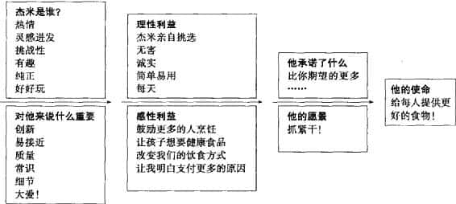

图9.1 杰米·奥利弗的品牌蓝图

定义品牌资产

品牌资产（brand
equity）是赋予产品或服务的附加价值。它反映在消费者有关品牌的想法、感受以及行动的方式上，同样它也反映品牌为公司所带来的价格、市场份额以及盈利能力。

营销人员和研究人员通过许多不同的角度来研究品牌资产。基于顾客的方法是从消费者------无论是个体还是组织------的视角来看待它。基于顾客的品牌资产模型的假设是，品牌力量是来自于顾客在一段时间内对品牌的所看、所读、所听、所学、所想以及所感。

基于顾客的品牌资产（customer-based brand
equity）是品牌知识对于消费者对品牌营销的反应所产生的不同影响。与不能被识别相比，当品牌能够被识别时，消费者对产品及其营销方式表现出较多赞许的反应，品牌则具有正面的基于顾客的品牌资产。反之，在同样的环境下，顾客对品牌的营销活动的反应表现出较少赞同，品牌则具有负面的基于顾客的品牌资产。基于顾客的品牌资产有三个关键的构成要素：

第一，品牌资产来源于消费者反应的差异。如果没有任何差异的话，那么从本质上来说，该品牌产品只是一种大众化产品。此时的竞争主要围绕价格展开。

第二，反应的差异源自消费者所拥有的品牌知识不同。品牌知识（brand
knowledge）由与该品牌有关的所有想法、感受、印象、体验、信念等等组成。尤其是，品牌必须与顾客建立强大、赞许以及独特的品牌联想，如沃尔沃（安全），贺曼（关心）以及哈雷-戴维森（冒险）。

第三，构成品牌资产的消费者不同反应体现在感知、偏好和行为等与品牌营销所有相关的方面。品牌越强大，带来的收益越多。表9.1总结了品牌资产的一些关键利益。

对营销人员来说，建立一个强势品牌的挑战在于确保顾客对产品、服务和营销方案拥有正确的体验，从而创建符合期望的品牌知识。

表9.1 强势品牌的营销优势

-   产品性能的感知改善
-   更大的忠诚度
-   更不易受到竞争性营销行为的影响
-   更不易受到营销危机的影响
-   更大的边际利润
-   消费者对涨价的反应较少弹性
-   消费者对降价的反应较多弹性
-   更强大的贸易合作和支持
-   提升营销沟通的效益
-   可能的特许经营的机会
-   额外的品牌延伸机会

> 苹果电脑（Apple Computer）

> 苹果公司是建设强势品牌的大师，其品牌引起的共鸣跨越了不同代系和国家疆界。藉由传递首席执行官史蒂文·乔布斯（Steven
> Jobs）所界定的使命------"为改变人们生活而创造伟大事物"，苹果公司获得了难以置信的品牌忠诚。该公司创造了大批苹果的布道者，这并不仅仅是因为它有出色的广告，而且还在于公司做任何事情都是为消费者着想。公司的创新产品都是高端设计功能与风格的结合体，最成功的例子莫过于现在广受欢迎的iPod音乐播放器。苹果公司拥有世界范围的150家零售店为品牌助燃。建立零售店是考虑有更多的人能够看到并接触到苹果的产品，看看苹果公司能够为他们做点什么，从而更可能提高它的市场份额。

消费者知识驱动了品牌资产构成的差异。概括来说，我们可以将品牌资产看成为营销人员提供从过去通往未来的一座至关重要的战略之"桥"。

品牌资产如同一座桥梁

从品牌资产的角度来看，营销人员应该把每年所有用于产品和服务上的营销费用看成是对消费者品牌知识的投资。品牌建设的关键因素是投资的质量，在投资金额超过某一最小门槛后，数量就不再是必须的了。如果钱花得并不明智，很有可能在品牌建设中超支。在20世纪90年代，米狮龙（Michelob）、美乐淡啤（Miller
Lite）和七喜（7Up）尽管有相当大的营销支持，但还是眼睁睁看着自己的销售量下滑，这可以表明那是因为他们目标界定以及营销战役执行得太差。

与此同时，营销投资建立的品牌知识为品牌指明合适的未来方向。根据对品牌的所想所感，消费者决定品牌应该走向何处（以及怎样做），允许（或不允许）任何的品牌营销活动或方案。新产品如水晶百事（Crystal
Pepsi）、Levi's定制套装、Fruit of Loom洗衣粉和Cracker
Jack麦片失败的原因是消费者发现它们的品牌延伸是不恰当的。

品牌承诺（brand
promise）是营销人员对品牌应该是什么和应该为消费者做些什么的远景。不管怎么说，品牌的真正价值与前景如何取决于消费者，取决于他们对品牌的知识，对营销活动可能作出的反应就是这种知识的结果。理解消费者品牌知识    在消费者头脑中与品牌产生联系的所有不同事物------是极为重要的，这是品牌资产的基础。

牛津大学的道格拉斯·霍尔特（Douglas
Holt）认为要建立偶像的、领导地位的品牌，公司就必须将文化知识融入品牌中，根据文化品牌化原理来制定战略，聘用并培训文化专家。即使是宝洁，一家对购物者如何感知产品有着悠久历史经验的公司，也开始了如其首席执行官A.G.拉弗雷（A.G.Ufley）所说的与消费者同行的"学习之旅"。"消费者出于对我们品牌的真实感知而拥有它，并参与对它们的创造，"他说，"我们应该学会放手。"汉堡王（Burger
King）就是这样的一家公司。

> 汉堡王（Burger King）

> "如果你有一个全球性的品牌承诺，'用你自己的方式来实现它'，"汉堡王的全球营销、战略和创新总监拉斯·克莱因（Russ
> Klein）如是说，"这事关对顾客的负责，"尽管他们可能会"诋毁"该品牌。此外，克莱因还补充道，在与有着家庭友好形象的奢当劳的竞争中，"对我们来说更重要的是挑衅而非讨人喜欢"，特别针对十几岁的男孩市场的时候。汉堡王无礼的广告战役（adcampaigns）------以令人毛骨悚然的点头国王和可以说话的小鸡为特色，出现在社交网站如YouTube.com以及MySpace.com，这样他们就能根据顾客的反映来获取克莱因所说的"社交联系"的优势。汉堡王鼓励顾客根据他们喜欢的公司画像和产品来建立网上社区。吉祥物"国王"甚至在MySpace.com上还有自己的站点。他的网页这样介绍："只要你愿意成为国王的朋友，他全都接受。"

品牌资产模型

尽管营销人员对基本的品牌化原理已经有了共识，但还是有一些品牌资产模型提供了不同的视角。下面我们重点介绍四种受到较多认可的模型。

品牌资产评估器

广告代理商扬罗必凯（Young and
Rubicam，Y&G）开发出一个称为品牌资产评估器（brand asset
valuator，以下简称BAV）的品牌资产模型。通过对44个国家大约50万消费者的调查，BAV为成百上千的不同品类中的成千上万的品牌提供了一个可以比较的品牌资产测量方法。根据BAV，品牌资产中有五个关键性成分（支柱）：

 

-   差异，测量该品牌与其他品牌不同的程度；
-   活力，测量品牌的动力感；
-   关联，测量品牌吸引力的宽度；
-   尊重，测量品牌被关注及受尊重的程度；
-   知识，测量消费者对品牌的熟悉和亲密度。

差异、活力和关联联合决定了品牌活力强度（energized brand
strength）。这三大支柱指向品牌的未来价值。尊重和知识同时决定了品牌水平（brand
stature），比较像一种对过去业绩的"报告卡"。

这些维度之间的关系------品牌的支柱方式------很大程度上揭示了品牌现在以及将来的状况。品牌活力强度和品牌水平构成了力量方格（power
grid），它描述的是在连续的象限中，品牌循环发展的各个阶段，在每个阶段都有自己典型的支柱方式（图9.2）。强势新品牌的差异和活力都比关联的水平高，而尊重和知识则比较低。领导品牌在所有要素上都显示出了高水平。最后，衰退的品牌显示高水平的知识（这是过去业绩的证据）和低水平的尊重，甚至低水平的关联、活力和差异。

图9.2 BAV力堡方格

BRANDZ

营销研究顾问米尔伍德·布朗（Millward
Brown）和WPP发展了品牌强度模型BRANDZ，它的核心是品牌动力（Brand
Dynamics）金字塔。根据这个模型，品牌建立遵循一系列连续的步骤，每一个步骤都是以上一个步骤的成功为基础的（图9.3）。    

"联结的"消费者在金字塔的顶端，他们与品牌建立了牢固的关系，比在较低层次的消费者花费更多。当然，更多的消费者处于较低层次。而营销人员的挑战就是如何通过营销活动和方案来帮助消费者爬上金字塔的顶端。

Aaker模型

加州大学伯克利分校前营销学教授大卫·阿克（David
Aaker）认为，品牌资产是品牌意识、品牌忠诚和品牌联想的结合，它可以增加或减少产品或服务所带来的价值。根据阿克所述，品牌管理先是发展品牌识别（bmnd
identity）------品牌联想的独特集合，它呈现出品牌代表的是什么和对顾客的承诺以及一种渴望的品牌形象。品牌识别包括8\~12个典型的要素，包括产品范围、产品属性、质量/价值、用途、用户、原产地、组织属性、品牌个性及象征。这其中可以驱动品牌创建方案的重要部分是核心识别要素（core
identity elements）。其他则是延伸识别要素（extended identity
elements），是附加的构成与指引。此外，品牌精髓（brand
essence）能够用简洁且鼓舞人心的方式来传播品牌识别。

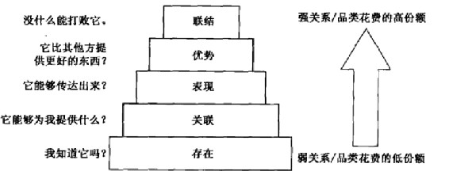

图9.3 品牌动力金字塔

举个例子，根据阿克所述，一家大型工业服务公司Ajax，其品牌精髓是"对卓越的承诺------不管何时、何地、所做何事、核心识别是"卓越的精神"、"团队方案"和"贴合的科技"；延伸识别是"善于处世但不拘小节"、"自信与胜任"、"开放的交流者"、"当地专家的全球性网络"以及"世界健康的支持者"。核心识别要素"团队方案"对由一些自治部门组成的公司来说是非常渴望得到的，且对战略推进的支持是必不可少的。

阿克主张识别应该在一些维度上表现出差异，这意味着在其他方面有共性，应该与顾客产生共鸣，驱动品牌创建方案，反映企业的战略及文化，并且是可信的。可信性建立的基础可以是支撑点，流动资产或方案或战略主动性，或对新的、激活的资产或方案的投资。

品牌共鸣模型

品牌共鸣模型（brand resonance
model）也认为品牌建设是由一系列上升的步骤组成的，自下往上分别是：（1）确保顾客的品牌识别性以及在顾客的头脑中与特定品类或顾客需求有关的品牌联想；（2）藉由将大量有形无形的品牌联想战略性地联系起来，在消费者心中稳固地建立品牌的全部意义；（3）根据与品牌相关的判断和感受引出顾客的正面反应；（4）将对品牌的反应转化成消费者和品牌之间紧密而活跃的忠诚关系。

根据这个模型，四个步骤的制定同时也意味着与消费者建立一个由六个"品牌建立模块"组成的金字塔，如图9.4所示。这个模型强调了品牌的二元性------品牌建设的理性路线是在金字塔的左边，感性路线在右边。

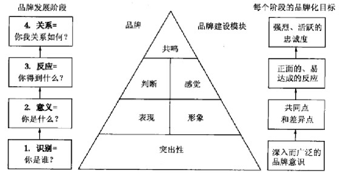

图9.4 品牌共鸣金字塔

万事达卡（Mastercard）就是品牌拥有二元性的一个例子。它既强调信用卡的理性优势------世界范围内的可接受性，同时也强调感性优势------在屡获殊荣的"无价"广告战役中，表达人们购物是为达到某个特定目标。目标本身（一种感受、一项成就，或其他无形的东西）都是"无价"的。

要创建有效的品牌资产就必须达到品牌金字塔的顶端或塔尖，只有把恰当的品牌创建模块放在金字塔模型的合适位置才能实现。

 

-   品牌突出性：在各种购买和消费情境中，顾客如何经常和轻易地想到该品牌。
-   品牌表现：产品或服务如何能够满足顾客的功能性需求。
-   品牌形象：描述的是产品或服务的外在特性，包括品牌试图满足顾客的心理或社会需求的方式。
-   品牌判断：聚焦于顾客自己的个人观点和评价。
-   品牌感觉：顾客对品牌有关的情绪性响应和反应。
-   品牌共鸣：指顾客与品牌关系的性质，反映他们感觉双方"同步"的程度。共鸣是顾客与品牌之间的心理纽带的强度或深度，同时也反映了这种忠诚造成的行为水平。拥有高共鸣性的品牌有哈雷-戴维森、苹果和eBay。福克斯新闻发现营销计划造成的共鸣和参与的较高水平，常常导致广告产生较强的回忆度。

### 建立品牌资产

营销人员通过与合适的消费者创建正确的品牌知识结构来建立品牌资产。这个过程依赖于所有与品牌相关的接触点，不管是否由营销人员发动。然而，从营销管理的视角看，品牌资产的驱动因素主要包含以下三个方面：

-   1.构成品牌元素和识别的初始选择（品牌名称、网址、标识、象征、形象人物、代言人、口号、歌曲、包装以及标记。通过开发出一系列家庭无毒清洁产品，采用明亮的颜色和圆滑的设计，总体上在品类中与众不同，Method在2005年间销售额猛增到3200万美元。因为广告预算有限，因此公司相信必须在吸引人的包装和创新的产品上猛下工夫，以传达品牌定位。

-   2.产品或服务以及相应的营销活动和营销支持方案。Liz
    Claiborne成长最快的品牌是Juicy
    Couture，这种轮廓鲜明的潮流运动服装和配饰对男士、女士和孩子而言，在生活方式方面而言，具有一种很强的吸引力。作为一个定位于"买得起的奢侈品"的品牌，其通过有限的分销渠道、有点伤风败俗的名字以及反叛的态度，创立了它特有的威望。

-   3.其他与一些实体联系起来的可以间接转移给品牌的联想（一个人、地方或事件）。新西兰的伏特加"零下42"（42
    Below），其品牌名称就囊括了穿越新西兰的一个纬度和酒精含量的百分比。所有包装和其他可见线索的设计都发挥出了产地纯净的感知，从而传达品牌定位。

选择品牌元素

品牌元素（brand
elements）是那些可以识别并区分品牌的特征化设计。大多数强势品牌都使用多重品牌元素。耐克（Nike）就有非常独特的让人感觉可以发出"嗅"声的标识，"放胆做"（Just
Do It）的口号，并且"Nike"这个名字便来源于胜利女神。

营销人员应该选择那些可以创建尽可能大的品牌资产的元素。如果品牌元素是消费者知道的所有，那么他们对产品的想法和感觉就是这些元素对于创建品牌资产能力的测试。一个品牌元素对品牌资产提供正面的贡献，例如，传达有价值的联想或反应。如果只看名称，消费者会期望CobrStay唇膏能够持续长久，而SnakeWell则是健康的零食。

选择品牌元素的标准

选择品牌元素有六个主要的标准。难忘度、意义性和喜爱度是"品牌创建"的要素；转换力、适应性和保护力是"防御性"的，以在面对机会和限制时，如何使得一个品牌元素中的资产发挥出优势并得到保护。

-   1.难忘度------消费者能够轻易地再认和回忆该品牌元素吗？这在购买和消费中都是真实的吗？短的名称，如汰渍、佳洁士和Puffs都是很难忘的品牌元素。

-   2.意义性------对相应的产品类别该品牌元素是否可信且具有暗示性？它是否能够暗示该产品的成分或者暗示可能使用该品牌的人员属于哪种类型？考虑品牌名称的内在含义，如Die
    Hard自动电池、Mop&Glo地板蜡、Iean Cuisine低卡路里冷冻菜。

-   3.喜爱度------品牌元素带来怎样的审美吸引力？在视觉上、言语上或其他方式上，它是令人喜爱的吗？具体的产品名称诸如新奇士（Sunkist）、Spicand
    Span以及Thunderbird就能唤起很多想象。

-   4.转换力------品牌元素能够用来推出同类或者不同种类的新产品吗？它能够增加品牌资产使其跨越地理边界和细分市场吗？虽然亚马逊（Amazons.com）最初是在线图书销售商，但它足够明智，没有称"图书就是我们"。因为亚马逊以它是世界上最大的河流而闻名，这个名字表明该网站可以销售广泛品种的商品，这是对公司现在销售多样化产品的一个非常重要的描述符号。

-   5.适应性------品牌元素具有怎样的适应性和时新性？在贝蒂·克洛克（Betty
    Crocker）的75年里，她的脸经过了超过8次的改变，她没有一天看起来是超过35岁的！

-   6.保护力------品牌元素具有怎样的法律保护力？具有怎样的竞争性保护？那些变成与产品类别同义的品牌名称，如Kleenex、Kitty
    Litter、Jell-O、Scotch
    Tape、Xerox和Fiberglass，应该要着力保护商标权，不要变得一般化。

发展品牌元素

品牌元素能够在品牌创建中扮演许多角色。如果消费者在作出产品购买决策时不调查许多信息的话，那么品牌元素就应具有内在的描述性和说服性，使消费者容易对品牌进行再认和回忆。喜爱度和品牌元素的吸引力在导致品牌资产形成品牌意识和品牌联想方面也起着关键的作用。Keebler小精灵提高了家庭式的烘焙质量，同时为小甜饼系列增添了魔幻和有趣的气氛。

当然，品牌名称并不是唯一重要的品牌元素。通常来说，品牌利益越不具体化，品牌元素抓住无形特征就越重要。许多保险公司都使用实力（Prudential的直布罗陀之岩，Harford的雄鹿）、安全（Allstate的"好帮手"，Traveller的伞，消防员基金会的安全帽）或者是前两者的结合（Fortis的城堡）的象征。

正如品牌名称那样，口号也是建立品牌资产极为有效的手段。它们能像一个"挂钩"或者"把手"一样帮助消费者领会品牌是什么以及什么使得品牌如此特别，概括并表达营销计划的意图。想想口号中的品牌内在意义，例如，"就像一位好邻居，国家农场（State
Farm）就在这里"、"没有谁能比得上Deere"以及安飞士（Avis）租车的"我们更加努力"。

> 安飞士（Avis）

> 一个利用口号来建立品牌资产的经典例子是安飞士在其41周年时发起的"我们更加努力"。1963年，当广告活动开展时，安飞士尽管耗资巨大却被广泛认为是稍逊于市场领先者赫兹（Hertz）的第二大租车公司。DDB广告公司的客户经理在拜访安飞士的管理层时问道："贵公司作了哪些优于其他公司的事情让我们可以宣传呢?"一位安飞士经理回答："我们之所以更加努力是因为我们必须这样做。"这句话被DDB的某位职员记录了下来，后来成为了广告战役的核心。因为这句话过于直率，有着打破常规的真诚，安飞士一度犹豫是否将之投放市场，但因为他们必须传递这样的承诺，最终还是决定将之面世。但也正是因为在安飞士所有员工特别是在一线租车柜台的员工中根植"我们更加努力"这种理念，安飞士公司通过广告中的这句标语成功创建了公司文化和品牌形象，从而在今天依然屹立不倒。

但是选择有内在意义的名称，它的灵活性就比较小，很难增添其他的意义或者更新它的定位。

设计全面营销活动

品牌并不是仅仅通过广告建立的。顾客通过一系列的联系和接触点来了解一个品牌：个人观察及使用、口碑、与公司员工的互动、网上或者电话体验以及付费交易经历。品牌接触（brand
contact）是一位顾客或潜在顾客对品牌、产品品类或者与营销者的产品或者服务有关的市场的任何信息关联体验，不管是正面的还是负面的。公司必须努力管理这些体验，就像投入广告中的努力一样。

近些年来，营销方案背后的战略和战术都发生了戏剧性变化。营销人员通过许多途径来创设品牌接触，建立品牌资产，如俱乐部、消费者社区、购物展示、节事营销、赞助、工厂参观、公共关系和新闻发布会以及社会善因营销。激浪（Mountain
Dew）的营销人员开展了多个城市的激浪极限运动巡回赛，让运动员们参加滑板比赛、自行车越野赛和自由式摩托车越野赛，从而争取喜欢妄想但反复无常的12\~24岁的目标市场。

除去那些特殊的工具或者途径，全面营销人员在设计品牌创建营销方案时强调三大重要的新理念：个人化、整合化和内在化。

个人化

因特网的迅速发展为个人化营销提供了良机。营销人员正不断拋弃大众营销实践，其在20世纪50年代、60年代和70年代是建立品牌的强大武器，取而代之于新的方法。事实上这是营销实践回到一个世纪前的一个"返祖现象"，那时商人凭着名字去认识他们的顾客。个人化营销（personalizing
marketing）要确保品牌和它的营销活动尽可能地与尽可能多的顾客相关，在没有任何两个顾客是完全相同的前提下，这是一项挑战。

> 琼斯汽水（Jones Soda）

> 彼特·范·斯托尔克（Petervan
> Stolk）创立了琼斯汽水，其假设是如果Y一代的消费者自己发现了一种新软饮料品牌，他们将会更容易接受它。起初琼斯汽水只在售卖冲浪板、滑雪板和滑板的商店里出售。琼斯汽水鼓励"粉丝"（fans）发送个人照片到其网站，这可能被用于琼斯汽水的标签上。虽然从成千上万张照片中挑选出极少量照片的工作非常艰巨，但是这种活动旨在创建相关性以及情感联系。顾客也能购买带有定制标签的瓶子。琼斯汽水以不寻常的风味出名，如土耳其肉汁、颠倒凤梨、白浆果（原文Berry
> White，是同名歌星的双关语）、紫色胡萝卜、晕乎柠檬等等。不仅如此，该公司也在瓶盖下面印上一些从顾客中收集来的智慧短语以增加额外的相关性和差异性。所有这些活动都是物有所值的，2006年公司的收益超过3900万美元，年增长率为15%\~30%。

为了适应消费者对个人化日益增长的需求，营销人员使用了很多的概念，如体验营销、一对一营销、许可营销。从品牌化的观点看，这些不同的概念都是让消费者在与品牌的关系中变得更活跃。

许可营销（permission
marketing），是在得到了消费者的允许之后进行的营销活动，是建立在营销人员不再使用大众多媒体战役的"打扰营销"的假设基础上的。根据技术先锋塞思·戈丁（Seth
Godin）的理论，营销人员尊重消费者的意愿，只有当消费者表达出有意更关注品牌的时候才发送信息，这种方式能够与消费者建立强大的关系。戈丁认为许可营销可行，因为它"可预期、个人化且有相关性"。

许可营销，跟其他个人化概念一样，是假设消费者知道自己想要什么。但是在许多情况下，消费者对此并不明确，模棱两可，甚至有相冲突的偏好。参与式营销（participatory
marketing）相对许可营销来说可能更加恰当，因为营销人员和消费者需要一起工作，以解决公司怎样做才能最好地满足消费者。

整合性

传统的"营销组合"概念和"4P"观念已经不能充分描述现代的营销方案。整合营销（integration
marketing）是要组合并匹配营销活动来最大化个体和整体的效用。要达到这一点，营销人员需要各种不同的营销活动来强化其品牌承诺。橄榄园（Olive
Garden）公司已经成为美国第二大休闲餐饮连锁店，2005年北美582家餐厅的销售额达26亿美元并且利润创新高，这部分归功于他们建立的一个彻底的整合营销方案。

> 橄榄园（Olive Garden）

> 橄榄园的品牌承诺是"理想的意大利式家庭餐"，其特色为"新鲜、简单、美味的意大利食物"，"辅以一杯美酒"，在"舒适的家居式环境"中由"像家人一样待您的人"为您服务。为了实现该品牌承诺，橄榄园派出精选的管理人员和服务员去意大利进行文化沉浸之旅；引入意大利托斯卡尼烹饪机构以创造出新的菜肴；为员工举办品酒工作坊，为顾客进行店内品酒会；改造酒店从而给顾客全新的托斯卡纳式农舍景象。包括店内、员工和大众媒体信息在内的沟通都强化了品牌承诺和广告口号："当您来到这里，您就是我们的家人。"

我们可以根据影响品牌意识以及创建、保持或加强品牌形象的效益和效率来评价所有的整合营销活动。

让我们区分品牌识别和品牌形象。识别（identity）是一家公司用于识别或定位它自身或其产品的方式；形象（image）则是公众实际感知它们的方式。为在消费者心目中留下合适的形象，营销人员必须通过任何可用的沟通工具和品牌接触来传达品牌识别。识别应该通过广告、年度报告、小册子、目录、包装、公司文具以及商业卡片进行扩散。如果"IBM意味着服务"，那么这条信息必须在符号、色彩、口号、环境、节事和员工行为中得到表达。虽然中国正在快速成为经济大国，但是它在发展有关品牌化方面的竞赛中还是迟了------不论是品牌形象还是品牌识别，但有些中国公司还是学得挺快的。

> 海尔（Haier）

> 如果有一家公司能够打破中国公司只会生产低价劣质产品的形象的话，那么这个公司就是白色家电生产商海尔无疑。吸收了日本、韩国公司的成功战略，海尔先在国内做大市场后再进入竞争激烈的海外市场。自从1999年进入美国市场，它的可放置于大学宿舍的迷你冰箱成为销售业绩最好的品牌。为了不再有以前生产仿效对手产品的那种名声，海尔不得不依靠创新。海尔真正引起消费者注意的是它的自由立式家庭冷藏酒柜，这是为日益增长的酒爱好者而设计的冷藏酒柜。海尔追求更多溢价形象的另一种做法是生产一系列生态友好的、高科技含量的电器，价格在600~1500美元，而它的白色家电价位在200~300美元。在它的最新供应品中，它的Genesis上载式洗衣机和洗碟机带有粒子传感器，能够探测到衣服和碟子洗净的时间，同时自动关闭以节省能源。

不同的营销活动有不同的长处，能达成不同的目标。因此营销人员应该从事整合营销活动，因为每种活动在品牌资产的建立和维持中都起着独特的作用。虽然米其林（Michelin）会投资研发，并从事广告、促销以及其他沟通方式来加强其"安全"的品牌联想，但是它也可能选择赞助商活动，以确保它看起来与时俱进。营销方案应该把所有的活动结合起来，使得整体强过单个部分之和。换句话来说，任何一项的效果都应通过其他项的作用来加强或者补充。

内部化

营销人员现在必须"说到做到"地去传递品牌承诺。他们要采用一种内部化的视角来确保员工以及营销伙伴意识到并且理解了基本的品牌化理念以及他们可能会怎样有助于或者伤害到品牌资产。内部品牌化（internal
branding）是有助于告知并鼓舞员工的活动和过程。对服务企业和零售商来说，让所有的员工都对品牌及其承诺有着与时俱进的、深刻的理解是非常关键的。全面营销人员必须更进一步，培训并鼓励分销商和经销商为顾客提供周到的服务。受训不良的经销商会抵消为建立强势品牌形象付诸的努力。

当顾客体验公司传递的品牌承诺时就产生了品牌联结（brand
bonding）。顾客与公司员工和公司传播的所有接触都必须是正面的。除非公司里的每个人都实践品牌，否则品牌承诺不能被传递出去。迪士尼在品牌内部化以及员工支持品牌方面非常成功，以至于他们常在其他公司为员工举办"迪士尼风格"的研讨会。

> 礼来医药公司（Eli Lilly）

> 2000年，礼来医药公司带着新的广告语"解您所急"开始了一项新的品牌建立活动，其目标是将Eli
> Lilly建立成一个能够为医生、病人、医院、健康维护组织以及政府等所关心的问题提供可靠答案的制药公司。为了让礼来医药公司所有员工都能够传递正确的答案，该公司发起了一项综合性品牌一行动培训方案。这会教育员工，使他们融入到公司品牌的角色中，即礼来医药公司想要的定位，并且让员工明白他们的行为如何影响顾客体验和关键接触点。礼来医药公司也建立了品牌治理结构，开始测度公司品牌形象，为公司品牌化努力建立一套沟通计划。

当公司员工关心并信任品牌时，他们就会更加努力工作，同时对公司有更大的忠诚度。内部品牌化的一些重要原则是：

-   1.选择正确时机------转折点是抓住员工注意和想象力的理想时机。英国石油（BP）公司发现为适应外部重新定位而进行的内部品牌化战役------"超越石油"，让绝大部分员工都对新品牌有积极的认识，并认为公司正在朝着正确的方向前进。

-   2.连接内部及外部营销------内部和外部信息都必须匹配。IBM的电子商务战役，不仅是改变公司在市场中的公众感知，而且也是给员工发出信号------IBM决心成为因特网技术的领头羊。

-   3.让品牌因为员工而生动------一项专业的品牌化运动应该建立在营销调研和营销部门指导的基础上。内部沟通应该富有信息并充满活力。为了提高员工士气，米勒公司挖掘它的酿造遗产来提高员工的自豪感和热情。

次级联想的扛杆作用

第三个也是最后一个建立品牌资产的方法，实际上是"借"，即将品牌与那些可以把意义传递到消费者记忆中的其他信息联系起来，从而创建品牌资产（图9.5）。

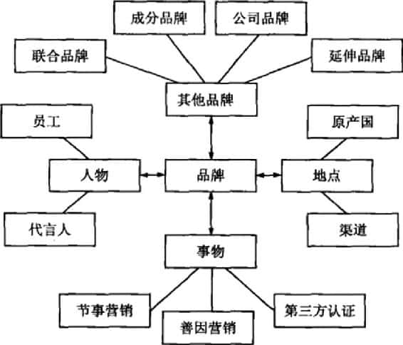

图9.5 品牌知识的次级来源

这种"次级"品牌联想能够将品牌与其他来源联系起来，例如公司自身（通过品牌战略），国家或其他地理区域（通过产品来源地认证），分销渠道（通过渠道战略也可以是其他品牌（通过成分品牌或联合品牌），或者是形象人物（通过许可），或是代言人（通过背书），或是体育或文艺节事（通过赞助），或是其他第三方来源（通过获奖或是评论）。

例如，假设滑雪板制造商Burton，同时也生产滑雪的靴子、捆绑物、衣物以及外套，决定向外界推出一款名叫"Dominator"的冲浪板。Burton通过与顶尖职业滑雪选手的密切合作，创建一个遍及全国的强大业余滑雪爱好者社区，获得了超过1/3的滑雪市场，要想建立营销方案来支持新的Dominator冲浪板，Burton可以在以下方面建立品牌的次级联想：

 

-   通过对公司品牌的联想杠杆作用对产品"亚品牌化"，可以称其为"Burton的
    Dominator"。消费者在评价该新产品时就会受到他们对Burton感知的影响以及这种知识如何预估Burton冲浪板质量的感知影响。

 

-   Burton可以依靠它的新英格兰原产地，但是这种地理位置看起来与冲浪并没有什么关系。
-   Burton也可在比较受欢迎的冲浪板门店出售，希望能够利用它的可信性而对Dominator品牌户生影响。
-   Burton可以通过与它的一个泡沫或强化塑料材料的强势成分品牌融合（像Wilson将它的Pro
    Staff经典网球鞋的鞋底，与固特异轮胎橡胶融为一体），形成联合品牌。
-   Burton可以找寻一个或多个顶级职业冲浪选手为冲浪板提供背书，或者是可以赞助一个冲浪比赛甚或整个职业冲浪协会（ASP）的世界巡回赛。
-   Burton可通过第三方来源如《冲浪者》或《冲浪》杂志来公布受欢迎产品排名并为它们提供保证。

这样的话，不依赖于由冲浪板自身、品牌名称或营销方案的任何其他方面所产生的联想，Burton可以通过把品牌与这些实体联系起来从而创建品牌资产。

### 测量品牌资产

考虑到存在于消费者心中的品牌以及他们对营销反应的改变方式，我们给出两种测量品牌资产的方法。间接方法是通过识别和追踪消费者品牌知识结构来评估品牌资产的潜在资源。直接方法就是评估品牌知识对消费者对于营销的不同方面反应的实际影响。"营销视野：品牌价值链"展示了如何将这两种方法相结合。

\@营销视野：品牌价值链

品牌价值链（brand value
chain）是一种评价品牌资产来源和结果的结构化方法，也是营销活动创造品牌价值的方式（图9.6）。它是建立在几个假设基础上的：

第一，品牌价值创造过程是假设在开始阶段，公司就针对实际或潜在顾客进行营销方案投资。任何对品牌价值发展有贡献的营销方案投资，不管是有意或无意的，都归入此类，包括产品调研、开发和设计，交易或中间商支持以及营销沟通。

其次，假设顾客心智会随着营销方案的结果而变化。问题是怎么变化。反过来这种变化被认为也会影响品牌在市场中的表现，这种表现是通过收集个体顾客决定购买多少、何时购买、愿意支付多少等等的数据得到。最后，投资方考虑市场绩效和其他一些因素，如收购中的替代成本和购买价格，来评估总体的股东价值以及特定的品牌价值。

该模型也假设一些联结因素在这些阶段之间起到调节作用，决定哪种价值在一个阶段产生并且转换到下一个阶段的程度。三个乘数器的集合（方案乘数器、顾客乘数器、市场乘数器）调节了营销方案和接下来三个价值阶段之间的传递。

方案乘数器决定营销方案影响顾客心智的能力，也是方案投资质量的一个函数。顾客乘数器决定顾客心智中创造的价值对市场业绩影响的程度。这个结果依赖于顾客外部的一些背景因素。

三个因素是：

竞争优越性------其他竞争品牌的营销投资的数量和质量效果如何？

渠道以及其他中间商支持------各类营销伙伴投入的品牌支援和销售努力如何？

顾客规模和概况------被品牌吸引的顾客有多少，什么类型，盈利与否？

市场乘数器决定由品牌的市场业绩显现的价值被股东价值体现的程度。它部分决定于财务分析者和投资者的行为。

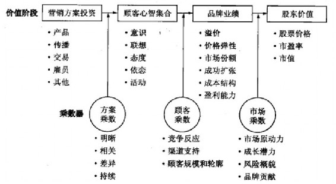

图9.6 品牌价值链

这两种方法是互补的，营销人员可以同时使用它们。从另一个方面来说，由于品牌资产要发挥有效的战略作用，指导营销决策，因此营销人员必须完全理解：（1）品牌资产的来源以及它们如何影响利益的结果；（2）这些来源以及结果是怎样变化的，如果还考虑时间的话。品牌审计对前者非常重要，而品牌追踪则针对后者。

品牌审计（brand
audit）是聚焦于消费者的一系列程序，用来评估品牌资产的健康状况，揭示品牌资产来源，同时建议改善品牌资产、发挥品牌资产杠杆作用。当营销人员在战略方向上有任何重要转变的时候，他们都应该进行品牌审计。定期审计，如每年进行品牌审计，等于将营销人员的手指放在品牌的脉搏上，能够使得营销人员对品牌的管理更加主动，反应也更加灵敏。对管理者来说，在进行营销计划的时候，品牌审计是特别有用的背景材料。

品牌追踪研究（brand-tracking
studies）是随时间的推移，从消费者那里收集常规性的数据，为营销人员提供关于品牌和营销方案在关键维度上执行的连续的、基础性的信息。追踪研究是了解品牌价值在何地、有多少、以何种方式创造的一种手段，使得日常决策变得容易。

品牌估价

营销人员应该区分品牌资产与品牌估价（brand
valuation），后者是评估品牌总体财务价值的工作。表9.2展示了2006年世界上最有价值的品牌排名。在这些著名的公司里，其典型特征是品牌价值都超过整个公司市值的一半。桂格麦片（Quaker
Oats）的合伙创建人约翰·斯图亚特（John
Stuart）说过："如果生意可以被瓜分的话，我愿意将土地、砖头以及灰浆都给你们，我拿走品牌和商标，我会过得比你们好。"由于评价的任意性，美国公司并不将其列入资产负债表中。然而，在英国和澳大利亚的一些公司中，都认定品牌资产是有价值的。"营销视野：什么是品牌所值?"回顾了一种品牌估价的通行方法。

表9.2 2006年世界十大最有价值品牌

  名次    品牌        2006年品牌价值（10亿美元）
  ------- ----------- ----------------------------
  1       可口可乐    67 
  2       微软        56.93 
  3       IBM         56.2 
  4       通用电气    48.91 
  5       英特尔      38.32 
  6       诺基亚      30.13 
  7       丰田        27.94 
  8       迪士尼      27.85 
  9       麦当劳      27.5 
  10      奔驰        22.13 

\@营销视野：什么是品牌价值

顶级品牌管理公司Interbrand开发了一种模型，规范地评估一个品牌的货币价值。Interbrand将品牌价值定义为一个品牌未来预期收益的净现值，深信在决定品牌价值时营销和财务分析都是同等重要的。它的过程包括以下五个步骤（图9.7为简图概观）：

-   1.市场细分。品牌估价过程的第一个步骤是划分市场，依照品牌销售给各自独有的顾客细分市场，从而有助于确定品牌经济价值的差异。

-   2.财务分析。Interbrand评估购买价格、数量和频次，以帮助计算品牌未来销售量、利润和准确预测。特别地Interbrand对品牌的权益、产业和顾客偏好以及每个部门的历史财务业绩都有详细记录。一旦确立了品牌收益（branded
    revenues），它扣减所有相关的运作成本，就得到利息和税收之前的收益（EBIT）。同时它也会扣除合适的税收以及一些当下正在进行的生意所需的资本费用，从而只留下无形收益，也就是收益来源生意的无形资产。

-   3.品牌角色。Interbrand首先确认需求的各种驱动因素，接着确定品牌直接影响各项的程度，从而得出每个细分市场中归功于品牌的无形收益比例。品牌化角色（role
    of
    branding）的评价建立在市场调研、客户反馈、访谈的基础之上，代表品牌生成无形收益的百分比。无形收益乘上品牌化角色就产生了品牌收益。

-   4.品牌强度。接着Interbrand评价品牌强度概况以预测品牌未来的收益水平。这个步骤依赖于竞争性标杆以及对品牌的市场、稳定性、领导地位、成长趋势、支持、地理覆盖和法律保护等的结构化评价。对每个细分市场，lntertxand都会应用产业和品牌资产计量以确定品牌的风险溢价。公司的分析员通过给以政府债券为代表的无风险利率增加品牌风险溢价得到总体的品牌贴现率（brand
    discountrate）。品牌贴现率用于品牌收益预测，产生品牌收益（brand
    earnings）的净现值。品牌强度越大，贴现率越低，反之亦然。

-   5.品牌价值计算。品牌价值是品牌未来收益的净现值（NPV），以品牌贴现率折算。NPV的计算包括预测时期和预测之外的时期，反映了品牌持续产生未来收益的能力。

Interbrand不断使用品牌价值评估作为一个动态的战略工具，来识别并最大化品牌投资的回报，横跨种种领域。

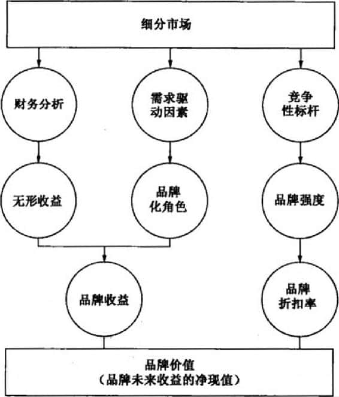

图9.7 Interbrand品牌估价方法

### 管理品牌资产

有效的品牌管理需要一种长期的营销活动观点。因为消费者对营销活动的反应取决于他们对一个品牌的所知和所记，短期的营销活动通过改变品牌知识，必然增加或者降低未来营销活动的长期效果。

作为公司主要的持久性资产，品牌需要被小心管理才不至于贬值。许多70年前的领导品牌至今仍然稳居领导地位，如箭牌、可口可乐、亨氏以及金宝汤，这是它们不断改进产品、服务和营销的结果。

品牌资产通过营销活动一致性地传达品牌意义而得到强化：（1）品牌代表什么产品，它的核心利益是什么，它将满足什么样的需求；（2）品牌是如何使产品看起来更优良，哪种强大的、令人喜爱的、独特的品牌联想应该存在于消费者的头脑中。欧洲最强势品牌之一妮维雅（Nivea），通过仔细的设计和执行品牌延伸，将其从护肤霜品牌延伸至皮肤护理以及个人护理品牌，在更广的领域中强化其"温和"、"优雅"和"关爱"的品牌承诺。

强化品牌资产要求在整个营销方案中有创新和相关性。品牌必须不断向前，但是要朝着正确的方向，有新的、令人喜爱的产品及营销方式。那些止步不前的品牌，如凯马特（Kmart）、李维斯（Levi
Strauss）、Montgomery
Ward、Oldsmobile以及宝丽来（Polaroid），它们的市场领导地位在不断退缩甚至消失不见。

品牌强化的一个非常重要的方面就是在数量和种类上提供持续的营销支持。持续性并不意味着无变化：许多战术上的变动对维持品牌的战略性推进并保持其方向是非常必要的。除非营销环境有一些变化，否则便没有必要偏离原本成功的定位。但是当有必要变化时，营销人员就应该理直气壮地保护和保卫品牌资产的来源。

> 沃尔沃（Volvo）

> 为了争取不同的受众，沃尔沃在20世纪90年代后期从它"安全"的遗产转移，推广驾驶乐趣、速度和性能。1999年被福特收购后，沃尔沃丟弃了它的"ReVOLVOluition"主题广告战役，重新回到它的品牌根基，以挽救日益下滑的销售业续。但是，沃尔沃的定位是更新的，传递其"主动安全"以超越品牌的死板、坚固的"被动安全"形象。凭借最大化安全的产品介绍，同时仍然围绕其风格、性能以及奢华，沃尔沃在2003年创下了年度销售纪录。

在管理品牌资产时，营销人员必须认识到以下两者关系的平衡，一种是加强品牌、强化其意义的活动，例如，一种广受欢迎的新产品改进，或者是一种富有创意的广告战役；另一种则是那些发挥现有品牌资产的杠杆力，或从中借过来的活动，目的是收获一些财务利益，如仅是强调低价的短期促销折扣。在某种意义上，如果品牌强化失败，将会削弱品牌意义和品牌形象。

品牌复兴

消费者品位和偏好的变化，新的竞争者和新科技的出现，或者是营销环境的任何新发展，都可能影响到一个品牌的命运。实际上每个产品类别中，那些曾经著名和受尊敬的品牌，如SmithCorona、Zenith和TWA，都经历过困难时期甚至因此消失。不过，近些年来，许多品牌经过管理重新归来，给人留下深刻印象，就如营销人员为消费者带来品牌的新生命。大众、爽健（Dr.Scholl's）和Hyperion
Solution软件近些年都不同程度地成功扭转了其品牌命运。

通常，品牌复兴的第一步是要了解品牌资产的来源开始于什么，那些积极的品牌联想丢失了他们的强项以及独特性了吗？有没有消极的品牌联想与品牌产生关联？然后决定是否坚持原来的定位或者重新定位，如果是后者的话，新的定位如何？有时候实际的营销方案就是问题所在，因为它在传递品牌承诺的时候操作失当。此时，一种"重回基础"的战略可能是有意义的，正如哈雷-戴维森（Harley-Davidson）所做的一样。

> 哈雷-戴维森（Harley-Davidson）

> 1903年建立于美国威斯康辛州的哈雷-戴维森几乎两次遭遇破产，但是现在却成为世界上最有名的机动车品牌之一。在20世纪80年代可怕的金融危机中，哈雷孤注一掷，不明智地许可其名字用到烟酒冷藏器上。尽管消费者非常喜爱这个品牌，但仍因为产品质量问题，销售量不断下降，因此哈雷一方面通过改进制造流程重新恢复声誉，同时它也通过名叫"哈雷车电群体"（Harley
> Owners
> Group，HOG）的车主俱乐部形式赞助自行车赛、慈善驾行和其他摩托车活动。哈雷-戴维森通过草根营销继续推广它的品牌，现在它正处于供不应求的令人羡慕的地位。

在其他情况下，如果老的定位不再可行，那么"重新创造"的战略是非常必要的。激浪（Moutain
Dew）就彻底修正了它的品牌形象，成为软饮料的强势品牌。就像它的历史所揭示的，通常是复兴一个活着的但或多或少被遗忘的品牌容易些。

> 激浪（Moutain Dew）

> 百事最初在1969年推出了激浪，以带有乡村气息的口号"呀呼！激浪！让你透心凉"来营销。到20世纪90年代，尽管试图塑造与户外活动相关的形象，但品牌的销售还是缺乏活力。为了扭转品牌颓势，激浪更新了包装，推出了以一群不知名的年轻男士------"激浪男子"为特色的广告。他们一边参加极限运动，如蹦极、高空跳伞以及滑雪板，一边喝激浪。品牌口号变成"就喝激浪"（Do
> the
> Dew）。对苏打饮料的年轻饮用者的成功营销，使得激浪在2005年超过百事轻怡（Diet
> Pepsi），挑战健怡可口可乐（Diet
> Coke），按市场份额成为市场第四位的软饮料。

很明显，品牌复兴战略是一个连续的统一体，其纯粹地"重回基础"在一端，纯粹地"重新创造"在另一端，在中间存在许多两者结合的做法。几乎所有品牌复兴的做法都是开始于产品。通用汽车通过新的设计重新定义了凯迪拉克的外观和风格，如CTS小轿车、XLR跑车和ESV多功能运动型车，挽救了衰退中的凯迪拉克。

### 设计品牌化战略

一个公司的品牌化战略反映了公司在销售不同产品上所运用的共同或特有的品牌元素的数量和性质。决定如何对新产品进行品牌化是尤其关键的。当一个公司推出一项新产品时，一般有三种主要选择：

-   1.可以为新产品发展新的品牌元素。

-   2.可以运用一些既有的品牌元素。

-   3.可以把新的和既有的品牌元素结合起来使用。

当一个公司想要利用已建立的品牌来推出新的产品时，这个产品叫品牌延伸（brand
extension）。当营销人员将一个新的品牌与既有品牌结合起来，这种品牌延伸也可以称为副品牌（subbrand），例如好时（Hershey
Kisses）糖果、Adobe Acrobat软件、丰田佳美（Toyota
Camry）汽车和美国运通蓝卡（American Express
Blue）。给予品牌延伸或副品牌生命的既有品牌是母品牌（parent
brand）。如果母品牌已经通过品牌延伸与多种产品联系起来了，那么它就可以称为家族品牌（family
brand）。

品牌延伸一般可分为两类：产品线延伸（line
extension），是母品牌在它目前服务的产品类别中又覆盖了新产品，例如新风味、形式、色彩、成分和包装规格。达能（Dannon）历年来通过产品线延伸推出了多种类型的达能酸奶------水果的、全自然风味的和混合水果的。在类别延伸（category
extension）中，母品牌是要用来进入一个与现有产品类别不同的大类，如瑞士军刀（Swiss
Army）手表。本田公司就将其公司名称覆盖到不同的产品上，如汽车、摩托车、扫雪机、割草机、船用引擎和雪地车。这让本田公司做广告时，声称他们能把"六辆本田放在一个两车位的车库中"。

品牌线（brand
line）包括了所有的产品------原始产品以及产品线延伸和类别延伸的产品，它们都在特定的品牌下出售。品牌组合（brand
mix）或品牌聚合（brand
assortment）是特定的销售商可以销售给购买者的所有品牌线的集合。而现在很多公司都推出品牌变体（branded
variants），就是提供给特定的零售商或者分销渠道的特定品牌线，这源自零售商给制造商的压力，要求提供差异化的供应。一家照相机公司可能会把低端产品提供给大众化商家，同时把有限的高端产品供应给专业相机商店。华伦天奴（Valentino）可能为不同的百货商店设计和供应不同的套装和夹克产品线。

特许商品（licensed
product）是指公司品牌被特许给实际生产该产品的其他制造商使用。公司通过特许大范围的产品使用它们的企业名称及形象------从床上用品到鞋类制品一使得特许成为一项有着350亿美元的大生意。拥有600种产品和150家被特许的商家的吉普（Jeep）公司，其特许方案覆盖了从轻便婴孩车（为父亲的长手臂而造）到服装（含特氟伦的斜纹粗棉布）的所有产品，因为他们将公司品牌定位为"生活无局限"。特许经营的收益从2004年到2006年增长了20%。

品牌化决策

品牌化战略的第一个决策为是否给产品建立一个品牌名称。当今，品牌化显示出了强大的力量，几乎任何事物都是被品牌化的。假设一家公司准备为其产品或服务打品牌，那么就必须选择使用哪个品牌名称。通常有四种决策：

 

-   个别名称（individual names）。通用磨坊（General
    Mills）就使用了个别名称，例如Bisquik、金牌（Gold Metal）面粉、Nature
    Valley格兰诺拉棒、Old El Paso墨西哥食品、Pop
    Secret爆米花、Wheaties麦片粥和伏沛蕾（Yoplait）酸奶等。个别名称战略的主要好处就是公司并不会将其声誉与产品套在一起。如果产品失败或者出现质量低下，公司名称或形象不会受损。公司通常在相同的产品种类中为不同质量的产品线使用不同的品牌名称。达美航空公司就将其低端航班命名为Song，部分原因是要保护达美航空公司的品牌资产，这个新航班的最终失败表明，这种命名策略是一种富有预见的行动。UTC科技也依赖于个别名称战略。

> UTC科技

> UTC的品牌投资组合中包括奥的斯（Otis）电梯、开利（Carrier）空调、Sikorsky直升机以及Pratt
> &
> Whitney喷气式发动机。大部分的品牌名称都是发明产品或在几十年前创建公司的人名，在企业购买市场上，这些名称具有更大的影响力和公认力。母品牌UTC只对小量但有足够影响力的受众做广告，如纽约和华盛顿的财务社团或者意见领袖。毕竟，母品牌创建于1972年，员工们对UTC旗下的独立公司是忠诚的。"我的理念一直都是运用子公司的商标来提升母品牌的认知度、品牌接受度和知名度。"UTC的CEO乔治·大卫（George
> David）如是说。

 

-   通用家族名称（blanket family
    name）。许多公司如亨氏（Heinz）和通用电气，在所有的产品范围上都使用公司名称。使用这种通用名称花费很少，因为公司不需要进行"名称"研究以及为创建认知而花费大量广告费用。金宝汤（Campbell
    Soup）在推出其新汤料的时候就利用公司名称作为品牌，这不仅非常简单而且获得了即刻认知。如果制造商的名称好的话，新产品的销售就可能是强健的。有关创新、专业以及信赖的公司形象联想能够直接影响消费者的评价。最后，公司品牌化战略能给公司带来更大的无形价值。
-   所有产品有个别的家族名称。西尔斯使用的是单独的家族名称，如电器用Kenmore，工具用Craftsman，家庭设备用Homart。如果公司像上述生产相当多不同的产品，一个通用名称通常并不合适。Swift
    and
    Company就对他的火腿（Premium）以及肥料（Vigoro）发展出不同的家族名称。
-   公司名称与个别产品名称结合。家乐氏（Kellogg）将其公司名称与个别名称如Kellogg's
    Rice Krispies、Kellogg's Raisin Bran和Kellogg's Corn
    Flakes结合起来，本田、索尼和惠普也使用了这种方式。公司名称能够为新产品取得合理地位，而个别名称能够使其更加独特化。

个别名称和通用家族名称有时候称为"多品牌家族"（house of
brands）和"家族品牌"（branded
house），分别代表品牌关系连续体的两个极端。个别的家族名称介于这两者中间，而公司名加个别名称则是两者的结合。但并不是每家公司都只遵循一种战略。例如，联邦快递（FedEx）收购了复印机连锁公司金考（Kinko's）后，其品牌化战略就更为微妙。由于创始人保罗·奥菲里（Paul
Orfalea）的满头红卷发（Kinky），该公司命名为金考，其复印服务具有足够的品牌资产，联邦快递不想把这个名字舍弃。经过许多次的焦点小组访谈后，联邦快递决定以联合品牌命名连锁店，称之为联邦快递金考（FedEx
Kinko's）。

所以，尽管公司并不会单纯使用这四种战略中的一个，但是重点使用哪种战略还是由多种因素决定的，可见表9.3。

表9.3 选择品牌关系谱的位置

 

  家族品牌方向                               多品牌家族方向 
  ------------------------------------------ ------------------------------------------
  母品牌对供应物有贡献吗？通过增加：         是否存在建立个别品牌的吸引人的需求？因为
  ------联想来加强价值主张？                 它将：
  ------组织联想来增加可信性？               ------创建并拥有一个联想？
  ------可见性？                             ------代表新的、不同的供应物？
  ------沟通有效性？                         ------保持/获取顾客/品牌联结？
  主导品牌可以通过这些新的联想得到强化吗？   ------应对渠道冲突？
                                             公司能够支持一个新的品牌名称吗？ 

事实上任何品牌化战略的两个关键要素都是品牌延伸和品牌投资组合。

品牌延伸

许多公司都是通过在原来最强势的品牌下引入多种新产品来发挥其最有价值资产的杠杆优势。事实上大部分新产品都是产品线延伸，每年大约80%\~90%新产品都是如此。此外，根据各种来源的评价，许多非常成功的新产品都是源自品牌延伸。在2005年最成功的新产品中，有纳贝斯克（Nabisco）100卡路里包装、汰渍柔顺洗涤剂、微软Xbox视频游戏系统，苹果iPod数字音乐播放器、诺基亚6800手机等。不过，每年还是有很多新产品是以新品牌亮相，如情绪稳定药剂Zyprexa、TiVo数字录像机和MINI
Cooper汽车。

品牌廷伸的优势

品牌延伸的两大主要优势，一是能够增加新产品的可接受性，二是为母品牌和公司提供正面反馈信息。

提高新产品成功的可能性    消费者依据对母品牌的了解以及这种信息与新产品相关的程度，对新产品的构成和表现形成推断和期望。例如，索尼为其多媒体家族新添一个个人电脑成员Vaio时，因为消费者有索尼公司其他产品消费的经验，他们会对其有积极的预期。

通过建立积极的预期，品牌延伸降低了风险。由于增长的顾客要求，零售商对品牌延伸品的进货和推广也可能变得更为容易。从营销沟通的角度看，针对延伸产品的推介活动并不需要同时创建品牌和新产品的知名度，而是只要集中于新产品就够了。

品牌延伸能够降低营销活动的成本，这一点非常重要，因为在美国市场建立一个大众消费包装品的新品牌，其成本会超过1亿美元。品牌延伸能避免开发新品牌的困难及开支，并且能够提高包装和标签的使用效率。相同的或相似的包装和标签能够降低延伸产品的生产成本，同时，如果协调得当的话，通过"广告牌"效应，可以在零售店中得到更多的声望。举个例子，Stouffers提供的各种冷冻菜都是同样的橘红色包装，因为当它们一起放在冷冻柜中时可以一眼就被人看见。在同一个产品类别中有品牌变体组合的话，当消费者需要改变的时候（比如因为无聊、厌烦或者诸如此类的情感），他就能转向该品类的另外一种产品类型，而无需离开这个品牌家族。B2B公司甚至发现品牌延伸是进入消费者市场的一个强有力路线，正如以下两个品牌橡胶轮胎公司所发现的。

> 米其林（Michelin）和固特异（Goodyear）

> 以橡胶轮胎闻名的米其林和固特异在最近几年都进行了为数不少的品牌延伸。尽管以前米其林的延伸主要集中在汽车附件领域，从充气、液压器到汽车地毯，但现在它的运动和休闲产品有可能要取代汽车附件产品线了。到目前为止，它的品牌延伸主要集中在三个大类：（1）汽车产品或者与机动车有关的产品；（2）鞋类、服装、配饰以及工作、运动或者休闲的装备；（3）个人佩饰，推广米其林文化（米其林轮胎人）的礼品和收藏品。跟米其林一样，固特异也有进入与汽车产业紧密相关的产品类别，如液压千斤顶底座、汽车修理工具，但它同时也更加深入消费者领域，该公司也在家得宝（Home
> Depot）商店出售自己生产的窗户和内饰的清洁毛巾、技工手套和花园水龙头喷管等。

正面反馈作用    除了使消费者更容易接受新产品，品牌延伸也能提供反馈利益。他们能够阐明品牌的意义和它的核心品牌价值，或者能够提高消费者的忠诚度以及对延伸背后的公司可信性的感知。这样，经过品牌延伸，千色乐（Crayola）代表了"为孩子提供丰富多彩的工艺",Aunt
Jemima意味着"早餐食品"，Weight Watchers则表示"减肥和保持身材"。

产品线延伸能够重燃消费者对该品牌的兴趣和喜爱，并有助于扩展母品牌的市场覆盖面。金佰利（Kimberly-Clark）的舒洁（Kleenex）的目标就是在家的每间房里都有它们的纸巾。这种理念使得舒洁开发了广泛的产品及包装，如有香味的、超软的、掺有润肤液的；包装盒上带恐龙和小狗的放小孩房间用；多彩的有个性的设计来搭配房间风格；比正常舒洁大50%的"男士规格"纸巾。

成功延伸的一大好处就是它可以为后续延伸打下基础。在20世纪70年代到80年代间，作为高质量冲浪服装的设计者和生产者，Billbong通过年轻的冲浪爱好者社区建立了品牌可信度，这种成功允许它延伸至其他年轻人导向的产品领域，如滑雪板和滑板等。

品牌延伸的劣势

就不利的方面，产品线延伸可能会导致品牌名称对任一产品的识别弱化。里斯（Ries）和特劳特（Trout）称之为"产品线延伸困境"。通过将其品牌与主流食品如土豆泥、奶粉、汤料以及饮料联系，吉百利冒着风险丢弃了原来仅限于巧克力和糖果的品牌意义。当消费者不再将品牌与特定的或者高度相似的产品联系起来，并且越来越少地想到该品牌时，品牌稀释（brand
dilution）发生了。

如果消费者认为公司有了一个不恰当的延伸，他们就会质疑公司品牌的完善性，或对此感到困惑，可能遭受挫折：对他们来说，到底哪个产品才是"对"的？零售商因为没有货架或陈列空间而拒绝很多新产品和品牌。公司自身也可能会不知所措。当乐高（Lego）决定将其品牌转变成为一个生活方式品牌，发展衣服、手表、视频游戏等产品线，同时以品牌特许的设计方案吸引更多的女孩顾客时，它却忽视了核心市场------5\~9岁的男孩。2004年，公司利润猛跌，解雇了几乎一半的员工，最终决定精简其品牌投资组合，更注重于核心业务。

最坏的延伸情景是不仅延伸产品失败，而且还伤害到母品牌形象。幸运的是，这样的情况还是很少见的。"营销失败"（一个品牌吸引较少的消费者）的危害远远小于"产品失败"（品牌完全无法履行其承诺）。尽管如此，也只有当延伸产品与母品牌非常相似时，产品失败才会稀释品牌资产。在20世纪80年代中期，当奥迪5000被认为有"突然加速"的问题时，它遭遇到了如潮水般的消极宣传和口碑。这种不利的宣传也影响到了4000型号。但是奥迪的Quattro相对地与这种消极的后果隔离，因为它采取了更独特的品牌化和广告战略，与奥迪5000迥异。

尽管品牌延伸的销售额非常高并且能到达目标市场，但是来自消费者的收益可能转向母品牌现有产品的延伸产品，导致对母品牌的竞争。销售额方面的品牌内转换也不一定不受欢迎，如果它们是一个先发制人式竞争（preemptive
cannibalization）的形式。换句话说，如没有推出延伸产品的话，消费者就可能转向其竞争品牌。汰渍洗涤剂至今仍保持其50年前的市场份额，这归功于它多样化的产品线延伸------有香味的、无香味的，粉状、块状、液体和其他形式。

品牌延伸最容易被忽视的一个缺点是，公司错失了创建一个拥有独特形象和资产的新品牌的机会。想想这方面做得好的例子，迪士尼推出了点金石影业（Touchstone），发行了很多适合成年人的电影；李维斯（Levi's）推出Dockers休闲长裤；百得（Blackand
Decker）推出高端的Dewalt动力工具。

成功的特征

营销人员必须对每个潜在的品牌延伸进行评判，研究它从母品牌的资产发挥杠杆作用的效益如何，反过来，它又会对母品牌资产作出多大贡献。佳洁士深层洁白牙贴从佳洁士品牌的高声誉和牙齿保健中得到了优势，为其牙齿美白产品提供了保证，与此同时也加强了佳洁士专业牙齿保健的形象。品牌延伸最重要的考虑因素是，以产品的物理共性、使用情形或用户类型为基础，消费者的心智中是否存在一个"合适度"。

图9.8列举了品牌延伸的一系列学术研究成果。评价延伸机会的一个主要错误是，并没有把所有的消费者品牌知识结构列入考虑的范围，而代之以一个或少数几个品牌联想作为合适性的潜在基础。

> Bic

> 专注生产便宜的、一次性产品的法国公司Societe
> Bic，曾经在20世纪50年代后期创造出一次性圆珠笔市场；在20世纪70年代早期是一次性打火机；在20世纪80年代早期是一次性剃须刀。但是在1989年的美国和欧洲，以这种同样的战略营销Bic香水却惨遭失败。两种女士香水（Nuit和Jour）和两种男士香水（男士Bic和运动男士Bic）都以1/4盎司的喷雾型玻璃瓶为包装，看起来像厚重的香烟打火机，每瓶售价5美元。这种产品摆放在每个结账台边的货架上，遍及Bic广阔的分销渠道。当时，一位Bic的女性发言人描述新产品是Bic遗产的延伸一物美价廉、购买方便、使用简单。该品牌延伸在广告和销售活动上花费2000万美元，建议时髦人士使用这种香水的形象，并以"巴黎就在你口袋里"为标题。不过，Bic还是无法克服其特征的缺乏和负面的品牌联想，延伸以失败告终。

学术界对品牌延伸有过深入研究。下面是其中一些重要研究发现的简括。

-   当母品牌拥有令人喜爱的品牌联想，而且在母品牌与延伸产品之间存在合适的感知时，产生成功的品牌延伸。
-   相互适合的基础有很多：与产品有关的属性和利益，与通常使用情形或用户类型有关的非产品相关属性和利益。
-   根据消费者对产品类别的知识，有关母品牌和品牌延伸合适度的感知，可以以技术或生产上的相通之处或者一些更表面的因素为基础，如必要性或情况互补。
-   虽然高质量品牌和普通质量的品牌都有自己的边界，但前者可比后者延伸得更远。
-   如果一个品牌被视为某一品类的典型，那么它就很难向这一品类之外延伸。
-   具体的属性联想比抽象的利益联想延伸更加困难。
-   消费者在原始产品种类中可能传递正面的联想，但在延伸背景中可能变成负面的了。
-   消费者可能对延伸产品作出负面联想，它有时甚至是在其他正面联想的基础上产生的。
-   如果某一产品种类看似很容易生产，向这一产品种类延伸就变得困难。
-   一个成功的延伸不仅对母品牌形象有贡献，而且也能为母品牌延伸至更远创造条件。
-   一个不成功的延伸并不能阻止公司从"原路返回"，并推出一个更相似的延伸。
-   垂直延伸是困难的，通常需要副品牌战略的支持。
-   对一个延伸产品最有效的广告战略，是着重强调有关延伸的信息（而不是起到提醒母品牌的作用）。

图9.8 品牌延伸的研究洞察

品牌投资组合

所有品牌都有界限------一个品牌只能延伸到一定程度，公司所有的目标细分市场可能对同一个品牌并不同样喜欢。营销人员为了追求这些多重细分市场就需要多品牌。在一个产品类别中引入多品牌的其他一些原因包括：

-   1.提高货架占有率和对零售商的依赖；

-   2.吸引可能转向其他品牌的寻求多样化的消费者；

-   3.增加公司内部品牌之间的竞争；

-   4.产生广告、销售、经营和实体分销的规模经济。

品牌投资组合（brand
portfolio）是指一家特定的公司为向一个特定的品类或细分市场所提供的品牌线和所有品牌的集合。

> 阿玛尼（Armani）

> 阿玛尼通过在风格、奢华度、定制以及三个价格等级上的竞争进行差异化，着手建立产品线。在最昂贵的第一等级，它们是Giorgio
> Armani和Giorgio Armani
> Prive女式时装产品，专门为顾客定做，售价数千美元。在中档价格的第二等级，则出售Emporio
> Armani，年轻、现代，以更易买得起的价格出售，同时还有注重科技和生态的非正式Armani牛仔裤。在低价的第三等级，公司则出售更年轻的、跟随潮流的Armani风格产品，AIX（Armani
> Exchange）在城市和城郊的商场都有零售。

最优品牌投资组合的标志是组合中的每个品牌与其他品牌联合使得资产最大化的能力。营销人员通常需要在市场覆盖与成本、贏利能力之间权衡。如果削减品牌能够提高利润的话，那么这个品牌投资组合就太大了；如果增加品牌能够提高利润的话，则这个品牌投资组合还不够大。设计一个品牌投资组合的基本原则是最大化市场覆盖，这样才不会忽略任何潜在顾客，但是也要使品牌重叠最小化，这样品牌就不会为争夺顾客的认可而竞争。每个品牌都应该清晰地差异化，吸引一个足够大的细分市场，并使营销和生产成本合理。

营销人员需要长期仔细监视品牌投资组合，识别出弱化的品牌并剔除不盈利的品牌，差异化不佳的品牌线可能具有更大的竞争特征，需要进行剔除处理。家乐氏的Eggo华夫饼有二十多种口味；投资者可以在成千上万的共同基金中选择；学生可以在数百所商学院中选择。对卖方来说，这叫做超竞争。对于买方来说，这意味着太多的选择。

在一个品牌投资组合中，品牌还能扮演着许多特定的角色。

侧翼（flankers）

侧翼或者"斗士"品牌是相对于竞争者的品牌定位的，这样，更重要的（和更多盈利的）旗舰品牌就能维持它们想要的定位。宝洁对乐芙适（Luvs）尿布就以保护高溢价的帮宝适的方式营销。营销人员在设计"斗士"品牌的时候要小心谨慎，不能太吸引人，免得抢走高溢价品牌的销售额。同时，如果"斗士"品牌在某种方式上看似与品牌投资组合中的其他品牌有关联的话（比如，藉由共同品牌化战略的长处），那么就不能定价太低，以免对其他品牌造成不利影响。

现金牛（cash cows）

一些品牌尽管销售额逐渐变小但仍然要保留，因为它们实际上在没有营销支持的情况下能够保住足够多的顾客并维持盈利。公司可以通过对现有品牌资产蓄积的牟利，有效地对这些"现金牛"进行"挤奶"。例如，尽管科技的进步使得吉列的大部分市场转向了新的剃须刀品牌锋速3和Fusion，但是吉列仍旧出售老的Tracn、Atra和Sensor品牌。因为撤销这些品牌并不一定会使这些顾客转而购买公司的其他品牌，因此对于吉列的刮胡刀片，在品牌投资组合中保留这些品牌反而对公司更有利。

低端进入层次（low-end entry level）

在组合中相对低价格品牌的角色，常常可以吸引消费者至品牌特许经营点。零售商喜欢称之为"制造客流"，因为它们很可能让顾客升级购买高价位品牌。比如，宝马推出了3系列汽车的某种型号，某种程度上是吸引新顾客到品牌特许经营点的手段，希望当他们决定购买的时候，能够升级购买高价格的型号。

高端声望（high-end prestige）

相对高价格的品牌会增加整个品牌投资组合的声望和可信度。例如，一个分析师认为，雪佛兰高性能的克尔维特（Corvette）运动型车的真正价值是"有能力吸引好奇的顾客进入展厅，同时改善雪佛兰其他汽车的形象。这并不意味着给通用汽车的盈利能力带来多大的损害，但是毫无疑问，它是制造客流的手段。"
Corvette的科技形象和声望为整个雪佛兰产品线投射了一道光环。

### 顾客资产

品牌资产应该是每个组织都应该优先考虑的。"营销备忘：21世纪的品牌化"为保持品牌领导地位提供了一些现代观点。

\@营销备忘：21世纪的品牌化

过去15年中最成功的营销者之一斯科特·贝特布莱（Scott
Bedbry）在耐克和星巴克的崛起中功不可没。在他富有洞察力的著作《一个新的品牌世界》中，他提出了以下品牌化的原则：

-   1.依赖品牌意识成为营销的黄铜矿------聪明的品牌更注重品牌相关性和品牌共鸣。

-   2.在让它成长之前首先要了解它------绝大部分品牌并不知道自己是谁，它们曾经在哪里，将往何方。

-   3.永远铭记品牌延伸的弹性纤维法则------只是因为你能，并不意味着应该。

-   4.伟大的品牌建立持久的顾客关系------与鞋类缓震或者咖啡豆烘焙方法相比，它们更多的是做有关于情绪和信任的事情。

-   5.任何事情都很重要------即使是公共厕所。

-   6.所有品牌都需要好的"父母"------不幸的是，大多数品牌的出生很糟糕。

-   7.大并不是变坏的理由------真正伟大的品牌会用其超人力量来做好，并且将人和原则放在利益之前。

-   8.相关性、简单和人性化------这些在未来比科技更能区分品牌。

最后，我们可以将品牌资产与另一个重要的营销概念顾客资产（customer
equity）联系起来。顾客关系管理（CRM）的目标是产生高顾客资产。尽管我们可以用不同方法来计算它，但是顾客资产的定义是"所有顾客的终身价值的总和"。正如第5章所提到的，顾客终身价值是受与顾客获取、保持和交叉销售有关的成本和收益因素影响的。

 

-   顾客获取受潜在顾客数量、每个潜在顾客的获取可能和获取花费的影响。
-   顾客挽留受挽留率和挽留花费水平的影响。
-   附带花费是附带销售效率、提供给现有顾客的附带销售物数量以及对新供应物的反应率的函数。

品牌资产和顾客资产的视角肯定存在很多共同的地方。它们都强调了顾客忠诚的重要性以及由尽可能多的顾客支付尽可能高的价格来创造价值的理念。

它们都已投入了实践，这两个视角还是侧重于不同的方面。顾客资产观点聚焦于财务价值底线，它的好处是在财务上可以数量化测算，但是它对市场战略制定只能提供有限的指引。它在很大程度上忽视了建立一个强势品牌的一些重要优势，例如吸引高质量员工的能力；得到渠道和供应链伙伴的强大支持；通过产品线延伸和类别延伸以及特许经营来创造成长的机会。顾客资产方法可能会忽视品牌的"特权价值"以及它们可能影响未来收益和成本的潜力。它并不能完全解释竞争行动和对抗手段，或者社交网络影响、口碑和顾客对顾客的推荐。

品牌资产从另一个方面侧重于战略问题，管理品牌、创建顾客的品牌意识和品牌形象，并发挥它们的杠杆作用。它为具体的营销活动提供了相当多的实践指引。然而，按照实现的品牌资产或者创造长期盈利能力的结果看，以聚焦于品牌的角度而言，管理者们并非总是进行详尽的顾客分析。通过对顾客水平的分析以及针对个体顾客（无论是个体消费者还是像零售商一样的组织）如何发展个人化的定制营销方案考虑，品牌资产方法能够从更敏锐的市场细分图式中受益。一般来说，相对于顾客资产，品牌资产更少考虑财务方面的问题。

尽管如此，品牌资产和顾客资产同样重要。品牌离不开顾客，顾客也少不了品牌。品牌作为"诱饵"，零售商和其他渠道中间商藉之以吸引它们可以索取价值的顾客。顾客作为品牌的有形的利润引擎，使得品牌价值货币化。

### 本章小结

-   1.品牌是一个名称、术语、标志、符号或设计，或者是它们的结合体，以识别某个销售商或某一群销售商的产品或服务，使其与它们的竞争者的产品或服务区别开来。品牌的不同组成成分，包括品牌名称、标志、符号、包装设计等等，就是品牌元素。

-   2.品牌为顾客或者公司提供许多利益。品牌是有价值的无形资产，需要谨慎管理。品牌化的关键是在品类中对不同品牌的感知差异。

-   3.品牌资产应该根据营销由于品牌而生产的独特效果来定义。也就是说，品牌资产与这样的事实有关：与没有进行品牌识别的产品或者服务相比，有品牌的产品或者服务因为其品牌而产生不同的营销结果。

-   4.创建品牌资产依赖于以下三个主要方面：（1）构成品牌的品牌元素或识别的最初选择；（2）品牌整合支持营销方案的方式；（3）通过与其他实体联系而间接转化给品牌的联想（如公司、原产地、分销渠道或其他品牌）。

-   5.为了更好地管理，品牌资产需要测量。品牌审计测量"品牌曾经怎样"，跟踪研究则测量"品牌现在如何"以及营销方案是否达成既有目标。

-   6.一个公司的品牌化战略识别选择哪些品牌元素应用在销售的各种产品上。在品牌延伸时，公司使用现有的品牌名称推出新产品。潜在的延伸必须判断现有品牌对新产品发挥杠杆作用的效益如何，同时反过来这种延伸对现有母品牌的影响如何。

-   7.在一个品牌投资组合中，不同品牌能够扮演多种角色。这些品牌可以扩展市场覆盖面、提供保护、延伸形象或者实现对公司的其他各种作用。每个品牌名称的产品都必须有明确界定的定位。这样，品牌才能最大化市场覆盖和最小化重叠，以实现最优的品牌投资组合。

顾客资产是支持和呼应品牌资产的一个概念，反映了一个品牌的所有顾客的终身价值的总和。

### 营销应用

营销辩论：品牌延伸垃好还是坏？

一些批评家公开严厉指责品牌延伸实践，因为他们认为这太容易导致公司失去焦点，消费者也变得困惑。但是其他专家仍然认为，品牌延伸是重要的成长战略，是公司收益的来源。

辩论双方

正方观点：品牌延伸会危害品牌。

反方观点：品牌延伸是重要的品牌成长战略。

营销讨论

你能把本章所陈述的各种品牌资产棋型联系起来吗？它们的相似点是什么？不同点又在哪里？你能建构一种把每个模型的最好方面整合在一起的品牌资产模型吗？

### 第10章 确定品牌定位

本章将重点阐述以下问题： \> -
1.一家公司怎样才能在市场上选择并传播一个有效的定位？

-   2.品牌怎样被差异化？

-   3.针对产品生命周期的每个阶段，什么样的营销战略是合适的？

-   4.对于营销战略的市场演进，其管理含义是什么？

如果一家公司的产品与服务都和其他公司的相似，那它是不可能成功的。作为战略品牌管理过程的一部分，每个供应物在目标市场的心目中，都必须楚吸引人的、独特的大创意。

-   1982年被Limited公司收购的维多利亚的秘密通过对女装、内衣和美容产品的娴熟营销，成为了零售业最易识别的品牌之一。上一代的大多数美国妇女在百货商店购买内衣，而当时能够作为"内衣"（lingerie）的产品寥寥无几。在欧洲亲眼看到妇女们从小型时装用品店购买昂贵的、作为时尚品的内衣后，Limited公司的创始人莱斯利·韦克斯纳（Leslie
    Wexner）认为这种类似的商店模式在美国大有市场，尽管这和当时一般购物者在百货商店里所看到的大不相同。韦克斯纳有理由相信美国妇女会爱上这种欧洲风格的内衣购买体验。他观察到："女性需要内衣，但是她们想要的是女性内衣。"事实证明韦克斯纳的假设是正确的：在他收购维多利亚的秘密之后的十几年后，维多利亚的秘密的顾客平均每年购买胸罩8-10个，而全国平均水平为2个。为了维护它的高端声誉和迷人魅力，该公司邀请了高知名度的超级名模在广告和时尚秀中做代言。自1985年以来，维多利亚的秘密通过专卖店、目录和公司网站的销售，每年销售量增长25%，2006年的利润更是高达32亿美元。

维多利亚的秘密的成功证明，一家公司能够通过在市场中确立独特的定位而获利。但是环境经常使得公司多次重新制定营销战略并改变供应物。经济形势改变，竞争者发起新一轮的进攻，产品进入买方感兴趣和要求的新阶段。营销人员必须为产品生命周期的每个阶段制定战略。本章探究在产品或供应物的整个生命周期中，一家公司能够为它的供应物有效地定位和差异化，以获得竞争优势的专门方法。

### 发展和传播定位战略

所有的营销战略都建立在STP------市场细分（segmentation）、目标市场选择（targeting）和定位（positioning）的基础上。一家公司以在市场中发现不同的需求和群体为目标，以更好的方式来满足，然后定位供应物，使得目标市场能够识别公司独特的产品和形象。如果一家公司定位不准的话，市场就会感到困惑。这就是国家汽车租赁公司（National
Car Rental）和阿拉莫汽车租赁公司（Alamo
Rent-a-Car）被他们先前的母公司ANC租赁公司（ANC Rental
Corp.）合并后所发生的结果，在2001年经历了破产法笫11章的法院备案。

> 国家汽车租赁公司（National Car Rental）和阿拉莫汽车租赁公司（Alamo
> Rent-a-Car）

> 溢价品牌国家汽车租赁公司主要针对商务旅客，而阿拉莫汽车租赁公司90%的顾客来自于休闲游客。在这两个品牌合并后，从机场摆渡车到员工的Polo衬衫，到处都贴着Alamo/National的双重品牌标志。尽管国家汽车的租车生意比阿拉莫高出10%~20%，但阿拉莫和国家汽车的顾客都分不清这两个品牌。总之，顾客站在同一个机场的同一条线上等待，接受同一家租车公司的服务，搭乘相同的机场摆渡车，从同一个停车场将车子取出。国家汽车由于在这种接触点上缺乏差异化而深受打击，它的市场份额降低了5%~10%。有趣的是，在两个品牌合并之后，机场摆渡车频率增加了38%，商务旅客甚至得到可以绕开租车柜台的更多选择。然而，调查表明国家汽车的租客认为摆渡车比以前慢了，路线比以前长了，服务比以前差了。显然，这意味着要想这两个品牌保持其完整性和市场细分的定位准确性，他们需要分开。

定位（positioning）是指设计公司的产品和形象以在目标市场的心中占据一个独特位置。目标是要将品牌留在消费者的心中，以实现公司的潜在利益最大化。一个好的品牌定位能够通过阐明品牌精髓，该品牌能帮助消费者达成何种目标以及如何以独特的方法来实现，来帮助指导营销战略。组织中的每个人都应该理解品牌定位，并以此作为决策的依据。

定位的结果就是成功地创立以顾客为基础的价值主张，即给出为什么目标市场应该购买这种产品的一个令人信服的理由。表10.1呈现了三家公司------裴顿世家（Perdue）、沃尔沃和达美乐（Domino's），在既定的目标顾客、利益和价格下，如何定义它们的价值主张。

表10.1 价值主张举例

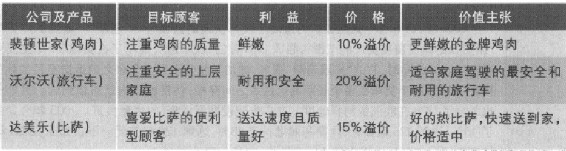

定位要求定义和传达品牌之间的相似点和差异点。特别是定位的决策要求通过识别目标市场和竞争状况以及共同理想点和差异点的品牌联想来确定参考框架。"营销突破：UPS"叙述了UPS是怎样成功地定位，以对付强大的竞争对手联邦快递的。

\@营销突破：UPS

詹姆斯·凯西（James E.Casey）于1907年创建的UPS（United Parcel
Service）填补了运输市场的空白------同城包裹快递。那些由商场或者酒店发送至顾客家里的包裹，如果通过邮局运送，会因为太大而效率低下，同时成本也过高。UPS用10年时间建立了一个全国性网络，到1975年，UPS成为唯一一家能将包裹送到48州中任何地址的包裹快递公司。

作为第一家和最大的全国性包裹快递公司，UPS在货运行业拥有主导地位。但是，它的权威在20世纪80年代受到挑战，当时的新贵联邦快递（当时名为
Federal
Express，现为FedEx）推出了一个独特的"三重服务"：连夜服务、运输跟踪和数量折扣。UPS在1982年推出了隔天送达服务，积极为10年来贏得的市场而奋斗。1987年，它花费18亿美元增添了110架飞机，扩展了其航空服务机群，因此也成为美国第十大航空巨头。到1990年，UPS总生意的21%来自隔天送达服务。

虽然UPS试图与联邦快递的连夜服务保持同步，但它仍然通过建立最大的国际运送网络来寻求自身的差异化。在1988\~1990年间，UPS主要通过购买当地小快递公司，进入欧洲和亚洲的145个国家。这些收购使得它的海外运送市场份额从1988年的2%增加到6%。这些海外的行动让UPS有底气将自己定位为"全球最大的包裹分送服务和解决方案提供商"。在联邦快递集中于一项主要服务------航空快运的同时，UPS提供了空中和陆地运送的广泛范围选择，并且能运送到更多的地方。覆盖范围更广的结果就是，到2000年，UPS的即时包裹运送的市场份额（55%）比联邦快递（25%）更大。

UPS将自己的服务延伸到因特网世界，增加了服务电子商务顾客的能力，UPS进军物流行业，为客户提供制造、仓储以及供应链服务。到2001年，UPS成为毋庸置疑的电子商务运送的领导者，处理在线购买市场55%的业务，而联邦快递仅占10%。与此同时，UPS的物流业务以每年40%的速度增长，而联邦快递则是尽力扭转自己物流运营的下降趋势。在这种业务中，UPS主要贏在为福特公司设计了一套追踪汽车运送至经销商的在线系统，为福特降低了平均存货水平，在2001年估计节约了10亿美元。为了支持公司新的运送和物流服务，2002年UPS大约斥资5000万美元发动广告战役，标题是'棕色'（UPS的标志色为棕色，因此这里的棕色即代表UPS------译者注）能为您做什么？"

-   2003年UPS再次扩展了其服务供应物，把它在2001年收购的全国各地3000多个邮箱公司（Mail
    Box
    Etc.）特许店重新打上"UPS店铺"品牌。UPS店铺为顾客的运送需求提供一站式便捷服务，其标准运费比原来的邮箱公司低20%。在测试市场，拥有联合品牌的店铺运送置每年增长70%。联邦快递不久之后也模仿这种做法，收购了金考公司，并建立了联邦快递金考的联合品牌店铺。

-   2006年，UPS着手处理被认为落后于联邦快递的方面------"速度"。最终的广告战役使用口号"用更快的速度覆盖更广的范围"，强调UPS首创"快车道"，提高了在美国11个主要业务中心的输送速度。与此同时，它的"拓展清晨"服务，增加了服务于早上7点之前运送至目的地的服务。广告描述了UPS的小货车在多个长距离运送点之间穿梭，仿佛数秒内就可以到达。另外一个系列广告也彰显了UPS在欧洲的同样速度。在广告战役期间，UPS的生意良好。2005年公司的总收益增加了16%，达到426亿美元，同期利润增长了13%，达到128亿美元。不仅如此，2006年UPS继续保持在美国国内包裹快递市场的领导地位，市场份额达到65%。

竞争性参考框架

对于品牌定位，定义竞争性参考框架的起点是确定品类成员（category
membership），即品牌与之竞争的产品或产品集合以及功能与之相近的替代品。正如我们将在第11章所要讨论的那样，竞争性分析将考虑到全盘因素，包括资源、能力和其他各类公司的可能意图，以选择那些有利可图的市场。

选择某类消费者为目标市场时，尤其能够界定竞争的性质，因为某些公司在过去已经决定要以这个细分市场为目标（或者在将来准备这样做），或者该细分市场中的消费者在他们的购买决策中已经注意到特定的产品或品牌。要确定恰当的竞争性参考框架，营销人员需要了解消费者行为以及他们作出品牌选择时的考虑集。例如在英国，汽车协会定位自身为第四大"紧急服务"（与警局、消防和救护相比），传达更大的可信度和紧迫性。我们来看看Di
Giomo's是怎样定位的：

> DIGIORNO'S比萨

> DiGiorno's是一种冷冻比萨，当加热时它的外壳就会膨胀起来。但是营销人员并没有把它列入冷冻比萨之列，取而代之以外送比萨类别。它们的一个广告演示如下：参加聚会的客人询问主人用的是哪家外送比萨服务，主人回答："不是外送的，是DiGiorno！"这就帮助强调了DiGiorno's的新鲜品质和优质品味。通过这种聪明的定位，DiGiorno's的销售额从1995年的几乎为零上升到了2005年的51400万美元，迄今成为冷冻比萨的领导者。

差异点和共同点

一旦营销人员通过定义顾客目标市场和竞争的性质，而确立了定位的竞争性参考框架，他们就能定义合适的差异点和共同点联想。

差异点

差异点（Points-of-difference，POD）是消费者强烈地联想到的品牌属性或利益，并给予正面评价，并相信它们并不能同样程度地从竞争品牌中找到。那些形成差异点的联想实际上可以建立在任何类型的属性或者利益之上。例子有苹果（设计）、耐克（性能）和雷克萨斯（品质）。创建强大的、令人喜爱的、独特的联想确实是个挑战，但在竞争性品牌定位中这是必不可少的。

共同点

另一个方面，共同点（Points-of-parity，POP）是那些对品牌来说并非独特，实际上可能与其他品牌共享的一些联想。这些联想的类型有两种形式：品类和竞争性。

品类共同点（category
points-of-parity）是那些被消费者认为在特定的产品或服务品类中要成为合理且可信的提供物所不可缺少的联想。换句话说，它们是品牌选择的必要而非充分条件。除非一家旅行社能够进行机票和旅馆预订，提供旅行套餐的建议并有多种票价支付及送达选择，否则消费者不会承认这是一家真正的旅行社。品类共同点随科技进步、法律发展或消费者趋势变化而不断变化，但是它们是玩营销游戏的"果岭费"（green
fees）。

竞争性共同点（competitive
points-of-parity）是那些设计用来抵消竞争对手差异点的联想。如果在消费者的眼中，一个品牌在竞争对手试图找到优势的领域与别人"打成平手"，同时在其他领域获得优势，那么这个品牌应该是强势的，可能处于无懈可击的竞争性地位。参考美乐淡啤（Miller
Lite）的介绍。

> 美乐淡啤（Miller Lite）

> 美乐淡啤最初的广告有两个目标：（1）通过陈述"口味醇美"，保证与品类中重要竞争对手的共同性；（2）同时创建差异点：它的卡路里含量比普通啤酒少三分之一，热量更低但味浓。但经常有这样情况，共同点和差异点存在某种程度的冲突，因为消费者倾向于把卡路里和味道等同起来。

为了解决这个潜在的阻碍，美乐聘请可靠的代言人------一群颇受欢迎的前职业运动员，他们肯定不会喝味道不好的啤酒。这些人员幽默地讨论啤酒的两个优点------口味醇美和热量更低------哪一个能更好地描绘该啤酒。这个广告以一个漂亮的口号结尾："所有你从啤酒中想要的......并且更少。"

共同点对差异点

如果一个供应物要在一个特定的属性或利益上获得共同点，那么需要足够多的消费者相信品牌在该维度上"非常好"。共同点有一个容忍或者接受的区域或者范围。品牌并不需要刻板地被看作与竞争者一样，但是消费者必须感觉到该品牌确实在那种特定的属性和利益上做得很好。如果确实如此的话，那么消费者会愿意将他们评价和决定的基础建立在其他更有利于该品牌的潜在因素上。一般来说，淡啤不会像原味的啤酒那样好喝，但是为了有效地竞争，它的味道需要接近于味浓的啤酒。

而对于差异点，品牌必须展示出清楚的优越性。消费者必须确信路易威登（Louis
Vuitton）有最漂亮的手提包，劲量（Enegizer）是最耐久的电池，美林证券（Merrill
Lynch）提供最好的财务建议和计划。

通常，定位更关键的是实现共同点而非差异点。

> Visa与美国运通卡（American Express）

> 在信用卡品类中，Visa的差异点是它的适用范围最广，强调了品类的主要利益------便利性。另一方面，美国运通是通过与信用卡的使用建立联系强调声望，建立了它的品牌资产。在确立了它们的差异点后，两个品牌现在试图减弱对方的差异点的优势来竞争。Visa提供金卡和白金卡来增强品牌的声望，配以广告"它就在你想去的任何地方"来加强它的专有性和可接受性。美国运通则大量增加特邀商户的数量，创造其他的价值增值。

建立品类成员

目标顾客意识到美宝莲（Maybelline）是化妆品中的领导品牌，Cheerios是谷类食品的领导品牌，埃森哲（Accenture）是一家领导性的咨询公司等等。不管怎样，营销人员通常会告知消费者该品牌的品类成员。最突出的情形大概是在推出新产品时，特别是当品类识别本身并不是特别明显的时候。

对高科技产品来说，品类成员可能是个特殊的问题。当GO公司在20世纪90年代初的时候开发第一台平板电脑时，分析家和媒体对这个概念反映热烈，但是消费者的兴趣并没有成为现实。GO最终被AT&T收购，用于其对平板电脑的投资，这于1994年彻底失败。但随着现在台式个人电脑的发展，平板电脑的创意开始有了新生命。

有时候存在这样的情形，消费者知道一个品牌的品类成员，但可能并没有意识到该品牌是品类的有效成员。例如，消费者可能知道惠普生产数码相机，但是不确定惠普的相机是否与索尼、奥林巴斯、柯达和尼康属于同一个品类。在这个例子中，惠普可能就会发现强化品类成员是有用的。

品牌有时候隶属于它们并没有成员关系的品类。这是突出品牌差异点的一个方法，让消费者知道品牌的实际成员。

> Umpqua银行

> 绝大部分消费者可能从未想到银行交易还能满足心灵需求，俄勒冈州的Umpqua银行就不是一家普通银行。Umpqua为了与其他银行之间建立差异点，将自己归入咖啡/零售品类。大概10年前，当Umpqua还在迫逐美国银行和富国银行市场份额的时候，它的新CEO决定进入一个全新的领域：将银行与当地的星巴克交叉起来。不再叫"银行"或者"分行"，而叫"商店"，这样的设计能促进顾客之间的舒适联系，配有WIFI接入的网络咖啡吧，还有品牌商品，包括Umpqua自制的混合咖啡（这在视咖啡如命的美国西北部是必不可少的）。就像星巴克一样，Umpqua也将音乐作为其产品的一部分。与波特兰Rumblefish公司合作，它发起了"发现当地音乐"的活动。在音乐专区内，顾客可以用耳机试听歌曲，甚至可以购买定制的CD。像电影、编织及瑜伽课程等员工8小时以外的活动，就像财务活动一样得到鼓励。但是，创建这种时尚好客的环境仅仅只是成功方程式的一半。Umpqua同时也培育所谓的"极致服务"。每个新来的员工都要接受丽嘉酒店培训集团提供的顾客服务教育培训，该酒店是以金牌服务而闻名的。Umpqua的经营不仅使它的资产从1994年的1.4亿美元增加到2006年的70亿美元，而且它还被《商业周刊》评为"2005年最佳创意"，文章讲道："......顾客并不仅仅因为在星巴克消费了一杯咖啡或者在Umpqua银行做成了一单生意而付费，他们为可以进入一个能得到心灵满足的俱乐部而付费。"

然而，使用这种方法非常重要的一点是不要陷于不同品类之间。消费者应该知道这个品牌代表什么，而不仅仅知道它不是什么。柯尼卡e-mini数码相机和MP3播放器在营销时突出的是其"四合一娱乐方案"。但它在每个产品用途中遭遇了功能性缺陷，最终在市场中失去了活力。

定位最典型的方法是在确定其差异点之前，告知消费者有关品牌的类别成员。可推测的是，消费者在确定该品牌是否在竞争品牌中占有优势之前，他需要知道产品是什么以及它有何功能。对新产品来说，最初的广告通常集中于创建品牌意识，后续的广告则以建立品牌形象为目标。

横跨式定位

有时候，一个公司试图横跨两个竞争性参考框架。

> 宝马（BMW）

> 在20世纪80年代早期，宝马首次在美国市场刮起一股强劲的竞争之风，它是唯一一个同时定位于豪华和高性能的汽车品牌。当时，消费者看到的美国豪华车缺乏高性能，而高性能的车却不豪华。依赖于德国传统的汽车设计，加上其他精心构思的营销方案，宝马同时做到：（1）对于高性能车来说，具有豪华这个差异点以及高性能这个共同点；（2）对豪华车来说，具有高性能这个差异点以及豪华这个共同点。它富有智慧的广告语"终极驾驶机器"有效地抓住了新开辟的伞形品类------豪华型高性能车。

横跨式定位可以调和潜在的冲突性顾客目标，并创建了"两个世界一样美好"的解决方案，因此常常是很有吸引力的。但是它也有一些额外负担。如果共同点和差异点对于两个品类都是不可信的，那么该品牌在任一品类都不会被视为合理的，可能被丢弃在"无人的荒岛"。许多早期的掌上电脑（PDA）没有成功地横跨寻呼机和便携式电脑品类，就是这种风险的活生生例子。

传播品类成员身份

传达品牌的品类成员身份主要有三种方法：

-   1.宣传品类利益。为了再次让消费者相信，品牌承载着使用该品类的基本理由，营销人员通常使用利益来宣传品类成员。这样，工业工具可能就会宣传它的耐用性，抗酸剂就会宣传它的效力。果仁巧克力小饼可以通过宣传它的美味来获得烘培点心品类的成员身份，其支撑点包括高质量的成分（性能）以及展示消费者对它的喜爱度（形象）。

-   2.与典范进行比较。一个品类中著名的、值得注意的品牌也能够帮助品牌对它的品类成员具体化。Tommy
    Hilfiger曾经默默无闻，广告通过与Geoffrey Beene、Stanley
    Blacker、Calvin Klein和Perry
    Ellis等这些著名的品类成员联系起来，宣告了他作为一位美国伟大设计师的成员身份。

-   3.依靠产品描述词。跟在品牌名称后面的产品描述词通常也是传递品类来源的一种简洁手段。福特汽车公司在一种叫做X-Trainer的全新2004车型上投资超过了10亿美元，它集合了运动型车、小货车和旅行车的属性。为了传达它的独特定位，同时为了避免与它的Explorer和Country
    Squire车型联系，这个交通工具后来被称作"自由式"（Freestyle），定位于"运动旅行车"（sports
    wagon）

选择差异点和共同点

共同点受品类成员的需求（建立品类共同点）和抵消竞争者差异点的必要性（建立竞争性共同点）而驱动。除了区别性外，选择差异点的另外两个重要考虑是消费者觉得该差异点合乎心意，同时公司有能力实现它。正如表10.2所示，三个标准对是否值得向往和实现能力作出判断。

表10.2 判断差异点的值得向往和实现能力

 

  -------------------------------------------------------------------------------------------------- ----------------------------------------------------------------------------------------------------------------------------------------------------------------------------------------------------------
  值得向往的标准                                                                                     实现能力的标准

  相关性                                                                                             可行性

  目标顾客必须感到差异点与自己相关并且重要。                                                         产品设计和营销供应物必须支持期望的联想。传达这种期望的联想需要产品本身的真正改变，还是仅需要消费者对这种产品或品牌看法的感知转变？后者通常更加容易。

  ■ 新加坡威信史丹佛（Westin                                                                         ■ 通用汽车必须努力克服公众对凯迪拉克的感知：它不是年轻的、当代的品牌。
  Stamford）酒店宣传自己是世界上最高的酒店，但实际上酒店的高度对许多旅客来说并不重要。               

                                                                                                     

  区别性                                                                                             沟通性

  目标顾客必须感到该差异点是独特且优越的。                                                           消费者必须就为什么品牌能够传达一种令人期望的利益得到一个令人信服的理由及可理解的道理。什么样真实的、可证实的证据或者"支撑点"能够保证消费者真正相信品牌及其联想？

  ■ Splenda代糖在2003年赶上了Equal和Sweeti N                                                         ■ 证明的东西通常都是专有的、品牌化成分的形式，如妮维雅抗皱霜带有辅酶Q10，伊卡璐草本精华润发素含有海薇芬娜
  Low，成为品类的领导者，它以自己作为一种糖的提取物的可靠性进行定位，没有任何相关的缺点。            

                                                                                                     

  可信度                                                                                             持久性

  目标顾客必须感到差异点是可信和可靠的。一个品牌必须给出应该选择自己而非其他品牌的令人信服的理由。   公司必须充分承诺并愿意投入足够的资源来建立一个持久的定位。定位是不是抢得先机、防御性强或者难以受到攻击？品牌联想的喜爱度能够长时间地得到加固和强化吗？

  ■ 激浪声称自己比其他软饮料更能提高人的精力，支撑点是它含有更高的咖啡因。                           ■ 市场领先者ADM、Visa和SAP部分定位于其产品或服务性能的可证明性，而市场领先者芬迪（Fendi）、普拉达（Prada）和爱马仕（Hermes）的定位建立在时尚之上，其市场是易变的。对于定位的维持，前者通常会比后者更容易。

  ■ 香奈儿No.5香水可能会声称自己是法国香水中的优雅典范，支撑点是它与香奈儿和高级时尚女装的长久联系。 
  -------------------------------------------------------------------------------------------------- ----------------------------------------------------------------------------------------------------------------------------------------------------------------------------------------------------------

营销人员必须决定一个用来固定差异点的层次。最底层是品牌属性，倒数第二层是品牌利益，最高层是品牌价值。按此，多芬香皂的营销人员可以讲述它含四分之一润肤乳的属性；或者它可以使皮肤更加柔软的利益；或者更具吸引力的价值。属性典型地属于定位中最低期望的层次。首先，买方对利益更感兴趣；其次，竞争者能够轻易模仿属性；第三，随时间发展，当前的属性可能变得不再令人向往。

然而研究显示，如果消费者对合适的利益作推断的话，品牌有时候能够成功地以看起来不相关的属性进行差异化。宝洁通过"独特的专利"创造出来的"咖啡水晶片"，对其Folger速溶咖啡差异化。实际上，咖啡颗粒的形状根本就无关紧要，因为它们在热水中迅速融化。宣称一种品牌的咖啡是"山岳生长"也是不相关的，因为大多数咖啡都是"山岳生长"的。"营销备忘：写一份定位陈述"列出了营销人员是怎样正式表达定位的。

\@营销备忘：写一份定位陈述

为了传达一个公司或品牌的定位，营销计划通常包括一份定位陈述，这份陈述的格式应该如下：对于（目标群体和需求），我们的（品牌）是（概念1，它的（差异点是什么）。例如："对想要保持条理性的忙碌的职业人士，Palm
Pilot这种电子记事薄，相较于竞争产品，能够让你在个人电脑上备份文件更加容易和可靠。"有时候，定位陈述更加详细：

激浪：对年轻、有活力同时缺乏睡眠时间的软饮料消费者来说，激浪是一种与其他品牌相比更让你精力百倍的软饮料，因为它含有最高限度的咖啡因。喝了激浪，即使你通宵没睡好也能够保持清醒、精力充沛。

注意，这个定位首先陈述该产品是某品类的成员（激浪是一种软饮料），然后再表明它与品类中其他产品的差异点（含有更多的咖啡因）。产品的品类成员身份就揭示了它也有其他产品的共同点，但是产品实际上依赖于它的差异点。有时候营销人员在指出差异点之前，会把产品归入一种令人意外的不同品类中。

建立共同点和差异点

在建立一个强大的、竞争性品牌定位时通常会碰到的困难是，构成共同点和差异点的许多属性和利益都是负相关的。例如，要把品牌同时定位于"便宜"和"高质量"是非常困难的。Con-Agra要让消费者确信"健康选择"（Healthy
Choice）冷冻食品不仅有利于健康同时兼具美味。表10.3列举了一些负相关的属性和利益。不仅如此，单个属性和利益常常同时兼有正面和负面。例如，长寿的品牌La-Z-Boy躺椅，这个品牌暗示经验、智慧和专业，但另一个方面，它可能意味着过时的、跟不上时代的。

表10.3 属性和利益负相关的例子

 

  ---------------- ---------------------
  低价对高质量     强力的对安全的
  美味对低热置     强壮的对精致的
  营养对味美       普遍存在的对独有的r
  有效的对温和的   多样的对简单的
  ---------------- ---------------------

> 巴宝莉（Burberry）

> 近年来，巴宝莉的格子图案已经成为世界上最有名的象征之一。这些格子从巴宝莉风衣的固定地方延伸到了服装、比基尼、英国足球小子的新潮衣服上，不幸的是，也出现在越来越多的假冒商品上。这个巴宝莉不可缺少的组成部分、被时尚界称作"方格图案"（check）的标识，因曝光过度成为品牌的负担。因而，巴宝莉的销售额增长缓慢，它的新任首席执行官安吉拉·阿伦特（Angela
> Ahrendt）决定采用多种方法来实现销售量的跳跃。首先，她研究了巴宝莉150年的历史，创建新的品牌符号，例如在1901年公司注册的骑士标识。阿伦特女士另外推进的一个战术就是大力投资销售巴宝莉的配件------手袋、鞋子、围巾和皮带，而不是现在占到公司总销售额75%的衣服。这些配件不仅有更多的利润空间，而且也不像衣服那样，要紧跟时尚而频繁改变。

不幸的是，消费者通常对属于负相关的两个属性或利益都想要得到最大。营销艺术和科学的大部分都是为了达到平衡，定位也不例外。最好的办法当然是让产品或者服务在这两个维度都表现良好。宝马能够建立"豪华和高性能"的横跨式定位，原因在于它投入大量精力于产品设计，事实上这款车也确实达到了既豪华又具高性能的水准。戈尔特斯（Gore
Tex）也通过科技创新克服了看起来相互冲突的两个产品形象------"透气"和"防水"。

一些营销人员还采用了其他方法来实现属性或利益的平衡：发起两场不同的营销战役，每场专门应对一种不同的品牌属性或利益；把它们与任何拥有合适类型资产的实体（人物、地方或者事情）联系起来，以此作为建立属性或利益的共同点或差异点的手段；甚至可以让消费者确信，他们认为不同的属性和利益之间的所谓的负相关事实上是正向的。

### 差异化战略

为了避免商品陷阱，营销人员必须一开始就持有任何事物都可以差异化的信念。参见"营销备忘：怎样获得新消费者对产品和服务差异化的洞察。竞争优势（competitive
advantage）是指公司拥有的一种能力，使其在一个或多个方面的表现让竞争者难以企及。迈克尔·波特（Michael
Porter）要求公司要建立一个持续的竞争优势。但是很少有公司能够让其竞争优势可持续。至多它们可能起到杠杆作用。杠杆优势可以被公司当作获得新优势的跳板，就像微软利用操作系统的优势跃至Microsoft
Office，然后再到网络应用。一般说来，一个公司要想持久，就必须不断投资于新优势的业务。

\@营销备忘：怎样获得新消费者对产品和服务差异化的洞察

在"发现新的差异点"方面，伊恩·C·麦克米伦和丽塔·冈瑟·麦格雷思认为如果公司检查顾客对产品或者服务的整体体验，即消费链的话，他们就会发现自己以及竞争者从未想过的机会，可以据此定位它们的供应物。麦克米伦和麦格雷思列出一整套问题，营销人员可以用来借鉴，以识别新的、基于消费者的差异点。

人们是怎样意识到对你的产品和服务的需求的？

消费者怎样发现你们的产品？

消费者怎样作出最后的选择？

消费者怎样订购或者购买你的产品？

在产品和服务的传送过程中发生了什么？

你的产品安装情况如何？

你的产品和服务怎样支付？

你的产品怎样储存？

你的产品怎样运送？

消费者使用你的产品的真正用途是什么？

消费者在使用你的产品时需要什么样的帮助？

退货或更换如何？

你的产品维修和服务如何？

当你的产品被处理或不再使用时会发生什么？

消费者应该把任何竞争优势都看作顾客优势。例如，如果一家公司的运送速度比其他公司快，但是如果顾客并不在意速度的话，那么这就不是一种顾客优势。Select
Comfort公司就因其Sleep
Number床上用品而在业界声名显著，因为它能够让顾客根据简单的号码指数，调整床垫的支撑和贴合度，达到最舒适的程度，公司也应该聚焦于建立顾客优势。这样，它们就能够传递高的顾客价值和满意度，带来高的重复购买率，最终导致高的公司盈利能力。

营销人员能够根据许多因素对品牌进行差异化。西南航空就是一个很好的例子。

> 西南航空（Southwest Airline）

> 以达拉斯为基地的西南航空通过其低价格、可靠的服务和一种健康的幽默感，在短途飞行上开辟了自己的利基市场。西南航空保持低成本，是因为它仅提供基本的机上服务（没有餐饮和电影），在机场迅速地周转以尽量让飞机处于空中运行状态。但是西南航空知道如果仅仅低价是不能达到差异化的目的，因为竞争者也可以以低价强行进入该市场。所以它也以一条"有趣"的航线来差异化自己，强调飞行员和机务人员幽默的机上报道。西南航空的另一个受欢迎的特色就是先到先服务的开放式座位：根据乘客到达机舱门的时间给他们分发号码卡。现在根据乘客量，西南航空是美国国内最大的航空公司，凭借唯一低价的航线实现了长期的财务成功。

最显然的差异化手段，通常对消费者来说也是最具吸引力的，与产品或者服务的各个方面有关（见第12章和第13章）。斯沃琪（Swatch）提供多彩的时尚手表，赛百味（Subway）以健康的三明治替代快餐来差异化。然而在竞争市场上，公司需要的不仅仅是这些。考虑到其他维度，被公司较多地用来差异化其市场供应物的手段有：

 

-   人员差异化。公司可以拥有受过良好训练的员工。新加坡航空公司受到的赞誉很大部分是源于其机务人员。像通用电气、思科、百事食品、西北人寿、辉瑞等公司的销售团队都享誉盛名。
-   渠道差异化。公司能够更有效益和有效率地来设计分销渠道的覆盖面、专业性和绩效。回到1946年，宠物食物非常便宜，且没有什么营养，只在超市或者临时寄养宠物的小店才能买到。来自俄亥俄州的爱慕思（lams）则通过地区兽医、养殖户和宠物商店出售溢价宠物食品。
-   形象差异化。公司能够精心打造出具有强大吸引力的形象。最好的说明就是万宝路拥有令人震惊的全世界的市场份额（30%左右），主要是因为它的"强壮牛仔"形象拨动了吸烟民众的心弦。葡萄酒及烈性酒公司也努力想要为它们的品牌建立独特形象。即使是一家销售商的有形空间也有助于产生有力的品牌形象。凯悦（Hyatt
    Regency）酒店就通过它的正厅门廊来发展其独特的形象。

### 产品生命周期营销战略

一家公司的定位和差异化战略应该在产品生命周期（product life
cycle，简称PLC）中随产品、市场以及竞争者的变化而变化。说产品有生命周期是基于以下四点：

-   1.产品生命期有限。

-   2.产品销量经历不同阶段，每个阶段对销售者来说都有不同的挑战、机会和问题。

-   3.利润在产品生命周期的不同阶段有起落。

-   4.在生命周期的每个阶段，产品要求不同的营销、财务、制造、采购和人力资源战略。

产品生命周期

大部分产品的生命周期曲线都呈钟型（图10.1），这种曲线将其典型地分为四个阶段：导入期、成长期、成熟期和衰退期。

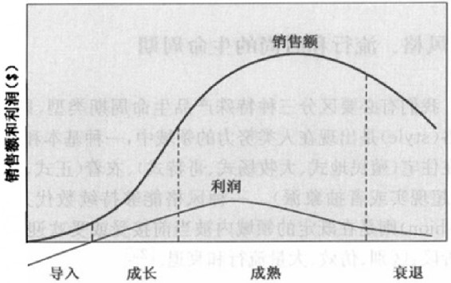

图10.1 销售额和利润生命周期

-   1.导入期：随着产品导入市场，销售额缓慢增长。由于产品导入花费巨大，因此毫无盈利可言。

-   2.成长期：在这个阶段，市场接受度大幅增长，并有持续的利润提升。

-   3.成熟期：销售额增长速度放缓，因为大部分潜在的购买者都已接受了产品。由于竞争加强，利润保持平稳或下降。

-   4.衰退期：销售额呈现下降趋势，利润减少。

我们可以使用产品生命周期概念来分析一种产品类别（酒精饮料）、一种产品形式（白酒）、一个产品（伏特加）或一个品牌（Smirnoff）。并非所有的产品生命周期曲线都呈钟型。另外三种模式如图10.2所示。

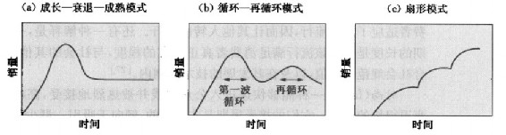

图10.2 普通产品的生命周期模式

图10.2（a）所示的是一种成长一衰退一成熟模式。这通常是小型厨房电器如搅拌器和面包机的特征。产品导入期销售额增长迅速，然后进入一个"僵化"水平并维持，这是由于后期采用者出现首次购买以及早期采用者更换产品的缘故。

图10.2（b）所示的循环一再循环模式经常用来描述新药的销售额。制药公司积极推广它的新药，这就导致了第一个周期，随后销售额下降，公司又发起另一轮推广活动，产生第二个周期（通常强度和持续性都较第一个小。

另一种常见的模式就是扇形生命周期，如图10.2（c）所示。在这里，销售额经历一连串基于新产品特征、用途和用户发现的生命周期。如尼龙的销售额，就因为越来越多的新用途------降落伞、袜子、衬衫、地毯、船帆和汽车轮胎------随时间而接连地被发现，其生命周期曲线呈现扇形。

风格、流行和时尚的生命周期

我们有必要区分三种特殊产品生命周期类型，即风格、流行和时尚（图10.3）。风格（style）是出现在人类努力的领域中，一种基本和独特的表达方式。风格可以出现在住宅（殖民地式、大牧场式、哥特式）、衣着（正式、休闲、猎奇），或者艺术（现实主义、超现实或者抽象派）。一种风格能够持续数代人，时而风行，时而衰退。流行（fashion）则是在既定的领域内被当前接受或受欢迎的一种风格。流行一般经过四个阶段：区别、仿效、大量流行和衰退。

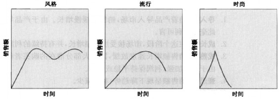

图10.3 风格、流行和时尚的生命周期

流行的生命周期长度难以预测。一种观点认为，流行的结束是因为它们代表了购买的妥协，消费者开始寻找缺失的属性。例如，当汽车变得越小，它们就让人越不舒服，这时候越来越多的消费者开始想买更大的车子。另一种解释是，太多的消费者适应了这种流行，因而让其他人转向离开。还有一种解释是，一种特定流行周期的长度是依据该流行满足消费者真正需求的程度，与社会的其他趋势相一致，符合社会规范和价值以及在其发展的技术限制内。

时尚（fad）是一种能够快速进入公众视线并被热烈地接受，高峰来得早同时也衰退得快的流行。它们的接受周期是非常短的，倾向于吸引一群少数的寻求刺激或想要凸显自己与众不同的追随者。时尚是无法长久的，因为它们通常不能满足强大的需求。市场营销的贏家是那些早早地嗅到时尚，并将它们引入具有持久力的产品中，发挥杠杆优势的人。下面是一家公司的成功故事，它设法延长时尚生命的长度。

> 《棋盘游欢》（Trivial Pursuit）

> 自从1982年在国际玩具博览会上首次出击后，《棋盘游戏》已经在18种语言的32个国家中卖出8000万套，至今也仍然是最受欢迎的成年玩具商之一。帕克兄弟（Parker
> Brothers）每年会根据一个新的议题来制造一种游戏从而保证产品的受欢迎度。同时也不断开发其衍生品------旅行箱、儿童版、《棋盘游戏》IV系列以及各种主题版本，试图进入各类运动、电影和周牟庆等利基市场。这种游戏存在多种多样的使用平台：来自维京互动娱乐的互动游戏光盘；自己的在线网站（www.trivialpursuit.com）以及通过手机登录其移动版本。如果你在约会晚餐中不知如何交谈，没问题，NTN娱乐网络公司已将《棋盘游戏》引入了3000多家餐馆。

营销战略：导入期和开拓者优势

由于推出一种新产品、解决技术问题、建设分销渠道以及贏得消费者的认可都是需要花费时间的，因此导入期的销售额增长缓慢。利润为负或零，而促销费用占销售额的比例是最大的，这是因为需要：（1）告知潜在顾客，（2）引导产品试用，（3）确保零售通路的分销。公司专注于那些准备要购买的顾客，通常他们是高收入群体。由于成本高，价格也倾向于高位。

公司计划推出一种新产品，必须决定何时进入市场。首家进入市场，当然有回报，但是也有风险和高昂的花费。如果公司能够提供优良的技术、质量或品牌强度的话，稍晚些进入是有道理的。

在产品生命周期缩短的时代，加速创新的时间是必不可少的。早进入市场已表明是有利的。一个先前的研究发现，一个产品晚6个月推出------但在预算中------前5年平均利润少33%；若按时上市而预算超出50%，利润只减少4%。

大部分研究指出，市场开拓者占有最大的优势。诸如金宝汤、可口可乐、贺曼和亚马逊公司就一直保持着市场主导地位。卡朋特（Carpenter）和麻里（Nakamoto）发现，1923年25家市场领先者中有19家在60年后的1983年仍然是市场领先者。鲁宾逊（Robinson）和米恩（Min）发现，在一个工业品企业的样本中，66%的开拓者都存活了至少10年，而早期跟随者只有48%。

开拓者优势的来源又是什么呢?如果产品能够令人满意的话，那么早期用户就会记住开拓者的品牌名称。开拓者的品牌也同时确立了这类产品应该具备的属性。开拓者品牌通常以市场的中层为目标，以抓住更多的顾客。顾客惯性也在此起到了作用；同时还存在生产者优势：规模经济、技术领导地位、专利、稀缺资源的所有权以及其他进入壁垒。开拓者的营销支出更为有效，能获得更高的消费者重复购买率。藉由追求多样化的战略，警觉的开拓者能够永久性地保持它的领导地位。

然而，开拓者优势也并非必然。看看Bowmar（掌上计算器）、苹果的Newton（掌上电脑）、网景（网页浏览器）、雷诺（圆珠笔）和Osborne（便携式计算机）的命运，后来的进入者都超过了这些市场开拓者。先行者也要提防所谓的"第二波进入者优势"。

> 维基百科（Wikipedia.org）和大众百科（Citizendium.org）

> 2001年1月进入市场的合作式因特网百科全书维基，凭着它的开拓者优势成为了如eBay和谷歌那样家喻户晓的品牌。它的500万网页完全由志愿者建立，可以供用户以250种语言免费使用。在那个时候，估计没有哪个在线百科全书品牌能够超越维基的影响力和品牌资产。然而，谁能够比维基的合作创立者拉里·桑格（Larry
> Sanger）做得更好呢？桑格认为自己的新网站大众百科能够获得"第二波行动者"的优势，这能够帮助它超越他的老网站。首先，第二波行动者通过复制先行者的方法避免了研发的大量投入。大众完全复制维基的模式，节约了五年的开发时间。其次，第二波行动者受益于定位的优势。因为桑格已经非常明确地知道用户对维基的感知是什么，因此它能够利用那些数据来制定大众的目标，开辟他所谓的"不同的社会利基"。最后，第二波行动者能够吸取开拓者的教训。大众引入了站点赞助商以及一个专家编辑团队，这样他们就能在各自的领域提供专业保障。维基，小心啊！

史蒂文·施纳尔（Steven
Schnaar）研究了模仿者超过创新者的28个产业，他发现了这些失败的开拓者存在的一些缺点：新产品过于粗糙，定位不准，或在强劲需求之前出现；产品开发成本耗尽了创新者的资源；缺乏资源与刚进入的大公司竞争；管理不善或不健康的自满。成功的模仿者的崛起，在于通过更低的价格，不断地改进产品，或利用蛮横的市场力量超过了开拓者。没有一家企业现在主导个人电脑市场，包括戴尔、盖特威和康柏，这些都是曾经最早的行动者。

戈尔德（Golder）和特里斯（Tellis）对开拓者的优势提出了更深一层的怀疑。他们区分了三类：发明者（inventor）是在一个新的产品类别中开发出专利，产品开拓者（product
pioneer）是最早开发出操作模式；而市场开拓者（market
pioneer）是最早在新产品类别出售产品。在他们的样本中还包括没有存活下来的开拓者。他们得出这样的结论：尽管开拓者可能仍然有一种优势，但有大量的市场开拓者失败了，比报道出来的多，大量的市场领先者获得了成功（尽管它们并不是开拓者）。后进入者超过了市场开拓者的例子有：IBM在计算机主机上超过了Sperry，三菱在录像机上超过了索尼以及通用电气在CAT扫描仪上超过了EMI。

在一项较近的研究中，戈尔德和特里斯识别出理解长期市场领导地位的五大因素：大众市场的愿景、坚持不懈、不间断创新、财务承诺和资产杠杆。DC其他研究则强调了在产品创新中新颖性的重要。如果开拓者以真正全新的产品打开市场，如Seg-way智能车，那么要生存下来则是一个很大的挑战。相反，如果以增值式创新进入市场的话，就像给MP3播放器增加视频功能的情况，那么开拓者的存活率要高得多。开拓者应该设想各种可以第一个进入的产品市场，并知道要一下子全部进入是不可能的。假设市场细分分析揭示了产品市场细分如图10.4所示。开拓者应该分析每个产品市场各自的和联合的潜在利润，并决定市场扩张的路径。图10.4中的开拓者，计划首先进入产品市场P1M1，然后把产品进入到第二个市场P2M2，接着为第二个市场P1M2开发第二个产品，让竞争者措手不及，然后把第二个产品带回第一个市场P2M1，再为第一个市场引入第三个产品P3M2。如果这种计划成功的话，那么这个开拓者将拥有前两个细分市场的大部分，为之提供2个或3个产品。

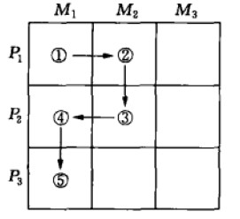

图10.4 长期产品市场扩张战略（Pi=产品； Mj=市场）

营销战略：成长期

成长期的特征就是销售额迅速攀升。早期采用者喜欢这个产品，其他消费者则开始购买它。受这种良机所吸引，新的竞争者进入。他们推出新的产品特色，并扩展分销渠道。

价格保持不变或者稍有回落，这取决于需求的增长情况。公司保持促销花费水平不变或稍有增加，以维持竞争并继续培育市场。销售额增长速度远远超过促销花费，这就导致了可喜的促销费用/销售额比率下降。由于促销花费平摊到更大数量的产品上，并且由于生产者的学习效应，单位制造成本比价格下降速度快，在这个阶段利润得到了增长。对于这个阶段，公司必须小心监控在成长上由加速变为减速的变化，以便于准备新的战略。Athena
Health公司的产品就处于产品生命周期的这个阶段。

> Athena Health

> 作为美国增长速度最快的私人公司之一的Athena
> Health公司，经过两年的经营，收益从2002年到2005年剧增了347%。Athena
> Health公司由美国前总统乔治·W·布什（George
> W.Bush）最大的堂弟乔纳森·布什（Jonathan
> Bush）所掌管，它处理的是医生最可恨的事情------保险单申报并进行记录跟踪。其对于医生的独特之处在于它的费用仅仅根据恢复所需要的赔偿金额来计算。这就激励Athena
> Health更快地工作，医生们欣赏的是从提交到赔偿的平均时间超越了过去两个月的界限。尽管增长显著，但Athena
> Health还有成长的充分空间。迄今为止，全国只有1%左右的医生作为客户签约，公司还没有产生盈利。作为一个高速增长的公司，它把所有的鸡蛋放在两个篮子里：追求风险资本和更多的客户。为了达到后者，Athena
> Health将全职工人数增至500人，并与医院IT公司Eclipsys建立销售合作关系，从而争取全美超过50%的在小型私人诊所中的医生------因为诊所太小所以他们没有职员来跟进他们的保单。竞争对手包括McKesson，目前是最大的医院保单外包提供商之一。为了在竞争中保持领先，首席执行官布什花费一半时间到处奔走，大力宣传公司。

在成长阶段，公司为保持快速的市场成长，会使用如下几种战略：

 

-   改进产品质量，增加新的产品特色，改进样式；
-   增加新的样式和侧翼产品（即增加产品的不同大小、风味等以保护主产品）；
-   进入新的细分市场；

 

-   提高渠道覆盖，进入新的分销渠道；
-   广告从产品-意识转向产品-偏好；
-   以更低的价格吸引价格敏感型的下一层级的顾客。

这些市场扩展战略增强了公司的竞争性地位。请思考雅虎公司是如何刺激成长的。

> 雅虎（Yahoo!）

> 由玩网络冲浪的斯坦福大学毕业生于1994年创建的雅虎，目前网络排名第一，平均每月有1.29亿个独立用户访问，这几乎占在线网民总数的80%。公司已不再仅仅是一个搜索引擎，而是变成了一个门户网站，提供从电子邮件到网上商场的完善的信息和服务项目。2005年，雅虎超过60亿美元的收益来自横幅厂告、付费搜索、个人订阅服务以及与SBC通讯的宽带合作等等。雅虎2003年以16亿美元收购了谷歌付费搜索的主要对手Overture
> Service，这加强了它要成为广告主提供一站式广告服务的主张。接下来的数年，为了提高在线能力和服务，雅虎又开展了多次收购行动，其中包括在线社交活动日历Upcoming.org、在线视频编辑网站Jumpcut.com以及在线社交竞赛网站Bixcom。雅虎继续其全球化的成长，重心向欧洲和亚洲转移，这部分得益于它花费5.79亿美元收购的欧洲比较购物网站Kelkoo.com以及2005年花费10亿美元现金收购中国电子商务网站阿里巴巴的46%股份。

一家处于成长阶段的公司面临高市场份额和高当前利润的权衡取舍问题。通过投资于产品改进、促销和分销，公司能够占据优势地位。它放弃将当前利润最大化，寄希望于在下一阶段获得稳定的更大利润。

营销战略：成熟期

在某个点上，销售额成长率会减缓，产品则进入一个相对成熟的阶段。这个阶段通常比前个阶段持续时间更长，对营销管理也提出更大的挑战。大部分产品都是处于其生命周期中的成熟阶段。

成熟期可以分为三个阶段：成长、稳定和衰退成熟。在第一个时期，销售额成长率开始下降，没有新的分销渠道要填补，新的竞争性力量出现（参见"营销视野：竞争性品类的动力"）。在第二个时期，由于市场饱和，人均销售额变平。大部分潜在消费者已经试过该产品，未来销售量受制于人口增长和替代需求。在第三个时期，也就是衰退成熟期，绝对销售额水平开始下降，同时顾客开始转向其他产品。

\@营销视野：竞争性品类的动力

最敏锐的营销观察者之一，曾任加州大学伯克利分校教授的大卫·阿克（David
Aaker）指出，因为新的品类能够战略性地代表威胁和机会，营销人员必须对驱动它们出现的力量加以重视。他举出7种导致新品类出现的动力：

-   1.新的产品或服务维度扩展了现有品类的边界。在酸奶业中，"想喝就喝"的潮流引领优沛蕾开发Go-Gurt，采用9英寸长的彩色条状包装，提高了小孩食用酸奶的便利性和趣味性。Go-Gurt帮助优沛蕾稳步超越达能，扭转了几十年来落后的局面。从此，一种新的与达能无关的子品类诞生了。

-   2.一种新产品或者产品集合在现有品类中产生新的利基。由Power
    Bar推出的能量棒（energy-bar）最终分裂为多种多样的子品类，包括那些针对特定细分市场的（如给女性用的Luna-bar）以及一些拥有特定属性的（如含有蛋白质的Balance-bar以及控制卡路里的Pria-bar）。每种都代表了与原Power
    Bar不相关的子品类。

-   3.一个新的竞争者设法将现有品类合并成超级品类。20世纪90年代末，Siebel通过整合应用一系列方案，包括顾客忠诚方案、顾客获取、呼叫中心、顾客服务、顾客接触和销售团队自动化，开发出基于因特网的顾客关系管理软件。这样，Siebel改善了相关性，对一些顾客来说，提供了相对于竞争者的更专门化的应用方案。

-   4.一个新的竞争者对现有产品和服务重新定位，从而建立一个原创品类。在英国，福特以头等舱来定位其Galaxy微型车，它很适合繁忙的经理人，而且足够舒服。通过强调与那些吸引家庭车购买者不同的属性，这个汽车制造商开创了一个全新的微型车子品类。

-   5.消费者需求推动形成一个新的品类或子品类。健康以及对草本和天然补充物利用的双重趋势支持了一个巨大的饮料新品类------"健康提神饮料"的产生。现在这个品类包含很多子品类，包括增强型茶、果汁饮料、大豆基质饮料、特质水。这个品类的市场先锋和领导者是SoBe，这家公司于1996年以含有人参、银杏和巴西可可的SoBe红茶起家，现在已经拥有茶、果汁和能量饮料的广阔产品线。

-   6.一项新技术引导了品类或子品类的发展、朝日（Asahi）在推出一种减少啤酒稠度和苦涩度但增加酒精含量的创新酿造过程后，重塑了日本啤酒市场。朝日超级干啤这种新产品与日本其他啤酒的味道非常不同，形成了一个新品类"干啤"。结果，麒麟（Kirin）这个一度占领60%市场数十年的领导品牌，突然间与许多被这种新品类所吸引的顾客不相关了。朝日的市场份额从1986年推出干啤时的8%，一直稳步增长，直到在1998年成为市场份额的领导者。

-   7.公司开发革新技术，投资新品类TiVo公司通过对个人视频播放器、电脑硬盘和电子节目指南的结合，创造了一个家庭电视的新品类，改变了人们收看电视的方式。使得任何一个新进入者必须根据TiVo来定义自己才行。

成熟期的第三个阶段面临最大的挑战。销售额下降导致产能过剩，这导致更加剧烈的竞争。各大竞争者争抢利基顾客。竞争者们经常实施低价活动、增加广告以及进行商业和消费者促销；会增加研发预算，以改进产品和发展产品线延伸；提供自有品牌。市场开始"洗牌"，实力薄弱的竞争者退出。行业最终由几家地位牢固的竞争者组成，它们的基本动力是获取或维持市场份额。

主导整个行业的只是少数几家巨头，可能是质量领先者、服务领先者和成本领先者。它们服务整个市场，主要通过高销量和低成本来赚取利润。围绕这些主导公司的是大量的市场利基者，包括市场专家、产品专家以及定制化公司。在成熟市场，公司面临的问题是，是努力奋斗成为"三大"之一，通过高销量和低成本来赚取利润；还是追求利基战略，通过小销量和高边际利润来贏取利润。有时候，市场会趋于高端和低端细分市场的两极化，而处于两级中间的公司其市场份额日益减小。下面是瑞典家电制造商伊莱克斯如何对付该种情形的例子。

> 伊莱克斯AB（Electrolux AB）

> 2002年，伊莱克斯面临一个急速两极分化的家电市场：一端是低成本的亚洲公司如海尔、LG和三星，带来低价格的压力；另一端是溢价竞争对手如博世（Bosch）、Sub-Zero和维京（Viking）等，而中端品牌的花费持续增长。伊莱克斯的新首席执行官汉斯·斯特拉布格（Hans
> Straberg）在公司面临跌出市场时临危受命，决定重新思考伊莱克斯顾客的需要和需求，逃脱中端定位。举个例子，斯特拉布格不用原来高低端顾客的分层，而是根据20种不同类型消费者的生活方式和购买方式来细分市场，即斯特拉布格所说的"20种产品定位"。现在伊莱克斯能成功地把蒸汽炉卖给健康取向的消费者。而原本为小型厨房设计的微型洗碗机现在有了更广泛的消费者细分市场，即针对喜欢频繁洗碗的人士，对那些发觉自己公司处于成熟市场两极中间的公司来说，斯特拉布格有如下建议："从消费者出发，了解他们的潜在需求以及他们经历的问题......然后集中所有的困惑，发现消费者的真正所需。据说亨利·福特（Henry
> Ford）曾经说过：'如果我询问消费者真正需要什么，那么我可能会得到让马儿跑得更快的答案'。虽然消费者并不能表达他们的真正所需，但是我们要解决它。"

一些公司摈弃衰弱的产品，专注于更多盈利的和新的产品。然而，它们可能忽视了在许多高潜力的成熟市场，老产品仍有潜力。那些被广泛认为已经成熟了的行业------汽车、摩托车、电视、手表、相机，日本人又在其中找到了为顾客提供新价值的方式。许多垂死的品牌如RCA、Jell-O和Ovakine都是通过营销想象力的运用获得了销售额的复兴。

改变品牌进程的三种潜在有用方法是市场、产品和营销方案的调整。

市场调整

一个公司可能通过作用于构成销售量的两大因素，为其成熟品牌扩展市场：销售量=品牌用户数量X每个用户的使用率，见表10.4。

表10.4 提高销售量的可选方式

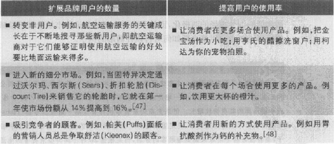

产品调整

管理者还通过对产品质量改良、特色改进和风格改进来调整产品特征，试图刺激销售。

质量改良（quality
improvement）旨在增加产品的功能性表现。制造商经常推出"新的改良"产品来应对竞争。杂货制造商称之为"加推"（plus
launch），推广一个新添加某些东西的产品，或以"更强"、"更大"或"更好"方式来做广告。这种战略的有效取决于质量改善、消费者接受主张的程度以及愿意支付的足够数量顾客。在罐装咖啡业，制造商为了面对来自溢价对手的激烈竞争，使用"新鲜"来改进品牌定位，例如，自有品牌的商店让顾客在店里碾磨它们的咖啡豆。卡夫公司的麦斯威尔（Maxwell
House）以新颖的"新鲜封印"（Fresh
Seal）包装出售咖啡；宝洁的Folger广告呈现其Aromaseal罐瓶咖啡------塑料的、从顶端剥开的、可冉密封的以及手抓瓶式的包装------使得磨碎的咖啡豆更新鲜。

特色改进（feature
improvement）旨在添加新的特色，如大小、重量、材质、添加物和配件等，以扩展产品的性能、多功能性、安全性或便利性。这个战略有一些优点。新特色创建了作为革新者的企业形象，贏得了重视这些特色的细分市场的忠诚度。它们为免费宣传提供了良机，有助于形成销售团队和分销商的热情。其主要的缺点是，特色改进容易遭模仿；除非营销人员认识到成为第一会有长久收获，否则特色改进可能不会得到长期回报。

风格改进（style
improvement）旨在提高产品的美学吸引力。新车样式的周期性推出其实大部分是基于风格竞争，就像消费品推出的新包装一样。风格战略额可能为产品提供一个独特的市场识别。但是风格竞争也存在一些问题。第一，难以预料消费者是否喜欢以及什么样的消费者喜欢这种新风格。第二，风格改变通常要求摈弃原来的风格，公司存在失去顾客的风险。

不管改进的类型究竟如何，营销人员必须谨防可能的竞争反应。顾客并不是总想接受"改进"的产品，就像新可乐（New
Coke）这个经典故事所表明的。

> 可口可乐

> 1985年，在与味道更甜的百事可乐的猛烈竞争中，可口可乐决定用更甜些的配方取代老配方，号称新可乐（New
> Coke）。可口可乐花费400万美元用于市场调研。口味盲测显示，可口可乐的饮用者更喜欢新的、更甜些的配方，但是新可乐的上市激起了全国性的不满。市场调研人员测试了口味，却没有测量消费者与可口可乐的情感依恋。愤怒的信件、正式的抗议书甚至诉讼威胁纷至沓来，都强迫公司保留"真口味"（The
> Real
> Thing）。10周后，公司撤回了新可乐，并重新推出其百年老配方"经典可口可乐"，给予老配方更强大的市场地位。

营销方案调整

产品经理也可能通过调整其他营销方案元素来刺激销售。他们应该会询问以下问题：

■价格。降价会吸引新的买主吗？如果是的话，我们是应该降低报价还是通过特价、量多优惠或早买优惠、运费免收或放宽信贷条件等方式来实现更低的价格？或者更好的做法是提高价格，以彰显高质量?

■分销。公司能在现有的经销店中获得更多的产品支持和展示吗？能够深入到更多的经销店吗？公司能将产品推广到更多的分销渠道中去吗？

■广告。我们应该增加广告费用吗？要改变讯息或广告文案吗？媒体排期、频次和广告的规格又如何？

■促销。公司应该增加促销吗？包括批发折扣、打折优惠券、现金折扣、保单、礼品等。

■人员推销。我们是应该提高销售人员的数量还是质量？我们应该改变专业销售团队专业化的基础吗？要修正销售区域和销售团队的激励方式吗？能改进销售访问计划吗？

■服务。公司能提高运送速度吗？我们能为顾客提供更多的技术支持吗？或更多的信贷？

营销战略：衰退期

销售额下降有多种原因，包括技术进步、消费者口味转变以及本土和国外竞争的加剧。所有这些都导致产能过剩、价格持续下跌以及利润萎缩。这种衰退可能比较缓慢，如缝纫机的情况；或者很快，如5.25英寸软盘的情况。销售额可能剧降至零或者在低水平上徘徊。

随着销售额和利润下降，一些公司退出市场，留下来的公司则减少产品数量。它们可能从较小的细分市场和较弱的分销渠道中撤退，可能削减促销预算并进一步降价。但不幸的是，大部分公司并没有为这些老化的产品制定政策。

除非有非常充分的理由，否则保留衰弱的产品对公司来说代价太大，不仅包括未暴露的管理费用和利润，还有其他隐性成本。衰弱的产品经常消耗不相称的管理时间；不得不频繁地调整价格和库存；因小批量生产而承受昂贵的生产线装配费用；增加了广吿和销售人员的开支，这本可以更好地用于获利性的健康产品，为公司形象投下阴影。最大的成本可能发生在未来。不消除衰弱产品，拖延了对替代性产品的积极开发。衰弱产品产生不平衡的产品组合，过时的产品线太长，而着眼于明天的产品线过短。

处理老化产品时，公司面临一系列的任务和决定。第一个任务就是建立一个识别衰弱产品的系统。许多公司任命一个产品检查委员会，从营销、研发、制造和财务等部门选出代表，根据所有可得信息，对每种产品提出建议一保留、调整营销战略，或放弃它。

一些公司早于其他公司放弃衰退市场。这主要取决于行业壁垒的高度。壁垒越低，公司越容易退出行业，这对于留下的公司吸引撤退公司的顾客是很有吸引力的。例如，宝洁公司继续保留衰退的液体皂业务，这个业务随其他公司的退出而提高了利润。

合适的战略还依赖于行业的相对吸引力和行业中公司的竞争强度。一家处于不具吸引力的行业，但拥有竞争优势的公司要有选择性地考虑收缩。而一家处于有吸引力的行业，同时也有竞争优势的公司则应该考虑加大投资。公司通常通过为原来的供应物增加价值而成功地重入市场或使成熟产品恢复活力。

如果公司在收获和剥离中进行选择，它的战略大有不同。收获（harvesting）要求在试图维持销售额的同时逐步减少产品或者业务成本。第一步是要削减研发成本、厂房和设备投入。公司也可能降低产品质量、销售团队规模、基本服务以及广告花费。公司试图不动声色地削减这些成本，不让消费者、竞争者和员工知道发生了什么。收获是很难执行的。但这种战略对很多成熟产品是有保障的。它可以大幅提高公司当前的现金流。

当一个公司决定放弃一个产品的时候，它面临进一步的决策。如果产品还有很强的分销渠道以及残留的声誉，那么公司可以考虑将其卖给其他公司。如果找不到买家，那么公司必须决定是赶快还是暂缓清算该品牌。公司还要决定为过去的顾客挽留多少存货和服务。

产品生命周期概念的证据

根据以上讨论，表10.5总结了产品生命周期4个阶段的特征、营销目标和营销战略。产品生命周期概念帮助营销人员解释产品和市场动力、实施计划和控制以及进行预测。近期一项对30个品类的研究发现了许多有关产品生命周期的有趣结果：

 

-   新的耐用品在大概每年销售额提升45%后，有一个明显的起飞，但当销售大概每年下降15%时，有一个明显的减弱。
-   在平均34%的渗透率时发生减弱，很可能在大多数家庭主妇拥有一个新产品之前。

表10.5 产品生命周期特征、目标和战略的概括

 

 

  

 

 导入期

 

 成长期

 

 成熟期

 

 衰退期

 

 特征

 

 销售量

 

 低

 

 迅速增长

 

 达到顶峰

 

 下降

 

 成本

 

 高成本/顾客

 

 一般成本/顾客

 

 低成本/顾客

 

 低成本/顾客

 

 利润

 

 负利润

 

 增长的利润

 

 高利润

 

 下降的利润

 

 顾客

 

 创新者

 

 早期采用者

 

 中间大多数

 

 落后者

 

 竞争者

 

 几乎没有

 

 数量增加

 

 数量稳定，开始下降

 

 下降的数量

 

 营销目标

 

 创建产品意识，鼓励顾客试用

 

 市场份额最大化

 

 利润最大化同时保持市场份额

 

 减少支出并榨取品牌收益

 

 战略

 

 产品

 

 提供基本产品

 

 提供产品延伸、服务和保证

 

 品牌和产品样式的多样化

 

 逐步淘汰衰弱的产品

 

 定价

 

 成本加成定价

 

 渗透市场定价

 

 迎合或赶超竞争者定价

 

 降价

 

 分销

 

 建立选择性分销

 

 建立密集性分销

 

 建立更加密集性分销

 

 逐步淘汰不盈利的分销网点

 

 广告

 

 在早期采用者和经销商中建立产品意识

 

 在大众市场中建立意识和兴趣

 

 强调品牌差异和利益

 

 减少到维持中坚忠诚顾客的必要水平

 

 促销

 

 使用大力度促销以诱发试用

 

 减少促销以利用有大量需求的消费者

 

 增加促销，以鼓励品牌转换

 

 减少到最低水平

 

 

-   成长阶段持续8年多一点，而且并没有显示随时间而缩短。
-   信息串联（informational
    cascades）的存在，意味着在其他人已经拥有的情况下，人们更可能随时间发展而采用，而不是进行仔细的产品评估。不管怎样，一个启示是：在起飞后有大规模销售额提升的品类，倾向于在减弱后有较大幅度的销售额下降。

产品生命周期理论的评价

产品生命周期理论引起了批评家的评论。他们声称生命周期模式在基本的形状和持续时间上变数太大，营销人员难以确定他们的产品究竟处于哪个阶段。当产品实际上已经达到了在另一个高涨之前的平稳阶段时，该产品也许看起来是成熟的。批评家也指责，产品生命周期模式与其说是销售额必定体现的必然过程，还不如说是营销战略的自我实现结果，熟练的营销事实上能够带来持续的成长。"营销备忘：如何创建一个鹤立鸡群的品牌"提供了长期营销成功的10条原则。

市场演进

因为产品生命周期聚焦于某产品或品牌而非整个市场发生的情况，因此它产生的是产品导向而非市场导向的图景。由于受新的需求、竞争、技术、渠道和其他发展的影响，公司还需要具体了解市场演进的路径。在产品或品牌存在的过程中，它的定位必须改变，以与市场发展保持同步。跟产品一样，市场演进也经历四个阶段：出现、成长、成熟和衰退。

出现

市场成形之前，是以潜在市场存在的。例如，多个世纪来，人们想要拥有更快速的计算工具。市场逐渐出现算盘、计算尺、大型累加器来满足这种需求。假设一个企业家意识到了这种需求，同时设想一种小型的、手掌式的计算器来解决这个问题。现在他必须确定产品属性，包括实体大小和计算功能的数量。因为他属于市场导向型，因此他访问了许多潜在的购买者，发现目标顾客的偏好差异很大。有些顾客只需要4种功能（加减乘除）而其他顾客则需要更多功能（计算百分比、平方根、对数）。有些人想要小型的掌上计算器，而其他人想要大的。这种购买者偏好均匀分布的市场类型被称为扩散偏好市场（diffused
preference market）。

企业家的问题就是要为这个市场设计一种最理想的产品，有三种选择：

-   1.设计满足某一角落市场的偏好的产品------单一利基战略（singlen-niche
    strategy）。

-   2.推出两种或多种产品来占领两个或多个细分市场------多重利基战略（multiple-niche
    strategy）。

-   3.为市场中间的顾客设计新产品------大众市场战略（mass-market
    strategy）。

小公司并没有足够的资源来抓住并维持大众市场，因此对它们来说，单一利基战略最合理。大公司可以通过设计大小规格和功能数量都适中的产品来追逐大众市场。假设我们的开拓者公司足够大，并且为大众市场设计产品，当它推出产品的时候，市场的出现阶段就开始了。

\@营销备忘：如何创建一个鹤立鸡群的品牌

阿诺德全球公司（Arnold Wbridwide）的营销专家弗朗西斯·凯利（Francis
Kelly）和巴利·西尔弗斯坦（Barry
Silverstein）将"鹤立鸡群"（breakaway）定义为：突出，不仅在该产品大类中，而是在所有其他品牌中；在市场中获得重要成就。下面是他们对创建一个鹤立鸡群品牌的10条告诫：

-   1.作出承诺

整个组织从上到下需要为创建和支持一个鹤立鸡群品牌作出承诺。用整个公司作为后盾，来开发具有鹤立鸡群属性的新产品。

-   2.高管支持

没有首席执行官、首席运营官或首席营销官的支持，鹤立鸡群的品牌化活动几乎在一开始就没有获得成功的机会。公司的高级经理应该是品牌梦幻家、品牌捍卫者和品牌建筑师。

-   3.找出品牌真知

鹤立鸡群品牌的基因就是它的品牌真知，用来定义和区别于其他品牌。这是一个品牌在竞争品牌意识、盈利能力、市场份额甚至股价的战役中最重要的单一武器。

-   4.瞄准一个贏的心智集合

贏的心智集合是在所有核心顾客细分市场中潜在的、充满渴望的共享的"生活观点"。这成为所有广告和促销活动都必须流经的过滤器。

-   5.创建唯一的类别

作为一个鹤立鸡群的品牌，它不仅需要凸显于同品类中的其他品牌，还要超越其他品类，表明自己与竞争对手间的明确差距，然后它成为唯一的类别。

-   6.需要一场伟大的战役

伟大的战役是团队活动，它们要求你和代理商通力合作发展鹤立鸡群的战役。千万不要对战役妥协，因为没有这样的战役，你的品牌很可能会失败。

-   7.不屈不挠的整合

整合是这个游戏的名字。根据你要达到的目标受众，你的战役可能整合网络和有线电视、印刷媒体和在线广告、直邮、电子邮件、收音机以及非传统媒体（从街区营销到公共表演赛）。

-   8.冒险

当今，80%的品牌只不过是在灰色的海里戏水，只有20%能够兴风作浪。你承受不起你的产品沉没在汪洋大海之中------这可能意味着要承担1个、2个甚至3个预计风险------以确保你的品牌超越其他品牌。

-   9.加速新产品开发

没有什么比在市场中差异化产品更重要的了，超越模仿性品牌化的唯一方法就是创新，使产品显得与众不同和独一无二。它可能意味着扔掉老的产品品牌并重新投资，或者意味着从头开始。

-   10.投资你的品牌

创建鹤立鸡群的品牌是一件严肃的事，它需要严肃的商业投资。投资于产品，当然也要投资于包装和精明的整合营销战役。明智地投资......好像你的品牌依赖于此。

成长

如果新产品畅销，新的公司会进入市场，表明步入市场成长阶段。假设第一家公司在市场的中心建立了自己的地位，那么第二家公司进入市场的何处？如果第二家公司是小公司，那么它可能为了避开与开拓者的正面竞争，选择在市场的某个角落推出其品牌。如果它是一家大公司，那么它很可能在市场的中心推出其品牌，与开拓者较量。这两家公司很可能最后分享大众市场。或者较大的第二家公司实行多重利基战略，包围并与开拓者周旋。

成熟

最终，市场内的竞争者们覆盖并服务所有主要的细分市场，市场进入成熟阶段。事实上，竞争者可能走得更远，会侵入彼此的细分市场，在这个过程中降低了每家的利润。随着市场增长变缓，市场分裂成更细的细分市场，此时高度市场裂化形成。此情形如图10.5（a）所示，字母代表供给于各类细分市场的不同公司。注意有两个细分市场没有被服务，那是因为市场太小没有利润可言。

由于具有强吸引力的新属性的出现，市场裂化通常随后出现市场合并。此情形如图10.5（b）所示，即增大的X区域。

然而，即使是一个合并的市场也不会持续太久。其他公司会模仿这种成功品牌，市场最终又会出现分裂成熟的市场在因竞争而导致的裂化和因创新而导致的合并中来回摇摆。思考纸巾市场是如何演进的。

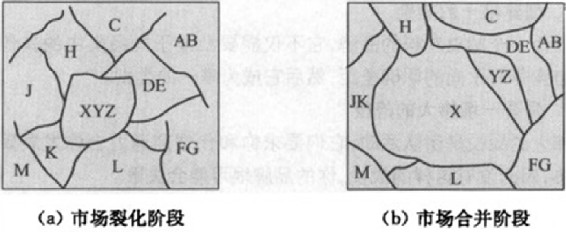

图10.5 市场裂化和市场合并战略

> 纸巾（Paper Towels）

> 起初，家庭主妇在厨房里使用棉质和亚麻抹布和毛巾。一家纸业公司寻找新的市场，开发了纸巾。这项开发使得一个潜在市场成形，其他制造商进入。随着品牌增多，开始出现市场裂化。产能过剩导致厂商开始寻求新的产品属性。一家制造商听到消费者抱怨纸巾吸水能力不强，于是推出"吸水"纸巾，占有了它的市场份额。但这个市场合并没有持续多久，因为竞争者相继推出各自吸水性能好的纸巾，市场裂化又开始。接着另一制造商开发出"超强度"纸巾。不久又遭模仿。另一制造商推出"不起毛"纸巾，也随后被模仿。这样，纸巾从单一的产品演进到拥有吸水性、强度以及其他用途的多样化产品。市场在创新和竞争这两股力量的推动下不断演进。

衰退

最终，对当前产品的需求开始降低，市场进入衰退阶段。不是社会总需求水平下降，就是新技术取代老技术。例如，传统的改变和火葬的趋势使得棺材制造商和殡仪馆重新考虑如何经营它们的生意。

### 本章小结

-   1.定位的决策要求通过识别目标市场和竞争的性质确定参考框架以及确定理想的共同点和差异点品牌联想。要确定适当的竞争性参考模型，必须理解消费者行为和他们在作出品牌选择时的考虑因素。

-   2.差异点是品牌拥有的独特联想，被消费者强烈持有和正面评价。共同点是指那些对品牌来说并非独特，而实际上可能与其他品牌共享的联想。品类共同点是那些被消费者认为在特定的品类中成为合理且可信的提供物所不可缺少的联想。竞争性共同点是那些设计用来抵消竞争对手差异点的联想。

-   3.竞争优势的关键是相关的品牌差异化，消费者必须感到有关市场供应物某些独特和有意义的方面。这些差异化因素可以直接地建立在产品或服务自身的基础上，也可以建立在其他相关因素上，如人员、渠道或形象。

-   4.因为经济条件以及竞争活动的变化，公司通常发现在产品生命周期过程中有必要多次重新拟定它们的营销战略。技术、产品形式和品牌显现出不同阶段的生命周期。任何生命周期的一般阶段次序是导入、成长、成熟和衰退。当前的大部分产品都处于成熟阶段。

-   5.产品生命周期的每个阶段要求不同的营销战略。导入期的特征是成长缓慢，获利最小。如果成功，产品进入成长阶段，标志是销售额快速成长，利润提升。接着是成熟阶段，销售额增长缓慢，利润稳定。最后产品进入衰退阶段。公司的任务是识别真正衰弱的产品：为每一产品制定发展战略；以对公司利润、员工和顾客的不利形势最小化的方式，逐步淘汰衰弱产品。

-   6.像产品一样，市场演进也经历4个阶段：出现、成长、成熟和衰退。

### 营销应用

营销辩论：品牌的生命是有限的吗？

通常，当一个品牌开始在市场上下滑或完全消失后，评论家就会评述"所有品牌都有其终点"。他们的基本理由是，在某种意义上，所有品牌都拥有有限的生命，不能期望永远是市场领先者。然而，其他专家则争称，品牌可以永存，它们的长期成功依赖于营销人员拥有的技巧和洞察力。

辩论双方

正方观点：不能期待品牌持续永久。

反方观点：品牌没有理由过时。

营销讨论

找出在表10.3中没有提到的负相关属性和利益。在这些成对的属性和利益的基础上，公司使用什么样的战略来定位它们自身？

### 第11章 应对竞争

本章将重点阐述以下问题：

-   1.营销人员如何识别主要的竞争对手？

-   2.如何分析竞争者的战略、目标、优势和劣势？

-   3.市场领先者如何扩大总休市场并保护其市场份额?

-   4.市场挑战者如何攻击市场领先者？

-   5.市场跟随者和市场利基者如何进行有效的竞争？

创建强势品牌需要深入了解竞争对手，认识到竞争状况愈演愈烈。新的竞争来自四面八方：全球竞争者都渴望在新市场中提升销售额；在线竞争者寻求成本效率实现渠道扩张；自有品牌和商店品牌提供低价替代品；大品牌的品牌延伸发挥其杠杆优势转向新品种。应对竞争的一种好办法就是创造性地设计并很好地执行营销方案。

当美国前进保险公司（Progressive
Insurance）还是保险行业中相对较小的公司时，它就开始专注于其他保险公司忽视的汽车保险业务------"非标准"险，它主要由那些驾驶记录上充满交通事故记录和违章记录的汽车驾驶员购买。通过比其他任何保险公司都更好地对车险损失数据进行收集和分析，前进保险对服务于各类顾客的成本以及如何从其他公司不愿受理的高风险却具有潜在效益的顾客处获得收益有了深刻理解。但是，直到20世纪90年代中期，作为最先通过因特网进行直销的汽车保险公司之一，前进保险才真正获得持久的竞争优势。公司率先采用技术为顾客提供独特服务，除了免费在线提供本公司保单报价外，前进保险还提供多达三个竞争者的报价，而当时这些信息只有通过保险代理公司才能获得。这样既节省顾客时间，又能为顾客省钱，因为在许多情况下，可以看出前进保险的保单价格更具竞争性。一旦获得新顾客的业务，前进保险就会从12000名理赔队伍中抽调人员迅速赶到事发地点------往往当场就进行理赔。公司还通过创新服务特色来进一步提高竞争力，如"事故代理人"为顾客处理所有索赔以及修理事务、进行在线保单管理以确保顾客能够随时付款和更改险别。从1996年到2005年，前进保险的销售额从34亿美元增长到140亿美元，年均增长率为17%。到2006年，前进保险从1980年名列48位跃居为美国第三大汽车保险公司，拥有1200万名顾客。

为了更有效地设计并执行最佳品牌定位战略，公司必须密切关注其竞争者。由于市场竞争过于激烈，只关注消费者是不够的。本章讨论竞争所扮演的角色以及营销人员如何根据不同品牌所处的市场位置对品牌进行最佳管理。

### 竞争力量

迈克尔·波特（Michael
Porter）识别了决定市场或细分市场长期内在吸引力的五种力量：行业竞争者、潜在进入者、替代者、购买者以及供应商。他的模型如图11.1所示。这些力量形成的威胁如下：

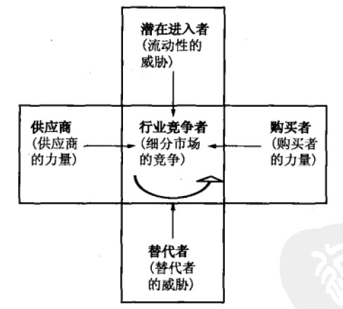

图11.1 决定细分市场结构吸引力的五种力量

-   1.激烈的细分市场竞争的威胁。如果一个细分市场已经有大量强大的激进的竞争者存在，那么它不会有吸引力。如果该细分市场已经稳定甚至衰退，工厂生产能力不足，固定成本和退出壁垒高，或者竞争者在细分市场中投资很大的话，那么这个市场更不具有吸引力。这些情形导致频繁的价格战、广告战和新产品的推出，使得参与竞争的代价很高。手机市场就是由于这种细分市场的竞争关系导致竞争异常激烈。

-   2.新进入者的威胁。最吸引人的是那种进入壁垒高、退出壁垒低的市场。几乎没有新公司能够进入这种行业，而业绩差的公司却可以轻易退出。如果进入和退出壁垒都高的话，潜在利润也是高的，但是公司面临的风险也大，因为业绩差的公司会留在市场上并死战到底。如果进入和退出壁垒都低的话，公司能够轻易进入和退出，回报稳定且低下。最差的情形是进入壁垒低而退出壁垒高：就是公司在形势好的时候进入，但是在形势差的时候却发现难以退出。结果就是所有公司长期产能过剩和收入缩减。航空业就是进入壁垒低退出壁垒高，在经济萧条时所有航空公司都苦苦挣扎。

-   3.替代产品的威胁。存在实际的或潜在的替代品的细分市场不具有吸引力。替代品对价格和利润设置了限制。在这些替代品行业中，如果技术进步或者竞争激烈了，那么价格和利润都可能下跌。美国灰狗长途汽车公司（Greyhound）和美国铁路客运公司（Amtrak）的利润就受到航空旅行兴起的威胁。

-   4.购买者议价能力增长的威胁。如果购买者拥有强大的或不断增长的议价能力的话，该细分市场不具有吸引力。沃尔玛等零售巨头的崛起使得一些分析者认为，包装消费品公司的潜在盈利能力将会削减。当购买者更加集中或有组织，或者产品在购买者的成本中占较大比重，或者产品是无差异化的，或者购买者的转换成本低，或者购买者由于低利润而变得价格敏感，或者他们能够整合上游时，购买者的议价能力得以提高。为了保护自己，销售者可能会选择那些谈判能力或转换供应商的力量最低的购买者。较好的防御方式是开发优质的供应物，让强势购买者无法拒绝。

-   5.供应商议价能力增长的威胁。如果公司的供应商能够提高价格或者减少供货数量的话，那么该细分市场不具有吸引力。石油公司如埃克森美孚（Exx-on
    Mobil）、壳牌（Shell）、英国石油（BP）、雪佛龙德士古（Chevron-Texaco）就受到石油储备数量有限以及像欧佩克（OPEC）这样的石油供应卡特尔组织的摆布。如果供应商集中且有组织，或者他们鲜有替代者，或者供应的产品是非常重要的投入要素，或者转换供应商的成本高，或者供应商能够整合下游的话，那么供应商的议价能力就会变得较强大。当然，最好的防御方式就是与供应商建立双贏关系，或者使用多家供应商。

### 识别竞争者

识别竞争者看起来是非常简单的工作。百事可乐知道可口可乐的Dasani瓶装水是其Aquafina品牌的竞争对手；花旗集团知道美国银行是其主要的银行竞争对手；PetSmart.com知道其在线宠物食物和供应商的主要竞争对手是Petco.com。然而，一家公司潜在的竞争对手范围比实际的看起来更广。与当前的竞争对手相比，公司更有可能受损于新出现的竞争对手或者新技术。

譬如近年来，许多"新兴巨头"逐渐从发展中国家崛起，这些机智的竞争者不仅在本土市场与跨国公司竞争，同时也凭借其自身实力成为全球力量。他们利用当地生产要素（资金和人才）以及供应链的知识，获得了竞争优势，目标是成为世界级的企业。

> 印度软件服务公司

> 塔塔（Tata）咨询服务、印孚瑟斯科技、威普罗（Wipro）以及萨特雅姆（Satayam）计算机服务，所有这些印度公司都成功地满足了为软件及其服务的全球需求，甚至打败诸如埃森哲（Accenture）、EDS这类跨国软件服务提供商。因员工技术水平和教育质量相差迥异，这些跨国公司在各地人才挑选方面困难重重。但印度公司了解人力资源市场，能够雇用到受过良好教育、技术娴熟的工程师以及技术类的大学毕业生，他们的工资却比发达市场的类似员工低得多。即使这样的人才在班加罗尔、德里等城市中心日渐稀少，印度公司也能够知道如何在二线城市找到合格的员工来保持竞争优势。

> 英业达

> 中国台湾的英业达公司已经成为世界上最大的笔记本、个人电脑和服务器的制造商之一，其成功也源于利用了它对当地生产要素的了解。它在中国大陆生产产品，将其供应给像惠普、东芝这样的巨头，同时也为其他跨国顾客生产手机和MP3播放器。英业达的客户无需在中国大陆投资建厂，即可买到低成本制造的产品，同时它们还能利用中国大陆的软件和硬件专业人才。然而，不用多久，英业达即将开始与其自己的客户直接竞争，它已经开始在中国台湾和中国大陆地区以自己的零售品牌销售电脑。

我们可以从产业和市场两个角度来研究竞争。产业（industry）是由一群提供同一产品或同一类别产品的公司所组成，这些产品具有密切的替代关系。营销人员根据销售者的数量，产品差异化的程度，进入壁垒、流动性以及退出壁垒的有无，成本结构，垂直整合的程度以及全球化程度来对产业进行分类。

按照市场概念，我们把竞争者定义为满足相同的顾客需求的公司。例如，一位购买文字处理程序软件的顾客，实际想要的是"书写能力"------这种需求同样可以通过铅笔、钢笔和打字机来满足。营销人员必须克服"营销近视症"，不能再用传统的品种和产业术语来定义竞争。可口可乐公司就是因为专注于软饮料，无视了咖啡吧和新鲜果汁吧的市场，最终对其软饮料业务造成重大冲击。

相比于将竞争定义仅局限于产品类别的做法，竞争的市场概念揭示了更广泛的实际和潜在的竞争者群体，雷波特（Rayport）和贾沃斯基（Jaworski）建议，通过描绘购买者获得和使用产品的步骤来勾画公司的直接或间接竞争者的轮廓。这种分析方法突出了公司所面临的机会和挑战。"营销视野：通过价值创新的高成长"描述了公司如何能够打入新市场，以使竞争减到最小。

\@营销视野：通过价值创新实现的高成长

欧洲工商管理学院（INSEAD）的W·钱·金（W.Chan Kim）和勒妮·莫傅涅（Renee
Mauborgne）教授认为，现在太多的公司都陷入了"红海思维"------基于价格、质量或两者兼有的不断改进，与竞争者斗得头破血流。他们提倡以"蓝海思维"取代之：制造无直接竞争者的产品或服务。他们相信，与其在传统市场范围内与人竞争，管理者不如跳出常规边界，寻找代表真正价值创新的新市场定位。

作者以Bert
Claeys为例，这是一家电影院线运营商，它推出拥有25块银幕、7600个座位的Kinepolis超大电影城。尽管行业萧条，但是Kinepolis生意却依然红火，这主要因其独特的组合：充足、安全和免费的停车泊位；大银幕、高水准音响和放映设备；宽敞、舒适、超大型的座位以及无障碍视线。通过机智的规划和规模经济，Bert
Claeys以低成本创建了独特的Kinepolis影院体验。

这是典型的蓝海思维------设计创新的业务投资来积极影响公司的成本结构和对消费者的价值主张。成本的节约源自于消除了或减少了影响传统产业竞争的因素；对消费者的价值来自于推出了产业内从未提供过的新因素。久而久之，成本被更大地降低，价值变得更大，带来更高的销售量，产生了规模经济。

其他有关非常规思维和蓝海思维的例子包括：

西南航空开发了一条航线，以低价提供可靠、有趣和方便的服务。

卡拉威（Callaway）高尔夫公司设计了"大贝尔莎"（Big
Bertha），一种杆头和杆面中心点都扩大的高尔夫球杆，帮助那些难以对准击球的高尔夫球手避免尴尬。

奈特捷（Net
Jets）通过共享产权的方式，解决了如何为庞大的顾客群体提供了私人飞机搭乘服务。

太阳马戏团（Cirquedu
Sloleil）通过消除高成本因素如动物，增强剧场体验，将马戏团创新为一个更高娱乐形式的场所。

金和莫博涅建议营销人员在运用蓝海思维和价值创新时，回答以下四个关键问题：

-   1.在我们所处的产业中，哪些想当然的因素应该被消除？

-   2.哪些因素应该下降至行业平均水平之下？

-   3.哪些因素应该提升至行业平均水平之上？

-   4.这个产业从未提供过的哪些因素应该被创造？

他们强调，绝大部分成功的蓝海思维运用者都得益于以下三大价值创造平台：有形产品；包括维护、顾客服务、担保和对分销商和零售商培训在内的服务；传送，即渠道和物流。图11.2总结了成功规划和执行蓝海思维的重要准则。

  规划准则

-   A.重新界定市场边界
    -   纵观替代性产业
    -   纵观产业内的战略群组
    -   纵观购买者链
    -   纵观互补产品和服务提供
    -   纵观对购买者的功能或者情感诉求
    -   纵观时机
-   B.着眼于大局而非数字
-   C.超越现有需求
-   D.有正确的战略顺序
    -   存在购买者的效用吗？
    -   价格可接受吗？
    -   可以实现目标成本吗？
    -   采用时遇到的挑战有哪些？

执行准则

-   A.克服主要的组织性障碍
    -   认知障碍
    -   资源障碍
    -   动机障碍
    -   政策障碍
-   B.把执行作为战略的一部分

图11.2 蓝海战略的重要准则

### 分析竞争者

公司一旦识别了其主要竞争者，那么它就必须查明这些竞争者的战略、目标、优势和劣势。

战略

在特定的目标市场上采用同样战略的公司形成战略群组（strategic
group）。假设公司要进入一个主流家电的产业，那么它的战略群组是什么？

公司在画出图11.3之后就会发现，基于不同的产品质量和垂直整合水平，整个产业存在四个战略群组。在群组A中存在一个竞争对手\[美泰克（Maytag）\]，群组B中有三个\[通用电气、惠尔浦（Whirlpool）、西尔斯（Sears）\]，群组C中有四个，群组D中有两个。从这个示范中我们可以得到一些重要洞察。首先，每个群组进入壁垒的高度不同；其次，如果公司成功进入某个群组，那么该群组的成员就成为公司的主要竞争对手。

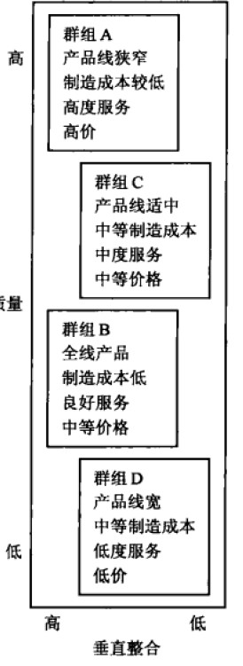

图11.3 主要家电产业的战略群组

目标

公司一旦识别出主要的竞争者及其战略，它必须追问：每个竞争者在市场中寻求什么？是什么驱动了竞争者的行为？竞争者的目标是受许多因素影响而形成的，包括公司规模、历史、管理现况和财务状况。如果竞争者是一家大公司的事业部，那么了解母公司经营它的目标是追求成长、利润还是收获现金流就非常重要。

竞争者力求利润最大化这种假设是有用的。但是公司在短期利润和长期利润上的侧重点存在差异。许多美国公司被批评以短期经营的模式来运作，这大部分是因为公司的绩效是由股东评判，若短期业绩不佳，他们可能失去信心，拋售股票，导致公司的资金成本上升。日本公司则主要以市场份额最大化的模式来经营。它们的资金大部分是从银行以低利率筹集，并且一直以来对低利润也能接受。所以，另外一个可靠的假设就是，每个竞争者都追求一定的目标组合：当前盈利能力、市场份额成长、现金流、技术领先和服务领先。

最后，公司必须监视竞争者的扩张计划。图11.4显示了个人电脑产业中产品一市场的战场图。作为以向个人用户销售个人电脑起家的强势品牌，戴尔现在已是商业和产业市场的重要力量。市场上的其他现有企业可能试图对戴尔的进一步扩张设置流动性障碍。

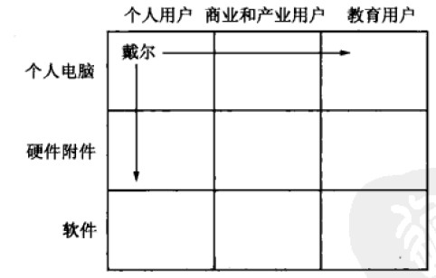

图11.4 竞争者的扩张计划

优势和劣势

企业需要了解每个竞争对手的优势和劣势。表11.1显示了某企业的一项顾客评级调查结果。顾客对该企业的三个竞争对手A、B、C的五大关键属性进行评级。其中竞争者A非常有名，其高质量产品和良好的销售团队在消费者中很有口碑，但是产品的可得性和技术支持两方面比较差；竞争者B在产品可得性和销售团队方面获得一致好评。竞争者C的多数产品属性评价都是"一般"甚至"较差"。调查结果表明，该公司可以针对产品可得性和技术支持两方面向竞争者A展开重点攻击；可以从各个角度与竞争者C展开交锋；但是应避免与B展开正面竞争，因为它没有明显的劣势。

一般来说，企业在分析竞争对手时应该监视以下三个变量：

-   1.市场份额------竞争对手在目标市场所占的份额。

-   2.心智份额------在问到"在本行业中令你想起的第一个企业"时，回答是竞争者的顾客的比例。

-   3.情感份额------在回答"你会倾向于购买哪个企业的产品"时，提到竞争者的顾客的比例。

表11.1 顾客对竞争者关键成功因素的评级

 

                                                               
  ---------- ----------- ----------- ------------ ----------- -----------
             顾客意识    产品质量    产品可得性   技术支持    销售人员 
  竞争者A    E           E           P            P           G 
  竞争者B    G           G           E            G           E 
  竞争者C    F           P           G            F           F 

注：E=优秀（excellent）    G=良好（good）    F=一般（fair）    P=较差（poor）。

表11.2 市场份额、心智份额和情感份额

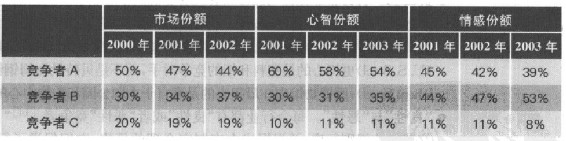

这三种测量方法之间的关系非常有趣。表11.2是对表11.1中三个竞争者所占份额进一步地分析描述。其中竞争者A市场份额最高却呈下降状态，它的心智份额和情感份额也在下降，这可能是因其无法提供良好的产品可得性和技术支持，而竞争者B之所以能够获得稳定的市场份额，可能因其采取策略不断提高理智份额和情感份额；竞争者C似乎一直徘徊于较低的市场份额、心智份额和情感份额水平，原因可能在于其较差的产品和营销属性。因此我们可以得出如下结论：那些能稳步获得理智份额和情感份额的企业必将贏得更高的市场份额和利润率。诸如车美仕、天木蓝Jordan's
Furniture、Wegmans以及丰田等公司都是通过提供情感价值、体验价值、社会价值和财务价值来满足顾客的需求而从中获利。

为了提高市场份额，许多企业都把最成功的竞争对手和其他一些世界级的顶尖企业作为基准。"营销备忘：基准管理以提升竞争绩效"对该方法及其益处进行了描述。

\@营销备忘：基准管理以提升竞争绩效

基准管理（benchmarking）是一种向在特定任务中表现卓越的企业学习的艺术。一个普通企业和世界级的顶尖企业在产品质量、发展速度和产品性价比上可能相差十几倍。基准管理的目的就是通过向行业内或跨行业的基准学习，复制或改进基准企业的"最佳实践"模式。基准管理有七个步骤：

-   1.确定哪些功能或过程需要向基准学习；

-   2.识别衡量关键绩效的变量；

-   3.识别同类最佳的企业；

-   4.衡量同类最佳企业的绩效；

-   5.评估本企业的绩效；

-   6.采取具体计划和行动以缩小差距；

-   7.执行并监控结果。

一个企业应如何识别那些"最佳实践"的基准企业呢？一个良好的开端就是咨询顾客、供应商、分销商、财务分析师、交易相关者甚至是杂志，看看他们眼中谁是最佳实践者。即使是最好的公司也可以通过基准管理来改善业绩。为了使企业更具创新性，通用公司（GE）曾把宝洁（P&G）作为基准学习对象，同时发展其独特的新的最佳实践。

选择竞争者

在对顾客价值和竞争者进行细致全面的分析之后，企业就可以全力出击，对付下列类型的竞争者：强与弱，近与远，"良性"与"恶性"。

 

-   强与弱。大部分企业将目标瞄准弱小的竞争者，在这种情况下，每获得单位市场份额只需要较少的资源投入。但为了跟紧基准，企业还必须与强大的对手竞争。即使强大的竞争对手也有其软肋。
-   近与远。许多企业往往与那些与其极其类似的企业竞争。例如，雪佛兰与福特展开激战，而非与法拉利。但是企业同时也应该识别远距离的竞争对手。可口可乐认识到它的头号竞争对手是自来水而非百事可乐（Pepsi）；美国钢铁公司（U
    &
    Steel）更担心的是塑料和铝的竞争对手，而不是贝特勒海姆钢铁公司（Bethlehem
    Steel）；而博物馆现在最担心的是来自于主题公园和购物中心的竞争。
-   "良性"与"恶性"。每个行业都有"良性"或者"恶性"竞争者。"良性"竞争者依照行业规则行事，并根据成本来制定合理的价格，它们促进了行业的健康成长。而"恶性"竞争者则企图花钱购买而不是靠自己的努力贏得市场份额。它们本身承担巨大的风险，投资造成产能过剩，也破坏了行业内的平衡状态。企业可能会发现有必要打击甚至淘汰这些运行状况不良的"恶性"竞争对手。

选择顾客

作为竞争分析的一部分，公司必须评估其顾客群，判断哪些顾客可以流失，哪些必须留住。区分顾客群的一种方法就是根据顾客的价值和易流失程度，建立一个四格矩阵。表11.3中每个部分都表示一种竞争活动。

表11.3 顾客选择矩阵

 \|    \|   \|   \| \|    --- \| ---  \| ---  \| \|    \| 易流失  \|
不易流失  \| \| 有价值  \|
这些顾客是有利可图的，但是他们对公司并不完全满意，因此需要找出他们的易流失原因并设法留住他们。
\|
这些顾客不仅非常忠诚，且对企业而言是有利可图的。但不应认为这是理所当然的，应当在维持现有盈利水平的情况下从顾客满意中获取利润
\| \| 没有价值  \| 这些顾客很可能叛变，企业应任由甚至鼓励他们离开。 \|
这些无利可图的顾客对企业是满意的。尝试让他们变得有价值或易流失。  \|

澳大利亚电讯公司（Telstra）实施这种细分市场分析方法，开发了一系列"弹性方案"（Flex-Plan）产品，不仅留住了有价值的/易流失顾客，也未失去源自有价值的/不易流失顾客的盈利。虽然"弹性方案"需要预订费用但却显著节约了基本开销。有价值的/易流失的顾客都积极参与到这个产品计划中，他们清楚自己能够从这个计划中获得什么样的好处，但是有价值的/不易流失的顾客却认为这种计划并无必要。最终，该计划达到了其顾客群细分的预期目标。

### 市场领导者的竞争战略

我们可以根据企业在目标市场中所扮演的角色（领导者、挑战者、跟随者和市场利基者）对其分类，从而进一步理解企业的竞争战略。假设一个市场由图11.5所示的所有企业所组成。其中40%的市场份额市场领掌握在市场领先者（market
leader）手中；30%由市场挑战者（market
challenger）所掌握；20%在市场跟随者（market
follower）手中，他们不愿打破现状，只想保持现有的市场份额；而剩下的10%市场份额则掌握在市场利基者（market
nichers）手中，他们专注于大企业无暇顾及的利基市场。

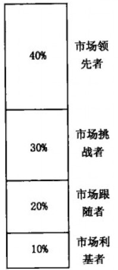

图11.5 假设的市场结构

许多行业都有一个被公认为市场领先者的企业。该企业占据相关产品最大的市场份额，它在价格变化、新产品推广、分销渠道覆盖和促销力度等方面领导行业中的其他企业。目前已经出现的市场领先者有微软（电脑软件），Countrywide（房屋抵押贷款），佳得乐（Gatorade）（运动饮料），百思买（电子产品零售），麦当劳（快餐），蓝十字（Blue
Cross）（健康保险服务），Visa（信用卡）。"营销突破：埃森哲"总结了该企业是如何获得并保持其市场领先者地位的。

\@营销突破：埃森哲

埃森哲（Accenture）管理集团创始于1942年，也就是安达信（Arthur
Anderson）会计事务所的咨询业务部。1989年它从安达信分离出来，专营IT咨询业务并更名为安达信咨询公司（Andersen
Consulting）。尽管那时每年业务收入达10亿美元之多，但在信息科技咨询业，其品牌知名度仍然很低，常常被人与母公司安达信会计事务所混淆起来。为了建立品牌并与同名的母公司区分开来，安达信咨询公司在专业服务领域开展了一场大规模的广告推广活动。10年后，它成为世界上最大的管理和技术咨询公司。

-   2000年，在与前母公司的仲裁之后，安达信咨询完全脱离母公司，但代价是必须放弃安达信这个名称。它要在三个月内另取新名，要求可以在47个国家注册，在200种语言中没有贬义，能被员工和客户广泛接受，还要与一个可用的URL相匹配。从此一场在公司史上史无前例也是最为成功的更名运动开始了。

幸运的是，公司的新名字来自于奥斯陆办事处的一名咨询顾问的想法，他在公司内部的取名活动"品牌风暴"中提交了一个名字：埃森哲（Accenture）。该顾问之所以想出这个名字，是因为它不仅与"adventure"（冒险）押韵，隐含"accent
on
future"（注重未来）的意思，同时它还保留了原公司名称的头两个字母AC（Andersen
Consulting以及Ac.com网站），这样能够保留母公司的部分原有品牌资产。2000年12月31日零点，安达信咨询官方公布正式更名为"埃森哲"，同时针对原有或期望的高级客户、合作伙伴、员工、媒体、行业分析家、潜在客户以及学术界开始了一场声势浩大的全球营销活动。

广告、营销和传播战役的效果立竿见影：考虑购买埃森哲服务的公司增加了350%；公司品牌资产提升了11%；品牌意识的深度和宽皮也达到了原公司水平的96%；作为专业提供管理和技术咨询服务的咨询公司，埃森哲的全球知名度也已提升到原公司的76%。因为这一切，埃森哲在2001年7月公司上市时首次公开募股就达到17亿美元。

-   2002年，埃森哲以全新的定位，开始彰显其协助管理层制定战略的巨大作用，这正如简洁的广告语所概括的："传递创新"。这个标语正是从公司所承诺的"从创新到执行，埃森哲助你加速前行"衍生而来。埃森哲调查了不同国家不同行业的许多高级主管，得出执行力和观念传递障碍是他们成功路途中最大的拦路虎。

埃森哲认识到自己的独特优势在于既能为客户设计创新性的制胜战略（如商业过程或IT业务的解决方案），又能够实施它们。竞争对手如麦肯锡（McKinsey）善于提供专业性的企业发展战略，其他企业如IBM则在技术实施方面颇为老道；而埃森哲志在二者兼备。埃森哲英国首席执行官伊恩·沃特莫尔（Ian
Watmore）强调了制胜战略和强大的执行力的必要性："只有既提供转型咨询又提供外包业务，我们才有机会贏得客户，因为客户两者都需要。"

-   2002年商业环境变幻莫测。在互联网泡沬和经济低潮过后，创新愈显不足。管理者们都希望看到公司的底线成效。在"传递创新精神"的基础上，埃森哲于2003年开始推出了全新标语："成就卓越价值"（High
    Performance Delivered），并邀请高尔夫球星泰格·伍兹（Tiger
    Woods）为公司形象代言人。作为对帮助客户实现商业目标的新承诺，埃森哲推出一项政策，许多合同都包括这样的刺激条款：客户可以在实现特定商业目标后再付费。比如说，与英国旅行社托马斯·库克签订的合约中就提到，埃森哲的收入取决于五项指标，这其中就包括使客户成本降低。2004年，埃森哲30%的合约中都包括类似的鼓励措施。埃森哲对提升客户业绩的关注使得其自身取得骄人业绩：2006年公司收入增长了13%达到171亿美元，而利润则上升了36%，达到9.4亿美元。

虽然营销人员认为著名品牌在消费者心中具有独一无二的地位，但是除非该优势企业享有合法的垄断性，否则还是需要时时保持警惕。产品创新可能紧接而来，危及领导者地位；竞争对手也可能会出人意料地挖掘出全新的营销视角或进行了一次重大的营销投资；或者，市场领先者发现其成本结构呈螺旋式上升。一度是知名品牌和市场领先者的盖普公司，最终丧失了其领导地位。

> 盖普（Gap）

> 当人们现在想起盖普的时候，不会想到它那些嬉皮、现代感的服饰。人们只会从"gap"（差距）的字面上来理解它的1295家门店正在缩水了。年轻人会很快告诉你，该公司缺乏的就是旗帜鲜明、风格独特的兀柰。曾经有一段时期，许多小的服饰品牌------Coach、Juicy
> Couture、Tahari、Laundry------都在美国零售市场上异军突起，盖普却仍在继续推出那些过时的、简单的，甚至可以说是乏味的休闲服。其症结在于盖普并没有定位自己的目标顾客，但却试图吸引所有人的目光，从新生儿到青少年再到中老年人都是其顾客群。"在时尚界，如果你代表所有，那么你也就一无是处。"保罗·R查伦（Paul
> R.Charron），Liz
> Claiborne公司的前任首席执行官如是说，他曾经成功收购Juicy
> Couture和Lucky
> Brand而使得企业起死回生。由于没有对服装零售市场的交化作出及时反应（或者说更好的预测），盖普的销售额骤跌。那些开业超过一年的门店在过去的30个月中有28个月其销售额是下降的或停滞不前的。但是，这个前市场领导品牌仍然研究了多种战略试图走出低谷。这其中包括在其门店内销售其他品牌的服装\[如之前的李维斯（Levi's）和现在正在销售的匡威（Converse）\]，通过缩减门店数量来减轻其"过度曝光"问题，或是专注于定制服装以满足一小部分顾客群的需求。

在许多行业，折扣竞争者的进入削低了市场领先者的产品价格。"营销视野：当你的竞争者以削价获得更多利益时"描述了领导者应该如何应对一个激进的价格杀手。

营销视野

如果企业能够提供物美价廉的产品，那么它就能受到全球消费者的青睐。在美国，超过一半的人每周都会去诸如沃尔玛（Wal-Mart）或塔吉特等大众零售店，而在1996年这个比例仅仅是25%。在英国，领先零售商Boots、Sainsbury等不得不应对来自ASDA和Tesco等的质量和价格的激烈竞争。

和它们有类似的价值观的企业，如Alda、戴尔、网络经纪公司、捷蓝航空、瑞安航空（Ryanair）和西南航空等也正改变着各年龄层不同收入的顾客购买食品杂货、服饰、机票、金融服务以及计算机等的消费方式。随着各行各业中价值驱动型企业正在改变其竞争战略，奉行传统竞争模式的企业也备感威胁。这些新兴企业的竞争战略包括：专注于一个或少数几个细分市场，更好地交付产品或者提供附加价值，高效运营降低成本以实现低价。

若想与价值驱动型的对手竞争，主流企业必须重新审视长期以来执行的战略路线：成本控制、寻求差异化、有效的价格管理。想要在价值导向的市场中取胜，企业必须更加密切关注这些长期战略并坚持不懈地加以执行。例如，差异化战略与其说使企业从纷繁复杂的竞争中脱颖而出，倒不如说是为，价值型企业提供识别商业模式的机会。有效定价策略意味着要发动一场逐笔交易的认知大战，改变消费者的想法，因为他们总是认为价值导向型竞争对手的产品总是更便宜。

通常来说，竞争的结果表现在产品货架、商品陈列、工序改造和标价上。当碰到价值型竞争对手时，传统企业决不能掉以轻心。价值驱动型竞争对手已经改变了消费者心中对产品性价比的期望值。这种改变聚集了动力，让人们开始高度重视并改变传统的差异化和执行。

差异化

为了应对价值导向型企业，营销人员必须对那些可能让其他企业有机可乘的商业模式予以特别关注。成功的差异化战略要求使用多重策略，提供能够最大程度满足消费者的产品。例如，沃尔格林（Walgreens）公司就避免在价格上与沃尔玛（Wal-Mart）等公司竞争，而是在其所有业务中强调便利性。它迅速扩张使得门店遍布各地，同时确保每个门店都位于转角处，方便泊车。此外，沃尔格林还重设了商场内部货架摆放方便顾客进出，将重要的产品类别如方便食品、一小时照相服务等7设在门口位置；为了保护药品销售，公司还增加了可以快捷操作的电话热线和网上订购系统，以便在全国各销售点方便地传递药方，同时公司还在大部分独立式门店都修建了免下车橱窗。这些措施帮助公司的收入从1998年的150亿美元显著提高到2006年的520多亿美元。

执行

价值导向的市场高度重视企业的执行力，尤其在价格和成本方面。凯玛特（Kmarfs）迎头撞击沃尔玛的惨痛经历，揭示了按照价值领先者的游戏规则来挑战他们的困难度。正如凯玛特所经历的，在价格上与价值领导者竞争，并不一定会改变消费者对它的低价印象。要真正击败此类对手，传统企业需要低调处理甚至放弃一些细分市场。例如为了与瑞安航空（Ryanair）和易捷（Easy
Jet）航空竞争，英国航空（British
Airways）将更多的精力放在了价值导向型竞争对手涉及不多的长途航线上，而较少关注竞争激烈的低成本短途航线。

大型航空公司也曾尝试作出其他的竞争反应，如他们推出自己的低价航线。但是美国大陆航空（Continental）推出的Lite航线，荷兰皇家航空（KLM）的布滋（Buzz）航线，北欧航空（SAS）的雪花（Snowflake）航线以及联合航空（United）的穿梭（Shuttle）航线都以失败告终。一种学术观点认为，只有在下述情况下企业才应该低价运营：（1）可以使得企业现有业务更具竞争力；（2）新业务可以使得企业获得新的优势。汇丰银行（HSBC）、荷兰国际集团（ING）、美林（Merrill
Lynch）公司和苏格兰皇家银行（Royal Bank of
Scotland）------汇丰旗下的子银行First Direct、荷兰国际集团旗下的ING
Direct、美林下属的ML Direct和直接在线保险业务（Direct Line
Insurance）------成功的低价策略部分源自于新旧业务相互协同的结果。因此，成功的经验指出，低成本业务的制定和推出应该是为了赚取利润，而非仅仅用于防守。

保持领先地位需要三个方面的行动。首先，公司应该找到扩大整体市场需求的方法。其次，公司必须以得当的攻守策略保护原有的市场份额。最后，即使市场容量不变，企业也应尝试增加其市场份额。下面我们分别详述每个策略。

扩大总体市场

当总体市场扩大时，市场领先者通常获利最多。如果美国人消费更多的番茄酱，亨氏（Heinz）将会是最大的受益者，因为它的销售最占到全美番茄酱市场的2/3。如果能说服更多的消费者使用番茄酱，或在更多的食物或在各种场合都加量使用番茄酱的话，亨氏的收益将是巨大的。总而言之，市场领先者应该寻找更多的新顾客或者使现有顾客加大产品使用量。

新顾客

每种产品都有潜力去吸引那些尚不了解该产品的顾客，或是因为价格不合理、缺少某些产品特色而拒购的顾客。正如第2章所建议的，企业可以从以下三种群体中寻找新的顾客来源：那些可能使用却仍然没有使用该产品的顾客（市场渗透战略），那些从未使用过该产品的顾客（新细分市场战略），或者那些生活在别处的顾客（地理扩张战略）。

星巴克咖啡是世界上最知名的品牌之一。它能够将咖啡卖到3美元一杯（如果是热销的拿铁咖啡可能要卖到4美元），而隔壁店只能卖到1美元。星巴克在北美、环太平洋地区、欧洲以及中东有超过7200家的分店，2002年的收入高达33亿美元。其公司网站（www.Starbucks.com）上有关于星巴克如何经多重战略而成长、扩张的记载。

星巴克采购并烘焙优质的全豆咖啡，连同新鲜的精选意式浓缩咖啡饮料、各式西式甜点和星巴克纪念商品、咖啡机等一起在其门店出售。此外，星巴克也通过专业销售团队和超市销售其全豆咖啡。同时，星巴克还与合资伙伴联手推出瓶装咖啡饮料星冰乐（Frappuccino）和系列顶级雪糕以及子公司泰舒茶（Tazo
Tea）生产的全新优质茶饮系列。公司的目标是把星巴克缔造成为享誉全球的知名品牌。为了达成这一目标，星巴克计划继续迅猛扩张其零售经营，通过发展门店专卖和其他的运营模式，利用星巴克的品牌效应，适时推出新品，开拓新的分销渠道。

更多的使用

营销人员可以尝试提高顾客的产品消耗数量、消费水平和使用频率。

有时候我们可以通过改变包装或者重新设计产品来增加顾客的产品消耗量。研究表明更大的产品包装能够增加顾客的一次使用量。如果产品更易获得，冲动型消费品如软饮料、零食的销售量就会增加。

从另外一个方面来说，增加使用频率可以通过：（1）在同样的使用方法下识别新的使用机会，（2）另辟更多新用途。只有在特定时间和地点，尤其是在特殊的使用环境或用户类型下，消费者才会认为这种产品是有用的。

为了在同样的使用方法下识别新的使用机会，营销活动应该传播在现有或新的情况下频繁使用该品牌的好处，或者引导消费者尽可能在类似情况下使用该品牌。高乐士（Clorox）就通过广告来宣传其漂白剂的多种功效，如消除厨房异味。而当消费者对产品的认知和实际功效迥异时，新的机会就出现了。如消费者可能会忘记更换保质期很短的产品，因为他们高估了产品的保鲜期。

加速产品更换的一种方法是，将产品更换的日期与某节日、节事或是一年中的某时段联系起来。另外一种方法是企业也可以进一步向消费者提供两方面的产品信息：（1）消费者的首次使用时间或产品的更换周期；（2）产品目前的性能状况。吉列剃须刀盒在反复使用后会逐渐褪色，这也就是提醒消费者更换新剃须刀盒的信号。

提高使用频率的第二种方法是，另辟全新用途。例如，食品公司就长期宣传以全新方法使用其品牌产品的烹饪法。在发现消费者把Arm
&
Hammer烘焙苏打粉用作冰箱除臭剂后，该公司还特意为该项用途大肆宣传。在成功推动一半美国家庭将苏打粉盒开口放置冰箱之后，公司随即向多种新产品类别进行品牌延伸，如牙膏、止汗剂以及衣物洗涤剂等。

另外，产品改进也能刺激产生新用途。口香糖生产企业，如生产Trident口香糖的吉百利史威士（Cadbury
Schweppes）公司，推出了能够美白健齿的"营养保健品"。Aquafresh公司也成功推出了具有保健和美容功效的口香糖。

保护市场份额

在试图扩大整个市场容量的同时，市场领先者必须时刻注意保护自己的现有业务不受竞争对手的侵犯：如波音（Boeing）需应对来自空中客车（Airbus）的强劲竞争；史泰博必须提防欧迪办公；谷歌需要防范来自雅虎和微软的威胁。在线社交网站MySpace和Facebook的成功也遭到新兴公司的挑战，如Linkedln个人商务网站，Dogster宠物网站，为婴儿潮一代和老年人分享照片、视频和博客的Eons
& Vox网站。

市场领先者如何才能保卫其领土不受侵犯呢？最有建设性的回答就是持续创新。市场领先者应该引领行业不断开发新产品、提供新的顾客服务、致力于资源的有效分配及成本的持续降低。只要能够提供全面的解决方案，企业就可以不断增加其竞争优势和顾客价值。

> Martelli Lavorazioni Tessili

> 如果消费者参观过Martelli Lavorazioni
> Tessili在意大利Vedelago的工厂，那么他们就不会对人们用200美元甚至更多来购买一条时装设计师设计的牛仔裤大惊小怪了。Martelli作为"令对手苦恼"的牛仔服制作工艺的市场领先者，其高端竞争者包括古琦、阿玛尼、Dolce
> &
> Gabbana、伊芙圣罗兰等，而低端竞争者则包括李维斯、Lee、牧马人（Wrangler）和盖普等。Martelli在欧洲市场所向无敌，其仅有的竞争对手也只在美国和日本。公司通过不断创新保持市场领先，它每年至少投入500万美元用于技术升级，寻找技术熟练的廉价劳动力来完成异乎寻常但又高效的制作工艺。公司主厂有900名员工，大型的清洗机器里翻滚着用浮石打磨的牛仔布。工人们戴着面具，将牛仔布置于蒸汽缸上，随后移至清洗用的塑料刷装置间。为了制作一些个性化的牛仔裤，工人们需要做很多辛苦的手工劳动：刷染脱色化学剂、刺绣，甚至用手枪喷射石英砂达到表面的磨砂效果。在试用了非洲和罗马尼亚的工人后，公司发现来自中国的合法移民是最熟练最耐心的工人。

在满足顾客需求的过程中，我们应该把响应营销（responsive
marketing）、预知营销（anticipative marketing）和创意营销（creative
marketing）区分开来。响应营销是响应已存在的顾客需要并加以满足；预知营销提前感知顾客未来的可能需要；而创意营销是发现和产生顾客并没有提出，但能使他们产生热烈响应的解决方案。实施创意营销的企业会主动推动市场需求，而不是被动地以市场为导向。互动式广告服务公司R/GA就是这样一家市场驱动型公司。

> R/GA

> 在消费者主导加剧、数字媒体优势日益显著以及大市场极限细分化的趋势中，广告业市场一片狼藉。但是以鲍勃·格林（Bob
> Green）为首席执行官的R/GA并没有深陷其中，而是成为趋势推动者，它创立了一种完全不同的广告代理形式，即技术与创意双管齐下。由于将先进技术的应用与创意策略完美结合，R/GA在2006年收益增长了35%达到1.5亿美元，票选为《广告周刊》的年度优秀互动广告代理商。它的客户包括欧莱雅（L'Oreal）、耐克、诺基亚及威讯（Verizon）。R/GA公司为威讯开发的一个典型的开箱即用式产品就是"音乐混听器"。它内含许多著名娱乐达人的视频片段和一个声音混合器，参观者可以混合自己的声音送给朋友或插入博客中。除了使消费者获益匪浅，并获得妙趣横生的体验机会，该产品也传递出重要的理念：它既突出了威讯品牌强大的连通性，也将威讯的"创新特质"深深植入用户的脑海中。

市场驱动型企业能够实现顾客价值或满足未知需求，因而成为市场领先者。想想索尼。在20世纪70年代末，索尼的创立者盛田昭夫（Akio
Morita）正在研发一个能彻底改变人们聆听音乐方式的播放器：便携式磁带播放器，他称之为随身听（Walkman）。公司的工程师都坚称这种产品几乎没有市场，但是盛田昭夫坚信自己的眼光。等到随身听20周年纪念的时候，索尼已经出售了近100种款式的2.5亿多个产品。

作为市场领先者，即使它不展开攻势，也必须谨防任何主要侧翼被攻击。企业必须清楚，哪些重点领域应不惜任何代价加以防守，哪些领域可以放弃。防御战略的目的在于减少受到攻击的可能性，将攻击的目标引到威胁较小的领域，并设法减弱攻击的强度。防御者的反应速度对利润会造成不同的影响。市场领先者可以采用图11.6中总结的六种防御战略。

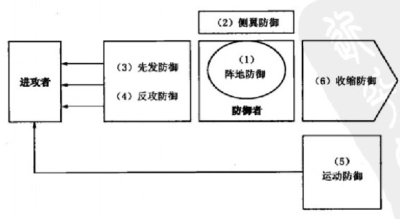

图11.6 防御战略的六种类型

阵地防御

阵地防御意味着占领最大的消费者心智份额，使得品牌形象坚不可摧，这正如宝洁公司所缔造的：在消费者心中，汰渍（Tide）洗衣粉是用于衣物清洗，而佳洁士（Crest）牙膏用于防蛀保健，帮宝适（Pampers）尿片则实现健康干爽。

侧翼防御

尽管阵地防御很重要，市场领先者也应该建立一些侧翼以保护其薄弱的前线阵地或者作为可能的战略反攻基地。赫布莲（Heublein）公司旗下的斯米诺（Smirnoff）拥有全美23%的伏特加市场，在被低价竞争对手沃尔夫施密特攻击时，赫布莲反而提高了售价，并将增加的收入用于广告投放。与此同时，赫布莲推出一个新品牌瑞斯加（Relska）与沃尔夫施密特竞争，并且还引进了一个售价更低的品牌------波波夫（Popov）。这个战略有效地打击了沃尔夫施密特，同时也保护了赫布莲的侧翼。

先发防御

一种更加积极的做法是在竞争对手攻击之前先发制人。公司可以通过几种方法进行先发防御。它可以跨越市场展开游击战，在这里打击这个竞争对手，在那里打击另一个，使得每一个对手都惶恐不安；或者也可以尝试大市场包围。美国银行在全国有17000多台ATM机和5700家分行，就对当地或区域性银行造成了极大威胁。用这种方法企业可以发出市场信号劝告竞争对手不要发动进攻。

在推出一系列的新产品时，营销人员应确保已事先预告，根据未来行动传递信息。事先预告能向竞争对手传递信号：要贏得市场份额就必须实力对碰。如果微软宣布了新产品开发计划，小公司就可能会将其开发力量转移到其他领域以避免硬碰硬的竞争。许多高科技公司甚至曾经被起诉参与"烟箝弹"的销售炒作，即某些产品在上市前通过炒作而备受期待，实际上只是一拖再拖只闻其声不见其影。

反攻防御

在受到攻击时，绝大部分市场领先者会还以颜色。在反攻防御中，市场领先者可以直面回击或者向进攻者侧翼包抄甚至发动钳形攻势。一次有效的反攻可以侵入攻击者的主营领域使其不得不回营救主。在目睹UPS侵入自己的空中快递领域后，联邦快递（FedEx）重金收购了多家陆上快递公司以挑战UPS的主营业务。

反攻防御的另一种常见方式是进行经济上或者政治上的打压。市场领先者可以对易流失产品采用低价策略压倒竞争对手，并从高利润产品获得收益补偿；或是市场领先者也可以提早宣布产品即将升级换代，防止消费者购买竞争产品；再或游说立法者采取政治行动禁止或削弱竞争。

运动防御

在运动防御中，市场领先者将其领导地位扩展到新的领域，通过市场扩大化（market
broadening）或市场多样化（market
diversification）使其成为将来的进攻或防御中心。市场扩大化将企业的焦点从现行产品转移到满足基本需要上。企业将大力投资研发与该需求相关的所有技术。因此，诸如英国石油等石油公司都在努力重塑其"能源"公司的形象。当然，这种转变也要求他们将研发涉及石油、煤、核能、水力以及化工行业。

市场多样化则是进入不相关领域。美国的烟草公司如雷诺兹（Reynolds）、菲利普·莫里斯（Philip
Morris）等认识到烟草行业受到的限制越来越大后，他们并不满足于阵地防御，甚至也没有寻找香烟的替代品，而是迅速涉足新的行业，如啤酒、红酒、软饮料和冷冻食品。

收缩防御

大公司有时候也必须承认他们无法防守其所有的领地。此时最好的办法就是计划性收缩（也叫战略撤退），即放弃弱势领域，重新分配资源至强势领域。2006年莎莉（Sara
Lee）放弃了那些花费公司营业收入40%的产品，其中包括其老品牌恒适（Hanes），这样公司就能专注发展其著名的食品品牌。

扩大市场份额

在许多市场中，企业的市场份额每提高一个百分点就能带来数千万美元的收益。难怪在诸多市场中，市场份额的竞争会变得如此激烈。然而，在服务的市场上获取日益增长的市场份额，并不意味着自动就能产生更高的利润，特别是对于那些没有形成规模经济的劳动密集型服务公司而言。能否获取更高的利润在很大程度上取决于公司的战略。

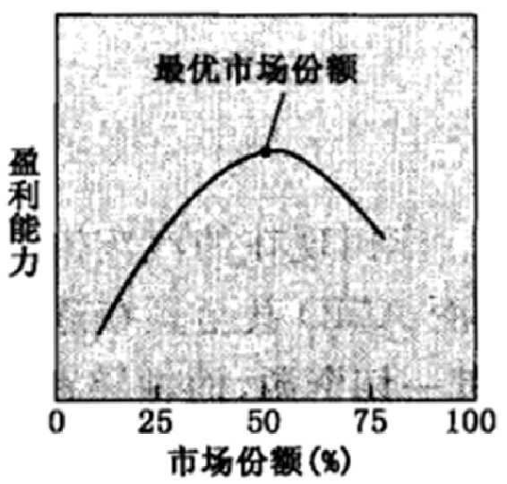

图11.7 最优市场份额的概念

由于获取更多市场份额所付出的代价可能远远超过其收益价值，因此，公司在追求市场份额的增长前应该考虑如下四个因素：

 

-   激起反托拉斯行动的可能性。如果主导厂商在某个市场上进展过于深入的话，嫉妒的竞争者可能会控其"垄断"。这一风险的上升会减少过分推动市场份额扩大的吸引力。微软和英特尔就是最好的例子，这两家公司都因市场领导地位及其做法而面临严密的监视。
-   经济成本。图11.7显示，一旦市场份额超过某一水平，公司收益率将会随着市场份额的增长而降低。如图所示，公司的最佳市场份额是50%。此后获得更大市场份额的成本会大于其价值。那些"顽固"的顾客可能会讨厌这种公司而忠诚于有竞争力的供应商，或者有独特的需求，或者偏好与较小的供应商打交道；法律工作成本、公共关系费用以及游说费用都会随着市场份额的增加而增加。力图获取更高的市场份额在以下情况中是不合理的。买方希望供给来源多样化以及退出壁垒非常高时，几乎不存在规模经济或体验经济，细分市场不具备吸引力。一些市场领先者甚至通过有选择地减少企业劣势领域的市场份额来提高盈利能力。
-   开展错误的营销活动。那些成功获取市场份额的公司一般在以下三个方面胜过其竞争者：新品推荐活动、相关产品质量和营销花费。另一个方面，那些试图通过比竞争者更大幅度的降价来提升市场份额的公司往往收获不大，因为相当一部分竞争对手能够承受这个降价幅度，而其他公司则会通过增加附加价值来阻止买家转换品牌。在固定成本和存货成本高且停滞不前的初级需求行业，如钢铁、汽车、造纸和化学等行业中，这种竞争性对抗和价格战表现得最为激烈。
-   增长的市场份额对实际质量和感知质量的影响。过多的顾客会使得公司资源紧张，影响产品价值和服务传递。美国在线（American
    Online）就曾经历过这种成长期阵痛，当时其顾客群的扩张导致系统中断、访问出现问题。消费者可能也会推断"更大并非更好"，并猜想公司成长会导致质量衰退。如果"排他性"是一种关键的品牌利益，那么现有顾客就可能会排挤增加的新顾客。

### 其他竞争战略

市场占有率在某一行业中居第二、第三或者其后的公司通常被称为亚军公司或者跟随型公司。像百事可乐、福特、安飞士、德州仪器等在其各自领域都是非常大的公司。通常他们可以在两种姿态中取其一：作为市场挑战者，以激进的方式进攻市场领先者和其他竞争者，夺取更大的市场份额；或者作为市场跟随者参与活动但是不"兴风作浪"。

市场挑战者战略

许多市场挑战者能够逼近甚至赶超领导者。丰田现在的汽车生产量就超过通用汽车，劳氏家具则给家得宝施加了不少压力，而AMD甚至正在逐步削弱英特尔的市场份额。挑战者雄心勃勃，并为此利用其一切资源，而领导者往往只是循规蹈矩地经营。现在让我们来细数可为市场挑战者所用的竞争性进攻战略。

确定战略目标和竞争对手

市场挑战者首先必须明确其战略目标。绝大部分公司的目标是扩大市场份额。挑战者也必须确定攻击谁：

 

-   攻击市场领导者。这是一种高风险高回报的战略，特别是领导者在该市场做得并不好的时候，此种方法非常明智。它通常可以获得额外效益，即拉开与竞争者的距离。当美乐淡啤（Miller
    Lite）在2004\~2005年间攻击百威淡啤（Bud
    Lite）的产品质量时，银子弹（Coors）则逐渐淡出人们的视线。另一种方法是在整个细分市场上的创新能力超过领导者。施乐（Xerox）就因开发出一个更好的复印程序，而从3M公司那里夺取了复印市场。但是不久之后，佳能（Canon）就凭借桌上复印机抢占了施乐（Xerox）相当多的市场份额。
-   攻击与自己规模相同，但是不善经营或者资金短缺的公司。这些公司的产品老化，价格高昂或不能在其他方面满足顾客需求。
-   攻击小的地方性或者区域性公司。很多主要银行都通过吞噬更小的区域银行或者说"小鱼"才成长为现在的规模。

选择一种普遍的攻击战略

> 针对明确的目标和竞争对手，我们可以采取什么样的攻击策略呢？我们可以识别以下五种攻击策略：正面攻击、侧翼攻击、围堵攻击、迂回攻击和游击战。

正面攻击    在纯粹的正面攻击战中，进攻者在产品、广告、价格和分销方面与对手进行正面比拼。这种力量比拼意味着拥有更多资源的一方会取得最终胜利。而如果市场领先者不反击，或者进攻者能让市场相信其产品可媲美领导者的话，一种改良的正面攻击，如降价等将会起作用。Helene
Curtis就擅长让顾客相信其品牌------如Suave和Finesse    质量堪比高价品牌，但是却更物超所值。

侧翼攻击    敌人的弱点就是天然的靶子。侧翼攻击可以遵循两个战略维度------地理的和细分市场的。在一次地理性攻击中，挑战者要识别出领导者表现逊色的区域范围。尽管因特网在多个市场中夺走了报纸的阅读者和广告商，但是独立新闻传媒（Independent
News&
Media），这家拥有102年历史的爱尔兰媒体公司却将其旗下175种报纸和杂志中的大部分售往经济发达但网络发展相对薄弱的国家的城市，如爱尔兰、南非、澳大利亚、新西兰和印度等。另一种侧翼攻击战略是去满足那些未被覆盖的市场需求。Ariat牛仔靴就曾经挑战过长期以来的市场领先者Justin
Boots和Tony
Lama，它的靴皮每一寸都来自农场，同时靴子根据人体工学原理设计，穿起来如跑鞋一样舒服，这是品类中的一种全新利益细分。

侧翼攻击也意味着识别细分市场中的转变，因为这些转变可能导致市场缝隙的形成，企业可冲入这一市场缝隙进行填充，进而将其发展为优势细分市场。侧翼攻击其实是现代营销中最传统的战略，其秉持的营销目标就是发现需求并设法满足它。对于资源比对手少的挑战者来说，这种策略尤其具有吸引力，其胜算也比正面攻击更大。

> 搜索引擎

> 挑战占据网络搜索业务市场45%的谷歌，在任何人看来这都是一件非常鲁莽的事情。正面攻击谷歌意味着建造一个更好的"捕鼠器"（在这里指更好的搜索算法）。但是，不少小公司却不断对谷歌进行侧翼攻击，他们也确信自己能够从这个搜索巨头手中夺取到部分市场份额。这些小公司攻击的侧翼是谷歌搜索引擎所缺少的要素------人类智能及其推理和联系上下语境的能力。吉姆·威尔斯（Jim
> Wales），合作性网络百科全书维基百科（Wikipedia）的共同创始人，计划开发一个能够同时采用人脑演绎和机器驱动算法的开放资源搜索引擎维基（Wikia）。威尔斯认为人类更擅长于清除垃圾搜索结果。Cha
> Cha采用类似的策略，在谷歌还未深入的韩国得到了兴旺发展。由麻省理工学院的科学家斯科特·A·琼斯（Scott人
> Jones）创建的Cha
> Cha，聘请了25000名兼职或全职员工提供实时导搜。任何用户如果曾经有过用"谷歌"搜索过一个主题，但出来成千上万个网页（极少数是有用的）的经历，在使用过向导性检索后都会被其吸引。Cha
> Cha的人工向导搜索能够提供一系列更少但更聚焦和相关的结果。尽管人工导搜的花费会使人望而却步，但是Cha
> Cha还是设法以每小时5到10美元的价格每个月引进10000名向导，而且它使用财务激励制度促使员工介绍更多向导进来。至于维基，则计划根据维基百科的"全志愿者运作"的成功模式，招募成千上万的志愿者。

围堵攻击    围堵攻击就是试图通过闪电战获取敌人的大片领土。它意味着在多个正面发动浩大的进攻。当挑战者掌握了更上等的资源，并认为迅速的围堵能够摧毁对手的意志的时候，此种攻击方式就是明智的。为了对抗夙敌微软，美国升阳科技公司（Sun
Microsystem）准许成百上千个公司和数百万的软件开发者在任何种类的用户设备上使用Java软件。随着消费者的电子产品逐渐数字化，java软件也逐渐出现在更大范围的机件中。

迂回攻击    最间接的攻击战略是绕过所有的对手，进攻最易夺取的市场来扩大公司的资源基础。这种战略提供了三种方针：多样化发展不相关产品，多样化发展新的地理市场，跃进式发展新技术来排挤现有产品。在过去的10年中，百事可乐曾经运用迂回战略对抗可口可乐：（1）1997年，在可口可乐推出Dasani品牌前，成功铺开了Aquafina瓶装水的全国渠道；（2）1998年，以33亿美元成功收购了市场份额约为可口可乐美汁源（Minute
Maid）两倍的橘汁大亨纯果乐（Tropicana）；（3）2000年，以140亿美元收购了拥有运动饮料市场领导品牌佳得乐（Gatorade）的桂格燕麦公司（The
Quaker Oats）。

技术跃进（technological
leapfrogging）是一种应用于高科技行业的迂回战略。挑战者耐心研究开发出下一代新技术，据此发动一场攻击，将占据优势的战场据为己有。任天堂（Nintendo）在视频游戏市场上的成功一击，正是通过推出优先技术、重新定义"竞争空间"从而夺得市场的范例。随后，世嘉（Sega/Genesis）运用更先进的技术采取了同样的战略。而现在，索尼的游戏平台已经引领先进技术，夺取了将近一半的视频游戏市场。挑战者谷歌也是利用技术跃进策略超越了雅虎，成为搜索业的市场领先者。

游击战    游击战由发动小型的、断断续续的攻击组成，骚扰对手使其士气低沉，从而最终贏得持久的立足之地。采取游击战的挑战者同时使用常规和非常规的进攻方式，其中包括选择性降价、频繁的广告促销战以及不时的法律行动。普林斯顿评论（Princeton
Review）成功挑战当时美国最大的考试培训公司------开普兰教育中心（Kaplan
Education
Centers）的方法就是，用电子邮件发送有关开普兰恐怖故事和无礼的广告（如"斯坦利是个懦夫"，"真正的朋友是不会让朋友参加开普兰的课程"等）。同时，也不忘兜售普林斯顿评论开设的小班形式的、更加生动的课程。

尽管花费可能会小于正面攻击、围堵攻击或者侧翼攻击，但是游击战的成本还是不菲。其实比起真正的战役，游击战更像一场大战的准备战。如果挑战者希望打败对手的话，最终还是要以一次更强的进攻作为后盾。然而，进行游击战式营销决不能跨越法律和道德的底线。2007年1月31日，一些用于游击营销的磁性灯被展示于马萨诸塞州的波士顿及其周边地区，但是它们却被误认为是爆炸装置。警察封锁了地铁站、桥梁和93号州际公路，检查、拆除，甚至在某些情况下，销毁了这种装置。但结果显示这些可疑目标只是卡通网络（Cartoon
Network）为其电视系列节目《饮料杯历险记》所做的角色刻画广告。最终，该网络的所有权人特纳广播集团（Turner
Broadcasting System）被处以罚款，造成了非常消极的公众影响。

选择特定的攻击战略

挑战者必须超越这五种通用战略，开发出更加具有针对性的战略。营销方案的任何方面都可能作为攻击的基础，如低价或打折的产品、新的或改良的产品和服务、更加多样化的产品或者是新颖的分销战略。挑战者的成功取决于如何结合各项战略来逐渐提升自身地位。"营销备忘：让小品牌表现得更好"为挑战者品牌提供了一些额外的提示。

\@营销备忘：让小品牌表现得更好

亚当·摩根（Adam Morgan）提供了让小品牌更具竞争性的八项建议：

-   1.即刻与过去告别。不要害怕提一些"愚蠢"的问题来挑战传统，学会从不同角度来审视品牌。

-   2.构建一个"灯塔身份"。创建价值并向外界传达你是谁以及你为什么是。苹果公司非常擅长此道。

-   3.设想自己是该品类的思维领导者。在怎样评价自己、在何地发表言论、说过之后如何去做等方面打破常规。

-   4.创建再评估的标志。火箭在开始的1英里用掉一半燃料来挣脱地球引力，你也需要尽力分化消费者的看法，让他们重新思考你的品牌。

-   5.牺牲。聚焦你的目标、信息、媒体到达率和频率、分销和产品线延伸，并且意识到能以小博大。

-   6.超越承诺。尽管你很可能只做很少的事情，但是要做就把它们做"大"。

-   7.利用公共关系和广告进入流行文化。非传统的沟通会让人们时时谈论。

-   8.以想法为中心而非以顾客为中心。永不忘记品牌是什么、能成为什么，以此保持挑战的动力，将营销支持重新定义为公司的中心来反映这种愿景。

市场跟随者战略

多年前，西奥多·莱维特（Theodore
Levitt）写了一篇题为《创新性模仿》（Innovative
Imitation）的文章，他在其中强调，产品模仿（product
imitation）战略可能跟产品创新（product
innovation）战略一样有利可图。创新者承担了开发新产品、使之进入分销渠道、告知并培育消费者的大量成本。所有这些工作和风险带来的回报就是通常会成为市场领先者。但是，另一个公司能追随其后复制或者改良新产品。尽管不太可能赶超领导者，但是这个追随者也能获取很高的利润，因为它没有承担任何创新成本。

> S&S摩托车

> S&S摩托车是世界上最大的完整引擎和发动机主要零件的供应商，其超过15家的客户公司每年都能制造出数以千计的哈雷式（Harley-like）沙滩自行车。因能为顾客进行个性化定制，这些克隆产品每辆要价高达3万美元。通过改善哈雷-戴维森（Harley-Davison）的手工艺，S&S在行业内树立了名声。其顾客通常是那些本想购买哈雷产品，却受挫于哈雷经销店漫长交货期的消费者，其他顾客则纯粹是想要购买S&S强大可靠的引擎。S&S每年都会订购一辆新的哈雷车，拆解其引擎并设法改进，以此与不断演进的市场保持同步发展。

许多公司宁愿跟随而不愿挑战市场领先者。"意识平行主义"思维范式在钢铁、肥料、化工等资本密集、产品同质的行业非常普遍。在这些行业中，产品差异化和形象差异化的机会非常小，服务质量相差不大，价格敏感度非常高。这些行业非常排斥短期抢占市场的行为，因为这种战略只会引起强烈的报复。因此，绝大部分公司决定不去抢夺其他公司的顾客。相反，他们通常复制领导者的做法，为购买者提供类似的产品和服务。市场份额显示出高度的稳定性。

但这并不是说市场跟随者缺乏战略。一个市场追随者必须清楚如何保留现有顾客和如何贏得相当份额的新顾客。每个跟随者都试图在选址、服务或者财务等方面为其目标市场创建独特性优势。跟随者必须时刻保持低廉的制造成本、优质的产品和服务质量，因为它通常都是挑战者攻击的首要目标。当挑战者有所行动时，跟随者必须准备随时进入新的市场。跟随者需要设计一条成长路线，但前提是这条路不会带来竞争性报复。这里我们区分了四种主要的战略：

-   1.伪造者。伪造者完全复制领导者的产品和包装，在黑市或者通过声名狼藉的经销商出售。唱片公司、苹果和劳力士（Rolex）就遭遇了伪造者的问题，特别是在亚洲。

-   2.克隆者。克隆者效仿领导者的产品、名字和包装，但会加以少许变动。例如，Ralcorp控股公司销售与某名牌谷类食品包装盒相似的产品。它旗下的麦圈、水果环和玉米片每盒售价比领导品牌产品低了将近1美元。

-   3.模仿者。模仿者从领导者产品中复制一些东西，但是会在包装、广告、定价和选址等方面保持差异性。只要模仿者不展开强烈攻势，领导者就不会对此太过介意。成长于佛罗里达州洛德代尔堡的费尔南德斯·普贾尔斯（Fernandez
    Pujals）把达美乐比萨送货到家的理念带到了西班牙。在马德里，他借了8万美元开了第一家店。现如今，他在欧洲和拉丁美洲拥有将近1000家电话比萨（Telepizza）连锁门店。

-   4.改良者。改良者对领导者的产品进行调整或者改良。他们可能会选择在不词的市场销售产品，但往往很可能成长为未来的挑战者，正如许多日本公司通过改良领导产品去别处发展壮大。

跟随者能赚多少呢？正常情况下，会少于领导者。比如，一项对食品加工公司的调查显示，最大的公司平均投资回报率是16%，位列第二的公司是6%，第三位的是-1%，第四位的是-6%。这就意味着只有前两名的公司才可能盈利。难怪通用电气的前首席执行官杰克·韦尔奇（Jeck
Welch）告诉他的业务部门，每个项目都必须达到市场的前两名。跟随者战略通常不是一种可盈利的途径。

市场利基者战略

如我们在第8章所介绍的，除了在一个巨大的市场中成为跟随者外，另一个选择就是在小市场中成为领导者，或称之为利基者。小公司通常都要避免与大公司竞争，因而它们会选择大公司不感兴趣的小市场作为目标。但即使是大的、盈利性很好的企业也可能为一些业务部门或旗下公司选择利基战略。

> 伊利诺伊工具厂（Illinois Tool Works）

> 伊利诺伊工具厂生产数千种产品，其中包括钉子、螺丝、自行车头盔、背包、宠物颈圈的塑料扣子、可重新封口的食品包装和其他产品。从20世纪80年代后期起，该公司每年都会进行30\~40起并购，不断为其产品线增加新产品。伊利诺伊工具厂在48个国家拥有700多家高度独立和分权的业务单位，雇用了5万名员工。如果某部门开始推出一种新产品，公司会将其产品和人力分离出来，成立一个新的业务单元。

那些只有较小市场份额的公司也可通过明智的市场利基来获取高额利润。这些公司往往倾向于提供高价值、收取溢价、降低制造成本和营造强势的公司文化和愿景。家族企业Tire
Rack每年从其印第安纳州南本德的厂址，通过网络、电话和邮件卖出200万个特制轮胎。本部位于休斯敦的VAALCO能源公司认为美国国内盲目开采石油的公司过多，在外国更有机会发现油田矿藏。在非洲中西部的加蓬海岸开发油田时，它碰到的竞争者果然少很多。因为公司收入增长幅度非常大，它被《商业周刊》评为2006年成长性最好的公司。

在对数百家营业单位进行调查后，战略计划机构发现小市场的平均投资回报率为27%，而大市场只有11%。为什么市场利基策略如此有利可图？主要原因是市场利基者最终可以深入了解目标顾客，从而能够比其他随意进入该市场的竞争者更好地满足消费者的需求。因此，市场利基者能够在成本之上收取实在的价格。它们获得了高边际收益，而大市场领先者获取大额销售量。

市场利基者有三项任务：创造利基、扩大利基、保护利基。市场利基战略带来的主要风险在于，这一市场利基可能会枯竭或者遭遇攻击。此后，公司可能会陷入困境，因为它所拥有的高度专门化资源可能没有其他高价值的替代使用方法。

> Zippo

> 随着吸烟的人越来越少，宾夕法尼亚州布莱福德的Zippo打火机制造商发现其标志性的金属打火机市场正在衰竭。Zippo的营销人员开始觉察到，他们需要进行产品多样化，并拓宽专营业务至"出售火种"。为了在2010年之前将对烟萆相关产品的利润依赖度降低到50%左右，公司在2001年推出了一种细长型的可用于点蜡烛、烤架和壁炉的多用途打火机；并且，公司还跟与火相关的户外产品供应商达成了特许经营协议；与此同时，它收购了刀具公司Case
> Cutlery以及以精细的意大利皮革产品闻名欧洲的意大利D.D.M公司。

公司必须不断创造新的市场，因为利基市场可能会逐渐变弱。"营销备忘：市场利基的专家角色"概述了一些可选择的办法。公司应该"坚持它的市场利基战略"，但不必坚守它的某个利基市场。这就是多重市场利基战略（multiple
niching strategy）比单一利基战略（single niching
strategy）更可取的原因。在两个或者多个利基市场形成实力，公司就能提高存活的几率。

\@营销备忘：市场利基的专家角色

成功获得市场利基的关键是专业化。下面是一些可能的专家角色：

终端用户专家：公司专门为一类终端用户服务。例如，一个增值转售商（VAR）为特定的顾客细分市场定制电脑硬件和软件，并在此过程中获取溢价。

垂直层次专家：公司专门从事产品-分销价值链的某垂直层次。如，一个铜制品公司可能专注于生产原铜、铜制零件或者铜制产成品。

顾客规模专家：公司专门向小型、中型或大型规模的客户进行销售。许多市场利基者专门为被大公司所忽视的小客户提供服务。

特定顾客专家：公司只向一个或少数几个客户进行销售。许多公司将全部产量出售给单一客户，如西尔斯或者通用汽车公司。

地理区域专家：公司只在世界上的特定地点、地带或者区域出售。

产品或产品线专家：公司只生产一种产品或者只有一条产品线。某生产商可能只生产显微镜的镜片，而某零售商可能只出售领带。

产品特色专家：公司专门生产某种特定产品或者具有某种特色的产品。布卡（Zipcar）公司的汽车共享服务针对的就是那些在美国七个主要城市中生活和工作、频繁使用公共交通但仍需在一个月中使用几次轿车的人们。

订单生产专家：公司为个人客户定制化生产产品。

性价比专家：公司经营市场上最高端或者最低端的产品。惠普公司就专攻微型计算器的高质高价市场。

服务专家：公司提供一种或者多种其他公司不提供的服务。某银行可能接受电话贷款并能送现金上门。

渠道专家：公司专攻一条渠道的分销服务。例如，一家软饮料公司决定开展一项只在加油站提供的大规模服务。

公司进入某市场应该首先将目标对准一个利基市场而非整个市场。手机行业一直呈显著增长态势，但是随着新的潜在使用者数量的萎缩，这一行业现在也面临激烈的竞争。爱尔兰的一个新兴公司数字手机集团（Digicel
Group）就成功打入了少数几个还在高速增长的细分市场之一：还没有手机的穷人。

> 数字手机集团（Digicel Group）

> 2001年，数字手机集团的首席执行官丹尼斯·奥布赖恩（Denis
> O'Brien）听说，牙买加政府打算开放长期被英国电信巨头大通电讯（Cabled
> Wireless）垄断的当地电话市场，便即刻从他投资的第一家电信公司东欧电信集团（East
> Telecom
> Group）的营业收入中取出将近5000万美元购买了一个许可证。奥布赖恩之所以决意冒险，是因为他知道在牙买加建立陆上通讯线需要两年多时间，而牙买加仅4%的居民拥有手机。在短短100天内，数字手机集团就以其低廉的电话价格和话费以及改进的电话服务吸引了近10万个签约用户。5年后，牙买加70%的手机用户（现在是全国270万居民的82%）都是数字手机的客户。数字手机在加勒比海岸的其他国家和地区中也安营扎寨，自称在加勒比海岸、拉丁美洲甚至南太平洋地区的22个国家中赢得了300万用户。现在，奥布赖恩的雄心伟计就是进军美国市场，准确地说是美国的年轻人、穷人或者移民者市场，这些顾客是T-Mobile和威讯（Verizon）之类的电信巨头所无暇顾及的。

### 平衡顾客导向和竞争者导向

我们已经强调了公司作为市场领先者、挑战者、跟随者还是利基者的竞争性定位的重要性，但是，一个公司不应该把所有的精力都集中在竞争者身上。

以竞争者为中心的公司

一个以竞争者为中心的公司会设定如下行动方针：

观察到的形势：

 

-   竞争者W正准备打压我们在迈阿密的市场。
-   竞争者X正在休斯敦改善其渠道覆盖，因此影响到我们的销售收入。
-   竞争者Y在丹佛降价促销，我司因此丧失了三个百分点的市场份额。
-   竞争者Z在新奥尔良引进新的服务特色，我司的销售额开始下降。

反应：

 

-   撤离迈阿密市场，因为我们无法承受对抗带来的资金压力。
-   在休斯敦增加广告支出。
-   在丹佛与竞争者同步降价。
-   在新奥尔良增加促销预算。

这些计划既有积极的一面，也有消极的一面。从积极方面来说，公司形成一种竞争者导向，这可以训练营销人员保持警惕，时刻关注竞争者劣势和公司本身定位。从消极方面来说，公司的反应过度了。公司仅仅根据竞争者的行动来决定自己的步调，而并非认真规划和执行一个持续性的、顾客导向的战略来向着自我既定的目标前进。如此这般，公司永远不知道战争什么时候会结束，因为这取决于竞争者的行动。

以顾客为中心的公司

以顾客为中心的公司在制定战略时更加关注顾客的发展态势。

观察到的形势：

 

-   总体市场年增长率为4%。
-   质量敏感型的细分市场年增长率为8%。
-   交易倾向型的顾客细分市场增长速度也很快，但这些顾客并不会与任何供应商保持长久的关系。
-   越来越多的顾客希望公司开通一个24小时热线电话，这种服务在本行业中目前尚无企业提供。

反应：

 

-   我们会投入更多精力来努力达到质量敏感型细分市场的顾客要求，并使之满意。我们将购买更好的零件、改进质量控制、将广告主题转向产品质量。
-   我们会避免降价和一次性交易，因为我们并不希望客以这种方式购买产品。
-   如果看起来有一定前景，我们会开通一个24小时热线。

显然，以顾客为中心的公司定位更准确，可以识别更多新的机会，也能设定一条有希望获得长期利益的发展路线。在既定的资源与目标下，公司能够通过监察顾客需求来判断哪个顾客群体和新出现的需求最值得去迎合。亚马逊的创建者杰夫·贝佐斯（Jeff
Bezos）就非常推崇以顾客为中心的做法："亚马逊的理念一贯是，我们时刻心念消费者而非竞争者。我们观察竞争者，向他们学习，尽自己所能做到他们能'为顾客所做的事'，但是我们从来不会时刻为竞争者所困扰。"

### 本章小结

-   1.如果要准备一个有效的营销战略，除了要了解实际和潜在的顾客外，公司还必须了解自己的竞争者。营销人员需要识别竞争者的战略、目标、优势和劣势。

-   2.与公司最接近的竞争者是那些满足同样的顾客及其需求并提供类似产品的公司。同时，公司也应该重视那些采用其他方法或新方法来满足同种需求的潜在竞争者。公司应该同时采用以产业为基础和以市场为基础的分析方法来识别竞争者。

-   3.市场领先者在相关产品市场上拥有最大的市场份额。要保持市场领先，领导者就必须寻求各种方法来扩大市场总需求、努力保护现有市场份额并尝试将其进一步提高。

-   4.为占有更多的市场份额，市场挑战者采用激进的方法来攻击市场领先者和其他竞争者。挑战者可以在五种普遍的战略中进行选择；同时，也必须选择具体的攻击战略。

-   5.市场跟随者是一种想要保持现有市场份额而不想兴风作浪的亚军公司。跟随者可以选择扮演伪造者、克隆者、模仿者或者改良者中的某一角色。

-   6.大公司不愿服务的小型细分市场则由市场利基者填补。市场利基的关键是专业化。利基者为特定的顾客群组提供产品和服务以全方位满足其需求，并在此过程中获得溢价。

-   7.竞争导向在如今的全球市场上非常重要，但同样重要的是，公司不应过分关注竞争者。它们应该平衡对消费者和竞争者的关注。

### 营销应用

营销辩论：如何攻击某个产品大类的领先者？

攻击一个领导者总是非常困难的。一些战略家推荐，针对领导者的强项进行"硬碰硬"的竞争。其他战略家则对此持反对意见，并推荐侧翼攻击以避开领导者的强项。

辩论双方

正方观点：挑战市场领先者的最好方法是攻击其强项。

反方观点：攻击市场领先者的最好方法是避免正面交锋并采取侧翼攻击战略。

营销讨论

选取一个行业。根据四种不同角色（领导者、挑战者、跟随者或市场利基者）的可能表现对公司进行分类。你如何描述竞争的本质特征？这些公司遵循本章描述的准则吗？
