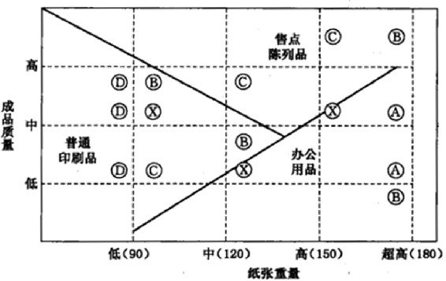
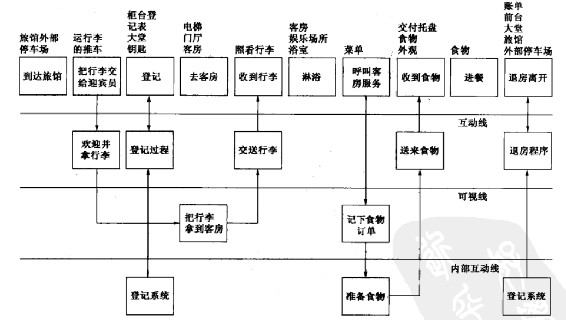
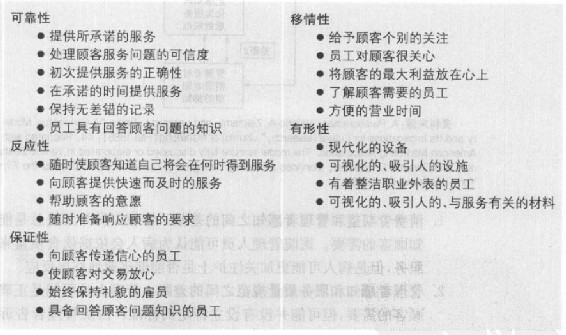
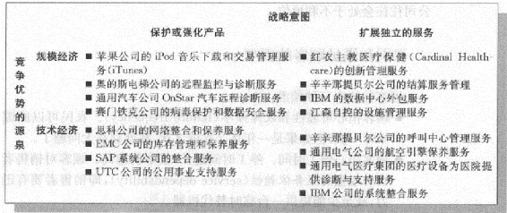
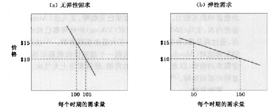

第5部分 开发市场供应物
----------------------

第12章 制定产品战略

第13章 服务的设计与管理

第14章 制定价格战略和方案

### 第12章 制定产品战略

> 本章将重点阐释以下问题：
>
> -   1.产品的特征是什么？营销者如何对产品进行分类？

-   2.企业如何对产品进行差异化？

-   3.企业如何建立和管理产品组合和产品线？

-   4.企业如何联合产品以建立强势联合品牌或成分品牌?

-   5.企业如何使用包装、标签、保单和保证作为营销工具？

一个伟大品牌的核心是一个伟大的产品。产品在市场供应中是一个关键因素。市场领先者通常出售能提供卓越顾客价值的高品质产品和服务。

尽管受到大量有力竞争者的挑战，像约翰·迪尔（John Deere）、凯斯（J.L
Case）、小松（Komatsu）、沃尔沃和日立，卡特彼勒还是通过最大化顾客的总价值，成为了建筑设备行业的领头羊。首先，卡特彼勒生产出了以其可靠性和耐用性著称的高性能设备，这是选择购买重型工业设备时考虑的关键因素。公司还通过提供建筑设备的全线产品及广泛的融资条件来使消费者更容易地找到合适的产品。卡特彼勒保持着行业中最大数量的独立建筑设备经销商。这些经销商都销售卡特彼勒的全线产品，比竞争对手的经销商更训练有素，表现得也更可靠。卡特彼勒还建立了一个全球范围的零部件和服务系统，这在行业中是找不出第二个的。顾客认同卡特彼勒在它的供应物中创造的所有价值，这支持公司在市场中保持溢价。以优越的销售和服务体系作为后盾的高性能设备是卡特彼勒成功产品战略的核心。

营销规划从制定一个供应物的方案开始，以满足日标顾客的需要和欲望。顾客会从三个方面来判断供应物：产品特色和质量、服务组合和质量以及价格（图12.1）。本章我们讨论产品，第13章讨论服务，第14章讨论价格。这三个因素必须被紧密地融入一个具有竞争力和吸引力的供应物中。

图12.1 市场供应物的组成要素

### 产品的特征和分类

许多人认为产品是一种有形的东西，其实它不只是这样。从广义上说，产品是任何一种能被提供来满足市场欲望和需要的东西，包括有形物品、服务、体验、事件、人物、地点、财产、组织、信息和想法等。

产品层次：顾客价值层级

在规划市场供应物时，营销人员需要考虑五个产品层次（图12.2）每个层次都增加了更多的顾客价值。这五个产品层次构成了顾客价值层级（customer
value hierarchy）。

图12.2 五个产品层次

 

-   最基本的层次核心利益（core
    benefit），即顾客真正购买的服务或利益。酒店的顾客在购买"休息和睡眠"，钻床的采购者在购买"洞"。营销人员必须将自己看作利益的提供者。
-   在第二层次，营销人员必须把核心利益转化成基本产品（basic
    product）。这样，一家酒店的房间就包括床、盥洗间、毛巾、写字台、梳妆台和衣橱。
-   在第三层次，营销人员预备期望产品（expected
    product），即顾客在购买这种产品时一般会期望得到的一组特性和条件。酒店的顾客期望有一张干净的床、新的毛巾、工作台灯以及相当程度的安静。
-   在第四层次，营销人员预备附加产品（augmented
    product），附加产品超过顾客的期望。在发达国家，品牌定位和竞争发生在这个层次。在发展中的新兴市场，如印度和巴西，竞争大多发生在期望产品层次。
-   第五层次是潜在产品（potential
    product），包含所有可能在未来产生的增加和转变方面。公司从中寻找新的方式来满足顾客，区分它们的供应物。

\@营销视野：大市场和"超中介"

一些产品的购买使得另一些产品成为必需。新汽车市场就是"大市场"（metamarket）的一个很好例子。顾客在选择汽车的同时，还要从保险公司购买一份保险，通常还必须向银行申请一份贷款。聪明的汽车公司或汽车经销商会通过与保险公司及银行合作，使得顾客方便地完成这三个交易。这样的汽车经销商就是在扮演一个"大中介"（metamediary）的角色。

"大市场"是营销人员观察到了整个消费系统并把它"打包"，使相关的产品和服务消费简化的结果。莫汉·索奈（Mohan
Sawhney）教授将"大市场"定义为"消费者为完成一套认知上相关的活动而需要的产品和服务的集合"。有关主要资产和主要人生大事安排的其他"大市场"有：

买房；

生小孩；

离婚；

度假。

差异化的出现以及竞争越来越多地发生在附加产品层面，这引导营销人员去了解用户的总体消费体系：消费者是如何获得和使用产品及相关服务的。每一个附加都会增加成本，然而，附加利益很快就会变成期望利益和必需的共同点。现在的酒店顾客都会期望有带遥控器的有线或卫星电视、高速的网络接口或两条电话线。这意味着竞争者必须寻求其他的特色和利益。

> 詹姆斯唐集装箱公司

> 有什么比起皱的卡纸板差异化更困难呢？然而，詹姆斯唐集装箱公司作为像3M这样的公司的主要起皱产品供应商，已经和区域制造商建立了战略伙伴关系，提供船运系统的每一种需要。它不仅提供箱子，还提供胶布、收缩包装以及其他所有需要的东西，帮助顾客放置和装运最终产品\[。"这是为了生存的一种整合，"公司的首席运营官说越来越多的顾客想要在一个地方解决一\]切。我们必须不断自我创新，与顾客保持这些关系，维持竞争力。"

产品分类

营销人员习惯基于耐用性、有形性和用途（消费用或工业用）将产品分类。每一种产品类型都有合适的营销组合战略。

耐用性和有形性

营销人员按照耐用性和有形性，将产品分为三种类型：

-   1.易耗品（nondurable
    goods），它是有形的，通常有一种或几种用途，比如啤酒和肥皂。这些商品经常被购买，因此合适的战略是使这些商品在很多地方都能被买到，只赚取微薄利润，并且要大做广告以引发消费者试用，建立偏好。

-   2.耐用品（durable
    goods），它是有形的，通常有多种用途，比如冰箱、机器工具，还有服装等。耐用品通常需要更多销售人员的服务，应有更高的利润，还要有更多的卖方保障。

-   3.服务（services），它是无形的、不可分割的、可变的、不能储存的产品。因此，服务更需要质量控制，提供者的可信度以及适应性。比如理发、法律咨询、设备修理等都属于服务。

消费品分类

我们对大多数消费品按照消费者的购买习惯分类，区分为便利品、选购品、特殊品和非寻求品。

便利品（convenience
goods）通常是消费者频繁、立即地购买的产品，不花费精力。例如软饮料、肥皂、报纸等。便利品可以进一步分类。日用品（staples）是消费者有规律购买的商品。一位买主可能会有规律地购买亨氏番茄酱、佳洁士牙膏、乐之饼干冲动品（impulse
goods）是那些事先没有计划，也不用费力寻找而购买的商品。方糖、杂志都是属于这种类型。应急品（emergency
goods）是当一个很紧急的需求出现时而购买的商品，如暴风雨时的雨伞，冬天里下第一场雪时的靴子和手套。冲动品和应急品制造商会把商品放在那些消费者有可能遇到紧急或产生强烈需求的地方，以促成购买。

选购品（shopping
goods）是消费者按特征比较合适度、质量、价格和式样等而后购买的商品。像家具、服装、二手车、主要电器都属于此类。进一步细分：同质选购品（homogeneous
shopping
goods）质量相似，但有足够的价格差异，需要作出合理的购买比较；异质选购品（heterogeneous
shopping
goods）在可能比价格更重要的产品特性和服务上存在差异。异质选购品的销售商提供广泛的花色品种来满足不同顾客的品位，必须有训练有素的销售人员为顾客提供信息和咨询服务。

特殊品（specialty
goods）有独一无二的特征或品牌识别，并且有足够数量的消费者愿意为之付出特别的购买努力。例子有小轿车、组合音响、照相设备、男士西服等。奔驰汽车是特殊品，因为有兴趣的顾客不惜远途去购买。特殊品不要求比较；买主花的仅仅是路上的时间，经销商不需要便利的位置，当然它必须让潜在顾客知道它在哪里。

非寻求品（unsought
goods）是那些消费者不知道或通常不会想到要买的商品，如烟雾报警器。消费者熟知的非寻求品典型例子有人寿保险、墓地、墓碑和百科全书等。非寻求品需要广告及人员销售支持。

工业品分类

工业品可按照其相关成本和进入生产过程的方式分为：原材料和零部件、资本项目、补给品和商业服务。

原材料和零部件（materials and
parts）是完全进入并最终成为制造商产品的一部分的商品。它们进一步分为两类：未加工的原材料以及加工过的材料和零部件。未加工的原材料（raw
materials）又主要被分为两类：农产品（farm
products）（小麦、棉花、家畜、水果和蔬菜）以及天然产品（natural
products）（鱼、木材、原油、铁矿石等）。许多生产者供应农产品，并把产品转卖给市场中间商，他们提供组合、分级、储存、运输和销售服务。农产品的易腐性和季节性特征引发特殊的营销实践。鉴于农产品的这种特点，它们几乎不需要广告和促销活动。不过也有例外，有时农产品集团会大搞活动，促销它们的产品，如马铃薯、奶酪、牛肉等。一些生产者把自己的产品品牌化，如都乐（Dole）蔬菜、Mott's苹果、金吉达（Chiquita）香蕉等。

天然产品在供应上是有限制的。它们一般体积大，单位价值低，且需从生产商运送到用户那里。数量不多的规模较大的生产商通常直接把产品供给工业用户。因为需要使用这种材料的用户通常会签订长期的供应合同。天然材料的同质性限制了需求创造活动的数量。价格和交货的可靠性是影响供应商选择的主要因素。

加工过的材料和零部件（manufactured materials and
parts）进一步分为两类：构成材料（component
materials）（铁、纱、水泥、电线）和组成部件（component
parts）（小型发动机、轮胎、铸件）。构成材料通常会被进一步加工，如生铁炼成钢，纱被织成布。构成材料标准化的特性通常意味着价格和供应商的可靠性是购买者考虑的关键因素。组成部件在进入最终产品时不发生形式上的改变，就如小型电动机被装进吸尘器，轮胎被装上汽车。价格和服务是营销时主要考虑的因素，品牌化和广告显得没有那么重要。

资本项目（capital
items）是帮助研制和生产最终产品的长期持久的商品。它包括两类：装备和设备。装备（installations）包括建筑（工厂、办公室）和重型设备（发电机、钻床、计算机主机、电梯）。装备是采购的主要项目，通常向生产商直接购买，它们的销售力量包括技术人员，在达成协议前有较长一段时间的谈判过程。生产商必须愿意根据顾客的需要进行设计，并提供售后服务。广告没有人员销售来得重要。

设备（equipment）包括轻便的工厂设备和工具（手动工具、载重卡车）以及办公设备（个人电脑、桌子）。这些设备不会变成最终产品的一部分。它们的寿命介于装备和操作补给品之间。虽然有一些设备制造商采用直销，但更多地会使用中间商，因为市场存在地理位置的分散性，买主又是数量庞大的，且每次的订单数量较小。质量、特色、价格和服务都是考虑的主要因素。销售人员比广告更为重要，虽然广告也能被有效地使用。

补给品和商业服务（supplies and business
services）是短期的商品和服务，以促进最终产品的开发和管理。补给品分为两类：维护和修理用品（maintenance
and repairitems）（油漆、钉子、扫帚等）和操作补给品（operating
supplies）（润滑剂、煤、纸、笔等），它们共称为MRO。补给品相当于便利品，购买时不用花费太大精力，且重复购买。由于其单位价值低，存在大量地理位置分散的顾客，故使用中间商。价格和服务是重要的考虑因素，因为供应品是标准化的，品牌偏好不高。

商业服务包括维护和修理服务（maintenance and repair
services）（擦窗户、修理复印机）以及商业顾问服务（business advisory
services）（法律、管理咨询、广告）。维护和修理服务通常以签约形式，由小型生产商提供或由原始设备制造商供应，商业顾问服务的购买通常以供应商的声誉和员工为基础。

### 差异化

产品想要品牌化，必须与众不同。有形产品潜在的差异化能力各不相同。在一个极端，我们发现一些产品只允许有很小的差异，如鸡肉、阿司匹林、钢铁等。然而即使是这些产品，一些差异也是有可能的：如裴顿世家（Perdue）鸡肉、拜耳（Bayer）阿司匹林和印度塔塔（Tata）钢铁，已经在各自独特的产品类别中获得了独特的身份。宝洁公司使得汰渍、Cheer和Gain衣物洗涤剂都各具独特的品牌个性。在另一个极端，产品则有很高的差异化的能力，像汽车、商务楼和家具等。卖家在此就会面临大量差异化的可能性，包括型式、特色、定制化、性能质量、一致性质量、耐用性、可靠性、可维修性和风格等。设计已经成了一种越来越重要的差异化方式。我们将分别讨论上述提及的可能差异点。

产品差异化

型式

很多产品都可能在形式（form）上有所差异，如产品的大小、形状或者实体结构。想一想产品许多可能的型式（如阿司匹林）。虽然阿司匹林本质上是一件商品，但它可以在剂量大小、形状、颜色、外壳或者药效时间上有所不同。

特色

大部分商品可以在其基本功能上补充各种各样的特色（feature）。通过对最近购买者的调查，公司可以识别并选择一些合适的新特色，然后逐个计算每个潜在特色的顾客价值和公司成本。公司还需考虑有多少个顾客想要这种特色，推出这个特色需要花费多少时间以及竞争对手能否轻易地模仿。为了避免"特色疲劳"，公司必须小心地将那些潜在的特色排列优先顺序，并找到不唐突的方法使消费者明白，如何使用特色并从中获益。公司还必须考虑特色打包或组合。汽车公司通常按几个"配备等级"来生产汽车。这样可以降低制造和储存的成本。每家公司必须决定是否以一个较高的成本向顾客提供定制化的特色，还是用较低的生产成本生产一些标准化的组合产品。

定制化

营销人员可以通过针对个体定制化产品来实现差异化。随着公司精通于收集个体顾客和合作伙伴（供应商、分销商、零售商）的信息，及其工厂设计得更为柔性化，它们已加强了使市场供应物、信息、媒介个性化的能力。大规模定制（mass
customization）让公司能满足每个顾客需求，即提供基于大批量的但又是依据个性化设计的产品、服务、方案和沟通。

虽然李维斯和兰斯恩德属于定制牛仔裤的第一阵列，另外的生产商也已经把大规模定制引入了其他市场。Architechtural
Skylight公司运用目标导向的设计方法来设计和建造定制的天窗。宝马每年在美国售出的40000辆MINI
Coopei中，有60%是定制的。两位投资银行家甚至把鲨鱼的鳍装在他们MINI
Cooper车的顶上。乐高（Lego）从一开始就采用了大规模定制。

> 乐高（Lego）

> 在某种意义上，丹麦的乐高一直是实行大规模定制的。每一个已经拥有最基本款乐高玩具的孩子，都用一块块的塑料积木，创造了自己独特的、神奇的作品。然而在2005年，乐高建成了乐高工厂（The
> Lego
> Factory），这正如公司网站上所说："让你设计、分享、造就你自己定制的乐高产品。"利用乐高提供的免费下载的数字设计软件，顾客可以创造任意结构的玩具。这些设计可以只在网上存在并与其他热衷者一起分享，或者假如顾客想要把它制造出来的话，这个软件会把需要的部件列出，并向位于美国康涩狄格州的乐高仓库发出订单。那儿的员工会把所有的部件放在一个箱子里然后寄出，乐高工厂的顾客不仅仅为可以制作自己的创意而感到骄傲，而且如果乐高觉得他的设计足够好而把它加入到自己的产品目录中的话，他们也能赢得特权。几个极具创意的例子有：丹麦国会建筑的模型，还有著名画家爱舍尔（M.C.Escher）的"另一个世界"的建筑模型。在2006年，乐高工厂发起了一个设计大赛。在比赛中，八位参赛选手进行竞争，他们的创意介绍被放在了乐高工厂的网站上。

性能质量

大多数产品被定位在四个性能水平之一：低、一般、高、超高。性能质量（Performance
quality）指产品的主要特征运行的好坏。当公司采用价值模型，并用较少的钱提供更高的质量时，质量正成为越来越重要的差异化维度。然而，公司不一定要设计出尽可能高的性能水平。制造商必须设计出与目标市场和竞争对手相适的性能水平。公司还必须持续地管理和控制性能质量。不断改进产品可以产生更高的回报和市场份额，如果不这样便会产生消极的后果。

> 梅塞徳斯-奔驰（Mercedes-Benz）

> 从2003年到2006年，梅塞德斯-奔驰经历了它127年历史上最痛苦的一段时间。因为它一流的质量声誉在J.D.Power和其他一些调研中遭到了打击，宝马在全球的销售量超过了它。结果，戴姆勒·克莱斯勒（Daimler
> Chrysler）的首席执行官蔡澈（Dieter
> Zetsche）和他的新管理小组发起了一项围绕汽车的功能元素------发动机、底盘、电子系统等------而不是型号产品线的公司重组计划。为了提升质量，公司在产品开发上也做了很多变化。工程师比过去提早一年开始测试电子系统。实验室的工作人员会把每个新型号的电子系统进行一系列多达10000次的测试，在测试中让汽车一天运作24小时，持续3周。为了避免即使最不可能发生的事情，梅塞德斯-奔驰在新的S级中查出了1000多处错误。梅塞德斯-奔驰现在还使用原来3倍数量的新设计样品，让工程师先驾驶样车300万英里，然后再投入生产。通过这样或那样的改变，一辆车的瑕疵数目已经比2002年巔峰时下降了72%，保单的花费也降低了25%。

一致性质量

购买者希望产品有较高的一致性质量（conformance
quality），即所生产的产品都是同样的，并且符合承诺的规格要求。举个例子，假设一辆保时捷被设计成能在10秒内加速到每小时60英里。如果每辆从组装线下来的保时捷911都能做到这点的话，就说明这个型号具有高的一致性质量。一致性质量低的问题会使部分购买者失望。

耐用性

耐用性（durability）对某些产品来说是一个重要因素。它衡量产品在自然或有压力的情况下预期寿命的长短。购买者一般愿意为寿命较长的交通工具和厨房用具支付更多的钱。但是，这条规则有限制条件，额外的价格不能太高，而且产品不能因为技术的快速变化而被淘汰，像个人电脑和摄像机。

可靠性

购买者通常愿意为更可靠的产品支付溢价。可靠性（reliability）是衡量产品在特定期限内发生故障或失常的概率。生产主要家用电器的公司美泰（Maytag）以其可靠的产品闻名，"营销突破：丰田"描述了公司如何在制造和销售高质量的、可靠的汽车方面胜出。

可维修性

可维修性（repairabiliity）是衡量当产品发生故障或失常时的维修容易程度。理想的可维护性是指用户可以花费很小的费用或时间自己维修好产品。一些产品包含有助于诊断的特色，可以让服务人员在电话中消除问题或者建议用户如何去解决。许多电脑硬件和软件公司通过各种途径提供技术支持，像电话、传真、电子邮件或者在线实时聊天等。

风格

风格（style）描述的是产品的外观及带给消费者的感觉。汽车购买者愿意为捷豹（Jaguars）支付溢价就是因为其出众的外观。美学在很多品牌中都扮演着重要的角色，像绝对（Absolut）伏特加、苹果电脑、万宝龙（Momblanc）钢笔、高迪瓦（Godiva）巧克力、哈雷-戴维森摩托车。风格在创造难以模仿的差异性上具有优势。其消极的一面是，强烈的风格并不总意味着高性能。一辆车可能看上去很惊艳，但却可能需要花很长时间来维修。

\@营销突破：丰田

丰田或许是作为一个快速跟随者进入汽车制造业的，但是它如今已成为行业的创新者。1936年，丰田承认模仿了克莱斯勒（Chrysle）标志性的气流设计和它的引擎，后者仅次于1933年的雪佛兰引擎。但到2000年，当它首次推出电气混合动力车普锐斯（Prius）后，丰田成了行业的领导者。到2002年，当丰田第二代普锐斯震惊展销厅时，经销商在汽车尚未到货前就已收到了10000份订单；通用公司随即宣布自己的产品也将进军混合动力汽车市场。

丰田为美国市场提供了全线产品，从家庭小汽车到运动型多用途车，从卡车到厢式货车，一应俱全。丰田还生产不同价格档次的产品，从低价的塞恩到中等价位的凯美瑞，再到豪华的雷克萨斯。设计这些不同的产品意味着倾听不同顾客的声音，制造他们想要的汽车，通过精细营销强化每个产品的印象。举个例子，丰田花了四年时间认真调查青少年目标市场，然后才向这些首次购车的青少年推出了塞恩（Scions）车型。从调查中，丰田学到很多，比如说，塞恩的16岁至21岁的目标顾客喜欢个性化。为了满足这种偏好，丰田在工厂建造"单一规格"（mono-spec）的车，仅是一种基本配置的层级，然后让顾客在经销商那里从40多种定制的配置中进行选择，从立体音响系统到车轮甚至地毯都有。丰田通过音乐活动来营销塞恩，把展览厅设计成"让年轻人玩得舒适，而不是仅仅盯着车看"的地方。

相反地，丰田把雷克萨斯的市场战略聚焦于完美。其全球战略的广告口号是"热衷于追求完美"。经销商提供白千套服务。丰田对雷克萨斯进行全球营销，并理解每个国家对宂美定义的差异。例如，在美国，完美和奢华意味着舒适、大空间和可靠。在欧洲，奢华意味着专注于细节和品牌传统。因此，虽然雷克萨斯营销的核心是相似的（一致性的视觉文字、标志、字体以及全方位传播），但广告因国家而异。

丰田成功背后的另一大原因是它的制造。丰田的制造速度与柔性的融合水平是世界级的。它是精细制造和持续改进的行家。它的车间能同时生产八种不同模型的车，这使其生产力和对市场的反应性都大大提升。丰田持续不断地进行创新。一条典型的丰田装配线一年之中要做上千次操作上的改进。丰田的员工是这样领会他们的三重目标的：制造汽车，制造更好的汽车，教会每一个人知道如何制造更好的汽车。公司鼓励解决问题，不断探索如何改进一些关键环节，进而使整个过程得到改进。

丰田正在把它全球范围内的装配车间整合成一个巨大的网络。这些车间将为当地市场定制汽车，并能够迅速转换生产来满足全球任一需求的变化。有了这种制造网络，丰田能够以更低的成本生产广泛的车型。这意味着丰田可以填补那些利基市场，而不用建立整条新的装配线。"如果有它们还未进入的市场或细分市场，它们就去那儿。"德意志证券有限公司的汽车分析师吉田龙夫（Tatsuo
Yoshida）说。鉴于消费者对汽车的需求越来越易变，这种市场敏捷性给了丰田很大的竞争优势。

-   2006年，丰田嫌了110多亿美元，超过其他所有的主要汽车制造商。如今，丰田的产量比2001年多了50%，在北美出售的60%是在本地制造的。在2007年第一季度，丰田超过通用成为世界第一大汽车制造商，它的市场价值为1100亿美元，超过通用、福特和戴姆勒·克莱斯勒之和。

设计

随着竞争越来越激烈，设计提供了一条强有力的途径，对公司的产品和服务进行差异化及定位。在快速发展的市场中，价格和技术是不够的。设计这个因素通常能赋予公司竞争优势。设计（design）是一系列特征的综合，这些特征能够对产品的外观、感觉以及顾客要求的功能产生影响。

设计在制造和营销零售服务、服饰、包装商品和耐用设备时尤其重要。设计必须要决定在型式、特色开发、性能、一致性、可靠性、可维修性和风格上投入多少。对于公司来说，一个设计良好的产品要容易制造和分销对于顾客来说，一个设计良好的产品要惹人喜爱，容易打开、安装、使用、维修和处置。设计者必须考虑所有这些因素。

好设计的重要性对小型消费品公司以及起初没有太多广告费用的公司尤为突出。以下是一个相关的案例------方法产品（Method
Products）。

> 方法产品（Method Products）

> 方法产品是作为高中同学的埃里克·瑞安（Eric Ryan）和亚当·劳里（Adam
> Lowry）的智慧结晶，在2006年被Inc.杂志评选为全美发展最快的公司中的第7位。在网络经济疯狂的时期，这两个旧金山的年轻创业者却决定创办一家清洁及家居用品公司，这使他们的朋友非常震惊。现在瑞安和劳里正快慰大笑，因为网络经济已经崩溃，而他们的事业却蒸蒸日上。公司起源于他们对家居用品的认识，它虽然是一个很大的品类，占据超市的整个过道甚至更多，但它却难以置信地让人感觉单调。瑞安和劳里设计了一种非常光滑的、整洁的肥皂碟容器，它有一个功能上的优点，像国际象棋棋子的瓶子可以让肥皂液从瓶底流出，这样用户都就不需要将瓶子倒过来了。这个带有悦人香气的标志性产品是由获奖工业设计师卡里姆·拉什德（Karim
> Rashid）设计的。"清洁用品产业发展缓慢，许多产品还是20世纪50年代的样子拉什德说产品上的图案杂乱无章，太多信息，形状复杂难看。"方法产品的重大突破来自其产品进入大众折扣店塔吉特，后者以其与著名的设计商合作，生产价格合理又出众的产品而闻名。7年后，方法产品的收入超过了4500万美元，并且有一个显著的增长，和行业老大飘宣（Softsoap）13%的增长率相比，方法产品的洗手液增长率达到了68%，这都归因于方法产品革新的简洁设计。然而，方法产品现在面临的挑战是，要超越设计的差异化，以避免仿制品削弱公司的设计权威性。这家公司现在对绿色产品很感兴趣，并加强了对无毒、无污染成分的使用。

一些国家和公司就贏在设计上：意大利在服装和家具上的设计；斯堪的纳维亚的设计实用、美感，具有环保意识。芬兰的诺基亚率先推出用户可自行更换外壳的手机，率先生产椭圆外形、柔和、友好的手机，还率先推出了大屏幕手机，所有这些都使其业绩显著上升。吉列的德国分部博朗（Braun）把设计提升到具有很高的艺术感，体现在它的电动剃须刀、咖啡机、吹风机和食物处理器上。公司设计部门和工程与制造部门享有同等的地位。丹麦的B&O（Bang
&
Olufsen）公司以其立体声音响、电视设备和电话机的出众设计而贏得很多美誉。

制造商、服务提供者和零售商都寻求新的设计来创建差异化，并力图与顾客建立更完美的联系。全面营销人员认识到设计的情感力量以及产品外观与感觉对于消费者的重要性。宝洁在看到自己的一些品牌遭遇拥有更强设计和美学的竞争对手而丢失市场份额后，在2001年任命了一位首席设计师，现在每年秋天都会颁发一个人G.Lafley设计大奖。宝洁的首席执行官拉弗雷（Lafley）的贡献被认为是把设计作为前端推出更多产品，而不是作为事后思考。像佳洁士深层洁白牙贴、玉兰油洁面乳，还有Swiffer快速清洁表面产品的全系列，已经产生了更多的试用、重购和销售额。

在日益视觉导向的文化中，通过设计来诠释品牌的意义和定位显得尤其重要。"在一个拥挤的市场中，"《风格的实质》---书的作者弗吉尼亚·波斯特尔（Virginia
Postrel）写道，"美学通常是唯一让产品与众不同的方法。"设计能够改变消费者的知觉，让品牌体验更为值得。考虑到长度问题，波音把它的777飞机制造得更为宽敞和舒适，升高的中央及两旁的行李舱、分隔的翼段、柔和的拱形舱顶和升高的座位，使得飞机的内部显得更大。正如一位设计工程师所说："假如我们做了我们的工作，人们不会意识到我们做了什么，他们只会说他们感觉到更舒服了。"

一个失败的设计也会毁掉产品的预期顾客。索尼的e-Villa因特网设备试图让消费者可以在他们的厨房间上网，但是这个产品重达32磅，16英寸长，如此庞大和笨重，用户手册不得不推荐消费者蹲下而不是弯腰来抬起它。3个月后该产品就被撤出市场了。

服务差异化

当有形产品难以差异化时，竞争成功的关键可能在于增加有价值的服务并提高服务质量。劳斯莱斯股份有限公司（Rolls-Royce
PLC）利用实时卫星发出的信号不断地监测其3000个引擎在45条航线上的情况，确保其飞机引擎处于高效功能状态。在它的全方位维护计划中，每条航线按引擎工作的小时数向劳斯莱斯付费，作为回报，劳斯莱斯承担维修和停工带来的风险和成本。

主要的服务差异点有：订货容易度、交货、安装、顾客培训、顾客咨询以及维护与修理。

订货容易度

订货容易度（ordering
ease）指顾客向公司下订单的容易程度。百特医疗公司（Baxter
Healthcare）向医院提供电脑终端，使其直接通过这些电脑向百特下订单，简化了下订单的程序。许多金融服务机构都提供安全的在线网址，帮助顾客更高效地获得信息和进行交易。

交货

交货（delivery）指的是产品和服务如何送达顾客手中。它包括速度、准确度以及对全过程的关照。当今的顾客已经成熟，越来越要求交货的速度：比萨要在半小时内送到，照片要在1小时内冲好，眼镜要在1小时内配好，汽车要在15分钟内加好润滑油。李维斯、贝纳通（Benetton）和The
Limited已经采用了计算机化的快速反应系统（quick response
system，QRS），连接其供应商、制造车间、分销中心和零售网点的信息系统。总部位于墨西哥的大型水泥公司西迈克斯（Cemex），向顾客承诺交货速度比比萨还快，转变了传统的水泥业务。西迈克斯为每辆货车安装了全球定位系统（GPS），这样车子的实时位置和全部信息都可以被驾驶员和调度员所知。西迈克斯作出承诺，假如客户的货迟到了10分钟，可以获得20%的折扣。

安装

安装（installation）指的是使产品能够在其预定的位置运作所要做的工作。重型设备的购买者希望能够得到优质的安装服务。消费链中的差异化对有着复杂产品的公司尤为重要，安装容易成了一个真正的卖点，尤其当目标顾客是技术新手时。

顾客培训

顾客培训（customer
training）指的是训练顾客的员工使顾客能够正确、有效地使用供应商的设备。通用电气不仅把X光设备出售给医院，替他们安装好，还为设备的用户提供全面的培训。麦当劳要求它的新加盟商去伊利诺伊州的汉堡大学学习两周，以便更好地管理特许经营业务。

顾客咨询

顾客咨询（customer
consulting）指的是卖方提供给买方的数据、信息系统以及顾问服务。

> 赫尔曼·米勒有限公司（Herman Miller Inc.）

> 赫尔曼·米勒是一家大型办公家具公司，已经与加利福尼亚州的一家公司合作，向企业客户展示如何从它的家具中获得全面的好处。这家公司是未来工业技术公司（Future
> Industrial
> Technologies），专精于工作场所的人体工程学培训。客户通过赫尔受·米勒的经销商网络，可以为自己的员工安排以小组为单位的2小时培训。该培训由1200名身体治疗师、职业治疗师、注册护士以及签约为未来工业技术公司工作的按摩师轮流主持。虽然顾客人体工程学培训给赫尔曼·米勒带来有限的收入，但是公司感觉传授健康工作的习惯给顾客，可以创造高水平的顾客满意度，且使得赫尔曼·米勒的产品与众不同。

维护与修理

维护与修理（maintenance and
repair）是指那些能够帮助顾客保持产品在一个良好工作状态的服务方案。惠普为它的顾客提供在线技术支持，或称"support"。当涉及服务问题时，顾客可以利用各种在线工具来寻求解决方法。那些明确的特定问题可以直接在网上数据库里检索并找到解决方法；那些不明确的问题可以利用诊断软件来发现问题，并在在线数据库里寻找自动解决方法。顾客还可以寻求技术人员的在线帮助。

> 百思买（Best Buy）

> 随着电子零售商中联合又竞争的定价的继续，公司越来越迫切地寻求突围的新方法。这就是为什么百思买要和奇克（Geek
> Squad）签约，改进连锁店内电脑维修服务的原因。奇克是一家位于明尼苏达州双子城的电脑服务公司。百思买过去把电脑送到区域修理点修理，既耗时又让顾客很不满意。现在大约一半的修理都在百思买的店中完成。但是真正的差异点在于奇克可以提供电话上门服务（收费相对较高）。奇克的上门服务被称作"甲虫行"，因其标志性的大众甲壳虫车队。奇克的员工甚至在上门服务时穿着也不相同，他们穿着显著的奇克服装，与他们在店内服务中心所穿的传统的百思买蓝色制服不同。

退货

虽然产品退货毫无疑问对顾客、制造商、零售商和批发商都是一件麻烦的、令人不悦的事，但这也是交易中不可避免的事实，尤其对于网上交易。虽然在线交易的平均退货率为5%，但仍有1/3到一半的在线购买者认为，包退包换政策是对卖家的一种威慑因素。处理退货的成本可能是把货物运往国外费用的2到3倍，总计下来，网上购物的平均价格是30美元到35美元。

> 好市多仓储公司（Costco Wholesale Corp.）

> 好市多的极度慷慨的退货政策大概是在电子产品行业中最宽松的。直到最近，顾客还可以在好市多购买一台昂贵的等离子电视机后无限期地使用，可以在任何时间退回。然后顾客可以用退还的钱购买一台更新的。通常比原来便宜，无论如何，顾客的所得就是好市多的损失。因为这个政策，仓库链的成员每年要损失成百上千万美元。在2007年初，好市多把对电子产品的退货政策在加利福尼亚州缩减到了90天（仍旧很慷慨），随后在全国推出。一些已经依赖于好市多信任又慷慨的包退政策的顾客，宣称要到别处去买电子产品了。然而，大多数顾客还是意识到了好时光不得不要终止了。为了保持好市多的信誉，它开始提供对其销售的电子产品更多的安装和运行的技术支持；公司发现许多退货的原因不是产品本身有问题，而是顾客不能把如今非常复杂的电子产品安装好。除了电子产品、电脑如今必须在6个月内退货外，其他所有好市多的产品仍旧可以在任何时间以任何理由退货。

我们可以从两个方面来考虑产品退货问题：

 

-   可控的退货，起因于卖方或顾客的问题、困难或失误，大部分能被公司或供应链合作伙伴的合适的策略和方案消除。改进的处理或存储、更好的包装以及改善的运输和正向物流都能够在问题发生之前就将其消除。
-   不可控的退货，不能在短期内靠公司采取任何以上方法来消除。

公司可采用的一个基本退货策略是：尽量消除可控退货的根本原因，同时制定一些流程来处理不可控的产品退货。产品退货策略的目的是为了减少被退回的产品，并且增加退货重新进入分销渠道再被出售的百分比。设于圣迭戈市的跑步运动商店（Road
Runner
Sports）通过多种渠道出售跑鞋、运动服和装备。公司训练销售人员具有尽可能多的知识，以便更好地向顾客推荐合适的产品。其结果是，其跑鞋的退货率为12%，显著低于行业平均水平15%\~20%。该商店还使用"智能标签"（Smart
Labels），它是预先付讫的、预编址的（preaddressed）退货条形码，这样使那些真正需要退货的顾客可以又快又方便地退货。

### 产品与品牌关系

每一个产品都可以和其他产品关联，以确保公司提供和营销最理想的产品集合。

产品层级

产品层级从基于需要一直延伸至满足这些需要的特定项目。我们可以把产品层级定义为6个层次，这里以人寿保险为例：

-   1.需要家族：产品家族背后的核心需要。例如：安全。

-   2.产品家族：能够合理有效地满足核心需要的所有产品种类。例如：储蓄和收入。

-   3.产品种类：产品家族中的一组产品，被认为有某种功能上的相似之处。也被称为产品类别。例如：金融工具。

-   4.产品线：同一产品种类中一组紧密相关的产品，它们有着相似的功能，卖给相同的顾客群体，通过相同的销售网点或渠道，或处于给定的价格范围内。一条产品线可能有不同的品牌组成，或只有单一家族品牌，或以个别品牌进行产品线延伸。例如：人寿保险。

-   5.产品类型：一条产品线下的一组产品，它们具有多种可能的产品型式。例如：定期人寿保险。

-   6.品目\[又叫库存单位（stock keeping unit）或产品花色（product
    variant）\]：同一品牌线或产品线中的不同单位，以大小、价格、外观或其他属性区分。例如：英国保诚保险可更新的定期人寿保险。

产品系统和组合

产品系统（product
system）是一组不同但相关的品目，它们以相互配合协调的方式起作用。举个例子，奔迈（Palm
One）手提式智能电话产品线配有耳机、相机、键盘、投影仪、电子记录本、MP3播放器以及录音机。产品组合（product
mix）\[又称产品花色品种（product
assortment）\]是卖方提供出售的所有产品和品目的集合。

一个产品组合包括多条产品线。希捷（Seagate）现在生产29种驱动器。这些驱动器是服务器、个人电脑以及消费者电子产品诸如电子游戏、DVR、照相机的关键。在通用电气的消费者电器部门，有相应的产品线经理分别负责冰箱、烤箱和洗衣机等。NEC（日本）的产品组合包括通讯产品和计算机产品。米其林有3条产品线：轮胎、地图和餐饮评级服务。在美国西北大学，不同的学院又有各自的教务长。这些学院包括医学院、法学院、商学院、工学院、音乐学院、语言学院、新闻学院以及文学院。

公司的产品组合有一定的宽度、长度、深度以及紧密度。这些概念用表12.1中宝洁公司的部分消费品来具体说明。

 

-   产品组合的宽度是指公司有多少条不同的产品线。表12.1所示为5条产品线的产品组合宽度。（事实上，宝洁还拥有许多其他的产品线。）
-   产品线长度是指组合中品目的总数。在表12.1中，长度是20。我们也可以计算每条产品线的平均长度，把总长度（此为20）除以产品线的数量（此为5），就得到产品线的平均长度为4。
-   产品组合的深度是指产品线中每一产品所提供的花色数量。假设汰渍有两种香味（山泉味和普通香味）、两种形态（液体和粉状）以及两种添加物形式（有无漂白剂），那么汰渍的深度就为8，因为它有8种不同的花色。我们可以通过计算每个品牌下产品花色的平均数，得到宝洁产品的平均深度。
-   产品组合的紧密度是指各种不同的产品线在最终用途、生产要求、分销渠道或其他方面的关联性程度。宝洁的产品都是消费品，通过相同的分销渠道销售，就这点来看，它的产品线有紧密度。而就宝洁的产品对购买者来说功能存在差异而言，它的紧密度又较低。

产品组合的4个维度可以让公司从4条途径来拓展自己的业务。公司可以增加新的产品线来加宽自己的产品组合；可以使每一条产品线变长；可以增加每个产品的花色，加深产品组合；最后，公司可以追求更大的产品线紧密度。为了作出这些产品和品牌的决策，进行产品线分析是有帮助的。

产品线分析

在做一条产品线时，公司通常会开发一个基本的平台和模组，以便能够被添加来满足不同顾客的需求。汽车制造商围绕一个基本平台来生产汽车；房屋建造商展示一个样板房，购买者可以添加另外的特色。这种模组化的方式可以使公司的产品更加多样化且成本更低。

产品线经理需要知道产品线中每个品目的销售额和利润情况，以此决定品目的建立、维持、收获和放弃。他们还需要知道每条产品线的市场轮廓。

销售额和利润

图12.3展示了一条有5个品目的产品线销售额和利润情况。第一个品目占了总销售额的50%以及总利润的30%。前两个品目占了总销售额的80%和总利润的60%。如果这两个品目突然遭到竞争对手的打击，那整条产品线的销售额和盈利能力就可能崩溃。对这两个品目必须用心地监控和保护。在另一端，最后一个品目只贡献了整条产品线销售额和利润的5%。产品线经理可以考虑舍弃这个品目，除非它有很强的成长潜力。

图12.3 产品品目对整条产品线的总销售额和利润的贡献

每家公司的产品投资组合都包含不同利润的产品。超市在面包和牛奶上几乎不赚钱；在罐装和冷冻食品上的利润还算过得去；在鲜花、民族食品和现烤食品上的利润比较可观。一家当地电话公司在其核心的电话服务、来电等待、来电显示和语音信箱上赚取不同的利润。

公司可以根据产生毛利润的不同，把产品分为4种类型，这取决于销售量和促销力度。用便携式电脑来具体说明：

 

-   核心产品。最基本的便携式电脑，能产生高的销售量，且被大力地促销，但因其被视为无差异化的商品，故利润较低。
-   稳定产品。销售量较低、不做促销的品目，像速度较快的CPU或容量更大的存储器。这些能产生较高的利润。
-   特殊产品。销售量较低，但可能被大力促销的品目，像数字电影制作设备；或可能是由服务而产生收入的项目，比如送货上门、安装、在线培训等。
-   便利产品。外围产品，有高销售量但促销较少，像包装箱和附件、高档的音响和声卡，还有软件。消费者倾向于在购买原来设备的地方买这些东西，因为这样比去别处购买更为方便。这些品目能带来较高的利润。

公司需要认识的重点在于这些品目具有不同的潜力：价格定得更高些，或者多做广告能增加销售额，或增加利润，或者两者都能增加。

市场轮廓

产品线经理必须评估如何针对竞争对手的产品线来定位。以一家拥有一条纸板产品线的纸业公司X为例。纸板的两个主要属性是重量和成品质量。纸张的标准重量等级通常分为：90、120、150和180；成品质量分为低、中、高3个等级。

图12.4 纸产品线的产品地图

图12.4呈现了X公司和4家竞争对手A、B、C、D公司的不同产品线的位置。竞争对手A出售质量分别为中等和低等的两种超重量级的产品。竞争对手B出售4个重量和质量都不一样的品目。竞争对手C出售3个重量越重、成品质量越好的品目。竞争对手D出售的3个品目重量都很轻，但成品质量各异。X公司提供的3个品目，其重量和质量都不相同。

产品地图（product
map）向我们呈现了哪家竞争对手的品目会和X公司的品目形成竞争。例如，X公司低重量、中等质量的产品和竞争对手B、D的产品形成竞争，但其高重量、中等质量的产品没有直接的竞争对手。这个地图还显示了新品目的可能位置，没有制造商提供高重量、低质量的产品。假如X公司预计到了一个强大的、未满足的需求，并且能以较低的成本生产并定价这种产品，那么它可以考虑把这个品目加入产品线。

产品地图的另一个好处是可以识别细分市场。图12.4呈现了根据重量和质量区分纸张类型，普通印刷品、售点陈列品和办公用品各有偏好。地图显示了X公司的定位能很好地满足普通印刷品的需求，但不能有效地服务其他两个行业。

产品线分析为两个关键的决策领域------产品线长度和产品组合的定价------提供了信息。

产品线长度

公司的目标影响产品线的长度。目标之一是创建新产品线，以进行向上销售（upselling）：例如通用想要顾客从购买雪佛兰到转买别克，再到转买凯迪拉克。另一个不同的目标是创建新产品线以促进交叉销售（cross-selling）。例如，惠普既卖打印机又卖电脑。还有一个目标是创建能够应对经济波动的产品线。例如，伊莱克斯提供像冰箱、洗碗机、真空吸尘器这样的白色家电，这些产品分别以不同的品牌名称，面向折扣市场、中层市场和溢价市场。这样做的部分原因就是防止经济起落的影响。追求高市场份额和高市场成长的公司往往采用较长的产品线，着眼于高利润的公司则慎选品目，推行较短的产品线。

随时间发展，产品线有越来越长的趋势。过剩的产能使产品线经理面临开发新品目的压力。零售队伍和分销商也会给公司施加压力，希望有一条更完整的产品线来满足顾客的需求。但是品目增加，成本也随之上升，这包括设计和工程成本、存货成本、转产成本、订单处理成本、运输成本、新品目推广成本。最终，有人会叫停。高层经理可能会因为资金或产能不足而停止开发，控制人员可能要求做一个亏损产品的调查。伴随削减预算的产品线成长模式可能循环往复很多次。慢慢地，消费者开始厌倦密集的产品线，过度延伸的品牌以及过多特色的产品（参见"营销视野：当少的就是多的"）。

\@营销视野：当少的就是多的

虽然很多顾客觉得拥有更多选择是吸引人的，但事实上顾客有时会被这些选择弄得不知所措。随着每年成千上万新产品的上市，顾客觉得要成功地穿越商店的过道挑选好商品变得越来越困难。有一项研究表明，消费者在超市的苏打水前平均要逗留40秒，与之相比，六七年前只需25秒。另一项研究表明，虽然与只有6种口味的果酱相比，消费者对有24种口味的果酱更有购买的兴趣，但他们实际选择更少花色品种的可能性高出10倍。

虽然具有明确偏好的消费者或许能够从提供特定利益的差异化产品中获得好处，迎合了他们的需求，但是太多的产品选择对其他消费者来说可能是受挫、困惑和遗憾的来源。产品的激增有不利的一面，消费者面对不断的产品更新和上市，可能会促使他们重新考虑自己的选择，结果导致消费者转而购买竞争对手的产品。

并不是所有新的选择都会取得成功。就像雀巢旗下的奇巧（Kit
Kat）巧克力，后者在20世纪30年代推出后一直是英国市场名列前茅的糖果。2004年，公司为了增加销量推出了一大批新的口味。夏天推出草莓、奶油、西番莲、芒果，还有红莓；冬季推出圣诞布丁、提拉米苏以及低糖口味。这些新口味是一个灾难------味道太甜，很多人不习惯，更糟的是，一些消费者在这些新花色中找不到经典的奇巧口味了。不合时宜地更换经典口号"轻松一刻，奇巧时刻"（Have
a Break，Have a
KitKat），并不起作用，结果销售额下降了18%，之后新口味就被中断。

聪明的营销人员还会意识到不仅仅是产品线弄得消费者头晕眼花，许多产品本身对普通消费者来说也太复杂。飞利浦公司曾很好地学到一课：当公司要求100位高级经理把各种飞利浦电子产品带回家一个周末，看看他们能不能使这些产品运转。结果有相当多经理受挫又愤怒地把产品带回来，这很好地说明了普通消费者所面临的挑战。扬基（Yankee）集团2004年的一份研究报告也进一步证实了这一事实：那年卖出的几乎1/3的家庭网络产品都被退了回来，其原因是消费者不能使其正常运作；几乎一半的潜在数码相机购买者都迟迟不作购买的决定，因为他们觉得产品太复杂了；大约1/4的消费者自认为他们拥有了一台高清电视（HDTV）（实际他们并没有）。飞利浦在2004年9月发起了一场革新，目的是让科技变得简单，由广告战役"精于心，简于形"（Sense
and simplicity）支持，花费1亿美元。

公司有两种方法加强自己的产品线：产品线拓展和产品线填补。

产品线拓展

每家公司的产品线都只是覆盖全部可能范围的某一部分。举个例子，奔驰定位于高价汽车市场。产品线拓展（line
stretching）是指一家公司把其产品线拉长到现有范围之外。公司可以向上、向下或同时向两个方向拓展产品线。

向下拓展    一个定位于中端市场的公司可能因为以下三个原因中的任一个而要引入价格更低的产品线：

-   1.公司可能注意到了低端市场的巨大成长机会，诸如沃尔玛、百思买等大型零售商吸引越来越多的欲购价廉物美商品的顾客。

-   2.公司可能希望能够"缠住"低端竞争者，以免其试图侵入高端市场。假如公司已经被较低端市场的竞争者攻击，那么它通常会决定通过进入其低端市场来进行反击。

-   3.公司可能发现中端市场处于停滞或衰退之中。

公司在决定把品牌向下延伸时面临许多名称使用的选择：

-   1.把母品牌的名称用在它所有的产品上。索尼就是把它的名字用在了各种价格等级的产品上。

-   2.在推出价格较低的产品时使用一个副品牌名称，像宝洁的Charmin
    Basics，吉列的Good News和华美达（Ramada）的Limited。

-   3.以不同的名称推出价格较低的产品，像是盖普的老海军（Old
    Navy）品牌。这个策略实施的费用大，而且消费者有可能不接受缺少母品牌资产的新品牌。

向下延伸带有风险。柯达推出柯达欢乐时光（Kodak
Funtime）胶卷，以反击低价品牌，但是它的价格定得不够低，与低价胶卷不匹配。它还发现原来的一些常规顾客也购买欢乐时光胶卷，这样等于说它的核心品牌受到蚕食了。柯达收回了这些产品，但在这个过程中也可能失去了部分质量上乘的好形象。相反，奔驰成功地推出了3万美元的C级汽车，但没有损害它销售其他10万美元汽车的能力。约翰·迪尔推出了低价格的割草机产品线，命名为Sabre，而同时仍在销售其更贵的以约翰·迪尔为品牌名的割草机。在这两个案例中，消费者或许能够更好地划分不同品牌的产品，理解并合理地认识高价和低价产品在功能上的差异。

向上拓展    公司可能希望进入高端的市场以实现更大的成长，获得更高的利润，或者就是简单地把自己定位成一家提供全线产品的制造商。许多市场出现了令人惊奇的高端细分市场：咖啡中的星巴克，冰激凌中的哈根达斯，矿泉水中的依云。那些日本顶级汽车制造商都分别推出自己的高端汽车：丰田的雷克萨斯，尼桑的英菲尼迪（Infiniti），还有本田的讴歌（Acura）。注意到它们给这些高档车都起了全新的名字，没有使用或者包括它们本身的名字。那是因为当这些不同的产品线首次被推出的时候，消费可能还"不允许"其向上拓展。

另一些公司在高端市场延伸时使用包含它们原本的品牌名。Gallo推出Gallo of
Sonoma（定价在10美元到30美元一瓶），竞争溢价葡萄酒市场，让创立者的孙子作为代言人进行密集的推拉结合的营销战役。伴随着一个新潮、年轻、有趣的形象，产品线获得了关键性的商业成功，并在2006年重新命名品牌为Gallo
Family Vineyards。通用电气为其高端市场的大电器产品推出了GE
Profile品牌。---些品牌运用了修饰成分来凸显一些可引人注意的、虽可推测但又不夸张的、表示质量上乘的信息。像帮宝适超级干爽（Ultra
Dry Pampers）和超强泰诺（Extra Strength Tylonol）。

双向拓展定位于中档市场的公司可能会决定把产品线向两个方向拓展。Robert
Mondavi
Winery卖35美元一瓶的葡萄酒作为第一高价"新世界红酒"，不过它也在高级酒庄、餐馆、葡萄园或通过直接订购来销售85美元一瓶的Mondavi
Reserve，同时还在20世纪90年代中期葡萄供应过剩时酿制11美元一瓶的Wood-bridge。来看一下普瑞纳（Purina）公司的狗粮是如何向两端拓展的，根据对小狗的不同利益，品种、成分和价格的宽度，创造出一条差异化的产品线：

 

-   冠能（Pro
    Plan，22.49美元/20磅一袋）：帮助小狗活得更久更健康，内含高质量的成分（真正的肉、鱼、家禽类）；
-   普瑞纳ONE（17.99美元/20磅一袋）：满足小狗变化的、独特的营养需求，为健康提供超优质的营养；
-   康多乐（Dog
    Chow，11.49芙元/22磅一袋）：为小狗提供完全的营养，以起到对每一个生命阶段的建立、补充和修复作用；
-   爱宝（Alpo，8.99美元/17.6磅一袋）：提供牛肉、动物肝脏和奶酪味的混合物以及3种肉质花色。

> 假日酒店（Holiday Inn）

> 环球假日酒店（Holidaylnn
> Worldwide）也向两端拓展自己的酒店产品线。它把自己国内的酒店分成5种不同的连锁店，以竞争5种不同利益点的细分市场一高端的皇冠假日酒店（Crowne
> Plaza），传统的假日酒店（Holiday Inn），廉价的假日快捷酒店（Holiday
> Inn Express）以及商务导向的假日特选潘店（Holiday Inn
> Select）和假日套房酒店（Holiday Inn Suites &
> Rooms）。不同品牌的连锁店有不同的营销方案和重点。假日快捷酒店的广告战役以幽默的"精明地住宿"为诉求，广告呈现的是普通人在连锁店住宿时能够尝试的一些英明行为。基于这些针对有着独特需求的不同目标消费者的品牌开发，假日酒店就可以确保避免品牌间的重叠。

一个品牌和竞争对手背景的相对地位也影响了消费者的接受度。研究表明，一个低端品牌的高端产品比一个高端品牌的低端产品更受欢迎，即使当竞争品类的信息是可得的。

产品线的填补

公司也可以通过在现有范围内增加产品来拉长自己的产品线。产品线填补有几个动机：获得增长的利润；试图满足那些抱怨因产品线内产品不全而损失销售额的经销商：试着利用过剩的产能；试着成为领先的全产品线公司；以及想要封锁缺口以防竞争者侵入。

> 宝马（BMW）

> 在4年时间里，宝马从1个品牌、5种车型的汽车制造商转变成3个品牌、10种车型的汽车业佼佼者。宝马不仅用MINI
> Cooper品牌和其小型的1系车型向下拓展了产品空间，还用劳斯莱斯（Rolls-Royce）向上扩充了产品线，填补了X3和X5高性能运动型多功能车、Z3和Z4跑车和6系轿车之间的市场空隙。公司成功地使用产品线填补，提高了其对富有者、超级富有者和追求富有的人的吸引力，而所有这些都离不开它纯粹的溢价定位。

产品线填补如果导致自我蚕食和顾客困惑，那么它就过度了。公司需要用一个刚好能注意到的差异点，在消费者头脑中对每一个产品差异化。根据韦伯（Weber）法则，顾客更适应相对差异而非绝对差异。他们能够感知2英尺和3英尺、20英尺和30英尺的木板的差异，但不能区别29英尺和30英尺的木板的差异。公司还要检查推出的产品是否满足市场的需求，而非简单地满足公司的内部需求。20世纪50年代末，福特在声誉很差的埃德塞尔（Edsel）上损失了3.5亿美元，福特当时只想要满足内部的定位需要而寻找一种介于福特和林肯产品线之间的车，而不是满足市场的需求。

产品线的现代化、特色化和削减

产品线需要加以现代化，问题在于是逐件的革新还是即刻的全部革新。逐件更新的方法可以让公司了解到顾客和经销商是如何对这些新款式作出反应的，也可以少消耗一些公司的现金流。但是这种方式让竞争对手觉察到了变化，让它们可以重新设计自己的产品线。

在快速变化的产品市场中，现代化应该是持续不断的。公司计划改进产品为的是鼓励顾客转移到更高价值、更高价格的产品的购买上。像英特尔和AMD这样的微处理器公司以及像微软和甲骨文这样的软件公司都不断地推出更高版本的产品。一个主要的问题是改进的时机，不至于出现得太早（会破坏现有产品线的销售），或者出现得太晚（竞争对手已经靠其更先进的产品建立了高声誉）。

产品线经理通常会选择产品线中的一个或一些产品来进行特色化。西尔斯推出一款特别低价的洗衣机来吸引顾客。其他时候，经理们会将一款高端产品特色化，以提升整条产品线的声望。有时候公司会发现产品线的一端卖得很好，而另一端却卖得很差。公司可能会增加卖得慢的产品的需求，特别是这些产品是由那些因缺少需求而闲置的工厂生产的；但是也有相反的意见，就是公司应该促进那些卖得好的产品而不应该费力支撑那些卖得差的产品。耐克的Air
Force1篮球鞋是20世纪80年代推出的，是一个价值10亿美元的品牌，它至今仍是消费者和经销商的最爱，成为公司赚取丰厚利润的产品，这归功于收藏式的设计和密集供应。

产品线经理必须定期检查产品线，找出那些使利润下降的累赘产品。通过销售额和成本的分析可以识别出衰弱的产品。一项研究发现，对于一家大型的德国零售商来说，一个主要花色品种的削减会导致品类销售量的一个短期下降，主要是因为之前的老顾客减少了对这个品类的购买，但同时也会吸引新的品类购买者。这些新的购买者抵消了部分买不到被撤产品的老顾客带来的销售损失。

-   1999年，联合利华宣布了它的"成长之路"方案，设想要在2003年之前通过削减其1600个不同品牌的3/4，以便从其精简的品牌投资组合中获得最大价值。超过90%的利润仅仅来自于400个品牌，这促使联合利华的联合主席尼尔·菲茨杰拉德（Niall
    Htz
    Gerald）进行品牌削减，这就好比给一个花园除去杂草，这样，"阳光和空气有可能被最好的花朵吸收"。公司保留了像立顿（Lipton）这样的全球品牌，也保留了一些区域品牌和像宝莹（Persil）这样的"本土之宝"，它是英国市场上洗涤剂的领导品牌。

全世界的多品牌公司都想要优化自己的品牌投资组合。在许多情况下，这使得公司更聚焦于核心品牌的成长，把更多的精力和资源集中在最大的、最稳固的品牌上。孩之宝（Hasbro）设计了一组核心的玩具品牌，包括特种部队（GI
Joe）、变形金刚（Transformers）和欢乐小马宝莉（My Little
Pony），以突出营销中的重点。宝洁的"回到基本战略"把注意力都放在了那些收入超过10亿美元的品牌上，像是汰渍、佳洁士、帮宝适和品客。产品线的每一个产品都必须扮演一个角色，就像每个品牌在品牌组合中一样。

> 大众（VW）

> 大众在欧洲市场有4个不同的品牌。起初，奥迪（Audi）和西亚特（Seat）是一个运动的形象，而大众和斯柯达（Skoda）是一个家庭车的形象。奥迪和大众比各自的竞争对手具有更高的价格/质量等级。斯柯达和西亚特以其刚强的内部构造和实用的引擎性能获得了显著的差异化。为了降低成本、精简部件/系统的设计并消除冗余，大众升级了西亚特和斯柯达这两个品牌。斯柯达和西亚特一度被欧洲消费者认为是平均标准以下的产品，如今用惹眼的内部构造、整套的安全系统以及从大众中借鉴来的可靠的传动系统赢得了市场份额。当然，这样做的危险在于，由于被借用了其上层的奥迪和大众的产品，大众可能会稀释了自己的独特性。节约的欧洲消费者可能意识到，一辆西亚特和斯柯达与其姐妹品牌大众几乎是相同的，而且还可以省下几千欧元。

产品组合定价

第14章将具体描述定价的概念，但这里先让我们快速地考虑一些基本的产品组合定价问题。当产品是产品组合的一部分时，营销人员必须调整他们的定价逻辑。在产品组合定价（product-mix
pricing）中，公司会寻求一组价格，使得整个组合的利润最大化。定价是困难的，因为各种产品有需求和成本的内在关系，并且受制于竞争程度的不同。我们可以区分需要产品组合定价的6种情况：产品线定价、任选特色定价、附属产品定价、两部分定价、副产品定价和产品捆绑定价。

产品线定价

公司通常会发展产品线而不是单独的产品，并推出价格阶梯。在许多交易的产品线中，卖方对他们产品线中的产品制定健全的价格点。一家男士服装店可能会为其男式西装确定3个层次的价格：200美元、400美元和600美元。顾客会把低、中、高质量的西服和这3个价格点相联系。卖方的任务就是建立起可感知的质量差异，以此来支持价格差异的合理性。

任选特色定价

许多公司提供任选的产品、特色和服务伴随它们的主要产品。汽车购买者可订购强力车窗控制、遥控可调节反光镜、天窗和防盗装置。定价是个棘手的问题，因为公司必须决定哪些价格包含在标准价格中，哪些又是被提供作为选择的。许多年来，美国汽车公司靠对经济型款式的车做广告把消费者吸引进展销厅，但摆在消费者眼前的车子其实已经被省掉了许多功能，以至于大多数购买者离开展销厅时都会多花数千美元。

餐馆也面临着类似的定价问题。许多餐馆的食物价格低，但酒水的价格很高。食物的收入抵消成本，那么酒水就可以产生利润。这就解释了为什么服务员通常会想尽办法让顾客点饮料。另外一些餐馆把酒水价格定得很低，食物价格定得很高，为的是吸引那些喜欢饮酒的群体。

附属产品定价

一些产品需要辅助或附属产品（captive
products）的使用。刮胡刀、数字电话和照相机的制造商通常会把本身产品的价格定得低，而把刀片、胶卷的价格定得高。AT&T对承诺购买其两年电话服务的顾客赠送免费的手机。

> 惠普（Hewleff-Packard）

> 在1996年，惠普开始突然降低其打印机的价格，一些产品降幅达到60%，惠普能够承受如此大幅度的降价，是因为在产品的使用寿命内，顾客一般要花费2倍于产品本身的价钱在墨盒、色粉和专用纸上。当打印机的价格下降时，其销售量就会上升，这样后续相关产品的售量也会跟着上升。现在惠普拥有大约全球打印机市场40%的份额。其喷墨产品带来了35%的利润，在2002年还产生了22亿美元的运营利润，这超过公司总额的70%。

然而，在后续市场上附属产品定价过高也是存在危险的。假如部件和服务太贵的话，假冒产品和替代品会侵蚀掉部分销售额。消费者可以从折扣供应商处购买墨盒装上打印机，这样比直接从制造商那里购买要节省20%到30%。

两部分定价

服务公司会使用两部分定价（two-part
pricing），由一个固定的费用加上一个可变的使用费用构成。电话使用者支付一个最低限额的月租费，再加上超过一定范围的打电话费用。露天游乐场收一个进场费再加上超过某一限度后游玩的费用。服务公司面临着类似于附属产品定价的问题，即给基本的服务定什么价，又给变动的使用费定什么价。固定费用应该足够低以引发顾客购买，利润可以来自于使用费用。

副产品定价

某些产品的生产------肉类、石油产品和其他化学品------通常会产生副产品。假如这些副产品对某一顾客群有价值，它们就应该在其价值的基础上定价。任何在副产品上赚得的收入都会使公司把主要产品价格定低变得容易，假如竞争力量迫使它这样做的话。成立于1855年的澳大利亚CSR公司起初被命名为殖民地食糖产品提炼厂（Colonial
Sugar
Refinery），它早期的声誉是作为一个食糖公司建立的。公司后来开始出售蔗糖的副产品：废弃的蔗糖纤维被用来制造墙板。如今，通过产品开发和获取，重新命名的CSR已经成为了澳大利亚销售建筑材料的前10位公司之一。

产品捆绑定价

卖方通常会把产品和一些特色捆绑在一起。完全捆绑（pure
bundling）发生在当一家公司提供它的产品仅作为一个捆绑品的情况下。迈克尔·欧维兹（Michael
Ovitz）的前身------艺人管理集团，在电影公司愿意接受欧维兹旗下的其他人才（导演、作家、编剧），它也愿意签一个当红的演员。这是一种捆绑销售的形式。在混合捆绑（mixed
bundling）中，卖方会提供单独或捆绑销售的产品。当提供混合捆绑产品时，卖方通常会收取比这些产品单独购买价格之和更低的价格。汽车制造商会以一个较低的价格提供一个选择包，这样比单独买每样东西要合算。电影院会把一个季度的预售票定得比较便宜，比分开买所有的票要合算。顾客可能本没有打算买全部的东西，因此捆绑价格要足够低才能诱使他们购买。

一些顾客不想要全部的捆绑产品。假定一家医疗器械供应商提供免费的送货和培训。一位特殊的顾客可能要求放弃这些，以换取更低的价格。顾客是在要求卖家"不要捆绑"或"重新捆绑"其产品。假如供应商不提供送货服务能节省100美元，而给顾客只便宜了80美元，那么供应商在让顾客高兴的同时，又增加了20美元的利润。

有关研究显示，随着捆绑产品中单独产品的促销活动的增加，购买者觉得捆绑省不了多少钱，也不大愿意购买捆绑产品了。这个研究提出了以下几条指导意见，以便正确地实施捆绑战略。

 

-   不要把打包中的单独产品促销得像捆绑产品那样频繁和便宜。捆绑价必须比这些产品单独计价之和要便宜得多，否则消费者不会觉得它有吸引力。
-   假如你仍想促销个别产品的话，那么对组合中的单独产品的促销要有限度。另一个选择是：对个别产品一个接一个地轮流促销，为的是避免发生促销冲突。
-   假如你决定给个别产品提供大幅折扣，那么要确保它们是绝对的例外，且要谨慎处理。否则消费者会把个别产品的价格作为捆绑包的外在参考，那么捆绑产品就失去了原本的价值了。

联合品牌和成分品牌

联合品牌

营销人员通常会以多种方式把自己的产品和其他公司的产品联合起来。联合品牌（co-branding）又称双重品牌或品牌捆绑，即两个或更多的知名品牌被组合用于一个共同的产品上或者以一些方式共同进行营销活动。联合品牌的一种形式是同一家公司的联合品牌（same-company
co-branding），像是通用磨坊对Trix和伏沛蕾酸奶做广告。另一种形式是合资的联合品牌（joint-venture
co
branding），像是通用电气和日立共同推出电灯泡，花旗银行和美国航空公司共同推出信用卡。还有多方发起的联合品牌（multiple-sponsorco-branding），像是苹果、IBM和摩托罗拉发起的一次性技术联盟，最后，还有一种零售联合品牌（retail
co-branding），指的是两家零售机构共同使用一个场所，以此来优化两家机构的空间和利润，像是联合经营的必胜客、肯德基和塔可钟（Taco-Bell）快餐店。

联合品牌的主要优势是一个产品可能会因多个品牌的优点而更令人信服。联合品牌可以从现有的目标市场中产生更多的销售额，也可为新的消费者和渠道创造额外的机会。它还可以减少产品推出的成本，因为它联合了两个知名的形象，加速了顾客的接受度。联合品牌也可能是了解消费者以及其他公司如何接近他们的很有价值的方法。汽车行业中的公司已经尝到了联合品牌的所有这些好处。

联合品牌的潜在缺点是在消费者心目中和另一个品牌联合后存在的风险及控制的缺乏。消费者对联合品牌的涉入度和承诺度水平的期望可能会比较高，因此令消费者不满意的表现可能会给两个品牌都带来消极的反馈影响。假如有一个品牌进入了很多联合品牌的组合中，那么，过度的曝光可能会削弱任一联系的传递。这也可能导致现有品牌失去焦点。

想要品牌联合获得成功，那么这两个品牌必须各自拥有品牌资产------充分的品牌知名度和足够正面的品牌形象，最重要的是两个品牌在逻辑上要匹配，这样联合的品牌或营销活动能最大化各自的优势，同时最小化各自的劣势。研究显示，消费者在认知上更喜欢互补的而非相似的两个品牌成为联合品牌。

除了进行这些战略上的考虑外，经理们必须谨慎地开展联合品牌的投资。双方必须有相互合适的价值观、能力和目标，还要有品牌资产的适当平衡。必须有详细的计划来使合同合法化，做好财务安排并且协调好营销方案。就像纳贝斯克（Nabisco）的一位高级经理所说的："交出你的品牌就像你的孩子出嫁一样，你要确保所有的事都是完美的。"不同品牌的财务安排情况可能各异，但常见的方法是在生产过程中向涉及比较多的品牌支付许可费和使用费等。

联合品牌需要做许多决定。你不具备什么能力？你面临着什么资源的限制（人员、时间、金钱等）？你的成长目标和收益要求是什么？在评估一个联合品牌的机会时，问一问这是否是一项有利可图的商业投资。它如何能保持或加强品牌资产？存不存在稀释品牌资产的风险？这个机会是否提供了额外的好处，比如学习机会？

成分品牌

成分品牌（ingredient
branding）是联合品牌的一个特例。它为材料、成分、零件和部件创建品牌资产，而这些又是其他品牌产品所必须包含的东西。一些成功的成分品牌有杜比（Dolby）降噪、戈尔特斯防水纤维，还有思高洁（Scotchgard）织物。一些受欢迎的成分品牌产品是Lunchables午餐组合，内含塔可钟的玉米卷、乐事薯条与KC
Masterpiece烤肉酱。成分品牌在食品领域正作为"保健食品"（nutraceuticals）开始起步，即食品含有更健康的成分。举例来说，达能Activia酸奶在做广告时就突出它的益生菌商标Bacilus
Regularis，它能促进消化；还有亨氏的瓶装番茄沙司，特别强调其含有茄红素（Lycopene），一种"能使西红柿保留红色的高效抗氧化剂"。

> 嘉吉（Cargill）

> 嘉吉，一家位于明尼阿波利斯的主要从事农业综合经营的制造商，已经成功地打造出其保健产品Coro
> Wise。它由可降低胆固酵的"植物固醇"制成，这是食用油生产者曾经丢弃的大豆副产品。嘉吉把Coro
> Wise的样子印在了美汁源的健心（Heartwise）澄汁的纸盒上，最近还成了面包的特色添加剂。现在墨西哥的宾堡（Bimbo）向密西西比西部的21个州销售含有Coro
> Wise的Oroweat品牌全麦产品。在宾堡的包装上标出了研究成果，一天吃三片本产品，能在3个星期里降低一个普通人的LDL（坏）胆固醇12%，嘉吉现在必须和竞争对手Archer
> Danial
> Midlands竞争，因为对方已经研制出了自己的天然提取的植物胆固酵，以Cardio
> Aid为品牌向烘焙业进军。然而，随着声称和健康有关的产品激增，要兑现印在包装上的承诺，其压力变得越来越大。

成分品牌的一个有趣现象是"自我品牌化"，即公司为自己品牌的成分做广告甚至注册商标。举个例子，威斯汀（Westin）酒店就为自己"天梦之床"（Heavenly
Bed）和"天梦之浴"（Heavenly
Shower）做广告。天梦之床取得了非常大的成功，以至于威斯汀现在通过在线方式销售床褥、枕头、床单以及毯子，一起销售的还有其他"天梦"（Heavenly）礼品及沐浴用品。假如它做得好的话，公司使用自我品牌的成分就更有意义，因为他们有更多的控制，可以开发这些成分来达到自己的目的。

成分品牌试图为它们的产品创建足够的知名度和偏好，以使消费者不买不含自己成分的"主"产品。杜邦已成功地将自己的产品作为成分品牌来营销。

> 杜邦（DuPont）

> 这些年来，杜邦已经成功地推出了许多创新产品，像是可丽耐（Corian）坚固表层材料，应用范围从一般服装到航空航天。许多杜邦的产品，像是莱卡（Lycra）、Stainmaster防污纤维、特弗龙（Teflon）涂层以及凯芙拉（Kevlar）纤维，作为在其他公司生产的消费品中的成分品牌，已成为家喻户晓的名称。几个最近的成分品牌包括用在食品中的舒莱（Supro）纯植物蛋白，还有Ribo
> Printer基因指纹分析技术。

许多制造商都生产成分或材料，进入最终品牌化的产品，但是却失去了自己的独特识别。成功地建立起独特识别的少数儿家成分品牌商之一就是英特尔。它以顾客导向的品牌战役让许多个人电脑购买者只买带有"内置英特尔"标识的电脑。结果，主要个人电脑制造商IBM、戴尔、康柏都以较高的价格从英特尔处采购芯片，而不是从不知名的供应商处采购其实相同的芯片。然而，大多数成分制造商觉得创建一个成功的成分品牌非常困难。"营销备忘：让成分品牌起作用"列举了成功的成分品牌的特征。

\@营销备忘：让成分品牌起作用

成功的成分品牌需要具备哪些条件？

-   1.消费者必须感知到成分关乎最终产品的表现和成功。理想情况是，这种内在价值是容易被看到或体验到的。

-   2.消费者必须确信，不是所有的成分品牌都是一样的，同时该成分较优越。

-   3.必须有一个差别性的符号或标识来提醒消费者主产品含有这种成分。理想的情况是，这个符号或标识起到一个"印签"的作用，既简单又通用，可靠地传达出质量和信心。

-   4."推"和"拉"相结合的方案要使消费者理解品牌化成分的重要性和优势。渠道成员必须提供全力的支持。通常还要做消费者广告和促销，有时候需要和制造商合作，以进行零售销售和促销活动。

### 包装、标签、保单和保证

大多数有形产品必须有包装并贴上标签。像可口可乐的瓶子和L'eggs的包装盒等一些包装是世界闻名的。许多营销人员把包装（packaging）称作为价格、产品、渠道和促销后的第5个P。然而，绝大多数的营销人员都把包装和标签看成是产品战略的一个因素。保单和保证也是产品战略很重要的部分，这些通常会出现在包装上。

包装

我们把包装（packaging）定义为对一个产品的容器进行设计和生产的所有活动。包装可能包括三个层次的材料。冷泉（Cool
Water）古龙香水先是被装在一个瓶子里\[主要包装（primary
package）\]，然后被装在一个纸盒里\[次要包装（secondary
package）\]，最后被装在一个瓦榜纸箱里\[运送包装（shippingpackage）\]，每箱装6打的纸盒装香水。

设计优良的包装能建立品牌资产并促进销售。包装是购买者对于产品的第一印象，能够让购买者接受或拒绝产品。包装还会影响消费者以后的产品体验。各种因素都使得包装作为营销工具的作用越来越大：

 

-   自助服务。越来越多的产品是在自助服务的基础上出售的。在一家有15000种商品的普通超市里，一般的购物者每分钟经过300种商品。假设所有购买决策的50%到70%是在商店里作出的，那么有效的包装必须履行许多销售任务：吸引注意力、描述产品特色、创造消费者信心、制造令人喜欢的总体印象。
-   消费者富裕。消费者富裕程度的提高意味着他们愿意为良好包装的便利性、外观、可靠性和声望支付更多。
-   公司和品牌形象。包装影响到公司或品牌的即刻认知。在商店里，一个品牌的包装能够创造出一个广告牌的视觉效果，像是卡尼尔（Gamier）的Fructis，其护发产品的整排货架呈现鲜亮的绿色包装。
-   创新机会。创新的包装能给消费者带来很大的利益，给生产者带来利润。很多公司正在把像是能重复密封的喷嘴和开口等独特的材料和特色结合起来。亨氏独特色彩的"唧唧装"（EZ
    Squirt）番茄酱和颠倒的瓶子，帮助该品牌激活了销售额。

站在公司和消费者的双重角度，包装必须达到很多目标：

-   1.识别品牌；

-   2.传达描述性的和有说服力的信息；

-   3.便于产品的运输和保护；

-   4.有助于家庭储藏；

-   5.有助于产品消费。

为了达到品牌的营销目标并且满足消费者的期望，营销人员必须正确地选择既艺术又实用的包装要素。从美学上考虑有关包装的尺寸、形状、材料、颜色、文字和图案。蓝色是冷感和安详的，红色是活跃和生动的，黄色是药用和衰弱的，彩色是女性化的，暗色是男子气的。从功能上来说，结构设计是关键。举个例子，多年来食品包装的创新已经做到重复密封、防伪以及更加方便易用（易拿、易开、易挤）。包装必须和定价、广告还有营销方案其他方面的元素协调一致。

包装的改变能对销售产生即时影响。图书出版业就是一个很好的例子，顾客常常会根据封面来挑选书：一流的出版社------企鹅图书公司对其大部分的图书重新设计了包装，花费50万美元做广告，口号是"经典图书，全新外观"。这使桃乐茜·帕克（Dorothy
Parker）的《完全故事》销量提高了400%，《堂·吉诃德》新译本增销了50%，《傲慢与偏见》多卖了43%。包装的改变可以有各种形式。舒洁纸巾的季节性主题的椭圆形盒子，达美乐糖的易存储塑料小罐，还有佳洁士牙奔闪耀亮白的漂亮产品包装，都促使了销量的增长。

公司设计完包装后，必须要进行测试。工程测试是为了确保包装在正常情况下保持原样；视觉测试就是要确保字体清楚、颜色和谐；经销商测试是为了确保包装吸引人且容易搬运；消费者测试是为了确保消费者有喜爱的反应。通过隐藏相机的眼动跟踪可以评估消费者注意和审视包装的程度。例如，对于感冒药Comtrex，眼动跟踪研究证实只有50%的消费者考虑货架上的旧包装，而有62%考虑新设计的包装。

虽然开发有效的包装可能要花费数十万美元，且需要数月时间才能完成，但是公司还必须对日趋严重的环保和安全问题给予重视，减少包装。幸运的是，许多公司已走向"绿色"，寻找新的方式来开发包装。

标签

标签可能是挂在产品上的简单标头，或者是精心设计的作为包装一部分的图案。它可能只有品牌名，或者含有大最信息。尽管销售者喜欢一个简单的标签，但法律可能要求提供更多内容。

标签承担很多功能。首先，标签识别产品或品牌，比如，贴在橙子上的新奇士（Sunkist）名称。标签或许还可以为产品分级。罐装的桃子是用标签分为A、B、C三个等级。标签还可能描述产品：谁生产的，在哪里生产的，何时生产的，产品的成分是什么，如何使用，怎样使用安全。最后，标签可能通过吸引人的图案促进产品的销售。新技术允许采用360度的收缩薄膜标签来包裹整个包装物，带有闪亮的图案并适合在包装上提供更多的产品信息，取代了粘贴在罐头或瓶子上的纸质标签。

标签最终会变得过时而需要变更。象牙（Ivory）香皂上的标签自从19世纪90年代以来至少更新了18次，每次都在字母大小和设计上做循序渐进的变动。当标签已成为公司的象征图标，则在重新设计时要非常谨慎地处理。

> 金宝汤公司（Compbell Soup Company）

> 金宝汤公司估计，普通购物者在一年里看到其熟悉的红白色罐头76次，这相当于创造了数百万美元的广告效果。它的标签像图腾，以至于流行艺术家安迪·沃霍尔（Andy
> Warhol）在20世纪60年代以它创作絹版画，成为不朽的作品。最初金宝汤的标签------书写体的名称和红白相间的色调------是在1898年设计的，直到一个多世纪后的1999年公司才重新设计。为了使标签更加当代化，也让顾客更容易找到独特的汤料产品，金宝汤把著名的书写体标识变小，加上一张印有一碗热气腾腾浓汤的照片为特色。除了新的图案，公司把营养信息加在了包装上，附有用法建议和快餐搭配，还有彩色镶边，用来识别浓汤的6个系列，即奶油汤、肉汤等等。

对标签和包装的法律问题的关注已有很长一段历史了。在1914年，美国《联邦贸易委员会法案》认为虚假、误导或者欺骗性的标签或包装构成不正当竞争。美国国会在1967年通过的《公平包装和标签法案》，规定了强制性的标签要求，鼓励自律的行业包装标准，也允许联邦机构制定特殊行业的包装规定。

美国食品和药品管理局（FDA）要求加工食品生产者标示营养标签，清楚地标明产品中蛋白质、脂肪、碳水化合物、卡路里的含量以及维生素和矿物质的含量以及占每日推荐摄入量的百分比。FDA还采取行动，抵制使用有可能误导消费者的描述语，像是"少量的"、"高纤维"、"低脂肪"等。

担保和保证

所有的卖方在法律上都负有满足买方正常和合理期望的责任。担保（warranties）是制造商做出的关于产品预期性能的正式陈述。有担保的产品能够退还给制造商，或送到维修中心进行修理、更换或退款。无论是明示或暗示，担保具有法律效力。

> 北美三菱汽车（Mitsubishi Motors North America）

> 为了扭转消费者对三菱的质量落后于竞争对手的感知，公司开始提供一个10年10万英里行程的担保。这项担保于2004年实行，取代了原来7年6000英里的保证。三菱希望这个新的、更长期的担保能让消费者觉得公司对自己车子的质量和可靠性很有信心。

有时候，一项担保可以成为难以置信的、聪明的营销战略。

> 团队鞋（Shoes For Crews）

> 团队鞋公司制造的工作鞋绝对保证不滑。没有人对这种结实的鞋子想太多，直到公司发布了一项让绝大多数人都觉得疯狂的担保：为一件50至70美元的产品提供5000美元的担保。但是，这是公司有史以来做得最聪明的一次。从首席执行官马修·史密斯（Matthew
> Smith）实行这个担保10年后，美国前10大餐饮连锁店中的9家已为他们的员工购买团队鞋，或者敦促员工去购买。这项担保是这样设定的：假如一名餐馆或商店的员工穿着团队鞋的产品在上班时滑倒的话，雇主可以轻松地拿回5000美元赠票索赔权，即雇主从团队鞋公司那里拿回5000美元。这种担保被称为"风险反向营销"。这个主意的背后是思考了当顾客和你做生意时，他最担心的是什么，然后把部分的风险让自己来承担。幸运的是，对于马修·史密斯来说，团队鞋大体上没有辜负它的保证。不管如何，史密斯以此为荣，从为一次救护车出行支付数百美元，到需要为重大的外科手术支付全部的5000美元，来自顾客惊奇和感谢的反响声让史密斯觉得这种花费是值得的。

广泛的担保能为制造商和零售商带来相当多的利润。分析者估计在2005年，担保销售为百思买带来超过1/3的营业利润以及环路城的全部营业利润，这迫使零售业的竞争对手沃尔玛为电子产品提供更低成本的担保，以更好地应对竞争。

许多销售者要么提供总体保证，要么提供特定担保。像宝洁这样的公司承诺总体的或完全的满意度，不带更多的特定条件："不管你以什么理由觉得不满意，你都可以拿回来更换、调换或退款。"其他公司提供特定的或都在某些情况下非同一般的保证。

 

-   A.T.Cross终身保证它的Cross钢笔和铅笔。顾客把钢笔寄回A.T.Cross（在销售Cross书写工具的商店中提供邮寄信封），得到免费修理或更换。

 

-   Oakley
    Millwork，一家芝加哥的建筑业产品供应商，为顾客提供"无待发货订单"的"不出汗解决方案"。它作出承诺：假如它目录中的44000项产品有任何一个不能实现立即送货，顾客将免费得到它。
-   BBBK，一家服务于餐旅行业的灭虫公司，提供以下保证：（1）直到所有害虫都消灭了再付钱；（2）假如努力失败了，顾客会收到全额退款，以支付下次灭虫费用；（3）假如客户的旅客发现了害虫，BBBK将替旅客支付房间费用，并送上道歉信；（4）假如客户因此而歇业，BBBK将支付所有的罚金、损失的利润，另加5000美元。

保证可以减少购买者的感知风险。他们由此推测产品是高质量的，公司及其服务表现是可靠的。当公司或产品不那么知名或当产品质量胜过竞争对手时，保证会特别有帮助。

### 本章小结

-   1.产品是营销组合中首要也是最重要的因素。产品战略要求对产品组合、产品线、品牌、包装和标签等制定协调的决策。

-   2.在规划市场供应物时，营销人员需要全面思考产品的5个层次：核心利益、基本产品、期望产品、附加产品及潜在产品。潜在产品包括产品可能最终经历的所有的增加和转变。

-   3.产品可以以多种方式分类。根据耐用性和可靠性，产品可以分为易耗品、耐用品和服务。在消费品中，产品被分为便利品（日用品、冲动品、应急品），选购品（同质选购品、异质选购品），特殊品以及非寻求品。在工业品中，产品分为3种：原材料和零部件（未加工的原材料、加工过的材料和零部件），资本项目（装备和设备）以及补给品和商业服务（操作补给品、维护和修理用品、维护和修理服务、商业顾问服务）。

-   4.品牌的差异化可以基于许多不同的产品或服务的维度：产品形式、特色、性能、一致性、耐用性、可靠性、可维修性、风格和设计，还有服务因素中的订货方便程度、交货、安装、顾客培训、顾客咨询以及维护与修理。

-   5.绝大多数公司销售不止一种产品，一个产品组合可以根据宽度、长度、深度和紧密度来衡量。这四个维度是公司开发营销战略，决定哪条产品线该发展、维持、收获和放弃的工具。为了分析产品线并且决定对之投入多少资源，产品线经理需要查看销售额、利润和市场份额的概况。

-   6.一家公司想要改变其营销组合中的产品要素，可以通过产品线拓展（向下、向上或双向）来延伸产品，或者进行产品线填补，其方法有产品的现代化和特色化以及通过削减产品来剔除最无利可图的产品。

-   7.品牌常常和其他品牌联合销售或营销。成分品牌和联合品牌假如都拥有品牌资产，又是相互适合的话，那么它们将会增加价值。

-   8.有形产品必须进行包装并贴上标签，设计优良的包装能为顾客创造便利的价值，为生产者创造促销的价值。实际上，包装可以为产品扮演"5秒广告"的角色。担保和保证可以为消费者提供进一步的确信。

### 营销应用

营销辩论：对于产品，是形式还是功能？

"形式对功能"的辩论适用于很多场合，包括营销。一些营销人员相信产品的性能才是最重要的方面。另一些营销人员则认为是外观、感觉以及其他设计因素才是真正产生差异的地方。

辩论双方

正方观点：产品的功能是品牌获得成功的关键所在。

反方观点：产品的设计是品牌获得成功的关键所在。

营销讨论

思考产品和服务差异化的不同方法。你觉得哪一种最有效？为什么？你能说出某些在使用这些不同的差异化方法方面特别突出的品牌吗？

### 第13章 服务的设计与管理

> 本章将重点阐释以下问题：

-   1.应该如何界定服务并区分服务的类别?服务与产品哪些差异？

-   2.如何对服务进行营销？

-   3.知何提升服务质量？

-   4.服务营销者如何塑造强大的品牌？

-   5.产品营销者如何提升顾客支持服务水平？

随着经营产品的企业发现越来越难以在实体产品方面实现差异化，它们开始转向实施服务差异化。实际上，许多企业都由于提供卓越的服务而获得了可观的利润。其中，卓越的服务可以是准时送货，更快、更好地回答顾客的咨询或者是更快地处理顾客的投诉。对于服务提供企业而言，它们深知上述优势的重要性。例如，梅奥诊所（Mayo
Clinic）就在充分考虑病人整体体验的基础上，确定了医疗保健行业的新标准。

梅奥诊所是世界上第一个也是最大的非营利的医疗集团。通过持有并贯彻正确的品牌理念和充分关注病人的服务体验，该集团已经成功地塑造了强大的服务品牌。在一个世纪之前，诊所的创建人威廉姆（William）和梅奥（Mayo）把两个相关的核心价值一"把病人的利益置于一切之上和团队精神"一看作组织的核心，这一做法一直延续到今天。在该集团的运营过程当中，已经充分考虑到了病人体验的方方面面。从体检室到实验室，梅奥诊所一切设施的设计，都使病人在诊治时觉得比以前要舒服和便利得多，这也是诊所硬件设施建设的一位设计师所追求的。在明尼苏达州罗彻斯特市的20层高的冈德大楼（Gonda
Building）里，有着很壮观的广阔空间；在美国亚利桑那州斯科茨代尔的梅奥大厅里还有室内瀑布和"天窗"，通过天窗还可以看到户外的小山。在儿科医疗室里，急救复苏设备藏在一幅很大的櫻桃壁画后面。正如该集团的一位员工所解释的："病人并不是一个人来医院的。"在该医院的病房里，还配有微波炉和椅子，这无疑可以改变病人对传统医院的看法并为病人带来便利和舒适。梅奥诊所在病人护理与服务方面的做法，已经为整个医疗保健行业确定了新的标准。

由于深入了解服务的特性及其对营销者的启示至关重要，所以本章将系统地分析服务的概念与类型，并深入探讨如何更有效地开展服务营销。

### 服务的性质

美国劳工部有关行业就业统计数字显示，服务业仍将是国民经济中创造就业机会的主导产业，预计到2014年会新增2000万个工作岗位。在2004年到2014年期间，预计服务业所创造的就业岗位将增加17%，而制造业则会降低5%。实际上，制造业所创造的就业岗位在全部就业岗位中的比重预计会从2004年的10%左右下降到2010年的8%。诸如此类的数字引发了人们对服务营销中特定问题的浓厚兴趣。

服务业无处不在

政府部门，包括法院、就业服务机构、医院、贷款机构、军事服务部门、警察和消防部门、邮局、管理机关和学校在内，都属于服务行业。私有的非营利部门，包括博物馆、慈善团体、教会、大学、基金会和医院在内，也都属于服务行业。许多商业部门，包括航空公司、银行、旅店、保险公司、律师事务所、管理咨询公司、医疗机构、电影公司、管道修理公司和房地产公司等，也都属于服务行业。在制造业部门中，许多工人其实也是服务的提供者，如计算机操作人员、会计师和法律顾问等。事实上，他们已经构成了一个"服务工厂"，专门向"产品工厂"提供服务。此外，那些在零售商店工作的人，如出纳员、营销员、推销员和顾客服务代表等，也在提供服务。

本书对服务的定义如下：服务（service）是一方能够向另一方提供的、基本上无形的任何活动或作业，结果不会导致任何所有权的发生。而且，服务可能与某种有形产品联系在一起，也可能毫无关联。然而，随着时间的推移，制造商、分销商和零售商可以提供越来越多的增值服务或基于差异化战略而为顾客提供更好的服务。

> 豪华轿车

> 为了在高利润但竞争激烈的豪华轿车市场上更高效地展开经营活动，雷克萨斯、凯迪拉克和保时捷等，都致力于确保在顾客的轿车在店内维修或保养时可以向顾客提供另一辆车并供其使用。例如，当雷克萨斯在2006年不得不召回RX330车型时，该公司向不方便的顾客免费提供了iPod
> Nano音乐播放器。当顾客因早期规划好的维修保养服务的价格与价值而驻足不前时，雷克萨斯推出了一套新的系统，把平均预约时间减少了一半左右。对凯迪拉克来说，通用汽车公司则把专门针对机械问题的早期预报系统置入了On
> Star系统，并成为各种型号的标准配置。On
> Star系统可以向顾客提供的服务包括：紧急救援服务、被盗汽车的定位服务、路旁援助服务、远程诊断和路线支持服务。在第一年，On
> Star可以为通用汽车车主免费提供服务。不过，通用最近宣称，80%的车主都会继续使用该项服务，每年的服务费用从200美元到600多美元不等。

尽管许多服务都不包括有形产品，但许多提供纯服务的企业正在通过互联网来接触顾客。国家农场保险获得"韦伯卓越网站奖"，因为该公司网站在相关建议信息方面的卓越表现。有些服务公司纯粹就是网络公司。Monster.com因致力于在线职业咨询和招聘也获得了韦伯卓越网站奖。做正确的事情、改进顾客服务可能会给企业带来可观的回报。

图13.1概括出一系列有重要影响的顾客服务项目。

    \|   \| 项目 \| 回报 \| \|    --- \| --- \| --- \| \| Zipcar租车公司
\| 通过把轿车共享服务的电话预订系统与
网站和用户数据库联系起来，快速处理繁忙信号。当顾客打电话时，系统会自动识别顾客，并快速地满足其需求。
\| 使需要接线员 提供帮助的电话数量减少了一半。在2005年
1500万美元的销售额中，大约贡献了350 万美元。 \| \| 大陆航空公司 \|
通过分析航班数据来改进顾客服务。该公司构建了一个网上系统，可以给航空公司提出警示：当航班晚点时，分析顾客的需求------转乘其他航班延迟起飞或派
出汽车以使顾客的交通更加便利。 \|
1990年，在顾客满意度评价中列于最后。此后，大陆航空公司逐渐在顾客满意方面开始领先，现在要优美国航空公司、联合航空公司等。
\| \| 现代艺术博物馆 \|
作为耗资4.25亿美元重建工程的一部分，博物馆的管理人员努力利用科技来迎合参观者的需求。
\|
新的服务包括语音导游、即时票务打印和35英尺平板显示屏------提供有关艺术展的即时更新信息。
\| \| 美国新罕布什尔州火葬协会 \|
通过向人们提供研究火葬的信息来抵制世俗观点，并允许通过网络订购服务
\|通过网络订购的服务有望在公司，2005年预计收入总额1
80万美元中大约占20%的份额，而2004年这一比例是11%。 \| \| 意大利
Endtore项目  \| 为意大利的大型电力单位的顾客安装仪表，并进行远程监控。
\|
通过高峰时用电和非高峰时用电的转变以及消减现场服务成本为该公司每年带来了近6亿美元的成本节约。
\| \| 英国电信集团 \| 全面修改顾客
使用的自助服务门户网站，以便更好地管理电信账户。同时，还将其与公司的顾客支持部门员工所使用的系统连接起来，以便提高一致性。
\|
从2003年到2006年，通过网络实现的顾客支持交易已经增加到了3倍。在宽带服务的新订单中，有一半是在网上达成的。这样，每年节约了上千万成本，并使顾客满意度提高了40%。
\| \| 惠而普公司  \| 跟瑞尔登商务公司（ Reardcn
Commerce）签约。其中，瑞尔登商务公司足一家网络中心为10家企业的员工提供一站式购买服务（面向1300家供应商），其中包括了旅游预订、装
运包装和餐厅预订等。 \|
在一开始的为期两个月的运输服务中，在员工方面节省了10%，而且在装运准备时间方面也缩短了52%。
\|

图13.1 一系列有重要影响的顾客服务项目

服务供应物的分类

在整体的供应物中，服务要素可能只占很小一部分比重，也可能占绝大部分比重。根据这一标准，可以把服务分成以下五种类型：

-   1.纯粹的有形产品。此类供应物主要是有形产品，如肥皂、牙膏或盐。在产品中，一般并没有任何服务。

-   2.有形物品加辅助服务。此类供应物包括有形的产品和一种或多种辅助服务。一般而言，越是高科技产品，越是需要高质量的服务。对车、电脑和手机来说，服务要素是十分重要的。

-   3.混合供应物。此类供应物中包括比重相当的商品和服务。例如，餐厅所提供的，既包括食品，也包括相应的服务。

-   4.主体服务加辅助产品或服务。此类供应物是由一项主体服务和某些辅助的产品或服务构成的。例如，航空公司的乘客所购买的，主要是运输服务，但旅程中也包括了像点心和饮料等有形产品。而且，在这种服务的实现过程中，也要求一种资本密集型的产品------飞机，当然所提供的主要还是服务。

-   5.纯粹的服务。此类供应物主要是服务，如照顾小孩、精神治疗和按摩等。

> 上述有关服务的划分及其广泛的范围表明，如果不加区分地对服务进行概括的话往往是很困难的。

 

-   也可以按照是以设备为基础（如汽车冲洗、自动售货机），还是以人为基础（如窗门擦洗、会计服务）而对服务进行分类。其中，以人为基础的服务又可以进一步区分成由不熟练的、熟练的或专业的工作人员所提供的服务。
-   服务公司可以选择不同的过程来交付自己的服务。例如，餐馆开发了像自助餐、快餐、便餐和烛光服务等不同风格的餐饮服务。
-   有些服务需要顾客在场。例如，做脑外科手术的病人必须在场，而修理汽车的顾客则不需要在场。如果顾客必须到场，那么服务提供者就必须考虑他或她的需要。正是由于这个原因，所以美容院经营者必须在店面装饰、背景音乐以及同顾客轻松的交谈方面进行投资。
-   服务可以按照是满足个人需要（个人服务）还是满足企业需要（企业服务）而进行区分。通常，服务提供者会针对个人和企业市场制定不同的营销方案。
-   服务提供者在目标（营利或非营利）和所有权（私有或公有）方面也有所不同。在综合考虑这两个方面的特点时，便产生了四种完全不同的服务机构类型。显然，由私人投资开办的医院与私立慈善医院或美国退役军人管理局医院的营销方案是各不相同的。

即使是在顾客已经接受服务之后，顾客可能仍然无法公正地评价某些服务的技术质量。图13.2把各种不同的产品和服务按照评估难度加以排列。在图的左边，是高搜索质量的产品，即具有"顾客在购买之前就能进行评价"的特点；中间是高体验质量的产品，即具有"购买之后才能评价"的特点；右边是高信用质量的产品和服务，即具有"购买之后也很难评价"的特点。

由于服务通常更侧重于体验和信用质量，所以消费者在购买服务时往往面临着更大的风险。这就有可能导致如下结果：首先，消费者通常依赖于口碑而不是广告来作出购买决策的；第二，他们多是通过价格、人员和实体设施来判断服务质量；第三，如果满意的话，他们将高度忠实于该服务的提供者；第四，由于转换成本较高，消费者存在惰性，所以将顾客从竞争对手那里引诱过来是非常富有挑战性的。

图13.2 对不同产品的评估谱系

服务的突出特点

服务具有以下四个突出特点，而且它们对营销方案的制定有重要影响。这四大突出特点分别是：无形性、不可分离性、可变性和易逝性。

无形性

服务与有形产品不同，在购买之前往往是看不见的、尝不到的、摸不着的、听不到的、闻不出的。有人想做"面部整形手术"，但在购买之前是看不见成效的；精神病医师诊疗所的病人也无法预知结果。为了减少不确定性，购买者会努力寻求服务质量的标志或证据。他们可能根据自己所看到的场所、人员、设备、传播资料、象征和价格等作出有关服务质量的判断。因此，服务提供者的任务就是"管理这类证据"，以便"化无形为有形"。

服务公司可以努力通过实体证据和展示来体现其服务质量。例如，旅馆可以通过改进外观和服务风格来体现所预期的顾客价值主张，如清洁、迅速或体现顾客的其他利益。假定一家银行想要把自己定位成"快速"服务银行，那么该银行可以通过几种营销工具使定位战略有形化：

-   1.场所------银行外部和内部的设计应该简洁明快。办公桌和人行通道应该进行认真的设计和安排，等候的队伍不应该过长。

-   2.人员------银行的工作人员应该是忙碌的，但在柜台处理业务的员工应该有足够的数量。

-   3.设备------计算机、复印机、办公桌应该看上去都很现代化。传播资料印刷材料（文件和图片）需要体现效率和速度。

-   4.标志------名字和标志应该体现银行的快速服务。

-   5.价格------银行可以用广告来发布信息：如果顾客的排队时间超过了五分钟，那么银行就会自动在其账户中存入5美元。

服务营销者必须能够把无形服务转化成具体的利益和完美体验。迪士尼公司成功地把"无形的东西有形化"，并且在公园里创造了许多奇幻的情景；加巴果汁（Jamba
Juice）和巴诺书店（Barnes
Noble）在设计各自的零售店时也表现得相当出色。华盛顿互惠银行（Washington
Mutual Bank）在精心地进行分支机构的设计和内部设计方面也相当成功。

> 华盛顿互惠银行（Washington Mutual Bank）

> 在大多数银行里，人员接触往往都保持在最低限度之内。这与华盛顿互惠银行分支机构场景形成了鲜明的对照，其员工和忠诚的顾客都亲切地把华盛顿互惠银行称作"Wa
> Mu"。在该银行里，没有银行工作人员的窗户，没有界线。如果想要开设账户的话（免费查询账户），只要走到柜台旁，然后就会有一个热情的员工指引顾客去开户。如果顾客还带着孩子，而且很淘气，那么顾客还可以把他送到"华盛顿互惠银行儿童娱乐场所（Wa
> Mu
> Kids）"去玩耍。华盛顿互惠银行的内部格局也享有盛誉，具有零售商店设计风格的（Occasion拉丁文，适合的时机）网点是经过精心设计的，可以给顾客留下完美的体验并有助于进行交叉销售。为了保证一线员工（出纳、财务顾问和贷款员工）成为有效的品牌大使，该银行还在国内举行各种品牌活动，每次都有3000多人参加。为了强化在所有顾客接触点上真正履行公司的品牌价值观念------"公正、关爱和人性化"，专业人士和高层管理人员\[包括首席品牌大使兼首席执行官克里·基林格（Kerry
> Killinger）在内\]还组织了以演讲、游戏和陈述等形式的、持续60分钟到90分钟的路边展示活动。为了保持这种风气，该银行把上述品牌特性与品牌观念贯穿于各个重要环节之中，从招聘计划和介绍项目到回报计划和培训项目等，毫无例外。这种对顾客满意和品牌塑造的执着和狂热，为华盛顿互惠银行带来了可观的回报。在不到10年的时间里，这家以前不是很有名的、位于西雅图的储贷银行成长为一家拥有3460亿美元资产的大型银行，成为银行业中强大的竞争者之一。

不可分离性

有形产品是先制造出来，然后运到仓库中存储，之后再进行销售，最后再消费；而对于服务而言，则是生产和消费同时进行的。在顾客没有来的情况下，理发师就无法进行理发。如果某个人购买了服务，那么提供者就成为服务的一部分了。由于在服务的生产过程中顾客也在场，所以提供者和顾客之间的互动就成为服务营销的一个典型特征。

就娱乐服务和专业服务而言，购买者对特定的提供者往往是相当感兴趣的。如果玛丽亚·凱莉（Mariah
Carey）不舒服而由仙妮亚·唐恩（Shania
Twain）来替代的话，那就是不同的音乐会了；或者本该由专长反托拉斯法的大牌律师大卫·包易斯（David
Boies）出庭辩护的案子，因为包易斯有其他事而改由无名律师代替出庭的话，人们的感觉肯定是不同的。当顾客对由谁来提供服务有着强烈的偏好时，那么为了能够合理地分配有限的时间，提供者提高价格是很自然的事情。

对于这种限制，企业可以采用几种不同的策略。服务提供者可以和更大的群体合作。心理治疗专家已经从一对一的单独临床治疗，改为替一小群体人同时展开治疗，继而扩大到在一家旅馆大厅里为300多人进行群体治疗，并且取得了预期的疗效。服务提供者也可以学习如何才能更快地从事工作，即加快服务速度。心理治疗专家可以每次仅用30分钟（而不再用缺乏规划的50分钟）来为一位患者治疗，以便有时间给更多的患者治疗。服务机构也可以培训更多的服务提供者，并不断提高顾客的信任，例如，H&R布洛克公司（H&R
Block）就在美国各地培训税务顾问，然后由他们分别向顾客提供更多的服务。富有创意的艺术家也需要克服艺术的不可分性这一障碍。

> 蓝人乐团（Blue Man Group）

> 蓝人乐团成立于1988年。当时，三位创始人玛特·高德曼（Matt
> Goldman）、菲尔·斯坦顿和克里斯·维克开始是在纽约街头表演，该乐团后来来到了剧院。三年来，这三人坚持每天亲自表演且从来不用替身。穿着黑色的衣服、戴着秃秃的帽子和蓝色的化妆油彩，这三个人的组合通过多媒体表演吸引了观众。当该乐团决定在波士顿开始第二次演出时，创始人决心增加更多的蓝人成员以便帮助支撑重量。现在，该乐团共有60多个演员，其中包括一位女性演员，这使他们可以在世界各地的城市进行演出，承接各种各样的项目，如制作各种专辑、为各个年龄段的孩子推出"创造力中心"和设计乐器等。而且，三位全职导演每年还要在3000多人当中挑选出约12个能够胜任剧团两个月培训计划的人。

可变性

由于服务质量与何时、何地、由谁来提供服务都有着密切的关系，所以服务具有极大的可变性。某些医生对患者很细心、很耐心，但另外一些医生在面对患者时则缺乏移情性。

服务购买者知道这种可变性，所以在选择服务提供者时往往会和别人讨论一番。为了使顾客放心，有些公司就推出了服务保证项目（service
guarantees），旨在降低顾客的感知风险。下面是服务企业提升质量控制的三个措施：

-   1.投资构建优秀的雇用与培训流程。不管员工是技术熟练的专业工人，还是低技能的劳动工人，招聘合适的员工并对他们进行卓越的培训都是十分重要的。一般而言，受过良好培训的员工往往展示出以下六种特征：能力（拥有需要的技能和知识）、礼貌性（很友好、很会尊重人、很体贴）、信誉度（值得信任）、可靠性（持续而准确地提供一致质量的服务）、快速响应（对顾客需求和问题可以快速地做出反应）、沟通性（致力于理解顾客并清晰地与顾客进行沟通）。在加利福尼亚，由于顾客基础的广泛性和差异性，信贷巨头富国银行积极地寻找并努力通过各种方式对员工进行培训。由于富国银行对员工进行高度的激励，所以平均而言，它的顾客购买5.2种银行产品，差不多是其他银行的2倍。

-   2.在整个组织内部使服务实施过程标准化。服务蓝图往往可以同时勾勒出所有的服务流程、顾客接触点和基于顾客视角的服务证据。图13.3描绘了一位顾客在旅店里住宿（一晚）的服务蓝图。顾客的体验包括他在睡觉之前必须经历的各个步骤。旅馆必须很娴熟地帮助顾客完成各个步骤。服务蓝图也有助于新服务的开发、"零缺陷"的文化和设计各种服务补救战略。

-   3.追踪顾客满意度。采用投诉和建议系统、顾客调查以及比较购物等方法来追踪顾客的满意度水平。通用电气公司每年会派发70万张反馈卡，请求各个家庭对其服务人员的表现进行评估。花旗银行也不断检查ART\[准确性（accuracy）、快速响应（responsiveness）、实时性（timeliness）\]的评估。了解到顾客需要在不同区域环境下可能会有所不同也很重要，它使公司可以制定出专门针对某一区域的计划来提高顾客的满意水平。公司也可以开发顾客信息数据库和系统，以保证更人性化的、更定制化的服务，特别是在线数据库系统。

图13.3 旅馆住宿的服务蓝图

易逝性

服务不能存储，所以在需求发生变动时，服务的易逝性可能就是企业需要面对的问题。例如，由于早晚交通拥挤时段所需车辆要远远多于全天平均需要，所以公共运输公司必须拥有更多的运输设备；有些医生对未能事先预约就来看病的患者索要额外的费用，原因在于只有预约上以后服务才有价值（医生是否有时间）。

需求或收益管理非常重要------为了获得最高的利润，必须确保在合适的时间、在合适的地点、以合适的价格、向合适的顾客提供合适的服务。

在实践中，服务企业可以通过采用如下战略来谋求需求与服务生产的匹配性：

在需求方面：

 

-   采用差别定价法定价，以便使某些需求从高峰转移到非高峰时期。例如，早晚场电影低票价、周末汽车租金折扣等方法。
-   培植非高峰的需求。例如，麦当劳公司提供早餐服务；旅馆开展周末小休假服务。
-   可在最高峰时提供补充服务，专供等候的顾客进行选择。例如，在饭店可设供应鸡尾酒的休息室（供等候空桌子的顾客临时休息之用）；银行可以设自动取款机。
-   预订制度是管理需求平衡的一种方法，这已为航空公司、旅馆和医生所广泛采用。

在供给方面：

 

-   在需求高峰时可以雇用兼职人员提供服务。在大学生入学人数增加时，可以增加招聘兼职老师；饭店在必要时可以招聘兼职服务员。
-   可以启动高峰时更高效的服务程序。例如，雇员在高峰时只执行基本任务；辅助人员可以帮助繁忙时期的医生提供一些医务工作。
-   鼓励顾客参与部分工作。例如，让顾客自己填写病历，或由他们自己把所购食品或杂物装入袋内。
-   通过共享服务来提高供应效率。例如，几家医院合资购买医疗设备，然后共同使用。
-   发展扩大未来业务的设施。例如，游乐园购买周围的土地，以便更好地发展。

许多航空公司、旅馆和度假胜地都应用电子邮件提醒顾客"关注其特别短期折扣和促销"。地中海俱乐部（Club
Med）在周一、周二和周三向数据库中的潜在顾客发送电子邮件来促销未售出的周末度假套餐服务，往往比通常价格低30%或40%。在让人们在主题公园前排长队达40年之后，迪士尼公司开创了快速通行卡（Fastpass），允许游客在队伍中保留一个位置而无需等待。民意调查显示，95%的游客喜欢这项改变。迪士尼的副总裁斯坦福特（Stafford）告诉记者："我们从1995年就开始教人们怎么排队了，现在我们告诉他们不用这么做了。在我们所能做的工作中，在我们所能创造的奇迹中，这项举措将会对整个行业产生深远的影响。"

### 服务企业的营销战略

以前，由于规模小，或是专业服务根本用不到营销战略，或是面临着庞大的需求或微弱的竞争，服务企业在营销实践方面落后于制造企业。现在，情况已经发生了变化。"营销备忘：提高服务质量的几点建议"概括了顶级服务营销组织需要遵循的一套指导方针。

\@营销备忘：提高服务质量的几点建议

服务研究的先驱贝里（Berry）、帕拉苏拉曼（Parasuraman）和蔡扎曼（Zeithaml）提供了服务业提高服务质量的十条建议：

-   1.倾听------通过持续地学习与了解顾客和非顾客的期望和感知，来了解顾客的需求（如通过服务质量信息系统）。

-   2.可靠性------可靠性是服务质量最重要的维度，是企业服务管理的重点。

-   3.基本服务------服务公司必须交付最基本的服务并从事多数顾客希望公司从事的工作，包括守信、利用常识、倾听顾客意见、通知顾客并向顾客交付价值。

-   4.服务设计------在对顾客的细节方面进行管理时，一定要有全面的服务意识。

-   5.补救------为了及时地满足那些遇到服务问题的顾客，服务公司应该鼓励顾客进行投诉（或者让顾客很容易能够进行投诉，及时作出个性化的回应，并构建问题解决系统。

-   6.使顾客惊喜------尽管在满足顾客期望时，可靠性是最重要的，但是像可信性和及时回应性等特点却可以超出顾客的期望。例如，快速、礼貌、忠诚和理解等，可能使顾客感到惊喜。

-   7.公平交易------服务公司应该尽力展示公平并让顾客和员工感到公平。

-   8.团队工作------团队是大型组织认真地向顾客交付卓越服务所必须的，具体通过提高员工的动机和能力的方式来实现。

-   9.员工调查------营销者必须对员工进行调查，以便发现为什么出现服务问题以及如何加以解决。

-   10.公仆领导------服务质量来自于整个组织的卓越领导力，来自完美的服务系统设计，来自信息和科技的有效利用，来自一种缓慢变化的、不可见的、非常强大的、内部力量------企业文化。

转换中的顾客关系

然而，并非所有的公司都致力于提供卓越的服务，至少不是对所有顾客都提供这样的服务。在许多服务业里，像银行、航空公司、商店和旅店等，顾客满意度在最近几年里实际上是下降了。顾客抱怨商家提供了不准确的信息、员工反应不够迅速、相对粗鲁和培训很差以及等待时间过长等。更糟的是，由于缓慢的或错误的电话或网上顾客服务，顾客的抱怨可能从来就没有真正到达"人工"手中。当弗莱斯特调研公司（Forrester
Research）的分析师通过网络、电话代理和互动语音系统OVR）以及电子邮件联系到16家顶尖的公司以评估顾客服务时，他们的体验并不理想：

 

-   当分析师给沃尔玛公司打电话来跟踪订单情况并收集额外的信息时，自动语音系统很有礼貌地指出，完全的顾客满意是公司工作的重点，接着就说再见并挂掉电话了。
-   当调研者给美国Radio
    Shack环球采购有限公司打电话推荐数字照相机时，销售代理告诉调研者再打过来，并要求技术支持，但第二次打进电话时，电话却再次被转接到刚才接听电话的销售部门。
-   辛格勒无线公司（Cingular）的网站为注册账户通过电子邮件进行咨询提供有关的格式，并承诺将密码以文本的格式发送到手机上，但最后客户仍没有收到。

其实是不应该那样的。小胖鸭（Butterball）火鸡公司专门雇用了55个接线员来处理其每年约10万个的免费800电话咨询，仅感恩节一天就接到了1万个有关如何准备、烹制和提供火鸡服务等的电话i接线员在小胖鸭大学接受培训，他们会用各种方法烹制火鸡，并有能力处理数以万计的咨询，从"在雪库中储存火鸡（全冻）的危险"到"在有水的容器中融化火鸡的危险"等。

惠普公司努力在一个小时之内回复所有邮件咨询，并且通常在10分钟之内给出解答。该公司时刻监视邮件服务中心，以便保证达到了服务质量标准。由于成功地管理着邮件服务中心，结果在2005年到2006年这段时间内其呼叫中心收到的不满电话减少了25%。邮件数量虽然增加了，但最终还是提高了收益，因为邮件回复比打电话要节省60%的成本。

不过，为了保证电子邮件回复的有效性，必须采取有效的措施来保证其得到了有效的实施。有专家认为，企业应该：（1）当需要复杂的答案时，应该先自动回复顾客（24小时内处理掉最为理想）；（2）保证邮件的主题中始终包含着公司名字；（3）容易扫描相关信息；（4）为顾客提供可以方便回复追踪问题的方式。

利润的层次性

多数企业都决定提高一些顾客群体的收费水平并相应地降低服务水平，即那些勉强维持生计的顾客。同时，多数企业也决定"溺爱"那些大量采购公司产品与服务的顾客，以便尽可能地与其保持长期关系。那些能够给企业带来高利润的顾客，往往可以获得特殊的折扣和促销产品以及各种特殊服务。比较而言，那些给企业带来较低利润的顾客往往不得不支付较高的费用水平、得到更低的服务水平，并且是通过语音服务来解答其咨询的。

嘉信理财（Charles
Schwab）公司最好的顾客可以在15秒钟内得到解答，而其他顾客可能要等待很久。西尔斯公司可以在2个小时把维修人员派到最好的顾客那里（如果顾客需要的话），而其他顾客则需要4个小时。然而，提供差异化服务水平的公司在宣传卓越服务的时候必须特别谨慎，因为那些接受了劣质服务的顾客可能说公司的坏话，从而影响公司的声誉。同时，提供可以同时实现顾客满意和公司利润最优化的服务，可能是一项非常具有挑战性的工作。"营销突破：西南航空公司"描述了该公司是如何取得成功的。

\@营销突破：西南航空公司

西南航空公司于1971年开始涉足航空业。当时，其资本实力还相当小，但却以极具特色而著称。该公司的纽约股市代码为LUV，其第一个公司标志是闪亮的"红心"。在20世纪70年代，飞机乘务员穿着橘红色的紧身短裤向乘客提供零食（花生）和饮料。在创建之初，该公司没有多少资金做广告，所以主要依靠大量的滑稽情境来实现口碑广告。

后来，广告中突出了西南航空公司低廉的票价、频繁的班次和准时到达以及卓越的安全记录等优点。在该公司所进行的全部广告宣传中，寻求快乐的精神一直贯穿其中。例如，有个电视宣传片展示了在包装上写有如下文字的一小包花生：这就是西南航空公司所提供的食物......这也显示出我们的票价很低。不过此时，西南航空公司依旧在广告中利用幽默为受众带来快乐，并展现着自己的特色。

西南航空公司之所以能够提供低廉的票价，是因为它一直致力于提高运营效率。例如，它只使用波音737飞机，这样就可以节约时间和成本，对于飞行员、乘务员和机修工的培训费用都降低了，而且管理人员也可以方便地替换飞机、重新安排飞机乘务员的工作时间表或实现机修工的快速转移。同时，西南航空公司也拒绝援用传统的中心辐射系统，而是仅仅提供点对点的服务，并选择飞往那些机场费用相对较低、交通不太拥挤的小型机场，从而加速了飞机的周转。对于西南航空公司而言，从飞机降落到再次起飞的时间大约为15到20分钟，这只有行业平均水平的一半左右，从而进一步提高了西南航空公司的资产利用率（每天每架飞机可以实现更多的飞行次数和运送更多的乘客。

西南航空公司主要通过选择进入具有如下特征的市场来实现成长：现有的航空公司收取较高的票价而服务水平却较低的市场。西南航空公司坚信，无论自己什么时候进入一个新的市场，它都可以把票价降低1/3到1/2。同时，在该公司所服务的每个城市市场上，它还通过促使那些以前无法承担机票费用的旅行者来购买廉价的机票，从而实现了市场的进一步增长。目前，西南航空公司一共为32个州的64个城市提供服务。

虽然西南航空公司是一家低价格的航空公司，但它却在许多额外服务与项目方面处于领先地位，如当天快递服务、长者折扣、趣味票价和基本服务等。尽管西南航空公司贏得了低票价和只提供基本服务的声誉，但该公司却贏得了顾客的"心、"、得到了顾客的青睐。结果，在提供最佳顾客服务的航空公司排行榜中，西南航空公司都稳居前列，而平均票价却只有105美元。自1997年以来，西南航空公司就被财富杂志评选为美国最受尊敬的航空公司。2007年，该公司又被评选为最受尊敬的五家公司之一、最适合员工工作的五家公司之一。此外，西南航空公司的财务绩效也十分诱人。在过去34年里，西南航空公司都是连续贏利的。实际上，自2001年11月以来，西南航空公司是唯一一家报告每个季度都有盈利的航空公司。而且，西南航空公司是为数不多的在由于经济发展低靡和恐怖主义威胁而导致游客数量减少的情况下也没有裁员的几家公司之一。

虽然身着紧身短裤提供服务的时代已经过去很久了，但LUV的精神却深深地植根在西南航空公司内部。该公司在纽约证券交易所的股票代码是LUV，红心也充斥着公司的每一个角落。这些标志体现了西南航空公司的员工精神------关爱自己、关爱彼此、关爱公司的顾客。西南航空公司专门负责员工招聘的主管雪莉·菲尔普（\]\]Sherry
Phelps）指出，竞争对手可以模仿我们公司的票价，可以模仿我们公司的航班和路线，但我们的卓越服务却很难模仿，我们为自己的卓越服务而感到自豪。这也是为什么西南航空公司寻找并雇用那些具有乐观精神的员工的原因了。事实上，在西南航空公司的招聘过程中，候选人是否具有幽默感也是一个十分重要的选择标准。正如该公司的一名员工所解释的，公司可以培训员工并使他们能胜任任何工作，但却无法赋予员工某种科学精神。当然，这种情感是相互的。在2004年的时候，当西南航空公司不得不关闭在三个城市的订票中心时，该公司连一名员工都没有解雇，反而还向受到影响的员工提供重新安置费和通讯费。

顾客授权

在购买产品支持服务方面，顾客正变得越来越老练，迫切要求进行服务分解，单独购买其中的一种或几种服务要素。他们希望为每一种服务要素支付单独的价值，希望自己有权利从中选择一种或几种服务要素。同时，顾客也越来越不喜欢与多家服务供应商打交道，不喜欢处理多种不同的设备问题。在这种情况下，有些第三方服务组织现在开始维修种类繁多的设备。

最重要的是，网络使消费者拥有更大的权力，他们可以对不好或好的服务发泄或赞扬一下，并且通过鼠标就使自己的评论传遍世界各地。在不满意的消费者中，有90%的消费者说自己会与朋友一起分享相关的经历。现在，通过网络，他们也可以和陌生人分享，或者说进行网络口碑传播。通过点击几下Planetfeedback.com网站，购买者就可以通过电子邮件把抱怨、满意、建议和问题等发送给某家公司了，并且可以选择是否把它们发布在公开的网络上。

大部分公司都能及时地采取措施，有些甚至可以在一小时之内作出回应。但是，比对不满意的顾客简单地作出回应更重要的是：预防这种不满在未来的重复发生。简单地说，就是花费一些心思来经营顾客关系，让企业员工（而不是机器）去关注顾客及其个性化的需求。哥伦比亚唱片公司花费了1000万美元去改进呼叫中心管理，那些给公司打电话的顾客现在可以在任何时候选择让接线员接电话。

> 捷蓝航空公司（Jet Blue）

> 大卫·尼尔曼（David
> Neeleman）是捷蓝航空公司的首席执行官。在2007年情人节的重大失误之后，尼尔曼就高度重视及时对不满的顾客作出回应。在纽约暴风雨期间，捷蓝航空公司使几百名顾客在机场停留了很长一段时间，有的顾客等待了9个多小时，取消了1000多个航班。在其他航空公司服务水平有限和出现延误的时代里，捷蓝航空公司却成功地建立起良好的声誉------快速反应的、很人性化的公司。尼尔曼知道他应该对另一场暴风雨（顾客背叛旋风）及时作出反应。在24个小时之内，尼尔曼在多家全国性的报纸上做了整版的广告，亲自对捷蓝航空公司的困境作出了回应。在上述广告中，他亲自道歉："我们非常抱歉，我们感到非常不安，但最重要的是我们深感抱歉。"除了真诚的道歉之外，捷蓝航空公司还对每个顾客都作出了具体的补偿。尼尔曼宣布了新的顾客权益保障条敖，承诺会由于顾客过长的等待而给顾客提供旅游积分。例如，顾客不能登机而等待超过3小时的话，他就会收到相当于往返票价的凭单。如果等待时间不到30分钟的，就少些。而且，如果航班在计对起飞时间的12小时之内取消的话，航空公司也会给顾客分发相当于往返票价的凭单。由于对各种不满和不方便顾客的及时道歉并提供了具体的补偿利益，从而使捷蓝航空公司在商业期刊和该公司的忠诚顾客中赢得了很好的信誉。尽管尼尔曼后来不再担任首席执行官了，但他却引进应对公司成长挑战的、新的管理理念。

共同生产

现实是顾客很少购买或使用服务，他们在服务交付过程中的每一个环节都发挥着很大的作用。他们的言行都会对服务体验的质量和一线员工的效率产生重要影响。有一项研究结果表明，大约有1/3的服务问题是由顾客引起的。随着自助服务技术的发展和普及，这种比例应该还会进一步提高。

从一开始就预防服务失败的发生，这是很重要的，因为服务补救是一项太具挑战性的工作。其中，最大的问题就是归因问题，即顾客往往会觉得是由于公司的问题导致的，即使不是公司的问题，他们也会认为公司应该对错误负责并加以纠正。但不幸的是，尽管许多公司都设计了很好的程序来解决因自己而导致的服务失败，并加以贯彻实施，但它们却发现，对服务失败进行管理是一项十分艰巨的任务。

图13.4概括出导致服务失败的四大类根本因素。不过，在实际的服务生产与交付过程中，往往并不是一类因素在发挥作用，而是多类因素共同发挥作用的结果。对于服务失败的解决方案，可能有许多种不同的形式，下面列举了一些常见的例子：

 

-   重新设计流程/过程，并重新定义顾客的角色，以便简化服务接触。对于电影租赁公司Netflix而言，其成功的关键就在于收取固定的费用并允许顾客在闲暇时通过邮件方式进行退货，从而给顾客带来了很大的控制权和灵活性。
-   整合适当的科技来帮助员工和顾客。环路城保留每一位顾客购买信息的复件，以防止顾客退货时不能提供收据。
-   通过强化顾客角色的清晰性、动机和能力创造出一批具有卓越表现的顾客。土星（Saturn）向新购车的顾客传授有关车辆保养的知识与经验；美国保险公司（USAA）会提醒从军的保险人，在海外驻扎时可以中断自己的保险；戈尔迪健康解决方案公司（Gordian
    Health
    Solutkms）为雇主提供一整套健康管理服务方案，并及时激励员工参与不同的健康计划（如员工少缴纳20%的健康保险费）。

 

-   在有可能让顾客相互帮助的地方，鼓励顾客履行"公民义务"。例如，在高尔夫球场，打高尔夫的人不仅仅自己遵守规则，而且鼓励别人也去遵守规则。

图13.4 顾客失败的根源

全面服务营销

服务的结果以及顾客是否会继续忠诚于某个服务供应商，会受到许多因素的影响。早前的一项研究一共识别出800多种重要行为，它们都会导致顾客更换新的服务供应商。概括而言，可以把这些行为分成八大类，如表13.1所示。

全面服务营销包括外部营销、内部营销和互动营销三个部分（如图13.5所示其中，外部营销（external
marketing）是指公司为顾客准备服务、进行定价、分销和促销等常规工作；内部营销（internal
marketing）是指对公司员工的培养和激励工作，使其更好地为顾客提供服务。营销部门做出的最大贡献可能是："特别善于促使本机构中的其他人参与营销活动"。

表13.1 影响顾客转换行为的因素

 

定价 - 高价格 - 价格提升 - 不公平定价 - 欺骗性定价

对服务失败的反应 - 消极反应 - 没有反应 - 勉强反应

竞争 - 对手的服务更好

不便之处 - 位置、时间 - 预订等待 - 服务等待

伦理问题 - 欺骗 - 强行推销 - 危险 - 利益冲突

核心服务失败 - 服务错误 - 账单错误 - 重大服务失败

自然而然的转换 - 顾客迁移 - 供应商停业

服务接触失败 - 不予关注的 - 粗鲁的 - 不答复的 - 不专业的（缺乏知识的）

图13.5 服务业中的三种营销类型

> 新加坡航空公司（SIA）

> 长期以来，新加坡航空公司都被认为是世界上最好的航空公司。之所以如此，一个重要的原因就在于：新加坡航空公司持续实施全面营销努力。新加坡航空公司努力创造口碑传播效应，经常给顾客提供使其惊喜的服务。该公司因关注顾客而出名，并第一个在航空座位上安装了视频屏幕。为了改进食物，新加坡航空公司建立了第一个耗资100万美元的模拟室，以便使其气压和湿度同飞机里的气压和温度相同。新加坡航空公司发现，在飞机飞行过程中，人的味蕾会发生变化，再加上其他方面的原因，该公司决定削减佐料。新加坡航空公司也很重视"顾客服务转换"（TSC）项目具体包含五个关键领域的员工：机舱员工、工程师、地勤人员、飞机运行管理和销售支持人员。在整个公司所有的管理培训中都体现了TSC文化。在面向人员、过程和产品的全面管理方法中，新加坡航空公司也成功地应用了40-30-30原则，即40%的资源用来培训和激励员工，30%用来检查程序和过程，最后的30%用来创造新产品和新服务的构思。在2007年，在创新设计的波音777-300ERS和空客A380飞机上，新加坡航空公司为所有级别（舱位）的服务都设定了新的标准，从为头等舱提供八个小型单间到更宽敞的座位空间、电力供应和经济舱的USB端口。

互动营销（interactive
marketing）描述的是员工为顾客提供服务的技能。客户在对服务进行评价的时候，不仅仅是根据服务的技术质量（如外科手术的成功与否）作出评价的，而且也会考虑服务的功能质量（如外科医生是否关心病人并鼓舞其信心）。在互动营销过程中，团队工作是非常关键的，把权力下放给一线员工，这样在服务交付中就会有更大的灵活性和适应性，也有利于更好地解决问题、促进员工合作和更高效的知识转移。

科技在提高员工工作效率方面也扮演着重要的角色。许多医生和护士都在口袋内携带着类似掌上电脑的设备，并对病人进行检测。这些设备中记录了病人的信息、图表、邮件冋复和对某些诊断的治疗及费用信息。通过这些设备，医生也可以记录和存储病人的情况，在为病人诊断时，这些设备会自动输出所有的相关信息。

> 儿科协会（Pediatric Associates）

> 当美国俄亥俄州辛辛那提儿科协会配备电子医疗和管理系统时，它几乎消除了所有的纸上工作，使每个医生每天可以为25个病人诊治，并减少了员工之间的摩擦，有些员工甚至可以在家里工作。耗资30万美元的投资在18个月里就得到了回报，因为编码错误而拒绝的请求数量也减少了87%，每个病人的费用增加了20美元。

公司也必须避免过度推进生产率的提升，以避免降低对质量的认知。有些方法实施起来不错，但导致了太多的标准化。服务供应商必须尽可能多地提供"高技术"和"高接触"的服务。

> 嘉信理财公司（Charles Schwab）

> 嘉信理财公司是美国最大的证券折扣经纪商。该公司通过电话和网络及无线装置来提供创新性的服务，把高接触服务与高科技服务成功地整合在一起。作为最早的大型在线交易的鼻祖之一，嘉信理财公司目前为800万个人和机构提供在线交易服务。嘉信理财公司为了避免同一些低价竞争者（如Ameritrack.com）在价格上展开竞争，它还通过网络资源渠道收集了最为广泛的金融和公司信息。同时，它还通过零售经纪服务、实时报价服务、营业时间外的交易服务、嘉信理财学习中心、现场体验服务、与顾客服务代表的在线沟通、全球投资服务、基于电子邮件的市场信息更新服务等方式，提供账户信息和投资人调研服务。除了折扣经纪业务之外，该公司还提供了共同基金、年金、债券交易和抵押贷款服务（通过嘉信银行）等。尽管2004年好像很平静，但嘉信理财公司通过关注三个重要领域------优质服务（在线、电话、当地分支机构）、有创意的产品和优惠的价格而领先于竞争对手。

互联网络使企业进一步改进服务和强化与顾客的关系成为可能。具体而言，这是通过真正的互动、顾客专有的和基于情境的个性化以及对企业供应物的及时调整而实现的。不过，随着公司收集、储存和使用顾客信息，安全和隐私也越来越令人担忧。对此，公司应该给予适当的保护，并让顾客相信它们的努力。

### 服务质量管理

公司所提供的服务质量无时无刻不在经受考验（在任何服务接触过程当中）。如果服务人员不耐烦、无法回答简单的问题，甚至在顾客等待的时候相互交谈，那么顾客下次购买产品或服务的时候肯定会三思而行。

顾客期望

顾客对服务质量的期望是由过去的感受、口碑和广告宣传等因素共同作用而形成的。在一般情况下，顾客会对感知服务（perceived
service）和期望服务（expected
service）进行比较。如果感到服务达不到期望的水平，顾客就会对提供者丧失兴趣、感到失望。对于那些成功的企业而言，它们往往是在供应物中增加额外的利益，不仅使顾客满意，而且使顾客感到高兴和惊喜。使顾客感到惊喜，就是对顾客期望的一种超越。

> 丽嘉酒店（Ritz-Carlton Hotels）

> 丽嘉酒店的传奇服务是从每年对每个员工进行100小时的培训开始的。其目的是什么呢？那就是要像对待君主一样热情地、友好地、礼貌地对待顾客，并确保顾客入住该酒店的每个夜晚都是难忘的。每位经理和一线员工都拿着有12条指导原则的价值观念卡片，这有助于创造可以吸引奢侈顾客的"品牌神韵"。在这些卡片上，书写着"建立牢固关系，创造丽嘉生活对专业外表、语言和行为，我感到很自豪"。在丽嘉酒店的每一天，位于世界各地的、来自各个不同部门的员工会召开15分钟的"列队会议"。在每一次会议上，他们首先都会回顾顾客的体验、解决问题并找出改进服务的途径。然后，他们会花费大量的时间来强化基于12条指导原则的价值观念。同时，每天的会议也会由一位员工来分享"提供超出职责之外的精彩故事"。因此，这家在美国有35家店、在美国以外有25家店的丽嘉酒店是唯一两次获得鲍德里奇国家质量奖的酒店，就不足为奇了。

图13.6的服务质量模型强调了交付较高服务质量的主要要求，也识别出导致服务交付失败的五个差距/缺口：

图13.6 服务质量模型

-   1.消费者期望和管理者感知之间的差距。管理人员并无法总是能够正确地感知顾客的需要。医院管理人员可能认为病人会依据伙食质量来评价医院的服务，但是病人可能更加关注护士是否能够迅速地作出反应。

-   2.管理者感知和服务质量规范之间的差距。管理人员可能是正确地感知到了顾客的需要，但可能并没有设立特定的标准。医院管理者告诉护士要提供快捷的服务，但却没有给出具体的数量标准（如几分钟）。

-   3.服务质量规范和服务交付之间的差距。工作人员可能缺乏训练或劳累过度或没有能力或不愿意满足所制定的标准，或者标准本身可能就是相互抵触的，如既要求耐心听取顾客的意见，又要求提供快捷的服务。

-   4.服务交付和外部传播之间的差距。消费者的期望会受到公司代表和广告宣传中所作允诺的影响。如果医院的小册子所展示的房间十分堂皇，但客人到达后却发现房间很寒酸和破旧，那么问题就在于外部资料扭曲了顾客的期望。

-   5.感知服务和期望服务之间的差距，这种差距是因为顾客不当地感知了服务质量。例如，医生可能会持续访问病人以表示对他的关心，但病人可能误认为这是自己得了大病的一种信号。

基于如上所述的服务质量模型，研究人员还识别出如下所示的五种因素，它们会对服务质量产生决定性的影响。根据各因素的重要程度排序，这五项因素分别是：

-   1.可靠性------可以信赖地、精确地提供已允诺服务的能力。

-   2.反应性------帮助顾客和提供快速服务的意愿程度。

-   3.保证性------员工的知识和礼貌以及他们传递信任和信心的能力。

-   4.移情性------对顾客进行照顾、对顾客给予个性化关注的能力。

-   5.有形性------实体设施、设备、人员和沟通材料的外观等。

基于以上五个因素，研究人员又开发出包括21项指标的服务质量测量模型一SERVQUAL模型，如表13.2所示。同时，研究人员也注意到存在一个可容忍区域（zone
of
tolerance）或范围（range）：在这个范围之内，消费者关于服务质量的感知是满意的；在最低的水平上，消费者愿意接受服务，并且相信企业能够提供而且应该提供这种质量的服务。"营销视野：期望在服务质量感知中所起的作用"描述了服务营销领域的最新研究进展。"营销备忘：在线服务质量测评"回顾了在线服务质量的两个经典模型。

表13.2 顾客质量模型的属性指标

\@营销视野：期望在服务质量感知中所起的作用

如图13.6所示的服务质量模型强调了在不成功的服务交付中存在的几个主要差距。后来的研究扩展了原有模型，并加入了一些新的因素。其中，服务质量的动态模型就假设顾客对服务质量的感知和期望会随着时间的推移而发生变化。但是，在任何一个时间节点，都是在服务接触之前对将会获得什么样的服务以及服务应该达到什么样的水准的服务期望以及最后一次服务接触所获得的实际服务的函数。有关上述模型的不同验证研究发现，存在两种不同类型的顾客期望，它们会对服务质量的感知产生不同的影昀。

-   1.顾客对于公司将会提供什么服务的期望的增大，会导致对总体服务质量感知水平的提高。

-   2.顾客对于公司应该提供什么服务的期望的降低，会导致对总体服务质量感知水平的提高。

无数研究与实践已经证明了顾客期望在消费者理解和评估服务接触以及顾客与企业关系（随着时间的推移）中所扮演的角色。顾客经常会对自己有关继续保持某种服务关系或转换服务供应商的决策持有前瞻性的看法。因此，任何能够影响到现在或期望的未来使用的营销活动，都会有助于加强服务关系。

随着公用事业、保健、金融服务、计算业务、保险和其他专业的、会员资格及订购服务的持续提供和普及，公司发现顾客越来越倾向于计算自己的支出平衡性------源于服务使用的经济利益和其成本的比较。其中，典型的支出成本包括首次支付（如入会费和聘金）和周期性的固定费用（如每月的服务费）以及变动费（如基于服务使用水平的服务收费）；支出利益往往取决于当前的支出水平和使用水平。一般而言，顾客对交易公平性的感知，会对服务满意程度和未来的使用意向等产生决定性的影响。换句话说，顾客经常会自问："在服务费用支出既定的情况下，我是否充分利用了自己所购买的服务?"

长期服务关系也存在着一定的弊端。例如，随着时间的推移，客户可能会觉得某个广告代理的思想逐渐变得失去了客观性，并趋于保守或开始利用它们之间的关系来牟利。

\@营销备忘：在线服务质量测试

著名学者帕拉苏拉曼等把在线服务质量界定为"网站使购物、消费和送货变得更有效率和效果的程度"。通过研究，他们识别出11个感知电子服务质量的关键维度，分别是可接入性、浏览的便利性、效率、灵活性、可靠性、个性化、安全和隐私、反应性、保证和信任、网站的美观和价格知识。在上述服务质量的各个维度中，有些是与传统的服务质量维度相同的，但有些基本的特有属性是不同的。另外，不同的维度在不同的电子服务质量中也会存在差异。例如，有研究表明，移情性在网络服务质量中似乎并不重要。当然，出现服务问题时，就是另外一种情况了。不过，常规服务质量的核心维度是效率、履行订单、可靠性和隐私；服务补救的核心维度是反应性、补偿以及实时的帮助途径。

其他研究人员沃芬巴戈（Wolfinbarger）和吉利（Gilly）则开发出精简的在线服务质量模型，主要包括四个关键维度，分别是可靠性/履行订单、网站设计、安全/隐私和顾客服务。这几位研究人员认为，他们的学术发现意味着"卓越在线体验"的基石就是可靠性和突出的网站功能性，如节省时间、简化交易、商品选择和深入的信息以及合适程度的个性化等。他们利用如下所示的几个项目来测量在线服务质量：

可靠性/履行订单

> 送达的产品已经在网站上精确地描绘出来了。

> 顾客收到了自己在这个网站上所订购的东西。

> 产品在公司所承诺的时间内送达。

网站设计

> 网站提供深入的信息。

> 网站不会浪费顾客的时间。

> 在网站上完成交易是快速的、容易的。

> 网站的个性化程度是刚刚好的，不多也不少。

> 网站有很好的选择余地。

安全/隐私

> 顾客觉得自己的隐私在该网站得到了保护。

> 顾客觉得与该网站的交易很安全。

> 该网站保持着足够的安全交易数量。

顾客服务

> 公司愿意并随时准备对颈客的需求作出反应。

> 当顾客碰到问题时，该网站会表现出真诚的意愿去解决它。

> 快速回答顾客的询问。

服务质量管理的最佳实践

各种各样的研究结果显示，管理得好的服务公司往往从事下列共同的实践：战略概念、高层管理人员对质量的投入程度、高的标准、自助技术、服务绩效监控系统和顾客抱怨系统以及特别强调员工满意。拉克斯贝斯（Rackspace）是一家位于圣安东尼奥的、提供网络主机托管的公司，为客户组织提供服务器空间，以便人们可以通过因特网浏览其客户组织的网站。在拉克斯贝斯公司的实践中，就体现了如上所述的大部分最佳实践。

> 拉克斯贝斯公司（backspace）

> 在1999年，拉克斯贝斯公司的技术支持团队经常疏于提供良好的服务，而且对顾客也常常持有敌对态度。该公司经营状况的扭转，是从新的公司理念开始的------提供"狂热顾客支持"。这个理念又进一步得到了一些简单法则的支撑：冒犯顾客就是过错；工作可靠；没有消息就不是好消息。换句话说，员工必须与顾客经常交流，排除顾客与本公司做生意的一切障碍。在有了这个股务机制之后，拉克斯贝斯公司的每个顾客都可以只与一位员工保持沟通并且很快地解决自己的问题。而且，顾客时时刻刻（一天24小时，一周7天，一年365天）都可以通过电话或精尖的网络科技服务来获得所需要的技术支持服务。拉克斯贝斯公司每个月都会评选出最好地遵循"狂热顾客支持"这一理念的员工，并授予其劳动模范奖。公平认可员工的成就还包括顾客在墙报上所提出的表扬和高高地悬在放置"劳动模范奖"的桌子上方的"粉丝"标志。就是由于这些成就，在2005年的颁奖晚会上，该公司获得了美国企业奖（American
> Business Awards）中最佳顾客股务组织称号。

战略概念

名列前茅的服务企业都是以顾客为中心的。它们十分了解目标顾客及其需要。他们也都制定了满足客户需求的独特战略。在四季酒店（Four
Seasons），员工在被雇用之前需要经过四轮面试。而且，每家分店都有顾客的记录，以便了解顾客的偏好。在美国，爱德华·琼斯经纪公司（Edward
Jones）的分支机构数量比星巴克还要多。该公司就通过给每个办公室分派一名财务顾问和管理人员来保持与顾客的关系，从而做到了尽量贴近目标顾客。尽管这样做成本很高，但它的规模的确有助于培育同顾客的亲密关系。

高层管理者的投入程度

像万豪、迪士尼和USAA等公司都有着对服务质量的高度承诺和投入。这些公司的管理人员不仅按月查核财务绩效，而且也查核服务绩效。例如，麦当劳公司的雷·克洛克（Ray
Kroc）坚持对每个店铺在QSCV（质量、服务、清洁和价值）方面是否符合要求进行持续的衡量。有些公司则在员工的工资单里插上提示："这是顾客给你的工资。"沃尔玛公司的创始人山姆·沃尔顿（Sam
Walton）要求员工保证："我庄严宣布和声明，每个顾客在离我10英尺时，我将会保持微笑，用眼睛看着他们，向他们致意，并尽可能地帮助他们。"

高标准

最佳服务提供商一般都为其服务质量制定很高的标准。例如，花旗银行的目标是：在电话铃响10秒钟之内，必须有人接听；顾客的来信，也必须在两天内作出答复。建立标准也应该有适当的高度。标准能够精确达到98%这听起来很好，但这却意味着联邦快递公司每天会丢失64000个包裹，意味着每本书中的每一页里会拼错6个单词，每天写错40万份药方，一年中有8天饮水是不安全的。实际上，顾客会很好地区分以下两类公司：一类是提供优质服务的公司，另外一类是提供突破性服务的公司，即瞄准100%无缺陷的公司。

在实践中，服务公司往往可以通过设计更好、更快的交付系统来实现差异化。一般而言，差异化存在以下三个层次首先是可靠性（reliability），有些供应商在准时交付、完整地履行订单、订货周期方面等都比较可靠；其次是适应性（resilience），有些供应商在紧急状态下的处理措施、不合格产品的召回和顾客咨询方面都做得很好；再次是创新性（innovativeness），有些供应商创造了更好的信息系统，引进了条形码和组合工具，并用其他方式来帮助顾客。"营销视野：开发顾客界面系统"讨论了这样的问题：为了实现效率和效果的优化，服务营销者必须如何重新组合顾客界面系统。

自助服务技术

> 在服务消费中，顾客更重视便利性。实际上，现在越来越多的服务消费中，自助服务技术（self-servicetechnologies）已经逐渐替代了面对面的人际互动。除了传统的售货机以外，还有银行的自动取款机、加油站的自动加油器、旅店的自动结账系统以及互联网上以自动售票、投资交易和产品的顾客定制化等为代表的众多互动手段。

不过，并非所有的自助服务技术员都可以改善服务质量，但是它们却可以使得服务更为准确、更为方便、更为快捷。很明显，这类技术还可以降低成本。例如，IBM公司通过把9900万个电话转变为由网络提供咨询服务，一共节省了20亿美元。实际上，每家公司都需要考虑如何应用自助服务技术来改进服务质量。

有些公司发现，最大的障碍不是技术本身，而是说服顾客去使用这种技术，特别是说服他们第一次去尝试使用这种技术。顾客一定可以清晰地知道自己在自助服务技术中所扮演的角色，并发现使用自助服务技术的好处，知道自己确实有能力使用这类技术。例如，达美航空公司就曾成功地说服顾客使用自助服务技术，该公司采用一系列策略来加以推广，如通过广告宣传其优点，通过销售人员促进其使用，保证消费者可以方便地找到好用的机器等。

> 旅店前台

> 在很长的旅行之后（从出租车到飞机、再到出租车、再到旅店），旅店的前台有时好像成了顾客入住旅店房间的障碍。为了减少排队，让顾客更快地进入房间，许多旅店都通过大厅里的自助服务厅来简化相应的服务过程。希尔顿旅店（Hilton
> Hotel）在170个使馆套房中都有服务亭，并计划在2008年前在美国国内的每个旅馆中都增设这种服务亭。旅游者可以通过刷信用卡获得一张紫卡。不过，并不是说要用这种服务亭来替代前台，但它的确可以使前台员工起到引荐的作用，员工有时间去给那些真正需要关注的顾客提供服务。当时，希尔顿旅店在高度竞争的旅店行业中成功地把高科技和高接触整合起来，从而塑造出更多的优势。相反，坐落在旧合山的金普顿酒店（Kim-pton
> Hotel）则在尽全力开发它的前台服务，而不是高科技服务。它的管理逻辑是：让员工如何更好地了解并对顾客的行为作出反应，辨别出很匆忙的顾客和寻求更多信息的顾客，如那些想了解关于孩子服务和活动的父母。金普顿酒店的首席运营官尼基·利昂达基斯（Niki
> Leondakis）指出："顾客都在寻求便利的、友好的服务，但也把前台当作寻求所有服务信息的一个中心场所。"

\@营销视野：开发顾客界面系统

营销学者和咨询师杰弗瑞·F·雷波特（Jeffrey
F.Rayport）和伯尼·乔沃斯基（Bemie
Jaworski）把顾客服务界面系统描述为"企业寻求管理顾客关系的场所，而不论具体是通过人员、技术还是两者的组合"。他们认为，要交付较高的顾客感知价值，卓越的顾客界面系统应该包括以下几个方面：

\[•\]有形展现与外观：展现出足够的数量，并有体面的外观。例如，在四季豪华大酒店中，一线员工在着装、发型、商业形象、礼貌、个性等方面都既体现着一致性，又各具特色。

\[•\]认知：能够识别出不同的模式、能够总结并得出有建议意义的结论、可以很顺畅地进行沟通。例如，在诺德斯特龙公司，销售人员能够识别出本店的最优顾客并为其提供最合适的服务。

\[•\]心情或态度：要很尊重、很体贴，并展现出与品牌相一致的个性特征。同时，从情感上跟顾客保持共鸣。例如，西南航空公司员工的幽默和乐观的个性，可以强化旅游者的旅游体验。

\[•\]关联度：使与顾客体验密切相关的其他资源之间保持很好的联系。例如，在四季大酒店、诺德斯特龙公司和西南航空公司中，存在密切的协调和沟通，从而使所有活动有机地整合起来，以便为顾客提供全面的、积极的顾客体验。

雷波和乔沃斯基认为，公司在顾客互动和关系管理方面面临着危机。尽管许多公司都通过一系列顾客界面为顾客提供服务，从零售人员到网站、再到电话语音系统，但它们充其量只不过是构成了一个界面组合，而不是真正的界面系统。因为简单地把它们组合在一起，在提供优质服务和建立顾客关系时未必能够获得简单加总的优良效果。随着复杂性的增大和成本的上升，顾客可能会越来越不满意。但是，以网站、自助服务亭、互动语音回复、自动贩卖机和触摸屏等为代表的网络相关技术，却使管理者可以把诸如此类的机器引入到一线员工的工作中来，并替代了一部分人工（而这些工作以前都是由人员来完成的）。下面是这方面的一些例子：

\[•\]博德书店（Borders）利用"标题搜寻"自助服务取代了人员搜寻的工作。该公司所配置的300台机器一周之内处理了120万次的顾客搜寻。而且，对于那些利用这些机器的顾客而言，他们在每个店的消费额都增加了50%左右，而且还带来了20%的特殊销售订单的增长。

\[•\]REI公司利用商店里的互动服务亭来存储78000个SKU数据库中的信息，即使是最聪明的员工也很难记住这些信息。结果，互动服务亭的销售在一年里增长了30%，所带来的收入相当于额外创建一家面积为25000平方英尺的传统店面。

\[•\]来德爱公司（Rite
Aid）使用处方分配机器人和语音回复系统来完成由人员很难完成的工作，以此弥补员工的短缺。因为在美国，医疗师可能只增加6%，但对处方的需求却可能在未来两年增长30%。机械任务的自动化使来德爱公司的医疗师可以有更多的时间来关心顾客的需要，并进而在零售领域建立起自己的独特品牌。

杰弗瑞·雷波和伯尼·乔沃斯基认为，要想成功地把技术和人员很好地融合起来，往往需要对公司前台的工作进行重组，以便识别出哪些工作最适合由人员来做、哪些工作最适合由机器来完成以及如何使人员和机器可以既有分工又有合作（整合）。具体而言，管理人员可以采取如下措施来构建和完善服务界面再造项目：

-   1.了解顾客希望的体验。顾客是否在寻求信息、建议、社会变化、证实、判断力、匿名、效率或其他什么东西？什么样的互动和关系会有助于这些体验的形成？对公司自己的目标来说，这些体验又意味着什么？

-   2.了解技术的潜力。可行的技术的效率和效果究竞如何呢？技术能够扮演什么样的新角色呢？

-   3.把界面类型和任务联系起来。界面应该是以人员为主导的，还是以机器为主导的，亦或两者的组合？每个方案的成本和顾客感知之间存在着什么样的关系呢？

-   4.在空间上合理地分配工作。是应该就近提供服务（商店或在线网络），还是远程提供服务（网络或离线网络）?

-   5.在界面系统中优化绩效水平。鉴于多数顾客都运用多种渠道，那么界面系统是否能够充分实现每种渠道的经济价值呢？

监督系统

领先公司往往会定期地对本公司的服务绩效和竞争者的服务绩效进行审计。它们收集顾客的建议和反馈（voice
of the
customer，VOC），以便识别导致顾客满意和不满意的因素。在实践中，它们可以使用比较性购物、假装购买、顾客调查、建议与投诉表格、服务审计团队和总裁信箱等方式。

现在，神秘顾客（受公司雇用暗中购物，然后将得出的报告反馈给公司）已经发展成为一个较大的行业，在全球开支中高达5亿美元，其中在美国为3亿美元。快餐连锁店、大卖场、加油站，甚至庞大的政府机构等，也都雇用神秘顾客来查明和确定顾客服务中存在的严重问题。

通常，可以根据顾客的重要性（customer importance）和公司绩效（company
performance）来评价服务水平。重要性-绩效分析（importance-performance
analysis）可以对捆绑服务中的各个不同要素进行打分，进而识别出需要采取哪些行动。表13.3列示了顾客如何评价汽车经销商的服务部门在重要性和绩效方面的表现（共有14个服务因素）。例如，"服务一次到位"在平均重要性评价方面的得分是3.83分，在平均绩效评价方面得2.63分，这说明该项服务是顾客认为很重要的服务，但绩效表现却不够理想。在图13.7中，我们把顾客对这14种因素的评价等级描绘出来，并把它们绘制在4个象限中。

 

-   象限A表示没有达到期望水平的重要因素，主要包括1、2、9。经销商应该集中精力在这些方面改进自己的服务绩效。
-   象限B表示服务部门做得很好的重要因素，公司的任务就是继续保持高水平的绩效。
-   象限C表示提供的次要服务因素质量低下，但由于它们不甚重要，所以可能不用去理会。
-   象限D表示次要服务因素，虽然发出"维修通知"却完成得非常出色。

该公司也许只需发出很少的维修通知就可以了，而把精力集中在改进顾客认为很重要的薄弱环节上。管理人员也可以通过分析竞争对手在每个项目上的绩效水平来作出更好的决策。

表13.3 对汽车经销商在顾客重要性和绩效上的评分

注：

a四分值量表，4表示极为重要，3表示重要，2表示比较重要，1表示不重要。

b四分值量表，4表示优秀，3表示好，2表示中，1表示差。本表亦提供无法判断这一个选项。

图13.7 重要性-绩效分析

满足顾客抱怨

如果处理得当，每个抱怨都是一个"礼物"。那些鼓励失望的顾客抱怨并授权员工马上在现场采取纠正措施的公司，往往比那些没有采取系统方法来解决服务失败问题的公司获得更高收益和更多的利润。例如，必胜客公司在所有的比萨饼盒子上都印有免费电话号码。当顾客抱怨肘，必胜客公司会给店铺经理发送语音邮件，他必须在48小时内解决顾客的投诉。类似地，凯悦酒店也在上述这些标准方面赢得了较高的评价。

使一线员工扮演额外角色的行为，向消费者宣传公司关注顾客的兴趣和形象，并且在与顾客打交道时采取主动、尽责的行为，是处理抱怨十分关键而且有用的方法，它们构成了企业的一种无形资产。有研究表明，顾客是通过他们所获得的结果、获得结果的程序和在此过程中的人际互动来评价抱怨事件的。同时，也有不少公司开始努力改进呼叫中心和顾客服务代表（customer-servicerepresentatives，CSR）的质量。

有效地处理顾客来电可以提高服务质量、减少抱怨并提升顾客忠诚。然而，通常遇到的问题不是低劣的质量，而是顾客不得不使用自动语音系统，而不是与顾客服务代表直接互动。尽管有些语音服务很受顾客欢迎，那些不失礼貌的、和蔼的声音（如美国铁路客运公司自动语音系统中的朱莉）可能贏得了顾客的青睐，但很多时候顾客可能会很失望、甚至很生气。有一位企业家就发现这种情况并充分地加以利用。

> GetHuman.com网站

> 波士顿的一位企业家保罗·英格里奇（Paul
> English）就很讨厌自动语音服务系统，他将呼叫者回避自动语音系统的所有可能方式列在GetHuman.com网站上。现在，该网站上共列出了500家公司，并为顾客提供了如何从"电话树"中摆脱出来"进而获得人工服务"的一些技巧。例如，如果想要联系美国银行的服务人员，网络会给顾客提供指南：在每次提示之后两次击打"零"，就可以帮助顾客联系到服务人员了。GetHuman.com网站每天都有10000多个浏览者，从而表明了这个问题确实是当今的消费者密切关注的一个问题。但是，英格里奇并不是仅仅投身到对消费者提供帮助这一个方面，他也收集相关的信息反馈，帮助公司改进其自助服务系统。其中，他已经把多数反馈浓缩成为"Get
> Human标准"。下面是他的一些建议：

> \[•\]来电者应该通过点击"0"或说"接线员"，就应该可以获得人工服务了。

> \[•\]自助服务系统应该能够提供有关等待时间的信息，并且60秒更新一次。

> \[•\]不应该使来电者不得不收听很冗长的提示。

> \[•\]当员工不能为顾客提供服务时，应该具有这样的功能，即告诉顾客将会有人会给顾客回电。

> \[•\]有关更多的建议和Get
> Human的核心原则，读者可以浏览网站：GetHuman.com。

使员工和顾客都满意

杰出的服务公司知道：积极的员工态度对于构建顾客忠诚是特别重要的。在员工中灌输顾客导向的思想，也可以增强员工的工作满意度和忠诚度，尤其是在"与顾客接触很多的服务情境下"，更是如此。当员工有内在的动力去：（1）关心顾客，（2）了解顾客需要，（3）和顾客构建起个人关系，（4）交付高质量的服务来解决顾客的问题，他们往往可以在与顾客接触的时候表现得更好。

与这一逻辑一致，西尔斯公司也发现在顾客满意、员工满意和商店盈利率方面存在很强的相关性。在贺曼、约翰·迪尔、四季酒店等公司中，员工都以公司为荣。下面来看看在Paychex公司中员工所扮演的关键角色吧！
Paychex公司是一家提供人力资源服务和工资单服务的领先企业。

> Paychex公司

> Paychex公司的总部设在纽约罗切斯特。该公司在全美有100多个办事处，并为大约43000个客户提供服务。在2007年，Paychex公司在《财富》杂志每年最有竞争力的"100家最好的雇主"中排名第70位。用首席执行官乔纳森·祖德（Jonathan
> J.Judge）的话来说，Paychex公司在过去的6年里使自己成为这样一个地方："员工迫不及待地去工作，因为这里是一个使员工得到尊重，并且他们的意见也得到重视的地方。"其中，在福利方面，主要包括一年两个额外的假期，4000美元的费用支持以及新的弹性工作制，即员工有权选择一周四天的10小时工作制以及为销售人员配置平板电脑取代以前很大的笔记本电脑，并享受优厚的学费报销政策。Paychex大学是该公司的培训和发展中心。在2006年，曾为员工提供了120万小时的培训，每个员工平均接受121个小时的培训。之所以强调培训，是因为该公司主要从内部提拔管理人员。Paychex公司的一位客服经理说："那些曾经负责提供工资单服务的员工，现在已经是地区经理了。"

考虑到积极的员工态度对顾客满意的重要影响，服务公司应该尽可能吸引优秀的员工。他们需要提供的是一个职业发展机会，而不仅仅是简单的工作机会；他们必须开展有效的培训，并为表现出色的人提供支持和鼓励；他们可以利用内部网、内部新闻、每日提醒和员工圆桌会议来强化以顾客为中心的态度。最后，还应经常检查员工对工作的满意程度。

### 服务品牌管理

在全球最著名的品牌中，有些是服务品牌，如金融行业的领袖花旗银行、美国运通公司、JP摩根（JP
Morgan）、汇丰银行和高盛公司。与任何其他品牌一样，服务品牌的管理也需要相应的技能，以便使自己与众不同并制定出合适的品牌战略。

服务差异化

服务营销者经常抱怨说：把自己的服务与竞争对手的服务区分开来往往十分困难。在诸如通讯、运输、能源和银行等服务业中，随着政府管制的放松，价格竞争愈演愈烈。在一定程度上来说，顾客已经把服务看作十分类似甚至是相同的产品了，所以他们更多的是关注服务的价格，而不是服务供应商。

然而，对于企业而言，服务差异化可以有多种方式，可以通过人员和过程来增加服务的附加价值，也可以在服务提供物中增加更多的创新属性。实际上，顾客所期望的，往往是所谓的基本服务组合（primary
service
package）。例如，先锋公司（Vanguard）是第二大无交易费共同基金公司。该公司就设计出一种独特的客户所有权结构，这种结构降低了交易费用，并使顾客得到了更好的基金回报。同时，与竞争对手最显著的区别是：该品牌通过口碑、公关和病毒式营销来提升品牌价值。

此外，服务供应商也可以通过增加次要服务特色来实现差异化。在旅店业，许多连锁酒店就通过增加诸如此类的次要服务（如代售商品、免费自助早餐和忠诚回报活动）来塑造差异化的形象。万豪酒店集团就正在为高科技旅游者设计专门的旅店房间------为这些有需要的特定顾客群体在房间里配置电脑、传真机等。

也有许多公司正在使用网络来提供那些以前无法提供的次要服务特色（secondary
service
features）。与此相对，另外一些服务供应商（包括连锁药店）则通过增加人员因素来与在线服务商展开竞争。由于传统的大药房面临着来自低成本在线邮购药品经销商的竞争，所以他们开始强调健康保健专家的现场服务。例如，布鲁克斯药房（Brooks
Pharmacy）在自己改建的药店中设立了"RX健康中心"。在该中心里，设置了私人咨询室。在那里，药剂师可以与病人详细交谈，谈话可能涉及病人复杂的药方福利计划、存在潜在危险的药物的相互作用以及诸如小便失禁等令人尴尬的话题。

有时候，公司还可以通过严格区分自己所提供的一系列服务和交叉销售努力而实现差异化。其中，主要的挑战是所提供的大多数服务供应物和创新都是很容易被效仿的。不过，那些定期把创新服务投放到市场上的公司将会获得一系列的短期竞争优势（超过竞争者）。

> 施耐德公司（Schneider National）

> 施耐德公司是世界上最大的长途货运公司之一，它有30亿美元的收入规模和40000辆鲜橙色拖车。尽管其核心业务只是把货物从一个地方运输到另外一个地方，但从某种意义上讲，施耐德公司更是一家从事顾客问题解决方案业务的企业。该公司以实现最低运输成本而闻名。为了保证及时交货，该公司还提供基于货币诱因的服务保证，并通过对司机的培训来提高司机的绩效表现。同时，该公司对于大客户会有专门的配货员。而且，施耐德公司还是率先在每辆卡车中装载了电脑跟踪系统的企业，并因为率先应用了楔型技术而获得了由运筹学与管理科学协会颁发的、2006年度国家最高奖（全美范围内唯一一家获奖者）。此外，为了雇用到最好的司机，施耐德公司还在《拉风大卡车》）等电视节目、卫星无线电广播、报纸和网络上做广告，并运用网络论坛和公共关系以及与美国退休人员协会、当地组织和退伍军人组织等进行合作等方式进行营销传播。甚至，把每辆车都漆成鲜橙色也是该公司品牌战略的一个组成部分。

与任何其他行业一样，创新性和创造性在服务业中也至关重要。对于服务公司而言，存在许多种改进顾客体验的方法。在2006年下半年，一些好客的旅游业专家聚集在一起，共同探讨了"到2025年，最理想的酒店会是什么样的"时，他们的观点是：将会是那些能够彻底转变服务体验的公司。凯悦酒店和金普顿酒店后来就采用了这样的一种观点：把旅店转变成零售展示房间，以便顾客可以尝试并购买所展示的商品。另外也有一些想法还亟待进一步实施，可能需要更多的时间，但却有助于人们理解这样的事实，即实现服务卓越的过程是一个永无止境的服务过程。

"动力走廊"提供了"群星闪耀的天幕"和照明标志，从而可以为顾客到房间这段时间提供了简单而放松的通道环境。

-   1."多用途床"可以旋转，从而可以创造更多的工作台或使床提升至房顶。

-   2."多任务椅"上配置有读书灯、可折叠的托盘桌、综合功能的扬声器和肌肉按摩器。

制定服务品牌战略

在为服务品牌制定品牌战略的过程中，需要特别关注品牌要素的选择、品牌形象的建立和品牌战略的设计。

选择品牌要素

由于服务的无形性，由于顾客决策及其安排往往是在不同于实际服务场所的地方作出的（如在家或在单位），所以顾客对品牌的回忆就变得尤其重要了。因此，容易记住的品牌名称是非常关键的。

其他品牌要素------标志、符号、个性以及口号------同样能够弥补某些缺陷并与品牌名称一道，达到强化品牌知名度和品牌形象的目标。正是这些要素，往往有利于使服务及其关键利益更加有形化、更加具体和更加真实。例如，联合航空公司的"友情天空"、好事达（Allstate）保险公司的"好助手"和美林证券公司的"乐观自信"。

因为没有任何实体的产品存在，所以服务提供商的实体设施------主要标志和辅助标志、环境设计与接待区域、员工着装、附属资料等------就显得尤为重要了。实际上，服务交付的所有方面都有助于品牌的塑造，这就是为什么联合运输公司（Allied
Van
Lines）非常重视其司机与员工着装的原因了，也是为什么UPS把卡车漆成棕色来反映其品牌价值，为什么希尔顿逸林酒店（Double
Tree）提供刚出炉的热饼干并将其作为突出优质服务和友好的标志了。

建立品牌形象

考虑到服务中人员的相对重要性，品牌个性也是重要的服务品牌的重要维度之一。喜达屋集团对其酒店员工和呼叫中心工作人员进行培训，让他们为本集团不同的连锁酒店传递不同的服务体验：喜来登的定位是热情、舒适和随意；威斯汀的定位是新鲜和有点正式化；福朋的定位是诚实、简洁和舒适。

服务公司也可以对营销沟通和信息活动进行设计，以便使顾客可以得到远比从服务接触中所获得的信息多得多的品牌信息。康卡斯特公司（Comcast）的广告"这就是康卡斯特式的"，是由其广告代理机构Goodby，Silverstein
&
Partners所设计的。这项广告活动的设计具有多面性，很自信、但很幽默地把有线电视供应商打造成最重要的娱乐需要的供应商。通过富有活力的网络提供支持，该项广告活动明智地运用经过修改的、过去流行电视节目的档案胶片来突出服务利益。该项广告活动被2005年《广告周刊》杂志评为最佳广告活动。

设计品牌战略

最后，服务公司还必须形成品牌层次和品牌组合，以便成功地迎合不同的目标细分市场并进行不同的定位。市场营销者可以基于价格和质量来纵向地划分服务并分别塑造不同的品牌形象。其中，纵向延伸通常都要求实施子品牌战略------把公司品牌与个别品牌名称组合起来或有所改变。在旅店和航空业中，通过品牌延伸及推广创造了一系列品牌层次（品牌线）和品牌组合。希尔顿酒店也有自己的品牌组合，包括希尔顿花园酒店（针对那些对旅游预算比较在意的商务旅客，并与万豪的万怡酒店竞争）以及逸林酒店、大使套房酒店和霍姆伍德（Homewood）酒店以及汉普顿酒店。太阳马戏团（Cirquedu
Soleil）也采用了一套非常周详的品牌战略。

> 太阳马戏团（Cirquedu Soleil）

> 太阳马戏团有着25年的历史，"Cirquedu
> Soleil"是它的法语表达，它打破了传统马戏的惯例。它拥有传统马戏项目中的空中飞人、小丑、大力士和软体表演等项目，但它却是在非传统的环境中表演的------新潮的音乐和特殊的舞台设计。而且，太阳马戏团排除了其他常见的要素，决没有动物。每一个节目都有着与其有一定关系的主题，如"对游牧灵魂的赞礼"（Varekai）或者"千变万化的城市生活"（Saltimbanco）。太阳马戏团是从街道表演起家的，到现在已成为拥有3000名员工、5亿美元资产的企业，它的观众遍布全球，而且每年都有上百万的观众在太阳马戏团获得成功的各个要素中，其中一个就是公司文化------鼓励艺术创造与创新以及对于品牌的苦心经营。太阳马戏团的每个节目都要耗费大约一年的时间并且保证具有独一无二性，没有与其他马戏团相同的节目。除了使用各种媒介组合和进行当地促销以外，太阳马戏团还运用广泛的、互动的电子邮件活动与上百万的马戏团俱乐部会员进行沟通，并创建了网上粉丝社区，20%到30%的票是售给网上俱乐部会员的。太阳马戏团的品牌在美国的拉斯维加斯、奥兰多和日本已经浸透到唱片、零售业和当地产品中。

 1.组建具有创造性冲突的团队

马戏团在组建团队时，通常需要确保其团队成员具有不同的国籍和观点。然后把这些人员锁在屋里并给他们相应的提示直到有好的想法以后再走出来。

2.永远追求空翻三周

马戏团的创建人盖伊·拉里伯提（Guy
Laliberte）因对员工提出如下要求而闻名：极限努力以令人震惊。沃克霍夫斯基（Verkhovsky）教练指出，要想与其他不受欢迎的马戏团区分开来，就要致力于高难度的、老练的完美表演。

3.雇用那些接近完美的人

对于那些出色的、但在国内比赛中失利的优秀运动员而言，他们一般都拥有贏得金牌的职业道德、策略、技巧等。所不同的是，他们不再拥有荣誉
，还需要继续证明自己。

4.在面试中步步紧逼

在面试中，马戏团通常都会要求应聘者在观众面前做一些预料不到的事情：爬绳索......在到达最高处时唱首歌（不许唱生日快乐歌）。这是发现人才（具有多面性、能够适应即兴表演）的很好方法，更不用说个性测试了。

5.不要太贪婪

马戏团限制开发太多的新节目，一般都是一年一个。拉马利（Lamarre）指出，"如果我们希望有给人带来乐趣的节目并挑战极限，一年一个节目足矣。我们不想有损质量。如果没有创造性的挑战，不管是否对财务方面有所影响，我们都不会推出节目。"

6.使创造团队远离经营压力

拉马利把马戏团的运营"机器"和创造团队隔离开来，他觉得："最好是让他们全身心投入到自己的表演中去，使他们不受日常运营事务的困扰。

图13.8 没有净利的成长：太阳马戏团的成功模式

### 产品支持服务管理

对于以产量为主导的行业而言，也必须向顾客提供服务组合，这一点是与服务业同等重要的。设备制造商（小型电器、办公设备、拖拉机、电脑主机和飞机）都必须向顾客提供产品支持服务。事实上，产品支持服务（product-support
service）已成为取得竞争优势的主战场。

在本书第12章里，我们描述了如何在产品上增加一些差异化的服务要素而成功地实现产品延伸，如订货便利、交付、安装、顾客培训、顾客咨询和维修保养。实际上，有些设备公司，如卡特彼勒公司和约翰·迪尔公司；其利润的50%是来自产品支持服务的。在全球市场上，那些只提供好的产品，但却提供低劣的当地支持服务的公司往往会处于不利地位。

识别和满足顾客的需要

顾客往往有三种顾虑：

 

-   顾客担心可靠性和故障频率（failure
    frequency）。农民可以原谅其收割机每年坏一次，但如果是一年坏2次或3次，那就存在大问题了。
-   顾客担心停工时间。停工时间越长，成本就越高。顾客对销售者的服务可靠性有很强的服务依赖性（service
    dependability），即销售者要有迅速修复的能力，或至少能提供一台临时替代机器。
-   顾客担心维护和修理的额外成本（out-of-pocket
    cost）或损失。顾客花费在正常的维护、修理服务中的成本是多少呢？

购买者在作出购买决策的时候往往是综合考虑上述这些因素的。购买者会评估生命周期成本（life-cycle
cost）即购买成本再加上维修与保养的折现成本、再减去折现的折旧残值。只有一台计算机的办公室往往比拥有几台计算机的办公室更需要产品的可信赖性和快速维修服务。航空公司在飞行时需要100%的可靠性。对于那些可靠性特别重要的业务，制造商或服务供应商可以通过提供产品与服务保证来促进销售。

为了提供最好的支持服务，制造商必须识别出顾客、最为重视的服务及其相对重要性。就一些昂贵的设备而言，制造商至少应该提供支持服务，如设备安装、人员培训、维修与保养及融资服务。此外，还应该提供超越产品功能与性能本身的价值延伸服务。例如，江森自控（Johnson
Control）公司为了管理综合设施系统就超越了气候控制设备与零部件业务，推出了延伸服务------优化能源利用并提高安全和舒适性的产品和服务。

制造商也可以通过不同方式来提供产品支持服务并收取相应的费用。有一家专业有机化学公司提供标准化的产品和一些基本服务。但是如果顾客需要更多的服务的话，那么该顾客就可以支付额外的费用或提高每年所购产品数，从而享受更多的额外服务。许多公司都与顾客签订服务合同（也称为延伸担保）。在这些合同中，销售商承诺以特定的合作价格在特定的合同期内为顾客提供相应的维修保养服务。

在进行服务开发的时候，产品公司也应该了解自己的战略和竞争优势。想要开发或推出的服务是否能够为产业业务提供支持或保护？是否可以成为独立的成长平台？竞争优势的源泉是否是建立在规模经济或技能经济的基础之上的?图13.9是不同产品公司的服务战略。

售后服务战略

顾客服务部门的服务质量往往存在很大差异。其中，一种极端情况是：它们简单地把顾客的电话转接到相关的人员或部门，请他们进行处理，很少或根本不跟踪该顾客是否得到了满意的服务。另外一种极端情况是：顾客服务部门热心地听取顾客的要求、建议甚至投诉，并迅速地处理和解决问题。表13.4列出了给顾客提供最佳服务的公司的一种排名情况。

图13.9 不同产品公司的服务战略

顾客服务的演变

最初，制造商往往自己建立一个零部件和服务部门。它们希望跟踪设备的使用情况，并了解设备存在的问题。同时，制造商可能也发现培训他人是费时、费力的，而且也认识到企业可以从服务部门中获得很多收益，尤其是当自己是某些必需零部件的唯一供应商并可以收取溢价的时候。事实上，许多设备供应商都只对其设备收取相对较低的价格，并通过对服务和零部件所收取的较高价格来弥补。

随着时间的推移，制造商逐渐把更多的保养和维修服务委托给经过授权的分销商和经销商。这些中间商和顾客的关系很紧密，并且同时在多个地方展开经营活动，可以为顾客提供更为便捷的服务。再后来，独立的服务公司出现了，可以提供更快捷的服务或更廉价的服务。大部分汽车服务工作都是由获得授权的外部汽车经销商------通过独立的汽车修理行和维修连锁店来完成的。独立的服务公司往往可以处理大型主机、电信设备和各种其他设备。

表13.4 提供最佳顾客服务的前25家公司

顾客服务的迫切性

顾客面临的服务选择正变得越来越多，而且增长迅速。但随着时间的推移，设备制造商不得不寻找利用设备赢利的方法（不包括客户服务那一部分收益）。一些新车的担保涵盖了10万英里的保修。随着一次件的或永无故障设备的发展，使顾客越来越不情愿拿出超过采购价格2%-10%的钱来支付每年的售后服务费用。一家有几百台个人计算机、打印机和相关设备的公司可能会发现：自己配备现场服务人员可能是更为经济的选择。

### 本章小结

-   1.服务是一方能够向另一方提供的、基本上无形的任何活动或作业，结果不会导致任何所有权的发生。而且，服务可能与某种有形产品联系在一起，也可能毫无关联。

-   2.服务是无形的、不可分割的、可变的、易逝的。如上所述的每一个特点都带来了相应的挑战并要求企业采取相应的战略。营销者必须寻求各种方法，以便使无形服务有形化、提高服务提供商的生产效率、提高服务质量并使之标准化以及使市场需求与服务供应匹配起来。

-   3.在过去，服务业在接受和应用营销观念和方法方面往往落后于制造业企业。但现在，这种情况正在发生变化。服务营销必须奉行全面营销观念：它不仅需要外部营销，而且也需要内部营销（以便激励员工），更需要互动营销，以便强调"高技术"和"高接触"的重要性。

-   4.顾客的期望在服务体验与评价中扮演着十分重要的作用。因此，公司必须在对每次服务接触形成深入理解的基础上，再去努力做好服务质量管理工怍。

-   5.卓越的服务公司往往在以下几个方面有着出色的表现：战略概念、高层管理人员对质量的投入程度、高标准、自助技术、服务绩效监控系统和顾客抱怨系统以及特别强调员工满意。

-   6.为了有效地塑造服务公司的品牌，服务公司必须通过基本和次要的服务属性来实现服务品牌的差异化，并进而设计出适当的品牌战略。成功的服务品牌塑造活动往往包括多个品牌要素。同时，品牌层次、品牌组合和品牌形象维度等也有助于强化服务供应物本身或为其提供必要的补充。

-   7.即使是基于产品的公司也必须向顾客提供售后服务。为了对产品提供最有力的支持，制造商必须识别出顾客最为重视的服务及其相对重要性。服务组合包括售前服务（便利服务和价值增加服务）和售后服务（顾客服务部门、维修保养服务）。

### 营销应用

营销辩论：服务营销和产品营销有区别吗？

一些服务营销人员强烈坚持：服务营销和产品营销有着质的区别，需要完全不同的技能。而另外一些传统的产品营销人员却并不认同上述观点，他们认为好的营销就是好的营销。

辩论双方

正方：产品营销和服务营销有着本质的不同。

反方：产品营销和服务营销是高度相关的。

营销讨论

学院、大学和其他教育机构也是一种服务机构。如何把在本章中所学到的营销原理应用到自己所在的学校？有什么好的建议可以使其成为更优秀的服务营销实践者呢？

### 第14章 制定价格战略和方案

本章将重点阐述以下问题： \> - 1.消费者是如何处理和评价价格的？

-   2.---家公司如何为产品或服务设定最初的价格？

-   3.---家公司如何面对环境和机会的变化而调整价格?

-   4.一家企业在什么时候应该发动价格变化？

-   5.---家公司应该如何面对竞争者的价格变化作出反应?

价格是在营销组合中能够带来收入的因素，而其他因素则会耗费成本。价格也许是整个营销方案中最容易调整的因素；而其他因素如产品特色、渠道，甚至沟通都需要花费更多的时间。价格同时也向市场展示了企业对于其产品或品牌的价值定位。一个精心设计和营销的产品可以贏得溢价并获得丰厚利润。请看吉列的例子。

自1901年金·C·吉列（King C
Gillette）发明安全剃刀开始，吉列就延续了产品创新的传统。1971年吉列开发了第一个双刀片剃须系统特拉克，1977年第一把旋转剃须刀阿特华（Atra）问世；接下来，1989年发明了第一个弹簧双刀锋感应系列（Sensor）剃须刀以及在1998年首推三刀片吉列锋速3系列（Mach3）。2006年1月吉列又推出了堪称"全球最好"的锋速升级版（Fusion）动力和非动力系列，它装有6片刀片------前面5片用于普通剃须，后面1片用于修整微调。吉列在设计新产品和开拓新市场时进行了大量的消费者调研并积极地加以宣传。引进锋速3系列后，吉列投入超过12亿美元用于产品研发。大约9000人试用准新品后认为与老的锋速3系列相比，2/3的人更加喜欢新的升级版锋速剃须刀。为了支持这项新产品的推广，2005年宝洁公司斥资570亿美元（约为当时销售收入的五倍）并购了吉列，其中在美国本土市场投入了2亿美元，而向全球市场投入的资金超过10亿美元。回报呢？吉列在剃须刀和刀片市场上获得了极高的领导地位，大约占据了全球70%的市场份额，同时也获得了可观的溢价。相比超级感应（Sensor
Excel）刀片5片装5.29美元的价格，新的吉列动力锋速售价为4片装14美元。所有这些给公司的所有者宝洁带来了重要的、持续的盈利能力。

吉列的例子揭示了定价的作用。定价决策显然是复杂而困难的，而许多营销决策者往往忽视了定价的战略意义。全面营销人员必须考虑到定价决策的多方因素------公司、消费者、竞争和市场环境。同时，定价决策也必须和企业的营销战略、目标市场定位、品牌定位保持一致。

在本章中，我们将提出一些定价概念和工具，以帮助理解如何制定初始价格以及随时间和市场变化如何对价格作出调整。

### 理解定价

价格并不只是标签上的一个数字，它有多种形式，发挥着不同的功用。租金、学费、交通票价、公用事业费、费率、通行费、定金、工资和佣金等都有可能是你购买商品或服务时支付的价格。价格也可以由多部分组成。例如，如果你买一辆新车，标价可能还需要经过折扣和经销商奖励的调整。一些企业允许以多种形式付款，如航空公司的"忠诚计划"推出支付129美元附送25000英里的飞行里程。

在大多数情况下，价格是由买卖双方协商制定的。在某些领域，讨价还价仍然是一种好玩的游戏。随着19世纪末大型零售业的发展，为所有的买者制定单一价格成为一种相对现代的观点。F.W.伍尔沃思百货（F.W.Woolworth）、蒂芙尼公司（Tiffany）、约翰·沃纳梅克商场（John
Wanamake）和其他一些公司宣扬"严格单一价格政策"，因为它们出售太多的产品及管理太多的员工。

一直以来，价格是买方作出选择的决定性因素。消费者和采购代理能够通过各种渠道获得更多的价格信息，接触更多的折扣店。消费者向零售商施加降价压力，而零售商向制造商施加压力，最终形成一个以大量折扣和促销为特征的市场。

多变的定价环境

近年来定价的实践发生了巨大的变化。许多企业通过制造自身独特的产品并结合富有吸引力的营销活动，成功地遏制了低价趋势，使消费者接受了更加昂贵的产品和服务。即使对于竞争非常激烈的超市类产品，一些合适的新产品也可以提价。宝洁旗下的佳洁士健康型（Crest
Pn Health）牙膏就比其他牙膏的定价高出50%；玉兰油焦点皙白（Olay
Definity）系列护肤品也以高出百货商店的低端品牌25美元的价格出售。其竞争品牌联合利华通过将斧头牌（Axe）除臭剂的价格定到高于同类产品4美元以上而大赚了一笔。另外，可口可乐公司也发现了高价点，其8盎司的瓶装Coke
Blak系列售价为2美元，是普通2升可口可乐价格的2倍。

如今互联网也有部分逆转固定定价的趋势。正如一位行业观察员所指出的，"我们正在迈进一个非常复杂的经济时代，这就像是一场商家技术和消费者技术之间的军备竞赛。"下面简单介绍一下互联网如何使卖方差别化地对待买方，又如何使买方差别化地对待卖方。

买方可以：

 

-   从成千上万的供应商中获得即时的价格比较：顾客只需点击在线比价网（mySimoa.com）就可以比较20多家网上书店所提供的价格。全美比价网（PriceScaa.com）每天可以吸引成千上万的访客，其中大部分是企业买家。聪明的购物代理人可以使价格比较更进一步，他们找出成百甚至上千条有关商家的产品、价格和评论。
-   自己报出价格并使其实现：在在线旅游网（Priceline.com）上，买方可以报出自己愿意支付的飞机票价、旅馆住宿费、汽车租赁费等，而在线旅游网会查看有没有卖方愿意接受这个价格。一些购买数量聚集的网站会将许多顾客的订单累积起来，迫使供应商给予更多的折扣。
-   得到免费产品：开放源代码，这项始于Linux的免费软件运动，它将挤压软件开发企业的利润空间。微软、甲骨文、IBM和几乎所有其他主要软件开发商面临的最大的挑战在于，怎样和一个可以免费获得的程序竞争。"营销视野：放手赠送"描述了不同的企业如何通过提供一些必要的免费产品而取得成功。

卖方可以：

 

-   监测顾客行为并为个人定制价格：通用照明（GE
    Lighting）公司每年要处理55000次定价请求，它拥有一个网络程序，能够评估影响报价的300个因素，例如过去的销售数据和折扣信息，从而使得处理时间从30天缩短到6小时。
-   给予某些顾客特价：音乐专辑在线供应商CDNOW，用发送电子邮件的方式提供含有低价信息的网站给某些特惠顾客。企业营销者已经开始使用外联网掌握准确的库存、成本和需求信息以便即时调整价格。

买方和卖方都可以：

 

-   在在线拍卖和交易时议价：你想出售大量剩余残旧的小器件吗？请上eBay网。想要买到物超所值的棒球卡吗？请登录棒球星乐园网（www.baseballplanet.com）。

\@营销视野：放手赠送

多年来，向消费者赠送试用样品已经成为一种十分有效的营销手段。雅诗兰黛（Estee
Lauder）向明星赠送化妆品小样，现在一些活动的组委会也会慷慨地赠予贏家珍贵的活动纪念礼品。另外还有一些制造商，如吉列和惠普则建立一种以成本价出售主产品，依靠附属必备品如剃须刀片、印刷油墨等盈利的商业模式。

随着互联网的出现，软件公司开始采用同样的做法。1994年，Adobe开始提供免费的PDF阅读器；1995年Macromedia公司也开始免费提供其Shockwave播放器。在这个过程中，它们的软件各自成为行业标准，而这些企业也正是通过这些产品的授权软件来获利的。最近，有一些互联网的新兴产品，如网络日志发布工具Blogger
Weblog、在线照片共享与管理工具Flickr、网络社区聚友网（Myspace）和互联网电话Skype等都取得了成功，它们采用了"免费增值"策略一搭售免费在线服务和增值业务。风险资本家和企业家认为这种成功的在线策略取决于一系列因素（图14.1）。

在网络外，其他企业也采用这种策略。在欧洲，由于其革命性的商业模式，折扣航空公司瑞安（Ryanair）航空获得了很高的利润。成功的秘密是什么？创办人迈克尔·奥莱利（Michael
O'Leary）如零售商一样思考问题，收取了所有可能的费用，却并不对座位收费：

-   1.瑞安航空1/4的座位是免费的。奥莱利想要在五年内将免费座位的数量翻倍，且最终目标是全部免费。乘客只需支付10到24美元的税金和费用，单程票价约为52美元。

-   2.但是乘客需要为飞机上所有其他服务支付额外的费用：托运行李（一个包9.5美元）；点心（一只热狗5.5美元，一份鸡汤4.5美元，一瓶水3.5美元）；乘坐瑞安机场巴士或火车到市镇上（24美元）。

-   3.空姐们出售各种商品，包括数码相机（137.50美元）、iPocket
    MP3播放器（165美元）。机上博彩或电话服务也是一个新的收入来源。

-   4.座位是没有靠背的，小窗板和椅背口袋也被撤掉了，而且没有供消遗的东西。现在椅背托盘里放的是广告，而且机身外部贴满了沃达丰集团（Vodafone
    Group）、捷豹（Jaguar）汽车、赫兹（Hertz）租赁公司等的巨型广告牌。

-   5.超过98%的机票是在线销售的。该销售网站也提供旅游保险、宾馆预订、滑雪包租借和租车服务。

-   6.只使用波音737-800，以减低保养费用，而且机组人员需要自己买工作制服。

这种方法对瑞安的顾客很奏效，该航线每年运载4200万乘客飞往127个城市。所有的额外收费占到了其收入的15%。瑞安的净利润率达到18%，比西南航空7%的利润率的2倍还要多。一些行业评论员甚至称瑞安航空为"有翅膀的沃尔玛"。欧洲的折扣航空公司易捷航空（Easy
Jet）采用了许多同样的做法；一些美国的航空公司也开始对此加以关注了。另一个折扣航空公司精神（Spirit）航空已经开始对行李托运和饮料收费。就连一些非折扣航空公司如美洲航空、西南航空、达美肮空等都开始对走道座位、耳机和点心等收取额外费用了。

  -
1.拥有真正出众的产品或服务。它的性能、可操作性、可靠性都要比其他的产品或服务好。
-
2.从一开始就明确后续销售计划。在进行测试前，确保有至少一项收费的、可增值的服务，当然越多越好。
-
3.---旦决定免费提供某产品后，就不要反悔。45次免费游戏的发起者信游（Game
Trust）游戏公司的首席执行官阿徳奥·萊西（AdcoRcssi）认为，"一开始就应该把收费和免费的服务作基本的区分"，"如果你改变主意，你就可能会惹恼那些习惯于免费得到你的产品的顾客"。
-
4.你的产品应该很容易得到。费时的外挂插件、下载程序和需要的注册表格越少越好，否则人们会厌烦继而放弃。
-
5.确保主要的故障己经被清除。赖默（Rimer）认为，你的产品尽管可以处于测试阶段，"但是不能有太多部分仍无法正常运行"。
- 6.善用集体智慧。MySQL的首席执行官马顿·米克斯（Marten
Mickos）认为，顾客的建议可以加速产品的改进或为优质服务提供好点子。 -
7.持续改善产品从而使豚客有理由坚持购买该产品。"实际上，免费提供产品比有偿提供产品更危险，"麻省理工学院（MIT）企业家中心的讲师霍华德·安德森（Howard
Anderson）说，"上述策略只有1/10的公司能成功。" -
8.识别收入来源。Epocratcs服务公司通过掌上电脑（PDA）向医护专业人员提供免费的和收费的参考资料，但是它并不仅仅是对信息收取费用。它也对那些调查自己客户信息的制药公司收费。同样地，MySQL不仅从顾客服务中得到收入，同时也对重新分配其软件的企业收费。时间就是一切。确保你从收费业务中所得的收入能很快弥补免费服务的成本。否则，你就要降低成本或新建一个公司了。

图14.1 免费增值策略指南

企业如何定价

企业可以通过各种方式定价。小公司中，价格往往由老板决定；在大公司，价格由部门经理和产品经理共同制定。然而，即使在这些大公司，高层管理人员也要制定总的价格目标和定价政策，并经常审批中低层管理人员所提议的价格。在一些价格至关重要的行业（如航空航天业、铁路业、石油业），企业通常会设立定价部门，制定或者协助其他部门进行价格决策。该部门需要向市场部、财务部和高层管理人员报告，而其他影响定价决策的人员还包括销售经理、生产部经理、财务经理和会计人员。

经理们常抱怨说定价总是让人头痛，而且问题与日俱增。许多企业都没有很好地处理定价问题，而是采取以下战略："我们确定成本，然后加上行业一贯的利润。"其他常见的定价错误还包括：没有及时随着市场变化调整价格；制定价格时不是把价格作为市场定位战略的一个内在因素，而是独立于营销组合的其他因素；没有根据不同的产品、市场细分、分销渠道和购买场合而差别定价。通用电气公司的首席执行官杰夫·伊梅尔特（Jeffrey
Immelt）发出了执行官们都会有的感慨。

我们正在给销售队伍进行更优质的培训，配备以更好的营销工具。我们正在设计的定价训练就是一个很好的例子。不久前，一个名叫戴夫·麦卡尔平的人做了一个关于我们的家电定价分析，发现其中约有50亿美元的定价是随意决定的。考虑到销售代表们手中拥有的定价自主权，加起来差不多就是这个数额了。这是我听过的最让人吃惊的数字，还仅仅是家电业务。由此可以推算我们所有的业务中，大概有500亿美元是没人追踪或负责的。我们绝对不能允许成本方面出现这种状况。当支付价款时，我们会加以研究、制定、计算。但收取价款时，我们就显得太草率了。

通用电气对此的反应是将定价列为三个最重要的主动权之一，并且进行了大规模的变革。

 

-   建立了一个矩阵型组织专门处理定价问题；
-   首席营销官（CMO）向首席执行官报告，CMO拥有定价的主动权；
-   专职的定价经理专注于产品定价，并且在每一个事业部都有一个副总裁或定价经理对营销部总裁负责。
-   在通用电气的经理人教育课程中加入定价学习，而且这是由公司前100位执行官所组成的商业卓越理事会所提出的一项强制性动议。
-   一个由通用电气各个事业部的定价负责人所组成的全球定价理事会，正在寻求最佳的定价策略并将它在整个企业推广。
-   在一些大型的事业部，设立了特定的行业定价理事会以满足特定的行业需要。

对任何组织而言，要有效地设计并实施定价战略，就需要全面地理解消费者定价心理，需要有一个设定、调整和改变价格的系统化的方法。

消费者心理和定价

许多经济学家假定消费者是"价格接受者"，他们接受价格的"票面价值"或是其既定值。营销人员发现消费者经常会积极地处理价格信息，会通过从他们先前的购买经历、正式的信息渠道（广告、销售电话、宣传手册）、非正式的信息渠道（来自于朋友、同事或家人）、销售点和在线资源等获得的知识来理解价格。

购买决策是建立在消费者心理价位以及他们所感知的当前实际价格基础上，而并非建立在营销人员的要价上。消费者可能会有一个价格下限，低于这个价格就表示质量较差或不能接受；他们也会有一个价格上限，高于这个价格就会使他们望而却步，认为价非所值。下面这个例子说明了消费者心理的重要作用，它使同样的产品------黑色T恤形成了三个不同的价格。

> 阿玛尼（Armani）、盖普（Gap）和H&M

> 女士的黑色丁恤看起来很普通。实际上，阿玛尼、盖普以及瑞典的平价服装连锁店H&M所售的黑色T恤也没有很大的区别。然而阿玛尼的一件黑色T恤售价为275美元，而盖普和H&M的却分别只有14.9美元和7.9美元。阿玛尼的T恤含70%尼龙、25%涤纶和5%的蛋白纤维，而盖普和H&M的T恤则是全棉的。确实，阿玛尼的T恤是比较时尚，还带有一个"产于意大利"的标签，但是这怎么值275美元呢？作为一奢侈品牌，阿玛尼因其价格高达数千美元的套装、手袋和晚礼服而出名，在这种情况下，它的T恤不可能只卖15美元甚至100美元。而且由于没有很多人会买275美元的T恤，所以阿玛尼生产得很少，这又进一步吸引了那些希望拥有限量版T恤以彰显其身份的人。"价值并不仅仅取决于质量、功能、效用和分销渠道，"库尔特·萨蒙（Kurt
> Salmon）协会零售策略部经理、萨克斯第五大道（Saks Fifth
> Avenue）百货店前首席执行官阿诺德·埃罗森（Arnold
> Aronson）说，"它还取决于消费者对一个品牌奢侈内涵的看法。"

了解消费者如何形成对价格的看法是一个营销重点。这里我们主要考虑三点：参照价格、价格---质量推断和价格尾数。

参照价格

研究显示消费者虽然对相关产品的价格区间很了解，但是奇怪的是很少有人能记得特定产品准确的价格。然而当选购商品时，消费者通常会使用参照价格（reference
price），将所观察到的价格同他们所记得的内在参照价格，或外部参考框架如正常零售价格等进行比较。

各种各样的参照价格都是可能的（表14.1），且卖方通常试图对其加以操纵。例如，销售者可以将其产品陈列于昂贵的竞争品中，用以暗示它们同属一个档次。百货公司将女士服装根据价格的高低分放在不同地方；放在更昂贵的货架上的衣服被认为质量更高。营销人员会通过很多方法影响消费者的参照价格，如打出一个很高的制造商建议售价，指出该产品原价要高得多，或者标出竞争者的高价。

表14.1 消费者可能参照的价格

-   1."公平价格"（该产品应该值的价格）；
-   2.典型价格；
-   3.最近一次支付的价格；
-   4.上限价格（保留价格或消费者愿意支付的最高价格）；
-   5.下限价格（较低的价格底线或消费者愿意支付的最低价格）；
-   6.竞争者的价格；
-   7.预期的未来价格；
-   8 通常的折扣价格。

 

> 消费类电子产品

> 在日本JVC公司的网站上，制造商的建议零售价与零售商实际售价并没有太多联系。例如，2007年春天它的GR-D370微型数字视频摄像机的建议零售价为330美元，但是亚马逊却通过它的零售商Ritz
> Camera连锁以247美元的价格出售，而eBay上的"仿新版"的即购价格为149美元。相比于衣服、汽车、家具或是牙刷等其他消费品，制造商和零售商在消费类电子产品上的报价差别最大。"简单来说我们这样做是为了让顾客觉得他们得到了20%或30%甚至40%的折扣。"美世（Mercer）管理咨询公司的副总裁罗伯特·阿特金斯（Robert
> Atkins）说。以生产照相机出名的奥林巴斯（Olympus）美国分公司的一个产品经理认同这种做法，他认为制造商的高建议零售价是一种心理工具，这样会使人们觉得他们花较低的价钱就买到了有价值的东西。

当这个参照框架中的一个或多个价格对消费者产生影响时，消费者的感知价格会偏离商品的要价。对参照价格的研究表明"令人不快的意外"------当心理价位低于所规定的价格------对购买倾向所造成的冲击要比"令人愉快的意外"更大。此外，消费者预期在价格反应中也起着关键性的作用。如，在eBay拍卖网上，如果消费者知道在将来其他卖家会有类似的产品售出，那么对当前的卖家他们会报出较低的价格。

聪明的营销人员会将价格定在最能彰显其产品价值的水平上。例如，一个相对较昂贵的产品，如果将其价格分解成若干小单位，则会显得较便宜。如果把一个500美元的年会费分解成"每月低于50美元"，即使总数相同，前者也会显得更昂贵。

价格---质量推断

许多消费者认为价格预示着质量。形象定价对于一些自我敏感度的产品如香水、豪华车和阿玛尼的T恤是非常有效的。一瓶价格为100美元的香水其香味可能只值10美元，但是送礼者却愿意支付100美元，以表达他们对接受礼物的人的敬意。

人们对汽车价格和质量的感知是相互影响的。PM标价较高的汽车被认为质量较高，质量较高的汽车也同样地被认为标价会较高。表14.2显示了消费者的感知如何偏离实际情况。当消费者能够获得关于产品真实质量的其他信息时，价格在预示质量方面不那么重要；而当这种信息不存在时，价格就是一个很重要的信号。

表14.2

位于华尔街的摩根士坦利（Morgan Stanley）投资公司根据LD.Power &
Associates调研公司2003年发布的车辆可靠度调查结果（跟踪三年以上的车辆可靠度）以及CNW市场研究中心的感知质量调查，发现了一些被高估和低估的汽车品牌。

高估：各品牌的感知质量超过实际质量的百分比

 

  ---------------------- -------
  路虎（Land Rover）     75.3%
  起亚（Kia）            66.6%
  大众（Volkswagen）     58.3%
  沃尔沃（Volvo）        36.0%
  梅塞德斯（Mercedes）   34.2%
  ---------------------- -------

低估：各品牌的实际质量超过感知质量的百分比

|  \| \|
| --- \| --- \| 
| 福特水星 （Mercury） \| 42.3%  \|
| 英菲尼迪（Infinitil  \| 34.1%  \|
| 别克（Buick）  \| 29.7%  \|
| 林肯（Lincoin）  \| 25.3%  \|
| 克莱斯勒（Chrysler）  \| 20.8%  \|

 

一些品牌采用独家生产或限量的方法来显示其独特性，使其溢价名正言顺。名品手表、珠宝、香水等奢侈品的制造商在他们的宣传信息和渠道战略中经常强调其独亨性。对于渴望独一无二的奢侈品的顾客来说，即使价格提高其需求也仍会增加，因为他们认为很少有人买得起这种商品。

> 蒂芙尼（Tiffany）

> 在蒂芙尼（Tiffany）的整个经营历史上，它的名字都代表着钻石和奢华。然而在20世纪90年代后期随着股票市场繁荣，出现了一种"买得起的奢侈品"概念。蒂芙尼抓住机遇，新设了较便宜的银首饰产品线，它的"蒂芙尼回归"系列银手镯成为青少年的必备品。推出该款手镯之后，蒂芙尼的销量突飞猛进，从1997年到2002年期间销量增长了67%；其销售收入则翻倍增长。但是，低端定价的银首饰销量的增长给公司带来了形象和定价危机：如果那些购买了蒂芙尼银手镯的青少年长大后认为蒂芙尼只是他们购买少年首饰的地方，那该怎么办？自2002年开始，蒂芙尼又开始新一轮提价（蒂芙尼回归系列手镯从110美元涨到了175美元，这比2001年提高了30%）。同时，公司还推出了高端精品，重新装修门店以吸引更加成熟的买者，而且大举进入新的城市和大型购物中心。2005年，伴随着盈利和股票价格的下滑，经济开始出现衰退，而蒂芙尼价格超过20000美元和50000美元的产品销量却反而开始提高，这些产品成为公司业绩的主要增长点。但是企业仍然要防止其高端形象受到损害。正如蒂芙尼的一个顾客说的："以前你很渴望能买得起蒂芙尼的产品，但现在这并没有那么特别了。"

价格尾数

许多销售者认为价格尾数应该带有零头。消费者会将一个标价299美元的产品看成200美元而不是300美元的价位。研究还表明消费者是从左到右看价格的，而不是四舍五入，如果消费者对较高的完整价格存在一种心理价格折扣预期，则这种形式的价格编码是十分重要的。

价格尾数为9的普遍出现，还有一个解释就是这向消费者传达了折扣或减价的信息。如果一个公司想要塑造高价形象，它应避免采用带零头的定价策略。一项研究甚至表明，当一件女装的价格从34美元提高到39美元时，需求量提高了三分之一；但从34美元上升到44美元时，需求量没有变化。

价格也经常以0和5结尾，这便于消费者处理和记忆。在价格标牌旁的"减价"标牌可以刺激需求，但是不能被滥用：只有当某些而不是全部产品挂上减价牌时，总销量才会最高；超过了一定数量时，减价牌反而会使总销量降低。

减价牌或以9为尾数等价格暗示使用得越多，效果越差。当消费者对价格里了解很少，第一次或很少购买某一产品，而产品的设计时常更新，价格会随着季节而变化，或者不同门店的产品质量或型号也有所不同时，这些价格暗示才更起作用。限时购买（比如"仅此三天"）也可以刺激对某一产品的销量。

### 制定价格

当企业研发出一种新产品、将原有产品引入新的分销渠道或新的地区，或者决定新合同投标价时，企业都必须制定价格。企业必须为其产品的质量和价格进行定位。

大多数市场都有三到五个价格层次。万豪国际酒店就擅长开发不同价格定位的品牌：万豪假日俱乐部（Marriot
Vacation Club）------度假别墅（最高价）、万豪伯爵（Marriot
Marquis）（高价）、万豪（Marriot）（高中价格）、万丽（Renaissance）（中高价格）、万怡（Courtyard）（中等价格）、Towne
Place Suites（中低价格）、Fairfield
Inn（低价）。消费者通常根据这些价格层次来对品牌进行排序。

企业制定定价策略时必须考虑很多因素。让我们详细看看以下六个步骤：（1）选择定价目标；（2）确定需求；（3）估计成本；（4）分析竞争者的成本、价格和供应物；（5）选择一种定价方法；（6）制定最终价格。

第一步：选择定价目标

首先企业应对其市场供应物以明确的定位，当目标越明确，就越容易制定价格。企业有五个主要的目标：生存、当前利润最大化、市场份额最大化、市场获利（撇脂）最大化和产品-质量领导地位。

生存

当企业面临产能过剩、激烈的竞争或消费者需求变化的状况时，生存就是企业的主要目标。只要价格能补偿可变成本和部分固定成本，公司就可以继续营业。生存是一个短期目标，从长期来看，企业必须学会如何创造价值和应对绝境。

当前利润最大化

许多公司都试图制定使当前利润最大化的价格。他们估计不同价格下的需求和成本，并选择能产生最大的当前利润、现金流量或者投资回报率的价格。这一策略假定企业知道其需求和成本函数，而实际上，这些是很难估计的。如果企业过分强调当前的表现，就会忽视其他营销组合变量的作用、竞争者的反应和价格上的法律限制等，从而牺牲了企业的长远利益。

市场份额最大化

一些企业希望能使其市场份额最大化。他们认为销量越高，其单位成本越低，长期利润越高。他们制定最低的价格，认为市场对价格是高度敏感的。德州仪器（Texas
Instruments）数年来一直在实施这市场渗透定价法（market-penetration
pricing）。它们建造大型工厂，使成本持续下降，通过制定低价贏得较高的市场份额，并随着成本的降低而进一步降价。

在以下条件下适合采用市场渗透定价法：（1）市场对价格高度敏感，低价可以促使市场增长；（2）产量越大，其生产和分销成本越低；（3）低价可以减少实际和潜在的竞争。

> 宜家（IKEA）

> 宜家采用的就是市场渗透定价法瞄准迅猛发展的中国家居市场。2002年，这个来自瑞典的家居巨头在北京开设了第一家中国分店时，购物者大多只会去店中享受空调和装饰理念。在宜家店外，许多商店都以远低于正品价格的低价出售宜家的仿造品。要吸引对价格敏感、节俭的中国消费者，唯一的方法就是大幅度降价。通过出售中国制造的产品，宜家成功地将其在中国的售价降低到它们国外同品价格的30%。这一举措效果显著。宜家在北京建造了除了其在斯德哥尔摩的旗舰店之外的最大的分店。外国品牌通常将其化妆品、跑鞋等产品在中国的价格定得比其他市场高20%到30%，从而补偿中国高额的进口税并提升其产品知名度。但仅宜家一家公司就占据了中国家居市场43%的市场份额，这说明宜家从价格渗透定价中获益。

市场撇脂最大化

推出了一种新技术的公司喜欢制定高价从而实现市场获利的最大化。索尼经常采用市场撇脂最大化（market-skimming
pricing），开始时将价格定得很高，然后随时间推移逐渐降价。当索尼在日本市场推出世界上首台高清电视机（HDTV）时，其价格定为43000美元；而在索尼通过撇脂定价获得各个细分市场的最大收益后，它逐年下调该产品售价------1993年一台28英寸的索尼高清电视机需要6000美元，而在2007年一台40英寸的索尼高清电视机只需1200美元。

但是，当市场上的劲敌采用低价战略时，这种做法可能是毁灭性的。当荷兰电子制造商飞利浦将其视频播放器的价格定位在每一个播放器能够获利的水平时，日本的竞争对手则制定低价，并迅速占领了其市场份额，这反过来又推动它们成本的降低。

市场撇脂定价法发生作用时需要具备以下条件：（1）有足够的当前需求很大的购买者；（2）小批量生产的单位成本不能太高，以至于抵消了本可以通过交易量来承担的要价优势；（3）很高的初始价格不会吸引更多的竞争者进入该市场；（4）高价能传达优质产品的形象。

产品---质量领导地位

一些公司可能会致力于成为市场中产品一质量的领导者。许多品牌都想成为"买得起的奢侈品"，它们被认为具有很高的质量、品位和地位，价格虽高但没有超出消费者的购买能力。一些品牌，如星巴克咖啡、艾凡达（Aveda）洗发水、维多利亚的秘密内衣、宝马（BMW）汽车和维京（Viking）炉灶等都已经成为其行业的质量领导者，通过高品质、奢华和溢价获得了大量忠实顾客群。法国灰雁（Grey
Goose）伏特加和绝对（Absolut）伏特加寻找到一个超溢价的利基市场，即通过巧妙地针对确定需求的营销以及未确定需求的营销，使得实质上无气味、无色、无味道的伏特加显得时新而独特。

其他目标

非营利组织和公共结构可能会有其他的定价目标。如果一所大学将目标瞄准于能够回收部分成本，那么它应很清楚自己必须依靠私人捐赠或公共赠款来收回其余成本；一所非营利的医院可能以收回全部成本为定价目标；一间非营利的电影院可能将其价格定位于使上座率达到最高水平；而一个社会服务机构可能会使其服务价格与客户的收入相适应。

不管定价目标是什么，将价格作为一种战略工具的企业，相比于那些只是让成本或市场决定其价格的企业，能够获得更多利润。比如，艺术博物馆的门票收入只占其总收入的5%，其定价的高低会影响其公共形象，从而影响其所获捐赠和资助的数量。

> 大都会艺术博物馆（Metropolitan Museum of Art）

> 艺术博物馆应该免费吗？继2004年纽约现代艺术博物馆重新开放后将门票的建议价从12美元大幅提高到强制价20美元之后，2006年受人景仰的纽约大都会艺术博物馆也将其门票的建议价从15美元提高到20美元，该事件引发了不小的争议。"9·11"事件后，由于需要为员工提供健康保险而支付更高的保险费以及大量的空调费用都使得日常运营成本上升了很多。然而，尽管20美元只是纽约大都会艺术馎物馆的门票建议价，但只有很少的一部分精英人士会掏腰包参观；而当巴尔的摩博物馆推出"限时免费参观"计划时，其非白人访客人数提高了三倍。其他一些免费博物馆，不仅参观者变得多样化，而且获得了更多的社会捐赠，有时甚至可以弥补门票收入。大都会博物馆的辩护者们认为参观者仍然可以只付一分钱，实际上"建议价"的使用是大都会博物馆推出的可变定价方式。有能力支付20美元的人就支付20美元，他们会补贴其他人。"这是个不完善的定价体系，"耶鲁大学研究定价的经济学家朱迪思·齐瓦利（Judith
> Chevalier）说，"但是我不知道更好的体系会是怎样的。"

第二步：确定需求

不同的价格会导致不同的需求量从而会对公司的营销目标产生不同影响。价格和需求的关系可以用需求曲线来表示（图14.2）。一般条件下，两者是高度相关的：价格越高，需求越少。对于一些奢侈品，其需求曲线有时向上倾斜。一个香水公司提高其产品价格后，反而卖出了更多的香水。一些消费者认为更高的价格代表了更好的产品品质。但是，如果价格过高，那么需求水平也会降低。

图14.2 无弹性需求和弹性需求

价格敏感性

需求曲线反映了不同的价格水平下市场可能的购买数量。它将具有不同价格敏感度的许多个体消费者的反应进行汇总。估计需求量的第一步是要明确影响价格敏感度的因素。一般来说，消费者对价格低的或不经常购买的产品较不敏感。在以下情况下他们的价格敏感度也会较低：（1）替代品或竞争者较少；（2）他们还未注意到价格变高；（3）他们改变购买习惯的速度很慢；（4）他们认为提高价格是有道理的；（5）价格只是获得、使用和保养产品的总支出中很小的一部分。

销售者可以收取比竞争者更高的价格并仍得到生意，只要它能够让消费者相信它只是收取了最低的总拥有成本（total
cost of
ownership，TCO）。营销人员通常并不关注他们所提供的产品实际价值，而只是关心产品本身的特性。他们将服务视为促销的手段而不是提升价值并可以收取费用的因素。实际上，定价专家汤姆·纳格（Tom
Nagle）认为近年来制造商最常犯的错误就是提供各种各样的服务以使其产品差异化，却没有为此收取任何费用。

当然，公司喜欢价格敏感度低的顾客。表14.3列出了一些与低价格敏感度相关的特征。另一方面，互联网有助于提高价格敏感度。研究发现在一些已经建立的大额消费的产品类别中，如汽车零售或长期保险，互联网使得消费者支付的价格降低了。汽车买主通过互联网收集信息，并利用在线购买服务谈判的影响力。但是消费者必须浏览很多网站才能得到这些优惠，所以消费者也并不总会这样做。只瞄准价格敏感型消费者的企业事实上是"把钱留在了桌子上"。

表14.3 导致较低价格敏感度的因素

估计需求曲线

多数企业会用一些不同的方法去估计需求曲线。

 

-   调查：尽管有时消费者为了阻止企业制定高价，而报低了在高价格时愿意购买的数量，但调查法仍可以用于发现消费者在不同的价格上愿意购买的数量。
-   价格试验：价格试验可以为一个商店中不同的产品制定不同的价格，或者在类似的区域内对同样的产品收取不同的价格，以观察价格变化如何影响销售。而另一个方法就是通过互联网。电子商务可以测试每40个访客后提价5%，其购买行为的变化。但是该试验必须小心行事，以免顾客疏远该产品。
-   统计分析：对过去的价格、销量和其他因素进行统计分析可以找出它们之间的关系。这些数据可以是纵向的（时间序列），也可以是截面的（来自同一时间点的不同地区）。构建适当的模型，并将数据与正确的统计方法相拟合需要相当的技巧。

数据库管理方面的进步使得营销人员能优化定价。总部设在纽约的连锁药店Duane
Rcade通过分析其数据，发现了一项新的策略------将尿布的涨价幅度设定为儿童年龄的函数。通过将新生儿用品设定较高的价格、大孩子用品设定较低的价格，该药店在婴儿护理方面的收入提高了27%。表14.4列举了其他一些成功进行定价优化的例子。

表14.4 提升销量和利润的价格优化

  --------------------------------------------------------------------------------------------------------------------------------------------------------------------------------------------------------------------------------------
                                                                                                                     
  ----------------------- ------------------------------------------------------------------------------------------ -------------------------------------------------------------------------------------------------------------------
  零售商类型              之前                                                                                       之后 

  药房                    该药房将牙齿美白口香糖和其他所有口香糖一起出售                                             通过将美白口香糖和美白牙膏放在一起，该药房卖出了更多的美白口香糖，因为它通常是相同购物篮里与其他产品最接近的

  电子产品零售商          该零售商卖出了4台27英寸的电视机，东芝最贵，接下来是飞利浦、夏普和三水（Sansui）            零售商提高了三水的价格，稍稍降低了夏普的价格，较贵（利润也较多）的夏普电视机的需求量上升了

  五金连锁店              该店的销售冠军是售价1美元的漆刷，但是沃尔玛的一新店也以1美元的价格抢走了该漆刷的部分生意   该连锁店停止销售1美元的漆刷，漆刷销量未受影响且利润反而增加了。这是因为是由油漆的销量而非刷子的价格决定漆刷的销量
  --------------------------------------------------------------------------------------------------------------------------------------------------------------------------------------------------------------------------------------

在测量价格和需求之间关系时，市场研究人员必须对影响需求的因素加以控制。竞争对手的反应会使需求发生变化。同样地，当公司改变了价格之外的其他营销组合变量时，价格变化的作用就很难被区分开来。

需求价格弹性

营销人员需要知道需求对价格变化的反应或弹性是多少。分析图14.2中的两条需求曲线。在需求曲线（a）中，当价格从10美元提高到15美元时，需求量仅从105降到100；而在需求曲线（b）中，同样的价格变化却使需求量从150降到了50。当价格变化时需求量变化幅度很小，则说明需求缺乏弹性；如果需求发生很大的变化，则说明需求富有弹性。

需求价格弹性越高，则价格降低1%带来的销量增量也越大。如果需求富有弹性，销售者就会考虑降价。较低的价格能产生更高的总收入，条件是生产和销售更多产品的成本不会不成比例地增长。

价格弹性取决于预期的价格变化的幅度和方向。当价格变化很小时，弹性可以忽略不计；当价格变化很大时，则表现显著。价格下降或上升时的弹性也会不一样，而且可能存在一个价格无差异带，在该范围内价格变化作用很小或没有作用。

最后，长期需求价格弹性可能会和短期需求价格弹性不一致。当价格提高时，消费者可能会继续购买同一个供应商的产品，但是最终他们可能会转换供应商。在这里长期需求比短期需求更富有弹性，但是也可能出现相反的状况：购买者被告知涨价时可能会转换供应商，但是稍后会返回。长期需求弹性和短期需求弹性的区别在于卖主无法知道价格随着时间变化的总效应。

一项全面回顾40年来有关价格弹性的学术研究的课题发现了一些有趣的结果：

 

-   所有产品、市场和时间段的平均价格弹性为-2.62；
-   耐用消费品的价格弹性比其他产品的高，处于引入期和成长期的产品价格弹性比处于成熟期和衰退期的产品的价格弹性高；
-   通货膨胀会使需求价格弹性提高很多，尤其是在短期内；
-   促销品价格弹性在短期内比实际的价格弹性高（尽管在长期内可能情况恰好相反）；
-   单品或最小存货单位（SKU）水平的价格弹性比整个品牌产品的价格弹性高。

第三步：估计成本

需求为企业的产品设置了价格上限，而成本是其下限。企业希望制定一个合理的产品价格，不仅能弥补其生产、分配和销售成本，还可以为其付出的努力和承受的风险提供正常利润。然而，当企业对产品的定价覆盖所有的成本时，也并不一定就能获得利润。

成本的种类和产量水平

企业的成本有两种形式，即固定成本和可变成本。固定成本（fixed
costs，也称"固定开销"）是不随产量或销售收入变化的成本。不管产量高低，每月企业都必须支付租金、利息、工资等费用。

可变成本（variable
costs）随产量的变化而变化。例如，德州仪器公司生产的每一台手动计算器都包括塑料、微处理器芯片和包装材料成本。这些成本对每一单位产量是固定的，但是之所以称为可变成本，是因为它们总计的成本随产量而变化。

总成本（total
costs）指的是一定产量下可变成本和固定成本之和。平均成本（average
cost）是该产量水平下的单位成本，等于总成本除以产量。管理人员希望制定的价格至少能弥补一定产量下的总生产成本。

为了更好地定价，管理人员需要明确在不同的产量水平下它的成本如何变化。举个例子，德州仪器公司建造了一个日产1000件手动计算器的固定产能的工厂。如果每天生产的产品很少，那么单位成本将会很高。当日产量达到1000件时，由于固定成本被分摊到更多的产品上而使平均成本降低；但是当产量超过1000件时，短期平均成本便会提高，因为工厂变得效率低下：工人们必须轮流使用机器，他们之间会相互妨碍，设备也更容易被损坏\[图14.3（a）\]。

图14.3 在每个时期不同市场水平下的单位成本

如果德州仪器公司认为它的日销量能达到2000个，那么就应当建造更大的工厂。这个工厂会使用更加高效的机器设备和工作安排，所以生产2000个产品的平均成本肯定会比生产1000个产品的平均成本低。这点可以从图14.3（b）中的长期平均成本曲线（long-run
average
cost，LRAC）看出。实际上，根据该图，一个产量为3000单位的工厂会更具效率，但是一个日产量为4000的工厂的效率却会降低，这是由于规模不经济：有太多工人需要管理，规划工作也慢下来。图14.3（b）表明，日产量为3000件的工厂是最优的规模，条件是市场需求必须足够大以至于可以完全消化这一产量水平。

除了制造环节之外还有许多成本。为了估算将产品销售给不同零售商或顾客的获利能力，制造商需要采取作业成本会计法\[activity-based
cost（ABC）accounting\]，而不是标准成本会计法。作业成本会计法试图确定每一位顾客的实际成本。它将办事员成本、办公室日常支出、供应品等间接成本分摊到使用它们的各项作业中，而不是归为部分直接成本。可变成本和固定成本都被分摊给每一位顾客。

不能正确测算其成本的公司，也就不能正确测算其利润，更有可能错误地安排其营销活动。有效地使用作业成本会计法的关键在于正确地定义和判断"各项作业"。一个基于时间的办法就是计算每一分钟的固定成本，然后判断每项作业所占的固定成本的比例。

累计产量

假设德州仪器公司经营着一家日产3000件手动计算器的工厂。随着该公司生产手动计算器的经验增加，其生产方法也逐步改善。工人学会了走捷径，材料流动更加顺畅，采购成本也随之降低。如图14.4所示，随着累积生产经验的增加，平均成本降低。以前生产前10万个计算器的平均成本是10美元一个，而当工厂的累计产量达到20万个时，平均成本降到了9美元。当累计产量又翻倍达到40万个时，平均成本下降为8美元。平均成本随着生产经验的累积而降低，称为经验曲钱（experience
curve）或学习曲钱（learning curve）。

图14.4 作为累计产量函数的单位成本：经验曲线

现在假设该行业中有三个相互竞争的企业：德州仪器公司、A和B。其中，德州仪器公司的成本最低，为8美元一个，其过去已经生产了40万个计算器。如果所有的企业都以10美元的价格出售计算器，则德州仪器在每个计算器上可获利2美元，A能获利1美元，B则盈亏相抵。德州仪器公司明智的做法是将价格降至9美元，这样可以把B赶出市场，甚至A也会考虑离开。德州仪器公司就可以获得本来属于B（甚至是A）所有的生意。而且，价格敏感型消费者可能会在价格较低时进入市场。当产量超过40万个时，德州仪器公司的生产成本会进一步更快地降低，这时即使以9美元的价格出售，也能恢复先前的利润水平。德州仪器公司就是重复采用这种侵略型的定价策略，抢占了市场份额，将竞争对手赶出了该行业。

但是，经验曲线定价法也存在风险。侵略型的定价策略可能形成廉价的产品形象。该策略还必须假设竞争者都是较弱的市场跟随者。它使得市场领先者可以建造更多的工厂以满足需求，但是竞争者可能会选择更低成本的技术创新。这时市场领先者就会被旧的技术所束缚。

大多数经验曲线都只关注生产成本，实际上包括营销成本在内的所有的成本都可以得到改进。如果以上三个企业都在营销上投入了大量资金，那么营销时间最长的企业成本会最低。在其他成本相同时，该企业可以将价格定得稍低些，仍然获得同样的回报。

目标成本

成本会随着生产规模和经验而变化。设计人员、技术人员和采购人员通过目标成本法（target
costing）共同致力于降低成本，通过市场调查以明确新产品应具备的理想功能，根据产品的吸引力和竞争者的价格水平确定产品的最终售价。从售价中扣除期望的利润水平就是厂商的目标成本。

企业必须检查每一项成本------设计成本、策划成本、生产成本、销售成本，要考量所有能降低成本的方法，从而将最终的成本保持在目标成本的范围内。如果这不可能实现，那么就应该停止开发这一产品，因为该产品不能以目标价格出售，不能获得目标利润。为了达到目标价格和利润率，Lives猫粮公司采用目标成本法，通过重新设计包装和生产工艺，将其价格降至4罐1美元。虽然价格降低了，但是利润却翻倍了。

第四步：分析竞争者的成本、价格和供应物

在由市场需求和企业成本所决定的价格范围内，企业必须考虑竞争者的成本、价格和可能的价格反应。首先应当考虑最接近的竞争者的价格。如果企业所提供的产品有竞争者所没有的特色，那么就应该评价对消费者的价值，并将其加到竞争者的价格上。如果竞争者的产品具有本企业产品所不具备的特色，那么企业就应该从它自身价格中减去这一价值。这时企业就可以决定应该收取比对手更高、相同还是更低的价格。

任何价格的制定或变化都会引起消费者、竞争者、分销商、供应商甚至政府的反应。当企业数量较少、产品同质、消费者消息灵通时，竞争者更可能会作出反应。当这些企业具有强烈的价值主张时，竞争者的反应将成为一个特殊的问题。治疗胃溃疡的药物善胃得（Zantac）成功地抢占了市场先驱泰胃美（Tagamet）的生意并获得溢价，因为该药品具有性能优势------较少的药物相互作用和副作用，更方便的剂量安排。

企业应如何预计竞争者的反应呢？一是企业假定对手通过制定或改变价格的标准方式来作出反应；另一种方式是企业认为对手将价格差异或价格变化视为一种全新的挑战，并同时采取使自身利益最大化的行动。这时企业需要调查对手当前的财务状况、最近的销售量、顾客忠实度和公司目标等。如果对手的目标是扩大市场份额，那么它就可能实行价格差异或价格变化战略；如果其目标是实现利润最大化，则它就有可能增加广告预算或提高产品质量。

这个问题很复杂，因为竞争对手对低价或降价有很多不同的理解，如公司在抢占市场份额，公司业绩表现不佳从而试图通过降价刺激销量，或者公司希望整个行业都降低价格来刺激总需求。

第五步：选择一种定价方法

给定消费者的需求水平、成本函数和竞争者的价格后，企业就可以开始制定价格了。图14.5总结出了价格制定时需要重点考虑的三个问题：成本是价格的下限；竞争品的价格和替代品的价格是为定价提供了参照的基准点；顾客对产品特性的评价是价格的上限。

企业应选择一种将这三个考虑因素包含在内的定价方法。我们来看看以下六种定价方法：成本加成定价法、目标收益定价法、感知价值定价法、价值定价法、随行就市定价法和拍卖沏定价法。

成本加成定价法

成本加成定价法（makeup
pricing）是最基本的定价方法，就是在产品成本上进行加成定价。建筑公司的竞标价格是根据总工程成本加上正常利润报出的。律师和会计通常根据他们的时间和成本加上正常利润来定价。

假设一个烤炉制造商有以下成本和销售预期：

单位可变成本    10美元

固定成本    300000美元

预计销售量    50000个

该制造商产品的单位成本为：

单位成本=可变成本+固定成本/销售量

=10美元+300000美元/50000=16美元

现在假设制造商希望获得20%的利润率，则该制造商的加成价格应为：

加成价格=单位成本/（I一期望利润率）=16美元/（1-0.2）

=20美元

该制造商会向分销商收取每个烤炉20美元的价格，从中获得4美元利润。分销商同样也会对烤炉价格进行加成。如果分销商希望从售价中得到50%的利润，则他们会将烤炉价格提高100%，增至40美元。季节性的商品（为了补偿滞销的风险）、特殊商品、难以移动的商品、存储和管理成本很高的商品、需求缺乏弹性的商品如处方药等成本加成一般较高。

使用成本加成能作出合乎逻辑的判断吗？一般来说，不能。任何忽视当前需求、感知价值和竞争的定价方法都不可能制定最优价格。只有当加成价格能带来预期的销量时，成本加成定价法才能发挥作用。请看派克·汉尼汾（Parker
Haimifan）的例子。

> 派克·汉尼汾（Parker Hannifan）

> 当唐纳德·沃什科维茨成为派克·汉尼汾的首席执行官时，这个为航天、运输和制造行业生产800030多个零部件的制造商，定价方法却只有一种：计算产品的生产和运输成本，然后在这之上加上一个统一的百分比（通常是35%）。虽然这个方法以前很管用，但沃什科维茨却促使公司像零售商般思考问题，收取消费者愿意支付的价格。这个做法开始遭到公司115个不同部门的抵制，于是沃什科维茨列出了新的定价方法失败的50个最常见的原因，声称他只会接受不在该列表上的理由。用这个新的定价方法，派克·汉尼汾的产品根据竞争程度分为四类。其中有大约1/3的产品被认为在该领域具有独特价值，竞争程度很低，可以制定高价。现在每一个部门都有一个定价方面的专家来协助定价。生产工业配件的部门重新审查了2000件单品，得到的结论是有28%的产品定价过低，提价幅度可达3%到60%。

尽管如此，加成定价法仍然很常见。首先，销售者计算成本比估计需求要容易得多，通过将价格和成本联系在一起，销售者可以简化定价。第二，当行业内所有的企业都采用这个定价方法时，价格会趋向相似，价格竞争也会较少。第三，许多人认为成本加成定价法对卖方和买方都更加公平，当买方的需求增加时，卖方不会趁此哄抬价格，同时卖方也可以得到正常的投资回报。

目标---收益定价法

在目标---收益定价法（target-return
pricing）下，企业将制定能实现其目标投资回报率（ROI）的价格。通用汽车公司制定的汽车售价能达到15%到20%的投资回报率。公共事业需要获得正常的投资回报，就可以采用这种方法。

假定一个烤炉制造商投资了100万美元并希望制定一个价格能使投资回报率达到20%，即20万美元的投资冋报。那么目标-收益价格可以通过以下公式得到：

目标-收益价格=单位成本+（期望回报率×投入的资金）/单位销售量=16美元+（0.2×1000000美元）/50000=20美元

如果该制造商的成本和估计销量是准确的，则它就能实现20%的投资回报率。但是如果销量达不到50000个单位会怎样呢？制造商可以画一个盈亏平衡图，看看在其他的销量水平会怎么样（图14.6）。不管销量如何，固定成本都是30万美元。可变成本没有在图上表示出来，它会随销量的增加而增加。总成本等于固定成本和可变成本之和。总收入经过原点，然后随销量增加而提高。

总收入曲线和总成本曲线交于30000单位这一点上，这就是盈亏平衡的销量。我们可以通过下面的式子计算：

盈亏平衡销量=固定成本/（价格-单位可变成本）

=300000美元/（20美元-10美元）

=30000

制造商当然希望在20美元的价格上能卖出50000个，这样它原先100万美元的投资就能获得20万美元的回报，但是这取决于价格弹性和竞争者的价格。但是，目标收益定价法没有考虑这些因素。制造商需要考虑不同的价格并估计它们对销量和利润的可能影响。制造商也应寻找降低固定或可变成本的方法，因为较低的成本会降低其盈亏平衡的销量。

图14.6 盈亏平衡图：确定目标收益价格和盈亏平衡销量

感知价值定价法

越来越多的公司开始以消费者的感知价值（perceived
value）作为定价基础。感知价值由几个因素构成，如消费者对产品的印象、交付渠道、质量保修、客户支持以及一些软属性，如供应商的声誉、可信度和评价美誉度。公司必须实现其向顾客所承诺的价值，而顾客也必须感知这一价值。企业可以采用其他营销组合因素，如广告和销售队伍等来传达和强化消费者心中的感知价值。

卡特彼勒就是利用感知价值来制定建筑设备的价格。尽管其对手的拖拉机售价为9万美元，它却可以将其拖拉机的价格定为10万美元。如果有顾客问卡特彼勒的经销商为什么他需要为卡特彼勒的拖拉机多支付1万美元时，经销商可以回答说：

  - 70000美元  是卡特彼勒拖拉机卓越的耐用性的溢价  - 60000美元 
是卡特彼勒高可信度的溢价  - 50000美元  是卡特彼勒优质服务的溢价  -
20000美元  是卡特彼勒长期的零件质量保修的溢价  -
110000美元 是体现卡特彼勒优越价值的正常价格  - -10000美元 折扣 \
- 100000美元 最终价格 

最终价格

卡特彼勒的经销商可以很清楚地说出为什么卡特彼勒的拖拉机比竞争对手的拖拉机更具价值。虽然顾客需要支付1万美元的溢价，但是却得到了2万美元的额外价值。顾客会选择购买卡特彼勒的拖拉机，因为他相信卡特彼勒拖拉机总的使用成本较低。

确保顾客正确评估产品或服务的总价值，这点至关重要。肯沃斯（Kenworth）和彼得比尔特（Peterbilt）卡车的生产厂商帕卡公司（Paccar
Inc.）---直不懈地致力于提高消费者对产品总价值的体验，并获得10%的溢价。Contract
Freighters公司20年以来一直是帕卡的忠实客户。尽管帕卡的卡车价格较贵，但是2006年它仍然向帕片订购了700辆新卡车，因为它们具有更高的感知质量------更高的可信度、更高的以旧换新价值，甚至车内的豪华内饰也会吸引更好的司机。帕卡逆转批量生产的趋势，按照客户的个性化要求进行定制生产。

然而当公司宣称它的产品提供更高的总价值时，并不是所有的顾客都会积极回应，总有一部分购买者只关注价格的高低。另一些购买者怀疑公司在夸大其产品的质量和服务。某公司将其软件系统试安装在客户的一两个工厂后，其真实的、大量有据可寻的成本节约才使客户真正信服，并为其他工厂也安装这一软件。

感知价值定价法的关键在于提供比竞争对手更高的产品价值并向购买者证明这一点。企业需要了解顾客的决策过程。企业可以通过以下方法确定其产品价值：公司内部管理层的判断、类似产品的价值、焦点小组法、调查、实验、历史数据分析和联合分析。

价值定价法

近年来，一些公司采用了价值定价法（value
pricing）：他们通过低价提供高质量的产品或服务贏得忠实顾客。价值定价法不是简单地制定低价；它要求企业重新安排经营活动，降低成本却不牺牲质量，吸引大量的注重产品价值的顾客。

价值定价法的最佳实践者有宜家、塔吉特和西南航空公司。在20世纪90年代早期，宝洁全线下调超市类消费品售价，如帮宝适（Pampers）和乐宝适（Luvs）尿片、汰渍（Tide）液体洗涤剂和福爵氏（Folger's）咖啡等，使其等于产品自身的价值，这引起了很大的市场反应。过去，一个品牌忠实的家庭顾客每年购买宝洁的产品比其他自有品牌或廉价品需多支付725美元的溢价。为了进行价值定价，宝洁进行了重大改革。它重新设计了开发、生产、分销、定价、营销和销售产品的方法，在供应链的每一个环节都创造更高的价值。

价值定价法的一种重要的形式就是"天天低价"（everyday low
pricing，EDLP），主要运用于零售环节。采用这种定价方法的零售商往往制定一个固定的低价，但很少进行价格促销或产品特卖。这些固定的价格减少了每周之间价格的不确定性，也减少了以促销为导向采用"高-低定价法"（high-lowpricing）的竞争者。而采用高-低定价法的零售商，把日常价格定得较高，但却经常以低于"天天低价"的价格进行促销。这两种定价策略都会影响消费者的价格判断。随着时间推移，消费者可能会认为"天天低价"的价格低于"高-低定价"的价格，即使它们实际的平均价格相同。

近年来，"高-低定价法"在很多领域都被"天天低价"所取代，如通用汽车公司的土星（Saturn）汽车经销商和一些高档购物商场如诺德斯特龙。但是"天天低价"运用得最好的是沃尔玛，它用实践检验了这一方法。除了每月的一些特惠商品外，沃尔玛还承诺对一些大品牌实行"每日低价"。"这不是一项短期的战略，"沃尔玛的一个执行官说，"你必须愿意做出承诺，且必须以比其他人更低的成本运营。"

一些零售商甚至将他们所有的营销战略都围绕"每日极限低价定价"。可能是受经济下行的影响，曾经不流行的"一元店"开始大行其道。

> 一元店

> 一元店开始一扫过去的耻辱，树立起自身的品牌，并吸引了更加年轻富裕的消费者。在严格意义上，这些超低价折扣店并非严格意义上的一元店------他们出售的许多商品价格都超过1元，虽然大多数都在10元以下。他们成功地发现了一种能从塔吉特甚至是沃尔玛那儿抢走顾客的方法：建造小型的、交通便利且泊车方便的商店；通过减少库存来降低日常开销；不遗余力地进行门店装饰，得到免费的口碑宣传。两个最大的连锁店Dollar
> General和Family
> Dollar以一天开设一家以上新店的速度扩张，现在在全美已有15000家分店。Dollar
> General提供健康护理和美容服务、包装食品、冷藏产品、清洁用品、家居用品、文具、季节性商品、服装和家用织物。2007年3月，一家私募股权企业Kohlberg
> Kravis Robert宣布收购Dollar General并将其私有化。

零售商采用"天天低价"的重要原因在于经常进行促销成本很高，损害了消费者对货架上产品价格可信度的信心。而且，消费者也没有时间和耐心去关注超市特惠或优惠券。然而，不可否认促销能够刺激和吸引消费者。因此，"天天低价"也不一定会成功。当超市面临着日趋激烈的其他超市和替代渠道的竞争时，许多超市发现吸引顾客的关键在于将"高-低定价"和"天天低价"相结合，同时增加广告和促销宣传。

随行就市定价法

在随行就市定价法（going-rate
pricing）下，企业以竞争者的价格为基础，收取与主要竞争对手相同的、较高的或较低的价格。在一些生产诸如钢铁、纸、化肥等寡头垄断行业，所有的企业一般收取相同的价格。小企业"跟随领导者"，他们会根据市场领先者的价格变化调整自己的价格，而不是根据他们自身的需求或成本变化。一些企业会收取一定的溢价或折扣，但是会保持在一定范围内。因此汽油零售商会比主要的石油公司每加仑的汽油定价稍低几美分，但却会维持这一价格差异。

随行就市价格定价法十分普遍。当难以估计成本或竞争者的反应不明确时，企业会认为维持现行价格是个好方法，因为它是行业集体智慧的反映。

拍卖定价法

随着互联网的广泛应用，拍卖定价法也越来越流行。"营销突破：eBay"描述了这个获得巨大成功的互联网公司的成长历程，它有2000多个网络交易市场出售诸如猪、旧车、货物、化学制品等各种商品。之所以采用拍卖是为了处理掉过多的存货和二手产品。企业应该了解三种主要的拍卖定价形式和各自的定价过程。

 

-   英式拍卖（递增出价）    有一个卖家和多个买家。比如在雅虎、eBay等网站上，卖家放上一件商品，买家出价竞投直至达到最高价格。报价最高者便可买到该商品。现在英式拍卖主要用于出售古董、牲口、房产和二手设备、二手车等。当看到eBay和其他机票代理商、黄牛和中介通过收取市场所能承受的交易费而获得巨大收益后，Ticketmaster公司彻底改变其售票方式，如包括为芭芭拉·史翠姗（Barbara
    Streisand）、麦当娜（Madonna）等流行歌手30%的大型音乐巡演举行拍卖售票，并允许一些顾客在网上重新出售他们的门票等。
-   荷兰式拍卖（递减出价）    有一个卖家和多个买家，或一个买家和多个卖家。在第一种情况下，拍卖者报出一个很高的价格，然后逐渐降低报价直至有人出价竞投。在第二种情况下，买家先说出他想购买的商品，潜在的卖家通过提供最低价格以竞得此笔交易。每一个卖家都可以看到最后一个报价是多少，然后决定是否要报出更低的价格。后来被Ariba收购的FreeMarket.com，在2003年通过拍卖曾经为英国的公共邮政服务公司------皇家邮政集团（Royal
    Mail
    Group）节省了大约250万英镑，在这次拍卖会上，有25家航空公司为了它的国际货运业务而相互竞争。
-   密封拍卖    是指每一个供应商只能报出一个价格，而且不能知道其他人的报价。美国政府经常用这种方法进行采购。供应商不能报出低于其成本的价格，但也不能报价太高以免丢掉生意。二者相互权衡所产生的结果便可作为投标者的期望利润。用期望利润定价适用于经常投标的卖主，而对那些偶尔竞标或者仅仅是急需某一特定项目的卖主就不太适用了。这一定价法无法区分以0.1的概率获得1000美元的利润和0.8的概率获得125美元的利润之间的差别。然而那些希望能让生产持续下去的企业会比较喜欢后者。

当越来越多的企业通过在线拍卖进行采购时，他们必须意识到对他们的供应商可能产生的影响。当企业通过在线拍卖获得的成本节约造成现在的供应商利润率降低时，供应商可能会认为企业在运用投机取巧的方法获得价格优惠。在线拍卖以大量的竞投者、更高的经济收益和更灵活的定价行为而使整体满意度提高、预期未来收益增加、投机行为减少。

\@营销突破：eBay

伊朗裔法籍移民皮埃尔·奥米迪亚（Pierre
Omidayar）创立了eBay，帮助他的女朋友出售和交易她的贝滋（Pez）糖果售卖机。很快这个网站就成长为更大型的拍卖网站，消费者可以在这里拍卖棒球卡和芭比娃娃等收藏品。很快小企业们发现通过eBay可以使他们很便捷地接触到消费者和其他企业。大公司则将它视为销售大量滞销存货的好机会。

通过帮助买家得到最佳价格，并让他们决定他们愿意支付的价格，eBay发起了一场定价革命。顾客拥有了选择价格的权利，而网站的效率和广泛的影响范围又让卖家获得了很高的利润。

-   2006年eBay在36类商品中所得到的总收入达到60亿美元。网站拥有2.22亿注册用户，每月有4300万次访问量。超过103万的会员通过该网站谋生。但是，eBay自身并不购买任何存货或商品。它从拍卖交易中收取费用，在交易达成时收取1%到5%的交易额作为佣金，形成它的收入来源，而各企业获得40%的利润率。eBay的业务已延伸到其他各类产品，从船只、汽车、旅行、车票到保健、美容、家居和园艺，收藏品的交易额现在只占eBay总销售额的13%。

顾客的信任是eBay取得成功的关键因素。通过每次交易后的反馈，它追踪并展示了卖方和买方的信誉度。通过"顾客的声音"方案，大量的顾客在eBay作出重要决策时都可以发表自己的意见。每隔几个月eBay就会邀请十几个买家和卖家，询问他们关于网站的使用情况和eBay需要改善的地方。eBay每周至少召开两次长达一小时的电话会议，对网站的新特色或政策等进行民意调查。其结果是用户（eBay的顾客）感觉像主人，他们有动力帮助公司开辟新的领域。

虽然eBay是以拍卖网站起家的，但是它也提供固定价格"立即购买"的选择，以满足那些不想等待拍卖且愿意支付卖方所定价格的顾客。多年来，卖方和买方都将eBay视为产品市场价值的一个非正式的指南。消费者、商人甚至拥有新产品的公司，如果想知道从复印机到新的DVD播放器的各种产品的现行价格，都可以到eBay试试。

eBay现任首席执行官梅格·惠特曼（Meg
Whitman）认为eBay在2002年对贝宝（PayPal）在线支付业务的收购、2005年对Skype互联语音和视频通信服务的收购，都极大地增加了公司的拍卖能力和收入来源。eBay的买方和卖方可以通过Skype通话（为eBay带来了收入）；Skype的用户又用贝宝支付电话费；并进一步促进贝宝的全球扩张成为国际巨头。一部分是国际交易的场所，一部分是全球制造商和零售商的交流中心。

-   2007年兼并的在线比较购物网shopping.com、2005年的租房网rent.com以及2007年收购的票务公司Stub
    Hub的在线票务服务业务都极大地增加了eBay的多样性，但当eBay进行全球扩张，进入棘手的中国市场时，却遭受了来自谷歌（Google）的激烈竞争和其他新的挑战。eBay需要不断改进其在线交易市场以保持持久的成功。

第六步：制定最终价格

以上的定价方法缩小了企业最终售价的取值范围。在确定产品的最终价格时，企业必须考虑其他一些因素，包括其他营销活动、公司的定价政策、收益-风险分担定价等其他各方的影响。

其他营销活动的影响

最终价格的确定必须考虑该品牌相对于竞争者的质量和广告支出。在一项经典的研究中，法里斯（Farris）和鲁宾斯坦（Reibstein）研究了227个消费者业务的相对价格、相对质量、相对广告支出之间的关系，得出以下结论：

 

-   具有相对平均质量但较高的广告预算的品牌能获得溢价。消费者愿意为知名产品支付更高的价格。
-   具有最高质量和最高广告预算的品牌能制定最高售价。相反，质量最低，广告预算最少的产品售价最低。
-   对市场领先者来说，高价和高广告支出之间的正相关关系在产品生命周期的后几个阶段最明显。

这些发现说明在营销过程中价格并没有质量和其他利益那样重要。曾经有一项调查请消费者对在线零售的价格和其他因素的重要性进行排序。只有19%的人注重价格，更多的人关注的是用户支持（65%）、准时送货（58%）、产品的运输和装卸（49%）。

公司定价政策

最终价格必须和公司的定价政策一致。同时，在某些情况下企业并不排除进行定价惩罚。

航空公司对那些更改折扣机票预订的顾客收取150美元。银行对那些一个月内经常取款或提前提取定期存款的人收取相应的费用。牙医、宾馆、租车公司和其他服务性公司，当顾客失约时会向顾客收取放空费（no-shows）。尽管这是理所当然的，但是企业还是要审慎地使用此政策以免客户流失（参见"营销视野：隐性涨价"）。

\@营销视野：隐性涨价

由于消费者十分抵制涨价，企业开始思考如何在不涨价的情况下增加收入。答案是通过对以往免费的功能收取额外的费用。虽然有些顾客讨厌一点一滴的小事都要收费的定价战略，但是这些小额附加收费却可以为公司带来巨大的收入。

额外收入可能高得惊人。银行对在线支付账单、退回支票或使用自动提款机的顾客收取的费用，每年可以为银行带来数十亿的收入。信用卡延时还款的罚金在10年间翻了1倍多------从1995年的平均13美元到2005年的高达34美元，这使得信用卡公司在2006年共得到了171亿美元的罚金收入。电信行业更加积极地收取各项费用，如对安装、改变服务、终止服务、查号服务、管理评估、号码可携、电缆连接和各种设备等的收费，花费了顾客数十亿美元。通过对远程客户收取每月99美分的"日常管理评估费"，AT&T获得了高达4.75亿美元的营业收入。

费用的膨胀会带来一些后果。当标价保持不变时，它们可能会引起对通胀的低估。这也使得消费者更难将其与竞争对手的产品相比较。虽然有许多消费者组织在迫使公司减少一些费用，但是他们并不是都能得到州政府和当地政府的支持，因为政府也在用一系列的费用、罚款等来增加自身收入。

企业将收取额外费用视为唯一合理可行而不会导致顾客流失又能收回成本的方法。许多人认为对那些花费了更多成本的附加服务收取费用是正当的，这比对所有的顾客，不管他们是否享受了该服务都收取同样的金额更加合理。对相关的服务收取费用是一种保持低成本的方法。有些公司也通过额外收费放弃那些不能给公司带来利润的顾客，或者迫使他们改变其购买行为。

最终，额外费用的可行性是由市场和消费者决定的。消费者要么愿意打开钱包支付费用，要么离开。

许多公司都设立了单独的定价部门负责制定定价政策并设定或审批价格，其目的是保证销售人员制定的价格对顾客是合理的同时又能为公司带来利润。

收益---风险分担定价

顾客可能因为风险过高而拒绝接受销售者的建议。当产品并没有实现所承诺的全部价值时，销售者可以选择为顾客承担部分或全部风险。著名的医疗用品公司百特保健（Baxter
Healthcare）成功地和保健护理提供商哥伦比亚/HCA（Columbia/HCA）公司签订了一个有关管理信息系统的合约，以保证百特保健在8年内能够节省上百万美元的日常开销。当越来越多的企业向客户承诺使用他们的设备能节省开支时，企业必须保证能实现承诺；但是当客户获得超过预期的收益时，企业也应该分一杯羹。

价格对其他各方的影响

管理人员也需要考虑到其他各方对价格的反应。分销商和经销商会怎么想？如果他们得不到足够的利润，他们会选择不把产品推向市场。销售人员是否愿意以这个价格出售商品？竞争者会作出什么反应？当供应商看到公司的价格时是否会提高他们的价格？政府是否会干预，阻止公司制定这个价格？

销售者应当了解定价方面的法律法规。美国的立法机构规定，企业必须单独制定价格，不能与其竞争者商议，操纵价格是违法的。许多联邦和州的法规都保护消费者免受欺骗性定价带来的损失。例如公司制定很高的"一般"价格，然后以接近以往的平均价格水平进行促销优惠，这样做是违法的。

### 调整价格

公司一般不会只设定一个单一价格，而是制定一个考虑了区域需求和成本差异、细分市场要求、购买时间、订单量、交货频率、担保、服务合同和其他因素在内的定价系统。由于存在折扣、折价、促销活动等，公司几乎不可能从销售的每一单位商品中获得等量的利润。下面我们一起讨论以下价格调整策略：地理定价、价格折扣和补贴、促销定价和差别定价。

地理定价（现金、抵消贸易、易货贸易）

运用地理定价法时，企业需要确定如何对不同地区和国家的顾客定价。

> 宝洁（Procter& Gamble）

> 中国是宝洁的第六大市场，然而中国有2/3的人月收入低于25美元。所以在2003年，宝洁采用了等级化定价的方法，以便和当地廉价产品竞争，同时又仍然可以维持其国际品牌的价值。宝洁推出了价格为23美分的320克装汰渍净白洗衣粉，而以往350克的汰渍三效洗衣粉价格是33美分。净白洗衣粉没有强力去渍和持久清香的功能，但是生产成本却较低，而且宝洁宣称它比这个价位上任何其他品牌的洗衣粉效果都要好。

企业应该对较远的顾客制定较高的售价以补偿更高的运费，还是以更低的售价争取更多的生意？企业应如何处理汇率问题和不同货币的走势？

另一个问题就是如何支付。当顾客缺少足够的硬通货支付货款时，这个问题就显得尤为重要。许多买主希望以其他商品来冲抵货款，即抵消贸易（countertrade）。美国企业如果想得到生意的话，就经常需要进行抵消贸易。抵消贸易占世界贸易总额的15%到25%，而且还有几种不同的形式。

易货贸易：买方和卖方直接交换商品，不涉及现金的使用和第三方的参与。

补偿贸易：卖方收取一定比例的现金货款和商品。一个英国的飞机制造商出售飞机给巴西时就收取了70%的现金和30%的咖啡。

回购协议：卖方将机器、设备或技术卖给另一个国家，并同意对方用出售的设备所生产的产品支付部分款项。一家美国化工公司为一家印度公司建造了一间工厂，并同意对方先支付部分现金，其余款项以在该厂生产的化学品来偿还。

对销：卖方收到全额现金，但是同意在规定的时间内将其中大部分在该国消费。例如，百事可乐将它的可乐糖浆卖到俄罗斯，收取了卢布，而且同意以一定的价格购买俄国的伏特加酒并在美国出售。

价格折扣和补贴

大多数公司都会调整它们的标价，为预付货款、团购和反季销售提供价格折扣和补贴（表14.5）公司必须非常审慎否则会使利润低于计划水平。

表14.5 价格折扣和补贴

 

折扣：是对提前付款的顾客的一种价格优惠。典型的例子是"2/10，30付清"，意思是账款在30天内到期，如果顾客在10天内付款的话可以得到
2%的折扣。\
数量折扣：是对大批量购买的客户的一种价格优惠。典型的例子是"少于100单位则每单位10美元，100或超过100单位则每单位9美元"。数量折扣必须公平地提供给所有的顾客，而且不能超过卖方节省的费用。它可以针对每一笔订单，也可以是针对一定时间内订单的总数量。

功能折扣：也称为贸易折扣，是制造商向在产品销售过程中发挥一定作用（如出售、储藏、记录等）的贸易渠道成员所提供的折扣。制造商必须对每个渠道内成员提供相同的功能折扣。

季节折扣：是对购买过季商品的顾客的一种价格优惠。宾馆、汽车旅馆和航空公司在淡季时都提供季节折扣。

补贴：是为了吸引经销商参与到某些项目中而提供的额外补贴。以旧换新补贴是当用旧的商品换新的产品时提供给经销商的补助金，而促销补贴是为了奖励经销商参与广告和销售支持活动。

 

折扣定价已经成为众多企业提供产品和服务时的常用手段。有些产品经常会自毁式的削价出售。推销员为了达成交易更是轻易提供折扣。但是很快人们便怀疑公司的标价本身就包含"让利优惠的空间"，折扣是正常的。折扣使得产品或服务的感知价值降低了。

一些产量过剩的公司经常会提供折扣，甚至以很大的折扣提供给零售商作为其自有品牌产品。但是由于自有品牌定价较低，这会侵蚀制造商的品牌价值。制造商不应该向零售商提供折扣，因为为了追求短期销售目标有可能会损害公司的长期利润。

著名的市场研究和咨询公司哥白尼（Copernicus）的董事长凯文·克莱斯（Kevin
Clancy）发现在大多数商品中只有15%到35%的顾客是价格敏感型的。具有更高收入和产品参与度的顾客愿意为优质的特性、客户服务、质量、便利和品牌支付更高的价格。所以有实力的著名品牌不需要通过价格折扣来应对价格战。---个关于"拒绝打折"的例子就是金融信息业巨头彭博资讯（Bloomberg
LP）。

> 彭博资讯（Bloomberg LP）

> 彭博资讯提供订阅服务，出售大量的金融数据和分析软件以综合利用各种有用的数据、交易工具和新闻事件。用户通过一个特定的终端和彩色编码的键盘就可以得到需要的信息。该项服务每月需要1800美元，或是对该公司的每个多重设置收取1500多美元，不管其多重设置有2个还是2000个。由于感知价值和顾客忠诚度都很高，彭博资讯知道它不需要提供价格折扣，也不需要对其数据拆分交易。它的一个竞争对手路透社实际上安装了更多的终端，但是每一个终端的收入都没有高出彭博资讯。而另一方面，彭博资讯的收入却一直稳步增长。2006年其总收入额为47亿美元，其中经营利润为15亿美元，利润率为30%。当彭博资讯需要提价时，它采用了一种简单的"以不变应万变"的政策，每两年就提价5%（客户认购时一般签两年的合同）。

同时，如果公司可以通过折扣得到相应的回报，折扣将是一种很有用的工具，例如客户同意签订更长期的合同、同意在线订购而为公司节省开支或者进行大宗购买。

销售经理需要监测获得折扣的顾客比例、平均折扣和那些过分依赖折扣的推销人员。更高层的管理人员应当进行等价格分析（net
price
analysis），计算出产品或服务的真实价格。真实价格不仅受到折扣的影响，许多其他支出也会降低实际价格（见促销定价部分）：假设公司的标价为3000美元，平均折扣为300美元，公司的促销费用平均为450美元（标价的15%），"合作广告"费用中的150美元给了零售商以支持其产品销售。该公司产品的净价格为2100美元，而不是3000美元。

促销定价

公司可以运用多种定价方法以刺激早期购买：

 

-   亏本出售定价法。超市和百货商场通常会降低知名品牌产品的价格，以增加店面客流量。如果额外的销售收入能补偿特价商品的低利润率，那么这样做是有好处的。被亏本出售的商品的制造商通常会反对这样做，因为这会损害它们的品牌形象，而且会引起以标价出售的零售商的不满。为了阻止中间商这样做，制造商们四处游说希望通过"维持零售价格法"，但这样的法律已经被废除。
-   特殊事件定价法。在某些特定的时节，销售者都可能会制定特殊的价格以吸引更多的顾客，例如每年8月都会有"返校特卖"。
-   现金折扣。汽车公司和其他消费品公司通常会提供现金回扣，促使顾客在特定的时间内购买厂商的产品。折扣有助于在不降低标价的情况下清理存货。
-   低息贷款。公司可以不用降价，而是向顾客提供低息贷款。汽车生产商用零息贷款来吸引更多的顾客。
-   较长的付款期限。销售者，尤其是抵押贷款银行和汽车公司，通过延长贷款期限来降低每月还款额。顾客通常不太关心贷款成本（利率），而更关心的是每月所承担的还款额。
-   担保和服务合同。公司可以通过提供更长的免费或低价的保修或服务期合同来增加销量。
-   心理折扣。这种策略是故意给产品定一个高价，然后再大幅度降价出售。例如原价359美元，现价299美元"。联邦贸易委员会和改进商务理事会（Better
    Business
    Bureaus）打击不合法的折价做法。从正常的价格折扣开始才是合法的促销定价行为。

促销定价策略通常是个零和博弈。如果这种方法有效，则竞争者争相效仿而失效；如果无效，它就浪费了本可以投入到其他营销活动的资金，如提高产品质量或通过广告强化产品形象等。

差别定价

企业经常会调整他们的基础价格，以适应顾客、产品、地区等的差异。兰斯恩德公司生产了许多不同款式、重量和质量的男式衬衫。一件白色的钉扣式男式衬衫可能只需18.5美元，也可能需要48美元。

当企业不存在成本差异时，以两个或两个以上的价格出售同一种产品或服务时，就存在价格歧现（price
discrimination）。在一级价格歧视下，销售者根据每个消费者的需求强度单独制定价格。

> 巴尔的摩金莺队（Baltimore Orioles）

> 2006赛季，巴尔的摩港市的金莺队在和纽约扬基队（Yankees）与波士顿红袜队（Red
> Sox）的27场比赛中输了9场。虽然金莺队的球迷们对这样的结局很失望，但金莺队的老板却很高兴扬基队和红袜队能来到卡姆登（Camden）球场。这两支球队很受欢迎，经常会吸引大量球迷穿戴和他们一样的帽子和运动衫。例如在和金莺队和扬基队的三场比赛中，每次都会吸引48000名观众，而该赛季的平均观赛观众是26582人。这样，金莺队的管理者效仿许多其他重要的联赛棒球队，如华盛顿国民队（National）和芝加哥的白袜队（White
> Sox），实行可变的定价策略。2007赛季开始时，该组织对所有与扬基队的单场比赛收取额外门票，同样地对周末和红袜队的比赛、开赛日与底特律老虎队（Detroit
> Tigers）的比赛也收取额外门票。而其他球队则根据赛季的时间而不是对手的受欢迎程度来收费。例如，费城的费城人队（Philies）在建队后的第二年，提高了美国纪念日和劳动节期间的门票价格。

在二级价格歧视下，销售者对购买数量大的顾客收取较低的价格。在三级价格歧视下，销售者对不同层次的顾客收取不同的价格，如下所示：

顾客细分定价：不同的顾客群对同样的产品或服务支付不同的价格。例如，博物馆对学生和老人收取的门票较低。

产品式样定价：不同规格的产品售价不同，但是与其成本变化不成比例。依云（Evian）48盎司的瓶装矿泉水售价为2美元，而1.7盎司同种喷雾器装的售价则升至6美元。通过按产品的不同式样定价，依云在一种包装下每盎司可获利3.5美元，而另一种包装只能获利0.04美元。

形象定价：根据产品形象的差异，一些公司为同样的产品设定两个不同的价格水平。香水制造商可以将香水装入一个瓶子里，给它一个名称和形象，然后以每盎司10美元的价格出售。它也可以将同样的香水装入另一个瓶子中，给它以另一个名字和形象，然后以每盎司30美元的价格出售。

渠道定价：可口可乐公司根据消费者的购买渠道，如高级餐厅、快餐店、自动售货机等的不同而收取不同的价格。

位置定价：即使成本相同，同样的产品在不同的位置售价也可能不同。电影院根据观众对座位位置的偏好制定不同的座位价格。

时间定价：价格会因季节、天时或者小时的不同而不同。公用事业部门根据一天中的时段或工作日和休息日的不同对商业用户收取不同的能源价格。餐厅向早到的顾客收取较低的价格，一些宾馆在周末收费较低。

航运和酒店业使用收益管理系统进行收益定价（yield
pricing）。他们为数量有限的早期购买者提供折扣，后期购买价格较高，而到期前未卖出的存货价格最低。在同一次航班上，根据座位的等级、时间段（早上或晚上）、工作日或周末、季节、过去的业务往来或身份（年轻人、军人、老人）等的不同而收取不同的费用。

这就是为什么在从纽约到迈阿密的航班中你花了200美元却和支付了1290美元的人坐在一起。大陆航空公司（Continental
Airlines）每天有2000个航班，每个航班中有10到20个不等的价格。大陆航空可以提前330天预订机票，而且不同的日期价格不同。无论何时，市场中都有700多万种价格。在一个跟踪价格差异和竞争者价格的系统中，航空公司每天改变75000次价格。设计这个系统的目的是惩罚那些做事拖拉的人，向他们收取可能的最高价格。

向不同的顾客收取不同价格并经常调整价格的现象变得越来越常见。许多公司都开始用软件包来实时监控顾客对不同价格变化的反应。然而，不断的价格变化对我们所关注的顾客关系可能是棘手的问题。研究表明，当买卖双方之间不存在联结关系的情形时，持续的价格变化可能是非常有效的。要让差别定价法发挥作用，一种办法就是为顾客提供正好能满足他们需要的产品和服务，使他们很难进行价格比较。

然而，大多数公司都偏向于将价格差异视为一种对好行为的奖赏而不是惩罚。例如，货运公司艾普乐（APL）对那些能准确估计所需装货空间且较早预订的顾客收取较低的费用作为奖励。消费者也慢慢学会如何避免多付价款。他们改变了以往的购买行为，认识到价格经常会随渠道、产品、顾客和时间而变化，并逐步适应动态定价的新现状。

大多数消费者可能并不知道他们成为价格歧视对象的可能性有多高。例如，维多利亚的秘密等产品目录零售商会定期寄出商品相同售价不同的产品目录。住在挥金如土的地区的顾客可能只会看到高价产品。办公用品超市史泰博也会发出售价不同的办公用品目录。

我们知道有一些价格歧视（对同一个贸易集团的不同的人收取不同价格）是违法的。但是，如果厂商可以证明当向不同的零售商出售不同数量或质量的同种产品时成本不同，那么价格歧视就是合法的。掠夺性定价法------以低于成本的价格出售从而破坏竞争------就是不合法的。即使是合法的价格歧视，一些差别定价也可能会产生不良反应。可口可乐公司曾经想使用一种无线技术，在夏天提高自动售卖机内汽水的价格，在冬天则降低售价。顾客很反感这一做法，迫使可口可乐放弃了这一想法。

要使差别定价法发生作用，还需要具备以下条件。第一，市场必须是可分割的，每个细分市场具有不同的需求弹性；第二，低价市场的人不能够将产品运到高价市场出售；第三，在高价的细分市场，竞争者的价格不能低于公司价格；第四，市场细分的成本必须低于从价格歧视中得到的收益；第五，这个做法不会引起消费者的不满和厌恶；第六，当然，价格歧视的形式必须合法。

### 发起和应对价格变化

企业经常需要降价或提价。

发动降价

在一些情况下企业必须降价。一种情况就是工厂产能过剩：企业需要更多的生意，但是却无法通过加大营销力度、改进产品或其他方法得到。有时企业降价是为了通过较低的成本来抢占市场；或者一开始时成本就低于竞争对手，也可能是希望通过降价获得市场份额和降低成本。

但是，为了留住顾客或打败竞争者的降价行为经常会使顾客要求进一步的价格优惠，并使得推销人员接受这一要求。降价策略还可能产生其他困境：

 

-   低质量困境：顾客会认为产品的质量低。
-   脆弱的市场份额困境：低价策略能够贏得市场份额却得不到顾客忠诚。同一个顾客今后可能会转向价格更低的企业。
-   浅口袋困境：价格高的竞争者和低价者较量，它们更具持久力，因为它们有更多的现金储备。
-   价格战困境：竞争者制定更低的价格，从而引发价格战。

顾客经常会对价格变化的动机产生疑问。他们会猜测这个产品将被新品所取代；或是该产品有缺陷，没有销路；要么是公司陷入了财务困境；更有甚者认为价格会进一步下调；或者产品的质量降低了。企业必须仔细分析这些问题。

发动提价

一次成功的提价能带来巨大的利润。比如，如果公司的销售利润率是3%，在销售不变的情况下，提价1%将使利润增加33%。这可以从表14.6中看出。我们假设售价为10美元的产品卖出了100单位，成本为970美元，那么其利润为30美元，销售利润率是3%。如果销量不变的话，提价10美分后（即提价1%），它的利润增长了33%。

表14.6 提价前后的利润

  \| \| \| \| \| --- \| --- \| --- \| \| \| 提价前 \| 提价后 \| \| 价格
\| 10美元 \| 10.10美元（提价1%） \| \| 销量 \| 100单位 \| 100单位 \| \|
收入 \| 1000美元 \| 1010美元 \| \| 成本 \| -970美元 \| -970美元 \| \|
利润 \| 30美元 \| 40美元（利润增长33.33%） \|

 

引起产品提价的主要原因是成本膨胀（cost
inflation）。如果成本的提高和生产率的提高不匹配，就会压低产品利润率，从而引发新一轮的提价。考虑到未来的通胀和政府对价格的控制，企业提价的幅度一般会超过成本增长的幅度，这种做法称为预期定价。

涨价的另一个原因是需求过度。当企业的供应无法满足所有的顾客时，它就会提高售价、限量供应或二者兼用。提价可以表现为以下几种形式，不同的方法对顾客的影响不同。

 

-   延迟报价：企业在产品完成或出售前并不制定最终的价格。这种定价方法常用于提前期较长的行业，如工业建筑和重型机械等。
-   自动调整条款：企业要求顾客支付当天的价格和交货前由于通胀带来的全部或部分费用。自动调整条款以某些特定的价格指数为基础，被广泛运用于大型的工业项目，如飞机制造和桥梁建设。
-   分开计价：企业维持原价不变，但对原来产品的一个或几个部分的服务另外收费，如送货和安装。汽车公司有时将防震刹车、乘客侧气囊作为汽车的附属品而另外收费。
-   减少折扣：企业要求销售人员不要提供正常的现金和数量折扣。

虽然有时涨价也会向消费者传达正面的信息，例如，产品很畅销、价值很高，但通常消费者都不喜欢涨价。涨价时，企业应该避免形成价格欺诈的形象。汽油和处方药的超高价格、可口可乐公司希望自动售卖机中产品价格随温度提高而提高的想法、亚马逊网站根据购买时段的不同而变化价格的动态定价试验等，都由于消费者的关注和不满而成为头版新闻。公司提供的产品或服务越相似，消费者就越容易认为涨价是不合理的。因此，通过产品定制、差别化和沟通等明示差异就变得至关重要了。

一般来说，相比于突然的、大幅度的涨价，消费者比较偏好小幅度的有规律的提价。他们的记忆很长久，他们会拋弃认为有价格欺诈嫌疑的企业。如果价格提高但没有相应的品牌价值投资，则加大了易流失性，转向低价竞争。消费者可能会愿意买低价产品，因为他们无法确定花高价购买高价品牌是否值得。

有一些方法可以避免在涨价时引起消费者的震惊和反感：一种方法就是要让涨价显得合情合理，而且应该提前通知消费者，以便他们可以继续购买或到其他地方购买。对大幅度提价必须给出合理解释。另一种很好的方法是先小幅度不明显地提价，如减少折扣、提高最小订购量、减产利润率低的产品等。在签订长期合同或协议时，应该包含以国内价格指数为基础的自动调整条款。

考虑到消费者对涨价的强烈抵制，厂商研究出一些可以避免名义涨价但实际上变相涨价的替代方法。下面列出的是一些常用方法：

 

-   减少产品的量而不是涨价。例如，好时食品（Hershey
    Foods）的糖果标价不变却减少了重量，而雀巢（Nestle）则加价不加量。
-   使用更便宜的材料或原料。许多糖果公司用合成的巧克力以应付可可粉价格的上涨。
-   减少或消除产品的一些特性。西尔斯简化了许多家电的设计，从而与折扣商店里的商品竞争。
-   减少产品服务，如安装或免费送货等。
-   采用更便宜的包装材料或更大的包装尺寸。
-   减少产品的规格或品种。
-   创立新的经济型品牌。宝石（Jewel）食品商店引进了170多个无牌产品，以低于国内品牌10%到30%的价格出售。

应对竞争者的价格变化

当竞争者降价时，企业应该如何应对？一般来说，应该因地制宜。企业应当考虑到产品在生命周期中所处的阶段、它在企业产品组合中的重要性、竞争者的意图和能力、市场的价格和质量敏感度、成本随着产量变化以及企业的其他投资机会。

在产品高度同质的市场，企业应该寻求途径强化它的附加产品。如果不能的话，企业可能就需要降价了。当提价对整个行业不利时，在同质产品市场上即使竞争对手提高了价格，其他企业也不一定会跟随。这时市场领先者又把价格降至原来的水平。

> 通用磨坊（General Mills）

> 通用磨坊由于没有对竞争者的价格变化作出反应而陷入了困境。当自有品牌的谷物食品和品牌竞争者，如家乐氏等都缩减了包装尺寸，要么降价销售要么维持不变时，通用磨坊依靠其优质和创新的良好品牌形象，将价格维持在溢价水平上。但是许多消费者却不愿花超过4美元买一盒脆谷乐（Cheerio）营养麦圈或Lucky
> Charms谷物麦片。其结果是，家乐氏在麦片市场上领先，拥有33.8%的份额，而通用磨坊只有29.7%。最终在2007年，通用磨坊宣布了它的"合适的大小，合适的价格"战略，缩减了包装尺寸（就像它的竞争者已经做的那样），并且降低售价。

在异质产品市场上，企业就具有更多的自主权了。它需要考虑以下问题：（1）竞争者为什么要改变价格？是为了抢占市场、充分利用过剩的生产能力来应对成本变化，还是引起行业范围内的价格变化？（2）竞争对手的价格变化是暂时的还是长久的？（3）如果企业维持现状，那它的市场份额和利润会发生什么变化？其他企业会作出反应吗？（4）竞争对手和其他企业会对各种可能的反应再采取何种应对措施呢？

市场领先者经常会面临小企业大幅度降价以争夺市场份额的情况。富士（Fuji）利用价格打击柯达，舒适（Schick）剃须刀挑战吉列，AMD则直击英特尔。知名品牌还面临着自有品牌的低价竞争。品牌领导者可以通过一些方法应对。"营销备忘：如何打败低成本的对手"提供了一些途径。

\@营销备忘：如何打败低成本的对手

伦敦商学院的奈马亚·库玛（Nirmalya
Kumar）花了五年时间研究50名在职者和25家低成本的企业，以便弄清低成本竞争者所带来的破坏性威胁。他发现成功定价的企业如德国的阿尔迪（Aldi）超市、印度的Aravind眼科医院、以色列的制药巨头
Teva公司等都改变了其全球竞争模式，运用了一些主要定价策略，如重点集中在一个或几个顾客群体上、提供比竞争对手更好的基础产品或产品受益、用超高效的经营支持其低价格策略等。

库玛认为忽视低成本的竞争对手是错误的，因为他们最终会迫使自己退出整个市场。他也不赞成价格战，降价通常会降低自身的利润却无法将对手赶出市场。他认为在争当市场领先者的过程中，挑战者经常会出现。相反的，根据面临的不同情况他提出了三种可行的方法，如图14.7所示。

应对降价的竞争者的第一种方法是通过各种途径使产品或服务差异化：

设计优质的产品（苹果，Bang & Olufsen）；

持续创新（吉列，3M）；

提供独特的产品组合（Sharper Image；全食食品）；

打造品牌社群（哈雷·戴维森；红牛）；

销售体验（四季酒店；星巴克）。

库玛提出的决定差异化战略能否成功的三个条件：

-   1.公司不能孤立采用差异化战略，Bang &
    Olufsen成功地击败了低成本的电子产品竞争者，一部分原因在于其强大的设计能力，但也归功于它不断推出新产品，努力树立卓越的品牌形象，并打造现代的零售店。

-   2.公司必须能够说服消费者为附加的收益付费。像塔吉特和沃尔格林（Walgreens）所做的那样，对附加的服务收取小额费用，是一种很有力的方法。

-   3.公司必须首先使成本和收益相一致、惠普之所以能在电脑业重新崛起，部分原因在于它成功地将戴尔的成本优势从20%降到10%。

库玛认为除非市场上足够多的消费者需要附加服务，否则公司只能将部分市场份额让给低价竞争者了。例如，英国航空公司将部分短途航线让给了低成本的对手------英国廉价航空公司易捷航空和瑞安航空。库玛指出，使企业和低成本的竞争对手共存的策略开始时可能有效；但长期来看，当消费者更加了解情况后，便会转向低成本的对手。

许多公司用来应对低成本竞争者的另一种方法是推出自己的低价品牌。例如，大陆航空推出的"经济型短途运输业务"（Continental
Lite）、达美航空的飞行颂子公司（Delta's
Song）、荷兰皇家航空下属的布兹航空、北欧航空集团的雪花航空公司（SAS's
Snowflake）、美国航空的大都会快捷（USAirway's Metro
Jet）子公司以及联合航空的子公司联合穿梭航空（United's
Shuttle）等都是航空公司开拓低价子品牌的失败案例，库玛认为采用低价策略必须具备以下条件：（1）传统的经营业务会由此变得更具竞争力；（2）新的业务具有一些独立的经营实体所没有的优势。

只有当现有业务和新的业务之间能产生协同作业时，双重战略才会成功，正如金融服务机构汇丰银行（HSBC）和荷兰国际集团（ING）那样。低成本的业务很可能要具备独特的品牌名称或身份、充足的资源并且愿意忍受新旧业务之间的冲突。

如果传统业务和新的低成本业务之间没有产生协同作用时，企业可以考虑选择以下做法：他们可以从出售产品转向出售解决方案，甚至将自己打造成低成本企业。对于第一种做法，卡玛认为企业通过"综合性一揽子计划"提供一系列的产品和服务，可以拓展那些能够获得额外收益的细分市场。而出售解决方案则要求企业营理客户进程，增加客户收益，并降低他们的成本和风险。

如果这些都失败了，那么最好的解决方法就是将自己转变为低成本的企业。正如上面说过的那样，在成功地转型为低成本航空公司之前，瑞安航空只不过是个低利润、高成本的传统航空公司。

当挑战来临时，详细地分析各种备选方案可能并不可行。企业可能需要在数小时或数天内作出决策，尤其是在那些价格多变、反应迅速的行业，如肉类加工业、木料业或石油工业等。这时最佳的应对之策就是预计竞争者可能的价格变化并制定应对措施。

图14.7 应对低成本竞争对手的框架

### 本章小结

-   1.尽管在现代营销中非价格因素越来越多，价格仍然是营销组合中最重要的部分。价格是在营销组合中唯一能带来收益的因素，而其他因素则会耗费成本。

-   2.在制定定价政策时，企业要遵循六个步骤：选择定价目标；估计需求曲线和在每个价格上可能的销量；估计在不同的产出水平、不同的累积生产经验水平、不同的产品所带来的成本的变化；估计竞争者的成本、价格和供应物；选择一种定价方法；制定最终价格。

-   3.公司一般不会只设定一个单一的价格，而是制定一个考虑了区域需求和成本差异、细分市场要求、购买时间、订单量、交货频率、担保、服务合同和其他因素在内的定价系统。有以下几种价格调整策略：（1）地理定价；（2）价格折扣和补贴；（3）促销定价；（4）差别定价。

-   4.当制定好定价策略后，企业经常会面临调整价格的情况。降价有可能是由于过剩的生产能力、减少的市场份额、通过低价占领市场的愿望或经济衰退导致的。涨价则可能是由成本膨胀或需求过度引起的。企业提价时必须仔细处理顾客的反应。

-   5.企业必须预测竞争者的价格变化并及时反应，通过保持或改变价格或质量等许多方法应对。

-   6.当面临竞争者的价格变化时，企业应明确竞争者的意图和可能的持续时间。应对策略通常决定于产品是同质还是异质的。被低价竞争者攻击的市场领先者可以通过更好的差异化战略、推出自己的低价品牌或是进行全面的改革等方法来应对。

### 营销应用

营销辩论：正确的价格是公平价格吗？

价格的制定通常是为了满足需求或者反映顾客愿意为一种产品或服务支付的价款。但是，一些批评者却对一瓶水2美元、一双跑鞋150美元、一张音乐会门票500美元的现象感到十分厌恶。

辩论双方

正方观点：价格应该反映消费者愿意支付的价值。

反方观点：价格主要反映生产产品或服务时所消耗的成本。

营销讨论

思考本章所阐述的各种定价方法：成本加成定价法、目标收益定价法、感知价值定价法、价值定价法、随行就市定价法和拍卖定价法。作为一个消费者，你个人最偏好哪种方法？为什么？如果平均价格相同，你更偏好：（1）企业制定一个价格，然后固定不变；还是（2）平常大多数时候价格较高些，但是在某些时段给予较低的折扣价或特价？
