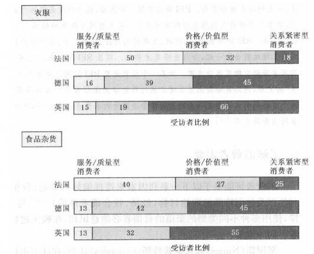
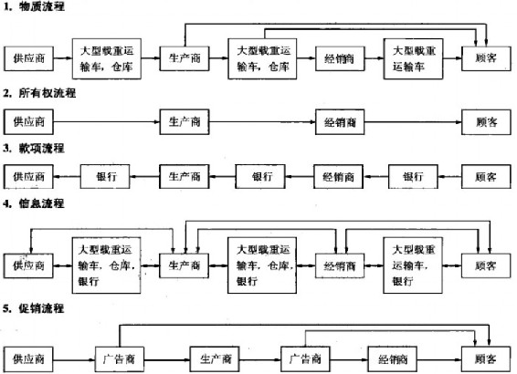

第6部分 交付价值
----------------

第15章 设计与管理整合营销渠道

第16章 零售、批发和物流管理

### 第15章 设计与管理整合营销渠道

> 本章将重点阐释以下问题：

-   1.什么是营销渠道系统和价值网络？

-   2.营销渠道的作用有哪些？

-   3.如何设计营销渠道？

-   4.在管理渠道时企业面临哪些决策？

-   5.企业如何整合渠道和管理渠道冲突？

-   6.电子商务的核心问题是什么？

成功的价值创造需要成功的价值传递。全面营销者们越来越多地从价值网络观来审视商业。他们不只关注供应商、分销商和顾客，而且考察从原材料、零部件到产成品的整个供应链，并分析产品或服务是如何最终到达消费者手中的。公司正在关注他们的供应商的上一级供应商和分销商的下一级顾客。他们在关注消费者的细分市场并考虑用更多的方法去销售、分销和服务于他们的供应品。

荷兰飞利浦电子公司是世界最大的电子公司之一，也是欧洲最大的电子公司，2006年销售收入超过360亿美元。飞利浦的电子产品主要通过当地和国际零售商向消费者销售。公司提供范围很广的产品，从高价格/价值到低价格/价值，依赖于多样化的分销模式，包括量贩店、零售连锁店、独立中间商和小专卖店。

公司必须建立和管理一个不断进化和日益复杂的渠道系统和价值网络。在本章中，我们将讨论整合营销渠道和发展价值网络的战略和战术问题。在第16章，我们将从零售商、批发商和代理商角度来考察营销渠道问题。

### 营销渠道和价值网络

大多数生产者并不是将其产品直接出售给最终顾客，在生产者和最终顾客之间有一系列的营销中间机构执行着不同的功能。这些中介机构组成了营销渠道（marketing
channel）（也称贸易渠道或分销渠道）。一般来说，营销渠道是促使产品或服务顺利地被使用或消费的一整套相互依存的组织。它们是一个产品或服务在生产以后经过的一系列途径，从而使产品或服务经过销售到达最终使用者手中。

有的中间机构（如批发商和零售商）买进产品、取得产品所有权，然后再出售，他们被称为买卖中间商。其他一些中间机构（如经纪人、制造商代理人和销售代理人）则寻找顾客，有时也代表生产厂商同顾客谈判，但是不取得产品所有权，它们被称为代理商。还有一些中间机构（如运输公司、独立仓库、银行和广告代理商）则支持分销活动，但他们既不取得产品所有权，也不参与买卖谈判，它们被称为辅助机构。

渠道的重要性

营销渠道系统（marketing channel
system）是公司分销渠道中的一个特别组成部分，关于营销渠道系统的决策是管理者面临的最重要的问题之一。在美国，分销商们赚取了最终售价的30%~50%的毛利。对比一下，广告费用通常只占到最终售价的5%~7%。营销渠道实际上也是一项重要的机会成本。主要作用之一是将潜在的顾客转换成有利润的订单。营销渠道不仅仅是服务于市场，他们更要创造市场。

渠道选择会影响其他所有的营销决策。公司的定价取决于它是使用大商场还是高档的专卖店。公司的销售力量和广告决策也取决于分销商需要公司提供多少培训和激励。此外，渠道决策包括对其他公司所做的相对长期的承诺以及一系列政策和程序。当一个汽车制造商授权独立的经销商销售其汽车的时候，制造商不能第二天就买回其经销权而代之以自己的经销点。但同时，渠道选择本身取决于公司基于市场细分、目标市场和定位考虑而制定的营销战略。全面营销者们确保这些所有不同领域的营销决策综合起来创造出最大的价值。

在管理中间商的时候，公司必须决定将多少精力分别用于推进和拉动战略。推进战略（push
strategy）使用制造商销售队伍、促销资金或其他方法推动中间商购进、促销以及销售给最终使用者。适用推进战略的情况包括在品类中品牌忠诚度较低，品牌选择在商店现场进行，出于冲动才会购买的品牌以及商品的好处是众所周知的。在拉动战略（pull
strategy）中，制造商使用广告、促销和其他沟通方式来吸引消费者向中间商购买产品，以激励中间商订货。拉动战略适用的情况包括高品牌忠诚度、高产品涉入，即人们能够认知不同品牌间的差异以及人们在去商店之前就选好购买哪个品牌。多年以来，制药公司仅仅针对医生和医院做广告，但在1997年，美国食品及药物管理局（FDA）颁布了电视广告指导方针，开辟了医药品直接到达消费者的道路。这在处于萌芽阶段的处方安眠药行业尤为明显。

> Sepracor公司

> 治疗失眠的处方药的增多很大程度上源于失眠症患者的增多，致使制药公司在印刷品和广告上花费数十亿美元。看看Sepracor公司为助眠药物Lunesta所做的广告：一个灰绿色的月亮小精灵在一个宁静的睡眠者的头周围飘舞，Sepracor2006年在消费者广告上花了298万美元，它的股价和销售额也因成功的战略而大增。2005年制药行业在消费者广告上的花费超过40亿美元，10年增长超过5倍。但是，其激进的拉动战略引发了激烈的争论和国会的注意。毕竟，在激进的广告带来巨额利润的同时，它也使得数以千计的美国成年人面临心脏病的危险。批评认为新药广告导致了关注治疗症状本身而不是激发消费者去发现他们不能入睡的原因（从简单的压力到严重的疾病）。广告的拥护者则声称在看护受到管理和医生治疗时间缩短的时代，广告教育了病人并且激发了他们与医生的重要对话。尽管制药行业不可能回到原点，但Bristol-Myers
> Squibb公司却通过自愿在新药上市一年内不做广告而赢得了声誉。

顶级营销公司，如可口可乐、英特尔和耐克，能够技巧性地使用推进和拉动战略。作为推进战略一部分的面向渠道的营销活动，当被辅以用于刺激消费者需求的经过精心设计和正确实施的拉动战略时，会更为有效。另一方面，没有一定数量的消费者感兴趣，要获得渠道的接受和支持也会十分困难。

渠道发展

新成立公司最典型的做法就是在当地有限的市场使用现有的中间商进行销售。这些中间商的数量是有限的：少数制造商代理人、少数批发商、几个零售商、少数运输公司和仓库。选择最好的渠道可能不是问题，问题是如何说服现有中间商为公司服务。

如果公司成功了，它可能会进入新的市场并在其他市场中使用不同的渠道。在较小的市场上，公司可能直接将产品卖给零售商；在较大的市场上，则可能会通过经销商。在农村市场上，公司可能使用特许经营；在另外一些市场中，则可能通过其他的代理商来销售。在一个国家里，公司可能使用国际代理商；在另一个国家，则可能与当地公司合伙。

国际市场会产生独特的挑战。消费者的购物习惯随国家不同而有差异，很多零售商，比如德国的Aldi、英国的Tesco和西班牙的Zara在进入一个新市场时，都在一定程度上对自身进行重新定义以使自身形象更适合当地需要和需求。那些不顾地理差异而固守同样销售模式的零售商，如Eddie
Bauer、马莎百货（Marks &
Spencer）和沃尔玛在进入新市场时，有时遇到了困难。

总之，渠道系统的发展应视当地机会和条件、潜在威胁和机会、公司资源和能力以及其他因素而定。思考戴尔公司（Dell）近些年来遇到的一些挑战。

> 戴尔（Dell）

> 戴尔公司通过用电话和互联网而不是零售商直接向消费者销售产品，改革了个人电脑类别。消费者可以定制他们想要的电脑，而且因为成本被大大降低使其可以每天低价。这听起来是个成功的模式，从它诞生到现在经历了近20年。但是2006年公司遇到了一系列问题导致了股价的快速下跌。首先，渐渐复苏的竞争者，例如惠普，已经缩小了他们与戴尔在生产效率和价格上的差距。其次，由于一直更关注企业市场，戴尔不得不艰难地试图更有效地向消费者市场销售。消费者的购买方式从直接购买转向在零售店购买对戴尔是个不小的打击，但更致命的伤害来自于其内部，过份强调效率的供应链模式挤压了顾客服务的成本和质量。经理们评估呼叫中心的雇员接每个电话所用的时间，以解决消费者感到他们的问题被忽视或者没有被适当处理的问题。再者，研发支出不足使新产品开发滞后并且导致产品差异化也行不通。很明显，因为这些问题，戴尔来到了一个岔路口，需要从本质上综合重新思考其渠道战略和营销方式。

混合渠道

现今成功的公司也在增加市场的渠道数量或在一个市场中建立混合渠道（hybrid
channels）。与戴尔相反，惠普使用销售人员向大客户销售，使用电话销售向中等客户销售，使用直邮的方式向小客户销售，零售商也向小客户销售，同时使用互联网出售专门产品。通过传统零售渠道、及时反应的互联网站、虚拟购物商场和数以千计的会员站点对市场进行分类。

那些经营混合渠道的公司必须确保这些渠道可以很好地结合在一起，并且与每一个目标顾客群最为匹配。顾客期望渠道整合（channel
integration）能有以下特点：

 

-   在线订购产品并在附近的连锁店拿货的能力；
-   在附近的零售商店退回在线订购产品的能力；
-   获得全部线上和线下购买的折扣和促销优惠的权利。

根据环路城（Circuit
City）计算，2006年店内取货占在线销售量的一半以上。以下是一家公司谨慎地管理多种渠道的案例。

> REI（Recreation Equipment Inc.）

> 还有比这更令人沮丧的吗：买来的徒步旅行靴竟弄伤了你的脚，或是当你在商店看到中意的鞋时却没有你穿的尺码？在REI，这个拥有250万活跃成员的美国最大的消费者协会，热衷户外运动的人们可以避免以上这两种情况。在全美90家REI的商店里，顾客正点起瓦斯炉、扎起帐篷、美美地睡在睡袋里面。REI商店提供一种体验，而不仅仅是销售产品。如果一种产品没有存货，顾客只需要进入其网站订购就可以了。对互联网不熟练的顾客可以到前台去叫店员来为他们下订单。REI的零售商店、网站、互联网购物区、邮购目录、价值定价售货点和免费订单号码被天衣无缝地整合在一起，令行业研究者称颂。而且REI不仅在互联网上开设商店，它也将网上购买者带到它的实体商店里。如果一个顾客浏览REI的网页并停下来阅读一篇名为"学习与分享"的文章，网站就会突出显示徒步旅行鞋的店内促销宣传。像许多零售商一样，REI现通过两个渠道购物的消费者明显比通过单渠道购物的消费者消费得多，而通过三个渠道消费的消费者则消费得更多。

了解消费者需要

消费者可能基于以下一系列因素来选择偏好的渠道：价格、产品分类和渠道便利性以及他们特殊的购物目标（经济、社会或者体验与产品存在细分市场一样，使用多种不同类型的渠道的营销者必须意识到，在购买过程中，不同的消费者有着不同的需要。

努涅斯（Nunes）和塞斯普特斯（Cespedes）认为，在许多市场中，购买者不外乎以下四类。

-   1.习惯性购买者：总是在相同的地方用相同的方式进行购买。

-   2.高价值交易搜寻者：知道自己的需求，并在未取得最低可能价格以前进行"渠道冲浪"。

-   3.多样性喜好购买者：在许多渠道收集信息，利用高接触渠道的服务，然后在最喜欢的渠道购买，而不在乎价格。

-   4.高涉入型购买者：在所有渠道收集信息，在低成本渠道购买，但也会利用高接触渠道的顾客支持。

一项针对法国、德国和英国40家食品和衣服零售商的研究发现，这些国家的零售商服务于三种购买者：（1）服务/质量型消费者（service/quality
customers）：最看重多样性和产品表现以及提供的服务；（2）价格/价值型消费者（price/value
customers）：最关心怎样明智地消费；（3）关系紧密型消费者（affinity
customens）：主要寻求特别的商店，这些商店主要服务于与他们相近的人群或者那些他们想要加入的群体的成员。如图15.1所示，消费者构成在这三个市场的两类零售商中有所不同：在法国，消费者认为服务和质量更重要，在英国则是关系紧密型为主，而在德国是价格和价值型为主。

即使是同一消费者，在购买时对于不同的功能也可能使用不同的渠道。例如，有的消费者可能会在光临一家商店以前先浏览目录或者在网上订购汽车以前在经销商处试驾。消费者也可能根据特定产品类型来选择不同类型的渠道。有的消费者愿意到提供高端产品的零售商处买更高价的东西，例如豪雅（TAG
Heuer）手表或卡拉威（Callaway）高尔夫球杆；这些消费者也为了省钱而愿意到折扣商店去买商店自有品牌的纸巾、清洁剂或维他命。

图15.1 欧洲的消费者注重什么？

价值网络

传统的供应链观点认为，公司把市场作为目标点，并把供应链作为一个线性流程。然而，公司应该首先选好目标市场，然后再从目标市场那一点开始向后设计供应链，这被称为需求链计划（demand
chain planning）。美国西北大学的唐·舒尔茨（Don
Schultz）说："需求链管理方式并非是通过系统把产品推销出去。它强调顾客在寻找什么解决方案，而非我们能卖给他们什么产品。"舒尔茨认为传统的4P营销理论应该被新的SIVA理念代替，即解决方案、信息、价值和途径（stands
for solutions，information，value和access）。

更广泛的观点是把公司看作价值网路（value
network）------公司为获得原始资源、扩展自己和交付货物而建立的合伙人和联盟合作系统。价值网络包括公司的供应商和供应商的供应商以及它的下游客户和最终顾客。价值网络还包括其他有价值的关系，如与大学里的研究人员和政府机构的关系。

公司需要很好地利用这些资源来更好地为目标市场传递价值。奔迈公司（Palm
Inc.）是著名的掌上电脑制造商，它拥有包含半导体、塑料盒、LCD显示屏和其他附件在内的多个供应商"团体"，同时又聚集了在线和离线的再销售商，275000个开发商为奔迈操作系统的掌上电脑和智能手机创造了多达21000种软件程序和100个硬件附件。

需求链计划可以帮助公司认识到一些问题。首先，当公司想要前向或后向一体化时，它可以估计出向上游或下游扩展是否更有利可图。其次，公司可以了解供应链中那些随处会导致成本、价格或供应突然变化的干扰因素。第三，公司可以通过互联网与合作伙伴进行更快速、准确的沟通、交易和支付，这将有助于降低成本、加速信息流动和提高准确性。例如，福特公司不但要处理很多供应链，而且要在许多B2B网站和交换台上作为赞助商或交易商。

管理这个价值网络需要公司在信息技术和软件上花费越来越多的投资。它们邀请软件公司，诸如SAP和甲骨文（Oracle）公司设计综合性企业资琢计对（enterprise
resource
planning，简称ERP），管理现金流、生产、人力资源、采购和其他处于同一个完整框架中的功能块。它们希望打破部门分割，更有效地实施其核心业务。然而在大多数场合中，公司远没有达到真正的综合性ERP系统的标准水平。

营销者往往都将注意力集中在价值网络的消费者部分，采用顾客关系管理软件和实践。未来，他们将更多地参与和影响公司更上游的活动，成为网络的管理者，而不仅仅是产品和客户的管理者。

### 营销渠道的作用

生产者为什么愿意把部分销售工作委托给中间机构呢？这种委托意味着放弃对于如何推销产品和销售给谁等方面的某些控制。然而，生产者可以通过中间机构获得效力和效率。凭借他们的各种关系、经验、专业知识以及运营规模，中间机构推动产品广泛地进入目标市场，通常比生产企业自己干得更加出色。

许多生产者缺乏进行直接营销的财力资源和专门知识。箭牌糖果有限公司（William
Wrigley
Jr.）发现，在全国建立口香糖小零售店或者邮售都是不现实的。如果这样，它就要同时出售许多小商品，最终变成药店和杂货店。箭牌公司发现通过私营的分销机构所组成的庞大的分销网进行销售更容易。甚至通用汽车公司也被迫使用8000个经销商出售汽车。

渠道功能和流程

营销渠道执行的任务是把产品从生产者那里转移到消费者手中。它填补了产品、服务与实际需求在时间、空间和所有权方面的差距。营销渠道的成员执行了一系列重要功能（表15.1）。

渠道中有些功能（实物、所有权和促销）是正向流动（forward
flow），从公司流向顾客；另一些功能（订货和付款）是反向流动（backward
flow），从顾客到公司；还有一些功能（信息、谈判、筹资和承担风险）是双向流动。图15.2展示了在对铲车进行营销时发生的五个流程。如果把这些流程并在一张图表中，即便十分简单的营销渠道也会出现复杂的情况。

表15.1 渠道成员功能

 

-   收集市场中的潜在和现有顾客以及竞争者和其他相关团体的信息。
-   设计和传播具有说服力的沟通方式来刺激购买。
-   在价格和其他事件上达成协议使得对所有权或财产权的转移产生影响。
-   给制造商下订单。
-   获得资金为不同水平的营销渠道的存货提供资金。
-   估计与渠道运作相关的风险。
-   提供连续的存货和实物产品的搬运。
-   为购买者的付款提供银行或其他金融机构服务。
-   监督所有权从一个组织或人到另一个组织或人的实际转移。  

图15.2 铲车营销的五个流程

一个销售实体产品和服务的制造商至少需要三个渠道为它服务：销售渠道、送货渠道和服务渠道。为了卖掉它的宝福力（Bowflex）健身器，诺得士（Nautilus）集团一方面一直强调把由电视商业信息片和广告、自营或外包呼叫中心、响应式邮寄和互联网构成的直复营销作为销售渠道，以UPS作为送货渠道，以本地修理商作为服务渠道；另一方面，作为对变化的消费者购买习惯作出的反应，诺得士现在也通过商业、零售和专业零售渠道进行销售。

问题不在于上述功能是否需要执行------它们必须执行------而在于由谁来执行。所有这些功能都具有三个共同点：它们使用稀缺资源；它们常常可以通过专业化而更好地发挥作用；它们在渠道成员之间是可以转换的。当制造商把若干功能转移到中间商那里时，生产者的费用和价格就降低了，但中间商必须增加开支以负担其工作。如果中间商比制造商更有效率，消费者承担的价格应该更低。如果消费者自己执行某些功能，他们享受的价格就更低了。渠道机构的变化在很大程度上是由于发现了更为有效的集中或分散经济功能的途径，而那些功能是用来向目标顾客提供齐全的商品组合的。

渠道层级

生产者和最终顾客是每个渠道的组成部分。我们将用中间机构的级数来表示渠道的长度。图15.3（a）举例说明了几种不同长度的消费者商品营销渠道。

零级渠道，也叫直接营销渠道，是由生产者直接销售给最终顾客。主要方式是上门推销、家庭展示会、邮购、电话营销、电视直销、互联网销售和厂商直销。雅芳公司的销售代表基本上都是上门推销化妆品，特百惠（Tupperware）的销售代表通过家庭展示会来推销其厨房用品，富兰克林铸币（Franklin
Mint）公司则是采用邮寄方式，AT&T通过电话来开发新客户并为现有客户提供更佳的服务，时代生活（Time
Life）通过电视购物或其他方式售卖音乐和录影带，红色信封（Red
Envelope）在线出售礼物，苹果公司在自己的专卖店出售计算机和其他电子消费产品。

一级渠道包括一个销售中间商，如零售商。二级渠道包括两个中间商。在消费者市场，一般是一个批发商和一个零售商。三级渠道包括三个中间商。在肉类包装行业中，批发商出售给中转商，中转商再出售给零售商。在日本，食品分销有六个层级。然而，从生产者的观点来看，渠道级数越多，获得最终用户信息和进行控制也越困难。

图15.3（b）展示了B2B市场常见的营销渠道。产业市场生产者可利用其销售人员直接销售产品给产业用户；或者销售给产业分销商，再由他销售给产业顾客，或者可通过制造商的代表或自己的销售分支机构直接销售给产业顾客，或者通过产业分销商直接销售给行业顾客，因此，零级、一级和二级营销渠道颇为常见。

图15.3 消费品和工业品的营销渠道

渠道一般是指产品从资源到用户的正向运动。有人也提出了所谓的逆向流渠道，它们在以下案例中显得重要：（1）重复使用的产品或容器（如反复灌装的化学药品）；（2）可修整后再销售的产品（如电路板或计算机）：（3）循环产品（如纸张）；（4）销毁的产品和包装物（垃圾产品）。有几种中间商在各种逆向流渠道中起作用，其中包括：制造商的回收中心、社区小组、传统的中间商（如软饮料中间商）、废物收集专家、回收利用中心、废物回收利用中间商、中央仓库。

服务领域的渠道

营销渠道并不局限于实体商品的分配。提供服务和创意的生产商同样面临如何使其产品接近目标公众并为其采用的问题。学校开发了"教育传播系统"，医院开发了"健康传送系统"，这些机构必须找出适合于在本地区传播给当地人群的代理机构和本地企业。

营销渠道在"个人"营销中也在不断变化。除了现场和电视娱乐节目外，演艺人员、音乐家和其他艺术家能够通过许多途径达到预期的和已有的粉丝------通过他们的个人网站、社交网站如MySpace以及第三方网站。就连传奇创造者前"披头士"乐队的保罗·麦卡特尼（Pad
McCartney），2007年春季也决定终止其与百代（EMT）音乐公司长达45年的合作，在星巴克咖啡店、音像店和iTunes上发布自己的新专辑Memory
Amoslt
Full；政治家也必须寻找渠道组合------大众传媒、集会、咖啡时间、电视广告、直邮、宣传栏、传真、电子邮件、博客、播客、网站------来向他们的选民传递信息。

> 沃顿（Wharton）

> 成立于1881年的世界第一家商学院沃顿商学院做到了学生和管理人员的多元化。它提供本科、MBA、EMBA和博士学位项目，同时也为专业人士提供非学位管理人员教育和资格认证项目。此外，沃顿拥有图书、有声读物、电子文档、只读光盘和视频出版部门。它还提供电子简讯月刊Wharton\@work，和在线商业杂志Knowledge\@Wharton。

随着互联网和其他技术的进步，服务行业如银行、保险、旅游和股票买卖，都将通过新的渠道进行。柯达也向它的顾客提供了四个不同的渠道来冲印数码照片：位于各个分销店的迷你冲印室、家用打印机、柯达自营网站提供的网上服务以及自助式冲印亭。柯达拥有8000家冲印亭（包括在沃尔玛店内的2000家冲印亭），柯达的盈利既通过自营冲印亭也通过提供冲印用化学品和纸张。

### 营销渠道设计决策

设计营销渠道系统需要分析顾客需要、建立渠道目标、识别和评价主要渠道方案。

分析顾客需要的服务产出水平

在设计营销渠道中，营销人员必须了解目标顾客需要的服务产出水平。渠道可提供五种服务产出：

-   1.批量大小：批量大小是营销渠道允许典型顾客一次购买的单位数量。在购买新汽车时，赫兹（Hertz）汽车出租公司偏好能大批量购买的渠道，而家庭想要能允许购买一辆车的渠道。

-   2.等候和传递时间：等候时间是顾客等待收到货物的平均时间。顾客越来越喜欢交货更快的渠道。

-   3.空间便利：空间便利是营销渠道为顾客购买产品所提供的方便程度。例如，雪佛兰比凯迪拉克有更大的空间便利，因为雪佛兰有更多的经销商。雪佛兰较高的市场分散化帮助顾客在购买和维修汽车方面节省运输和寻求成本。

-   4.产品多祥性：渠道提供的商品品种的宽度。一般来说，顾客更喜欢较多品种，因为更多的选择会增加找到他们想要的产品的机会。

-   5.服务支持：渠道提供的附加服务（信贷、交货、安装、维修）。服务支持越强，渠道提供的服务工作就越多。

营销渠道的设计者必须了解提高服务产出的水平意味着渠道成本的增加和对顾客收取高价。不同的消费者有着不同的服务需求。折扣商店的成功表明，如果能够节省开支，许多消费者更愿意接受较低水平的服务。

建立渠道目标和制约

营销人员应将渠道目标表述为目标服务产出水平。在竞争情况下，渠道机构应该安排其功能任务，使其达到期望的服务产出水平以及使整个渠道费用最小化。

一般来说，设计者可依据对不同服务产出水平的需求来识别细分市场。有效的渠道设计要求决定服务于什么细分市场和为每个细分市场选择最好的渠道。

渠道目标因产品特性的不同而不同。易腐商品要求直接营销。体积庞大的产品，如建筑材料，要求采用运输距离最短、搬运次数最少的渠道布局。非标准化产品，如顾客定制机器和特制模型等，则由公司销售代表直接销售。需要安装或长期服务的产品，如冷热系统，通常也由公司或者独家特许商经销。单位价值高的产品，如发电机和叶轮机等，一般由公司人员销售，很少通过中间商。

很多因素影响渠道目标。例如，进入新市场，公司通常密切关注其他当地公司在这些市场的行为。法国欧尚（Auchan）在进入波兰市场时，会考虑目前在波兰市场上的法国对手Leclerc和Casino的情况，这是进入这些市场的关键驱动因素。

营销人员必须使渠道目标适应大环境。当经济不景气时，生产者总是要求利用较短的渠道将其产品推入市场，并且取消一些会提高产品最终价格的非根本性服务。法律规定和限制也将影响渠道设计。美国法律规定禁止可能会严重减少竞争或者倾向于垄断的各种渠道安排。

识别和评估主要渠道方案

公司可以选择通过不同的渠道到达消费者------从销售人员到代理商、分销商、交易商、直接邮递、电信市场和互联网。每种渠道都有各自的优势和劣势。销售人员可以处理复杂的商品和交易，但费用高昂。使用互联网很便宜，但无法处理复杂的商品交易。分销商可以创造销售额，但公司失去了直接联系顾客的机会。制造商代表可以以平均每个顾客较低的成本联系到顾客，但是针对每个顾客的销售努力比用销售人员进行销售有所减弱。

由于大多数公司运用混合渠道，情况就变得更加复杂。人们希望每种渠道都能准确地到达各自不同的细分市场，同时达到产品分配成本最小化。当一切不能够如愿时，渠道之间会产生冲突，甚至会增加成本。

一个渠道方案由三方面要素确定：可获得的商业中间商的类型、所需的中间商数目、每个渠道成员的条件及责任。

中间商的类型

公司应该弄清楚可获得的能够完成渠道工作的中间商类型。表15.2列出了一个生产汽车电话的公司的分销渠道选择。

表15.2 可供汽车电话制造商选择的渠道

  - 公司可以将汽车电话作为原始配件卖给汽车制造商。 -
公司可以将汽车电话卖给汽车零售商。 -
公司可以通过直接销售或分销商将汽车电话卖给汽车配件经销商。 -
公司可以通过直接销售或其他经销商将汽车电话卖给汽车电话的特约经销商。 -
公司可以通过邮购目录销售汽车电话。 -
公司可以将它的汽车电话卖给像百思买或钚铬城这样的大型零售商。

公司应该寻找创新性的营销渠道。Medion在欧洲售出了60万台个人电脑，主要是通过在Aldi的超市进行的一到两周的"爆发式促销活动"。Columbia
House通过电子邮件成功地推销了它的音乐唱片。其他的销售商，像Hanry &
David和Calyx &
Corolla通过送货上门创立了水果与鲜花的直销模式。（参见"营销视野：车美仕公司是如何改变汽车销售业务的"。）

有时，由于某些困难、成本原因或主渠道缺乏有效性，公司会选择一个新的或非常规渠道。非常规渠道的优点是，在最初进入渠道时，遭遇竞争的程度较低。多年以来，在通过传统的珠宝商店进行销售尝试以后，美国天美时（Timex）钟表公司将其价格低廉的天美时牌手表通过大卖场销售，由于大卖场的迅速发展，结果大获成功。在使用过时的和不够专业的印刷目录遭受失败之后，商用照明公司Display
& Lighting设计了网上目录，使得成本降低、销售速度提高、收入增加。

\@营销视野：车美仕公司是如何改变汽车销售业务的

多年以来，买一辆旧车是一件有风险的事；购买旧车时，旧车销售人员也总是喋喋不休。车美仕（CarMax）的出现改变了这个行业的面貌和标准。

-   1993年，环路城公司，一个电子产品零售商在弗吉尼亚州里士满创办了汽车超市车美仕公司。车美仕是美国最好的旧车专营零售商，它已在19个州经营着80家旧车超市。车美仕同时也与旧车超市一起或者在旧车超市中经营一些新车特许经营店，每年销售超过30000辆车。

车美仕的特别之处在哪？车美仕把它的汽车超市设立在市郊靠近主要高速公路的地方，面积很大，每个大约有500辆旧车。顾客步入一个很吸引人的展览厅，当销售人员发现顾客在寻找某种车时，他们会把顾客带到一个电脑售货亭前。利用触摸屏幕，销售人员检索出库存中所有符合顾客标准的旧车清单。每一辆车子都可以展示彩照以及车子的特性及其固定的售价。公司总共拥有15000辆汽车，几乎覆盖了所有的汽车品牌和型号。

在这里不能讨价还价。由于销售人员是根据所售车子的数量而不是车子的价值来获取佣金，所以他们也没有动力要去说服顾客购买价格更高的车子。顾客被告知此前车美仕的技工已经进行了110点的检查和必要的修理。而且，购买旧车有5天不满意退款和30天的综合担保。如果顾客想通过贷款来购车，车美仕的销售人员会在20分钟内安排好，整个过程不超过1个小时。

然而，较小的利润空间意味糠车美仕必须精准地经营，确保能在合理的价格购进和销售。以下是这种商业模式潜在的关键事实和数字。

-   25%------允许车美仕销售的厂商百分比；

-   6------修整每辆汽车需要的天数；

-   1000美元------修整一辆汽车的平均花费；

-   30------售出一辆车的天数；

-   80%------在车美仕贷款购车的顾客比例；

-   1807美元------每次销售的平均毛利。

车美仕使用一个复杂的存货系统来跟踪销售的型号和需求的转换。每辆车用一个雷射（RFID），标签标明车子等待的时间和试驾发生的时间。800个车美仕采购员利用公司庞大的数据库去计算购进汽车的确切交易价袼以确保公司盈利。尽管近年来美国主要的汽车制造商已经经历了销售额和利润的下降，但是车美仕却获得了近80亿美元的销售收入。

中间商的数目

每个公司必须决定每个渠道层次使用多少中间商。有三种战略可供选择：专营性分销、选择性分销和密集性分销。

专营性分销（exclusiye
distribution）意味着严格限制中间商数目，适用于生产商试图保持控制中间商的服务水平和努力水平，并且通常包括排他性交易安排。通过专营性分销，生产商希望获得更积极的和有见地的销售。专营性分销常常要求公司与中间商之间建立紧密的伙伴关系，并被用于销售新汽车、某些主要家用电器和妇女服装品牌。在现今日益为价格驱动的商业领域，供应商和零售商之间的专营交易正在成为专业人士寻求优势的主要领域。当传奇的意大利设计公司古琦发现它的形象被专卖店和折扣店严重损害的时候，决定结束与第三方供应商的合作，通过控制分销渠道并开设了自己的专卖店来挽回形象。

选择性分销（selective
distribution）利用一个以上但又不是全部的愿意经销的中间商经营某一种特定产品。无论老公司还是新公司使用分销商都是有道理的。使用选择性分销，公司不必担心分销机构过多，可以获得足够的市场覆盖率，并相比于密集性分销而言有更大的控制权和更低的成本。

> Stihl

> Stihl生产手持户外动力工具。其所有产品都以同一个品牌命名，并且它不为其他公司自有品牌生产。Stihl以链锯最为闻名，但其也扩展到鼓风机、绿篱机和切割机。它特许销售给7个美国独立分销商和5个自营的向全国范围内超过8000家服务零售商销售产品的分销中心。公司也是向全世界130多个国家出口美国制造的Stihl产品的出口商。Stihl是仅有的几家生产户外动力设备而不通过大众分销商、目录或者网上销售的公司。

在密集性分销（intensive
distribution）中，制造商尽可能多地在商店中销售商品或服务。这种战略通常用在零食、软饮料、报纸、糖果和口香糖这些消费者倾向于经常购买或者购买地点多样化的产品上。便利店，诸如7-Eleven、Circle
K和埃克森美孚的加油站商店就是靠地点和时间上的方便得以生存。

制造商不断地试图从专营和选择性分销转向更密集的分销以增加覆盖率和销售额。这种战略在短期内有效，但是会损害长期绩效。密集性分销增加了产品和服务的可获得性，但却可能加剧零售商之间的竞争。价格战将侵蚀利润，潜在地削弱了零售商支持产品的兴趣并损害了品牌资产。一些公司避免使用密集性分销而且不愿意产品到处卖。在西尔斯百货商店于2005年收购凯马特连锁折扣店后，耐克公司从西尔斯收回了全部产品以确保不在凯马特销售。

渠道成员的条款和责任

渠道成员必须受到尊重并有获得盈利的机会。"贸易-关系组合"（"trade
relationmix"）中的主要因素有：价格政策、销售条件、地区权利以及每一方所应提供的具体服务。

 

-   价格政策：要求生产商制定价目表与折扣和补贴明细表，使中间商确信这些是公平而充分的。
-   销售条件：是指付款条件和生产商担保。大多数生产商对付款较早的分销商给予现金折扣。生产商也可以向分销商提供有关产品质量缺陷或价格下降等方面的担保。对价格下降作出的担保可以激励分销商更多地购买产品。
-   分销商地区权利：确定分销商的管辖地区并规定生产商允许其他分销商进入的条件。分销商一般喜欢把自己销售地区的所有销售业绩都归功于自己，不管这些销售是否是通过他们促成的。
-   双方的服务和责任：必须十分谨慎地确定，尤其是在采用特许经营和独家代理等渠道形式。麦当劳向加盟的特许经销商提供房屋、促销支持、记录制度、人员培训、一般行政管理与技术协助。反过来，特许经销商必须在物资设备方面符合公司的标准，对公司新的促销方案予以合作，提供公司需要的信息并向特定的供应商购买供应品。

评估主要渠道方案

每一渠道都需要对经济性、控制性和适应性进行评估。

经济性标准

每种渠道都会导致不同水平的销量和成本。图15.4展示了根据每销售单位附加值和每次交易成本依次排列的六种渠道。例如，销售成本在2000\~5000美元之间的产品，每交易单位的成本分别是500美元（现场销售）、200美元（分销商）、50美元（互联网）。波茨·艾伦·汉密尔顿（Booz
Allen
Hamilton）的一项研究表明，在零售性银行服务的销售中，每交易单位的成本分别是4.07美元（出纳员）、0.54美元（电话银行）、0.27美元（自助取款机）、0.10美元（互联网）。

图15.4不同渠道的价值增加与成本

公司将努力整合消费者和渠道，以整体最低的成本获得最大化的需求。很明显，只要每销售单位的附加价值足够高，卖方会用低成本渠道取代高成本渠道。先锋（Vanguard）基金公司的销售代表开始培养顾客用互联网取代电话。结果，先锋公司可以精减一半员工，因为电话服务要花费9美元而网站只要几美分。

作为一个分析渠道选择的经济性标准的例子，考虑如下情形：

一个北卡罗来纳的家具制造商希望向西海岸的零售商销售产品。他要在两个备选方案中选择：一个方案需要雇用10名销售代表在旧金山工作，他们领取基本工资加奖金。另一个方案是利用旧金山一个制造商的销售代理商，该代理商已经与众多零售商建立了广泛的联系。这家代理商拥有30名销售代表，他们各自在其销售额的基础上领取奖金。

第一步，是估计使用公司的销售队伍和销售代理商分别能创造多少销售额。一方面，公司销售代表完全致力于本公司的产品；他们在销售本公司的产品方面受过较好的训练；他们更富有进取心，因为他们的未来与公司的成功密切相关；他们更可能获得成功，因为顾客喜欢直接与公司打交道。另一方面，销售代理商有30个销售代表，而不止10个；代理商的推销员可能和直接销售队伍同样积极，这取决于佣金水平；顾客可能容易接受，因为代理商更独立；代理商与市场有着更广泛的联系和知识。公司需要评估所有因素以形成关于这两种渠道的需求方程。

下一步是估计每种渠道不同的销售成本，图15.5表明了成本分布。利用销售代理商的固定成本比公司组建自己的销售代表处低，但是利用代理商的费用增长很快因为销售代理商的佣金比公司销售代表高。

最后一步是比较销售量与成本。如图15.5所示，在一个销售水平（SB）上，两种渠道的销售成本相等。当销售量小于SB时，利用销售代理商较为有利，而当销售量大于SB时，利用公司销售代表处则更为适宜。据此，小公司或者大公司在某一个销售量很低的区域内都倾向于利用代理商就不足为奇了。

图15.5 公司销售队伍和生产商销售机构之间选择的盈亏平衡图

控制和适应性标准

使用代理商要考虑控制问题。销售代理商是一个独立的追求利润最大化的公司。代理商会注意那些购买商品最多的顾客，而不是那些购买生产商产品的顾客。此外，代理商的推销人员可能没有掌握有关公司产品的技术细节，或者不能有效地运用它的促销材料。

为了发展渠道，渠道成员必须在一个特定的时期中对彼此作出一定程度的承诺。但这些承诺总是会导致生产商对市场变化作出反应的能力在下降。在迅速变化、非持久和不确定的产品市场上，生产商需要寻求有高度适应性的渠道结构和政策。

### 渠道管理决策

公司在确定了渠道方案之后，必须对每个渠道中的每个中间商进行选择、培训、激励和评价。同时必须随着时间调整渠道设计和安排。

选择渠道成员

对于顾客来说，渠道就意味着公司。不妨想象，如果麦当劳、壳牌石油和梅塞德斯-奔驰的一个或多个分支机构或经销商一直表现得邋遢、低效或令人不愉快，将会给顾客留下怎样的负面印象。

为了更好地选择中间商，生产商应该确定用以鉴别好的中间商的标准。他们要评价中间商经营的年数、经营的其他产品、成长和盈利记录、资金优势、合作态度以及服务声誉。如果中间商是销售代理商，生产者还要评价其所经销的其他产品的数量和特征，及其推销力量的规模和素质。如果中间商是要求专营性分销的百货商店，生产者就要评价商店的选址、未来成长的潜力和客户类型。

培训渠道成员

公司要像对待最终顾客一样对待其中间商。公司需要明确中间商的需要并构建渠道定位，通过渠道供应来向中间商提供较高价值。

激励渠道成员达到最高绩效可以从理解中间商的需要和欲望开始。公司需要仔细地计划并执行培训项目、市场研究以及其他构建能力的项目以提高中间商的绩效。微软公司要求第三方的服务工程师学完一系列的课程并参加资格证书考试。那些通过考试的人通常被称为微软认证专家，他们利用这个称号来展开业务。其他公司使用消费者调查而不是考试。公司必须不断地传达这样一个观点，即它把中间商当作合作伙伴共同努力以使最终消费者满意。

在管理与分销商的关系时，生产商的技巧有很大不同。渠道力（channel
power）是改变渠道成员行为使得他们采取过去未曾采取过的某种行动的能力。制造商可以应用下述类型的力量形式以获取合作：

 

-   强制力：制造商威胁，如果中间商不合作，就回收资源或终止关系。这种力量方式可能相当有效，但实施压力会使中间商产生不满从而导致中间商组织对抗力量。
-   报酬力：当中间商执行特定活动或功能时，制造商给予附加利益。报酬力量通常比压力效果更好，但开支过高。每当制造商想要达成某一活动时，中间商可能都会期望得到报酬。
-   法律力：制造商依据合同规定要求中间商的行为。一旦中间商认为制造商在法律方面占主导地位，法律力量就起作用了。
-   专家力：制造商拥有中间商认为有价值的知识。一旦中间商掌握了该专门技术，该力量就被削弱了。制造商必须连续不断地发展新的专门技术，使中间商愿意继续与制造商合作。
-   参照力：制造商如此受到敬重，以至于中间商以与制造商合作为荣。例如IBM、卡特彼勒、麦当劳和惠普等公司都有很高的参照力。

强制力和报酬力客观上可以观察得到；法律力、专家力和参照力则更主观，取决于合作者们的能力和意愿。

大多数生产商将获得中间商的合作视为一项挑战。他们通常采用各种正面激励，例如较高的毛利、特殊优惠、奖金、合作性广告补助、陈列津贴以及销售竞赛。有时他们则采用反面制裁，如威胁降低毛利、放慢交货或终止关系。上述方法的不足之处是生产商采用了粗鲁的刺激反应方式。

较为精明的公司则努力与它们的分销商结成长期的伙伴关系。他们清楚地告知他们想要从中间商那里得到什么，包括市场覆盖率、存货水平、营销开发、客户要求与技术建议和服务。制造商在这些政策上寻求分销商的合作，并可能引进一种坚持这种政策的补偿计划。

为了使供应链流畅并降低成本，许多制造商和零售商都采用了有效消费者响应（efficient
consumer
response，简称ECR）实践，从以下三个方面组织他们之间的关系：（1）需求管理或协作实践，通过推行联合营销或销售活动刺激消费者需求；（2）供给管理或协作实践，以最优化供给（专注于联合后勤和供应链活动）；（3）授权者和整合者，或协作信息技术和过程改进工具，以支持各种联合活动从而减少操作问题、允许更高水平的标准化等。研究表明，尽管ECR对制造商经济绩效和能力发展有积极的影响，但它也可能使制造商一方产生更高的不公平感，他们会感到不公平地承担了采用ECR的负担而且没有得到理应得到的那么多。

评价渠道成员

生产商必须定期按一定标准衡量中间商的表现，例如销售配额完成情况、平均存货水平、向顾客交货时间、对损坏和遗失商品的处理以及与公司促销和培训计划的合作情况。一位生产商偶然发现他对特定中间商的支付超过了其实际所做的工作。一位制造商也发现，他因分销商仓库中的存货而向其作补偿，但分销商实际上将货物存于由生产商付费的公共仓库。生产商应该建立功能折扣，使其可以根据渠道成员在每项达成协议的服务中的表现向他们支付特定额度的费用。表现不佳者会被劝告、培训、激励或终止合作。

改进渠道设计和安排

生产商必须定期地检查和改进渠道设计和安排。当分销渠道不能按计划运转、消费者购买方式发生变化、市场扩大、新的竞争者兴起和创新的分销渠道出现以及产品进入生命周期的后一阶段时，便有必要对渠道进行改进。

在产品生命周期的整个过程中始终都保持竞争优势的营销渠道是没有的。早期购买者可能愿意通过附加值高的渠道来购买，但后来购买者愿意转向低成本渠道购买。办公室小型复印机起初是经由制造商的直接销售人员销售，后来经由办公设备经销商，再后来通过大卖场，而现在则经由邮购公司和互联网销售。

在进入壁垒较低的竞争市场上，最理想的渠道结构将不可避免地随着时间的推移而变化。这种变化包括增减个别渠道成员，增减某些特定的市场渠道，或者创立一个全新的方式销售其产品。考虑苹果公司的例子。

> 苹果专卖店

> 在2001年苹果专卖店开张时，很多批评家质疑它们的前景，《商业周刊》发表了一篇题为《对不起，史蒂夫，这是苹果专卖店不能运转的原因》，仅仅在5年前，苹果还在庆祝它引人注目的曼哈顿专卖店的开张。拥有超过175家店铺，每年每平方英尺4032美元的销售收入，相比蒂芙尼（Tiffany）的2666美元、百思买的930美元以及萨克斯第五大道的362美元来说，苹果专卖店可以说非常成功。苹果专卖店开办的原因在于其他中间商糟糕的零售展示，而苹果专卖店专营其产品并在店中针对熟悉技术的顾客进行展示全部系列的产品、软件和配件以及一个苹果专家组成的"天才酒吧"提供免费技术支持。尽管这一举动使得现有的零售商很沮丧，但苹果公司很努力地理顺关系，部分地证明了增加自营店是对现有在线销售渠道的一个自然变革。

增加或减少个别渠道成员需要进行增量分析。使用或不使用这家中间商对公司的利润有何影响？生产商可能放弃任何一家销售额在某一水平之下的中间商。存储在数据库中的日益增加的更详细的消费者消费信息和分析这些数据的复杂方法可以为这些决策提供指导。

也许最困难的决策是是否修改整个渠道战略。分销渠道可能会很明显地变得陈旧，销售者现行的分销系统与满足目标顾客需要和欲望的理想系统之间的差距在扩大。比如雅芳公司挨家挨户的化妆品上门推销系统，随着更多的妇女走上工作岗位而必须修改。在零售银行，尽管技术优势诸如自动取款机、网上银行和电话呼叫中心，能够降低顾客对邻近分行的依赖，银行还是发现很多人更喜欢"高接触"而不是"高技术"，抑或至少有这种选择。结果银行开设更多的分支机构并利用面对面接触的机会开发更多的交叉销售和升级销售。

### 渠道整合和渠道系统

分销渠道不是一成不变的，新兴的批发机构和零售机构不断涌现，全新的渠道系统正在逐渐形成。我们将考察最近发展的垂直、水平和多渠道营销系统；下一部分将考察这些系统的合作、冲突和竞争。

垂直营销系统

垂直营销系统是近年来最重大的渠道发展之一。传统营销渠道（conventional
marketing
channel）由一个独立的生产商、批发商和零售商组成。每一个成员都作为一个独立的实体追求自己利润的最大化，即使它是以损害系统整体利益为代价也在所不惜。没有一个渠道成员对于其他成员拥有全部的或足够的控制。

垂直营销系统（vertical marketing
system，简称VMS）则相反，它是由生产商、批发商和零售商所组成的一个联合体。某个渠道成员，作为渠道领导者拥有其他成员，或与其他成员特许经营关系，或者拥有相当实力使其他成员愿意合作。"营销视野：渠道管家的重要性"，提供了一些"渠道管家"（channel
steward）该如何工作的视角。

\@营销视野：渠道管家的重要性

哈佛大学的卡斯图·里兰（Kasturi
Rangan）相信应该采用一种新的方式进入市场，他将其定义为"渠道管家"。"渠道管家"有能力去创造一个同时注重消费者利益最大化和保证所有渠道成员都盈利的进入市场战略。渠道管家可以是产品或服务的制造者（例如宝洁或美国航空），一个关键元件的制造者（例如芯片制造商英持尔），供应商或者组装商（例如戴尔或者艾睿电子）或者分销商（例如固安捷）或者零售商（例如沃尔玛）。在公司内部，里兰提到，管家的职能可能体现在首席执行官、高层管理人员或者团队的高级经理身上。

渠道管家的概念是要借助于渠道中任何希望给渠道战略制定规则的组织。有效的渠道管家从消费者角度去考虑。他们会秉着这个思路，参与变革，把孤立的组织转化成有着共同目标的合作者。

渠道管家有两方面的重要结果。一个结果是通过果道来扩展管家的顾客价值并且提高市场规模或者现有顾客的购买。另一个结果是创造一个组织更紧密、适应性更强的渠道，可以给有价值成员合理的回报并剔除价值小的成员。

里兰列出了三个渠道管理的原则：

-   1.映射是在行业水平上实施的，以获得对渠道战略关键决定因素的感知以及它们的演变。它可以让人了解当前的最佳实践和不足，并且预计将来可能的要求。

-   2.设计和编辑是对生产者自有渠道的评估，以识别任何满足顾客需要的不足点以及有竞争性的最佳实践。

-   3.整合和影响可以弥补差距并制定出一个补救方法，以与渠道成员的努力和表现配合，以便增加或者可能增加他们的价值。

里兰强调渠道管家规则的妙处在于它在顾客的层面上运行职能，而不是在渠道组织层面。结果，渠道经理可以逐渐发展并改善其对顾客需求的满足而不仅仅是一次性的改变。渠道改变的变革性方法，需要持续的管理、学习和适应，但是一切必须符合消费者、渠道成员和渠道管家的利益。里兰同时指出渠道管家不必一定是一个大型公司或者市场领导者，可以是一些较小的参与者，如Haworth公司和阿特拉斯·科普呵公司（Atlas
Copco），也可以是分销商和零售商，例如沃尔玛、百思买和HEB超市。

垂直营销系统的出现是基于较强的渠道成员试图控制渠道行为和消除成员在追求各自利益时所造成的冲突。垂直营销系统因其规模、谈判实力和重复服务的减少而获得效益。（复杂产品和系统的组织购买者认可它们通过垂直营销系统所获得的广泛信息交换的价值。）在美国的消费者市场中，垂直营销系统已经成为一种占主导地位的分销形式，占全部市场的70%\~80%，垂直营销系统的三种类型是：公司式、管理式和合同式。

公司式垂直营销系统

公司式垂直营销系统结合了同一所有者名下的生产和分销的连续阶段。例如，西尔斯公司从他部分拥有或全部拥有的公司里销售商品的比例超过50%。宣威（Sherwin-Williams）公司不仅制造油漆，而且拥有和经营3000家零售网点。

管理式垂直营销系统

生产和分销由规模大、实力强的渠道成员出面组织。名牌制造商有能力从再售者那儿得到强有力的贸易合作和支持。例如，柯达、吉列、宝洁和金宝汤公司等都能够在商品展销、货架位置、促销活动和定价政策等发面取得再售者的高水平的合作。

管理垂直营销系统最高级的供应-分销安排依赖于分销计划，即建立一个有计划的、专业化管理的垂直营销系统，能够满足制造商和分销商双方的需求。制造商在公司内部建立一个叫做分销商关系计划的部门。它的工作主要是确定分销商的需求并建立销售计划，尽可能地帮助每个分销商有效地执行。这个部门和分销商们联合制定销售目标、存货数量、货架空间和可行的销售计划、销售训练需求和广告促销计划。目的是改变分销商认为自己主要以买方的角色赚钱（通过和制造商间艰难的谈判）的想法，要使他们认为自己是从卖方赚钱（通过成为复杂营销系统中的一员）。

合同式垂直营销系统

合同式垂直营销系统由各自独立的公司在不同的生产和分销水平上组成，它们以合同为基础来统一行动，以求比各自行动获得更大的经济和销售效果。约翰斯顿（Johnston）和劳伦斯（Lawrence）称它们是"有附加值的合伙人"。合同式垂直营销系统近年来成为经济领域最引人瞩目的发展之一。有三种类型：

-   1.批发商倡办的自愿连锁组织：批发商组织独立的零售商成立自愿连锁组织，帮助零售商使得他们的销售活动标准化并获得采购经济化的好处，以与大型连锁组织抗衡。

-   2.零售商合作组织：零售商可以带头组织一个新的企业实体来开展批发业务和可能的生产活动。成员通过零售商合作组织集中采购，联合进行广告宣传。利润按成员的购买量依比例进行分配。非成员零售商可以通过合作组织采购，但不能分享利润。

-   3.特许经营组织：在生产分配过程中，一个被称作特许经营者的渠道成员可以连接几个环节。特许经营是近年来发展最快的零售形式。尽管基本思想还是旧的，但是有些特许经营的形式却是崭新的。

传统系统是制造商倡办零售特许经营。例如，福特汽车公司特许经销商出售它的汽车。另一种是制造商倡办的批发特许经营。例如，可口可乐饮料公司特许各个市场上的瓶装商（批发商）购买它的浓缩糖浆，然后由瓶装商充装碳酸、装瓶，再出售给本地市场的零售商。一种新的系统是服务公司倡办的零售特许经营，即由一个服务公司组织整个系统，将其服务高效地提供给消费者。这种形式出现在出租汽车行业（如赫兹、安飞士）、快餐服务行业（如麦当劳、汉堡王）和汽车旅馆（如豪生酒店、华美达酒店）。有些特许经营是通过双分销渠道系统完成的，即公司同时使用垂直整合（特许方实际拥有和运营该单位）和市场管理（特许方将单位特许给其他授许方）。

零售业中的新竞争

许多没有参加垂直营销系统的独立零售商发展了各种专卖店服务于特定的细分市场。结果在零售行业形成了两极分化的现象，即一方面是大规模的垂直营销组织，另一方面则是独立的专卖店，这一发展给制造商带来了问题。他们和独立的中间商有着密切的联系，但是他们最终又必须在较无吸引力的条件下与高速发展的垂直营销系统重新组合。此外，垂直营销系统不时威胁大制造商，说要绕过它们建立自己的制造厂。零售业中的新竞争不再是独立的企业实体之间的争夺，而是集中规划网络的综合性系统（公司式的、管理式的、合同式的）之间为了达到最佳成本经济和顾客反应所进行的争夺。

水平营销系统

另一种渠道发展形式是水平营销系统（horizontal marketing
system），它由两个或两个以上没有关联的公司联合资源或方案共同开发一个营销机会。每个公司都缺乏资本、技能、生产或营销资源去独自冒险，或者不敢承担风险。公司间的联合行动可以是暂时性的，也可以是永久性的，也可以创立一个专门公司。

> 店内银行（In-store Banking）

> 很多连锁超市与当地银行合作提供店内银行业务。花旗银行在超市中有500多家店内分支，大致占到全部分支网络的30%。为了对不同客户作出反应，花旗银行在超市中的员工更注重销售、更年轻并且比传统柜台分支的员工拥有更多的零售销售背景。

整合多渠道营销系统

现今，大多数公司采用多渠道营销。迪士尼主要通过5种渠道销售它的DVD：电影出租商店，如百视达（Blockbuster）；迪士尼专卖店（现在被The
Children's
Place拥有和经营）；在线零售商，如亚马逊和迪士尼自己的网上专卖店；零售店，如百思买；迪士尼的目录销售商和其他目录销售商。这些不同的渠道给迪士尼提供了最大化的市场覆盖率并且使得公司能够以不同的价格销售其影视作品。

多渠道营销（multichannel
marketing）是当一个公司利用两个或更多的市场营销渠道以到达一个或更多的顾客细分。整合营销渠道系统（integrated
marketing channel
system）是指一整套集合了其他营销渠道的营销渠道战略和策略。

通过增加更多的渠道，公司可以得到三个重要的好处：首先是增加了市场覆盖率。这不仅使得更多的消费者在更多的地方能够购买到公司产品，而且在多渠道购买的顾客比在单一渠道购买的顾客更加受益。第二是降低了渠道成本，对于小客户，通过电话销售比通过人员拜访成本低。第三是提供更多的定制销售，例如增加技术型推销员以销售更多的复杂设备。然而获得新渠道需要代价。一般来说，引进新渠道会产生冲突和控制问题。两个或更多的渠道可能会为争夺同一客户而竞争。新渠道更具独立性，使得合作越来越困难。"营销备忘：多渠道购物检查单"提供了一些关于整合线上和线下渠道的详细建议。

\@营销备忘：多渠道购物检查单

在2003年返校季中，一个芝加哥的电子商务咨询公司，派出秘密购物者调查16家电子零售店的实体商店以测试其所声称的网上购买店内退货这一整合购物体验。总体而言，研究发现44%的网上购买店内退货需要门店经理修改零售系统以接受退货。为解决这个研究中发现的这一点以及其他不足，该公司创造了"最佳品种多渠道购物检查单"以帮助营销人员更好地整合网上和网下渠道。

培训所有商店合作伙伴操作网上交易的退货。

列出公司网站主页上的800个数字，并确保顾客服务的操作时间容易获取。

提供一个容易浏览的信息中心，包括联系方式、常见问题、担保、退货政策和提供给第一次购买者的小贴士。

提供商店定位功能，包括商店地点、营业时间和重要活动。

使门店自取购买成为一个选项，并包括可以适用的实时存货水平。

在网上张贴商店的每周通告，以提供更完整的多渠道经验。

提供礼品券，可以在网上或者网下兑换。

发送电子邮件通知订单、送货和退货的信息，通知中还应包括退货程序提醒和网址链接。

对于撕坏包装或领取了收据的交易的退货提供所有有关的信息。

很明显，公司需要想好它们的渠道建设。它们必须确定哪些渠道完成哪些功能。图15.6是一个简单的混合网格图，用于帮助渠道建设决策。方格包括主要营销渠道（行）和必须完成的主要渠道任务（列）。

图15.6 混合网格图

方格描述了为什么只使用一个营销渠道是得不偿失的。如果只使用直接销售队伍，销售人员必须发现需求、对需求进行资格审查、提供售前服务、完成销售、提供售后服务，并进行客户增长管理。如果公司完成早期工作，让销售人员将其宝贵的时间用于完成销售会更有效。公司营销部门应该用广告、直邮和电话营销等售前活动宣传公司产品，以产生潜在顾客；通过电话营销、直邮、广告和贸易展览会创造需求；将需求者分为热、温和冷三种类型。在潜在顾客了解产品并准备购买时，由销售人员去销售。多渠道建设优化了市场覆盖率、顾客定制和控制，同时使成本与冲突最小化。

各渠道应该共同有效地运作。户外用品零售商Smith &
Hawken发现近年来在目录销售降至总销售额的15%时，网站销售却发展到了总销售额的20%。但是公司决不该放弃纸质目录，因为公司相信纸质目录是塑造情感形象最有效的方法，也是说服消费者到网上去的最好方法。目录实际在互联网世界里是增长的，因为更多的公司将它用作品牌助推器。维多利亚的秘密公司每年发放4亿份目录，相当于美国人人均1.33份，而且目录销售和在线订购几乎占全部收入的28%，销售增长率是店内销售的2倍。

公司应该为不同规模的顾客设计不同的销售渠道。公司对大客户采用人员直销，对中等规模客户采用电话营销，让分销商对小客户进行销售；但是这些成效被日益增长的客户争夺冲突抵消了。例如，地区销售代表想将所在地区所有的销售都算做自己的业绩，而不顾及所使用的营销渠道。

多渠道营销者们也需要决定每个渠道提供多少产品。巴塔哥尼亚（Patagonia）认为网络是其展示自己所有产品的好地方，而14间商店和5家专卖店的有限空间则用来展示其整个户外服装产品线中的精品，产品目录提供不到70%的产品，其他的营销人员更喜欢在网上展示有限的产品，他们基于这样一个理论，使消费者在网上看到最好的产品排列而无需一张张地翻阅网页。

### 冲突、合作和竞争

无论对渠道进行怎样好的设计和管理，总会有某些冲突，最基本的原因就是各个独立的企业实体的利益不可能一致。当一个渠道成员为了自己的利益而做出不利于渠道的行为时就会发生渠道冲突（channel
conflict）。软件界巨人甲骨文公司，为自己的销售人员和合作伙伴之间产生的渠道冲突而苦恼，因此决定使用新的"所有合作者地域"（All
Partner Territories）计划挑选除了特殊战略客户以外的甲骨文合作伙伴。

而当渠道成员一起朝目标前进，但渠道目标和自己的目标却相反的时候，就需要渠道协调。这里我们讨论三个问题：在渠道中产生了哪些类型的冲突？渠道冲突的主要原因是什么？怎样才能解决渠道冲突？

冲突和竞争的类型

假定一个制造商建立了包括批发商和零售商在内的垂直渠道。制造商希望渠道合作，对于每个渠道成员，该合作产生的利润高于各自为政的利润。然而，垂直、水平和多渠道的冲突也产生了。

垂直渠道冲突（vertical channe
lconflict）是指同一渠道中不同层次之间的冲突。通用汽车公司为了实行有关服务、价格和广告方面的一系列政策，与它的经销商产生了矛盾。

更高水平的零售商合并------美国最大的十个零售商2005年占制造商平均交易额的80%，而这一数字在十年前是30%------造成价格压力和零售商影响力的增加。例如，沃尔玛是许多制造商包括迪士尼、宝洁和露华浓最大的购买者，因此能够通过降低价格和数量折扣迫使供应商让步。

水平渠道冲突（horizontal channel
conflict）是指存在于渠道同一层次的成员之间的冲突。比大营（Pizza
Inn）公司的一些特许经营店抱怨另外一些比大营特许经营店在配料上弄虚作假、服务质量低劣并且损害了整个比大营的形象。

多渠道冲突（multichannel
conflict）产生于制造商已经建立了两个或更多的渠道向同一市场销售时。当某个渠道获得更低价格时（如大量购买）或者毛利较低时多渠道冲突就会变得特别强烈。当固特异把它的畅销轮胎通过西尔斯、沃尔玛和折扣轮胎店出售时，激怒了代销它的独立经销商。为了平抑它们的不满，固特异提供给它们在其他零售点不销售的某些专营性轮胎型号。其他减少多渠道冲突的战略是在事先缔结并强制实施一些规则（而不是在事后调解冲突）并对参与销售的双方都提供补偿，而不管是哪一方提供了订单。

渠道冲突原因

有些渠道冲突的原因容易解决，另一些却很困难，冲突产生的原因有：

 

-   目标不一致。例如，制造商想要通过低价策略实现快速市场渗透。相反，经销商更偏爱高毛利和追求短期的盈利。
-   角色和权利不明晰。惠普公司通过自己的销售人员向大客户销售个人电脑，但它授权的经销商也试图向大客户推销。地区边界、销售业绩常常产生冲突。
-   认知差异。制造商可能对近期经济前景较为乐观并希望经销商多备存货，但经销商却不看好。在饮料行业，制造商和分销商对于最优广告战略经常产生争论。
-   中间商对制造商的依赖。特许经销商（比如汽车经销商）的财富受到制造商的产品和价格决策的显著影响。这是产生冲突的隐患。

渠道冲突的管理

在公司为了增加销售而增加渠道时，渠道冲突的风险也在增加。某些渠道冲突能产生建设性的作用，对变化着的环境有更强的适应性，但是太多冲突是失调的。挑战不在于消除这种冲突，而在于如何更好地管理它。这里有一个例子，是关于一家提供B2B服务的企业面临电子渠道的冲突时，仍试图建立信任，而不是和分销商发生冲突。

> AB Dick

> 印刷仪器制造商AB
> Dick面临着为了直接的电子商务渠道而取消一个重要分销渠道的问题。公司开发了一套经销商模式并和有影响力的经销商建立了战略性供应链合作关系。AB
> Dick会通过经销商与消费者在网上直接联系。经销商扮演着分销店的角色，受理消费者的账单和订单，与高端的仪器销售保持密切联系，通过提供在线销售来嫌取利润（即使交易是直接从AB
> Dick到最终用户），并保持和当地仪器销售的关系。AB
> Dick的技术副总裁说，经销商得到了以前从未有过的生意，同时也得到了运费、运输和劳动力，这些令他们很高兴。AB
> Dick通过在线销售降低了成本并增加了销售。但由于要让它的经销商作为当地的分销点，并与消费者保持联系，它不得不在其最终用户在线直接订趵的效率和便利性两个方面保持平衡。

有几种有效管理冲突的机制（表15.3）。---个是采用高级目标。渠道成员基于共同追求的基本目标达成协议，内容包括生存、市场份额、高品质或顾客满意。这种情况经常发生在渠道面临外部威胁，如更有效的竞争渠道、法律的不利规定或消费者愿望的改变。

表15.3 管理渠道冲突的策略

一种有用的措施是在两个或更多的渠道层次上互换人员。通用汽车公司的主管可能同意短期在某些经销商店工作，而某些经销商业主可以在通用汽车有关经销政策的领域内工作。它们希望经过互换人员，一方的人就能够接触另一方的观点和带来更多的理解。

类似地，营销人员可以通过鼓励贸易合作伙伴内部或相互之间的联合而受益颇多。例如，美国食品杂货制造商和食品营销机构之间有着良好的合作，这代表了大多数的食品链，这种合作导致了条形码的开发。这些协会可以在食品制造商和零售商间考虑问题，并有序地解决它们。

合作经营（cooptation）是一个组织通过将另一个组织的领导者纳入咨询委员会、董事会或类似群体以努力贏得其支持。只要发起组织认真对待对方领导、倾听他们的意见，合作经营就可以减少冲突，但发起组织为了贏得对方支持可能需要对自身的政策和计划做出让步。

然而，当冲突是长期性的或比较尖锐的时候，冲突方必须通过协商、调解或仲裁解决。协商是一方派人或小组与对方面对面地解决冲突。调解意味着由一位经验丰富的中立的第三方根据双方的利益进行调停。仲裁是双方同意把纠纷交给第三方（一个或更多的仲裁员），并接受其仲裁决定。

最后，当上述方法都无效时，公司或渠道合作者可能会诉诸法律。当可口可乐公司决定直接向沃尔玛的区域大卖场分销佳得乐饮料时，造成了与几个主要瓶装商的矛盾。60家瓶装商抱怨这种做法将损害他们的核心直营店分销业务，并进行了诉讼。之后，双方达成了折中解决方案，允许共同开发新的服务和分销系统以应用DSD系统。

稀释与蚕食

营销者还必须小心不要因为不合适的渠道而造成品牌的稀释。这是建立在专营和个人定制服务基础上的奢侈品牌尤为关注的问题。当CK和Tommy
Hilfiger这样的品牌通过折扣渠道销售得太多时，品牌形象会受到严重打击。Coach---直致力于防止品牌形象稀释。

> Coach

> 手提包制造商Coach在2004年和2005年一直保持着两位数的增长，不仅来源于及时地推出新品，也归功于精心设计的渠道扩张。现实表明，Coach增长最快的细分市场是通过工厂直销店以25%的折扣销售的绝版或老款包。但是，公司谨慎地管理渠道，努力保持折扣购买者与高档、盈利客户之间的隔离。Coach在它的199家常规商店保持全价不打折。未售出货物不会降价销售，而是送到60英里以外的工厂直销店。全价购买者（平均35岁，受过高等教育，单身或者刚结婚的职业女性）与工厂直销店购买者（平均45岁，受过高等教育，已婚女性占80%）有着显著差异，这可证明公司成功区分了两种渠道。

为了吸引工作时间长、购物时间较少的富有群体，高端时尚品牌例如迪奥（Dior）、路易威登（Louis
Vuitton）和芬迪（Fendi）开始了电子商务。这些奢侈品制造商把网站当成消费者进店前接触产品的一种途径，也是打击通过互联网销售假冒产品的一种方法。因为这些品牌已经在商店里为顾客提供了奢华的体验------看门人、香槟、奢华的装饰，他们也必须努力创造高品质的网上体验。

渠道关系中的法律和道德问题

在很大程度上，公司在法律上能自由地开发和安排适合它们的渠道。事实上，法律会禁止公司使用排他性策略，因为它使得竞争者不能使用某一渠道。我们会在下文简要讨论某些实践中的法律问题，包括专营性经销、专营地区、搭售协议和经销商权利。

许多生产商喜欢为他们的产品开发专营渠道。销售方只允许特定渠道经销他们的产品，这被称为专营渠道。销售方要求经销商不要销售竞争对手的产品，这被称为特许经销。双方都能从特许安排中得到好处：销售方获得更为忠诚和可信赖的渠道，经销商获得特殊商品供应的稳定来源。特许安排只要没有显著地削减竞争或者试图垄断，而且双方都是自愿加入协议，都是合法的。

特许经销经常包括特许区域协议。生产者可能同意不向特定区域内其他经销商销售，或者经销商可能同意只在自己专营地区内销售。第一种做法能增加经销商的热情和承诺，这是完全符合法律的，销售者没有义务向超过其希望的更多的商店销售。第二种做法是生产者试图防止经销商在本地区以外销售产品，这在法律上成为一个重要的待解决问题。一个著名的法律案件是位于加州桑德安娜的GT自行车公司起诉大型连锁商好市多（Costco），后者在出售2600辆高定价的GT山地自行车时使用了高折扣，使得GT的其他经销商很不满。GT声称，对方首先把自行车卖给俄罗斯经销商，并只在俄罗斯销售。GT坚持认为，当折扣商和中间商合作经营专营性商品时，是一种欺诈行为。

拥有强有力品牌的生产商有时要求经销商经销其产品线的部分或全部产品，这被称为全产品线搭售。搭售协议并不违法，但如果它们实质上削弱了竞争，就违反了美国法律。

生产商可以自由选择它们的经销商，但终止经销商的权力则有某些限制。一般来说，生产商终止经销商要有"某些理由"。例如，如果经销商拒绝在有争议的法律协议下合作，如专营性经销或搭售协议，则生产商不能终止与经销商的合同。

### 电子商务营销实践

电子商务（e-business）指利用电子方式和平台开展公司业务。电子贸易（e-commerce）是指厂商或网站在线销售产品或服务。电子贸易促进了电子购物和电子营销的发展。电子购物（e-purchasing）是指公司决定通过不同的网络供应商购买物品、服务和信息。明智的电子购物已经为公司节省了数百万美元。电子营销（e-marketing）指公司通过网络发布信息以及沟通、促销和销售其产品和服务。

在线零售销售额每年增速达30%。原因不难理解。在线零售能够提供便利、信息以及为各种不同类型的顾客和商家提供个性化体验。不需要花费保留销售店铺门面、人员以及存货的成本，在线零售商可以对特定细分市场提供小数量产品。在线零售商之间在以下三个方面展开竞争：（1）顾客与网站间的互动；（2）送货；（3）产生问题时的解决能力。

我们能够区分纯网络公司（pure-click）------那些之前没有任何实体经营场所的网站以及复合型公司（brick-and-click）------在传统经营场所之外增加信息网站或电子商务的公司。

纯网络公司

有多种类型的纯网络公司：搜索引擎、互联网服务提供商、商业网站、交易网站、内容性网站和驱动网站。商业网站出售各种产品和服务，包括畅销书、音乐、玩具、保险、衣服和金融服务等。商业网站使用不同的竞争策略：处于领袖地位的Auto
Nation提供汽车出售和相关服务；Hotels.com拥有酒店服务业的领袖地位；Buy.com是提价的领导者；Winespectator.com是单一品类的专家；"营销突破：亚马逊"描述了在线零售商的典范。

公司必须谨慎地创立和经营自己的网站。顾客服务是关键。通常，网上购物者选择了一个产品却不能完成交易------在100强互联网零售商中销售转化率仅为5%，远远低于同实力公司使用传统渠道的比例。更糟糕的是，仅有1.8%的访问者达成了最终购买，而百货商店的比例是5%。

消费者调查显示最重要的抑制网上购物的原因是不愉快的体验、社交互动不足以及与公司代表一对一咨询的缺失。公司正在作出改变。例如，里兹照相机（Ritz
Camera）和其他公司使用实时在线交谈，来为潜在顾客提供即时的有关网站上销售的产品的建议。其他提供实时销售辅助的好处在于提供了销售额外产品的能力。当销售代表参与到销售中来时，订单的平均金额明显提高。网上鞋类零售商Zappos为许多类别的鞋提供快速周转和免费退货，它发现每天2/3的购买来源于重复购买者。B2B营销者也需要关注电子商务平台，其中一些利用Web2.0技术来实现，比如虚拟环境、博客、在线视频以及在线聊天。

\@营销突破：亚马逊

-   1995年7月，"世界最大的书店"亚马逊成立了。作为一家实体上不拥有任何书的虚拟书店，亚马逊承诺要革新零售业。尽管对其是否已经实现产生争议，但很显然，亚马逊激发了电子商务创新之路，值得许多人研究和学习。

亚马逊通过比传统临近书店提供更多有用的信息和更多的选择，开始为每个人创造个人书店界面。读者可以评价书籍并通过一个1\~5星的评分系统进行打分，浏览者可以评价哪些评论是有用的，哪些没有用。亚马逊的个人评价积累了购买风格数据，可以用来推论谁可能会买什么书。网站提供"书内搜寻功能"，可以搜寻书的内容简介、索引以及开始页码，使顾客可以搜索到12万本书的全部内容------大约相当于巴诺（Barnes
&
Noble）书店的全部标题。亚马逊的一次点击式购物让消费者只需点击一次就可以购买得到。

亚马逊也建立了自己的电子市场，使得所有类别的商家都可以通过亚马逊进行销售。它为塔吉特、NBA、天美意和玛莎提供支持和运营零售网站。亚马逊40%的销售来源于其数以百万的被称为"合作商"的会员。它们是独立的销售者或商家，可以在链接到亚马逊并达成购买后收取佣金。

为了减少购买和送货之间的时滞，亚马逊提供了快速、低廉的运送。缴纳79美元年费，亚马逊为大部分商品提供无限免费快递。亚马逊还将自己的产品线多样化，包括DVD、音乐制品、电脑软件、电脑游戏、电子产品、服饰、家具、食品、玩具等等。它已经在加拿大、英国、德国、澳大利亚、法国、中国和日本建立了独立网站，并在2003年进入非洲。2006年收入超过100亿美元。

亚马逊成功的一个关键因素是愿意投资于可以使购物更加快速、容易和个性化的最新网络技术。开始于2002年的亚马逊Web项目，向65000名程序员和商家开放数据库，作为回报，亚马逊建立起了更赚钱的网站、新的网上购物界面并为80万家活跃的销售商开设了创新性的服务。有一项应用叫做Scoutpal的服务，可以把手机变成条形码扫描仪。

亚马逊的下一步是什么？公司正花重金研发如何允许消费者下载视频、音乐和书籍。正如1997年创始人杰夫·贝佐斯给股东的信中写到并印在亚马逊2005年的年报中的："一切从长远着眼。"

> 思科系统（Cisco Systems）

> 思科正在对Web2.0多样性的应用展开试验，如在YouTube上传它的"人际网"视频活动，包括第二代虚拟世界的分析简报，特别是使用点击聊天。"我们上个月完成的最大的一个主页就是点击聊天"，思科高级Web营销战略经理迈克·梅兹说。当规模较小的使用者，点击思科网页中技术版面的按钮时，他们就会链接到呼叫中心的座席代表，帮助他们解决问题。尔后思科增加了更具销售导向的点击聊天功能。如果一个使用者几次回到产品页去看某一个产品，一个聊天窗口就会出现，写着"对产品X，我们能帮助您吗？"这种所谓的前摄性聊天，前三个月就使得思科的浏览者转换成购买者的比率提高了50%。

为了增加基于Web的购物体验的娱乐性、信息价值以及顾客满意，一些公司雇用网络虚拟角色、虚拟写实人物、动画人物。网络虚拟角色可以提供更加个人化的购物体验，作为鉴别人员、个人购物助理、对话伙伴。研究表明网络虚拟角色可以提高基于Web的销售渠道的有效性，特别是当他们被视为专家或有吸引力时。

> Sue's Crew Printing

> 安德鲁·麦克雷诺兹在芝加哥自己家中，经营印刷T恤衫的生意，并声称服务于全国顾客。但是不管他的基础经营有多么凌乱，在它网站上购买的采购代理商却从不会知道，这部分归功于麦克雷诺兹使用了一个吸引人的网络虚拟角色作为其已开办了16年公司的公共界面。一进入公司界面，就会看到一个绿眼睛和粉衬衫的动画人物跟你打招呼，说："欢迎并感谢你访问SuesCrewPrinting.com。"她的嗓音有些机械，有时还不同步，但是麦克雷诺兹说在安装虚拟角色之前订单状况一直不好，他很骄傲他的网站变成了"杀手锏"，使得人们在上面花费更多的时间并点击浏览更多网页。麦克雷诺兹从其他网站借鉴了安装虚拟角色的做法。"他们像是导游，告诉你在这一页上获得这个信息，在那一页获得那个信息，并且把你送回主页完成订单，然后我说，哈，这是一个非常好的主意。"不像真人顾客服务代表，虚拟角色每周7天24小时无休工作，不知疲倦。而且，他们是机器人，聪明程度由程序控制。他们不会取代顾客服务或销售代表，但是他们确实为在地下室或车库中经营的小型电子商务提供了一个完美的、友好的界面。

确保网络安全性和隐私非常重要。顾客必须觉得网站值得信任，即使它在网络下已经是高信誉的公司，例如柯达。对网站设计和程序的投资会消除顾客对网上风险的敏感度。在线零售商也尝试新技术来吸引新顾客，例如，博客、社交网站和手机营销。

尽管主流媒体对B2C网站予以最多的关注，但B2B网站投入的活动更多。它们在改变供应商和顾客关系上有着深远的影响。公司用B2B拍卖网站、现场交易、网上产品目录、易物网站和其他网上资源以获得更好的价格。出租树（LendingTree）代表200多位借贷者贷出数百万贷款。零售贷款是网上交易的理想商品：它是高度标准化的，贷款行业是零散的，并且大笔交易允许获得小额利润。

B2B网站的目的是使市场更有效率。过去，购买者要花费大量努力去搜集世界范围的供应商的信息。有了互联网，购买者就有了获得大量信息的便捷渠道。他们可以通过以下方式获得信息：（1）供应商网站；（2）信息媒介，这是通过搜集关于候选者的信息而增加价值的第三方；（3）市场制造者，这是通过联系购买者和销售者来创造市场的第三方；（4）顾客社区，这是购买者可以交流供应商产品和服务故事的网站。有趣的是，最大的B2B市场制造者是中国的本土企业阿里巴巴。

> 阿里巴巴（Alibaba）

> 阿里巴巴，是42岁的马云的创意，已经成为世界上最大的网上B2B市场，亚洲最受欢迎的拍卖网站，现在收购了排名第12位的世界最受欢迎网站------中国雅虎。其核心是两个B2B网站，alibaba.com和chinaalibaba。前一个是全世界公司用英语买卖的市场，而后一个是中国国内市场。阿里巴巴的对手，比如Commerce
> One，建立的目标是削减获得成本，而这个"中国发电站"有着更民族主义的使命：为中国大量的中小企业建立市场。阿里巴巴使他们既可以彼此联系也可以与国际供应链联系起来。对于他关注的中小企业，马云说："我们的兴趣在小虾，而不是鲸鱼。当你抓到小虾，尔后你也将捕到鲸鱼。"欧洲进口商对阿里巴巴B2B网站上的小虾格外感兴趣，很大程度因为阿里巴巴已经建立起一套系统，使得企业之间很容易建立信任。马云说，当阿里巴巴的B2B会员制是免费的，会员就会抱怨："我不相信这个人。"所以他建立了信任通行证一诚信通，使用者向阿里巴巴支付费用雇用第三方来对其进行审核。用户必须有五个人为他们担保并提供所有经营证明、资质证明。最后，鼓励任何在阿里巴巴上与会员达成交易的人对公司进行评价，与亚马逊或eBay上的购买者对销售者进行评论一样。这个特点在网上B2B世界里不是特别普遍，但是阿里巴巴使它成了一个标准。企业甚至开始把"诚信通"印在他们的执照上，这是阿里巴巴B2B信誉的其正体现。

网络对这些机制的影响是使价格更透明了。对于无差异产品，价格压力会增加。对于高度差异化产品，购买者会获得对产品真正价值更好的了解。优质产品的提供者可以用价值透明弥补价格透明；无差异产品提供者为了竞争则需要降低成本。

复合型公司

许多实体公司正在头痛是否要增加一个在线电子商务渠道，因为害怕它们的线上产品或服务会与线下零售商、代理商或者自营商店产生冲突。大多数都是在看到他们的竞争者通过网络获得了生意以后才最终增加互联网作为分销渠道的。

尽管增加电子商务渠道带来了对零售商、经纪商、代理商和其他中间商产生冲击的威胁。问题是怎样既通过中间商也通过网络销售。要取得中间商的认可至少有三种策略。第一，为互联网提供不同的品牌和产品。第二，为补偿对网下合作者销售的负面影响而提供更高的佣金。第三，在网站上下订单但让零售商送货和收款。哈雷-戴维森在做电子商务前十分小心。

> 哈雷-戴维森（Harley-Davidson）

> 由于哈雷已经向它的忠实追随者销售了价值超过5亿美元的零配件，开展网络业务是扩大利润的下一步。然而，哈雷需要小心进行，以避免激怒650个已获利的经销商。哈雷的解决方法是让顾客在公司网上购买零件。在购买任何产品以前，公司鼓励顾客选择一个哈雷经销商。当顾客下了订单以后，订单将被传到被选择的经销商处完成，螭保经销商仍然是顾客体验的关注焦点。作为回报，经销商必须同意一些标准，例如每天检查两次订单并快速传递订单。这个网站一个月有超过100万次的点击率。

成功开发一个新品牌很难，所以大多数公司用它们已有的品牌命名网上业务。1999年6月，第一银行成立了维斯潘网上银行作为该行的副业，但把它作为一个独立的实体。维斯潘网上银行的顾客不能亲自使用第一银行的分行存钱，难怪它只获得了144000个客户，落得个关门了事的下场。

移动电子商务

消费者和商人不再需要电脑发送和接受信息。他们只需要一部手机或掌上电脑（PDA）。他们在移动中，就能够上网查询股票价格、天气情况和体育比分，收发电子邮件，下订单。一个叫做远程信息处理的完整领域把无线上网电脑安装在汽车、卡车的仪表板上，并使更多家用电器无线化，在家里或附近就可以使用了。

> Shop Text公司

> ShopText公司，纽约一家小公司，用新技术为营销者开创了一个全新的渠道。2005年从代理处开始，Shop
> Text与eBay的贝宝（PayPal）合作创建短信购物工具。当公司接到付款或购买产品或股务的大本信息时，就从与顾客档案捆綁的信用卡中收费，并从全国仓库的其中一家运出产品。第一批使用Shop
> Text的营销者：

> Details、CosmoGirl!、Glamour和Brides杂志在最近期刊中使用的夹页广告。

> National Cine Media为阿尔·戈尔的纪录片An Inconvenient
> Truth的DVD做推广。

> 乡村音乐歌手Tim McGraw通过手机销售CD，并为脑癌研究呼吁慈善捐款。

> 纽约The Knitting Factory公司通过文本信息销售音乐会门票。

考虑可上网手机的迅速发展。在日本，数以百万的年轻人持有NTT（日本电话电报）的"哪里都"（DoCoMo）手机。他们也可以用手机买商品。每个月，用户收到从NTT发送的账单，列出每月租费、使用费和所有交易花费。然后用户可以在最近的7-Eleven商店付账。

基于定位服务的潜在市场机遇非常巨大。想象一些不远的可能性。

 

-   通过指向和点击手机而在售货机上买可乐。一瓶可乐滚落下来，同时相应数量的金额从你的银行账户扣掉。
-   使用电话搜索附近符合你输入标准的餐馆。
-   一边坐在餐馆里点菜一边用手机看股票价格。
-   点击手机为一餐饭付账。
-   回到家并点击手机上的一串钥匙开门。

有的人看到了积极作用，比如确定拨打911紧急电话的人的位置或者夜间检查晚归孩子的位置。还有的人担心隐私问题。如果一位老板得知一位雇员在当地诊所接受艾滋病治疗，或者一个妻子发现她的丈夫在外面俱乐部玩，怎么办？像很多新技术一样，定位服务具有潜在的好处或坏处，并且最终将接受公众的细致检查和规制。

### 本章小结

-   1.大多数生产商不直接向最终用户出售商品。在生产商和最终用户之间存在一个或更多的营销渠道，它们是执行着不同功能的营销中间机构。

-   2.营销渠道决策是管理者面临的最重要的决策。公司所选择的渠道将深远地影响其他所有营销决策。

-   3.公司利用中间机构是因为它们缺乏直接营销的财力资源，或者直接营销并不可行，或者这样做它们更赚钱。中间商执行的最重要功能有：收集信息、促销、谈判、订货、融资、承担风险、占有实体商品、付款和所有权转移。

-   4.制造商面临许多市场进入选择。他们可以直接销售或使用一个、两个或三个层次的中间渠道。决定使用哪一种渠道需要：分析顾客需要、建立渠道目标、确认和评价可供选择的主要渠道，包括这些渠道中的中间商类型和数量。

-   5.有效的渠道管理要求选择好中间商并培训、激励他们。目标是建立长期的伙伴关系，并使所有渠道成员盈利。

-   6.营销渠道的特征表现为连续的、有时是戏剧性的变化。三个最重要的变化趋势是垂直营销系统、水平营销系统以及多渠道营销系统的发展。

-   7.所有的营销渠道都存在由于目标不一致、不明确的角色和权利、认知差异和中间商对制造商的依赖而引起的潜在的冲突和竞争。公司管理这些冲突的方法是确立高级目标，在两个或两个以上的渠道层次上互换人员，贏得另一方渠道领导的合作和支持，鼓励建立贸易协会之内或之间的联合关系，应用协商、调解或仲裁、或寻求法律程序。

-   8.渠道安排取决于公司，但是实践中有一些法律和道德问题需要考虑，比如特许区域协议、搭售协议和经销商权利。

-   9.电子商务在公司采用复合渠道系统后变得越来越重要。渠道整合必须意识到网上和网下在销售方面的不同优势，并最大化地联合它们的贡献。一个新兴的新领域是移动电子商务和通过手机和掌上电脑（PDA）营销。

### 营销应用

营销辩论：销售地点无关紧要吗？

一些营销人员认为，销售其产品的特定渠道形象无关紧要，重要的是需要这种产品的顾客芷好光顾这个商店，产品也用正确的方法摆放。另一些则坚持认为渠道形象（比如零售商店）非常重要并且必须与产品形象保持一致。

辩论双方

正方观点：渠道形象不太会影响其销售的产品的品牌形象。

反方观点：渠道形象必须与其销售的产品形象一致。

营销讨论

想一想自己最喜爱的零售商。他们是如何整合他们的渠道系统的？你希望他们的渠道如何整合？你会使用其中的多个渠道吗？为什么？

### 第16章 零售、批发和物流管理

> 本章将重点阐释以下问题：

-   1.本地区内营销中间商的主要类型有哪些？

-   2.这些营销中间商面对的营销决策是什么？

-   3.营销中间商的主要发展趋势是什么？

在之前的章节里，我们从试图构建和管理营销渠道的生产商的角度分析了营销中介。在这一章，我们认为像零售商、批发商以及物流组织这样的营销中介自身也需要制定营销策略，争取出色的营销表现，从而像其他公司一样获得利益。

西班牙的Zara在采用一种不同的零售模式后，已经成为欧洲领先的知名服装零售商。公司的策略就是给予消费者各种可以接受的价格。他们每年提供给消费者多达2万个不同的选择，是盖普（Gap）能做到的3倍。他们将不同产地的商品分散到西班牙的各个地方，时不时制造一些货物短缺的情形，以保持他们在产品销售方面火爆的形象。他们和其他零售商的不同之处还在于，Zara没有将资金浪费在做广告或者处理与设计师的关系上，而是更多地投入在商店选址上。他们将90%以上的商店选在交通密集或高端消费地区。这些措施帮助他们全价销售了85%的商品，远高于同行业60%的平均水平。另外，与一个典型服装厂商需要数月的周期相比，Zara对供应链各个环节进行控制，保证了他们任何一件衣服从构思、设计到在商店里展出销售只需要5周左右的时间。

正当Zara、瑞典的H&M、西班牙的Mango、英国的Topshop这些奉行"速度至上"的零售商发展壮大的时候，过去那些零售界的"明星"，如盖普、家得宝（Home
Depot）和凯马特（Kmart）正在苦苦挣扎。很多非常成功的营销中介都使用了战略规划、先进的信息系统以及各种完善有效的营销工具；而考量经营效果时，他们更多地采用投资回报原则而不是边际收益原则。除此之外，他们还依靠市场细分，完善其市场目标和定位，积极地追求市场扩张和战略多样化。接下来，我们将讨论零售商、批发商和物流组织该怎样进行出色的营销。

### 零售

零售（retailing）是指将产品或者服务直接卖给最终消费者，满足其个人和非商业性使用的所有活动。零售商（retailer）或者零售商店（retail
store）指的是其销售量主要来自于零售业务的商业企业。

任何机构，不论是制造商、批发商或者零售商，只要将产品卖给最终消费者，都属于零售活动。而且不管这些产品和服务是如何销售（通过个人、邮寄、电话、自动售货机或者互联网）以及在哪销售的（在商店、街上或是在消费者家里）。

零售商类型

消费者如今既可以在零售商店，也可以在没有商店的零售商和零售机构那儿买东西。或许大家最了解的零售模式是百货商场。日本的百货商场，如高岛屋（Takashimaya）和三越（Mitsukoshi），以集合照相馆、餐厅、烹饪班、健身房和儿童游乐场等功能为特色，每年吸引数百万的购物者。

零售商店的模式经历了增长和衰退阶段，我们可将其看作零售业的生命周期。仓储式商店10年内就发展成熟了，百货商场则用了80年的时间。表16.1描述了各种零售商店模式。

表16.1 主要零售商店模式。

专营店：经营较狭窄的产品线，如：Athlete's Foot、Limited、美体小铺。

百货商店：经营种类繁多的产品线。如西尔斯、JC朋尼、诺德斯特龙、布鲁明戴尔。

超市：满足消费者对食品和家居产品需求的大型自助服务式商店，一般销售额巨大，但成本和利润都较低。如克罗格（Kroger）、Safeway。

便利店：居住区的小型商店，365天24小时营业，出售经常使用的有限种类的生活必需品。如：7-Eleven，Circle
K

折扣店：出售常规品和专营品的商店，通常销售额巨大，产品价格低，毛利润小。如：沃尔玛、凯马特、环路城。

特价零售店：出售价格更低的滞销品、过时或者不正规的商品。如：工厂直营店；独立特价零售商Filene's
Basement、T J Maxx；仓储俱乐部Sam's Club、BJ's Wholesale。

超级大卖场：商场空间开阔，提供食品和家居产品以及各种服务（洗衣、修鞋、干洗、取钱）。分为：专一产品类商场（对某一类产品进行很细的分类），如Petsmart、史泰博、家得宝；组合式商场，如Jewel-Osco；超级百货商店（兼容超市、折扣店和仓储零售的大型商场），如法国的家乐福和荷兰的Meijer's。

产品目录零售店：通过产品目录销售那些高附加值、配送快速的品牌产品。客户可以在商店拿到这些产品。如Edge
Ski和Bike。

服务层级

零售轮转（wheel-of-retailing）理论解释了新型商店出现的一个原因，即传统零售商店提升其服务或者价格以弥补其日益增长的成本，这样就给了通过提供更低的价格和服务的新型零售商店模式进入的机会。新型零售商店在很大程度上满足了不同消费者对于服务层次和专业化服务的偏好。

零售商们认为其自身可以提供下述四个层级的服务：

-   1.自助式服务：自助式服务是所有折扣实施的基础。很多消费者为了省钱，愿意完全由自己处理"定位一比较一选择"这一过程。

-   2.自选式服务：虽然也可以寻求帮助，但是消费者还是会自己找到需要的产品。

-   3.有限服务：这类零售商提供更多的产品和服务，比如信贷或者退换商品的特权，而顾客也需要更多的信息和帮助。

-   4.全方位服务：销售人员准备好在"定位一比较一选择"的每个阶段为顾客提供帮助。其中愿意享受服务过程的消费者会偏好这种类型的服务。但是，伴随高比例的专业产品而来的是耗时更长的消费者选择过程、提供多种服务方式、高昂的员工费用，这些导致了高昂的零售成本。

通过结合不同服务层级和分类宽度，我们可以清晰地区分出四种定位策略，如图16.1所示：

图16.1 零售定位图

-   1.布鲁明戴尔式：像布鲁明戴尔一样的零售商，产品线宽、增加值高，关注店面设计、产品质量、服务以及形象。他们的边际收益高，这意味着如果他们可以实现高销量，则必将获得最好的盈利。

-   2.蒂芙尼式：像蒂芙尼一样的零售商，产品线窄；附加值高，营造独一无二的形象，边际收益高而销量很少。

-   3.Sunglass Hut式：像Sunglass
    Hut---样的零售商，产品线窄、增加值低，通过集中式的购买、出售、广告和配置来保证低成本低价格。

-   4.沃尔玛式：像沃尔玛一样的零售商，产品线宽、增加值低，关注于保持低价，营造一种"最适合采购的地方"的形象。它们极大的销量降低了这种模式的边际收益。

虽然有97%的产品和服务是通过商店的形式发生的，但是非商店形式的零售正在经历比零售商店更快的发展和增长。非商店形式的零售主要分成四类：直接销售、直接营销、自动售货、购货服务：

-   1.直接销售（direct
    selling）：也叫多级（网络）销售，是一个有数十亿美元价值，由数百家进行挨家挨户销售或进行家庭销售的公司构成的行业。其中一对一销售方面较为知名的是雅芳、伊莱克斯和Southwestern
    Company of
    Nashville（《圣经》）。特百惠（Tupperware）和玫琳凯做的是一对多销售，即销售人员上门拜访宴请了很多朋友的家庭，讲解示范其产品，从而拿到订单。多级（网络）销售体系则是通过招募不同的商业人员作为销售者独立行事实现运转，安利（Amway）是这种形式的代表这些销售人员可以通过由他们发展的新成员对销售量贡献的比例以及自己直接卖给顾客的销量而获得回报。现如今，这些直销公司意识到家庭顾客少了，所以他们正在制定多维度的策略。

-   2.直复营销（direct
    marketing）：根植于直接邮寄和目录营销（兰斯恩德、L.L.Bean）；包括电话营销（1-800-FOLLOWERS）、电视直接反应营销（Home
    Shopping
    Network，QVC）和电子购物（Amazon.com，Autobytel.com）。消费者对于网络购物越来越熟悉，他们更多地在网站上订购各种各样的产品和服务。据估计，美国2005年的网络在线销量比2004年高出25%。其中旅游成为最大类消费（总额640亿美元），接下来是电脑设备和软件（140亿美元）、汽车（13亿美元）、服饰（110亿美元）以及家居装饰（80亿美元）。

-   3.自动售货（automatic
    vending）：提供多种多样的产品，包括冲动性购买品，如香烟、软饮料、咖啡、糖果、报纸、杂志和其他产品，如袜子、化妆品、热的食物、避孕套、小本子等。一般工厂、办公场所、大型购物广场、加油站、酒店、餐厅及很多其他地方都会有这种自动售货机。他们能提供24小时自助式服务，而且产品都是新鲜优质的。在日本，人均自动售货机的数量最多，其中仅可口可乐就拥有100多万台，每年实现500亿美元的销售额，是美国的2倍多。

-   4.购货服务（buying
    service）：指的是零售商对某个特殊客户------大型机构的雇员------提供的服务，帮助其实现从一系列由于会员关系而同意为其提供折扣的零售商处进行购买。

零售企业

虽然很多零售商店都是独立所有，但是越来越多零售商店加入了零鲁企此（corporateretailing）组织。这些组织相比于独立行事的零售商店，更容易获得规模经济、更强的采购实力、更广的品牌认知以及训练有素的雇员。企业零售的主要形式有：公司制连锁店、自发连锁、零售商和消费者合作社、特许经营、商业集团，如表16.2所示。

表16.2 零售企业组织的主要形式

 

公司制连锁店：由两家或者两家以上的被共同所有和管理的商店组成，集中采购和推销，出售相似的产品。如盖普、Pottery
Barm、Hold Everything。

自发连锁：由批发商发起，进行大批采购和共同推销的独立零售商群体。如Inctependent
Grocers Alliance（IGA）

零售商合作社：由一个集中采购组织组成并采取共同促销活动的独立零售商群体。如：Associated
Grocers、ACE Hardware。

消费者合作社：产权由消费者所有的零售业公司，由某些成员出资共同组建的商店，他们参与制定公司政策，投票选举商店管理层以及享受分红。

特许经营组织：有特许经营授权者和特许经营商组成的协议组织，在很多产品和服务领域都特别流行。如：麦当劳、赛百味、必胜客、Jiffy
Lube、7-Eleven。

商业集团：一种整合多条不同零售线并且按照集中所有权形成的自由形式的公司。它们把原来各条零售线的分销和管理职能集中在一起。如：Allied
Domeq
PLC就是在整合了原来的唐恩都乐和芭斯罗缤以及一些英国零售商和一个葡萄酒饮料企业的基础上形成的商业集团。 r

在美国，特许经营公司如赛百味（Subway）、Jiffy
Lube、假日酒店、Supercuts和7-Eleven每年一共可实现销量1万亿美元·占据整个零售消费的40%。在美国，平均每12个零售商店就有一个是通过特许经营的方式组织起来的，他们的雇员数量接近整个行业的1/16。这些年，特许经营模式的爆发使得美国国内市场很快饱和。为了维持增长，这些公司开始瞄准海外市场以及那些非传统销售场合，如机场、体育馆、校园、医院、赌场、主题公园、会场甚至游艇。特许经营通过提供某种独特的产品或服务总是能找到顾客。比如，发达英语国家的老龄化问题就催生了一种非比寻常的特许经营业务。

> Comfort Keepers

> Comfort
> Keepers成立于1897年，其创始人是俄亥俄州斯普林菲尔德的一个注册护士克莉丝·克拉姆（Kris
> Clum）当时规定护士只能提供满足病人医疗需求的服务，而她发现很多在家的病人的确需要有人能为他们拿面包，开车带他们去看医生，为他们洗澡，甚至仅仅是陪他们坐着说话。于是，克莉丝和她的丈夫成立了Comfort
> Keepers特许经营公司，发展至今公司已经拥有了550家特许加入的办事处，遍及美国、加拿大、英国、爱尔兰、澳大利亚甚至新加坡。Comfort
> Keepers为成千上万的老年人或者受家事束缚的个人提供广泛的服务，登门服务的时间从一周几个小时到随时随地不等。每个特许经营店的雇员数量则由当地的需求决定。例如，宾夕法尼亚州黑泽尔顿地区的一个特许经营商，在2006年雇用了54个雇员，数量较以往提高了49%。根据Franchsing.com判断，美国每天有6000人达到65岁，2030年65岁以上的老年人将占据总人口的1/5。这些数据揭示了Comfort
> Keepers未来巨大的商机。

在一个特许经营体系里，个体特许经营者们是一群紧密联系的企业，他们的运作方式受业务创始者，即特许经营授权者的规划、指导和控制。这些特许经营者有以下三个特点：

-   1.特许经营授权者拥有一个交易或服务的标志，并将其颁发给特许经营者作为其支付技术转让费的证明。

-   2.特许经营者需要为加入这个体系而支付费用。初始的成本包括租用各种设备和固定设施以及取得合法执照的费用。例如：麦当劳的特许经营者在初始阶段大约要投入160万美元，以支付这些成本和费用。除此之外，他们还需每月向麦当劳支付租金以及一定比例的销售所得。

-   3.特许经营的授权者为这些特许经营者提供了做生意的机会。他们要求麦当劳的特许经营者参加在伊利诺伊州的"汉堡大学"的培训，并用两周的时间学会怎样经营。在购买原材料方面，特许经营者也必须遵循其某些特定的流程。

特许经营的模式使双方都有利可图。作为特许经营的授权者，其雇员实际上都是企业家而不是传统雇工，因而他们充满了动力且工作勤奋；同时还可以获得因特许经营者熟悉当地环境和条件而带来的种种好处；除此之外，授权者可以获得巨大的购买力。作为特许经营者，会因为加入这样一个具有广泛知名度和良好品牌的商机获利。他们发现从金融机构贷款变得容易了，并且在各个方面，如营销、广告、选址、招工方面都很容易得到支持。但是，特许经营者必须处理好独立和忠诚于授权者的问题。因为事实上保持独立可以使他们更加灵活。

新的零售环境

过去，零售商通过争得比其他竞争对手更便利的商业位置，提供特殊独特的产品类别、更好的服务质量以及会员储值卡来维护其顾客忠诚。但是，现在一切都变了。零售商店越来越多，很多国内品牌的厂商将其产品销往国内各地；服务的差异性渐渐消失；很多百货商场和折扣店都不断提升和完善自身的服务质量。而顾客也正变得越来越聪明，对于他们了解的品牌他们不愿多付一分钱，特别是在服务差异化很小甚至基本没有的情况下。不仅如此，他们对零售商提供的会员储值卡也不感兴趣，因为现在在哪几乎都能使用银行的信用卡。

零售商必须对此作出反应，否则就面临被淘汰的危险。面对来自折扣店和专营店日益增加的竞争，百货商场正试图卷土重来。他们不仅在城市中心布局，而且在拥有更多停车位和更多高收入家庭的市郊购物中心建立分店。布鲁明戴尔在SoHo区域开设分店，目的就是吸引那些有车而且不愿意去市中心旗舰店的年轻人。为了竞争，有的百货商场频繁地更新商品，重新装修店铺，引入自有品牌产品，并通过邮寄商品目录、网站、电话等各种方式进行销售。

超市也是一样，店铺越来越大，商品种类越来越多，而且不停升级各种设备。除此之外，他们增加了促销预算并且偏重销售自有品牌的产品。还有很多超市竭力创造并扩大与其他超市的差异。

> Whole Foods

> 在北美和英国的194家商店里，Whole
> Foods提供了食品的盛宴。商店里明亮通透，雇员配置充足，到处都有十分诱人的食品展示。Whole
> Foods是全美最大的有机天然食品零售商店，销售4大类自有品牌的1500多种食品（如高级的"Whole
> Foods"以及为孩子们生产的有机食品"Whole
> Kids"等）他们提供与产品相关的大量信息。如果有任何想知道的，比如：你如果关心展出的活鸡是否真的生活在快乐、惬意的环境中？那么你不仅可以拿到一个16页的宣传册，而且甚至还有机会被邀请前往宾夕法尼亚州的饲养场实地参观。如果你找不到所需信息，那么只要询问那儿训练有素、知识渊博的服务员即可。Whole
> Foods正是通过为那些将有机天然食品视为可以承受的奢侈品的消费者提供服务，实现了从2004年到2006年销售量年年翻倍。

以下介绍其他一些改变消费者购买习惯以及厂商、零售商出售方式的零售业发展情况：

-   1.新的零售形式和组合。现在，一些超市里设置了银行的办事处，书店里有咖啡厅。加油站有食品店。Loblaw超市还增加了健身会馆。在购物中心、车站、火车站还能看到零售的小贩们。在一些繁华地段，还能看见名为"pop-ups"的一类仅在有限时间存在的商店，零售商可以进行品牌促销，在短短几周的时间里吸引到一些季节性的消费者。JC彭尼曾经历时一个月，在洛克菲勒中心2500平方英尺的空间展出由克里斯·麦登（Chris
    Madden）设计的房屋、浴室及厨房的作品。他们还准备了4台个人电脑，用以配合在线购买，这些都使得消费者对JC彭尼的产品有了更广泛的选择余地。

还有一些商场，如巴黎的老佛爷百货（Galeries
Latayette）、伦敦的塞尔福里奇百货公司（Selfridges），他们允许其他公司在此销售产品，而且要求这些卖主对库存、职员以及销售场所负责，将其销售额的一部分上交给商场。这样虽然降低了百货商场的毛利润，但是同样降低了其运营成本。对于有橱窗的商店，要吸引消费者走进，就要把它布置成令人向往的地方。老佛爷百货在巴黎的旗舰店雇用了职业的脱衣舞演员庆祝其大型女士内衣专柜开张营业。

-   2.各种零售类型间日益激烈的竞争。百货公司不能只担心其他百货公司，因为像折扣连锁店沃尔玛和乐购正大举进军服装、保健、美容和电子等产品市场。不同类型的商店，如折扣量贩店、商品目录展售店、百货商场等，都因为提供相似产品而竞争相同的消费者。要成为最大贏家需要做到：既能够解除购物者经济上的顾虑，又能使其日益繁忙的生活轻松、丰富，同时还可以通过超级大卖场、一元店、会员制俱乐部以及网络与消费者建立的情感联络。

-   3.基于商店的零售和不依靠商店的零售间的竞争。消费者通过各种方式得到消费机会，如直接收到商家邮寄的信件或者商品目录，再比如通过电视、电脑、电话等。这些不依靠商店的零售方式带走了越来越多商机。虽然像家得宝这些基于商店的零售商开始就看到了在线零售的威胁，但是他们直到现在才发现与这些在线零售商合作的好处。大多数大型零售商，如沃尔玛和凯马特都开发了自己的网站，另外一些在线零售商也拥有和管理实体店，比如零售商店或者仓储店。

-   4.零售业巨头的成长。大型零售业巨头，如沃尔玛可以通过其卓越的信息系统、物流系统和超强采购力为无数消费者提供最优质的服务，最有吸引力的价格，获得巨大的销量。他们排挤了那些无法提供足够数量产品的生产商，经常告诉那些强大的生产商应该制造些什么，怎样定价和促销，何时以及通过什么样的方式运送货物，甚至是该怎样提高生产和管理水平。而生产商必然会参考这些意见，否则他们就可能失去10%\~30%的市场。还有一些零售业巨头属于品类杀手，即他们只关注于某一类产品，如宠物食品（佩特科）、家居用品（家得宝）、办公用品（史泰博）。其他则是购物大卖场，出售食品杂货以及很大范围的非食品商品（沃尔玛）。

-   5．中级市场零售商的衰落。我们可以用沙漏或者狗骨头的形状来形容当今的零售市场，即发展机会只集中在顶部\[提供奢侈消费品的零售商，如诺德斯特龙、内曼马库斯（Neiman
    Marcus）\]或者底部（拥有折扣价格的零售商，如塔吉特、沃尔玛）。而处于中部的零售商的机会极少，西尔斯、Compu
    USA等正在苦苦挣扎，而像Montgomery
    Ward等已经被淘汰。超市、百货商场、药房则最危险，因为随着更多满足消费者相应需求的新型渠道的出现，只有很少的消费者会每周定期地通过上述方式消费。随着那些折扣店提升了质量和形象，消费者也更愿意在那儿消费。塔吉特推出了Todd
    Oldham的设计，凯马特推出Joe Boxer系列的内衣裤和睡衣。

Kohl's通过引入一些流行品牌，如Vera Wang、杂志、Tony Hawk溜冰板以及Food
Network，设计了更有特色的经营路线，从而得到了更多分布在中级市场的消费者。除了提供更多上级市场的商品，Kohl's还试图使其商店提供更加便利和愉悦的购物环境。英国玛莎百货以自行设计的品牌为特色，努力建立了超强的零售品牌形象。虽然这些商店可能运营成本很高，但是只要其自行设计的品牌既时尚又流行，他们就可以期待更高的利润。

-   6.技术投资的增加。零售商越来越多地使用电脑进行更精确的预测、控制库存成本、在供应商处订购、在商店之间发送电子邮件，甚至是在一些商店内销售产品。有些零售商通过移植别的行业技术策略取得了很大的成功。

> 温迪国际餐饮（Wend/s International Inc.）

> 汽车快餐业务占据了美国快餐销售的很大比例，但是这个体系有两个困扰：（1）雇员偷窃（深夜汽车快餐店的雇员将食品卖给自己的朋友，然后将钱据为己有）；（2）速度缓慢，没有人希望坐在暖呼呼的汽车里等到的却是冰冷的食物。现在，温迪、麦当劳以及一些快餐公司正在采用呼叫中心技术，目的是使其订单的实现速度更快。当你在加利福尼亚的伯班克接通温迪的汽车快餐服务热线时，接听并处理你的订单的声音可能来自3000英里之外的新汉普顿。呼叫中心的员工通过网络呼叫技术，在40毫秒的时间里就可以把你的订单显示在汽车快餐厨房的屏幕上。呼叫中心技术不仅解放了员工，使其更快地处理订单，而且使得这些订单更加准确。同时，这些员工经过培训，能力劝消费者订购更多的东西，比如买炸薯条时多买一杯饮料等等。这是一个双赢的策略，特别是对温迪，他们因在汽车快餐业务上的速度而一枝独秀，事实上他们已经保持在这个行业提供最快速的服务达7年之久。依靠呼叫中心技术，温迪期待最终能在90秒内处理完每个订单。

零售商们还使用了确认扫描系统、电子资金转换、电子数据交换、店内电视媒体、商店交通导航系统以及改进的商品管理系统。有些零售商使用类似眼睛的设备，通过向受观察者的视网膜发射红外线，从而鉴别他们所看到的结果。其中有一个发现，即购物者往往忽视了摆放在他们眼睛高度位置的商品，而最理想的商品摆放位置应该是他们腰部以上胸部以下。

零售商们还引入了一些有特色的东西帮助消费者购物。一些超市在货架上安装了个人购物"助理"，帮助消费者准确找到需要的商品以及发现一些特价商品，甚至进行熟食预订。

-   7.主要零售商的全球化。拥有独特形式和强大品牌定位的零售商越来越多地出现在不同国家。美国的零售商
    The
    Limited以及盖普在全球范围都很有名。沃尔玛在海外拥有2700家商店，占据了其总业务的20%。荷兰的Ahold和比利时的Delhaize几乎80%的销量来自国外市场。而在美国本土的众多外国零售企业有：英国的玛莎百货、意大利的贝纳通（Benettcm）、法国的家乐福超市、瑞典的宜家家居装饰店、日本的休闲服零售商优衣库（Uniqlo）以及八伯伴百货公司。

营销决策

基于零售行业种种新的环境，我们将从以下几个方面审视零售商的营销决策：

目标市场

零售商只有首先明确目标市场，才可能制定出与产品类别、商店格调、广告信息和媒介、定价和服务等级前后一致的决定。Ann
Taylor拥有3000名可以为其商品甚至营销活动提供反馈的客户，并不断地要求员工全身心地投入工作。

选择或者转移目标市场时发生错误可能会导致损失惨重。历史上，珠宝商Zales曾经决定追逐高端消费阶层时，就把它1/3的商品------那些不够昂贵、质量稍差的钻石珠宝------统统处理了，取而代之的是时尚且利润高昂的14K金或银的首饰，而且在这过程中还更换了广告营销活动。但是，这次转变却是一场灾难。他们不但损失了那些传统顾客，而且没有赢得他们希望能吸引到的新顾客。

为了能更准确地击中目标，零售商们把市场划分得越来越细，并且重新引入了一批能提供更相关产品的商店，目的就是开发那些利基市场。比如：金宝贝（Gymboree）推出了Janieand
Jack，专营婴幼儿的服饰和礼品；Hot
Topic开设Torrid，提供那些需要大尺码衣服的追求时尚的年轻女孩。

产品分类

零售商的产品分类必须要和目标市场的购买期望相一致。同时他们还需要决定产品分类的广度和深度。比如，餐馆可以提供窄和浅的产品分类（小型午餐柜台），也可以提供窄和深的产品分类（熟食店），还可以提供宽和浅的（咖啡厅）以及宽和深的产品类别（大型饭店）。表16.3举例说明了博德图书是怎么为其部分商店制定产品分类的。

表16.3 零售分类管理

产品分类在那些发展很快的领域，如技术、时尚等，是一项更大的挑战。Urban
Outfitters在"时髦，但不能太时髦"的理念受挫后，其销量在2006年滑落了25%，选择以更快的速度拥抱潮流。而运动和休闲服装零售商Aeropostale仔细地进行产品分类，使其满足了由年轻人组成的目标市场的需求，从而取得了巨大的成功。

> Aeropostale Inc.

> Aeropostale并没有选择与引领新潮流的Abercrombie & Fitch或者American
> Eagle
> Outfitters的正面竞争，而是很好地利用其目标市场的特点：11岁到18岁的青少年们希望自己看起来还跟孩子一样。所以当Abercrombie
> & Fitch和American
> Eagle减少货架上带兜的休闲裤时，Aeropostale仍保持充足的供应以及合理的价位。长时间保持正确的发展趋势并不容易，但Aeropostale做到了。调查表明，它们一直属于立足年轻人的最勤勉的零售商。除了进行高中生群体和店内产品测试，还发起了一项基于网络的活动，寻找那些由网络消费者设计的新的产品风格。公司目标是每次活动能影响10000人，实际上每年20项活动中可以平均保证有3500人参加。正是这样，使得Aeropostale从默默无闻、只有100家商店发展到如今在47个州拥有736个购物商场，并在2006年收入跃增16.5%。

其实最大的挑战在确定产品分类后才开始，就是要制定不同产品的策略。以下介绍一些可能的情况：

 

-   突出其他零售商做不到的品牌特色：萨克斯第五大道可以拥有国际著名设计师为其设计各种样式的裙子。
-   突出自有品牌商品的特色：贝纳通和盖普专卖店里卖的很多衣服都是自己设计的。很多超市、药店都有自己品牌的产品。
-   突出最有轰动效应的与众不同的商品事件：布鲁明戴尔就会花数月的时间在所有店铺展出其他国家（如印度或者中国）的商品。
-   突出令人惊讶或不断变化的商品特色：折价服装零售商TJ
    Maxx提供令人惊讶的廉价商品（货主因为缺钱不得不廉价卖的商品）、库存品、出清货品，每周多达10000多种。
-   突出最新的和不断更新的产品特色：Hot
    Topic向青少年出售那些时髦的以及很难发现的流行文化商品，为了追求潮流，6\~8周就要发布新款，而传统的竞争者却要用几个月的时间。
-   提供产品顾客化的服务：伦敦哈罗德（Harrod's）除了有现成的男装，还为顾客量身定做西服、衬衣。
-   提供高度整合的分类：Lane
    Bryant为块头很大的女性提供商品。Brookstone为那些想在"成人玩具店"买东西的人提供工具和小零件。

商品还可能因为市场的地理位置不同而不一样。大型电子产品卖场百思买会审视25000个库存单位中的每一个，从而根据购买者不同的收入水平和购买习惯调整产品。他们也会在不同的地区设置不同的设置形式和员工，比如在懂电脑的人多的地方和少的地方的设置是不一样的。Bed
Bath &
Beyond允许每个商店的经理独立挑选70%的商品，力图迎合当地消费者的口味。

正如第15章所述，使用多条销售渠道的零售商必须能把他们有效地整合在一起。百年历史的连锁店JC彭尼保证其网络、商店、邮购目录等各种商业模式完全地融合在一起。他们还通过在线方式销售大量商品；使其网络对于35000个合法注册者随时开放；允许顾客通过网络在实体店挑选或者退还订单，并确认其附近的商店哪些商品还有货。这些策略以及时髦女装品牌a.n.a.的引入，都帮助JC彭尼拥有了更年轻更上流的形象。

采购

在决定产品分类策略之后，零售商必须决定涉及商品的来源、政策等的实战方案。在连锁超市的公司总部，专业采购者（有时也被称为商品经理）有责任去制定产品分类以及倾听销售人员的陈述。而在某些连锁企业中，他们有权利接受和拒绝任何新的商品。在另一些连锁商业中，他们如果对一些"明显被拒绝"或"明显被接受"新产品提案无法更进一步发表意见，就会向采购委员会提出其他的方案以待批准。但是，即使一家连锁店的采购委员会接受了某种新产品的提案，连锁店中的个体店也不一定会用。其中，大约1/3会被接受，而2/3的新产品能否被接受取决于每家商店经理的判断力了。

生产商面临的巨大挑战是怎样把这些新产品弄上货架。他们每周向全国的超市提供150\~200种新产品，而其中70%会遭到商店采购者的拒绝。因此，他们必须弄清采购者、采购委员会、商店经理所遵循的接受原则。AC尼尔森公司通过采访商店经理，发现他们的决定主要受以下因素影响（按重要性排序）：消费者接受程度、是否有设计出众的广告和促销计划、是否有丰厚的促成交易的经济激励。

零售商们有关需求预测、商品选择、库存控制、空间选址以及展览展示等方面的水平正在快速提高。他们使用电脑追踪存货、计算经济订货量（economic
order
quantity，EOQ）、预订产品、分析花在卖主和产品身上的每一块钱等等。连锁超市利用扫描器记录的交易数据，管理其商品组合，于是很多商店都开始依靠这些商品的小标签去及时地追踪货物，因为这些标签伴随着商品经历从工厂到超市再到消费者的购物篮的整个过程。对于这项技术其他方面的使用，可以参见"营销视野：让标签变得更聪明"。

\@营销视野：让标签变得更聪明

射频识别（radio frequency
identification，简称RFID，又称电子标签）系统由"智能"标签（附着在小型无线天线上的微型芯片）以及电了识别器组成。这些标签嵌入产品中或者贴在产品商标上，当它们接近识别器时，就可以向电脑的数据库发送唯一的序列号。在2006年，由于技术的使用产生了13亿只标签的销售堡。装有这种标签的产品有助于零售商在货架售空之前及时提醒生产商，使、他们能更好地管理供应链，以免生产或者配送过多或者过少的产品。

吉列（Gillette）公司帮助零售商和消费品公司避免了因为货架售空带来的每年300亿美元的损失。公司使用的这些小标签既可以帮助商店经理知道什么时候该重新进货了，又可以在货物被盗的时候发出警告。吉列还用这些小标签提升物流管理的效率并协助货物运输。正是射频识别技术使得吉列新款Fusion剃须刀上架时间比普通货物上架周期快了11天。通过增加销售及节约成本，在未来10年内，吉列公司就可以收回这项技术投资的25%。

除了吉列，可口可乐公司在日本100万台自动售货机中的20万台上装了射频识别器，使得消费者使用有射频识别芯片的手机钱包就能买到东西。荷兰书商Selexyz初步调查发现使用射频识别能提升25%的销售后，把每本书都贴上了标签，既方便了库存控制、消费者检索，又方便了注册时的确认。

射频识别可以将产品ID（身份标识号）和数据库中产品的历史周期及产地等联系在一起，有助于防止假冒伪劣，确保食品新鲜和药品安全。如果某种肉冷冻的时间太长，食品公司可以通过这套系统发现并提醒工厂经理。美国射频识别食品与药品管理局正在计划在药物领域全面推广这种标签和仪器，从而可以在药物进入市场时就防止假冒伪劣。还有很多零售商用射频识别防止商品被盗。

虽然卖方能得到很多潜在的好处，但是这种标签却触及了消费者的隐私。以药品为例，办公楼内电子识别器能检测出任何雇员买了什么药，这就是对隐私的一种侵害。另外，有射频识别功能的消费者会员卡能记住所有个人以及其财务信息。目前，已经有40多个公益组织呼吁制订严格的公共管理条例，要求抑制消费者离开商店后这种标签的作用，限制这种技术的广泛使用，直到人们觉得隐私得到了保护为止。为了支持隐私保护，至少7个州，包括新罕布什尔州、加利福尼亚州、犹他州、密苏里州等一直在讨论制订射频识别法案，对其进行限制和管理。

如果零售商研究购买和出售个人产品的经济学过程，就会发现，其1/3产品将得不到任何利润，另外1/3属于收支平衡，而真正只有1/3的产品能为他们贏得100%的利润。但是，大多数的零售商并不知道到底是哪1/3的产品产生了利润。

商店用直接产品利润率（direct product
profitability，DPP）衡量某个产品从进入仓库到被消费者买走的维护成本（收货、运送到仓库、文书工作、选择、核对、填装以及空间占用等成本）。他们会很惊讶地发现产品的毛利润通常和产品自身的成本并没有直接的相关性。体积大的产品可能需要更高的维护成本，以至于盈利性差，所以货架上应更多地摆放体积小的产品。

为了突出自我，给消费者带来乐趣，一些奢侈品零售商正在努力使其商店和商品多样化。香奈儿（Channel）在保证主流商品供应充足的同时，推出了"极端奢侈"的产品，包括价值26000美元的aligator背包。巴宝莉（Burberry）推出古董袖扣，只是为了专门配搭伦敦的苏格兰短裙以及纽约的军用大衣。

> Trader Joe's

> Trader
> Joe's总部位于洛衫矶，45年前创立的时候只是一家便利店，随后发展成既能让消费者品尝到美食美酒，又能享受仓储式折扣的"混血式"商店。该店一直坚持以低于平均水平的价格销售属子高层次消费的特制食品。其80%的产品都拥有自有商标（而其他超市最多只有16%）。在采购方面，他们信奉"越少就是越多"的哲学。与其他便利店拥有25000多种商品相比，他们每家商店只有2500种产品，而且只经营那些能买得到，又能卖得好的东西，即使他们需要每周改变库存。Trader
> Joe's的18个购买专家直接面对供货商而不是中介，其中20%\~25%的供货商可肐来自海外。正是在全世界范围拥有数千个供货商，使得其成功法则很难被模仿。此外，她每推出一种食品，都要先经过品尝测试的认可；并且她还会生产一些满足地方口味的食品。虽然食品被摆上货架销售，但这并不意味着此种食品会就此流行，因此Trader
> Joe's每周会推出20种新款食品来替代那些不受欢迎的产品。

定价

定价是定位的关键因素，必须结合目标市场、产品和服务分类组合以及竞争情况综合决定。零售商们都希望能有最高的收益（高的销量和高的毛利润），但是往往销量和毛利润两者不能同时实现。很多零售商有高的增加值但是销量低（高级特种产品店），很多零售商销售量大但增加值低（大型折扣店）。每一大类里面又有不同程度的分级。比弗利山的Bijan'son
Rodeo
Drive的西服1000美元起，鞋子400美元。而另一边，塔吉特则巧妙地将时髦的形象和折扣结合在一起，让消费者觉得他们的东西很值。"营销突破：塔吉特"就描述了塔吉特是怎样站上零售业最高点的。

零售商必须注意定价战术。很多商家都会对某些商品施以低价，目的是为吸引消费者前来或者作为其低价政策的信号，然后力图销售店内所有商品。而对于销路不畅的产品，他们会选择降价。以鞋店为例，零售商计划50%的鞋能按最高毛利润销售，25%的鞋以获得40%的毛利润销售，剩下的25%保本销售。

正如第14章所述，一些零售商，如沃尔玛，放弃了"销售定价"，而支持"天天低价"。天天低价可以带来更低的广告成本、更高的价格稳定性、更好的公平和值得信赖的形象以及更多的零售利润。研究表明，对于连锁超市来说，相比传统的"有高有低定价"，这种天天低价策略的盈利性更好，但这必须是在特定环境下才行。

服务

服务组合是区分商店的关键因素。零售商必须决定给消费者提供什么样的服务组合：

 

-   购买前服务，包括接听电话、邮寄订单、广告、橱窗和内部展览、试衣间、限时抢购、时装展、以旧换新等。
-   购买后服务，包括运送和投递商品、礼品包装、调整和退货、调换和剪裁、安装以及印刻等。
-   辅助服务，包括提供整体信息、兑现支票、停车服务、餐饮、修理、内部装潢、积分、休息室、婴儿照看等。

零售商考虑服务的差异性必须首先考虑提供的消费者服务是否值得信赖且准确无误，是面对面的，还是通过电话，甚至是通过新发明的某种技术。销售前线的雇员可能首先成为区别和定位零售商品牌的方法。巴诺书店倾向于雇用那些热爱读书，对服务消费者充满热情，并且看起来干净整洁的人。博德书店的员工通常都会有文身和许多身体穿孔。公司会为员工的多才多艺而自豪，自然会雇用那些能对某些书和音乐怀有激情，而不是仅仅能为消费者找到某本书的人。

> 塔吉特

> 塔吉特（Target）的前身是乔治·戴顿1902年在明尼苏达州成立的好伙伴（Goodfellows）百货公司。1962年，戴顿公司在明尼苏达的罗斯威尔开设了第一家塔吉特商店，标志其进入折扣商品领域。到1979年，塔吉特已经拥有80家分店，年收入超过10亿美元。

在20世纪80年代中期，凯马特是美国主要的大型零售商，而沃尔玛正处在快速发展阶段。由于当时市场缺乏提供低价商品的零售商，塔吉特一直力争使自己与那些大型零售商相区别。正如其CEO鲍勃·乌里奇（Bob
Ulrich）所说："我并不认为它们（凯马特和沃尔玛）卖的东西有什么好的，如果我们卖和他们一样的东西，就无法取悦我们的顾客。"

把自己定位在和那些强大对手相反的方向后，塔吉特开始设计大量的产品，既保证能跟得上时代又是独特的。公司的商品研发团队周游世界，寻找下一个会火起来的产品，并力争使其上架销售。在塔吉特的商店，产品布局错落有致，使用很矮的货架和聚光灯以及宽阔的过道，避免了"视觉冲突"。

塔吉特还试图在不失去价格敏感的消费者的同时，为其品牌打上高档消费品的印记。1998年，她成为了第一家将广告登上Vogue和Elle时尚杂志的折扣店，同年，他们发布了一款著名设计师迈克尔·格雷夫斯（Michael
Graves）设计的产品，这些都帮她建立起了"高档消费品折扣店"的形象。后来，她形成了稳定的设计师团队，其中包括12位巨星级的设计师：Isaac
Mizrahi、Mossimo Giannulli、Liz Lange等。

塔吉特的营销活动对其后来成功的帮助很大。1999年，他们发起了为靶心式样的图标平添价值的活动。其主要特点是：到处都有靶心式样的图案，但是没有实际产品作为攻击武器，这就需要消费者为"靶心世界"添上更有威力和冲击力的流行文化。这活动为塔吉特贏得了"2000年广告时代营销者"的称号。

塔吉特还开展经验营销活动，在当地和在世界上都制造了巨大的反响。2002年新年，在曼哈顿西部码头，建造了名为"U.S.S.Target"、长达220英尺的漂移商店。2003年，在纽约洛克菲勒中心搭建了一个临时小屋，展出Isaac
Mizrahi的最新设计。2005年，还是在洛克菲勒中心，他们创造了---次"垂直时装秀"，模特们身着登山服，在垂直的T台上漫步。这些活动不但引得世界媒体争相报道，而且在当地引发了购买高潮。

塔吉特还时刻注意产品创新。2006年，他们将欧洲流行的"快速时尚"理念引入美国，使得消费者更关注选择新鲜产品，更频繁地光顾他们的店铺。

正是独特的商品选择、世界性的品牌宣传和营销，使得塔吉特很快取得了经济上的巨大成功。

从1995年到2005年，公司的库存能力增加了721%，而沃尔玛是254%。与此同时，公司的收入从210亿美元增加到520亿美元，2006年进一步增长到590亿美元，公司正在迎接未来更大的进步。

不管零售商们为了提升消费者服务而采取什么行动，他们都必须时刻想着女性。美国每天销售的85%的东西是女人买的或者是受其影响的。她们受够了服务质量的日益下降，想尽一切办法躲避现有的体系，从在网上买卖东西到坚决抵制假冒伪劣商品或者干脆什么都不做。当她们买东西的时候，总希望能有很好的规划，有能提供帮助的服务员和快速的结账服务。

商店氛围

氛围是商店的另一支重要武器。每个商店都有外观和布局，有的使人们逛起来很容易，有的则很费劲儿（参见"营销备忘：促进商店销售"）。Kohl's将其地板设计成跑道的样子。这种8英尺宽走道的设计使得消费者能绕着商店转一圈，看到店内所有的商品。他们的设计还包括位于中间的一个过道，可以方便那些匆匆忙忙的消费者对其商品有一个简短的认识。当然，这种跑道式设计方式肯定会比其他竞争者花费更多。以下介绍Safeway是如何完全通过改造店铺形象而增加收益的：

 

-   墙壁：用柔和的自然色取代平淡无奇的白色墙壁，传递一种新鲜和卫生的感觉。
-   灯光：用暖色的聚光灯代替以前明亮刺眼的照明光，将消费者的注意力集中在产品以及某些特殊的地方。
-   信号：布置了画有健康食品的大幅照片以及展示台，让那些时间紧迫的购物者有吃饭的想法。
-   生鲜食品部：引进了更多的有机食品，从原来靠墙的位置移到了商店中心，装上了木制的围栏，意图告诉消费者这些是来自农场上的新鲜货。
-   地板：安装了硬质木地板，给人一种自然的感觉。
-   面包店：拆除隔墙，使人们可以看到烤面包的样子；中间位置还提供面包切片的服务。

\@营销备忘：促进商店销售

为了追求更高的销量，零售商们正在钻研什么样的店铺环境可以提升消费者的购物体验。帕克·昂德希尔（Paco
Underhill）是零售咨询公司Envirosell的总经理，其客户有麦当劳、星巴克、雅诗兰黛、百视达、花旗银行、盖普、汉堡王、CVS以及富国银行等。他就如何改变零售店空间以保持消费者持续购买提出了以下几点建议：

吸引女性消费者并能使她们留在店里：消费者停留在商店的时间是决定她们能买多少东西的唯一重要因素。为了增加购物时间，零售商要为她们营造一种归属感，包括对某种方式、习惯以及形式的认同；给她们提供可以与丈夫孩子交流的机会；使她们每次进来的时候既能感到熟悉又能感到新鲜。

突出"改变空间"：消费者进入商店后，需要放慢脚步，发现那些能刺激他们的东西，否则他们就可能匆匆走过，而对商品、信号以及店员没有任何反应，直到他们遇到这些"改变空间"。所以，要确保店里能有清晰的视线，能有焦点。

不要让顾客找来找去：把最流行的产品放在最前面，不要让那些很忙的购物者为某个产品找来找去，而可以让那些较清闲的消费者去寻找更多商品。在史泰博，墨盒是消费者一进商店最先能买到的东西。

让消费者很容易摸到和拿到的产品：不需要再过分强调消费者手的重要性了。所以，一家商店即使提供了最好、最便宜、最性感的产品，但是如果消费者摸不到、拿不着，这一定会让商店损失惨重的。

注意男人不喜欢问问题：通常男人买东西的节奏比女的快，很多时候，他们不可能看那些不准备买的东西。他们也不喜欢问什么东西在哪儿。所以，如果一个男的找不到他想购买的东西，可能会再转一两圈，然后什么也不问就走了。

记住女人需要空间：一个顾客，特别是女人，如果看展览的时候，有其他顾客轻轻蹭到她的屁股，她很可能就不会在那儿买东西了。所以，保证商店过道宽阔和干净至关重要。

让结算支付更简单：确保那些毛利润高的商品离结算台更近，这样刺激那些冲动购买者的购买。还有一些人在结账的时候看到糖就会想买。

帕克关于现代营销还有其他一些明智的建议：（1）在成熟的市场要开发关键技术；（2）既卖东西给消费者又要通过他们卖东西；（3）在局部地方也能体现你的存在；（4）扩展你的品牌；（5）建立网络到电话再到商店的联系；（6）要能发现属于你的消费者；（7）使你的每次销售更加精致；（8）秘密地核对一下你的想法和现实情况。

零售商必须要考虑消费者可能体验到的各种感觉。超市发现播放不同节奏的音乐会影响消费者的平均购物时间和购物支出。零售商通过不同的香味刺激消费者某些情绪。Sony
Style的商店就充满了精心设计的淡淡的香子兰和蜜橘的味道。而且Sony
Style商店里所有的东西，从有斜角磨砂玻璃的柜台到丝纸和枫木嵌板，都是可以触碰的。布鲁明戴尔在不同的商品区放置不同的必备元素：婴儿商店中有爽身粉，泳衣区有防晒霜，女士内衣区有丁香花，在节假日则有肉桂和松香的味道。

商店活动和体验

传统的实体零售商必须对基于互联网的商业发展有所反应。他们除了利用消费者可以切实地看到、摸到以及使用的产品，真实的消费者服务以及对常规尺寸的产品当时就可以拿到，这些天然优势外，还应提供了一些很不一样的购物体验。

实体零售商采取很多措施，比如把每个购物者称为"客人"，在市内建起宏伟的游乐公园。商店的氛围要尽量和消费者的基本动机相匹配，比如如果目标人群是任务导向或者看中功能的一类人，那么简单实用的店内环境效果更好。

正是基于这些原则，一些销售体验式产品的零售商营造更有乐趣的店内环境，吸引那些爱玩、爱笑、爱兴奋的消费者。

 

-   REI：户外用具和服装产品的销售商，允许顾客在店内25英尺宽和65英尺高的墙上试用登山装备，在人造的大雨环境里试穿戈尔特斯雨衣。
-   维多利亚的秘密：女士内衣以及其他女士服饰、美容产品的销售商，打造"零售梦剧场"的经营理念：消费者置身其中，仿佛走进了一部浪漫的小说，有令人迷幻的芳香，也有摄人心魂的音乐。
-   Bass Pro
    Shops：户外体育器材零售商，其特点是：布置了巨大的鱼缸、爆布、养有鲑鱼的鱼塘、射箭和射击场、果岭，并提供从冰钓到资源保护的各种免费课程。
-   The Discovery
    Zone：儿童游乐园连锁店，为孩子提供了室内的游乐空间，在孩子们玩的时候，辛劳的家长们可以聊天说话，而不用担心孩子在外面疯玩甚至弄坏什么东西。

沟通

零售商广泛地采取各种各样的交通工具吸引消费者光顾和消费。他们播出广告，采取特别的销售手段，发放省钱的优惠券，制定对于频繁消费的消费者的奖励项目，店内设置食物样品等。他们还和生产商合作，设计一些基于销售店铺的活动，既可以反映零售商的形象又可以反映生产商的品牌。些优质商店还会在Vogue、Vanity
Fair或者Esquire等杂志上刊登很有品位的大幅广告，训练店员很有礼节地问候消费者，预测其各种需求，处理其各种抱怨。因为减少了服务和销售助理，特价零售商可以向消费者提供更多的商品和为消费者节约开支。

选址决定

俗话说得好，零售商的成功离不开三个因素，就是"选址、选址、再选址"。百货连锁店、加油站以及快餐特许加盟店都会十分仔细地考虑在全国的哪个区域开店，再决定在哪个城市，最后是城市的哪个区域。例如：一家超市连锁决定在中西部发展；然后确定在芝加哥、密尔沃基和印第安纳波利斯；最后14个连锁店中的大部分可能位于芝加哥的郊区。

零售商可以按如下特定区域设置商店：

 

-   中心商业区：城市里历史最悠久也是交通堵塞最严重的地方，通常都是市中心。
-   地区性购物中心：大型城郊购物广场，通常都有40\~200个商店，最典型的是
-   有一到两家全国知名的主要商场，如JC彭尼或者Lord &
    Taylor；或者是几家"大盒子式"的商店的组合，如Pecto、环路城、Bed Bath
    & Beyond；以及一大批小型商店，其中很多可能是特许经营的加盟商。
-   社区购物中心：通常是一个主要商场，大约有20\~40家小店。
-   购物街：很多小店组成一簇消费区，这些店铺可能都集中在一个很长的建筑里，为周围的顾客提供食品杂货、洗衣修鞋、干洗等商品或服务。
-   拥有大型商店的消费场所：某些知名的零售商，如麦当劳、星巴克、Nathan's、唐恩都乐，会在某些大型商店或者机构内，如机场、学校、百货商场，开设一些新店或者小店。

考虑到越是交通繁华的地段，租金越高等问题，零售商们必须计算成本、调查消费者的购买习惯、分析竞争对手的分布情况，从而选择最具优势的位置开设商店。现在已经有一些成型的商店选址模型。

零售商一般可以用四个指标来评估某个商店销售的有效性：（1）平均每天经过的人数；（2）进入商店的人数比例；（3）买东西的比例；（4）每次销售的平均数量。

### 自有品牌

自有品牌（private-label
brand，也叫代销商品牌、批发商品牌、商店品牌或者公司专用商标）指的是零售商或者批发商自己开发的品牌。贝纳通、美体小铺以及玛莎百货都有自有品牌的产品。英国最大的食品连锁店Sainsbury和Tesco（泰斯科）销售的45%\~50%的商品都属于他们自有品牌的产品。

对于生产商来说，很多零售商既是合作伙伴也是竞争对手。根据自有品牌生产商协会的报告，美国的超市、药店、大型商场，每卖出5件产品就会有一件是其自有品牌；而认为自己属于经常购买自有品牌产品的消费者比例由5年前的36%增长到现在的41%；2006年，零售业的自有品牌产品市场规模达650亿美元。AC尼尔森的调查报告指出，72%的消费者认为很多国内品牌并不值那么多钱，而68%的消费者认为自有品牌的产品拥有极高的价值。

自有品牌的产品拥有越来越多的优势，使得很多生产商对此感到恐惧，以下是一些例子：

 

-   沃尔玛自有品牌的Ol'Roy狗粮已经超越了雀巢历史悠久的普瑞纳（Purina），成为全美销量最好的狗粮。
-   美国销售的吊式电风扇的一半都来自家得宝，其中大部分是其自有品牌产品Hampton
    Bay。
-   《消费者评论》将超市自有品牌Winn-Dixie的巧克力排在Breyer's之前。
-   食品杂货巨头克罗格从其拥有和经营的41家工厂一共出品了4300多种自有商标的食品和饮料。

不过很多专家认为，对于零售商来说，50%可能会是他们其自有品牌产品销售比例的一个天然的上界，原因是：（1）消费者本身就会偏好某些国内知名品牌；（2）很多产品种类并不适合自有品牌，或者体现不出吸引力。

自有品牌的角色

为什么很多中介商会不厌其烦地推出自有品牌的产品呢？首先，这些产品能为他们贏得巨大的利润。他们挑选那些有剩余生产能力的制造商，以很低的成本为其生产这些产品。而其他成本，如调研、开发、广告、促销以及物流也都不高，所以即使这些东西售价很低，他们的毛利率却很高。其次，零售商开发独有产品能很容易把自己和竞争对手区分开。消费者也特别喜欢某一类自有品牌的产品。

> Loblaw

> 1984年，Loblaw大卖场的自有品牌产品总统之选（President's
> Choice）产品问世，立刻使Loblaw深入人心。总部位于多伦多的Loblaw的巧克力曲奇很快成为加拿大市场的领导者，向所有人展示着如何创新自有品牌才能保持和国内品牌的竞争，追平甚至超过他们的销售水平。正是在战略上向总统之选系列和No
> Name系列的转变，使得Loblaw与其他商店相比与众不同，主导了加拿大和美国市场。总统之选系列产品取得了巨大的成功，Loblaw将其授权给国外没有竞争关系的零售商销售，使其逐渐变成了一个国际品牌。

有些零售商对于某几大类消费品和药物又回归到无品牌策略。20世纪70年代初，来自法国的大卖场家乐福，就曾经在其店内引入了一系列无牌产品。如今，一家日本的零售商无印良品将家乐福的这种策略更进一步，通过在所有商店推行无品牌概念的商品，从而获得巨大成功。

> 无印良品（Mujirushi Ryohin）

> 无印良品（Mujirushi
> Ryohin）从字面理解就是"无牌的优质产品"。这家简称"Muji"的日本零售商经营十分成功，在15个国家拥有387家商店，其中34家在欧洲。直到最近，很多美国人才开始了解它，在纽约现代艺术历史博物馆的商店里可以看到它们的产品------价值8美元的铝合金名片盒以及40美元的自动讲解器。但是很快，它们在曼哈顿中心5000平方英尺的商店就要开张了。它们将在那儿出售7000多种商品，有4美元钱的袜子也有11.5万美元的活动房。它似面临的最大挑战之一是产品的定价问题。在日本，其很多产品都是低价出售。另外一个挑战就是如何能让大家相信它们的产品是真的。无印良品将其目标市场定位在20\~30岁的年轻人，他们往往厌倦了当今各种眼花缭乱的商标和设计图案。但是，对于美国的消费者来说，这些时髦的、功能强大的后工业产品可能仅仅是一些无牌产品而已。可能正是因为无印良品的产品风格和日本田园及徘句诗的抽象主义文化产生的共鸣，使得它们在竞争中脱颖而出，成为一个家喻户晓的品牌。

无牌产品（generic）就是那些没有品牌、包装简单、十分便宜的常见产品，例如香烟、手纸、桃子罐头等等。它们的质量一样或者略差一点，但价格却比知名品牌低20%~40%，比自有品牌低10%~20%。它们之所以便宜，是因为采用了质量稍差的原料、极低的商标和包装成本以及最小规模的广告投入。无牌药物市场就很大。制药巨头诺华（Novartis）是全世界五大知名品牌药物制造商之一，其产品包括治疗高血压的代文（Diovan）以及治疗癌症的格列卫（Gleevec）。与此同时，它们还是世界上第二大无牌药物生产商，其产品有山德士（Sandoz）、赫素（Hexal）、Eon
Labs等等。

自有品牌的威胁

在自有品牌与生产商品牌的对峙中，零售商有很多优势，而且在市场上的力量越来越大。因为货架的资源有限，很多超市为了弥补引进新品牌产品带来的展出和库存成本，都会在接受新产品前收取进场费。他们还会向商店内举行的各种展示以及广告活动收费。而对于自己的品牌，他们会营造最佳的展出条件，给予最好的保存方式。与此同时，他们正努力使自己的产品质量更好、包装更有吸引力。还有一些商家积极地进行营销：Safeway在2005年花费1亿美元进行了包括电视广告、印刷品广告在内的一套整合营销沟通，宣传其优质的产品。

自有品牌竞争力的提升并不是削弱国内品牌的唯一因素。很多消费者对价格更加敏感。竞争中的制造商和零售商对那些最好品牌的产品大量复制和模仿。连续的优惠券或者特价会激起大量的消费者购买。而事实表明，如果广告费用降至整个营销预算的30%，公司的品牌价值就会下降。持续的品牌延伸或者产品线扩展，可能在某些时候混渚消费者对于品牌的区分，进而导致大量产品的混乱繁殖。

为了保持竞争力，主要品牌的营销管理者投入了大量资金，用于推进新品牌和产品线的延伸以及提升产品质量和特色等方面的研发活动，其目的就是为了打败自有品牌。同时，为了保持消费者高度的品牌认知和偏好，还投资了很多极具拉动力的广告营销项目来战胜自有品牌产品能享受的各种店内营销的优势。很多顶级品牌的营销者正在寻找和大型物流公司合作的方式，进而实现最经济的物流管理和最有竞争力的战略规划。虽然始终无法超越消费者的感知价值，但是削减一切不必要的成本可以帮助国内品牌实现市场溢价。"营销备忘：如何同商店自有品牌竞争"就是介绍面对自有品牌产品的挑战，主要品牌的营销人员该如何回应。

\[\@营销备忘：如何同商店自有品牌竞争\]

\[北卡罗莱纳大学的简-贝纳迪克、E.M.斯汀卡普以及伦敦商学院的尼尔马亚·库玛发现在与商店自有品牌竞争时，最应该投放和利用的是营销战略。在扩展研究的基础上，他们对市场上自有品牌产品取得的一些令人惊讶的成绩进行了深入分析。\]

\[自有品牌产品到处都是：目前为止，95%的带包装的消费品都有自有商标产品，而且它们正在大举进入其他行业，从服装到图书，从金融服务到药品等。\]

消费者接受自有品牌产品：全世界2/3的消费者认为，超市自有品牌的产品可以很好地替代其他品牌的同类产品。

自有品牌产品的购买者遍布社会各个阶层：大家普遍认为，与其被生产商昂贵的专有品牌产品"敲竹杠"，还不如聪明地选择那些质量差不多，但是价格低很多的自有品牌产品。

自有品牌产品并不是经济衰退的产物：消费者对它们的渐渐了解，使得自有品牌产品在经济衰退期中还能保持增长。正是因为消费者认识到它们不断提高的品质，所以即使省钱的目的不存在了，他们还是会保持对这些产品的忠诚。

消费者从对生产商忠诚转向对零售商忠诚：消费者正在把某一个零售商当成最愿意保持忠诚的对象。

利润从生产商流向零售商：1996年到2003年间，零售商分享了整个利润池中的5%，而且利润的增长超过了50%。

库玛和斯汀卡普认为生产商必须面对自有商标出现的事实，而且要积极应对。他们为生产商与自有品牌产品竞争或者合作提出了4项关键的战略建议。

生产商要在那些能打败自有品牌的领域选择性地展开战斗，比如生产商占据优势地位的领域或者其品牌在同类产品中数一数二的时候，而且要给消费者、零售商和股东带来好处。

通过对零售商自有品牌产品给予一定的补偿，从而寻找一些双贏的机会，有效地与零售商展开合作。

一定要聪明地开发出一些可以与自有品牌产品抗衡的新产品。持续地发布新品，可以让生产商的品牌保持新鲜感，不过，一定要注意在这个过程中周期性地推出某些根本性的新产品。

通过向品牌渗透象征性的意向或者某些功能品质，营造一种成功的价值感觉，从而击败竞争对手。很多生产商品牌的产品在功能和质量上与自有品牌产品差不多，甚至略逊一筹。此外，为了体现这种成功价值，必须对产品价格严格监视，从而保证消费者的感知利益和产品溢价一致。

### 批发

批发（whole
saling）包括了将产品或者服务卖给那些以转卖或者其他商业用途为目的的终端的所有活动。批发商包括了生产商和农民，因为他们都涉及了生产活动的初级阶段，但是批发活动不包括零售商。表16.4介绍了主要的批发商类型。

批发商在很多方面和零售商不一样。首先，他们不太关注促销活动、门店氛围和地理分布，因为他们是和商业客户打交道，而不是最终顾客。其次，批发商的交易（额或量）一般比零售商的交易要大，交易覆盖的区域也比较大。第三，政府制定的批发方面的法律法规、税收等和零售的不同。

表16.4主要批发商类型

独立批发商：独立经营的企业，拥有他们所处理产品的所有权，包括提供全套服务或者有限服务的小额批发商、分销商、工厂供应商。

全套服务批发商：管理库存、维护一个销售团队、提供信贷、提供货运、提供管理协助。他们主要向零售商销售产品。其中有些批发商拥有多条产品线，有些只有一两条，有些只有一条产品线中的部分产品。工业批发商将产品卖给生产方，或者提供一些例如信贷、配送服务。

有限服务批发商：现付自运批发商通过向小型零售商销售快速流动的有限产品从而获取现金收入。卡车批发商向超市、食品杂货店、医院、餐馆以及酒店等销售和运送那些易腐烂变质的产品。自运商服务于重工业，如煤炭、木材以及重型设备，承担起从接受订单到货物运输过程中的责任和风险。托售批发商服务商店的非食品业务，他们帮助零售商搭建展台、定价、管理存货记录，一直保有货物和账单的所有权直至货物卖出或者年终结算。生产合作批发商把农场的产品运到当地市场贩卖。邮寄批发商向零售、工业或公共机构邮寄商品目录，订单的实现或者产品发送将通过邮寄、铁路、飞机或者卡车。

经纪人和代理商：帮助促进购买和销售的实现，并取售价的2%\~6%作为佣金；功能有限；通常专注于仅为某些产品或者某类客户提供服务。经纪人将购买者和出售者联系到一起，起到联络双方的作用；通常由雇用方支付其费用。常见的有食品经纪人、房地产经纪人、保险经纪人。代理商则持久地代表卖方或者买方。大多数生产商的代理机构都有一些很有技巧的销售人员；销售代理商有权利销售生产商的全部产品；购买代理商帮助购买者进行产品购买，并管理整个过程，包括接收产品、检验、存储、运输；代销商可以持有产品，并且有权利进行销售谈判。

生产商或零售商的分支机构和办事处：批发的过程由买方或者卖方自己控制，而不是通过独立的批发商。分支机构和办事处负责产品的销售或者购买。很多零售商在销售市场中心都设立了采购办公室。

专业化批发商：农业采购商（购买农场的农产品）、石油储备站（把来自不同油并的石油储存合并到一起）和拍卖公司（向其他商人或者商业机构拍卖汽车、设备等）。

为什么生产商不把产品直接销售给零售商或者最终消费者呢？为什么要经过批发商呢？总的来说，批发商在如下一个或者几个方面发挥了重要作用：

销售和促销：批发商的销售能力可以帮助生产商以较低的成本获得很多小型商业客户。其有更多的合同，购买者更愿意相信他们而不是那些离他们很远的生产商。

购买和建立产品分类：批发商有能力选择产品，建立符合顾客需求的产品分类，从而省去其大量的工作。

化整为零：批发商通过大批量买进，然后分散处理，从而帮助客户节省开支。

仓储：批发商拥有很多仓库，减少了供应商和客户的库存成本和风险。

运输：批发商因为更接近购买者，所以其向购买者运送货品更快捷。

融资：在客户方面，批发商可以提供信贷；在供应商方面，批发商可以做到更早预订以及准时付账。

承担风险：批发商承受持有货物的风险以及产品被盗、损坏、腐化、过时等成本。

提供市场信息：批发商可以向供货商和客户提供很多市场信息，如竞争者活动、新产品、定价等。

提供管理服务和咨询：批发商有助于零售商改善其运营状况，比如培训销售职员、帮助布置店铺和展览、构建财务和库存管理系统。它们还可以向个人客户提供培训和技术支持。

批发业的趋势

近些年来，批发分销商面临着大型工业集团、公共机构以及零售商等购买方制造的巨大压力，比如新的竞争、越来越高的客户需求、新的技术以及更多直接采购项目。生产商对批发商的主要埋怨包括：它们并没有积极地促进生产商改进其产品线，更多的时候只是充当处理订单的角色；它们没有管理足够的库存，很多时候不能很快地满足客户的需求；它们也没有向生产商提供最新的市场和竞争状况以及客户信息；此外，它们吸收不到最有才干的管理者，不能有效地降低成本，而且他们对自己提供的服务要价太高了。

明智的批发商在面对这些挑战的时候，能重整旗鼓，及时地调整其服务去迎合其供货商和目标客户不断变化的需求。它们会意识到必须给这个过程增加更多的价值。

它们的主要行动之一就是更好地管理库存和应收账款，提升资本生产率。它们还通过投资先进的技术·如原料处理技术、信息系统以及互联网技术等，来降低其运营成本。最后，它们还会改进目标市场、产品分类、服务、定价、沟通以及产品流通等方面的战略决策。

> 固安捷（W.W.Grainger）

> 固安捷（W.W.Grainger）是美国领先的设备维护产品供应商，其帮助北美180多万商业企业和公共机构实现设备的正常运转，其2006年的销售收入达到59亿美元。其在北美和中国设立了600多家分支机构、15个分销中心，制定了无数的产品目录和直邮传单以及开设了4个主要网站，来共同保证其产品切实可用和服务高速可靠。其4000多页的产品目录包括了138000多种商品的信息，如马达、灯具、材料处理机、绳索、工具以及安全设备等，与此同时，客户还可以在Grainger.com上购买到30多万种产品。分销中心则通过卫星网络连接起来，以减少消费者响应的时间，并刺激销售。在1300多个供货商的帮助下，固安捷总共向客户提供了80多万种产品和零部件。

诺瓦斯（Narus）和安德森（Anderson）走访了主要的工业分销商，提出了4种经常用来巩固与生产商关系的方法：

-   1.工业分销商在其应该在营销渠道中发挥作用的问题上，努力寻求和生产商达成一致。

-   2.通过访问工厂、出席生产商的相关会议以及交易展览，洞察生产商的各种需求。

-   3.通过实现销售目标、及时支付账款、向生产商反馈客户信息，兑现给予生产商的各种承诺。

-   4.通过确认和提供有增加值的服务，给予供货商帮助。对于抵制涨价以及通过成本控制和质量提升而在竞争中获胜这两种永恒的趋势来说，批发行业并没有任何优势。另外，以生产商试图控制和拥有自己的中介商为标志的行业纵向一体化趋势也越来越强。

> 艾睿电子（Arrow Electronics）

> 艾睿电子是全球电子元件及电脑产品、服务和解决方案的提供商。它通过在55个国家和地区设立260个办事处，为600家供货商和14万家原始设备制造商、合同生产商、以及商业客户提供部分供货渠道服务。由于一些巨型合约生产商直接从供货商处进货，使艾睿电子这一类分销商的利润受到压榨。但艾睿电子通过提供各种很好的服务，比如融资、现场库存管理、产品追踪软件以及可编程芯片，在竞争获得伏势。正是这些服务使艾睿电子的股价在5年中提升了4倍。

### 市场物流

传统物流起源于工厂。其管理者的任务就是选择一系列仓库（库存点）以及可以将产品在最佳时间以最小的成本送到目的地的运输配送商。现在，传统物流已经扩展到一个更宽的概念，即供应链管理（supply
chain
management，简称SCM）。供应链管理开始阶段早于传统物流，其宗旨是要有策略地进行恰当的投入，有效地将其转变成最终产品，并将它们分销到最终目的地。更宽一点的解释是公司需要研究供货商如何管理它们的投入。对于供应链的洞悉可以帮助公司找到最佳的供应商和分销商，进而帮助其提升生产率，最终降低生产成本。

市场物流（market
logistic）包括构建满足市场需求的基础结构，进而执行和控制原材料和最终产品从初始状态到使用再到满足客户需求而获得盈利的整个物流过程。

市场物流的规划通常有四步：

-   1.确定公司对于客户的价值取向（比如：我们应该提供什么样的准时配送标准？我们应该多大程度地保证订单和账单的准确性?）。

-   2.确定最佳的渠道设计和网络策略以期更好地为客户服务（比如：公司应该直接服务客户，还是通过中介？我们应该从哪些设备制造商引进什么样的产品？我们应该维护多少仓库并把它们安排什么位置?）。

-   3.在销量预测、仓库管理、运输管理、原材料管理方面出台更出色的运营措施。

-   4.运用最好的信息系统、设备、政策资源以及程序解决各种问题。

研究市场物流有助于管理者找到最有效的实现公司价值的方式。例如，一个软件公司会认为它们最大的挑战其实是制造及包装碟片和用户手册以及如何把它们处理给批发商再由它们将其卖给零售商，零售商再卖给消费者。最终，消费者把这些包装好的软件带回家或者带回办公室，安装到电脑上。引入市场物流可以从两个体系优化此过程：第一种就是在订购软件的时候就能将这种软件直接装到消费者的电脑上，第二种可以通过电脑生产商，在出厂的电脑上预装这种软件。这两种方法都可以避免印制、包装、运输以及储存大量的光碟及用户手册。在分销音乐、报纸、视频游戏、电影以及其他可以传递声音、数据、文本和图像的产品时，都可以采用上述两种方法。比如，报纸行业就在重新思考它们传递新闻的方式，因为现在的读者越来越习惯通过网络等方式免费浏览新闻。

> 《纽约时报》

> Ameritech的执行官马丁·尼森霍尔兹（Martin
> Nisenhohz）10年前来到《纽约时报》，负责所有数字化业务的操作。报社总编告诉他："我们的业务不是报纸，而是新闻，所以我们怎样发布信息都行，关键是我们要从中挣钱才行。"而那些习惯了阅读两英寸厚的《纽约时报》（周日版）的大多数读者却不太赞同这一个观点。但是，《纽约时报》还是推出了全美国第一份网页版的新闻报纸。转折发生在2005年，公司开始将重心从信息推广向构建（网络）社区转移。他们买下了About.com，整合了纸版报纸和网络报纸编辑部，增加了博客、播客和Web2.0技术，并推出了资费服务时报精'选（Times
> Select），即只有付费用户才能享有的某些专栏或者特色服务。截至2006年6月，其51.3万多用户中，几乎一半支付了49.5美元的在线阅读费，为《纽约时报》贡献了950万美元他们现在最大的挑战就是：如何使所有这些改变吸引绝大多数对技术并不敏感的读者。

整合物流休系

营销物流需要整合物流系统（integrated logistics
system，ILS），包括原材料管理、物流系统以及融入了信息技术（IT）的实物分销。第三方供货商，如联邦快递物流服务或者Ryder整合物流，经常参与这些体系的设计和管理。沃尔沃通过与联邦快递合作，在孟菲斯建造了一个完全用于储存卡车配件的仓库，使得当任何一个经销商遇到紧急情况需要某个配件的时候，只需拨打免费电话，他们就会在当天把这些配件送到机场或者经销商的办公室，甚至直接送到路边的汽车修理厂。

信息系统在市场物流管理中扮演了至关重要的角色，特别是电脑、终端销售记录、规范的产品条形码、卫星跟踪、电子数据交换（EDI）以及电子资金兑换系统等技术，这些技术大大地缩短了订单处理周期，减少了办事员的工作量以及文件的出错率，还提供了很多改进后的控制措施。他们还使得公司可以作出诸如"产品明天上午10点一定会到码头"等的承诺，并有信心履行这些承诺。

市场物流还包括一些其他活动。首先就是销量预测，这是公司制定生产和分销计划以及决定库存程度的基础。生产计划是采购部门订购原材料的依据。这些原材料通过运输，到达接收地点，并被存放到原料仓库中。他们最终被转变成产品，而最终产品存货将客户订单和生产商活动联系起来，即客户订单减少产品库存的同时，生产商新的产品又源源不断地补充进来。最终产品从总装线流出后，将经过包装、仓库储存、发货处理、海外运输、中转仓储、客户配送和售后服务的整个过程。

管理层已经开始关注控制市场物流成本，因为他们往往占据产品总成本的30%到40%。食品杂货行业认为通过修补物流过程，可以为他们减少10%，即300亿美元左右的运营成本。因为现在的一盒谷物类早餐，从出厂到进入市场，居然要穿越批发商、分销商、代理商甚至货物集运商的复杂过程，花掉差不多104天。

许多专家把市场物流称为"最前沿的成本经济学"，很多公司也下定决心一定要除去其体系中所有不必要的成本。1982年，物流业的产值占据全美国GDP的14.5%；2006年，降到了8%。更低的物流成本，保证了更低的产品价格和更高的毛利润。不过即使物流成本较高，只要整个过程是精心计划的，也一样能在竞争激烈的市场中发挥巨大的作用。

市场物流目标

很多公司定义他们的市场物流目标是："在合适的时间，以最小的成本，将合适的产品送到合适的地方。"不幸的是，这样的目标提供不了实际的指导意见。没有任何体系可以在最小化成本的同时最大化服务能力。最大化客户服务意味着需要巨大的库存、超额的配送以及多重仓库，而所有这一切无不在增加成本。

而且没有哪家公司在要求其物流经理最小化物流成本的同时，实现市场物流的效率。很多物流成本都是相互交织，反向相关的。例如：

 

-   运输部门的经理相比空运更喜欢铁路运输，因为铁路运输的成本更低。然而，铁路运输耗时长，不仅长时间占据了运作资本，而且延长了客户付款的周期。这些都可能使客户转而购买那些提供更快服务的竞争者的产品。
-   运输部门通常会使用便宜的集装箱以减少海运成本，但是便宜的集装箱增加了货物损坏的概率，招致客户的抱怨。
-   库存经理希望将库存量降到最低。但是这会导致产品脱销、订单延误、特意组织生产某些产品以及成本更高的仓促发货。

由于市场物流活动各方面都需要折中考虑，管理者更应该从一个体系整体出发，制定各种决策。首先的出发点是研究客户需要些什么以及竞争者提供了什么。客户肯定希望能有及时的配送过程，供货商能自发地满足他们的某些紧急需求，更仔细的商品处理以及供货商能自觉地召回不合格产品并且很快地重新提供合格产品。

公司接下来要研究它们提供的各种服务、产品的相对重要性。例如：维修时间对于那些购买复印设备的客户来说是最重要的。施乐（Xerox）公司制定的服务标准是："在接到服务请求的3个小时之内，就要使美国任何一个州瘫痪的设备恢复正常。"然后，它们针对这项承诺，将整个服务过程细化到个人、团体、区域等不同纬度，进而实施。

公司还必须考虑竞争者的服务标准，要能提供相同水平甚至更好的服务，但是其目标应该是利润最大化，而不是销量最大化。公司必须考虑提供更高水平服务而增加的成本。有的公司提供的服务少，要价低；有的公司提供的服务多，要价也高。

公司最终必须将它们对市场的承诺付诸实现。可口可乐的期望是"想喝的时候伸手就能够到可口可乐服装零售巨头兰斯恩德的目标则是：在20秒内回复每一个电话，在24小时内为每一个订单发货。还有一些公司针对不同的服务项目制定了相应的服务标准。某个器具生产商制定了如下的服务标准：保证对95%的经销商的订单在7天内发货，保证所有经销商订单99%的准确度，3小时内回应所有经销商关于其订单的咨询以及确保商品在传输过程中的损坏率低于1%。在市场物流方面，沃尔玛永远是老大。

> 沃尔玛（Wal-Mart）

> 沃尔玛是全世界最大的零售商，2006年实现销售3450亿美元，拥有180万名雇员，6500多个商店，遍布14个国家。据估计，每周有超过1亿的顾客光顾沃尔玛。山姆·沃尔顿（Sam
> Walton）1962年创立沃尔玛的时候只有一个最简单的目标：把低价带给每个人。一直以来，凭借超级无敌的物流管理，沃尔玛始终保持着低价策略。他们十分有效地协调着85000多个供货商，管理着数十亿美元的库存，并把它们有序地搬上货架，每天超过1亿的产品在恰当的时间被送到了恰当的地方。为了实现目标，它们还自主开发了几套共同运转的IT系统。通过使用POS机上获得的每分钟销售信息，沃尔玛的库存管理系统很容易地计算出销售比例、影响销售的季节性因素和促销因柰，并将产品补给订单自动池送达分销中心和卖主一方。供货商也可以使用POS机上的数据，从而分析消费者的地区性购买习惯。虽然每家沃尔玛从外面看上去都是一样的，但公司正是通过信息系统和物流管理使每家商店的商品独具特色，很好地满足了当地的需求。

明确了市场物流0标之后，公司必须设计一套完整的系统，并使实现这些目标所需的成本最小化。每个可行的市场物流系统的成本都符合如下公式：

M=T+FW+VW+S，

M代表系统总的市场物流成本，T代表系统总的运输成本，FW代表系统总的固定仓储成本，VW代表系统总的可变仓储成本，S代表系统因为平均服务延迟而损失的销量额。

选择最优市场物流系统就是比较相关的各种营销物流系统的总成本M，从中选择最小的。因为S很难测量，所以公司目标就是将满足目标客户服务水平所需的T+FW+VW最小化。

市场物流决策

公司主要在四个方面对其市场物流作出决策：（1）我们该怎样处理订单（订单处理）？（2）我们应该在哪设置库存（仓储）？（3）我们应该怎样管理存货（库存管理）？（4）我们应该如何将产品装船发送（产品运输）？

订单处理

现在很多公司都在试图缩短订单支付周期，即从接到订单，到发货，再到收到货款总共花费的时间。这个过程包含很多步，比如销售人员报送订单、订单人关和客户信贷审核、库存和生产规划、产品和货物的运送以及接收付款。整个过程周期越长，客户满意度越差，公司利润也越低。通用电气通过一套信息系统，可以在一收到订单的时候就立刻审查客户的信贷状况，并决定哪些产品需要库存以及存放到哪儿。他们还可以通过电脑预订货船、给客户开具账单、更新库存记录、发送新的产品存货订单以及向销售代表反馈消息，告诉他们客户的订单已经处理到哪个阶段了，而所有这一切都能在15秒内完成。

仓储

生产和销售的过程很难同步，所以每个公司在产品售出之前都要先将产品保存起来。公司必须要决定这些库存点的位置分布。生产带包装的消费品的公司一直以来都努力将其库存点的数量由10~15个降至5~7个；药品和医疗产品分销商已经将其仓库数量从90个左右削减到45个。一方面，库存点多可以保证产品被更快地配送到客户手中，但是也大大增加了公司的仓储和库存管理成本。为了减少仓储和库存的双重成本，很多公司可能会将其库存集中在一个地方，通过更快地运送手段满足各种订单需求。

很多存货通常被安放在工厂周围，剩下的可能会被放到其他地方的仓库里。公司可能既有自己的仓库，又会租用另一些公共仓库。货物仓库可以长时间地保存产品。分销商仓库一般存有很多来自不同工厂和供货商的产品，而且总是试图尽快清空它们。自动化仓库采用了由中央电脑操控的先进的物资处理系统。Helene
Curtis通过使用一套价值320万美元的仓储设施替换原先6个陈旧的仓库，将分销成本降低了40%。

现在还有一些仓库做了很多以前是工厂做的事，比如装配、包装、搭建促销展台等。他们能提供的各种服务有助于削减成本，更好地匹配市场需求。

库存管理

存货程度体现了一种主要的成本。销售人员当然希望公司能保持库存充足的产品，以便最快地满足客户需求。然而，这违背了成本效率原则，库存成本增加的速度与客户服务等级的提升是100%成比例的。因而，公司的管理层在作决定之前，要知道当他们执行更高的库存水平、提供更快速订单处理时，销量和利润会分别增加多少。

制定库存决策时需要知道什么时候该重新订购产品以及订购多少。管理层通过库存情况知道当存货量达到什么程度的时候就该重新预订产品了。这个剩余存货量被称为订货点（orderpoint，又称重新订购点），比如订货点20的意思就是：当存货量只有20个单位的时候，就该重新订货了。另外一个决策是确定该重新订购多少单位产品。订购量越大，订购的频率就越低。因此，公司需要平衡订单处理成本和库存执行成本。订单处理成本是针对生产商而言的，包括生产这种产品所需的组建成本和运行成本（生产运行时的运营成本）。如果组建成本低，生产商可以经常生产这些产品，而每个产品的平均成本则会很稳定，基本等于运行成本。而如果组建成本高，生产商可以通过一次长时间的生产以及执行更多数量的库存，从而降低每单位产品的平均成本。

公司需要比较订单处理成本和库存执行成本。平均存货量越多，库存执行成本越高。库存成本包括：仓库管理费，资产、税收和担保成本，贬值以及陈旧老化。这就意味着如果营销经理希望公司执行更高程度的库存，就必须证明更多的库存带来毛利润的增加大于其造成的库存管理成本的增加。

我们可以通过比较在不同的订购数量等级（订货点）时，订单处理成本和库存执行成本的总和，并确定最优的重新订货量。图16.2表示的是，随着订货数量的增加，订单处理成本均分到更多单位产品上，使得每单位产品的订单处理成本下降。同时，由于产品需要更长的库存时间，每单位产品的库存执行成本增加。两种成本曲线的加总构成了每单位产品的总成本曲线。而总成本曲线的最低点就是最优定货点，在这点上每单位产品总成本最小，对应水平轴上的值即为最优订购数量Q。

图16.2 确定最优订货数量

公司可以通过对不同产品区别对待，减少库存成本，比如从风险和机遇的角度对库存产品进行定位。可以将产品分成瓶颈产品（风险高、机会小）、关键产品（风险高、机会大）、日用品（风险低、机会大）以及无用产品（风险低，机会小）。他们一般还会将不易移动的产品存放在中心位置，而将那些搬动起来较快的产品放在更靠近客户的仓库里。虽然这种种策略让一切更快速灵活，但当遇到某些特殊情况，所有一切都不灵了，而事实上这些状况总会发生，比如加利福尼亚的码头工人罢工、中国台湾的台风侵袭、南亚的海啸以及新奥尔良的飓风等。

要执行接近零库存的策略，就需要按照订单，而不是为了存储产品，来组织生产。索尼将这种模式称为SOMO，即"卖一个做一个"（Sell
one，make
one）。戴尔也是，他们首先让消费者订购电脑，并且预先支付，然后用客户的钱支付供货商，购买必需的部件。只要客户不是急于使用该产品，那么这样的过程就会为他们省钱。有些零售商通过eBay倾销过剩的库存品。通过去掉传统的清算中间人，1美元零售商可以赚取60到80美分而不是原来的10美分。还有一些供应商通过抢购过剩存货来创造贏利机会。

> Cameron Hughes

> Cameron
> Hughes说过："通常如果葡萄酒厂有8桶酒，它可能只能卖掉其中5桶。"Hughes作为葡萄酒交易商，从葡萄酒厂购进各种批次过剩的果汁，然后自己混合勾兑，形成各种限量版葡萄酒。通常这些酒喝起来味道都很好，而且价格也很便宜。葡萄酒交易商很早就存在了，但是直到Hughes这样的机会主义者出现，才将此职业进一步丰富，即交易商可以有效地组织生产属于自己品牌的葡萄酒。Hughes没有自己的葡萄园，也没有瓶子生产车间以及运输卡车。他将酒瓶外包生产，将葡萄酒直接销往好市多，避免了中间商的多次提价。他不管哪一批次的产品生产过剩以及过剩多少，甚至还把这当成一个优点，即每个批次都当作新产品生产。这种快速的运转满足了好市多的要求。折扣店的客户喜欢他们这种从不讨价还价的理念，Hughes也通过店内免费品尝以及会员邮件等方式向更多的客户推出新产品。因为每批次葡萄酒销量都很好，所以很多人收到他通过chwile.com发送的提醒邮件后，都会预订。

运送产品

产品运送将影响产品的价格，送达是否准时以及到达客户手中时的状态。所有这些都将影响客户的满意程度。

公司可以在五种方式中选择如何将产品运送到仓库、经销商或者客户处，包括：铁路运输、空运、水路运输、货车运输及管道运输。发货人通常会考虑这些运输方式的速度、频率、可靠性、容货量、可行性、是否可以跟踪以及成本。比如速度方面，空运最快，然后是火车和货车运输。而如果目的是成本最低，则应该选择水路或者管道运输。

集装箱技术的采用，使得发货人可以更多地将两种或者多种货运渠道组合起来使用。靠集装箱技术（containerization）指的是将产品放到很大的盒子或者拖车里，从而在两种货运方式间很容易地进行转移。piggyback指的是火车和卡车的混合运输模式，fishyback是水路和卡车混合运输模式，tranship是水路和铁路，airtruck是飞机和卡车。每种混合运输模式都有自身的优点，比如piggyback比单纯卡车运送要便宜，而且更灵活、更方便。

发货人也可以选择私人承运商、合约承运商以及公共承运商。如果发货人自己拥有卡车或者飞机等运输工具，就成了私人承运商。合约承运商是指专门为合约制定的客户提供货物运送服务的组织结构。公共承运商则既可以为事先计划好的客户服务，也可以为所有发货商服务，而且资费水平一样。

为了减少货物到达后的处理成本，一些公司在发货之前就将产品按上架状态的要求包装好，使得他们从集装箱中卸出后可以直接放到货架上。在欧洲，宝洁使用了一个三级物流体系，保证了以最有效的方式调度移动快速和移动缓慢、大宗和小宗等各种产品的运送。

组织教训

市场物流战略基于整个商业战略，而不只是单独考虑成本因素。物流体系必须高度信息化，能将各个重要部分联系起来。最后，公司设定的物流目标一定要达到或者超越竞争者的服务标准，而且应将整个计划过程中所有相关团队的每个成员都纳入到考虑之中。

> 百事瓶裝饮料集团（Pepsi Bottling Group）

> 2002年，百事最大的独立瓶装饮料生产和分销商------百事瓶装饮料集团，因为供应链陈旧不堪，导致其在很多地方产品脱销，无法供给。后来，它们彻底清查了供应链，检查了从获取订单到卡车装箱再到商店配送整个过程。随后提出包括技术升级、修改工作时间表、重新注重客户服务在内的一整套新计划。仓库工人被要求戴上耳机、在手腕上戴上条形码扫描器，以保证他们鉴定过的产品100%合格。到2006年，公司的脱销情况明显减少，正如百事的一个装瓶工所说："我几乎觉得自己睡觉的时候是Fred
> Flintsone，醒来以后就是George Jetson了。"

现在，大型客户对于物流支持越来越高的要求增加了供货商的成本。比如客户希望供货商能频繁发货，因为这样他们就可以保持较低的库存水平。他们希望订货的周期能够缩短，这就要求供货商不得不保持大量的可用存货。客户还希望供货商对产品直接进行商店配送而不是将产品送到分销中心，希望能用混合托盘而不是独立托盘，希望他们能更严格的遵守发货时间，甚至帮着包装好产品、贴上价格标签，最好还能帮忙布置一下展台。

对于这些请求，供货商不能说不。但是，它们至少应该针对不同的服务层次建立不同的物流体系，并收取相应的费用。聪明的公司总会根据客户的主要需求调整服务。公司贸易闭队应该通过向不同客户提供不同的服务项目，建立起差异化的分销体系。

### 本章小结

-   1.零售包括将产品或者服务直接卖给最终消费者，满足其个人和非商业性使用的所有活动。零售商主要分为：基于商店的零售，与商店无关的零售以及零售组织。

-   2.产品和零售商店都要经历成长和衰退的过程。现有商店为了保持竞争力，必须提供更多的服务，使得成本和产品价格大大增加，这为提供低价混合产品和服务的新零售形式的出现提供了机会。零售商店的主要形式有：专营店、百货商店、超市、便利店、折扣店、特价零售店（工厂直销店、独立降价零售商、仓储俱乐部），超级大卖场（商店和超市的结合）以及商品目录零售店。

-   3.虽然大部分产品和服务都是通过店铺的形式出售，但是与商店无关的零售方式正在逐步成长。其主要形式有：直接销售（一对一销售、一对多销售、多级网络营销），直接营销（包括电子商务、网络零售），自动售货以及购买服务。

-   4.虽然很多零售商店是独立所有的，但是仍然出现了越来越多的各种形式的零售集团。这些零售组织可以更好地实现规模经济，例如拥有更大的购买力，更广的品牌知名度，训练有素的雇员。零售集团的主要形式有：公司制连锁店、自发连锁店、零售商合作社、消费者合作社、特许经营组织以及商业集团。

-   5.和所有营销者一样，零售商也必须制定自己的营销方案，包括决定目标市场、产品分类、采购、服务、营造店铺氛围、定价、促销以及店铺选址。在作这些决策的时候，还必须考虑很多趋势，比如自有品牌产品以及新的零售形式和零售组合越来越多，零售商之间的竞争以及基于商店的零售形式和其他零售方式的竞争也越来越激烈，零售业巨头迅猛发展，中级市场零售商日益萎缩，技术投入不断增加以及主要零售商逐步全球化。

-   6.批发包括了将产品或者服务卖给那些以转卖或者其他商业用途为目的的人的所有活动。相比生产商，批发商做这些事情效果更好，成本效率更高。批发商的主要功能有：销售和促销、化整为零、仓储、产品运输、融资、风险承担、传递市场信息以及提供管理和咨询服务。

-   7.批发商主要分成四类：独立批发商；经纪人和代理商；生产商和零售商的分支机构，如销售部和采购部；以及专业化批发商，例如农业采购商、拍卖公司。

-   8.和零售商一样，批发商也要决定目标市场、产品和服务分类、定价、促销以及选址。最成功的批发商要能及时调整服务，满足供货商和目标客户不断变化的需求。

-   9.实际产品和服务的制造商必须决定营销物流策略，即选择最恰当的方式储存和运送产品，最好地协调供货商、代理购买商、生产商、营销人员、渠道成员以及客户间的各种关系。采用信息技术可以实现物流效率的提高，进而带来更多好处。

### 营销应用

营销辩论：全国品牌的生产商处否也该提供自有品牌的产品？

一些大品牌公司提供（零售商）自有品牌产品是有争议的举措。例如，罗森普瑞纳（Ralstorv
Purina），Borden，康纳格拉（Con
Agra）以及亨氏（Heinz）都计划提供一些质虽稍差的产品作为自有品牌产品。其他生产商指责这种"打不过就加入"的策略保护了这些自有品牌产品，导致混乱，甚至在消费者脑子里强化了一种概念：所有同类产品都是一样的。

辩论双方

正方观点：生产商有权利选择销售自有品牌产品以便增加收入。

反方观点：他们压根就不应该涉及自有品牌产品。

营销讨论

回忆一下你最喜欢的商店。他们做了什么让你忠实于他们？在你很多次店内体验中你最喜欢哪一次？他们还可以做哪些改进？
