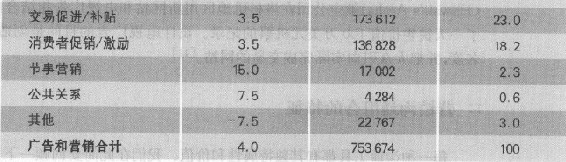
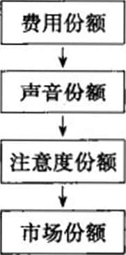
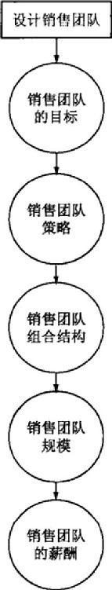

第7部分 沟通价值
----------------

第17章 设计和管理整合营销沟通

第18章 大众传播管理：广告、销售促进、节事和体验以及公共关系

第19章 管理个人沟通：直复营销、互动二营销、口碑以及个人销售

### 第17章 设计和管理整合营销沟通

> 本章将重点阐释以下问题：

-   1.营销沟通的角色是什么？

-   2.怎样进行营销沟通？

-   3.进行有效沟通的主要步驟是什么？

-   4.什么是沟通组合以及如何设置？

-   5.整合营销沟通讨什么？

现代市场营销需要的不仅仅是开发一个好的产品，制定一个有吸引力的价格，使得人们可以接受。公司也需要与现有的和潜在的利益相关者以及公众进行沟通交流。所以，大多数情况下，问题不在于是否要进行交流，而在于该说什么、怎么说、什么时候说、和谁说以及多频繁地说。但是沟通正变得越来越闲难，因为很多公司都在想尽办法吸引消费者分散的注意力。消费者在沟通过程中处于一个主动的角色，决定着什么样的沟通交流是他们想得到的以及关于他们使用的商品和服务他们想怎样进行交流。为了能有效地触及和影响目标市场，通盘考虑的营销人员正在采用各种富有创造力的沟通手段。

多芬作为联合利华下的一个品牌多年来一直采用传统的广告手段，宣传他们保湿霜的优点，劝导女性加入"7天多芬试用"的营销体验计划，实际感受产品的效果。2003年，一项名为"真美无界限"活动展开，这个活动赞美所有的女人都是"真正的女人"，不管其体形胖瘦、身材高矮、年龄大小和肤色各异。由此多芬公司的战略发生了一次重要改变。一项研究表明全世界只有2%的女人认为自己漂亮，而这恰恰成了这次活动灵感的来源。它勾勒了一个曲线优美、体态丰满、率真自信的女人形象，而不是传统的模特；用广告推销多芬的护肤类产品，例如深层修护霜、乳液、沐浴露；除此之外，还对所有的多媒体活动进行了彻底整合。传统的电视和纸制广告配以各种形式的新兴媒介，例如可以通过手机实时地为模特投票，并在巨幅宣传板上展示票选的结果。此外，公司放弃付费媒介转而大举建立公共关系。与此同时，因为因特网对于建立与女性的对话十分重要，多芬公司建立起网站并且投放大量的视频广告。它们以"进化"为题的视频通过快速变化的视角展现了一个相貌平平的女人经过造型师、发型师、灯光和数字修片的润饰，进而变成一个时尚模特的过程。该视频被多芬的广告代理商奥美（Ogilvy
Mather）上传到YouTube后，立即吸引了250万人次观看。后来的一个描绘了一群大龄裸体女性，名为"年龄无界限"的广告，其实主要也是为网络观众设计的。虽然这次活动激起了很多争议，但它确实在活动开展的地区很好地促进了多芬产品的销售，提升了市场份额。真美无界限也在2006年获得了由美国市场营销协会颁发的最有效的营销活动奖------艾菲奖（Grand
Effie）。

如果方式正确，营销沟通会收到巨大回报。在这一章，我们将描述沟通是怎样进行的以及营销沟通究竟吋以给一个公司带来什么。我们也将介绍全面营销人员该如何组合和整合营销沟通。第18章具体考察各种不同的大众沟通方式（如广告，促销、节事与体验、公共关系以及宣传）。第19章具体考察各种不同的个体沟通方式（如直复营销和交互式营销、口头营销、个人推销）。

### 营销沟通的角色

营销沟通（marketing
communications）指的是针对公司销售的产品和品牌，试图直接或间接地对消费者进行告知、说服和提醒的各种方法。某种意义上，营销沟通代表了该公司及其品牌的声音，或者成为用于与消费者建立对话或关系的工具。

营销沟通对于消费者来说也很有用，它们可以告诉并展示给消费者什么样的人、什么时候、为什么以及该怎样使用这些产品。消费者从中可以知道这些产品是什么公司生产的以及这些品牌都代表哪些公司。通过试用或者使用，他们可以获得激励或者各种奖励回报。营销沟通还允许公司将他们的品牌和其他的一些群体、地点、节事、品牌、体验、感觉等事情联系起来，通过在消费者记忆中建立品牌或者创造品牌形象，进而帮助公司提高品牌资产，促进销售，影响股东价值。

营销沟通坏境的改变

虽然营销沟通能扮演很多关键角色，但是现在的营销环境却越来越艰难。技术以及其他因素深刻地改变着消费者处理沟通的方式，甚至影响着他们是否选择进行沟通的决策。因特网强大的宽带连接带来的信息高速传播、过滤广告的数字视频设备、多种用途的手机、便携式的音乐和视频播放器都强迫营销人员必须重新考虑那些传统的营销方式。

这些不同寻常的改变已经侵蚀了大众传媒的有效性。M1960年，宝洁公司在三大电视网（NBC、ABC、CBS）同时播放一个30秒的商业广告，全美80%的女性可以收看到。而今天，你只有在100个以上的频道播出才有可能达到当时那种效果，而且这些广告则更有可能被那些使用数字视频设备（DVR，或称为PVR）的观众轻易地过滤掉。所以，对于在1994年将国际广告预算的90%都投进电视广告的宝洁，其历史上最成功的一个药品品牌Prilosec进入市场时也只将其花费的1/4投放在电视广告上。

主要有两种力量导致以前吸引消费者眼球的那些有力工具失效。其中之一是由数字技术和互联网的出现带来的美国观众的分流。黄金时段的收视率和播放量从1970年起就一直在下降。而新兴的则是媒体和各种娱乐方式的不断扩展，既包括数以百计的有线电视和数以千计的杂志，又包括不计其数的网站、博客、视频游戏、手机等等。消费者不仅有更多的媒介可以选择，而且还可以选择是否以及何时接受有关商业信息。

导致失效的另一种力量部分归结于消费者很轻易就可以把广告过滤掉。DVR允许他们只按下一个快进键就可以消除商业广告。据估计，到2010年可能有40%~50%的美国家庭拥有DVR，而其中60%~70%会选择快速跳过商业广告（其他的一些要么喜欢广告，要么不介意会被广告困扰）。对于因特网来说，这就更是威胁，因为有超过2亿美国网民可以只通过按下一个图标就决定是否观看广告。基于所有这些原因，麦肯锡（McKinsey）的研究指出，到2010年，传统电视广告的效果只有1990年的1/3。

但是，即使一些营销者逃过传统媒体的弊端，他们仍然会遭遇一些其他的挑战。商业混乱日益严重，好像越多的消费者拒绝各种营销诉求，就会有越多的营销者试图恢复它们。现在，每个城市居民平均每天要暴露在3000\~5000条广告信息下。超市的鸡蛋被贴上CBS的标签，地铁里的旋转门印着Geico的名字，装有中国食物的硬纸盒印着大陆航空公司，就连美国航空公司（US
Airways）也在其呕吐袋上作了广告。各种媒介、各种形式的广告不断增多，使得消费者越来越觉得他们正在遭受入侵。

营销沟通、品牌资产和销售

在这种新的沟通环境中，虽然广告是营销沟通最核心的部分，也是提升品牌资产、促进销售最重要的方式，但却不是唯一的。我们可以参考一下耐克公司是怎样介绍由篮球明星勒布朗·詹姆斯（LeBron
James）代言的最新款运动鞋。

> 耐克 Air Zoom勒布朗第四代篮球鞋（Nike Air Zoom Lebron IV）

> 耐克总会使用传统和非传统沟通方式广泛地发布和宣传其运动鞋系列的最新款，包括：由某广告策划人在ESPN上率先发起的"运动中心"活动；在全国各地发放40万张有关该鞋的制造过程及宣传广告的DVD；在espn.com和mtv.com等各种网站上大肆播放广告；在MTV2有线电视网上播放各种简短的视频片断；在麦迪逊花园广场安装大型的广告板，展现的是做着连续扣篮动作的球星勒布朗·唐姆斯。这次活动还设计了电视广告和在线视频，把詹姆斯呼唤成"the
> LeBrons"，刻画了一个拥有四重性格以及在几年前第一次出现在运动鞋广告中的勒布朗·詹姆斯的形象。

营销沟通组合

营销沟通组合（marketing communications mix）由以下八种主要沟通模式组成：

-   1.广告：由特定的赞助商采取付费方式，围绕创意、商品或服务而进行的非人员展示与促销。

-   2.促销：多种激励工具的组合，通常是短期性的，用以激励消费者或者经销商较迅速或较大量地购买某一特定产品或服务。

-   3.节事与体验：公司发起的活动或者项目，目的在于创造日常的或是特别的与品牌有关的交流感受。

-   4.公共关系和宣传：多种多样的活动用以促进或保护公司的形象和产品。

-   5.直复营销：使用邮件、电话、传真、电子邮件或者因特网，从而能与特定用户或者可能的客户进行直接的交流，或是恳请他们的回应或对话。

-   6.互动营销：通过在线的一些活动或项目，促进顾客及可能的顾客间直接或间接地交流，以增加品牌知名度、改善印象、促进产品和服务的销售。

-   7.口头营销：人对人地，用口头、手写或者电话交流，告诉一些有关使用产品或者服务的好处和经验。

-   8.个人推销：面对面的和一个或者许多潜在的顾客进行如做报告、回答问题、取得预订等方式的互动。

表17.1列出了多种沟通平台。公司的沟通应该超出那些特定的平台。产品的风格、价值，包装的形状、颜色，经销商的举止、打扮，商店的装潢以及公司的信纸都能与购买者进行沟通。每一个品牌联系（brand
contact）都会加强或减弱消费者对于该公司的印象。

表17.1 常见沟通平台

正如图17.1所示，营销沟通在很多方面对品牌资产和产品销售都有贡献，比如：可以创造品牌知名度，可以在消费者记忆里建立起良好的品牌形象联想，可以引导积极的品牌评价和感觉，推动建立消费者和品牌之间牢固的联系。

图17.1 整合营销沟通建立品牌价值

营销沟通的作用

具体通过什么样的方式形成品牌联想并不重要。换言之，如果消费者对于富士重工有相同强度的、积极的、独特的品牌联想，形成"户外的"、"有活力的"、"越野的"概念，不论是因为在电视广告上看到它的汽车一年四季行使在各种崎岖的道路上，还是因为富士重工赞助滑雪、皮划艇和山地车赛事，总之对富士重工品牌资产的影响是一样的。

但是，这些营销沟通活动必须进行一定的整合，才能更好地传递一致的信息，实现战略定位。在制定营销沟通计划时，第一步就是要审查目标市场的消费者可能与公司或者公司的商品和服务发生的潜在交互影响。例如，某个消费者想买一个新的手提电脑，那么他就可能与别人交流、看电视广告、读杂志、在互联网上查找相关信息以及在专卖店看看这种电脑。

营销人员需要去评估哪种经历或印象对购买过程的每个阶段产生最重要的影响。这些有助于他们有效地分配用于沟通的资金，设计和完善合适的沟通计划。拥有这些洞察力之后，营销者就可以根据通过影响体验和印象以建立品牌资产和促进品牌销售的能力来评价营销沟通。例如，某个广告活动能在多大程度上有助于建立和保持品牌知名度以及增强品牌联想？某次赞助是否可以让消费者对于品牌的判断和感觉更好？某次促销究竟能在多大程度上激励消费者购买更多的商品以及在什么价格上会产生溢价？

从品牌资产建立的角度出发，营销者应该做到"媒体中性"，即评价各种不同的沟通选择时，既要依据有效性标准（效果好不好），又要考虑效率（花费多大）。这种品牌建设的广阔视野在营销人员制定提升品牌知名度的策略时就显得更为重要了

> Mimeo.com

> Mimeo.com作为一个不太知名的公司，希望能像为影迷服务的Moviephone---样，提供在线的商业印刷业务。2006年，公司有超过1500个企业客户，例如花旗银行、汉堡王、捷蓝航空等，它们依靠Mimeo公司印制训练手册、销售报告以及各种小册子。但是只有260万美元收入的他们只能追随行业领导者联邦快递金考，而且它们品牌知名度基本为零。公司CEO亚当·斯拉特斯基（Adam
> Slutsky）说："虽然Mimeo成立6年了，但是好像没有什么人知道我们。我们的挑战在于找到一个能帮助我们制定一套完整的提高知名度、确定合理定位的活动，像猎人一样把每件事都度量到的代理或者伙伴。"斯坦·里根伙伴公司后来为他们设计了以下活动：

> 设计一个新的、更生动的、色彩绚烂的Mimeo.com的标志。

> 在那些瞄准中小型公司的商业出版物上开展一个价值200万美元的印刷广告宣传活动，突出那些顾客满意的案例。

> 在美国社会训练与发展协会举行"不做小丑"的活动，向持有"不做小丑"标志的人分发Mimeo
> T恤衫，并向穿着Mimeo T恤衫的人发放iPod仿制品。

> 这次完整的活动取得了巨大的成功，吸引了很多行业领先者，签订了数个新的商业订单。

像赞助或者户外广告这样，任何引起消费者注意，使其关注品牌的行为都可以提高品牌知名度，至少可以提高品牌认知度。为了增加品牌回忆度（品牌认知包括品牌认同与回忆），需要一些更加有效的和精心设计的过程，这样可以在品牌与产品类别以及消费者需要之间建立起更强的连接，优化其在消费者记忆里的表现。

沟通过程模型

营销者应该了解有效沟通具备的基本要素。其中有两个模型非常有用：宏观模型和微观模型。

沟通过程的宏观模型

图17.2描述的是由九个要素构成的宏观模型。其中两个因素代表沟通的主要部分：发送者和接收者。两个因素代表沟通的主要工具：信息和媒介。四个因素代表沟通的功能：编码、解码、反应和反馈。最后一个因素是系统中存在的噪声（随机的、有竞争性的、可能干扰正常沟通的信息）。

图17.2 沟通过程基本要素

宏观模型强调有效沟通中的关键因素，即发送者必须明确他们的消息应该传递给哪些观众，并且能从他们那儿得到什么样的反应。他们必须对消息进行编码，使得目标受众可以对其进行解码，然后通过媒介向目标受众传递消息，开发反馈渠道并监视接收者的反应。发送端的经验和接受端的重叠越多，说明消息传递越有效。要注意在第6章提出的选择性关注、失真、滞留过程在沟通中都可能发生。

消费者反应的微观模型

该模型主要集中关注消费者对于沟通的一些特殊反应。图17.3总结了四种经典的反应层级模型。

图17.3 反应层级模型

所有模型都假设购买者要依次经历认知阶段、情感阶段和行为阶段。"先了解、后感觉、再购买"的顺序适合于消费者想要购买如房子、汽车这种涉入度很高，感知起来会有很大不同的一类商品。而另外一种顺序，即"先购买、后感觉、再了解"则适合于购买如电脑、机票这种，涉入度较高，事先感知不到有什么不同的商品。还有一种顺序，即"先购买、后了解、再感觉"适合于购买如盐、电池这种，涉入度很低，感知不到什么不同的商品。营销者可以通过选择恰当的顺序，很漂亮地设计营销沟通。

这里，我们假设消费者想要购买的是可以感知到很大不同的一类商品。我们以爱荷华州Pottsville学院开展的一次营销沟通活动为例，介绍效用层级模型（见图17.3中第二栏）。

 

-   知名度：如果目标受众不知道某种产品，沟通者的任务就是建立起这个东西的知名度。假设Pottsville学院想从内布拉斯加州招生，却在当地不是很有名气。那么内布拉斯加州的30000名初、高中生中的50%可能对Pottsville学院感兴趣。Pottsville学院必须定下目标，就是在一年之内让这些学生中的70%知道学院的名字。
-   熟知度：目标受众现在可能对这个品牌有了一定的知晓，但是却不知道更多的内容。而Pottsville学院希望目标受众知道，他们是一所四年制的私立学院，在英语、外语和历史方面都有很好的课程项目。Pottsville需要做的是去了解对他们知道得很少、一般、很多的人群分别有多少。如果熟知度太差，Pottsville必须选择一些与其品牌相关的知识作为沟通的内容。
-   喜爱度：如果目标受众都已经知道这个品牌，他们对它又有什么样的感觉呢？如果不喜欢，那么Pottsville学院需要找到他们不喜欢的原因。如果确实有一些问题，Pottsville则需要解决，然后把新的情况再做沟通。良好的公共关系需要言行一致、名副其实。
-   偏好：目标受众可能会喜欢你的产品，但是当存在别的产品时却不一定偏好你的。在这种情况下，沟通者应通过与竞争产品进行质量、价值、性能及相关特性方面的比较，从而建立消费者的选择偏好。
-   坚定信念：目标受众可能会偏好这种产品，但却不一定有坚定的购买信念。沟通者的工作就是帮助对Pottsville感兴趣的人群建立这种坚定信念和购买意愿。
-   购买：最后还会有一些目标受众可能会有坚定信念，但仍不确定会去购买。沟通者必须要引导他们走出这最后一步，比如可以通过低价出售，提供奖励金，或者让其试用。Pottsville可以邀请一些高中生参观校园，试听一些课程，对优秀学生提供部分奖学金等等。

为了说明整个沟通过程极易失败，我们假设这六步每一步成功完成的可能性是50%。如果每一步都是独立事件，那么由概率论计算出六步都成功的概率是0.5X0.5X0.5X0.5X0.5X0.5=1.5625%。如果每一步成功进行的概率按一个更恰当的平均水平10%来计算，那么整个过程成功的概率仅为0.0001%，即100万次努力才有1次成功。

为了增加营销沟通成功的可能性，我们需要增大每一步完成的机会。例如，从广告的观点出发，一个完美的广告项目应该确保满足以下几点：

-   1.在恰当的时间、恰当的地点，将恰当的信息传递给适合的消费者。

-   2.广告要吸引消费者的关注，但是又不能将其注意力从目标信息上分散。

-   3.广告要恰当地反映出消费者对于产品和品牌的理解和行为层次。

-   4.广告要能从可满足和可传达的差异性和相似性角度定位产品。

-   5.广告要激励消费者购买该产品。

-   6.广告要能通过已有的这些沟通效果建立强烈的品牌联想，使得消费者在决定购买时能有印象。

### 制定有效的营销沟通

图17.4描述的是设计有效营销沟通的八个步骤。我们从最基本的开始介绍：确定目标受众，明确沟通目标，设计营销沟通，选择沟通渠道，建立整合营销沟通预算。

图17.4 制定有效营销沟通的步骤

确定目标受众

营销沟通一开始就必须要有一个清晰的目标受众，包括公司商品的潜在购买者、现阶段使用者、决策者、有影响力的人。他们既可以是个人、集体，也可以是特定的公众群甚至是所有公众。目标受众对于沟通者决定说些什么、什么时候说、和谁说、在哪说都有着关键的影响。

虽然我们可以用第8章介绍的各种市场细分方法区分目标受众，但是一般来说更常用的是按使用频率和忠诚度进行区分。比如：目标受众是这类产品的新人，还是现有的使用者？目标受众是对此品牌忠诚，还是对竞争者忠诚，或是一个容易在品牌间转换的人？如果他是品牌的使用者，那么是轻度还是重度使用？答案不同，相应的沟通策略也不同。我们还可以通过对品牌的熟知程度来划分目标受众，从而以更深的视角进行形象分析。

明确沟通目标

就像之前介绍Pottsville学院所提到的，营销者可以把沟通目标定为效用层级模型中的任何一层。罗西特和珀西（Rossiterand
Percy）确定了如下的四种可能目标：

-   1.满足种类需求：开发某种产品或者服务，从而消除或者弥补消费者现有情感状态和需求情感状态间的差距。比如，一种新的面向全世界的产品，如电动汽车，其沟通的初始目标就是要满足种类需求。

-   2.品牌知名度：帮助消费者在一类产品中识别出（认识和回忆）该品牌，提供足够的细节，帮助其作出购买决策。一般地，认出比回忆起要容易实现，比如相比记住Frozen
    Entries的品牌，消费者更容易认识到Stouffer与众不同的橘黄色包装，而不是回忆起品牌。在商店外，回忆起品牌更加重要；而在店内，能认出品牌更加重要。品牌知名度成为品牌资产的基础。

-   3.品牌态度：评估品牌时需要考量其满足当前相关需求的感知能力。相关品牌需求可能是消极因素导向（解决问题、避免问题、不完整满足、普通型损耗）或者积极因素导向（感官满意、鼓舞、社会认可）。家庭清洁用品侧重提出解决困难的办法，食品类产品则经常使用强调胃口的感官导向型广告。

-   4.品牌购买意愿：购买品牌或者和购买品牌相关的自我引导。优惠券或者买二赠一等促销方式会激励消费者在情感上作出购买承诺。但是很多消费者并没有明确的种类需求，而且看到广告的时候也不一定在市场上，所以他们很可能无法形成购买意愿。例如，在任意一周，只有20%的人计划购买清洁剂，2%的人计划购买地毯清洁器，只有0.25%的人计划买车。

最有效的沟通往往可以实现多个目标。

设汁营销沟通

营销沟通要得到预期的反应需要解决以下三个问题：该说什么（信息策略），该怎么说（创造力策略），该由谁来说（信息源）。

信息策略

在制定信息策略的时候，管理层需要找寻诉求、主题及灵感，以期将他们与品牌定位绑定，有助于保证定位的差异点和共同点（POP）。其中有些会直接和产品及服务的性能表现（质量、经济、品牌价值）有关，其他的更多和一些外在因素（品牌是当代的、流行的，还是传统的）有关。

约翰·马洛尼（John
Maloney）认为消费者总是期待从一个产品中得到以下四种回报之一：理性满足、感官满足、社会满足和自我满足。购买者可能通过三种体验形象化这些回报：使用后的结果体验，使用中的产品体验，附带使用体验。四种类型的回报和三种类型的体验可以组合成十二种信息。例如，"让衣服更干净"就属于使用后的结果体验带来的理性回报承诺，而"真正啤酒的味道来自清啤"就是使用中产品体验带来的感官回报。

创造力策略

沟通效率取决于怎样表达信息以及信息本身的内容。沟通缺乏效率，说明要么是用错了信息，要么就是正确的信息被错误表达了。创造力策略（creative
strageties）指的是营销者将信息转化成某种特定的营销沟通时采用的方法。我们可以宽泛地把他们分成两类，一类是信息化表述（informational
appeals），另一类是转换性表述（transformational
appeals），其中每一种又包含了几个不同的、富有创造性的方法。

信息化表述    信息化表述可以详细说明产品或者服务的属性和好处。以广告为例：解决问题型广告（Excedrin可以消除严重的头痛），产品示范广告（Thompson水封可以抵挡强烈的雨、雪和热度），产品比较广告（Direc
TV比有线电视提供更清晰的效果）以及名人代言\[NBA明星勒布朗·詹姆斯代言雪碧、动乐（Powerade）以及耐克\]。信息化表述假设沟通过程在消费者端遵循着逻辑和因果原则，而且非常理性。

霍夫兰（Hovland）在耶鲁大学的研究探讨了信息化表述及其与制定结论、单方面反对、两方面争论以及争论表达的顺序等之间的关系。一些早期的研究支持向观众陈述结论。后续的研究表明，最好的广告只是提出问题，而允许观众形成他们自己的结论。如果本田公司死板地认为自己是属于年轻人的，那么这种定义就会阻止很多大一点年纪的人购买其产品。一些模糊的刺激可以造成更宽泛的市场定义，带来更多自发的购买行为。

你可能会觉得单方面地赞扬一个产品比提及到缺点的两方面争论效果更好。但是不然，由两方面进行争论可能会更有效，特别是当那些消极的联想可以被消除的时候。亨氏说："亨氏番茄酱味道还没达到最好。"利斯特林会说："利斯特林的食物一天吃两次味道就没那么好了。"对于那些受过教育或者一开始就持反对态度的观众，这种两方面的信息效果更好。

最后，表达这种争论的顺序是很重要的。在单方面消息中，一开始就提出最强的争论有利于吸引大家的注意力和兴趣。这一点在观众不能都得到全部完整信息的媒介中很重要。对于一个已经被捕获的消费者，将宣传推向高潮更加有效。而对于一个两面性的信息，如果观众一开始反对，沟通者可以从另一面观点开始，而最终以其强有力的观点作为结束。

转换性表述    转换性表述详细描述的是与产品无关的好处或者形象。它可能描述的是一个什么样的人会使用这个品牌（例如：大众汽车公司用"渴望"活动给有活力的年轻人作广告），或者使用这个品牌之后会得到什么样的经验（例如：品客使用了很多年的广告"劲爆开始，乐趣永不停"）。转换性表述总是试图去煽动起购买的情绪。

沟通者可以用一些如恐惧、负罪感、害羞等消极表述使人们做一些事情（刷牙、每年做健康体检）或者不做一些事情（抽烟、过度饮酒、过度饮食）。当这些恐惧表述不是很强，而且来源可信以及沟通者承诺会以令人信服的有效方式降低这些恐惧时，恐惧表述就会很有用。信息在与消费者认知有适度差异的情况下都是有说服力的，尽力陈述消费者已经相信的那些东西只会增强信念。而如果信息与消费者认知有很大偏差，观众只会驳斥以及不再相信这些沟通者。

他们也可以使用一些如幽默、喜爱、骄傲、乐趣等积极性表述。使用一些有动机的或者"借来的兴趣"的策略，比如出现一些很可爱的小宝宝、活泼的小动物、流行的音乐，或者煽动性的画面，都可以吸引消费者的注意，增加他们与广告的相关度。能借他物而产生兴趣的这项技巧在当前这样一个消费者涉入度低，各种竞争广告、项目混乱不堪的艰难的媒介环境中是必须的。

虽然这种借他物而产生兴趣的方法可以吸引注意力，并且创造对活动发起方更多的好感和信念，但是它却分散了消费者对产品的理解，使得产品的受欢迎程度快速衰退这种先关注后取得的策略往往过度有效了，反而分散了品牌或者产品本身想表达的意思。于是，在传递那些目的信息的同时，"穿透混乱"吸引消费者注意，成了最有创造力策略中的一个挑战。

广告的魔力在于能给消费者头脑中的生活带来更多的概念。对于印刷广告，沟通者必须决定使用什么样的标题、副本、插图以及色彩搭配。对于广播的信息，沟通者要负责选择单词、声音质量以及发声方法。广播员在做一辆二手车和一辆新的凯迪拉克车的促销时，声音肯定会不一样。如果信息是由电视或者人来传播时，所有的肢体语言（非语言线索）都要纳入考虑，包括推荐者要注意面部表情、手势、衣着、姿势和发型等。而如果信息是由产品或其包装传播时，沟通者要注意的是它们的颜色、质地、尺寸、气味和形状。

信息源

很多沟通除了公司自己之外，没有别的发起者。其他的可能会使用一些知道或者不知道的人。如果信息是由流行的或者有吸引力的发起者传递，就能够实现更高的关注度和回忆度，这也是为什么很多广告会选择名人代言的原因。如果他们值得信赖，并且可以把产品某个关键属性人格化，那么名人作为信息源将会很有效果。ABC的《盛妆》节目主持人泰·彭宁顿（Ty
Pennington）代言西尔斯，詹姆斯·厄尔·琼斯（James Earl
Jones）代言威讯（Verizon）以及自称过重的女演员克里斯蒂·阿利（Kkstie
Alley）代言珍妮·克雷格（Jenny
Craig）减肥系统，在消费者眼里都再合适不过了。而另一方面，当席琳·迪翁（Celine
Dion）无法给克莱斯勒注入更多魅力，带来更多销售时，即使还有三年价值1400万美元的合同在身，她仍然被炒掉了。

最重要的就是代言人的可信性。而哪些因素会成为构成信息源可信性的某础呢？经常提到的是三个：专有技术、诚信、可爱。专有技术指的是沟通者拥有的可以支持其宣传产品的某种专业化知识。诚信反映的是人们感知到信息源的客观和诚实。朋友比陌生人或者商家更值得信任，那些没有收钱就认可产品的人比收了钱的更值得信任。可爱（likabi
Hty）描述的是信息源受人关注的程度。坦白直率、幽默、自然会让一个信息发起人更加可爱。B2B营销机构埃森哲在著名高尔夫球选手泰格·伍兹身上就发现了很多这样的特质。

> 埃森哲（Accenture）

> 除了世界第一高尔夫球手泰格·伍兹外，还有什么能是卓越性能的更好象征呢？这就是为什么商业咨询公司埃森哲一直坚持选择这位高尔夫球选手作为自己品牌重建活动的关键代表。选择泰格·伍兹和新的口号"传递卓越表现"，埃森哲想传递的消息就是，他们可以帮助客户公司成为像他们公司网站上展示的其他公司一样的拥有卓越性能的行业领袖。由泰格·伍兹代言的传递卓越表现就像是他又一次获得锦标赛冠军一样。这次活动包括在27个国家投放广告，利用泰格·伍兹的国际化影响，赞助如世界高尔夫球锦标赛、纽约马拉松等一系列和卓越表现相关的活动，并建设了互动性的网站，使得用户可以得到个性化的信息及其行业相关信息的更新。埃森哲还与《华尔街日报》通力合作，聘请经验丰富的记者撰写反映卓越性能商业表现的各类文章以及为客户公司撰写一些特稿。

信誉度最高的信息源在这三个方面------专有技术、诚信和可爱------都能得到很高的评价。制药公司希望医生帮助他们证明药物的疗效，就是因为医生的可信度高。一个宣传可降低胆固醇的药物Lipitor的昂贵广告将重点放在了宣传来自Robert
Jarvik博士------人造心脏的发明者------的证明书上。查尔斯·施瓦布（Charles
Schwab）成为宣传他的能带来40多亿美元折扣的谈判经纪公司嘉信理财的广告核心。另外一个可信的商品宣传员例子就是拳击选手乔治·福尔曼（George
Foreman）。"营销视野：名人代言策略"着重关注了该怎样使用名人推荐。

> 萨尔顿（Salton）和乔治·福尔曼（George Foreman）

> 萨尔顿（Saltern）是一家不知名的特殊器具生产商，20世纪50年代因为他们生产的热塔盘成为当时登记结婚必不可少的一项东西而小有名气。90年代初，他们生产的烤箱类产品一直不受关注，直到两次重量级拳击锦标得主乔治·福尔曼成为他们的代言人，甚至成为公司参与销售的合伙人后，一切才得以改变。福尔曼和这款名为"拳王炙烤炉"的烤炉极为匹配，而他对于奶酪汉堡的酷爱也声名远扬。产品投放市场一年后，他亲自在家庭购物频道QVC上推销炙烤炉。而当时摄像镜头捕捉到的竟是，在其他嘉宾随意交谈时，乔治什么都没做，只是死死地盯着被烤得咝咝作响的面包，然后翻了个圈，抓住其中一个就开始吃。与此同时，场外的热线电话就开始不断地打进来。从90年代中期开始，福尔曼帮助萨尔顿公司卖出了超过5500万只炙烤炉，他也因此获得了比当拳击手更多的收入，超过1.5亿美元。

\@营销备忘：名人代言策略

就像Ameriprise金融公司在婴儿生育潮过后选择20世纪60年代的电影明星丹尼斯·霍珀（Dennis
Hopper）加入他们"梦想不会退休"的广告一样，一个经过慎重选择的名人可以为品牌和产品吸引更多的注意，或者说名人的神秘性可以转化到品牌上。为了进一步加强其崇高声望，美国运通公司在广告里选择了传奇巨星罗伯特·德尼罗（Robert
Deniro）和马丁·斯柯席斯（Martm Scorsese）。

名人的选择至关重要。他（她）不仅要有很高的知名度和积极的影响，而且也要很适合这个产品。帕丽斯·希尔顿（Paris
Hilton）和唐纳德·特朗普（Donald
Trump）有很高的知名度，但是在很多群体中却有不好的影响。罗宾·威廉姆斯（Robin
Williams）既有很高的知名度又有积极的影响，但是却不适合为一个国际和平会议做广告。而汤姆·汉克斯（Tom
Hanks）和奥普拉·温弗瑞（Oprah
Winfrey）则可以代言很多产品，E为他们的知名度和受喜爱程度都最高（即我们熟悉的娱乐业中的
Q因子）。

名人们出现在各个地方。在竞争激烈的治疗阳痿的药物中，营销者们求助名人使用其产品，从而帮助他们获得更多的关注。最初为此做广告的是一个退休的政治家鲍伯·多尔（Bob
Dole），后来辉瑞制药的伟哥使用40岁的棒球手拉斐尔·帕梅罗（Rafael
Palmeiro）和45岁纳斯卡赛车手马克·马丁（Mark
Martin）进行代言，赋予市场领导地位的这款药物更年轻的形象。竞争者之一艾利达（Levitra）则聘用著名的橄榄球教练迈克·迪特卡（Mike
Ditka），意图突出药物的快速疗效和质量。只有新近才进入市场的西力士（Cialis）公司放弃使用名人，投放市场的广告描绘的是处于浪漫环境中的夫妻。

运动员通常代言运动产品、饮料和服饰。最杰出的运动员代言人是曾经和睾丸癌做斗争，并成功战胜疾病，连续6年获得环法自行车赛冠军的自行车选手兰斯·阿姆斯特朗（Lance
Amstrong）。他代言了许多自行车和运动产品，包括 Trek、Power
Bar和耐克。兰斯·阿姆斯特朗"和所有不平等斗争"的故事也为其贏得了来自很多与体育无关的公司价值数百万美元的代言合同，如百时美施贵宝制药公司、可口可乐、富士重工、24小时纤体。

名人还能在战略上为品牌扮演更多的角色，不只是代言产品，他们还可以帮助设计、定位以及推销商品和服务。自从1996年签下泰格·伍兹，耐克在高尔夫球市场的产品份额稳定增长。泰格·伍兹成为开发一系列高尔夫产品和服饰过程中的关键角色，因为为了准确地反映泰格·伍兹变化着的个性和品位，耐克公司的设计必须阶段性地改变。

使用名人也会引起一些风险。他们可能在更新合同的时候漫天要价或是拒签。而且就像电影和唱片一样，名人代言的活动有时候可能花费巨大，却遭遇失败。百事公司就放弃过巨星小甜甜布兰妮（Britney
Spears）和碧昂丝·诺里斯（Boyonce
Knowles），因为她们个体对于品牌来说极具压倒性，以至于在很多宣传百事饮料的促销场合无法将观众的目光集中到产品本身。

当然，名人也会不流行、变糟糕，甚至身陷绯闻和各种尴尬处境。自从1991年
NBA传奇球星魔术师约翰逊身患艾滋病和私通案件的曝光，他的各种广告立刻被从天上拉到了地下，他的各种代言合同也没有得到延续。麦当劳在篮球巨星科比·布莱恩特（Kobe
Bryant）面临强奸指控后，也选择不再与其延续每年价值1200万美元的合同。

如果一个人对于信息源和信息有同样积极或消极的态度，我们就认为这是一种一直协调的状态。而如果有人对信息源和信息持相反态度，那会怎样呢？比如某个消费者听到他喜爱的名人赞扬着他不喜欢的品牌。奥斯古德和坦嬾鲍姆（Osgood
and
Tannenbaum）认为在这种情况下，态度会向着增加两种评价一致性的方向转变。最后的结果可能消费者或多或少降低了对这个名人的尊敬，或者或多或少增加了对此品牌的喜爱。而如果他发现这个名人还在赞扬着别的不招人喜欢的品牌，最终就会形成对这个名人不好的看法，继续保持对那些品牌的否定态度。一致性原则（Principle
of
congruity）意味着沟通者可以用他们好的形象减少一些消费者对于品牌的消极感觉，同时也会损失某些消费者对他们的尊重。

全球性适应

跨国公司在开发一些全球性沟通项目的时候会遇到很多挑战，比如：他们要决定这个产品是否适合这个国家，要确保他们的市场细分既合法又符合惯例，他们还要决定广告的风格是否容易接受以及在总部还是在当地制作。

-   1.产品。很多东西在世界的某些地区受到限制或者禁止。在很多伊斯兰国家，对啤酒、白酒、精神类产品不能做广告也不能销售。烟草产品在很多国家也受严格规章制度的限制。

-   2.市场细分。以前，美国的玩具制造商很惊讶在很多国家（挪威、瑞典等），未满12岁的孩子不能拍摄广告。瑞典还在2001年的欧盟成员国会议上，对各国进行游说，希望他们也能采用这项禁令，尽管最后遭到拒绝。为了安全起见，麦当劳在瑞典把自己宣传成了一个家庭餐馆的形象。

-   3.风格。对比型广告，在美国和加拿大易于接受而且十分常见，在英国却很少使用，在日本根本无法接受，在印度和巴西甚至是不合法的。欧盟好像很难容忍对比型广告，他们成立了对比广告管理局专门制止在广告中攻击其他竞争对手。百事可乐曾经在日本有一个对比口感的广告就遭到了很多电视台的拒绝，而且导致了法律诉讼。

-   4.本土化还是全球化。今天，越来越多的跨国公司通过在所有市场使用一样的广告，试图去建立一个全球化的品牌形象。

对于那些产品销往不同文化或者不同国家的公司，必须准备不同的信息。海伦妮·柯蒂斯（Helene
Curtis）在不同国家设计护发产品广告时都会调整他们的信息。在英国，中产阶级妇女会频繁地洗头，而在西班牙则不会这样，日本女性也会避免重复洗头，以防洗掉各种护发油。

选择沟通渠道

由于沟通渠道变得越来越零散和混乱，选择有效方法传递信息就显得越来越重要。我们可以思考一下制药行业面临的挑战：在美国，每天有94000名药品销售员都希望能见到医生，而其中只有40%多一点能实现，并且平均时间只有2分钟甚至更少，这些都使得依靠医生的医药销售变得更加珍贵。因此，制药行业不得不扩大沟通渠道的容最，包括：在医学杂志上刊登广告、直接邮寄材料（音频或者视频）、免费使用，甚至是电话营销。制药公司还会赞助各种临床医学会议，让医生们用整个周末的早上聆听杰出同事赞扬某种新药，下午则免费去打网球或高尔夫球。

制药公司使用这些不同的渠道也只是希望能建立起医生们对于他们品牌的好感。他们还会使用一些新的技术，比如掌上电脑、上网设备、音频会议设备，随时与医生们取得联系。

沟通渠道可以分成人际沟通渠道和非人际沟通渠道，而每一种又具体包括一些子渠道：

人际沟通渠道

人际沟通渠道（personal communications
channels）允许两个或更多的人，通过电话或者电子邮件，进行面对面的，或一个人面对许多受众的沟通交流。即时通信以及通过一些独立站点接受消费者的评论都是近几年日益重要的沟通渠道。人际沟通渠道的有效性就在于它富有个性的表达方式以及信息反馈。

我们可以进一步得出倡导渠道、专家渠道、社会渠道之间的区别。倡导渠道（advocate
channels）指的是公司销售人员联系目标市场上的购买者。专家渠道（expert
charmels）指的是独立的专家们对于目标购买者所作陈述。社会渠道（social
channels）是邻居、朋友、家人及其他有关系的人与目标购买者进行的交谈。在对7个欧洲国家7000多名消费者进行的一项研究表明，60%的人认为他们使用一个新品牌是受家人和朋友的影响。

博雅公关公司（Burson-Marsteller）和罗拍·斯塔奇国际（Roper Starch
Worldwide）的一项研究发现，一个有影响力的人口头上一句话可能会影响到平均2个人的购买态度，而在网络上能影响8个人。现在，有相当多的消费者之间针对各种主题的沟通讨论是在互联网上进行的。网友们不仅使用，而且也会提供越来越多的产品信息。在网络上，他们加入各种兴趣相投的团体，一起分享各种消息，以至于"网络上的话"和"口头上的话"一样，对其购买行为产生重要的影响。那些关于公司的好话传得很快，而坏话传得会更快。正如一位营销者所述："你不需要与200万个消费者接触，告诉他们你的新产品。而只需用恰当的方式告诉2000个恰当的消费者，他们会帮助你告诉另外200万人的。"

人际影响在两种情况下会变得特别的重要。一种是当产品特别贵，有风险，购买频率较低的时候，另一种是当产品可以反映使用者的状态、品位的时候。人们总是会求助别人，请他们推荐好的医生、管道工人、酒店、会计师、设计师、保险代理人、麻醉师、理财咨询师。如果我们对推荐人有信心，就会按他们推荐的做。所以作为推荐人，就会得到来自服务提供方和服务寻求方双方面的好处。服务提供商显然很愿意建立起这样一个推荐人的资源。

下面是一个体现口头传播能量的例子。

> 玉米煎饼连锁店（Chipotle Grill）

> 丹佛玉米煎饼连锁店避免使用电视等传统的广告形式。公司创始人和CEO史蒂芬·埃尔斯认为广告并不可靠，所以公司一年的广告花费比麦当劳48小时的广告花的还少。取而代之的是，玉米煎饼连锁店信赖那些对于他们分量充足、成分新鲜、味道鲜美的产品满意的忠诚客户的口头宣传。为了传播这些宣传，玉米煎饼连锁店大方推出免费品尝，在曼哈顿市场，他给6000多人分发墨西哥玉米饼，其中有些顾客排队等了2个小时。这件事只花费了3万美元，却制造了热烈的反响，好评开始源源不断地传播出去。一项消费者调查表明，这家拥有573个连锁店的公司排名所有墨西哥快餐厅榜首，获得了相同的餐厅在过去20年里取得的销售增长的两倍。

把恰当的信息传递给恰当的人是十分重要的。吸取了谷物类快餐Smorz推广试验失败的经验，家乐氏（Kellogg）将样品和讲述谷物食品制作过程及电视广告的DVD分发给10000个有影响力的年轻人。这使得他们后来得以在一个500000人的社会网络中进行取样调查。

非人际沟通渠道

非人际沟通渠道指的是对两个以上的人进行沟通的渠道，包括媒体、促销以及公共关系。

媒介：包括印刷品媒介（报纸和杂志），广播媒介（无线电广播和电视），网络媒介（电话、有线通信、卫星、无线通信），电子媒介（磁带、录像带、电视唱片、CDROM、网页），展示媒介（宣传板、标志、海报）。多数非人际信息都是可以通过付费媒介传递的。

促销：包括消费者促销（免费样本、优惠券、奖金），商业促销（广告、展销），商业和销售促进（销售竞赛）

节事和体验：包括组织体育、艺术、娱乐活动以及一些非正规活动，虽然规模小，却可以创造和消费者之间新颖的品牌互动。

公共关系：对内包括和公司雇员的直接沟通，对外包括和消费者、其他公司、政府和媒体的直接沟通。

近来，非人际沟通的增加主要发生在节事和体验这一渠道上。公司通过创造或者赞助某次节事建立起品牌形象。过去热衷体育活动的节事营销者，现在经常选择如艺术馆、动物园、冰雕展等地方愉悦他们的雇员和客户。AT&T和IBM赞助交响乐演出和艺术展览，Visa成为奥运会的主赞助商，哈雷-戴维森则每年赞助摩托车拉力赛。

很多公司正在寻找更好的方法去量化他们发起赞助的好处，向节事的所有者和组织者要求更大的权利。他们也在设计和发起很多可以刺激消费者，引起很大反响的节事，其中很多具有游击性质。但是如果行动的方式不恰当，也可能适得其反，得不到想要的结果。

> 卡通频道（Cartoon Network）

> 2007年1月31日，波士顿市的很多官员发现在桥上，在城市的高层建筑外轮廓上，都发现了38个闪烁着的电子标志，它们宣传的是卡通频道（Cartoon
> Network）深夜档的有线电视节目《饮料杯历险记》。官员们认为这些闪烁的设备很可疑，于是只能关闭了主要的道路和水路，出动了几队爆破班。这些在晚上被点亮的一尺多高标志物被装饰成一个盒子形的做着淫秽手势的卡通形象，同时又像一块由许多电池和裸露电线组成的电路板。频道的所有者特纳广播公司，后来承认作为一个精心策划的全国性的游击营销活动的一部分，他们在包括波士顿在内的10个城市都安置了这些设备，也对由此引起的误解表示歉意。公司为补偿波士顿警察局的调查支付了100万美元，同时也向信誉基金支付100万美元。虽然一些人认为城市官员们反应有些过度了，但是特纳公司还是采取行动以平息各种可能的违法指控和市民投诉。卡通频道的负责人也因为此事下台。

类似这种试图捕获消费者注意力的节事越来越多，其实是对媒介变得零散化的反映，即消费者可以寻求上百个有线电视台，上千种杂志，上百万个网页。虽然这些节事不一定能对品牌知名度、熟知度有一个持续的影响，而且品牌本身的性能表现可能也很不一样，但是节事确实可以吸引注意力。

沟通渠道的整合

虽然个体沟通比大众沟通更有效，但大众媒介仍是刺激个体沟通的最主要方式。大众沟通通过两步过程影响个体性的态度和行为，即很多想法都随着广播和电视印在了那些意见领袖的脑海里，然后经过他们传递给那些媒介涉入度不高的人群。我们从这样一个两步的过程中得到的启示是：首先，大众传媒对于公众观点的影响并没有营销人员直接、有效和自动。对于公众观点的影响总是通过意见领袖促成的，这些意见领袖指的是其观点会被其他人追逐的，或者他们能将自己的观点带给别人的一类人。第二，这样一个两步过程对消费行为主要受来自大众传媒的"向上或向下的滴漏效应"影响的观点提出了挑战，即认为人们主要是在他们自己的社会圈子里相互影响着，从意见领袖那儿得到新的想法。第三，这样的两步沟通过程表明，沟通者应该直接将信息传递给意见领袖，然后通过他们将信息带给别人。宝马的MINI
Cooper就设计了一个很巧妙的策略，使得人们开始谈论以及使用这款新车。

> MINI Cooper

> 20世纪60年代，一款MINI的小型汽车仅仅销售了7年，就因为严苛的排放规定而被迫退出市场。2002年3月，宝马公凭决定重新推出一款新的，更加现代化的MINI
> Cooper汽车，而它的目标群则是那些希望花费不到20000美元就可以买到更酷、更有趣的小型汽车的精明的城市居民。MINI
> Cooper的营销人员用2000万美元开展了一场游击营销沟通活动，包括创新地使用广告牌、海报、印刷品广告，针对基层进行努力以及决不使用电视广告。他们将MINI
> Cooper叠放到3辆福特的SUV汽车上，将其开到21个主要城市中，参加全国各种汽车展览。除此之外，我们在一些不寻常的地方都会见到这款车，比如在体育馆中作为座位使用，在《花花公子》杂志中作为中间插图。在文字式广告牌上显示"THE
> SUV BACKLASH OFFICIALLY START SNOW"，"GOLIATH
> LOST"以及"XXL-XL-L-M-S-MINI"。这些诸多沟通方式中，很多都可以直接链接到精心设计的介绍产品必要信息的官方网站。这次充满想象力的活动导致在2002春天MINI
> Cooper的订单已经排到了6个月之后。即使这样，MINI
> Cooper也没有停止创新，通过使用RFID（射频识别）技术，公司在2007年1月就可以将各种信息通过被公司称为"交谈似的广告牌"的教字信号传递给4个城市的MINI
> Cooper车主。在2006年开展的"隐秘"印刷品活动，使得MINI
> Cooper的持有者要解决广告中各种各样的难题。但就是这项活动，使得品牌涉入度提升了21%，达到了前所未有的最高水平，同时增加了75%的网络销售，因此也获得了杂志广告中令人羡慕的代表杰出和效率的MPA凯利奖（MPA
> Kelly Awards）。

制定整合营销沟通预算

市场营销决策当中最困难的一点是决定该为营销沟通或者促销花费多少。一位经营地下超市的富商约翰·沃纳梅克（John
Wanamaker）曾经说过："我知道我的一半广告都是浪费了的，但是我却不知道是哪一半。"

不同行业、不同公司在决定他们营销沟通或者促销的开支很不一样。比如，化妆品行业的这些支出一般会占销售收入的40%~45%，而设备制造业，这个比例只有5%~10%。即使考虑同一行业，也会有花费高的和花费低的公司。

那么公司该怎样决定促销的预算呢？我们将描述四种常见的方法：可承受力法、销售比例法、等价竞争力法、目标和任务法。

可承受力法

很多公司把促销预算设定在他们认为可以承受的水平。这种方法完全忽视了促销作为提高销售量的一种投资和它能起到的立竿见影效果。这种方法还会导致每年预算的不确定性，为远景计划的制定带来困难。

销售比例法

很多公司把促销的预算按销售量（当前或者过往）或者销售价格的一定比例设定。汽车公司就是典型按照他们计划出售的汽车价格的一定比例制定营销预算的。石油公司则按每加仑汽油1美分的比例估计促销预算。

销售比例方法的支持者认为这种方法有很多优点。首先，这种方法的支出与公司所能承受支出是不一样的。财务经理很满意的也是这一点，因为他们认为公司花销应该与基于商业周期之上的公司销售行为紧密联系。第二，它可以激励管理层去思考促销成本、出售价格和单位产品利润之间的关系。第三，它有助于保证有竞争关系的企业都使用大体相同的销售比例用于促销。

除此之外，再没有什么能证明销售比例方法有效了。它将销售作为促销的决定因素而不是作为其结果；根据资金的可使用性而不是市场机会来制定预算；也打击了进行反周期促销和过激开支的信心。而它对于年年波动的销售的依赖干涉了公司制定远期计划。另外，除了依据过去的或者竞争公司的经验，选择哪个特定的比例是没有任何逻辑根据的。最后，他还不能激励公司根据每个产品和区域值得的程度来建立不同的促销预算。

竞争力等价法

一些公司将他们的促销预算设定在可以帮助其与竞争者保持相等的媒介占有率。他们这样做的原因有二，一是竞争者的支出代表了这个产业的集体智慧，二是保持竞争力等价可以避免促销战。其实，两种说法都没有道理。因为没有任何根据表明竞争者会知道更多的东西。公司的声望、资源、机会、目标都不同，因而促销预算也很难成为指导。还有就是，也没有任何证据表明，基于竞争力评价的预算阻止了促销战的发生。

目标任务法

目标任务法要求营销者按照如下过程设计促销的预算：明确具体目标，决定实现目标需要进行的各种任务，估计完成这些任务需要的成本。所有成本的加总就是促销预算。

例如，假设吉百利·史威士（Cadbury
Schweppes）希望推销一种为业余运动员准备的天然功能型饮料Sunburst。

-   1.建立市场份额目标------公司估计存在5000万的潜在使用者，制定目标是实现8%的市场份额，即400万使用者。

-   2.确定广吿能达到的市场比例------广告策划者希望广告消息能传递到市场的80%（4000万个可能用户）。

-   3.确定这些有希望的人中有多大比例可以被说服去尝试此品牌------广告策划者希望会有25%的人（1000万）尝试Sunburst。而在这些尝试者中有40%，即400万人会成为忠实的使用者。这就是已经制定的市场目标。

-   4.确定每1%的尝试率需要多少广吿印象------广告策划者估计要实现25%的尝试率，需要对每1%的目标人群广告曝光40次。

-   5.确定需要购买的总比率点数量------定义一个总比率点为对1%的目标人群广告曝光1次。因为公司希望对80%的目标群体曝光40次，则需要购买总比率点3200个。

-   6.基于每个总比率点平均成本确定必须的广告花费------为了给1%的目标人群曝光一次广告需要花费3277美元，则每个生产年需要的3200个总比率点的总花费为10486400美元。

目标任务法的好处就在于它需要管理层清楚他们对于资金花费、广告曝光程度、尝试率以及常规用法之间关系的假设。

还有一个主要的问题就是，营销沟通在与那些如产品升级、降价、提升服务等可供选择的事情的关系中应该被赋予多大权重。回答这个问题要依据公司产品所处生命周期的阶段，它们是否日用品或者高度区分性的产品，是否常规需求品，是否一定要被卖掉以及其他一些考虑因素。而如果面临营销渠道支持不够，营销计划随时间发生很大变化，存在很多无法触及的消费者，更复杂的消费者决策制定，区别显著的产品，不同质的消费者需求，小数量的频繁购买等情况时，营销人员就应当增加沟通预算。

理论上讲，营销者应该建立一个整体沟通预算，实现最后一美元用于沟通带来的边际利润等于用于除了沟通之外最适合地方带来的边际利润。然而，要实际执行这个原则并没有这么简单。

### 对营销沟通组合作出决策

公司必须将营销沟通的预算在八种沟通方式上进行良好配置。这八种沟通模式包括：广告、促销、公共关系和宣传、节事和体验、直销、交互营销、口头营销以及销售团队力量。同行业的公司之间在媒介和渠道选择上会有很大不同。雅芳将促销资金集中在个人推销上，而露华浓则大量投入广告。伊莱克斯花费高价培养了一支挨家挨户登门拜访的销售队伍，而胡佛（Hoover）则一直更信赖广告。"营销突破：优鲜沛"的例子展现了公司通过使用不同的传达手段挖掘销售宝藏的过程。表17.2详细分析主要沟通形式的数据情况。

表17.2 2007年广告和营销沟通预测

\@营销突破：优鲜沛

优鲜沛（Ocean
Spray）在2004年曾陷入困境。美国国内的销售已经5年停滞不前，产品的家庭渗透率长期以来一直在下降。果汁类产品的销售饱受困扰，包括：消费者担心企业添加过量的糖；由于其他类型的饮料企业生产果汁的同时，培养了消费者对于像水或者运动饮料等其他类型饮料的兴趣而导致了竞争。酸果蔓果汁被女性所熟知是因为它能保持泌尿系统的健康，而并没有别的更广泛的吸引力。

优鲜沛，这家生产酸果蔓的农业公司，聘请阿诺德环球公司（Arnold
Worldwide）指导他们的营销沟通。在优鲜沛新任的首席运营官和经验丰富的营销人员合作下，阿诺德环球公司决定将酸果蔓以"令人吃惊，功能丰富，提供很多现代好处"的"身份"重新引进美国。他们开展了一个360度全方位的活动，采用各种营销沟通的手段，接触不同环境的消费者。这样可以为一个包括酸果蔓沙司酱、果汁、干酸果蔓的完整产品体系提供支持。

阿诺德环球公司的策略就是在优鲜沛的核心特质和品牌诞生于盛产酸蔓果的沼泽的事实间进行一个很好的平衡协调。他们决定要集中关注沼泽，讲述一个诚实可信，或许有些令人吃惊的，名为"从沼泽一直向前"的故事。而活动设计将主要重提品牌的两大好处一优鲜沛的产品不但口味好，而且对你身体也好。

公共关系也是至关重要的角色。他们在曼哈顿安置了一个微型的沼泽地，并在NBC早间时段的TODAY
SHOW中播出相关内容。后来媒体调查表明，这一事件影响了2300万人。而一个名为"沼泽地穿越美洲的旅行"活动将这种体验带到了洛杉矶、芝加哥甚至伦敦。电视和印刷品广告描绘了两个看起来听起来都很自然的植物（由演员扮演），半身站在沼泽中，非常幽默地聊着彼此的事。这个广告是优鲜沛所有广告中评价最高的，并且也确实增加了消费者对于他们产品两大功效的知晓和追求。

这次活动当然还包括设计新颖的网站，店内的展示，组织和消费者有关的外部节事以及针对公司员工的内部节事。活动做到了极致，在果汁领域长期衰退的情况下为公司贏得了10%的销售提升。

公司总是通过用其他沟通方式替换其中一种的方法寻找获得效率的方式。很多公司在一些地区用广告、直接的电子邮件和电话营销取代了销售活动。如一个汽车经销商解雇了5个销售人员后得以降低产品价格，结果是销售激增。沟通工具间的可替代性就解释了为什么营销功能要很好地协同一致。例如，夏威夷阿罗哈（Hawaii's
Aloha）航空公司在洛杉矶地区用新网站和电视广告相结合的方法，创造了一天销售价值100万美元机票的纪录。设计电视广告的目的是创造阿罗哈的知名度，并把大众引向实际完成交易的网站。

营销沟通组合的特征

每一种沟通工具都有其独特属性和价值。我们在此简要回顾一下，更详细的讨论可以参考第18章和第19章。

广吿

广告可以触及地理细分市场的不同消费者。它可以建立起关于产品的一个长期的印象（如可口可乐的广告）或者引起急速的购买（西尔斯关于周末促销的广告）。某些广告形式如电视广告，需要很大的预算，而别的形式如报纸则不需要。广告的使用可能会对销量有影响：因为消费者可能会认为使用大量广告宣传的品牌相对来说会提供很有价值的东西。广告的样式和用途很多，很难对它进行一个总结概括，当然，还是有一些总结出来的特性：

-   1.渗透力------广告让销售一方可以把一条信息重复很多遍，同时也允许消费者接收和比较来自不同竞争者的信息。绝大多数广告讲述的是积极的事情，比如公司的规模、能力以及成功。

-   2.增强的表现方法------广告提供了大量通过艺术性地使用图案、声音和色彩来有趣地描绘公司和产品的机会。

-   3.客观性------观众没有任何义务要去注意广告或者有任何反应。在观众面前，它不像一次对话，而是一场独角戏。

促销

公司使用不同的促销工具，如优惠券、竞赛、奖金等，激起一个强烈而快速的购买反应，包括一些短期的效果，比如让产品关注度更高以及提升下降的销售量。促销具有三个与众不同的好处：

-   1.沟通------它们可以得到消费者的注意，将消费者引向产品。

-   2.刺激------它们将让步、诱因或者毛利合并起来作为价值给予消费者。

-   3.邀请------它们还是对消费者参与交易的一个邀请。

公共关系和宣传

营销人员可能会使用不好公共关系，但是一个考虑周全、有其他沟通组合配合的公共关系计划的效果会非常好，特别是如果一个公司需要挑战消费者的误解的时候。公共关系和宣传的吸引力是基于以下三个与众不同的特质：

-   1.高的可信性------与广告相比，新闻故事和特写对于观众更可信也更可靠。

-   2.捕获有戒心的购买者的能力------公共关系可以吸引那些更愿选择避开推销人员以及广告干扰的消费者。

-   3.戏剧性表现力------公共关系有将公司和产品戏剧性表现出来的潜力。

> 科学亚特兰大公司（SA）

> 虽然福里斯特调研公司（Forrester
> Research）预测到2005年底，高清电视的用户会有1600万，但是为高清电视用户提供机顶盒设备的思科子公司------科学亚特兰大公司（Scientific
> Atlanta，SA）对于他们的销售情况十分失望。事实证明消费者因为觉得不需要高清电视服务，所以对机顶盒也没有需求。作为一个B2B的企业，SA公司之前从来没有和消费者直接接触，但是他们发现必须马上发动公共关系闪电战。SA公司首先采取了对高清电视用户的电话调查。在反映的各种问题中，他们发现50%以上的受调查者不能说出高清电视的优点，SA公司将调查结果报告给了《今日美国》和《纽约时报》。结果一经刊登，公司就因为调查而获得了可信度，但是这仅仅是第一步，然后就是多媒体活动。SA的视频新闻展现的是几个朋友聚在客厅收看高清电视，而同时画外音解释要体验高清电视，只需"打开电视，连上设备，随意调台"。最终他们得到了204家电视广播信号，他们在公共关系方面的努力使得其高清电视机顶盒的销售实现大幅跃增。

节事和体验

节事和体验也有很多优点：

-   1.相关性。一个经过仔细选择的节事和体验是有高度相关性的，因为消费者能把自己置身其中。

-   2.参与度。保证现场性和实时性，可以使节事和体验营销的消费者参与度更高。

-   3.含蓄性。节事是间接的"软销售"。

直复营销和互动营销

直复营销和互动营销有很多形式，如电话、上网或者通过人。它们一起分享三种特性，可以让信息有如下特点：

-   1.专为用户定制------可以根据目标消费者，准备相应的信息，使其更有吸引力。

-   2.最新性------信息可以很快就准备好。

-   3.互动性------信息可以根据个人的反应而改变。

口碑营销

口碑营销包括在线式或者非在线的很多种形式，有以下三个显著特性：

-   1.信赖度。因为人们总是信任他们认识和尊敬的人，口头营销就有很强的影响力。

-   2.个人化。口碑营销可以是一个非常私密的对话，反应个人的实情、观点和经历。

-   3.及时性。口碑营销总是发生在人们需要它，对它最有兴趣的时候，或者在一些令人瞩目、意义深远的节事和体验之后。

个人销售

个人销售是购买过程的后阶段中最有效的工具，特别是有助于建立购买者的偏好、忠诚以及行为。它有三点与众不同：

-   1.个体式交互。个人推销能直接创造交互式的两人或多人交流情景，其中每一群体都可以观察其他群体的反应。

-   2.培养关系。个人推销允许培养和运用各式各样的关系，从注重利益的销售关系到深厚的友谊都可以。

-   3.反应。购买者可能会感觉到有义务对听到的销售对话作出反应。

制定营销沟通组合的影响因素

公司在制定他们的营销沟通组合时必须考虑几个因素：产品的市场类型、消费者购买产品前的准备以及产品所处于的生命周期，而公司占有市场份额的排名也是很重要的一点。

产品的市场类型

沟通组合中各种方法的配置对于消费者营销和企业营销来说是不一样的。对于消费者营销，相关人员应该把更多的精力用在促销上；而在企业方面，营销人员应该更多地进行个人推销。总的来说，个人推销更适用于综合、昂贵和有风险的商品以及只有少数且规模更大的销售商存在的市场（所以就是企业市场）。

虽然在企业市场，营销时使用的广告比电话销售少，但广告仍然有很重要的作用：

 

-   广告可以介绍公司及其产品。
-   如果产品具有新特性，广告可以对其加以解释。
-   提示性广告要比电话销售更加经济实惠。
-   广告提供的宣传册以及携带公司电话等信息，都为销售代表获得客户提供了有效帮助。
-   销售代表可以用公司广告去证明他们公司及其产品的合法化。
-   广告也可以提示消费者如何使用产品，并且使他们购买后可以安心。

有一些研究轻视了广告在商业营销中的角色。广告和个人推销的结合与没有广告的情况相比有效地增加了销量。广告还可以提高公司的声望，增加销售团队获得良好美誉以及产品被使用的机会。它还可以帮助卖方定位或者重新定位他们的产品及特殊生产线，比如下面的通用电气公司的例子：

> 通用电气（GE）

> 从2005年起，通用电气开始了一项整合营销活动，包括电视、印刷品、在线广告以及节事等，目的是使客户了解通用电气在保护环境方面提供的产品和服务。这项活动被冠名为"绿色创想"，重点突出了通用电气的太阳能产品、油电混合火车头、燃料电池以及低排放的飞行器。由BBD&O为他们设计的这次活动，围绕一个核心理念展开，即世界的自然资源虽然有限，但人类的想象却是无限的。他们的印刷广告名为"影像"，内容是配上通用电气的飞机投射在水面形成一只大鸟影子，通用电气的火车头就像一匹匹驰聘的斑马。另外一个名为"奥杜邦"的广告活动则将其绿色创想活动和自然世界进行合并。事实证明，对于通用电气来说，他们采用的广告、节事、网络互动和游戏都极其成功。2005年他们"绿色创想"产品的销售收入达到100亿美元，较2004年同比增长63%。

个人推销对面向消费者的产品营销也有很大贡献。一些商家就通过销售人员从经销商那儿收集订单，并确定是否有充足的货物储备。一个训练有素的销售团队可以从四个方面为企业作出贡献：

-   1.增加存货位置------销售代表可以说服经销商引进更多的本公司存货，为公司的品牌贏得更多的货架空间。

-   2.建立热衷度------销售代表可以通过戏剧性的广告和促销方案激发经销商的经销热情。

-   3.传教士式推销------销售代表可以像传教士一样与更多的经销商谈判并签订合同。

-   4.关键账目管理------因为有十分重要的账目记录，所以销售代表必须为增加销量负责。

购买者准备阶段

在购买者准备的不同阶段，沟通工具在性价比方面是不一样的。图17.5反映了三种沟通方式相对应的成本效率。广告和宣传在建立顾客知晓度阶段最为重要。顾客理解主要受广告和个人推销影响，顾客坚信主要受个人推销影响，顾客购买主要受个人推销和促销的影响，而再次购买也主要受他们以及提醒性广告的影响。

图17.5 三种不同沟通方式在不同购买者准备阶段的成本效率

产品生命周期阶段

对于产品在生命周期中所处的不同阶段，沟通工具在性价比方面也不一样。在产品引入阶段，广告、节事和体验、宣传都有很高的性价比，紧随其后的是覆盖度高的个人推销、促销以及吸引消费者试用的直销。在商品成长阶段，口口相传对刺激需求最有效。在商品成熟阶段，广告、节事和体验以及个人推销都变得更重要。而在衰退阶段，促销依然很重要，而别的沟通工具减少了，而且销售人员对这些产品也不太关注了。

测量沟通结果

高级管理人员总是希望知道因沟通投入而带来的产出或者收入。很多时候，营销执行官只能给出沟通结果和花费，包括：新闻剪报数量、播放的广告条数以及花费在媒体上的成本。为了公平合理，营销执行官将沟通结果用一些中间变量来衡量，包括：触及度和频率、回忆和认知评分、追求的改变、每千人成本等。最终可以通过测量行为转变最好地捕捉到真实的效果。

在采用沟通计划之后，执行官必须要测量它们对目标观众的影响。他们要询问很多目标观众是否能认识或者记住这些信息，看到过多少次，印象最深的是哪一点，觉得这些信息怎么样以及他们对待公司和产品的之前和之后的态度。沟通者还需要收集有关观众反应的行为测量，比如有多少人买了产品，喜欢它，是否有别人提到过它。

图17.6是一个良好反馈度量的实例。我们发现整个市场中有80%的消费者知道品牌A，其中60%的消费者尝试过，而这之中又有20%的人满意。这就反映了沟通项目在创造知名度方面效果很好，但是公司产品却没能满足消费者预期。相比之下，整个市场只有40%的消费者知道B品牌，其中30%的消费者尝试过，而其中却有80%的人满意。这种情况下，就需要设计更强有力的沟通计划来抓住品牌产品功能强大的优势。

图17.6 两个品牌当前消费者状态

### 管理整合营销沟通过程

依据美国广告代理商协会的定义，整合营销沟通（integrated marketing
communications，IMC）指的是一个具有增加价值的全面的营销沟通计划。这种计划可以通过对普通广告、直接反应、促销和公共关系等沟通方式进行评价和组合，并通过严密的信息整合，从而产生清晰、一致和最大化的影响。

然而不幸的是，很多公司目前仍然只依靠一种或两种沟通工具。他们一直坚持这样，从不考虑如针对当前大市场分裂形成的很多小市场应该采取的相应办法以及如何面对很多新型媒介方式的出现和消费者正变得越来越强词夺理这些现实情况。沟通工具、信息和观众的范围越来越广使得整合营销沟通势在必行。公司必须采用一个360度的视角去审视消费者，才能完全了解沟通是如何在日常生活中影响消费者行为的。

媒介公司和广告代理商也正在扩展他们的能力，为营销者提供多平台交易。例如，报纸和杂志正在疯狂地规划他们的数字化战略，比如通过将视频引入他们的主页，从而增加广告收入。乡村生活杂志和HGTV有限频道在他们的网站上提供了一段段家居装潢主题的视频。这些扩展后的能力使得营销者更容易把各种各样的媒介方法整合到一个沟通项目中。

> CMC & ESPN

> 通用汽车公司的GMC和迪士尼的ABC与ESPN---起合作制定了一个促销计划，包括吸引超过1500万人参加《周一晚橄榄球》节目中的名为"GMC胜利钥匙"的竞赛。除了ESPN上一系列传统的商业广告外，营销还包括在周一晚上橄榄球入场式上将GMC品牌和渠道进行整合宣传，比如播出"比赛关键点"回放。GMC还在ESPN的网站上开展了整个赛季的竞猜，在ESPN的杂志中插入了大幅的广告图片，介绍《周一晚橄榄球》比赛的日程表。作为项目的一部分，他们在16周的时间里通过www.keystovictory.com（在www.GMC.com和www.ESPN.com上均有链接）每周送出一辆赛拉（Sierra）皮卡车。GMC营销官指出，ESPN的这次活动通过一系列的媒介形式，触及到了那些男性青年即GMC货车品牌的目标人群。

协作媒介

媒介协作可以发生在各种媒介形式之间或者之内，营销者应该将人际和非人际沟通渠道组合在一起，从而实现最大的效果。假设一个营销者采取单一方法，通过"一次出击"实现一次销售。一个例子就是所谓的单方式、单阶段（single-vehicle，single-stage）活动，比如一次性由邮寄一个餐具介绍。而单方式、多阶段（single-vehicle，multiple-stage）活动就是对同样的目标群进行多次邮寄增大成功的概率。比如，杂志出版社一般要给一个家庭邮寄4次不断更新的通知之后才可能放弃。相比之下，更有力的方法则是多方式、多阶段（multiple-vehicle，multiple-stage）活动。让我们来思考图17.7中的顺序。

图17.7 多渠道多阶段沟通实例

多种媒介的搭配在一个严格定义的时间段内可以增加消息到达的广度和影响。比如花旗银行对于房屋净值贷款的营销，没有使用"邮件+800免费电话"，而是使用了"邮件+优惠券+800免费电话+电话营销+印刷品广告"的方式。虽然第二种方法花费更高，但它与只用直接邮寄的沟通方法相比多增加了15%的新账户。

也有研究表明，促销与广告结合在一起的时候会更有效由广告活动创造的消费者认知和态度可以提高更多的直接销售方案达成的可能性。很多公司也在整合其线上和线下沟通活动。将网站地址列在广告（特别是印刷品广告）或者外包装上，会让消费者更多地了解公司产品，发现商店位置，得到更多产品和服务信息的机会。

例如，达能公司把吸引人们访问达能酸奶的网页定位为首要目标，这样便可以从两方面获得好处：（1）和消费者建立稳定直接的联系；（2）建立一个最优消费者的数据库，通过优惠券或者直接邮件促销提升消费者忠诚度。而荷兰金融服务集团（ING）在登陆美国之初，就采用电视、印刷广告与在线广告相结合的方法。在一次活动中，金融新闻网页上的所有新闻中，只要出现"ing"，都被用和ING集团颜色相匹配的橘红色标记出来。

即使消费者不在线订购，他们登录和使用网站也会促使他们去相关的商店购买产品。正如调查显示，40%的消费者在去商店购买之前会上网查看相关信息。所以最好的买方站点应该成为消费者的一种探索工具。

整合营销沟通的实施

因为某些原因，整合营销沟通一实施起来一直比较缓慢。大公司经常雇用不同的营销沟通专家，但是他们往往对除了擅长的沟通方式了解外，对其他沟通方法知之甚少。更为麻烦的是很多跨国公司在不同国家雇用很多广告代理商，他们的服务目标不同导致沟通无法协调一致，造成形象混乱。有一家跨国公司，曾将这些来自国外不同代理商的营销努力与其国内的广告代理进行了整合，这就是英国天然气公司。

> 英国天然气公司（British Gas）

> 作为英国天然气公司的品牌和营销主管，简·贝德纳尔（Jane
> Bednall）每个月至少要和参与整合营销活动的各方面的负责人------从广告到公共关系部门，再到公司内部淘通部门等------开两次计划会议。贝德纳尔认为这些不同的部门在英国天然气公司得以整合的原因之一是他们基于同一个项目之上，而且预算的分配是依据特定商业目的而不是依据媒介渠道。她还认为在自由公开的场合讨论各部门带来的方案有效地粉碎了偏见。在英国天然气公司最近关于能源效率的营销活动中，他们用这种合作的方式吸引了100万受众对其产品和服务加以关注。贝德纳尔说："我们首先确定了共同的目标和信息，从广告开始，然后辅以直接和网络营销。整合并不仅仅是营销沟通，从公共关系到服务部门再到内部沟通，整合无处不在，对于贝德纳尔来说，她不能哄着任何一个代理商去合作，也不能手把手地教他们，如果他们不合适，她只能直截了当地去找别的代理商。

然而现在，只有少数的大型代理机构对他们提出的整合营销方案进行了实质性的提升。为了实施一站式的服务，大型的广告代理公司还需要负责促销、公共关系、包装设计、网站开发以及邮件直销的伙伴。他们将自身重新定义为沟通型的公司，通过为客户提供各种形式的沟通策略或者实践建议，帮助其整体性地提升营销沟通效果很多国际客户会把他们营销沟通中很重要的部分交给这样一茶提供全套服务的代理机构。例如IBM，为了维持独特的品牌形象，将其所有广告任务交给奥美广告公司。这样做的好处就是可以以一个很低的营销沟通成本达到整合，获得更有效率的结果。

整合营销沟通可以保证很强的信息一致性，有利于建立品牌资产，刺激销售。它也使得公司的管理者必须思考消费者与公司联系的各种方式以及公司怎样定位，决定哪种沟通渠道相对重要，并安排各种事情。因此，一些人就要负责将公司的品牌和信息独特化，使其能从公司成千上万的活动中脱颖而出。整合营销沟通还可以提高公司的能力，做到在恰当的时间，恰当的地点把恰当的信息传递给恰当的消费者。以下的"营销备忘：你的整合营销沟通项目真的被整合了吗?"提出了一些指导建议。

\@营销备忘：你的整合营销沟通项目真的被整合了吗？

评估一个整合营销沟通项目的集群影响，最重要的考量目标就是这个项目是否最有效果，最有效率。以下六个维度决定沟通是否真的被整合了。

覆盖度：覆盖度指的是每一种沟通方式触及的观众比例以及各种沟通方式间的重叠程度。换言之，就是不同的沟通方式能够深入到由相同或者不同消费者组成的目标市场的程度。

贡献：贡献是一种内在能力，指的是在缺乏其他任何沟通方式的时候，营销沟通能够创造的来自消费者的反映或者沟通效果。它包括影响消费者情感、建立知名度、提升形象、激励反响以及诱导消费者购买。

共同性：共同性指的是由沟通方式所强化的共同联想的程度，即不同沟通方式所传递的信息中相似的程度。品牌形象的一致和内敛十分重要，因为它决定了消费者是否可以很容易地回忆起已经存在的关联想象和反应，或者为记忆中的品牌形象增加新的关联想象和反应。

互补性：一般来说，一前一后搭配使用各种沟通方式，效果都很好。互补性指的就是不同沟通方式着重强调不同的联想和联系程度。可以通过利用那些最适合于引起消费者反应或者建立特殊的品牌联想沟通方式有效地建立起不同的品牌联想。国家农场（State
Farm）使用电视引入故事主线，然后通过网络延续和丰富，开展名为"Now
What?"的广告活动，以描述人们需要处理很常见却很困难的境遇。

多祥性：在任何整合沟通计划中，当一些消费者接触某一种营销沟通的时候，另一些消费者可能在接触其他的方式，而还有一些消费者可能什么都没有接触。多样性指的是一种营销沟通的方式需要健全化和面向不同消费者的程度。一种营销沟通方式的能力体现在两个方面一对接触过别的沟通方式和没有接触过的消费者都能进行有效沟通，这一点至关重要。

成本：营销者必须权衡评估各种营销沟通方式的效果和成本，最终选择效果最好效率最高的沟通计划。

### 本章小结

-   1.现代营销不仅仅需要公司开发好的产品，制定有吸引力的价格，让目标消费者觉得易于接受。公司必须还要和现有或者潜在的股东们以及普通公众进行良好的沟通。

-   2.营销沟通组合包括八种主要的沟通模式：广告、促销、公共关系和宣传、节事和体验、直接营销、互动营销、口头营销以及个人推销。

-   3.沟通过程由九个基本元素构成：发送者、接受者、信息、媒介、编码、解码、反应、反馈和噪声。为了保持畅通，营销者必须将消息用与目标受众常用的解码方式对应的方法进行编码。他们必须要选择有效的媒介传输这些消息，并且设计反馈回路以监视目标受众对此的反应。

-   4.有效地设计沟通策略一般有八步：（1）明确目标受众；（2）确定沟通目标；（3）设计沟通方式；（4）选择沟通渠道；（5）建立整体的沟通预算；（6）决定沟通组合策略；（7）测量沟通结果；（8）管理整合营销沟通过程。

-   5.明确目标受众的时候，营销人员需要填补存在于现有公众感知和品牌形象间的差距。沟通目标则包括满足分类需要，建立品牌知名度、品牌态度，或者品牌埤买寒愿。设计沟通方式需从三个方面加以注意6该说条什么（消息策略），怎样去说（创造力策略）以及该由谁来说（确定信息源）。沟通渠道则包括人为（倡导者、专家以及社会渠道）和非人为（媒介、氛围和事件）。在制定促销预算方面应该采用目标任务法，即让营销人员根据定义的具体目标制定相应预算。

-   6.在决定营销沟通组合的时候，营销人员必须考量各种沟通方式不同的优点和成本以及公司的市场排名。他们必须还要思考公司产品市场的类型，消费者购买意愿以及产品所处生命周期的具体阶段。在测量营销沟通组合的有效性时，营销人员可以询问目标受众中的成员是否能够认出或者回忆起任何沟通方式，他们看过的次数，能回忆起的亮点，对这些沟通方式的评价以及过去和现在对待公司和产品的态度。

-   7.管理和协调这个沟通过程需要整合营销沟通（IMC）：---个营销沟通整体规划，通过评估多种多样沟通方式的战略角色以及将这些沟通方式结合起来通过整合离散消息提供一个清晰、一致和最大化的影响，从而体现一个全面计划的增加价值。

### 营销应用

营销辩论：电视广告已经失效？

长期以来最为成功的媒介方式------电视广吿正在受到越来越多的指责，它们被认为过于昂贵且效果很差，不再像以前那样有用了。批评者还指出消费者只要一打开电视，就会劈劈啪啪播放各种广告，使得他们很难对什么有深刻的印象。而在未来，更多的应该是在线广告。电视广告的支持者不同意这些观点，他们认为电视带来的多种感觉的冲击效果是无法替代的，而且也没有别的媒介形式有这种潜在效果。

辩论双方

正方观点：电视广告的重要性在消退。

反方观点：电视广告仍然是一种强有力的广告媒介。

营销讨论

选择一个品牌，并浏览其网站。尽可能多地罗列出你发现的沟通方式。以一个非正式的沟通审计员的身份，谈谈你注意到什么，这些不同的沟通方式有什么一致的地方？

### 第18章

大众传播管理：广告、销售促进、节事和体验以及公共关系

> 本章将重点阐释以下问题：

-   1.提出广吿方案涉及哪些步骤？

-   2.怎样制定销售决策？

-   3.有效建立品牌的节事和休验的准则是什么？

-   4.公司怎样最好地开发公共关系和宣传潜力？

近年来，市场营销人员使用个人传播的次数出现了显著的增长。但是，由于互联网以及其他一些要素的迅猛发展，致使大众传播在使用得当的情况下，仍然能显著地增加品牌或者公司的财富。我们以盖可（Geico）保险公司为例，看看它是如何通过构思巧妙的大众传播------广告在汽车保险领域取得引人瞩目的品牌声望和价值定位的。

盖可公司在电视广告上投放6亿美元的举动明智吗？公司在规模上翻了两番，从1998年接近30亿美元的资产规模扩张到2006年超过110亿美元------这个增长速度是全美汽车保险公司中最快的。研究还表明，大众对盖可公司的品牌认可度高达90%以上。根据盖可公司市场营销部副主席泰德·沃德的观点，盖可公司的成功原因主要有三点：杰出的员工、有突破性观众受益度的广告以及在YouTube等视频网站和电视上滚动式播放的品牌塑造广告。因为盖可公司有必要给每个人留下印象，其每次广告都包含三种不同的广告模式。在电视广告中，盖可公司宣称其网站是"极为简单的，甚至连六居人都可以使用"。该用语犯了尼安德特人，他们经常衣着不得体，而且常常在其他的广告中面对他们遇到的偏见表达自己的沮丧和愤怒。而那些对穴居人不感兴趣的群体，盖可公司还准备了一个壁虎系列剧，用来建立盖可公司高雅的品牌声望。

第三种模式依赖于通过检验判断形式，即鉴定书；以及用特色人物讲述真实顾客满意故事。这三种模式都依赖于其他两种的成功。盖可公司关于汽车保险的很多信息几乎占据了电视屏幕，以至于人们一时间找不到其竞争对手的广告。

尽管盖可公司通过广告取得了巨大的成功，但是市场营销人员还是在试图掌握如何能在新的传播环境中最好地使用大众传播的方法。本章中，我们将仔细研究四种大众传播工具------广告、销售促进、节事和体验以及公共关系和宣传的本质及其使用方法。

### 广告方案的提出和管理

广告（advertising）是由明确的主办人发起并付费的，通过非人员介绍的方式展示和推广其创意、商品或服务的行为。广告是一种经济、有效的信息传播方法，它能够树立品牌偏好，或者起到教育人民的作用。即使在今天这个充满挑战的媒体时代，好的广告仍能起到巨大的作用。是广告宣传了玉兰油焦点皙白系列抗衰老的功效，是广告让海飞丝平衡活发洗发露帮助宝洁公司在近年来取得了两倍的销售成就。

在制订广告方案时，营销经理首先必须确定目标市场和购买者动机。然后，他们才能作出制订广告方案的五项主要决策，也就是5M：任务（mission），即广告的目标是什么；资金（money），即广告要花多少钱；信息（message），即广告要传送什么信息；媒体（media），即广告使用什么媒体；衡量（measurement），即如何评价广告结果。图18.1对这些决策作了进一步描述，接下来几节将展开讨论。

图18.1 广告的5M

建立目标

广告目标必须服从先前制定的有关目标市场、市场定位和营销组合的诸种决策。

广告目标（advertising
goal）是指在一个特定时期内，对于某个特定的目标受众所要完成的特定的传播任务和所要达到的沟通程度：

在3000万拥有自动洗衣机的操持家务人群中，认识到品牌X为低泡沫洗涤剂并相信这种洗涤剂有较强去污力的人数，在一年中从10%上升到40%。

广告目标可以分成说明、说服、提醒或强化四大类。这些目标根据第17章所描述的效果层次的各个阶段对应不同的任务。

 

-   说明广吿为新产品或现有产品的新特点创造品牌知名度和了解。一个令人记忆深刻的广告是澳大利亚的橄榄球明星贾科为劲量电池做的广告。在该广告中，贾科打扮成一个电池，突然冲进一辆地铁车厢，冲着无助的早间旅客大声叫嚷着劲量这个品牌的名称。令人遗憾的是，人们虽然记住了这个品牌的名称，却非常厌恶这个广告。品牌知名度的提高不能以牺牲消费者的对品牌的态度为代价。
-   说服广吿创造一种产品或服务的喜欢、偏好、信任和购买。有些说服广告属于比较广告的范畴，它通过与这类产品中的其他一种或几种品牌比较来建立该产品的优越性。美乐淡啤通过指出百威淡啤中含有更高热量夺取了百威的部分市场份额。当比较广告同时引出认知和影响动机时，效果更佳，特别是当消费者接触的是有细节、有分析法的广告的时候。
-   提醒广告刺激顾客重复购买产品或服务。登载在杂志上昂贵的四色印刷的可口可乐广告是为了提醒人们想起可口可乐。
-   强化广告在于说服现有的购买者相信他们购买这种商品的决定是正确的。汽车广告应该经常描绘满意的顾客如何享受自己新汽车的种种舒适。

广告目标的选择应当建立在对当前市场状况透彻分析的基础上。如果公司产品处于成熟期，又是市场领导者，而产品的使用率低，那么，最恰当的广告目标就应该是刺激提升使用率。如果产品种类是新推出的产品，且公司不是市场领导者，那么广告目标应该是向市场说明品牌优势。

广告预算的决策

公司怎样才能知道广告支出的金额是否适当呢？有些批评者指责经营日常消费品的大公司在广告上花费太多，它们唯恐花得不够而采用多花钱的保险做法；而工业品公司则低估了建立公司与产品形象的作用，一般在广告上花费较少。

虽然广告被当作本期费用来处理，但其中一部分实际上是对品牌资产和客户忠诚度的无形资产的投资。当把500万美元投入于资本设备时，如果是分摊在五年内，那么在第一年仅仅开支了其1/5的成本。当把500万美元花在将新产品推入市场的广告上，其全部成本则必须在第一年销账。

影响预算决策的因素

这里，我们认为在制定广告预算时，要考虑五个特定的因素。

-   1.产品生命周期：新产品一般需花费大量广告预算以建立知名度和赢得消费者的试用。已建立的品牌所需的广告预算在销售额中所占的比例通常比较低。

-   2.市场份额和消费者基础：市场份额高的品牌，只求维持其市场份额，因此其广告预算在销售额中所占的百分比通常较低。若要通过增加市场销售来提高市场份额，则需要大量的广告费用。

-   3.竞争与干扰：在一个很多竞争者和广告开支很大的市场上，品牌必须加大宣传力度，以便高过市场的干扰噪声，使人们能够听见。即使市场上一般的广告干扰声不是直接针对该品牌进行竞争，也有必要大做广告。

-   4.广告频率：品牌信息传达到顾客所需的重复次数，它对决定广告预算也有重要的影响。

-   5.产品替代性：在差异化很小或品类近似的产品类别中的品牌（香烟、啤酒、软饮料）需要做大量广吿，以树立有差别的形象。

在一项预算分配的研究中，洛（Low）和莫尔（Mohr）发现：在下列的各种情况下，管理层分配广告的预算很少：品牌发展到产品生命周期的成熟阶段；一个好的品牌要与其他竞争者区分开；经理被按照短期的结果给予奖赏；零售商获得更多的权利；以及经理对公司有较少的经验。

广告弹性

广告中占有主导地位的反应函数曲线通常是凹函数，但是也可以是S形曲线。当消费者的反应函数为S形曲线时，我们需要一定数量的积极的广告，因为它们可以对销售产生一些积极的影响，帮助销售量以最快速度增长。

一个很经典的研究发现，在电视广告上增加预算仅能够在一段时间内在销售量方面产生影响。新产品或者线性延展的产品上成功的概率要高于已有的产品概率，而当拷贝或媒体战略（例如一个新的延展目标市场）出现变化时，成功概率也会提高。当广告成功地促进了销售后，其带来的影响会在高峰后持续两年左右。而且，这种长期递增式的销售增长，会是第一年广告增加投入速度的两倍。

其他的研究也证实了相同的结论。在2004年，国际调查组织对23个品牌进行了调查。结果发现广告并不能为那些成熟品牌或那些正在衰退的商品增加销量。有综述性的学术研究发现，新商品的广告弹性要远高于已有商品的广告弹性。

开发广告活动

在设计和评估广告活动的过程中，市场营销人士雇用文科专家和理科专家应对信息战略（message
strategy）和广告定位------广告想要表达品牌的何种诉求以及其创新战略（creative
strategy）------广告是如何表达品牌诉求的。广告人通过以下三个步骤来发展信息战略：信息的产生和评价，信息的创造性开发和表达以及信息的法律和社会责任观。

信息的产生和评价

现在的很多汽车广告都出自于相同的模式------一辆汽车高速行驶在一条弯弯的山路上或穿过沙漠，结果是品牌和信息之间只建立了很弱的联系。广告人通常是寻找"大灵感"，这种灵感能够让大众在理性上和感性上同时产生共鸣，十分容易地将自己的品牌和竞争对手的品牌区分开，并且具有足够的灵活性和可扩展性，使得其能够在不同媒体、不同市场和不同时间阶段都可以变换使用产生新的视野并且避免使用与其他人相同的诉求和定位是非常重要的。

一个好的广告通常只强调一个销售主题。作为品牌定位的一部分，广告人应该依靠市场调研，确定哪一个是目标受众的最好诉求。一旦发现某个有效诉求，他们就会准备一个通常一到两页的创意摘要（creative
brief）。它的详细内容就是定位陈述（positioning
statements）（参照第10章），具体包括：关键信息、广告受众、传播目标（如何去做，去知道，去相信）、关键品牌利益、对品牌许诺的支持以及媒体。

广告人在作出选择之前，应该制作几个备选主题呢？广告制作得越多，代理商找到一流广告的可能性也就越大。然而，制作广告花费的时间越多，成本也就越高。所幸的是，制作广告雏形的费用在电脑排版技术的优势下已迅速下降。一个广告代理商的创意部通常都有静像和影像的电脑文件库，在很短的时间内就可以创作大量可供选择的广告。市场营销人士也可以通过邀请顾客作为其创作团队，显著地降低成本，该战略有的时候被称为"开源"或者"众包"。不过，正如下面的例子所述，技术既能够导致令人兴奋的成功，也有可能带来令人遗憾的失败。

> 欧莱雅（L'Oreal）

> 化妆品巨头欧莱雅一般会在传统广告上投入16.4万美元来制作一个30秒的电视广告。但是，在2006年，欧莱雅注意到了由互联网用户生成内容的网络电视台Current
> TV，Current
> TV的节目开发标准是由用户就任何主题制作5分钟的短片。当CurrentTV将创造过程面向商业世界完全开放时，欧莱雅变成了其赞助商，并且为相关的广告付费。欧莱雅得到的这个广告仅标价1000美元，但是这个高概念广告完全是物超所值。屏幕上出现的是一个没有完全展开的纸扇，隐藏在纸扇下的是一张妇女白色的脸。而当纸扇完全展开时，脸重新出现，但是，却带有电子化网格的绿色眼影。接着屏幕淡化成黑色，出现一个标题："在自信中寻找颜色，巴黎欧莱雅。"

其他的一些市场营销人士注意到，开源的模式并不适用于所有公司的所有产品。诺亚·布莱尔，纽约
Renegade市场营销公司趋势追踪者这样说："在未来，我们将通过客户生成广告发现的，如果你没有足够的视野能支撑你的创意的话，你将会颜面尽失。"雪佛兰汽车就经历了这一场剧痛。

> 通用汽车（General Motors）

> 在2006年，雪佛兰引导客户来到一个特别的网站，并邀请他们为2007年太和（Tahoe）多功能运动车制作广告。该网站www.chevyapprentice.com和一部流行电视节目《飞黄腾达》合作。该节目允许学徒从一些短片的剪辑、非常多的音乐以及可以自我制造的素材中进行创造性的制作，两队将会竞争设计广告的内容。但是，令人遗憾的是，当雪佛兰决定将这些广告在没有经过测试的情况下尽可能地安排放映时，却产生了和预期相反的效果。太和不但没有得到称赞，反而遭到严厉谴责，称雪佛兰不顾全球温室效应制造出排放大量温室气体的太和。有人称"太和马力巨大的V8发动机每加仑仅仅能开15英里。在现在全球资源有限的情况下，都没有必要使用GPS定位系统查看路通向何方。"有分析家评论这一失败的原因是："品牌在授权给品牌宣传人时要明智一些。在雪佛兰太和的这个案例中，真正需要做的事情是考虑有哪些真正专注于其产品的顾客，并将他们牢牢掌控。"

信息的创造性开发和表达

广告的影响不仅取决于它说什么，还取决于它怎么说。广告信息的表达具有决定性的作用。任何广告媒体都有它的利弊。在这里，我们只讨论电视、广播和印刷品广告媒体。

电视广告    电视一般被认为能触及最广泛的消费者，是最强有力的广告媒体。广泛的可及范围，意味着每次播出有相对较低的人均费用。电视广告有两项特别重要的优势。一方面，电视广告是有效展示产品属性的方式，能有说服力地向消费者阐释产品的好处。另外，电视广告是描绘用户和用法形象、品牌特色以及其他无形品牌特征的最具观赏性的方式。

但是，由于信息的短暂性，电视广告中的创造性的元素经常被打乱，有关产品的信息和品牌本身被忽略。而且大量的广告和非程序的材料在电视上会造成混乱，使适合的消费者非常容易忽视或者忘记广告。尽管广告的生产成本和播放成本是十分高昂的，但是黄金时间广告的收视率还是在持续下降，导致广告效率的不断减弱。例如，研究发现，观众中会留意电视广告的人数在过去的10年当中出现了大幅下降。

尽管如此，恰当地设计并实施的电视广告，依然能提高品牌价值并且影响销售和利润。多年来，保持成功的电视广告商之一是苹果电脑公司。其第一个广告是介绍苹果的麦金塔个人电脑，用一部故事片描绘一个未来世界极权国家。该广告仅播放过一次但却是电视广告历史上最著名的广告之一。在随后的几年中，苹果广告成功地为其系列化的产品创造知名度和印象，而最近的一次则是针对iPod的广告活动。即使电视广告的受众在减少，一个好的电视广告仍然是一件强有力的营销工具。

> 美国家庭人寿保险公司（Aflac Inc.）

> 保险公司特别致力于创造品牌知名度并且努力把自己的品牌和竞争者的区别开来。直到发起一项非常有创造力的广告活动之后，美国家庭人寿保险公司才变得有名，成为历史上最知名的品牌之一。这次活动以一只不停大叫公司名字的发怒的鸭子为特色，当消费者或者名人讨论他们的补充医疗保险时，就会想到"美国家庭人寿保险公司"。公司一直关注的消费者，正在通过这只鸭子的呼叫，开始注意它。鸭子广告播出的第一年，销售就上升了28%，名称的识别率也从13%上升到91%。美国家庭人寿保险公司已经在其广告上与鸭子联系在了一起，因此在2005年将其并入公司商标时也是顺理成章的。

印刷品广告    印刷媒体与广播媒体有明显的区别。杂志和报纸能提供非常详细的产品信息并且也能有效地对用户和用法进行形象化描述。但是，印刷媒体的图像是静止的，使得有活力的介绍和展示变得十分困难。另一个不利条件是印刷媒体是一种相当被动的媒体。

杂志和报纸这两种主要的印刷媒体有大多数相同的利弊。虽然报纸是及时的和普遍的媒体，但是，杂志在建立用户和使用形象化时通常更为有效。报纸更适合本地广告，特别是零售广告。平均每天会有大约5100万人购买报纸，有1.24亿人阅读报纸，但是近年来，以上几个数据都出现显著的下降。虽然刊登广告者在设计和版面安排上有一定灵活性，但是，糟糕的复制质量和短暂的上架期，会减少广告的影响。

广告的篇幅、色彩和插图等版式要素对于广告的效果和费用有很大的影响。篇幅较大的广告能引起更多的注意，但其费用不一定按同比例增加。用四色插图可以增加广告效力，但会增加花费。用新型电子仪器对眼球的运动所做的研究表明，用战略的眼光安排广告的主导因素，可吸引消费者的注意力。

从事印刷品广告研究的一些研究者指出，图片、标题和正文的重要性依次排列。图片会吸引观众的注意力，标题会加强图片效果并且吸引读者去读正文。正文本身必须是吸引人的，并且必须保证广告中品牌的名字足够醒目。尽管如此，一则真正出色的广告，只能受到接触此广告的读者中不足50%的人注目。接触到此广告的人中约有30%可能会回忆起标题的要点，约有25%的人记得广告商的名字，而读过大部分广告正文的不到10%。然而，普通的广告甚至还不能达到这些效果。

对印刷广告而言，如果想要吸引注意力的话，图片是极为重要的，特别是如果图片刚好是你的一张照片的时候。

> 优利系统公司（Unisys）

> 在2006年，信息技术公司优利系统公司在广告行业引领了一场根本性变革。该公司购买了《财窗》杂志的印刷广告，但是却仅仅有选择地刊登了大约20家行业领先公司首席信息官的照片，这些行业领先公司包括DHL、斯巴鲁美国（Sabaru
> of
> America）、花旗银行以及美国西北航空公司等。当这些企业的管理层拿到《财富》杂志打开封面时，他们会看到他们自己的照片正在杂志中冲他们微笑。背面则是由优利系统公司管理人员撰写的一封信，写的是该首席信息官所在行业正面临的独特挑战。同时，给出了一些提及该首席信息官姓名以及取得的成效的模拟新闻视频的链接。为了能够将广告和其他营销传播方式结合起来，优利系统公司还战略性地放置了户外广告牌（该广告并没有以管理人员的照片为号召）。因此那些管理人员能够在每日的通勤中看到自己，甚至会雇用专业团队去调查这些重要人物是如何去工作的以及他们常常会在哪里停下来喝咖啡。

鉴于顾客被印刷品广告影响，"营销备忘：印刷品广告的评定标准"给出了一些清楚的战略指导标准。绝对（Absolut）伏特加酒就是这样一个成功建立品牌印象的印刷品广告的例子。

> 绝对伏特加（Absolut Vodka）

> 伏特加一般被认为是商业产品，在伏特加市场，保持品牌偏好与品牌忠诚的消费者的数量是惊人的，但其主要的基础在于品牌形象而不是产品。当瑞典伏特加品牌绝对于1797年进入美国市场时，令人失望地只销售了7000箱。然而到1991年，销售量突破了200万箱。绝对成为美国最大的伏特加进口商，占领了65%的市场。这主要得力于其营销战略。在美国市场，绝对瞄准世故和富有的饮酒者。伏特加装在一个独特的、透明的瓶子中，这个瓶子25年来一直作为15000条广告海报的核心。广告战役非常清晰地将夯实的标题和别具风格的品牌和造型与众不同的酒瓶对比，例如"纯得州"使用一个超大号的酒瓶，或者"纯19世纪"的酒瓶是高尔夫球的绿色。但是感觉到消费者对这些信息不再敏感后，绝对伏特加2007年发起了一个新的展示"在绝对世界中的事物是什么样的"的全球性广告战役代替了原有广告方案。在这个幻想中的世界，男人可以怀孕，肥皂泡可以从烟囱中升起，名画被挂在时代广场，抗议者和警察用羽毛枕头对打，而且最神奇的是，小熊队赢得了世界巡回赛。

广播广告    广播是一种普遍的媒体：12岁以上的美国人中96%每天收听广播，平均一周超过20个小时，而且这一数字在近年来一直保持稳定。或许广播最主要的优势是灵活性------广播台非常多，相对廉价，会得到快速响应。在早晨，广播是一种特别有效的媒体。它也能让公司在全国性和地方性的市场达到均衡。

广播明显的缺点是缺乏视觉图像，并且导致了相当被动的消费者接受过程。尽管如此，广播广告仍具有可创造性，我们可以把缺乏视觉图像视为优势，聪明地使用音乐、声音和其他有创造性的设备，更有力地激起听众的想象力，使他们想象喜欢的图像。下面是一个例子：

> Motel 6

> Motel 6
> 是美国最大的平价汽车旅馆连锁店，成立于1962年，"6"代表每晚6美元。当发现它的业务在1986年达到最低，入住率只有66.7%时，Motel
> 6
> 汽车旅馆开始了一系列的变革。包括发起了一项60秒的幽默广播广告战役，广告以乡村音乐作家汤姆·博得特为特色，以"我们为你把灯打开"为广告语。广告提升了旅馆的入住率，复兴了Motel
> 6 品牌，直至今天。

信息的法律和社会责任观

广告商和它们的代理商必须保证它们"创造"的广告不超越社会规范和法律准则。公共政策机构已制定了大量法律和规则来管理广告。

根据美国法律，公司必须避免虚假广告和欺诈广告。广告商不可以作虚假说明，例如说产品能治某某病但实际上不行。它们必须避免虚假展示，如在广告中用砂覆盖有机玻璃而不是用真的砂纸，以展示刺须刀能刮掉砂纸上的砂。在美国，即使事实上无人相信，广告商也不可以制作有欺骗色彩的广告。例如，不可以在广告中说地板蜡能保护地板六个月，因为在一般情况下这是不可能的；不可以在广告里说面包因为削得很薄而减少了卡路里。问题在于如何区别欺骗和"吹捧"------不打算让人相信，而是在法律允许下的简单夸张。

> 代糖（Splenda）与怡口（Equal）

> 代糖对其制造的糖果的品牌标语是"因为用糖制造，所以充满糖的味道"，然后用小字标明"但是，它不是糖"来表示回想的感觉。其制造商麦克尼尔营养公司（McNeil
> Nutritionals）已经开始用纯糖甘蔗为代糖生产产品，但是却在制作过程中烧掉它。美利生公司（Merisant）作为怡口糖的生产商，宣称代糖的广告在误导消费者，使他们认为"用糖制造"的产品要比用阿斯巴甜生产的产品健康，而阿斯巴甜恰好是怡口的主要原料。一份来源于麦克尼尔公司的内部文件被搬上了法庭，该文件中提到，从2003年起让消费者认为代糖并不是一个糖果制造商的市场营销策略是该公司最成功的策略之一。代糖在行业遥遥领先，取得了糖类市场60%的市场份额，而其他两个公司怡口（蓝包）和Sweet'N
> LOW公司（粉包）仅分别占有近14%的份额。因此，尽管麦克尼尔营养公司同意解决法律诉讼问题，并赔偿给美利生公司未披露但是"数额可观"的金钱（并更改其广告），但是对于消费者来说，变更对于代糖的印象并接受其他的产品已经太晚了。

在美国，销售者必须避免诱售式广告，即用虚构的假设来吸引购买者。例如，假设有销售者宣传149美元一台的缝纫机。当消费者试图购买这一广告产品时，销售者就不能拒绝，不能降低产品性能，或展示其毛病，或用不合理的交货时间而使购买者转买更昂贵的其他产品。

为了承担社会责任，广告商还必须谨慎以免冒犯任何种族团体、少数民族或特殊利益团体。例如，非营利组织------纽约贸易团体广告妇女会每年都会挑选出电视广告和印刷广告中否定妇女形象的广告。在2007年，必胜客广告内容是著名歌手杰西卡·辛普森（Jessica
Simpson）穿着短裤，用手将"干酪质的"比萨喂给一个未成年男孩吃。该广告荣获"最丑陋奖"。匡威也因为其"被抛弃"的广告而被挑出来。

"出名"的还有快餐店Carl's
Jr的香辣水牛翼的网站，原因是其衣着暴露的金发女郎的广告内容。

### 媒体决策和绩效衡置

在选择信息后，广告商的下一个任务是选择负载广告信息的媒体。这一步骤包括：决定预期的触及面、频率和影响，选择主要的媒体类型，选择特定的媒介工具，决定媒体的时间安排和地理位置选择。然后，对这些决策结果进行评价。

决定预期的触及面、频率和影响

媒体选择（media
selection）就是找到能以预期展露次数和展露形式向目标受众传达信息的成本收益最佳的媒体。我们所谓的预期展露次数是指什么呢？广告以目标受众的某种反应为目标，例如，一定的产品试用水平。除了其他因素，产品试用率将取决于目标受众对产品品牌的知晓情况。假设产品试用率会随着目标受众知晓水平的增加而上升，但上升的速率是递减的，如图18.2（a）所示。如果广告商以产品试用率：T为目标，那么它就必须达到A的品牌知名度。

下一项工作是找出展露次数：可以产生多高水平的知晓度A。曝光次数对受众知晓度的影响取决于展露的触及面、频率和影响。

图18.2 试用率、知晓度和展露触及面之间的关系

触及面（R）；在一定时期内，某一特定媒体一次最少能触及的不同人或家庭的数目。

频率（F）：在一定时期内，平均每人或每个家庭见到广告信息的次数。

影响（I）：使用某一特定媒体的展露质量价值。例如，食品广告登在《好管家》杂志上的影响就比登在《财富》上好得多。

图18.2（b）表明了目标受众知晓度和触及面的关系。当广告的触及面较小，展露频率较高，影响较大时，受众知晓度也相应提高。媒体计划者应清楚地认识到触及面、频率和影响之间的重要权衡点。假设媒体计划者有100万美元的广告预算，一般质量的展露，千人成本为5美元。这就是说，广告商可以购买2亿次展露1000000美元/（5美元/1000）=200000000。如果广告商打算将广告平均展露定位为10次，那么，这笔预算可以触及2000万人（200000000/10）。如果广告商想采用每千次展露成本为10美元、质量较高的媒体，就只能触及1000万人，除非他/她愿意降低预期的展露次数。

下列概念包含了触及面、频率和影响之间的关系：

 

-   展露总数（E）：这是触及面乘以平均展露频率，即E=RXF。它又被称为毛评点（GRP）。如果某一媒体想要触及80%的家庭，平均展露次数为3，则该媒体的毛评点就是240（即80X3）。如果另一个媒体的毛评点是300，那么，它就具有更大的影响，但是，我们并不知道她的触及面和展露次数各为多少。
-   加权展露数（WE）：这是触及面乘以平均展露频率和平均影响，即=RXFXI。

一般而言，当推出新产品、侧翼品牌，扩展驰名品牌或重塑购买率低的品牌，或追求一个界定不清楚的目标市场时，触及面是最重要的。当存在强有力的竞争者、想要传达的信息复杂、消费者阻力高或购买次数频繁时，频率是最重要的。许多广告商认为，要使广告起作用，就必须向目标受众多次展露。重复太少可能会造成浪费，因为它们没有被注意到。其他一些广告研究人员则对多次展媒的价值表示怀疑，他们认为，人们对同一个广告看了几次之后，不是感到厌烦，就是不再注意它了。

另一个造成广告重复的因素是遗忘。关于产品品牌、产品类别或者广告信息的遗忘率愈高，重复的次数就应该愈多。但是广告商不应该仅仅只有一个时间长了就容易令人厌倦的广告，而应该通过广告代理公司推陈出新。

选择主要的媒体类型

媒体策划者必须了解各类主要媒体在触及面、频率和影响等方面所具备的能力。表18.1描述了主要广告媒体在成本、优势及局限性方面的大致情况。

表18.1 各种主要媒体简介

媒体计划者在选择媒体时，要考虑下列变量：

 

-   目标受众的媒体习惯。例如对于青少年，广播和电视是最有效的广告媒体。
-   产品特点。各类媒介在表演示范、形象化、解释力、可信程度和色彩具有不同的潜力。女性服装广告登在彩色印刷的杂志上最吸引人，而宝丽来照相机广告则最好通过电视做一些示范表演。
-   信息特点。时段和信息将对媒体选择产生影响。一条宣布明天有清仓产品出售的信息就要求用广播、电视或报纸作为媒介。一条包含大量技术资料的广告信息，可能要求选用专业性杂志或者邮件作为媒介。
-   成本。电视广告费用非常昂贵，而报纸广告则较便宜。应该考虑的是千人平均成本。

由于媒体的丰富性，计划者必须首先决定怎样把预算分配到主要的媒体形式中去（表18.2）。顾客的时间正在变得越来越宝贵，注意力正成为稀有通货，所以登广告者需要更强大的设计团队去捕获人们的注意力。

表18.2 美国2007年在广告传播方面的投资

 

             花费（10亿美元）   占总数的百分比
  ---------- ------------------ ----------------
  电视       72.1               32%
  广播       20.9               9%
  报纸       45.8               20%
  杂志       23.7               11%
  黄页       14.4               6%
  互联网     16.7               8%
  户外广告   7.7                3%
  其他       22.5               11%
  总计       223.8              

广告选择

近些年，媒体研究人员注意到，由于商业广告不断增加且相互干扰，像TiVo这样的PVR技术的发展以及商业电视观众的减少，导致电视广告的效果正在下降。表18.3说明了家庭中的媒介环境是如何紧密联系的。而且，电视广告费用的增加速度大大超过了其他媒体的成本。很多销售商正在寻找其他广告媒体，在美国电视上做了多年"如何说澳大利亚语"广告的福斯特（Foster）公司决定完全放弃电视广告市场，将电视广告转移到在线广告上去。

表18.3 正在改变的视频环境（各种家用电器的市场份额）

                                                 
  ------------------- ----- -------------------- -----
  电视/广播/彩电      98%   家庭影院系统         36%
  卡带式影像录放机    90%   电视/录像机一体机a   35%
  数字视频光盘        82%   直接到家庭的卫星     31%
  立体电视            76%   黑白电视机r          29%
  调制解调器          75%   投影电视             23%
  无绳电话/移动电话   73%   液晶电视             22%
  便携式摄像机        55%                        

 

地点广告

地点广告（place
advertising），又称为户外广告，是包含各种不同广告形式的吸引顾客注意的一个宽泛的定义。基本思路是使营销信息更好地达到各种环境下的消费者，不管他们在哪里工作和玩，在哪里购物。其核心包括广告栏、公共场所、产品地点和购买点。

广告栏    广告栏一直在变化，现在通过丰富多彩、数字化的形式，可以制造出图形、声音、移动、逆光和不平常的三维图像。在纽约，《沙井》杂志已经把杂志封面换成了一杯杯香浓的福爵士（Fdgers）咖啡。在比利时，eBay将其"来到eBay"的贴纸粘在了沿街大楼上。在德国，图像工人不辞辛劳地为猎头网站在自动售货机、自动取款机和照片摊位上更换广告，其中广告语是"时光短暂，没有机会接受错误的工作"。

> BBC世界

> 由美国户外广告协会发起的奥比奖（OBIE）被授予了BBC世界的电视频道以及BBC的广告代理商BBDO。BBC世界投票广告为了将BBC世界打入美国市场，而特意设计了一个交互式数字广告版。该交互式数字广告版不停地展示反映近来时事的标题和图片。过路人在经过时可以使用蓝牙技术选定其中的一到两个选项，将能获取详细信息。

公共场所广告商现在在很多非传统场合使用电视广告和印刷品广告等传统广告，例如在电影院、飞机和休息室以及教室、运动场、办公室、饭店电梯和其他公共场所，广告海报到处可见。在公共汽车、地铁、列车上传播广告也已经被使用很多年了，这种广告可以很好触及职场女性。"街头设施"------公共汽车的候车亭、购物亭和公共地区------是另一种迅速增长的选择。

广告商可以在各种各样的场所购买广告空间，如体育场、竞技场、垃圾箱、停车计时表、飞机场行李转盘、电梯、汽油泵、高尔夫球杯的底部、航空快餐包装以及超市苹果和香蕉的标签上。登广告者甚至能在洗手间和男士小便器上面的墙上购买广告空间，有研究表明，办公室工作人员平均每天去厕所3到4次，大约每次需花费4分钟。

> 英国机场管理局

> 广告代理公司德高公司（JCDecaux）和英国机场管理局是工作合作伙伴关系，一同进行英国伦敦希赛罗机场的新第五航站楼的广告建设工作。他们并没有用密集广告将疲惫的旅客包围起来，而是通过少量的广告点投放信息。不过，他们提供的信息量十分巨大，包括灯箱要比四个双层巴士还要大。他们在航站楼安装了超过三百个数字广告点------占机场全部广告的五成以上，而且从传统的B2B或公司品牌宣传转向所有的消费品，从巧克力到服装，从香水到化妆品。这种对数字化图像的集中使用也意味着广告信息可以向指定的受众，指定的地点甚至是一天中指定的时段进行传播。根据到港航班和离港航班的信息，广告还可以用不同的语言进有播放。英国机场管理局媒体主管邓肯·托尔森（Duncan
> Tolson）认为第五航站楼只是一个开始。"第五航站楼将标志着新一代机场广告的使用。它将为未来发展规划出蓝图，我们十分期待在英国机场管理局旗下的所有机场都能实现这一技术。

植入式广告

植入式广告已经从电影扩大到所有的电视节目。营销者们为此花费5万美元到10万美元，或者更高，使他们的产品在电影或者电视里有一个更好的形象。有时，植入式广告采用更大的网络广告，有时也只选择仅与设计方和生产方某些信息相关的小型产品广告。

电视节目《飞黄腾达》中将植入式广告进行出售，收益达几百万美元。一些厂商像迪尔香皂、家得宝集团和雷克萨斯公司都在电视剧中展示了他们的产品。七喜、阿斯顿·马丁、Visa、欧米茄，选择与詹姆士·邦德的电影《择日而死》合作植入式广告。此花费超过一亿美元，一些批评家把这称为"择日而卖"。

一些公司能够以零成本进行植入式广告，不过要把它们的产品提供给电影公司（耐克不付钱给电影公司，但经常提供鞋、包、服装等等）。公司有时由于运气好，而因某种原因参与演出。联邦快递从电影《荒岛余生》中得到许多有利的曝光机会，原因在于汤姆·汉克斯在里面出演一名联邦快递的员工。

营销者在现有的电视转播之外，寻找很多其他具有创造力的方式。体育爱好者已经对运动场的商标非常熟悉了。在那些情况下，对观众来说，这种广告看起来就像被油漆盖住的商标。广告也出现在畅销书和电影录像带里。诸如年度报告、数据表、数据表格、目录和通讯等文字材料中也应用了广告。

社论式广告（advertorials）提供社论内容对品牌进行有利宣传，并且消费者难从报纸或者杂志信息中区分广告的内容。很多公司在每月账单中插入广告，还有一些公司向其目标客户邮送一些CD或DVD。

购买点

在购买点（point-of-purchase，P-O-P）上，有许多与消费者沟通的方法。超市将广告遍布购物车、电梯、通道和货架，举办各种促销活动，如店内展示、样品试用和优惠券。他们也正向某些公司出售其他店面空间，以供这些公司作品牌或实验的广告。购买点广播为全国性的数千家食品店和杂货店，提供商务信息，包括商店音乐形式的选择、消费者信息和广告。一个为期四周的航班广告花费在5万到30万美元之间，沃尔玛电视广告在3100家商店的125000个屏幕上播放并且每小时播放3次，每周触及1.27亿名潜在消费者。这些都取决于播放频率。

购买点广告的诉求基于这样一个事实：许多研究显示，在很多种产品中，消费者的购买大部分取决于其最后在商店作出的品牌选择。一项研究也表明，74%的购买者的决定是在商店作出的。

评价各种媒体

广告在现实中到处存在，以至于消费者只要花几分钟甚至是几秒钟的空闲时间，就足以注意到广告。非传统媒体的主要优势是它能非常精确地以节省成本的方式达到被捕捉到的观众，其信息一定是简单的和直接的。实际上，户外广告经常被称为"15秒钟的推销"。从策略上讲，户外广告在提高品牌知名度和加强品牌印象方面，比建立一个新品牌联想更有效。

独立的研究证明，非传统媒体的最大挑战是在于其辐射范围和效果有限。独特的广告地点，可以从混乱的广告环境中脱颖而出，令人印象深刻。有一些消费者反对在传统的地方看见广告，例如在学校内、警车车身上和医生的候诊室中。

但是，不是所有的美国人都为广告的激增而烦恼。一个营销顾问说："18岁以下的孩子们与广告形影相伴，因为商品广告正是他们生活中的风景线。与过去相比，消费者认为，现在的非传统媒体广告所带来的干扰要少得多。"

消费者们在某些情况下被非传统媒体深深地影响着。一些公司在超市结账处、快餐店、内科医生的候诊室、健身俱乐部和卡车站提供广告，在一定程度上，可能效果不明显，因为消费者不感兴趣。然而，关键是如何在空间中把一个品牌创造性地呈现在消费者的面前。可能性是无限的，"营销视野：与品牌做游戏"描述了某些新媒体的倾向。

\@营销视野：与品牌做游戏

视频游戏在年轻的消费者中迅速流行，很多广告商采用了"如果你不能打败他们，就加入他们"的态度。在线游戏有广泛的号召力。近年来，美国有1.32亿靑少年和成年人在玩网络游戏，有一半的家庭有家用游戏机。在玩家中，有四成是女性，女性更喜欢有难度的和合作的游戏，而男性更喜欢有竞争型的或者模拟游戏。

一个顶尖"广告游戏"的成本在10万美元到50万美元之间。游戏可以在赞助者的公司主页、游戏网站，甚至是餐馆玩。NTN
Buzztimei
TV网络就是这样一个交互式娱乐网络，在网络上向北美地区传递大约3600个娱乐或者体育游戏，例如Applebee、Bennigan和T.G.I.Friday等。

七喜、麦当劳和保时捷的游戏各有特色。本田开发的赛车游戏允许玩家选择一辆本田，并且在用本田标志涂盖的城市街道周围移动。在前3个月，有7.8万人玩了此游戏，平均用时8分钟。每千个游戏的广告成本是7美元，比黄金时间的电视广告成本11.65美元低。营销者们收集有价值的用户注册数据并且经常经过顾客许可向其发送电子邮件。福特SUV赞助的游戏玩家中，有54%同意接受电子邮件。

营销同样出现在流行视频游戏当中。在多媒体视频游戏《极品飞车：无限狂飙》中，如果选手们遇到了超过十个现实世界中的品牌，例如雷克萨斯或夏威夷航空公司等，就可以暂停比赛去购物。吉普指挥官的周围，挂满了古墓丽影里面主人公劳拉的工艺工具。活跃在这个舞台上的营销商包括苹果公司、宝洁公司、丰田公司和Visa信用卡公司等。他们在游戏广告上的投入和新品推广花费从2005年的5600万美元上升到2010年的预计7.3亿美元，而分摊到每千个游戏上的成本为30美元。

"第二人生"（Second
Life）以及其他的虚拟社区的迅速流行，正在为市场营销人士创造新的推出机会。可口可乐、H&R
Bock、IBM、丰田等世界上最大的前80家公司基本上都在"第二人生"中设立了虚拟代表处。而NBA协会还在"第二人生"中设立了一个总部，里面有一个商店，正在举行合作方------思科公司、丰田公司和美国移动电话运营商------参加的赞助活动。出现在舞台上无需花费太多的成本，仅仅花费1675美元加上每月295美元的费用就可以拥有一块土地，营销商有强烈的意愿太接触这些平时很难接触到的18岁到34岁，总计有710万的注册用户。但是"第二人生"的出名之处也在于有辛辣、狂躁的内容和活动。因此，一个在线代理主管提到："如果品牌们都这样进入虚拟社区的话，他们一定要睁大眼睛认真对待他们可能不得不面临的风险。"

选择特定的媒体

媒体计划者要根据具体的成本效益最佳地选择媒体类型。例如，广告商决定购买30秒的电视广告在黄金时段播出，费用为10万美元；在《实习医生格蕾》、《犯罪现场调查》和《幸存者》中播出，费用接近50万美元；或在超级杯赛中播出，费用为250万美元。2005年，一个30秒的全国电视节目中的广告花费平均是大约38.1万美元。如果在电视网络上播出，广告的花费会更多！

媒体计划者可依靠媒体效果调查服务机构所提供的对目标受众规模、组成和媒体成本的估计来作出选择。对目标受众规模有几种可行的衡量尺度：

 

-   发行量：登载广告的实体单位的数量。
-   目标受众：接触到媒体的人数。如果媒体是可传阅的，受众比发行量大很多。
-   有效受众：接触媒体的具有目标特点的人数。
-   接触广吿的有效受众：实际看到广告的具有目标特点的人数。

媒体计划者通常要计算某一特定媒体工具触及千人的平均成本。在《新闻周刊》上刊登全页四色广告的费用为20万美元，而《新闻周刊》的读者估计有310万人，则广告触及的千人平均成本约为65美元。同样的广告登在《商业周刊》上可能花7万美元，但是，触及人数仅为97万人，则千人成本为72美元。媒体计划者宜根据千人成本的高低将各种杂志排列成表，优先考虑其中成本最低的。杂志经常为其广告作"读者概况分析"，总结杂志的典型读者特征，如年龄、收入、居住地、婚姻状况和业余活动等资料。

对于千人成本的衡量结果还必须作若干修正。第一，这一衡量要根据目标受众的性质（audience
quality）加以修正。对于婴儿洗漆剂广告来说，一本拥有100万年轻母亲作为读者的杂志就有100万人次的展露价值。但是，如果这100万读者都是老年男性，那么展露价值就等于零。第二，展露价值应按目标受众注意的可能性（audience
attention
probability）加以修正。例如，《时尚》杂志的读者就比《新闻周刊》的读者更注意广告。第三，展露价值还应按编辑质量（editorial
quality）（声望和可信程度）加以修正，编辑质量是因杂志不同而异的。另外，当广告在一个受人喜欢的电视或者广播节目中播放时，人们会倾向给予该品牌肯定的评价。第四，广告展不成本还应按杂志中不同的广告地位和额外服务（adplacement
policies and
extraservices）加以修正（例如地区版、职业版和前置时间要求）。

媒体计划者越来越多地使用比较复杂的媒体效益衡量手段，并且把它们应用于数学模型中，以便找到最佳媒体组合。许多广告代理商运用计算机程序选择最初媒体，然后根据模型中所省略的主观因素作进一步修正。

决定媒体的时间安排和地理位置选择

为了选择媒体，广告商面临一个总体安排和具体安排。总安排问题包括广告商必须决定如何根据季节变换和预期的经济发展来安排全年的广告。假设某产品70%的销售量集中在7月到9月。公司方面可以顺着季节的变化来调整其广告支出，也可以反季节安排广告支出，或者全年平均使用广告费。

具体安排问题是指在一个短时期内部署好一系列广告展示，以达到最大影响。假设某公司决定在9月份购买30个广播节目广告。区别众多可能形式的方法如图18.3所示。左边表示当月广告信息可以集中在本月的某一小部分时间内（"爆发式"广告），也可以连续不断地分散在全月时间内，或者间断性地分散在一个月时间内。最上面一行表示广告信息的出现采取水平式频率、上升式频率、下降式频率或交替式频率。

最有效的形式取决于与产品性质、目标顾客、分销渠道以及其他营销因素有关的广告传播目标。时机形式应考虑三个因素。购买者流动率（buyer
turn
over），是指新顾客在市场上出现的速率。速率越高，广告越是应该连续不断。购买频率（purchase
frequency），是指某一时期内购买者平均购买产品的次数。购买频率越高，广告越是应该连续不断。遗忘率（forgetting
rate），是指购买者遗忘某种品牌的速率，遗忘率越高，广告越是应该连续不断。

图18.3 广告时机形式分类

在推出一项新产品时，广告商必须在广告连续性、集中性、时段性和节奏性中间作出选择。

 

-   连续性是指在一定时期内均匀地安排广告展示。一般来说，登广告者在市场扩大的情况下，当顾客频繁购买商品和购买紧缺有限的商品时应采用连续性广告。
-   集中性要求把所有的经费用在某一段时间内。当产品集中在某一季节或假日里销售时，可采用这种形式。
-   时段性要求在某些时间播放广告，接着是一段时间的间歇，然后再继之以一段广告。在经费有限、购买周期较不频繁或出售季节性产品的情况下，可采用这种广告形式。
-   节奏性是指连续地，以重要性程度较低的方式开展广告活动，但不以间歇性的大量广告活动来加强其广告攻势的方法。这种形式是吸收连续性广告和时段性广告的长处而创造出来的一种折中的时间安排策略。那些主张采用节奏性广告的人觉得，节奏性广告能使观众更透彻地了解广告信息，而且可以省钱。

一个公司在决策怎样分配它的广告预算时，必须考虑空间和时间问题。当公司在全国电视网络或全国性杂志上做广告时，它充当了"全国买主"。当它只是在几个地方或地区的杂志上做广告时，它成了"地区售点买主"。在这种情况下，广告从城市中心出发向外延伸40到60英里，这称为控制影响地区（areas
of dominant influence，ADI）或被预期的营销地区（designated marketing
areas，DMA）。当公司只在当地报纸、电台或户外做广告时，它成为"当地买主"。

评价广告效果

大多数广告商都想衡量一个广告的传播效果，即广告对于消费者知晓、认识和偏好的影响，他们也想了解广告对销售的效果。

传播效果研究

传播效果研究（communication-effect
research），又称为文稿测试，是为判断一个广告是否有效地传播。它可以在广告进入现实媒体前施行，也可以在它印刷或广播之后施行。

广告预试（预先测试）有三种主要的方法。消费者反馈法（consumer feedback
method）用来调查消费者对于某个筹划中广告的反应。他们需要回答一下问题：

-   1.你从广告中得到了什么主要信息？

-   2.你认为广告人需要你了解、相信或做些什么？

-   3.这个广告有多大的可能性会促使你购买其推销的商品？

-   4.这个广告有哪些优点和缺点？

-   5.你对这个广告感觉如何？

-   6.最适于在什么地方向你传达这则信息？

组合测试（portfolio
test）是请消费者观看一组广告，而且他们愿看多久就看多久。然后请他们回忆所看过的广告，能记住多少内容就回顾多少内容，测试人员可以提示，也可以不提示。其结果就表明一个广告是否有突出的地方及其信息是否易懂易记。

实验室测试（laboratory
test）是有些研究人员利用仪器来测量消费者对于广告的心理反应的情况，如心跳、血压、瞳孔放大以及毛孔收缩等情况。这类试验只能测量广告的吸引力，而无法测量消费者的信任、态度或者意图。正如我们在第4章提到的，市场营销人员已经开始进行各种各样的神经探索，用来研究大脑是如何对不同类型的广告信息进行评估的。表18.4描述了某些特定的广告调研技术。

表18.4 广告调研技术

 

印刷品广告

广告调研斯特奇公司（Starch）及盖洛普&鲁宾逊公司（Gallup & Robinson
Inc.）是两家广受好评的提供印刷品广告预试服务的机构，其做法是先把待测试的广告刊登在杂志上，广告登出后便把杂志分发给调查对象。随后公司同这些被调查者接触并与之就杂志及其广告问题进行谈话。回忆和认知测试可用来确定广告的效果。

广播广告

家中测试：在目标消费者家中安放一台小屏幕机器，然后播放测试广告。

实验测试：建立模拟购物环境，向购买者展示测试的产品并给予他们一些用以在商店中购物的优惠券。广告商评估收回的优惠券，便可估量电视广告片对购买行为的影响力量。

剧场测试：消费者被邀请到剧场观看尚未公开播映的新的电视系列片，同时插播一些广告片。在放映之前，被调查者简述在不同商品种类中他们比较喜爱的品牌；观看之后，再让被调查者在不同种类品牌中选择他们最喜爱的品牌。消费者偏好如有改变，则表明广告的说服力已起到作用。

播放测试：这种测试在普通电视节目中进行。调查对象被召集在一起观看节目，其中包括被测试的广告片。调查对象也可从已经观看过节目的人当中挑选。测试者需要考查他们能够回忆起多少内容。

预试广告的批评者认为，虽然广告代理商设计的广告能获得良好测试结果，但是，它不一定能在市场上表现良好。而预试广告的提倡者认为，无论如何，有用的诊断信息就能作为决策标准。耐克被认为是最成功的广告营销方，但大家也都知道他们极少预先测试广告。

许多广告商还对测试已完成的广告活动的整体传播效果感兴趣。如果公司希望把品牌知名度从占目标人口总数的20%提高到50%，但结果只提高到30%，那么，不是公司广告的开支不足，就是广告效果不好，再者就是忽略了其他因素。

销售效果研究

如果某个广告使品牌知名度提高20%，使品牌偏好增加10%，那么将增加多少销售量呢？销售受到许多因素的影响，如产品特色、价格、可获得性和竞争者行为等。这些因素越少，或者越能控制，广告对于销售的影响也就越容易测量。在直接营销的情况下，销售效果最易测量，而若使用品牌推广广告或力图建立公司形象的广告时，销售效果最难测量。

图18.4 测量广告销售效果的程序

公司一般都想知道自己投入的广告费是多还是少。要回答这个问题可应用一个测量程序，见图18.4。

一个公司的广告费用份额（share of advertising
expenditures）产生声音份额（share of
voice）（即公司某产品广告占同种产品所有广告的百分比），并由此获得消费者的注意度份额（share
of consumers'minds and hearts），而最终决定其市场份额（share of
market）。

研究人员常常试图通过历史分析法或者实验分析法来衡量销售效果。历史方法（historical
approach）是指运用先进的统计技术将过去的销售和过去的广告支出联系起来。有些研究人员使用试验设计（experimental
design）来测量广告的效果。以下是一个例子：

> 信息资源公司（Information Resources Inc.）

> 信息资源公司向美国的营销商提供一项名为"行为扫描"（Behavior
> Scan）的服务，通过跟踪消费者购买是否与广告有联系向顾客提供广告有效性的有关数据。测试组的顾客与公司签订合同成为"热线顾客"成员之后，允许其开电视或听电台时由微型电脑记录，同时还可以用电子扫描仪记录他们在超市购买的日用品的商品代码。信息资源公司可以向不同的家庭播放不同的广告。公司同时还在美国主要连锁店和大多数市场中开展店内测试，研究促销、展示、优惠券、店堂标识和包装的作用。

越来越多的公司都在努力衡量广告支出的销售效果，而不再仅仅满足于对传播效果的衡量。米尔沃德·布朗国际公司（Millward
Brown
International）多年来进行跟踪研究，其中一个关键课题是为广告决策者提供决定哪些广告有助于品牌发展的信息。另外一个研究先锋------尼尔森，则已经开始电子化跟踪商品。

### 销售促进

销售促进（sales
promotion）是营销活动的一个重要组成部分，包括各种短期性的激励工具，用以激励消费者和贸易商较迅速或较大量地购买某一特定产品或服务。

如果广告提供了购买的理由，那么销售促进则产生购买的激励。销售促进的工具有：消费者促销（consumer
promotion），如样品、优惠券、现金返还、减价、赠品、奖金、光顾奖励、免费试用、产品保证、产品陈列和示范；贸易促销（trade
promotion），如购买折让、广告和展示折扣、免费产品；以及业务和销售队伍促销（business
and sales-force promotion），如贸易展览会、销售竞赛和纪念广告。

目标

销售促进的工具具有各种特定的目标。免费样品会激励消费者的试用，而免费的管理咨询服务则可巩固与零售商的长期关系。

销售部门利用激励型的促销方式来吸引新的试用者和奖励忠诚的顾客，提高偶然性用户的重复购买率。销售促进主要用以吸引那些品牌转换者，品牌转换者首先寻找的是低价格、高价值或赠奖机会。如果其中一些品牌转换者没有其他的方法尝试其他品牌的话，销售促进能带来长期市场份额的增加。

在那些品牌相似性高的市场中采用销售促进措施，从短期看能产生高的销售反应，但是，几乎没有持久的效果。在那些品牌相似性不高的市场中，销售促进可以更持久地改变市场份额。除了品牌转换之外，消费者可能会储存商品，即比通常购买得早（购买加速），或者购买多余数量的商品。然后，公司的销售促进效果会因此下降。

销售促进对制造商和消费者都有许多好处。销售促进能使制造商调节短期的供应和需求变化。销售促进能使制造商感知到，它们的价格到底能定多高，因为它们总是可以打折。销售促进能使消费者因为厌倦现有产品而尝试新产品。销售促进能导致更多的零售形式，例如，天天低价商店和促销价格商店。对零售商来说，销售促进町能增加互补类商品的销售（蛋糕混合促销有助于临近过期的蛋糕的销售），使消费者转到有销售促进的商店购买。销售促进的成功依赖于消费者的价格意识。销售促进允许制造商以价目表上的价格售出更多的产品，从而降低每单位产品的成本。销售促进帮助制造商适应不同消费者细分群体的需要。提供服务的营销者们也利用销售促进达到市场目标。一些服务性企业利用销售促进吸引新的用户并且建立品牌忠诚度。

广告与促销

-   10年前，广告与促销的比例大约为60：40。如今，在许多日用品行业中，促销占两者之和的75%（大约50%是贸易促销，25%是消费者促销）。促销开支近20年来逐年增长，尽管近年来的增速有所下降。

之所以出现这么迅速的增长，特别是消费者市场的增长，有几点关键因素。作为有效的推销工具，现在促销更多地为高层管理人员所接受。品牌数量在增加，竞争对手在频繁地使用促销手段，许多产品处在相类似的状态，消费者更看重价格优惠，经销商要求制造商给予更多的优惠，广告效率已经下降。

促销媒介的快速发展，造成了喧嚣的格局，这与广告上的混乱局面相似。促销（降价、优惠券和奖金）的不断应用，使产品在购买者看来在贬值。一个知名的品牌如果有30%以上的时间在打折，那就可能存在危险。在2000\~2001年经济疲软的时候，汽车制造商开始采用零利率贷款和高现金回扣，期望能够提高销售，但是，从那时起，他们发现离开折扣的销售变得非常困难。有优势的品牌只是偶尔地运用打折扣的方法，因为这些折扣的绝大部分将成为现行用户的一种补贴。

忠诚的品牌购买者不会轻易地由于竞争性的促销而改变他们的购买模式广告能够增强对一种品牌的忠诚度。我们要区分价格促销和增加值促销的区别。某些类型的促销实际上能提升其品牌形象。

> 美国运通（American Express）

> 在圣诞节期间，美国运通公司选择新泽西州业务量最大的地区Short
> Hills商厦进行了一次本地促销，销售促进的具体内容是为疲惫的购物者提供休息场所。运通公司在2006年11月到2007年1月期间建立了一个大约有3400平方英尺的运通会员休息室。内部装修有软皮沙发，头顶的吊灯发射出禅宗般感觉，让人感到安宁的灯光。休息室里也有一些免费的娱乐设施：成堆的杂志、顶级的咖啡、小吃、互联网设施、私人休息室，甚至还有免费赠送的礼品包。不过，不是所有在Short
> Hills商厦购物的顾客都能够进入会员休息区的，能够进入休息区的都需要出示运通会员卡或填写申请表成为运通卡持有者。该会员休息室代表着美国运通公司首次直接对顾客进行销售促进。在竞争环境如此激烈的今天，公司需要将其产品中与众不同的特点在广告中表现出来。"这是一个试验，我们告诉顾客为什么将运通卡时时刻刻放在钱包里是十分重要的。"美国运通高级副总裁、运通管理委员会成员这样说道。

有实例表明，价格促销不能维持企业总的销售额。一份调查发现，平均1000个促销中，只有16%达到效果。市场份额低的竞争者发现使用销售促进有利可图，因为他们负担不起可与市场领导者匹敌的大笔广告费。如果他们不提供交易折扣就得不到售货货架，不给予消费者激励就得不到消费者试用。弱小的品牌通常用价格竞争来设法提高其市场份额，但这对于某类产品的领先者来说作用不大，后者的发展主要依靠扩大整个产品的市场份额。

这里的关键是，许多日用品公司感到使用较多的销售促进是迫不得已的。它们声称，大量使用销售促进会降低品牌忠诚度，增加顾客对价格的敏感度，淡化品牌质量概念以及偏重短期行为。一篇对于销售促进效果分析的回顾文献这样总结道："营销者如果不考虑促销的战略性，则有可能丧失对交易和培训顾客的控制，顾客只是单纯在交易时可能会购买你的产品。这种现象正在强迫大家去重新评价现有的实践方式以及产生这一趋势负责的诱因系统。"

主要决策

一个公司在运用销售促进时，必须建立目标、选择工具、制订方案、预试方案、实施和控制方案，并评价结果。

建立目标

销售促进目标取决于基本的营销传播目标，而基本的营销传播目标又是从开发产品的更加基本的营销目标中导出的。就消费者而言，目标包括鼓励消费者大批量购买，争取未使用者试用，吸引竞争者品牌的使用者。就零售商而言，目标包括吸引零售商经营新的商品和维持较高水平的存货，鼓励他们购买过季商品，鼓励贮存相关产品，抵消竞争性促销的影响，建立品牌忠诚和获得进入新的零售网点的机会。就销售队伍而言，目标包括鼓励他们支持一种新产品或新型号，激励他们寻找更多的潜在顾客和激励其推销过季商品。

选择消费者销售促进工具

促销计划者应该把市场的类型、促销目标、竞争情况以及每一种销售促进工具的成本效益考虑进去。针对消费者的主要销售促进工具见表18.5。我们可以将制造商促销和零售商促销区分开来。前者包括汽车行业为激励试驾购买而经常使用的回扣、赠品以及高价以旧换新的承诺等。后者包括削价、特色广告、零售优惠券、零售竞赛和溢价等。

表18.5 主要的消费者销售促进工具

样品：提供一定数量的免费产品或上门服务，也可以通过邮寄、商店打包和其他商品附带或通过广告专门提供的方式进行。

优惠券：允许持票人在购买特定物品时能够得到一部分优惠的证明书；可以通过邮寄和其他商品附蹭或在报纸杂志的广告上赠送出。

现金返还（部分退款）：在购买后提供一个价格减价，而不能从零售商店获得：消费者给生产厂商邮寄一个"购买证明"，生产厂商会寄回一部分"退款"。

降价（象征性促销交易）：能够让消费者在商品标签或商品包装的标价上以一定的折扣购买商品。降价的包装包括：以较低的价格出售（例如买两个只用支付一个的价格），或者捆绑式销售（例如牙膏和牙刷）。

赠品（礼物）：商家可以在相对成本低廉或免费的物品作为购买某一特定物品的激励。包内赠品指的是在产品包装内的赠品。免费邮寄赠品指的是邮寄给那些提供购买证明的顾客礼物，例如提供包装盒顶部或者UPC编码。自清算赠品指的是在销售时给消费者一定的优惠。

频率活动：该活动依据顾客光顾频率和购买公司产品或服务的密集度提供相应的奖励。

奖品（比赛、抽奖或者游戏）：奖品通常是购买某种商品后提供给一些能够贏得现金、旅程或者商品的机会。比赛指的是消费者要提交一个答案，然后由一些裁判根据答案的数值来挑出胜出人。抽奖指的是让消费者将他们的名字提交到某个抽奖箱中。游戏表示消费者在任何时候购买商品得到的------宾格数字或者丢失的字母------帮助他们贏得奖品。

光顾奖励：给予某些特定团购人员成比例的资助、现金或其他形式的资助。

免费试用：邀请一些购买者免费使用一些新产品以希望他们购买。

产品保证：卖家详细的或隐含的告诉消费者产品将有怎样的性能，或者卖家会在一段特别的时间内修复它或返还买家购买商品所用的钱。

---体化销售促进：两个或多个公司或品牌的团队联合起来，进行减价、优惠和其他的活动以促进销售。

交叉销售促进：使用某一品牌为另一个非竞争品牌做广告。

产品陈列和示范：在销售店进行产品陈列和展示。

我们还可以将这些销售促进工具区分为有"消费者特许权"和无"消费者特许权"两种。前者可以加强消费者的品牌偏好，是指随一笔交易而送出的一份销售信息，包括赠送免费样品、优惠券或现金。而无消费者特许权的销售促进工具包括减价包装，与产品无关的消费者激励，竞赛和抽奖活动，消费者退款以及交易折扣等。特许经营商针对消费者的促销必须从两个方面进行，即建立品牌资产和销售产品，请见以下例子：

> 用牛奶接触身体

> 尽管现在几乎每家每户的冰箱里面都会有牛奶，但是，近年来青少年的牛奶消费量还是出现了下滑。为了帮助青少年更好的了解并认识到牛奶能够帮助他们维持低脂肪，保持有氧并且足够健康的状态，美国国家液态奶加工促进委员会从2006年起在全国范围内开展"用牛奶接触身体"的活动。各种牛奶广告刊登在能被青少年阅读的杂志上。根据青少年的性格和品位，专门挑选了四位广告代理明星：足球明星大卫·贝克汉姆、扬基橄榄球队队员亚历克斯·罗德里格斯、花样滑冰运动员莎莎·科恩以及美国偶像派演员凯利·安得伍德。采用的互动式构件，包括在Myspace上有专门的页面，在一些如Alloy.com、Bolt.com、Facebook和Gamezone之类的网站上挂横幅广告等。同时，网站BodybyMilk.com还推出了"拍卖"功能。浏览者可以用条形码或者牛奶包装盒的终止期每天对各种商品进行竞价，商品来自阿迪达斯这样的体育服装商、服装生产商富贵猫、吉他制造商芬德以及美国滑板制造商CCS。该网站的浏览者也可以创造自己的牛奶广告。活动还使用了一些广告画，通过学校食品服务管理渠道发放到超过万所学校中，用来说明牛奶的新信息，驱动青少年参与到BodybyMilk.com网站的拍卖上来。该活动促成了青少年线上和线下对牛奶的更多关注，并让他们的观点发生了变化。

当销售促进与广告结合起来使用时，它就显得最为有效。一项研究表明，单纯的价格促销仅能使销售量增加15%；当它与广告相结合时，销售量能增加19%；当它与广告和产品展览相结合时，销售量就能增加24%。

许多大公司都有一名销售促进经理，专门帮助品牌经理选择适当的促销工具。某些公司，如高露洁和好时食品，在线提供各种优惠券。每个月有超过100万的顾客访问www.CoolSaving.com以获得省钱的折扣券，同时也了解一些品牌信息、有用的技巧和文章、商业通讯，获得免费的食谱、抽奖、免费试用、免费样本等等。

选择贸易促销工具

制造商可以使用一系列的贸易促销工具（表18.6）。制造商在贸易促销上耗资有四个原因：（1）用于说服零售商和批发商经销制造商的品牌；（2）由于说服零售商和批发商比平时多进货；（3）用于使零售商通过宣传产品特色、展示以及降价来推广品牌；（4）用于刺激零售商和推销人员推销商品。

表18.6 主要的贸易促销工具

 

  ----------------------------------- ----------------------------------------------------------------------------------------------------------------------------------------------------------------------
  价格折扣（发票折扣或价目表折扣）    在某段时期内，每次购货都给予价格低于价目表的直接折扣

  折让                                制造商提供折让，以此对零售商同意以某种方式突出宣传制造商产品进行补偿。广告折让用以补偿为制造商的产品做广告宣传的零售商。陈列折让则用以补偿对产品进行特别陈列的零售商

  免费商品                            制造商额外赠送产品给购买达到一定数量，或具有某种特色，或有规模的中间商
  ----------------------------------- ----------------------------------------------------------------------------------------------------------------------------------------------------------------------

购买力越来越集中在少数零售商手中，这就提高了他们要求增加用于消费者促销和广告的贸易促销费用的能力。公司销售人员和品牌经理之间的冲突随之产生。公司销售人员反映，零售商在得到更多的贸易促销资金后才会将公司的产品保留在货架上，而品牌经理则希望将资金用于针对消费者的促销活动或广告宣传上。

制造商们在贸易促销中还存在几个挑战。首先，他们发现要迫使零售商保证他们执行其许诺的事很困难。制造商坚持要在看到销售商的实际促销证据后才支付贸易补贴。第二，更多的零售商正在进行超前购买（forward
buying），即在交易期间购买的商品数量多于他们在该期间可以售出的数量。零售商对连续采购12周或更长时间的货物能得到10%的折扣可能会表现出兴趣。而制造商发现他们不得不安排大于原计划的产量，并承担由于临时轮班和加班加点所引起的费用。第三，零售商还在大搞串货，即在制造商提供交易优惠的地区购买超过实际所需的商品箱数，然后将这些商品运往无交易优惠的地区去销售。制造商正在努力处理超前购买和交易优惠的问题，如限制折价出售商品的数量，或者使生成和交付的商品数量少于订货量，以设法保持平稳的生产状态。

综上所述，制造商感到贸易促销已经变成了一场噩梦。多层交易和复杂的管理，常常导致他们赔钱。

选择业务和销售队伍促销的工具

公司花费10亿资金用于业务促销（表18.7）。这些工具用于下列目的：收集有关业务线索、加深顾客印象、奖励客户以及激励销售人员努力工作。公司通常为每个业务促销工具制定预算，并保持年度平衡。对很多想要在目标客户中造成轰动效应的新公司，特别是对B2C（企业对消费者）模式的新公司而言，贸易展览会是一种非常重要的工具。但是每个合同的成本在所有传播方式当中是最贵的。下面的例子说明一个新进入私人喷气式飞机行业的公司在贸易展览会上是如何表现的。

表18.7 主要的业务和销售队伍促销工具

贸易展览会

行业协会一般都组织年度商品展览会和集会。企业的营销者每年将35%的促销预算用于商品展览会。美国每年有5600个以上的展览会吸引8000万人参观，贸易展览会的参观者少则几千人，多则几万人，如在某些大酒店和旅馆举办的大型展销会。参加的商人可望得到如下一些好处：找到新的推销线索，维持与老顾客的接触，介绍新产品，结识新顾客，向现有顾客推销更多的产品，用印刷品、录像和视听资料说服、教育顾客。

销售竞赛

销售竞赛是一种包括推销员和经销商参加的竞赛，目的在于刺激他们短时期内增加销量，方法是谁成功谁就可以获得奖品（免费旅游、现金、礼品或优惠积点等）。

纪念品广告

由销售员向潜在的消费者或顾客赠送一些有用但价格不贵的和印有公司名称及纪念品广告地址的物品，有时还要给顾客一条广告信息。常用的物品有圆珠笔、日历和笔记本。

> 航空科技集团（Aviation Technology Group）

> 为了让大家对其新产品------标枪系列私人喷气式飞机感兴趣，航空科技集团花费了20万美元在每年一度的拉斯维加斯行业展览会上租用了一个大约50至60英尺的展览棚，棚内放了一个和真实飞机等比例的模型以及飞行模拟器。公司安排了大约25名行政人员、技术专家和销售人员参加了这次展销。航空科技集团销售和市场部主管鲍勃·乌勒从中学到了一些有价值的东西，这些东西对任何行业都适用：

> 选择正确的展览会。尽管在威斯康星州的奥什科什飞行展览年会能够吸引大量的参观者，但是乌勒阅读了相关的账务清单，发现观众当中，愿意花大量的钱在喷气式飞机上的人并不多。

> 在展览的时候和你的人碰面。在每天展览会结束之后，乌勒都会将员工聚集起来开会，大家会讨论游客们的问题，同时开展头脑风暴研究相关的答案。

> 收集重要的数据并不断采取后续措施。航空科技公司通过调查问卷以及展览会的红外线显示屏系统收集信息。从这两类数据中，航空科技公司建立了一个约400人的名录，并且在接下来的几周中一直和其中最重要的人保持紧密联系。

> 跟踪你的投资回报率。乌勒计算了其在拉斯维加斯的投资回报率，每1美元的花费带来了176美元的高额回报。他的销售团队最终以每架标枪系列喷气式飞机交付押金2.5万美元的价格成交了17笔交易，按照标签上的价格计算，总销售额为4400万美元。

制订方案

> 在制订促销方案时，现在营销者的观念是把几种媒介同时融入某项整体活动中去。下面是一个2007年销售促进市场营销协会雷吉奖（Reggie
> Award）金奖得主的例子：

> 佳能贺卡（Canon Nengajo）

> 随着电子邮件和移动电话邮件越来越普及，在日本按照惯例赠送新年贺卡的人数出现下滑，这一现象在年轻的消费者中尤为突出。为了扭转这种形式，佳能公司开展了"享受照片"的促销活动，活动的目的是让那些年轻的女性能够关心打印和传递照片，并在此过程中享受到乐趣。三个姐妹作为"导航者"在过程中为客户提供指导。在产品发布会上，他们展示了自己的数码照片，广告以及佳能记录的其"日常生活中享受贺卡"的素描画。该广告还包含一个网址，鼓励人们去访问该网站了解更多信息并欣赏迷你剧。佳能打印机同样也出现在东京的Bals当中，Bals是东京的青少年最喜欢的家装室内仪器馆之一；打印机还出现在东京的台场，那里也是东京最受欢迎的地方。同时，佳能还与东京主要的主题公园结成合作伙伴关系。这些努力都导致销售量出现了激增。

决定是否使用某一特定激励，需要营销者考虑如下几个因素。首先，他们必须确定此项激励的规模。若要使促销获得成功，最低限度的激励等级是必不可少的。第二，营销经理必须制定参与条件。激励方案可以提供给每个人或者经过挑选的团体。第三，营销者还必须决定促销的持续时间。一位研究人员指出，理想的促销频率约为每季度三周时间，理想的持续时间等于平均购买周期的时间长度。第四，营销者还必须选择一个分发途径。一张减价15美分的优惠券可以通过如下途径分发：嵌入包装、在商店里分发、邮寄或附在广告媒体上。第五，营销经理还要决定促销时机。最后，营销者必须确定促销总预算。促销成本等于管理成本（印刷费、邮费和促销活动费）加上激励成本（赠奖或减价成本，包括回收率），再乘以在这种交易中售出的预期单位数量。就一项赠送优惠券的交易来说，计算成本时要考虑到只有一部分消费者会使用所赠的优惠券来购买。

提出、实施、控制和评估方案

虽然销售促进方案是在经验的基础上制定的，但仍应经过预试以明确所选用的工具是否适当，激励的规模是否最佳，实施的方法是否有效。企业可以邀请消费者对几种可能的不同优惠办法进行评估和分级，也可以在有限的地区范围内进行试用性测试。

营销经理必须对每一项促销工作确定实施和控制计划。实施计划必须包括前置时间和销售延续时间。前置时间（leadtime）是开始实施这种方案前所必需的准备时间。销售延续时间（sell-in
time）是指从开始实施促销办法起到大约95%的促销商品已经在消费者手里为止的时间。

制造商们可用三种方法对促销的效果进行衡量：销售数据、消费者调查和经验。第一种方法包括使用扫描仪器检查销售数据。营销者们可以分析各种类型的人对促销的态度、在促销前的行为、购买促销产品后来对该品牌或其他品牌的行为。当销售促进活动能将竞争对手的顾客拉过来试一下较优的产品并使这些顾客永久地转换过来时，这项促销就是十分有效的。如果本公司产品并不比竞争者好多少，那么产品的市场份额可能又回到促销前的水平。假如需要更多的信息，可以通过调查了解多少消费者记得这次促销，他们的看法如何，多少人从中得到好处以及这次促销对于他们随后选择品牌行为的影响程度。销售促进也可以通过实验加以评估，这些实验可随着促销措施的属性如激励价值、促销期间和分销中介等等的不同而异。例如，优惠券被送到某些消费者的一般性家庭中，用扫描仪数据来追踪优惠券是否使更多的人购买产品和何时购买。

除了评估各种特定的促销费用之外，还应注意其他可能的成本。第一，促销活动可能会降低消费者对于品牌的长期忠诚度，因为更多的消费者会形成重视优惠而不重视广告的倾向。第二，促销费用实际上比估计的更为昂贵。一部分商品不可避免地落入了非目标消费者手中。第三，其他的成本还包括一些特别的生产管理费、销售人员的额外工作费和手续费。第四，某些促销方式可以刺激零售商，但他们要求给予额外的交易折让，否则就不愿意合作。

### 节事和体验

根据《IEG赞助报告》，在2007年，共有149亿美元被投放到赞助北美洲的比赛上。其中，66%用于在体育活动，11%用于娱乐和旅游，5%用于节事、举行集会，5%用于艺术，3%用于协会和会员组织，10%用于善因营销。节事营销通过成为与消费者生活相关的一部分，从而扩大并且加深品牌与目标市场的联系。我们可以参考美国运通公司是如何有效利用赞助美国网球公开赛的机会的。

> 美国运通（American Express）和美国网球公开赛（U.S.Open Tennis）

> 美国运通公司对其2006年赞助的美国网球公开赛寄予厚望。一个关键的目标是继续让美国运通"能够为生活中的任何一个相关的接触点带来节事、项目、赞助或体验"的印象深入人心。在6月，美国运通会员享有比普通人优先购票的特权。为了支持卡产品带来的溢价，美国运通公司为其会员创造了独有的与前世界顶级选手莫尼卡·塞莱斯（Monica
> Seles）以及玛丽·费尔南德斯（Mary Jo
> Fernandez）见面并和他们比赛的机会，同时还能在拥有奢华娱乐设施的豪华房间里享受美国网球公开赛的一切活动。具体包括：

> 免费的地铁站三轮车接送。

> 详细的旅行信息，同时带有会员福利以及三个当地客户专员的服务。

> 免费赠送收音机，以便详细地收听现场实况报道。

> 像真正的VIP---样受邀请参加美国网球公开赛晚上的活动和体验。

> 在洛克菲勒中心和麦迪逊广场公园，美国运通公司用25英寸的宽屏显示器对美国网球公开赛进行现场直播，并设置了大量的露天座位；利用产品特许经营权，销售美国网球公开赛商品；提供客户信息、互动式网球活动以及专业教练等。回报是十分巨大的：

> 作为一个二级赞助商，美国运通从在线参与度方面得到了最高级别的赞助商赞誉。

> 美国网球公开赛直播平台每两个小时能吸引数以万计的消费者，带来完整的品牌和交互环境的体验。

> 据报道，会员的忠诚度得到了提升。

> 在美国网球公开赛期间的活动，为运通留下了数以万计的公关形象。

与此同时，每天遇到的品牌也会影响消费者对品牌的态度和信念。气氛是"被包装的环境"，而这些环境可以产生或增强消费者购买或消费产品的倾向。因此，律师事务所都用东方地毯和栎木家居来装饰以传送其"稳重"与"成功"的信息。五星级酒店则用典雅的吊灯、大理石圆柱和其他有形的形象以体现豪华的气氛。

更多公司正试图建立现场和离场的产品或品牌体验。拉斯维加斯有可口可乐的所有品牌，纽约时代广场有M&M世界，明尼苏达的美国商场有通用磨坊的谷物广告。有些小品牌，可能在创始和发展过程中，不会走那么明显的昂贵主义道路。

节事目标

引发营销者们发起节事的原因很多：

-   1.定位一个特别的目标市场或者一种生活方式。节事的发生，会从地理位置、人文、心理和行为上吸引目标顾客。老味牌（Old
    Spice）剃须液在校园体育赛事和摩托体育赛事中寻找赞助对象包括奈克斯泰尔杯（Nextel
    Cup）和布奇系列赛（Busch Series）中托尼·斯图亚特（Tony
    Stewart）驾驶的赛车------从而着重强调其产品符合16岁至24岁年龄段目标顾客的特性。

-   2.增加公司或者产品名称的知名度。赞助者经常提供持续展示其品牌，这是建立品牌公认度和品牌记忆力的必要条件。菲多利（Frito-Lay）使用节日热气球和街头游行的方式展出其产品烘焙水果和蔬菜薯片，建立品牌识别度并带动零售销售量的增加。

-   3.建立或者加强消费者对关键品牌印象的感知。节事本身的联系能帮助建立或者加强品牌联系。为了能在美国中心地带增强其品牌的印象，丰田（Tundra）皮卡选择赞助BASS钓鱼锦标赛和Brooks 
    & Dunn的乡村巡回演唱会。

-   4.提高企业印象的维度。作为赞助者的公司往往被看成是优秀而有声望的，从而使消费者相信并且选择公司以后的产品。Visa公司坚持长期赞助奥林匹克运动会，目的就是增强其品牌国际识度，从而增加消费者使用量并变成一种消费习惯，这同时也激发起了爱国意识，并且将其融入奥林匹克精神当中。

-   5.创造体验并唤起感觉。那些令人激动的或者有奖励的节事会唤起消费者的感觉，并直接延伸到品牌。在线激活解释了美国LG电子移动通信公司大部分赞助取得成就的原因。该公司使用诸如MySpace和YouTube之类的网站扩展其在线人数，同时建立了自己的网站------LifeWithLG.com，该网站发布节事和名誉认可等信息，同时还提供相关的内容以供浏览者下载。

-   6.表示对社区或者社会问题的承诺。与非营利组织和慈善机构有关的营销，被称为善因营销。对于天木蓝、Stoney
    field Farms、佳得乐、星巴克、美国运通和Tom's of
    Maine这样的公司来说，善因营销是它们营销计划的基石。

-   7.招待关键客户或者奖励关键雇员。很多节事活动只对赞助人和他们的客人有益。这些额外待遇会产生商誉，同时可以建立有价值的商业联系。从雇员角度看，节事也可以建立参与度和忠诚度，同时也能作为一种激励。美国
    BB&T公司，作为美国南部和东南部主要的银行和金融服务提供商，为取悦商业顾客赞助了云斯顿布奇系列赛，又为了保持雇员激情，赞助了小联盟棒球比赛。

-   8.增加推销和促销的机会。很多营销者将比赛、店内展示、直接反应营销或其他营销活动与某个节事营销整合成一个整体。福特、可口可乐以及新格勒（Cingdar）公司都是采用这种方法进入了电视节目《美国偶像》。

尽管有以上这些优势，一次节事营销的成功往往是无法预测并且不受赞助者控制的。虽然有很多消费者会认可提供赞助的发起公司对事件的资金支持，但也会有一些消费者可能对事件的商业化非常反感。

主要决策

如果要使节事营销组织得成功，必须选择合适的节事，设计节事的最佳赞助计划，并且衡量赞助的影响。

选择节事机会

由于参与或组织节事要花费大量的金钱，而且机会数量太多，很多市场营销人士正在变得越来越对节事营销持选择性的态度。

节事营销一定要与营销目标和品牌传播战略相匹配。同时节事传达的信息必须与品牌的受众市场相符合。节事必须有足够的知名度，拥有需求印象，并且能在目标市场中创造预期的效果。消费者必须愿意介入这些节事。一个"理想节事"可能具有如下性质：（1）其受众是公司希望的目标顾客；（2）能够产生足够的注意力；是独一无二的，不受其他赞助者的干扰；（4）有助于辅助其他营销活动；（5）能反映或者提高品牌或公司作为赞助者的形象。

越来越多的公司使用它们的名字赞助竞技场、体育场和用以举行活动的场所。在过去的10年里，超过20亿美元的资金被投入到北美主要运动设备的冠名权上。例如，佩特科（Petco）公司将在22年里支付6000万美元给圣迭戈的新棒球场，并将该体育场冠名为佩特科公园。但是，最重要的考虑因素，是追加的市场营销活动。

> 佩科特宠物食品公司（PETCO）

> 佩科特宠物食品公司是总部坐落于圣迭戈的宠物食品专业零售商，全球有超过850家零售店。对圣迭戈的新球场冠名的这个长达22年的合约是为在全国范围内树立佩科特宠物食品公司形象设计的，在过程当中促进零售额同时也在本地级别内树立对圣迭戈的承诺。佩科特宠物食品公司还赞助了圣迭戈教士队，该队主场就在圣迭戈的那个新球场。在赞助的第一年，佩科特宠物食品公司的市场营销人士每周都会参加与圣迭戈教士队的见面会，商讨有关主场运作、销售促进、娱乐设施、售票情况和拉丁裔市场的问题，帮助他们了解各方面的知识。同时，佩科特宠物食品公司的营销人员还与当地的政府机构、旅游代理商和棒球协会进行访谈。他们为"高端客户"安排本地比赛，并在赛场内开展"来到佩科特公园，人人都是赢家"的促销活动。甚至在比赛当天，佩科特的员工会卖传教士的球票并穿上传教士球队的运动衫。

设计赞助计划

很多营销者认为营销计划最终决定赞助的成功与否。赞助者能以许多方式展示自己，包括旗帜、标志和计划。与赞助的节事相关的营销活动费用至少是赞助费用的两到三倍。佳巴果汁（Jamba
Juise）赞助了一项穿着香蕉式服装的赛跑比赛。任何到达终点时面前有根香蕉的人，都将免费喝一年果汁酸奶饮料。佳巴果汁的旗帜在赛场周围树立，并且到处摆满了供参赛者和观赛者免费品尝的果汁酸奶饮料。

节事创造也是非营利组织为筹措资金做广告宣传所使用的一种特别重要的技巧。筹资方拥有许多创造特别节事的方法，例如周年庆、艺术展、拍卖会、义演晚会、纸牌游戏、书籍义卖、糕点廉卖、竞赛、舞会、聚餐、博览会、时装表演、在不寻常的地方举行聚会、长期连续播放节目、捐赠物品拍卖、观光旅游和徒步比赛。一旦创造了某种类型的节事，例如徒步比赛，竞争者就会竞相推出新的花样，例如阅读比赛、自行车比赛和慢跑比赛。

衡量赞助活动的效果

就像公共关系一样，对节事效果的衡量是很困难的。衡量供给方（supply-side）的方法是通过媒体报道的范围确定品牌的集中展示；衡量需求方（demand-side）的方法核心是消费者的展示。

供给方的方法是估计媒体对节事报道的时间和空间的数量。例如，品牌在电视屏幕有多少秒是清晰可见的，估计已出版的印刷品有多少英寸的面积是涉及该品牌的。依据在某种媒体上做广告的实际花费，这些潜在的"印象"实际上等同于"价值"。一些行业顾问估计，30秒电视上的标志展示，可能只有同时间电视广告价值的6%、10%或者最多25%。

虽然供给方的方法提供了可量化的措施，但是将媒体报道等同于广告展示，往往忽略了消费者接收到的各种传播的内容。广告商使用媒介，从时间和空间上传播一条战略性设计的信息。媒体的覆盖率和广播，只能展示品牌，并没有用直接的方式建立品牌价值。虽然一些公共关系方面的专业人士认为，正面社论报道的价值是同等广告价值的5到10倍，但很少有赞助者能得到这样的待遇。

"需求方"的方法试图鉴定赞助者对消费者关于品牌知识的影响。市场营销人士可以调查节事旁观者对赞助节事的印象以及导致的受众对赞助者的态度和打算。AT&T就用了三叉式方法：

-   1.直接追踪与赞助相关的销售促进（网站数据、呼叫中心数据、在线节事统计以及其他消费者约定）。

-   2.定性研究（现场/上市，提前/过后，参与/未参与，使用专有模型研究品牌资产改变，在购买意图上产生的影响）。

-   3.定量分析（分析能够和赞助相关联的品牌意识度、销售额、品牌保持力，并且优化赞助策略，从而实现投资回报率最大的目标。）

创造体验

本地市场和草根市场的市场营销绝大部分是体验式营销。体验式营销不仅能交流特点和收益，还能够将产品和服务与独有的有趣体验联系起来。"想法并不仅仅是要销售什么，而是要证明一个品牌是如何能丰富顾客的生活的。""营销视野：体验式营销"描述了顾客体验管理的概念。

\@营销视野：体验营销

哥伦比亚大学教授伯恩德·施米特（Bernd
Schmitt）建立了客户体验管理的概念，即对顾客的所有产品体验或公司体验的战略管理的过程。根据施米特的观点，企业品牌能够帮助建立五种不同类型的体验：感官、感觉、思考、行动以及关联。在每一个案例中，施米特辨别了天生的和后天养成的体验回报等级。他主张市场营销人士通过一些机会为顾客提供体验：

-   1.传播------广告，公共关系，年度报告，小册子，报纸以及杂志目录（杂志和目录的整合）。

-   2.视觉/言语的确定------名称，标识，标志以及交通车辆。

-   3.产品展示------产品设计，包装以及销售点的展示。

-   4.联合展销------节事营销和赞助，联盟和合作伙伴以及在电视或电影中出现的产品推出。

-   5.环境因素------零售和公共空间，销售摊位，公司建筑，内部办公室以及企业工厂。

-   6.公司网站和电子媒体------公司网站，产品或服务网站，CD光盘，自动发送电子邮件，在线广告和内部网。

-   7.人------销售人员，客户服务代表，技术支持或者修理提供商，公司发言人，首席执行官以及其他行政人员。

客户体验管理由以下五个基本步骤组成：

-   1.分析客户的体验世界------从顾客的社会文化角度或商业顾客的商业内容角度收集见解。

-   2.建立体验平台------开发出一个战略，包括品牌代表的体验类型，传递的相关体验中哪些是有价值的部分以及能够被传播的主题。

-   3.设计品牌体验------在体验平台上进行体验。通过对广告、赠品、在线、标记、标识、包装以及零售空间等进行观看和感觉。

-   4.构建客户界面的结构------在体验平台上进行动态和交互式的体验，具体包括面对面、店面销售、上门销售拜访、旅店服务前台以及网站上的电子商务引擎等。

-   5.进行持续的创新------在体验平台进行新产品的开发，为客户建立营销节事体验以及对合同的每个点进行精确的体验。

施米特以总部在英国的曼乔三明治连锁店（Pret
Ager）为例，介绍了他们是如何建立有吸引力的品牌体验、客户接口以及持续创新的。"曼乔三明治连锁店这个品牌拥有好口味手工制作、天然产品以及由对工作有惊人热情的人提供服务，这使得其三明治和其他产品看上去非常有吸引力。公司仅雇用已经在店面工作了一天后的5%的申请者。该过程能够确保组成具有很好适应性和技能的团队。"他同时还提到了像新加坡航空、星巴克以及亚马逊这些优秀客户体验的提供者。

作为咨询师和作则的潘恩和吉尔莫认为，我们正处于"体验经济"的开端，是所有业务都要为其顾客组织和筹划印象深刻的节事的新经济时代。他们宣称：

 

-   如果你想向员工索价，那么你是在过度竞争时期。
-   如果你向有形的东西索价，那么你是在商品经济时期。
-   如果你是向你的表现活动索价，那么你是在服务经济时期。
-   如果你是向客户花在你身上的时间索价，那么仅仅是处于体验经济时期。

无论是迪士尼公司还是美国在线，他们都在四个方面保持着畅销：娱乐、教育、审美以及逃避现实。万斯集团（Vans），作为生产滑板和轮滑鞋的先驱，用不规则的营销节事、赞助，甚至是纪录片等与滑板文化相关的混合方法在市场上取得了成功。万斯集团首席执行官加里·舍恩菲尔德（Gary
Schoenfeld）正式宣布："我们的愿景是不要让客户感觉我们在让他们仰着头看广告，而是让我们融入环境使客户认为是他们最愿意做的。"

看上去顾客也十分欣赏这一点。一个调查表明，在参与节事的人中，有4/5的参与者认为这种形式要好于其他的交流形式。大多数人也认为这种体验式的市场营销方法比其他交流方法带给他们更多的信息，而且使他们更愿意与他人分享参与的体验，并希望其他品牌也这样做。

公司甚至可以通过要求一些参与者或顾客参观公司的总部或厂房以建立深刻印象。波音公司、本杰里公司、好时公司、土星汽车和千色乐公司（Crayola）这些杰出的赞助公司每年都会邀请数以百万计的参观者。贺曼公司和科勒公司都在其公司总部建立了公司博物馆，展示公司的历史，播放有关的产品短剧，宣传其产品。

### 公共关系

公司不仅要建设性地与它的顾客、供应者和经销商建立关系，而且也要与大量对它感兴趣的公众建立关系。公众（public）是指对公司实现目标的能力具有实际的或者潜在利益或影响力的任何一组群体。公共关系（public
relation，PR）包括被设计用来推广或保护公司形象或其个别产品的各种计划。

一个聪明的公司采用具体的步骤来管理与它有关的关键公共关系。大多数公司有一个公共关系部门，用于监视公众的态度，发布和传播信息，以建立良好的信誉。工作出色的公关部应该花费时间向管理层提出咨询意见，建议采用积极的方案并消除有问题的提议，从而在第一时间和地点抑制了负面宣传的出现。公关部门负责开展下述五项活动：

-   1.与新闻界的关系：用最正面的形式展示关于本公司的新闻和信息。

-   2.产品宣传：为宣传某些特定产品进行各种尝试。

-   3.公司信息传播：通过内部和外部的信息传播促进公众对本机构的了解。

-   4.游说：与立法者和政府官员打交道，以促进或挫败立法和规定。

-   5.咨询：在面临良好时机或困境时，就公众事件问题、公司地位和形象向管理层提出建议。

正如"营销视野：品牌危机管理"中解释的，有些时候，公关部门必须充当营销沟通的先锋官，以帮助品牌走出困境。

\@营销视野：品牌危机管理

营销管理者一定要能够应对品牌随时随地可能产生的各种类型的危机。各种品牌像凡士通（Firestone）轮胎、埃克森美孚石油以及玛莎·斯图亚特（Martha
Stewart）都经历过导致严重衰退的品牌危机。后果如果蔓延下去，将会导致特别的损害：（1）产品的销量下降；（2）减少其为产品所做的营销活动的效果；（3）增加竞争对手营销活动的灵敏度；（4）减少其对于竞争性的无影响的品牌的营销活动的有效性。

总的来说，公司已经建立的品牌资产和公司形象越强大，特别是公司有好的信誉度和可靠性，公司越有可能度过这场风暴。不过，细心的准备、良好的危机管理程序也十分重要。就像强生公司在处理泰诺产品中几近完美的表现，其对泰诺产品的干预处理证明，管理危机的关键是能够让顾客看到公司迅速又真诚的反应。顾客能感觉到公司真的采取了非常认真的态度去对待这个事件。仅仅听听是不够的。

公司反应的时间越晚，越有可能让消费者听到不受欢迎的媒体或个人给出的负面消息。更糟糕的是，顾客发现自己并不是真的喜欢这个品牌，从而永久性转向使用其他商品或其他品牌的产品。让公共关系走到问题的前面，并辅之以广告，能够帮助公司解决上述问题。

再来看一个关于巴黎水（Peirier）的例子。在1994年，巴黎水公司不得不暂停了全球范围的产品生产，同时召回了所有产品。原因在于通过对苯的追踪，发现其瓶装水中存在含量超标的致癌物。在发生事情的几周里，出现了很多种有关污染物的解释，引起了消费者的混乱和怀疑。更为严重的是，公司的产品居然有三个月没有在市场上出现。尽管后来公司投入了大量的金钱进行广告和促销活动，还是很难夺回丢失的市场份额。一年以后，公司发现，其产品销量只剩下原来的一半。造成问题的部分原因就在于在产品没有上架期间，顾客和零售商都找到了令人满意的替代品。由于失去了关键的"纯净"的特点------公司广告词一直是"地球上第一种软饮料"以及"完美无瑕，巴黎水"------巴黎水丧失了自己的竞争力。该品牌再也没有回到以前的市场地位，最终被雀巢公司并购。

其次，公司反应越真实------确认在客户中影响的重要性并且愿意采取任何手段解决危机------公众就越没有可能得到不利的消息。当顾客报告在婴儿食品中发现了玻璃碎片时，嘉宝公司试图说服公众，其生产的产品是没有任何问题的，而且拒不召回市场上的食品。在几个月内，嘉宝公司的市场占有率从66%直线下降到52%。公司的一名行政人员承认："没有将公司的产品下架使公众对我们的印象变成了我们并不是一家十分负责的公司。"

营销公关

营销经理们与主要公关人员并不总有共同语言。营销经理更着重于第一线的工作，而公关专业人员则将其工作视为准备和传播信息，但这种情况正在改变。公司正在要求设立一个营销公关（marketing
public
relations，MPR）的专门机构，直接支持公司或产品推广以及形象塑造。因此，如同融资公关和社团公关那样，营销公关也将服务于一个特定的主顾，即营销部门。

营销公关以前被称作公共宣传（publicity），公众宣传被认为是抓住（不付费的）评论空间，在各种印刷品和广播媒体上获得报道版面以促销或"赞美"某个产品、服务、创意、个人和组织。而营销公关的内容远远超过了单纯的公众宣传。营销公关有助于完成下述任务：

 

-   协助新产品上市：费雪搔痒娃娃、菲比宝宝以及跳蛙等玩具取得的令人惊奇的市场成功要归功于强大的宣传。
-   协助成熟期产品再定位：在20世纪70年代，报纸对纽约市的评价极其糟糕，直到"我爱纽约"运动的出现，才开始改变了该市的形象。
-   建立对某一种产品的兴趣：公司和贸易协会已利用公关活动来重新建立人们对诸如蛋品、牛奶、牛肉和土豆等正在衰退的产品的兴趣，并扩大对茶叶、猪肉和橙汁等产品的消费。
-   影响特定的目标群体。麦当劳公司在拉丁裔人和黑人社区资助一项建立良好邻里关系的特别活动，从而建立了公司的商誉。
-   保护已出现公众问题的产品。公关人员必须善于处理危机，就像捷蓝航空在情人节那天因为两英寸的结冰导致超过1000架飞机取消或大量延迟，乘客滞留在飞机中长达9个小时这样的事件。
-   建立有利于表现产品特点的公司形象。比尔·盖茨的演说和著书帮助微软公司建立创新和革新的形象。

由于大众广告的作用力在日益减弱，营销经理们正在更多地求助于营销公关。他们发现公共关系无论对新产品还是原有产品在建立其知名度和品牌知识方面均有着特殊的效果。不过，营销公关必须同广告一起规划。另外营销经理们还必须在运用公共关系时掌握更多的技巧。正如"营销突破：维珍集团"所示，也许营销公共关系中最重要的客户是维珍集团的理查德·布莱森先生。

\@营销突破：维珍集团

理查德·布莱森，这个著名的传统颠覆者创办了维珍（Virgin）。维珍运用了各种强大的传统和非传统营销沟通。布莱森是于20世纪70年代以他首创的维珍唱片登上英国舞台的。他签下了许多不知名的艺术家，然后开始了一场延续至今的"马拉松公开赛"。尽管他已经出售了维珍唱片集团（1992年以接近10亿美元的价格卖给了百代），但他还创办了超过200家的公司，每年带来的总收入超过了50亿美元。

"维珍"这一品牌------在英国最受尊敬的品牌排行第三------以及布莱森的个人风格，出现在各种各样的产品和服务当中，比如航空、铁路、金融、软饮料、音乐、移动电话、汽车、酒、出版业，甚至婚纱行业。毫无疑问，布莱森进入任何一个他感兴趣的行业，都使用了"维珍"这个名字。维珍手机就是其中的典型代表。布莱森提供了一小笔投入以及维珍这一品牌，获得了控股权后，带有大量资金的著名合伙人就接踵而至。

一些批评人士和市场营销人士指出，布莱森的这种做法是在稀释品牌，维珍已经进入了太多的行业。布莱森曾经的一些尝试：维珍可乐、维珍化妆品以及维珍伏特加酒，都是昙花一现。尽管涉足多个产业，但是，在金钱、质量、创新、娱乐和竞争理念上都体现着他们共有的价值。维珍集团仍然在由于竞争者的自满而存在没有被充分服务的顾客的市场中寻找新的机会。布莱森习惯将那些与客户敌对的竞争者称为"大灰狼"。他说："只要我们能够找到他们，我们就有很大的机会在这一领域中比竞争对手做得更好。我们将给予顾客竞争者所没有的信赖、创新和友谊。"一旦维珍发现了机会，其强大的营销专家就会发动攻势。

作为一个常常有惊人表演的推广大使，布莱森在1984年身穿第一次世界大战时飞行员的衣服，宣布开创维珍大西洋航空公司，用来取代乏味且价格过于昂贵的英国航空公司。维珍航空的第一次飞行在媒体和名流的关注下，装载着铜管乐队，戴着白色领结、穿着燕尾服的来自马克西姆的服务员和免费的香槟，高调起飞。这场空中派对吸引了世界媒体的争相报道，相当于做了价值几百万美元的广告。布莱森知道记者们所要做的工作：如果给他们一个好的可以接受的理由，他们是很乐意报道他的新闻的。

同样，当1998年布莱森在美国推出维珍可乐时，更是将坦克开上了纽约的笫五大道，并因此成为各大网络媒体早间新闻的采访对象。2002年，为了推出自己的移动电话业务，布莱森把自己吊到起重机上跳进了时代广场。2004年，当他要将一种被称为维珍脉搏的小东西介绍给市场时，他再次成为一个纽约夜总会的中心人物。这次他穿着颜色鲜艳的紧身衣，手里拿着一个CD随身听，模仿起了宝石家族。

尽管布莱森避免采用传统的市场研究方法，用"想到了就去做"的态度替代它们，但他还是保持与长期客户间的紧密联系。当初建立维珍大西洋航空公司的时候，布莱森每个月都会邀请50名顾客，与他进行交流并给予反馈。他还常常出现在机场与顾客进行交流。而且，如果出现了航班延误情况时，他还总会为顾客提供礼物，要么是维珍卡，要么是以后航班的折扣券。维珍的营销攻势包括出版物和电台广告、直邮以及销售点资料宣传。以维珍手机为例，维珍手机就是以明信片的广告方式为顾客购买新产品提供打折服务。

为了识别维珍网络电台的听众群，维珍集团特意创办了一个VIP俱乐部。听众只需要提供他们的邮政编码就可以加入俱乐部成为会员。这样维珍网络电台就可以像地方广播电台一样，针对特定的听众群体以及特定的地区进行推广活动了。曾经以"嬉皮士资本家"而广为人知的理查德·布莱森，现在尽管已经被英国皇室授予了爵位，但是他依然以其非凡的风格出现在各种各样的场合并且不断寻找新的商业机会。布莱森常常会引用他朋友的一个建议："如果你没有给别人足够的重视，那么他们也就不会再关注你下一次表演了。"布莱森总是会给出一个可以解释问题的原因。

显然，借助于一部分广告费用，创造性的公共关系可以在公众知晓方面产生令人难忘的影响力。公司无需为宣传媒体的空间和时间付费，但需要给编撰和传播报道并主管某些活动的人员付费。假如公司编出一个有趣的情节，所有的新闻媒体就会加以宣传，这就相当于价值数百万美元的广告，并且这种宣传比广告的可信度还要高。下面是一个应用公关的例子：

> 消除活动

> 福莱国际传播咨询公司（Fleishman
> Hillard）收到了2007年《公关周刊》的活动邀请函，邀请其参加活动"消除分化：在与哮喘病的斗争中，为纽约贫困儿童提供美好的回忆"。该活动旨在消除儿童哮喘治疗的差异。福莱公司发现在哮喘的治疗中存在差异：有钱的人能够享受到持续稳定的特别护理，而贫困儿童却不得不面临即使是日常的医疗服务都十分有限的局面。因此，该项目试图消除这种差异，将专家带到学校，为贫困儿童进行诊断，给出治疗意见，并对哮喘和过敏症进行管理，以上活动均免费。通过在两个试点学校近距离地和参与者以及患者家长一起工作，福莱公司设计了引人注目的海报招贴，并将它们在学校各处摆放。发给家长的明信片上印有有关活动的描述以及哮喘病的诱因。此次活动的医疗和行政主管与在学校参加活动的家长进行交谈，并且医生和家长还常常举行小组会议。在学校，医生们不允许开治疗处方，进行注射，或者进行任何的入侵检测。因此公司让内科专家主要在治疗方面进行合作，从而实现真正的社团宣传效果。宣传媒体参加专门进行的记者招待会，包括医疗和行政主管，两所学校的校长以及已经有哮喘治愈病例的新泽西网队的理查德·杰弗森。在两所学校，"消除活动"将会进行一整年。共有51名儿童参与，使得患病儿童从上一年的128名缩减到57名。这些为纽约市节省了近135000美元的费用。

营销公关的主要决策

在考虑何时与如何运用公共关系时，管理层必须建立营销目标，选择公关信息和公关媒体，谨慎地执行公关计划，并评估公关效果。营销公关的主要工具见表18.8。

建立目标

营销公关可以建立知名度，它可以利用媒体来讲述一些情节，以吸引人们对某产品、服务、人员、组织或创意的注意力。它也可以通过评论报道来传播信息以增加可信度，刺激销售队伍和经销商，在新产品投放市场之前先以公共宣传方式披露，以便于帮助销售队伍将产品推销给零售商。它可降低促销成本，营销公关的花费比直邮和广告要低得多。

鉴于公关人员将继续通过大众媒体去接触他们的目标公众，营销公关正在不断地借助直接响应营销技巧和技术来逐一接触目标受众成员。

选择信息和载体

假设有一所相对来讲不知名的学院希望得到更多的公众认知，营销公关经理就要为它寻找可能的有价值的地方。该院中的教师有没有什么不平常的背景，或正在从事什么不寻常的项目？有没有开设新课和特别的课程？校园里正在发生着什么有趣的事件？假如可供报道的故事不够充分，营销公关经理应该建议学校发起几件有新闻价值的节事，这里的挑战就是创造新闻。这类主意包括召开较重要的学术讨论会、邀请名人演讲、举行记者招待会等。每一件事都是针对不同目标受众编写各种各样新闻报道的一个机会。

表18.8 主要的营销公关工具

公开出版物

公司大量依靠各种传播材料去接近和影响其目标市场。这些材料包括年度报告、小册子、文章、视听资料、商业信件和杂志。

事件

公司可通过安排一些特殊的节事来吸引某些人对其新产品和该公司其他节事的注意。这些节事包括记者招待会、讨论会、郊游、展览会、竞赛和周年庆祝活动以及运动会和文化赞助等，以接近目标公众。r

赞助

公司通过赞助体育活动、文化活动和高度相关慈善事业，推广它们的品牌和公司名字。

新闻

公关专业人员的一个主要任务是：发展或创造对公司和其产品或人员有利的新闻，争取主流媒体录用新闻稿并参加记者招待会。r

演讲

公司负责人应经常通过宣传工具圆满地回答各种问题，并在同业公会和销售会议上演说，用这些做法来树立公司形象。

公益服务活动

公司可以通过向某些公益事业捐赠一定的金钱和精力，提高公众信誉。

形象识别媒体

公司至少应努力创造一个公众能迅速辨认的视觉形象。视觉形象可以通过公司的标志、文件、小册子、招牌、企业模型、业务名片、建筑物、制服标记等来传播。

> 瀑布能源公司（Vattenfall AB）

> 从一个1909年建立时仅是一个本地的皇家机构和瑞典的一个小电力公司这样一个弱小的背景出发，到今天发展成为一个国际化的品牌，旗下拥有33000名员工，瀑布能源公司已经是欧洲最大的热能公司和欧洲第四大电力公司。这种巨变的产生极具挑战，原因在于它需要不断地整合并购德国、波兰、芬兰和丹麦等国家当地的公司。这些当地的公司甚至建立于19世纪80年代。这就需要非常多的营销活动，以克服怀疑、缺乏品牌意识以及其他障碍。公共关系和节事起到了至关重要的作用。瀑布能源公司的联合赞助和节事战略主要集中在三个区域（主题）------运动（户外运动和团队协作）、人口管理（未来一代人的生活）以及环境（可持续发展和野生生物）。这些赞助和节事既有包括本地市场，也有横跨整个国内市场的。范围更广的赞助则包括对美国国家地理协会和世界儿童基金会的赞助。瀑布能源公司还通过赞助一系列的本地节事积累了大量的公众注意。比如说赞助了德国的勃兰登堡门纪念会、波兰的公共汽车站加热器以及2006年在瑞典的哥德堡举办的欧洲田径锦标赛。通过聚焦和高度融入活动，瀑布能源公司已经拥有极高的公众品牌意识、竞争型的本地形象、顶级的财务市场表现，而且在客户满意度方面出现了大幅的增强。

执行计划和评估效果

由于营销公关常于其他促销工具一起使用，故其效果很难衡量。

衡量营销公关效益最简易的方法是计算在媒体上的曝光次数。宣传人员向委托人提供一本剪报簿，在其中排出了所有关于产品新闻报道的信息媒体，并做出如下一个概要说明：

媒体的覆盖范围包括新闻和图片，以栏目计算总计长3500英寸，分布在350种出版物中，其涉及的累计发行量达7940万份；在290个广播台播出2500分钟，估计拥有6500万听众和660分钟播放时间；在160个电视台中播出，估计拥有9100万观众。假如这些时间和版面用广告费来购买，则总价为104.7万美元。

这种衡量方法并不十分令人满意。它不能确定实际上到底有多少人读了、听到或者记住了该信息以及后来他们又想些什么。而出版物的读者可能有重复，导致委托人无法知道信息触及受众的净人数。因为宣传目标是触及面而不是频率，所以知道非重复的曝光次数则有用得多。

一个较好的方法是衡量由营销公关活动引起的产品知名度、了解程度或态度方面的变化（考虑了其他促销工具的影响之后）。例如，有多少人记得听到的信息？有多少人奔走相告（口碑衡量）？听过后有多少人改变了看法？

### 本章小结

-   1.广告是由明确的主办人发起并付费的，通过非人员介绍的方式展示和推广其创意、商品或服务的行为。广告客户不仅有商业性公司，也包括慈善组织、非营利机构与政府机构，它们也对各种公众做广告宣传。

-   2.广告方案制作包括五个步骤。（1）建立广告目标。（2）制定广告预算，其考虑因素有：产品生命周期阶段，市场份额和消费者基础，竞争与干扰，广告频率和产品替代性。（3）选择广告信息，决定怎样来产生信息；用愿望性、独占性和可信性来评价各种信息；广告信息的表达要用最恰当的形式、语调、措辞和版式，并且要有社会责任观。（4）决定选择哪些媒体，包括选择广告预期的接触面、频率和影响，然后根据发行最、目标受众和接触广告的有效受众，选择达到预期结果的传播媒体。（5）评价广告的传播和销售效果。

-   3.促销包括各种一般属于短期性的刺激工具，用以刺激消费者和贸易商迅速或较大量地购买某一特定产品或服务。销售促进的工具包括消费者促销（样品、优惠券、现金回扣、赠品、奖品、光顾奖励、免费试用、产品保证、联合促销、交叉促销、售点陈列和商品示范）；贸易促销（价格折扣、折让和免费商品）；业务和销售队伍促销（贸易展览会和集会、销售竞赛和纪念品广告）。一个公司在应用销售促进时，必须确定促销目标，选择促销工具，制定、预试、执行和控制促销方案，并评估其效果。

-   4.节事和体验正在成为一种特定和更个性化的消费者生活的一段记忆。节事可以扩大和加深赞助者与目标顾客的关系，但需要适当的管理。

-   5.公共关系包括被设计用来推广或保护一个公司形象或它的个别产品的各种计划。许多公司今天应用营销公关以支持它们的营销部门或产品推广。营销公关作为广告开支的一部分，可以前在地影响公众的知晓度，并且具有创造性。公共关系的主要工具有：节事、新闻、演讲、公益服务活动和形象识别媒体。在考虑何时和怎样应用营销公关时，管理部门必须建立营销目标，选择公关信息和媒体，谨慎地执行计划和评价结果。营销辩论

营销辩论：市场营销人士应该对广告进行测试吗？

长久以来，广告的创意一直受广告前测的影响。广告的创作人员认为，前测妨碍了他们的创作进程，从而导致商业世界中出现了大量的雷同。另一方面，市场营销人士认为对广告的前测可以提供必要的检查以及做好客户关联和取得良好效果的平衡。

辩论双方

正方论点：广告前测通常是一种对营销资金的浪费。

反方观点：对广告前测能够为市场营销人士提供一种必要的诊断功能，从而预测广告取得成功的可能性。

营销讨论

你最喜爱的电视广告是什么？为什么？它的信息和有创造性的战略是怎样产生效果的？它们怎么建立品牌资产？

### 第19章

管理个人沟通：直复营销、互动二营销、口碑以及个人销售

> 本章将重点阐释以下问题：

-   1.公司如何对直复营销进行整合以便贏得竞争优势？

-   2.公司怎样才能从事有效的互动营销？

-   3.营销者如何充分利用口碑力量的优势？

-   4.公司在设计和管理销售队伍时需要作出哪些决策？

-   5.销售人员如何提高自身的销售、谈判与关系营销技巧?

如今，营销沟通更像是一种公司和顾客之间的私人对话，并且这种私人对话的频率正在不断增加。公司必须搞清楚的不仅仅是"我们怎样才能接触到顾客"，而且还要弄明白"顾客怎样能够接触到我们"。科学技术的进步，使得消费者和公司之间可以采取网络、传真、电话、寻呼机以及无线装置等各种方式来进行沟通。日新月异的科技，使一些公司勇于尝试从传统的大众传媒沟通方式转移到更加有针对性目标市场的互动模式的沟通，以此来不断提高沟通的效果和效率。现今的消费者在营销的过程中，扮演了比以往参与度更高的角色。

很多顾客，尤其是年轻人，被网络赋予的更多新功能所吸引，积极地参与到公司营销的过程中来。可口可乐公司推出了名为Coke.com的网站，在网络新功能的带动下，该网站从一个报告公司时事、图表数据和年度报告的典型官方网站，变成了与顾客一起分享创造理念和思想的互动社区。它旗下的MyCoke.com网站还邀请它的顾客参与到虚拟世界里，一起体验游戏、录制混音、浏览并撰写博客日志、下载屏幕壁纸等等。当然，可口可乐公司深知其中的道理，不是每一种网络特质，都会立刻吸引消费者，因此他们一直在通过不同的网站测试，寻找并发现究竟哪些在线的活动，可以更有效地吸引观众。一个名为"来生设计大赛"的活动，要求顾客想象有这样一台自动售货机，它能够传递可口可乐娱乐、冒险和幸福的精髄，如同能够满足好奇心和实现愿望一样。在吸引顾客更多地参与到营销过程中来的道路上，可口可乐公司并不孤独。"品牌民主"这个广告是由消费者们创造出来的，曾经在电视剧和网站广告中被热播，并且赢得了消费者创意广告比赛的奖项。2007年美国超级碗橄榄球冠军赛中最流行的广告是一则只投资了12.79美元的关于百事膨化食品"多力多滋"的家庭自制竞赛作品。但是，当然也不是所有的消费者自制的广告都能成为赢家。亨氏公司（美国最大的食品生产制造企业）举办了一个叫"超越巅峰，挑战极限"的节目，邀请公众为其设计来年的亨氏番茄酱品牌的广告，冠军可赢得5.7万美元，这与之前的那则12.79美元的冠军之作相比，更具有冒险和挑战精神。其中一个广告作品，描绘了一个10岁左右的孩子将番茄酱涂抹在脸颊上，不停的按摩就像是在涂抹护肤霜，而另外一个作品展现了一个场景，男子直接将番茄酱瓶打碎，使用番茄酱刷牙、洗发、剃须。

对于营销来说，将沟通个性化，并在正确的时间，对正确的人，表达而且做出正确的事情，是非常重要的。在本章中，我们将考虑公司应该如何把营销沟通方式个性化，以产生更大的影响。我们首先从直复营销和互动营销开始介绍，然后介绍口碑营销，最后引入个人销售和销售队伍。

### 直复营销

直复营销（direct
marketing）是一种直接在公司和消费者之间建立产品和服务销售的渠道，而省去了中间环节销售人员的销售方式。直复营销人员使用多种形式的渠道，直接接触到单一目标顾客。例如使用直邮、目录、电话、电视、报纸、网站和移动装置等形式直接与顾客沟通和交流。直销人员通过使用直接订货营销方式（direct-order
marketing），来了解顾客的订货情况，以此获得可衡量的反馈。

如今，许多直销人员都与顾客建立了长期的关系，他们有的给顾客寄去生日卡或者产品信息，有的还赠送顾客额外的奖金。航空公司、酒店以及商务公司采用常客奖励计划和俱乐部的形式，来增强他们与顾客之间的关系。

直复营销迅速成长起来，目前已经成为服务顾客的有效途径，尤其是在与传统的市场销售与日俱增的高成本相比之下，直复营销效果明显。通过直复营销的传统手段（目录、直邮和电话）与顾客进行沟通，销售量能够有迅速的增长，其中直邮销售带来的销售量的增长由消费者市场（53%），B2B市场（27%），还有慈善机构的集资（20%）组成。

直复营销已经占据了美国的零售业，占整个广告费用支出的48%，而且公司每年在直销上增加超过1.61亿美元的投入，占GDP增长的10.3%。

### 直复营销带来的收益

市场地域的分散性导致了区域性的销售市场不断增加。大部分消费者由于缺乏购物时间，而且无法忍受去购物时的交通拥堵以及令人头痛的繁琐包装，所以他们非常偏好那种免费拨打电话购物，或者在一周七天，每天24小时营业的网站上逛店铺的方式。直复营销人员能够保证周到的客户服务，加之联邦快递、UPS公司提供的快递服务，使得订购的商品第二天就能递送到顾客手中，因此，直复营销变得更加容易和快捷。由此带来的变化是，很多连锁店摒弃了以前那种等待顾客上门购买特许商品的低效率做法，取而代之的是直复营销人员直接向顾客推销特许商品，以激发他们的兴趣。

直复营销人员也从直复营销过程中获益匪浅。直复营销人员购买的邮件地址详细列表中，包含了几乎消费者的所有信息：左撇子、体重超重、百万富翁等。根据这些信息，直复营销人员可以针对每个客户，进行用户化和个人化的信息沟通，建立持续性的关系。初为人父母的顾客，伴随着孩子的成长，他们会定期收到有针对性的衣服、玩具和其他的产品信息介绍。

直复营销能够准确地、及时地满足顾客的某些方面的需求，并旦会带来更多方面的惊喜。营销人员通过对媒体和信息等多种直复营销方式的测试，找到最高效的方式。直复营销的另一优势在于它可以更好地隐藏自身的营销建议、策略，免受竞争对手的模仿。当然，最重要的一点是，直复营销人员可以清楚地从他们策划的活动中得到反馈信息，告诉他们哪个利润最高。其中成功的直复营销公司当仁不让地应属兰斯恩德。

> 兰斯恩德（Land's End）

> 兰斯恩德作为一家秉承传统风格，高端的家庭服饰、家居用品、箱包的公司，自从2002年被西尔斯公司收购之后，就一直采取在互联网上公布、传播目录的方式，向顾客传递产品信息。兰斯恩德公司是运用互联网的先行者，早在1995年就建立了自己的网站。该公司的任何一款产品都可以在他们的网站上找到，该网站一直是世界上服装销量最大的网站。兰斯恩德一直致力于寻找更多途径来提高消费者购物的愉悦体验，公司为每个顾客创建了一个虚拟顾客本身的3D模型，这个3D模型是根据每一个顾客的真实尺寸创建出来的，比如体型、体格、身高、体重等数据指标。顾客可以试穿不同款式的衣服，还可以通过聊天或者电话形式向在线的"我的衣橱管家"咨询、获取参考意见。当然，每周的邮件里也会提醒消费者本周的热卖和折扣商品，这无疑也提高了销售。一则关于一名顾客穿着兰斯恩德公司的网眼T恤衫，出席在非洲加纳举办的保护被遗弃的幼小黑猩猩的公益活动的报导，使公司的该款产品的销量一周内提升到占T恤总销量的40%。

直复营销必须与其他的沟通方式和渠道活动相整合花旗银行、AT&T、IBM、福特和美国航空已经在运用整合的直复营销方式与顾客建立盈利关系方面探索和实践了很多年。像诺德斯特龙、内曼马库斯、萨克斯第五大道和布鲁明戴尔这类的零售商都会坚持隔一段时间向自己的顾客邮寄或分发产品目录，以此来作为店内销售的有效补充形式。诸如L.L.Bean、Eddie
Bauer、Franklin Mint和The Sharper
Image这些世界知名的直复营销公司，一般开始都采取直复营销的方式积累资金，例如邮购和电话订购的形式，当积累到一定实力后，就开始建立零售店面。这些公司往往都是采取交叉推广的方式来对商店、产品目录和网站进行宣传，例如在购物袋上印上公司网址。

成功的直复营销人员对于顾客的询问和质疑信心满满，他们相信顾客可以通过问题，加强与公司之间的联系，而且他们把此看作增强互动、提高销售和交叉销售，乃至是加深客户关系的绝好机会。这些营销人员清楚地了解自己的每一个顾客，并且能够为每一个顾客提供定制化、个性化的产品和信息，他们基于自身丰富的营销知识还能够为每一位有价值的顾客制定终身客户营销计划。他们同样在各种营销活动中，善于精心整合各种元素。

> 健力士啤酒（Guinness）

> 2006年，直复营销协会的最佳奖项"ECHO顶级钻石"授予了一个代表Diageo公司，针对多煤体/整合媒体进行目标营销，名为"健力士啤酒关系营销"的宣传活动。这个活动的目的是最大化顾客和酒吧老板的关系价值，建立品牌忠诚，并且对于那些在家喝酒的顾客，最大化增加健力士啤酒听装饮品的交叉销售。健力士啤酒公司的销售代表为酒吧老板提供关于促销活动的各种信息的黑皮书。免费的品脱赠券把消费者拉回了酒吧。一张以西部为主题的海报写道：你是健力士啤酒最想要的吗？活动同样紧贴足球，为在家看球的顾客准备了存放酒的工具箱。

我们接下来探讨几种有代表性的直复营销渠道。

直邮

直邮营销是指为单个的顾客提供建议、说明、提醒或者其他项目。根据详细筛选和分类的邮件详单，直复营销人员每年都会寄出上万封的邮件，包括信件、插页、宣传单等。一些直销人员会给顾客邮寄一些CD、DVD以及电脑光盘。

直邮是一种非常受欢迎的媒介，因为直邮这种形式可以有选择性地瞄准目标市场，更人性化，更灵活，并且能够看到初期的反馈和测量情况。虽然接触同样数量的顾客，每1000人所要花费的成本要比大众传媒的方式高出很多，但是效果却比媒体方式好很多。直邮的成功之处同样也成为了直邮的瓶颈，例如各个公司纷纷发送邮件，这使得顾客的邮箱被来自不同公司的直邮信件塞得满满的，于是消费者不再关注他们收到的这些如暴风雪般的信件。作为最常使用直邮营销的行业，金融服务行业清楚地看到了近几年的时间内，直邮活动的反馈率已经急剧下降了。

在如何提高直邮活动的效率的问题上，直复营销人员必须根据目标市场、预期愿景、公司提供的优势条件、活动开展的方式以及对活动绩效的评价方法等客观条件作出正确的决定。

目标

大部分的直复营销人员的目标都是收到与预期一致的订单，并且把高冋复率看作直复营销活动的成功。虽然订单回复率随着产品种类、价格、品质等的变化而有所变化，但是普遍的2%的订单回复率，基本上会被认为是不错的结果。直邮的形式通常能够使顾客对购买的产品产生一定的预期，加强与顾客之间的关系，教育消费者，提醒顾客更新的产品列表，强化顾客的购买决策。

目标市场和预期

大多数的直复营销人员采用R-F-M公式来选择顾客及目标市场。R-F-M公式是指消费者购买产品的频率（recency）、次数（frequency）和消费金额（monetary
amount），即顾客距上次购买产品的时间有多长，顾客购买产品的次数和成为消费者后消费总金额。假设一家销售羽绒服的公司，营销人员一定会将产品销售给那些对公司而言最具吸引力的顾客，这些顾客可能一到两个月前刚刚有过购买行为，一年通常购买3到6次，而且作为消费者，至少曾经已经消费过100美元以上。不同水平的购买间隔、频率和次数，用得分多少来代表，分数越高，该顾客就越具有吸引力。

营销人员会以顾客的年龄、性别、收入水平、教育程度、之前的直邮购买经历和特殊情况等条件来对每个单一顾客形成一定的期望。新入学的大学生会购买笔记本电脑、背包和小型电冰箱；新婚夫妇会购买房产、家具、电器并寻求合适的银行贷款。另外一种有效的变量是顾客的生活方式，或者可以称为"热情"，例如对电脑的热爱，对烹饪的喜好和对户外运动着迷。

邓白氏公司（Dun &
Bradstreet）为B2B的企业提供数据进行直复营销。这时，对于顾客的期望不再是针对一个单一的个体判断而得到的，而是来源于既是购买决策制定者同时也是影响者的团体或者组织。对每一个成员都要采取不同的方式对待，要符合成员的身份和角色，以此来决定采取不同的时间、频率、品质和联络方式进行营销。

> 柯达公司（Eastman Kodak Co.）

> 柯达的创意网络针对小型办公室和家庭办公室（SOHO）市场策划并创建起来，可以提供在线可用的设计方案和印刷解决办法。直邮通过广播和特殊节事，在关于在线活动和公共关系的整合营销活动中起到了关键性的作用。通过电子贺卡，邮件可以轻松地实现个性化。寄给顾客的邮件中装着印有收件人姓名、地址和祝福的语句（例如"商务世界欢迎您，点击此处，即可获得免费商务卡"）的三种版式的纸质贺卡，卡片的背面直接提醒消费者到柯达创意网络上，就可以免费获得轻松变换贺卡版式的在线电子贺卡，并且发现更多的设计工具。而纸质版邮件里的贺卡则向消费者展示了精良的印刷质量。另外一个优势在于创意网络可以在线尝试不同的贺卡设计理念。柯达给1万名顾客每人都邮寄了3个测试邮件。

公司最好的期望是赢得那些曾经购买过产品的顾客。对于营销人员来说，可以从中介购买名单，但是通常从中介手中购买的名单都存在这样那样的问题，如重名、数据不完整和地址过时等。好一些的名单应该含有人口统计和心理方面的信息。营销人员通常的做法是先购买一部分名单样本，进行测试，之后再考虑购买更多的或者全部的人名信息。通过营销人员免费赠送广告，可以收集反馈信息，以此建立起真正适合自己营销的顾客名单。

提供的要素

提供的营销策略需要5个关键元素------产品、价格、媒介、分发方式和创意性的战略。幸运的是，这5个元素都可以被测试。直邮营销人员同样也需要为邮件本身选择5个关键性的构成：信封的外形、特价清单、传单和广告、回复使用的表格以及回寄时使用的信封。以下是在实践过程中的几点发现：

-   1.直邮用的信封最好是彩色的，并且包含说明，一定要使顾客产生打开信封的欲望，例如信封表面印有比赛说明、优惠或者让利等。一张纪念邮票、一封非标准尺寸大小的信封和一行手写的地址，这些都会成为吸引顾客注意力的亮点。

-   2.促销产品清单，应该简要而且不涉及产品质量信息。应该使用个人问候，并以粗体书写被问候顾客的名字。电脑打印制式的信函加上温馨、含蓄的提示以及重要人物的签名，都可以提高回复率。

-   3.彩色的传单或广告插页，通常会提高回复率。而由此带来的盈利能够平衡印制传单和广告的成本。

-   4.直邮人员需要确定免费的数量，并且给接收者提供网站下载折扣券的服务。

-   5.免邮费的回复信封，能够明显地增加回复率。

直邮形式可以转变成电子邮件的形式，既节省成本，又不会像电话营销那样打扰顾客。

测试要素

直邮的最大优势就是有可能同时在真实的市场环境和条件以及不同的价格策略要素下，去进行测试，例如产品、产品特色、复制平台、邮寄人员的类型、价格或者邮件清单。下面是一个关于位于亚利桑那州斯科茨达尔地区的高端奢侈度假胜地腓尼基（Phoenician）的信息市场的测试。

> 腓尼基（The Phoenican）

> 腓尼基公司的管理层通过一项市场调研发现，他们的潜在顾客更倾向于从公司直接获得产品和服务信息，这项市场调研是在传统的电视、报纸和杂志广告宣传方式基础上，增加并强调直邮和电话销售两种直销手段。腓尼基的历史上在营销宣传方面费用投入比例为电视36%、报纸32%、杂志26%、直邮6%。为了进行调研，将费用投入调整为电视32%、报纸31%、杂志21%，提高了直邮和电话的比重达到15%。结果显示，增加了直邮和电话销售的比重后，预期转换率有了明显提升，从原来的13%提升到21%。其中收入的5%来自电视广告，报纸21%，杂志10%，值得关注的是，虽然只投入了15%的营销费用，但是直邮和电话却带来了64%的收入贡献。调研的结果使得腓尼基相信，整合的营销手段，即传统的广告形式和多渠道的直销很好地结合在一起，将会为公司增加收入。

其实直邮活动同样对长期的回复率具有一定的影响力。虽然假设所有接收了新秀丽（Samsonite）行李箱直邮广告的顾客中，只有2%的顾客产生了购买行为，但是相当一部分的顾客会形成对该产品的一定的印象（因为直邮通常会获得较高的阅读率），还有一部分的顾客会产生日后购买该产品的倾向（也许邮购，也许直接从零售店购买）。更为重要的是，一些人受到直邮的影响，会向他们的同事或朋友提到这款行李箱。为了更好地评价直邮带来的影响，一些活动把无意识购买、有意识购买和口头传播看作评价直邮效果的标准。

衡量营销活动：终身价值

随着营销活动成本的增加，直销人员会算出盈亏平衡的回复率应该是多少。这个比例必须是考虑了商品销售的纯利润和坏账成本之后得出的。

虽然有时一次营销活动在短期内无法达到盈亏平衡的回复率，但是从长期来看，如果终身客户价值受到顾客的平均寿命、年平均消费支出、平均边际效益增长这几个因素的影响（第5章），减去获得和维持客户的平均成本（以机会成本作为折现的依据），依然有可能是盈利的。

产品目录营销

在产品目录营销领域，营销活动都会寄发全线产品的目录，有针对性的客户产品目录还有商务用产品目录。这些目录通常印刷成册子，有时也会做成光盘、录像或者电子版形式。很多公司通过目录宣传并销售自己的产品，例如雅芳销售化妆品、宜家销售家具、萨克斯第五大道销售各种品牌的服装。很多营销人员发现将产品目录和网站宣传结合在一起，是一种很有效的提高销售的办法。对于那些小规模的商家来说，他们同样少不了印制特色产品目录。对于大型的商务公司，如固定捷、默克等会向商务顾客和终端顾客分别发放内容不同的目录。

目录营销是一块巨大的商业业务。美国大约有71%的消费者使用电话、邮件或者网络直接在家中购买目录上的产品。目录营销成功的关键在于认真挑选顾客名单，避免重复和坏账，控制好存货状况，提供保证质量的产品，减少退回率，并且在顾客心中建立起鲜明、有特色的形象。有些公司为自己营造文学的、信息的特征，他们赠送原材料样本，运营在线服务来回答顾客的问题，给最有价值的顾客赠送礼物，并且将一定比例的收益捐赠出来。

对于商务客户来说，营销活动也取得了进展。与以前相比营销人员开始把全部的产品目录放在网络上，同时确保全球的顾客都能够便捷地浏览，这样节省了印刷和邮寄目录的成本。对于海外市场（尤其是欧洲市场），维京办公用品（Viking
Office
Products）通过目录营销，销售量有了大幅度提高，与美国市场不同的是，欧洲的可供购物的超级市场并不多，所以邮购更容易接收。黑匣子（Black
Box）公司通过其客户服务政策，获得了在除了欧洲以外的国际范围内的销售量增长，但是由于有了奖励兑换的目录，影响并不大。

> 黑匣子（Black Box）

> 黑匣子公司是全球最大的科技服务公司，他致力于设计、建造和维护复杂的数据和声音基础设施。公司拥有141个国家的17.5万名客户，全球共设有173间办公室。黑匣子公司被公认为连续12年在其领域表现最好的企业，而且他还在4年当中连续3次获得当年的目录和多渠道营销企业的年度会议的目录奖。这个奖项专门颁给在经营、创造、客户服务和目录营销绩效等方面表现杰出的企业。黑匣子公司的目录，一直以来被称作是"大图书"，收录了900页的数据和声音信息，还有网络和沟通服务与产品。这些产品在目录上被分为15类，其中包括难以理解的科技参考信息。

电话推销

电话推供（telemarketing）是使用电话和呼叫中心服务向目标顾客介绍产品，吸引并使目标顾客产生对产品的兴趣，为顾客提供订单服务，并且回答客户提出的各种问题。电话推销方式帮助公司提高销售量，降低销售成本，并且提高了顾客满意度。公司一般将电话中心的职能分为两个，一个是接听职能，即负责接听顾客打进来的电话；另一个是呼出职能，推销人员主动给目标客户拨打电话。

虽然电话推销是直销的主要工具之一，但是由于其具有不可避免的打扰性特点，因此2003年联邦贸易委员会立法，对于那些主动登记在册、不希望被打扰的消费者，公司无法对其进行电话推销。但是政治组织、慈善机构、电话局调查员或者是与顾客建立了良好的客户关系的公司除外。

同样，电话推销在B2B的市场营销中使用的也越来越多。Raleigh自行车销售公司就是用电话推销的方式，向他的经销商提供销售，从而减少了推销人员的数量。在计划实施的第一年，就看到了明显的改善，销售团队的差旅成本降低了50%，而单一季度的销售额增长了34%。随着可视电话的到来，传统的电话推销会被迅速取代，虽然不会完全消失，但是电话销售的成本会大幅度提升。提高电话推销的效率，取决于选择合适的电话推销员，进行严格的培训，并且提供完善的绩效激励政策。

> USAA

> USAA公司位于得克萨斯州的圣安东尼，是一家保险公司，其用实践证明了使用电话和网络，不需要与客户面对面的沟通交流，一样可以把保险推销做得很成功。在USAA最初销售汽车保险，后来又开展了与军队服务相关的其他保险业务。通过为每一个客户建立账户，分发信用卡，开展中介服务并且提供无负担的共有基金等服务，公司成功的增加了市场占有份额。即使现在USAA依然通过电话和网络的形式，虽然同时上市150多种保险产品，但其仍然是美国保险行业达到顾客满意率最高的保险公司。由于USAA出色的服务，2002年获得最具权威的消费者调研机构J.D.Power&
> Associates颁发的荣誉，并于2007年荣登《商业周刊》客户服务冠军榜的榜首。

直复营销可借用的其他媒体

直复营销人员使用各种各样的媒体方式来获得回复。报纸、杂志能够刊登大量的印刷广告，例如书籍、服装、电器、假期以及其他商品和服务的广告。为顾客提供一定数量的免费优惠，以此来刺激他们的购买行为。广播同样提供全天24小时的广告。也有一些活动准备半小时到一小时的信息广告（infomercial），作用是为了更好地结合电视广告中产品信息介绍和商业娱乐之间的取舍。信息广告适合于那种具有高科技含量或者很复杂的产品，需要进行详细的介绍和说明。例如卡拉威高尔夫贸易有限公司（Gallaway
Golf）、嘉年华游轮公司（Carnival
Cruises）梅赛德斯、微软、飞利浦电器和环球电影公司等，还有在线找工作的网站Monster.com对于一些足不出户就购买产品、服务的情况，48小时内的免运费送货上门是获得回复率的关键。

直复营销遇到的公共和道德问题

直复营销人员和顾客之间良好的关系，是需要双方的相互回报来共同维持的。但是，偶尔，也会出现一些消极、阴暗的影响。

 

-   愤怒。很多人不喜欢直复营销人员的硬性推销，或者可怜恳求的推销方式。尤其是在晚餐或者深夜打来的推销电话，更是被视为一种骚扰，加之推销员不熟练推销技巧，再或者完全自动化电脑录音的电话内容，会让消费者产生反感和愤怒的情绪。
-   不公平感。一些直复营销人员利用顾客，尤其是老年人的弱点，采取强制手段，达到自己的销售目的。这对消费者来说是不公平的。
-   欺骗和欺诈。一些直复营销人员故意把邮件信息写错，他们夸大产品的尺寸、性能，报告虚假的零售价格。美国联邦贸易委员会每年都会收到上万封关于投资诈骗或者冒充慈善机构行为的投诉、抱怨的信件。
-   隐私的侵犯。对于顾客来说，每一次邮购或电话购买产品、参加抽奖、申请信用卡，或者订阅杂志，他们的名字、地址、购买行为都会被公司保持在数据库里。很多评论家担心，营销人员过多地了解消费者的生活情况，可能会利用这些资源做出一些危害消费者的举动。

从事直复营销的人也看到了这些问题。他们清楚，如果不加重视，这些问题将会引起顾客更为严重的消极反感态度，表现为越来越低的回复率，要求市或联邦进行立法以躲避直销。最终的分析表明，大多数直复营销人员和顾客一样，都希望得到对方的真诚和兴趣，针对合适的顾客制定他们喜欢的营销计划，只有这样才能引起他们的兴趣，得到预期的回复。

### 互动营销

如今，与顾客直接沟通和交易的渠道不是传统的广告、杂志或者终端零售店，而是电子方式。互联网为营销人员和顾客提供了更多互动和个性化的机会。如果缺少了网络的参与，没有几个营销计划可以顺利完成。

互动营销的优势和劣势

互动营销创造的利益是独一无二的。公司会通过发送能够反映并满足客户兴趣和行为的定制化信息来贏得客户。网络不但具有可依赖性，而且网络营销带来的效果也容易追踪。艾迪·鲍尔公司（Eddie
Bauer）将其单一销售成本节省了74%，成功的主要原因是他把重点放在了实施高绩效的广告上来。使用在线做广告的形式，广告人员可以精确地、即时地计算出有多少不同的参观者，或者点击了某一广告，停留了多长时间，之后又浏览了哪些东西等等。

企业在网络上购买广告权和空间，网络人员能够根据企业提供的素材和要求，为企业在网站上的摆放提供设计方案，这是网络的一个优势，被称为植入式文脉（contextual
placement）。营销人员还同样可以将公司的关键词放在搜索引擎内，当有些顾客想要开始购买行为时，可以通过搜索关键词，直接找到该公司。顾客通过其他媒体看到的日用生活品消费广告，尤其是电视广告，可以在线购买。网络尤其在白天的工作时间，浏览和交易量更高。年轻的、高收入、高学历的顾客在网络上进行购物、消费的数量远远高于通过电视媒体。

当然，使用网络同样也有缺点。顾客只浏览对自己有用的信息，广告人员会认为传统的广告更有效一些，是因为他们觉得计算机控制的网站往往会存在类似虚假点击率的问题。有些时候广告人员没办法控制消费者对在线信息和活动的评价。一些顾客会在网络上爆出一些关于公司不雅或不受欢迎的信息。

但是也有很多人认为网络的优点要多于缺点，而且网站也吸引了越来越多的营销人员的关注。Visa卡在网站上覆盖了豪华广告"美好生活，Visa相伴"作为其20年来推出的唯一一款新品牌的营销宣传的重要部分。IBM为了强调自身的科技创新者的形象，推出了两个全新的B2B运行管理平台的在线营销宣传活动------"什么使你如此特别?"和"重回掌控"。安进和惠氏制药公司使用了一系列的网络广告，来树立消费者对该公司治疗湿性关节炎的药物"Enbrel"的印象。

对于如何使用广告的收益，公司往往会首先将大部分钱投入到在线服务建设上，将剩余的部分用于对广告人员的支持。微软公司已经投资建设在广泛的商务领域范围宣传自己形象的广告权，例如在网络上、游戏中、移动电话里以及搜索引擎的搜索结果旁。"营销突破：雅虎"描述了雅虎的在线营销努力。

\@营销突破：雅虎

雅虎，已经从当初一个微不足道的、为硅谷重量级人物的光辉所淹没的小暴发户，成长到网络媒体大亨。大卫·菲洛（David
Filo）和杨志远（Jerry
Yang），两个斯坦福的电脑科学傅士，1994年创造了一个简单的搜索引擎，该引擎只是在万维网上创建了简单的自制归档系统和双编目网站，并公布了使用手册，被称作志远和大卫带你了解万维网。后来他们离开学校，全身心投入到引擎商业化的事业上来，并把他们创造的心血命名为"雅虎"。

从创立之初，雅虎这个名字表达了一种对使用手段晋升的不屑的态度，体现了两个创始人的性格。这两个人构思雅虎这个名字的灵感来源于被装满比萨的拖车。公司的名片的抬头都印有"雅虎总裁"，而这个称呼其实背后隐藏了一个笑话，其实雅虎还可以被看作是一句带有抨击性的话语的首字母的缩写------"Yet
Another Hierarchical Officious
Oracle"（另外一个非官方层次数据库）。雅虎的市场营销也体现了公司的风格：在一则广告中，爱斯基摩人在线购买浴盆。多年下来，每个广告都紧紧地围绕着那条标志性的口号：你雅虎了吗？而且雅虎的字体和声音提示，都加强了顾客对品牌的印象。

雅虎已经努力从一个单一的搜索引擎拓展成为综合业务的网络服务公司。公司非常骄傲地自称为"唯一一个任何人可以寻找任何东西、和任何人交流或者买任何的东西的地方"。他的网络服务包括电邮、新闻、天气、音乐、照片、游戏、购物、拍卖、旅游等等。

雅虎认为自己与强大的竞争对手一搜索引擎谷歌相比，特色在于雅虎与数以百计的高级目录提供者合作，为顾客提供了个性化的选择我的雅虎"可以使客户通过填写一页纸而找到自己喜欢的内容。通过强大的数据库信息，雅虎可以知道他数以万计的注册用户住在哪里，兴趣是什么，并给这些顾客提供他们喜欢的搜索结果和广告。每个月都会有4.75亿人访问雅虎网站，每天都有上亿的网页浏览量。

现在雅虎仍在继续扩张。他的照片分享服务于2005年3月推出，社会书签管理、del.icio.us和在线录像剪辑网站，增强了公司在诸多领域的能力。2005年3月雅虎推出了博客和社会网络360度服务。雅虎移动服务网站（m.yahoo.com）上的移动广告显示平台可以使广告商在全球范围内通过手机与他的客户联系。

雅虎大部分的收入来源于广告收入，但雅虎仍然通过例如在线个人广告、赠送电邮产品和为小企业提供的服务获得持续增长的收入。2007年2月，雅虎在巴拿马推出了全新的广告搜索系统，以提高搜索结果的质量，增加广告收入。

雅虎吸引了各个领域的广告人。百事是其中长期的支持者，并且是早期与雅虎签约移动服务的公司。百事可乐北美地区互动营销总裁约翰·威尔表示："雅虎在线给我带来了与客户沟通的特别体验，现在我们又可以通过移动服务，随时随地与我们的客户进行沟通，这是我们以前从没有体验过的。"

对于很多行业的营销人员来说，如汽车、金融服务、笔记本电脑和通讯行业，网络上的营销活动已经成为整个营销活动中至关重要的一部分。其他的竞争者也都在争相跟随和模仿。虽然化妆品行业的先锋雅诗兰黛创始人曾经说道，她通过三种沟通方式使自己的生意做到了数百万美元的规模：电话、电报和交谈，但是用现代环境和观念来看，她也必须加上网络，宣传她旗下的产品如抗衰老系列、夜间修复精华等。快速消费品行业巨人，如宝洁、通用食品和卡夫同样也都加大了他们在网络上的开支。2006年百事在整个广告费用开支中，在线营销的比重占到5%\~10%，与2001年的1%相比，有了相当大的提高，这是因为网络形式的成本有效性。

> 百事（Pepsi）

> 百事北美区策划了一场以"星球大战"为主题的促销活动，名为"拜访尤达"。在这则广告中，电影中那个绿色的，有着尖尖耳朵的尤达在雅虎的主页上漂浮前行，最后停靠在网页右上角的一个小盒子旁边。凡是点击那个小盒子的人，就会被自动链接到百事的网站上，并获得赢取10万美金的机会。通过数据分析，百事可以找到他们促销活动的目标顾客------那些经常大量消费苏打水的顾客，找到他们喜欢去的网站，并把广告放在他们常去的网站上。这次促销活动成功地将目标顾客的销售量提高了两位数的百分点。

营销人员必须紧紧跟随顾客的脚步，到顾客常去的地方，如今网络正成为顾客常去的一个趋势。美国消费者平均在网络上的时间占所有媒体时间的15%。然而，顾客有自己的原则，并且不愿意接受代理和中介机构提出的产品推荐。顾客往往只在意他们需要的，他们喜欢的以及他们愿意支付的商品。

-   2006年全球的在线广在整个广告支出费用中只占了不到6%的比重，但是预计2009年时，在线广告支出费用将上升到10%，成为25亿美元的大生意。此外，传统精致的广告与动画、录像、声音的结合，加上网络互动的特点，使之成为了在线广告的助燃剂。

> AXE

> AXE作为全球最受欢迎的新兴起的男士品牌，已经赢得了无数的广告奖项。其中大多数的成功案例都要归功于在网络方面做出的努力。联合利华旗下品牌AXE体味除臭喷雾剂，赢得了2003年Sweet
> Spot奖最具创新性营销活动的奖项，该产品于2002年推出，目标客户是18\~24岁的想要使自己在异性面前增加魅力值的男性。该产品最核心的营销工作就是把一套在家录制的商业性广告放在AXE的网站上播放（
> www.theaxeeffect.com
> ）。每个闻过该款产品味道的女士都会立即喜欢上它。目标网站上的横幅广告鼓励观看者们点击AXE的网站。在活动的4个月的时间里，共有1700万的访客，而且其中1/3是曾经去过该网站的朋友介绍的。青年男性在网站上有自己的空间，可以成功地将其中的录像下载到手机，网站还有博客、聊天室和游戏中。一则广告吸引了阿拉斯加小镇上的20万男性，他们使用AXE网站来吸引女性，总共被女性浏览点击超过1000万次。AXE同样还整合资源，推出有特色的网络平台，平台承载了各种各样的营销活动，如"GameKillers"和SpikeTV.A的"Order
> of the Serpentine"、"Bom Chika Wah
> Wah"等。这些活动帮助AXE成长成为领军人物，正如很多人认为的那样，AXE的成功归功于2.4亿除体味剂的成熟市场。

不同的人对网络有着不同的体验和不同的态度。"营销备忘：细分科技用户"，描述了不同的人群有不同的技术偏好。表19.1为我们提供了经典的日常网络活动的概要。

\@营销备忘：细分科技用户

科技无处不在这一点总是容易被人们夸大形容，然而并非所有人都对科技有所接触。Pew网络和美国生活设计（American
Life Project）在2007年发表的调查结果表明，美国成年人大致可以分成三类：

-   1.31%的科技精英用户；

-   2.20%的适度使用科技的用户；

-   3.49%的人很少或者不使用网络和移动电话。

研究结果还揭示了同一类用户中也存在着区分，例如高科技用户，被分为以下几种类型：

-   1.爱好广泛类型，喜欢体验和自学所有的科技创新，并且喜欢通过网络、博客进行传播和教授。

-   2.联络者，这类人把网络和移动电话看作是沟通和交流的工具。

-   3.提高生产力者，这些人把科技看作是提高自身工作技能和生活质量的最主要途径。

-   4.无精打采的老兵，他们虽然每天都在使用科技，但是并不被其所震慑。

无精打采的老兵仍停留在过时的科技上，对于这类人来说，最大的商机就是为他们设计实用的、新一代的科技，满足他们的兴趣。对于那些只是适度使用科技的用户来说，也被细分为了两类人，一类是"移动中心"，这群人的特点是使用手机的基本通话、短信和游戏功能；另一类人被称作"连通的但却被打扰"。他们虽然一直在使用科技，但是却对科技觉得很反感。

Pew研究发现，15%的美国成年人既没有移动电话，也不使用网络。另外的15%会使用一些科技，而且对此现状表示满意，然而11%的用户间歇性的使用，并且觉得计算机的连通性能很烦人。8%的用户中，大多数小于50岁的女性会偶尔使用科技，而且大多数是因为之前有过使用的经验，经验越丰富的人，使用的越多。他们努力跟上科技前进的步伐，并且表现出很大的潜在适应科技的潜力。

表19.1 每日网络活动的前25位

  活动内容                                              昨天做了此活动的用户所占比例（％） 
  ----------------------------------------------------- -------------------------------------
  使用互联网                                            65 
  发送或阅读邮件                                        54 
  使用搜索引擎搜索信息                                  41 
  阅读新闻                                              31 
  网络冲浪                                              28 
  查天气                                                22 
  做与自己工作相关的研究                                21 
  寻找自己感兴趣的或爱好的东西                          20 
  在购买前研究一个产品或一项服务                        19 
  在线阅读政治时事要闻和近期的活动                      19 
  教学或培训的调研                                      16 
  获得赛事成绩或信息                                    15 
  访问本地区、州或联邦政府的网站                        14 
  在线银行操作                                          14 
  使用手机收发信息                                      11 
  发送即时消息                                          10 
  使用无线装置连接互联网                                10 
  看视频或听声频的剪辑片段                              10 
  使用在线社交网站，如MySpace、Facebook和Friendster等   9 
  在线获取金融信息，如股票、抵押等的收益率              9 
  在线玩游戏                                            9 
  获取旅游信息                                          8 
  浏览和阅读别人的博客                                  7 
  在线付款                                              7 
  查阅电话号码和地址                                    7 

布置广告和在线促销

公司需要选择究竟哪类互动式营销手段既满足成本有效性，又能够达到沟通和销售的目标。

网站

公司必须设计出能够表达和具体化实时自己的目的的网站，如公司的历史、产品和视角。其中关键性的挑战是设计出的网站既可以第一眼就能吸引顾客，而且能够引起他们日后持续访问的兴趣。雷波特和乔沃斯基（Rayportand
Jaworski）提出有效的网站的特色有七个主要的元素，被称为7C（表19.2）为了鼓励重复访问，公司必须特别注意环境和内容，而且结合其他的"C"不断变化。

访客评价网站的效果往往喜欢根据网站使用的娱乐、轻松感和整体的吸引程度。使用的轻松愉悦感有三个主要的特性：（1）网站的下载速度快；（2）网页容易理解；（3）网页打开的速度快，而且容易操作。网站整体的吸引力也被三个因素决定：（1）个人主页清晰，而不是被塞得满满的；（2）字体和字号要非常便于阅读；（3）网站的色彩和声音搭配得合适。网站还必须具有敏感的安全和隐私保护设置。

表19.2 创建高效率网站的7个关键设计元素

-   环境：网站布局和设计
-   内容：网站上的文本、图片、声音和视频
-   社区：怎样使用户与用户之间进行沟通和交流
-   客户化：为不同的用户定制网站上的相关内容，或者为用户开放个性化功能的能力
-   沟通：怎样使网站与用户之间建立起双向的沟通
-   联系：网站可以连接到其他相关的网站上
-   电子商务：网站办理和解决商务交易的能力

微型网站

微型网站（microsite）是由第三方（公司）付费并提供网络管理的一个有限的区域。微型网站是每个人网页或功能相同的同一类网页，作为对基础网站的补充。这种类型的网站特别适合低利润的产品。消费者很少访问保险公司的网站，但是公司可以创建一个旧车网站，为购买旧车的车主提供车配，与此同时推销公司相关的保险产品。很多类似的微型网站的点击率非常高。

> 汉堡王公司的小鸡侍者

> 为了与麦当劳健康、温馨的家庭品牌形象相竞争，汉堡王采用了年轻的、不受拘束的人物性格，而且菜单的设计也尽量体现了一直以来公司宣传的口号"有你自己的风格"。为了宣传公司的一款松软、酥脫的三明治，Crispin，Porter
> Bogusky广告公司创建了一个名叫"小鸡侍者"的网站，演员穿着小鸡的服饰，根据用户提出的指令做出各种各样古怪、搞笑的动作。例如用户要求小鸡侍者擦去家具上的灰尘，进行空气吉他的表演，再或者最直接的要求小鸡下蛋。网站其实之前已经录制好了各种动作的影片，但是实际的操作中，却让顾客感觉是在与小鸡进行互动。在此广告推出后的一周时间里，5400万的用户点击了这只小鸡，而且平均每个用户与这只小鸡相处的时间有8分钟。这个程序的设计不仅仅是为了愉悦或者联络15\~24岁的目标顾客，更为了强调品牌的用户化信息和时代感的形象。一位汉堡王的执行人员说，我们努力做到与众不同，而不是反复地为顾客播放乏味的广告。

广告搜索

在互动营销中，一块快速成长起来的领域是付费搜索（paid-search）和点击付费（pay-per-click），这两种形式代表了目前40%的在线广告。在所有的搜索结果中，关于产品和服务的广告占了35%。搜索的名词对于一些代理机构来说，可以用作衡量消费者感兴趣的消费是什么，还可以用作获得一些其他相关的链接，例如在一些搜索引擎谷歌、雅虎、MSN等的搜索结果旁边，都会列出一些与搜索名词相关的广告信息。广告人员只对顾客点击广告的部分收取费用。但是营销人员相信，即使没有点击广告，但是对于某类名词进行搜索，就已经表明了顾客对某方面有兴趣，可以看作潜在客户。

每次点击付费的多少取决于链接的排名和关键词的流行程度。平均的点击数为2%，比类似的在线广告点击率高出很多。平均每点击一次要付费35美分，这要比大黄页上按照引导付费的1美元，便宜很多。三星执行官员曾说过，接触1000名顾客，在线的方式要比电视广告的方式便宜1/50，这使得三星公司把10%的广告开支调整给了网络。

很多人认为互联网已经从搜索的时代迈向探索的新纪元，由于有了一系列的推荐性质的网站和系统，像潘多拉和Whattorem等推荐音乐、电影的网站，或者任何对用户有用的东西，即使有些东西是用户闻所未闻或者从未问起过的，这使得互联网进入了探索的新纪元。

广告显示

展示性广告（display ads）和横幅广告（banner
ads）一般都是公司向他们想要做广告的网站付费，并提供文本和照片，网站将会为公司在其选好的网页位置上放置广告。一般情况下，观众越多，广告的位置收费就会越贵。一些横幅广告可以采用实物交易的形式作为广告宣传的基础。互联网的早期，2%\~3%的网页浏览者会点击他们看到的横幅广告，但是那个比例如今迅速降低，因此广告营销人员又开始寻求新的沟通方式。

展示性广告与目前流行的搜寻式广告相比，具有很高的承诺性。基于一些用户平均会花费5%的时间来搜索他们需要的信息，这就为公司提供了一个绝好的机会，利用用户浏览网页的时间，通过广告对他们进行教育。但是想要实现这一效果，广告必须更关注获取性和影响力，更准确的目标定位，而且更密切的客户跟踪。

由于"行为锁定"（behavioral
targeting）技术的出现，实现了公司追踪其目标顾客，并找到顾客预期与实际广告的最佳结合点。例如，一个人点击了三个网站，都有与汽车保险相关的内容，又浏览了一个与汽车不相关的体育娱乐内容的网站，那么公司可以在娱乐性网站上放置汽车保险相关网站的链接，浏览者可以链接到此网站上。这种做法能够为有可能成为目标客户的浏览者提供随处可见的广告。虽然批评家对这种行为锁定的技术很担忧，认为公司过多涉入用户的隐私，但是微软却极力推崇行为锁定这种技术，宣称该技术能够将浏览者点击广告的可能性增加到76%。

插入式广吿

插入式广吿（interstitial）是一种伴有视频或者动画的广告形式，始终在浏览者屏幕的最上方游动。强生公司缓解头痛的药物泰诺的广告总是会在股票指数下跌100点或者更多时，跳出来显示在股票经纪人的网站上。由于这种插入式广告多给人不可信的感知，而且总是分散用户的注意力，因此很多计算机用户如美国在线都会安装专门的软件来阻止这类广告。

特殊网际网络广告和视频

用户将生成的内容放在类似YouTube、MySpace Video和Google
Video的网站上，这同样也为公司提供了上传广告和视频的机会，广告和视频就如同病毒一样在千万的浏览者中散播开来。

> BMW电影

> 在北美，宝马汽车由于其奢侈、豪华的配置以及优良的性能，一直是公认的"满足顾客终极驾驭体验"的座驾。从2001年初，宝马公司创建了名为"宝马汽车广告精选"电影广告系列，其中8个电影短片是由著名的动作影片导演亲自指导，如吴宇森、盖·瑞奇还有李安。电影短片的男主角也均有明星加盟，如米奇洛基和麦当娜。每个电影短片10分钟左右，并且可以从公司的网站上（www.bmwfilms.com）下载或者在线观看。每段电影的拍摄费用为3000万美元，以电影的形式展现，但是同时每段电影里巧妙的融合了宝马经典款型汽车的独特品质。为了使更多的顾客访问网站，公司通过在电视上播放电影宣传片来吸引观众的眼球。广告引起的反响是压倒性的。根据宝马公司代理机构的统计，共有5500万人浏览过"广告汽车精选"系列，导致了公共关系方面产生了巨大共鸣。很多影评家给予了极高的评价，而且通过顾客下载彩片之前进行的顾客信息注册程序，宝马公司轻松地获得并掌控了大量的潜在客户的信息，其中大多是年轻人，而且是未来公司首要的营销重点。

在线视频广告具有高效益低成本的优势，成本5万到20万美元，营销人员对这笔费用支出更为自由。2006年夏天的一则在线的高点击率视频是由Prep-Unit制作的音乐视频，名为"茶派对"。在视频中，三个学生长相的英格兰人一边哼唱着带有野蛮男孩风格的歌曲旋律，一边快乐地吃着三明治，玩着撞球游戏，喝着司木露生茶------一种啤酒饮料。制酒商把该广告放在了网站上，也有人将这则广告放在了YouTube上，结果浏览次数增长到了1.3亿次。

赞助

很多公司通常还在新闻、财经信息的网站上为一些特殊活动提供赞助。赞助（sponsor
ships）最好在与自己的产品和服务相关的目标网站上进行。赞助商为其赞助的内容或活动支付费用，作为回报，赞助商可以获得网站为其提供的特殊服务。

播客

播客（podcasts）目前成为了赞助商最青睐的传播形式。播客是数字广播技术的一种，数字文件的形式，能够在便携式MP3、笔记本电脑或者个人电脑上反复播放。赞助商仅仅需要为每1000名观众支付25美金的费用，就可以获得在播客开始播放之前的15\~30秒的循环播放广告的时间。显然这笔费用要比在流行的广播节目中插播广告贵一些，但是播客具有更普遍的接触目标顾客的优势，因此营销人员期望这种广泛的接触率能够提高购买的可能性。

联盟

当互联网公司之间进行合作的时候（他们就会结束各自的广告宣传，因为联盟（alliances）和仪伴计划（affiliate
programs）可以帮助他们完成这部分工作。例如美国在线（American
Online）就创建了很多成功的联盟。亚马逊有超过1000万的合作伙伴愿意为他在自己的网站上打出横幅广告。这些结成联盟的公司还通过举办营销活动来宣传网站，并在消费者中建立自己的口碑。当雅虎在丹麦建立网站之时，为了宣传自己的网站，公司策划了一个在城市最繁忙的火车站分发苹果的活动，来引起市民的兴趣，并且告诉大家在接下来的几个小时内，雅虎网站上将进行抽奖贏取前往纽约的免费旅行活动，同样在丹麦的报纸上也宣传并提供了参加活动的机会。往往公司会主动地向那些乐意接受的目标受众，或者那些假设对某一产品或者对某类产品感兴趣的目标顾客介绍和推销广告以及活动内容。

在线社区

很多公司都建立了在线的交流社区，社区成员可以通过贴图、即时消息和聊天讨论等形式，对他们感兴趣的公司产品和品牌进行交流。社区里的消息对于公司来说是很宝贵的，公司可以从中获得很多有用的、难得的信息。当葛兰素史克（GlaxoSmithKline）公司准备推出第一款减肥药"A1H"的时候，就建立了一个专门的交流社区，因为公司认为，在社区里获得的反馈信息要远远比通过传统聚焦一些群体而获得的信息更具有价值、卡夫公司也是从他的在线群组中了解到，其实顾客非常想拥有控制自己进食量的自控能力，因此公司设计了100卡路里为一单位的食品包装，这使得销量成功突破1亿美元。决定在线社区成功与否的关键因素是如何创造一些个人和群体的活动，能够使社区的成员之间逐渐成为朋友。

电子邮件

电子邮件只占电报"e-mail"、直邮或促销活动经费支出中的冰山一角。微软公司大概每年花费在纸质的活动广告上的钱有7000万美元，这笔金额转换成发送电子邮件的话，那将是平均每月2000万封电子邮件，同样也是数额可观的一笔开支。但是消费者却因此被包围在电子邮件之中，很多消费者不得不使用垃圾邮件过滤器。但是这其中也不乏一些使用电子邮件进行营销获得成功的营销人员，下面是他们从以往卓有成效的电子邮件活动中获得的一些重要的指引：

 

-   给顾客回复的理由。为顾客提供一些具有高激励性的方法，使他们产生阅读电邮和广告的兴趣，例如小游戏、觅物游戏和即时抽奖的彩票等。
-   个性化客户的邮箱。IBM的iSource品牌就是一直坚持，每周向客户的办公邮箱里发送邮件的做法，这些邮件都是客户自己选择的一些相关的通知和产品每周更新等内容。顾客要从列表中选择自己感兴趣的话题，并表示愿意接收他们选择的与话题相关的新闻通讯。
-   为顾客提供一些他们没办法通过邮寄得到的特别东西。由于实施和开展电子邮件活动非常的迅速，提供具有时效性的信息是电子邮件的优势。Travelocity频繁地为顾客发送时刻更新的机票价格信息。地中海俱乐部从数据库中挑选出适合折扣、未销售的度假礼包产品的目标客户，向他们发送此类相关产品的信息。
-   简化顾客注销流程，使顾客更容易退出。使用网络的用户希望获得积极的持续的体验，根据Burston-Marsteller和Roper
    Starch
    Worldwide的调研，发现前10%的经常使用网络进行交流的用户会通过电子邮件给11个朋友来分享自己的满意体验和观点，但是会给17个朋友发邮件抱怨，如果他们感到不满意。

为了提高电子邮件的效力，一些研究人员尝试了一种测试方法，叫做"heatmapping"，研究人员给被测试者的电脑安装上摄像头，使用这个装置来跟踪每个被测试者的眼睛，当他们浏览电脑屏幕时，眼睛在屏幕上移动和停留的信息会被记录下来。通过测试发现，详细的促销信息通过可点击的图像、图表或按钮形式进行链接，要远远比单一的网址链接，增加60%的点击率。

移动营销

美国在移动电话营销领域起步相对较晚。日本物流公司NTT
DoCoMo早在2000年就在移动电话网站打出自己的广告，到2006年公司在移动营销方面的广告数量已经达到1.5亿条。

据估计，2006年全球移动营销的支出达到8710万美元，其中大部分的广告采用短信形式。但是随着双模手机的出现，会使无线网络和电话日渐融合在一起。随着手机的普及和营销人员根据人口统计特征进行细分客户并且客户化的能力不断增强，移动营销的方式将会呼之欲出。但是与其他营销手段一样，很多人也在担心，消费者对于营销人员不肯放过"第三块屏幕"（the
third screen）的做法，面对手机屏幕上铺天盖地的广告，将会如何反映。

一些营销人员已经开始了试探性的工作。例如在手机播放美剧《越狱》时，每隔两分钟就播放一则长约10秒钟的丰田新款迷你轿车雅力士（Yaris）的广告。联合利华为其"我不相信这不是奶油"的喷雾剂的品牌在手机上举行了一次宣传活动，在类似天气频道这样的网站上打出横幅广告，并吸引访客点击此链接，访问法比奥（Fabio）代言的名为"爱情厨房"的网站。

### 口碑

一些社交网络，如MySpace和Facebook，已经变成了一种重要的力量，无论是企业对消费者，还是企业对企业的营销活动，社交网络都产生了重要的影响。社交网络中重要的一个特点就是口碑（word
of
mouth）以及不同的群体沟通和交流的次数以及内容。消费者每天都会谈论到十几个不同的品牌。虽然社交网络上讨论的东西很多，看似杂乱无章，有关于媒体、娱乐产品的，如电影、电视和出版物，有关于食品的，有关于旅游服务的、零售商店的以及其他很多不同类型产品的交流，而且像MySpace和Facebook上的信息是完全暴露的，但是社交网络却提供了更好的目标市场，在这里能够更广泛的传播品牌信息。

> CafeMom

> CaeMom是由其母公司CMI的营销部门于2006年创建的一个为妈妈们提供分享快乐和交流经验平台的网站，目前已经建立了几十个不同内容的论坛，参与其中的会员妈妈们已经数以千计。网站的其中一个论坛是讨论关于婴幼儿在不同成长期适宜玩什么样的玩具，玩具制造商Playskool适时地给论坛中将近2500名会员免费送了玩具箱，并鼓励和建议他们多多与其他妈妈交流，分享育儿的经验。Playskool的母公司美国孩之宝（Hasbro）公司的宣传指导对于论坛的评价极高，"通过论坛，你可以直接从经验丰富的妈妈们那里得到产品信息的反馈。"这种信息的反馈对于促进公司的产品改进、提高的过程将是意义重大的。

> Takkle

> 宝洁一直在丹碧斯卫生梠条品牌的互联网广告开支上投入较少，但是宝洁却决定在美国规模最大的中学体育运动社区Takkle上大做文章。Takkle是新兴起的一个社交网络的品牌，这个网站的用户与宝洁的Tampax产品非常的贴合，是因为Takkle的用户大部分是女性运动员。根据宝洁的数据分析，绝大多数女孩予笫一次使用卫生棉条的原因是她们希望能够全身心地投入到运动中来，享受运动。于是宝洁在Takkle上进行了促销计划内容的宣传：Tampax赞助了一场高校女生拉拉队的竞赛，吸引学校的拉拉队递交她们认为最满意的舞蹈作品录制成3分钟的视频，用户从中推选出她们最喜欢的作品，Takkle奖励冠军价值1万美元的拉拉队专用器材和服装。这个活动在宝洁的BeingGid.com的网站上举行，一个月就吸引了将近50万的女孩子访问网站。这次活动对于Takkle和宝洁来说取得了双赢的结果，宝洁在赞助的产品和物资上都对Takkle这个新兴起的网络品牌进行了大力宣传，而宝洁则获得了在其目标顾客高度集中的地点，为其一直找不到合适的方式进行宣传的卫生棉产品进行了一场成功的宣传活动。Takkle的CEO大卫·伯恩鲍姆（David
> Bimbaum）说过试想一下，如果宝洁把广告登载在MySpace上，他们将无法估计和确定阅读这则广告的人群是不是宝洁的目标客户。"

实际上，公司对于口碑影响力非常敏感，而且非常在意。市场上的产品和品牌就像是暇步士的鞋一样形形色色，变化多端，正如电影《耶稣受难记》一样，其巨大的轰动效应是由其之前良好的口碑成就的，其实很多企业的成功也是归功于此，如美体小铺、奔迈、红牛、星巴克还有亚马逊网站，他们的良好口碑使他们进入良性循环。从某些方面讲，积极的口碑是从小规模的广告宣传开始一点点积累起来的，但是更多情况下，积极地口碑还需要人为的管理和推进。

> 逸林酒店（Doubletree Hotels）

> 著名的希尔顿酒店旗下的逸林酒店想到了一个既巧妙又简单的办法使每一位光顾过酒店的客人都能够情不自禁地谈起逸林，酒店在接待大厅为每位顾客准备了新鲜可口的巧克力曲奇饼干。其实这个办法看似简单，但是曲奇不但美味，更重要的是这一个细节为酒店迎来了宾至如归、温暖如家的良好声誉。在逸林酒店的网站上，酒店骄傲的宣称，他们已经为1.25亿名顾客提供了宾至如归的服务，并且曲奇在使逸林酒店从众多竞争对手中脱颖而出的过程中，扮演了重要的角色，为酒店创造差异化，树立好客的形象立下了汗马功劳。毕竟通过这个小小的举措，使得顾客回去后在与朋友聊天中，谈及到逸林酒店。其实中等酒店都会为顾客提供相同的基本的礼仪服务，但是逸林酒店却能够为遍及全球的客户寄送曲奇。

口碑对于那些小规模的公司显得特别有效，因为这些小企业与顾客之间更多的体现为私人关系。

社交网络虽然是以虚拟的社区形式存在，但却是公司极为重要的资源。苹果公司根据自己的产品线以及消费者和专家用户建立了大量的讨论群组。这些讨论群组是顾客在产品保修期过后，获得后续的产品信息的第一来源。金融服务公司，像晨星（Morningstar）和Motley
Fool公司也同样建立一些讨论群组，通常按不同的投资工具来分类管理。例如专门为中小企业设计的管理软件Quickbooks，为了更好地获得用户的反馈并进一步提高和改善产品，公司第一直觉就是建立网络虚拟社区，来帮助企业实现目的。菲利普·莫里斯（Philip
Morris）公司专门建立了一个人数超过2600万的万宝路吸烟客户的数据库，一部分原因是因为立法行动要求减少香烟媒体宣传的渠道，因此目前数据库是香烟品牌营销的基础手段之一。

下面我们来探讨一下，口碑是怎样形成并传播的。

蜂鸣式营销和病毒式营销

很多营销者非常强调口碑中的两种中要的形式------蜂鸣式营销和病毒式营销。蜂鸣式营销（buzz
marketing）让消费者对产品产生兴奋情绪，引起公众的注意，并且通过出人意料的或者夸张的方式向消费者传递与新品牌相关的信息。病毒式营销（viral
marketing）是口碑的另一种形式，可以称之为"鼠碑行销"，鼓励消费者到其他的网站上宣传其公司的产品、服务或者一切相关的音频、视频以及文字信息等。

和主流观念恰恰相反的是，产品不一定非要有违常理才能产生蜂鸣。公司可以通过其他手段产生蜂鸣，并不一定要依赖于通过媒体做广告的方式。

> Blendtec

> 犹他州的Blendtec公司最初被人们所知晓是通过他的搅拌器和食物研磨器产品，公司一直不被公众所知，直到他推出了名为"他能搅拌吗？"的在线视频系列滑稽广告，宣传其家用的搅拌器产品。在视频中，公司的CEO也是创始人的汤姆·迪克森（Tom
> Dickson）身穿白色的实验工作服，看似亲切却又面无表情的磨碎了几乎一切东西，从高尔夫球、钢笔到啤酒瓶。这个视频吸引人之处在于它与当下流行的东西紧密结合。正值苹果的iPhone上市不久，到处可见iPhone的广告宣传，Blendtec利用这个契机，播放了一则视频，迪克森面带微笑对着镜头说道，"我非常喜欢我的iPhone，他可以为我做任何事，但是他能搅拌吗？"于是他把iPhone放进搅拌器内，iPhone被碾成碎片后，迪克森掀起装满一堆iPhone灰尘的搅拌器的盖子，说了一个词，"iSomke"。这则视频带来了3500万的YouTube下载量，并且链接到eBay的次数也随之增加了，凡是在eBay上出价购买这只被磨碎的了iPhone的同时，就有一只价值400美元的搅拌器相配出售。

夸张和疯狂的广告方式是把双刃剑。显然Blendtec公司的网站上要清晰的在其视频上标注"不可在家尝试"，并且将这类广告放在不要尝试类里面，而同时还要建立另外一类正常的广告类别，标明"可以在家尝试"，这类的广告里将会指导消费者如何研磨蔬菜做汤。但是即便是"可以在家尝试"类的广告有时候也会引起争议，例如公路边的免下车餐厅的检查员，一则网络上很火的广告，鼓励消费者把他们的猫装在一个纸袋子里，只把腿、尾巴还有头部露出来，并给她们拍照片，看看谁能够把自己的猫装扮得更像那只经典的穿着被铁链磨损的毛衫，肚子圆鼓鼓的叫做Rapcat的猫。但是这一举动，却被佛罗里达的一家检查机构严重警告，声明这样做是严重的对动物实施犯罪行为，因为把猫装在袋子里，阻碍猫的运动。因此必须在纸袋子上写明，"当心，并非所有的猫都适合穿着此袋子，请不要伤害或危及任何一只猫"。

一些代理机构的设立是专门为了给客户创造出热点。宝洁在Tremor网站上召集了22.5万名青少年，同时60万名母亲从Vocalpoint网站被招募。这两组人群的共同前提是他们都想了解相关产品，得到小样和优惠券，并且愿意把自己的想法与公司分享，当然也包括与其他人交流经验。宝洁选择的这两组人都具有广泛的社交圈子，Vocalpoim的妈妈们一般至少每个人每天都会与25到30个女性交谈，与平均每天只与5个女性交谈的其他妈妈，宝洁相信这些社交广泛的妈妈们都怀有强烈的原因和意愿与朋友分享产品信息。BzzAgent是另外一个擅长创造营销热点的公司。

> BzzAgent

> 波士顿的BzzAgent口碑经纪公司，汇集了全美范围内的超过26万种不同人口统计的类别，但是本质上来看，人们会主动谈论他们认为值得去宣传的产品。一旦客户签约，公司就会在数据库中搜寻在人口统计和心理方面都与客户相匹配的代理类别，并与他们签约并提供口碑营销活动的机会。客户会获得样品产品和一本培训手册，从中可以学到如何营造热点。从与折扣店的售货人员聊天，到与朋友和家人讨论产品。每一次代理完成一次活动，他/她都需要写一份报告描述一下营销热点的内容和本质以及热点起到的效果。公司确保营销热点的真实性，因为只要努力工作，付出足够的时间，就能够创造出营销热点，而且没有几个代理只是为了得到几份样品而签约的，代理如果不喜欢该产品，是不愿意主动谈论的。代理同样被假设为公开与口碑公司的关系。目前为止，公司共完成了250多个项目，其中包括李维斯、安海斯-布希、吉百利和一些图书，如《魔鬼经济学》和《吃、射击与离开》都是畅销书。

蜂鸣营销和病毒式营销都旨在炫耀和显示品牌及其值得注意的特点。一些人相信蜂鸣和病毒式营销更多地被娱乐的规则所驱动，而较少的受销售原则影响。成功的病毒式营销活动的特点是"以网络、博客、手机、信息板甚至是真实世界里的特技演员为载体的，令人上瘾的、自动传播的娱乐广告......"

> 篝火公司（Campfire）

> 篝火公司为十佳测试版的运动视频游戏策划了一场病毒式的营销活动，一个虚拟玩家一直不停地玩游戏长达3个月，吸引了2200万的跟随者，并且帮助十佳公司的销售量超越一直在该领域占主导地位的《美国版疯狂橄榄球》达25%。这场成功的活动是由病毒式营销专家篝火公司设计的。篝火公司还举办过《女巫布莱尔》电影和奥迪A3轿车"抢夺的艺术"宣传活动的策划者。在奥迪A3轿车的宣传活动中，篝火公司为观众展现了一幕2006年新款A3轿车在公园展厅被盗后，在复杂的越野道路上展开的抢夺，有超过500万人通过现场直播，在线观看并追踪了这场抢夺，线索多达1万条。篝火公司精细地设计了这场在线的活动，根据参与者不同层次的兴趣，挖了多层的"兔子洞"，使潜水的人每一分钟都在增加，使挖洞的人每周一次查阅信息板，使得投机的人上线时时不时地阅读一下相关进展和信息。

意见领袖

研究营销中沟通环节的人员提出了一个社会框架来评价私人之间的相互沟通机制。他们把社会看作由若干个不同的小团体组成的，这些小团体中的成员相互影响，他们有很多相似之处，因此更显得亲近，更方便有效的沟通，但是同时却不利于新思想、新想法在团体中的吸收和渗透。如何把一个个小团体变得更为开放，与社会上的其他组织或其他人分享信息成为了摆在营销人员面前最大的挑战。开放需要独立于团体之外的，但同时又能够起到很好的联络作用的人来帮助实现，这类人被称为联络者；还有一类人被称为桥梁，他们可能属于某一个团体，但是他们同时与几个其他的团体中的成员有联系，这类人也是带来开放气象的重要人物。

畅销书作者迈尔克姆·格拉德威尔（Malcolm
Gladwell）表示如果想要燃起公众的兴趣，需要三个重要的因素。第一个因素是"个别人物法则"，根据这个因素，三种人起到催化剂的作用，就如同传播疾病一样，把想法迅速流行起来。第一种人是所谓的行家，对大事小情无不精通。第二种人是连接器，这类人有广泛的人际交往基础，无人不知无人不晓，而且乐于交流。第三种人是推销员，具有与生俱来的很强的说服别人的天赋。只要是能够博得这三种人中任何一种人好感的想法或产品，那么将会等到迅速而且广泛的传播。第二个因素是跟传播物本身相关的附着力因素法则，想法必须清晰、明确才能激发起人们产生行动，否则"个别人物法则"是不可能奏效的，流行病将不会自我维持下去。最后，第三个因素"传播物发挥作用所需的环境"，控制着组织和发起群体大讨论的时机，随时观察着达到能够就某一产品或想法展开全社会讨论的外部环境是否成熟。

一个专业从事病毒式营销的团队发现，虽然很多情况下，影响者和启发者注意到了未来的流行趋势，但是他们往往表现的过于谨慎并且拒绝传播这些趋势。他们希望营销人员事先培育一些营销亮点，因为那些精力旺盛、积极活跃的消费者不满足于知道下一个流行趋势，而是追求能够把这些趋势提前传播开来的亮点。公司采取几个步骤来刺激个人的影响渠道，使其真正的以身作则。"营销备忘：怎样点燃营销热点"介绍了一些技巧。

\@营销备忘：怎样点燃营销热点

虽然有些时候口碑不能如营销者所愿，无法实现他们期望的结果，但是下面的步骤和方法有助于提高创造出积极的营销热点的可能性。表19.3为我们列出了哪些可以做，哪些不可以做。

找出具有影响力的个人和公司，竭尽全力对他们进行公关。对于科技来说，具有影响力的人可能绝大部分来自公司客户、行业分析师、记者、政策制定者和最早接触并使用科技的人们。

为关键的人提供免费的产品样本。两名儿科医生开发了一款婴儿护肤产品，名字叫做MD
MOMs。他们慷慨地把产品赠送给内科医生和妈妈们试用，期望他们能够在网络上以及育儿的网站上提及到该产品。结果这个策略的确起了作用，公司第一月就实现了销售目标。

与一些有影响力的社团合作，例如地方音乐主持人、阶层领袖和妇女组织领袖。福特公司推出焦点这款新车时，把车送给DJ和追求潮流的人士进行体验，这样镇上将会随处可见焦点的身影。福特还从5个进行重点营销的州，找出100个最具影响力的年轻消费者，把车子送给他们驾驶。

开发口碑参考的多种渠道来为企业服务。专业人员经常鼓励客户为公司的服务提出意见。减肥中心发现减肥计划的口碑参考对顾客和生意的影响作用明显。

为顾客提供能够引起他们兴趣的信息，使他们愿意传播。公司不适宜与顾客用专业的术语交流，相比之下通俗、轻松的新闻稿会更容易让顾客接收。尽量以轻松、亲切的方式使顾客产生对产品的渴望，例如从邮件和博客中借鉴一些时尚词汇或元素。另外传递给顾客的信息也必须是原始的、有用的。原始性可以增加口碑的数量，但是不能够决定口碑是积极还是消极的。

表19.3 BzzAgent公司该做的与不该做的事情

为反馈付费

你不需要再付现金来获得消费者对产品的评价了，因为消费者已经在不知不觉中给出了评价。找到一个途径使顾客主动与你沟通，认真聆听他们的表述，并且为他们提供真正的支持和奖励。他们会很乐意帮助品牌成长，并且把自己看作品牌建设环节中的一部分。

强调公开性

活动的成功，乃至于公司的声誉，都以参与者口碑的公开性而定。如果你准备策划一个有组织的口碑计划，那么需要参与者都是光明正大的。需要诚实
如果能够仔细聆听，你会意识到诚实的意见对于购买意愿的影响力远远大于那些带有质疑的积极意见。

帮助顾客把故事讲述出来

消费者根据自己日常的生活以及所处的环境而选择产品。如果一个长跑者的鞋子很舒服，使她在马拉松比赛中发挥出色。也许她不会说出来，这双鞋有多么多么的好，宁愿只是穿着去跑步。在李维斯的口碑营销活动中，参与者被要求描述在社交活动中衣着出众的骄傲感。必要的时候为顾客提供一些工具帮助他们更生动的、有效地分享发生在他们身上的真实故事。拒绝演戏

多年来营销人员一直秉承着一个传统的做法，把他们的产品描述得几近完美，用华丽的广告口号向消费者一遍一遍的重复、强调。其实用这种做法制造口碑
，既费力又不自然。更糟的是消费者被强迫重复的口号并不真实，不能够体现产品的真实情况。其实与那些主动愿意尝试产品的消费者坦诚的交流，介绍产品
的历史、利益点以及独特的品质，并与他们讨论，改进，从而真正的摆脱演戏的套路。

拒绝计划

口碑是自发性的，任何时间、任何地点都有可能产生，但是同样，口碑并不会如你所愿的如期发生。如果强迫口碑在不适合的场合产生，那么口碑无法代表消费者的真实感受。想要让消费者主动地、自发的表达自己的观点，关键是要让消费者变得更清楚自己的想法，这样当遇到真心求教的人时，这些消费者会愿意分享经验。拒绝推销

一种可能性是公司雇用并培训一支合格的销售队伍，专门从事销售工作，不去参与口碑宣传的事情，口碑的传播留给那些愿意主动去宣传的消费者来完成。没有人喜欢被迫购买产品，消费者都希望了解产品好的和不好的方面，然后形成自己的意见。公司不能把散播口碑的消费者当作销售人员，而应该把他们看作兄弟、朋友、合作者和有缘的知己。拒绝忽视

认真听取顾客对产品的口碑就像是到牙医那里看牙齿一样，治疗的过程很痛苦，但是却是终身受益的。虽然有时反馈听起来并不悦耳，但是将这些反馈综合
起来，就会产生强大的力量。诚实的口碑是进入良性的反馈渠道的唯一机会，倾听的越多，产品越完善，口碑越好。

消费者在未经请求的情况下会对突如其来的交谈感到气愤，一些口碑策略能够很好地把握尺度，既能够合理地让消费者接受，又不会让消费者觉得缺乏职业道德。有争议的口碑营销策略被称之为欺骗性营销（shill
marketing）或是便衣式营销（stealth
marketing），即公司私下里用钱收买一些人，来对公众以匿名方式宣传产品或服务，但是公众不知道这些人与公司有金钱交易。这些人通常伪装成一般的客户，在偶然的机会与产品结缘，并喜欢上了产品，并以此展开对产品的展示、介绍的过程。

雇人到酒吧里面，专门点某一品牌的酒，并且故意在众人面前大声地念出品牌的名字。这种做法让人觉得很不合适。为了推出T681新款照相手机，索爱公司雇了专业的演员装扮成旅游者，在旅游观光区向游客提出帮助拍照的请求，当其他游客使用T681新款手机照相时，会对这款手机有所体验。演员也会借此机会向游客介绍这款手机的性能。虽然以这种方式与目标顾客接近，会带来积极的效益，但是也有些顾客会察觉到这是个骗局而感到不悦。

博客

博客（blog），中文意思是"网络日志"，日志和日记按照时间顺序排列，并且不断更新，因此博客成为了口碑传播的重要途径。博客的内容和风格变化万千，有些人的博客只供好友和家人浏览，有些人则希望自己的博客被更多的人访问，并且能够影响更多的读者。根据博客搜索引擎Technorati的调查，每天多过17.5万的新博客建立，已存在的博客每天会有多过1.6亿次的新信息发布。

博客的一个明显的吸引人之处在于把兴趣相同的人聚在一起。博客联盟例如Gawker
Media为营销者提供了选择组合，名人八卦博客网站PopSugar就专门为散播八卦新闻的博客网站细分并开发了在其他领域的博客网站，例如时尚领域的FabSugar，健身方面的FitSugar和幽默风格的GiggleSugar，吸引了18到44岁的受过高等教育年薪超过6万美元的女性。公司都已经纷纷建立自己的博客，并且密切监控竞争对手的博客。

> 福特街头运动

> 2006年夏天福特创建了一个街头赛车网站www.fordboldmoves.com，目的是为了更好地与美国的购车族们进行联络，并且说服那些对福特一直持有怀疑态度的人们。公司的计划正在迎来新的转机。公司拍摄了50集的系列短剧，带领消费者走近福特公司的内部，更进一步地加深对公司的了解。玛丽·查斯奈尔（Mary
> Lou
> Quesnell）是福特公司旗下DNA品牌的总监，她指出，公司应该认识清楚自己所面临的挑战，并与员工和消费者进行沟通，告诉他们我们应该怎样克服困难并继续前行，这种沟通需要有一定的技巧，就像是叙述故事一样来传达出你想要表达的东西。除了在网站上播放公司的视频广告外，网站还开辟了一块专门的空间，就有关福特的大事记或新闻展开讨论，其中有批评性的话语，也有建设性的建议，另外还有专门的公众信息反馈的空间。福特利用一场主题为数字媒体的营销活动把他的目标顾客吸引到新建立的网站上来，并通过监测网站的访问量和追踪视频广告创造的热点来计算此次活动的成功。

博客搜索引擎对上千万的博客进行分析，找出人们的思想主流，并及时更新结果。Gawker和Weblogs上受欢迎的个人博客已经日渐成为人们的意见领袖。在Treehungger的网站上，一群博客写手追踪1600万使用绿色消费品的消费者，为他们提供视频广告、参考指南以及每日的论坛帖子。

据粗略测算，1/3的网民会浏览博客。虽然很多消费者会浏览那些含有产品信息的博客，从中获得产品的相关信息，但是消费者还是更信赖公司官方网站和专业评论网站的信息，类似Edmunds.com这样值得信赖的网站。

一些消费者把博客当作对于公司服务失败或残次产品进行报复的方式，戴尔就因为其客服的失误，而被消费者在网络上到处散播名为"戴尔去死"的帖子，讲述戴尔客服的不合理之处。美国在线曾经遇到过类似的事情，一位美国在线的顾客想要取消美国在线的服务，不再做其会员，但是美国在线的客服想方设法阻挠顾客的退出，顾客在忍无可忍、极度绝望的情况下，把与客服人员阻止自己取消服务的那段对话录音上传到网上，美国在线因此声誉大受影响。同样的事情也在Comcast身上发生过，网上传播的一段视频是其技术人员躺在顾客的沙发上睡觉，这段录像着实让Comcast蒙羞不少。

测量口碑的效果

营销人员一直在寻找一套测量口碑效果的方式。研究和咨询公司凯利飞（Keller
Fay）注意到80%的口碑，是在离线状态下形成的，但是很多营销人员却错误地把注意力放在追踪用户在线时的安逸状态。

在测量一个专门为中小企业雇主设计，并为他们提供支持的网站jackrabbit.intuit.com的营销宣传效果时，该网站对博客性质进行区分，一类是那些转载和引用原文的博客，一类是原创性质的博客。网站按照博客建立的速度（花了一个月还是几天的时间建立起来的）、分享度（该博客在博客圈子里被谈论的程度）、内容质量（博客上的内容以及内容的积极或消极程度）和观点（评论是否有意义）对其进行综合排序。

杜邦公司提出了几条可行的测量方式，例如：活动的范围（活动所能达到并接触到的范围），速度（活动传播的速度），声音份额有多大，声音份额扩大的速度，是否能够对顾客形成观点起到积极的推动，信息是否容易理解，是否相关，是否具有可持续性（不是短期交易），而且能够传播多远。

### 设计销售团队

原始的和陈旧的直销方式当属现场销售。如今大多数的工业企业严重依赖专业的销售队伍深入到目标顾客，并努力发展其成为企业的顾客，扩展业务，或者雇用工厂的销售代表或代理来实施并完成销售任务。此外，很多公司例如好事达、雅芳、安利、玫琳凯、美林证券和特百惠都有自己的直销团队。

美国的公司一年就要花费超过1兆美元用在销售团队人员和物资上，这比其他任何的促销方式的费用都要多。有接近12%的劳动力是从事全职的销售职业，包括营利和非营利的销售。例如医院和博物馆，就通过资金筹集人来与捐赠人和募捐者取得联系。对于更多的公司来说，销售团队的表现是生死攸关的大事。

> 索贝（SoBe）

> 以富含茶和果汁营养成分而著名的索贝品牌创立人约翰·贝罗（John
> Bello），为公司建立了一支优秀的销售队伍，帮助品牌实现成功立下了汗马功劳。他骄傲地宣称公司拥有的150人的销售队伍，具备高水平的销售质量和一如既往的销售努力，使得公司实现目标并达到巅峰，即在现场的销售竞赛中，索贝公司销售人员人数众多并且在大街小巷经常可见，他们总是激情饱满。索贝的销售人员活动在销售链的各个层级上：在分销层面，与分销商稳定的沟通，使得索贝比其他品牌赢得更多的资源；在下游销售商层面，索贝的高级销售人员与7-Eleven、好市多和Safeway这样的公司都保持良好的私人关系；在零售终端层面，索贝的销售团队总是能够深入到摆放货架、清点货物、产品陈列这样的具体工作上。用贝罗的话说就是，任何企业努力成功的基础前提是销售实施的情况。

虽然没有人反驳销售团队在营销计划中的重要性，但是公司却对不断升高的成本非常敏感，想要维持一支销售团队，需要权衡支付薪水、佣金、奖金、差旅费和销售收益。因为平均一个销售人员的成本一般在200~300美元范围内，通常完成销售需要4个销售人员，也就是说总共花费在800~1200美元范围内。因此，公司千方百计努力提高销售效率也就不足为奇了，精挑细选出来的销售人员，接受培训、管理、激励和补偿，就是为了提高销售率。

有关销售代表这个术语，一般涵盖了6个具体的职位，其实是6种不同活跃程度的销售类型：

-   1.投递人员------销售人员的主要任务就是产品的投递（水、燃料、汽油）。

-   2.订单人员------内部的订单员（站在柜台后面的人），外部的订单员（与超市经理联系的人）。

-   3.传教士------并不期望这类销售人员能够真正啤产品销售出去，只是重点在于使顾客形成购买意愿，影响并教育顾客和潜在用户（医疗零售商在消费者心目中更像是一个值得信赖的药店）。

-   4.技术人员------具有高水平的技术知识（工程师是顾客直接能够接触到的具备技术知识的顾问）。

-   5.需求制造者------这类销售人员靠着有创意的销售方法销售实体的产品（真空吸尘器、清洁刷以及家用产品）和无形的产品（保险、广告服务和教育）。

-   6.解决方案提供者------销售人员擅长利用公司产品和服务系统，帮助顾客解决问题（例如，电脑和沟通系统）。

销售人员能够起到公司与顾客建立联系的桥梁作用。弗雷德·哈桑（Fred
Hassan）是全球制药公司先灵葆雅的CEO，其把那些销售能力优秀的销售人员称为公司积极的销售代表，这些销售代表能够通过与顾客的互动、交谈和为顾客提供定制化产品、服务，来影响或改变顾客感知，并建立起与顾客的关系。而且哈桑还亲自传授他们如何应对顾客信息反馈的第一手经验，因为处理信息反馈是销售人员另一个重要的作用：

销售代表通常是最先发现产品线漏洞的人。最近发生的一个关于医疗呼吸器生意的案例恰好可以说明这一点。销售代表曾经向我反映，公司的产品最好能够实现在抗组织胺药物里添加抗生素，当一种新的叫做Avelox的用于治疗肺炎的抗生素药物进入市场后，我想起了那位销售人曾经提出的建议，对于许可添加Avelox来说并不是一件多么大的事情，而且对于本质的产品各项指标也不会造成很大影响，但是由于添加了Avelox，却使得公司的产品扩大了应用范围，从战略上来看对公司非常有利。如果没有销售人员提出这项建议，那么公司会错过Avelox抗生素这个良机，先灵葆雅的呼吸器产品一定还在苦苦的挣扎之中。

在如何设计销售团队这个方面，公司必须考虑的几个因素有：销售团队的目标、销售策略、结构、规模和酬金（图19.1）。

图19.1 设计销售团队

销售团队的目标和策略

销售团队曾经那种"除了销售还是销售"的日子已经一去不复返了。如今的销售代表必须了解如何诊断顾客的问题并能够提出解决的方案。与以往相比，他们更加注重以客户为导向的销售策略，帮助顾客争取并提高利益。

公司需要为自己的销售团队找到清楚的目标，例如公司希望看到自己的销售人员在已获得的顾客身上付出80%的时间和精力，用20%的时间和精力招揽潜在顾客；同样希望销售人员花在推销成熟产品上的时间占到85%，而仅用15%的时间销售新产品。具体应该怎样分配时间和精力，取决于产品和顾客的类型，与销售环境无关。一般来讲在销售人员每日的销售工作中，都需要或多或少地完成以下的工作内容：

 

-   探寻------寻找顾客和销售时机。
-   目标选择------在潜在顾客与现有顾客之间的时间分配。
-   沟通------将公司的产品和服务传达给消费者。
-   销售------接近、展示、回答问题并消除异议，最终完成销售任务。
-   维护------为客户提供多类型的服务内容，接受客户的问题咨询，提供技术支持，节省开支和速递商品等服务。
-   搜集信息------指导市场调研并从中获取情报信息。
-   分配------在产品供不应求的时候，保障为哪些顾客提供稀缺产品。

考虑到销售团队的支出，越来越多的公司采取了"杠杆销售团队"（leveraged
sales
force）的模式，集中优秀的销售代表公关大客户，为他们提供复杂的、定制的产品；而利用公司内部的销售人员和网站进行低端销售。同时把潜在客户开发、编写计划书、执行订单和售后支持等方面的业务外包出去。每个销售人员只负责跟踪少数几个客户，销售人员根据关键客户的业务增长情况而获得奖励。这与想象中的销售人员所从事的竭尽所能把产品卖给每一位有可能购买产品的顾客的工作完全不一样，因为这种销售方式遇到的最普遍的一个问题就是销售量受到地区因素影响很大。

公司必须以战略的眼光，从战略的角度部署自己的销售团队，这是实现在正确的时间，以正确的方式号召正确的顾客的明智之举。如今的销售代表扮演的角色更像是"客户经理"，因为他们需要与公司的买家和卖家维持亲密的关系。销售的不断增长为销售团队的高层管理带来了新的需求，销售团队内部合作与外部来自其他部门的支持是销售团队所迫切需要的，尤其是当公司的大客户和大宗销售业务出现问题时：在产品销售全过程中提供技术支持的技术人员；为顾客提供产品安装、维护和其他服务的客户服务代表以及一群由销售分析师、订单稽查员和助理组成的公司员工都成为了销售团队的强有力的后盾支持。

销售人员必须学会如何分析销售数据，预测市场潜力，收集市场情报，并且知道如何改善营销策略和计划，只有这样才能长久地维持产品在市场上的焦点地位。销售代表，尤其是在销售管理高层的销售代表，需要具备善于分析的营销技巧。营销管理者相信如果一支销售团队深知营销的重要性，把营销与销售等同看待，那么从长远角度来看，他们更胜一筹。营销和销售总是遇到冲突：营销人员埋怨销售人员没有扭转趋势，而销售人员则抱怨营销人员根本就没有抓住真正的趋势（图19.2）。显然如果能够增强营销与销售两个部门之间的合作和沟通，增加收入和利润是完全可以实现的。

 

-   销售人员：我需要引导，但是营销从来没有为我提供任何好的引导。我怎么可能争取到新的商机，如果我没有好的引导？
-   营销人员：我们一直在传递引导的信息，而且已经有大量的引导白白地存在系统里，却没人理会，为什么那些销售人员就不能汇总起来呢？
-   销售人员：我们有那么多新的东西可卖，营销人员都在干什么？他们就不能在产品销售出去之前找出消费者真正需要的是什么吗？为什么他们不给我提供一些好卖点的东西？
-   营销人员：为什么销售人员不向消费者说出并推销我的新计划？他们难道真的以为自己什么都不做，不去与顾客联络，顾客就会自动跑过来买账？
-   销售人员：我们的营销人员在管理和报告中浪费了太多时间，他们真应该出来卖货„
-   营销人员：我们需要获得新的想法和点子，真不明白销售人员记录一下顾客的信息会花费他们多长的时间，难道他们对他们的顾客一无所知吗？a
-   销售人员：我怎么可能完成销售任务啊？营销简直躭是在浪费时间，我宁可多来些销售代表。
-   营销人员：我怎么可能完成我的数据分析？销售人员一点忙都帮不上，我没有足够的样本信息，叫我怎么进行分析啊？

图19.2 一个销售与营销交谈的假设（功能障碍的）

一旦公司选择了一种销售方式，就可以根据销售方式建立自己的销售团队了，一般传统的销售方式有两种：直销和契约合同式。直销团队（direct
sales
force），是由全职或兼职的专属雇员组成的销售团队。公司内部的销售人员通过电话指导业务，并且接待预期的客户，现场销售人员拜访客户，并向他们传播信息。契约合同式（contractual
sales
force）是由工厂的销售代表、销售代理和赚取销售佣金的经纪人组成的销售队伍。

销售团队的组织结构

销售策略决定了销售团队的组织结构。对于产品线单一的公司，其产品针对终端消费者，而且消费者相对分散，在这种情况下，应该采用区域性的组织结构。对于那种产品种类众多，销售的顾客类型也多种多样的公司来说，产品型或市场型的组织结构则更为适合。例如摩托罗拉公司，同时管理四种类型的销售团队：（1）由技术人员、软件开发人员、质量工程师和专门为重要客户服务的客服人员组成的战略型的市场销售团队；（2）根据不同地区的消费者的人口统计特征而设计的销售团队；（3）由经销商组成的销售团队；（4）完全的内部销售团队，通过电话进行推销，并通过电话和传真接收订单。

公司需要根据市场和经济形势的变化随时修正销售团队的组织结构。

> 惠普（HP）

> 当马克·赫德（Mark
> Hurd）接过惠普CEO的头衔，执掌惠普帅印，解救惠普于危难之初，他首先把销售团队做了一个彻底的改革。他通过完全改变销售团队的结构而彻底地转变了惠普的销售文化，也因此而享有盛誉。改革之前，每个销售人员负责惠普全线产品的销售，虽然这种方式可以使销售人员实现交叉销售和追加销售，并旦使顾客购买的产品更合理、更全面，从一个销售代表那里就可以一次性购买他所需要的所有产品，出发点是好的，但是执行起来的时候却基本不可能，而且销售代表经常因为没有授权，而陷入销售的泥潭中。赫德给销售团队赋予了更多的权利，而且把销售和惠普的三个主要部门业务分离开来：大客户的IT服务、打印机和复印机、个人电脑（包括笔记本电脑和掌上电脑）。顾客评分的直线需求曲线表明客户仍然可以像以前一样，从一个销售代表那里获得他想要的产品。然而与之前不同的是，销售人员得到了一个由专家组成的"虚拟的"销售团队的支持，这些专家负责存储、软件和客服这几个具体的领域。这个巨大的结构上的调整，如果没有强化的销售培训是很难奏效的。例如，曾经一位负责全球大企业客户的销售代表被要求完全了解客户行业的知识，目的是为了能够与商业巨头和IT界精英们自如的交谈，游刃有余。

图19.3为我们展示了公司在业务周期的每个阶段，要对于销售团队组织结构的各个方面有所侧重。SAS是处理大规模复杂数据的软件，在产品销售时，公司由于将销售队伍主力投入到银行、经纪公司和保险人员这类的行业组织中来，由此带来的销售飞升了14%    在"营销视野：大客户管理"中，讨论了销售团队组织结构的一种特殊的形式。

图19.3 成功的销售团队所具备的四个重要的因素

> 大客户管理

> 营销人员会挑选出具有代表性的大客户（关键客户、国内客户、全球客户或者公司客户）。这些都是公司非常重要的客户，他们通常采用统一定价和一条龙服务。大客户经理需要经常向全国销售经理报告，并且监督管理在其负责的范围内的客户访问。对于大客户的访问，通常需要一支受过训练、掌握多种能力的、具有策略的客户管理团队来建立并加强与大客户之间的各种关系。例如，1992年宝洁公司在阿肯色州的沃尔玛总部本顿威尔市专门设立的一个战略性客户管理团队，目的是为了与沃尔玛进行更有效的合作。截止到1998年，宝洁和沃尔玛通过供应链管理上的改进，已经联合节省了30亿美元。如今，随着沃尔玛在世界各地如欧洲、亚洲和拉丁美洲建立分部，宝洁在本顿威尔市的客户管理团队也已经逐渐增长到将近300名员工。

平均一个公司能够管理75个关键客户，如果某个公司拥有类似这样的关键客户，最好应该建立一个大客户管理部门，通常一名大客户经理能够管理9个关键客户。罗门哈斯（Rohmand
Hass）公司创建了跨职能、战略性的客户管理团队，目的是为了把新产品的研发、技术支持、供应链、营销活动和多渠道沟通整合在一起。这是一种创新性的尝试。

如今大客户在不断成长，通过合并和购买，买家的实力在不断增加，经常会看到几个买家客户的购买量占到了公司销售额的绝大部分。很多有相同购买选项的买家正在尝试集中起来一起购买，因为这样会为买家带来更大的议价能力。作为回应，卖家则需要更加关注这些团购的买家。而且随着产品的复杂性越高，加入到购买过程中的群组就越多。常规的销售人员可能没有足够的技巧、权利和勇气来应付一大群联合起来的买家，并从中获得满意的销售利润。在选择大客户时，公司应该寻找那些购买量大（尤其是大量购买那些高利润的产品），集中购买，对于在某些地点购买要求高水平的服务，有一定的价格敏感性，要求长期合作关系的客户。大客户经理则需要时刻关注并与他们保持密切联系，增加并扩大与客户的业务，了解客户制定决策的程序，判断出何时是为公司实现附加价值的时机，为客户提供具有竞争价值的商业消息，进行价格协商并且还要学会策划客户服务。

根据购买量降低价格并不足以维持住顾客忠诚。竞争对手同样可以降低价格甚至恶意压低价格，有时成本增加迫使价格提升。很多的大客户更在意公司带给自己的附加价值，而不仅仅是价格优势。往往公司对他们的重视程度、单独记账、特殊承诺、电子数据信息的分享、给予优先权、第一时间获得信息、定制化产品以及高效率的维护、修理和升级服务等等，这些优待措施才会真正使他们感到满意，而且这些措施也会为企业带来高商誉价值。与评价大客户业务的人建立私人关系，并且让其看到该业务的成功可能性和既得利益，才是保持客户忠诚的必要条件。

销售团队的规模

销售代表是为公司创造价值最多的，也是最宝贵的财产。增加销售人员能够增加销售，但是同时也增加了成本。公司可以根据自己的目标顾客的数量，采用计算工作量方法（workload
approach）来确定销售团队的规模。这个方法包含五个步骤：

-   1.根据顾客每年的消费情况，把顾客分组。

-   2.弄清楚给不同类别的顾客拨打电话的最佳时机以及频率（一年给顾客打多少个电话会比较合适）。

-   3.通过一定频率的电话访问或通信方式增加每个类别的客户数量，以此来实现每年公司对每个国家规定的总体的拜访客户的工作量。

-   4.确定一年中每个销售代表平均所能访问的客户的数量。

-   5.根据每个销售代表平均一年内所做的客户访问的数量来决定访问客户总量，由此来决定公司所需要的销售代表的数量。

假设公司估计在某个国家的市场里有1000个A类客户，2000个B类客户，对一个A类客户每年需要进行36次访问，对一个B类客户一年需要进行12次访问。也就是说公司一年之内总共有60000次客户访问需要销售团队来完成。假如平均一个销售代表一年能够实现1000次客户访问，那么公司需要60个全职的销售代表来实现这个目标。

销售团队酬金

为了能够吸引顶级高水平的销售代表，公司必须建立一套有吸引力的报酬制度，销售人员希望获得有规律性的基本收入，销售业绩突出可以获得额外奖励，而且酬劳既要区分出经验和工龄，又要具有公平性，而管理者则希望酬金体系可控、经济又简单。显然两方对于酬金的期望在某些方面存在分歧和冲突。因此不同行业之间酬金体系存在着极大的变化性不足为奇，有时甚至在同一行业领域也是如此。

公司的管理者必须量化酬金中的四个构成因素------固定的数额、变化的数额、津贴支出和福利。固定数额（fixed
amount）是指薪水，是为了满足稳定的收入。变化数额（variable
amount）是指佣金、奖金或者红利部分，是为了激励和奖励销售人员的努力和取得的成果。津贴能够补贴销售人员在差旅和公关客户时的个人支出。福利是类似带薪假期、生病和事假补贴、退休金以及生命保险等都包含在内，目的是为销售人员提供安全需求和工作满足感。

固定薪酬在非销售性质的工作中是很普遍的，同样对于复杂性高，讲究技术性的，需要团队共同完成的销售工作来说，固定薪酬的形式也是非常常见的。非固定薪酬在销售量呈周期性的销售工作中发挥作用，或者适用于那些销售量取决于个别销售人员主动性的销售工作。固定和非固定薪酬决定了三种基础类型的薪酬计划------单纯薪金、单纯佣金、薪金与佣金结合。一则调查显示，超过半数的销售代表是以非固定薪酬形式获得他们的酬金的，而且非固定薪酬占到了酬金的40%甚至更多。

单纯薪金计划能够为销售人员提供稳定的、无虑的收入，让他们更愿意从事非销售性的活动，而且使他们没有动力去开发客户。从公司的角度来看，这种薪酬计划纯粹为了管理的简便性而且降低了营业额。单纯佣金计划能够吸引高水平的销售人员，提供更高的激励，需要更少的监管，而且还可以控制销售成本。但是负面的影响是，过分强调销售绩效，而忽视了关系的建设。薪金和佣金的结合方式，既能够加强两者计划的优势，同时降低了不利影响。

使用薪金和佣金结合的方式，公司可以把非固定薪酬部分与战略目标相结合，根据目标的变化而变化。最近的一种薪酬趋势，不再强调几个因素量的多少对于薪酬金额的影响，例如增长概率、顾客满意度以及顾客保留。其他一些公司，其销售代表薪酬中的一部分基于销售团队整体绩效而定，或者基于公司整体的表现而定，对于那些为公益事业作出贡献的销售代表来说，增加部分薪酬的可能性也会增加。

> Thrivent Financial

> "我不清楚公司是怎样支付我的，但是我相信公司所支付给我的薪酬是正确的"，作为由2500名销售人员组成的销售团队，Thrivent
> Financial公司的销售人员无不例外的对公司的薪酬制度如此评价。这个以会员为基础的提供金融服务的公司被人们误认为是非营利性质的组织，不仅仅是因为公司的销售人员不了解他们所获得的薪酬的公式，更主要原因是这个薪酬公式从来没有跟随公司的变化而改变。2002年两家公司合并，形成了Thrivent
> Financial公司，这个基于相互作用的简单销售模型的薪酬体系也随之诞生。但是如今Thrivent
> Financial已经有了新的销售角色，基于团队的激励和不同的销售渠道，因此对陈旧的薪酬体系也要进行改进。Thrivent
> Financial负责现场销售管理的副总裁智经说过："我们有一劳永逸的薪酬计划，但是我们没有一劳永逸的全球市场。"最终公司在激励和薪酬管理软件TrueComp的帮助下设计出了新的薪酬体系。新的薪酬体系把付给现场销售人员报酬的成本降到一般，并且增加了佣金的透明度，而且这个体系并没有使公司失去随时针对薪酬进行调整以适应新产品和新服务的权利，例如根据客户互动程度来增加非固定薪酬部分，来进行激励。

图19.4 管理销售团队

### 管理销售团队

多种策略和程序供公司进行招聘、甄选、培训、管理、激励和评估销售代表（图19.4）。

招聘和甄选销售代表

一支成功的销售团队的核心在于甄选高绩效的销售代表的方式。一项调查显示，排名前27%的销售团队能够带来52%的销售量。相反的，如果雇用了不合适的人将会带来极大的浪费。对于所有行业来说，销售人员年平均流动接近20%。销售团队人员离职会带来销售损失，重新寻找和培训替代人员的成本增加，且通常会使原本紧张有度的团队变得松散。

众多的研究显示销售绩效与很多背景、经历变量之间没有明显关系，即近期的状态、生活方式、态度、个人性格、技能等变量的变化，不会对销售绩效产生显著的影响。更多的预言者已经提出人员测试与评价中心应该模拟市场环境，以便于被测试人员能够在与市场相似的环境下被评估。

管理人员一旦确定了选择标准，就开始进行招聘。人力资源部门从现有的销售代表中寻找那些有求职意向的适合的人选。通常采取使用求职招聘代理、公布应聘职位以及深入校园进行联络等形式。甄选程序灵活多变，可以是一场单独的非正式的面试，也可以是一场历时很长的笔试和面试。虽然正式的笔试分数只是一整套选拔机制中的一个方面，通常选拔包括个人品行、他人的推荐和参考、过去受雇的经历以及面试时的表现等等，但是笔试已经成为IBM、保诚和宝洁等大公司招聘时越来越看重的一条。吉列宣称笔试环节招聘的人员普遍降低了人员离职情况，而且笔试的分数与新销售人员的进步呈良好的正相关关系。

培训和管理销售代表

如今的顾客要求销售人员具备更深入、全面的产品知识，能够增添产品的新意，指导顾客对产品的操作，而且应该是高效率和可信赖的。这些期望使得公司在销售培训上要比以往投入更多。

新招的销售代表需要几周到几个月的时间进行培训。对于生产工业产品的公司，一般的培训时间需要28周，对于服务性的公司需要12周，而对于快速消费品的公司则需要4周时间。培训时间根据销售工作的复杂性和招聘的销售人员类型的变化而变化。对于任何一种销售来说，新销售人员从开始的预热达到完全实现公司预期的销售目标，需要比以往更长的时间，27%的新人要花费3~6个月的时间，38%的销售人员需要6~12个月，还有28%的销售人员需要12个月以上的热身时间。

培训的方法也在不断地融合，例如传统的使用声频、视频带，播放CD，教授计划课程，远程教育，电影等等。有一些公司尝试使用角色扮演和敏感性、移情训练的方法来帮助销售人员识别在与顾客交谈时，其所处的状态、感觉以及动机。

> 阿尔特拉（Altera）

> 阿尔特拉公司制造可重复编写的芯片产品，专门为电脑制造商、汽车生产商和电子消费品生产企业提供芯片。2002年开始后的5年时间里，阿尔特拉公司投入了近11亿美元的经费，利用各种方法对销售人员进行移情训练，公司最初使用MBTI人格类型定向模型来对销售人员的性格进行测试，目的是为了因才组队，建立适合的销售团队。后来，销售人员又经历了一系列的训练，帮助销售人员站在顾客的角度思考。其中有一个方法叫做"心神不定"，它要求销售人员想象自己跟随在别人身后，并通过这个人的眼睛看世界。移情训练的培训者还要进行角色扮演训练，扮演消费者的角色，并在10分钟的时间里尽可能多的提问，这些问题都是平时销售人员无法回答的问题。培训和组织结构上的调整使得公司取得了良好的效果，顾客与销售人员建立了亲密无间的关系，阿尔特拉也因此获得了2005年度增长最快的芯片制造企业的称号。

公司在监管销售代表的程度上也有所变化，以佣金形式支付的销售代表通常受到的监管程度较小，对于那些接受薪金而且有固定客户数量要求的销售代表来说，可能会受到更高程度的监管。像雅芳、莎莉、维珍、美国在线、时代华纳等这样的公司，采用多层级销售，通过分销商来销售产品，这些分销商专门建立自己的销售队伍来销售公司的产品，销售队伍中的契约商或者销售代表不仅仅通过自身的销售业绩获得佣金，还有一部分的薪酬来自于他们自己招聘和培训的销售人员的业绩。

销售代表的生产能力

对于特殊客户，公司每年拜访多少次比较合适？对于这个问题，一些研究人员给出的答案是，当今的销售代表在一些小的、低利润的客户身上浪费太多时间，而忽视了那些高利润的大客户。

客户开发的规范

公司经常详细地告诉销售代表，应该花多少时间在寻找和开发新客户上，Spector
Freight公司要求自己的销售代表只花费自身25%的时间和精力去开发新客户，如果尝试三次拜访都以失败告终，就应该停止继续尝试。

公司通常会规定一定的标准，由于什么样的原因，可以进行客户开发。根据这些规则，很多销售代表会把大量的时间用在现有的数量已知的客户身上，并开展业务。但是开发新客户很可能到最后一无所获。很多公司依靠传销的方式来代替开发新客户。

有效地利用销售时间

最优秀的销售代表往往都能够非常有效地管理他们的时间。时间任务分析（time
and duty
analysis）帮助销售代表如何使用时间，怎样利用时间来提高自己的效率。在每天的销售过程中，销售代表会在制定计划、旅行、等待、推销和管理工作（例如汇报工作和账单、出席销售会议、与同事探讨公司的产品、递送、付账、销售评估以及其他事务）上花费时间。因此面对面的推销所用的时间较少，只占到了整体工作时间的29%，这个结果不足为奇。

公司一直在为提高销售效率而不懈努力，为了降低并减少销售闭队外派的时间和成本，充分利用电脑和通讯技术的创新，许多公司开始增加内部销售团队的规模和职责范围。

内部销售人员分为三种类型：技术支持人员（technical support
people），他们为顾客提供技术信息，并帮助他们解答问题。销售助理（sales
assistants）为外部销售人员提供书写方面的工作支持，例如提前确认会面，信誉检查，追踪邮递和回答顾客问题等工作。电话推销员（telemarketers）使用电话寻找新的潜在客户，将他们吸引过来，并产生购买决策或行为。电话推销员每天能够给50名顾客拨打电话，这个工作量相当于4个外派销售人员所能完成的。

内部销售人员的工作使外部销售人员得以从繁重的管理性工作中解放出来，使他们能够投入更多的精力和时间在大客户身上，发现潜在的大客户并把他们吸引过来，通过使用电子订货系统使顾客操作更为便利，争取更多的总订货单和合同商。内部销售人员则把主要时间放在清点存货清单，跟踪订单执行情况，给小客户打电话的工作上。外部销售代表的薪酬多以激励性质为主，内部销售人员则是以薪金或者薪金加奖金的形式获得薪酬。

如今销售人员已经真正进入了电子时代。这么说不仅仅是因为获得销售和存货信息比以前更加快捷，更是因为基于电脑支持的更为洋细的决策制定支持系统为销售经理和代表提供了决策支持。通过使用笔记本电脑，销售人员可以获得最具价值的产品以及顾客的信息。销售人员还可以在顾客打来电话的同时，当场敲击几个按键，首先了解到客户的背景信息，向顾客讲述事先写好的推销内容，接受订单以及解决客户服务方面的事宜，还可以赠送样品、产品图册以及其他材料。

对于销售代表来说，最有价值的电子营销工具当属公司的网站，网站的最具价值的应用就是当作开发潜在的工具。网站能够帮助公司定义个人客户与公司的关系，并且识别出哪些业务需要进行私人客户访问。网站为其自动识别的潜在客户发送产品信息介绍，这一做法增加了获得初始订单的可能性。对于更为复杂的交易，网站为买家提供了与卖家沟通的方式。通过解决不需要现场介入进行调解的问题，互联网支持下的关系营销取得成功，而且也因为有互联网的帮助，可以使销售人员把更多的时间放在需要面对面进行讲述和解决的事情上。

激励销售代表

大多数的销售代表需要鼓励和特殊的激励，特别是那些每天在风口浪尖上，遇到无数挑战的销售人员，就更需要激励。营销管理者认为，给予销售人员的激励越高，他们付出的努力就越大，取得的绩效就越好，获得的奖励就越多，满意度就越高。这一良性循环激发了销售人员下一步的动机。

营销管理者强调内在和外在的奖励形式。一则研究测量了不同的奖励形式在其取最大值的时候对于销售绩效影响的重要性。这几种奖励形式分别是升职、自我完善和成就感。效果最不明显的奖励形式是喜好和尊重、安全和认可。换句话说，销售人员对于那些能够满足自己内在需求的机会感到更强的激励感，而不为赞扬和安全保证这类奖励所动。

很多公司根据年度营销计划设立年销售配额，如销售额、单位销售量、边际效益、推销努力或者活动、产品种类等等。销售人员的薪酬通常与配额完成的程度挂钩。公司首先会对销售量做出预测，这个预测成为日后生产计划、劳工数量以及资金需求的基准。管理者会随即为不同地区和范围分配销售配额，分配的销售任务要比之前预测的销售量向上浮动，目的是为了鼓励并激发出销售人员的潜能。这样即使到年终的时候，销售人员没有完成销售任务，公司仍然有可能实现年初的销售预测目标。

每个区域销售经理为销售代表划分销售配额，有些时候销售代表的配额要高过实际能够完成的数量，这么做的目的是为了刺激销售人员全力以赴，有些时候配额分配略显谦虚，目的是为了树立销售人员的自信心。对于该如何分配销售配额这一问题，一个通行的观点是销售人员的销售配额至少应该与上一年他的销售业绩持平，不能低于上一年，理想的状态是上一年的销售量加上不同地区的销售潜力的涨幅部分。如果销售人员对于销售量的压力反应持赞同的态度，那么涨幅部分则应该继续提高。

完成销售配额的明智之举就是把精力集中到重点产品和高利润的产品身上，因为这两类产品是实现利润最大化的关键。如果恰逢公司推出新系列的产品，销售代表就很难在已有产品身上突破销售配额。因为公司需要为新产品的上市推广扩展销售团队，这势必会蚕食到已有产品的销售额。

设定销售配额会产生一定的问题，如果公司低估了销售配额，使得销售代表轻松实现了销售配额，那么公司不得不超额支付其薪酬，如果公司高估了配额，销售人员很难实现销售目标，可能会使他们感到沮丧甚至半途而废。设定配额的另一个弊端就是它使得销售人员只重视急功近利地发展客户，但是却往往忽略了配套的服务。公司很可能因此得到了短期的销售景的增长，但是却以长期的顾客满意度作为代价。

因此，一些公司摒弃了设置配额的做法。希柏（Siebel）公司是自动化软件的领导性供应商，采用顾客满意度、重复购买、盈利收入等指标评价销售代表的工作绩效。几乎40%的激励性的酬金建立在顾客对于产品和服务的满意度报告基础之上，公司对于感到满意的消费者进行详细的观察，结果发现：公司超过50%的收入来自于重复交易。北电（Nortel）和AT&T公司同样倾向于采用更广泛的衡量标准来激励并奖励销售代表。就连甲骨文公司也改变了对于销售人员酬金的奖励方法。

> 甲骨文（Oracle）

> 甲骨文是世界上第二大软件制造公司，为了找出销售萎靡不振的原因和顾客所关注的东西，公司对销售部门进行了全面透彻的分析检查。近些年来不断进行实践，甲骨文发现，公司各部门如人力资源、供应链、客户关系管理等的迅速扩张，使得客户管理系统变得更为复杂。单一的销售代表不能够再像以前那样，销售甲骨文全线的产品。重组后的规定要求销售人员只在少数产品上加深专业化程度。为了降低并改变销售团队长久以来形成的急功近利的声誉，甲骨文调整了佣金在整个薪酬中所占的比重，从原来的2%~12%降低到4%~6%，而且还采纳了一套销售人员指南，这套指南关于怎样与销售组织结构中的合作伙伴和谐共处提出了指导性意见，例如渠道经销商、独立的软件销售商、中间商、整合者和提升附加价值的中间商，这6类主要被提及的销售角色，对于他们的识别以及相互之间的合作，彼此尊重各自的位置以及在销售过程中尊重各自为产品所附加的价值。这条原则目的是为了加强合作者的反馈，甲骨文公司能够而且应该变得更可预料的，更值得信赖。

评价销售代表

我们一直都在从前馈（feed-forward）的角度对销售监管进行讨论，即销售代表应该做什么以及怎样激励他们去实施。但是良好的前馈同样需要即时的反馈（feed-back），这意味着从销售代表那里获得常规的信息来对他们的绩效做出评估。

信息来源

对于销售代表来讲，最重要的信息来源莫过于他们的销售报告。其他的附加信息可能还会通过个人观察、销售人员的自我报告、顾客来信和抱怨、顾客调查以及和其他销售代表进行谈话等渠道获得。

销售报告根据活动计划（activity plans）和活动结果评论（write-ups of
activity
results）被区分开来。前者的最好例子就是销售人员自己的工作计划，销售代表提前一周或者一月提交的销售计划，告诉管理者自己计划拜访的客户和路线。这类计划迫使销售人员提前制定活动日程表，并且通知管理者活动的地点。这种做法能够提供比较基础，计划和完成计划的，即"制定计划和执行计划"。

很多公司要求销售代表开发年度区域性营销计划，在计划中要阐明他们发展新客户、从现有客户那里拓展业务的计划大纲。销售经理对这些计划进行分析，提出建议，并使用他们制定销售配额。销售代表在访问报告中详细描述完整的活动内容，销售代表还需要提交预算报告，新业务报告，业务损失报告和当地业务情况和经济形式分析的报告。

这些报告提供原始数据，销售经理可以从销售绩效中提取出关键的调节变量：（1）平均每天每个销售人员进行的销售访问数量，（2）平均每次访问的时间，（3）平均每次访问的收入，（4）平均每次访问的成本，（5）每次访问的娱乐成本，（6）每100次访问中获得订单的百分比，（7）每段时期新客户的数量，（8）每段时期顾客流失的数量，（9）销售团队的成本占整体销售额的百分比。

正式的评估

销售团队的报告与其他形式的观察一起为评估提供原始材料。有几种常用的方式来指导评估，其中一种方式就是把过去的绩效与现在的绩效相比较。表19.4举出了详细例子。

表19.4 评估销售代表绩效的表格

  地区：中部地区销售代表：约翰   2004年     2005年     2006年     2007年
  ------------------------------ ---------- ---------- ---------- ----------
  1.产品的净销售额               \$251300   \$253200   \$270000   \$263100
  2.产品B的净销售额              423200     439200     553900     561900
  3.净销售总额                   674500     692400     823900     825000
  4.产品销售配额比例（％）       95.6       92.0       88.0       84.7
  5.产品B销售配额比例（％）      120.4      122.3      134.9      130.8
  6.产品的利润增长               \$50260    \$50640    \$54000    \$52620
  7.产品B的利润增长              42320      43920      55390      56190
  8.产品总利润增长               92580      94560      109390     108810
  9.销售支持                     \$10200    \$11100    \$11600    \$13200
  10.销售支出占总销售额（％）    1.5        1.6        1.4        1.6
  11.访问次数                    1675       1700       1680       1660
  12.每次访问的成本              \$6.09     \$6.53     \$6.90     \$7.95
  13.客户的平均数量              320        24         328        334
  14.新客户的数量                13         14         15         20
  15.丟失客户的数量              8r         10         11         14
  16.每个客户的平均销售额        \$2108     \$2137     \$2512     \$2470
  17.每个客户的平均利润增长      \$289      \$292      \$334      \$326

销售经理能够从销售代表的表格中获取很多信息。每年的销售总量在增长（第3行），但是这并不能够完全说明他的销售工作完成得很出色。在第1行和第2行的产品分类明细账目中可以看出，这个销售代表始终在主推B产品的销售，推销B产品多过A产品。根据这两个产品的销售配额（第4行和第5行），他成功地增加了B产品的销售量，可能是在牺牲了A产品销售利益基础上取得的。根据第6、7行利润增长的数据显示，公司通过销售A产品获得的利润要超过销售B产品获得的。销售代表很可能是只注重了销售数量，而降低了产品边际利润。虽然销售代表使2007年的总体销售额与2006年相比提升了1100美元（第3行），佴是总体销售额的利润增长实际上减少了580美元（第8行）。

然而销售支出（第9行）却一直呈稳定增长趋势，虽然总体支出在整体销售额中所占的百分比仍处在可控范围内（第10行）。从表中看，似乎任何一组访问数量的增长都不能解释总体支出费用增长（第11行），也许与获得新客户有一定的关系（第14行）。因此这几行数据能够说明的一种可能性就是，销售代表在获得新客户吋，忽视了已有客户，这个结论坷以从第15行年度客户损失数量持续上升的数据中得出。

表的最后两行显示了每个客户消费和利润的水平。如果把这个销售代表的这两个数据与公司平均每个客户的利润增长相比较的话，会发现低于公司的平均水平。也许他选择了错误的顾客，或者没有花足够的时间在这些顾客身上。第11行是访问的数量，从数据中可以看出，该销售代表的访问数量低于公司平均访问数量。假设区域内客户的距离与其他销售代表负责的区域情况相似，那么可以推断出，这名销售代表没有全时工作，或者销售计划和访问路线制定存在问题，再或者在某些客户身上花费了太多时间。

即使销售很有效率，但是销售代表可能对于顾客的收费偏低。一般竞争对手的销售人员不如我们的销售代表，而且我们的销售代表拥有质量更好的产品，或者新顾客他们不喜欢的销售代表替换掉了，这些原因都可能带来成功的销售。经理可以通过邮寄问卷和电话提问的形式收集顾客对销售人员、产品、服务的看法。销售代表可以分析访问成功或失败的原因，而且找出提高日后访问成功率的办法。他们的表现可能与内在因素（努力、能力和策略）和外在因素（任务和运气）有一定的关系。

### 个人销售的原理

个人销售是一门古老的艺术。然而今天高效率的销售人员比以往具备更多的作为销售人员的本能和直觉的特质。他们接收客户管理和分析的方法。公司每年花费上亿美元来培训这些销售人员，并努力把他们从以前被动的订单接受者转变成为主动的订单获取者。销售代表被传授SPIN方法来与顾客建立长期的关系，具体的问题如下：

-   1.情景问题（S）------这类问题是关于现实的询问或者是关于买家现有状况的探寻。例如，"你用什么系统给顾客开发票?"

-   2.难点问题（P）------这类问题是处理顾客正在经历的问题、闲难和不满的。例如，"系统的哪部分出错了？"

-   3.暗示问题（I）------这些问题是用来询问买家产生问题、困难和不满后的后果或者影响的。例如，"这个问题如何影响你们的生产力?"

-   4.需求-收益问题（N）------这类问题是用来询问提出的解决方案的价值或者效果的。例如，"如果公司能够帮助你减少80%的错误发生，你将会节省多少?"

绝大部分的销售培训都赞成这主要的几个步骤在销售过程中所能带来的效果。我们把这几个步骤展示在图19.5内，并且下面我们将讨论它们在行业销售中的应用情况。

图19.5 高效率销售的主要步骤

-   6步

寻找和限定

推销的第一步就是识别并限定目标顾客。很多公司主动承担起寻找、限定目标顾客的职责，目的是为了让销售人员更高效的使用他们有限的、宝贵的时间对目标客户进行推销。公司一般通过邮件或者电话与目标客户取得联系，了解他们的兴趣水平和经济能力。被公司纳入"火爆"的目标，将会成为销售团队跟踪的重点，而"温热"的目标将会留给电话营销人员进行跟踪。即使是这样，想要实现从目标到业务的转变，每一个目标顾客也至少需要进行4次访问。

事先的销售调查

销售人员需要对自己期望的目标公司进行事先的调查，尽可能地了解该公司的东西（公司需要什么，谁是最终作出购买决策的人），包括对于公司派出的购买者的了解（个人的性格和购买风格）。销售代表应该事先设定好访问的话题和目标：限定目标，收集信息，制造立即销售。另外一个任务是选择出最好的联系方式，私人拜访，电话还是写信。最后，销售人员需要专门为客户制定一个整体的销售战略。

介绍和展示

销售人员通过使用特征、优点、利益和价值法（features，advantages，benefits
and
value，FABV）向买家讲述产品的故事。特征描述产品的物理特征，例如芯片运行速度和内存容量。优点讲述的是为什么特征能够提供给顾客优点。利益是说产品所传递的经济的、技术的、服务和社会效益。价值是指产品本身值多少钱（通常是以财务术语来描述的）。销售人员犯的通病是花费过多时间来阐述产品特征（产品导向），而往往忽视了对于利益和价值的强调（以顾客为导向的）。

消除异议

顾客总是会提出很多异议，顾客产生心理反抗的原因包括，对干扰的抵触情绪，对以前供应源或品牌的偏好，对产品不感兴趣，不愿意放弃以前的东西，销售人员给人不悦的感觉，预先已经对产品有了一定的想法，不喜欢作决定，对于花钱比较在意等。逻辑上的抵触情绪可能是价格不合适，寄送日程不满意，或者是产品本身的性能、质量以及公司的特性不合消费者的心意。

为了消除这些异议，销售人员经常使用一种积极的方法，通过请顾客回答他们自己曾经提出的异议，把异议清晰化，逐一否定顾客提出的异议，并巧妙地把异议转化成为购买动机。虽然讨价还价是最常见的，但是也有许多顾客比较在意质保期限，商品和服务的质量，购买的数量，公司对于财务、风险、促销和所有权负责以及产品安全等问题。

销售人员有些时候对于顾客提出的折扣要求答应得过于轻松。公司发现虽然销售收入上升了25%，但是利润却持平。对于这种问题，公司不得不对销售人员重新进行培训，给他们树立宁愿"推销价格"，也不要"通过价格推销"的观念。公司为销售人员提供每个客户的大量的销售历史数据和行为信息。销售人员从培训中认识到，在销售中要争取增加附加价值的销售机会，而不是通过降低价格换来的销售机会。培训结果取得了满意的效果，公司销售收入和产品的边际收益都得到了提升。

结算

顾客想要结算时，会暴露出很多带有暗示性的信息，例如销售人员可以从顾客的动作，陈述或评论的话语以及提出的问题中猜测出顾客是否准备结账。这时销售人员可以适时地向顾客提出要不要购买的问题，强调与顾客达成的协议，并主动为顾客填写订单，询问顾客选择商品A或者B，尽量减小顾客作出选择的产品范围，例如颜色和尺寸，再或者提示顾客一些时效性的东西，如果现在不买，以后就没有机会了。销售人员可以提供一些具体的诱因来促使顾客尽快结账，例如特价、加量不加价或者礼物赠送等。

跟踪和保持

跟踪和保持是确保顾客满意度和重复交易的必要条件。结账后，销售人员应该立即落实任何一条必需的细节问题，例如寄送时间、购买的东西以及其他对顾客非常重要的事情。销售人员需要制定一个客户追踪电话计划，确保产品寄送后，安全签收并顺利安装，定期致电进行说明，提供服务以及排除故障，这样做的目的是为了确保维持具有价值利益的客户，并且消除认知上的不一致。销售人员应该为每个客户制定怎样维持他们并贏得增长的计划。

关系营销

个人推销和协商的基本原则是以交易为导向的大成交最，因为他们的目的就是完成销售量。但是在多数情况下，公司并不急于追求销售量，而是看重与客户建立长期的供应关系。如今的客户偏好能够销售成套的产品和服务的公司，并能够为他们运送到所要求的不同的地点，能够迅速解决各地出现的问题，还能够与客户密切的合作，帮助客户改善产品和程序。

与大客户进行合作，需要做很多课下作业，在估计客户可能下订单的时候打个电话的做法是远远不够的。销售人员必须时常拜访或致电，例如请客户吃饭、为客户提供有价值的商业信息和业务建议。销售人员要时刻监控大客户，了解他们的问题，而且要随时做好准备，为他们提供多种解决之道。他们还必须时刻调整自己以适应不同的客户需求和状况，并及时做出反应。

如果关系管理计划实施顺利的情况下，公司会发现在管理客户和产品上投入的精力几乎是一样的。但是同时，公司还必须明白一点，关系营销并非在所有情况下都能奏效。最终，公司必须判断出对哪块细分市场，哪部分顾客进行关系营销管理，能够取得尽可能多的收益。

### 本章小结

-   1.直复营销是一种互动的营销模式，通过使用多种媒体对各地的顾客进行营销，获得可测量的反馈或者交易的效果。直复营销，尤其是电子营销，显示了其爆炸式的增长潜力。

-   2.直复营销人员通过想要实现的预期目标、目标市场和潜在客户、提供的产品以及价格等客观条件来制定营销活动计划。这些营销活动计划能够帮助测试并建立起日后评估活动成功的方法。

-   3.直复营销的主要渠道包括：面对面推销、直邮、产品目录营销、电话营销、电视、自动售货亭、网站和移动设备等。

-   4.互动式营销通过网站、在线广告、促销和其他方式，为营销人员提供了获得更为互动和个性化的机会。

-   5.口碑营销通过营销者事先设计好的方式使顾客达到预期的效果，选择目标人群进行产品、服务和品牌的口碑营销。

-   6.两个取得显著效果的口碑营销方式是蜂鸣式营销和病毒式营销。蜂鸣式营销是找出产品或服务出类拔萃的可以用来宣传的热点，并使人们去不断地谈论它。病毒式营销是指鼓励人们对于某个产品或服务进行在线的信息传播和交换。

-   7.销售人员是公司与顾客之间的桥梁和纽带。对于顾客来说，销售代表代表了公司，而同时销售代表又为公司带回来所需要的关于顾客的大量信息。

-   8.设计销售团队需要考虑客观条件、战略、组织结构、规模和薪酬等多方面因素。客观因素包括寻找、定位、沟通、推销、服务、信息收集和分配等。战略决策取决于有效的推销方式的选择。选择销售团队的组织结构必须基于销售地理区域、产品种类、细分市场或者这几方面的结合来确定。对于销售团队规模的估计，应该首先估算出需要的工作总量和工作时间。给销售团队发放薪酬，必须首先明确薪酬结构，薪金、佣金、奖金、费用支出在整个薪酬中所占的比例各是多少，并且需要确定顾客满意度在整个薪酬评价中所占的权重。

-   9.管理销售团队的五个重要的步骤：（1）招聘和甄选销售代表；（2）对销售代表进行销售技巧和产品、政策和顾客满意度导向等相关内容的培训；（3）监管销售团队，并且帮助销售代表高效率使用时间；（4）通过平衡销售配额的分配，金钱奖励和补充的激励因素等措施来激励销售团队；（5）评估个人和团队销售绩效。

-   10.公司应该运用客户分析和管理的方法来培训高绩效的销售人员，使销售人员体会到作为一名销售专家的艺术。但是公司也必须明白，没有一种销售方法可以一劳永逸，但是大多数培训者普遍认可销售过程中的6个步骤：寻找并限定顾客，有计划地接近顾客，介绍和展示产品，消除顾客的异议，结算，跟踪保持。营销应用

营销辩论：伟大的销售人员是与生俱来的还是后天制造的？

销售中一个悖论讲述的是，关于高绩效的销售团队是源自培训还是甄选的问题。

辩论双方

正方观点：优秀的销售人员与生俱来，随着后天性格和人际关系技巧的发展，使之达到登峰造极的境界。

反方观点：前沿销售技巧的应用，可以使人人都成为销售明星。

营销讨论

挑选一个公司，并访问公司的网站，想一下你会怎样评价这个网站？使用7C元素理论，思考一下它能够得多少分？包括环境、内容、社区、定制化、沟通、链接、电子商务。

试想：打造一支高绩效销售团队的关键是甄选还是培训？
