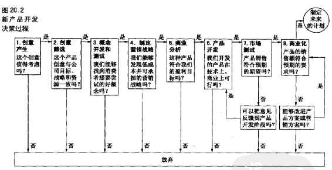
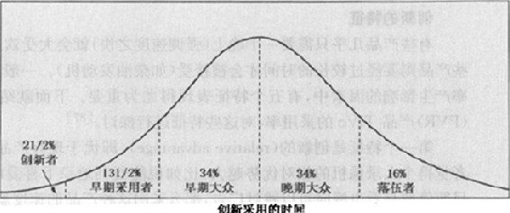
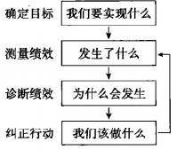
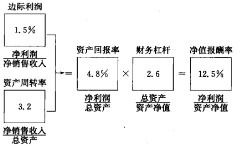

第8部分 成功地实现长期成长
--------------------------

第20章 推出新的市场供应物

第21章 开拓全球市场

第22章 全面营销组织的长期管理

### 第20章 推出新的市场供应物

> 本章将重点阐释以下问题：

-   1.在开发新产品与新服务的过程中，公司面临着哪些挑战？

-   2.经理人员在管理新产品开发时应该采取什么样的组织结构与流程？

-   3.新产品与新服务的开发主要包括哪几个阶段？

-   4.管理新产品开发过程的最佳方式是什么？

-   5.哪些因素可以对扩散率产生影响?哪些因素对消费者采用新推出的产品或服务产生影响？

公司需要通过不断地开发新产品与新服务以及开拓新市场来增加收入。新产品开发决定着公司的未来。产品及服务的改进和更新对保持或增加公司的销售具有决定性影响。世界性的新产品与新服务可能会改变整个行业、整个企业乃至改变生活。但是，新产品与新服务开发的低成功率却意味着更多的挑战。实际上，越来越多的公司不仅在谈论创新，而且在行动中实践着各种形式的"创新"。它们正在从根本上改变新产品与新服务的开发方法。让我们来看看强生公司的情况吧。

为了提高在不断增长的医疗器械业务中，新产品获得成功的机会（或概率），强生公司做出了一系列变革：首先，通过建立向强生公司的其他单位进行融资的内部新建企业，试图在公司内部建立起动态的风险资本业务。由富有创意的团队制定商业计划，并试图赢得公司内部的风险资本的支持------来自强生开发公司（它长期以来一直对外部新建企业进行投资）和强生公司的一个或多个业务单位。强生公司同时也努力争取来自医生及保险公司的更大投入，以便提供更有力的保障，确保它所推出的每一种器械产品都是物有所值的、可行的和具有成本经济性的。例如，通过跟外科医生讨论，爱惜康内镜部（Ethicon-Endo）认识到存在这样的需求------寻找使外科手术具有更小伤害的方法。据此，爱惜康内镜部设计了新的外科小夹钳。强生公司该把本公司最成功的科学家之一任命为新设的首席科学技术官（模仿首席执行官的思路），以便鼓励强生公司的不同部门之间加强合作，并克服松散的组织结构所形成的障碍。结果，所获得的引人注目的一个成功就是：销售额达到26亿美元的Cypher药物涂层支架的推出。强生公司决不是一切从头开始，它拥有15000研发人员和63亿美元的研发预算，从而使其连续多年在新产品的成功方面都遥遥领先。但是，创新型公司是永远不会停滞不前的，而是一直探索驱动新产品成长的新方法和更好的方法。

强生公司深知新产品开发在世界器械领域中的价值。为了保证创意得以不断产生，该公司正在努力探索几个不同的研究与投资前沿技术项目。

全世界的公司都在努力探索更快、更有效的新产品与新服务的开发方法，以便开发出更好的新产品与新服务。营销者在新产品的开发中扮演着十分重要的作用------它们有助于产品创意的识别和评估，并在产品开发的每一个阶段都与研发人员和其他部门的员工进行合作。本章将详细分析新产品的开发过程。其中的许多讨论都是关于新产品、新服务和新商业模式的。在本书第21章中，将讨论营销者如何利用全球市场来实现长期成长的。

### 新产品选择

实际上，存在许多创造新产品的方式，也存在许多新产品类型。

制造还是购买

对于一家公司而言，它可以通过收购或内部开发来增加新产品。其中，收购通常有三种形式，它可以收购另外一家公司，也可以从其他公司那里购买专利权，或者从其他公司那里购买许可权或特许经营权。例如，来自瑞士的食品公司雀巢公司就是通过收购诸如三花（Carnation）、希尔斯兄弟（Hills
Brothers）、史托福（Stouffer's）、罗尔斯顿·普瑞纳（Ralston
Purina）、德雷尔（Dreyer's）冰淇淋和美厨（Chef
America）等不同的品牌来提高其在北美市场的占有率的。

虽然公司可以成功地实现很多收购，但有时可能却十分需要实现内部成长在公司内部自己开发新产品。普莱克斯（Praxair）公司曾经在康涅狄格州丹伯里（Danbury）市场上制定出雄心勃勃的目标------每年2亿美元的收入并且每年都实现两位数的销售增长。为了实现这一目标，该公司所依靠的主要途径就是靠合理的内部成长以及许多小型的、但却十分重要的500万项。

对于产品开发而言，公司可以在自己的实验室里开发新产品，也可以委托独立的研究机构或新产品开发公司来为其开发特定的新产品，或提供新的技术。像三星（Samsung）、通用电气（GE）、帝亚吉欧（Diageo）、好时（Henshey）、USB等很多公司都致力于经营新产品咨询店，以便获取新的见解和不同的观点。

新产品的类型

新产品可以是创造全新市场的世界性新产品，也可以是现有产品的微小改进或修改。当然，两者之间还存在许多其他中间类型。大多数新产品实际上都是对现有产品的改进。在索尼公司，超过80%的新产品活动都是对现有产品进行改进。在最近几年里特别成功的新的消费产品中，有些是采用了品牌延伸的方式，在现有产品的基础上成功地实现了拓展。例如，宝洁公司的汰渍纺必适（Febreze）与汰渍冷水（Coldwater）、佳洁士公司的佳洁士健康漱品（ProHealth
Rinse）和佳洁士净白牙贴（Whitestrips Premium
Plus）以及吉列的维纳斯系列。

对于许多产品大类而言，已经越来越难找到仅凭几个拳头产品就改变整个市场格局的例子了。但是，持续不断的创新往往可以更好地满足消费者的需求，从而迫使竞争对手陷于赶超游戏之中。同时，不断地推出新产品并将品牌延伸到相关的产品大类中，往往也可以扩大品牌的内涵。耐克公司开始时只是生产跑鞋，但现在却在整个体育用品市场上展开竞争，经营着各种运动鞋、运动服和运动设施。类似地，阿姆斯特朗全球工业公司（Armstrong
World
Industries）最初也只是销售地面装饰产品，后来又开始经营天花板装饰品，后来又扩展到内表面装潢业务领域。产品创新和有效的营销计划使这些公司不断地扩大自己的"地盘范围"。

在所有新产品中，大约只有不到10%\~15%真正属于创新或新问世的产品。由于它们对公司和市场来说都是崭新的，所以这些产品中往往蕴涵着非常高的成本和风险。激进创新在短期内可能会伤及公司的利润，但基于这类创新的新产品却可以创造出比普通产品更具有持续性的竞争优势。一般情况下，公司往往必须努力创造出强有力的研发及市场合作关系，以便成功实现激进创新。目前，只存在很少的可靠技术可以用来估计这类创新的需要有多大。其中，顾客焦点小组访谈往往可以提供一些关于顾客兴趣和需求的看法，但营销者也可以运用"探索与体会法"来帮助预测市场对激进创新的需求，这主要是根据观察和早期用户的使用经验反馈和其他方法来实现。

很多高科技公司都力求实现激进创新。高科技公司涉及许多行业：通信、计算机、电子消费品、生物技术和软件。高科技产品的营销者在推出新产品时往往要面临众多的挑战，如较高的技术不确定性、较高的市场不确定性、较高的竞争动荡性、较高的投资成本、较短的生命周期和为风险项目寻找资金方面存在的困难等等。

> 感知像素公司（Perceptive Pixel）

> 在2006年的新技术、娱乐和设计大会上，杰夫·翰（Jeff
> Han）通过在现场展示最优秀的新技术、娱乐和设计，展示了本公司的杰作。当手在36英寸的钻蓝色的多重触控屏幕上移动时，他赢得了像摇滚明星一样的欢迎。在他的手触摸到屏幕时，地图上的目标在扩大，轻松地处理着照片，那种感觉就像是在桌面上一样。杰夫·翰的触摸显示技术重新定义了给电脑发出指令的方法，充分利用了多个指头的运动和按压。杰夫·翰是个工程师，在产生上述发明的过程中，他只是探索了一些自己感兴趣的东西。在创建公司------感知像素公司（Perceptive
> Pixel）时，他指出，我只是想要营造一种自己能够创造新技术的环境，然后把新技术委托给其他人，让他们把技术推向市场，这样我就可以继续研究其他技术了，从而使自己持续不断地进行创新。目前，他已经面对着激烈的竞争了：微软公司也拥有自己的多重触控技术------Touch
> Light，通用医疗公司已经开始使用这种技术；三菱公司也面向商业人士成功地开发出Diamond
> Touch桌面；松下公司也开发出了壁挂式互动触摸屏。杰夫·翰还有两个优势：有着雄厚资金实力的军队顾客和可以赚更多钱的咨询和技术支持服务计划。

### 新产品开发过程中所面临的挑战

在最近几年里，新产品的推出速度已经大大加快了。在许多行业里，像零售行业、消费品行业、电子行业、汽车行业和其他行业等，把产品推向市场的时间已经缩减了一半。奢侈皮革商品制造商------路易威登（Louis
Vuitton）创建了一种名为"Pegase"的新的工厂形式，以便每六周就可以把新的样品运送到自己的精品店------这是原来产品更新频率的两倍------可以给顾客提供更多的选择。

创新的必要性

在迅速变化的经济环境中，持续创新是必不可少的。富有高度创新性的公司往往可以识别并迅速抓住新的市场机会。表20.1列出了2007年排名前25位的全球创新公司，这是基于《商业周刊》上波士顿咨询集团的调查而编制的。创新公司对创新和冒险持肯定态度，并使创新过程惯例化，倡导团队工作，允许员工进行试验甚至是失败。

表20.1 2007年排名前25位的创新公司

注释：《商业周刊》上波士顿咨询集团2007年的调查报告，是围绕创新这个主题对高层管理人员进行调查的基础上完成的。其中，问卷是在2006年10月通过互联网向世界各地的经理人发放的。在本次调查中，把问卷发放给全球最大的1500家公司（依据公司在资本市场上的价值，以美元为计算单位）负责创新的、层级最高的10位经理人员手中。同时，在调查中，也通过Knowledge®1}Wharton电子邮件时事通讯把问卷发放给身为高管的、《商业周刊》的读者，也是《商业周刊》市场顾问委员会的成员。受访者以匿名形式，并自愿决定是否参与，本次问卷调查于2007年3月截止。在本次调查中，一共包括20个关于创新的一般性问题和12个着重关注创新测评的选择性问题。最后，一共有2468位高层管理人员参与了本次调查。其中，在那些阐明自己所在区域的受访者中，有77%来自北美、12%来自欧洲、9%来自亚洲或非洲。

> 戈尔公司（W.L.Gore）

> 戈尔公司以其耐用的户外纺织品而著名。该公司在吉他弦、牙线、医疗设备和燃料电池等不同领域都有突破性的创新。该公司采用了几个指导新产品开发的原则，具体如下：第一，该公司与潜在顾客密切合作。例如，该公司的胸部移植器械就是在同医生的密切合作中开发出来的，用于治疗心脏病。第二，该公司让员工自由选择项目并指定新产品开发的领导和团队。戈尔公司积极培育激情大使（passionate
> champion）------他们有激情和能力去说服他人，让对方坚信某个项目值得付出时间和精力。例如，燃料电池的开发就是聚集了100位公司研发人员智慧的结晶（公司有6000个研发人员）。第三，戈尔公司给员工提供"个人爱好开发时间"时间。所有研发人员都可以花费10%的工作时间来发挥形成和深化自己的创意。其中，有前景的创意会被依据"真实的、赚钱的、可获胜的"（real，win，worth）原则来进行评判。机遇是否是真实的？我们能够获胜吗？我们可以赚钱吗？第四，戈尔公司清楚什么时候应该放弃。有时候，在某个领域被宣判了"死刑"的创意或技术很可能会在另一个领域中激发创新的火花。Elixir木吉他弦就是由在自行车钢索领域失败的投资所衍生而来的。实际上，即使是成功的投资项目也需要继续加以推进。戈尔公司把抗断的滑丝牙线卖给了宝洁公司，因为该公司知道零售商也愿意与一家经营一整套保健产品的企业打交道。

对于那些产品开发失败的企业而言，无异于把自己推到了"危险"的边缘。在消费者的需要和口味不断变化、技术日新月异、产品生命周期日益缩短以及本国和外国公司的竞争日益激烈的情况下，企业的现有产品会逐渐被淘汰。在这方面，新技术特别有杀伤力。柯达公司正在努力开发一种新的商业模式和产品开发过程，以便可以在数字影像领域更好地开展经营活动。柯达公司的新目标是：帮助人们组织和管理自己的个人图片库，就像苹果公司在音乐领域所做的那样。表20.2概括出柯达公司的首席执行官------安东尼奥·佩雷兹（Antonio
M Perez）的创新与变革理念。

表20.2 安东尼奥·佩雷兹的七个创新概念

-   1.通过顾客的视角来看未来。
-   2.人才和品牌是重要的资产。
-   3.使用数字技术作为创造工具。
-   4.建立冠军团队，而非一群冠军。
-   5.创新是一种心态。
-   6.速度很重要，所以要对组织进行鞭策。
-   7.如果对某事不太熟悉，那就寻找合作。

> 斯科特纸业公司（Scote Paper）

> 当斯科特纸业公司无法在盈利多的卫生纸市场上基于价格跟福特-霍华德纸业公司（Fort
> Howard
> Paper）抗衡时，它借用了一家欧洲公司的方案：大卷纸分配器。斯科特纸业公司制造更大卷的纸，并组织顾客向其提供免费的分配器，后来，该公司对纸巾产品也实施了同样的措施。斯科特纸业公司不仅在新市场赢得了顾客，而且不易遭到竞争者的攻击或模仿。就拿福特-霍华德纸业公司来说，该公司可以通过降低价格来竞争，但并不能提供更大的卷纸或者量身定做的分配器。

> 西南航空公司（Southwest Airlines）

> 西南航空公司以"进取传统"而闻名。该公司曾经采用渐进型创新来抵消重要竞争对手的创新影响------旅客里程累积计划。在20年前，美国航空公司开始实行旅客里程奖励计划来提高顾客的忠诚度。不久之后，这种计划就迅速席卷全部的大型航空公司。然而，西南航空公司决定把奖励与航行次数联系在一起，而不是与里程累积数捆绑在一起。该公司主要为商务旅客提供短途航行服务，而且这些旅客往往是同一航线上飞来飞去。显然，西南航空公司的这个项目很适合这个目标市场。

新建公司可以发明一些突破性技术，因为它们更便宜，也更有可能改变竞争格局。与此相对，对于那些已建公司而言，它们可能会反应迟钝，或者没有很强的意愿对这类突破性技术进行投资，因为这可能会威胁到它们已有的投资。然而，有一天他们可能会突然意识到自己面临着可怕的新竞争对手，而且许多公司都会遭到淘汰。为了避免上述陷讲，已建公司必须对现实顾客和非现实顾客的偏好进行认真的监控，努力去发现不断演化的、难于表述的顾客需求。

面对这些挑战，为了成功地开发出新产品，公司应该怎么做呢？在对工业产品的研究中，新产品开发专家------库珀（Cooper）和克兰施米特（Kleinschmidt）发现：成功的首要因素是独特的产品优势。需要特别指出的是：这类产品的成功率为98%，而较占优势的产品的成功率只有58%，具有较小优势的产品的成功率只有18%。另外一个关键成功因素是明确界定的产品概念。在实践中，在采取进一步行动之前，公司往往会认真地界定和评估目标市场、产品要求和相应的利益。此外，其他成功因素还包括：技术与营销的协同性、在每一产品开发阶段执行工作的质量和市场吸引力等。

> Cuts 男子健身系统（Cuts Fitness for Men）

> 有时，创造新产品或服务就意味着采纳某种成功的概念并使其能够适应不同顾客的需要。在约翰·詹纳罗（John
> Gennaro）创建Cuts男子健身系统时，他就实践了上述理念。Cuts男子健身系统在最基本的环境中给那些时间紧张的男子提供了快速全身锻炼机会。其中，在上述最基本的环境中，既不会因为面对肌肉健壮的运动员和健身奇才而感到胆怯，也不会因此而感到尴尬。Cuts男子健身系统的模式与Curves公司------全球最大的女性健身专营店------十分相似。实际上，Cuts男子健身系统运用了与Curves公司相同的要素：小的空间、基本服务、水压运动装备、30分钟的身体锻炼和口碑营销。然而，由于会员较少而且专营店2年后就倒闭了，所以詹纳罗认为应该在一些重要方面重新界定产品概念。一方面，他努力寻找具有优秀的健身和营销背景的特许经营人，然后向男人们提供他们最想要的测量其举重进步的一种方法。同时，他还增加了一些特殊的分层体育器械，以便使锻炼者可以在上面移动腿部，从而增加重量。最后，虽然人们渴望健身，但可能并不对其他人说这件事。这时，口碑传播就失效了！结果，詹纳罗不得不去联系每个专营店，并在社区进行基层推广。不过，这些改变是否有效还有待于进一步验证。在某些尝试获得成功之后，特许权人又陷入了其他麻烦当中。

库珀和克兰施米特还发现，对于仅仅为本国市场设计的国内产品而言，其失败率一般较高、市场份额一般较小、增长率也较低。相反，对于那些为国际市场（至少是为包含邻国市场）而设计的产品而言，无论在国内还是在国外，都可以获得较高的利润。然而，在他们所研究的新产品中，只有17%的产品是按照国际导向来设计的。这就意味着公司应该在设计和开发新产品时奉行国际导向。

新产品的失败

新产品的开发往往蕴涵着极大的风险。新产品开发的失败率一直很高。最近有研究表明，失败率会高达50%（在美国高达95%，而在欧洲也有90%）。

新产品开发失败的原因可能有很多，主要包括：忽视或误解市场调查研究、过高地估计市场规模、产品的开发成本较高、产品设计差、产品在市场上定位错误、没有开展有效的广告活动或对产品的定价过高、没有足够的渠道支持、竞争对手反击激烈等。此外，其他一些因素也会对新产品的开发产生阻碍作用：

 

-   在有些领域里缺乏重要的创意。能改进某种基础产品（如钢铁、清洁剂等）的方法寥寥无几。
-   过小的市场。公司必须面向较小的细分市场来销售自己的产品，但这可能会意味着较低的销售额和较低的利润水平。
-   社会和政府的限制。新产品必须保障消费者的安全和环境生态的平衡。
-   开发过程的高成本。通常，公司都必须从众多的创意中挑选出一个值得进一步开发的项目。而且，公司常常面临着不断上升的研究与开发费用、制造费用和营销费用。
-   资金短缺。许多公司不能提供或筹备创新研究和产品推广所需要的资金。
-   新产品开发完成的时限缩短。公司必须学习怎样压缩产品开发时间，具体可以应用新的设计技术、与战略合伙人共同开发、早期进行产品概念测试以及执行先进的营销计划。
-   产品生命周期缩短。当一种新产品获得成功之后，竞争者会非常快地进行模仿。索尼公司在竞争者大量仿制其产品之前，曾经享受过三年的领先时间。现在，松下公司和其他竞争者仿制其产品，往往只需要六个月的时间。因此，留给索尼公司回收创新投资的时间减少了。

表20.3 概括出新产品失败的原因。

  1.营销失败

-   潜在的市场规模很小
-   没有明显的产品差异性
-   差劲的产品定位
-   误解了顾客的需要

2.财务失败

-   低的投资回报

3.实际失败

-   上市时间晚
-   上市时间太早，市场尚未得到开发

4.技术失败

-   产品没有发挥效用
-   差劲的设计

5.组织失败

-   组织文化的不适应
-   缺少组织支持

6.环境失败

-   政府管制
-   宏观经济因素

 

但是失败可能因地域的不同而存在差异。实际上，真正的创新型公司往往会把失败作为获得成功的必要组成部分。硅谷（Silicon
Valley）的市场营销专家赛斯·高汀（Seth
Godin）坚持认为："失败不仅仅是有好处的，而且是必要的。"很多网络公司就是失败的商业投资的结果，在它们推出并改进其服务的时候，往往经历了很多次失败。Like.com是一家专门供人们查找相似衣服的网站，它的经营要比寻找相似照片的网站好多了。接着，一家宠物狗爱好者的社交网站------Dogster.com，在引起了极大关注的Pets.com破产事件之后应运而生了。实际上，就是谷歌公司也发现，自己为人们提供个性化信息服务的Google
Answers也失败了。

最初的产品的失败并不总是创意的尽头。礼来医药公司发现，90%的实验药物会走向失败。于是，该公司逐渐建立起这样的企业文化：失败是发现与探索过程中不可或缺的一部分。如果一种药物在临床实验的某个阶段中失败了，礼来公司的科学家就会去研究可能的新用途。Evista是避孕药的失败品，但却成为治疗骨质疏松的良药，年销售10亿美元。Stattera作为抗抑郁药物是失败的，但因为能够有效地治疗行为紊乱而畅销。一种本应该治疗心血管疾病的药物由于对哮喘病有效而被继续开发。

### 组织安排

今天，许多公司都采用顾客驱动工程来设计新产品。顾客驱动工程认为，把顾客偏好纳入到最后的产品设计中至关重要。

> 施乐公司（Xerox）

> 施乐公司过去也像其他公司那样开发新产品：提出创意、制作原型，然后让顾客提供一些反馈。当施乐公司的研发人员首先提出双引擎的商用打印机创意的时候，他们决定在开发产品原型之前先直接向消费者征求建议。他们这样做是很幸运的。虽然施乐公司的研究与开发团队认为顾客希望拥有第二个引擎并将其用于其他的特殊用途，但事实上第二个引擎一般只是作为主引擎失效后的"一种后备"。正如一位顾客所说的："如果引擎出问题，那什么也没了。"2007年的4月，在推出双引擎Nuvera288双面打印系统（Digital
> Perfecting
> System）时，施乐公司的首席技术长官索菲·凡德布洛克把"顾客创新"作为一个十分重要的驱动因素。现在，施乐公司相信头脑风暴或者"和顾客一起想象"的力量，并尽量使懂得技术的专家和知道"症结点"的顾客组合起来，一起探讨最有价值的产品属性可能是什么。另外，施乐公司也鼓励科学家和工程师与顾客面对面研讨，在一些情况下甚至是在现场工作几个星期的时间，以便了解顾客到底是如何使用产品的。

施乐公司经典的新型双引擎打印机是在对顾客反馈进行分析的基础上设计而成的，主要突出了具有后备引擎的商用打印机的价值。

图20.1描绘了其他三家公司是如何启动内部变革的，以便开发更加成功的新产品和实施更有效的成长方案。

 

-   在2000年，惠而浦公司启动相应的项目并致力于刺激更大的创新。该公司基于新的思维方式培训了400个来自不同岗位的员工，自从实施这项计划以来，惠而浦公司一改常态，从每年只推出很少的产品转变为每年会推出很多新产品，其中包括非常成功的Gladiator系列、工作台和车库系统等。
-   在1996年，壳牌（Shell）公司授权一个团队来分配2亿美元的资金，用于公司内部任何部门所提出的不拘一格的创意开发。在公司中，任何员工都可以做10分钟的演讲，然后有15分钟的提问与回答。通过的创意可以获得10万到60万美元的资助。其中，在12个小组中有4个组获得了为期6个月的、下一阶段的开发资助。在1999年，在壳牌公司所启动的5个最大的项目中，有4个是通过这种方法启动的。
-   1998年，三星电子公司建立价值创新项目（Value Innovation
    Program，VIP）中心。通过这种方式，把核心的跨职能团队成员聚集起来共同讨论相应的战略项目。在2003年，该中心一共完成了80个项目。三星公司每年都召开年度创新大会，并颁发最佳创意奖

图20.1 三种创新模式

新产品的开发工作往往要求高层管理人员要明确界定业务领域、产品大类和具体的标准。通用汽车公司对新汽车的投入费用为4亿美元的基准------那是使新汽车投产所需花费的成本。例如，有一家公司确定了如下所示的接受标准：

 

-   该产品在5年内可以投放到市场上。
-   该产品的市场潜力至少有5000万美元，而且要达到15%的增长率。
-   该产品至少可以提供30%的销售回报率和40%的投资回报率。
-   该产品将会取得技术领先或市场领先地位。

新产品开发的预算

高层管理人员必须确定新产品开发的预算支出。由于研发新产品的结果是非常不确定的，以至于很难按照常规的投资标准来编制预算。在这种情况下，有些公司为解决这一问题所采取的方法，就是对尽可能多的项目进行投资，并期望其中有几个项目可以获得成功。另外一些公司则采用传统的销售额百分比法，或根据竞争对手的研发水平来确定本公司的研发投资额。此外，也有一些公司首先确定到底需要多少个成功的新产品，然后倒过来估算所需要的投资费用。

表20.4列示了一家公司计算新产品开发投资成本的可行方法。在一家大型包装消费品公司里，新产品经理评审了64个新产品创意。结果发现：只有1/4的创意通过了创意筛选阶段的筛选，即最终有16个创意得到批准。在这一阶段中，鉴别每一个创意的成本是1000美元左右。然后，就进入了概念测试阶段，其中有一半的创意，即8个创意可以通过本阶段的测试。在概念测试阶段中，每一个创意的测试成本是2万美元。然后，就进入了产品开发阶段。这时，获得通过的创意只剩下4个了，每个创意的成本约为20万美元。接着，就进入到市场测试阶段，其中只有2个创意可能会通过市场测试，每个创意的测试成本约为50万美元。最后，当把这2个新产品推向市场时，每个产品的市场推出成本约为500万美元，但可能只有1个新产品可以获得很大的成功。因此，这个成功的创意大约花费了公司572.1万美元的开发费用。

在上述过程中，其他63个创意都失败了。在如上所述的64个创意里，开发一个成功的新产品总共需要花费13984000美元。除非公司能够提高通过率并减少每个开发阶段的费用，否则就需要将近1400万美元的预算来寻找一个可以成功的创意。

表20.4 寻找一个成功的新产品的估计成本（从64个新创意开始）

 

| 阶段  \| 创意个数  \| 通过比率  \| 每个产品创意的成本（美元） \|
  总成本（美元） \|
| --- \| --- \| --- \| ---   \| ---  \|
| 1.创意筛选  \| 64  \| 1:4  \| 1000  \| 64000  \|
| 2.概念测试  \| 16  \| 1:2  \| 20000  \| 320000  \|
| 3.产品开发  \| 8  \| 1:2  \| 20000  \| 1600000  \|
| 4.市场测试  \| 4  \| 1:2  \| 50000  \| 2000000  \|
| 5.推向全国市场  \| 2  \| 1:2  \| 500000 \| 10000000 \|
|             \| \| \| 5721000  \| 13984000  \|

在新产品开发实践中，新的产品成功率可能是千变万化的。发明家------詹姆士·戴森（James
Dyson）先生指出，在开发出最终的透明的、无兜真空吸尘器之前，他一共开发出5127种产品原型。后来，这种吸尘器成为美国最畅销的产品。他不会为自己的失败而伤心："如果想要发现其他人没有发现的东西，那么就很可能会做错事......思考一下'失败'为什么可以把人引入一条完全不同的道路。"

新产品开发的组织工作

公司在处理新产品开发的组织工作时往往有若干种方法。许多公司把新产品创意工作交给产品经理去做。实际上，这种制度也存在一些缺陷。例如，产品经理常常要忙于管理现有的产品线，所以他们除了对产品线的延伸给予足够的兴趣之外，往往很少有时间去构思新产品。同时，他们可能也缺乏开发新产品所必需的专业技能和知识。卡夫公司和强生公司都设置了新产品经理这一职位，并要求他们向产品大类经理汇报工作。比较而言，在另外一些公司里，则会创建一个高层的管理委员会来负责审核和批准新产品建议。大型公司常常也会设立专门的新产品部，该部门的主管往往拥有很大的实权，并与高层管理人员保持着密切的联系。对于新产品部而言，主要职责就是产生和筛选新的创意、与研究与开发部门通力合作、进行实地测试和实现商品化。

> Adobe系统公司

> Adobe系统公司是一家面向图形设计与发布的软件解决方案开发商。在2004年，Adobe系统公司组建了一个任务小组，以便识别公司的创新者在努力开发新产品过程中所而对的全部困难。通过研究，这个任务团队发现，公司组织层次阻碍了有关新销售渠道、新商业模式或者新的包装等创意的产生与提炼。公司规模变得如此之大，以至于分支办公室所产生的创意无法得到公平的对待。于是，该公司创建了新事业启动团队，负责每个季度进行一次公司最佳创意评选。其中，大约20个产品经理和其他员工（除了高层经理人员，因为禁止他们参与）被视为潜在的员工创业者，由他们进行简短的展示汇报并问答相关问趕。然后，由公司内部创业者对这些创意进行鉴别。不过，即使是一个遭到拒绝的创意，也可以要在公司的讨论网站上通过头脑风暴方式进行研讨。自从上述新事业启动团队组建以来，上述活动已成为Adobe系统公司深受欢迎的活动了一成为搜寻好创意的"美国偶像"。

-   3M公司、陶氏化学公司和通用磨坊公司等已经把新产品开发的主要工作分派给新事业团队（venture
    team）来完成。这种新事业团队是由跨职能的人员组成的，负责开发特定的产品或业务。这些"内企业家"（intrapreneur）不受其他责任的约束，并被给予一定的预算、时间期限和鼓励创新的工作环境------这是一种非正式的工作场所，有时就在车库，是内企业家团队努力开发新产品的场所。

跨职能团队能够通过协作的方式以及并行的新产品开发等途径，成功地把新产品推向市场。其中，并行的产品开发就像一场橄榄球比赛一样，而不是接力赛------所有成员都以团结协作的方式共同向目标迈进。就是通过运用这种系统，工业控制产品制造商------艾伦-布拉德利公司能够在短短的两年里就开发出新的电气控制装置，而在以前的老系统中这一过程往往需要6年的时间。当潜在客户并没有要求时，跨职能团队还有助于确保工程师不去开发没有潜在需求的、更好的"捕鼠器"。

很多领先公司在管理创新过程中应用了"阶段-门径系统"（stage-gate
System）。具体的思路是：把创新过程划为几个阶段，在每个阶段的最后都有一道门或检查点。

项目负责人要与如上所述的跨职能团队通力合作，并确保在把研发项目交给下一个阶段之前已经向每道"门"提供了一组详细资料。在从业务计划阶段向产品开发阶段过渡时，需要在对消费者的需求与利益进行研究和对竞争对手分析和技术评价的基础上，准备一份具有说服力的市场研究报告。然后，由高层管理人员根据每道"门"的标准进行审查和评价，以便判断该项目是否应该进入下一阶段的决策。在此过程中，高层管理人员的决策可能有四种：进入下一个阶段、结束项目、暂时保留、重新进行。通过运用"阶段-门径"系统，可以使创新过程变成一个可视的透明过程（对所有参与者都是可视的），而且可以明确每一阶段中项目领导入和研发项目团队的责任。

有关产品开发过程的各个阶段，如图20.2所示。许多公司都包括一系列并行的项目，一般都会经历如图20.2所示的开发过程，但每个项目在某一时间点上可能处于不同的开发阶段。这个过程就像一个漏斗：最初的时候往往有许多新产品创意和概念，经过层层筛选，最终会挑选并推出具有市场潜力的几种产品。但是，这个过程一般不是线性的，而是螺旋式的。许多企业都是利用"螺旋式的开发过程"来进行产品开发的，它们认识到回归到前一阶段的重要价值，并在继续向前推进之前尽可能对产品创意进行改进。

图20.2 新产品开发决策过程

### 开发过程管理：创意

创意的产生

新产品开发过程起始于产品创意的搜寻。有些营销专家深信，发现最可能的、未被满足的顾客需求或技术创新往往可以为公司带来最大的机会，最有可能开发出成功的新产品。新产品创意可能源自于不同团队的互动，也可能是运用激发创意产生的技术（参见"营销备忘：获得伟大的新产品创意的十种方法"。）

\@营销备忘：获得伟大的新产品创意的十种方法

-   1.举办非正式论坛，使顾客群体与公司的工程师和设计人员一起讨论问题与需求，并利用头脑风暴法寻找潜在的解决方案。

-   2.允许技术人员花费时间从事他们自己喜欢的项目。3M公司允许员工有15%的时间处理自己的事情，Rohm
    & Hass公司允许员工有10%的时间去处理自己的事情。

-   3.使顾客头脑风暴会议成为工厂参观活动的普遍特征。

-   4.对顾客进行调查：了解顾客喜欢或不喜欢本公司产品和竞争对手产品中的哪些要素。

-   5.像福禄克公司（Fluke）和惠普公司那样，对顾客"在不被人注意的情况下进行观察"或"扎营"式调查。

-   6.运用迭代回合法：让一群顾客呆在一个房间内进行讨论，识别潜在的问题；让另外一群技术人员在另一个房间里听取顾客的题，并运用头脑风暴法提出解决问题的方案。然后，立即把所提出的解决方案拿到顾客那里进行测试。

-   7.建立关键词搜索制度，定期浏览各国的商业出版物，以便获得新产品发布等方面的消息。

-   8.把参加贸易展览当作"智力信息捜寻活动"，可以仅在一个地方福到所有本行业的新产品。

-   9.让技术和营销人员参观供应商的实验室，并与供应商的技术人员一起探索现在有什么新东西。

-   10.创建创意库，并使其向众人开放，可以便利地从中获取信息。同时，也允许员工评价创意库中的创意，并为创意库提供建设性的创意。

与他人互动

在"开放创新运动"的鼓励下，很多公司正日益把注意力转移到公司的外部，以便充分挖掘和利用外部的创意源泉，其中包括来自顾客、员工、科学家、工程师、渠道商、经销商以及最高管理者甚至是竞争对手的创意。"营销视野：宝洁公司新的联系开发创新法"描述了宝洁公司在新产品开发过程中是如何坚持以外部源泉为焦点的。

\@营销视野：宝洁公司新的联系开发创新法

从2000年到2004年，宝洁公司的利润猛增了70%，达到了98亿美元，年收入几乎增加30%，达到了510亿美元。在导致宝洁公司获得巨大成功的因素中，成功的新产品功不可没，如速易洁（Swifter，一种清扫硬地板的拖把）、Mr.Clean神奇擦布（Magic
Eraser，---种清除灰尘和污渍的软垫）以及利塞鱗酸钠片剂（Actonel，---种治疗骨质疏松症的处方药）。在2005年1月，宝洁公司以540亿美元收购了吉列。但是在很大程度上，宝洁公司最近几年的成长主要是依靠该公司首席执行官雷富礼（A.G.Lafley）所说的几个"核心"------核心市场、核心品类、核心品牌、核心技术和核心能力，在这其中，创新是核心。

为了更有效地开发上述几个"核心"，宝洁公司采取了"连接开发创新"模型，即重视寻求外部创新源泉。事实上，有25%的新产品和技术是来自宝洁公司外部的。首席执行官雷富礼希望这一比例可以达到50%，即一半来自宝洁公司的实验室，一半来自宝洁公司的实验室之外。

宝洁公司在全世界范围内与相关组织和个人进行合作，系统地寻找可以改进、提高和可销售的、被证实的技术、包装和产品，这些或者是该公司自己所拥有的，或者是与其他公司合作的。为此，宝洁公司还与外部设计师建立起强有力的关系，在全世界范围内分配产品开发任务，以便增加宝洁公司所谓的"顾客意识"。宝洁公司甚至邀请约翰·奥谢尔（John
Osher，其发明了佳洁士电动牙刷）来公司任职一段时间，以便为使产品更有创意提供帮助。

为了重点关注创意的搜寻，宝洁公司还识别出10种最迫切的顾客需求和最相关的产品，以便可以充分利用现有的品牌资产或得益于现有品牌资产。同时，宝洁公司也运用了技术策略布告牌，以便反映各产品大类中的技术采用过程。通过充分运用上述来源，宝洁公司可以向政府和个人实验室以及学术和其他研究机构、供应商、分销商、竞争对手、开发和贸易伙伴、风险投资公司和个人企业家进行咨询。此外，宝洁公司也利用在线网络在整个世界范围内捜寻相关专家。

所有上述联系对宝洁公司在2年时间里成功地生产出100种新产品作出了重要贡献。例如，新的喷墨技术是意大利的伯罗格纳（Bologona）教授发明的，它可以在蛋糕上绘制出可以食用的图案。后来，该项技术成功地应用在品客（Pringles）薯片上，用于制作笑话和图片。在运用这些联系之后，宝洁公司的产品开发速度比通常快了2到3年，而且只花费了一小部分费用。结果，品客品牌以两位数的速度在成长。通过对实践的总结，宝洁公司还识别出成功的联系开发战略所必需的三个核心要索，它们分别是：

-   1.永远不要假设那些在外面随便找到的、可以马上付诸实施的创意真的可以马上付诸实施。在实践之前，往往都包括相应的开发工作，其中包括更大的风险。

-   2.不要低估所需要的内在资源的数量或质量。在任何联系开发战略的实施行动中，往往都需要配备全职的高级经理人员来进行管理。

-   3.在首席执行官发出指示之前，永远不要启动新产品开发项目。如果没有研发，联系开发战略是很难获得成功的。一般而言，联系开发战略都是一种自上而下的、公司范围内的战略。

在宝洁公司，联系开发模型似乎特别有效。在产品开发组合中，有45%的开发方案中都包括来自外部的关键要素（在外部发现的）。通过联系开发模型，宝洁公司的研发生产率增长了将近60%，与产品价格、设计、营销相关的创新也一道得到改进。一方面，创新成功率翻了一倍，创新成本反而下降了。另一方面，研发投资在销售中的比例也从2000年的4.8%下降到今天的3.4%。从2000年开始，宝洁公司的股票价格也翻了一番，宝洁公司现在拥有价值220亿美元的品牌组合。

顾客的需求和欲望是寻找新产品创意的逻辑起点。一对一访谈和焦点小组访谈都是可以用来探索产品需要和反应的有效方法。格里芬（Griffin）和豪泽（Hauser）指出，围绕每个细分市场进行10\~20次深入的体验访谈，往往可以揭示出大多数的顾客需要。但是，也存在许多其他有利可图的有效方法（参考"营销备忘：从顾客那里汲取新创意的七种方法"）。

\@营销备忘：从顾客那里汲取新创意的七种方法

-   1.去观察顾客如何使用本公司的产品。美敦力公司（Medtronic）是一个医疗设备公司，它的销售人员和调研人员经常观察使用其产品或竞争对手产品的、治疗脊椎的医生。通过这种比较，可以发现自己的产品有哪些地方需要改进。类似地，通用电气公司也通过观察资深医疗人员对产品的使用来搜集改进其CAT扫描仪的方法。

-   2.向顾客询问有关产品使用方面存在的问题。小松重型设备公司（Komatsu
    Heavy
    Equipment）把工程师和设计师派到美国和设备使用者那里共同工作6个月，目的是找出改进其产品的途径。类似地，宝洁公司在发现消费者在打开薯片袋子时很难保持太久，使薯片极易变坏以后，很快就设计了具有统一尺寸、网球状的罐装盒子薯片------品客薯片。这样的话，消费者在打开后再盖上，薯片也不会变质。

-   3.向顾客询问他们梦寐以求的理想产品是什么样的。即使在不太可能的情况下，也要问问消费者------他们想要用产品来干什么。一位70岁的相机使用者告诉美能达公司（Minolta），他想用照相机拍照使拍出来的东西比实际的还要好看，不会显示出皱纹和年龄。后来，美能达公司就生产出具有两个透镜的照相机，其中一个透镜是为了使拍出来的"相片"显得更加柔和。

-   4.利用顾客顾问委员会对公司的创意提出评论。李维斯公司（Levi's）通过让年轻消费者人组成讨论小组，共同讨论生活模式、生活习惯、价值观念和品牌契合等问题；思科系统公司则运用顾客论坛来改进所提供的产品或服务；哈雷·戴维森公司（Harley-Davidson）也从拥有公司的100万名会员中搜集有关产品的创意。

-   5.利用网络来获取新的创意。公司也可以利用诸如Technorati和Day
    Pop等搜索引擎去寻找与其商业活动相关的"博客"和"帖子"。宝洁公司的网络就设置了"我们在倾听并分享你的观点"和"建议回馈"这样的功能，以便从顾客那里获得建议和回馈。

-   6.构建品牌社区，并让那些充分热情/激情的人在那里围绕本公司的产品展开讨论。哈雷-戴维森公司和苹果公司都有很多品牌的热衷者和拥护者；索尼公司也通过与消费者的合作性对话来共同开发索尼
    Playstation
    2。乐高（Lego）公司则在产品开发的早期阶段，通过孩子及成年人的回馈来开发新产品。

-   7.鼓励顾客进行变革或改进本公司的产品，或是向顾客提出挑战以促使其进行变革或改进本公司的产品。Salesforce.com希望其用户通过简单的编程工具来开发并分享新的应用软件；国际香料香精公司（International
    Flavors &
    Fragrances）则为消费者提供了改变特定味道的工具箱，然后交由IFF公司进行生产；美商巨积股份有限公司（LSI
    Logic
    Corporation）也为消费者提供了"自助"工具箱，以便使顾客可以自行设计芯片；宝马公司也在网站上为消费者提供了工具箱，以便使顾客可以利用远程通讯业务和车载在线服务来生成创意。

传统的、以公司为中心的产品创新，目前正逐渐让位给公司与顾客共同创造产品的新环境。现在，越来越多的公司日益趋向于采用"众包"（Crowdsourcing）方式来创造新的创意，或者如本书在上一章中所讲到的，实施"顾客生成营销"活动。其中，这里所说的"群众外包"，是指邀请互联网社区的力量来帮助创造内容或软件，其中常常会涉及赏金或荣誉。这一战略有助于创造出新的产品或造就新的公司，如开源的百科全书、维基百科、大型的视频网站YouTube（被Google收购）和iStockphoto（一家微利图片库公司）。

> iStockphoto网站

> 图片摄影行业曾经一度为Getty和Corbis等大型公司所主导，它们以每张图片上百美元或上千美元的价格把一些高端图片许可给代理机构或顾客使用。那时，加拿大卡尔加里的摄影师布鲁斯·利文斯敦（Bruce
> Livingstone）开始在网上发布他的图片。只要用户通过网站交易图片，利文斯敦就决定微利出售图片，并给予摄影师40%的版税。无论是作为一家公司，还是作为自由摄影师的一种工具，iStockphoto网站都取得了巨大的成功。其中，在2006年，摄影师丽萨·刚聂（Lisa
> Gagne）是第一个销售超过50万张图片的iStockphoto网站的摄影师。现在，他每年可以制作6位数的图片。最近，Getty公司决定以5000万美元收购iStockphoto网站，而不是与其进行竞争。

除了生成新的、更好的创意以外，合作创造也有助于使顾客觉得与公司保持更近的距离，并可以通过积极的口碑营销而把自己的参与告诉其他顾客。

领先用户往往在没有征求公司同意或使用公司知识的情况下对产品进行创新，因此领先用户已成为最重要的创意源泉之一。山地自行车就是年轻人为了骑车到达山峰、然后又从山峰上骑下来而开发的。每当自行车出现故障的时候，年轻人就会着手制作更耐用的自行车，增加诸如摩托车制动器等零部件，改进悬架和附件等。也就是说，是这些年轻人开发了这些创新，而不是公司本身。实际上，对于许多公司而言，特别是对于那些想要贏得年轻人喝彩的公司而言，把领先用户纳入到产品设计过程之中都是一种明智的选择。

> Karmaloop公司

> Karmaloop公司是城市、街头服装和时尚服装最成功的零售商之一。该公司的品牌包括Triple
> Five Soul、Spiewa Soul、Kitchen Orange和Zoo
> York。在众多影响其成功的因素中，一个关键要素就是该公司已经摸索出一种有效的方法：促使领先用户指出时尚趋势、促使顾客模仿Karmaloop的服饰、实施独具特色的游击营销，甚至是设计自己的服装风格。在2006年，Karmaloop公司创造了自己的网络市场------"土民区"电子市场空间，使那些没有什么背景或无名的设计者可以通过该网站来销售自己设计的服装。其中，有些人是生产和销售自己印制图案的服装。正如Karmaloop公司创始人格甫格·塞尔凯（Greg
> Selkoe）所说的："从来就没有像现在这样离目标顾客那么近。"格雷格·塞尔凯和另外三个信息技术团队的成员共同创造并尽快完善"土民区"电子市场空间的基础设施，以便尽可能地激发顾客的新创意（并确保基础设施的发展与此保持同步发展）。为了确保公司更加合理，该网站只销售有限数量的产品，并做到很快地交付产品，从而进一步确保该公司的提供物是与众不同的。

技术公司往往可以从下列现象中受益良多：对那些在更高层次上运用本公司的产品的顾客进行研究，对那些在其他顾客之前就认识到需要对公司产品进行改进的顾客进行研究。微软公司针对网络时代13\~24岁的青少年（NetGen）进行研究，并根据他们的需求开发了能够满足即时信息需求的软件产品ThreeDegrees。

但是，并不是每个人都相信关注顾客能够有助于创造出更好的产品。就像福特的著名格言所说的如果我向顾客询问了他们需要什么，他们可能会告诉我他们需要一匹更快的马。"或者是像1960年通用汽车公司负责汽车设计的领导比尔·米切尔（Bill
Mitchell）所说的："弗兰克·劳埃德·赖特不会敲门去问他们需要什么样的房子。我所设计的、基于市场调研的好车，都不是一成不变的。"对于那些过于关注并不知道自己真正需要或可能需要什么的消费者的公司而言，最终的结果可能是导致短视的产品开发，进而错过了潜在的突破式创新。

公司员工也是改进公司生产、产品和服务的新创意的源泉。丰田公司声称，它的员工每年都会提出200万个创意（平均每人35个），并且有85%以上得到了实施。柯达公司、美利肯公司（Milliken）和其他公司也会给一年一度有最佳创意的员工提供奖金和鼓励（包括货币、度假或特殊的认可等）。诺基亚公司把最少有十项专利的工程师招聘到"Club10"中来，由首席执行官约尔马·奥利拉（Jorma
O Uila）主持颁奖仪式，并对他们进行奖励。

公司也可以通过激励员工向创意经理提供创意，当然，该经理的名字和电话都是众所周知的。同时，内部的头脑风暴活动，如果组织得适当的话，也会很有效果。"营销备忘：如何组织成功的头脑风暴活动"提供了一些有关头脑风暴的原则。

\@营销备忘：如何组织成功的头脑风暴活动

头脑风暴活动不仅仅有很多积极的影响，而且也有不利的影响。如果处理不好，对参与者来说可能是在浪费时间。但相反，如果处理得当的话，就很可能会产生新的创意、新的见解和新的解决方案，而这些很可能都是通过其他方式无法达到的。为了保证头脑风暴组织活动的成功，专家建议组织者需要遵循如下所示的几点建议：

-   1.应该配备一位经过良好训练的主持人来引导头脑风暴活动。

-   2.参与者应该觉得自己能够自由地发表意见。

-   3.参与者应该视自己为合作者，大家朝着共同的目标迈进。

-   4.应该设立规则并遵循规则，这样的话才能确保讨论不会偏离主题。

-   5.参与者应该有适当的背景材料并进行了一定的准备，这样才能够很快进入主题。

-   6.在头脑风暴举行之前或之后的个人会议，往往是很必要的，这有助于围绕讨论主题提前开始思考和学习，或是反映在头脑风暴活动之后将会有什么变化或行动。

-   7.头脑风暴活动应该有助于澄清行动方案，让想法落到实处并带来有形价值。

-   8.头脑风暴活动可以产生很多创意，而且也有助于团队的构建，使参与者获得更多的信息并得到更大的启发。

此外，公司也可以通过对竞争者和其他公司的产品与服务进行监视而发现好的创意。它们可以获悉顾客喜欢或不喜欢竞争对手产品中的哪些方面，它们也可以购买竞争对手的产品，然后把它们拆开，最终制造出更好的产品。类似地，公司的销售代表和经销商也是好的新产品创意的来源，他们掌握着有关顾客需求和抱怨的第一手资料，往往是率先获悉竞争对手产品的最新动向的人或组织。在实践中，电子产品零售商百思买公司（Best
Buy）常常会通过风险资本家来获悉一些新建企业在做什么。

高层管理者也是新产品创意的主要来源。有些公司的领导者，如英特尔公司前任首席执行官安迪·格鲁夫（Andy
Grove）就亲自负责公司的技术创新工作。当然，新产品创意的其他来源还包括发明家、专利代理人、大学和商业实验室、行业顾问、广告代理、营销调研公司和工业出版物等。不过，虽然创意可能来自于许多不同的渠道，但各种创意是否能够受到应有的关注，还主要取决于该组织中对产品创意承担责任的那个管理者上。

创意技巧

目前，存在许多激发个体或团队创造力的技巧，下面就尝试着列举一些：

 

-   属性列举法：列出一个产品的各种属性（如螺丝刀），然后对每一个属性进行修正。如对一把螺丝刀而言，可以考虑把木柄改为塑料柄、提供旋转力、增加不同的螺丝刀头等。
-   强制关联法：将几个不同的创意排列出来，然后考虑每一种创意与其他创意之间的关系。例如，在设计新的办公用具的时候，可以考虑对桌子、书橱和文件柜分别进行构思。然后，再去考虑设计一种连着书橱的书桌，或一种带有文件柜的书桌，或是一种包括文件柜的书橱。
-   形态分析法：这种方法往往是从一个问题出发，如"通过动力运输工具把一个物体从一个地方运送到另外一个地方"。那么就需要考虑几个不同的维度，如平台的种类（汽车、椅子、吊索和底座），介质（空气、水、油、铁轨），动力来源（压缩空气、电动机、磁场）。然后，可以发挥自由联想，尽量列出所有可能的组合，这样往往可以获得许多新的解决方案。
-   逆向假设分析：列出所有的正常假设，然后再从逆向进行思考。假设饭店有菜单、提供食物并收费，然后再反过来重新思考逆向的假设。通过这种方法，新饭店可能会决定只供应厨师当天早上所买、所做的饭菜，也可能是根据顾客在店堂的停留时间来决定应该提供的食品和收取的金额，还可能设计成外国情调并允许顾客自带酒菜（只提供可以出租的吃饭场所）。
-   新情境分析：列举一些熟悉的流程，如面向人提供的护理服务，然后把相关流程应用到新的环境中来。想象一下为狗或猫（而不是人）提供护理服务的情况，如减少压力、心理疗法、动物葬礼等。再举一个例子，设想酒店不需旅客去前台进行登记，而是在路边就开始欢迎旅客，并利用无线设备帮助他们办理入住手续。
-   思维图法：这种方法从某个想法出发，如汽车，然后把想法写在纸上，接着去想象另外一个想法（如梅塞德斯），然后将其与前面想到的汽车联系起来，然后再去联想（如德国）。这样，每次使用一个新词深入联想。也许，在依此循环几次之后，新的创意可能就会逐渐具体化了。

图20.3 新创意之战

随着时间的推移，水平营销中逐渐产生了新的产品创意，即把两种产品概念或创意组合起来，以便生成新的供应物。下面列举了几个成功的例子：

加油站商店=加油站+食品

网络咖啡吧=自助餐厅+互联网

谷物吧=麦片+零食

健达出奇蛋（Kinder Surprise）=糖果+玩具

索尼随身听=音频+便于携带

创意筛选

在进行创意筛选的时候，公司应该努力避免两种错误。其中，所谓误舍错误（DROP-error）是指公司错过了好的创意。实际上，对别人的创意进行挑剔是很容易办到的（如图20.3所示）。一旦想起来自己曾经差点舍弃某些后来获得巨大成功的创意时，或是意识到自己曾经放弃了很好的创意时，有些公司往往就会感到不寒而栗。下面是一个热播电视《老友记》的案例。

> 《老友记》（Friends）

> NBC的情景喜剧《老友记》经历了10年（1994\~2004年）的热播，已成为每年电视剧收视率排行榜上的常青树。但就是这部喜剧，曾经一度差点被扼杀了。根据一份NBC的内部研究报告，该剧试播时所得到的评价是"无趣、愚笨、毫无创意"，评价等级为不及格，在实施百分制的情况下只得了41分。但具有讽刺意味的是：更早一些播出的情景喜剧《宋飞正传》（Seinfeld），也曾被评价为较差，而医院剧《急诊室的故事》得了91分。康特妮·考克斯（Courtney
> Cox）扮演的莫妮卡（Monica）是《老友记》中获得测试观众打分最高的人物，而面莎·库卓（Lisa
> Kudrow）和马修·佩里（Matthew
> Perry）却只获得刚刚及格的分数。瑞秋（Rachel）、罗斯（Ross）和乔伊（Joeyi）这些人物获得的分数则更低。在被采访的35岁以上的成年人观众中，多把这些人物描述成"自满、肤浅和过于专注自身利益"。

当公司容许一个有错误的创意投入开发并进入商品化阶段时，就发生了误用错误（Go-error）。在发生产品的绝对失败（absolute
product
failure）的情况下，不仅会给公司造成财务损失，而且销售成本和变动成本也无法收回。在发生产品的部分失败（partial
product
failure）的情况下，虽然给公司造成了一定的财务损失，但销售额往往可以弥补全部的变动成本和一部分固定成本。在发生产品的相对失败（relative
product
failure）的情况下，虽然也会给公司带来一定的利润，但所带来的利润水平却往往低于公司正常的目标回报率。

对创意进行筛选的目的，就是尽可能早地放弃错误的创意。其理由是：随着产品开发项目的继续，在每个后续开发阶段所发生的成本都会大幅度提高。在大多数公司里，都要求采取一种标准的表格来描述新产品创意，以便于新产品委员会进行评价和审核。在这种表格中，需要详细描述产品的创意、目标市场、竞争状况以及经过粗略估计的市场规模、产品价格、开发时间和成本、制造成本和回报率等。

然后，执行委员会就根据一组既定的标准来核查每一种新产品创意。产品能够满足市场的需求吗？它提供了优越的价值吗？它有明显的优势吗？可以通过公司对其独特性进行有效宣传吗？公司有必需的专有技术和资本吗？新产品能够实现预期的销售量、销售增长和利润吗？实际上，为了深入而真实地揭示出市场现状，努力获取消费者的反馈往往是必须要做的一项重点工作。

对于经过筛选以后保留下来的创意，管理人员可以利用如表20.5所示的指数加权法进行比较。其中，表中第一列内容表示把产品成功地导入市场所必需的因素，第二列给出了表明相对重要性的权重，第三列是运用从0到1.0的刻度给产品创意进行打分（1.0是最高分）。最后一步是使每一成功因素的权重和本公司的能力水平相乘，从而得到公司成功地把这种产品导入市场的能力总分。在本例中，产品创意的最终得分是0.69，是一个"较好的创意"。上述评价工具的目的，就是为了促进对产品创意的系统评价和讨论。不过，它并不能取代管理人员的决策。

表20.5 产品创意评价工具

  \| \| \| \| \| \| --- \| --- \| --- \| --- \| \| 产品成功的必要因素 \|
相对权重a \| 产品得分b \| 产品评价a\*b \| \| 产品的独特优点 \| 0.40 \|
0.8 \| 0.32 \| \| 离的绩效成本比率 \| 0.30 \| 0.6 \| 0.18 \| \|
高的营销资金支持 \| 0.20 \| 0.7 \| 0.14 \| \| 很少有强大的竞争对手 \|
0.10 \| 0.5 \| 0.05 \| \| 合计 \| 1.00 \| \| 0.69 \|

注：在评价量表中，0.00~0.30为差，0.31~0.60为尚可，0.61\~0.80为佳。其中，最低可接受水平为0.61。

随着新产品创意的产生、筛选以及产品开发过程的持续进行，公司可能需要持续不断地对其总的成功概率进行评价，一般可以采取下列公式：总成功率=技术完成率X在技术完成率确定以后的商业化率X在商业化率确定以后的经济成功率。

例如，如果上述这三个比率的估计值分别是0.50、0.64和0.74，那么所计算的总成功概率就是0.24。然后，公司就需要判断这一成功概率是否达到了足够高的水平（以便确保把开发活动继续下去）。

### 开发过程管理：从概念到战略

公司还必须把富有吸引力的创意提炼成可以进行测试的产品概念。其中，产品创意（product
idea）指的是本公司可能向市场提供的产品；产品概念（product
concept）是用消费者的语言所描述的、更为详细的产品构思。

概念开发和测试

概念开发

让我们用下面的例子来说明概念开发。有一家大型食品加工厂找到了这样一种创意：往牛奶中添加一种粉状物，以便增加营销价值和改善产品的味道。上面所描述的，就是产品创意。然而，消费者不会购买产品创意，他们要买的是产品概念。

一种产品创意可以转化成几种产品概念。首先，要问的问题是谁将使用这种产品？这种牛奶添加粉的对象是婴儿、小孩、少年、青年、中年人还是老年人；笫二，这种产品的主要益处是什么？口味、营养、提神还是强身健体？第三，消费者会把这种产品作为什么？早餐、上午点心、午餐、下午点心、晚餐还是夜宵？通过思考和回答上述这些问题，公司可能会生成以下几种产品观念：

 

-   概念1：一种快速的（即时的）早餐饮料，使成年人很快得到营养，而且并不需要专门的准备。
-   概念2：---种可口的快餐饮料，供孩子们中午饮用提神。
-   概念3：---种康复补品，适合于老人夜间就寝前饮用。

上述每一种概念都代表着一种产品的类别概念（category
concept），它们将会对产品的竞争产生重要影响。其中，快速的（即时的）早餐饮料必然会与火腿和鸡蛋、早餐麦片、咖啡茶点和其他早点相互竞争；可口的快餐饮料将会与软饮料、水果汁和其他饮料相互竞争。

假定快速的（即时的）早餐饮料概念看上去是最好的。那么下一项任务就是明确地搞清楚该产品与其他早餐产品之间的竞争关系，即定位。其中，感知图（perceptual
map）就是这样一种工具，它可以清晰地表明消费者的感知和偏好，而且可以定量地刻画出不同的市场形势以及消费者从不同的角度如何看待不同的产品、服务和品牌。通过列出消费者对品牌感知的偏好，营销者可以发现未被满足的消费者需求，即发现市场漏洞或市场机会。

图20.4（a）利用成本和准备时间这两个维度来描述了早餐饮料的产品定位图。快速的（即时的）早餐饮料的特点是购买者觉得既便宜、又方便（准备时间短）。离它最近的竞争产品是冷麦片或速成早餐，离它最远的竞争产品是火腿和鸡蛋。这种比较有助于把产品概念推向市场。

然后，就需要把产品概念转化成品牌概念（brand
concept）了。图20.4（b）是一张品牌定位图（brand-positioningmap），表明了基于消费者视角的三种早餐饮料的定位情况。实际上，在上述定位图中描绘出消费者的品牌偏好（包括现有的或期望的偏好）往往对公司产品的市场营销具有重要意义。图20.4（b）也描绘出基于消费者偏好而分成的四个细分市场，他们的偏好集中在这四个区域中。

图20.4 产品与品牌定位

品牌定位图还可以帮助公司决定产品的价格和含有多少卡的热量。其中，有三个细分市场已经被现有的三个品牌很好地满足了。因此，除非现有的某一品牌很弱或很差或市场需求很大，否则公司不会把自己和已有品牌定位得很近。最后，新品牌将定位于中等价格、中等热量或高价、高热量，以便使自己与众不同。第四个细分市场的消费者也喜欢中等价格、中等热量的产品，也就是说，这一市场可能提供最大的机会。

概念测试

概念测试是指通过符号或实体形式向目标消费者展示产品概念，并观察他们的反应。概念测试和最后的产品或体验越相似，概念测试的可靠性也就越高。产品原型的概念测试有助于避免高代价的错误，但对于有很大差异的、全新的产品而言，概念测试却是一项巨大的挑战。

在过去，制作产品原型既费时又费钱。比较而言，现在往往可以在计算机上运用快速成型技术（rapid
prototyping）来设计各种实体产品，然后制成塑料模型，并展示给潜在的消费者，然后要求他们给予评价。为了应对葡萄酒市场上短期的过量供应，肯德杰克逊酒园（Kendall-Jackson）通过快速成型技术设计了两种品牌，并迅速加以实施。最后，每个品牌都卖出去10万箱，是预期的10倍。同时，公司也可以利用虚拟现实程序来测试产品概念。虚拟现实程序是应用计算机和传感设备（如手套和眼镜）来模拟现实市场。

概念测试是向消费者展示详细的产品概念。在上面有关牛奶的例子中，一种产品概念是添加在牛奶中的粉状物，可以制成速食早餐，它不仅可以给消费者提供一天的营养，而且美味可口、操作简便。这种产品主要有三种口味（巧克力味、香草味、草莓味），装成小包，每盒6包，每盒售价2.49美元。

在收到这些信息以后，调研者通过让消费者对下列问题做出反应来测量产品的维度：

-   1.可传播性和可信度：是否已清楚该产品的概念并相信它所带来的利益？如果得分较低的话，那么就需要重新提炼或修订这一产品概念了。

-   2.需求水平：是否认为该产品解决了自己的某个问题、满足了某一需要？需求越强烈，则潜在消费者的兴趣也就越高。

-   3.差距水平：目前，是否有其他产品可以满足这一需求，并使自己满意呢？一般而言，差距越大，潜在消费者的兴趣也就越高。需求水平可与差距水平相乘，所得的乘积代表着需求差距分数：需求差距分数越高，潜在消费者的兴趣也就越高，意味着其强烈的需求还无法被现有的产品所满足。

-   4.感知价值：相对于价值而言，价格是否合理？感知价值越高，潜在消费者的兴趣也就越高。

-   5.购买意图：是否（肯定、可能、可能不、肯定不）会购买这种产品？对于那些在前三个问题的答案中给出积极回答的消费者而言，其购买意图很可能就是"肯定购买

-   6.用户目标、购买时间和购买频率：谁可能会使用这一产品？什么时候？以什么频率？

被调研者的答案将表明：对于消费者而言，这一产品概念是否具有广泛的、强大的吸引力、它会与哪些产品展开竞争、哪些消费者是最好的目标顾客。同时，还可以把需求差距水平和购买意图同该产品大类的平均水平进行比较，以便看出这一产品概念是能够获得成功、存在较大的风险还是彻头彻尾的失败项目。例如，某食品制造商坚持的原则是：对于"肯定要购买"项的得分低于40%的产品概念，一律放弃。

联合分析法

消费者对不同产品概念的偏好，可以采用一种日益广泛使用的技术------联合分析法（conjoint
analysis）来衡量。联合分析法是根据消费者对某一产品属性的不同性能水平的偏好来推断出该产品的效率价值的一种方法。目前，联合分析法已逐渐成为最为流行的一种概念开发与测试工具。例如，万豪国际酒店集团就利用这种方法来设计其万怡酒店（Court
yard）的概念的。

在运用联合分析法时，通过向被测试者展示不同的假设供应物------产品属性在不同性能水平下的各种组合，然后要求他们根据偏好对各种供应物进行排序。这样，管理人员就可以根据结果来识别出最有吸引力的产品供应物，并估计市场份额和利润水平。格林（Green）和温德（Wind）曾以开发一种新的家用地毯清洁工具为例（如图20.5所示），说明了这种联合分析技术。假设新产品营销人员正在考虑下列五个设计因素：

 

-   三种包装设计（A、B、C）；
-   三种品牌名称（K2R、Glory、Bissell）；
-   三种价格（1.19美元、1.39美元、1.59美元）；
-   是否要"好管家"标识（是、否）；
-   是否要退款保证（是、否）。

图20.5 联合分析技术举例

尽管调研人员可以形成108种可能的产品概念（3X3X3X2X2），但要求消费者对108种可能进行排序显然就太多了。在这种情况下，让被调研者对其中的几个样本------如18种产品概念------进行比较参考往往是可行的，让消费者根据自己的偏好程度将它们排列出来，从最不偏好的到最偏好的。

现在，营销者可以利用统计程序来计算这五种属性的效用函数，如图20.6所示。对效用的衡量范围为0\~1。效用水平越高，也就是顾客在这一属性水平上的偏好就越大。对包装来说，B产品的包装是消费者最为偏爱的，其次是C，最后是A（A几乎没有效用）。对品牌名称的偏好次序是：Bissell、K2R和Glory。在定价方面，消费者的效用与价格成反比。"好管家"标识是较受欢迎的，但它不能增加较多的效用，因此不值得花费很大精力去做。此外，退款保证则显示出很强的偏好。

图20.6 基于联合分析的效用函数

因此，最合乎消费者需求的产品是：外型设计是B，品牌名称是Bissell，售价是1.19美元，有"好管家"标识，有退款保证。同时，我们还可以进一步确定对于顾客而言各个属性的相对重要性水平。其中，属性的相对重要性表示了各个属性从高（效用最大）到低（效用最低）的效用差异水平。效用差异水平越大，该属性的重要性也就越大。显然，该顾客认为最重要的属性是价格和包装设计，然后是退款保证和品牌，最后是"好管家"标识。

在从大量的目标顾客样本那里收集到有关其偏好的数据以后，就可以利用这些数据来估计特定供应物的潜在市场份额了。当然，前提是在假设竞争对手会作出什么样的反应的情况下进行估计。然而，由于成本方面的原因，该公司可能并不想把最有可能实现最大市场份额的产品推向市场。而最有吸引力的产品往往未必是盈利性最高的产品。

在有些条件下，调研人员并不是对每种产品进行全方位的描述，而是同时对两个因素进行描述。例如，他们可能会向被测试者展示有三种价格水平和三种包装类型的桌子，并询问他们在这些组合中，他们最喜欢哪一种、次佳选择是什么，依次类推。然后，再向他们展示包括另外两个总量的桌子，并请他们作出权衡决策。其中，权衡法是在有许多总量和可选方案的情况下比较容易实施的一种有效方法。然而，由于被测试者一次只关注两个总量，这与真实情况存在较大的差距。适应联合分析法是一种混合数据采集技术，可以把自我显现的重要性评价与配对权衡任务很好地组合在一起。

营销战略的制定

在概念测试结束之后，新产品经理将会着手制定把该种产品投放市场的初步营销战略计划，该计划主要包括三个部分的内容。其中，第一部分描述的是目标市场的规模、结构和行为、产品定位、销售量、市场份额以及最初几年的利润目标：

速食早餐饮料的目标市场是有孩子的家庭，他们能够接受新的、便利的、有营养的、便宜的早餐方式。该产品品牌在市场上将定位为收取较高价格和具有较高质量的速食早餐饮料。公司的最初目标是销售50万箱或占有10%的市场份额，在第一年的亏损不超过130万美元，第二年的目标是销售70万箱或占有14%的市场份额，计划盈利220万美元。

该项营销战略的第二部分描述的是产品的计划价格、分销战略和第一年的营销预算：

该产品包括巧克力、香草和草莓3种口味，被包装成小包装，一盒6包，每盒2.49美元。每箱48盒，批发给中间商的价格是每箱24美元。在最初两个月，经销商每购买4箱就可以额外得到赠送一箱，外加合作广告补贴。免费样品将挨户赠送，报纸上的广告附有抵扣20美分的优惠券。总的促销预算为290万美元，广告预算为600万美元，并将以对半的比例在全国和本地市场进行分配。其中，2/3的费用用于电视，1/3的费用用于报纸。而且，广告文稿中应该着重强调营养和便利的利益概念。广告宣传概念将以饮用速食快餐饮料之后变得身体日益强壮的小男孩为中心。第一年营销调研将花费10万美元，用于购买商店审计资料和消费者样本的信息，以便观察市场反应和购买率。

该项营销战略的第三部分内容描述的是长期销售量和利润目标以及不同时间的销售战略组合：

该公司希望最后获得25%的市场份额和实现12%的税后投资回报率。为了达成这一目标，产品质量的起点要高，并随着时间的推移，通过技术研究而对产品不断进行改进。在刚刚投放到市场时，实施高位定价，然后逐渐降低价格，以扩大市场份额和对抗竞争对手。总促销预算每年递增20%左右，初期广告费与促销费的比例为65：35，最后逐渐演变成50：50。在第一年之后，营销调研费将削减到每年6万美元。

商业分析

一旦管理人员开发了产品概念并制定了营销战略，下面就可以对这个提议的商业吸引力进行评价了。管理人员必须通过预测销售情况、成本和利润情况来确定该种产品是否能够满足公司的目标。如果符合公司目标，那么就从产品概念阶段进入到产品开发阶段。随着信息时代的到来，商业分析阶段也将经历进一步的修订与补充。

估计销售总量

估计销售总额是估计的第一次销售量、重置销售量和重购销售量的总和。销售估计方法的选用，往往取决于是一次性购买的产品（如订婚戒指、退休住房），还是属于非经常性购买的产品，或是经常性购买的产品。对一次性购买的产品而言，开始时的销售量会逐渐上升到顶峰，然后伴随着潜在购买者数量的减少，其开始下降并逐渐趋于零，如图20.7（a）所示。如果新的购买者不断进入市场，那么该曲线一般不会下降到零。

对于非经常购买的产品而言，如汽车、烤面包炉和工业设备，往往会出现重置周期，这既受到实体产品磨损的影响，又会受到不断变化的样式、属性和性能等因素的影响。这类产品的销售预测，往往要求分别作出首次销售量和重置销售量的估计，如图20.7（b）所示。

对于经常性购买的产品而言，如非耐用消费品和非耐用工业品，往往呈现出如图20.7（c）所示的产品生命周期以及销售量的变化。最初是首次购买人数逐渐增加。然后，随着未购买该产品的人数（假设人口数量是既定的）的减少，销售量会逐渐降低。如果该产品能够使某些顾客深感满意，那么他们还会重复购买。最后，销售曲线会落在相对稳定的水平上，即代表着稳定的重复购买量。此时，该产品就不再属于新产品的范畴了。

图20.7 三类产品在产品生命周期不同阶段的销售量变化

在估计新产品的销售量时，管理人员的首要任务是估计新产品在各个阶段的首次购买量。在估计重置（或更新）购买量时，管理人员必须研究产品的生存年限分布（survival-agedistribution），即在第一年、第二年、第三年里出现故障产品的次数，依次类推。其中，分布表中的最低点表明了第一次出现重置（或更新）销售的情况。由于在产品实际使用之前往往很难估计重置销售量，所以有些制造商在开始推出新产品时，只以首次销售量作为估计的基础。

对于经常性购买的新产品而言，卖方不但要估计首次销售量，而且还要估计重复销售跫。高重复购买率意味着顾客对该产品很满意，即使在所有的首次购买行为都发生之后销售量可能还处在较高的水平上。同时，卖方还应该注意在不同类型的重复购买人群中的重复购买率：谁购买一次、两次或三次等。有些产品和品牌在上市一小段时间之后（重复购买几次之后），就退出了市场。

估计成本和利润

由研发部门、制造部门、营销部门和财务部门将共同对相关成本进行估计。表20.6以速食早餐饮料为例，阐明了该产品的销售量、成本和利润情况（五年的预测情况）。

表20.6 预计五年的现金流置表（单位：千美元）

  \| \| \| \| \| \| \| \|  \| --- \| --- \| --- \| --- \| --- \| --- \|
--- \|\
\| \| 第0年 \| 第1年 \| 第2年 \| 第3年 \| 第4年 \| 第5年 \| \|
1.销售收入 \| 0 \| 11889 \| 15381 \| 19654 \| 28253 \| 32491 \| \|
2.销售成本 \| 0 \| 3981 \| 5150 \| 6581 \| 9461 \| 1080 \| \| 3.销售毛利
\| 0 \| 7908 \| 10231 \| 13073 \| 18792 \| 21611 \| \| 4.开发成本 \|
-3500 \| 0 \| 0 \| 0 \| 0 \| 0 \| \| 5.营销成本 \| 0 \| 8000 \| 6460 \|
8255 \| 11866 \| 13646 \| \| 6.分摊的管理费用 \| 0 \| 1189 \| 1538 \|
1965 \| 2825 \| 3249 \| \| 7.贡献毛利 \| -3500 \| -1281 \| 2233 \| 2853
\| 4101 \| 4716 \| \| 8.补充贡献 \| 0 \| 0 \| 0 \| 0 \| 0 \| 0 \| \|
9.贡献净额 \| -3500 \| -1281 \| 2233 \| 2853 \| 4101 \| 4716 \| \|
10.折现贡献 \| -3500 \| -1113 \| 1691 \| 1877 \| 2343 \| 2346 \| \|
11.折现现金流累计计 \| -3500 \| -4613 \| -2922 \| -1045 \| 1298 \| 3644
\|

其中，第1行显示了在5年里每一年的预计销售收入。该公司预计第1年的销售收入为1188.9万美元（约500000箱，每箱24美元）。这一销售预计是建立在一组假设的基础之上的：有关市场增长率、公司市场份额和工厂实际价格的假设等。第2行表明了销售成本，它接近于销售收入的33%。这一成本是通过估计平均每箱人工、原材料和包装等成本的基础上而得出的。第3行表明了期望的销售毛利，它等于销售收入与销售成本之差。

第4行表明了预期的开发成本为350万美元，其中包括产品开发成本、营销调研成本和制造开发成本。第5行表明了这5年的营销成本，包括广告宣传、促销活动、营销调研、销售人员支出和营销管理费用等。第6行表明了这种新产品所分摊的管理费，包括管理人员的工资、暖气和用电等等。

第7行为贡献毛利，它是销售毛利减去前3项成本之差。第8行是补充贡献，它列出了由于新产品导入而引起的公司其他产品的收入变化。伴生收入（dragalmig
income）是指由于在产品线上增加了这种产品之后，使公司其他产品所增加的额外收入；拼并收入（cannibalized
income）是指由于在产品线上增加这种产品之后，使公司其他产品所减少的收入。表20.6没有补充贡献。第9行表明了贡献净额，这与毛利完全一样。第10行表明了折现贡献，即每项未来贡献以每年15%的折现率折现后的现值。如果公司直到第5年才收入471.6万美元，如果该公司资金每年能赚到15%的回报率的话，那么这个金额在今天只相当于234.6万美元。

最后，第11行表明了折现的现金流量累计，它是第10行每年贡献的累汁。一般而言，人们主要对两件事感兴趣。其中，第一件是最大的投资损失，即该计划可能造成的最高损失是多少。我们看到，公司的最大损失为461.3万美元（第1年）；如果公司停止该项计划，那么此数额就损失了。第二是回收期，即公司回收包括15%的内部报酬率在内的所有投资的时间。在这个例子中，回收期约为三年半的时间。因此，管理人员必须决定能否接受"承受460万美元的最大投资损失和等待三年半才收回全部投资"的风险。

当然，公司也可使用其他财务方法来评估某新产品项目的价值。其中，最简单的方法就是盈亏平衡分析法（break-even
analysis），即管理人员估算出该公司应该销售出多少产品才能够在既定的价格和成本结构上实现盈亏平衡。如果管理人员认为至少能卖到保本点的数量，那么就应该把该项计划落在实处，进入新产品的实际开发阶段。

最复杂的方法是风险分析法（risk
analysis）。在这里，在假设的营销环境和营销战略下，在计划周期内，我们可以获得有关影响利润的、每个不确定总量的二种估计（乐观估计、悲观估计和最可能估计）。计算机模拟各种可能的结果，并计算出可能的报酬率及其分布范围。

### 开发过程管理：从开发到商品化

到目前为止，这个产品还只是一段语言描述、一张图样或一个非常原始的模型。在下个阶段------产品开发阶段往往需要大量的投资。相比之下，前面的创意成本要小多了。在这一阶段里，要解决的问题是产品创意能否转化为在技术上和商业上都可行的实际产品。如果失败了，公司除了会在这一过程中获得一些有用信息之外，所做的累积投资将会彻底损失掉。

产品开发

把目标顾客的要求转变成实际产品原型的工作，就称为质量功能展开（quality
function
development，QFD）。这种方法将把市场调研所获得的各种顾客属性（customer
attributes，CA）罗列成具体的清单，然后将其转化为工程属性（engineeringattributes，EA），以便供工程师使用。例如，潜在卡车的用户可能希望获得一定的加速度（CA），而工程师就可以把这一需求转化为所必需的马力或其他工程量值（EA）。同时，这一方法也有助于进行权衡和测量满足顾客需求的成本。实际上，质量功能展开的一项主要贡献就在于：它增进了营销人员、工程师和制造人员之间的沟通。

实体原型

研究开发部门将会围绕某一产品概念开发出一种或几种实体原型，其工作目标是找到满足下列标准的一种产品原型：产品概念声明中所描述的关键属性都体现在原型当中；在正常使用和正常条件下，该原型能够安全地执行其功能；能够在预算的制造成本约束下生产实际的产品。在过去，开发和制造成功的原型可能要花费数日、数周、数月甚至数年的时间。现在，网络技术加快了如上所述的原型制作过程，而且还产生了更为灵活的开发过程。此外，复杂的虚拟现实技术也加强这一过程。例如，通过虚拟方式来设计和测试产品设计，公司可以灵活地对所获取的新信息作出反应，并且能够迅速地探索各种行动方案，以便更好地应对不确定性。

> 波音公司（Boeing）

> 波音公司是在完全数字化的基础上设计出波音777飞机的。工程师、设计师和500多家供应商在没有必要利用设计图纸的情况下，完全在一个特殊的计算机网络上完成了全部设计工作。通过广域网把项目的合作者联系起来，从而使它们可以随时交流和交换意见，并在各自的工作场所共同完成这一产品设计。基于计算机的人工智能技术可以在计算机屏幕上绘制出完美的三维图画设计，并显示出人工（技工）维修保养工作的难度。这种计算机模型允许工程师纠正设计错误------否则，只有等到人们开始制作实体原型之后才会发现可能的错误。由于避免了在实体原型工作时发生错误所耗费的时间和成本损失，所以开发时间和返工时间减少了60%\~90%。

实验室的科学家不仅要设计产品的功能特性，而且还要知道如何通过实体暗示来传播其心理含义和品牌形象。消费者对不同颜色、尺寸和重量有什么不同反应?在漱口水的例子中，黄色象征着"防腐"的效用，红色象征着"清新"的效用，绿色则象征着"凉爽"的效用。营销人员要告诉实验室人员：消费者需要什么样的产品品质以及是如何判断这些品质的。

顾客测试

在制作好新产品原型之后，就必须在最终投放到市场之前进行一系列的功能测试和顾客测试。阿尔法测试（alpha
testing）是指在公司内部测试产品，以便观察它在不同应用环境中的具体表现如何。在对产品原型进行进一步提炼以后，公司就进入了面向顾客的贝塔测试（beta
testing）。

消费者测试可以采用多种方式进行，从"把消费者带入实验室试验产品"到"送样品上门试用"。例如，宝洁公司设立了现场实验室，如在尿布测试中心，母亲可以把他们的孩子带来测试产品。为了开发封面女郎（Cover
Girl）唇膏，宝洁公司邀请了500个女性每天早上来试用口红，记录她们的活动并让她们8小时后再回来，以便测量残留唇膏，并生产了有鲜艳的唇膏管、不用照镜子就可以抹的唇膏。家庭产品测试也广泛地应用在从风味冰淇淋到新器具等不同类型的产品上。当杜邦公司开发新的合成地毯时，它为许多家庭提供了免费地毯。作为交换条件，这些用户要反馈他们对地毯的看法，喜欢哪些属性以及与不喜欢哪些地方。

那么应该如何评价顾客的偏好呢？排序法（rank-order）要求消费者排列出他们自己的选择；配对比较法（paired-comparison）则给出几对不同的选择，让消费者在每对选择中选择自己所偏好的那一对；单元分等法（monadic-rating）要求消费者根据等级量表，对每种产品的喜好程度进行打分，以便营销者可以推断出顾客的偏好排序和偏好水平。

市场测试

在管理人员对产品功能和心理性能表示满意之后，就需要给新产品准备确定的品牌名称和包装设计了，然后就进入到市场测试阶段，在一种更可信的环境中进行测试，营销者可以了解市场的潜在规模以及消费者和经销商如何处理、使用和重复购买该种产品。

在实践中，并非所有公司都进行市场测试。例如，露华浓公司的一位管理人员指出："在我们的领域内，主要是不采用大规模分销的高价化妆品，我们不需要进行市场测试。当我们开发一种新产品时，如一种改良的液体化妆品，因为我们十分熟悉这个领域，所以我们知道它会畅销。而且，我们在百货商店里还有1500名示范者在进行促销。"然而，大多数公司都深信市场测试能够获得许多有价值的信息------关于购买者、经销商、营销方案的有效性、市场潜力等方面的重要信息。因此，主要问题是要搞多少次市场测试以及选用哪一种方式进行测试。

一方面，市场测试的次数会受到投资成本和风险的影响；另一方面，也会受到时间压力和研究成本的影响。对于高投资一高风险的产品而言，由于失败的概率很大，所以进行市场测试是值得的，市场测试成本在项目中只占有微不足道的比例。与某些改良产品（如另一种牙膏品牌）比较而言，高风险产品------那些创造新的产品大类（如首次推出的速食早餐饮料）或具有新奇特性的产品（最早推出的含氟牙膏）往往也很值得进行市场测试。

如果由于换季或竞争者即将推出新产品而受到巨大的时机压力，那么市场测试的次数将会急剧减少。例如，当家乐氏（Kellogg）公司的追踪结果显示，通用磨坊（General
Mills）公司的Toast-Ems烘饼在市场测试时颇受欢迎时，家乐氏公司很快就推出了面向全国市场的营销计划------推出了自己的Pop
Tarts烘饼，并占有了很大的市场份额。公司宁可承担产品失败的风险，也不愿意使非常成功的产品面临分销或市场渗透的风险。

消费品市场测试

消费品市场测试主要是为了估计四个总量，分别为：试用、首次购买、采用和购买频率。公司希望看到所有这四个总量的水平都很高。实际上，可能是许多消费者试用，但并不重复购买；或者是高的持久采用率，但购买频率却很低（如美食家冷冻食品）。

下面是有关消费品市场测试的四种主要方法，从销售波研究法一直到测试市场法，其成本费用的水平也从低成本过渡到高成本。

销售波研究法    在实施销售波研究法（sales-wave
research）的过程中，公司开始免费向消费者提供产品试用，然后再以低价再次把该产品或竞争对手的产品提供给消费者。这样重复提供该产品3\~5次（销售波）左右，公司然后密切注意有多少消费者选择该种产品以及他们的满意程度。同时，销售波研究法也把一种或几种广告概念展示给目标消费者，以便观察广告对重复购买所产生的影响。

销售波研究法可以快速地加以贯彻，能够在竞争条件相对有把握的情况下进行，并能够在不需要完成最后的包装和广告的情况下加以实施。但另一方面，因为消费者是事先被挑选出来试用新产品的，所以销售波研究法无法表明不同的促销或诱因所促成的试用率，也无法表明品牌在贏得分销和有利的货架位置方面所发挥的作用。

模拟测试营销法    在模拟测试营销法（simulated test
marketing）中，往往要求找到30到40名熟悉品牌、符合条件的购物者，询问他们对某一产品大类的品牌熟悉度和品牌偏好。在此过程中，会邀请消费者观看简短的著名商业广告片和新的电视商业广告片或印刷版广告。其中，包括公司要推出的新产品广告片，但由于不想引起特别的注意而没有把它特别标识出来。然后，发给每个消费者一点钱并让他们到商店去选购任何产品。这样，公司就可以发现到底有多少消费者购买了新产品、有多少购买了竞争对手的品牌，从而反映出"在刺激试用的条件下本公司的广告相对竞争对手的广告的相对效果"。接着，公司会把消费者召集在一起，请他们回答购买或不购买的理由。然后，公司还会给那些未购买的消费者发放样品试用。在几个星期之后，公司会通过电话询问他们，以确定他们对产品的态度、使用情况、满意程度和重复购买意图，并同时为他们重复购买任何产品提供机会。

这种方法可以在相对较短的时间里获得相对精确的结果------有关广告效果可试用率的结果（有时还包括重复购买率），而其成本却只是真实市场测试成本的一小部分。公司可以把这种方法所获得的研究结果纳入到新产品预期模型中来，从而预测出最终的销售水平。有些调研公司就专门提供这种服务，它们往往可以对随后投放到市场上的产品的销售水平进行精确的预测，而且其精确性常常令人惊讶不已随着媒体和渠道越来越分散，只用传统营销方法来模拟市场条件以进行模拟测试营销正变得越来越难。

控制测试营销法    在实施控制测试营销法（controlled test
marketing）的过程中，调研公司会以付费的方式安排一系列商店销售新产品。一般而言，准备投放新产品的公司会详细阐明市场测试所需要的商店个数以及具体的地理位置。然后，调研公司会依照预定的计划，把产品交给参与测试的商店，负责安排货架位置、饰面的数量、产品陈列和购物点促销及定价等。销售结果能够通过商店的电子收款扫描系统而记录下来。在测试期间，公司也能够评价本地广告和促销的效果。

控制测试营销法也使公司可以测试店内各个因素所产生的影响以及有限广告对消费者购买行为所产生的影响。随后，再使用抽样调查法抽选一部分消费者，询问他们对产品的印象。公司可以不需要动用自己的销售力量，也不需要给予商业折让，也没有必要"购买"渠道。但是，控制测试营销法并不能提供有关把新产品推销给经销商的信息。此外，这种方法也很容易把本公司的产品暴露在竞争对手面前。

测试市场法    测试市场法（test
markets）是测试新消费品的终极方法，把测试产品投放到特定的、真正的市场上进行测试。公司会选定少数有代表性的测试城市，然后由公司的销售队伍努力向经销商推销该种产品，并为其争取良好的货架陈列位置。在这类市场里，公司将会像向全国市场推销那样，展开全面的广告和促销活动。测试市场法也会设法衡量不同的营销方案的市场效果，具体是通过改变在不同城市的营销方案来实现的：全面测试可能会使公司花费超过100万美元，这主要取决于测试城市的数目、持续的时间和公司需要收集的数据总量。

在实施测试市场法时，管理人员往往面临以下几个决策问题：

-   1.测试多少个城市？大多数测试都使用2到6个城市。一般而言，可能发生的损失越大、相互竞争的营销战略的数目越多、地区差别越大、竞争者对手对测试市场的干扰机会越多，所需要测试的城市数量往往也越多。

-   2.选择哪些城市？每一家公司都必须制定相应的选择标准，如具有较好的媒体覆盖面、具有可合作的连锁店和平均水平的竞争活动等。当然，所选城市的代表性如何，也是需要考虑的一个关键因素。

-   3.测试期限？市场测试的期限会从几个月到一年不等。一般而言，产品的平均重复购买时期越长，则测试所需的周期也越长。

-   4.收集什么信息？仓库发货数据能够显示出存货购买总量，但却不能说明每周的零售销量。商店审计结果往往能够显示实际的零售销最和竞争对手的市场份额，但却不能揭示购买者的特点。消费者小组访谈能够表明什么样的人正在购买什么品牌以及他们的忠诚度和转换率。购买者调查能够获取关于消费者态度、使用和满意的深层次信息。

-   5.采取何种行动？如果测试市场表现出较高的试用率和较高的重复购买率，那么营销者就应该决定面向全国市场投放新产品。如果测试市场呈现出较高的试用率和较低的重复购买率，那就反映出顾客的不满，那么就需要决定对该产品重新进行设计或采取放弃策略。如果测试市场呈现出较低的试用率和较高的重复购买率，那么就表明产品是令人满意的，但应该设法让更多的人来试用新产品，这就意味着应该加强广告宣传和促销活动。如果试用率和重复购买率都比较低的话，那么就意味着应该考虑放弃该种新产品。很多管理人员都认为，要放弃一个已经投入很多努力和关注，但本应该放弃的产品往往是一项困难的决策，这一般会导致承诺的升级。

虽然测试市场法有其固有的优势，但现在有不少公司都开始跳过测试营销阶段，并运用一些其他的市场测试方法------更快的、更为经济的测试方法。例如，通用磨房公司就喜欢把新产品推向美国国内大约25%的地区。这样，由于面积较大，因而不易为竞争者所瓦解。管理人员对零售扫描数据进行分析，往往可以获悉在最近几天里该产品的销售情况如何以及应该采取哪些必要的矫正措施。高露洁公司经常先在小的"领先国家"推出新产品。如果成功了，再推向其他国家。

组织产品市场测试

组织产品也可以从市场测试中获得好处。贵重的工业品和新技术通常要进行阿尔法测试（公司内部）和贝塔测试（围绕公司外部的顾客展开）。在贝塔测试中，公司的技术人员会观察这些测试顾客是怎样使用该产品的，以便发现在安全和服务方面未能预见的一些问题，并收集有关顾客培训和顾客服务方面的信息。同时，公司还能观察到在顾客的运营中该设备到底添加了多少价值，以作为后期制定价格决策的依据。

在测试结束之后，公司往往会要求测试顾客阐明自己的购买意图及其他反馈/反应。由于贝塔测试中只选择少量的顾客来进行，而且测试顾客也不是通过随机方式抽取的，会根据每一个测试的情况对测试进行一定的调整，所以公司必须非常仔细地研究测试结果。此外，另一个风险是：如果被测试顾客对产品效果印象不佳，往往会向外界发布不利的产品信息。

在组织产品领域中，得到普遍应用的第二种市场测试方法，就是在贸易展览会上推出并介绍新产品。公司可以观察到购买者对新产品的兴趣有多大，他们对新产品的各种属性和销售条款有什么样的反应以及到底有多少购买者表明了购买意图或签订了订货合同。

新的工业产品还可以在分销商与经销商的展览室中进行测试，可以把该新产品放在本公司其他产品和竞争对手的产品的旁边。通过这种方法，可以获得在产品正常销售环境下有关顾客偏好和定价等方面的信息。其缺点是有些顾客可能想要订货，但当时却无法满足其需求，而且进入展览室的那些顾客也未必代表着目标顾客。

有些工业品制造商往往倾向于使用完全营销测试法。它们生产和供应数量有限的产品，并让销售队伍在限定的地区进行销售，同时给予销售支持和提供印刷版产品目录。

商品化

如果公司决定对该产品实施商品化，那么它将面临最高的成本。此时，公司必须建立或租赁全套生产制造设施或与制造商签订制造外包协议。同时，另外一项主要成本是市场营销成本。为了把一种重要的、新的包装消费品投放到全国市场上，第一年花费在广告、促销和其他营销沟通方面的成本大约为2500万到1亿美元左右。例如，如果把新的食品投放到市场上，那么在第一年的营销费用往往要占销货额的57%左右。大多数的新产品营销活动都要依赖于一系列组合的营销沟通工具。

何时（时机）

在新产品商业化的过程中，市场进入时机的选择是一个关键性问题。假设某家公司已经完成了新产品的实际开发工作，并获悉竞争对手也马上就要完成新产品的开发工作了。在这种情况下，上述这家公司一般面临以下三种选择：

-   1.第一个进入市场：第一个进入市场的公司往往可以获得"先行者优势"，可以锁定关键的经销商和顾客，并赢得市场领先地位。但是，如果新产品未经彻底审查（调试）而匆匆上市的话，那么就有可能产生令人失望的结果。

-   2.同时进入：公司可能决定与竞争对手同时进入某一市场。当有两个竞争对手对新产品同时做广告宣传时，往往会吸引更多的市场注意力。

-   3.后期进入：公司可能有意推迟进入某一市场，而让竞争对手先行进入市场。这时，竞争对手将会为开拓市场付出"教育成本"，而且竞争对手的产品可能会暴露出一些缺陷，那么后进入者就可以努力加以避免。此外，后进入者也可以相对准确地预测市场规模。

时机选择也要求公司必须考虑其他一些关键因素。如果公司用一种新产品来替换公司的老产品的话，那么在正常情况下应该推迟到老产品的存货销售完毕为止。如果该产品有很强的季节性，那么在合适的季节还没有到来之前应该延迟推出新产品------新产品的推出往往会促使老产品退出市场。另外，使新产品的推出变得更为复杂的是：很多公司正遭遇着竞争性的"回避设计"------竞争对手会模仿某些发明，但它们会对产品版本进行修改，以便避免侵犯专利权的行为、避免支付所必需的知识产权费用。

何地（地理战略）

公司必须决定在单一地区，还是在一个区域或几个区域，还是在全国市场或国际市场上推出特定的新产品。大多数公司会在一段时间内有计划地、分步骤地推出自己的新产品。其中，一个十分重要的影响因素就是公司的规模。小型公司可能会选择一个有吸引力的城市，然后闪电式地把新产品投放到市场上。不过，它们也可能会在相应的时机选择进入其他的几个城市。比较而言，大型公司往往会把自己的产品同时投放到整个区域，然后再进入另一个区域。对于那些具有全国分销网络的公司而言，如汽车公司，它们往往会选择把新产品一下子推向全国市场。

对于大多数公司而言，所设计的新产品往往主要在国内市场进行销售。如果产品销售不错，那么公司可能会考虑把该产品推向邻近的国际市场或全球市场，并在必要时对产品进行适当的调整。在选择扩张的目标市场时，主要的标准包括市场潜力、公司的本地声誉、相应的渠道成本、媒体与沟通成本、对其他地区的影响力以及竞争渗透情况等等。

是否存在强大的竞争对手也会对市场拓展战略产生很大的影响。假设麦当劳公司计划推出生产比萨饼的新快餐连锁店McPizza。按照历史发展情况，必胜客已经牢固地占领了东海岸市场，达美乐和小恺撒（Little
Caesar's）则在中西部地区享有盛誉，棒约翰（Papa
John's）在南部地区也享有盛誉，它们都希望在西部地区展开竞争活动。为此，麦当劳公司必须审慎地选择市场拓展战略，以便在消费者、竞争对手和公司三者之间找到适当的平衡。

随着互联网把世界边远地区连为一体，竞争越来越有可能跨越国界。因此，公司利益倾向于在全球范围内推出新产品，而不是以一个国家或一个地区作为目标市场。然而，策划在全球推出新产品仍然面临着巨大的挑战，有步骤、有计划地实施国际市场拓展战略可能仍将是一项最佳选择。

给谁（目标市场预期顾客）

在拓展市场时，公司必须把自己的分销和促销目标对准那些最有希望购买新产品的潜在顾客群体。在这方面，公司需要整理与分析有关这些顾客的数据，比较理想的潜在购买者应该具有以下几个特点：他们是早期采用者、产品的重度使用者、可以通过低成本方式接触的意见领袖。不过，可能只有少数顾客群体具有上述全部特征。为此，公司就必须对具有上述某些或全部特征的顾客群体进行归类分析，并从中选择出最具吸引力的目标顾客群体。在此过程中，公司的目标应该是尽快提高销售水平，并尽快吸收更多的潜在顾客。

用什么方法（导入市场战略）

公司必须制定把新产品投放到各个目标市场的行动方案。由于新产品的投放往往比预期要花费更多的时间和成本，所以许多成功的产品都面临资金不足的困境。因此，分配足够的时间和资源是很重要的，但不要过度投入，因为新产品可以在市场上获得巨大的牵引力。

投放新产品的成功典范------苹果计算机公司在1998年进行了闪电式的大规模营销攻坚战------向市场投放新产品iMac，这标志着苹果公司在14年休眠以后又重新进入个人计算机行业。5年以后，苹果公司利用iPod为自己赚取了大量的利润，详细内容请参阅"营销突破：苹果的iPod"。

\@营销突破：苹果的iPod

在短短的几年里，iPod的MP3音乐播放器就成为了一种重要的文化现象。几乎每个人都有一个iPod。iPod体现了苹果公司的创新设计技巧，其设计、外观、给人的感觉和工作原理都和其他的产品不一样。苹果公司推出了iTunes音乐商店以合法地下载各种音乐以及其尖端的便携式音乐播放器特性，结果致使iPod的销售额直线上升。令苹果公司（索尼公司的竞争对手）兴奋的是，iPod已成为21世纪的随身听（Walkman，索尼公司产品）。

除了急剧上升的销售额以外，iPod还成为影响人们听音乐、享受音乐的核心力量。iPod的兼容属性有助于人们把不同流派的音乐结合起来。音乐家约翰·梅耶（John
Mayer）指出："当人们使用iPod时，他们便步入到真正的音乐时代。iPod使他们可以享受更多的音乐，而且也变得更富有激情。"播客Podcasting也使用户可以替代收音机广播，在没有商业障碍的情况下就可以聆听DJ音乐。同时，新的视频、图片和电话功能很可能会改变人们与媒体互动的方式。

通过精细的新产品和明智的市场营销的完美融合，苹果公司成功地在市场上占据了主导地位。该公司为其目标市场------那些无论何时、无论何地都想要聆听音乐的音乐爱好者------拓展了相对广泛的获取渠道。同时，所设计的营销努力也旨在吸引那些喜爱Mac的消费者以及过去并没有使用过苹果公司的产品的消费者。广泛的获取渠道要求苹果公司改变自己的渠道战略。在苹果公司已有的渠道和公司专卖店等渠道中，又增加了"大众电子产品"零售商，如百思买公司和环路城，结果使零售终端从以前的4000家增长到现在的21000家。

除了基于"推式营销"策略的强大营销努力之外，苹果公司还设计并实施了富有创意的、便于记忆的"拉式营销"策略来推广iPod产品。"剪影系列活动"向全世界传达了这样一则简单的信息：把iPod描述成很酷的产品，但又没有酷到超越人们对音乐的享受那种程度。在电视商业活动中，剪影中所出现的"人"正在聆听iPod，而且翩翩起舞。同时，类似的图像在印刷版广告、布告牌和海报上也十分流行。在广告中，包含着广告语："iPod欢迎进入数字化音乐革命时代。在口袋里可以装10000首歌。Mac或PC"，它以简单而富有吸引力的方式展示了iPod的容量。

苹果公司的营销活动通过布告牌、在公共汽车上张贴广告、印刷广告和电视商业节目等多种方式在旧金山和上海等大城市中全面启动，突出了"iPod无处不在"的信念。同时，该品牌也在公共关系、网络传播和口碑传播中获益很多。此外，还不断升级并发行新型号，催生了以第三方零部件和附件为特征的iPod经济。虽然有些分析家预测销售增长可能会减速，但消费者仍然在抢购这款音乐播放器。到2007年10月，在整个世界范围内一共出售了11900万部iPod，iPod的收入在苹果公司的总收入中大约占有1/3的份额。实际上，iPod的晕轮效应还有助于解释苹果公司的零售计算机业务为什么在最近几年里增长（增长了3个百分点）的原因。随着利好的市场反应和网络传播以及2007年夏季即将开始的销售旺季，苹果公司希望iPhone能够像iPod---样获得成功。

为了对新产品推出过程中的许多活动进行协调，管理人员可以采用各种网络计划技术，如关键路线计划法。其中，关键路线计划法（critical
path
scheduling，CPS）要求设计一张主计划表，标明在新产品投放过程中同时发生的以及先后顺序发生的各项活动。通过估计每项活动所需要的时间，就可以估计整个项目的完工时间了。在关键路线（完成项目的最短路线）上，任何一项活动的推迟都会影响到整个项目的进度。如果必须提前推出某个新产品，那么计划者就必须要探索如何缩短最短的关键路径并寻找减少时间的方法。

### 消费者的采用过程

采用（adoption）是使个人成为某种产品的固定消费者的个人决策。在实践中，首先是消费者采用过程，然后是消费者忠诚过程。其中，消费者忠诚是所有生产者都格外关注的重要问题。在几年以前，新产品营销人员在推出产品时，所采用的往往是大众市场方法（mass-market
approach）。然而，这种大众市场方法却存在两个固有的缺陷：一个是需要庞大的营销费用作为支撑，另外一个是并没有把信息暴露都集中在潜在消费者身上，从而存在一定的浪费。正是由于存在这些缺陷，最终导致了第二种方法，即面向重度使用者的目标营销方法。这种方法在下列条件下往往是最为有效的：可以通过某种方式识别出重度使用者，而且他们同时也是新产品的早期采用者。但是，即使是在重度使用者中，许多重度使用者可能也是忠诚于现有品牌的。现在，越来越多的新产品营销者瞄准那些早期采用者，并利用创新扩散理论和消费者采用理论来识别那些早期采用者。

采用过程中的各个阶段

创新（innovation）可以是任何产品、服务或创意，只要有人认为是新的就可以了，而不管历史是否久远。埃弗雷特·罗杰斯（Everett
Rogers）对创新扩散过程（innovation diffusion
process）所下的定义是"新的创意从发明创造者那里扩散到最终用户或采用者的传播过程"。比较而言，消费者的采用过程则是一种心理过程，是个体从第一次听到一种创新到最后采用的心理过程。

新产品采用者往往要经历以下五个阶段：

-   1.知晓：消费者对创新有所觉察，但缺少关于它的信息。

-   2.兴趣：消费者受到刺激，开始寻找有关该项创新的信息。

-   3.评价：消费者考虑是否试用该项创新产品。

-   4.试用：消费者开始试用该项创新产品，以便自己对其价值的评价。

-   5.采用：消费者决定全面地、经常地使用该种创新产品。

新产品营销者应该采取有力措施，推动上述过程可以顺利从前一个阶段过渡到下一个阶段。某家便携式电动洗碗机的制造商可能会发现：许多消费者停留在"兴趣"阶段，但他们并没有进入试用阶段。之所以这样，是因为他们害怕洗碗机靠不住，而且要投入大量的费用。但是，如果每个月只要支付少量的费用，那么这些消费者就表示愿意试用。为此，制造商应该考虑制定这样一种试用计划：让消费者具有选择是否购买的机会。

影响采用过程的因素

营销者已经发现，采用过程往往具有如下特征：个体在准备试用新产品的态度方面存在明显的差异，个人影响也会发生作用，采用率不同，组织在试用新产品方面也存在不同。一些调研者关注的是使用扩散过程，并将其看作消费者采用过程的补充，以便研究消费者到底是如何使用新产品的。

准备试用新产品和个人影响

埃弗雷特·罗杰斯把一个人的创新性水平界定为"在这个人的社会系统中，此人比其他成员相对较早地采用新创意的程度"。在每一种产品领域中，总是存在消费先驱者和早期采用者。有些人会首先采用新款式的服装或新的家用器具，有些医生会首先在处方中开具新药，有些农民会首先采用新的耕作方法。图20.8把人们的采用行为划分为几大类型。在开始时缓慢发展，然后采用的人数会日益增加，并一直达到巅峰。然后，又会逐渐下降，直到最后几乎没有人采用了。显然，这五类采用者的价值导向是不同的，采用或拒绝新产品的动机也是不一样的。

图20.8 基于接受创新的相对时间的采用者分类

 

-   创新者是技术的热衷者，喜欢冒险，愿意试用新产品或改进新产品，而且对其中的复杂性也了如指掌。作为对低价的回报，他们也很乐意参加早期的阿尔法测试和贝塔测试，并把使用过程中出现的各种异常情况予以反馈。
-   早期采用者是意见领袖，他们会认真地搜寻新技术，以便能够给他们自己带来竞争优势。如果能够提供个性化的解决方案和提供优异的服务支持，他们对价格的敏感程度也往往较低，并且愿意采用这种新产品。

 

-   早期大众是理智的务实主义者，只有在新产品的利益或好处得到证实以后，只有在许多人已经开始采用该项新技术以后，他们才会采用该项新技术。他们构成了主流市场。
-   晚期大众往往是那些不愿意冒险、持怀疑态度的、对价格比较敏感的怀疑主义者或保守者。
-   落伍者是那些传统的保守者，他们抵制革新，直到发现已经无法维持现状了才会使用新产品。

如果公司想要使某项创新经历整个产品生命周期的话，那么就应该面对不同类型的消费者实施不同类型的营销方式。

个人影响（personal
influence）是指某个人对其他人的态度或购买意愿所产生的影响。在某些情境下，个人影响是非常重要的一个因素，而且对于某些人而言，这种影响可能会比对其他人而言更为重要。同时，与其他阶段比较而言，个人影响在采用过程的评估阶段显得更为重要。此外，个人影响对于晚期采用者的影响也远比早期采用者要大。最后，在危险情境中，个人影响的作用也会变得相对较大。

在产品首次展示时，公司常常都以创新者和早期采用者为目标顾客。对于伟士（Vespa）小型摩托车来说，比亚乔（Piaggio）曾雇用一批模特深入洛杉矶的咖啡馆和俱乐部，树立并传播其品牌形象。当耐克公司决定进入滑板运动市场时，它认识到一家已建大公司所面临的困境------目标市场对大型公司的偏见可能会形成非常大的挑战。为了获取年轻顾客的认可和声誉，它只在特许专卖店中出售产品，只在溜冰杂志上做广告，并通过邀请备受赞誉的职业选手来参与产品设计这一途径贏得他们的支持。

创新的特征

有些产品几乎只需要一个晚上（强调速度之快）就会大受欢迎（如滑旱冰），而有些产品则要经过较长的时间才会被接受（如柴油发动机）。一般来说，在对创新采用率产生影响的因素中，有五个特征表现得尤为重要。下面就结合家用个人录像机（PVR）产品TiVo的采用率，对这些特征进行探讨。

第一个特征是创新的（relative
advantage），即优于现有产品的程度。如果消费者觉得个人录像机的相对优势越大，比如说能便利地录下喜爱的节目、能让电视节目暂停或是看电视时可以跳过广告，那么采用这种产品的速度就会很快。第二个特征是创新的兼容性（compatibility），即新产品与社会中的个人价值和经验相吻合的程度。个人录像机特别适合那些渴望看电视的人。第三个特征是创新的复杂性（complexity），即了解和使用新产品的相对困难程度。个人录像机总体上是有一定的复杂性的，因此要经过一段时间才能渗透到各个家庭。第四个特征是创新的可分性（divisibility），即新产品在有限基础上被试用的程度。这一点对个人录像机来说具有很大的挑战性，因为"试用"基本只会出现在零售店或朋友家里。第五个特征是可传播性（communicability），即新产品的好处能否被观察得到或是很容易向别人描述的程度。个人录像机有明显的优点，它可以令人产生兴趣和好奇心。

当然也存在其他一些影响采用率的因素，如成本、风险、不确定性、科学可靠性和社会的赞许等。新产品营销者必须对所有这些因素进行研究，并在设计新产品和营销方案时对那些关键因素给予最大的关注。

组织是否具备采用创新的条件

一种新教学方法的发明者希望去识别富有创新性的学校，新医疗设备的生产商也希望找到那些富有创新性的医院。实际上，组织的采用往往与各种组织环境（社会进步、社区收入）、组织本身（规模、利润、变革压力）和管理者（教育水平、年龄、经验）等因素有着密切的联系。当试图让一些基本由政府资助的组织（如公立学校）接受一种新产品时，其他因素也会扮演着十分重要的作用。有时，一些反传统或创新性的产品可能会被持反对意见的公众所扼杀。

### 本章小结

-   1.一个公司完成了市场细分、选择了目标顾客、识别了顾客的需要、确定了市场定位，下面的工作就是开发并推出合适的新产品和新服务了。营销部门应该与其他部门一道，积极参与新产品开发的每一个阶段的工作。

-   2.成功的新产品开发要求公司建立有效的组织，以便对新产品的开发过程进行管理。公司可以选择采取设置产品经理、新产品经理、新产品委员会或成立新产品部或新产品开发团队等形式。在当今的环境中，越来越多的公司开始采用跨职能团队、与公司外部的个体与组织建立起联系以及开发多个产品概念。

-   3.新产品开发过程主要包括八个阶段：创意的产生、创意的筛选、概念开发与测试、营销战略制定、商业分析、产品开发、市场测试和商品化。在如上所述的每一个阶段里，公司都必须决定是否应该进一步开发或放弃某一个特定的创意。

-   4.消费者的采用过程是顾客对新产品的认识、试用、采用或拒绝的过程。在当今的市场环境下，许多营销者都把目标锁定在新产品的重度使用者和早期采用者身上。之所以这样做，主要是可以通过特定的媒体来接触到这两类群体，而且它们往往是意见领袖。在实践中，消费者的采用过程会受到许多因素的影响------超出了营销者的控制范围------其中包括消费者和组织对新产品的试用意愿、个人的影响以及新产品或创新的特点等。

### 营销应用

营销辩论：新产品的目标1}顾客应该是谁？

有些新产品专家认为：要想成功地开发新产品，靠近顾客进行深入的调研是唯一的方法。而另外一些专家却不这样认为。他们认为：顾客对自己不了解的产品不可能提供有用的回馈，也不可能提供最终导致突破性产品创新的真知灼见。

辩论双方

正方现点：消费者调研对新产品开发很重要。

反方观点：在新产品开发的过程中消费者调研并不那么有用。

营销讨论

思考一下自己最近所购买的一种产品。你认为该产品的成功与创新的五个特征（相对优势、兼容性、复杂性、可分性和可传播性）有何关系？

### 第21章 开拓全球市场

本章将重点阐释以下问题：

-   1.在公司决定走向全球市场之前，应该考虑哪些因素？

-   2.公司如何评价和选择某个特定的国外市场？

-   3.进入海外市场有那几个主要途径？

-   4.公司应该如何使其产品和营销策略适应不同的国外市场？

-   5.公司应该如何组织和管理其全球范围内的活动？

随着沟通越来越便利，交通越来越发达，资金流动越来越顺畅，整个世界正在迅速地变小。一个国家的产品和服务也可能在其他国家大受欢迎。一个德国商人可能身穿意大利的西装，和英国朋友坐在日本餐馆里用餐，然后回到家里，边喝着俄罗斯的伏特加边在韩国产的电视机前看美国电影。越来越多的国家正经历文化上的多元化进程。公司需要具备超越国内和国外各种界限的能力。我们来看看诺基亚国际化成功的实例：

从一家名不见经传的芬兰集团公司发展为世界上最大的手机制造商，诺基亚实现了引人注目的转型，诺基亚的成功一部分归功于其广阔的商业眼光：向全世界各式各样的消费者销售种类多样的产品。诺基亚对于竞争对手的定义也十分广泛，除了传统对手摩托罗拉和三星之外，它同样把苹果、索尼和佳能看作对自己的威胁。为了保持自己的市场领先地位，诺基亚推出了N系列手机。这一系列产品具有包括音乐播放、录制影像和浏览邮件等在内的多种先进功能。但是要成为全球市场的领导者，诺基亚不能仅仅销售高端产品，为了抓住发展中国家市场的增长机遇，诺基亚在中国、印度和拉丁美洲国家推出了物美价廉而又可以盈利的低端产品。它的产品既包括售价750美元、内置全球定位接收器的高端手机，也包括仅售45美元的基本款手机。虽然诺基亚在北美市场并不是一帆风顺，部分原因是北美的网络是CDMA标准，不同于欧洲的GSM标准，它的全球化进程仍然让人印象深刻。2006年全球手机销售额为9亿美元，其中诺基亚的销售额为3.2亿美元。

尽管进入国际市场的机遇很诱人，其风险也很高。身处于全球化的行业中的企业则是别无选择，只能使其运作也随之全球化。在这一章中，我们主要考察进入全球市场的决策制定。

### 全球范围内的竞争

全球经济活动中的近1/4来自200家巨型企业，他们之中许多家的经济规模甚至比一些国家还要大。奥驰亚集团（Altria）------包括旗下最大的子公司菲利普·莫里斯（Philip
Morris）------经济规模和新西兰一样大，该集团在全球超过160个国家中经营业务。在2006年美国国内生产总值的增长之中，出口占了超过1/4。许多公司已经在国际市场上运作了数十年，像雀巢、壳牌、拜耳和东芝等品牌已经享誉全球多年了。但陆续登上全球舞台的新公司使得全球化竞争更加激烈了。案例"营销突破：三星"描述了三星公司在全球范围内快速成长的经历。

有些从来没有考虑过国外竞争者的本土公司突然发现：国外竞争者已经在自家后院里了。许多报道都介绍了日本、德国、瑞典和韩国车占领美国市场的成功以及拉丁美洲、东欧和亚洲的发展中国家向美国输入纺织品和鞋的失败。许多被认为是来自美国的公司其实都是外来品牌，例如Darmon、红屋顶酒店、Motel
6、威特基波本（Wild Turkey）威士忌、Interscope、霍顿·米夫林（Houghton
Mifflin）以及欧莱雅，其实都是法国公司。

尽管有些美国企业希望通过保护性立法限制来自国外的竞争者，其实更好的应对之策应是在国内持续地改进产品，并且向国外市场扩展。在一个全球化行业（global
industry）中，竞争者们在其主要市场所在的国家或地区的战略定位是受到其全球定位影响的。一个全球化公司（Globel
firm）通过在多个国家运营，可以在研发、生产、物流、营销以及财务方面获得国内企业所不能获得的优势。

全球化的公司需要在全球范围内计划、运营和协调它们的活动。奥的斯（Otis）电梯运用法国的电梯门系统、西班牙的小齿轮部件、德国的电力系统以及日本的电机系统。而这些部分都在其美国工厂进行组装。由瑞典的ASEA公司和瑞士的Brown
Boveri合并而成的ABB公司也是一个成功的全球化企业的范例。

> ABB公司

> ABB公司的产品包括电源变压器、电气安装、测量仪器、汽车部件、空调设备以及铁路设备。公司年营业额为240亿美元，在87个国家拥有108000位员工。公司的运营理念是："适于各地的全球化公司。"英语是该公司的工作语言（ABB所有经理都必须熟悉英语），其财务数据都用美元为单位记录。ABB希望能达到三组对立的目标：既是全球化的，又是本土化的；既是大公司，又是小公司；既保持本质上的权力分散，又保证集中化的报告和管理。它在瑞典的公司总部仅有不足200名员工，相比之下西门子公司总部则拥有多达3000名员工。公司的产品线可以归为8个业务部门、65个业务领域、1300家公司以及5000个盈利中心。平均来说一个盈利中心拥有50名员工。经理们常常在各个国家之间轮岗，公司也鼓励管理团队中包括来自各国的成员。针对不同的业务类型，有些业务单元被认为是非常本土化的，拥有很高的自主权；另一些更为全球化的业务则通过总部直接控制。

\@营销突破：三星

韩国消费类电子产品巨头三星公司完成了令人瞩目的转型：从一家为原始设备制造商提供贴牌生产，提供基于价值定价的无差异产品的生产企业，变为在全球销售三星品牌的纯平彩电、数码相机、手机等消费性电子产品，赚取溢价的营销型企业。高端手机是公司发展的发动机，三星源源不断地推出各种技术创新，使得PDA手机和带有MP3播放器功能的手机得以问世。

三星曾经将发展中心放在产量和市场主导地位，而非公司的盈利性上。然而在20世纪90年代后期的亚洲金融风暴中，当其他韩国财团不堪债务重负倒下的时候，三星采取了不同的应对措施。它削减了费用，并重新强调产品的品质和生产的灵活性。这样它的消费性电子产品从项目阶段到产成上架只需要6个月。三星也重新开始重视创新，利用其科技上的突破生产出在亚洲、欧洲和美国都非常畅销的手机。

三星的成功归功于设计精良、突破常规的产品，也离不开其品牌形象的提升。1998~2006年间，三星在市场营销上投入了60亿美元对过去的五届奥运会进行赞助，在全球范围内进行主题为"想象"的广告推广，甚至在时代广场树立起一块巨型显示屏。三星认为它的品牌传递了"科技"、"设计"、"感知"的信息。随着数码科技的融合，它也可以在自己强大的统一品牌下推出各类电子产品。公司在研发上花了很大成本，2005~2010年间的研发预算为400亿美元，2006年的研发人员数量是2000年的两倍。

三星成功最大的标志莫过于：一直以来的市场领导者索尼公司，向三星提出合资的邀请，希望共同在韩国投资20亿美元建立液晶显示屏生产厂，并共享涵盖多项生产部件和生产流程的24000多项基本专利。2005年专业机构lntertrand认为三星的品牌价值高于索尼，考虑到这个评价，该决策也许不是那么令人惊奇。然而三星不能满足于目前的成就，而必须继续通过推出新产品和进入新市场延续它的成功。

中小企业可以在全球范围内进行独特定位。Poilane糕点通过公司自己的运货车送货，每天在巴黎卖出15000条老式面包------占了全城面包销量的2.5%。而同时Poilane牌面包也通过联邦快递将面包送往全球20多个国家的忠实顾客手中。

服务业持续不断地促进着世界经济的增长，反过来全球化的经济也极大地促进了服务业的发展。全世界服务业的增长速度是制造业的两倍。虽然有些国家设立了进入壁垒或法规，由150多个国家参与的世界贸易组织（WTO）仍在尽力推进着世界范围内服务业和其他产业的自由贸易。

在会计、广告、银行、通讯、建筑、保险、法律、管理咨询和零售等行业的巨头们都在进行全球扩张。普华永道（Pricewaterhouse）、美国运通、花旗集团、地中海俱乐部、希尔顿、Thomas
Cook等都是全球知名的品牌。美林证券在全球37个国家拥有740个办公室，在全球市场上（不含美国）获得的利润在其投资银行业务中占到了54%。对全球化的服务业公司来说多样化是业务发展的必要，这一点对于其他公司也是如此。高露洁的一位前高管说："全球化也同时在提升多样化。所有的业务过程都不仅限于国境之内了，团队实质上来自北美、南美和亚洲。

无论公司的大小或者业务类型如何，走向全球市场的企业都要作出一系列的决策（图21.1）。下面我们就来探讨这些决策。

图21.1 在国际市场上的主要决策

### 决定是否走向国际

如果国内市场足够大，大部分的公司宁愿留在国内。这样经理们就不用学习新的语言和法规，不用处理波动的汇率，不用面对政治和立法的不确定性，也不用针对不同顾客的需求和期待来重新设计产品。在国内做生意更容易也更安全。不过以下因素会将公司吸引到国际市场上：

 

-   有些国际市场比国内市场的盈利机会更大；
-   为了达到规模经济，公司需要更大的客户群；
-   公司希望削弱对于单一市场的依赖性；
-   公司希望在国际对手的本土市场对其进行打击；
-   顾客正在走向国外因而要求国际化的服务。

在决定走向国际市场之前，公司必须认识并评估以下风险：

 

-   公司可能不能理解国外的偏好，因而无法提供有竞争力的产品；
-   公司可能不能理解国外的商业文化；
-   公司可能不能理解国外的法规，因而发生预期之外的费用；
-   公司可能缺乏具有国际化管理的人才；
-   在外国可能需要面对改变的商业法规、汇率贬值，甚至政变和财产被没收的情况。

有些公司自己不采取行动，直到被某些事件送上国际舞台。

国际化进程一般包括下列四个阶段：

-   1.没有固定的出口活动；

-   2.通过独立的代理进行出口；

-   3.建立一个或多个销售子公司；

-   4.建立国外的生产机构。

企业第一个任务就是从第一个阶段转到第二个阶段。大部分的公司采用与独立代理合作，进入一个临近或者相似的国家。稍后公司成立一个出口部门专门管理代理关系。接下来公司在主要出口市场上用自己的销售子公司替换代理。这一举措将增加投资和风险，但同时也贏得了发展的机会。

为了管理子公司，公司可能会用国际关系部代替出口部。如果市场足够大而且稳定，或者有就地生产的需要，公司可以在这些市场建立工厂。到这时公司的运作已经是跨国性的了，旨在尽可能进行最优化的全球性资源分配、融资、生产和营销。研究表明：当超过15%的盈利来自国际市场时，高层管理者就开始对国际市场机会投以更多的注意力了。

### 决定进入哪些市场

在决定走出国门的时候，企业需要确定其营销目标和策略。它希望在国际市场上实现的销量占总销量多大比例？大部分公司在开始国外的冒险时都从小做起。有些计划着保持小规模，另一些则计划着做大。

进入多少个市场

公司必须决定进入多少个市场以及扩张的速度。典型的进入策略包括"瀑布型"，也就是按顺序逐渐进入各个国家；以及"洒水型"，即同时进入多个国家。越来越多的公司（尤其是技术密集型公司）生来就是国际化的，从而从外围对整个世界市场进行营销。

松下、宝马、通用电气、贝纳通以及美体小铺运用的都是瀑布型策略。这样公司可以仔细地为扩张进行计划，也不太可能穷尽人才和财务的资源。当先入者优势十分重要，市场高度竞争时，比如微软推出新一代的视窗软件时，洒水型策略更为适合。洒水型策略的主要风险在于：同时进入许多不同的市场，公司需要投入大量的资源，也可能在计划上遇到问题。

公司还必须考虑国家的选择。一个国家是否有吸引力取决于产品本身，也受到这个国家的地理位置、收入和人口数量以及政治环境的影响。

发达市场还是发展中市场

世界市场最主要的划分在于发达市场和发展中市场（也称欠成熟市场），后者包括巴西、俄罗斯、印度、中国以及南非等。这些新兴市场有许多未满足的需要，在食品、衣物、房屋、消费类电器、家电等许多产品上显示出巨大潜力。市场领导者常依赖发展中市场来支持企业的成长。联合利华和高露洁在发展中市场的业务占其业务总量的40%。

世界人口的20%生活在发达国家和发展中国家的经济发达地区。剩下80%的人口购买力较弱，生活条件从清苦到贫困不一而同。市场营销人员能不能很好地为他们服务呢?未来人口增长的90%都发生在欠发达国家，这将使得不平衡的情况日益加剧。

要想成功地进入发展中市场，企业需要一套特殊的技巧和计划。让我们来看看以下公司是怎么开创先河，为这些难办的消费者提供服务的：

 

-   格拉明手机在孟加拉的35000个村庄中雇用农村妇女作为代理，向其他村民按时间收费出租电话。
-   高露洁在大棚车上放映影片，来向印度村民们展示刷牙的好处。
-   菲亚特（Fiat）为"第三世界"量身定做了一款车型：派力奥（Palio）。这款车型在巴西、印度、土耳其、南非、中国等国家生产。
-   CEO集团在墨西哥建造廉价房。这些双卧室的标准化住户还可以进行扩建。公司现在正在向智利进军。

通过改变传统的营销做法，这些公司的营销人员实现了发展中市场的潜力。在发展中地区做销售不会是普通业务。在这些市场上，存在大量经济和文化上的差异，营销体系可能几乎不存在，当地的竞争可能十分激烈。在中国，个人电脑制造商联想、手机制造商TCL以及家电制造商海尔都在与强大的国外厂家竞争中幸存了下来。他们不仅对于中国消费者的偏好有敏锐的把握，还在广大地区（尤其是农村地区）拥有销售网络。竞争也可能来自其他发展中市场。中国正在向非洲、南亚和中东地区出口汽车。印度的塔塔（Tata）、墨西哥的西梅克斯（Cemex）、马来西亚的Petronas都从发展中市场中崛起而成为强大的跨国公司，并在多个国家销售产品。表21.1列出了有类似发展经历的25家公司。

表21.1 基于发展中市场的领先的25家全球公司

新兴市场中80%的顾客从小酒窖、路边摊、售货亭或者夫妻店里购买商品。这些商店只有衣柜那么大，宝洁称它们为"高频商店"。当收入和住房空间有限的时候，小包装和低价格往往变得很重要。联合利华的小包装洗涤剂和香波仅售4美分，这种小包装产品在印度农村（印度70%的人口生活在农村）大为畅销。当可口可乐将产品变为200毫升的小瓶装，并且在小店、公交车站的小摊、路边快餐店等地方以10\~12美分的价格销售，他们在印度的销售额大幅增长。西方形象也可能大有帮助，可口可乐在中国的成功验证了这一点。相比于本土的饮料品牌健力宝，它的成功部分归功于品牌代表的现代和财富的形象。

当宝洁发现自身的费用结构使其难以在发展中市场上有效地竞争，它设计出便宜而聪明的方法来满足客户的需求。在俄罗斯，它利用合同商进行生产Always女性卫生用品，由于该产品很好地满足了消费者希望护垫更厚的要求，在俄罗斯市场上赢得了8%的份额。在墨西哥，西梅克斯推出现收现付的系统来购买建筑材料，真正帮助贫穷地区改善居住条件。

> 达能（Danone）

> 法国食品巨头达能最近在孟加拉与孟加拉乡村银行合作，生产销售强化营养的Shoktidoi牌酸奶。孟加拉乡村银行是小额信贷组织。这一合资企业为当地数以千计供应牛奶和运送酸奶的农民提供了收入（其中不少人是从乡村银行获得小额贷款来饲养奶牛的）。这种酸奶每罐80克，售价8美分，现在来看它并不能为达能盈利。但是公司相信：除去有形的收入，公司还从扶贫之中获得了无形的收入。达能将孟加拉作为开发产品的实验室，这些产品既可以是专门为贫穷国家的营养不良的儿童设计的，也可以是供应给成熟富裕的市场的。这些实验的成本都非常低廉。

进入发展中市场的真正挑战在于：如何开创性地通过营销实现"改善全世界人们的生活"的梦想。许多公司都觉得他们能够做到。"营销视野：引人注目的关键发展中国家"强调说，五个重要的新兴市场正在逐渐发展。这五个常被称为"金砖五国"（BRICS，取五国英文国名的首字母）的国家包括：巴西、俄罗斯、印度、中国以及南非。

\@营销视野：引人注目的关键发展中国家

巴西

南美洲的大部分人都没多少钱可以消费。根据世界银行的报告，25%的人每天生活费不到2美元，还有数百万的人每月只能挣到数百美元。巴西是这个区域最大的市场，同时也是全球第12大经济体。巴西的人口中有87%为低收入人群，只能挣到全部收入的53%。在这个地区的商人们需要想尽办法向贫穷人口和低收入居民出售商品和服务。

雀巢（巴西）通过把Bono饼干的包装从200克缩小到140克并降低价格，获得了40%的销售增长。因为认识到当地受教育率低的情况，联合利华在巴西东北部推出了名称简单的肥皂品牌"Ala"。包括啤酒和饮料制造商AmBev在内的许多巴西公司都取得了国际化的成功。AmBev与Interbre合并成立了Imbev。飞机制造商巴西航空工业公司，国家航空公司Varig，凉鞋制造商Havaianas等也都有类似的成功经历。世界著名的里约热内卢狂欢节以及世界冠军级的足球队为巴西制造了有趣和健康的形象。

巴西在20世纪60和70年代曾是世界上经济增长第二快的经济体，经历过快速增长的阶段。与其他新兴市场相比，它不同于俄罗斯，已拥有成熟的政体；也不像印度那样与邻国有严重的分歧。但是巴西近年来的增长放慢了，其中的许多阻碍被称作"巴西成本"。比如说，在巴西运输货物的费用占了国内生产总值（GDP）的13%，比美国水平高出5%。大部分观察家认为，巴西的经济、社会和政治转型都仍在进程中。

俄罗斯

俄罗斯近年来由于外资投入迎来了经济增长。更重要的是，这种增长不仅限于能源等依赖自然资源的传统强项。包括荷兰啤酒制造商喜力啤酒、瑞典零售商宜家、美国银行花旗银行以及众多汽车制造厂在内的企业纷纷在俄罗斯开始运营。他们的目标客户是俄罗斯快速增长的中产阶级。这一人群从2000年的800万人增长到了2006年的5500万人，占全国人口的1/3还多。整个国家的情绪也比从前更加乐观了。调查显示，俄罗斯人中认为生活"还不错"的比例从1999年的7%上升到了2006年的23%。人们的工资在快速增长，储蓄率相对较低，即便是小额购买，消费者的信用记录也变得越来越可靠了。

但不是所有人都参与到了增长的繁荣之中。俄罗斯人的月平均收入是330美元，大概是美国水平的10%，只有1/3的人拥有汽车。老年人和远离首都莫斯科的人觉得他们落在了社会后面。人们仍然担心经济大环境。尽管国内生产总值年增长率达到7%，经合组织警告说俄罗斯的经济转型仍然停滞不前，并将俄罗斯评为世界上腐败问题最严重的国家之一。许多人觉得普京政府令人捉摸不定，有时难以合作。

摩托罗拉最近在俄罗斯的经历值得借鉴。2006年，167500部摩托罗拉手机因为被怀疑偷运伪造，或因为侵犯了俄罗斯商标，或可能威胁公众健康而被扣押在莫斯科机场。有50000部据说要被内政部销毁的手机而后流入了黑市。虽然这些手机最终都被追回了，不过摩托罗拉对此的反应更说明问题。由于俄罗斯是公司继美国和中国之后的第三大手机市场，摩托罗拉对于在俄罗斯经历的起起伏伏表示比较乐观，并准备继续下去。

印度

印度最近就像它的邻国中国一样呈现出爆炸型增长。20世纪90年代的改革大大降低了印度的贸易壁垒，开放了资本市场，由此带来了投资和消费的大幅增长。但需求并不是印度唯一的亮点。由于当地有大量低成本、高智商、能说英语的雇员，印度在服务外包大潮中抓住了编程和电话客服的大量工作。这些曾经属于美国工人的工作仍在源源不断地输出到印度。到2008年，印度的IT产业和后勤工作将翻5倍。年出口额达到570亿美元，雇员达到400万人以上，在国内生产总值中占到7%。

虽然印度的发展不可避免地意味着许多美国白领要失去工作，但这也为美国和其他西方产品提供了市场------同时为许多传统的印度家庭带来了痛苦。在学习美国口音和地理的同时，印度广大的电话客服雇员也学到了关于家庭概念、物质财产和爱情的新观念，从而开始对保守的传统提出疑问。他们想要看好莱坞电影，听欧美音乐，在手机上聊天，消费而不是储蓄以及在餐馆或是咖啡厅里用餐。许多公司等着印度发展出一大群拥有西方消费习惯的消费者。

印度的基础设施条件仍然非常差，劳动法限制非常严格。它的零售渠道虽然在发展，但仍然非常落后。公众服务------教育、医疗和水的供给------仍然很差。但这些并没有阻碍米塔尔、Reliance、塔塔、WiPro和印孚瑟斯技术有限公司等国际化的公司取得不同程度的成功。

中国

中国13亿人口的市场是营销人员的必争之地，本土和国际公司之间的竞争也正日趋激烈。对许多国际公司来说，在中国市场上成功的第一步并不能保证在这里的长远发展。外国电视机和汽车厂商纷纷在中国投资建立起了相应的市场，也迎来了本土企业的崛起和挑战。1995年中国所有的手机基本上都是由国际巨头诺基亚、摩托罗拉和爱立信制造的。然而在短短的10年内，这些厂家的市场份额减少到了60%。随着中国在2001年加入世界贸易组织（WTO），当地的制造和投资的法规都松动了，零售和物流业的现代化进程很快。其结果就是在价格、产品和渠道等方面面临更加激烈的竞争。

在中国做生意意味着从大城市走出去，走向乡村和边缘城市，因为那里有7亿的潜在顾客。个人电脑的潜在购买者中一半左右不居住在大城市里；零售业仅有24%的利润来自中国的24个大城市。乡镇顾客可能是对企业的更大考验，因为这些低收入的购买者可能教育程度较低，更执着于本地的文化和消费习惯。

不过由于中国股市和整个经济的快速增长，中国的百万富翁也在快速增加，这使得豪华汽车成为汽车市场上增长最快的细分市场。中国不断增长的中产阶级是活跃而具有辨别力的消费者群体，他们要求高品质的产品。虽然中国大陆的人口数量是美国的4倍，中国消费者2006年的消费额只有美国的12%。

南非

世界上最难做生意的地方之一就是非洲。根据世界银行的报道，世界上35个商业最不友好的国家中有27个在撒哈拉以南的非洲地区。塞拉利昂的税负十分严苛；在刚果共和国注册经营需要155天，花费120美元，而当地人均年收入只有此数字的1/5；而在安哥拉，执行合同需要超过1000天。为了避免政府的盖章手续和种种限制，42%的地区的经济发展采取非正式经营方式，这一比例在全世界也是最高的。道路条件恶劣（有些地方根本就没有道路）、电力供应不足、汇率波动剧烈都使得当地的物流和金融条件充满挑战。战争、饥荒、艾滋病和自然灾害等人道主义困难则更为严重。

不过当地还是有不少企业正在崛起，尤其是在银行、零售业和手机行业。其中的不少企业都是以南非为起点的。虽然大部分的非洲人很穷，他们还是会为了生活所需而付钱的。手机运营商Celtel在乡村地区引进了Me2U的服务，使得呼叫者可以将呼叫时间余额转移到另一台手机上。由于大部分当地人没有银行账户，这项服务成为了一种方便又便宜的转账方式，在有些村庄甚至替代了现金的作用。MTN作为当地最大的手机公司，在尼日利亚建立了自己的微波传输装置和供电装置，并在乌干达的维多利亚湖推出了第一款太阳能手机。Net1拥有360万客户，它向这些没有银行账户或者信用卡的贫困人口发放免费的智能卡，从他们的交易中提取很小比例的交易费用作为收入。

当这些公司克服了在非洲做生意的种种困难和风险，他们往往可以得到很高的利润，而且竞争很少。世界第二大啤酒制造商南非啤酒集团在非洲取得了相当好的运营业绩（42%的毛利率）。取得胜利的关键是公司对当地的了解程度，而本土公司都充分利用了他们的长处抓住机遇。和本土公司达成合作关系可以在专业技能和社会联络方面提供很大帮助。南非啤酒集团的非洲部分的运营模式就是和当地公司及政府进行合资。

近年来，国家和地区间的贸易协定促进了地区经济的一体化。这意味着公司更可能同时进入整个地区。有些国家建立了自由贸易区或者经济特区，以此将周边国家组织起来共同为了规范的国际贸易而努力。

欧盟

欧盟成立于1957年，旨在通过减少商品、服务、资金和劳动力在成员国间流动的阻碍以及与非成员国发展贸易约定来创造单一市场。今天，欧盟拥有25个成员国，发行了统一的货币欧元，拥有超过4.54亿消费者，在全世界出口量中占23%，是世界上最大的单一市场。但是，要实施泛欧洲营销的公司仍应该小心运作。虽然欧盟规范化了成员国的一般贸易条款和货币，但整个经济体并不是一个同质化的市场。在欧洲进行营销必须面对多种不同的语言，2000年的历史文化差异以及令人望而生畏的众多当地规定。

北美自由贸易协定

-   1994年1月，北美自由贸易协定（North American Free Trade
    Agreement，NAFTA）将美国、墨西哥和加拿大联合成为一个拥有3.6亿人口，年产值67000亿美元的单一市场。在协定生效的15年内，该协定将消除三国间所有的贸易壁垒和投资限制。在该协定之前，美国产品进入墨西哥的平均关税是13%，墨西哥产品进入美国的平均关税是6%。

南方共同市场

拉丁美洲的南方共同市场联合了巴西、阿根廷、巴拉圭、乌拉圭以及委内瑞拉，来实现自由贸易以及货物、人员、货币的自由流通。玻利维亚、智利、哥伦比亚、厄瓜多尔和秘鲁是该协定的准会员。北美自由贸易协定有可能逐渐与之合并，从而形成整个美洲范围的自由贸易区。智利和墨西哥已经成功建立了自由贸易区。

亚太经合组织

-   21个国家以及北美自由贸易协定成员国、日本和中国正努力创造泛太平洋地区的自由贸易区。亚太经合组织成员国的政府首脑每年举办峰会讨论区域经济、合作、贸易和投资问题。

东南亚国家联盟

东南亚国家联盟（简称东盟）由以下10个国家组成：文莱、印度尼西亚、柬埔寨、老挝、马来西亚、缅甸、菲律宾、新加坡、泰国以及越南。这个拥有5.5亿人口的市场十分有吸引力，成员国也都为实现让当地成为主要生产和出口中心的目标而努力着。

加勒比海地区和非洲部分地区的区域经济联合活动也在积极进行着。

评估潜在市场

虽然世界越来越平了，地区之间还是有许多不同。不论有多少国家和地区将他们的贸易政策和规定一体化，各国仍然有他们独有的特性。一个国家的经济、政治立法和文化环境决定着它是否准备好接受不同的产品和服务以及它作为市场有多大的吸引力。

假定一个公司列举出了可能进入的潜在市场名单。它要如何从中选择呢？许多公司青睐邻近的国家，因为他们更了解邻国，而且可以更有效地控制成本。因此加拿大和墨西哥自然而然地成为美国最大的出口市场，瑞典公司也大都向他们斯堪的纳维亚半岛的邻国出口。

同时，心理感受上的接近与否也决定了公司的选择。相比起市场较大的德国和法国，许多美国公司更愿意在加拿大、英国和澳大利亚进行销售，因为他们对那里的语言、法律和文化都更为适应。不过公司在基于文化差异选择市场的时候要小心。对于熟悉的市场，公司不仅可能高估了市场潜力，还可能忽视国家间一些实质性的差异，而采取了人们预计之中的营销行动。这样他们可能反而陷入不利的局面。

正确的策略往往是：少进入几个国家，而在这几个国家全身心地投入。一般来说，公司偏爱进入这样的国家：（1）市场有吸引力；（2）市场的风险低；（3）在该市场中公司拥有竞争优势。下面我们来看看建筑业巨头柏克德工程有限公司是如何评估它的海外市场的。

> 柏克德（Bechtel Corporation）工程有限公司

> 柏克德在全球近60个国家为客户提供与建筑的建造、管理、工程设计和运营有关的技术、管理等服务。在进入新市场之前，柏克德进行了一个细致的市场战略分析。它考察了自己的行业市场，藉以决策在未来4到5年内它应该达到什么地位。一个管理团队针对竞争者、基础设施、法规和贸易壁垒以及税务情况（包括企业所得税和个人所得税）等情况做了成本效益分析。理想的新市场应该对于公司的产品和服务有潜在需要，有足够的训练有素的劳动者在当地进行生产，同时在政府和物质环境方面十分友好。

满足柏克德这些要求的市场在哪呢？新加坡拥有受过教育、会说英语的劳动力，政治环境稳定，鼓励外商投资，但是它的人口只有区区500万。中欧的许多国家有大量的劳动力，他们也很乐意学习，但是当地的基础设施条件太差。负责评估的管理团队认为：公司在这个新市场一定要能够获取足够的利润来弥补当地的风险和其他负面作用。

### 决定如何进入市场

一旦公司决定了将一个国家作为目标市场，它就必须决定进入市场的最佳模式。可选择的模式包括：间接出口（indirect
exporting）、直接出口（direct
exporting）、颁发许可证（licensing）、合资（joint
ventures）以及直接投资（direct
investment）。正如图21.2所示，这五种方式依次要求更多的投入、风险、控制和盈利潜力。

图21.2 进入外国市场的五种模式

间接或直接出口

进入国际市场最常见的方法就是出口。公司一般可以从间接出口开始。间接出口即通过独立中介出口。国内的出口商买下制造商的产品然后到国外销售。国内的出口代理寻找国外的需求并谈好价格，从中获取佣金。

贸易公司也在此之列。合作组织一般会负责几个主要生产者的出口并在一定程度上接受他们的管理（常见于出口大类：水果、干果等）。出口管理公司则通过管理其他公司的出口活动来赚取服务费。

间接出口有两大好处。第一，投资少。公司不需要组建出口部门，不用组织国外的销售队伍，也不用签订一系列国际合同。第二，风险小。中介机构熟知国际市场上的操作方法，为贸易提供服务，使得出口厂商可以少犯错误。

公司可能逐渐希望掌握自己的出口业务。投资和风险会加大，但潜在回报也随之增加。公司可以通过以下方法实现直接出口：

 

-   成立出口部：这一部门可能逐渐从纯服务部门转变成为自负盈亏、独立运作的利润中心。
-   海外销售分公司/子公司：销售分公司负责管理销售和配送，可能也管理当地的库存和促销活动，一般还作为展示和客服中心。
-   出差的销售代表：隶属于本土公司的销售代表通过到国外出差寻找商机。
-   海外分销商或代理：这些分销商或代理可以在一定程度上代理公司在外国的运作，也可以成为独家代理。

许多公司将间接或者直接出口作为在海外建厂生产前的试水。下面是一个小企业间接地进行直接出口的例子：

> MAG公司

> 位于加州的MAG公司是家庭安保设备行业中的佼佼者，它在中国有一部分外包的生产业务。马克·奥林格从父亲手中继承了这家公司，希望公司的一家工厂能够成为家得宝的供应商。但当他去过中国以后，他的想法完全转变了："我所见到的就好像是发育中的美国，于是我意识到这不仅仅是个可以外包生产的国家，还是个可以销售产品的国家。"在那年年底，MAG在上海建立了办公室，招募了6名工作人员，第二年增加到15人。现在MAG向中国的自定制（DIY）零售商销售在中国工厂里生产出来的产品。这个市场由于中国经济和住房的快速增长而迅速发展着。进入中国不仅有商业上的价值：奥林格正在学习普通话和广东话，还请了一个说中文的保姆来照顾他两个蹒跚学步的孩子，因为他们有一天可能也会像他们的父亲一样要在日益国际化的市场上领导整个公司。

运用全球网络策略

有了互联网，企业不再需要参加国际商贸展来向国外客户展示他们的产品了。通过在网上进行交流，大大小小的公司都扩展了他们的服务，他们可以吸引国外的顾客，为购买了产品的国外顾客提供支持服务，从国际供应商那里订货，并建立全球范围的品牌知名度。

为了更好地给最有潜力的国际市场服务，企业会在网站上用当地语言提供根据当地情况量身定做的信息。随着上网费用的降低，本地语言内容的增加以及硬件设施的完备，互联网用户数量正在迅速增加。在实施了电子商务以后，高档零售商Sharper
Image发现，公司网上业务的25%来自海外客户。

互联网已经成为进行市场调查、为客户提供安全的订货服务以及跨时区支付的有效手段。寻找免费的贸易和出口信息从来没有像现在这么容易。以下几个站点可以作为搜索的起点：

www.ita.doc.gov    美国商务部国际贸易署

www.exim.gov    美国进出口银行

www.sba.gov    美国小企业署

www.bis.doc.gov    美国工业安全局（商务部分支机构）

许多州的出口推广办公室也都拥有在线资源，并允许企业链接到他们的网页上。

颁发许可证

颁发许可证是融入国际市场的一种较为简单的方法。发证企业向国外公司授权使用某种生产流程、商标、专利、商业秘密等，以收取费用或者版税。发证企业只需要冒很小的风险就可以进入当地市场；而持证企业则从中获得生产经验，或者得以生产某种知名产品，或使用某知名品牌。

颁发许可证也有着一些潜在劣势。发证企业对于持证企业的控制程度远远比不上对于自己的生产和销售机构的控制。如果持证企业十分成功，那说明发证企业放弃了一部分利润。一旦合约到期，发证企业会发现给自己培养了一个竞争者。为了避免这种情况发生，发证企业一般会提供一些自有的产品配方或者配件（就像可口可乐所做的）。不过发证企业的最佳策略是保持创新上的领先件，这样持证企业会对其产生持续性的依赖。

发证合约有许多种不同的安排。像凯悦或万豪这样的企业一般向外国公司出售管理合同（management
contract）：他们帮外国公司进行管理，而收取他们费用。管理公司可以在一定期限内优先购买被管理公司的部分股份。

在生产合同（contract
manufacturing）中，公司雇用当地的制造商来生产产品。当西尔斯在墨西哥和西班牙开店的时候，它就找到了一些合乎要求的当地制造商来生产它的许多商品。合同生产商减弱公司对于生产过程的控制，也带来了失去潜在利润的风险。不过合同商提供了快速进入市场的机会，同时也为以后建立合作关系或者购买当地生产厂商做出了准备。

最后一种进入国外市场的方法是特许连锁店（franchising），这种形式比颁发许可证的竞争更激烈一些。特许店提供完整的品牌概念以及运营系统。相对地，经销商向特许授权者投资，并缴纳一定费用。麦当劳、肯德基、安飞士都在许多国家运用特许连锁店进行零售业务，并保证他们的营销是与当地文化相关的。

> 肯德基（KFC）

> 肯德基是世界最大的快餐鸡肉连锁店。在超过80个国家和地区拥有11000家分店或特许连锁店------它们之中60%不在美国，每天为全球超过800万顾客提供服务。肯德基在进入日本市场的时候遇到过一些阻碍。日本人认为快餐是机器制造的人造食品，很不健康。为了建立起对肯德基品牌的信任，肯德基推出了反映早期肯塔基地区殖民者生活的广告，广告表现出南方式的热情、美国传统以及实实在在的家常菜。这个系列广告取得了巨大的成功，在不到8年的时间里肯德基的门店数从400多家增加到1000多家。在中国，肯德基是规模最大、经营时间最长、最受欢迎、增长最快的连锁快餐店，拥有1800家店面。它在中国建立了自己的供给和配送系统，使得它可以进入小型城市。公司同时根据当地口味量身打造菜谱，推出了老北京鸡肉卷，一种用去皮鸡肉配合北京烤鸭酱、黄瓜和大葱做成的肉卷。肯德基甚至有一个中国吉祥物------备受孩子喜爱的鸡宝宝"奇奇"。

合资公司

在过去，许多外国投资者常常与当地投资者共同建立合作公司，共享所有权和控制权。下面是一些例子：

 

-   可口可乐和雀巢共同开发茶和咖啡的方便饮料的国际市场，现在他们的这类产品在日本销量很大。
-   宝洁和其在意大利的主要竞争对手Fater建立合资公司在英国和意大利生产婴儿纸尿布。
-   惠而浦为了进入欧洲市场，购入了荷兰电器集团飞利浦的白色家电企业的53%股份。

出于经济或者政治原因，合资企业可能是可取或者必要的选择。国外公司可能由于缺乏资金、物资或者管理力量来独自经营；国外政府也可能将合资企业作为市场的准入条件。合资企业有以下弱点：合作者之间可能因为投资、营销或其他策略产生分歧。其中一个可能想将利润再投资来实现扩张，另一个则希望分得更多的红利。合资企业也可能不利于跨国公司实施某些全球性的生产和营销策略。

直接投资

进入国外市场的终极形式是在国外直接拥有生产或者组装厂。外国公司可以购买当地公司的大部分或全部股份，也可以自己建厂。通用汽车在全球投资了数十亿美元建立汽车制造厂，比如上海通用汽车、菲亚特汽车公司、五十铃、大宇、铃木、绅宝、富士重工、金杯通用汽车公司以及伏尔加汽车。

如果市场足够大，当地生产厂能够提供独一无二的竞争优势。第一，由于当地的劳动力或原材料价格更低，国外政府对于投资的激励以及装运费用的节约，公司可以保证成本的经济性。第二，由于公司创造了就业，在当地可以建立起较好的形象。第三，公司和当地的政府、消费者、供应商和渠道商都建立了更深入的关系，帮助其产品更好地适应当地环境。第四，公司对其投资有完全的控制，更能建立起利于长期国际发展的投资和营销策略。第五，如果目标国家的消费者坚持购买本国生产的产品，公司也可以争取到这些消费者。

直接投资的主要不利之处在于公司要承担巨大的投资风险，诸如：进入受阻、外币贬值、市场恶化，甚至财产没收。要减少生产或者关闭工厂的成本是十分昂贵的，因为所在国家可能会要求支付雇员数量庞大的解雇费。

### 决定市场营销项目

跨国公司必须决策如何根据当地条件实施他们的营销战略。---种极端情况是公司直接采用全球通用的标准营销组合。对产品、沟通方式和分销渠道进行标准化可以保证成本最小化。表21.2总结了标准化营销项目的优缺点。另一个极端是适应化策略，即生产厂家在保持营销概念的同时，根据各个目标群体不同的需要制定营销项目。

表21.2 标准化营销的优缺点

网络的发展，有线电视和卫星电视在全球范围的迅速传播以及全球的电信网络使得人们的生活方式逐渐融合。不断增长的日常需要和欲望创造出了标准化产品的全球市场，对于年轻的中产阶级更是如此。下面来看看红牛的例子。

> 红牛（RED Bull）

> 红牛通过技巧性地与全世界的年轻人建立联系，在不到15年的时间里建立起了价值数十亿美元的品牌，在全球能量饮料的市场占据70%的份额。红牛是由Dietrich
> Mateschitz在奥地利建立的，并于1992年进入第一个外国市场------匈牙利，并逐渐在100多个国家进行销售。红牛含有牛磺酸、复合维生素B、咖啡因和碳水化合物。这种饮料最初只有一种规格------250毫升的银罐，几乎不进行传统广告，而只制作了打着品牌标语的动画电视广告："红牛给你翅膀"。红牛通过它的"种子计划"造成了人们对于产品的关注：在商店、俱乐部、酒吧和杂货店都有公司的目标，他们一般经过便利店和餐馆，最终走进超市。通过在体育比赛上、颁奖礼前的豪华汽车上和正式宴会后的私人舞会上提供红牛饮料，它将目标锁定在意见领袖身上。红牛同时通过赞助极限运动，如"X战士"等活动建立起品牌的时尚形象，赢得了独特的草根影响力。比如在全球的许多城市，公司都赞助一年一度的"红牛飞来跳"活动。参与者制造飞行机器，并从高台上跳入水中，正应了"红牛给你翅膀"的广告语。

虽然许多公司都想推行他们的全球化产品，但大多数产品至少要做一些适应化工作。丰田的花冠汽车在不同市场会有一些设计上的不同。就连可口可乐在某些国家的口味也不同，如更甜一些，或碳酸气体较少。与其假设能把本国商品原样照搬到另一个国家，公司应该回顾产品的以下成分，决定哪些能够带来盈利：

产品功能    •品牌名    •标签    •包装
    •颜色    •广告实施    •材料    •价格
    •促销    •广告主题    •广告媒体

不同市场的消费者行为可能非常不同。世界上人均消费碳酸类软饮料最多的国家是美国，人均204升；而意大利则是消费最少的国家之一。但是意大利是人均消费瓶装水最多的国家，人均203升，而英国的人均消耗仅为23升。爱尔兰和捷克共和国以人均157升和131升位居消费啤酒的前列，而消费最低的法国则只消费36升。

不同国家之间存在文化的差异。霍夫斯特德（Hofstede）为不同国家定义了四个维度的文化差异：

-   1.集体主义和个体主义：在集体主义社会（如日本）中，个人的自我价值更多依赖于社会体系而不是个人成就。

-   2.高权力差距和低权力差距：高权利差距的文化可能不太追求平等。

-   3.男性化和女性化：这个维度是衡量这个文化是阳刚化的还是阴柔化的。

-   4.强回避不确定性和弱回避不确定性：对不确定性的回避表现了人们对风险的偏好。

除了需求方的不同，供给方的不同也很普遍。灵活的生产技术使得针对不同国家制造不同产品变得很容易。

许多品牌的适应性调整在一定程度上反映出消费者行为、品牌建设、竞争对手以及法制或政治环境的重大不同。即便是全球化的品牌，也要经历在不同市场对于产品功能、包装、渠道、价格或沟通进行调整的情况（请参考"营销备忘：全球化品牌建设的10条建议"）。公司必须保证在每个市场上他们的信息都是与消费者相关的。

\@营销备忘：全球化品牌建设的10条建议

对许多公司来说，国际化品牌建设既是祝福也是诅咒。国际化的品牌建设项目可能降低营销成本，实现更大的规模经济，并促进长期成长。但如果设计和实施得不当，公司可能忽视了不同国家之间的消费者行为区别和/或竞争环境的不同。以下建议旨在帮助公司获得全球化品牌的优势而尽量减小可能的劣势。

-   1.在全球品牌建设的大范围内了解各地的相似和不同之处：国际市场可能在品牌开发、消费者行为、竞争活动、法律法规等许多方面不同。

-   2.不要在品牌建设上走捷径：在全新的市场里，品牌建设要从零做起，这既体现在战略上（在建立品牌形象前先建立品牌知名度），也体现在战术上（在新市场上建立品牌资产的来源）。

-   3.建立营销体系：公司必须在新市场从头建立营销体系或者适应该国已有的体系。

-   4.接受整合营销：在海外市场公司往往需要多种沟通手段，广告是远远不够的。

-   5.建立品牌合作伙伴：绝大多数全球化的品牌拥有营销方面的合作伙伴，来帮助公司在国际市场上获得分销、营利性和附加值等方面的优势。

-   6.在标准制度和量身定做之间取得平衡：营销项目中的一些组成元素需要是标准化的（比如产品的包装和品牌名称）；另一些则可以是更大程度上的量身定做（比如分销）。

-   7.在全球控制与当地控制之间取得平衡：在公司组织结构和分销决策等方面，公司必须权衡全球经理和当地经理的意见。

-   8.建立操作指南：公司需要建立品牌定义和指南，并与营销人员们就这些进行沟通，并适当地要求他们据此执行。这样所有的营销人员都知道哪些该做哪些不该做。这样做的目的是要为品牌的定位和营销制定规范。

-   9.实施全球的品牌资产度量系统：全球的品牌资产度量系统通过一系列的研究步骤来为营销人员提供及时、准确且有行动指导意义的信息，这样他们可以更好地制定短期的战术和长期的战略。

-   10.巧用品牌组成元素：品牌元素（品牌名、商标等品牌标识）如果设计和实施得当，可以在全球范围内成为品牌资产不可或缺的来源。

> 西联汇款（Western Union）

> 随着经济移民的增加，汇款转账市场也快速增长了起来。西联汇款在150年前最早引入电子汇款服务，但直到1990年才在美国之外开设服务。现在它进入的国家超过200个，客户主要是给家人汇款的经济移民。西联汇款在国际市场上迅速成功的关键是：它意识到伴随着转账服务，它还可以提供更重要的无形利益。对于西联汇款的客户来说，这笔钱可能是用来给孩子上学或给生病的家人治病用的。西联汇款的全球广告强调了这种情感价值，从而获得巨大的成功。公司还通过支持社区节日和宗教庆典等受欢迎的活动来建立客户的忠诚度。例如，通过赞助伦敦的诺丁山狂欢节和在英国的牙买加飞地的类似活动，它支持了牙买加顾客。西联汇款同样赞助阿尔巴尼亚足球节和非洲国家杯足球比赛。据估计全世界有1.85亿经济移民，占到欧洲国家人口的6%到10%。因此西联汇款很可能会进行更多的活动来与这些潜在顾客建立联系。

产品

有些产品比较容易进入其他国家，而食品和饮料的生产厂家则往往需要面对众口难调的挑战。瓦伦·坎根（Warren
Keegan）将进入国外市场的产品和沟通策略分为5类。

图21.3 产品和沟通的五类国际策略

直接矿张（straight
extension），即向国外市场引进原有产品。在相机、消费性电子产品和许多机械领域这一策略都曾获得成功。在另一些案例中这种策略的结果是灾难性的。通用食品（General
Foods）在英国引进它标准的粉末状吉露果子冻（Jell-O），却发现当地消费者更喜欢硬一点的薄饼或蛋糕。金宝汤（Campbell
Soup）公司因为在英国引进浓缩汤损失了近3亿美元，因为消费者觉得这些罐头又小又贵，却不明白这些需要加水稀释。直接扩张不需要额外的研发费用、生产设备改换或是调整推销方法，因而看起来非常诱人；但是从长期来看，它可能是得不偿失的。

产品适应（product
adaptation），即根据当地条件或消费者偏好调整产品。产品适应可能发生在许多不同的层面。

 

-   公司可以为产品设计区域版本，如西欧版本。芬兰手机巨头诺基亚为其各主要市场打造了不同的6100系列手机。研发人员为亚洲使用者设计了模糊声音识别，因为有些人不用键盘；他们还提高了铃声的音量，这样即便在拥挤的亚洲街道上用户也可以听到铃声。
-   公司也可以为产品设计国家版本。在美仕唐纳滋（Mister
    Donut's）日本各分店的咖啡杯比较小而轻便，以适应日本顾客的平均手型；甚至唐纳圈也小了一号。卡夫为喜欢在咖啡里加奶的英国顾客、喜欢纯咖啡的法国顾客和喜欢菊苣口味的拉美顾客都调制了不同的咖啡。
-   公司还可以设计城市版本，比如慕尼黑啤酒和东京啤酒。
-   公司也可以设计连锁店版本的商品。比如同在瑞士的Migro连锁店和Cooperative连锁店的咖啡口味就是不同的。

有些公司在受到惨痛的教训后才学会要调整产品。当华特迪士尼公司1992年在巴黎城外建立欧洲迪士尼主题公园的时候，它被严厉地批评为美国文化扩张的典型例子。许多法国当地的传统和价值观------比如酒和肉要搭配着提供------被忽略了。正如欧洲迪士尼的一位高管指出当我们刚起步的时候，我们相信只要按照迪士尼的风格来就可以了。现在我们意识到我们的客人们希望能按照他们自己的文化和旅游习惯来受到款待。"主题公园通过重命名为巴黎迪士尼，并加入更多的当地元素，逐渐成为欧洲最吸引人的旅游景点，甚至比埃菲尔铁塔还受欢迎。

产品创造（product
invention），意味着推出全新的东西。可以采取两种方式来达到这一点：

后向创造（backward
invention）是指重新推出能很好适应外国需要的较早前产品。国家现金出纳机公司（The
National Cash Register
Company）在拉美和非洲重新推出它的曲柄操作的出纳机，价格仅为最新款的一半。销售数量十分可观。

前向创造（forward
invention）则是根据另一国家的顾客需求创造新的产品。欠发达国家需要低价高蛋白的食物。桂格麦片、Swift以及孟山都（Monsanto）这样的公司研究了这些国家对于营养的需要，研制了新的食品，并开发新的广告来使产品获得认可。

> 贝塔斯曼（Bertelsmann）

> 乌克兰年人均收入为8000美元。这里的书店很少，而且相隔很远，老式的读书俱乐部很受当地人的欢迎。德国图书出版巨头贝塔斯曼在美国和欧洲的当月畅销书俱乐部和文学协会数量都在减少。但在乌克兰，这些俱乐部取得的毛利是全球平均值（4%）的三倍。贝塔斯曼敏锐地利用这种旧方法来吸引二三十岁的新顾客，这些当地俱乐部吸引的人群比在美国吸引的人群年轻不少。他们与当红的年轻乌克兰作家签约，成为其独家发行商，这在只有300个书店的国家真是一个妙招。他们还保证书的价袼不高，因为当地主要的竞争对手是价格低廉的露天书市。比如说，"家庭休闲"读书俱乐部里全部的书都在5美元以下。为了节省费用，贝塔斯曼通过邮局将书送到顾客手上。

产品创造策略耗费很大，但回报也可能很高，特别是在进入新市场的时候。有时候这种创新在本国也很有效果。

> 哈根达斯（Hdagcrv Dazs）

> 哈根达斯在阿根廷特别研制了一种冰淇淋口味，叫做"牛奶糖浆口味"，它是根据在阿根廷广受欢迎的加入焦糖的牛奶来命名的。一年以后，公司在各大超市开始出售"牛奶糖浆冰淇淋"，从波士顿到洛杉矶到巴黎无不如此。这种新口味在美国每月销售量达到100万美元，成为公司10大口味之一。在迈阿密这种口味尤其受欢迎，它的销售量比其他任何口味的两倍都要多。

当营销人员在全球推广产品和服务的时候，可能需要改变某些品牌要素。当伊卡璐在德国推出命名为"Mist
Stick"的卷发棒时，发现"mist"在当地有粪便的意思。品牌口号和广告语有时候也需要改变，比如：

银子弹啤酒的广告语"Turn it
loose"（让他释放吧），翻译成西班牙文的时候，读音和"Suffer from
diarrhea"（腹泻带来的痛苦）的西班牙读音一样。

一款洗衣皂的广告语是"Really dirty
parts"（洗净特别脏的部分），在魁北克法语区被翻译成了"A soap for washing
private parts"（洗私处的香皂）。

裴顿世家的口号"It takes a tough man to make atender
chicken"（大男人也能做出口感细腻的鸡肉）被翻译成西班牙文时候变成了"一个性欲高涨的男人才能把鸡肉做得柔情似水"。

伊莱克斯吸尘器在英国的广告语是"Nothing sucks like an
Electrolux"（没有什么的吸力能比过伊莱克斯），到了美国会被理解为"没有比伊莱克斯更差劲的了"！

表21.3列出了其他一些类似的著名错误。

表21.3 全球营销中的错误

  -
贺曼（Hallmark）在进入法国时失败了，因为法国人不喜欢他们蜜糖似的祝词，宁可自己书写卡片。
-
飞利浦在日本缩小了咖啡机的型号以适应日本人较小的厨房，也缩小了剃须刀的型号来适应日本人较小的手掌，这样才终于开始在日本盈利。
-
在发现极少数西班牙人的冰箱大到能够放下两升的瓶子后，可口可乐从西班牙撤销了这种包装的产品。
-
通用食品的果珍在法国失败了。这种产品原本是设计为早餐时候橙汁的替代品，可是法国人很少喝橙汁，更不要提在早餐的时候喝了。
-
家乐氏的水果馅饼在英国推广失败，因为与美国相比很少英国家庭有用来加热该产品的烤面包机，而且它的口味对于英国人来说也太甜了。
-
宝洁的佳洁士牙膏最初在墨西哥运用了美国的广告策略而效果不佳。墨西哥人不是那么注重牙膏的防蛀效果，科学导向的广告对他们也没有吸引力。
-
通用食品为了向日本消费者推广包装好的蛋糕馅料浪费了数百万美元，因为他们没有注意到只有3%的日本家庭拥有烤箱。
-
庄臣公司（S.C.Johnson's）在日本推出的地板蜡失败了，因为这种蜡让地板非常滑，而庄臣公司忽略了日本人在家不穿鞋的习惯。

沟通

公司可以在国外市场继续运用本国市场的营销沟通项目，也可以根据每个具体市场进行调整，后者被称为沟通适应（communication
adaptation）。如果在产品和沟通上都作出调整，则公司采用的是双向调整（dual
adaptation）策略。

值得考虑的是信息。公司可以运用不同的语言、名字以及颜色来回避某些国家的忌讳，而可以一直传递相同的信息。比方说，紫色在缅甸和一些拉美国家是与死亡相联系的，在印度它是哀悼的颜色；而绿色在马来西亚则被看作疾病的象征。

另一种可能的做法是在全球运用相同的创意主题，但是针对各个当地市场设计的执行方式。苹果电脑的广告"Mac与PC"运用两个演员逗乐来表现产品形象，被《广告周刊》评为2006年全美最佳广告。其中一个代表苹果Mac的演员衣着入时，代表PC的演员则穿得像个书呆子。苹果给这个广吿进行了西班牙语、法语、德语和意大利语的配音，但是为英国和日本重新设计了广告词并重新拍摄，因为这两个重要的市场有着独特的广告和喜剧文化。英国版本基本沿用了同样的模式，只不过将笑话变得更加英式幽默；日本版本则避免直接比较，更为含蓄一些。以下是另一个B2B模式下的沟通适应案例。

> Acopia网络

> Acopia网络是一家数据管理公司，它希望借助对目标顾客寄送电子邮件的营销活动来进入欧洲和亚洲市场。国际销售副总Tim
> Pitcher很早就认识到在美国使用的营销信息和策略可能不再适用了。比如说，欧洲购买者更乐于接受来自Acopia当地销售代表或合作伙伴的营销活动，所以Pitcher设计了一个一体适用的电子邮件模板，当地工作人员再根据可能的客户进行修改。公司同时在包括英国在内的各个市场运用当地的翻译人员，即便英国使用的同样是英语，拼写和意义有时也与美国英语很不一样。Acopia根据不同的欧洲人的工作习惯进行了调整：比如英国人习惯的"酒吧午餐"和南欧人习惯的睡午觉，以保证电子邮件在一周的第一天早上送达客户，而且绝对不是在当地和全国性节日的期间或附近。到目前为止Acopia的策略效果良好，在不到六个月的时间里，电子邮件活动的转化率达到了10%，也就是说10%的概率下电子邮件带来了客户的销售问询电话。

第三种方法是建立一个全球性的广告储备，各个国家的工作人员再从中挑选最适合当地的广告。可口可乐和固特异都是运用这种方法。最后，有些公司允许外国分公司的经理们在指导意见范围内拍摄针对所在国的广告。这里的挑战是要保证这些广告传递的信息和在本国一样引人注目而卓有成效。

> 耐克（Nike）

> 中国对媒体有各种规定，规定在传播中哪些内容可以说，哪些不能。在2004年耐克推出的"恐惧斗室"（chamber
> of
> fear）主题广告就触犯了这些规定，因为"损害国家尊严"而被禁播。广告中NBA球星勒布朗·詹姆斯（LeBron
> James）和一位会功夫的人物、两个穿着中式裙子的女孩和一对龙（龙被认为是神圣的代表）对打。中方的解读是勒布朗在试图打败中国文化。广电总局称该广告"违反了关于在中国播出的一切广告都应该维护国家尊严、尊重民族文化"的规定。即便暂且不谈审查制度，耐克最近已经决定它的中国广告应该少关注美国运动员，甚至少关注中国运动员，同时针对中国青年一代，也不在广告中运用"你该......""试试......"等广告语，因为他们正在快速地形成自己的风格。耐克试图通过推广"放胆做"（Just
> Do
> It）的广告语打动那些克服了种种困难进行篮球、滑板、骑车等运动的默默无闻的少年们。中国的十几岁和二十几岁的年轻人们不但可以看到根据孩子们其实故事拍摄的广告短片，能上网的还可以将他们自己的故事放在耐克官方网站上。这样一来，耐克不但没有损害国家尊严，反而通过提升中国新一代消费者的个人尊严赢得了顾客。

对于媒体的运用也需要国际化地调整，因为各国媒体的可用性不同。挪威、比利时和法国不允许烟酒进行电视广告；奥地利和意大利对于针对儿童的电视广告进行管制；沙特阿拉伯不希望广告中出现女性；印度针对广告征税。杂志的可用性和效果也变化很大：在意大利杂志有很大影响力，在奥地利则小得多。

在发展中市场上，手机的高使用率使得手机营销很有吸引力。作为在中国该项做法的先锋，可口可乐（中国）邀请北京居民发送短信猜测城里当天的最高温度，猜对者可以得到一年的可口可乐产品。这个活动持续了一个多月，在35天内吸引了超过400万条短信。

个人销售的战术可能也需要改换。美国式的开门见山的方法（典型的比如"咱们直接谈生意吧"以及"我能从中得到什么好处"）可能在欧洲、亚洲等地不一定适用，对这些地方的人们来说间接、委婉的方法更有效。不过对于更年轻、更全球化的雇员来说，这样的文化差异可能不一定那么明显。

价格

跨国公司在海外销售的时候要面对许多定价问题，他们必须解决价格上涨、内部转让价、倾销指控和灰色市场等问题。

> 微软（Microsoft）

> 微软15年前进入中国的时候犯的第一个大错就是试图用与发达国家相同的高价格在中国卖出Windows操作系统。在接下来的10年中微软一直致力于在中国制裁盗版，起诉非法使用软件的公司。而中国则在个人电脑上安装了开源的Linux软件操作系统。那么微软到底如何在中国赢得尊重，甚至其首席执行官比尔·盖茨被视为社会名流？微软的态度发生了180度的转变，并且对盗版执行宽容的政策。盖茨说："相比起没有盗版的时候，有盗版时我们更容易与Linux系统竞争。"不过微软最好的行动是与中国政府合作，在北京建立研究中心。该中心吸引了中国顶尖的计算机科学家们。现在微软的形象不是一个来中国起诉盗版的公司，而是期望在这里长远发展的公司。

当公司在国外销售产品的时候，他们会面对价格上涨问题。Gucci的手提包在意大利卖120美元，而在美国可能要240美元。为什么会这样呢？因为Gucci需要在出厂价基础上加入运输成本、关税、进口商毛利、批发商毛利和零售商毛利。由于这些增加的成本，再加上汇率波动的风险，有些产品在另一个国家可能要卖到原价的2到5倍才能为生产商贏得同样的利润。为了给不同的国家定价，公司有三种选择：

-   1.各地标准价。可口可乐希望全球各地的可乐都是75美分一瓶，不过这样在不同国家的利润率就会不同。同时这样的定价对于贫穷国家来说太高，对于富裕国家来说又不够高。

-   2.各国的市场基准价。在这种方式下，可口可乐会根据各国支付能力定价，不过这样忽视了各国实际发生的成本。同样，这种政策可能导致低价国的一些代理将他们的可乐卖到高价国的情况。

-   3.各国的成本定价。在这种方式下，这次可口可乐根据其标准价格在各地的成本上加价。不过这样可能使得可口可乐在有些成本偏高的国家定价远高于市场均价。

另一个问题是：同一个公司的一个部门为了运往国外子公司的货物而向另一个部门收取内部转让价（transfer
price）。如果公司向子公司要价太高，可能最终要支付高关税，当然在外国的所得税可能因此而有所降低。如果向子公司要价太低，公司可能被指控为倾销（dump），即以低于成本或低于母公司所在国售价的价格销售产品来占领市场。加拿大钢铁制造商Stelco成功地抵制了来自巴西、芬兰、印度、印度尼西亚、泰国和乌克兰等国钢铁制造商的倾销。加拿大审理委员会认为从这些国家削价进口的钢材"对于包括Stelco在内的加拿大制造商造成了重大的伤害"。

当美国税务局发现了倾销的证据，它可以向相关公司征收反倾销关税。不同的政府在关注是否存在定价的不规范问题，并强制要求公司采取独立企业间价袼（arm's-length
price），即竞争对手针对相同或相似产品的售价。

许多跨国公司也深受灰色市场（gray
market）问题困扰。灰色市场指的是本品牌的产品由国外或国内的分销渠道流入市场。低价国的经销商通过一些途径将他们的货物销往高价国，从而赚取更多的利润。公司常常发现一些大胆的分销商购买的货物多于他们能销售的数量，因为他们要把这些货物再运到另一个国家来赚取价差。"营销视野：未授权销售------解决灰色市场和伪造品的问题"描述了一些关于灰色市场和假货的问题。

\@营销视野：未授权销售------解决灰色市场和伪造品的问题

国际化的一个缺点是某人可能正在某地利用你的产品和服务赚钱，而他并没有得到你的授权，你可能甚至不知道这件事。两个尤为突出的问题就是灰色市场和假货。

灰色市场

研究显示：灰色市场，即销售公司或商标所有者未授权的正牌商品，每年可赚取超过400亿美元的利润。灰色市场造成了"搭便车问题"，使得那些合法的分销商对于支持制造商产品的投资变得没有价值了。灰色市场损害了企业与分销商的关系，破坏了公司的品牌资产，降低了分销渠道的正直作风。

跨国公司通过管理分销商，提高低价分销商的价格，或改变在不同国家的产品品质和服务保证来避免灰色市场的产生。3Com公司在加拿大成功地起诉了多家公司，累计金额高达1000万美元。这些公司涉嫌在口头或书面提供虚假陈述来以低价获得3Com的网络设备。这些价值数百万美元的设备本来是销售给一家美国的教育软件公司，并准备运往中国和澳大利亚的，但它们最终被卖回了美国。

研究发现当惩罚很严厉的时候灰色市场能够被有效抑制，这要求公司能够及时发现违规行为或及时进行惩罚，或者同时做到这两点。

假货

随着最新科技的日益普及，伪造和仿造也自然而然地成为一个大问题。据估计，假货现在每年大概给公司造成6000亿美元的损失，这一数字到了2009年可能上升到12000亿美元。

假货一般借助爱玛仕、轩尼诗（Hennesy）、路易威登（Louis
Vuitton）和蒂芙尼（Tiffany）这样的奢侈品品牌来大嫌一笔。不过假货真的也可以害死人。安着假电池的手机、用割草机改装的假刹车片以及假冒的飞机部件都给顾客安全带来了很大的风险。正如一位打假专家观察到的："只要你能造出来，他们就能仿制出来。"防范假货是很困难的。有些观察家估计新的防伪系统大概只能有几个月的效果，之后造假者就能找到漏洞，再次开始销售。

网络销售尤其是个问题。据估计仅2007年，从手表到处方药之类的热门商品在网上的销售金额就高达1190亿美元，前一年这个数据还仅是840亿美元。eBay受到不少制造商的严厉谴责。路易威登轩尼诗（LVMH）对eBay网上销售的数千件货物进行了调查，90%的LV和迪奥（Dior）商品都是假货，这一结果推动了该公司对eBay的起诉。

生产厂家利用网络追踪软件在网上进行还击。这种软件不经过任何人工干预就可以发现欺诈行为并自动向明显违规者进行警告。高仕利公司（Acushnet），泰特利斯（Titleist）牌高尔夫球用具的制造商，仅仅通过鼠标一点就在一天内关闭了75家假货制造商。网络追踪科技通过检索与合法商标相似的域名以及未经允许在主页上张贴产品商标和专用标志的网站，从而找到假冒的店面和交易行为。它同时搜索诸如"低价"、"打折"、"真货"以及"厂家直销"等关键词以及一些正品从未采用过的颜色以及明显太低的价格。

与假货的斗争永无止境，厂家也在线上线下通过各种方法进行反击。为了打击盗版，迪士尼开发了名为"迪士尼神奇之旅"的奖励项目。购买正版的消费者通过揭下红色的全息商标，将它贴在，填写有个人信息的表格上，然后将表格寄回来参与一项竞赛活动，活动的奖品包括免费的迪士尼DVD、电视节目以及到香港迪士尼乐园旅游的机会。这项活动不仅增加了顾客对正版产品的了解，搜集了顾客数据，也帮助迪士尼清理了一些销售渠道。因为一些顾客的来电使得公司意识到有些零售商在销售假货，尽管顾客自己并不一定意识到了这一点。

当公司进行网上销售时价格信息是透明的，各国间的价格差异也随之减少了。想想在线交易的过程吧，同样的培训课程，如果采用教室授课方式，在美国、法国和泰国的收费一定相差很大，而网上教学的价格则可能很相似。

另一种新的全球性定价挑战是；有些生产能力过剩、汇率很低、积极渴望出口的国家将产品价格压得很低，并使自己的汇率贬值。这对于跨国公司来说形成了挑战：这些发展中国家的消费者需求不旺盛，价格稍高一点就不愿意支付，销售因此变得更困难了。比起降价并承担损失来，一些跨国公司找到了一些创造性的盈利方法来对付这些问题。

> 通用电气公司

> 比起为了更大的市场份额而奋斗，通用的电力系统业务单元将其注意力集中在提高每个顾客花费的百分比上。该业务单元询问了其100个主要客户：哪些服务对他们来说是最为重要的？通用电气能提供或改进这些服务么？这些回答帮助公司将更换破旧部件的反应时间从12周减少到6周。它同时向顾客提供在欧洲和亚洲开展业务的建议，并为其设备的定时升级提供维护人员。通过帮助客户减少成本、提高效率，通用电气避免了单纯的价格战，创造了更高的毛利率和创纪录的高额利润。

分销渠道

太多的美国制造商抱着这样的想法：只要产品出了工厂就大功告成了。事实上他们应该关注产品是如何进入外国的，并对产品是如何通过渠道送到终端用户手上有个整体把握。图21.4表示了销售方和终端用户间的三层联系。销售方的全球化营销总部，如出口部或全球化分部等，应该对于渠道等营销活动进行决策。各国间渠道将产品运到国境线外，这一层级需要对以下问题进行决策：运用哪种中介（代理还是贸易公司）、运输方式（海运还是空运）、如何筹资、如何进行风险管理。第三道联系------目标国国内渠道将产品送到终端购买者和用户手上。

图21.4 全球化营销的整体渠道概念示意图

各国国内的分销渠道的差异非常大。要在日本销售消费型产品，生产厂家必须通过世界上最复杂的分销系统之一来工作。厂家将产品销售给总批发商，总批发商再销售给产品批发商，产品批发商再销售给专类批发商，专类批发商再销售给区域批发商，区域批发商再销售给当地批发商，这样才最终销售给了零售商。这些繁多的分销层级使得终端价往往是进口价的两到三倍。如果要在热带非洲销售同样的消费型产品，厂家需要销售给进口批发商，进口批发商销售给零售商，零售商再卖给在当地市场上工作的小贩（大多数是当地妇女）。

国外零售商的大小和特征也可能有很大的区别。美国常见的是大型连锁零售店，但在其他许多国家大多数零售商都是小型独立的商店。印度有数百万的零售商通过很小的门面销售或干脆在露天市场上进行销售。他们的开价很高，不过往往随着侃价可以较低价格成交。当地收入水平不高，人们几乎天天都去商店买日常用品，不过数量仅限于能自己搬回家或者用自行车运回家的分量。在印度，人们往往一次只买一根烟。整批拆售的形式使得中间媒介变得很重要，也保持了分销的渠道长度；这也是大型连锁零售店在发展中国家扩展业务的重要阻碍。

当跨国公司初次进入一个国家的时候他们更愿意和了解当地情况的分销商合作，但摩擦也往往随后而来。跨国公司会抱怨当地分销商不为业务增长进行投资，不遵守公司的政策，信息共享不够充分。当地分销商则抱怨公司支持不够，目标太高无法达到，公司政策混淆不清。跨国公司应该选择合适的分销商，为他们投资并为制定双方能达成共识的销售目标。

有些公司选择投资建设基础设施，以保证自己使用合适的渠道并从中受益。通过600辆运货卡车、24个配送中心和800个销售人员，秘鲁可乐公司Kola
Real在墨西哥建立起了自己的分销网络，从而得以与可口可乐和百事可乐展开竞争。许多零售商也在试图进入国际市场。法国的家乐福、德国的麦德龙以及英国的乐购都已经建立起了他们国际化的地位。但许多国际知名企业在走向国外的过程中遇到了许多挑战。

> Aldi

> 德国的Aldi在全球遵循筒单的经营模式。传统食品零售商如Royal Ahold's
> Albert
> Heijin等，每天贮藏20000种以上的蔬菜和家用物品，Aldi则每天只储藏其中最受欢迎的1000余种。店内的几乎所有产品都印有Aldi的独家标签。因为它销售的货物种类很少，Aldi可以对产品的质量和价格进行强有力的控制，并简化运输和操作，从而赚取高额毛利。零售专家估计到2010年，Aldi将在美国拥有1000家店，占据美国蔬菜零售市场份额的2%。Aldi现在在全球有超过7500家店，年销售额达到350亿美元。

> 沃尔玛（Wal-Mart）

> 作为世界最大的零售商，沃尔玛总销售额中的20%以上来自国际交易。尽管国际交易是其增长最快的业务分部之一，它在全球取得的成功也不是一帆风顺的。当沃尔玛在20世纪90年代初最初走向海外的时候，它走到哪里总是想带去一点美国特色：在足球风靡的巴西，它推广高尔夫球俱乐部；在火热的墨西哥，它推广滑冰运动；在一本正经的德国，它要求它的收银员保持微笑，反而使得顾客怀疑收银员在向自己调情。沃尔玛身体力行的低价政策、严谨的存货控制和大量的可选种类并不一定总是受到市场欢迎，尤其是在那些顾客消费习惯不同、打折竞争者已经确立起市场地位、员工和供应商不那么安于从属的市场。经过多年的挣扎，沃尔玛从德国和韩国退出了。在墨西哥、英国等国，沃尔玛的子品牌Asda仍然遵循着传统的"cheap，steep，deep"理念并保持着良好的运营。不过沃尔玛也学着适应更有挑战性的市场。沃尔玛了解到它们在郊区建立超级市场的做法可能不适合巴西，因而购买了能够对产品进行分类的渠道，以保证更好地满足多样化的当地市场。沃尔玛同时也进入了巨大的中国市场。

### 原产国效应

全球化市场的联系正变得越来越紧密，竞争也越来越激烈。各国政府官员和营销工作人员也开始考虑本国的态度和理念会如何影响消费者和商业决策。原产国印象（Country
of origin
perception）是由一个特定的国家激发出来的精神上的联系和信仰。政府官员希望加强本国的形象，以帮助本国的营销人员来开发和吸引国外公司和投资者。营销人员也希望运用正面的原产国印象来推销他们自己的产品和服务。

建立国家形象

政府部门逐渐认识到：国家和城市的形象不仅仅影响旅游业，还有着重要的商业价值。通过吸引外国商业，他们可以改善当地的经济情况、提供就业、改善基础设施。日本神户市的官员们通过对海外企业进行细致的目标确定和定位，成功地运用传统的营销技巧吸引到了宝洁、雀巢、礼来医药公司将他们的日本总部设在了神户。意大利威尼斯认识到自己城市的名字可以帮助产品进行销售，无论产品是比萨、香水还是百叶窗，因此将城市形象资产化作为城市发展的第一要务。中国香港官员也开发了一个符号------一条时尚的龙------来传达自己城市的核心品牌价值。

全世界的国家都在像各个品牌一样进行营销活动。新西兰设计了多元化的营销项目，一方面通过"新西兰风格"的项目在国外销售本国产品，另一方面通过电影《指环王》三部曲中引人注目的风景来吸引国外游客。这些努力都希望强化新西兰清新纯洁的形象。不过运用电影来强化国家形象并不一定总是好主意。尽管哈萨克斯坦拥有大量丰富的自然资源，快速的现代化进程，英国喜剧作家萨沙·巴罗·科恩（Sacha
Baron
Cohen）的嘲讽口吻纪录片Borat却将这个国家刻画成了一个完全不同的形象------有点残酷、粗俗。

对原产国的态度可能随着时间逐渐转变。在第二次世界大战以前，日本的形象是"低质量"。索尼品牌及其特丽珑电视的成功以及日本汽车制造商本田和丰田的成功逐渐转变了人们的这种印象。一个在国际市场上表现抢眼的公司可以奇迹般地扭转国家形象。基于诺基亚全球性的成功，芬兰将其国家定位为高科技创新中心，并运用广告加以强化。"营销视野：美国品牌的起起落落"描述了2003年伊拉克战争以来，由于反美情绪而产生的一些问题。

> 美国品牌构起起落落

> 全球营销工作者的顾虑之一是：本国的政治问题可能影响到海外市场的消费者对他们产品和服务的看法。随省美国近年来与其他国家在包括伊拉克战争在内的许多问题上的意见分歧，营销工作者们也担心这将如何影响他们的营销项目。

> 最开始这种影响看似很小。正如一个反对美国对朝政策的抗议者所观察到的："呼吁政治独立和喜欢美国品牌是不相干的两件事。我也喜欢IBM、戴尔、微软、星巴克和可口可乐。"看起来许多消费者都愿意将政治和产品分开对待。美国的科技广受敬仰，全世界的年轻人也都继续接受着美国的青少年文化。显示美国品牌海外力量最引人注意的例子莫过于麦当劳在法国取得了欧洲范围内最大的成功，而法国传统上是一个抵制美国政治和文化的国家。

> 这种观念上的分割一部分源自于美国品牌这些年来在全球建立品牌和营销的方式。许多美国品牌都成功地利用了全球化的顾客价值和需要，比如耐克运用运动员的出色表现，MTV运用青少年文化，可口可乐运用年轻化的乐观主义。这些公司雇用了上千名海外雇员并保证他们的产品和营销活动符合当地的情感习惯。

> 许多品牌走得更远，将其自身融入外国文化中的一部分。可口可乐的一位高管曾说过这样一个故事：一个来美国观光的日本孩子看到可口可乐贩售机的时候对她父母说："看，他们也有可口可乐！"这个孩子觉得可口可乐是个日本品牌。

> 尽管麦当劳、可口可乐、微软、雅虎等美国品牌随着战争的继续承受了一定的形象损失，但美国品牌的弹性使许多观察者感到惊奇。在2004年中对新兴市场的品牌偏好的一项调查显示：即便美国并不总是那么受欢迎，美国品牌却总是受欢迎的。在沙特阿拉伯，卡夫的奶酪、乐事的薯片和麦当劳的快餐店都被认为是同类产品中的最佳品牌。同时研究发现，发展中国家------从阿根廷到阿联酋------70%的消费者觉得本地产品不如国际品牌好。正如一位营销人员对研究结果所评论的："不管我们作为一个国家有多少问题，我们还是被世界各国的消费者认可的。"

消费者对于原产国的印象

全球化营销人员知道：消费者对于来自不同国家的品牌有不同的态度和想法。原产国印象可能直接或间接地影响消费者的决策。这些印象可能是决策的一部分，也可能影响决策过程中的一些因素（例如，法国产品一定都是很时尚的）。品牌在国际舞台上的成功可能也会建立起可信和值得尊敬的品牌形象。经过研究有以下发现：

 

-   除了来自欠发达国家的人之外，人们一般是民族性的，更容易接受来自自己国家的品牌。
-   国家形象越受欢迎，"某国制造"的标记就会越明显。
-   随着产品种类不同，原产国印象的影响也会不同。消费者可能关心汽车的原产国，但没人关心润滑油是在哪里制造的。
-   某些国家在某些产品上的声誉尤其好，比如日本的汽车和消费类电子产品；美国的高科技产品、软饮料、玩具、香烟和牛仔服装；法国的酒、香水和奢侈品。
-   有时候，国家形象对于所有其出产的产品都有影响。一项研究显示，在中国香港的中国消费者认为美国产品是有品牌名望的，日本产品是富于创新的，而中国大陆产品是低价的。

营销工作者应该从国内和国外两个角度来考察原产国印象。在国内市场上，这种印象可能激发消费者的爱国情感，或使他们想到自己的过去。随着国际化贸易的发展，消费者将一些品牌当作自己文化的遗产和身份标识，而将其赋予象征意义。爱国热情在全世界都可以作为营销策略的基础，但是这可能不够独特，或使用过度了。在20世纪80年代里根政府执政期间，汽车、啤酒、服装等不同产品种类的许多品牌都使用了热爱美国的广告主题，总的来说，这些努力却因为主题重复而无法取得好的效果。

但随着外包和国外生产的增多，要分辨实际原产国是很困难的。福特的野马汽车只有65%的部件产自美国或加拿大。而丰田的塞纳则有90%的部件是在日本生产，再在印度组装的。外国汽车制造商们正往北美注入大量资金，投资于工厂、供应商、代理商以及设计中心、测试中心和研究中心。不过到底什么样的产品是更"美国化的"呢？是那些拥有更多美国制造部件的还是那些在美国创造了更多工作的？这两种标准可能得到不同的结论。

公司同样可以在新市场上瞄准独特的市场定位。来自中国的冰箱、洗衣机和空调的领先制造商海尔正在通过大学生们建立进入美国的第一站，因为他们总是在沃尔玛等商场购买迷你冰箱。海尔的长期计划是在其他领域引进创新性的产品，比如纯平电视机和储酒柜。

随着公司取得进步，他们也可以开始逐渐植根当地，增加与当地的联系，就像丰田汽车所做的这样。

> 丰田汽车

> 丰田汽车把北美销售作为公司的第一要务。正如一位高管所坦言的："我们必须美国化。"看看以下事迹如何证明它的这种决心电。美国售出的每六辆汽车中就有一辆是由丰田生产的，而且丰田在北美销售的汽车中60%是在本地制造的。它的车型中既有畅销车型（佳美）又有混血的当地车型（普瑞斯）。为了让公众了解丰田做出的努力和公司的信念，公司对其在美投资166亿美元建造13座工厂并雇用超过37000名美国雇员的事迹进行广告宣传。公司的营业利润中60%来自美国，它在美国卖的车比在日本卖的都多。

### 营销组织的决策

公司可以通过三种方式来组织全球化营销活动，即通过出口部（export
department）、国际分部（international
division），或者一个全球组织（global organization）。

出口部

一个公司往往仅通过运出货物来进入国际市场。随着国际市场的扩张，公司可以组建由销售经理和几位助理构成的出口部。随着销售额的增加，出口部也逐渐包含了各种营销服务以帮助公司更加积极地开展业务。如果公司进一步组建合资公司或者进行直接投资，出口部就不足以管理国际化运作了。

国际分部

许多公司在不同国家拥有不同的投资项目。他们或迟或早都需要组建国际分部来管理国际业务。国际分部由部门总裁领导，部门总裁负责设定业务目标，制定业务预算并对公司的国际增长负责。

国际分部的雇员包括服务于各个业务单元的专家。业务单元可以有多种组织形式。首先业务单元可以根据地域来划分。负责北美、拉美、欧洲、非洲、中东和远东的区域副总裁向国际分部的总裁进行报告。各国负责销售人员、销售分支、分销渠道和证书发放的经理们则向区域副总裁报告。业务单元同时也可以根据全球化产品来划分，每种产品的全球销售由一位全球副总裁负责。副总裁则可以从公司内部不同地域的区域专家中进行选拔。最后一种组织方式是全球化的子公司，每个子公司由一位总裁负责。这些子公司总裁们统一向国际分部总裁报告。

国际化组织

许多公司已经成为真正意义上的国际化组织了。公司的领导层对全球范围内的生产能力、营销政策、财务流向和物流系统进行计划。国际化的业务单元直接向首席执行官或者执行委员会报告，而不用向国际分部的领导报告。公司训练其管理人员管理全球化的运作，从各个国家招聘经理，以最低价格采购部件和供应品，在预期回报最大的地方进行投资。

这些公司要面对许多组织的复杂性问题。比如公司在为德国银行系统购买的一台中央处理器进行定价的时候，总部的产品经理有多大的决定权？银行行业的市场经理又有多少决定权？公司的德国区经理呢？

不同情况决定了不同的实施方法。资本密集型生产和一致性需求导致需要实施全球一体化（global
intergration），各地不同的标准、进入壁垒和很强的偏好则需要国家回应（national
responsiveness）。前者情况多于后者的时候，将全世界看作一个单一市场是合理的（比如消费类电子产品），情况相反时制定针对各国机会的组合性多国计划则更为合理（比如食品和清洁产品）。

当两种情况都出现的时候，公司可以采用部分标准化，部分当地化的政策（比如电信业）。在这种情况下，许多公司常常既保留公司总部对全球范围的集中控制，又采纳当地和区域营销人员的意见。然而要在这其中寻求平衡是十分不易的。可口可乐的哲学是"本地化思考，本地化行动"，这样降低了公司设计的营销项目和营销活动的力量和反应速度；这一做法最终由于许多本地经理不具有完成工作的技巧和训练而以失败告终。许多完全不像可口可乐的广告出现了，比如意大利海滩上的裸泳者等，销售也出现了下滑。可口可乐在亚特兰大总部的高管们随即转变了态度，开始扮演更重要的战略角色。

### 本章小结

-   1.尽管国际化的竞争意味着面对不稳定的政府、外汇问题、腐败和科技盗版问题等各种各样的挑战，在国际化行业的公司仍需要将其运作国际化。公司不能仅仅呆在国内并指望着保有国内市场。

-   2.在决定是否走向国外的时候，国内公司需要确定其国际营销目标和政策。公司要决定是在少数几个国家还是许多个国家开拓市场。公司也要决定哪些国家值得考虑。一般来说候选国应该根据三个标准来衡量：市场吸引力、风险和竞争优势。发展中国家具有独特的机遇和风险。

-   3.一旦公司决定了将一个国家作为目标市场，它就必须决定进入市场的最佳模式。可选择的模式包括：间接出口、直接出口、颁发许可证、合资以及直接投资。越靠后的策略意味着越多的投入、越大的风险、越多的控制权和越大的盈利潜力。

-   4.公司在考虑营销项目的时候，一定要考虑如何根据当地情况调整营销项目。在产品层面上公司可以考虑直接扩张、产品适应或产品创新的策略。在沟通层面上，公司可以采取沟通适应或双向调整。在价格层面上公司可能遇到价格上涨、倾销指控、灰色市场和低价仿冒品等问题。在分销层面上，公司需要对产品是如何通过渠道送到终端用户手上有整体把握。在创造营销项目的各个元素时，公司必须了解在其他国家可能遇到的文化、社会、政治、科技、环境和法制的种种限制。

-   5.原产国印象可能对消费者和业务有相似的影响。尽可能地利用这种印象带来的优势是营销的一项重要任务。

-   6.针对国际化的不同程度，公司可以通过三种方式来组织国际化的营销活动，即通过出口部、国际分部或者一个国际化组织。

### 营销应用

营销辩论：世界变得更加紧密了么？

许多社会评论家认为，随着时间的推移，各国的青少年变得越来越相似了。另一些人虽然不反对这个事实，却指出，即便是在青年人中，文化间的差异性还是远远大于相似性。

辩论双方

正方观点：人们正在变得越来越相似。

反方观点：不同文化的人们之间的差异性远远超过其相似性。

营销讨论

想想哪些是你最喜欢的品牌。你知道它们是哪个国家的吗？它们是在哪里生产，又是如何送到你手上的？你觉得了解这些会影响到你对产品质量或满意程度的印象吗？

### 第22章 全面营销组织的长期管理

本章将重点阐述以下问题：

-   1.营销实践的重要趋势是什么？

-   2.有效的内部营销的关键是什么？

-   3.公司如何成为负责任的社会营销者？

-   4.公司如何改进它的营销技巧？

-   5.哪些工具可用来帮助公司检测和改进营销活动？

品牌的长期健康成长需要正确地管理营销组织。全面营销者必须实施一系列精心规划、相互关联的营销活动，满足日益增长的、更为广泛的多方面要求。同时，他们必须考虑这些行动所产生的广泛影响。企业的社会责任和可持续发展力已成为影响企业短期和长期营销效果的优先因素。一些企业已然接受了这种对现代企业具有启迪意义的新观念，并且使之成为处理事务的真正核心。正如石原农场（Stonyfield
Farm）那样。

> 20世纪80年代中期，新英格兰地区当地农场正逐渐消失，而石原农场却在此时打下根基。当时，加里·赫什柏格（Gary
> Hirshberg）作为一所有机奶业畜牧学校董事会的成员，使其创始人确信在"修复环境"活动盛行的时代，销售有机奶制品是一个商机。社会责任从一开始就成为了公司的核心。正如赫什柏格所言："利润......只是达到某一目的的手段。我的最高目标是为我们的下一代拯救地球。"为了这个目标，石原农场不惜使用购自有机农场主的高价原料，宁可承受因此导致的低边际利润。这些有机供应商避免了农作物企业通过使用抗生素、生长荷尔蒙、杀虫剂和化肥来提高生产率的做法。其次，在计算了工厂运作所需的能源后，石原农场决定在环境项目上进行同样的投资，如植树造林和风力发电场。另外，公司取消了酸奶瓶上的塑料盖子，每年节省了大约100万磅的塑料，并在包装上增加了全球气候暖化、荷尔蒙的危险性以及转基因食品的相关信息。即使在2001年被法国达能集团收购后，该公司仍然保留了其核心价值观，也没有忽略它所销售的产品。公司增添了每日所需的营养补充物，以帮助免疫系统抵御疾病，并生产低脂系列产品。公司也推出新口味，如香草酸奶和覆盆子白巧克力块冰冻酸奶以及新产品线，如有机希腊酸奶和分离式牛奶能量饮品。石原农场所持有的态度和信念并没有影响它的财务业绩。事实上，其销售量在2004年、2005年和2006年分别提升22.3%、28.5%和18.9%，成为了美国第三大酸奶品牌。

其他品牌如Whole
Foods、本杰里、Patagonia、天木蓝以及Odwalla都已接受了类似的观念和做法。成功的全面营销需要有效的关系营销、整合营销、内部营销和绩效营销。之前的章节介绍了前两个话题以及相应的营销战略和战术。本章，我们将探讨后两个话题以及如何负责任地实施营销。并且，主要围绕企业如何组织、实施、评价和控制营销活动展开进一步的讨论。同时，对企业社会责任益增长的重要性进行阐述。我们从考察当今企业的营销变革开始。

### 营销实践的趋势

第1章和第3章描述了营销宏观环境的一些重要变革，例如市场全球化、放松管制、技术进步、顾客授权以及市场分割。为了应对这个快速多变的市场环境，企业以多种方式重组了它们的业务和营销实践：

 

-   流程再造：委派团队管理顾客价值创造流程，打破部门间的藩篱；
-   外包：向企业外的国内外供应商购买更多的商品和服务；
-   标杆管理：向"最佳实践企业"学习，以提高自身绩效；
-   与供应商结盟：与少而精的增值供应商结成伙伴关系；
-   与顾客结盟：与顾客紧密合作，共同为企业运作增值；
-   合并：收购或兼并同行业或互补行业的企业，以获取规模经济和范围经济；
-   全球化：更多地致力于"全球化思考，本地化行动"；
-   组织扁平化：减少组织架构层，从而更加接近顾客；
-   聚焦：确定并专注于最有价值的业务和顾客；
-   加速反应：设计组织架构并建立流程，以更快地应对市场环境的变化；
-   授权：鼓励和授权企业员工发挥创造性和主动性。

市场营销在组织中的角色也在发生着转变。传统意义上的营销人员仅仅充当中间人的角色，负责理解顾客需求，并将顾客的意见传达给组织的各个职能部门。但在一个网络型企业中，每一个职能部门都能直接与顾客进行互动，营销部门已丧失了与顾客进行互动的独有权。因而，营销部门的职责变换为整合所有面向客户的业务流程，使企业各部门在与顾客互动时，传递出统一的企业形象和企业理念。

### 内部营销

内部营销需要组织的每一位成员接受营销的观念和目标，并且致力于选择、提供和传递顾客价值。多年来，营销已从纯销售部门作业转变为贯穿整个组织的、复杂的团队活动。

> 汉普顿酒店（Hampton Inn）

> 汉普顿酒店隶属于总部位于加州比佛利山庄的希尔顿酒店集团，2004年，汉普顿酒店着手开展了一次声势浩大的营销战役，包括战略沟通、体验营销以及提出一个新的口号------"做就要做成"（make
> it
> happen）。此次战役仅仅是一个内部活动，是汉普顿酒店为了说服总经理们接受122项关于产品和服务的改进方案而发起的。"我们希望新口号成为一个内部的共同口号，通过这些措施，我们正在使'顾客停留'成为汉普顿的特色。"品牌管理割总裁如是说。从提供更佳的早餐服务到安装新的淋浴杆，122个变化涉及方方面面。通过酒店本身的庞大样板展示，总经理们和特许经营者们在此次活动中都切身体验到了洒店的进步，公司使员工体验每一个变化，因为只有通过切身的体验才能真正了解顾客的需求，从而面向顾客开展营销活动。振奋人心的是，通过董事会经理们和特许经营者们的努力，首次展示就使得汉普顿酒店的市场份额提升了5个百分点，在整体满意度上打分为9分、10分的顾客也增加了同样的百分点。

一个企业可能拥有一个出色的营销部门，但却在营销中失败。这很大程度上取决于企业的其他部门是如何看待顾客的。如果其他部门把责任都推给营销部门，认为"这是他们的活"，那么这个企业就不能执行有效的营销活动。只有当企业所有的员工都意识到他们的职责是去创造顾客、为顾客服务、使顾客满意，那么企业才能成为一个有效的营销者。"营销备忘：真正以顾客为导向的公司部门特征"提供了评估公司的哪个部门是真正做到以顾客为导向的工具。

\@营销备忘：真正以顾客为导向的公司部门特征

 

研发

-   他们花时间和顾客交谈，倾听顾客遇到的问题。
-   他们欢迎营销、生产等其他部门参与每个新计划的探讨。
-   他们参照竞争者的产品，搜寻最佳解决方案。
-   他们参考顾客的反应和建议来改进计划。
-   他们基于市场反馈持续改进和完善产品。

采购

-   他们主动寻找最佳供应商，而不是被动地等对方上门。
-   他们和较少的但更可靠的高质量供应商建立长期关系。
-   他们从不为节约成本而降低质量。

生产

-   他们邀请顾客参观他们的工厂。
-   他们拜访客户工厂，观察他们如何使用公司的产品。r
-   为了赶上允诺的交货计划进度，他们乐意加班。
-   他们不断寻求加速生产、降低成本的方法。
-   他们不断提高产品质量，力求实现零缺陷。
-   在可获利的基础上，他们愿意满足顾客产品个性化的要求。 a

营销

-   他们研究在各个明确的细分市场中顾客的需求。
-   他们根据目标细分市场的长期盈利潜力来分配相关的营销努力。
-   他们为每个目标细分市场开发受欢迎的产品。
-   他们持续测量公司形象和顾客满意度。
-   他们不断收集并评估关于新产品开发、产品改良和服务的各种意见，来满足顾客需求。
-   他们影响公司所有的部门和员工，使他们在思想和行动上都以顾客为中心

销售

-   他们具备与客户行业相关的专业知识。
-   他们努力为顾客提供"最佳解决方案"
-   他们只对自己能够兑现的诺言作出承诺。
-   他们把顾客的需求和想法反馈给产品研发部门。他们为顾客提供长期的服务。

物流

-   他们为服务交付时间制定一个高标准，并始终执行这一标准。a
-   他们管理一个专业的、友善的顾客服务团队以及时而令人满意的方式回答顾客的疑问、处理顾客的抱怨、解决顾客的麻烦。
-   他们按产品、细分市场、地理区域（地区、销售范围）、订单大小和个体消费者来准备周期性的获利能力报告。

会计

-   他们按产品、细分市场、地理区域（地区、销售范围）、订单大小和个体消费者来准备周期性的获利能力报告。
-   他们应顾客需求准备发票，并迅速有礼地回复客户的查询。 

财务

-   他们理解并支持营销支出（如形象广告宣传），这些营销支出代表了长期
-   建立顾客偏好和忠诚的营销投资。
-   他们应顾客财务需求度身定制一揽子计划。
-   他们对顾客的信用快速决策。

公共关系

-   他们传播公司的好消息，控制负面消息的散播。
-   他们作为内部顾客和公众利益倡导者，争取更好的公司政策和实践。

其他与顾客打交道的部门

他们是有能力的、礼貌的、开朗的、可信的、可靠的以及快速响应的。

让我们一起看一下营销部门是如何构建的，他们怎样才能和其他部门有效地协同工作以及企业如何在整个组织内培育一种具有创造性的营销文化。

营销部门的组织形式

构建现代营销部门有很多种不同的方式，有时还会互相交叉比如职能型、地区型、按产品或品牌区分、按市场区分，或者是矩阵式的。

职能型组织

最常见的营销组织形式由职能性的营销专员组成，营销专员向一个营销副总裁汇报，营销副总裁协调他们的市场活动。图22.1列出了五种营销专员。其他营销专员可能包括顾客服务经理、营销计划经理、市场物流经理、直接营销经理以及数字营销经理。

图22.1 职能型组织

职能型营销组织的最大优点是行政管理简单。无论如何，在营销部门中发展良好的工作关系确实是一个挑战。这种形式也可能随着产品和市场的增加而失去效率。职能型组织经常会导致对特定产品和市场的计划不当。而且，每个职能小组都会和其他职能小组争夺预算和地位。营销副总裁需要不断地权衡竞争性的职能专员的要求，面临困难的协调问题。

地区型组织

在一个国家进行产品销售的企业，通常根据不同的地区来组建销售队伍（有时是其他职能队伍，比如营销等）。全国销售经理能管理4个地区销售经理，每个地区销售经理管理6个分区销售经理，每个分区销售经理管理8个地段销售经理，每个地段销售经理管理10个销售人员。

一些企业现在正在往高容量市场增派区城市场专员（也称作区域营销经理）来支持产品销售力度。比如佛罗里达州迈阿密市场，在那里大约44%的家庭是拉美裔家庭。迈阿密市场专员了解迈阿密顾客和贸易结构，可以帮助总部的营销经理调整针对迈阿密的营销组合，并且为在当地进行公司产品销售准备好本土化的年度计划和长期规划。

一些企业已将地区营销看得更为重要。比如麦当劳大约50%的广告预算被用于地区广告；美国航空公司意识到芝加哥人和西南部人在冬季的旅行需求是截然不同的；安海斯-布希（Anheuser-Busch）按种族和人口统计总量细分进行区城市场细分，并分别配给不同的广告方案。一些公司必须在不同的地区进行不同的市场营销活动，因为它们的品牌开发存在很大的地域差异。

> Pace

> 1947年，一个名叫大卫·佩思（David
> Pace）的得克萨斯年轻人一心想生产出最新鲜的墨西哥辣酱。他对配料成分、装瓶技术和独特生产工艺不断进行试验，终于制作出一款由西红柿、洋葱和墨西哥辣椒混合而成的独特产品，他称之为Pace墨西哥辣酱。1994年，金宝汤公司收购该企业。Pace在密西西比河西岸有其品牌的历史优势。而在东北地区，该品牌只有个位数的市场份额。巨大的地区差异使得企业不得不在该国的不同地区采取不同的营销活动。Pace的牛仔竞技表演巡回之旅，融合了西部牛仔篷车食物烹饪和尾板烧烤，与其骑术表演节目的赞助活动不谋而合，吸引了西部之外的核心客户群。于是，为了进行市场渗透，新英格兰地区的促销计划诞生了。

产品或品牌管理组织

如果企业生产多种产品、拥有多个品牌，通常会建立产品、品牌管理型的组织架构。这种组织并没有替代职能型组织，而是充当组织管理的另一层级。产品经理管理产品品类经理，产品品类经理管理单个产品或品牌的经理。

如果企业的产品是不尽相同的，或者管理全部的产品数量已经超出了职能型组织的驾驭能力，那么产品管理型组织就是明智的选择。卡夫（Kraft）公司就使用了产品管理型组织，派出几个产品品类经理分别管理谷类食品、宠物食品和饮品。在谷物产品品类下，卡夫公司又派出几个子品类经理分别管理营养麦片、儿童甜麦片、家庭装麦片和其他各种各样的麦片。

产品和品牌管理的特征有时表现为中心辐射型结构系统。比喻而言，产品或品牌经理位于中心，辐射其他各个部门（图22.2）。产品或品牌经理需要执行的任务包括：

图22.2 产品经理的影响力

 

-   制定具有竞争力的长期产品发展战略；
-   准备年度营销计划和销售额预测；    
-   和广告经营代理商一起合作制定副本、程序和活动；
-   增强对销售团队和分销商产品的支持度；
-   不断收集关于产品绩效、顾客和经销商的态度以及新问题、新机遇的情报；
-   着手产品改良以迎合日益变化的市场需求。

产品管理型组织可以让产品经理集中精力于具有成本效益的营销组合，并对新产品投放市场作出快速的反应；同时对公司的小品牌给予产品建议。然而，这种组织也有其缺点：

 

-   产品和品牌经理可能缺乏执行其职责的权力。
-   产品和品牌经理成为自己所负责产品领域的专家，但很少能够获得实用的专门知识。
-   产品管理系统通常成本很高。如果一个人被派去管理一个主要产品或品牌，那么很快就会有更多的人被派去管理次级产品和品牌。
-   品牌经理通常只在短期内管理一个品牌。短期管理导致短期计划，从而无法建立长期优势。
-   市场分割使得企业很难执行全国性战略。品牌经理必须求助于区域或当地的销售团队，从而才能将营销力转化为销售力。
-   产品和品牌经理致力于提高市场份额，而不是建立顾客关系。

产品管理型组织的第二种选择是产品团队。产品团队有三种存在形式：垂直型产品团队、三角型产品团队和水平型产品团队（图22.3）。

图22.3 产品团队的三种存在形式

三角型和水平型产品团队模式让每一个主要品牌受品獰资产管理团队（brand-asset
management
team，BAMT）的管理，该团队由各职能部门的关键代表组成，他们都影响品牌绩效。企业由多个品牌资产管理团队组成，这些品牌资产管理团队定期向品牌资产管理团队董事委员会汇报，品牌资产管理团队董事委员会向首席品牌官汇报。这大大区别于传统品牌管理模式。

产品管理型组织的第三种选择是缩减次要产品的产品经理职位，将两个或更多的产品分配给被保留下来的经理。如果同时管理的两个或更多的产品属于一类相似的需求，那么就是可行的。比如，化妆品公司不需要为每个产品都配备产品经理，因为所有化妆品都服务于一个主要需求------变得美丽。而清洁用品公司需要为头痛药、牙膏、肥皂、洗发水配备不同的产品经理，因为这些产品的用途和诉求都大不相同。

产品管理型组织的第四种选择是引进品类管理，公司根据产品品类来进行品牌管理。作为品牌管理先锋的宝洁公司以及其他很多一流企业，都开始采用品类管理。

宝洁公司的例子证明了品类管理的诸多优点。传统的品牌管理体系擅长通过培养品牌经理间的内部竞争来制造激励因素，但是也会导致对资源的恶性竞争和协调性的不足。而新的管理模式设计能保证所有的品类都得到足够的资源。

另一个实施品类管理的理由是日益增长的贸易权力。因为零售贸易开始趋于以产品品类考虑盈利能力，因而宝洁公司认为，销售相似的产品才是明智的。沃尔玛和Dominick's等零售商和超市连锁店已经开始将品类管理作为明确特定产品品类的战略角色的一种手段，这些战略方面包括仓储物流管理、自有品牌产品管理以及产品多样化和低效重复之间的平衡管理。

品类管理并不是万灵药。它仍旧是产品导向的管理体系。高露洁从品牌管理（高露洁牙膏）转变为品类管理（牙膏产品），最终到达一个新的阶段------"顾客需求管理"（口腔护理）。这最后一步使组织最终把管理的焦点对准顾客基本需求。

市场管理型组织

很多公司向不同的市场销售产品。佳能的传真机市场就分为消费者市场、企业市场、政府市场。美国钢铁公司（U.S.Steel）的钢铁销售则面向铁路、建设工程、公用事业。当顾客形成不同的用户群体、具有不同的购买偏好和做法时，市场管理组织（market-management
organization）是可取的。市场经理领导数个市场发展经理、市场专员、行业专员，并根据需要动用职能服务。重要市场的市场经理甚至有职能专员向他们汇报。

市场经理是参谋人员（非直线人员），他们的职责和产品经理相似。他们制定市场长期安排和年度计划。他们的绩效由市场增长率和市场盈利能力来衡量。这种组织体系具有产品管理型组织体系的很多优缺点。其最大的优点是能够根据不同顾客群的需求来组织市场活动，而不是专注于营销职能、地区或者产品。很多企业根据市场线进行重组，成为市场中心型组织（market-centered
organization）。施乐、IBM、惠普都从地域销售转向了行业销售。

在顾客管理型组织（customer-management
organization）中，企业可以使自己了解个别顾客的需求，并与之打交道，而不是专注于大众市场或者是细分市场。和顾客的亲密关系是有优势的，比如，当顾客有复杂多样的需求，想购买大批整合产品和服务时，顾客管理型组织结构就占上风了。IBM的全球服务和通用电气的动力系统应这种潮流而兴起，因为他们需要和顾客亲密互动。研究显示，根据顾客群进行组织构建的企业对整体关系质量具有更高的责任心，员工满足个体顾客的行动自由度也更高。

矩阵式管理组织

多市场、多产品的企业可以采取矩阵式组织管理。在削减了跨职能组织水平层级之后，扁平、精实的团队组织关注于业务流程，适合矩阵式管理更好地发展。杜邦公司是发展矩阵式结构方面的先锋（图22.4）。

图22.4 产品/市场一管理矩阵架构

> 杜邦（DuPont）

> 在分拆之前，杜邦公司的纺织纤维部门由分别负责人造丝、醋酸纤维素、尼龙、腈纶和涤纶的各个产品经理以及分别负责男装、女装、家居用品和工业市场的各个市场经理共同组成。产品经理为各自的纤维产品制定销售与利润计划，并要求市场经理就产品在每个市场以某一建议价格水平出售的销量作出估算。与推动某一特定纤维产品的销售相比，市场经理普遍对如何迎合市场的需求更感兴趣。在准备市场计划时，他们要求每个产品经理提供产品的计划价格和供给量。因此，市场经理和产品经理的最终销售预测应该是同样的总额。

像杜邦这样的公司，可以往前发展一步，视市场经理为主要的营销者，而产品经理作为供应商。举例来说，男装市场经理可以被授权向杜邦的产品经理购买纺织纤维，如果杜邦的价格过高，可以向外部供应商购买，这样可以迫使杜邦的产品经理提高办事效率。若其不符合竞争性供给市场的"合理定价"水平，那么也许杜邦就不应该生产那种纤维。

矩阵式组织似乎更为多产品、多市场企业所青睐。但它的成本很高，且容易产生冲突。对每一位经理的支持导致大量的成本增加，并且更大的问题是，市场营销活动组织的权力和责任是归属于总部还是职能部门?一些企业营销组织协助高层管理人员进行全面的机遇评估，应向各部门提供咨询援助，帮助那些没有开展营销活动或者开展得不理想的部门，并在整个公司范围内促进营销理念的传播。

营销部门和其他部门的关系

在营销观念下，所有的部门都要"为顾客着想"，并且为满足顾客的需求和期望共同努力。营销部门必须使这个观点深入人心。营销副总裁或者首席营销官有两项任务：（1）协调公司内部营销活动；（2）协调营销和财务、生产以及公司其他职能的关系，从而更好地为顾客服务。

然而，关于营销对其他部门应有多大的影响力和权力还存在一些争议。部门都从自己的角度审视公司的问题和目标，因此利益冲突和沟通问题就无法避免。典型的例子是，营销副总裁必须通过说服而非权力来做好工作。

为了达到部门权力平衡，使营销部门和其他部门共同决定如何做才符合公司的最佳利益，公司可以委派联合研讨小组去了解各自的立场，设立联合委员会和联络人员，提供人员交流项目和解析方法，以确定最有利可图的行动路线。

现在许多公司都将注意力放在关键流程而不是部门上，因为部门型组织可能成为基础性商业流程平稳运行的障碍。这些公司委任流程主管，让其管理包括营销和销售人员在内的联合团队。这样，营销人员要对这一团队负实线（solid-line）责任，而对营销部门负虚线（dotted-line）责任。

> 仲量联行

> 全球投资管理公司仲量联行逐步将它的组织架构转变为顾客中心型组织，而不再是产品管理型组织。仲量联行增加了一个全局性的"企业解决方案"小组，由其三大服务部门加上一个会计部门组成，由拥有诸如美国银行等大客户的高级经理管理运行。在2000年至2005年间，仲量联行从这一小组获得的收入增幅超过了50%，但是服务部门经理不愿意将一部分权力分给在服务领域缺乏经验的会计部门经理。单笔交易的顾客认为仲量联行的会计经理数量在本地市场中太少。于是，仲量联行做了一个戏剧化的举措------摒弃以服务为中心的单元，把业务分成两组：客户和市场。这种业务重组使更多的员工更接近客户，能更快地作出响应，最重要的是把所有的内部组织和流程集中到了顾客需求上。

建立一个富有创造力的营销组织

许多企业意识到，它们还没有实现真正的市场和顾客导向，而仍是以产品和销售为导向的。百特（Baxter）、通用汽车、壳牌和J.P.摩根正试图转变成一个真正以市场为导向的公司。这就需要：

-   1.发展全公司对顾客的热情；

-   2.围绕顾客细分而不是产品来进行组织构建；

-   3.通过定性和定量研究了解顾客。

上述任务并不简单，但收益相当大。这显然不是靠总经理发表演讲来胬促所有的员工"为顾客着想"就能实现的。想知道首席执行官该采取哪些行动来提高营销能力，请参见"营销视野：营销首席执行官"。

\@营销视野：营销首席执行官

一位首席执行官要创造一个以市场和顾客为中心的企业，需要采取哪些步骤？

说服资深管理者关于实施顾客导向的必要性。首席执行官个人需要以身作则地关注顾客承诺，并奖励企业里同样这样做的人员。例如，尽管肩负着诸多战略、财务和管理的重担，通用电气前任首席执行官杰克·韦尔奇（Jack
Welch）和IBM前任首席执行官卢·格斯特纳（Lou
Gerstner）据说每年要花100天的时间拜访客户；星巴克现任首席执行官吉姆·唐纳德（Jim
Donald）每周访问10到20个门店，在柜台后边与店员、顾客交流。

任命资深市场专员和营销团队。营销团队应当包括首席执行官以及销售、研发、零售、生产、财务和人力资源部门的各个副总裁，还有其他关键人员。

获取外部帮助和指导。咨询公司具备相当多的经验，可以帮助企业确立营销目标。

改变公司奖励测评制度。如果采购部和生产部因维持低成本受到奖励，他们就会抵制一些能够更好地服务于顾客的花费要求。如果财务部只关注短期收益，那么就会反对那些旨在建立顾客满意度和忠诚度的重大投资。

雇用强势的营销人才。公司需要一个强势的营销副总裁，他不仅能够管理营销部门，而且受到其他副总裁的尊敬，并且对他们具有影响力。M型企业（事业部制组织）会从建立一个强势的公司营销部门中受益。

开展完善的内部营销培训活动。企业应该为公司管理层、部门总经理、营销和销售人员、生产人员、研发人员等设计完备的营销培训活动。通用电气、摩托罗拉和埃森哲都开展此类培训项目。

建立现代营销计划体系。计划的编排需要经理将营销环境、机遇、竞争趋势和其他影响因素都考虑在内。然后，针对特定产品和特定细分市场进行战略准备和销售额-利润的预测，使日后工作绩效可以被度量。

建立年度营销卓越人才认同计划。如果某个业务单元自认开展了杰出的营销策划，都可以呈递他们的方案和成果。获胜的团队在特殊仪式上被授予奖励，他们的计划将作为"营销思维典型"在其他业务单元广为传播。埃森哲、Bectorv
Dickenson和杜邦都仿效此战略。

关注焦点从部门转向流程结果。业务流程是成功的决定性因素，在明确了基本业务流程后，公司应委任流程主管以及联合团队去再造并执行这些流程。

授权予员工。不断进取的企业对员工的新点子给予鼓励和奖励，并授权让他们自己解决顾客抱怨，以挽留顾客业务。例如，IBM允许它的前线员工花费5000美元现场解决顾客的问题。

顾客导向是必要的，但这并不够。组织还必须具备创造性。如今的企业以日益增长的速度模仿其他公司的优点和战略。差异化已经越来越难以实现，更不用说保持了，当所有公司越来越相似时，边际利润就会下滑。唯一的解决办法是创建企业战略革新的能力（见"营销备忘：推动战略革新"）。这一能力来自收集能让组织产生比竞争对手更多更好想法的工具、流程、技能和方法。

\@营销备忘：推动战略革新

阿尔斯特大学的史蒂芬·布朗（Stephen
Brown）教授质疑了隐藏于营销概念之下的大量基本假定。他认为营销者做了太多的调研去满足顾客，他们有可能丧失营销想象力和顾客影响力。那么，企业怎样才能建立战略革新能力呢？下面列出他主张的一些方法：

雇用那些富有创造力的营销人员，来弥补多数照搬书本者的不足。这些人可能是非传统的、打破常规的、勇于冒险的，甚至是好争论的，但是他们的意见至少形成了一种挑战。

培训你的员工去使用创造性的工具，例如，就团队而言，有头脑风暴和共同研讨法等；就个人而言，有视觉化、属性列举、强迫关系、形态分析、思维导图等方法。

关注各种趋势，比如更长的工作时间、单亲家庭的增加以及新的生活方式，从中为你的公司找出一些营销启示。

列出未能满足的顾客需求，设想新的产品或解决方法：比如，怎样帮助人们减肥、戒烟、减压等。

每月组织一次"最佳创意大赛"。给予获奖者现金奖励、额外的休息时间或旅游机会。

每周让高级经理带小部分的员工出去吃一次饭，讨论改进业务的方法。可以前往一些新环境，比如观看摔跤比赛、参观戒毒中心或者旧的住宅区。

设立一些员工小组，让他们评价企业和竞争者的产品、服务，指正公司所持有的观念以及换位思考。

不时从外部获取创新资源。许多大型的广告代理商，如李奥·贝纳（Leo
Burnett）都为外部顾客提供创新服务。

企业必须关注潮流，并时刻准备从中获利。摩托罗拉从模拟声音讯号转向数字蜂窝电话晚了18个月，就远远落后于诺基亚和爱立信；巴诺书店很晚才意识到在线订购书籍和音乐的需求，让亚马逊网站得了先机；雀巢没有像星巴克那样看到咖啡馆的潮流；可口可乐慢慢才抓住像斯奈普（Snapple）那样的水果饮料潮流以及像佳得乐那样的能量补充饮料趋势以及设计师品牌矿泉水。如果营销经理崇尚风险规避，仅仅执着于保护现有市场和物力资源，并且比起创新更关注于效率时，他们就会错过时代潮流。

### 社会责任营销

有效的内部营销必须和强烈的伦理观、价值观和社会责任感相称。许多力量正驱使企业实践更高层次的社会责任，包括：逐渐提升的顾客期望、演变中的员工目标和抱负、更严格的政府规定和压力、在社会标准中不断开发投资者的利益、严格的媒体监督以及不断变化的商业采购方法。2006年，阿尔·戈尔（Al
Gore）的纪录片《被忽视的真相》获得了商业性成功，这表明公众变得更关心环境问题了。

事实上，所有的企业都已决定承担企业责任、扮演一个更积极的战略性角色。正如沃尔玛首席执行官李·斯科特（Lee
Scott）所说："我们曾认为我们光呆在阿肯色州的本顿维尔就可以处理好顾客和社区关系，世界不会来进行干预。现实已非如此。"家得宝前任总经理罗伯特·纳尔德里（Robert
Nardelli）同样表示："事物变得越来越相互依存，构成要素也愈加广泛。"甚至香蕉生产商奇基塔（Chiquita），这个曾经因为剥削农民工、污染水源、破坏雨林而导致极差声誉的公司，也已经提升了工人的地位。并且，更为引人注目的是，奇基塔公司还减少了杀虫剂的使用，减少了侵蚀物和化学品的溢出，甚至在农场中实施了一个较大的循环利用项目。

但不是所有人都对社会责任价值观持有如此的正面态度。1776年，亚当·斯密声明："我压根不理解那些自称为了公众利益的人能得到什么好处。"著名经济学家米尔顿·弗里德曼断言公司的这种社会新行动"在本质上是破坏性的"，因为这暗中破坏了企业追逐利润的目的，浪费了股东的钱。还有一些批评家担心在一些领域的重大商业投资，比如研发，会因太注重社会责任而蒙受损害。

但这些批评家只是极少数的。许多人现在相信，使顾客、员工和其他利益相关者感到满意，并取得商业成功，是与采用和实施高标准的商业和营销行为紧密相连的。企业发现，如果一个企业被认为具有社会责任，那么其中一个好处就是能够吸引员工，特别是那些年轻人，他们乐意为自己喜欢的公司工作。世界上最令人钦佩，同时也将日益成功的企业都遵循这样一个守则------为大家的利益服务，而不仅仅只考虑公司本身的利益。

> 受青睐的企业

> 研究人员西索迪（Sisodia）、沃尔夫（Wolfe）和谢思（Sheth）相信人道的企业会成就伟大的企业。他们把"受青睐的企业"定义为那些具有关怀文化，并为其利益相关者的利益所服务的企业。利益相关者包括SPICE（取首字母）：社会（society）、合作伙伴（partner）、投资者（investor）、顾客（customer）以及员工（employee），受青睐的企业与利益相关者之间会产生感情。企业的高级经理采取门户开放政策，对待顾客热倩，所获酬金适度。他们愿意为员工支付更多，和一小群优秀供应商的关系更为密切，对工作地点的社区作出回报。研究人员称，这些受青睐的企业实际上花费更少百分比的营销费用，利润却更高。这似乎表明喜爱这些公司的顾客自愿承担了大部分的营销。作者认为21世纪的营销范式就是为所有利益相关者创造价值，并成为一个被喜爱的公司。

表22.1罗列了最受青睐的企业名单，排名由上千名顾客、员工和供应商组成的样本打分得到。"营销突破：星巴克"详细描述了此名单上一个高分企业的做法。很多小公司也表现不错。比如，波士顿的Dancing
Deer
Baking是一家资产只有800万美元的企业，但其生产的全天然甜点十分受大众欢迎，顾客们都为之倾倒。并且，企业还因一些具有社会责任感的活动受到了很多的表扬，如：帮助无家可归者的慈善举措、可回收纤维在包装上的循环利用、对低收入的罗克斯伯里区内（波士顿内城区）65名员工的赞助。如另一个建立在波士顿的企业美好生活（Life
Is Good）的经历。当与企业的使命联系在一起时，慈善事业到底有多大的效果。

表22.1 最受青睐的企业

> 星巴克

> 1971年，星巴克在西雅图开张，当时咖啡消费已在美国衰退了近10年，竞争对手们都使用便宜的咖啡豆进行价格战。而星巴克的创始人决定尝试新的销售概念：只销售最好的进口咖啡豆和最好的咖啡制作仪器。起初，门店只销售咖啡豆，不销售杯装咖啡。

> 1982年，翟华德·舒尔茨（Howard
> Schultz）来到了星巴克。他在米兰出差时，在一家意大利咖啡吧的体验使他对浓咖啡产生了顿悟。"在美国没有这样的咖啡。这种感觉令人回味无穷。这是一种情感的体验。"他说道。他立刻认识到要把这种概念带到美国。舒尔茨开始为星巴克咖啡馆设计一种将意大利的典雅和美国的随意相融合的消费环境。他预想让星巴克成为顾客的"个人招待所"，即"第三场所"------一个舒适的、将工作地和家庭联结在一起的社交场所。

> 自从在西雅图开张，星巴克在美国的扩张都是经过缜密计划的。管理团队一致同意所有的门店都为公司所有并操控，确保做到完全控制，以创造一种独一无二的高质量形象。星巴克采用一种"集线器"式的扩张战略------咖啡馆是成群进入一个新市场的。尽管这种蓄意饱和的扩张方式经常使得单店30%的销售额被附近新引进的门店抢走，然而下降的单店收益可由营销和分销费用的高效率和便利性形象的增强所弥补。通常一位典型顾客每月光顾星巴克18次，没有哪个美国零售商拥有比这更高的顾客光顾频率。

> 星巴克的成功一部分无疑来自于它的产品和服务以及它对顾客严格的承诺------尽可能为顾客提供最丰富的感官体验。但成功的另一个关键因素是星巴克以许多不同的方式表现出的强烈责任感。

> 舒尔茨相信，要想超越顾客的期望，首先必须超越员工的期望。早在1990年，星巴克就为所有的员工包括兼职人员提供全面健康关怀。现在，星巴克每年在员工健康保险上的花费已超过了咖啡。公司还引进了名为"咖啡豆股票"的股票期权方案，让星巴克的员工可以分享公司的财务投资收益。

> 1997年，舒尔茨用著书所得设立了星巴克基金会，公司通过基金会向慈善团体捐款数百万美元，基金会的任务是："为星巴克成员所在的社区带来希望、探索、机遇。"基金会的主要焦点在于通过资助针对孩子们和无数家庭的扫盲活动来改善年轻人的生活。在2007年之前，基金会总共为美国和加拿大的青年关怀组织提供了超过1200万美元的捐款。另外，每出售一杯Ethos瓶装水，星巴克就捐赠5美分以改善贫穷国家的水质，这个活动是五年捐款1000万美元承诺的一部分。

> 星巴克还提倡对第三世界咖啡豆制造商采取"公平贸易"出口政策，支付这些国家的制造商高出市场平均价格23%的价格，没有任何一家北美零售商的公平贸易咖啡比它更有销路。公司经过10年的发展创建了世界上第一个饮料杯循环利用系统，使用后，可回收饮料杯的10%的纤维可以被制成新的饮料杯，每年可节约500万磅的纸或者说拯救了将近7.8万棵树。公司有87处城市店面是和被称为"魔术师"的篮球明星埃文·约翰逊共同所有的。

> 2000年，霍华德·舒尔茨退任CEO，但他仍然是星巴克的主席和"全球首席战略制定者"。星巴克现在在全球拥有超过12400家门店、115000位员工以及大约80亿美元的年收入。公司希望能在全球扩张到40000家经销店、咖啡吧和小卖部，其中一半设立在美国本土以外。无论成长轨迹如何，舒尔茨坚信星巴克必须保持对咖啡的热情和人道主义思想，即便壮大了也要保持谦逊，要尊敬每一位员工。

> 美好生活（Life Is Good）

> 1994年，两兄弟在剑桥的一个街道集市里卖手工涂鸦"Life Is
> Good"（生活是美好的）的T恤衫，美好生活公司由此演变而来，现在已成为一家拥有8000万美元、5000家分销商、200名员工的大公司。尽管伯特·雅各布斯（Bert
> Jacobs）和约翰·雅各布斯（John
> Jacobs）销售许多东西，从T恤衫到用简笔画的吉祥物杰克和以"生活是美好的"广告语作装饰的狗盆，但他们觉得自己实则是在销售乐观主义。在"9·11事件"的余波中，员工想知道他们如何宣传这句喜气洋洋的广告语。

> 雅各布斯兄弟把他们本来存下来准备用于第一次广告活动的3万美元捐给了"9·11事件"受难者家属基金。第二年，公司继续实施以家庭为中心的慈善举措：捐款给为精神受到创伤的孩子提供游戏疗法的快乐工程；捐款给一所儿童重病治疗所------阳光俱乐部。现在，为了给这些类似的事业筹集基金，美好生活每一季度在全国巡回主办一次快乐节日。参加节日活动者不仅现场体会到了"美好生活"的座右铭，无论在南瓜节还是西瓜节都要享受生活的简单快乐，而且他们成为了这一崇高事业的推动者，美好生活进而提升了它的公众形象。

企业正越来越多地和公众利益群体一起工作，从而避免公众对其产生"漂绿"（为了表现得比实际情况更热爱生态环境，而做出无诚意的伪善行为）的认知。与环境保护学家建立联盟关系可以得到更加令人满意的结果，一方面消除了公众的忧虑，另一方面提升了公司的形象和利润。杜邦曾经视绿色和平组织为自己的敌人，而现在，公司竟请来绿色和平组织的前任领导作为自己的顾问。绿色和平组织还和麦当劳、嘉吉（Cargill）及其他公司共同阻止了农民砍伐可用来种植大豆的亚马逊雨林。在2000年悉尼奥运会前夕，绿色和平组织大力指责可口可乐在将近1000万台冰箱和自动售货机中使用威力强大的温室气体，可口可乐和百事可乐、联合利华、麦当劳一起投资3000万美元建造低污染系统，现在这一系统具备"绿色和平组织技术认证"的标识。

公司正在从根本上改变处理业务的方式，有时甚至改变工作地点。2006年，拥有20亿美元资产的软件制造商Adobe系统因为将圣何塞总部建成当时最环保的工作场所，而成为第一个获得美国绿色建筑理事会白金奖的企业。在五年时间里，通过改造其房屋建设，比如自动水龙头、无水小便器、定时停电装置、节能压缩型荧光灯、天气控制型灌溉系统和运动传感器等，Adobe在增加了80%人手的情况下，仍节约了35%的电力和41%的燃气。

### 企业社会责任

提高社会责任营销水平需要三管齐下：合适的法律行为、伦理道德行为和社会责任行为。

法律行为

组织必须保证每个员工都知道并遵循相关的法律。举例来说，销售人员欺骗顾客或者误导顾客因为某一优点而购买产品是犯法的。销售人员的言辞在法律上必须符合广告的内容和主张。销售人员不得向采购代理商或者其他影响企业销售的人实行贿赂。他们不可以通过贿赂或者行业间谍获取或使用竞争者的技术和商业机密。最后，他们不得毁谤竞争者及其产品。经理们必须确认每个销售代表都知道法律规定并按照条文执行。

伦理道德行为

商业行为有时会遭到抨击，因为商业环境不可避免地会面临棘手的道德困境：很难在正规的营销行为和不道德行为之间划清界限。在一些问题上，企业与批评家们有着难以调和的分歧。例如，尽管卡夫食品停止在受众是6到11岁孩子的电视节目里宣传一些不健康的产品，如奥利奥和奇宝，但仍有人认为这还不够。

同时，一些商业行为明显是不道德的或者犯法的。这些行为包括贿赂、窃取商业机密、虚假的或令人误解的广告宣传、独家销售和捆绑式协议、质量或安全缺陷、虚假质保、错误标签、限价或者过度歧视以及进入壁垒和掠夺性竞争。

企业必须拟定并传播一份明文规定的道德准则，建立企业道德行为传统，督促人们产生遵守伦理道德和法律条文的完全责任感。幸运的是有了网络的发展，那些没有很好道德表现的企业将承受更大的被曝光风险。在过去，1个不满的顾客会向另外12个人说这个企业的坏话；而现在，这些人能告诉数千人。举例来说，微软被大量反微软网站抨击，包括"
Hate Microsoft"和"Boycott
Microsoft"。调查表明，在2001年到2005年间，不喜欢企业表现的顾客数量上升了20%，这显然反映了美国顾客对企业的极度不信任。

社会责任行为

每个营销者在和顾客、利益相关者打交道时，必须拥有"社会良知"。越来越多的人想了解公司社会责任和保护环境责任的状况，以帮助他们决定买哪家的产品，投资哪家公司，到哪家公司去工作。表22.2罗列了在社会责任意识方面获得较高评价的企业。

表22.2 社会责任意识方面获得较高评价的企业。

如何传达企业社会责任的决策可能是困难的。一旦企业发起了一项有关环境的倡议，它就可能成为批评家们的目标。李维斯开动环保有机牛仔裤生产线时，采取逐步增加有机棉到产品中去的方式，花了好几年才做到100%有机棉，之所以这么做，是因为它害怕引起关注。事实上，根据美国农业部和美国环保署的数据，1/3磅的化学品的使用，使得李维斯产品中常规的、非有机棉花的重量增加1磅。许多出于好意的产品和营销倡议会遭遇无法预见的消极结果。食品公司曾寻求应付反式脂肪酸禁令的办法，棕榈油因为是一种可再生油而大受其欢迎，但是这种油的使用可能使猩猩和马来熊面临潜在的灭绝危险，于是也受到了限制。

企业的善举同样会引发问题。默克、杜邦、沃尔玛和美国银行每年向慈善机构捐款1亿美元。然而，如果公司被看作是剥削者或者不符合"好人"形象，那么，他做的好事可能被忽视，甚至遭人反感。菲利普·莫里斯公司策划2.5亿美元的广告活动吹捧其慈善活动，但却由于它的负面企业形象而遭致怀疑。

可持续性

可持续性指既满足当代人的需求而又不对后代产生危害，其重要性已被许多企业提上了最高议程。大多数企业正详细规划如何试着去改善他们对社区和环境的长期影响。正如一位可持续发展顾问指出的："存在三重底线------人类、地球和利润，而在这其中，人类位于首位。比起环境友好，可持续发展包含的内容更多，也意味着你将踏上漫漫征途。"

许多首席执行官认为接受可持续发展理念可以避免环境破坏、政治抗议、人权纠纷或工作场所滥用等行为的消极结果。过去，杜邦经常成为环境保护批评者指责的对象，其在近15年里通过两阶段的可持续战略做出应对举措：第一，大力减少温室气体、大气致癌物和危害废弃物的排放；第二，通过生物燃料和节能材料如新式bio-PDO光纤的引进，来将可持续发展作为一种战略目标。

投资者甚至要求获取更多关于企业可持续发展举措的具体信息。虽然已存在可持续性的等级评价，但业界还未就合适的测量方法达成一致。

> Innovest

> Innovest成立于1995年，它用120个因素来研究公司，这些因素包括能源的使用、健康和安全记录、诉讼情况、员工行为、监管历史以及处理供应商问题的管理系统。它用这些测评指标对2200家公司进行类似债券评级的AAA到CCC的评级。评级较高的公司有诺基亚和爱立信，这两个公司擅长于应国家发展需要来调整产品；评级较高的银行有汇丰银行和荷兰银行，它们都考虑财务计划对环境的影响。惠普和戴尔也被评为AAA级，而苹果只得到了中等的级评定，这是因为其近海工厂的监管不严，并且缺乏"明确的环保商业战略"。

有些人认为可持续发展能力评级高的企业也展示了其高水平的管理能力，因为"它们倾向于以更灵活的战略和更好的设备来在复杂的、高速发展的全球市场环境中开展竞争"。

除食品外，许多不同行业的公司也已经接受了有机产品，这样可以避免化学品和农药的使用来达到强调生态保护的目的。服装和其他一些非食品项目构成了发展速度居于第二的有机产品大类，其行业资产总额已达到了35亿美元。种植有机棉的农民们用瓢虫驱除棉铃象鼻虫、用双手除杂草、用猪粪施肥，生产出来的有机棉在零售市场上热卖。可持续发展逐渐成为了主流，越来越多的顾客们愿意支付更多的钱去支持环保行为。

社会责任的商业模式

未来拥有大量的机会。众所周知，太阳能、在线网络、有线和卫星电视、生物技术、电信等技术进步有望改变世界。而同时，来自社会经济学、文化和自然环境领域的力量会对营销和商业实践施加新的限制。那些从社会责任角度出发革新解决方案和价值观的企业才最有可能成功。

很多企业，如美体小铺、Working Assets和Smithand
Hawken正赋予社会责任更为突出的战略角色。演员保罗·纽曼（Paul
Newman）自制的沙拉酱发展成为了一项巨大的业务。其创立的Newman's
Own品牌还包括其他产品，如意大利面酱、沙司、爆米花和柠檬汁，并在15个国家销售。该公司将税后全部所得给予了教育事业和慈善活动，如为患重病孩子创建的墙上窟窿帮营地（Hole
in the Wall Gang Camp），捐款累计已达2亿美元。

企业的慈善事业总体来说处于上升阶段。2005年，涉及慈善现金或实物的资产总额达到了137亿美元，上升了22%。在美国，人类健康服务机构得到了超过半数企业的支持，紧跟着的是教育行业，排第三的是制药行业，这些行业的发展超越了其他行业。更多的公司逐渐相信以现金捐赠、实物捐助、善因营销和员工志愿服务计划等方式表现企业社会责任不只是"正确的事"，而且是"聪明的事"。"营销视野：企业社会责任的新观点"提供了关于如何在企业社会责任方面取得进步的两种著名观点。

\@营销视野：企业社会责任的新观点

两位极有名望的管理大师开始关注企业社会责任，基于以往的管理研究和思考，为我们提供了一些的独特视角。

迈克尔·波特（Michael Porter）

FSG社会影响顾问（FSG Social Impact
Advisors）的常务董事------美国哈佛大学的迈克尔·波特（Michael
Porter）和马克·克雷默（Mark
Kramer）认为，只要企业用同样的框架和理念来评估引导企业核心业务战略，那么良好的企业公民行为能够成为机会、创新和竞争优势的来源。他们认为企业社会责任必须与企业的实力、能力和定位相吻合。并断言战略性的企业社会责任将在以下两种情况下发生：（1）在加强战略实施力度的同时，改变价值链活动为社会谋福利；（2）参与战略性的慈善事业，利用杠杆原理，激发潜能，增强市场竞争力。

根据作者观点，企业应该选择与其特定业务交叉的公益事业来创造公司和社会的共同利益。举例来说，丰田发明了一辆极具竞争力的混合驱动汽车------普锐斯（Prius），解决了公众对汽车排放污染物的担忧；墨西哥建筑公司Urbi通过使用新型融资方式来建造专供经济状况不佳人群购买的房屋，从而获得迅速发展；法国银行巨头农业信贷银行专门从事环境友好的金融项目，以与其他银行进行区分。

波特和克雷默表示："企业通过每天提供工作机会、进行资产投资、采购商品和处理业务，对社会产生深远、积极的影响。一个公司能为社会和社区做的最重要的事就是为经济的繁荣发展作出自己的贡献。"尽管企业可以解决数百个社会问题，但其中只有少数社会问题能给企业提供发动受人关注的、积极的、综合的、与核心商业战略相关的社会倡议活动的机会，从而使企业与其他公司形成真正的差异，在市场中形成竞争优势。

克莱顿·克里斯滕森（Clayton Christensen）

美国哈佛大学的克莱顿·克里斯滕森（Clayton
Christensen）和他的研究同事一起，提倡用"催化创新"来解决社会领域问题。比如，克里斯滕森的颠覆性创新------为那些服务要求不高的顾客群提供更简单且足够好的服务选择，对行业中的现有企业形成挑战。催化创新为没有完全解决的社会问题提供了很好的解决方法。催化创新者有五种特征：

-   1.他们通过缩放和复制来创造系统性的社会变革。

-   2.他们迎合了过度服务（因为已有解决方法比人们需要的复杂得多）和不服务之间的一种折中需求。

-   3.他们提供更简单的、低成本的甚至更低水平的产品和服务，但使用者觉得已经足够好了。

-   4.他们以最初对竞争者毫无吸引力的方式获取资源，如捐款、补助、志愿者、智力资本等。

-   5.他们经常被忽视、受到蔑视，甚至受到现有竞争者的促进，因为现有竞争者认为其商业模式要么无利可图，要么不具吸引力，因而现有竞争者都避免或放弃这些细分市场。

为了支撑其观点，作者记录了社区学院怎样戏剧性地通过向国家44%的本科生提供一种低成本的就读选择，从而改变了美国高等教育模式。来自明尼阿波利斯的一分钟连锁诊所（Minute
Clinic）通过位于10个州内的便利店内的87个诊所，为人们提供负担得起的简易门诊，诊断和治疗一般健康问题，包括接种疫苗。

为了寻找基于投资或其他目的而开展催化创新的公司，克里斯滕森和他的同事们提供了一些指南：

-   1.寻找流程中的断点：尽管不容易被观察到，但催化创新者可能既存于市场中。

-   2.识别具体的催化创新：应用已罗列的五条标准。

-   3.评定商业模式：判断企业是否可以有效引进创新思维，并按比例增大，且长期保持。

善因营销

许多企业将企业社会责任倡议和营销活动融合在一起。善因营销（cause related
marketing）将企业对特定事业的贡献与顾客在公司利润创造过程中直接或间接的参与相联结。善因营销是企业社会营销的一部分，德鲁姆赖特（Drumwright）和墨菲（Murphy）将其定义为"本着至少一个和社会福利有关的非经济性目标，使用公司和/或合作者资源"的营销努力。它还包括其他一些活动，如作为企业社会营销一部分的传统的、战略性的慈善活动和志愿者活动。

英国零售业领头羊Tesco开展了一个"为学校配备计算机"活动：顾客每消费10镑就可以获得一张代金券，他们能将其捐给自己选择的学校；学校可以用这些代金券换取新的电脑设备。美国顶级洗碗液品牌Dawn发起了一项运动，强调产品的油脂清洁能力有一个不寻常的用处------可以为掉进油污里的鸟洗澡。2006年，其网站www.DawnSavesWildlift.com开放，吸引13万人组成虚拟团体，鼓励他们的朋友和其他人停止排放污染环境的汽车尾气。英国航空公司有一个特别成功和效果显著的活动。

英国航空公司和联合国儿童基金会（UNICEF）合作发起了一项善因营销活动，叫做"善意的兑换"。英国航空公司鼓励航班上的乘客们捐出他们旅途剩下的外币。计划很简单：乘客们将多余的现金放进英国航空公司提供的信封里，然后公司收齐信封直接捐给联合国儿童基金会。英国航空公司通过客舱电视、椅背卡片和客舱广播向乘客们宣传这次活动。公司还为此拍了一个电视广告，内容是一个小孩感谢英国航空公司对联合国儿童基金会的捐赠。由于"善意的兑换"这项活动直接以乘客为目标，能产生立竿见影的效果，因而不需要额外的广告和宣传，具有很高的成本效率。自1994年以来，它已在世界各地捐赠了约4500万美元。

善因营销的收益与成本

一次成功的善因营销项目可以提高社会的福利；制造品牌定位差异化；建立稳固的消费者联结，在政府官员和其他决策者心目中增强企业公众形象；积累企业商誉；提升内部士气和激励员工；促使销售额增长；提高企业的市场价值。

消费者可能和那些超出正常市场交易范围的公司建立深厚的、独特的情感联结。特别地，善因营销可以：（1）建立品牌知名度，（2）提升品牌形象，（3）建立品牌信誉，（4）激发品牌情感，（5）建立品牌社区；（6）驱动品牌参与。善因营销有一批热心公益的特定受众，大多是13\~25岁的新世代消费者（表22.3）。

Y一代对善因营销的态度

13\~25岁的人宣称他们：

-   认为个人有责任为世界作出积极影响    61%
-   认为公司应该努力为世界作出积极影响    75%
-   有可能转换品牌（假设同等价格和质量）来支持一项事业    89%
-   更有可能关注企业对一项事业作出坚定承诺的消息    74%
-   决定去哪里购物时，会考虑一家企业的社会承诺    69%
-   向别人推荐产品时，会考虑一家企业的社会承诺    64%

> 吉百利史威士股份有限公司（Cadbury Schweppes PLC）

> 吉百利的"校园运动"（Sports for
> Schools）促销活动为学校提供运动和健身器材来兑现代币。但问题是公众和媒体认为，它有吸引孩子吃更多巧克力的不良动机，而巧克力一直是与过度肥胖相联系的一种产品。正如英国食品委员会------一个非政府组织所说："吉百利希望孩子吃掉200万公斤的脂肪来健身。"据委员会估算，花费38英镑来购买吉百利糖果才能得到90个代币用以购买5英镑的无挡板篮球，这也意味着要消费2万多卡路里和超过1千克的脂肪。产品和公益事业似乎处于交战状态。于是，吉百利史威士很快中断了这个代币方案，但继续开展"变活跃"（Get
> Active）活动------与青年运动基金（Youth Sport
> Trust）联合主办的运动性游戏比赛，提供一些专业小技巧。一些赞助性活动，比如和英国体育明星度过活跃的一天也不断开展。这些活动使来自新闻界的责难发生正旋转，吉百利的一位发言人坚持强调："我们十分欢迎后续的讨论。两个月来，公司努力进行'变活跃'活动的推广。我认为这一活动本周在英国已经无人不晓。"

然而，风险在于如果消费者质疑产品与善因之间的关系，视企业的活动是自我服务和有利用性质的，那么善因营销活动就会引火上身。

> 红（RED）

> 2006年，我们见证了极度轰动的"红"（RED）推广计划，由U2主唱和演员博诺（Bono）和DATA（Debt
> AIDS Trade
> Africa，债务、艾滋、贸易、非洲）公益项目主席博比·施赖弗（Bobby
> Shriver）带头发起。"红"（RED）的成立是为了提升全球基金（The Global
> Fund）的知名度，并为其筹集资金。"红"（RED）通过集结一些全世界领导品牌的经典产品------美国运通卡、摩托罗拉电话、匡威帆布鞋、盖普T恤、苹果iPod和阿玛尼太阳镜，来生产标有"红"（RED）的产品。多达50%的销售利润被捐给全球基金来帮助非洲患艾滋病的妇女和孩子。商标中的圆括号的设计意味着"拥抱"------每一个成为"红"（RED）成员的公司将其商标置于括号中，自此，便"被提升为红色力量的一分子"。尽管有些批评家觉得计划被过度营销了，但在它存在的前18个月里，"红"（RED）就向全球基金捐赠了超过3600万美元，高于其自2002年成立以来收到捐赠总数的7倍。

耐克（Nike）和兰斯·阿姆斯特朗基金会（Lance Armstrong
Foundation）结盟，致力于癌症研究事业。耐克以每个1美元的价格出售了7000万个黄色的Live
Strong腕带，但耐克标志被故意隐藏起来了。近几年一个更有意思的公益事业项目是"红"（RED）活动对于非营利或社会团体而言，一家顶尖企业的知识、技能、资源和经验甚至比捐款更重要。非营利组织必须明白他们的目标，清晰地表达他们的期望，并且构建一个能和不同公司一起合作的组织结构。和一家企业建立长期关系需要很长的时间。正如一位咨询师所指出的企业和非营利组织的合作矛盾通常在于不同的期望以及对每件事需耗费多少时间的不同见解。"

企业必须在设计和执行一项善因营销活动中作很多的决定，比如说选择多少项或哪项公益事业以及如何实施公益事业活动的品牌化。

选择一项公益事业

一些专家认为，分散地参与多项公益事业会降低善因营销的积极影响。吉列的公民事务主管凯茜·希佐思卡思（Cathy
Chizauskas）说："当你所有分散的支出从50美元增加到100美元时，没人知道我们在做什么......这无法溅起一点儿水花。"

许多企业选择去关注一个或一些主要的公益事业，使执行简单化、影响最大化。麦当劳就是这么做的。"麦当劳叔叔之家"遍布超过27个国家，每晚向那些因为孩子在医院里而需要帮助的家庭提供超过6000间的房间。这一计划从1974年开始实行到现在，已经为将近1000万的家庭成员提供了"中途之家服务"。

然而，仅限于资助一项公益事业，有可能限制了顾客群体和其他利益相关者的扩大，他们可以将积极的感受从公益事业转移到公司上来。另外，许多有名的公益事业已经拥有许多赞助商。包括雅芳、福特、雅诗兰黛、露华浓、李维斯、保罗·拉尔夫·劳伦（Polo
Ralph
Lauren）、伏沛蕾（Yoplait）、萨克斯第五大道、宝马和美国运通在内，超过300家的企业将它们自己与乳癌事业联系在一起。结果，这些品牌会发现自己"在混乱中迷失"，在大量参与红丝带运动的企业海洋中被忽视。

关注"罕见疾病"，即关注那些少于20万人感染的疾病会有更多的机会。另一种选择是被忽视的疾病，比如胰腺癌------仅次于皮肤、肺、乳的第四致命癌症，迄今为止受到很少或者根本没有受到企业的关注与支持。甚至大部分健康杀手如男性前列腺癌和女性心脏病，与乳癌相比都被相对忽视了。但有一些公司已经开始填补这一空白。最近几年，数家新的赞助商如吉列和高胜（Grolsch）啤酒加入了Safeway和美国职业棒球大联盟（Major
League
Baseball）的队伍，为对抗前列腺癌实施长期赞助。美国心脏病协会发起了一项被称为"全国红衣日"的营销活动，用红裙子作象征物，提高人们对心脏病的防范意识，并吸引企业和其他组织对这种每年杀死的女性人数12倍于乳癌的疾病予以关注。

大多数企业选择那些符合企业或品牌形象、与员工和股东有重大关系的事业。亮视点（LensCrafters）的"送你保护视力的礼物"活动是一组慈善性视力保健活动，为北美及全球发展中国家中300万有需要的人提供免费视力检查、眼部检测和眼镜。所有的门店都被授权可向所在的社区分发免费眼镜。另外，此活动为专供孩子乘坐的两辆北美旅游观景车提供赞助，同样还有每月为期两周的服务团队的海外派遣。"营销备忘：创造差异点"提供了从一个最佳善因营销企业身上挖掘的小技巧。

\@营销备忘：创造差异点

最成功的善因营销咨询公司之一的波士顿的Cone公司就当前善因营销的现状和最佳实践途径提供了一些看法：

进入新时代，消费者、顾客、员工、投资者以及社会团体正密切关注着企业如何处理与他们的关系和与整个社会的关系。一些有影响力的团体，如美国商务社会责任协会、道琼斯可持续发展指数、《财富》杂志等，基于一系列复杂的国际标准来对企业作出评判。诸如管理、慈善事业、采购、环境保护、员工关系以及社会关系等商业实践已从幕后走到了舞台中央。如今，对于高级经理而言，适当的界定、执行和沟通企业社会责任（corporate
social responsibility，CSR），从未显得如此重要。

为了帮助更有效地执行和沟通企业社会责任，Cone提供了以下一些考虑要点：

为你的公司定义企业社会责任。确保公司的高层对此认识一致。企业社会责任是一个包括复杂的内部和外部商业实践的宽泛范畴。慈善事业和社团关系是企业社会责任的重要组成部分，但单独不能构成企业社会责任。

建立多元化的团队，企业社会责任战略的发展与执行需要一个协作的、步调一致的团队。通过整合并团结一系列的专家和资源，包括营销、公关事务、社会关系、法律、人力资源、生产等，创建一个决策团队。建立到位的正式流程，从而引导企业社会责任战略的发展、持续的执行和不断的改善。

分析已有的企业社会责任相关活动，必要时进行整改。一开始就要做好尽职审查，以了解公司企业社会责任的不足和特有风险。探讨行业范例，从典型案例研究中精选最佳实践。确保将全球趋势考虑在内，如欧洲比美国超前很多。

努力创建并加强与非政府组织的关系。全球超过30万的非政府组织对于企业的政策和行为有着强大的影响，它们既是拥护者，又是批评者。要努力创建和这些组织的真挚关系。因为这些组织可以对公司的企业社会责任活动进行独立而公正的审视和评价，就社会议题和发展全球市场提供专业意见，并且还能帮助引见关键影响力人物。

发动公益事业品牌化创新。通过正式的事业品牌化创新，将慈善事业、社区关系、营销和人力资源资产进行整合，为企业公民活动建立一个公众形象。比如说，经过多年精心准备的"让康格拉食品更好地喂养孩子项目"，通过合作伙伴、资助、员工志愿者服务和意识教育等方式，向那些数以百万计饥饿的孩子提供食物。这项活动使康格拉食品最近荣获美国企业公民奖。

言出必行。批评家经常宣称企业利用企业社会责任的公关烟幕，掩盖或转移公众注意力，使企业的不端行为和污点不被注意。因此，在引入任何新的企业社会责任活动或者把注意力引向企业做的好事之前，企业应确保符合利益相关者对企业社会责任的最低期望。

不要沉默。美国人不仅期盼商业活动表现得具有社会责任感，而且大多数人还希望企业告诉他们实际开展的情况。更多的人表明他们更喜欢从第三方资源，通常是媒体，来了解企业的社会责任活动。

小心谨慎。公众对企业公民记录的更高关注可谓一把双刃剑。不管如何真诚，社会责任行为的宣传都会受到公众的监督。企业要随时做好准备。即便企业没有准备好主动宣传企业社会责任活动，也要准备好立即回应公众的询问。不要让公众监督的威胁使你说不出话来。在企业社会责任话题上的沉默往往会被公众理解为企业对此漠不关心，甚至根本无所作为。

社会营销

善因营销支持一项事业。而非营利组织或政府组织开展的社会营销（social
marketing）推进一项事业，比如"对毒品说不"或者"更多的锻炼、更佳的饮食"等活动。

社会营销可以追溯到很多年前。在20世纪50年代，印度开始了家庭计划运动。70年代，瑞典开展了社会营销战役，旨在使瑞典变为一个没有吸烟者和酗酒者的国度；澳大利亚政府开展了"系好你的安全带"活动；加拿大政府发起了"对毒品说不"、"停止吸烟"和"为健康而运动"等活动。在80年代，世界银行、世界卫生组织和疾病控制与预防中心开始使用"社会营销"这一术语，增进了社会各界对这类活动的关注。一些著名的全球社会营销的成功案例包括：

 

-   口服补液疗法在洪都拉斯的推广明显降低了5岁以下儿童腹泻的死亡率。
-   社会营销者在乌干达设立摊位，由助产士销售顾客买得起的避孕用品。
-   人口宣传服务机构在拉丁美洲创作并推广两首极受欢迎的歌曲，《停止》和《当我们在一起》去帮助年轻妇女说"不"。
-   国家心脏、肺部和血液研究院成功使人们提高了对胆固醇和高血压的认识，明显有助于死亡率的降低。

很多不同类型的组织在美国进行社会营销。政府机构有疾病控制与预防中心，健康、社会和人类服务部，交通部，美国环境保护局等。事实上，数百个非营利组织也在进行社会营销，包括美国红十字会、世界野生动物基金会和美国癌症学会等。

> 美国儿童群益会（Boys & Girls Club）

> 以"积极为孩子们着想"著称的美国儿童群益会每年在50个州的4000多个当地会所和全球军事基地里为超过460万的年轻人提供服务。在这项运动中，孩子们在体育、娱乐、健身或者做作业，甚至是个性发展、领导力和生存技巧等活动中度过。儿童群益会的杰出毕业生有比尔·科斯比（Bill
> Cosby）、布拉德·皮特（Brad Pitt）和新闻发言人丹泽尔·华盛顿（Denzel
> Washington）。在十多年里，政府编制了一本花名册，大体记录了40家帮助儿童群益会为学员提供活动和服务的企业合作者。佳洁士防蛀中心（Crest
> Cavity-Free
> Zone）帮助所获服务不足的孩子们改善牙齿健康；科技俱乐部（Club
> Tech）花费了1亿美元现金和实物从微软那里为会所购置了计算机和软件；百视达（Blockbuster）赞助宣传儿童群益会的全国儿童节活动，并因此帮助会所获取了数百万的基金。

为社会营销活动选择正确的目标是非常关键的。一项家庭计划活动应该将焦点对准禁欲还是控制出生率？一项与空气污染作斗争的活动应该将焦点对准车辆搭乘还是公共交通？社会营销活动的目标应与人们不断改变的认知、价值观、行为、习惯有关。下面列举了一些可能的目标范畴。

针对认知的活动：

 

-   解释不同食物的营养价值；
-   解释保护环境的重要性。

针对行为的活动：

 

-   吸引人们去接种疫苗；
-   激励人们在某一议题上投赞成票；
-   激励人们去献血；
-   激励女性去做子宫颈抹片检查。

> 针对习惯的活动：

 

-   劝阻吸烟；
-   劝阻吸毒；
-   劝阻过度饮酒。

> 针对价值观的活动：

 

-   转变对人工流产的看法；
-   改变偏执人群的生活态度。

社会营销会使用一些不同的战术来实现目标。活动策划过程遵循很多传统产品和服务计划过程相同的步骤（表22.4）。一些发起和执行社会营销活动的关键成功因素如下：

 

-   研究文献资料和以往活动开展情况；
-   选择最可能作出响应的目标市场；
-   用简洁明了的措词推广单一可行的行动；
-   用极具说服力的措词来解释参与活动的好处；
-   使采纳这种行动变得轻松简单；
-   制造吸引眼球的信息和传播媒介；
-   考虑采用寓教于乐的方式。

表22.4 社会营销策划过程

全球用水问题基金会（Global Water
Foundation）通过独特的目标化战役实现了大部分目标。

> 全球用水问题基金会（Global Water Foundation）

> 虚拟人生（Second
> Life）是通过电脑动画虚拟人物使居民互动的网络虚拟世界，其玩家平均年龄为33岁，生活在美国或欧洲，精通电脑网络，拥有一笔可观的收入，这是全球用水问题基金会发起营销活动的最佳市场。基金会创建网络教育中心，以流式视频和音频来支持它的事业------确保发展中国家人民可以得到干净的饮用水，并用图片来宣传它的工作。热心的人们点击全球用水问题基金会的网站，获取免费的全球用水问题基金会的T恤衫，并通过他们的网络化身将这次活动传播到了全世界。活动在虚拟人生中仅仅开展6个月，全球用水问题基金会就得到了超过7.7万次网站点击率。下一阶段，组织计划使用虚拟人生经济体制（以虚拟货币为基本货币，但需用真实世界的钱来购买）来筹集访问者的捐款，同时向捐款人奖励虚拟货币以及虚拟奖品，如腕带和宠物海豚。

社会营销方案是复杂的；它们费时，并需要分阶段的计划或行动。举例来说，劝阻吸烟的步骤有：癌症报告、香烟标识、严禁吸烟的广告、二手烟危害的教育、禁止在家里吸烟、禁止在餐馆里吸烟、禁止在飞机上吸烟、对烟商进行加税来支付禁烟活动的费用以及起诉烟草公司的不当行为。

社会营销组织应当以目标完成情况来评价活动是否成功。评价标准包括影响范围、速度、持续时间、单位成本以及有无反作用。

### 营销执行

表22.5总结了一个杰出营销企业的特征，它的杰出并不在于"它是什么"，而在于"它做什么"。营销执行（marketing
implementation）是一个将营销计划转变为具体任务，并确保按计划要求实现目标的过程。

表22.5 杰出营销公司的特征

 

-   公司选择那些具有优势的目标市场，退出或避免那些自身薄弱的市场。
-   事实上，公司里所有的员工和部门都以顾客和市场为工作中心。
-   营销部门和研发部门、生产部门有着良好的工作关系。
-   营销部门和销售部门、顾客服务部门有着良好的工作关系。
-   公司设置适当的激励机制来引导正确行为。
-   公司持续建立和追踪顾客满意和顾客忠诚。
-   公司与强大的供应商、分销商结成伙伴关系，管理价值传递系统。
-   公司善于建立品牌名称和品牌形象
-   公司灵活地满足顾客多变的需求。

如果执行不力，一份出色的战略营销计划就毫无价值。在营销活动中，战略解决"是什么"（what）和"为什么"（why）的问题；而执行解决"谁"（who）、"何地"（where），何时"（when）、"如何做"（how）的问题。它们是密切联系的：一个层次的战略意味着由较低层次的某些战术来执行任务。举例来说，公司高层的"收割"某一产品的战略决策必须转换成具体的行动和任务。

今天的企业正努力使其营销活动的运营更为高效，投资回报更加明显（见第4章）。营销费用可以达到公司总运营预算的20%\~40%。营销人员需要更好的营销流程模式，更好地管理营销资产，更好地分配营销资源。某些反复流程可以被自动化为营销资源管理（MRM）、营销投资管理（MIM）、企业营销管理（EMM）以及营销自动化系统（MAS）。

营销资源管理（marketing resource
management，MRM）软件提供了一系列基于网络的应用技术，能用于自动化和整合计划管理、活动管理、预算管理、资产管理、品牌管理、顾客关系管理和知识管理等活动。其中，知识管理部分包括流程模式、流程向导和最佳实践。

软件包是网络主控型的，用户可通过密码访问。这些软件包为被一些人称为桌面营销的工作方式作了补充，为营销人员提供他们所需要的任何信息和决策架构。营销资源管理软件帮助营销人员改善了支出和投资决策，使新产品能够更快地投入市场，并减少了决策时间和成本。

> 瑞德克斯投资机构（Rydex Investments）

> 瑞德克斯投资机构是一家位于马里兰州的基金管理公司，在一年的时间里，其营销部门有800多个正在计划中的方案，从简单的营销琐事处理到大规模的营销战役开展。在规定的时间内完成计划变得越来越困难，因为每个计划都需要30\~35个人签字同意。纸质文件夹从营销部门被送到设计部门，再到沟通部门，最终到达法律部门。当瑞德克斯的员工数量在两年内扩大了一倍时，这种手工流程已经明显超负荷运转。于是公司开始采用从乔治亚州营销中心获取的基于网络的营销资源管理系统。瑞德克斯利用这一系统为营销计划创造一个集中共享空间，通过文件夹进行组织管理，所有的部门经理都可以据此协同合作。这一系统使他们能够制定进度、快速核准，保证所有规定的步骤都有条不紊地进行。甚至在计划即将完成前，系统还为每一个参与计划制定的成员提供了一个评论机会。瑞德克斯发现，自从使用了营销资源管理系统，将一条信息传向市场的时间缩短了20%。

### 评估与控制

尽管监管和控制营销活动十分必要，但仍有许多企业缺乏流程控制。表22.6列举了四种必要的营销控制：年度计划控制、盈利能力控制、效率控制和战略控制。下面将作一一分析。

表22.6 营销控制的类型

年度计划控制

年度计划控制确保企业能够根据年度计划，实现销售、利润和其他一些目标。其核心是目标管理。总共可分为四个步骤（图22.5）。首先，管理层设定月度或季度目标。其次，管理层在市场中监查绩效。然后，管理层确定严重绩效偏离的原因。最后，管理层采取纠偏措施，缩小目标和实际的差距。

图22.5 控制过程

这一控制模型可以运用到各种层次的组织。最高管理层设立年度销售利润目标；每一位产品经理、地区经理、销售经理和推销员承诺实现特定水平的销售收入与支出。最高管理层在每个阶段都进行复查并解说绩效结果。今天的营销者已经有更好的营销度量工具来测量营销计划的实现情况（见表22.7的一些样本）。他们可以使用四种工具来检验绩效表现是否符合计划：销售分析、市场份额分析、销售费用比率分析以及财务分析。

表22.7 营销计量

销售分析

销售分析（sales
analysis）测量和评估实际销售额和目标之间的关系。我们使用两种特定的工具。

销售变化分析（sales-variance
analysis）测量不同因素对销售绩效变化的相对贡献。假设年度计划要在第一季度以每个1美元的价格销售4000个部件，总计4000美元。第一季度末，只以每个0.8美元的价格销售了3000个部件，总计2400美元。价格的降低和销售量的萎缩对销售业绩起到了什么影响呢？计算如下：

价格下降导致的差异：（\$1.00-\$0.80）X3000=\$600    37.5%

销售量下降导致的差异：\$1.00X（4000-3000）=\$1000    62.5%

可见，造成差异的约2/3的原因是由于没有达到目标销售量。因此，公司应专注于为什么没能达到预期的销售量。

销售细目分析（microsales
analysis）是指对没有达到销售预期的特定产品、地区等进行分析。假设公司在三个地区进行销售，预期销售数量是1500单位、500单位、2000单位。实际结果是1400单位、525单位、1075单位。所以地区1离预期销售量还差地区2超额完成5%；地区3离预期销售量差了46%，地区3的问题最严重。或许是地区3的推销员表现不佳，或许是主要竞争对手进入该地区；或许是该地区经济不景气。

市场份额分析

企业的销售额不能揭示企业之于竞争对手的表现情况。要想了解企业表现的相对好坏，管理层需要根据以下三种方式中的任何一种来追踪企业的市场份额。

总体市场份额（overall market
share）是指公司的销售收入占总体市场销售收入的比例。服务市场份额（served
market
share）是指公司的销售收入占服务市场总体销售额的比例。服务市场（served
market）是指能够买到公司产品和愿意购买的所有购买者。所以，服务市场份额总是大于总体市场份额。一家公司可以获取100%的服务市场份额，但是只能占据相对较小的总体市场份额。相对市场价额（relative
market
share）是指和最大竞争对手的市场份额对比的市场份额。相对市场份额超过100%意味着这家公司是市场领导者。相对市场份额正好为100%意味着该公司是并列领先。相对市场份额的提高意味着公司正在逼近主要竞争对手。

然而，市场份额分析的结论受下列条件的影响：

 

-   关于"外部力量都以相同方式影响所有企业"的假定经常与实际不符。美国医师总会报告指出吸烟的危害，导致香烟市场整体销售量下滑，但各个公司所受的影响不尽相同。
-   关于"公司绩效的判断要参照所有公司的平均绩效"的假定经常无效。要评判一家企业的绩效，最好的参照物是和它最相近的竞争对手。
-   如果一家新的企业进入该行业，则每家现存企业的市场份额都可能下降。市场份额的下降可能并不意味着这家企业比其他企业表现得更差。市场份额的下降取决于新进入者对企业特定市场的冲击力度。
-   有时故意降低市场份额来提高利润。举例来说，管理层可能放弃那些无利可图的顾客或产品。
-   市场份额会因为一些次要的因素而波动。例如，一次大规模的销售是在本月底还是下月初发生也会对其产生影响。不是所有的市场份额的改变都有营销意义。

分析市场份额变化的一个有效方法是将其分成四个部分：

总体市场份额=顾客渗透率X顾客忠诚度X顾客选择性X价格选择性，其中：

顾客渗透率：购买该公司产品的顾客占所有顾客的比率。

顾客忠诚度：顾客购买该公司产品数量占其向所有供应商购买同类产品数量的比率。

顾客选择性：该公司产品的平均顾客规模与一般公司产品的平均顾客规模之比。

价格选择性：该公司收取的平均价格占所有公司收取的平均价格的百分比。现在，假定这段时间公司的市场份额下降，则总体市场份额计算等式可以提供四种可能的解释：公司失去了一些顾客（顾客渗透率降低）；现有顾客购买公司的产品数量减少了（顾客忠诚度降低）；公司剩余的顾客规模缩小了（顾客选择性降低公司产品价格相对于竞争对手下滑（价格选择性降低）。

销售费用比例分析

年度计划控制需要确保公司没有为了完成销售目标而超支。需要观察的关键比率是销售费用比例。在一家公司，这一比例可能达到30%，由五部分组成：1}销售团队费用率（15%），广告费用率（5%），促销费用率（6%），市场研究费用率（1%），销售管理费用率（3%）。

超出正常范围的比例波动将被引起注意。管理层需要在控制图（图22.6）中监控各个比率的阶段性波动。这张图显示，广告费用率的正常波动范围是8%到12%，100次中有99次是这样。然而在第15期，这一比率超过了上限。有两种假设可以解释：（1）企业仍然进行着很好的费用控制，这次的情况是因为少见的特殊事件；（2）公司失去了对广告费用的控制，必须找出原因。如果不进行原因调查，那么一些实际改变的风险可能发生，公司将会落后。但是，调查可能找不出任何原因，只是浪费时间和精力。

图22.6 控制图模型

即便在正常波动范围内，管理者也应当关注观测数据连续性的表现。注意，在图22.6中，销售费用比例从第9期开始平稳上升。若每一次都是独立事件的话，6次连续上升的概率只有1/64。对这一不寻常的现象，应当在第15次观测前进行一次调查。

财务分析

营销人员应当在一个整体财务框架下分析销售费用比率，来判断公司如何赚钱，在哪里赚钱。他们能够，并且越来越多地使用财务分析方法来寻找除了提高销售额外的其他有利可图的战略。

管理层使用财务分析来界定影响公司净值报酬率的因素。图22.7中列举了一些主要因素，数据来自一家大型连锁零售商。如图，零售商获得了12.5%的净值报酬率。净值报酬率由两部分组成，即公司的资产回报率和财务杠杆比率。为了提高净资产回报，公司必须提高资产净利率，或者提高资产净值比率。公司应当分析其资产的构成（现金、应收账款、存货、固定资产），来考虑是否能够改善其资产管理。

资产回报是边际利润和资产周转率的产物。图22.7中的边际利润似乎过低了，而资产周转率对于零售业来说更正常一些。营销总监可以从两个方面提高绩效：（1）通过提高销售收入或者降低成本，来提高边际利润；（2）通过提高销售收入或在给定销售水平下减少资产（存货和应收账款），来提高资产周转率。

图22.7 净值报酬率的财务模型

盈利能力控制

公司可以从更深入的财务分析中受益，需要测量公司各产品、各地区、各顾客群、各细分市场、各贸易渠道以及各订单规模的获利能力。这些信息可以帮助管理层决定是否要扩大、削减或淘汰某些产品或营销活动。

营销获利能力分析

我们用下面的例子举例说明营销获利能力分析的步骤：一家割草机制造商的营销副总裁想知道，通过五金商店、花园材料商店、百货公司这三种类型的零售渠道进行销售分别获得了多少利润。公司损益表见表22.8。

表22.8 简化的损益表

第一步：识别职能费用    假设表22.8中罗列的费用是由销售产品、广告宣传、包装配送、开票和收款所导致的。第一个任务就是测算每项活动发生了哪些费用。

假定工资支出的大部分流向销售代表，其余的流向广告经理、包装配送员和会计。如果总数为9300美元，则分成细目分别为5100美元、1200美元、1400美元、1600美元。表22.9是四项活动的费用分摊表。

表22.9 费用分摊表

表22.9也说明了租金在四个活动中是如何分配的。由于推销员是非办公室工作的，所以销售没有租金这一项分摊。楼层面积和设备租赁费用的绝大部分都是由于包装配送所需。辅助材料费用覆盖了促销材料、包装材料、配送用燃料采购以及办公文具，因而这一科目的3500美元又被分摊给了不同的职能用途。

第二步：把职能费用分摊到营销实体    下面的任务是测量多少职能费用是和各个渠道的销售相关联的。假设销售努力由每一渠道的销售收入来反映。这些数字在表22.10中的销售栏列出。这段时间共打出275个销售电话。总的销售费用是5500美元（表22.10），因而单位平均销售费用为20美元。

表22.10 把职能费用分摊到各个渠道

我们可以根据瞄准不同渠道的广告数量分摊广告费用。由于一共有100则广告，单位平均广告费用为31美元。

包装配送费用根据每一渠道的订单数量进行分摊，开票和收款费用的分摊同样如此。

第三步：为每一个营销实体准备损益表    现在我们可以为每一种渠道准备一个损益表（表22.11）。由于五金商店的销售额达到了总额一半（60000美元中的30000美元），因而销售成本也达到了总额的一半（39000美元中的19500美元）。由此得出，五金商店的毛利是10500美元。然后，我们在这个数字上减去五金商店所花费的费用。根据表22.10所示，五金商店在总共275个销售电话中使用了200个。一次通话的推算成本是20美元，因而五金商店必须承担4000美元的销售费用。表22.10显示50则广告以五金商店为对象，每则广告花费31美元，五金商店需要承担1550美元的广告费。用同样的原理计算其他的费用。最终结果是，五金商店总共需要支付10050美元的费用。用毛利减去总费用，我们就可以算出五金商店的净利润只有450美元。

表22.11 渠道损益表

重复这样的流程分析其他的渠道。我们可以看到，通过花园材料商店渠道进行销售，公司将要亏本；事实上，公司大部分的利润来源于百货公司。从中我们可以注意到，每个渠道的销售总额并非是能够反映其净利润的可靠指标。

确定纠偏措施

人们会很自然地得出这样的结论：公司应当放弃花园材料商店，甚至五金商店，这样就可以集中精力发展百货商店渠道。首先，我们需要回答下面的问题：

 

-   买家在何种程度上会考虑基于经销店类型来作购买决策，而非品牌？
-   有关这三种渠道的重要性呈现出怎样的趋势？
-   在这三种渠道中，企业营销战略分别被执行得如何？

以上述问题的答案为基础，营销管理层可以进行对下列五种方案的评估：

-   1.对于小订单收取特殊费用。

-   2.对花园材料商店和五金商店给予更多的促销帮助。

-   3.减少花园材料商店和五金商店的销售电话数和广告量。

-   4.不完全放弃任何一个渠道，但放弃每个渠道中表现最差劲的零售单元。

-   5.什么都不做。

一般而言，营销获利能力分析指示了不同渠道、产品、地区或者其他营销实体的相对利润率。但并不能证明，放弃无利可图的营销实体是一个最佳的行动路线，也不能证明，放弃这些边缘营销实体就有可能提高利润。

直接费用和全部费用

和所有的信息工具一样，营销获利能力分析可以引导也可以误导营销总监，这取决于营销总监对这些方法及其局限性的了解程度。在将职能费用分摊到营销实体的基础决策中，案例中的割草机公司显示出一定的随意性。它使用"销售电话数"来分摊销售费用，涉及了较少的记录和计算，然而原则上，"销售工作时间"能更精确地估算成本。

更重要的是，还有另外一个影响盈利能力分析的判断性因素，那就是，在评价一个营销实体的绩效时，是分摊全部的费用还是只分摊直接费用。这个割草机公司通过假定只有简单成本被投入营销活动来回避这个问题，但进行现实中的实际利润分析时，我们无法回避这一问题。我们先来区分三类费用：

-   1.直接费用。我们可以将直接费用直接分摊到合适的营销实体中去。在对销售地区、销售代表或顾客进行销售盈利能力分析时，销售回扣就是一种直接费用。在对产品进行盈利能力分析时，如果一个广告只促销一件产品，那么对应的广告宣传费用就是一种直接费用。其他为某一特定目的产生的直接费用还有销售团队工资和旅游费用。

-   2.可追踪的共同费用。我们只能在基本合理的基础上，将可追踪的共同费用间接地分摊到各个营销实体上。在这个例子中，我们就是用这种方法分析租金的。

-   3.不可追踪的共同费用。将不可追踪的共同费用分摊在具体营销实体上，具有高度的随意性。比如，将"企业形象"支出平均地分摊在每种产品上是主观随意的行为，因为所有的产品并不能同等受益。按照各种产品的销售收入比例来进行分摊也具有任意性，因为除了企业形象外，相关产品的销售会受很多因素的影响。其他的例子还有最高管理层的工资、税收、利息和其他系统性开销。

在进行营销费用分析时，没有人对直接费用提出异议。但关于是否要把可追踪的共同费用算进去仍存在一些争论，如果将其包括在内，那么就意味着将那些随着营销活动规模的改变而改变的费用以及那些不变的费用合并在一起进行考虑。比如，就算割草机公司放弃花园材料商店，它可能还要支付未到期的租金。在这种情况下，再减去花园材料商店销售的亏损额（310美元），它的利润不会一下子提高。

主要的争论焦点在于是否将不可追踪的共同费用分摊到营销实体中去。这种分摊被称为完全成本法，这种方法认为，为了测定真实的利润，所有的费用都要进行最终推算。然而，这种说法混淆了财务报告的会计处理方法和管理决策的会计处理方法。完全成本法具有以下三个主要弱点：

-   1.当我们主观随意地分摊不可追踪的共同费用时，不同营销实体的相对盈利能力会随着分摊方法的变化而发生根本上的改变。

-   2.这种随意性会降低那些认为自己的业绩被不利评定的管理者的工作积极性。

-   3.如果不可追踪的共同费用被包括在内，可能会削弱真实成本的控制努力。在控制直接费用和可追踪的共同费用时，运营管理是最有效的。对不可追踪的共同费用的随意性分摊可能导致管理者花费时间去考虑如何分摊，而不是如何对可控本进行更好的管理。

企业越来越感兴趣于使用营销获利能力分析法，或其更广泛的演化版本------作业成本（activity
based
cost，ABC）分析法，来确定不同营销活动的真实盈利能力。管理者可以据此来削减实施不同活动所需的资源，使资源利用更加富有成效，并以更低的成本获取资源，或者提高那些耗费了大量资源的产品的价格。作业成本分析法的贡献是将管理者的注意力从使用单一的劳动力或材料进行完全成本的分摊，转移到获悉支持单个产品、顾客和其他实体的真实成本。

效率控制

假设一份盈利能力分析报告显示，公司在某些产品、地区、市场中只能赚取很少的利润。那么，是否有更有效的途径来管理和这些营销实体相联系的销售团队、广告、销售促销和分销活动呢？

一些企业已经创立了营销监管（marketing
controller）的职位，营销监管人员需要走出监控室，专门从事提高营销效率的工作。在一些公司，如通用食品公司、杜邦以及强生，营销监管人员进行缜密的营销支出效果财务分析。他们检验计划利润的完成情况，帮助品牌经理制定预算，检测促销的效率，分析媒体制作成本，评估不同顾客和地区的盈利能力，培训营销部门员工如何根据财务指示进行营销决策。他们还要审查渠道、销售团队、广告宣传等营销沟通形式的效率。

比如，在评估渠道效率时，管理层需要在存货控制、仓库地点、运输方式等方面检查分销商的经济状况。需要如下检测指标：

 

-   物流费用占销售收入的百分比；
-   订单正确填写的百分比；
-   准时交付的百分比；
-   开票错误的数量。

管理层应当努力减少库存，同时加快订单交付流程。戴尔电脑向我们展示了如何同时做到这两点。

> 戴尔（Dell）

> 星期三上午9：00在戴尔的网站上订购的定制化电脑，在星期四晚上9：00之前就可以被运上配送货车。在这么短的时间内，戴尔通过电子化操作从其供应商仓库中直接订购计算机组件。同样令人印象深刻的是，通过电子化操作，戴尔可在24小时内收到款项；而康柏把计算机配送到零售商那里，数天后才能收到货款。

战略控制

每家公司都应该定期进行全面的营销审计，来重新评估其市场战略。与此同时，企业可以对营销绩效和道德/社会责任作一个回顾。

营销审计

一般而言，普通的美国企业五年内会流失其半数的顾客，四年内流失其半数的员工，甚至不到一年的时间流失其半数的投资者。很明显，这意味着企业存在一些弱点。当发现弱点时，企业应当进行全面的检查，即营销审计（marketing
audit）。营销审计是指对公司业务单元的营销环境、目标、战略和活动进行全面的、系统的、独立的、周期性的检测，旨在确定公司的问题和机遇所在，并据此推行一系列行动方案来提高公司的营销绩效。

我们一起看一下营销审计的四个特征：

-   1.全面性。营销审计覆盖一个公司的所有主要营销活动，而不仅仅是一些失误点。如果只覆盖销售团队、定价或者其他一些营销活动，那么这只能叫做职能审计。尽管职能审计是非常有用的，但有时会误导管理层。比如说，导致过高的销售人员流动率的原因可能并不在于销售团队培训和报酬体系，而在于竞争力低下的产品和促销方式。一次全面的营销审计通常能够有效找出问题的真正源头。

-   2.系统性。营销审计是对企业宏观和微观营销环境、营销目标和战略、营销体系和特定活动的一种有序检测。审计指出企业最需要改进的地方，并将它们并入校正性行动计划的短期、长期实施步骤中去，以提高整体效率。

-   3.独立性。营销人员能以六种方式进行营销审计：自我审计、横向审计、自上而下的纵向审计、公司审计办公室、公司任务小组审计和外部审计。自我审计是指管理者在一张清单上对自己的表现进行评价，缺乏目的性和独立性。3M公司很好地利用了公司审计办公室，按要求为各部门提供营销审计服务。然而，通常来说，最佳的审计来自外部，因为外部审计具有必要的客观性，并且拥有多个行业的广泛咨询经验，这些行业与将被审计的行业具有一定的共通性。另外，外部审计还能提供集中的时间来进行更专注的审计工作。

-   4.周期性。通常，公司只有在销售收入下降、销售人员士气低迷等问题出现后才会着手营销审计。由于失去了对其营销管理状况进行复查的最好时机，公司已陷入一定的危机之中。周期性的营销审计不仅能使处于困境的企业受益，对于处于佳境的公司而言也有莫大的好处。

营销审计以公司高管和营销审计员的会晤作为开端，在会上就审计的目标、覆盖范围、深度、数据来源、汇报形式和时间进度安排达成协议。协议包括了跟谁面谈、要问些什么问题、何时何地缩减时间和成本等详细计划。营销审计的基本原则是：不能仅仅依赖公司管理者的数据和看法。要询问顾客、经销商和其他外部人员。许多公司并没有了解顾客和经销商是如何看待它们的，也不完全了解顾客的需求。

营销审计检验公司营销现状的六个主要构成要素。表22.12罗列了主要的问题。

表22.12 营销审计要素

营销绩效回顾

表22.13中的三栏区分了差劲的、良好的和卓越的商业和营销实践。管理层可以在相应的地方做标记来识别他的业务处于哪个层次。从营销绩效回顾中得到的总体概况暴露了公司的优势和劣势，特别显示了企业可以在哪里进行变革以成为一家在市场中真正杰出的企业。

表22.13 营销绩效回顾：最佳实践

 

  差劲的           良好的               卓越的
  ---------------- -------------------- --------------------
  受产品驱动       受市场驱动           驱动市场
  大众市场导向     细分市场导向         利基导向和顾客导向
  提供产品         提供附加产品         提供顾客解决方案
  平均服务质量     超过平均水平         令人称奇的好质量
  最终产品导向     核心产品导向         核心竞争力导向
  职能导向         流程导向             结果导向
  跟着竞争对手走   和竞争对手并肩走     遥遥领先于竞争对手
  供应商开发       供应商偏好           供应商合作
  经销商开发       经销商支持           经销商合作
  价格导向         质量导向             价值导向
  平均速度         超过平均水平         令人称奇的快速度
  等级制           网络制               团队制
  垂直型组织架构   扁平化组织架构       战略联盟
  股东价值导向     利益相关者价值导向   社会价值导向

### 营销的未来

管理层认识到过去的营销活动非常浪费，并需要更多的责任与义务。"营销备忘：营销的主要弱点"总结了企业在营销方面的主要不足之处以及如何去发现和纠正这些弱点。

\@营销备忘：营销的主要弱点

企业营销的许多"致命过失"发出了营销活动陷入困境的信号。这里是10条致命过失及其征兆和一些解决方法。

致命过失一：公司没有充分关注市场，没有以顾客为导向。

征兆：差劲的市场细分识别能力，差劲的市场细分优化能力，没有设立细分市场经理，员工认为服务顾客是营销部门和销售部门的事，没有开展创造顾客文化的培训项目，没有建立激励机制来激励员工去善待顾客。

解决方法：使用更加先进的市场细分技术，区分细分市场的优先次序，培育专业化的销售队伍，建立明晰的企业价值框架，在员工和企业部门内培养更多的"顾客意识"，使顾客更容易与企业沟通，并快速响应任何沟通行为。

致命过失二：公司没有充分了解其目标顾客。

征兆：最近一次对顾客的研究已是三年前；顾客不再像以前那样购买你的产品；竞争对手的产品卖得更好；高层次的顾客退货和抱怨。

解决方法：进行更多缜密的顾客研究，使用更多的分析技术，建立顾客和经销商的面板数据，使用顾客关系管理软件，并进行数据挖掘。

致命过失三：公司需要更好地界定并监视它的竞争对手。

征兆：公司仅关注邻近的竞争对手而忽略远处的竞争对手和破坏性的技术，没有收集和分发竞争情报的系统。

解决方法：建立竞争情报办公室，雇用竞争对手的员工，关注可能影响公司的技术，准备好竞争对手所准备的物资。

致命过失四：公司没有处理好与利益相关者的关系.

征兆：员工、经销商和投资者不是很开心；优秀的供应商根本不来与公司合作。

解决方法：从零和思维转双贏思维，更好地管理员工、供应商关系、分销商、经销商和投资者。

致命过失五：公司不擅长寻找新的机遇。

征兆：公司已有多年无法找出任何令人兴奋的新机遇，而公司发起的新计划完全失败了。

解决方法：建立刺激新思潮的体系。

致命过失六：公司营销计划流程是有缺陷的。

征兆：营销计划格式缺少正确的组成部分，无法进行不同战略的财务预测，没有应急预案。

解决方法：建立包括坏境分析、SWOT分祈、主要议题、目标、战略、途径、预算、控制在内的营销计划标准格式；询问营销者如果多给或少给20%的预算，他们会如何应变；进行年度营销颁奖活动，为最佳方案和最佳表现者提供奖励。

致命过失七：产品和服务政策需要收紧。

征兆：产品过多，并且许多产品正在亏损；公司放弃了过多的服务；公司不擅长产品和服务的交叉销售。

解决方法：建立一个系统来跟踪表现差劲的产品，要不修复它们，要不放弃它们；提供不同水平的服务并采取差异定价策略；改善交叉营销和向上营销的流程。

致命过失八：公司的品牌建立能力和沟通技能薄弱。

征兆：公司不太了解目标市场；品牌无特色；公司每年根据与去年相同的比例对同样的营销工具进行预算分配；很少对促销的投资回报率进行评估。

解决方法：改善品牌建立战略和结果测量体系，将资金转移到有效营销工具上去，要求营销人员在申请资金前评估投资回报率。

致命过失九：公司的组织架构不利于进行有效和高效的营销活动。

征兆：员工缺乏21世纪的营销技能，营销/销售部门很难与其他部门产生共鸣。

解决方法：任命一位强势的领导者，在营销部门开展能力建设，改善营销部门和其他部门的关系。

致命过失十：公司没有最大化利用技术。

征兆：较少使用因特网，过时的销售自动化系统，没有市场自动化，没有决策支持模型，没有营销控制面板。

解决方法：更多地使用因特网，改善销售自动化系统，利用市场自动化系统进行日常决策，发展正式的营销决策模型和营销控制面板。

更进一步，营销必须是"全面的"（holistic）、而非部门性的组织活动。如果营销人员想成为业务战略的主要制定者，那么他们必须在公司实现更大的影响。倘若公司想在超负荷竞争经济体系中胜出，那么营销者必须不断创造新的想法。他们必须为洞察消费者而奋斗，用差异化的方式对待消费者，并使他们觉得惬意。营销人员必须更多地通过绩效来创建品牌，而不是仅仅通过促销。营销人员必须通过建立高级信息沟通系统迈向电子化，并获得市场胜利。

通过这些方式，现代营销将继续演变，并面临新的挑战和机遇。因此，在未来几年，我们将看到：

 

-   营销部门的消失，全面营销的兴起；
-   挥金如土的营销消失，投资回报率营销兴起；
-   营销直觉的消失，营销科学的兴起；
-   人工营销的消失，自动化营销的兴起；
-   大众营销的消失，精准营销的兴起。

为了完成这些改变，实现真正的全面化，营销人员需要具备一系列新领域中的新技能和竞争力，这些领域包括：

 

-   顾客关系管理（CRM）；
-   伙伴关系管理（PRM）；
-   数据库营销和数据挖掘；
-   联络中心管理和电话营销；
-   公共关系管理（包括节事营销和赞助营销）；
-   品牌建立和品牌资产管理；
-   体验营销；
-   整合营销沟通；
-   根据细分市场、顾客和渠道进行盈利能力分析。

现在是令人兴奋的营销时代。在对营销优势地位和统治地位的执着追求中，新的规则和实践正在萌芽。在21世纪，成功的营销带来的收益是非常多的，但只有通过努力工作、洞察加上一定的灵感才能得到。19世纪美国作家爱默生说得再正确不过了："如果我们知道该怎么做，那么这个时代和所有的时代一样美好。"

### 本章小结

-   1.现代营销部门通过多年的发展，已从简单的销售部门演变为一种以跨领域团队的工作形式整合而成的组织架构。

-   2.现代营销部门能以多种方式进行管理。有些企业进行的是职能专业化管理，而另一些则聚焦于地理和区域化管理。还有一些企业关注产品和品牌管理，或者市场细分管理。一些企业建立了由产品和市场经理共同组成的矩阵组织。最终，一些企业拥有了强大的公司营销，而另一些公司的营销职能是有限的，甚至还有一些企业是将营销职能放于公司的其他部门中。

-   3.公司营销、研发、设计、零售、生产、经营、财务、会计部门之间强有力的合作和对顾客的关注标志着一个高效的现代营销组织。

-   4.企业必须通过其法律、道德、社会言行来实践社会责任。善因营销是企业有效地将社会责任与顾客营销活动相结合的一种方式。非营利组织或政府组织通过社会营销直接针对社会问题或社会事业开展活动。

-   5.如果执行不力，一份出色的战略营销计划就毫无价值。执行营销计划需要识别和诊断问题、评估问题所在层面以及评估结果的各种技能。

-   6.营销部门必须持续监控营销活动。营销计划控制需要分析以确保企业实现了年度计划中的销售收入、利润和其他的目标。主要的工具有销售分析、市场份额分析、销售费用比率分析和财务分析。盈利能力控制力图测量并控制不同产品、地区、顾客群、贸易柒道和订单规模的利润。其中，重要的一个方面是费用分摊和制作损益表。效率控制聚焦于寻找提高销售团队、广告宣传、促销和分销效率的方法。战略控制需要通过营销效率、营销绩效回顾、营销审计等工具定期对企业及其用于市场的战略方法进行重新评估。

-   7.未来，实现卓越营销面临新的挑战和机遇。这将导致营销必须具备一系列新的技能和胜任力。

### 营销应用

营销辩论：营销管理是一门艺术还是一门科学？

一些营销观察者认为出色的营销其实就是一门艺术，不适宜于进行严密的分析和深思熟虑。有些人极力反对这种观点，认为营销管理也具有其他工商管理学科的一些共性，是一项高度科学性的事业。

辩论双方

正方观点：营销管理主要是一种艺术活动，所以是高度主观的。

反方观点：营销管理主要是一种科学活动，需要很好地建立指导方针和标准。

营销讨论

善因营销或企业社会营销如何影响你的个人消费行为？你是否曾经因为企业的环境政策和活动而购买或者不购买该企业的产品和服务？为什么？
