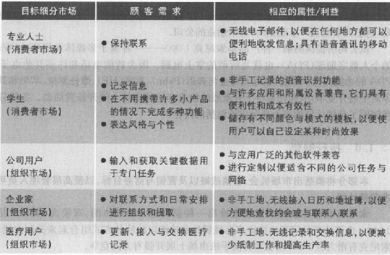
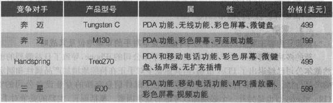
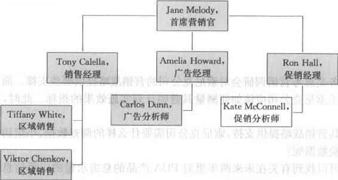

索尼克的营销计划与运用
----------------------

### 营销计划：导论

作为营销者，必须拥有一份优秀的营销计划，以便可以提供指导，并保障可以持续地关注特定的品牌、产品或公司。在制定了详细的计划之后，往往可以使企业为如下工作做好充分准备：推出创新性的新产品或提高面向现有顾客的销售额。就是对于非营利组织而言，它们也需要利用营销计划来为有关筹资和扩大服务项目的努力提供指导。即使是政府机构，往往也离不开营销计划，以便提升公众对营销学的认识和推动区域旅游项目。

### 营销计划的目标和内容

与业务计划相比较而言，营销计划所包括的范围较窄。其中，业务计划往往要提供有关整个组织的使命、目标、战略和资源分配的描述。而营销计划则关注于如何通过营销战略与营销策略来实现组织的战略目标，而且营销计划工作往往是从顾客开始的。当然，营销计划也与组织中其他部门的计划密切相关。假设某项营销计划的目标是每年销售20万件产品，那么生产部门就必须努力生产出这么多的产品以供销售，财务部门也必须协同运作以便提供所需要的资金，人力资源部门也必须为员工的招聘和培训做好准备......因此，如果没有相应的组织支持和组织资源，任何营销计划都很难获得成功。

虽然营销计划的长度与格式会因公司的不同而存在差异，但几乎所有的营销计划都会包括本书第2章所描述的内容。对于小型企业而言，其营销计划可能较短，而且正式程度也不高，但对于大型公司而言，其营销计划往往有着固定的格式与要求。而且，为了能够为有效的实施过程提供指导，还必须对营销计划的各个部分进行详细的阐述。有时，公司可能会把自己的营销计划张贴在内部网上，以便位于不同地方的管理人员和员工都可以查阅营销计划的不同部分，并通力协作，以便调整或补充营销计划。

### 调研的角色

为了开发出富有创新性的产品、成功的战略和行动方案，营销者还必须获取有关环境、竞争对手和所选择的目标市场的实时信息。因此，内部数据分析往往是评估当前营销环境的起点，然后再辅之以必要的营销智能和市场调研，以便对总体市场、竞争对手、关键问题、威胁和机会形成更深刻的认识和了解。在实施营销计划的时候，营销者也可以利用调研来获悉计划实施的具体进展或偏离目标的程度，从而在结果不尽人意的时候找到可以进一步改进的地方。

最后，营销调研也有助于营销者深入地了解顾客的要求、期望、感知、满意度和忠诚度。这种对顾客的深入了解往往有助于企业获得更充分的决策信息，以便作出更科学的市场细分、目标市场选择和定位决策，从而为竞争优势的构建奠定基础。所以，营销计划应该概括出需要进行什么样的市场调研以及何时进行调研。当然，其中也应该包括有关如何使用调研结果的信息。

### 关系的角色

营销计划包括如何建立和保持有利可图的顾客关系，但其也会对内部与外部的关系产生影响。首先，营销计划会对营销人员之间以及营销部门与其他部门之间的协同工作产生影响一他们密切合作，共同为顾客交付价值并使顾客觉得满意。其次，营销计划也会对公司与供应商、分销商和合作伙伴之间的关系产生影响------他们为了实现计划目标而共同努力。再次，营销计划也会对公司与其他利益相关者的关系产生影响，其中包括与政府管制者、媒体和社区的关系。如上所述的这些关系都是组织获得成功所必须的，都是在制定营销计划时必须加以考虑的因素。

### 从营销计划到营销行动

对于大多数公司而言，虽然有些营销计划可能涵盖更长的时间，但一般都会制定年度营销计划。营销者往往是在计划得以实施之前从事营销计划工作，以便争取更多的时间来进行营销调研、营销分析、管理评价和部门协调。然后，在每项行动方案开始之后，营销者又会密切监控具体的实施过程与结果，对偏离计划目标的事项进行调查，并在必要时采取矫正措施。有些营销者也会制定出权变的营销计划，以便应对可能出现的新情况。实际上，由于环境变化总是不可避免的，而且有些环境变化还是不可预测的，所以营销者必须做好随时更新或调整营销计划的准备。

出于有效实施与控制的考虑，在营销计划中还应该把目标的实现程度清晰地加以界定，并确定科学的测量指标，以便及时地把握营销计划的实施进展和目标的实现情况。在实践中，管理人员往往运用预算、日程规划和相关的营销测量指标来监督与评价所取得的进展和成果。在制定好预算的情况下，管理人员就可以很便利地对一定时期内的计划费用水平与实际发生的费用水平进行比较了。在制定好日常规划的情况下，管理人员就可以清晰地了解完成各项任务的既定时间了，从而更便于同实际的完成时间进行比较。类似地，在确定好营销测量指标的情况下，管理人员就可以方便地追踪营销活动的实际效果，从而进一步确定公司的整体运营活动是否朝着有利于目标实现的方向在发展。

### 索尼克的营销计划案例

在这一部分内容中，将给读者展示一个营销计划的案例------索尼克（Sonic）的一份营销计划，这里的索尼克一家虚拟的、刚刚创业的公司。

该公司所提供的第一种产品是索尼克1000------一种基于多媒体无线驱动（WiFi-enabled）的个人数字助理（PDA），也就是所谓的掌上电脑。因为智能电话和许多其他电子设备都具有PDA的功能和娱乐效能，索尼克将会与奔迈（Palm）、惠普（HP）、摩托罗拉、苹果和其他强大的竞争对手展开竞争，共同在竞争十分激烈的快速变化的市场上展开经营活动。各部分的黑体字段落阐明了营销计划的每个部分应该包括的内容。

### 1.0 执行纲要

本部分将概括出市场机会、营销战略以及营销与财务目标，以便高层管理人员可以了解并批准营销计划。

索尼克准备在成熟的市场上推出一种新的基于多媒体的、双模式PDA产品------索尼克1000。由于该产品完美地把许多高级属性和功能以独特的方式组合起来并制定增值价格，所以索尼克有潜力在PDA市场和智能手机市场上展开强有力的竞争。

该营销计划所确定的主要营销目标是：第一年在美国市场达到3%的市场份额，也就是达到24万台的销售规模。同时，主要的财务目标是在第一年里实现6000万美元的销售收入，并把第一年的损失控制在1000万美元以下，力争在第二年较早地达到盈亏平衡。

### 2.0 情境分析

本部分内容会对市场、公司为目标市场提供服务的能力以及竞争情况进行综合分析。

索尼克公司创建了已经有一年半了，其两个创始人都有着电信业的从业经验。现在，该公司想要进入成熟的PDA市场。无论是在个人使用方面，还是专业应用方面，多功能移动电话、电子邮件设备和无线通讯设备都变得越来越流行。每年，世界上所销售的PDA有500万台、销售的智能电话有2200万部。随着技术的演进和发展，竞争也变得更加激烈，而且产业集中现象仍在继续，价格竞争的压力正在侵蚀着诱人的利润。奔迈PDA产品的领先企业，是几家强大的竞争对手之一，这些竞争对手在适应智能电话挑战方面也显得力不从心。为了在这个动态的市场上获得一定的市场份额，索尼克必须认真地识别出特定的目标市场，了解各自的属性需求，并为下一代新产品的研发做好准备，以便维持当前的品牌活力和品牌价值。

-   2.1 市场概要

本部分内容应该包括有关市场规模、需求、成长和趋势的侑息，并详细地推述各个目标市场，以便为后面所涉及的营销战略和营销方案提供背景信息。

索尼克所选择的市场既包括个人消费者，也包括组织用户，他们都偏好于运用一种设备完成通讯、信息存储与交换、组织和娱乐活动。在第一年里，该公司所识别的目标市场包括专业人士、公司、学生、企业家和医疗用户。表A.1描述了索尼克1000是如何满足该公司的个人消费者和组织用户的需求的。

表A.1 需求与索尼克PDA的属性/利益

PDA采购者可以在的不同模式之间作出选择，不同模式的产品包含不同的操作系统------奔迈、微软和塞班（Symbian）以及Linux的系统。索尼克之所以许可基于Linux的系统，是因为它有时在防止黑客与病毒进攻方面有着良好的表现。同时，考虑到存储容量（硬盘和闪盘）也是PDA产品的一个期望属性，所以索尼克就在它所推出的第一代产品中包含了20G的高速硬盘。虽然性能水平在不断提高，但技术成本却在不断下降，这使增值价格型PDA产品受到了已经拥有了老款PDA产品的消费者和组织用户的青睐，他们希望升级购买新的、更高性能的高端多媒体产品。

-   2.2 优势、劣势、机会与威胁分析

索尼克具有几大优势，但主要劣势是品牌知名度不高，没有形成鲜明的品牌形象。对于索尼克而言，主要的机会是市场对多功能通讯、组织与娱乐设备的需求，这类设备可以为顾客带来一系列富有价值的利益。不过，索尼克也面临着越来越激烈的竞争和降价压力等威胁。

优势    优势是有助于公司实现其目标的内部能力。索尼克可以充分发挥以下三大优势：

 

-   1.创新性产品：索尼克1000把多种属性与功能都完美地整合在一起，如快速的、免提双模式、无线驱动的移动通信能力和数字视频/音乐/电视节目存储与回放等。如果没有索尼克1000，顾客可能不得不同时携带多种设备。
-   2.安全：索尼克的PDA产品利用基于Linux的操作系统，在防范黑客与其他安全威胁方面具有卓越的表现，从而可以避免数据的盗用或丢失。
-   3.定价：索尼克的PDA产品要比竞争对手的多功能PDA便宜，而没有一款竞争对手的产品可以提供同样的功能组合，这使索尼克在面对价格敏感型顾客时具有强大的优势。

劣势    劣势是有碍于公司实现其目标的内部要素。在PDA市场经历了重组之后才进入市场，使索尼克看到了其他企业的成功与失败之处，这也是该公司的优势。然而，索尼克的PDA产品具有以下两大劣势：

 

-   1.品牌知名度不高：索尼克没有知名的品牌或形象，而诸如奔迈、苹果和其他竞争对手都具有强大的品牌识别优势。对此，索尼克可以通过强大的促销来加以克服。
-   2.单位产品重量较大、较厚：由于索尼克的PDA产品把许多多媒体属性都整合进来了，并比一般的PDA产品具有更大的存储容量，所以索尼克的PDA产品也比大多数竞争产品要稍微重一点、厚一点。为了克服这一劣势，索尼克将会重点强调其产品两大竞争优势------给顾客带来的利益和增值定价。

机会    机会是那些购买者有需求或感兴趣的领域，公司可以在这些领域中展开有利可图的经营活动。索尼克可以充分利用以下两大市场机会：

 

-   1.提高对具有通信功能的多媒体设备的需求：与对只具有一种用途的设备的需求相比，对多媒体、多功能设备的需求正在快速成长。随着双模式能力逐渐成为一种主流，结果使顾客可以做出更为灵活的选择------通过移动电话还是通过网络连接来拨打电话，市场需求正在以前所未有的速度增长。无论是在工作中、教育中，还是个人使用中，PDA产品和智能电话产品都变得相当普及。实际上，那些最初购买了最基本产品的用户现在也开始考虑升级换代了。
-   2.较低的技术成本：现在可以以更低的成本来实现更好的技术了。这样，索尼克就可以把一系列高级属性整合在一起了，但却收取相对较低的价格，即增值价格，而公司仍然可以获得可观的利润。

威胁    威胁是由于不利的趋势或那些促使利润与销售下降的因素所导致的挑战。该公司在推出索尼克1000时主要面临以下三项威胁：

 

-   1.日益激烈的竞争：越来越多的公司开始提供一些具有整合功能和利益的产品。不过，它们所提供产品的属性却不像索尼克公司的产品属性那么多。因此，索尼克的营销沟通必须强调其产品与竞争产品的明显差异和富有竞争力的增值定价。

-   2.降价的压力：日益激烈的竞争和市场份额战略促使PDA产品的价格也不断下降。对于索尼克公司而言，其第二年的目标是通过销售初始的PDA产品谋求10%的利润率。考虑到PDA市场毛利水平较低的事实，这一目标是具有现实性的。

-   3.日益缩短的产品生命周期：与其他技术产品相比，PDA很快就步入到产品生命周期的成熟阶段。由于产品生命周期不断缩短，所以索尼克公司计划在推出索尼克1000之后推出以媒体为导向的第二代产品。

-   2.3 竞争

本部分内容主要是识别竞争对手，推述竞争对手的市场地位及其战略。

新的多功能智能手机产品的出现，包括苹果公司的iPhone，导致了日益激烈的市场竞争。虽然戴尔公司已经退出了PDA市场，但其他竞争对手正在持续地增加产品属性和制定更富竞争力的产品价格。同时，来自专门用于文字与电子邮件信息交换的专业设备公司的竞争，如黑莓（Blackberry），也是另外一个必须加以考虑的竞争因素。概括而言，主要的竞争对手包括：

 

-   奔迈。作为PDA市场的领先者，奔迈在市场上占有34%的份额，已经在市场上构建起多渠道的强大分销网络，与许多美国与欧洲的电信运营商建立有伙伴关系。然而，奔迈的智能电话份额远低于诺基亚和其他手机产品经营者。奔迈的产品或者使用专有的奔迈操作系统，或者使用Windows操作系统。
-   惠普。惠普在PDA市场上占有22%的市场份额，把拥有其iPAQ掌上计算机设备的组织市场用户作为目标市场。该公司所提供的一些PDA产品可以把文件发送给具有蓝牙功能的打印机，并在电池没电的情况下可以防止数据丢失。此外，出于额外的安全考虑，其中一种型号的产品还同时允许通过指纹和密码方式进入。惠普也建立了广泛的分销渠道，并以不同的价格提供各式各样的PDA产品。
-   摩托罗拉。在三年的时间里，摩托罗拉在世界范围内销售了1亿台锋锐（RAZR）手机。现在，该公司开始提供第二代锋锐手机产品，比以前的产品更小、更轻，而且具有可供选择的两套操作系统。其中，摩托罗拉瞄准的是专业人士和组织用户，具有PDA和电子邮件功能、微键盘、蓝牙连接、多媒体功能和其他性能。
-   苹果。苹果公司的iPhone产品是一款3.5英寸彩色屏的智能手机，在设计过程中一直秉承着满足狂热娱乐者的需求与偏好。该种产品在音乐、视频和网络接入、日历和联系人管理方面都有着十分卓越的表现。最初，苹果公司只与AT&T网络达成了伙伴关系，在导入市场两个月后把价格降低到399美元，以便加速市场渗透。此外，该公司推出的iPod
    Touch媒体播放器具有iPhone的风格，但不具有手机的功能。
-   RIM。RIM公司（Research in
    Motion）制造重量轻的黑莓无线手机/PDA产品。该种产品在公司用户中十分流行。RIM公司的持续创新和强大的顾客服务支持强化了其在市场上的竞争地位，成功地推出越来越多的手机和PDA产品。
-   三星。无论是在价值、风格还是在功能上，三星公司都是一个强大的竞争对手。该公司向个体消费者市场和组织用户市场提供各式各样的智能手机产品和超移动个人计算机。其中，有些智能手机是面向特定的电信运营商的，有些则是开放的，可用于任何兼容的电信网络。

尽管存在强大的竞争对手，但索尼克却可以刻画出一种确定的品牌形象，并在目标细分市场上获得品牌认知。该公司的语音识别系统（免提功能）是与竞争对手形成差异的一个关键点，给其产品带来了竞争优势。该公司的第二代产品也具有PDA的功能，但却更加以媒体为导向，以便在具有强大品牌认知的细分市场上更好地吸引目标顾客。表A.2描述了一系列竞争产品及其价格情况。

表A.2 PDA产品与定价举例

-   2.4 产品供应物

本部分内容将概括出索尼克公司不同产品的主要属性或性能。

 

-   免提功能的语音识别；
-   组织功能，包括日历、地址簿和同步录音；
-   内置双模式选择（移动电话与网络电话）以及"一键对讲"实时呼叫功能；
-   数字音乐、视频、电视节目刻录、无线下载和实时回放；
-   无线网络和电子邮件、文本短信和实时信息传送；
-   3英寸彩色屏幕，便于观看；
-   高速20G驱动器和扩充插槽；
-   4兆像素照相机，具有闪光和照片编辑、分享工具。

该公司在第一年的销售收入计划是6000万美元，其中的依据是：以250美元一个的批发价销售24万个索尼克1000。第二年的产品将是索尼克全媒体2000，将更加强调多媒体通讯、网络和娱乐功能，当然也包括PDA功能，但只是附属功能了。其中，索尼克全媒体2000将包括索尼克1000的所有功能，但又增加了如下功能：

 

-   内置的媒体播放功能，可以与其他设备分享音乐、视频和电视文件；

-   网络摄影机，可以实时地获取视频信息并上传到主流视频网站；

-   语音命令接入功能，接入主流社交网站；

-   一体化的800万像素照相机、图片、照片编辑与分享工具。

-   2.5 分销

本部分内容描述了产品的各个分销渠道，并对新的发展和趋势进行介绍。

索尼克品牌的产品将在美国50个最大的市场上通过零售商网络加以分销。其中，最重要的渠道伙伴包括：

 

-   办公用品大型超级市场：其中，办公商品经销商Office
    Max公司和史泰博将在自己的店铺、目录中销售索尼克的产品.此外，它们也在线销售索尼克的产品。
-   计算机商店：其中，Comp
    USA公司和独立的计算机零售商都会经销索尼克的产品。
-   电子产品专卖店：百思买将在店铺和网站上销售索尼克的产品，并在它的媒体广告上加以宣传。
-   在线零售商：亚马逊公司也会分销索尼克的产品，并在产品导入阶段把索尼克的产品放在主页的显要位置上（收取一定的促销费用）。

分销活动最初只是局限在美国市场上进行，并提供一定的销售促进支持。随后，索尼克公司计划进入加拿大市场和其他市场。

### 3.0 营销战略

-   3.1 目标

目标的描述应该具体，以便管理人员可以随时了解进展情况，并在必要时采取矫正措施，从而保证可以按照计划顺利进行。

索尼克公司已经为自己在进入市场的第一年和第二年设定了大胆的、但却可以实现的目标。

 

-   第一年的目标：索尼克公司希望在美国的PDA市场上占有3%的市场，销售24万件产品。

-   第二年的目标：索尼克公司第二年的目标是其索尼克1000将实现盈亏平衡，并适时推出第二代产品。

-   3.2 目标市场

所有营销战略都是从市场细分、目标市场选择和定位开始的。

索尼克的战略是基于产品差异化这一定位的。对于索尼克1000而言，其主要的目标顾客是中上收入水平的专业人士，他们需要一种设备来协调繁忙的日程安排、与家人和同事保持联系并可在高速移动中进行娱乐。其次，该产品的另外一个目标顾客群体是高中生和大学生以及研究生，他们需要一种多媒体、双模式设备。在实践中，可以通过人口统计特征总量，如年龄（16\~30岁）和教育程度来加以描述。索尼克全媒体2000所瞄准的主要是十几岁和二十来岁的年轻人，他们需要具有能够支持其社交网络和娱乐媒体消费性能的多媒体设备。

对于索尼克1000而言，主要的组织顾客是中等规模的企业和大型企业，它们希望帮助管理人员和员工彼此保持联系，并在不在办公室的时候输入或获取一些关键数据。这一细分市场包括年销售收入超过2500万美元的企业和拥有100名员工以上的企业。第二个目标细分市场是企业家和小企业的所有者。当然，那些希望更新或获取病人医疗记录的医疗用户也是索尼克公司的目标顾客。

在市场营销组合战略中，每一项战略都突出地把索尼克产品的差异化信息传递给不同的目标细分市场。

-   3.3 定位

定位明确地体现了品牌、利益、差异点以及产品或产品线的平价（等值）。

通过突出产品差异化，索尼克把自己的产品定位成万能的、便利的、增值型PDA产品，适合个人与专业人士使用。在营销过程中，将重点强调索尼克1000的差异化性能，如具有免提功能的多模式通讯、娱乐和信息处理与存储能力。

-   3.4 战略

产品战略产品战略包括有关产品组合与产品线、品牌、包装与标签和担保等方面的决策。索尼克1000包括在前面的产品评价部分中所描述的全部性能，销售时提供为期一年的质量担保。索尼克公司计划在第二年推出新产品------索尼克全媒体2000。那时，该公司的索尼克品牌已经在市场上具有一定的影响力了。同时，索尼克品牌和标志（索尼克独特的黄色霹雳）也会在产品和包装以及所有的营销活动出现。

定价战略定价战略包括与设定初始价格和根据机会与竞争而调整价格相关的所有决策。索尼克1000在推出市场时的批发价为250美元、零售价为350美元左右。在用索尼克全媒体2000扩充了产品线之后，索尼克公司计划把索尼克1000的价格降低。其中，索尼克全媒体2000的批发价是350美元。这样的价格反映出如下战略：吸引理想的渠道伙伴和从成熟的竞争对手那里夺取一定的市场份额。

分销战略    分销战略包括渠道关系的选择与管理，以便向顾客交付价值。索尼克公司的渠道战略是使用选择性分销，通过著名的商店和在线零售商来销售其PDA产品。在第一年里，索尼克公司计划增加渠道伙伴的数量，以便覆盖美国所有的主要市场，并通过主要的电子产品目录销售商和网站来经销自己的产品。同时，该公司也将对通过大型运营商（如威讯）的移动电话商店进行分销的可能性进行调查。为了给渠道伙伴提供支持，索尼克公司将提供演示产品、详细的使用说明材料、彩色图片和产品展示。最后，索尼克公司还计划为那些大量订购的零售商提供专门的付款条件。

营销沟通战略    营销沟通战略包括面向目标顾客和渠道伙伴进行沟通的所有努力。通过把所有媒体的所有信息都整合起来，索尼克公司可以进一步提高品牌的知名度和突出其产品的主要差异点。有关媒体消费模式的研究成果，有助于索尼克公司的广告代理在产品推出之前和推出过程中选择合适的媒体和时机来与潜在顾客有效地进行沟通。此后，则是有节奏地进行广告宣传，以便维持品牌的认知度和向顾客发送不同的信息。当然，上述代理也要对公共关系努力进行协调，以便构建强大的索尼克品牌和支持差异化信息。此外，为了充分利用网络散布消息，索尼克公司计划在网站上发起一场由用户制作视频的大赛。在实施推式战略的过程了，为了吸引、挽留和激励渠道成员，索尼克公司还计划利用商业销售促销和个人销售这两种方法。在索尼克品牌在市场上站稳脚跟之前，索尼克的营销沟通都会鼓励潜在顾客通过渠道伙伴进行采购，而不是直接从公司网站进行购买。

-   3.5 市场营销组合

市场营销组合包括对产品、定价、分销和营销沟通战略提供支持的策略与活动。

索尼克1000将于2月份推出市场。下面是为了实现预期的目标而在最初的6个月里所采取的一些具体行动方案：

 

-   1月：索尼克公司启动预算为20万美元的商业销售促进活动，积极参与商业展览会，以便引导和教育经销商，为在2月份的产品推出寻求渠道支持。同时，索尼克公司也将通过向下列人群馈赠样品等方式来创造口碑传播，包括：产品评论人、意见领袖、有影响力的博客人物和名人。经过培训的工作人员将会与大型连锁零售终端的销售人员密切合作，向目标顾客解释索尼克1000的性能、利益和优势。

-   2月：索尼克公司开始面向专业人士和目标消费者展开一体化的印刷、电台、在线广告宣传活动。在这场宣传活动中，将重点宣传索尼克1000拥有哪些性能，重点强调集成为一体的、功能强大的、手持设备所带来的便利性。同时，在如上所述的多媒体宣传活动中，还将辅之于售点标志宣传以及在线独享的广告与视频体验。

-   3月：随着多媒体广告宣传活动的深入，索尼克公司还计划推出消费者销售促进活动，如展开消费者视频大赛，鼓励消费者把自己制作的视频上传到公司的网站上。其中，视频内容是有关消费者自己是如何创造性地或以非常规的方式使用索尼克的产品的。同时，索尼克公司也将开展新的售点产品展示活动，以便为零售商提供进一步的支持。

-   4月：索尼克公司将推出商业销售竞赛，为那些在为期四周时间里销售最多数量的索尼克产品的销售人员和零售组织颁奖。

-   5月：索尼克公司计划在全国范围内铺开新一轮的广告宣传活动。其中，收音机广告将会通过名人的口气向目标顾客强调索尼克PDA产品的卓越性能，如发出呼叫、发送电子邮件、播放音乐或视频等。同时，独具风格的印刷广告和在线广告将进一步使手持索尼克PDA产品的名人具体化、形象化。而且，该公司还计划在第二年的产品投放时继续重复上述主题的宣传活动。

-   6月：索尼克公司将在其电台广告宣传活动中增加新的旁白宣传语，把索尼克1000当作毕业礼物促销。同时，索尼克公司还计划在每半年举行一次的电子产品商业展览会上进行产品展示，并向销售商提供新的、竞争产品比较宣传单，以便推动其产品的市场销售。此外，索尼克公司还会对顾客满意调研的结果进行分析，以便在未来的营销活动和产品开发努力中加以应用。

-   3.6 营销调研

本部分内容将阐述营销调研对营销战略与营销活动的制定、实施和评价所起的积极作用。

通过进行调研，可以进一步识别出目标市场所重视的具体性能和利益。来自于市场测试、市场调查和焦点小组访谈的反馈结果，会对企业开发和修正索尼克全媒体2000有所帮助。同时，索尼克公司也会对顾客对竞争品牌和产品的态度进行测量和分析。此外，品牌认知度调研也有助于企业判定广告宣传信息和广告媒体的效果和效率。最后，索尼克公司也会通过顾客满意度调研来了解市场所做出的反应。

### 4.0 财务方面

本部分内容主要包括有关营销计划的费用、日程安排和实施的预算和预测。

索尼克公司预计第一年来自索尼克1000产品的总销售收入将达到6000万美元。其中，在销售总量为24万台的情况下，平均的批发单价为250美元、单位产品的变动成本是150美元。同时，索尼克公司预测第一年的损失可能达到1000万美元。通过盈亏平衡分析，索尼克公司计算得出：在第二年当销售量超过267500台的时候，索尼克1000会开始盈利。在上述计算过程中，索尼克公司假设：单位产品的批发价格是250美元，单位产品的变动成本是150美元，第一年的固定成本估计额是2675万美元。在上述假设下，盈亏平衡的计算为26750000/（250\~150）=267500（台）。

### 5.0 控制方面

控制有助于管理人员测量绩效、识别问题或处理需要得到矫正的偏差。在整个营销活动的实施和组织过程中，都要进行控制。

-   5.1 实施

为了密切监控产品质量和顾客的服务满意水平，索尼克公司计划采取严格的控制措施。这将会促使企业对可能出现的任何问题作出非常快速的反应。此外，还可以监控其他的早期预警信号（以便及时发现可能出现的偏离）包括月度销售额（按照细分市场和渠道加以统计）和月度费用指标。

-   5.2 营销组织

可以按照职能（本例中就是这祥）、地区、产品、顾客或上述指标的某种组合来对营销部门进行组织。

简·麦勒迪（Jane
Melody）是索尼克公司的首席营销官，对整个公司的全部营销活动承担责任。图A.1概括出由8个人构成的营销组织的结构。索尼克公司聘请"世界营销公司"（Worldwide
Marketing）实施和协调全国的销售活动、面向组织顾客和个人消费者的促销活动以及公共关系努力。

图A.1 索尼克公司的营销组织

### 索尼克营销计划的章节分布

### 第2章

索尼克公司首席营销官简·麦勒迪的助理从简·麦勒迪那里接受了这样一项任务：为高层管理者起草一份使命声明，以供高层管理者评价和讨论。显然，使命声明应该包括该公司展开经营活动的竞争领域（业务范围）以及有关该公司应该采取的一般竞争战略的建议。这就要求运用自己的营销知识、自己所了解的有关索尼克公司的信息以及图书馆或网络资源来回答以下问题：

 

-   索尼克公司的使命应该是什么？
-   索尼克公司应该在什么样的竞争领域（业务范围）中展开经营活动（产业、产品与应用、竞争力、细分市场、纵向和地区范围等）？
-   对于波特所提到的三种通用的竞争战略，索尼克公司应该选择其中的哪一项战略呢？

在授课教师的指导下，在书面的营销计划书中给出自己的答案和相关的支持信息，或是在营销计划专业软件（Marketing
Plan Pro）中录入自己的答案。

### 第3章

简·麦勒迪要求其助理对索尼克公司的外部环境进行分析，以便找到早期的预警信息，进而识别出新的机会或新出现的挑战，这些因素会对索尼克1000的成败产生影响。利用网络或图书馆资源（或二者都用），为下面三个有关宏观环境的关键方面的问题找到答案：

 

-   哪些人口统计因素的变化可能会影响索尼克的目标细分市场？
-   什么样的经济趋势可能会影响索尼克公司目标细分市场上的购买者的行为？
-   技术变革的加速会对索尼克公司的竞争环境产生怎样的影响？

请在书面营销计划中的合适位置写下对上述问题的答案，或是在营销计划专业软件中录入自己的答案。

### 第4章

下一项任务是思考营销调研会对索尼克公司的营销战略提供哪些支撑。简·麦勒迪也要求其助理提供有关索尼克公司应该如何测量其营销计划实施效果的指标。此时，往往需要回答以下三个问题：

 

-   为了对其营销战略提供支持，索尼克公司需要什么样的调查数据、小组访谈数据和行为数据或实验数据呢？
-   在哪里可以找到有关在未来两年里对PDA产品的总需求量的二手信息呢？请至少识别出两个信息来源（在线的和传统的），并描述如何从这些信息来源中提取所需要的信息？所提取的信息对索尼克公司的营销计划工作有何帮助呢？
-   为索尼克公司判定营销效果和效率提供三项具体的指标。

请在书面营销计划中的合适位置写下对上述问题的答案，或是在营销计划专业软件中录入自己的答案。

### 第5章

索尼克公司已经作出决定，把对顾客满意度的关注作为在激烈竞争环境中鼓励品牌忠诚的一种方法。在这个前提下，请在继续制订索尼克的营销计划时思考以下三个具体问题：

 

-   索尼克公司应该如何监测顾客满意度？监测频率是多少？
-   是否建议索尼克公司采用客户净推荐值法？请阐述自己的理由。
-   索尼克公司应该对哪个顾客接触点给予特别的关注呢？为什么？

在索尼克公司所设定的目标和当前环境下，思考对上述问题的答案。然后请在书面营销计划中的合适位置写下对上述问题的答案，或是在营销计划专业软件中录入自己的答案。

### 第6章

在市场营销计划中，还需要对索尼克1000的消费者市场进行调研和分析。为此，请在分析一下有关该公司当前情境与和宏观环境的信息，特别是有关目标细分市场的信息。然后，试图回答下列有关市场和购买者行为的问题：

 

-   有哪些文化因素、社会因素和个人因素可能会对消费者购买PDA产生的行为产生重要的影响？
-   索尼克公司的营销计划应该特别强调哪些方面的消费者行为？为什么？
-   在索尼克公司的营销计划中，需要使哪些营销活动与消费者购买过程的每个阶段相匹配？

在对上述几个方面的消费者行为进行分析的基础上，请思考索尼克公司的营销努力对PDA产品的市场投放所提供的支持。最后，在书面营销计划中的合适位置把自己的研究结果和所获得的结论记录下来或是在营销计划专业软件中录入自己的答案。

### 第7章

在营销计划中，还必须深入了解索尼克的PDA产品的组织市场情况。简·麦勒迪把这一市场界定为那些希望员工彼此之间保持联系以及希望可以在任何地方都可以录入或获取相关信息的中型与大型公司。请根据自己对索尼克公司当前的营销情境和组织市场营销的了解对下列三个问题做出回答：

 

-   哪些类型的企业似乎符合简·麦勒迪有关目标市场的界定？应该怎样接触到这些目标顾客的员工并找到有关这类企业的数据呢？
-   对于这些企业而言，购买索尼克的PDA产品是属于什么类型的购买呢？谁会参与并对这类采购产生影响呢？
-   公司用户对PDA产品的需求是无弹性的吗？这对于索尼克的营销计划有何启示呢？

有关上述问题的答案将会对索尼克公司面向目标组织市场的营销活动方案产生影响。请花费几分钟的时间在书面营销计划中记录下自己的观点或是在营销计划专业软件中录入自己的答案。

### 第8章

识别合适的目标细分市场并选择对使营销计划获得成功至关重要的目标细分市场。作为简·麦勒迪的助理，需要负责市场细分和目标市场的选择工作。请重新系统地分析在上述过程中所获得的有关市场信息、购买者行为的数据和竞争对手的详细信息，并回答下列问题：

 

-   索尼克公司在对消费者市场和组织市场进行市场细分时，应该利用哪些总量作为市场细分总量？
-   索尼克公司应该如何评价每个细分市场的吸引力？索尼克公司应该选择其中一个消费者细分市场和组织细分市场作为目标市场呢，还是应该选择两个或更多的细分市场？为什么？
-   索尼克公司应该追求全面的市场覆盖、市场专业化、产品专业化、有选择的专业化，还是集中的单一市场战略呢？为什么？

然后，再思考一下针对上述市场细分和目标市场选择的决策会对索尼克公司的营销努力产生怎样的影响呢。请在授课教师的指导下，在书面营销计划中记录下来自己的观点或是在营销计划专业软件中录入自己的答案。

### 第9章

索尼克在市场上是一个新的品牌，以前并没有品牌联想，这就意味着存在许多市场机会和挑战。简·麦勒迪授权某个下属负责围绕以下三个品牌资产问题（对索尼克公司的营销计划都是很重要的）提供管理建议：

 

-   在使索尼克品牌与竞争品牌区分开来的时候，哪些品牌要素可能是最有用的？
-   索尼克公司应该如何为其新的PDA产品概括出其品牌承诺？
-   索尼克公司应该为第二代产品增加新的品牌名称，还是保留索尼克的名称？

在回答上述问题的时候，请确保自己的品牌观点是与索尼克公司的目标市场和竞争状况相一致的。然后，在书面营销计划中记录下来自己的观点或是在营销计划专业软件中录入自己的答案。

### 第10章

跟以前一样，某个下属正在与简·麦勒迪一道制定有关推出新的PDA产品的营销计划。下面，就需要关注索尼克的定位战略与产品生命周期战略了。为此，请回答以下三个具体问题：

 

-   利用一个或两个句子回答这样的问题：索尼克1000的定位声明应该是什么？
-   获悉索尼克1000产品所处的产品生命周期阶段，对于制定定价、促销和分销策略有什么启示或帮助呢？
-   PDA市场正处于哪一个阶段呢？这对于索尼克公司的营销计划有何启示呢？

在书面营销计划中记录下来自己的观点或是在营销计划专业软件中录入自己的答案。需要指出的是：为了决定在推出索尼克1000之后应该做什么，可能需要从事一些额外的调研，这些调研都已经完成了。

### 第11章

在以相对较高的品牌识别和强的市场定位为特征的、充分竞争的既有产业中，索尼克公司仅仅是一个新的进入者。请利用调研和自己的知识，回答下列有关如何应对竞争对手的三个问题（它们会影响该公司成功地推出第一种新产品的能力）：

 

-   为了判断索尼克的战略分组，应该考虑哪些关键要素？
-   考虑到优势与劣势、远与近或好与坏等因素，索尼克公司应该选择进攻哪些竞争对手呢?在PDA市场上，上述选择为什么是合适的？
-   作为一家新创企业，哪些竞争战略是索尼克公司推出第一种新产品时最为有效的战略呢？

然后，再花费一些时间来思考：索尼克公司的竞争战略会对其营销战略和策略产生怎样的影响呢？最后，在书面营销计划中记录下自己的观点或是在营销计划专业软件中录入自己的答案。

### 第12章

在新产品投放决策中涉及一系列有关产品战略的决策，如差异化、成分品牌、包装、标签和担保等。下一项任务就是回答下列有关产品战略的三个问题：

 

-   在把索尼克的产品与竞争对手区分开来的过程中，哪些方面的差异化将是最有价值的？
-   索尼克公司应该使用成分品牌战略来突出其基于Linux操作系统的安全性吗（与基于其他操作系统的PDA产品相比较而言）？
-   索尼克公司应该如何利用包装和标签战略来支持其品牌形象，并帮助其渠道伙伴更有效地销售PDA产品？

一旦对上述问题作出回答之后，请在书面营销计划中记录下来自己的观点或是在营销计划专业软件中录入自己的答案。

### 第13章

下面是为索尼克公司的新PDA产品制定顾客支持服务战略。为此，请先回顾一下索尼克公司的目标市场及其需求，并思考一下索尼克公司的竞争对手在提供什么。然后，请对以下三个关于服务设计与管理的三个问题做出回答：

 

-   PDA产品的购买者希望获得哪些支持服务？
-   索尼克公司应该如何对感知服务与期望服务之间的缺口进行管理，以便使顾客满意呢？
-   索尼克公司必须做出什么样的售后服务安排？这些安排会对顾客满意产生怎样的影响呢？然后，再思考一下上述服务战略会对索尼克公司的总体营销努力产生什么样的影响。

概括一下自己的建议，并在书面营销计划中记录下来自己的观点或是在营销计划专业软件中录入自己的答案。

### 第14章

下面的任务就是为明年推出的新产品制定价格战略了。为此，首先再回顾一下前面所准备的SWOT分析和索尼克公司的竞争环境以及目标市场选择战略和产品定位战略。然后，对下列三个问题作出回答：

 

-   索尼克公司的主要价格目标应该是什么？为什么？
-   PDA产品的购买者是价格敏感型的吗？这对价格决策有何启示？
-   在营销计划中，索尼克公司应该包括哪些价格调整措施（如折扣、折让和促销定价等）？

整理一下自己的思路，并在书面营销计划中记录下来自己的观点或是在营销计划专业软件中录入自己的答案。

### 第15章

在索尼克公司，专门会安排人负责为新的索尼克1000构建营销渠道系统。根据自己有关整合营销渠道设计与管理的知识，回答下列问题：

 

-   对于新产品的投放，是否赞同简·麦勒迪作出的有关"推式战略"的决策呢？请给出自己的理由。
-   对于索尼克公司的目标消费者市场和组织市场而言，多少个渠道层次是比较合适的呢？
-   在决定渠道成员数量的时候，索尼克公司应该使用排他性、选择性分销战略，还是密集性的分销战略呢？为什么？

请确保上述有关营销渠道的思想与产品定位相一致，而且与既定的目标保持一致。在书面营销计划中记录下来自己的观点或是在营销计划专业软件中录入自己的答案。

### 第16章

在这一部分里，需要对中间商的管理作出具体决策。请通过回答下列问题明确阐述自己的看法：

 

-   什么类型的零售商最适合经销索尼克公司的PDA产品呢？通过这些零售商分销产品具有哪些优势和劣势呢？
-   在索尼克公司的分销战略中，批发商扮演着什么样的角色呢？为什么？
-   在推出第一种PDA产品时，索尼克公司应该考虑哪些市场一物流问题呢？

概括一下自己有关零售、批发和物流的决策，并在书面营销计划中记录下来自己的观点或是在营销计划专业软件中录入自己的答案。

### 第17章

简·麦勒迪授权某个下属负责为索尼克公司的新产品投放制定整合营销沟通计划。为此，该下属应该首先回顾一下上述工作中所收集的信息和所作出的决策。然后，回答下列三个问题：

 

-   对于索尼克公司最初的沟通活动而言，最合适的沟通目标是什么？

 

-   索尼克公司应该如何利用个人沟通渠道来影响目标受众呢？
-   在索尼克公司把新产品投放到市场上6个月之后，应该建议索尼克公司利用哪些沟通工具呢？

在回答上述问题的过程中，一定要确保所制定的营销沟通计划会对索尼克公司的整体营销努力做出贡献。下面，请在授课教师的指导下，概括一下自己的观点，并在书面营销计划中记录下来自己的观点或是在营销计划专业软件中录入自己的答案。

### 第18章

在索尼克公司推出新产品的过程中，大众传播扮演着十分重要的角色。在对先前各项决策进行回顾的基础上，请思考一下当前的环境（特别是竞争环境），然后回答下列有关营销沟通战略的问题：

 

-   一旦索尼克公司开始使用广告宣传手段，什么样的目标才是合适的呢？
-   索尼克公司在把新产品投放到市场上6个月以后还应该继续进行消费者销售促进和商业销售促进吗？请给出自己的理由。
-   简·麦勒迪希望开展节事营销------通过赞助某项合适的节事来推广自己的新产品。那么什么样的节事比较好呢？应该为这种赞助活动设定什么样的目标呢？

在书面营销计划中记录下来自己有关大众传播的观点或是在营销计划专业软件中录入自己的答案。

### 第19章

索尼克公司在新产品推出过程中，还需要制定个人沟通战略。为此，就需要花些时间来考虑互动营销、口碑和个人销售等问题。在制定个人沟通战略中，一般需要回答如下三个问题：

 

-   考虑到目标、大众传播安排和渠道决策等，哪种形式的互动营销比较适合索尼克公司的具体情况？
-   索尼克公司应该如何利用口碑来提高品牌认知度，并鼓励潜在购买者来惠顾零售店，以便亲自来商店看看新的PDA产品？
-   索尼克公司是否需要构建一支直销队伍或者是通过代理和其他外部代表来销售自己的产品？

在回答上述问题时，请回顾一下前面所作出的各项决策和营销方案，然后在书面营销计划中记录下来自己的观点或是在营销计划专业软件中录入自己的答案。

### 第20章

简·麦勒迪认识到这样的事实：PDA市场的成长速度低于多媒体、多功能通讯工具市场的成长速度。为此，她建议要一切向前看，思考一下索尼克公司如何才能超越PDA市场而为其他市场开发出新的产品？请回顾一下索尼克公司的竞争环境和市场条件，并完成以下工作：

 

-   请列出能够发挥索尼克公司的优势和体现不同的目标市场需求的三种新产品的创意。为了筛选这些创意，索尼克公司应该采用哪些筛选标准？
-   假设最有吸引力的产品创意很顺利地通过了创意的测试，那么请为这种产品创意的推出制定营销战略，具体包括：描述目标市场，描述产品定位，估计第一年的销售情况、利润和市场份额目标，制定渠道战略以及有关新产品投放的营销预算。如果可能的话，再估计一下索尼克公司的成本，并进行盈亏平衡分析。

然后，在书面营销计划中记录下来有关新产品开发的所有细节或是在营销计划专业软件中录入自己的决策内容。

### 第21章

作为简·麦勒迪的助理，还需要对如何在一年的时间里在美国之外的市场上推出索尼克1000进行研究。为此，有必要回答下列有关索尼克公司应用全球营销战略的几个问题：

 

-   作为一家新创企业，索尼克公司明年应该通过间接出口、直接出口、许可经营，还是合资企业或是直接投资方式进入加拿大市场？在进入其他市场时，应该采取何种方式呢？请给出自己的理由。
-   如果索尼克公司开始在其他国家推销其PDA产品，何种国际产品战略是最为合适的呢?为什么？
-   虽然有些零部件是在亚洲生产的，索尼克的PDA产品最终将在墨西哥组装，具体是通过合约安排的方式在墨西哥当地的一家工厂中完成组装。那么原产国形象可能会对相关的营销建议产生怎样的影响呢？

在回答上述问题的时候，还必须思考这些全球营销问题是如何与索尼克公司的整体营销战略匹配在一起的。然后，在书面营销计划中记录下自己的观点或是在营销计划专业软件中录入自己的答案。

### 第22章

在完成了营销计划中的上述各个部分之后，下面就需要考虑如何来管理索尼克公司的各项营销活动了。为此，简·麦勒迪要求其下属思考如下问题：

 

-   在整个组织的范围之内，索尼克公司应该如何驱动以顾客为焦点的营销和战略创新呢？
-   在索尼克公司的营销过程中，社会责任扮演着怎样的角色？
-   索尼克公司应该如何评估其营销战略和营销活动呢？请为该公司建议几个应该采取的具体措施和步骤。

为了最终完成该项营销计划，请在书面营销计划中记录下自己的观点或是在营销计划专业软件中录入己的答案。最后，请概括出该项营销计划的重点并撰写执行摘要。
