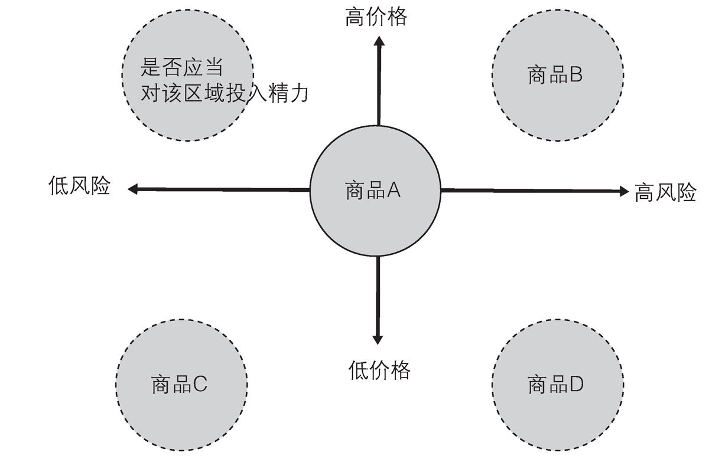
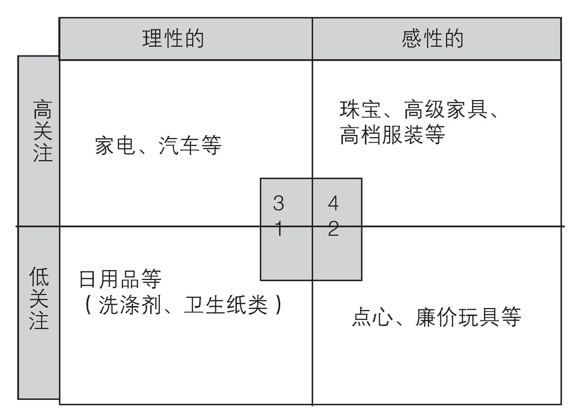

第5章 市场营销2.0的界限与品牌管理
---------------------------------

### 1．"差异化"的界限

科特勒所提出的STP中代表性的分类思考型市场营销活动（本书中将这一阶段的市场营销称作"市场营销2.0"）迎来繁盛期后，它开始作为常见思维推广开来，"分析顾客属性，让他们在竞争激烈的产品中选择本公司的产品"
这一意识也逐渐被人重视。

这一方式显然是合理的，其中通过机械性分类，还会使其更有效率地产生效果。

不过，随着市场营销2.0在较大市场中的逐步推广，当它延伸至利基市场时，市场达到饱和，其效果也开始逐步降低。

#### 商品的饱和状态（极其到达饱和状态的短期化）

商品化性质较高的产品会更为低廉化，其结果就是导致除了规模较大的企业以外，中小型企业难以生存。

为了避免这一后果，竞争型企业致力于实现差异化，并为商品提供附加价值。

不过这也只是缓兵之计，且容易陷入"为了差异化而差异化"的状况，强行将类似产品进行连自己都不懂缘由的差异化处理（强行制定定位图）。

我们有时会将这种情况称作"市场的成熟化"，或者"成熟市场"。当出现这种情况时，也就意味着迎来了近代市场营销的一个临界点。在寻找新细分市场变得日益困难的状况下，显然也很难选定目标和定位。由此导致市场营销组合（4P）也很容易自行达到临界点。

图表18 应当按定位图来进行商业活动？

定位图能让商品特征一目了然，从而了解该如何进行差异化处理，以及哪个区域比较薄弱。虽然这会成为下一个商品开发时的灵感，但在难以进行差异化处理的情况下，定位图的实施也会陷入僵局。定位图上较为薄弱的部分有可能发掘出新的利基需求，但也有可能是因为根本不存在该需求，所以才无人着手发掘该领域。

在"成熟市场"中，无论是处于竞争中的企业还是消费者都已浸透于近代市场营销（市场营销2.0）中，导致各企业陷入彼此都难以动弹的胶着状态。

#### 从20世纪的汽车产业来看市场营销1.0到2.0

让我们从汽车产业的发展来看市场营销的发展过程吧。

T型福特车的时代由于物资缺乏，只要能提供价格便宜兼具性能的产品就能轻易售出。在这种状况持续一段时间后，才终于产生了竞争，出现了制作同类产品可能滞销的局面。不针对顾客进行准确分析就无法吸引他们选择本公司产品（在此可以复习一下，这也就是市场营销1.0转为2.0的契机）。

不制作满足顾客需求的车就不会被接受。当企业面临这一情况时，就必然会开始重视市场营销2.0中的"顾客分析"了。

因此，企业致力于对汽车市场进行分区，尽量明确目标，让企业针对该分区设置定位，最终决定推广哪种类型的车种，并为它集中投入资源，提高效果。这也就是市场营销2.0的基本行动流程。

不过即使完美贯彻这一流程，在到达成功的路上依旧会遭遇激烈竞争，顾客也开始对自己进行情报武装。因此要满足顾客就必须增加新配色或有趣的车内装饰或高科技配件等，以此实现与
其他企业的差异化。

但这与最初的"集中资源"方法论相比并不太有效率，即使进行差异化处理也会很快被其他公司追上。最终，当差异化的选项用尽时，就将面临无计可施的困境。

简而言之，这就是（汽车）市场的成熟化状态。

以近年的日本汽车业界为例，丰田最强，其次为日产，本田也意外地有竞争力，其市场构图基本固定如此。

汽车的产品品性能其实大同小异，当竞争的车种到达了一定的固定化阶段后，本田该怎么办？或者丰田又该如何应对？这种状况就是成熟市场的例子之一。

也有人认为只要按照之前的方法去做就能永远实现良性循环（站在只实行市场营销2.0的立场）。

但即使如此，考虑到对市场营销所花费的精力以及顾客的呼声，我们先假定在思索如何销售的过程中会逐步迈向市场营销2.0吧。

那么本章之后的一大主题就是今后有可能出现怎样的市场营销手段。

也许有人会觉得不可能有超过2.0的新型市场营销了，但这种想法过于片面。不过以市场营销2.0为前提（论据）来考虑的话，得出如此结论也不难理解。

只是站在高于市场营销2.0的立场来试着考虑市场营销的话，就如同从T型福特车的市场营销（1.0）发展到塑料瓶装茶的市场营销（2.0）一样，2.0不也有可能进一步进化吗？本章稍后将以此为出发点来设想市场营销的各种可能性。

#### 为什么品牌是必要的？

这时有人提出了"品牌化"这一理念。那么我们试着探索从市场营销的差异化极限（也就是所谓市场营销2.0的临界点）到品牌化的进程吧。

在成熟的市场中，无论采用如何巧妙的手段进行差异化处
理，在成本、销量、利润方面都会自然而然地到达极限，这在之前已经解释过了。

在汽车领域，企业会陷入可替代商品之间的竞争中，在同一地盘接受顾客严苛的挑选。从顾客角度来说，只要性能优越，更为廉价且符合自己喜好，那么无论是哪家制造商都无所谓。如果顾客不接受该产品，那么他们还有"暂时不买（暂且观望）"这一选项，因此各企业最终很容易陷入"消耗战"。

#### 从商品化的FCB栅极角度出发的思维

针对商品化的想法多种多样，这里主要以FCB栅极（Vaughn、1986、使用的是我个人翻译）为灵感来考虑。

FCB栅极的作用是对产品进行"关注度高/低"和"理性/感性"分析，思考产品特性和宣传战略，不过在此我们只大致了解一下它的产品分类项目。

图表19 商品化的分类（FCB栅极）

从下往上，从左至右，通常就是品牌价值的体现。\*
FCB栅极（Vaughn、1986）的翻译部分使用的是我个人翻译

1为关注度较低的理性产品代表，以洗涤剂为例，即为功能性得到认可，用于日常消耗的产品类。

2为关注度较低的感性产品代表，以点心为例，即为日常消耗的兴趣物品类。

3为关注度较高的理性产品代表，以汽车和电视为例，即为

重视功能，会反复考察后再进行谨慎投资的产品类。

4为关注度较高的感性产品代表，以珠宝和高级家具、高级品牌时装为例，即为能获得极大情绪性满足感的产品类。

如果以图中纵轴大致将产品进行分类的话，"关注度较低"的产品与关注度较高的相比，其商品化程度更高。原因是关注度较低的商品通常都是日常消费的产品类，而这种随意消费的产品的替代性很高。

如果以图中横轴大致将产品进行分类的话，"理性"产品比感性产品的商品化程度更高。原因是适用于理性判断的功能方面的评价更容易定量化，也便于比较，所以只要顾客认为满足功能性需求且足够廉价，就很可能选择它成为替代产品。

此外，商品化程度较高的产品是更适合市场营销2.0的产品类，但同时很容易出现市场饱和，也容易陷入难以进行差别化处理的困境，也就是所谓的市场更容易成熟。

#### 从"商品化"到"品牌认知"的发展

因此，我们来探讨一下对于商品化程度较低（不太容易取代）的产品的认知。

其一就是品牌认知。

在FCB栅极的所有象限中都有品牌存在。当然，越是往下和往左的品牌越有可能被取代，只有得到某种程度的品牌认知才能确保其优势地位。

我们来详细了解一下商品化程度降低的"品牌"认知。

### 2．品牌管理与品牌（在STP、4P基础上，市场营销进一步进化）

#### 品牌与品质

所谓品牌，就是指在想起某种产品或服务时，消费者能对固有价值有所认知。

这种价值包括品质价值（也就是所谓的national brand等），传统价值
（老字号品牌等）、文化价值 （与生活方式相结合的品牌）、造型价值
（服装品牌等）、羡慕价值
（代表身份地位的品牌）等等，不过实际的品牌往往含有其中多种要素。

#### 品牌与差别化

品牌（或者品牌化）与差异化的区别在于诉求方式。差异化主要是向顾客表明产品的具体效用来达到推销目的，而品牌（或者品牌化）则是让顾客认知具备固有价值的物品，从而让其永远选择该产品。

进一步明确其区别的话，那么差异化就是"与其他公司的主力商品进行比较，体现本公司商品的优越性"，而品牌观点则是无需与其他公司进行比较，仅通过展示本公司品牌来让顾客接受并选择本公司产品。

#### 高品质印象与满足感

这种做法能避免让顾客进行功能性条件的比较，从而可能避免暴露于比较性目光中的商业化横向竞争。

当然，如果顾客想要购买高级皮包时，也会产生在路易·威登或爱马仕之间进行选择的竞争关系，但实际上，与其说顾客是在比较其品质本身，不如说是在考虑哪一种更适合自己（当然，
品牌也会对市场流行或变化进行分析，但主要用于确认企业品牌的统一感和今后的发展计划，并不会让自己去适应市场动向）。

#### 针对品牌印象的消费（提升可见的满足感）

也就是说，品牌方在构筑和推广本公司品牌时并不会给顾客直接的性能提示，而是让顾客得到更为抽象的满足感。

比如对"了解高级品牌并穿着它的我"产生的满足感。以FCB栅极来说的话，偏向于右上方。

#### 品牌衡平法战略

STP/4P的方法是让顾客从零基础开始横向比较功能的便利性和主观满足感，以此做出取舍（更为直接的市场营销）。

而品牌企业则是让顾客了解以下价值，然后从排他性的选项中，或者是非常有限的品牌中进行选择购买（更为抽象的市场营销）。

认知性

知觉品质

品牌联想

品牌版税

活用并发展这些要素的过程被称作品牌衡平法（品牌资产价值）战略。

#### "丰田"是品牌吗？品牌与品牌化

如果要问"丰田"是否是品牌，恐怕绝大部分人都会回答YES。它是拥有一定水准以上的品质，在汽车销售方面广为人知的制造商。

丰田（法人品牌）拥有多种高级车种，雷克萨斯系列就是其中之一。而我认为雷克萨斯也是品牌（产品品牌）。

品牌就是体现产品品质和等级的某种明示信息，将其用"标志"来表现的功能。以丰田汽车为例，它物美价廉且拥有多个不挑选乘客的BASIC语言设计型车种，不易发生故障，形成了日本
车代表性标志。

而这种信息会给购买丰田车的人以巨大的安心感。尤其对于不知道如何选车的新人来说，丰田是会让他们感到"应该没问题"的车类。而如果是长期驾驶丰田车的使用者，会在不知不觉间理解丰田车所追求的设计思想，所以即使购买新车型也不会有任何不适应感。

从这一观点来看，"品牌"确立后在面对顾客选择时会十分有利。如之前所说，像这种实际的有利价值的总称就是所谓的"品牌衡平法（品牌资产性价值）"。

为提高品牌衡平法（优于其他企业）而制定的措施被称作品牌战略。品牌战略是市场营销2.0中非常重要的要素。

前章中提及的哈雷在被美国本田摩托抢占市场后，开始致力于品牌化。

作为大型且复古的奢华型摩托车企业，哈雷尽心竭力地为车手提供交流场所等，让顾客在得到极高的生活品质满足感的同时默认其是趣味性品牌，构筑高档地位，从而使利润达到本田的商
品化摩托车的两倍。

哈雷这一品牌在迂回曲折之中终于成功实现了自己的品牌化。

#### 丰田的"普锐斯"项目

丰田在1990年之前就已经作为商品化的汽车品牌获得了极高的认知度。它在性能和安全性方面被公认为性价比较高，且便于驾驶，因此生产销售的产品完成度都很高。

而丰田的优势会成为国内外汽车制造商所效仿的目标，并逐步缩小差距，这也是绝大部分产业的必然趋势。

丰田在进入1990年代之后，为了制造能体现"21世纪汽车"理念的产品，启动了机密项目（G21项目）。该项目最终推出了"普锐斯"这一车型，而它让很多人都认为这是改变丰田以往形象的转折点。

提起丰田，我们首先想到的就是"改善"吧。通过反复地尽
力改善来维持丰田车的品质，这一点应该是相关人士和顾客都能切实感受到的。

但仅凭"改善"很难让普锐斯诞生。

实际上进入90年代后，"推崇大量消费"的价值观逐渐被动摇，人们开始意识到自己对地球环境造成的负担。以内燃机为引擎的汽车制造商遭遇了大量抵制，由此也自然产生了危机意识。

在此情况下丰田提出了"21世纪汽车"的理念，并从一开始就设定了"在不损害汽车操作性的前提下，提高50%燃料消费率"的目标。该目标很难达成，据说最初设定的是汽油引擎（D-4直喷引擎），但项目负责人（最高责任者）却提出："提高燃料消费率的目标不是50%，而是100%，如果不能实现的话，项目即刻解散"。而仅通过"改善"汽油引擎是无法达成目标的，项目组成员被逼到了绝境。

于是他们临机一动，想到了将电力发动机与汽油引擎组合而成的"混合型"，并以此为模型制作出了用于销售的车型。这在外行人看来也是难以想象的艰苦过程。

据说开发费用也十分惊人。有说法称新型汽车的开发需要400亿到500亿日元，也有人认为普锐斯的开发费用是一般新型汽车的两倍以上。而且由于丰田也有小型车，很难将开发费用转嫁到价格上。在该车型推出时，大多数人认为这不过是实验性车种，无人敢断言它会成为将来丰田的支柱型车种。而且由于采用了新技术，所以完善化也需要一定时间。虽然初期模型被不少人评价为具有工艺先进性，但被问及是否想要购买一台自用时，很多人则表示并非一定得要普锐斯不可。

正如大家所了解的那样，如今普锐斯最终获得了收益性的成功（至2013年3月末为止，普锐斯的累积销售台数为293万辆以上，丰田的混合车一共销售500万辆以上，与2012年的丰田混合车比例占国内的40%，达全球14%）。回想当初，这其实是个极其冒险的挑战。而对于是否应当开展普锐斯项目，丰田最初其实并不是出于收益方面的考虑。那么究竟是什么原因促使普锐斯诞生的呢？

#### 普锐斯所带来的丰田品牌的"品牌化"

汽车的燃料消耗会影响自然环境。这是人类的交通工具从马变为T型福特车后的必然宿命。而随着地区人口的持续增长，经济新兴国家也开始了经济发展，汽车用户不断增加。

于是各大汽车公司纷纷进行市场营销，通过贯彻定位图来力求顾客购买哪怕只比对手企业多一台的汽车。而随着产品性能的提升，汽车用户本身也在增长。

不过这也导致对自然环境的影响进一步加大，波及不相干的领域，造成不必要的牺牲。这一责任显然首先得由领头企业来背负。

要逃避这种责任，从某种意义上来说非常简单。但如果有人表示："没有汽车根本无法生活，也正是也汽车普及化才实现了经济发展。难道你真能过没有汽车的生活吗"，恐怕很难反驳吧。

但这依旧很容易给人带来难以言喻的罪恶感。

既然无法逃避，那么就只有直面其本质了。作为领头企业，
自然得从当事者责任的角度去认真思考汽车与自然环境之间的问题。并且不能只凭想象，更要从实际产品中找出解决之法。传递出这种信息的汽车制造商显然就能抓住在意排气影响的顾客的心，从而理解丰田所有产品、企业活动以及丰田的存在意义。

对于基本同样的车型，顾客会倾向于选择注重环境问题的企业产品，这种想法并不奇怪。通过普锐斯项目，丰田确立了"认真面对环境问题的先进汽车制造商"的品牌形象，从而成为了顾客优先选择的品牌（顾客的购买判断识别），其价值恐怕远高于昂贵的开发费用。

### 3．品牌化的界限

然而，即使普锐斯（G21项目）获得了成功，也并不意味着一切都一帆风顺了。品牌化永远是伴随着巨大风险的行为。

首先，品牌的构筑是由相应的资金与时间累积而成。以丰田为例，丰田品牌是由其优良的品质和持续性的品质改善这一事实为基础。顾客对该品牌的评价也绝非一朝一夕能形成。

#### 品牌构筑需要大量资源

如果进行与品牌评价截然相反的品牌化行为的话会怎么样呢？比如将普利斯项目的核心，也就是混合引擎系统在品质尚
未完善时推出市场的话，那么无论其想法多么先进，丰田也必定会在此新品牌化中遭遇失败。"原来丰田是这样的企业"，一旦评价降低，丰田以往所构筑的品牌形象也将烟消云散。

#### 流行变迁可能带来"负遗产"

如果以服装品牌为例，大多展现的都是其材质品质的优良性和高设计性，如果进行廉价推广的话，反而有可能损害品牌价值（品牌价值较低=Dilution）。此外，太过于顺应主流的流行趋势的话，当流行风向转变时，该品牌印象就有可能变为"负遗产（Legacy）"。这时可以选择痛下决心改变品牌的商品化形象，但放弃持续性印象对于该品牌而言（品牌衡平法方面）可能会带来极大的风险，所以也是令人头疼的问题。

通过这些简单回顾我们能够看出，品牌与品牌化的运营管理难度极高。

品牌构筑是超越于STP/4P之上，创造出能让顾客自主选择的积极价值，因此需要大量时间与金钱的资源，并且在构筑成功之
后还需要继续考虑下一步发展，便于将来继续拓展市场，很难一蹴而就。

不少公司或企业在收购某品牌后也不一定能将该品牌成功推广，这一事实也印证了以上说法。
