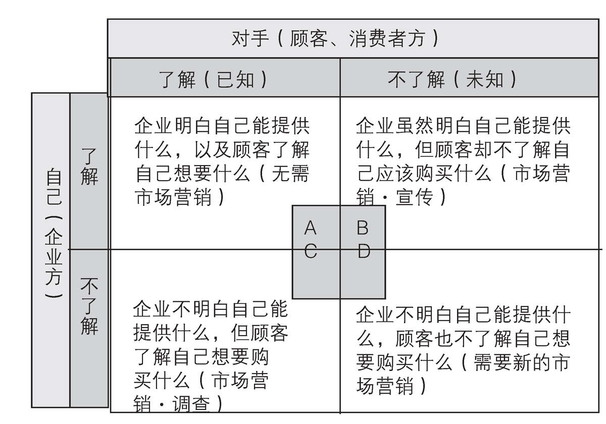
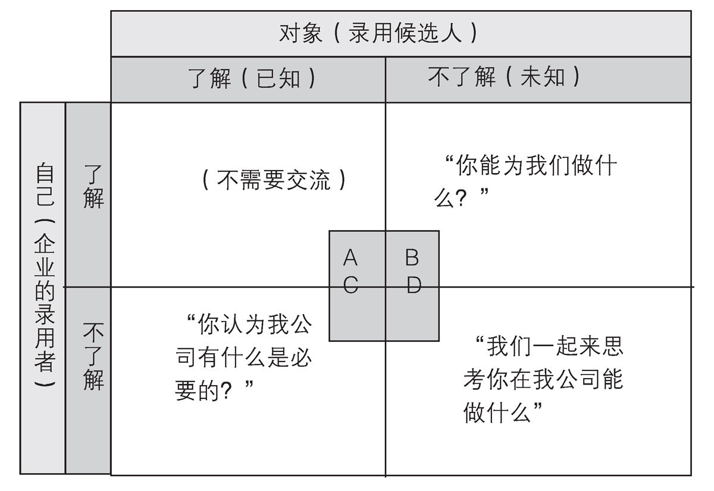

第6章 『市场营销困境』的暴露与克服方法
--------------------------------------

### 1．"市场营销=销售机制化"论的界限

随着市场营销的手法日益普及，顾客也开始了解这一手法，从而必然导致他们会进行更为理智的消费行动。

对于商品化产品，顾客会选择更为廉价的东西。此外，针对带有附加价值，进行了"差别化"处理的高价商品，顾客则会以更为严格的目光去思考"我是否真的需要它"。

在这种"市场营销成熟化"的状况中，如果进行简单粗暴的市场营销只会产生反效果。

比如过于热情推销反而会让顾客认为"这不会是滞销商品残留的库存货吧""这应该是手续费很高的商品吧"，从而产生"销售方有所图"的错觉。

此外，还有顾客会看出"销售者是将我划分于这个区域来介绍产品的吧"，（如果事实并非如此，先暂且不提）因此降低购买意愿（比如便利店等地的POS系统收银台有划分性别年龄的键，如果这被顾客偶然间看到的话，一旦对此键位的分区感到不快，可能就会从此远离该店）。

如果是因为职业原因熟知市场营销手段的人，往往会更反感销售者的战术。

突出长处，隐藏劣势，当人们熟悉这种巧妙的市场营销惯例之后，反而有可能让顾客察觉"这种商品的弱点原来在这"。

至此，即使依旧贯彻"重视顾客"的座右铭，但作为销售者的本质理论性基础的市场营销却遇到了瓶颈（重视顾客的销售者理论开始出现矛盾
）。

购买者可能会认为接受销售者的市场营销对自己不利。怀着"零和博弈论"思想的高额消费者更容易产生这种疑虑。这一状态被称作"市场营销的困境"。

因此也可以选择不做任何营销。不过在此我们还是探讨一下是否有其他的市场营销可能性。

#### 从交流的视角来考察市场营销

由于直接销售商品的市场营销遭遇了瓶颈，于是逐渐形成了将市场营销看作与顾客之间的交流的趋势。

当然，交流视角的市场营销在市场营销2.0的时代也很受重视。比如利用大众传媒做广告宣传和进行问卷市场调查就是典型的例子。通过分析问卷调查的结果来推测宣传效果，并作为之后市场营销的参考，基本来说还是在等待顾客购买。

不过随着市场营销瓶颈的日益明显，今后的市场营销（3.0）的重点将逐渐偏向交流，这也是与2.0最本质的不同。

市场营销2.0是由企业告诉顾客"正确答案"（告知顾客应该购买什么商品），或者是由顾客告诉企业"正确答案"（了解和调查顾客想要购买什么商品）。但在市场营销3.0中却是预先设定这两种情况并非正确答案，从交流的角度去一探究竟。

为了让大家能更明确地理解3.0，在此稍作详解。

#### 参考"周哈里窗"，思考ABCD模式

心理学中有名为"周哈里窗"的模式，我们参考此模式，用图表来进行视觉性的说明。"周哈里窗"解释了处于交流中的自己与对手的立场，不过在市场营销的环境中，我们将"自己"替换为"企业"，将"对手"替换为"顾客"。

A状况为企业明白自己能提供什么，以及顾客了解自己想要什么。

图表20 市场营销·交流中的ABCD模式

纵轴为本公司（的管理者），横轴为消费者，通过各自的状况来表现市场营销方式的不同。A领域的状态是长期运营的企业交易的典型。B领域必须进行市场营销宣传，C领域必须进行市场营销调查，D领域的开拓则是今后市场营销的课题之一。

B 状况为企业虽然明白自己能提供什么，但顾客却不了解自己应该购买什么。

C 状况为企业不明白自己能提供什么，但顾客了解自己想要购买什么。

D 状况为企业不明白自己能提供什么，顾客也不了解自己想要购买什么。

A总之在企业与顾客的关系中，如果企业与顾客彼此了解，那么在市场需求方面也就不会存在问题。

如果企业知道顾客想要什么，而顾客也了解能提供自己所需产品的企业，那么供给与需求就不会发生冲突，不过在现实中，这种情况极少出现（仅限定于黎明期或是特定区域）。

再来看B也就是企业了解自己但顾客不了解自己的状况，于是企业方必须积极地进行宣传推广。简单来说，也就是所谓的"营业"领域。

然后是C如果企业不明白自己能提供什么，但顾客了解自己想要购买什么的话，企业则需要进行市场调查。

接下来我们详细探讨一下这种情况。

### 2．以ABCD模式思考市场营销2.0～3.0

B需要消除顾客对商品的认识不足，C则需要顾客告诉企业你所想要购买的究竟是什么。B与C都属于企业与顾客之间出现了隔阂，于是需要解决这种彼此认知不平衡的状态。

在B情况下，由于信息不对等，企业要对顾客进行说明，例如"你还不了解这个产品""还有这种产品""还有这种使用方式""请从这个角度了解商品特性"等，让顾客恍然大悟"啊，原来还可以这么使用啊"。也就是让顾客脱离一无所知的状态，了解企业的一切。通过填补这一漏洞来提高销量的思维方式就是所谓的宣传推广。

那么在C情况中，企业该如何与顾客交流呢？此时就需要进行市场调查或问卷，不耻下问："请告诉我你喜欢什么，因为我
不了解，也不知道该怎么做"。

比如在时尚界领域，如果青少年们认为"找不到自己想要的衣服"，企业就可以试着询问"你们现在流行什么？请告诉作为制造商的我们（然后我们会为你们制作）。"

B和C都是需要尤其注意STP的阶段。B处于要强化4P，尤其是推广的状态，C则处于要将重心放在市场营销调查方面的状态。

#### 推广与调查之间的平衡

如今日本市场整体的预算分配中，推广预算一年约6兆日元，调查预算则为2000亿日元。也就是说，调查预算仅为推广预算的30分之1。考虑费用带来的效果的话，根据用途的特性不同，效果会有所不同，也难以断言基础金额，不过从企业与顾客之间的交流平衡来看，大致情况是"告知顾客"要多于"倾听顾客的意见"。

即使在市场营销2.0的状态中，也是"问"多于"交谈"。

#### 针对D领域的方法

市场营销3.0有针对企业与顾客彼此都不了解的领域，也就是D领域的方法。而目前引发的争论是，这方法是否是必要的。

当然，无论多么优秀的企业家都难以断言"市场营销2.0已经尽善尽美"，于是普遍意见是尽力贯彻市场营销2.0，尽量使状况不至于发展到D阶段，努力将其控制在B与C的领域。

但将目光投向D的理由很明确，其一是第5章中提过的商品化带来的低廉化和差异化处理瓶颈，另外则是本章开头提出的，由于市场营销出现了困境，只贯彻B与C的市场营销战略难以为继，并且丢失的市场越来越大。

P&G的措施等就是D的典型例子。

#### 作为市场营销2.0的优等生，P&G踏出了新的一步

P&G在提出"连接&发展"这一主旨后已经过了10年。

P&G是彻底实施STP的公司。作为走在市场营销2.0最前端的企业，它的下一个营销手段就是让顾客与企业进行联动，也就是"连接&发展"这一事例。这不是让企业单方面制造，而是请顾客参与协作，有时是自己制作竞争商品，有时还会和竞争中的其他企业一起制造商品。

以下是P&G在官网上公布的公司信息概要。

"我们采用世界上最聪明的人，创造并使用最棒的市场营销指南，在此基础上，我们曾产生过自以为了解顾客的傲慢之情，不过那个时代已经过去了，如今我们会和顾客、伙伴，甚至竞争对手一起进行项目合作"。

P&G以顾客也了解我们所知的东西为前提，如今已经创建了约50个项目（连接&发展）。在美国日用品市场中占有压倒性份额的P&G花费了巨额市场调查费（3.5亿美元），在日本市场也投入了20%左右的市场调查费，但依旧发现今后的产品开发前景堪忧。这种状况也正是市场营销2.0逐步往3.0转移的象征性事例。

#### P&G的措施

让我们来看看P&G在1990年代后是如何逐步从市场营销2.0往3.0转移的吧。P&G是严格贯彻了从STP到4P的市场营销2.0的企业。

但即使是P&G也不得不开始面对以定量分析为中心的市场营销2.0的瓶颈。

其原因是将顾客像以前那样划分到明确的细分市场范围内变得越来越难，比如单独的一个人往往会在各种情况下跟随大趋势来模仿其他人的行动。

此外，问卷调查等传统型市场调查手法虽然能帮助企业掌握顾客的表面需求，但很难了解其潜在需求。

今后市场营销的世界中将会用到"INSIGHT"这个词。"INSIGHT"直译为"洞察"之意，在市场营销中则是指"顾客本身也尚未察觉，且难以用语言表示的（能够实现商业化的）潜在需求"。P&G发现了它的重要性。

要弄清"INSIGHT"，单纯靠搜集各种样本并对其进行归纳分析的市场调查已经落伍，必须寻求另一种方式。而这种方式的
重点不是在纸上或电脑上加工而成的数据（二次情报），而是与顾客的直接接触（一次情报）。

比如亲自去特定产品的购买现场或使用现场，通过观察顾客得到第一手信息。

P&G从1990年代后期也开始逐渐增加了让公司员工亲临卖场和使用现场的机会，从而获得一次情报。在了解顾客之后，与顾客一起前往购买地或使用地，直接观察顾客行动，有时还会直接进行现场采访。

通过这种手段，P&G才发现美国和墨西哥主妇的洗涤剂使用方法原来有所不同，于是不仅针对产品，还对包装都进行了改善，以方便当地人使用。

#### "连接&发展"

让我们具体看看P&G是如何通过与顾客和外部的合作来进行产品开发的吧。P&G的产品中曾有过"旋转电动牙刷"这一产品，它是冲牙器（刷牙、牙刷相关）的核心商品。

但1990年代后期，冲牙器部门中的电动牙刷其实是P&G的弱项。当时的P&G企业内部并不具备电器制品的技术知识。那时企业在偶然间听说外部发明家提出"为什么不将旋转球（旋转糖果的产品）技术应用于电动牙刷上呢？"。

以此为契机，P&G推出了"旋转电动牙刷"并大获成功。之后，旋转电动牙刷创造了近10亿美元的业绩，这也是P&G第一次感受到外部资源的实用性。

接着再给大家介绍一个事例，主角是薯片商品中有名的"品客"。这一领域也是难以对核心特性进行差异化处理，P&G虽然想利用印刷技术对薯片进行图片和文字的差别化处理，但仅凭企业独有的技术很难尽善尽美。于是P&G决定利用世界性网络探索外部技术，并很快发现意大利的某乡村大学发明了在意大利面上印字的技术，于是导入该技术并运用于商品中，由此获得了成功。

通过这些事例，P&G的产品开发变得更为开放，更加重视与外部个人或组织的合作。

2003年，拉斐尔CEO正式将"连接&发展（C&D）"纳入正式的企业战略。其含义就是结合本公会技术与外部技术（connect），开发新产品（develop）。不仅运用市场营销2.0中的研究开发（R&D），更进一步探寻3.0时代中该如何实现连接
与发展。

#### 与C领域不同，针对D领域的市场调查手法特征

纯粹的问卷调查（以及相关归纳分析等）当然还会用到，但最近常用的却是"行动观察"
手法。我认为这是尤其适用于D领域的方法。

"你喜欢哪个？左边还是右边？"被问及这个问题的话，大部分人都会回答某一边的吧。企业事先当然不知道顾客会选择哪一边，回答的人也并非完全了解之后再做选择，反而通常是一头雾水。在为其做商品说明之后，顾客可能会恍然大悟"啊！原来如此"。那么他们是如何做出选择的呢？通过观察这一点就能向D领域前进一步（行动观察的手法正式引入日本是在2000年之后）。

此外，从顾客言语之间窥探真相，或是从网络中让顾客尽情发言，观察者再从中寻找线索。这就是所谓"Marketing
Research Online Community"。我们不将其称作"问卷调查"，它更像是
从高处俯瞰众人围坐闲聊。这种方式也就是充分意识到D领域之后所采取的手段。

关于市场调查手法的具体介绍会在第8章中重新进行说明。

Q&A

如何取得市场营销2.0与3.0之间的平衡

------市场营销2.0止步于C阶段，要发展之后的手段则必然逐步进入D领域，但贯彻B中的PR和C中的市场调查也是非常重要的，甚至有意见认为不踏足D领域也可以。

的确，彻底贯彻B与C领域的方法也算是非常先进的手段。最近推广（B）与市场调查（C）之间的边界更是日益模糊。也就是说，在对话中了解顾客对商品和企业活动的意见，希望能通过"如果这么做就好了"这类对话来提高顾客对品牌的信任感等。通过加深彼此的了解，逐渐填平认知隔阂，在重复进行B与C的交流中达到更为深层次的A领域。

与此相对应的是，针对D领域的方法则截然相反。它是顾客与企业均处于迷茫状态时彼此一同寻找能够双赢的方法。

如果说市场营销3.0其实很简单的话，其原因也就在此。如今很多企业都已经将目光投向了D，不过由于D目前仍处于不明的状态，对于应该选择怎样的方法，也开始有各种讨论。当顾客不知道自己想要什么的时候，企业是否能提供让他们满意的产品也是未知之数。这也是理所当然的担忧。

前述P&G的事例也表达了一个意思，那就是让企业和顾客一起探索D领域的新产品。

#### 在D领域发现"蓝海"（Blue Ocean）

当我们第一次看到iPod时，许多人为其崭新的理念和设计而惊叹。而它作为前所未有的新产品，居然会让顾客瞬间产生想要拥有它的念头，这难免有些不可思议。当人们看到它的时候，会不由得产生"为什么之前都没有类似产品"的疑问。我认为这就是接近于D的感觉。

根据"蓝海"的脉络可以对此进行说明。顾客从未见过的，充满魅力的未开发市场（Blue
Ocean）在这种定义下很容易出现在D领域中。

而D领域的特征是难以被模仿，因此在一定期间内，产品都能在该市场占据极大优势。

相反，在B与C领域中，无论如何贯彻与投入精力，只要各竞争企业在明确的地盘内展开胜负之争，市场就很容易红海化（Red
Ocean）。

#### 蓝海战略的定义

所谓蓝海，简单来说就是指"非竞争市场"，是与残酷竞争市场（这被称作Red
Ocean"血之海"）相对应的概念。蓝海是新开辟的市场，市场内没有新的经济改革和措施，并且难以陷入价格竞争，可谓是宛如能在大海中自由畅游一般的商业区域。

与此相对的，红海则是极其陷入价格竞争的严酷市场。而容易被模仿的商品即使属于新市场，也会很快被红海化。

蓝海也有可能随时被红海化。发现蓝海，并在发现它之后继续保持蓝海状态，这是市场营销的一大主题。

#### D领域中必要的是"天才的直觉"还是"对话的开放化"

此外，针对D领域的方法不止一种，其中就包括"天才的直觉"这一方法。

譬如苹果公司的史蒂夫·乔布斯就拥有能准确定位人们梦寐以求的产品的直觉。

事例之一是90年代后期，回到苹果公司的乔布斯立刻着手开发名为"iMac"的一体机。据说为了集中资源，甚至暂停了其他正在开发中的PC。而在此情况下，也有企业高层对乔布斯进言，声称根据市场营销调查的数据显示，一体型PC很难销售。

然而，乔布斯却淡淡地表示："我不记得有委托你们准备市场营销的资料。如今我们只需要专注于制造我们想要制造的东西，也就是今后将轻易连接整个网络世界的个人电脑：iMac。"也就是说，乔布斯根本不在意一体型PC的分区，只是专注于如何创造前所未有的新产品。

iMac最终完成并获得了极大成功，从而将苹果公司从财务危机中解救了出来。

### 3．"对话型方法"的必要性

乔布斯这样杰出的人才毕竟屈指可数，那么企业该如何挑战D领域呢？

自认不是天才的企业家所采取的正统市场营销3.0方法被称作"对话型方法"。这些企业不了解新的需求，而顾客方也不清楚自己想要什么，双方在此基础上协同合作，也就产生了"一起探寻新事物"的方法。

这一方法的起点是将企业与顾客放在对等的立场。通过"如果有这种东西的话我可能会想要购买""我们也许能制造这种产品"等交流对话，让无天才坐镇的（也就是极其普通的）企业逐渐从市场营销3.0中找到隐藏无数潜能的方法。

#### D领域是未来目标

本书的前半部分曾说过，市场营销就是最大限度地利用有限资源的方法。将其进一步延伸的话，就是只要能定义主要条件，就能追求效率。但如今，对于究竟该以什么为目标经常是众说不一，这时针对效率性的定义就进入了另一个阶段。

大多数日本企业都有各自的疑惑。既然不知道该往哪个方向发展，那么即使讨论效率，最终可能也只是白费功夫。

如果能明确今后的目标，针对目标做出调整，就能进行推广，或是当在AIDMA\[1\]的过程中遇到障碍时，能制定跨越障碍的计划。这就是思考，也是STP领域中确认过去数据后针对弱点进行改善的构想。

市场营销3.0中，目标性将达到未来领域，提供和开发前所未见的产品（进一步与顾客共享），也就是将涉及尚未存在的东西。

市场营销2.0领域擅长比较和分析过去与现在，但正因为擅长于此，于是越来越倾向于将时间投入这一部分，反而形成了心
理桎梏，导致难以诞生新事物。

当然，我们能从过去的数据与事例中总结有益的经验。以事实为基础，整理过去之大成，决定战略方向，从而得出成果。这是1990年代的MBA思维。但和市场营销一样，MBA也面临着困境。

具体详情可参考亨利·明茨伯格的著作《MBA摧毁公司》（日经BP社）等。原本应当思考如何使企业未来走向成功的经营学硕士，却在被过去的事例或成功经验束缚了自己，这实在是一种极具嘲讽意味的状况。当从过去学到的经验成为僵硬的规则，对现状的分析也带有必须承认现状的偏见时，就会造成反效果。

今后展望未来，将现实作为未来的基础的做法才是最先进的企业营销方式，而这也与市场营销3.0的发展方向密切相连。

#### 业种、业界的STP区别开始失去了意义

针对STP的界限所提出的直截了当的问题，以下都属于典型例子。

"迪士尼是什么，属于什么业种？服务业吗？苹果公司呢？
是制造业吗？那么iTunes Store和iPod呢？制造业？销售业？还是服务业？"

曾经属于客观分区典型的业种区分逐渐失去了意义。乔布斯在介绍自己公司PC时曾说过："它是属于创造性人类的'心灵自行车'（不用花费太多力气就能到达更远的地方）"，那么将苹果公司当做电脑制造商的人在听到这番话时恐怕难以理解其含义吧。

他对PC的追求并不是高规格，他的目标是在别的方面，例如用户在绘图时是否能用鼠标享受绘图的乐趣。极端一点来说，甚至是只为了顾客的这点乐趣，他不惜投入巨资。

当然，无论是企业内部还是顾客，都有人认同这种观点，也有人不认同。

这时，认同该观点的人共享价值观，不认同的人则往另一个更为重视效率的世界前进。

这并不是要断言哪一种才是正确答案，今后的时代由主观价值观来分区也将会有更大的影响力。

如今各种价值观混杂，业界的根基也开始动摇。例如曾经以"效率性重要""经验重要"这一顺序进行判断的方法也逐渐不奏效了。

共享价值观的人可以聚集起来彼此协作，制造产品和服务。而这一方法论是曾经的STP那墨守成规的风格所难以实现的，也许你们已经从最近的市场营销相关讨论中感受到了这一点。

针对D领域的方法与市场营销3.0的流程也是这一方向的延伸，在各种必然经历的错误尝试中逐渐摸索成形。

#### ABCD模式与全企业战略（人才获得）

源于ABCD模式的构想被先进企业用于选拔人才时的分析。在图表21中，A为不会引起太大问题的简单状况，或者说是被采用状态。B则是企业方提出"你能在我公司做什么"或是"你能做什么"，然后采用能满足条件的人。C则是对极其优秀的人表示："如果你所擅长的技能暂时不能用于本公司的话，你有什么看法？"无论企业是采用还是放弃此人，都能得到关于自我公司的分析评价。在D领域中的人才采用方法首先是和对方一起考虑究竟能做什么。

图表21 人才获得与ABCD模式

将ABCD模式应用于人才获得中（A为已经了解的人）。在人才录用的交流中，B→C→D的流程是逐渐变化的。D的手法大多是更为先进的企业挑选优秀且独特的关键性人才时使用。

它的最大特征是不考虑雇佣者与非雇佣者之间的关系，也就是将企业与个人放在平等的立场上，以同样的视角去思考"对社会能有什么贡献，该如何才能做出贡献"。不过这一水准的前提是要有超出B与C所要求的压倒性能力。

------------------------------------------------------------------------

\[1\]AIDMA是指 ①Attention ②Interest ③Desire ④Memory
⑤Action的略语，假设顾客会按照这一流程来决定是否购买。
