### 第5章｜心灵的转变

#### 重新看世界

我们都有一种天性，喜欢完成拼图游戏，喜欢看到整个图像显露出来。一幅人物图像，或一朵花，或一首诗，它的美丽在于其整体的显现。有趣的是，英语里"整体"（whole）一词和"健康"（health）一词，来自同一个词根［古英语hal，如在"精神矍铄"（hale
and
hearty）短语里］。由此看来，今天世界的不健康程度，与我们不能把它看成一个整体的程度直接成正比，也就并不奇怪了。

系统思考是观察整体的修炼。它是一个思考框架，用它来观察的是相互作用的关联，而不是各个分立的东西；用它来观察的还有变化的模式，而不是静态的"快照图片"。它是一组普遍原则------是从20世纪发展起来的现代物理学、社会科学、工程设计学和管理学等多种学科中逐步提炼出来的。系统思考同时还是一组具体的工具和技术，主要来自两个领域：控制论中的"反馈"概念，和起源于19世纪的"伺服机制"（Servo-mechanism）工程理论。过去30年里，这些工具已经被广泛应用于公司系统、城市系统、地区性系统、经济系统、政治系统、生态系统，甚至生理系统的研究中。
1
另外，系统思考还特指一种敏感度（sensibility），用来体悟和辨别赋予生命系统以独特个性的微妙的相互关联。

今天，系统思考比以往任何时候都更重要，因为我们所面对的复杂局面对我们的压力越来越大。也许是有史以来头一次，人类能制造的信息量，远远超过任何个人所能吸收的；人类培育的相互依赖关系，远远超过任何个人所能掌握的；而且，人类能够实现的变化速度，也远远超过任何个人所能跟得上的。有一点可以肯定，那就是复杂性的规模是前所未有的。我们周围到处是"系统性故障"（systemic
breakdowns）的例子：全球变暖、气候变化、国际贩毒、美国的贸易和预算赤字等等，这些问题都没有简单的局部成因。类似的情况是，尽管有出类拔萃的个人和创新产品，组织机构还是在发生故障，因为它们无法把各种功能部门和各类杰出人才，集合成一个富有成效的功能整体。

复杂性局面很容易损害自信心和责任心。我们常听到此类托词："这对我来说太复杂了"，或"这是体制问题，我没办法"。这类无助的感觉，是很多人在进入"相互依存的时代"所经历的，而系统思考就是其对症良药。系统思考是观察复杂局面背后的"结构"的修炼，也是区分高杠杆效益和低杠杆效益变革措施的修炼。也就是说，通过看清整体，我们学会如何培育健康。为此，系统思考提供一种语言，它一开始就帮助我们重构思考方式。

我把系统思考称为第五项修炼，因为它是本书所描述的全部五项修炼理念的基石。全部五项修炼都是关于一种心灵的转变，即从观察局部到观察整体；从把人看成是无助的反应性动物，到把人看成是塑造自己的现实的积极参与者；从对当前的反应，到创造未来。没有系统思考，就没有在实践中整合这些学习修炼的动力和方法。作为第五项修炼，系统思考是学习型组织如何看待世界的基石。

在《第五项修炼》英文第一版中，我对当时需要系统思考的最"令人伤心的例子"进行了分析。这就是美苏军备竞赛------"一场看谁能最快到达没人想去的地方的竞赛"。我曾说过，那场悲剧式的"竞赛"已经"削弱了美国经济，并且压垮了苏联经济"。最后我写道，这种局面只有当对手中的一个决定不再"愿意玩"下去时，才能改变。具有讽刺意味的是，这段话写完不到一年，苏联就解体了，悲剧式的美苏军备竞赛也戛然而止了。然而，今天美国和世界大多数国家，又陷入另一场似乎在抢着到达没人想去的地方的竞赛，即所谓的"反恐战争"。

反恐战争的根源和美苏军备竞赛一样，不在于政治意识形态之争，也不在于具体的军备，而在于双方都共有的一种思考方式。比如，美国的主流社会被如下观念所主导：

 

-   恐怖袭击→对美国人的威胁→军事反应的需要

 

而恐怖分子对自己的处境的看法大体如下：

 

-   美国的军事行动→感受美国的侵略性→招募恐怖分子

 

从美国的角度看，基地组织一类的恐怖组织是侵略者，而美国的军事扩张是应对这个威胁的防御反应。从恐怖分子的角度看，美国在经济和军事上都是侵略者，恐怖分子招募活动的扩大，正是这种看法被广泛接受的证据。

但是，上面的两条直线可以形成一个圆圈。两个对手各自的"线性的"或非系统的观点，相互结合构成一个"系统"，即相互影响、相互作用的一组变量。

反恐战争的系统观揭示出一个相互攻击的恶性循环。美国对从自身角度所看到的"对美国人的威胁"作出了反应，那就是增加军事行动。这又导致"感受美国的侵略性"增加，于是就有更多的"招募恐怖分子"的活动，更多的恐怖活动，和更多的"对美国的威胁"，更多的美军行动，以及更多的"招募恐怖分子"活动，如此等等，循环不止。从双方各自的角度出发，他们都只注重自己的短期目标，都在对感受到的威胁作出反应。但是他们的行为最终对大家都带来逐步升级的危险。这里就和其他许多系统一样，做最显而易见的事，并不会产生显而易见的、希望看到的结果。双方各自费尽精力，却带来对大家都是越来越不安全的长期后果。

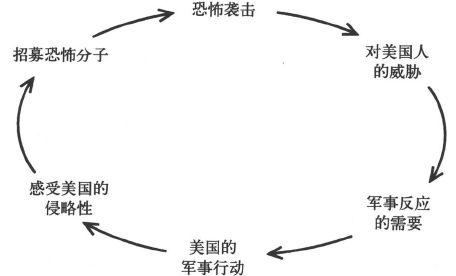

有趣的是，尤其是美国，尽管有大量"系统分析师"在研究恐怖分子的各种武器和资源状况，使用了最先进的信息技术，包括复杂的计算机模拟分析，但却不能采取真正的系统观点看问题。
3
那么，为什么这些本来被认为是处理复杂问题的工具，却没能使我们跳出反恐战争的不合逻辑的怪圈呢？

原因与工商界一样：高度发达的尖端预测工具和商务分析工具，以及精确的战略规划，通常都不能给企业带来管理的突破性进展。这些工具都是用来处理那种有着许多变量的复杂性问题，即"细节复杂性"（detail
complexity）问题的。但是，还有另一种复杂性，即"动态复杂性"（dynamic
complexity）。这种复杂性出现在因果关系很微妙的地方。那里，介入措施所带来的时空效果并不是显而易见的。通常的预测、规划和分析方法，都不足以处理带有动态复杂性的问题。依据一系列复杂的操作规范来组装一台机器，就是带有细节复杂性的任务，而在折扣零售店组织库存清单也是。但这些都不是带有动态复杂性的情况。

当同样的行动会带来并不相同的短期和长期效果的时候，动态复杂性就显现了。同样，当一个行动在局部产生一种结果，而在系统的另一部分却产生了截然不同的结果，这也有动态复杂性的作用。当显而易见的措施却产生了并非显而易见的结果，那也是动态复杂性的局面。陀螺仪就是一个动态复杂性的装置：如果向下压它的边缘，它却向左运动；而如果从另一端的边缘向左推，它却向前运动。然而，与企业的复杂动态作用相比，简单的陀螺仪是微不足道的。在企业里，生产某种产品需要许多天时间，推进新的市场营销计划需要许多星期的时间，雇用和培训新员工需要许多个月的工作，开发新产品、培养管理才能和建立质量信誉则需要许多年的工夫------而所有这些过程之间又在不断地相互影响着。

在绝大多数管理工作中，真正的杠杆效益在于理解动态复杂性，而不是细节复杂性。市场增长和产能扩张的平衡就是一个动态问题。对价格、产品（或服务）质量、设计和可获得性（availability）进行有益的混合配置，以赢得稳固有利的市场地位，也是一个动态问题。以可持续的方式改进质量、降低总成本并让消费者满意，还是一个动态问题。

不幸的是，大多数系统分析都集中在细节复杂性问题，而不是动态复杂性问题。有数千变量和复杂细节的模拟分析实际上可能会分散我们的注意力，使我们眼花缭乱，无法看清结构模式和主要的相互关联。令人悲哀的是，对多数人来说，所谓的"系统思考"实际上就是"用复杂性对付复杂性"，就是用越来越"复杂的"（其实应该说"细节的"）解决方案去应对越来越"复杂的"问题。而这与真正的系统思考，实际上是相对立的。

反恐战争从最根本的意义上说，就是动态复杂性问题。对问题的起因和可能的解决方法的洞察，要求看清各种相互关联，比如美国为了达到更大的安全感而采取的措施，和对方所看到的侵略者形象之间的关联。这还要求看清在行动措施和结果之间的延迟，比如美国决定军事干预和恐怖分子招募活动增加这两者之间的延迟。而且还要求不仅仅看清静止的"快照图片"，更要看清变化的模式，比如对抗的持续升级。

看清问题背后的主要相互关联，就能找到可能的解决方法。比如反恐战争，与其他恶性竞争的关系模式一样，最明显的问题是："反恐战争能否逆向进行，以逐步建立一种安全的循环？"很明显，全球和中东地缘政治系统中有许多其他因素，在影响着前面所看到的简单的恶性竞争关系。但是，任何真实的进展将一定取决于更深层的洞悉，更深入地理解当地的人民自己（包括恐怖主义的支持者和潜在招募对象）如何看待安全问题，以及如何看待他们自己对发展和进步的真心愿望。简单化地从外部强加一种发展观念，特别是被视为对抗中的侵略者所宣扬的发展观，则无法减少对方所感受到的危险。

系统思考修炼的实质是心灵的转变：

 

-   看清各种相互关联结构，而不是线性的因果链。

-   看清各种变化的过程模式，而不是静态的"快照图像"。

 

系统思考的实践演练，要从理解简单的"反馈"概念入手：一些行动可以引起相互增强的效果，或相互抵消（平衡）的效果。这会让你逐步学会，如何识别反复出现的某些类型的"结构模式"。军备竞赛是普遍意义上的恶性竞争模式之一，其本质与街道黑帮之间的势力范围之争，与婚姻的解体，或者与公司之间因争夺市场份额而引起的价格战和广告战，没有什么区别。系统思考会逐步形成一种丰富的语言，来描述各种各样的相互关联和变化模式。它最终会通过帮助我们看清事件和细节背后的深层模式，来简化生活。

学习任何一种新语言，开始都会很困难。但随着你掌握了其基本要点，学习会变得更容易。研究表明，许多年轻的孩子都能相当迅速地学会系统思考。
4
似乎我们都有作系统思考的潜在技能，只是从未被开发，甚至还被灌输线性思考的正规教育所压抑。希望本书后面的内容能帮助我们重新发现这方面的一些潜在技能，并让存在于我们每个人自身的那个系统思考者"浮出水面"来。

#### 观察因果循环

现实存在是由种种循环所组成的，而我们却只看到直线。这就是妨碍我们成为系统思考者的初始障碍和局限。产生这种支离破碎的思考方法的肇因之一，就是我们所使用的语言。语言塑造了认知观念。我们能看到什么，是由我们有什么样的观察准备所决定的。西方语言的结构都是"主语---动词---宾语"模式，它自然偏向线性观念。
6
如果我们想看到整个系统范围的相互关联，就需要一种相互关联的语言，一种由形似圆圈的循环所构成的语言。没有这样的语言，我们习惯的看待世界的方法，就总是产生支离破碎的观点和事与愿违的行动措施------就像反恐战争的决策者们一样。这种语言对于处理动态复杂性问题和战略决策问题，尤其当团队、个人和组织都需要看清事件背后造成变化的影响力时，格外重要。

为了理解这种新语言的基本要点，我们来看一个简单的系统：往杯子里灌水。你也许会说："那太简单了，那不是系统。"但是，再仔细想想看。

从线性思考的观点看，我们说："我在往杯子里灌水。"多数人心里想的，就是下面的图景：

但实际上，我们在灌水时还在留意着水位的上升，在监视实际水位与我们心中的目标水位之间的差距。当水位上升到目标水位附近时，我们就关小水龙头，放慢水流量，最后杯子满了，就完全关闭水龙头。我们灌水时，实际上有一组由五个变量组成的水位监测系统：目标水位、实际水位、两者之间的差距值、水龙头开关的位置，以及水流量。这些变量组成一个因果关系环路或圆圈，叫做"反馈过程"。这个反馈过程持续运行，直到水位达到目标值。

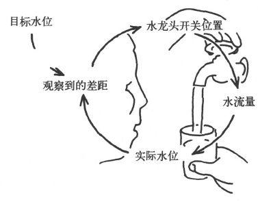

大家容易对反馈概念产生混淆，因为这个词我们经常用在不尽相同的场合，如：针对我们采取的行动措施去收集反馈意见。你可能说："对酿酒厂的决定，你给我一些反馈吧。你觉得我处理得是否得当？"这里，"正面反馈"是指鼓励赞许的评价，而"负面反馈"就是坏消息了。但是在系统思考里，反馈是范围很宽的概念。它指任何相互的影响作用回路。系统思考的一个公理就是，每一个影响作用都既是因，也是果。没有只存在于一个方向的作用。

------------------------------------------------------------------------

#### 如何看系统图

要想系统地看清现实，关键是要把影响力看做一个圆形回路，而不是直线的单向作用。"线性"思考让我们养成了反应式的思维模式。上述方法是打破这种思维模式的第一步。每一个圆都是一个故事。追溯影响力的循环运动，你会发现某些模式是在不断自我重复，一次接着一次，使局面变好或者变坏。

从某个局面中的任意组成部分，你都可以画出箭头，指出它会影响到的另一个组成部分：

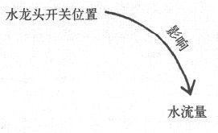

如上图所示，水龙头开关的位置通过箭头指向了水流量。水龙头开关位置的任何改变，都会影响水流量。但是箭头绝不会孤立存在：

我们要把故事看下去，可以从其中任何一个组成部分开始，看着情节按照相应的顺序发展，就像玩具火车沿着铁轨一圈一圈地进行周而复始的旅程。从决策者的行动开始追溯下去是一个不错的选择：

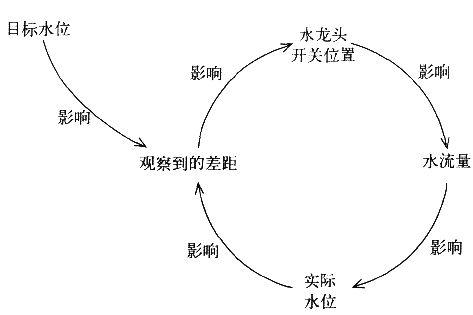

我调整了水龙头开关的位置，这改变了流入杯中的水流量，继而改变了水位。当水位改变的时候，感知到的差距（现有水位与期望水位之间的差距）同样改变。随着差距的变化，我再一次调整水龙头的位置，依此类推。

当解读一个反馈循环图表的时候，最主要的技巧是要能够看明白图表所讲述的故事：图中结构如何创造一种特定的行为模式（或者，在一个复杂结构中，多种行为模式）和此模式可能如何受到影响。在这个例子中，故事是说把水杯灌满，等水逐渐灌满，再慢慢把水龙头关掉。

------------------------------------------------------------------------

 

反馈环路尽管概念简单，但它打破了根深蒂固的观念------比如因果律。在英语的日常用法里，说"我在往杯子里灌水"，就意味着不假思索的单向因果律："我在引起水位上升"。更准确地说，是"我的手在控制水龙头的出水量"。很显然，这个说法只描述了反馈过程的一半：从水龙头开关的位置，到出水量，再到杯子里的水位。

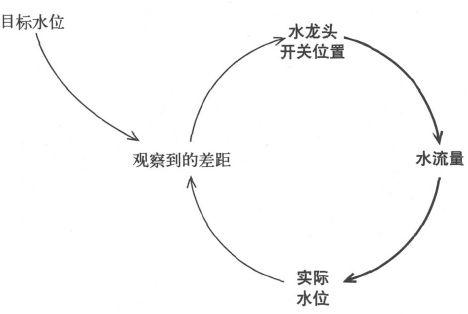

然而，只说反馈过程的另一半，也一样不错："杯子里的水位控制着我的手。"

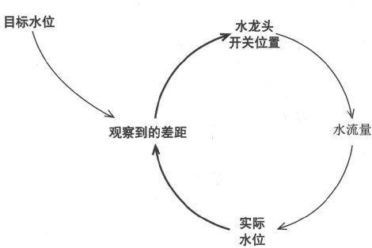

这两个说法都不完整。更完整的因果关系描述是：我想接一杯水的意图，创造了一个系统，它使水在水位低的时候流入杯子里，杯子满了的时候就停止水流。换句话说，有个结构引起了行为，而结构之所以起作用，是由于我的意愿和行动。这个区分很重要，因为只看到个别的行动，而忽略行动背后的结构，结果就会像第3章中的啤酒游戏那样。我们在复杂情况下感到无能为力，这是一个根本原因。

实际上，日常英语里的大多数因果判断，都很值得质疑！大多数判断都基于线性观察方式，最好的情形也仅仅是部分准确；它们基本上只偏向于描述互动过程的某一部分，而不是过程的全部。

反馈观点还打破了另一个观念，即人类中心论（anthropocentrism）------就是把我们自己看成活动的中心。简单的说法，比如"我在往杯子里灌水"，描述的就是以人类为活动中心的世界，那里的人类在操作一个无生命的现实存在。从系统观点看，人类是反馈过程的一部分，不能独立于这个过程之外。这从根本上改变了我们的意识。它让我们看到，在不断影响着自己的现实存在的同时，我们也在不断被现实存在所影响。这种意识的转变，也是生态学家们极力提倡的：我们必须把自己看成是自然的一部分，而不能与自然分离。这种意识的转变，还是世界上许多伟大的哲学传统所认可的。比如在《薄伽梵歌》（Bhagavad
Gita）中的"惩罚"（chastisement）一段，就有这样的话：

 

-   一切行动只能从自然的特性中产生。而陷入我执（egoism）迷惑中的自我，却认为："我是行事者。"

 

另外，反馈的概念还使有关责任的伦理道德问题复杂化。在反恐战争里，谁负有责任？从双方各自的线性观点看，责任很清楚：在对方身上。"是他们的侵略行为迫使我们作出回应。"线性观点总是要找出单一的责任中心。出了问题，要么责怪别人："是他、她或它干的"；要么内疚自责："是我干的"。从深层角度看，责怪别人和内疚自责没有什么区别，因为它们都来自线性思考方式。从线性思考出发，我们就总是要找出某人或某件事------要负责任的一定是他、她或它，有时甚至是我们自身的隐蔽代理。我儿子四岁时不想吃青菜，就说："我的肚子不让我吃这个。"我们可能会笑。但这与成年人把责任归于某处，比如"我的神经衰弱症让我不能信任别人"，难道有什么区别吗？

掌握系统思考，我们就会放弃这样的假设，即认为有某个人，或者某个隐蔽代理，要负责任。反馈的观点指出，每个人都要对系统中出现的问题负责。而这并不一定意味着，每个人都能对系统变革产生同样的影响和作用。

但这的确意味着，寻找替罪羊的办法是死路一条------尽管在像美国这样的个人主义文化盛行的国度，这是一种很有诱惑力的消遣游戏。

最后，反馈概念还揭示了我们的语言的局限性。即使是用语言描述很简单的系统，比如往杯子里灌水，也非常笨拙："当我拿杯子接水时，有一个反馈过程，让我调整水龙头的开关位置，进而控制水流量，以及杯子里的水位。这个过程的目的，是让水位达到我想要的高度。"这就是为什么需要一种新的语言来描述系统。描述拿杯子接水这样简单的系统尚且如此笨拙，可以想象，用日常英语描述组织机构中的各式各样的反馈过程，会有多么艰难。

所有这些改变都需要时间来适应。我们都习惯于用线性语言描述经历，都对描述因果关系和责任义务的简单陈述感到很熟悉、很适宜。这并不是说你必须放弃线性语言，就像你不必放弃英语而去学法语一样。在很多情况下，简单的线性描述就足够了，去寻找反馈过程反倒浪费时间。但是，在面对动态复杂性问题时，情况就不一样了。

#### 正负反馈和延迟：系统思考的积木块

有两种不同类型的反馈过程：正反馈和负反馈。 〔3〕
正反馈（或放大反馈）过程是增长的引擎。只要你处在增长的局面，一定就有正反馈作用。正反馈过程也可以产生加速的衰减：很小的衰减被放大成越来越严重的衰减，就像金融恐慌时银行财产的衰减情况一样。

负反馈（稳定反馈）起作用时，就有以目标为导向的表现。如果目标是稳定不动，那么负反馈的作用就像车上的刹车装置。如果目标是保持每小时60英里的速度，那么负反馈作用就会让车加速到每小时60英里，但不会再高。目标可以是明确的，例如公司的市场份额目标；它也可以是隐性的，比如一个坏习惯，尽管我们声称要去掉，但还是坚持不改。

另外，许多反馈过程都有"延迟"，就是影响作用过程中的间歇和中断，它使作用的结果逐渐才能显现出来。

系统思考语言中的所有观念，都是以这三个元素为基础建立的，就好像英语的句子基本上都是由名词和动词组成的。我们一旦掌握这些积木块，就可以构建系统故事，即下一章中的系统基本模式。

#### 正反馈：发现微小变化是如何增长的

你身处正反馈系统中，可也许就是看不见，很小的行动如何被放大，带来很大的结果------或好或坏的结果。而看清这个系统，往往就能让你影响其走向。

比如，经理人经常无法理解他们自己的期望值是如何影响下属的业绩的。如果我看到某人潜力很大，就会给予特殊的关注来开发他的这种潜力。当他成熟了，我就感到自己原来的判断很准确，于是就投入更多的精力来帮助他。反过来，那些被认为是潜力很差的人，就会由于被忽视和遗弃，而陷入懈怠和凋零状态，工作失去活力，而这又在我心中印证了我不重视他们的理由。

心理学家罗伯特·默顿（Robert
Merton）是第一位命名了这一现象的人，他称之为"自证预言"（self-fulfilling
prophecy）。 8 萧伯纳著名的话剧作品［后来被改编为《窈窕淑女》（My Fair
Lady）］还把这叫做"皮格马利翁效应"（Pygmalion
effect）。萧伯纳的这一命名来自希腊和罗马神话中一个叫皮格马利翁的人物，这个人十分强烈地相信他的雕塑作品就是美丽少女，以致雕塑最终得以活现，有了生命。

皮格马利翁效应在无数场合都有验证。 9
有一个在学校的例子：一位老师对一个学生的看法，影响了那个学生的表现。珍很害羞，在新学校的头一个学期，成绩特别不好（因为父母总吵架）。于是，她的老师就认为她没有学习热情。第二个学期，老师对她关注更少了，她的成绩仍然很糟，而且更害羞了。结果珍陷入了越来越糟的恶性循环：退缩，成绩差，老师的指责和归类，遭到忽视，进一步的退缩。像这样，学生就被无意中"圈进"对自己能力的自我形象定式：被重视的学生对外展示出的自我形象很高大；而成绩差的、陷入恶性循环的学生，对外展示出的自我形象就很差。

在皮格马利翁效应这样的正反馈过程中，有一点变化就能带来不断的自我增强。不管什么动作，一发生就会被放大，就会在同一方向上产生越来越大的动作。小动作得到滚雪球般的放大，同样的动作越滚越大，就像利上滚利。其中，有些正反馈（放大反馈）作用是"恶性循环"：坏的开端导致越来越糟的结果。"汽油危机"是个经典案例。一旦汽油紧缺的消息传播出去，到加油站排队加油的浪潮就被触发了。一旦人们看到加油站排队的场景，就对危机的到来深信不疑了，恐慌和囤积行为就被触发了。很快，即使油箱还剩大半箱油，每个人也都要去加满油，以防加油站没了油。一场暴风雪来临以前，同样的情况也会发生在食品和水上面，因为大家预计会出现电力中断和其他正常供给中断的情况。银行挤兑是另一个例子；而某种股票价格下跌的消息传出去以后，引发恐慌抛售浪潮，又是一个例子。这些都是逐步升级的结构模式：在不想看到的方向上发生一个小动作，就会引起不断加剧的恶性循环。

但是，正反馈并非一定都是坏事。还有良性循环，即在想看到的方向上不断增强的过程。比如，体育锻炼就能带来良性循环：你感觉良好，于是更积极地参加锻炼，于是感觉更好，于是锻炼更积极。反恐战争如果能持续地逆向进行，也会是一个良性循环。新产品的市场培育也是正反馈循环过程。例如，许多新产品都从"口口相传"，开始其市场增长的历程。产品口口相传就能有滚雪球效应（大众汽车的甲壳虫车型和苹果公司的iPod都是如此），满意的顾客告诉别人去购买产品，更多满意的顾客又告诉更多的人。今天的网络设备给分享信息（或歌曲）的行动增加了另一层正反馈机制：一旦有人使用某种网络设备，信息分享就只能通过同类的设备进行。

下面就是口口相传增加销售和满意度的正反馈示意图：

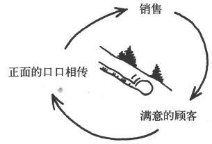

------------------------------------------------------------------------

#### 如何看正反馈图

#### 因为消费者谈论你的产品而产生的正反馈销售过程

下图显示了包含滚雪球效应的正反馈过程。同样，你可以随着这个过程，沿着循环走一圈：

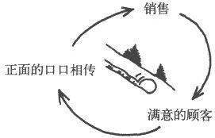

如果产品本身是个好产品，那么其销量越多，满意的顾客也越多。这意味着正面的评价也越多，进而会带来更多的销量，而更多的销量又将带来更广泛的好评，以此类推。反过来说，如果产品有缺陷，那么良性循环就变成了恶性循环：在购买了产品的顾客里，满意的人寥寥无几，也没什么正面评价，这将导致该产品的销量越来越少。

------------------------------------------------------------------------

 

正反馈环路的表现不是加速的增长，就是加速的衰减。比如，过去半个世纪的核军备竞赛，带来加速增长的核武器库。而银行挤兑则带来银行存款的加速衰减。

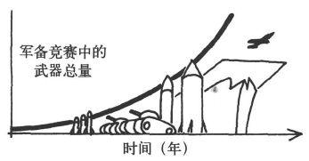

民间智慧对正反馈的描述有：滚雪球效应、流行效应、良性循环；还有特别场合的说法：富人更富、穷人更穷。在商界我们知道，为了建立对新产品的信心，为了发展一个年轻的组织，"锐势就是一切"。我们也看到了正反馈环路作用发生在错误方向的那些情况。"船沉鼠先逃"就是指，一旦有个别人丧失信心，他们的叛离会引起其他人的叛离，会带来腐蚀大家信心的恶性循环。口口相传也很容易逆向进行，产生市场营销灾难（如被污染的柜台销售药品）。

好消息和坏消息的正反馈环路都有如此大的加速度，以至于经常令人吃惊。一首法国学生的韵律诗阐释了这个过程。先是在池塘的角落里，仅有一片睡莲。但睡莲叶的数目每天都翻番，仅需30天就能把池塘布满。然而，在头28天，甚至都没人注意，没人看一眼。第29天，突然有一半池塘被睡莲布满。于是村民们开始焦虑起来，心神不安。但没什么办法了，事已至此，为时已晚。第二天，他们最担心的事出现了：睡莲把池塘全部占满。这就是为什么环境危机很叫人担心，特别是那种处于正反馈模式的危机：一旦发现，就可能为时已晚。物种的消失常常先是缓慢地、渐渐地加速，经过很长时间，然后突然濒临灭绝。公司的消亡也同样如此。

但是，单纯的加速增长或衰减，很少能在自然界持续，因为正反馈作用很少孤立出现。逐渐会有限制因素起作用：增长会缓慢下来，会停止，然后转移方向，甚至逆向返回。即使是睡莲，也会在布满池塘后停止扩张。这种限制因素也是一种负反馈------它是继正反馈之后，系统思考的第二个基本要素。

#### 负反馈：发现稳定因素和抵制的来源

负反馈系统是寻求稳定的系统。如果系统的目标是你所认同的，你会很高兴；如果不是，你就会发现你所有的变革努力都遇到了阻碍------直到你改变目标，或者削弱系统的作用。

自然界特别偏爱负反馈的平衡稳定作用。但人类却经常作出与这些平衡机制相悖的决策，并为此付出代价。例如，经理人在预算紧张的时候通常会压缩员工数量，以降低成本；但是他们会逐渐发现，剩余的员工工作压力过大，而且成本也没有下来，因为完不成的工作又得雇用外部人员，或者付加班费来完成。成本下不来的原因是，系统有自身的工作安排。它有自己隐性的目标，一种未经表述却又非常真实的目标------即预期要完成的工作量。

在负反馈（稳定反馈）系统中，有一种自我调节机制，来保持某种目标或指标。拿杯子接水就是一个负反馈过程，其目标是一杯水。雇用新员工也是一个负反馈过程，目标是某个数目的员工队伍，或某个增长率。开车或骑自行车也是负反馈的例子，目标是驶向某个方向。

负反馈过程无处不在，是所有目标导向的行为表现背后的机制。像人体这样复杂的机体，会有数千个负反馈过程来维持体温、保持平衡、愈合伤痛、调节瞳孔采光量，以及进行危机报警。生物学家会说，所有这些机制都是为了让身体得到"内稳态"（homeostasis），即在变化的环境中保持其生存所必需的内部条件。负反馈作用让我们在饥饿时进食，困倦时睡眠，寒冷时添加衣服。

和所有负反馈过程一样，关键要素指标，如体温，会逐渐调节到期望值，如下图所示。

组织机构和社会也像复杂的生物体一样，因为它们也有许多各种各样的负反馈过程。公司里的生产和采购过程，就是根据产品订单的变化来不断调整的；临时的（折扣）和长期的（目录）价格是根据需求变化和竞争对手的价格来调整的；而借贷则要依据现金余额变化和财务需求来调整。

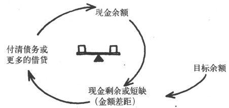

规划工作也能建立起长期负反馈的稳定平衡作用。人力资源规划可以建立长期员工队伍数量增长的目标和技能结构分布，以满足预期的需要。市场调查和研发计划决定新产品开发，以及对人员、技术和重要固定资产的投入，以建立竞争优势。

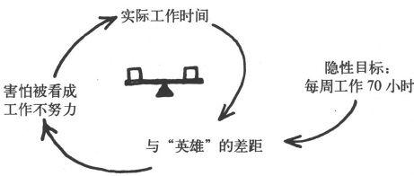

在管理实践中实现负反馈作用的难点在于，目标往往是隐性的，而且根本没有人承认有负反馈作用存在。记得我有位好朋友曾试图在他的快速增长的培训公司里，减轻专业人员的工作疲劳症，结果却徒劳无功。他发放备忘录，缩短工作日，甚至提前关闭办公室，锁上大门，都是为了阻止大家过度工作劳累。但是这些努力都被抵消了：大家不理会备忘录和缩短的工作日，办公室锁门的时候，就把工作带回家做。为什么会这样呢？因为在组织中有一条未成文的标准：真正的英雄，真正关怀事业并在组织中出人头地的人，都是每周工作70小时。这正是我的朋友自己，以过人的精力和长时间的连续工作建立起来的标准。

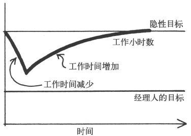

要理解生物体的运作，就必须理解其负反馈的平衡过程，包括显性的以及隐性的。我们可能掌握机体的许多部件，包括器官、骨骼、血管等等，但除非我们了解神经肌肉系统是怎样保持平衡的，并了解心血管系统是如何保持血压和含氧量的，否则就仍然无法理解机体的运行功能。
10
这就是为什么许多试图重新设计社会系统的努力都归于失败的原因。几年前，波士顿两家有出色病房护理传统的医院合并了。新医院很大，有一流的设备，但却失去了老医院各自特有的关爱精神和员工的忠诚。在合并后的医院里，原先存在的检测质量、关注员工需求以及与病人保持友好关系的微妙的负反馈过程，被新的管理结构和程序打破了。

负反馈过程虽然概念简单，但如果不加注意，却能够产生令人惊异、问题严重的表现。

总的来说，负反馈环路比正反馈环路更难于辨认，因为它往往看上去就像什么也没发生一样。没有戏剧性的营销业绩增长和市场工作开支，也没有核武军备或睡莲叶片。即使所有参与方都想要改变，负反馈过程仍旧是维持现状。刘易斯·卡罗尔（Lewis
Carroll）书中的红心女王有句话，说出了那种必须"一个劲儿地忙来忙去，事情却原地不动"的感受，而这就意味着，某种负反馈环路作用就在眼下发生着。

------------------------------------------------------------------------

#### 如何看负反馈图

#### 调节现金过剩或不足，使之达到平衡的负反馈过程

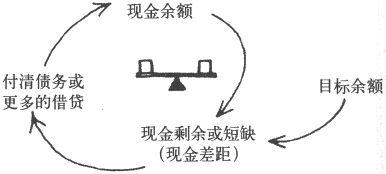

这张图展示了一个负反馈的过程。

要看清这个过程，从差距入手往往是最容易的。差距指的是期待值和现实存在之间的差异：

在这里，我们手中缺少足够的现金，不能满足我们现金流的需要。（换句话说，我们的期待和实际的现金余额之间存在着差距。）

接着来看为了弥补这个差距所采取的措施：

我们借钱，这使我们的现金余额增加，并使差距缩小了。

图中显示了一个平衡过程的运转，它总是以缩小期待值和现实存在之间的差异为目标。此外，目标值，也就是我们所期望的现金余额，会随着业务量的变化而升降。尽管如此，即使是目标正在变化，平衡过程仍会根据需要值来调整实际的现金余额。

------------------------------------------------------------------------

 

试图进行组织变革的领导者，经常发现他们在不知不觉中陷入了负反馈平衡过程。对他们来说，似乎自己的努力突然遇到了无中生有的阻力。实际上，就像我的朋友在试图减少工作疲惫症时所发现的，阻力是系统维持隐性目标的反应。在这种目标得以明确之前，变革的努力是注定要失败的。只要领导者仍旧被当做榜样，他的工作习惯就依然是公司的标准。他或者改变习惯，或者建立新的、不同的榜样。

什么时候有抵制变革的阻力，什么时候就一定有一种，或多种"隐藏"的负反馈作用。抵制变革的力量并不是变化无常的，也不是神秘的东西。对传统的习惯标准和做事方式的威胁，几乎总是它形成的原因。这些习惯标准往往已经被编织到既有的权力结构关系网之中。这些习惯之所以根深蒂固，是因为控制力和权力的分配已经根深蒂固。与其使劲儿去克服阻力，有领导艺术的领导者，会去分辨阻力的源头，直接聚焦在隐性的习惯标准及其所依赖的权力结构关系上。

#### 延迟：事情会发生的......等时候一到

我们已经看到，系统似乎有自己的主见。这在延迟上反映得最明显。延迟就是在行动和结果之间的间断和空隙。它可以让你行动过火，搞得适得其反；但如果你能够辨认并应对它，它又能给你带来积极的效果。

模拟器件公司前CEO，马萨诸塞州高科技委员会（Massachusetts High Technology
Council）创始人斯达塔，在他发表在《斯隆管理评论》（Sloan Management
Review）杂志上的一片经典文章中说："系统绩效改善工作最有效的杠杆作用点之一，就是把系统的延迟缩减到最小。"斯达塔这里指的，是

在人类社会系统中，行动和结果之间的延迟无处不在。我们现在的投入，是为了在未来得到回报；我们今天雇用一位员工，要等到几个月以后才能使他完全有效地适应工作；我们把资源投入到新项目中，几年以后才能得出期望的结果。但是，延迟常常不被人理解，进而产生不稳定局面。比如啤酒游戏里的决策者，就错误地判断了延迟，他们觉得自己的订单该到货的时候，延迟却总是让订货无法到来。

当某个变量的作用需要经历时间来影响另一个变量的时候，延迟就出现了，它成为系统语言的第三个基本要素。几乎所有反馈过程都有某种延迟，但却不被人注意，也不被人很好地理解。而这往往导致当事人"做过头"，即在追求期望的目标时走得太远，做过火了。进食和感觉到吃撑之间的延迟，是对许多用餐者的惩罚。我们本应停止继续吞咽的时候，并不觉得很饱，于是就继续吃下去，结果吃得太多。新开发的建设项目从开始到完工之间的延迟，导致房地产市场过热，最终致使一些开发商被淘汰。在啤酒游戏里，下订单和收到订货之间的延迟经常导致过量订货。

未经辨别的延迟，尤其是拖得很久的那种，还可能导致不稳定和失常的故障。比如调节淋浴水温，10秒钟的延迟就比一两秒的延迟要困难得多。

------------------------------------------------------------------------

#### 如何看延迟图

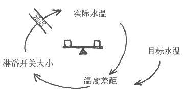

上图描绘的是伴有延迟的负反馈过程：水温变化迟缓的淋浴。

这还是我们之前的"杯子---水龙头灌水"反馈图------但是这次，我们用老旧的管道。现在，从你打开水龙头到感觉到水温发生变化，这之间会有很长的延迟，在图中用两条短线的间隙表示。

短线的间隙不会告诉你延迟有多少秒（或是多少年），你只知道延迟长到足以对结果产生影响。

如果沿着带有延迟间隙的箭头走，你在脑海中默想这个故事的时候，会加上"终于"二字。"我转动了水龙头，水流终于改变了"或者"我开始了一个新的建筑工程，房子终于建好了"。在讲述整个流程的时候，你甚至想要抢拍子。

------------------------------------------------------------------------

你往加热水方向转动水龙头之后的10秒里，水温仍然是凉的。你的行动似乎没有产生任何反应，所以你认为行动无效。于是你继续向加热水的方向转动龙头。而当热水终于到来时，水温却有88℃。你被烫得跳起来，赶紧又向加冷水方向转动水龙头。但又发生了延迟，水又变得太凉了。这样一次又一次，反复经过负反馈环路过程。每一次都是对前一轮调整过头的补偿。如下图所示。

你的动作越是剧烈，即转动水龙头越猛，就需要越长的时间来达到合适的水温。这就是带延迟的负反馈环路的经验和教训：过猛的行动会导致适得其反的结果，它不会帮你迅速实现目标，只会导致不稳定和震荡的情况。

正反馈中的延迟也是同样的问题。比如反恐战争，双方都以为使自己对抗活动扩大、反应行动升级，会给自己带来优势，让自己占到上风。这是由于反应行动结果的延迟。这种延迟可能是几天、几个月，甚至几年，因为聚集力量进行下一轮攻击行动是需要时间的。使这种恶性竞争得以维持下去的原因之一，就是暂时的、自鸣得意的优势地位的感觉。假如双方能够立即对对方的力量聚集活动作出反应，持续聚集活动的动力就消失了。

系统观点总是倾向于长期的视角。这就是为什么延迟和反馈环路会如此重要。短期来看，你往往可以忽视这些东西。它们在眼下似乎微不足道，但长期来看，却会回来找你的麻烦。

正反馈、负反馈和延迟都很简单，作为"系统基本模式"的积木块，它们得以实现自身价值。而系统基本模式，就是我们生活和工作中反复发生的、更复杂的结构模式。
