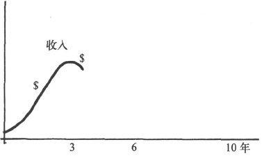
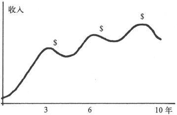
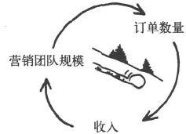
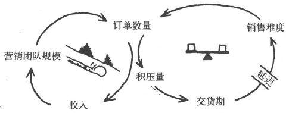
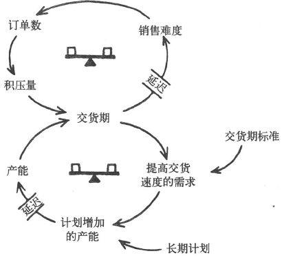
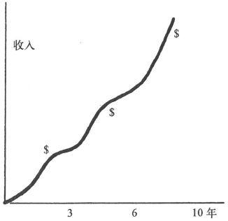
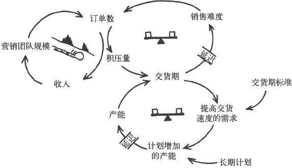

### 第7章｜是自我局限，还是自我持续地增长

人们很难去和杠杆作用的原理唱反调。但是对于大多数处于系统中的人来说，实际的系统杠杆作用都不是清晰可见的。因此，我们习惯的非系统思考方式，总是让我们注重低杠杆效益的变革。由于我们看不见自己行为背后的结构模式，于是就把注意力放到问题最紧迫和集中的地方，企图去修补或减轻症状。但这类方法最多只能带来短期改善，长期来看，情况往往更糟。前面提到的增长极限和转移负担等系统基本模式的用处，就是帮助大家，特别在实际业务的压力和矛盾中，看清行为背后的结构模式，找出杠杆作用点。

下面的例子是我们反复看到的真实故事，实际上这是从好几个特定的案例中提炼出来，把反复出现的同一类经历拼接起来形成的。

#### 当我们制造自己的"市场局限"时

20世纪80年代中期，一家独特的高科技电子产品公司成立了。公司生产一种新型的高端电脑。得益于专业工程技能和独特的技术，这家名为"神奇科技"（WonderTech）的公司实际上控制了这一缝隙市场领域。不仅市场对这家公司的产品的需求很大，而且还有足够多的投资者来保证这家公司的资金充足。

然而，这家公司的开门红业绩却成了昙花一现。公司头三年发展得如火如荼，但这种情况并没能持续下去，业绩逐年下滑，最终公司遭遇破产。

神奇科技公司的最终命运，是开始时所有人根本无法想象的，因为最初发展时期它的业务每年都翻番。第二年中期公司的销售很旺盛，订单积压越来越多。甚至在公司不断增加生产能力的情况下（建更多的工厂，增加倒班工作的班次，添加更先进的技术设备），还是不能满足不断增长的需求。这导致发货时间出现一些延迟。公司开始的承诺是8星期到货，延迟出现之后，也曾想努力回到这个承诺标准上。但是公司的高管层却以一种高傲的语气告诉投资者："我们的电脑如此优秀，一些顾客愿意等上14周。我们知道这个延迟是个问题，也正在设法解决，但不管怎样延迟，他们还是很高兴能收到我们的电脑，而且收到货时还是非常喜欢的。"

高管层也知道必须扩大产能。经过6个月的研究，在工厂从一班工作制变为两班倒工作之后，他们又决定举债建设新厂。为了确保增长势头，他们把收入的大部分都直接投入到市场促销工作之中。由于公司只通过直销团队营销产品，这就意味着要雇用和培训更多的营销人员。公司到了第三年，营销团队人数翻了一番。

然而，尽管有这些努力，到第三年年底，公司的销售量却开始下降了。到第四年中期，销售量下降到了危机的水平。至此，公司的营销曲线如下图所示。

这时，公司新建的工厂完工了。负责制造的副总裁说："我们雇了这么多人，现在该怎么办？"高管层开始感到恐慌，刚刚花那么多钱建了新厂，不知道该怎么向投资者解释。当时在场的每个人都同时转过身来，看着一个人：市场营销副总裁。

市场营销副总裁当时已经是公司的明星人物，这也并不令人吃惊------他的营销团队一直以来的业绩如此辉煌，他曾指望得到进一步升迁。而现在销售量下滑，为扭转这个局面，他面临着很大的压力。所以，他采取了最显而易见的措施：召开一系列强势促销会议，目标只有一个："促销！促销！促销！"他开除了业绩差的营销人员，增加了销售激励措施和额度，发布了特别折扣计划，还制作了新的促销广告，并使用了对公司计算机产品的新的鼓动性描述。

而销售量也确实回升了。市场营销副总裁又成为英雄，受到大家欢呼。他成为重生的激励者，在应对危局中担当了重任。神奇科技公司又迎来了喜人的局面，订单迅速回升了。但不久又开始出现订单积压。一年以后，发货时间又开始出现延迟------先是到10周，后来又到12周，最后到了16周。于是，增加产能的问题再一次进入公司议事日程。但是，因为有了上一次被动局面的教训，高管层这次就变得很谨慎。不过，建设新厂的动议后来还是得到通过。然而，批准建设新厂的签字墨迹未干，新一轮的销售下滑危机又开始了。这次的下滑十分严重，以至于市场营销副总裁被革了职。

以后几年中，一连串的市场营销副总裁轮流上岗，但每次的结果都和以前一样：营销的高增长总是昙花一现，接下来就是低增长或零增长。这个模式正如下图所示。

公司虽然进入了缓慢的发展期，但从未能达到其增长潜力。后来，公司高管们开始担心，怕别的公司会开发出竞争产品，于是开始狂热地从事未经深思熟虑的产品改进工作，同时还不断强势促销产品。但公司再也没有达到最初的增长率。原来的"神奇"消失了，公司逐渐走向了消亡。

公司的CEO最后一次对他的高管团队说了下面的话："在目前的条件下，我们做得很不错了。但是，市场需求还是不够。很明显，市场很有限------这只是个缝隙市场，而我们已经有效地满足了它的需求。"

神奇科技公司的故事没什么新奇的。每十家新建公司中平均要有五家会在五年内消失，有四家会存活到第十年，只有三家会坚持到第十五年。
2
当一家公司倒闭时，人们总会指出具体的事件，把它解释成失败的"原因"：产品问题、经理人无能、关键人物走掉了、始料不及的激烈竞争，或者市场交易量下滑。但是，导致不可持续增长的深层系统性原因，却往往不被人注意。系统基本模式可以帮助我们理解这类原因，而且在许多情况下，可以帮助制定成功的应对策略。具有讽刺意味的是，神奇科技公司的产品及其市场潜力，本可以支持许多年，而不止是两三年的强劲增长。

神奇科技公司的经理们看不到公司业绩走下坡路的原因，这倒不是因为他们缺乏信息来源。他们掌握所有的事实，就是你前面读到的这些。但是，他们看不到这些事实背后所隐含的结构模式。

你作为一个系统思考者，要诊断神奇科技公司的问题，就要找出一些能够暗示某种基本模式的迹象。你会从最明显的业绩表现模式入手：开始的增长是跳跃式的，接着是越来越强劲的上升和膨胀，然后增长变缓，后来完全停止。这个模式就是典型的"增长极限"结构所带来的症状。

有许多可能的增强（放大）作用因素，可以带来神奇科技公司一开始的销售业绩的迅速增长。对产品开发的投入、广告宣传的投入、良好的口碑，所有这些都可能把过去的成功变成未来的成功。而神奇科技故事中特别明显的一个增强因素，就是把利润再投入到增加营销力量之中：销售增加就意味着收入增加，那又可以雇用更多人力，来进一步增加销售。

增长极限的结构总会有另一面，那当然就是负反馈［即平衡（稳定）反馈］的作用过程：销售增长莫名其妙地放缓了。而销售放缓通常只有以下几种原因：市场饱和、竞争加剧，或者顾客失望。这里，神奇科技电脑的市场需求仍然强劲，也没有什么竞争对手。只有一个因素让顾客失望：交货期太长。订单积压，生产能力不足，交货期就延长了。交货服务质量差的名声散布出去，逐渐使神奇科技营销团队面临更大的销售障碍。增长极限的结构模式正如下图所示：

在增长极限的模式中，最糟糕的事就是在正反馈环路上使劲儿推。而这正是神奇科技公司所做的：他们试图通过新的销售激励、市场促销活动和产品的小范围改进，来重新发动"增长引擎"，而这些都没什么杠杆效益可言。在增长极限的模式里，杠杆作用在于负反馈环路。

这个负反馈环路为什么没有人注意到？首先，神奇科技公司的高管层关注的是财务收入，对交货服务并没有真正重视。他们主要跟踪销售情况、利润率、投资回报率和市场占有率。只要这些指标看上去很健康，交货时间问题就不是他们关心的事。而且，交货延迟是在销售增长良好、利润迅速增加的时候发生的，所以大家整体上就没什么可担心的。而当财务状况不好的时候，压力又被转移到增加订单上。然而往往在这时，由于订单减少，交货时间已经缩短了。于是，不管情况好坏，高层对顾客等待电脑到货时间过长的问题，从来就没有给予过关注。

即使他们给予了关注，他们可能也没有认识到交货时间是影响销售的关键因素。在第一次销售危机爆发之前，交货延迟问题已经在一年半多的时间里不断加重，而高管们却产生了更大的错觉，即认为"顾客不在乎交货延迟"。殊不知，这种自满心态很不恰当；顾客的确在乎交货时间，但因为系统自身固有问题造成的延迟，顾客们的忧虑并没有被神奇科技公司管理层清楚地认识到。顾客说："我们希望8星期内收到计算机。"营销人员说没问题，结果却到第9星期，第10星期，甚至第12星期还没有到货。再有几个月，负面消息就会不胫而走。由于潜在顾客很多，开始时这种传言的副作用并不大，但后来便会逐渐广为流传。这种在"交货时间延迟"和"营销陷入困难"之间的延迟，可能达6个月，或更长时间。

神奇科技公司的经理人陷入了一种经典的学习障碍之中：无法辨认在时间上距离很远的因果关系。一般来说，如果你等到需求下降之后，才去关心交货时间，那就太晚了。缓慢的交货状态已经在自我校正了------只是临时性的修正。神奇科技公司的交货速度在第三年变得最慢，而那也是公司快速增长的最后一年。在那之后的交货情况，随着销售量的下降而有所改进，但又随着后来销售量的回升而再一次变糟。

在该公司整个10年的历史中，交货时间延迟问题尽管伴随着阶段性的改进，但总体上是在不断加重。随之而来的是系统整体健康状况的逐步恶化，这表现在增长速度的下降以及利润的减少上。公司有几次利润急剧上升，但在每次业绩下滑阶段又大规模亏损。开始的增长期的兴奋，后来变成气馁，最后是绝望。由于原来预想的市场潜力从未能够实现，大家最后觉得自己是受害者。公司CEO私下说，最初的市场预期是个误导。

没有人意识到，神奇科技公司的情况也是经典的转移负担的模式。尽管有间歇的改进，问题的症状（交货速度慢）却日趋严重。企业的整体健康状况也在不断下降，大家的受害感受也在不断加重。作为系统思考者，你会首先看出这个关键问题的症状，然后看到症状缓解方法和根本解决方法。在这个案例里，根本解决方法（下图中下方的环路）是扩大产能，以控制交货延迟的情况。要超越神奇科技公司的交货速度标准，就必须增加产能；一旦产能提高了，就会改进交货延迟的状况。但是，如果这种根本解决方法迟迟得不到应用，负担就会转移到症状缓解方法（图中上方的环路）。由于神奇科技公司的经理们未能通过足够迅速地增加产能来解决交货延迟的问题，潜在顾客不满意，于是就都走掉了，并由此帮助"缓解"了交换延迟的问题。

还有，由于神奇科技公司的高管们基本上忽视了不满意的顾客，症状反应就越来越严重，这就像转移负担的结构模式一样。这一切，都伴随着神奇科技公司交货服务质量差的名声在市场上广泛传播：公司交货延迟越来越严重的每一个时段，流言传播的速度也越来越快。第四年，在产能扩建完成的时候，却由于订单下降而造成闲置，这使神奇科技高管层对增加产能越加谨慎。这就意味着新增产能的工作需要更长的时间来完成，或者根本就不会完成。公司经理最后同意增加产能的时候，症状引起的反应已经帮助解除了压力，交货延迟情况已经缓解，从而不再有理由增加产能了。于是他们说："扩建就再等等看吧，确定一下是不是真有需求。"

实际上，这两种应对方法之间还在相互做跑马式竞争。症状反应方法逐渐变得迅速高效，而根本解决方法却越来越迟钝。结果是，"不满意顾客"的反应后来逐渐控制了交货速度，越来越多地承担了缓解任务。

神奇科技公司的命运本来是可以改变的。在转移负担的结构模式中有一个杠杆作用点被忽视了，那就是公司原来的8星期交货的目标。系统思考者在转移负担的模式中首先要找出的，是根本解决方法受到削弱的原因。在这个案例中，公司有一个交货时间标准，即8个星期，但是很显然，公司高管层只专注财务收入，从来都没有把这个标准放在心上。

三年以后，公司生产部门实际习惯的标准是10个星期交货，但在订单增长时又很难保证这个标准。随着交货延迟问题反复发生，标准不断受到侵害，没有人再关心标准了，高管层尤其如此。

实际上，第二任市场营销副总裁曾把顾客对交货服务不满的意见，定期向高管团队作过汇报。负责生产的副总裁承认他们有时赶不上订单积压的速度，但只是在产能不足的时候才会这样。可是公司最高层领导者却说："是的，我们知道那是个问题，但我们不能急于做大量投资去扩大产能，除非我们能确定市场需求会持续下去。"他们没有意识到，在他们投资扩大产能之前，市场需求是不会持续下去的。

假如公司坚持原来的

首任市场营销副总裁对这些问题曾有过直觉的把握。他开始时就表明，神奇科技公司对生产能力的评估完全错了。他认为："我们现在只用已有的订单数量，而不是以潜在的订单数量为标准，来衡量产能。我们的产能本应该以按期交货而可能得到的订单数量为标准。"不幸的是，这位副总裁的观点被认为是销售业绩不佳的借口，而没有得到重视。他没有办法用清晰的理念来解释他的观点，这也使情况变得更无助。假如他当时能应用系统基本模式来阐述观点，也许会有更多的人理解他的直觉感受。

神奇科技公司的微妙互动情况，实际上也验证了许多有经验的经理人的直觉：严格把住关键的工作标准至关重要，不管是顺境还是逆境；执行这样的标准必须不惜任何代价。最重要的标准，就是顾客最关心的标准，这通常包括产品质量（设计和制造）、交货时间、服务质量和可靠性、服务人员对顾客的关注和友善态度等。神奇科技公司的系统结构模式是这个管理直觉认知的明确的理论阐释，它揭示了工作标准的侵蚀和产能扩大的缓慢，可以损害整个企业的增长。下面的整个结构模式的图解，来自增长极限和转移负担模式的整合：

如图中所示，这两个模式交叉重叠在一起，共同分享一个负反馈环路------交货延迟导致顾客不满意和订单数量下降。同样是这个环路还把增加产能的精力分散了（转移负担模式），也导致销售停滞不前（增长极限模式）。顾客不满的环路能否变成主导因素，要看交货延迟增加时公司产能扩大的力度。如果不能保持交货服务标准，那么公司的反应措施就不得力，于是，缩短延迟时间的负担就会转移到不满意的顾客那里，通过他们的订单的减少来缓解。换句话说，公司不知不觉地陷入了自己的增长极限的困局。

#### 既见树木，也见森林

神奇科技公司的系统行为模式结构还解释了许多复杂的情况：公司曾经一度迅速增长，风靡一时，后来却神秘地败落，就像人民快线航空公司，曾一度是美国历史上增长最快的航空公司。这个模式结构实际上是另外一个系统基本模式，叫做"增长与投入不足"（growth
and
underinvestment），它比前面的两个系统基本模式更复杂一些。一旦有公司由于投资不足而限制了自己的增长，就是这个基本模式在起作用。投入不足就是指能力建设不足，不能满足顾客需求的增长。如果你看到每个人都非常辛苦地工作（公司投入不足的信号），而公司却无法实现其增长潜力，你就碰到了增长与投入不足的作用模式。通常会出现持续的财务危机。这既是投入不足的原因，也是其结果，很有讽刺意味。财务压力使公司很难，或者根本无法进行大力投资，但今天的财务压力又是过去投资不足导致的。仔细检查以后你会发现，质量标准也受到侵蚀，或者明显下降。（这里的质量包括顾客关心的所有方面，如产品质量、服务质量和交货可靠性。）标准受到侵蚀，或者在竞争中无法持续提高，就会导致无法投入能力建设，来满足顾客需求。（"投入"或"投资"在这里指增加或改善物质设备能力、工作流程、组织结构或人员培训等等。）于是不满意的顾客就会离你而去。顾客需求下降，虽然减轻了订单压力的症状，却也消除了大家心目中对增加能力进行投入的需求，同时还减少了投资所需要的资金来源。

这些模式影响整个产业时，比如20世纪60年代和70年代的美国钢铁、汽车、机械设备、家用电器等制造业，结果是无法面对有强大投入政策和高质量标准的外国竞争对手。对于这些制造业市场份额的丧失，人们往往寻找外部因素，却不知源头就在自己，至少部分原因是自己的顾客服务标准的下降、投入不足，以及顾客不满意。而整个衰败过程又很缓慢，因此很难看清局势；同时又经常被"转移负担"的治标措施所掩饰，这包括广告宣传、打折促销、"重组"和关税壁垒保护。

这个模式之所以很难看清，主要有两个原因。首先，这个过程很缓慢。如果这些都在一个月内发生，整个组织和行业就会紧急动员起来，阻止情况恶化。但是，目标是被逐渐侵蚀的，增长是缓慢降低的，这些都在不知不觉中发生了。这个模式就是第2章讨论学习障碍问题中提到的煮蛙综合征。青蛙对安全水温的标准，随着情况的恶化，被持续地侵蚀，直到它应对水温不断升高危险的能力完全丧失。

其次，处在这种这种综合征中的经理人，有很多问题需要他们花费精力处理------而他们又没有能力看清更大的模式和格局。系统思考的艺术就在于看清不断（戏剧性）增加的复杂模式和微妙结构，如神奇科技公司的例子，同时还要面对实际管理工作都必须处理的细节、压力和矛盾问题。实际上，把握作为管理修炼的系统思考的实质，就是看到模式结构，而不只是看到各类个别的事件和各种个别的影响力，并对其作出应急反应。然而，很少有人接受过观察细节复杂性和动态复杂性的训练。今天有多少CEO能站出来讲15分钟，用有说服力的推理来解释某个重要问题的系统起因，以及处理这个问题的高杠杆效益和低杠杆效益策略呢？

我们都知道那个不能"只见树木，不见森林"的寓言。不幸的是，我们大多数人在往后"退一步站"的时候，仍然只看到许多个别的树木。而且，我们还会挑出一两棵我们认为最看好的树，然后就全神贯注在它们身上，为它们而倾注全部的变革努力。

系统思考的艺术实际上还在于看清细节复杂性背后的、能生发变化和产生变革的结构模式。系统思考不是忽视细节复杂性，而是将复杂的细节组织起来，使它变成一种连贯的经历和故事，使它揭示问题的起因和持久解决问题的方法。像神奇科技公司这样的技术型企业，把握实际情况就要从理解以下细节入手：

 

  ----------------------- ----------------- ----------------------------
  \[生产能力\] \[人力资   源\] \[竞争因素   
  设备最大产能            检修队伍          市场规模
  倒班安排                生产人员          细分市场
  制造                    员工满意度        技术发展趋势
  生产进度                招聘              声誉
  "生产线节拍"            培训              服务质量
  生产工艺                人员流动率        竞争对手服务质量
  进货渠道与到货时间      士气              价格
  能源成本                生产效率          吸引人才、资本、员工干劲儿
  竞争者计划              经验              
  检修时间                团队管理          
                          岗位轮换          
                          员工股权          
  ----------------------- ----------------- ----------------------------

 

当今世界不断增加的复杂性让许多经理人感到，他们缺乏自己需要的信息来进行有效的工作。我感觉，经理人面对的根本"信息问题"不是信息太少，而是太多。我们最需要的是用什么办法知道什么重要，什么不重要；要关注什么变量，不关注什么变量------而且要有办法在团队和集体中发展共识。

掌握像增长与投入不足这样的系统基本模式，是开发"既见树木，又见森林"的能力的第一步：从宏观长远与微观细节这两方面，看清信息的结构模式。只有两者都看清，才能有效地应对复杂性变革的挑战。

掌握系统思考的语言最终还要求掌握其他各项学习修炼。每一项修炼都有重要的原则和工具，让个人、团队和组织有更大的能力去转变用线性方法看待世界的习惯，进而用系统的方法去思考和行动，去观察和改变世界。

 

注释

-   1 shifting the
    burden旧译为"舍本逐末"，现直译为"转移负担"。------译者注

-   2
    杠杆作用是一种比喻，指的是解决问题的关键和有效方法。尽管比喻是机械性的，但系统问题的高杠杆效益的解决方法，一定不是机械和线性的方法，而是涉及微妙和复杂的人际关系，包括组织决策程序、个人情感和习惯等非线性因素。说找到系统问题的杠杆作用点，即是最省力的方法，这也是一种比喻，是相对于不找这种作用点而说的；但这可能很容易引起误解。因为找到这种"作用点"本身可能就是个艰难的学习修炼过程，而且使用这样的作用点往往又涉及改变思维和行为习惯，甚至根本的世界观和人生观，说起来容易，做起来绝非易事。------译者注

-   3
    由于"正反馈／负反馈"在汉语里是大家都熟悉的词汇，所以在这里采用。而需要说明的是，原文此处的术语直译过来其实是"增强反馈"和"平衡反馈"。原文"reinforcing
    feedback"，旧译"增强反馈"，在英文里比学术名词"positive
    feedback"，即"正反馈"，更容易被一般人理解，也不易引起歧义，但意思一样。原文"balancing
    feedback"，旧译"调节反馈"，科学术语一般译做"平衡反馈"，意思是"抵消"或"抑制"性的反馈，在英文里比学术名词"negative
    feedback"，即"负反馈"，更容易被一般人理解，也不易引起歧义，但意思也一样。------译者注

-   4 旧译"系统基模"。------译者注
