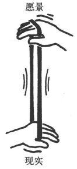
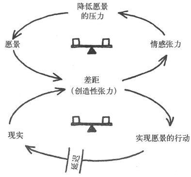

### 第8章｜自我超越

#### 学习型组织的精神

只有通过个人学习，组织才能学习。个人学习不能保证组织学习。但是，没有个人学习就不会有组织学习。

少数一些组织的领导人正在认识到，必须从根本上重新思考公司的组织原则，才能实践个人学习的承诺。京都陶瓷公司（Kyocera，精致陶瓷技术和电子产品方面的世界领先企业）创始人、1995年退休前一直担任公司总裁的稻盛和夫（Kazuo）说：

 

-   无论研发、公司管理，或者任何其他企业活动，活力都来自"人"。而人是有自己的意志、自己的头脑和自己的思维方式的。假如员工们自己没有足够的动机去挑战增长目标和技术开发目标......就根本不会有增长，不会有生产力的提升，也不会有技术进步。

 

稻盛和夫认为，要挖掘人的潜力，将要求对"潜意识思维"、"意志力"和"心的行动......以及服务世界的真诚愿望"有全新的理解。他教导京都陶瓷员工在不断努力追求"完美"时，要遵循公司的座右铭------"敬天爱人"，来内观自省。另一方面，他认为自己作为经理人的首要责任，是"为员工提供物质和精神两方面的福利"。

在世界另一端一个完全不同的行业里，有一家享受着长期的成功声誉的公司，那里有另一位建设者------汉诺瓦保险公司前总裁奥布赖恩。他立志于：

 

-   ......建立更符合人性的组织模式。我们传统的等级体制的组织设计，不能服务于人的更高级需求，如自尊和自我实现。只有当组织机构开始满足所有员工的这些需求时，管理的动荡纷扰才有解决的希望。

 

和稻盛和夫一样，奥布赖恩也主张，经理人必须重新定义自己的工作。他们必须放弃"计划、组织和控制的教条"；他们必须意识到，"对那么多人的生活负责，是件近乎神圣的事"。奥布赖恩认为，经理人的根本任务是"提供适宜的环境条件，让人们过上尽可能充实的生活"。

对发展企业来说，为免于使这些观点听上去过于浪漫，我应该说明，京都陶瓷公司在

工商精英奇才亨利·福特曾说过：

 

-   最小的不可再分的现实，对我来说是有灵性的，它们在等待着被人类精神所用------只要我们伸出手召唤它们进来。可我们总是急急忙忙，神经紧张，手忙脚乱，烦恼重重。我们对结果都没有耐心。我们所需要的......正是这个等待我们使用的无形力量，它是我们灵魂的增强剂......我知道，有精神力量的储藏库存在，但我们人类却愚蠢地切断了与它的联系......我相信，当有一天我们能够掌握足够多的关于力量源头和精神领域的知识时，那我们就可以自己创造些什么了......

-   我坚信，在精神领域方面，先人曾比我们更富有智慧。他们曾经亲身体悟到的事，我们今天只能盲目地当做信仰。

 

我们用"自我超越"（Personal
mastery）一词，来描述个人成长和学习的修炼。自我超越水平高的人，能不断为创造自己真心追求的生命成果而扩展自己的能力。学习型组织的精神，出自组织中的个人对不断学习的追求。

#### 超越和精通

自我超越不局限在能力和技巧方面，尽管它要以能力和技巧为基础。它也不局限在精神的拓展或开放，尽管它也需要精神的成长。它旨在把自己的生命当成一件创造性的艺术作品；并不是以被动反应的观点去生活，而是从主动创造的视角去生活。正如我的老同事罗伯特·弗里茨（Robert
Fritz）所说：

 

-   纵观历史，几乎每个文化中都有艺术、音乐、舞蹈、建筑、诗歌、故事和雕塑。对创造的渴望不为信仰、国籍、宗教、教育背景或时代所局限。这种渴望和冲动我们每个人都有......（它）不局限在艺术界，而是遍布生命的各个角落，从平凡世俗到深奥高雅。

 

当自我超越成为一项修炼，成为我们生活的组成部分时，它包括了两方面行动。首先，它不断澄清什么对我们是重要的。我们经常花太多时间，应付我们前进道路上的各种问题，以至于忘记了，我们原来是为什么来到这条道路上的。结果，关于什么对我们是真正重要的东西，我们却只有一种模糊的，甚至是不准确的认识。

其次，它还包括不断地学习如何更清晰地观察现实。我们都知道，有些人之所以陷在毫无裨益的关系纠葛里不能自拔，是因为他们总装出一切都正常的样子。比如，在我们参加的商务会议上，每个人都说"我们一切都在按计划正常进行"。而认真研究后会发现，情况恰恰相反。在朝着既定目标前进的过程中，了解你现在在哪儿，是件至关重要的事。

把愿景（我们想要的）和清晰的现实图像（我们现在相对于愿景所处的位置）并列在一起，就产生了我们所谓的"创造性张力"，即把两者拉到一起的力量，它是张力寻求释放的自然倾向。自我超越的精义，就是学习如何在我们的生活中，不断生发和保持创造性张力。

在这里，"学习"指的不是获取更多信息，而是拓展实现我们生活中真正渴望的成果的能力。这是终身的生成性学习
〔1〕 。而如果没有各级员工在实践中进行这种学习，就不会有学习型组织。

很遗憾的是，"超越"（mastery）一词，带有对人或物进行支配和控制的含义。但其实它也可以表达一种特殊的精通和熟练。比如，一位技术精湛的手艺人，不是控制陶器或编织品。而手艺人的技巧，会让作坊生产出最好的陶器或编织品。类似的是，自我超越是指在生活的每个方面，包括个人和职业等方面，都有一种特殊的精通和熟练。

有高度自我超越修炼水平的人，都具备几个基本特征。他们的愿景和目标背后，都有一种特别的目的和使命感。对他们来说，愿景是一种召唤，而不仅仅是一个好想法。他们把"现实"看成盟友，而不是敌人；他们学会了如何观察和运用变革的力量，而不是抵制这种力量；他们有深入探究的好奇心，致力于不断改进、不断提高观察现实的准确性。他们感到自己与其他人、与生命本身，都有一种沟通。但与此同时，他们不会抹杀自己的特点。他们感到自己好像是更大的创造过程的一部分。他们可以影响这一过程，但不能单独控制它。

有高度自我超越修炼水平的人，总是生活在不断学习的状态中，修炼永无止境。有时候用语言描述，比如"自我超越"这个词，容易引起误解，好像事情必有确定性，黑白分明。但是，自我超越不是你能够拥有的。它是个过程，是一项终身的修炼。自我超越水平高的人，非常了解自己的无知、无能以及需要改进的地方。同时，他们又有深深的自信。这矛盾吗？只有不能理解"行程本身就是回报"的人，才会觉得矛盾。

在汉诺瓦，奥布赖恩曾说过"高级的成熟"，它是指建立和保持深层价值，承诺对目标而不是对个人的投入，开放思想，锻炼自由意志力，并且，不断努力准确洞察现实的图景。他认为，这类人还能够推迟获取满足感，因此他们能想人之所不能想，树立别人所忽视的目标，甚至考虑"他们的决定对未来数代人的影响"。有趣的是，作为对10年之后"情商"流行的预示，他指出了现代社会对人的发展所作出的承诺有哪些不足：

 

-   不管出于什么原因，我们没有像追求对体能和智能开发那样，努力地追求情感开发。这是非常不幸的事。因为，完整的情感开发，对于挖掘我们的全部潜力来说，是最有效的杠杆。

 

#### "我们为什么需要它"

奥布赖恩还说到："人的全面发展，是我们企业实现卓越目标的基本要素。"人们曾经认为，商业和市场对道德的要求比其他领域要低，而"我们相信，在生命的更高尚美德与经济成就之间，没有根本的非此即彼、权衡取舍的关系。我们相信，我们能够两者兼而有之。实际上，我们认为从长远看，我们越成功地实践生命的更高尚的美德，就会实现越大的经济成就"。

实际上，奥布赖恩给出的，是组织机构对支持自我超越修炼的各种合理性陈述中最普通的一种------尽管别人也许会用其他词汇，来表达自己对人的发展的承诺。自我超越水平高的人，有更郑重的承诺。他们更具有首创精神。他们对工作有更宽广、更深远的责任感。他们的学习速度更快。正因为如此，许多组织都支持推进员工个人成长的实践，因为他们相信，这将会带来组织的成长。

但是，奥布赖恩还阐释了追求自我超越的另一个原因。我们现在认为，这是一个必要的补充：

 

-   我们鼓励员工追求它的另一个同等重要的原因是，个人幸福是受全面的个人发展所影响的。只在工作之余追求个人充实和完善，而忽视我们在工作中所投入的那部分重要的生命，就等于限制了我们获得幸福和完善人生的机会。

 

换句话说，为什么我们需要自我超越呢？我们需要它，恰恰是因为我们需要它。组织发展历程中的一个关键转折点，就是有足够多的人都采纳了上述观点，就是对人的福祉的内在承诺。传统的组织用工具理性来支持人的发展------假如大家发展了，那么组织就会更有效。像奥布赖恩这样的领导者又进了一步："在我们所追求的组织中，人的全面发展与经济的成功同等重要。"

把人的发展看成是实现组织目标的手段，就会很微妙地降低个人与组织之间关系的价值。赫尔曼---米勒公司（Herman
Miller）的退休CEO马克斯·帝普雷（Max de
Pree），用"信约"（covenant），而不是传统的"合同"（"诚实的一日工作换取诚实的一日报酬"），来描述组织和个人之间的关系。在帝普雷看来，"合同只是一个关系中的一小部分。一个完整的关系所需要的是信约......信约关系要基于一种共享的承诺------要实践的理念、要解决的问题、要实现的价值、要完成的目标，以及要经历的管理过程......信约关系反映的是和谐的统一、优雅的善意和泰然的自信。它表达了人际关系的神圣性。"

《基督教科学箴言报》的一位记者在日本参观松下公司时发现，"那里有一种近乎宗教的氛围，好像工作本身被认为是一种神圣的事。"京都陶瓷公司的稻盛和夫说，他对自我超越的承诺，就是来自传统日本公司对终身雇佣的承诺。"我们的员工生活在一个社区里，不是相互利用，而是互相帮助，以使我们每个人的生活都更加充实和圆满。"

"你知道系统运作良好，"奥布赖恩补充道，"因为你发现，10年前受雇的人原来没有自信，并用狭隘的目光看待世界和自己的机会，而现在的他或她，是拥有十几个人的部门的负责人，而且能泰然面对责任，能理解复杂的理念，会权衡不同的立场，并且对决策的选择有可靠的推理。其他人会认真听取他或她的意见。他或她也对家庭、公司、产业和社会，怀有更大的抱负。"

当组织真正承诺履行自我超越的责任时，就会有无条件的投入和毫不含糊的勇气。我们需要它，就是因为我们需要它。

#### 抵制

谁会抵制自我超越的好处呢？许多人和组织都会。采取全面发展人的立场，是对传统的雇员和组织机构之间的契约关系的彻底背弃。从某种意义上讲，这是学习型组织对传统企业成规的最激进的背弃。

企业抵制自我超越的追求是有明显理由的。相比之下，自我超越是"软东西"，部分基于诸如直觉和个人愿景这类不可量化的概念。没有人能以小数点后三位数的精度，测量自我超越对生产率和公司底线的贡献。在我们这样的物质主义的文化里，连谈论自我超越的假定都是很困难的。"为什么会有人要谈这个？"有人会问，"那不是很明显的事吗？我们不是已经知道了吗？"

冷嘲热讽的怀疑态度，是一种让人更加气馁的抵制形式。要克服玩世不恭，就需要了解其缘由。揭开大多数玩世不恭者的面纱，你看到的是受伤的理想主义者------这些人错误地认为，理想的东西就是应该得到的东西。比如，许多对自我超越冷嘲热讽的人都曾经对别人抱有很高的理想和期望。由于别人没有达到他们理想的期望值，他们就失望了，受伤了，并且渐渐变得愤世嫉俗。奥布赖恩曾指出，职业倦怠症不只是工作过度的结果，"有些教师、社会工作者和牧师非常辛苦地工作到了80岁，也从未得过职业倦怠症------那是因为，他们对人性、对我们的潜力和局限性，都有一个准确的看法。他们不会过于浪漫地待人接物，因而也就不会在人们失信的时候，经受那么大的心理压力和痛苦"。

最后，有人担心自我超越会威胁公司已有的良好管理秩序。这种担心是正当的。在思想未统一的组织里放权给员工，可能会适得其反。如果大家没有共同愿景，对企业运营的现实没有共同分享的心智模式，放权只能增加组织的压力、加重组织协调和维持运营方向的管理负担。为什么说，自我超越的修炼仅是学习型组织一系列修炼中的一部分呢？这就是原因。如果组织领导者缺乏建设共同愿景和分享心智模式的能力，不能给下级的局部决策者提供指导，那么，自我超越的组织承诺，就是幼稚和愚蠢的。

#### 自我超越的修炼

要领悟自我超越修炼之道，首先得把它视为必须通过实践产生有用结果的一项修炼，它包括一系列原则和实践方法。像成就艺术大师需要不断练习一样，以下的原则和实践方法，就是不断拓展自我超越修炼的基础工作。

#### 个人愿景

个人愿景出自内心。几年前，一位年轻女子跟我谈起她对地球的愿景，说到了许多关于和平、和谐和以平衡的方式生活在自然之中等美好愿望。虽然这些想法很美好，但她说话时却没有感情色彩，就好像这些是她该要的东西。我问她是否还有别的什么。她停一下说："我想在一个绿色的地球上生活。"然后，她就哭了。就我所知，她以前从未说起这些。这些话好像有它们自己的意志一样，脱口而出。尽管如此，这些话所表达的清晰景象，对她还是意味深长的------这或许包括了她之前并不理解的深层含义。

大多数成年人几乎没有什么真正的愿景。我们有目的和目标，但那不是愿景。如果你问成年人想要什么，很多人实际说出的是他们想不要什么。他们想要一份更好的工作，也就是说，他们想辞掉现在这份无聊的工作。他们想住在更好的邻里社区，或者不用担心犯罪，或者不用为孩子完成学业操心。他们想让丈母娘（婆婆）搬回她自己家，或者想使自己的腰疼病好起来。这类"负面愿景"（negative
vision）的冗长列举，的确是极为普遍------即使在非常成功的人士当中也是这样。它们是花一辈子时间融入主流、应付社会和解决问题的人生经历的副产品。在我们的研讨班上，有个十几岁的孩子说，"我们不应该叫他们'成人'（grown
ups），而应叫他们'弃人'（given ups，放弃了的）。"

缩水的愿景的另一种更微妙的形式，是"注重手段而不注重结果"。比如，许多高管选择"高市场占有率"，作为他们愿景的一部分。但这又为什么呢？"因为我想让我们公司赢利。"而你可能会想，高利润本身不就是一个内在的结果吗，为什么不能成为内在愿景？对有些人来说，这也的确就是内在愿景。但是，还有多得出乎意料的其他领导者，对他们来说，利润只是达到其他更重要的结果的手段。为什么选择高利润率？"因为我想让我们公司保持独立，避免被吞并。"这里提到的每个目标都是合乎情理的，但最后一个，即对我们自己的忠诚，对这些高管来说才最具有内在意义。其余的，都只是实现目标的手段，而手段在特定情况下可能会改变。关注终极内在愿望，而不仅仅注重次要的目标，这种能力是自我超越修炼的一块基石。

真正的愿景，不能离开"志向目标"（purpose）这个概念去孤立地理解。志向目标，指的是个人对为什么活着这个问题的领悟。"人都有志向目标"这个说法，是没有人能证明或证伪的。争论这个问题也不会有什么结果。但作为一个有用的假设（working
premise），这个概念很重要。它意味着，幸福感可以最直接地来自与你的志向目标相符的生活。萧伯纳曾生动地表达了这个概念：

 

-   这是生命中真正的喜悦，你意识到，你在被一个崇高伟大的志向目标所利用......你成为自然之力，而不是头脑发热的、自私的、疾病和怨恨缠身的渺小的呆子，总在那里抱怨这个世界没有全心全意让你幸福。

 

在有些组织中，同样的原则被描述为"真心的关怀"（genuine
caring）。在大家谈论个人志向目标感到不自在的地方，谈论真心的关怀却一点儿没有问题。当人们产生真心的关怀时，自然就有认真投入的承诺和行愿。他们在做自己真正想做的事，于是热情满怀、精力充沛。他们在做自己必须做的事，因此即使面对障碍和挫折，也能坚忍不拔。那是他们自己的工作。

每个人都有过工作顺利流畅的经历，那时你感到工作任务很上手，你使用的方法也简约而得当。比如，有人有了出国的愿景，结果发现自己学习新语言的速度比以前大有提高。因为个人愿景会带来这种效果，所以你会经常注意到你的个人愿景，它是吸引你的那个目标，它使你感到，你所有的努力都是值得的。

但是，愿景和志向目标不同。志向目标类似于一种方向，一个大标题。愿景是特定的目的地，是你渴望的未来图景。志向目标是抽象的、梗概的；愿景则是具体的、明确的。志向目标可以是"提升探索太空的能力"；愿景则是"在20世纪60年代末，让人类踏上月球"。志向目标可以是"尽力做得最好"，是"优秀"；愿景则是"跑一英里用时四分钟"。

真的可以这么说，在愿景建立之前，什么都不会发生。但同样也可以说，愿景背后如果没有对志向目标的领悟，没有召唤，那愿景也只是个漂亮的想法------一切都只是"喧哗与骚动，没有任何意义"。

反过来，没有愿景的志向和目标，缺乏对适度规模的把握。"你和我都喜欢网球，喜欢谈论击触地球、打反手球、追接超速底线角球的刺激，以及打制胜球。我们可能谈得很开心，但随后却发现，我在准备当地乡村俱乐部的网球赛，而你却在准备参加温布尔登网球公开赛。我们虽然有共同的热情和爱好，但精通的程度完全不同。在我们确认心中的规模范围之前，也许我们认为我们在沟通，但其实我们并没有沟通。"

从本质上说，愿景是内在固有的，不是相互比较的。你渴望它，是由于其内在的价值，而不是因为它把你带到和别人相互比较的某个位置。相互比较的愿景（relative
vision）也许在过渡阶段是合适的，但它很少能带你走向卓越。比较和竞争也没有什么错。competition（竞争）一词的原意是"striving
together"（共同奋斗，来自拉丁语competrere），它是人类迄今为止发明出来的、让每个人都发挥最佳状态的最好模式结构之一。但是，竞争过后，愿景已经（或未能）实现之后，只有你的志向目标才能让你继续前行，让你开发出一个新的愿景。这是对你真正想要的东西、对你的愿景进行不断聚焦和再聚焦的过程。

愿景包括许多方面。有物质方面的，比如想在哪里住，银行里存多少钱。有个人方面的，比如健康、自由和对自己的诚实。有服务方面的，比如助人为乐，或者对某个领域的知识开发作出贡献。所有这些都是我们真正想要的东西的一部分。现代社会总是把我们的注意力引向物质方面，而同时又给我们的物质欲望加上一种犯罪感。西方社会强调我们的个人愿望，比如在某些圈子里，对于身材匀称的崇拜几近盲目的程度------然而，我们却相对很少注意我们服务的愿望。实际上，表达服务和作贡献的愿望，是很容易让人感到天真或可笑的。事情也许如此，但从与数千人交流的经历中，我可以很清楚地看出，个人愿景包括了所有这些层面，还有更多。还有一点也很清楚，即要保持一个与主流社会不同的愿景，是需要勇气的。

为自己的愿景而坚持自己立场的勇气，正是高水平自我超越的特征。或者，用日本人对大师的说法，"当到达无间隙的境界时，一个人的愿景和行动之间，连头发丝都放不进去"。

从某种意义上讲，澄清愿景是自我超越修炼中一个比较容易的方面。对许多人来说，面对现实是更艰难的挑战。

#### 保持必要的张力

人们通常感到，谈论自己的愿景，哪怕是很清晰的愿景，也会有很大的困难。为什么呢？因为我们非常清楚地意识到，我们的愿景和现实之间存在差距。"我想自己开个公司"，但是，"我没有资金"。或者，"我想从事我真心喜欢的职业"，但"我还得挣钱糊口"。这些差距可能会使愿景看似不切实际，或者纯属想象。它们可能会令我们感到气馁，或没有希望。但是，愿景和现实之间的差距，也是一种能量的源泉。假如没有差距，就没有任何追求愿景的行动的必要。其实，这个差距正是创造性能量的源泉。我们把这个差距叫做创造性张力（creative
tension）。

假设在你的愿景与现实之间，有一条橡皮带。如果拉伸橡皮带，它就会产生张力，这代表了愿景与现实间的张力。张力寻求做什么呢？只能是减小或释放。要减小张力，可行的方法只有两种：让现实向愿景靠拢，或是让愿景向现实靠拢。能够实现哪种方法，取决于我们是否坚持自己的愿景。

创造性张力的原理，是自我超越的核心原理，它融合了该项修炼的所有要素。然而，人们往往容易对其产生误解，例如"张力"这个词似乎就暗含了焦虑和压力的含义。但是，创造性张力并不会带来任何特殊的感受。它是一种力量，在我们认识到愿景与现实不一致时，这种力量便会发挥作用。

然而，创造性张力往往会导致与焦虑相关的感受或情绪，例如悲伤、沮丧、绝望、担忧等。这种现象时常发生，以至于人们很容易将这些情绪与创造性张力相混淆。人们会认为，创造的过程要完全处于焦虑状态。但是，创造性张力存在时产生的这种"负面"情绪，并非创造性张力本身；认识到这一点是至关重要的。上述这些情绪，就是我们所说的情感张力（emotional
tension）。

如果我们没能分辨情感张力和创造性张力，那就相当于预先降低了自己的愿景。愿景没有实现时，如果我们感到极度沮丧，我们可能会有强烈的冲动要舒缓这种沮丧情绪。最直接的舒缓方法就是：降低愿景！"哦，高尔夫球嘛，其实打75杆也没那么重要，我打到80多就很开心了。"

或者你会说："其实我并不在乎能不能参加演出。反正我怎么样都是要当音乐老师来挣钱的，我只关注这个就足够了。"缓解情感张力的过程十分隐匿，因为它能在人们并不知觉的情况下进行。愿景是产生创造性张力的一个端点，也是我们任何时候都能完全掌控的一个端点，只要对它进行调整，情感张力总能得到舒缓的。我们厌恶的情绪消失了，因为它产生的根源，即创造性张力，被减弱了。于是，目标离现实近了一大步。从情感张力中解脱十分容易，我们作出的唯一牺牲，却正是我们真正想要的东西，即我们的愿景。

情感张力的作用机制，与第7章神奇科技公司中遭遇的目标侵蚀作用机制十分相似。创造性张力和情感张力的相互作用，会产生转移负担的现象，其过程类似于目标侵蚀的作用过程，可以用下图表示：

当我们的愿景与现实不一致时，它们之间的差距（创造性张力）可以用两种方法消除。图下方的负反馈过程代表"根本解决法"：努力使现实向愿景靠拢。然而，改变现状是需要时间的。这就产生了图上方的负反馈过程，它包括沮丧和情感张力，属于降低愿景、使其靠近现实的"症状缓解法"。

但是，愿景的一次性降低往往不意味着问题的终结。新的压力迟早会出现，会使现实离（新的、已经降低了的）愿景更远，于是降低愿景的压力又增加了。接着就出现了经典的"转移负担"现象。无法达成目标、产生挫败感、降低愿景、暂时减轻负担、又产生新压力、再降低愿景，这些环节构成了一个微妙的正反馈循环。结果，"负担"就越来越多地被转移到降低愿景上。

在神奇科技公司中，缓解情感张力的方式，是降低那些看似无法达到的关键的送货服务标准。标准的降低极难察觉，因为它是逐渐发生的。每一场危机，都使神奇科技的送货服务标准受到侵蚀，但相对于上一次危机过后的情况，侵蚀还仅又多了一点点。与此类似，个人目标的侵蚀也是在人们不知不觉的情况下发生的。为了能保持我们想要的各种关系，为了能保持我们想要做的工作，为了能生活在我们想要的世界中，我们一点一点地放弃了自己的梦想。

组织对情感张力的承受力不足，就会侵蚀各类目标。每个人都不愿意做坏消息的播报员。于是，最简单的方法就是假装坏消息不存在；或者还能有更好的办法，那就是降低评判标准，重新定义坏消息，使它不再那么糟糕，从而直接宣布胜利。

情感张力的作用机制，在人类活动的各个层面上都广泛存在。它是一种妥协的机制，一种带人走向平庸的机制。正如萨默塞特·毛姆（Somerset
Maugham）所说："只有平庸的人，才总是处于自己的最佳状态。"

当我们无法承受情感张力时，我们就不再坚持目标，而是放任它受到侵蚀。另一方面，当我们理解了创造性张力，并使其通过降低愿景以外的方式起作用时，愿景便成为了一股活跃的推动力量。罗伯特·弗里茨（Robert
Fritz）说："愿景是什么并不重要，重要的是愿景能做什么。"真正有创新力的人，能够让理想与现实间的差距发挥作用，从而产生推动变革的能量。

以阿伦·凯（Alan
Kay）为例，他是施乐帕罗奥多研究中心（PARC）的主任，这个研究中心从许多方面促成了个人电脑的诞生。事实上，凯的愿景是开发一种与众不同的机器，用他的话说，它叫做"活本"（dynabook），那是一种概念笔记本，能够与使用者进行互动。通过它，孩子们可以测试自己的理解能力，可以玩游戏，还可以将传统书本中静态呈现的内容和思路，按照自己的创意重新排布。但从某种意义上凯可以说是失败了，因为这个"活本"的愿景从未成为现实。然而，这个愿景使电脑行业发生了翻天覆地的改变。施乐帕罗奥多研究中心开发出的机器模型拥有视窗、下拉菜单、鼠标控制、图标显示（使用图像而非文字）等功能。在将近10年后，苹果电脑引进了这些功能，并将其商业化。

波士顿凯尔特人篮球队曾创造过

愿景是什么并不重要，重要的是愿景能做什么。

把握创造性张力，能够改变人们对"失败"的看法。失败其实就是一种不足，它显示了愿景与现实之间的差距。失败是一个学习良机，它能够澄清人们对现实的不当理解，能够揭示某些策略的有效性并不如预期，还能够提升愿景的清晰度。失败，并不意味着我们毫无价值或无能为力。埃德温·兰德（Ed
Land）是宝丽来公司的创始人，并在该公司担任了几十年的总裁，他还是"一分钟"照相的发明者。他的墙上有一块字框，上面写着：

 

-   每一个错误都是重要事件，只是你尚未将它的所有益处变为自己的优势。

 

把握创造性张力，能够给人们带来毅力和耐心。一次，我们的讨论班上有个日本高管，跟我说起他眼中的日本人和美国人对待时间的态度有何不同。"来日本进行商务谈判的美国商人，往往发现日本人保守慎言、百般推脱，不能马上'坐下来谈正事'。美国商人带着紧张的、精心计划的五日行程来到日本，他们希望能够立刻开始工作。但事与愿违，日本商人用茶道仪式对他们进行了礼貌的、正式的接待，却并不触及谈判的具体细节。随着时间一天天过去，日本人保持这种慢节奏不变，美国人却受不了了，如同热锅上的蚂蚁一般坐立不安。对于美国人来说，"这位日本高管指出，"时间是敌人；而对日本人来说，时间是盟友。"

我们对抗的是现实状况。如果不是因为对现状心存厌恶，我们想要创造的东西就不会对我们产生如此大的吸引力。套用这个逻辑，我们越是害怕和憎恶现状，就越有"动力"去推动变革。"情况必须要变得足够糟糕，否则人们不会有任何根本的改变。"

上述这种认识会给人带来误解，使人认为根本性的变革必须在生存威胁下，才有可能发生。有的人把这种威胁称做"火坛"（burning
platform）。这种危机理论居然能广为流传。然而，这也是对问题的过度简化，十分危险。在研习营和讲演中，我常常会问一个问题："在座的有多少人认为，组织和个人只有在危机产生的时候，才会进行根本性的改变？"每次总有75％～90％的人会举手。接着，我会请大家假想他们已经过上了自己想要的生活：他们所有的渴望都得到了满足，没有任何工作上的问题，没有任何私人的问题，也没有职业上的、人际关系上的和社区层面的问题。然后我会问："如果你过上了一点儿问题都没有的生活，你想做的第一件事情是什么？""是变革------去创造一些新的东西。"这是绝大多数人的回答。由此可以看出，人性远比我们通常认定的要复杂。我们既害怕变革，又寻求变革。或者，如一位经验丰富的组织变革咨询师所说："人们从来不抗拒变化，他们抗拒的是被改变。"

把握创造性张力，还能够使我们面对现实的整个立场发生根本性转变。现实不再是我们的敌人，而成为我们的朋友。对现实的准确而深刻的理解，与清晰的愿景同等重要。不幸的是，我们中的大部分人都习惯于带着成见去看待现实，并把偏见强加于自己的现实观。"我们学会了依靠观念，而不是通过观察，来理解现实，"弗里茨写道，"去假定现状与我们观念中预想的相似，比自己亲眼观察现状要来得方便。"
12
"进行自我超越修炼，首先要做的是对自己的愿景作出承诺，第二个关键就是对真相的承诺；这里面不能有半点臆造。"

对产生创造性张力来说，这两方面都同样至关重要。或者如弗里茨指出的，"真正有创造性的人深知，所有创造都是在一定的约束条件下实现的。没有约束条件就没有创造。"

#### "结构性冲突"：你无能为力的力量

许多人，甚至是那些很成功的人，都有与自我超越修炼相悖的深层观念，只是他们常常意识不到这一点。要理解我的意思，你不妨试一试下面的实验。高声说出下面这句话："我能够一点儿不差地根据我的愿望创造我的生活，包括所有方面------工作、家庭、人际关系、社区，以及更大的世界。"注意一下你心里对这句断言的反应，你大脑里面的"小话筒"在说，"这是在跟谁开玩笑呢？""我才不信呢。""个人和工作方面，还没问题------可'社区'和'更大的世界'，就是瞎扯。""再说了，我为什么要管'更大的世界'呢？"以上这些反应，都是深层观念的证据。

弗里茨曾帮助数万人开发创造能力。他的结论是，几乎所有人都持有一种"占主导地位的观念，即认为我们是不能实现愿望的"。这种观念是从哪里来的呢？弗里茨认为，它是成长过程中几乎不可避免的结果：

 

-   孩童时期我们就学习什么是我们的限制。正确地教给孩子们限制的存在，对他们的生存是必需的。但遗憾的是，这种学习常常被推而广之地一般化了。不断有人教导我们说，我们不能拥有某些东西，或不能做某些事，所以，我们可能干脆假设我们就是缺乏实现愿望的能力。

 

有两种相互矛盾的观念，会限制我们创造真心盼望的东西的能力，而我们大多数人，都持有这两种观念之一。比较普遍的一种，是认为自己无能为力------即缺乏创造我们真心盼望的东西的能力。另一种观念，说的是不配和不相称，即我们不配拥有我们真心盼望的。弗里茨断言，他只遇到很少几个似乎没有这两种深层观念的人。这种断定很难得到严格的证明，因为测量深层观念是件很困难的事。但是，如果我们接受这种有用的假设，它还是能说明，阻碍我们实现真心愿望的，乃是强大的系统影响力。

弗里茨用了一个比喻，来形容相互矛盾的深层观念如何在同一个系统里，阻碍我们实现我们的目标。设想在你接近你的目标时，有一条橡皮带，它象征着创造性张力，拉着你接近你所期望的方向。然后，再设想有第二条橡皮带，绑在无能为力和不配的观念上。在第一条橡皮带把你拉向你的目标时，第二条橡皮带却在把你拉回你不能（或不配）达到你的目标的深层观念。这种拉向目标的张力，和拉回到我们深藏的观念的张力之间，形成一个系统，弗里茨把它叫做"结构性冲突"（structural
conflict），因为它是个相互冲突的影响力结构：相对我们的愿望目标，它在把我们拉近的同时，又在拉开。

由此，我们越是接近实现我们的愿景，第二条橡皮带就会越使劲儿地把我们从愿景那里拉回来。我们可能会耗尽我们的能量。我们可能会怀疑，我们是否真想要那个愿景。"完成任务"可能会变得越来越困难。料想不到的障碍出现在我们的道路上。可能别人会令我们失望。尽管我们并不知道那个结构性冲突系统的存在，这些都依然会发生，原因是，它来自我们在很大程度上意识不到的深层观念------实际上，我们的无意识状态反而增加了结构性冲突的影响力。

既然有这种无能为力或不配的观念，结构性冲突就意味着，无论什么时候，只要我们在追求愿景，系统的影响力就会妨碍我们取得成功。但是，有时我们还是会成功；而且，我们中有许多人其实已经很擅长确定和完成目标了，至少在某些生活领域是这样。这说明结构性冲突的影响力是可以克服的。那么，我们怎样克服它呢？

弗里茨发现，应付结构性冲突影响力的一般性策略有三种，它们各有其局限性。
14 降低愿景是第一种对策。第二种叫"操纵冲突"（conflict
manipulation），即通过制造人为的冲突，来操纵我们自己追求愿景的工作，比如，花更大的精力用于回避我们不想要的东西。不停地担心失败的人，比如一些经理人，擅长鼓动言论，他们会宣传公司目标如果不能实现将会带来多么严重的后果；又如一些靠煽动恐惧情绪来动员力量搞社会运动的人，他们都喜欢使用操纵冲突的策略。令人遗憾的是，大多数社会运动的运作，靠的是操纵冲突或"负面愿景"，注重如何摆脱我们不想要的，而不是关注如何创造我们想要的，这包括：缉毒、反核武器、反核电、反吸烟、反堕胎以及反腐败。

而很多人会问："如果能帮助我们实现目标，一点儿忧虑或担心又有什么错呢？"追求自我超越的人会回答说："你真想整天担心失败，惶惶不安地生活吗？"悲剧就是，热衷于操纵冲突的大多数人会认为，他们只有通过始终处于焦虑和恐惧之中，才能有所成就。这些人不会去避免情绪紧张，反而会去美化它。对他们来说，生活是很少有喜悦的。甚至当他们实现了目标时，他们会马上就开始担心，担心有可能得而复失。

弗里茨说的第三种对策，是意志力策略，即简单地用精神兴奋法，去摧毁一切妨碍我们实现目标的障碍。按他的说法，意志力策略背后是一个简单的假设，即通过提高意志力，我们会激发自己。意志力在非常成功的人士中间表现得十分普遍，以至于很多人相信它的特征就是成功本身的特征------狂躁地执著于目标，甘愿付出代价，以及击败任何对手、突破任何障碍的能力。

意志力的问题有很多，但狭隘地关注成功结果的人恐怕很难注意到它们。意志力策略的首要问题，是方法手段缺乏经济性，用系统思考的语言，叫做没有杠杆效益。我们的确达到了目标，但代价巨大。我们可能筋疲力尽，可能会怀疑这样成功是否值得。有讽刺意味的是，执著于意志力的人，可能真会去寻找需要克服的障碍，寻找屠龙之战和需要征服的敌人------以向自己和他人展示自己的高超和神勇。第二个问题，是这种策略常常有严重的、始料不及的后果。尽管工作上很成功，意志力大师也会随之发现自己已有两次失败的婚姻，和自己的孩子关系也很差。不知为什么，在职场很管用的那种顽强的决心和目标导向，在家里并不奏效。

更糟糕的是，和所有应付性策略一样，意志力策略丝毫不会触动深层的结构性冲突的系统问题。特别是深层的无能为力的观念，并没有真正改变。许多成功人士虽然颇有成就，但他们在生活的某些领域，有种难以启齿的深层无能为力感，比如个人和家庭关系，比如进入宁静安详和精神满足境界的能力方面。

在某种程度上，这些应付性策略是不可避免的。它们是深层的、习惯性的东西，不可能一夜之间就得以改变。我们都会有自己喜欢的策略------比如我一直是用意志力策略，这一点我周围的人可以证明。

那么，应对结构性冲突的杠杆作用点，究竟在哪里呢？如果说，结构性冲突来自深层的观念，那么，改变它就只能通过改变那些观念。但是，心理学家们几乎一致认为，像无能为力感、不配感这样的根本观念，是不易改变的。这些观念在我们的成长之初就已经形成。（还记得两岁时就开始听到的那些"不能"和"不许"吗？）对于我们大多数人来说，观念只有通过新经验，即我们进行自我超越修炼的积累过程，才能逐步改变。但是，如果我们因为无能为力的观念而不能完成自我超越修炼，而这些观念又只能在自我超越修炼经验中才能改变，那我们该从何入手，去改变我们生活的深层结构模式呢？

#### 对真相的承诺

我们可以从一个异常简单而又深刻的策略，开始应对结构性冲突------说出真相。

人们常常会觉得，"对真相的承诺"（commitment to the
truth）的策略似乎没什么大用处。"我得做什么才能改善我的行为表现呢？""我怎样才能改变我深层的观念呢？"人们经常要求得到某个处方、某种技巧，或某种摸得着的东西，用来解决结构性冲突的问题。但是，对真相的承诺，实际上远比任何技巧都更有效力。

对真相的承诺不是指追求铭刻于世的真理，即那种绝对的最终判决或终极原因。相反，它指的是，心甘情愿地根除那些令我们限制和欺骗自己、不让自己看到真实情况的习惯。它指的是，不断质疑我们对真实情况为什么会如此的理解。它指的是，不断扩大我们的意识范围，就好像优秀运动员在赛场上，用超常的视野把握全场更大的范围。它还指，不断加深我们对眼下各种事件背后的结构模式的理解。特别是对自我超越修炼水平高的人来说，他们要更多地觉察到自己行为背后的结构性冲突。

因此，应对结构性冲突的首要任务是识别它们，包括其运作产生影响时所引起的行为表现。当我们的那些应付性策略正在发生作用时，我们极难识别它们，因为伴随它们而来的常常是紧张和压力。建立内部预警信号会有所帮助。比如，我们发现我们在为自己的问题而责怪某人或某件事："我之所以放弃是由于没人理解我"；或者，"我这么担心的原因是，我如果完不成任务，就会被解雇"。

比如，在我的个人经历中，在很多年里，大项目一进行到关键时刻，就会有人很让我失望。这样的事情发生时，我仍会闷着头努力推进，努力克服由于别人的失信或无能所带来的困难和障碍。过了很多年我才看到，这是个反复发生的情况，是我自己的意志力策略的特定模式，它的根源在于，我对改变别人总让我失望的情况深感无能为力。没有例外，最后结果是，我感到"我必须一个人都干了"。

看清这个模式以后，我就开始在它再次出现时改变行动方法。我不再像以前那样经常发火了。相反，我在发现它时，会有一种愧疚感------"哦，我的模式又来了。"我更深入地检查了我自己的行动，看到它如何成为这种结果的一部分：不是因为设立无法完成的任务指标，就是因为损害或不支持别的伙伴。进而，我开始努力学习交流技巧，即如何与当事人讨论这些情况，而又不造成防卫反应。第9章"心智模式"，会阐释这些技巧。

没有心灵的转变，我就永远不可能学会这些技巧，也不可能把它们应用到实践中去。只要我还把问题看成孤立的事件，我就会认定它们是外部造成的------"他们让我失望了。"一旦我看到，问题是由结构性原因产生的，我便会开始考虑自己能够做什么，而不是"他们都干了什么"。

我们意识不到的结构模式让我们成了囚徒。一旦我们意识到并辨认出它们，它们就不再有那么大的禁锢力了。这对组织和个人都是这样。实际上，现在有了一个全新的领域，叫做结构性家庭疗法。它基于这样的假设，即个人的心理难题，只能通过理解家庭和亲密关系的相互依赖性的结构，才能理清和改善。用大卫·坎特（David
Kantor）的话说，一旦意识到这些结构，"就可能开始改变结构，从而把人们从以往操控他们行为的神秘力量中解放出来"。

发现运作中的结构模式，是自我超越水平高的人的惯用手段。有时，这些结构模式可能很容易改变；而有时，它们却会像结构性冲突那样，只能逐步改变。因而需要我们创造性地从内部着手处理这些结构，要承认它们的起因，而不要和它们进行对抗。不管怎样，一旦运作中的结构模式被发现，它就成了"现实"的一部分。对真相的承诺力度越大，创造性张力就越大，因为我们对现实有了更真实的观察。在创造性张力的环境下，对真相的承诺，就像愿景一样，变成了创造性和生成性的力量。

这个过程的一个经典案例，出现在狄更斯（Dickens）的《圣诞颂歌》（A
Christmas
Carol）中。一个圣诞夜里，吝啬财主斯克鲁奇通过对三个鬼魂的访问，看到了越来越多他以前拒绝面对的现实。他看到了过去的现实，即他以前的决定如何持续地泯灭了他的同情心，加重了他以自我为中心的心态。他看到了现在的现实，特别是他一直回避的那些，比如小蒂姆的病情。进而，他还看到了他未来可能的现实，即假如他继续他当前的样子，未来将会发生的情况。但他马上惊醒了。他意识到，他并不是这些现实的奴隶。他意识到，他可以选择。他选择了改变。

重要的是，吝啬财主在更清晰地意识到他的现实之前，没有办法选择改变。狄更斯实际上在告诉我们，生活总是给我们看清现实的机会和选择，不管我们可能如何愚昧、如何抱有偏见。而且，如果我们有勇气抓住这种选择的机会，我们就有能力实现自身的根本改变。或者，用经典宗教术语说，我们只有通过修真（truth），才能得至上善（grace）。
〔

真相的力量，越来越接近现实的观察，把感知与观察的镜片擦干净，让人从自我扭曲的现实观中清醒过来------这些，是几乎所有伟大的世界宗教和哲学体系中，一个共同原则的不同表达。佛教徒精进修得"清净观"（pure
observation）的境界，以直观实相。印度教徒讲"亲见"（witnessing），即以精神无染着的心态，来观察自己和他人的生命。真相的力量在早期基督教思想里，也同样是核心，然而在过去两千年基督教的实践中，却逐渐失去了其核心地位。实际上，耶稣一词在希伯来语中，即Yeheshua（耶稣），包括Jehovah（耶和华）一词的字母，又在中间加入了shin一词中的字母。Jehovah的字母，意思是"那个过去、现在和将来都存在的，如如不动者"。中间加入了shin一词，把意思变成了"那个过去、现在和将来都存在的解救（delivers）"。也许这就是"真相将使你解脱"这句话的起源。
〔

#### 运用潜意识，就是说你真不必都想明白

自我超越水平高的人有一个很迷人的特点：他们能够以举重若轻和优美安详的风格，完成非常复杂的任务。我们都对花样滑冰冠军或首席芭蕾舞女演员精彩优美的技艺感到惊奇。我们知道，他们都经历了多年勤奋的训练，才掌握了那种技能。但当他们展示自己的技能时竟看似如此轻松和自在，还是让我们不禁要惊叹。

自我超越修炼所隐含的，是另一个维度的心灵活动，即潜意识（subconsciousness）。我们所有人在面对复杂的问题时，都会运用潜意识。自我超越水平高的人有个特点，就是他们在常态意识（normal
awareness）和我们所谓的另一个维度的潜意识之间，发展出一种高度的和谐。 16
对于我们大多数人想当然地偶尔尝试开发的潜意识，他们则是把它当成一种训练，经常在做。

那么，潜意识与组织和管理相关吗？

京都陶瓷的稻盛和夫说：

 

-   我在集中注意力时......就进入潜意识状态。据说人类都有两种状态，即常态意识和潜意识状态，而且当我们处在潜意识状态下时，能力要大10倍......

-   我讨论意识状态时，有人可能会说我发疯了。尽管如此，我还是认为，那里可能有对我们的启示，它可能会揭示决定我们未来的秘密玄机。

 

汉诺瓦公司的奥布赖恩则认为，建设新型组织的一项核心任务，就是对于从前被人忽视的心灵能力的开发：

 

-   世界上最大的未开发处女地，就在我们的两个耳朵之间。我坚信，学习型组织将要开发一系列方法，以专注和培育我们本来就有的、今天却称之为"特异能力"的各种能力。

 

而所谓的特异能力，实际是如此紧密地与我们的日常生活相联系，以至于我们几乎没注意到它们。日常生活中充满着各种复杂的任务，我们都非常有效地处理了，而几乎不用有意识的思想参与。我们来做个实验：请你摸一摸头顶。好，你是怎样做到的？我们大多数人的回答会是："嗯，我就是想了一下手和头------或者，想象我的手摸着头顶，就这样啊。"但是，从神经生理学的角度看，把手举到头顶是一个非常复杂的任务，它涉及在大脑和手臂之间，来回几十万次的神经信号放电。而这个活动过程的协调，是没有我们的常态意识参与的。类似的，如果你必须要针对走路过程的每个细节进行思考，那你的麻烦就大了。走路、说话、吃饭、穿鞋和骑自行车，都几乎不用意识状态下的注意力参与就完成了------然而，所有这些，实际上都是非常复杂的任务。

我们之所以能够可靠地完成这些任务，就是因为我们的心灵有一种非常出色的处理复杂事物的能力。从某种意义上讲，不管我们把这种能力叫做什么，都没有关系。"潜意识"一词有提示意义，因为它隐含了在我们常态意识之下或之后的功能。也有人把它叫做"无意识"或"自动意识"。不管叫什么，如果没有这个层面的意识活动，就很难解释人类完成任何复杂任务的技能。至少有一点我们有信心肯定，那就是，这些复杂的任务，不是仅靠我们的常态意识和思考方法完成的。

同样重要的一点是，潜意识是我们如何学习的关键。在你生命里的某个阶段，你曾经不能完成诸如走路、说话和吃饭这类"世俗的"任务。而这些任务你每一项都必须学会。婴幼儿第一次用勺子时还找不到嘴------勺子被送到了左肩膀头，然后又到右肩膀头，然后才到腮帮子。只有通过学习，婴幼儿才能逐渐掌握把勺子正确地送到嘴里这项技能。开始时，任何新任务都要求很多有意识的注意力和努力。随着我们"学会了"完成任务的技能，整个活动就从有意识的注意，转到潜意识的控制。

另外一个例子：你在开始学开车时，需要很多有意识的注意力，特别是如果你学开的是手动挡的车。那时，你实际上觉得很难和坐在旁边的人说话。假如旁边的人让你"减速、换低挡、下一个路口右转弯"，你可能当时就放弃了。然而，几个月以后，你不需要，或很少用有意识的注意力，就能完成这些任务，它们都成了可以被"自动"完成的任务。令人惊异的是，你很快就能在交通繁忙的路上，边开车边跟旁边的人说话，而几乎不需要有意识地注意那些需要留心应对的变量，哪怕它们实际上多达数百个。

一开始学钢琴或其他乐器时，我们要从练习音阶起步。然后我们逐步从弹奏简单的曲子到弹奏复杂的曲子，而对音阶给予的有意识的注意就越来越少了。即使是音乐会上的演奏家，开始弹不熟悉的曲子时，也要把速度放慢一倍，以便注意到手和脚的位置，注意到韵律和节拍。而当音乐会开始时，演奏家完全不会有意识地关注演奏曲子的过程方法，他的有意识的注意力，都只集中在演奏的审美效果上。

我们大家都通过有意识的训练，获得了大量的技能。一旦学会了，对这些技能的运用就是理所当然的了，或者说是潜意识层面的了。于是，在应用这些技能时，我们甚至根本注意不到。但是，对我们中间的大多数人来说，我们从未认真思考过我们究竟是如何掌握这些技能的，以及我们如何才能不断开发常态意识和潜意识之间的更深层次的协调。而这些对于自我超越的修炼，却是最为重要的。

比如，这就是为什么许多不断进行自我超越修炼的人，会从事某种形式的入静冥想练习（meditation）。无论是沉思祷告（contemplative
prayer），还是其他简单的静心方法，只要是经常地入静作冥想练习，就会非常有助于我们更有效地接触潜意识层面。潜意识似乎没有特定的意志。它既不制定自己的目标，也不决定自己的聚焦点。但它特别依赖于方向指导和条件环境------而我们的注意力在哪里，对潜意识却并没有特别的意义。在我们高度紧张活动的常态意识里，潜意识被相互矛盾的思想和情感所淹没。而在相对安静的意识状态下，当我们把意识集中在某个特别重要的事情，或是我们愿景的某个特别的方面时，潜意识就会从分散混乱中解脱出来。

进而，自我超越水平高的人，还用一些特别的方法来集中注意力。如前所述，他们会把注意力集中在自己渴望的成就本身，而不是自己假设的、实现这个成果所需要的"过程"或方法。

把注意力集中在自己渴望的内在成果上，就是一种技能。对我们大多数人来说，这在开始时并不容易，而是需要时间和耐心去开发的。我们大多数人一想到某种重要的个人目标，就几乎马上想到所有使之难以实现的理由------我们要面对的各种挑战，以及我们要克服的各种障碍。想到这些，当然有助于思考实现目标的替代策略和方法，但想到这些同时也是我们缺乏定力和修炼的表现，因为我们对所渴求的成果的注意力，不断被对愿景实现过程的思虑所排挤。我们必须用心学习如何把我们认为实现目标需要做的事，与我们真正想要实现的目标本身区分开来。

有一项很有用的入门练习，可以帮我们学习如何把注意力更准确地集中在渴望获得的成果上。这就是把某个特定的目标或愿景的某个方面单独拿出来。首先，想象这个目标已经完全实现了。然后问自己一个问题："假如我实现了这个目标，它会给我什么？"人们经常会发现，这个问题的答案会揭示出目标背后的更深层的渴望。比如，某人的目标是，在组织等级体系中升迁到某个职位级别。当她问自己："升为高级副总裁会带给我什么？"她发现答案是，"同事的尊敬"或者"参与到最富有刺激性的活动中"。尽管她可能还会追求那个职位目标，但她现在又看到了她所渴望的更深层的成果------她开始把这个成果融入自己的愿景，而不管她处在组织等级中的什么位置。（再说，假如她不澄清她真正渴望的"成果"，那么，即使她实现了目标，可能还会发现高管职位仍然令人失望。）

以上技能为什么如此重要呢？原因在于潜意识对于清晰而集中的注意力有敏锐反应。我们在阶段性目标和更本质的内在目标间迷惑不清的时候，潜意识就无法进行优先排序和集中注意力。

作出清晰的选择也是很重要的。只有当选择完成之后，潜意识的能力才能得到充分的发挥。实际上，作出明确选择和把注意力集中在对我们最重要的成果上，可能是我们常态意识最能发挥作用的地方，即最高杠杆效益作用点。

为了开发潜意识协调力（subconscious
rapport），对真相的承诺也非常重要，这和测谎仪的基本原理一样。测谎仪的工作原理是，大多数人在说谎时都会产生某种程度的内部压力，进而出现一些可测量的生理反应，如血压、心率和呼吸率变化。所以，对现实的欺骗，不仅会妨碍潜意识了解我们相对于愿景的处境，还会给潜意识输入混乱干扰信息，就好比我们对愿景如何难以实现的"喋喋不休"，会成为对我们的干扰一样。创造性张力的原则认为，潜意识在清晰而集中地聚焦在我们的愿景和现实的时候，才能发挥最大效力。

有效运用潜意识的艺术，包括许多技巧。聚焦潜意识的一个有效方法，是通过观想和想象。比如，世界级游泳运动员发现，通过想象自己的手增大两倍，并且脚上长有蹼，他们就能游得更快。复杂技艺表演的"心中彩排"（mental
rehearsal），已经成为许多领域的专业表演者的常规心理训练。

但是，所有这些方法的真正效果，还是取决于你对"什么最重要"这个问题的理解。没有对这个问题的理解，潜意识的具体练习方法，就很可能成为机械的技巧，即仅仅是一个新的操控方法，能提高你的效率而已。这并不是一个无聊的担忧。几乎所有精神传统都告诫我们，如果没有不断提升自己的真正志向的精进修为，就不能学练增长心灵功能的技巧。

大师们都有潜意识协调力。而开发这种协调力最重要的环节，是一种对我们渴望的成果的真正关怀，也就是一种对值得追求的"正确"目标的深层感受。潜意识似乎尤其能接受符合我们深层志愿和价值的目标。一些精神传统认为，这是由于深层志愿可以直接接触潜意识，或者成为其组成部分。

吉尔伯特·卡普兰（Gilbert
Kaplan）在一家一流投资杂志任出版人兼编辑，非常成功，他的故事是一个绝好的例子，说明了真正重要的追求会给一个人带来什么样的成就。1965年，卡普兰在一次彩排中第一次听到马勒的《第二交响曲》，结果他"无法入睡"。"我又回去听了正式演出，而从音乐厅出来后，我就变了一个人。那是一个漫长的恋爱经历的开始。"尽管没有受过任何正规音乐训练，他却投入了大量时间、精力和个人收入（他雇了一个交响乐团），去学习如何指挥那段交响曲。今天，他指挥的交响乐演出，得到了世界各地评论家的最高赞誉。《纽约时报》把他1988年与伦敦交响乐团合作的交响乐录音，评为当年五佳经典录音之一，而纽约马勒协会（New
York Mahler
Society）会长，则把它称为"杰出的演出录音"。如果仅仅依靠有意识的学习，哪怕是拥有全世界的意志力，也绝不可能达到如此高的艺术水平。它必须要依赖高水平的潜意识协调力，而卡普兰能把这种协调力全部倾注到他的新"恋爱经历"当中。

从许多方面来看，开发高水平潜意识协调力的关键，又回到个人愿景的开发和修炼上。这就是为什么在创造性艺术领域，愿景的概念一直非常重要。毕加索曾说：

 

-   如果能把作品的各种异化形态，而不是同一幅作品的不同绘画阶段，用照相的方式记录下来，会非常有意思。我们可能会看到意识发现它梦想的结晶过程。但是，真正重要的是要看到，尽管有表现形式的变化，作品图景基本没有变化，原始的愿景几乎保持原样不变。

 

#### 自我超越与第五项修炼

随着自我超越修炼的深入，我们自身内部会逐渐发生一些变化。而其中有些变化会很微妙，往往不会引起注意。系统的观点，不但有助于澄清自我超越作为一项修炼有其特定结构和组成部分（比如创造性张力、情感张力和结构性冲突），还能揭示出这项修炼有更微妙的一些方面------特别是理性与直觉的结合、不断深入地看清我们与世界的联系、慈悲心，以及对整体的承诺。

#### 理性与直觉的融合

古代伊斯兰教苏菲派有这么一则故事。在森林里有位迷路的瞎子被绊倒了，他在地上摸来摸去，发现自己压在一个瘸子身上。于是，瞎子和瘸子交谈起来，对各自的命运表达了自怜之情。瞎子说："我在这个林子里迷路不知道有多久了，还是找不到出去的路。"瘸子说："我在这地上躺了不知道多久了，还是不能起来走出去。"他们坐在地上交谈着，突然间，瘸子叫起来，"有了！你把我背到肩上，我告诉你往哪里走。我们一起就能找到出路。"这个古代故事里的瞎子，原本象征着理性（rationality），而瘸子则象征着直觉（intuition）。无法学会把两者结合起来，我们就无法找到走出森林的路。

直觉被正统管理学界忽视了几十年之后，近来又得到越来越多的关注和承认。现在，有大量研究表明，经验丰富的经理人和领导者，都非常依赖直觉，而不是完全依赖理性的办法分析复杂问题。他们依靠预感，靠识别模式，并且靠直觉的类推和比较，来处理看上去毫不相关的情况。
19
有些管理学院甚至还开设有关直觉和创造性解决问题的课程。但是，要在我们的组织和我们的社会里重新融合直觉和理性，还有很长的路要走。

自我超越水平高的人，不去刻意地融合理性和直觉。相反，他们达到的是一种自然的融合。这种融合是他们承诺一切力所能及的资源投入所带来的副产品。他们不可能在理性和直觉，或者大脑和心脏之间作选择，就像他们不能选择只用一条腿走路，或者只用一只眼观察世界一样。

双边互补（bilateralism）是高级生物进化背后的设计原则。大自然好像学会了成双成对的设计方法，它不但把重复和多余容纳在内，而且凭借这种重复，实现了其他方法不能达到的能力。两条腿对快速灵活的行动是关键；两只手臂对攀爬、抓举和操控物体是关键；两只眼对立体视觉是关键；而两只耳朵对有距离层次感的听觉是关键。那么，理性和直觉会不会也是从这一设计原则而来？是不是只要它们协调工作，就可以开发出我们的潜在智能呢？

系统思考可能是融合理性和直觉的一把钥匙。线性思考（linear
thinking）只注重在时空上紧密相连的因果关系，因而很难去把握直觉。结果是，我们大多数直觉都不符合常识------也就是说，不能用线性逻辑（linear
logic）语言去解释。

有经验的经理人，通常都对复杂系统有很多直觉的把握，但是又不能明确解释。直觉告诉他们，因和果并不在时空上紧密连接，一些显而易见的解决方法，实际是弊大于利，而短期应急方案，将会产生长期弊端和问题。但是，他们无法用简单的线性因果语言来解释这些概念。最后，他们只能说："就照这个法子做，肯定管用。"

例如，在目标或标准受到侵蚀时，许多经理人会感到危险正在降临。但是，他们不能充分说明，为什么这种侵蚀会引发过低投入的倾向，而过低投入反过来又加强了这种侵蚀。这还成就了一个自证预言，即市场增长的潜力是无法实现的。再如，经理人可能感到，他们注重看得见摸得着的、很容易测量的绩效指标，却掩盖了深层问题，甚至还可能在加剧这些问题。但是，对于那些绩效指标为什么不合适，他们却没有给出有说服力的解释；他们也不能说明其他替代指标如何就能改进现状。如果能够了解背后的系统结构，那么，这两种直觉把握就都可以解释清楚。

直觉和线性的非系统思考之间的冲突，已经造成一种成见，即理性本身就是和直觉对立的。这种成见明显有误，因为几乎所有伟大的思想家都有一个共同特点，就是理性和直觉的协同。爱因斯坦曾说："我没有用理性思考完成任何发现。"他还曾经描述自己是如何发现相对论原理的：他想象自己乘一束光线在空中疾行。然而，他还能够将自己杰出的直觉把握，转变为简洁的命题，以便用理性来加以验证。

把系统思考作为一种替代语言来掌握，经过一段熟悉和运用之后，经理人就会发现，他们的许多直觉现在可以得到解释了。我们可能逐渐发现，系统思考的主要贡献之一，就是重新融合理性和直觉。

#### 看清我们与世界的联系

我的儿子伊恩六个星期大的时候，似乎还不知道他的手和脚。我猜想，他虽已经意识到了手和脚的存在，但并不能清楚地理解那是他的手脚，也不知道他能够控制其运动。有一天，他被困在一个很糟糕的正反馈环路里。他的左手抓住了自己的耳朵，看上去表情痛苦，右手捶打越来越使劲儿，很是躁动不安。但他越是躁动，就越使劲儿揪耳朵；越是揪耳朵，就越是躁动不安。如果不是我把他的手从耳朵上拿开，哄他安静下来，这个可怜的小家伙就会这样折磨自己好一阵子。

由于不知道他其实可以自己控制自己的手，于是他把他的疼痛不适看做是外力所致。听上去很耳熟吧？伊恩的处境，其实和第3章啤酒游戏中的角色没什么两样。啤酒游戏的角色对供货不及时的反应，就是把它当成外力所致。再有，第5章（心灵的转变）里，军备竞赛的参与方对对方增加军备的反应，也是把它看成是由自己无力改变的外力所致。

伊恩的故事让我开始思考个人成长中一个被忽视的方面，即"闭合回路"（closing
the
loops）：学会不断辨别出，看似外在的作用力其实是与我们自己的行为相联系的。伊恩很快就学会了辨认自己的手和脚，并控制其运动。后来他还学会了如何控制自己的身体姿势------如果躺累了，他就会翻过身来，让背部得到休息。再后来，他还学会辨别体内状态，比如体温；并且意识到，通过调整和热源的距离，比如离妈妈或爸爸的身体远近，可以影响体温。逐渐地，他还意识到，他可以影响妈妈和爸爸的行为和情绪。这个过程的每一个阶段，他都会相应地调整自己的内心对现实图景的理解。随着他更多地把自己的反馈行为也理解为生活条件状况的一部分，这种现实的图景也会不断改变。

然而，对我们大多数人来说，这个闭合回路的过程，在早年某个时候就被中断了。随着我们长大，我们发现的速度降低了，我们越来越少地看到自己的行为和外力之间的联系。我们把自己锁在一种看待世界的方法之中，与小伊恩没什么区别。

幼儿的学习过程，为我们所面对的学习挑战提供了很好的比喻：要不断放开和拓展我们的意识，提高我们的理解力；要越来越多地看到，我们的行为和我们的现实之间的相互依赖关系；要越来越多地看到，我们和周围世界的联系。也许，我们永远不能完全了解我们影响自己现实的各种方式，但是，只要对这种可能性保持开放的心态，就足以帮助我们解放思想。

爱因斯坦曾这样解释学习的挑战：

 

-   （人类）对自己、对自己的思想和感觉的体验，好像是与其余的世界相分离的------这其实是我们意识中的一种光学幻象。这种幻象错觉对我们来说就是一种囚禁，它把我们局限在个人的欲望里，并把我们的感情局限在最近的几个人身上。我们的任务就是把自己从这个囚禁中解放出来，而方法就是通过扩展我们的慈悲心的范围，使之包容所有的生命，
    包容整个大自然，及其内在之美。

 

爱因斯坦所描述的，增长与他人连通的体验，是自我超越修炼中一个最为微妙的方面，也是最直接地源于系统观点的一个方面。他的"扩展......慈悲心的范围"则是另一个方面。

#### 慈悲心

观察相互关联的修炼，会逐步改变责怪和内疚的旧心态。从这里开始，我们认识到大家都陷入了结构性的局限：这些结构来自我们的思考方法，也来自我们生活中的社会环境和人际关系。这样的认识，会逐步纠正我们下意识地相互指责的倾向，进而使我们更加深入地领悟和理解我们身处其中的各种影响力。

这不是说，我们大家只是系统的受害者，而系统就是支使我们行为的元凶。相反，系统结构常常来源于我们自身的创造。但是，只有看清那些结构，我们才能很好地了解这里面的含义。对我们大多数人来说，我们身处其中的系统结构是不可见的。我们不是受害者，也不是罪犯，我们是受各种影响力左右的人类，只是还没学会如何理解这些影响力。

我们通常把慈悲心（compassion）看成是一种人们之间关怀的情感状态。然而，慈悲心还需要一定的认识水平做基础。从我个人的经历来看，当人们更多地看到身处其中的系统时，当他们更清晰地了解各种相互影响的压力作用时，就会自然产生更大的慈悲心、同情心和恻隐之情（empathy）

#### 对整体的承诺

奥布赖恩认为："真正的承诺和行愿，总是针对比我们自己更大的东西。"稻盛和夫讲到，当我们被"服务世界的真诚愿望"所引导时，就会有"我们心的行动"。这种行动"有很大的力量，因而是件非常重要的事"。

自我超越水平高的人都有一个特点，即具备慈悲心和连通感（connectedness），这自然地给他们带来宏大的愿景。而倘若没有这样的愿景，一切潜意识的观想即使涵盖世界，也是深度自私的------它只是一个手段，用来获取我们想要的东西。

当愿景超越私利时，其行愿承诺就会使人具备一种能量，它不是追求狭隘目标时所能得到的。组织机构若能激发这种行愿承诺，也一样会具备这种能量。稻盛和夫说："如果有人作出有价值的发现或发明，而他却说没有感受到精神的力量，我是绝不相信的。"对于承诺追求更大志向目标的人，他这样描绘其心愿："一个被震撼和唤醒的灵魂所发出的呼唤。"

#### 在组织中培养自我超越

我们必须记住，进行任何个人成长的修炼都应该是自愿的选择。不能强迫任何人进行自我超越的修炼，强制手段一定会产生事与愿违的后果。组织机构如果过于咄咄逼人，强行推动大家进行自我超越的修炼，就会遇到很大麻烦。

然而，许多组织却试图这样做，他们开设了个人成长培训的必修课程。不管它们的初衷有多么美好，这类课程十有八九会妨害组织中真正的自我超越行愿的传播。所谓的"必修培训课程"，或者那些让人觉得要想得到升迁就不得不上的"选修"课程，直接违反了自由选择的原则。

有无数这样的案例：过分热心的经理人要求雇员参加个人发展培训，但雇员却认为这与他们的宗教信仰相冲突。有好多次，这种状况最终使组织遭到起诉。

那么，想提倡自我超越修炼的领导者能做什么呢？

他们可以义无反顾、孜孜不倦地创造一种氛围，使自我超越修炼的原则能在日常生活中得到实践。这就意味着，建设一种组织氛围，让大家既能创造愿景又感到安全，让大家把对真相的承诺和探寻逐渐当成规范，让大家期待挑战现状------尤其是挑战现状中人们想回避的、模糊不清的那些方面。

这种组织氛围可以在两个方面加强自我超越的修炼。首先，它会不断强化一种观念，即组织真正重视个人成长。其次，它会提供一种"在岗培训"，并成为自我超越修炼的重要生机和源泉，各人根据自己能力的不同，都能有所收获。和其他任何修炼一样，自我超越的修炼也必须是个持续的过程。而对于投身自我成长修炼的人来说，鼓励和支持的氛围比什么都重要。所以，要承诺进行自我超越修炼的组织，就可以提供这样的氛围，不断鼓励个人愿景，提倡对真相的承诺，并真诚面对这两者之间的差距。

有利于自我超越修炼的许多实践方法，如建立更系统的世界观，学习如何反思"隐性的假设"（tacit
assumptions），表达自己的个人愿景并聆听别人的愿景，共同探寻不同人对现实的看法等等，都已嵌入学习型组织建设的各项修炼之中。所以，从很多方面看，组织想推进自我超越修炼，最有利的行动就是协同推进开发全部五项修炼。

领导的核心策略很简单：成为榜样，就是自己承诺并实践自我超越修炼。对自我超越修炼的谈论，可以在一定程度上开启人们的心门，但行动总比语言更有力。为了鼓励别人进行自我超越修炼，你本人的认真实践，比任何其他方法都更有力量。正如麻省理工学院斯隆管理学院的埃德加·沙因（Edgard
Schein）教授所说，组织本身就是"强制性系统"（coercive
systems）。这一点你要不断提醒自己注意。
