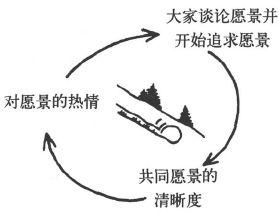
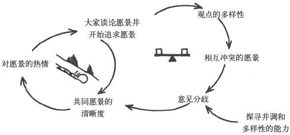
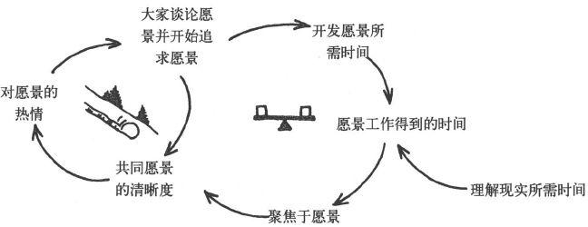
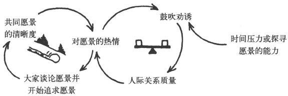
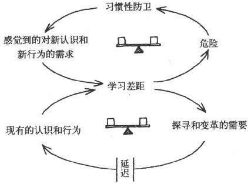

### 第9章｜心智模式

#### 最好的想法为什么会失败？

经理人都知道一件事：许多想法虽然很好，却从未能付诸实践。杰出的战略和策略从未能变为行动，对系统的洞悉从未能变为运营政策。先导实验（pilot
experiment）证明了新方法确实能改进成绩，也得到了大家的认可和满意，但方法的推广却从未发生。

我们越来越觉得，这类功亏一篑，"眼看到手的东西又没了"，既不是出于意愿不强，也不是由于意志不坚，甚至也与非系统性的理解无关，它来源于心智模式。更确切地说，新观点和知识未能得以实践的原因是，它们与人们内心深处有关世界运行模式的图像发生了冲突，而这些图像则把人们局限在自己习以为常的思考方法和行为方式之中。这就是为什么对不同的心智模式的管理和修炼，包括浮现、观察、测试和改善有关世界运行模式的内心图景，有希望成为学习型组织建设的一项重大突破。

没有人头脑里能装得下一个组织、一个家庭或一个社区，我们头脑里装的是图像、假设和故事。哲学家们讨论心智模式已经有许多个世纪了，至少可以追溯到柏拉图的洞穴寓言。《皇帝的新衣》是个经典故事，但不是关于愚笨之人的，它讲的是被心智模式禁锢的人。那些人心里装着皇帝尊严的图像，因而无法看到一丝不挂的皇帝的真实躯体。

霍华德·加德纳（Howard Gardner）在其著作《心灵的新科学》（The Mind\'s New
Science）里，对认知科学的成果作了调查综述。他写道，"对我来说，认知科学的主要成果就是清楚地展示了......心理表征（mental
representation）的活跃程度"，心理表征在人类行为的诸多方面都有频繁活动。

心智模式可以是简单的一般化概括，比如"人是不值得信赖的"；也可以是复杂的理论，比如我会假设，究竟是什么使我的家庭成员之间有如此这般的关系。但是，要把握心智模式，最重要的是理解其作用的活跃性，即它能决定我们的行动。假如我们认为人是不值得信赖的，我们的行动就会与持相反观点的人大不一样。假如我认为儿子缺乏自信，而女儿又爱挑衅，我就会不断地干预他们之间的交往，总想防止女儿去挫伤儿子的自尊心。

心智模式为什么对我们的行为有如此巨大的影响力呢？部分原因在于它会影响我们的观察。有不同心智模式的两个人去观察同一件事，会给出不同的描述，因为他们看见了不同的细节，并且作了不同的解释。我和你同时走进一个人群拥挤的晚会，我们都得到同样的基本场景感官信息，但是我们会看到不同的面孔。正如心理学家所说，人们的观察是有选择的。一般人是这样，而想象中的"客观的"观察者，比如科学家，其实也没有什么不同。爱因斯坦说过："我们的理论决定我们去测量什么。"物理学家们曾经做过多年实验，结果与经典物理学相矛盾。然而，没有人"看见"这些实验的结果。而正是这些结果后来逐渐导致了

心智模式塑造我们的感知方法，这一事实对管理学来说也同样重要。有件事我永远不会忘记，那是二十多年前，底特律某汽车企业高管团队第一次访问日本回来后发生的。那时，美国汽车业终于清醒过来，开始认识到日本正在稳步占领这个产业的市场和利润空间------而且并不仅仅由于日本拥有"廉价"劳动力，或者有国内市场的保护，而很有可能是由于日本有独特的管理方法。大家谈话开始不久，底特律的高管们就明显流露出，他们对日本没什么深刻印象。我问他们为什么，其中一位高管说："他们没给我们看真正的工厂。"我又问他是什么意思，他回答说："那些厂里都没有库存。我在工厂工作快三十年了，我可以告诉你，那不是真工厂。很明显，那是他们为了接待我们而导演出来的假工厂。"我们今天都知道，那的确是真工厂，是"准时化"生产方式零库存系统的例子。日本经过许多年的努力，在其整个制造业系统中大幅降低了生产过程的配件库存需求。几年后，还是那些美国公司，又开始拼命追赶日本制造业的创新......但是，先前那次访问中，底特律的高管们就是没有看到任何值得他们警觉的迹象。

我们还可以看看底特律三大汽车巨头曾经信奉几十年（许多人认为他们现在仍然信奉）的顾客信条：美国顾客主要关心汽车的款式风格。管理咨询师伊恩·米特罗夫（Ian
Mitroff）认为，关于款式风格的这些信条，来自通用汽车公司有关成功是什么的假设，而这些假设曾长期普遍地流行，并且从未被质疑过：

 

-   通用汽车公司的工作是为了赢利，而不是为了汽车；

-   轿车主要是社会地位的标志，因此，款式风格比质量更重要；

-   美国的汽车市场与世界其他地方没有联系；

-   工人对生产率或产品质量不能产生重大影响；

-   系统中的个人对产业所需要的理解不过就是各自独立的狭隘知识。

 

说这些假设的意思并不是要判定通用汽车，或者整个底特律产业界都是错误的。正如米特罗夫所指出的，底特律的汽车产业曾在很多年间得益于这些信条原则。然而，这个产业把那些信条看成"永恒的成功万灵丹，但其实它只在一系列特定的环境条件下......并在一个有限的时间范围内才起作用"。

心智模式的问题不在于其正确或错误------由其定义可知，一切模式都是简化。问题的出现是在心智模式变为隐性的时候，即当它们存在于我们的意识水平之下的时候。底特律的汽车制造商没有说"我们有一个心智模式，即'人们就关心款式'"，他们只说"人们就关心款式"。由于没有意识到我们的心智模式，所以我们就无法检查它；由于得不到检查，所以这些模式也就无法改变。随着世界的变化，我们的心智模式和现实之间的差距就会逐渐加大，从而导致我们的行动越来越达不到预期的效果。

底特律汽车公司的故事说明，心智模式和现实之间的差距可能成为整个产业的长期问题。从某些方面看，产业链条紧密可能特别容易造成这个问题，因为各个企业都在产业链内部之间相互寻找最佳实践标准。

许多推动系统思考的努力，都因为不能了解心智模式的作用而失败。许多年前，有一个经典的案例研究。美国一家生产工业产品的领先企业（该产业中最大的企业），发现自己的市场份额一直在下降。为了分析这个情况，企业高管找到了麻省理工学院系统动力学专家团队。基于计算机模型分析，专家团队得出了结论：这个企业的问题出自对库存和生产的管理方法。由于产品体积大、价格昂贵、库存费用高，生产部门的经理就尽量压低库存量，而且一旦订单减少，就立即大量减产。结果是尽管他们有充足的生产能力，但交货时间却缓慢又不可靠。实际上，专家团队的模拟计算结果显示，市场业务量下降时的交货速度会比业务量上升时更慢。这个预测与常识相反，但实际情况恰恰就是这样。

那家企业的高层被研究结果折服了，于是他们根据专家团队的建议实行了新的政策。从那天开始，订单下降时他们也保持生产速度，并且努力改进交货工作。在第二年的小规模市场业务下滑期间，由于及时交货，满意的客户又再次购买产品，结果在市场业务量下滑期间，该公司的市场份额反而提高了。这个实验成功了，大家都喜出望外。经理们非常满意，还建立了内部系统研究小组。然而，新政策并没有变成大家的贴心事，也从未能深入人心，公司业绩的改进仅仅成了暂时的现象。在下一个业务量上升期，经理们就不再操心交货服务质量了。四年以后，更严重的经济衰退期来了，这家公司又回到原来的政策上，进行了大幅度减产。

为什么如此成功的实验被中断了？问题出在该公司管理传统中根深蒂固的心智模式。每个生产部门经理都知道，产品如果堆在库房卖不出去，他会被追究责任，那一定会毁掉自己的前程。几代高管都曾宣讲过控制库存的必要性，因而，尽管有那次新实验，老的心智模式仍旧毫发无损。

心智模式根深蒂固的惯性力量，会把最杰出的系统思考智慧淹没。不仅仅是系统思考的提倡者，其他许多提供新管理工具的人也都吃过这类苦头。

但是，如果心智模式会阻碍学习，能够把整个公司乃至整个产业禁锢在过时的习惯做法上，那它为什么不能帮我们加速学习呢？这个简单的问题，逐步推动了心智模式的修炼实践，让心智模式浮出水面，并对它进行检查和挑战，进而改善它。

#### 孵化新的商业世界观

荷兰皇家壳牌公司也许是最先发现心智模式影响力的大公司。尽管这个故事发生在几十年前，在今天却仍然具有指导意义。壳牌公司是一家全球范围内的多元文化企业，它经历了一个渐进的过程来建立内部共识。故事的开始是在石油输出国组织欧佩克成立之初，刚好在世界石油产业开始经历历史性动荡之前。

壳牌从成立伊始就是多元文化组织：1907年，基于荷兰皇家石油公司和伦敦的壳牌运输与贸易公司之间的"君子协议"，壳牌公司成立了。后来，壳牌的经理人发展出一种他们自己称为"建立共识风格"的管理，尊重不同的文化背景、看法和观点。当公司发展到有100多个在世界各地运营的子公司时，子公司的经理人几乎来自100多种不同的文化。于是大家发现，要建立共识就得在理解力和行事风格等方面下工夫，以跨越巨大的鸿沟。

1972年，欧佩克成立前一年，壳牌的情景规划组已经得出结论：壳牌经理们所熟悉的稳定并可预期的世界石油市场将要发生变化，而且这种变化的方式一定会影响公司的战略，乃至全球的地理政治格局。这种影响到今天仍然存在。资深战略规划专家皮埃尔·瓦克（Pierre
Wack）领导的壳牌团队，通过分析石油生产和消费的长期趋势，认为欧洲、日本和美国正在不断增加对进口石油的依赖，而这些石油又都来自少数几个石油输出国。这些输出国尽管政治背景和文化背景多样，却有重要的共同点。一方面，伊朗、伊拉克、利比亚和委内瑞拉都越来越担心储油量的下降；另一方面，沙特阿拉伯对石油收入进行有效投资的能力也接近了极限。换句话说，大家作为石油生产大国都在提高经济实力，但又都有进行限产的动机。对壳牌规划团队来说，这些动向意味着石油市场供需平稳增长的历史条件会逐渐消失，取代它的将是长期的供应短缺、需求过剩，以及由石油输出国控制的"卖方市场"。壳牌规划团队虽然没有预测到会出现欧佩克这个卡特尔联合体本身，但他们预见了欧佩克组织后来逐步带来的那些变化。然而，为了应对即将到来的根本性变化，他们试图说服壳牌的高管，不幸的是，这种努力却基本上都失败了。

从原则上讲，壳牌"集团规划部"的成员正处在理想的位置，可以洞悉即将到来的变化，并传播和宣讲这一消息。集团规划部是公司的核心规划部门，负责协调世界各地运营子公司的规划工作。当时，集团规划部正在开发情景规划法，并把它作为总结各种未来替代趋势的实际方法加以应用。当时正在出现的世界市场的不连续性，已经开始被壳牌的规划专家们纳入情景规划。然而，他们的听众，即壳牌集团的高管们，却觉得这些未来情景与他们多年的经验不符：他们的经验是可预期的市场增长。所以，公司高管们对这些未来情景规划并没有给予多少关注。

至此，瓦克和他的同事们意识到，他们对自己任务的理解有根本性谬误。十几年以后，他在《哈佛商业评论》上发表了一篇著名的文章，说从那时起，"我们不再把写出报告、描述对未来的观点和资料，看做是我们的任务......我们真正的目标是决策者自身的'小宇宙'......除非我们能影响关键决策者的心智图像，即他们心中关于现实的图景，否则我们的情景规划就只能像对牛弹琴，一点儿影响都没有"。
6
如果说以前规划专家们认为，他们的任务就是向决策者传达信息，到后来他们才开始清醒地意识到，他们的任务是帮助经理重新思考自己的世界观。于是，集团规划专家们特别在1973年1月和2月作出了一组新的情景规划。这组情景规划迫使集团的经理们具体地意识到，他们所想象的"没有问题的"未来如果要想成真，究竟需要哪些假设成立。情景规划过程揭示了，那些假设若要成立，就像要把神话变为现实一样。

从那时起，集团规划部有了一组新的情景规划，是专门从公司高管现有的心智模式出发精心设计出来的。然后，他们开始帮助高管建立新的心智模式------通过他们的帮助，高管们开始思考该怎样管理新世界。比如，石油勘探可能不得不扩大到他们以前没有涉及的国家，而炼油厂的建设也可能不得不放缓，因为油价会上涨，需求增长会放缓。还有，市场不稳定性的增加会导致各国的不同反应。有自由市场传统的国家会让油价自由上涨，有市场管制政策的国家会维持低油价。因此，高管必须把更大的控制权交给在各地运营的子公司，以便使它们能适应当地的情况。

尽管许多壳牌高管还是持怀疑态度，但他们却不得不严肃对待这些新的情景规划，因为他们开始看到，他们先前的观点是站不住脚的。这种规划演练开始解除高管们被禁锢的心智模式，并开始孵化新的世界观。

1973年到1974年冬季，欧佩克石油禁运突然降临，壳牌公司作出了与其他石油巨头截然不同的反应。他们放缓了对炼油厂的投资步伐，并且设计了能够适应各种原油的炼油厂。他们对市场需求的预期比其他竞争对手都要低，而且事实后来持续证明了壳牌的预期更准确。此外，他们还迅速加大了对欧佩克地区之外的油田的开发。

当竞争对手们靠集团部门来驾驭管理，加强对子公司的集中控制（应对危机的普遍做法）时，壳牌则恰恰相反，他们给予各地运营公司更大的操作空间。

壳牌公司管理层的不同反应，来自他们对现实的不同解释。他们看到自己正进入一个供应短缺、增长放缓和油价波动的新时代。他们对20世纪70年代会成为动荡的10年（瓦克的情景规划称之为"湍流"10年）有所预期，所以他们的反应是假设动荡会持续下去。壳牌公司发现了管理心智模式所带来的效力。

壳牌公司这些努力的结果是公司财富的显著变化。1970年，人们认为壳牌公司是七大石油公司中最弱的一个，《福布斯》杂志称之为"七姐妹"中的"丑小丫"。到1979年，壳牌可能是他们中的最强者，至少与埃克森公司并驾齐驱。
7
到了20世纪80年代初，经理人的心智模式浮出水面，成为壳牌规划工作的重要组成部分。1986年油价突然大跌之前，在协调人阿里·德赫斯（Arie
de
Geus）的领导下，壳牌集团规划部用哈佛商学院的风格提早半年编写了假想案例研究报告，内容是一家石油公司如何应对世界石油市场突然出现的供应过剩。经理们必须对那家公司的决定作评论，而这样的做法就使他们对另一轮现实的突变有了心理准备。两年之后，类似的练习又围绕苏联解体展开，这恰恰是在苏联真正解体前两年进行的。

BP公司，即前英国石油公司，在过去15年间得以迅速成长为全球石油销售额和业务总量排名第二的企业（仅次于埃克森公司），也是得益于一个关键因素：学习开展心智模式修炼。但BP公司的做法与壳牌很不一样。BP没有像壳牌那样，依靠一个核心规划部门来开展修炼，而是积极投身于决策和权力分散化的变革行动中。

到20世纪90年代末，BP公司有150个地方赢利中心，但公司业务部门经理的权力却要比地方大得多。首席信息官（CIO）和集团副总裁约翰·列盖特（John
Leggate）说：

\"我们都熟悉壳牌用情景规划来挑战心智模式的方法，但他们用于规划核心功能的办法似乎不是我们想采用的。约翰·布朗（John
Browne，BP1995年上任的首席执行官）非常热衷建设一种绩效文化，这就意味着有更多的人要承担业绩底线的责任，并且独立完成对问题的思考过程。把业务盈亏的责任放到下面去，这对我们这样高度集成的产业和大公司来说，是件很难的事，但我们逐渐取得了成功。权力很好地分散下去还有另一个风险，就是分立隔离。若真有这样的事情发生，企业要保证其整体都获得学习能力的提升，会变得非常困难。

"我们靠什么避免了这种情况呢？那是我们开发建立的连接各地雇员的各种网络，以及营造能开诚布公地谈论问题、相互挑战思想观点的氛围。于是，不断反思和质疑自己，就成了我们心智模式修炼的基础，尽管我们从未广泛使用'心智模式'这个词。"

#### 在实践中进行心智模式的修炼

壳牌和BP的故事说明，有三个方面的要素，可以帮助开发组织机构显露（surface）和检测心智模式的能力：一是提高个人意识水平和反思技能的工具，二是使心智模式修炼制度化的"基础设施"，三是提倡探寻并挑战我们思考方法的文化氛围。很难说这三方面哪个最重要，其实，它们之间的联系才是最重要的。比如，宣示支持诸如"开放型"等文化规范是一回事，而实践这种文化则要求真正的奉献精神和技能技巧，但经理人通常是缺乏这些素质的。而要开发这些素质，又必须有经常实践的机会，这就需要我们在进行管理的基础设施建设时，把反思实践融入工作环境之中。

#### 克服"等级体系的根本弊病"

首席执行官们常常强调组织文化的发展，这并不奇怪。汉诺瓦保险公司首席执行官奥布赖恩说："在传统的权威型组织里，大家的信条是管理、组织和控制。在学习型组织里，新的'信条'将是愿景、价值和心智模式。健康的公司组织将能够开发系统的方法，来把大家凝聚在一起，培育最佳可能的心智模式，以有效应对任何局面。"奥布赖恩认为，文化变革是关于根本的"传统等级体系弊病"及其去病药方的。他曾说："我们开始的任务，就是发现用什么样的组织和修炼方法才能使工作岗位与人性相吻合。我们逐渐发现了一组核心价值，它们其实就是克服等级体系根本弊病的一组原则。"

这组核心价值中有两项即"开放性"（openness）和"公德心"（merit），促成了汉诺瓦公司开发自己的"管理心智模式"的方法。他们把开放性看成是一剂药方，用来治疗"人们面对面交往中流行绕圈把戏的弊病：早上10点工作会议上对问题的说法，和晚上7点在家里或与朋友喝酒时的说法，从来就不一样"。公德心，即以组织的最高利益为基准的决策，汉诺瓦用它来治疗另一个弊病，即："以官僚政治角力为基准的决策方法和游戏规则，靠印象决定能否晋级或者能否保住职位。"
8
开放性和公德心结合起来，就代表一种深层信念，即：如果人们开发更大的能力去探察并显露各自看待世界的方法，并对其进行富有成效的探讨，那么，决策过程和游戏规则就可以发生转变。

清晰地阐述这些价值只是第一步。有些人会把价值观声明，误认为就是文化变革。奥布赖恩及其同事们意识到，仅有华丽的辞藻是不够的。他们质问："假如开放性和公德心那么有用，那为什么做到这些会这么难？"

针对这个问题，奥布赖恩后来拜访了阿吉里斯，后者的著作曾得到汉诺瓦公司经理人经验的印证。阿吉里斯的"行动科学"为检查"我们行动背后的原因"提供了理论和方法。
9 阿吉里斯认为，组织和团队常陷入"习惯性防卫"（defensive
routines），从而把心智模式与外界隔绝开来，无法进行反省检查。结果，我们发展出一种"老练的无能"------这是个绝妙的矛盾修饰语，它非常准确地描绘了人们"在学习修炼环境中高度干练地保护自己，以免遭受痛苦和难堪的威胁"的情景。但是，如果不进行学习修炼，我们就会停留在无能状态，无法完成我们真正渴望的成绩。更重要的是，阿吉里斯还开发了一组工具，能够有效地在组织机构里运用，而他本人也成为精通这些工具的使用和培训辅导的专家。

那时，我们邀请阿吉里斯来到我们麻省理工学院的六人研究团队，为我们开了一个研修班，从中我亲身了解了他的情况。尽管表面上是阿吉里斯在做他的方法的学术演讲，但研修班很快就成为非常生动有力的示范，实际进行了行动科学实践者所说的"行动中的反思"（reflection
in
action）。他让我们每个人都讲一讲与客户、同事或家人的一次冲突。我们不但必须回忆起实际说过的话，而且还要记起我们当时想到但没有说出来的话。当他开始讲解这些"案例"时，我们几乎马上就清楚地意识到，我们每个人自己是如何通过自己的思想助长了冲突的局面。比如，我们都对对方作了过分夸张的一般化概括，并以此为出发点来决定我们怎么说和怎么做。不过，我们都没有说出我们心中的这些一般化概括。我也许在想"乔认为我没有能力"，但有关这一点我从不直接问乔。于是，我在乔面前就不停地努力表现出值得尊重的样子。或许，我在想"比尔（我的领导）很没有耐性，他喜欢看似迅速实则鲁莽的办事方法"。于是，我就故意向他建议简单化的方法，尽管我并不认为这样的方法能够触及困难问题的根本。

我注意到整个研修小组的精神头儿和"当下意识"水平，就在那短短几分钟内提高了十个等级。这主要不是因为阿吉里斯的个人魅力，而是因为他所使用的精湛技能，让我们每个人都亲自体会并观察到，我们如何陷入麻烦，然后又责怪别人。那天下午的研修让我们看到（有的人是平生头一次），我们自己行为背后微妙的推论模式。如此戏剧性地演示我自己的心智模式，我还从未亲身经历过。而更有趣的是，我能够通过恰当的培训更深入地了解自己的心智模式及其运作模式，这一点十分明确，也令我十分兴奋。

通过与阿吉里斯和他的同事李·鲍曼（Lee
Bolman）的合作，奥布赖恩意识到"尽管我们有理念，但真正做到能够对我们都关切的问题进行开放、有效的探讨，我们还需要走很长的路。阿吉里斯在有些案例里揭示了我们都默许的、路人皆知的绕圈把戏。对于开放心态、观察我们自己的思想和少说废话，他有令人难以置信的真正高水平的要求。但他也不是单纯提倡'把一切都告诉所有的人'------他展示了切入困难问题的技能，让每个人都有学习收获。很明显，如果真想实践我们的核心价值，即开放性和公德心，那阿吉里斯开辟的这个新领域就是非常重要的"。

汉诺瓦公司在之后的数年间，把阿吉里斯的工具和哲学家约翰·贝克特（John
Beckett）开发的"机械思考的局限"研习结合在一起。奥布赖恩说："贝克特揭示了东方文化对基本的道德、伦理和管理问题的看法，如果仔细去想想，是很有道理的。然后，他又展示了西方文化对这些问题的看法，也有道理。但是，这两种文化观点导致了矛盾对立的结论。这就让我们认识到，对复杂问题有不止一种的视角和看法。这个认识，对我们在公司部门之间以及不同思考方法之间消除隔阂，是个极大的帮助。阿吉里斯和贝克特这两种方法的结合，对许多经理人理解心智模式的过程产生了深远的影响。"许多人平生头一次发现，我们所有的看法从来就不是'真理'，都只是一些假设------我们只是通过我们的心智模式看世界，而心智模式总是不全面的，而且，特别在西方文化里，长期以来它就是非系统性的。\"

BP也经历了一个类似的范围很广的培训过程。在三年时间里，有5000多人参加了他们的"第一层领导者"
〔4〕
四天集中培训项目，内容包括自我超越修炼的基本方法和心智模式修炼。列盖特说："我们努力把组织学习的理念和工具变成管理实践的根本方法的一部分。"BP的"定调培训项目"专为炼油厂经理们扩大联系网络而设计，目的是使他们从中能够分享最佳实践，相互帮助，共同学习。它成为公司"第一个大型跨界网络'容量能力建设'项目，参加的人都理解并能够使用这些工具。而从那以后，类似的入门培训就在整个公司里开展起来了。"

#### 把学习实践制度化

很显然，不管入门培训有多么普及，组织仍必须经常提供后续实践的机会，以便让员工不断提高技能。我见过许多制度化的方法，它们把反思实践和浮现心智模式的工作融入正规的管理工作的"基础设施"中。（第14章"战略与策略"详细描述了学习实践的基础设施。）

壳牌公司通过规划过程，把心智模式的修炼制度化。集团规划部协调人德赫斯和他的同事们致力于重新思考战略规划在大公司组织中的作用。他们的结论是，作出完美的战略规划并不重要，更重要的是利用规划过程来让经理们对自己的假设进行反思，从而加速整个学习进程。德赫斯认为，持久的成功依赖于"管理团队的学习过程，即管理团队成员看待本公司、竞争对手和市场的集体心智模式的转变过程。因此，我认为规划就是学习，而公司规划就是组织机构的学习"。

汉诺瓦公司建立了各类"内部董事会"，把高管和地方经理人定期集中在一起，对业务决策过程背后的思考方法进行检查和挑战，进而开阔思路。这样做的目的，就是建立管理实践架构，促进业务部门对重要业务问题的关键假设进行开放性的检查。这种做法同时还可以加强高管之间的交往，使他们就这些问题与各类内部董事会探讨折中方案。

哈雷－戴维森公司也进行了管理构架的变革，但他们的方法是从根本上改变高层管理结构，部分原因就是为了把心智模式的修炼纳入管理工作的实践中。哈雷公司的许多经理通过国际组织学习学会研修班学习了组织学习的基本原理。与此同时，他们还建立了"圆圈组织"，把传统高管的角色和活动重新定义为三个相互重叠的圆圈------"创造需求圈"、"生产产品圈"，以及"服务支撑圈"。这些圆圈有意淡化了传统的高层管理等级体系，使许多"老板"变为"圆圈教练"。

哈雷公司前首席执行官里奇·提尔林克（Rich
Teerlink）认为："我们的新结构的各项创新中，最令人兴奋的就是'圆圈教练'。"典型的圆圈教练相当于传统的分散功能公司中的副总裁，如负责产品开发和生产的副总裁。他们对圆圈教练人选的理解是"具备敏锐的沟通、聆听和影响力技能，各圆圈成员和公司总裁敬重的人"。提尔林克说："当时我们没有把职位描述写下来，因为我们不想给人留下行话连篇的印象，但我们确实认为，圆圈教练就应该帮助大家把各自的心智模式显露出来。后来，事实证明这一直很有效。"

#### 工具和技能

尽管壳牌、BP、汉诺瓦和哈雷－戴维森公司分别使用了差异很大的方法来建设心智模式修炼的能力，它们的工作却都包含两大类的技能开发，即反思技能和探寻技能的开发。反思技能涉及放松思考的过程，它使我们更能意识到我们的心智模式是如何形成的，以及它如何影响我们的行动；探寻技能涉及我们和别人面对面的交往，还特别涉及复杂和冲突问题。下面几点与开发这些技能的工具和方法一起，构成了心智模式修炼的核心内容：

 

-   正视我们"声称的理论"（我们所说的）与我们实际"实行的理论"（在我们所做的背后所隐含的理论）之间的区别。

-   识别"跳跃性推断"（leaps of
    abstraction，注意我们如何从观察跳到一般化概括）。

-   暴露"左手栏"（left-hand column，明确说出我们通常不说的话）。

-   探寻与宣扬的平衡（balancing inquiry and
    advocacy，有效学习协作的技能）。

 

#### 心智模式的修炼

#### 反思实践

有效地进行心智模式的修炼，虽然在某种程度上是件高度自我和内在的事，但也是非常实际的，也就是说，它与重要业务问题的关键假设的显露密切相关。这件事很重要，因为组织中最关键的心智模式是核心决策者们共同拥有的。如果这些心智模式没有得到检查，它们就会把组织行动限制在过去熟悉和舒适的范围。另外，开发反思和面对面学习交流的技能，不仅是咨询师或顾问们的事，也是经理人自己的事，只有这样才能对实际决策和行动有所影响。

阿吉里斯在麻省理工学院的老同事唐纳德·舍恩（Donald
Schon）研究了反思实践在医学、建筑学和管理学等领域的重要意义。许多专业人员离开研究生院以后很快就停止了学习，而其他的那些终身学习者就成了他所说的"反思实践者"。舍恩认为，在行动中反思自己思考方法的能力，是真正卓越的专业人员的特点：

 

-   诸如"行动中的思考"、"把你的机智用在你自己身上"以及"干中学"等术语，说明我们不仅能够思考自己的行动，而且能够在行动中思考行动......当优秀爵士乐演奏家们一起现场即兴演奏时......他们就在通过交织在一起的参与和贡献，来感觉乐曲的生成和行进方向，他们即时理解乐曲的演进，并根据即时的新理解来调整自己的演奏。

 

反思实践是心智模式修炼的精髓。对于经理人来说，这既要求业务技能，还要求反思和人际交往的技能。因为经理人本来是很实际的，所以对他们进行"心智模式模拟"或"探寻与宣扬的平衡"等培训时，假如不与当务之急相关联的话，培训通常会受到抵制。或者，它只会教给大家一些"学术性"技巧，却没有实际用处。而另一方面，如果没有反思和在人际交往中学习的技能，学习实践就一定是反应式的，而不是生成性的。在我的经历中，生成性的学习实践要求各个层面的人在外部因素强迫他们改变之前，就能够显露并挑战自己的心智模式。

#### 声称的理论和实行的理论

学习总要逐步围绕实际行动进行。一项基本的反思技能是，通过比照我们说的与我们做的两者之间的差距来提高意识水平。比如，我可能声称某种观点（声称的理论）：人基本上是值得信任的。但我从未借钱给别人，而且护财如命，妒忌他人。显然，我实行的理论、深层的心智模式，与我声称的理论不一致。

声称的理论和实行的理论之间的差距，可能会引起沮丧、失望，甚至玩世不恭的心态，但这种情况其实是可以避免的。差距常常是愿景带来的结果，而不是伪善所致。例如，"相信人"可能真是我愿景的一部分。于是，这方面的愿景与我的行为之间的差距就成为创造性变革的潜力。问题不在于差距本身，而在于像第8章"自我超越"中所描述的那样，面对差距却不能说出真相。如果没有觉察和承认我们声称的理论和现实的行为之间的差距，就没有学习收获可言。

因此，面对声称的理论和实行的理论之间的差距，我们要问的第一个问题就是："我真正重视声称的理论的价值吗？""那真是我的愿景的一部分吗？"假如我们实际上对声称的理论并不忠诚，那么这个差距就并不是现实和愿景之间的张力，而只是现实和我（或许是因为顾及别人怎么看而）表白的观点之间的差距。

由于实行的理论非常难以辨认，你可能需要另一个人------一个有着"冷酷的慈悲心"的伙伴来帮助你。在开发反思技能的过程中，你们就是对方最大的财富。如古语所说，智如目者，不能自见其睫。

跳跃性推断。心念的速度就像闪电那么快。而具有讽刺意味的是，这恰恰降低了我们学习的速度，因为我们立即"跳跃"到了一般化的概括，这个速度之快，让我们无法进行充分的考虑和检验。俗语"天空之城"（castles
in the
sky），或空中楼阁，其实常常是我们思想状况的恰当描述，只是我们没有意识到。

常态意识不能处理大量具体细节。假如有一百个人的照片摆在面前，大多数人很难记住每张面孔，但却能记住类型------比如高个男人、穿红衣服的女人、亚裔，或者老年人。心理学家乔治·米勒（George
Miller）的名言"神秘数字，七加减二"，指的是我们倾向于一次集中注意少数几个分立的变量。
11
我们的理性思维非常善于从具体细节中形成"抽象"的概念------即把许多细节换成简单概念，然后再用这些概念来推理。然而，当我们不能意识到从细节到一般概念的跳跃过程时，抽象概念推理的能力就恰恰限制了我们的学习能力。

比如，你是否听到过类似这样的话："劳拉对人漠不关心"。你是否怀疑过这话的真实性？设想劳拉是个领导或者同事，大家都注意到她有些特别的习惯。她很少说厚道话，很少赞扬别人。别人和她说话时她经常愣神，然后问："你说什么来着？"有时她还打断别人说话。她从不参加单位的晚会。而且在工作检查的时候，她总是含糊其辞地只说两三句话，就把人打发走了。从这些细节中，劳拉的同事们得出结论：她对人漠不关心。这成了大家都知道的事------当然，劳拉除外，她感到自己非常关心别人。

发生在劳拉身上的事，就是她的同事们作了跳跃性推断。他们把许多具体行为换成了一般化的抽象概念------"不关心人"。更要紧的是，他们开始把这个一般概念当成事实。再没有人质疑劳拉究竟是不是关心他人，那已经是既定事实。

当我们从直接观察（具体"数据"），不经过检验就到达一般化概念，就出现了跳跃性推断。跳跃性推断阻碍学习，因为它成了不需要证明的东西，它把假设当成了事实。一旦劳拉的同事们接受她"对人漠不关心"这个事实，就没人会质疑她"不关心人"的行为，而她再做关心人的事，也没人注意到了。她"不关心人"这个一般化的观念，导致大家对她更加漠不关心，这又让她失去了表现自己关心别人的机会。结果，劳拉和她的同事"冻结"在这样一种关系状态中，然而，并没有人真的想要这样一个结局。而且，未经检验的一般化抽象还很容易导致更进一步的一般化抽象："也许劳拉就是那次办公室密谋背后的元凶吧？既然她对人漠不关心，那她就是那种能干出那种事的人......"

劳拉的同事就像我们大多数人一样，没有经过训练，不能区分直接的观察和从观察作出的一般化推断。"事实"，也就是对劳拉的可观察到的数据，是切实存在的，比如在工作检查时花的时间少，或者说话时看别的地方。但是，"劳拉听不进去多少话"却是个一般化抽象，不是事实，"劳拉对人漠不关心"也一样。两者可能基于事实，但还是推断。因为我们不能区分直接的观察和从观察作出的一般化推断，所以从来想不到要去检查这种推断。结果没有人去问过劳拉，她是否关心什么。如果有人去问，他可能就会发现，劳拉心里还是很关心人的。还可能发现劳拉听力有问题，却没有跟任何人说过，而且主要是由于听力问题，她觉得和人交谈很艰难，由此变得畏缩。

跳跃性推断在业务问题上也同样普遍存在。有许多高管坚信"顾客购买产品只看价格，而根本不看服务质量"。这也不奇怪，顾客的确是不断要求更多折扣，而竞争对手也在不断通过降价促销吸引顾客。新来的市场营销人员建议领导增加改善服务质量的投入，却遭到友善而坚决的回绝。高管领导从未认真检验这项建议，因为他们的跳跃性推断已经成为"事实"------"顾客不在乎服务质量，只在乎价格"，所以他们对服务质量坐视不理。而他们的主要竞争对手，则一步步达到了顾客从未经历过的新的服务质量水平，从而增加了市场占有率。顾客以前没有提出新的服务质量要求，那是因为他们当时不知道，也还没有经历过。

如何辨别跳跃性推断呢？首先，你要问问自己，关于世界的运作方式你有什么信条------商务工作的性质，对人的一般性看法，以及对某些人的看法，要问问自己："这种一般化观念是基于什么样的'数据'的？"然后再问自己："我愿不愿意考虑一种可能性，即这种一般化观念可能是不准确的或误导性的？"要有意识地问自己最后这个重要问题，如果你的回答是否定的，那就没有必要继续了。

而如果你愿意考虑质疑自己的一般性观念，那就要把它和它背后依据的"数据"明确区分开。比如你可能说："贝利连锁鞋店的采购员保罗·史密斯和其他好几个顾客都跟我说过，如果我们不降价10％，他们就不买我们的产品。于是我得出结论：我们的顾客不关心服务质量。"这样说完，就意味着你已经把自己的想法都亮出来、把思路理清了，接下来，你和其他人就更有机会考虑其他可能的解释方案，乃至其他替代方案。

只要有可能，就应该直接检验一般性观念。这样做经常能让我们探寻大家相互交往的行为方式背后的原因。这种探寻要求一些技能，后面会讨论到。比如，要是直接面对劳拉，问她"你不关心别人吗？"很可能刺激她的防卫反应。所以，这种交流还是要讲求方法策略的。要承认我们对他人的假设，并引用导致这种假设的数据，这样才能降低防卫反应的可能性。

但是，在意识到跳跃性推断之前，我们还意识不到这种探寻的必要。这就是为什么把反思作为一项修炼实践是十分重要的。而从行动科学里发展出来的第二项技术------"左手栏"，对这项工作的开始和深入，都特别有用。

左手栏。这项技术能非常有效地让我们"看到"，我们的心智模式是如何在特定情况下运行的。它能揭示我们如何通过操控环境来避免面对自己的真实感受和想法，从而进一步阻碍我们改进事与愿违的状况。

左手栏练习可以帮助经理人了解，他们的确存在心智模式，而且这些心智模式很活跃，有时还在管理实践中起到不受欢迎的作用。经理人经过这个练习后，不仅能意识到他们心智模式的作用，而且会看到，更坦率地面对自己的假设有多么重要。

左手栏来自阿吉里斯及其同事们所使用的案例分析方法。开始时，要选择一个你与某个人或某几个人交往的具体情形，而且你感到那个交往方式没有成效------具体地说，交往没有产生明显的相互理解和学习的结果，或者交往已经陷入僵局。你要写出一段对话，按脚本的形式写在纸张的右侧。而在纸张的左侧，你要写出当时对话的同时你心里想的但没有说出来的话。

例如，假设在我的搭档比尔向领导作了重要项目汇报之后，我跟他进行了一段对话。汇报我没有参加，但听说效果不好。

 

-   我：汇报怎么样？

-   比尔：嗯，我不知道。现在说还太早。而且，我们正在实现一项新的突破。

-   我：那你觉得我们应该做什么？我觉得你提的问题很重要。

-   比尔：我拿不准。我们还是再等等，看下一步会发生什么。

-   我：也许你是对的。但我认为我们得做些什么，而不能只是等待。

 

下面显示的是我的"左手栏"在对话中的情况。

 

#### 我所想的

-   大家都说汇报很糟糕。

-   他真不知道糟糕的反应吗？还是他不愿意面对现实？

-   他真的害怕看到真相。如果他更有信心，他也许能从这次的情况中学到东西。我无法想象这次汇报对我们推进工作带来的灾难性影响。

-   我得想个法子，在他屁股下面点把火，让他动起来。

#### 我所说的

-   我：汇报怎么样？

-   比尔：嗯，我不知道。现在说还太早。而且，我们正在实现一项新的突破。

-   我：那你觉得我们应该做什么？我觉得你提的问题很重要。

-   比尔：我拿不准。我们还是等等，看下一步会发生什么。

-   我：也许你是对的。但我认为我们得做些什么，而不能只是等待。

 

左手栏练习总是能够让隐藏的假设成功地浮出水面，并且显示它如何影响行为。在上面的例子中，我对比尔有两个关键性假设：一是他缺乏自信，特别是在面对他的糟糕表现时；二是他缺乏主动精神。两个假设实际上也许都不对，然而两者都出现在我心里的对话中，而且影响了我处理这个情况的方法。我听说他汇报得很糟糕，而我却绕开了这个事实，所以我对他缺乏自信的看法就由此显现出来。我担心，假如我直说了，他可能会丧失他仅有的一点儿自信，也许他会无法面对这个事实。于是，我从侧面问起汇报的事。我对比尔缺乏主动精神的看法，从我们关于下一步做什么的对话中显现出来。不管我如何追问，他都没有回答出具体的行动方案。我认为这是他懒惰或缺乏首创精神的证据，他在有必要行动的时候，却满足于无所作为。由此我认定，必须制造出压力迫使他行动起来，不然我就要自己单独行事了。

我们的"左手栏"的最重要的意义，是了解我们如何妨害了在冲突中学习的机会。我和比尔没有直截了当地谈论问题，而是绕着问题说话。我们没有达成任何解决问题的方案，谈话结果对下一步的行动毫无推动------实际上，对行动所针对的问题也没有得出明确的说法。

为什么我没有直接告诉他，我认为我们的做法有问题？为什么我没说，我们必须看清把项目工作推向正轨的行动步骤？也许是因为我没有把握能对这些"敏感的"问题进行有效的探讨。就像劳拉的同事们一样，我主观地认定，要是提出这些问题就会引起防卫反应，谈话会起反作用。我担心情况可能会比现在更糟糕。也许我回避问题是出于礼貌的考虑，或者是因为不想挑剔和批评人。不管出于什么原因，谈话结果令人很不满意，而我决定要找出"操纵"比尔的办法，让他被迫作出反应。

类似我和比尔的对话情况的确很困难，也没有唯一"正确的"方法来处理这种情况。但是，看到自己的推理和行动如何让情况变得更糟糕，是有巨大意义的。我一旦更清楚地看到我自己的假设，看到我怎样隐藏了这些假设，我就可能有几个方法来改善交流。这些方法都涉及分享我自己的观点，以及其背后依据的"数据"。比尔可能不接受我的观点和数据，而且这两者可能都是错误的，我们对此也要持开放的态度。（我得到的有关汇报情况的信息毕竟可能有误。）实际上，我的任务就是要改变现状，让我们两人都能从中有学习的收获。这就要求我既得说明自己的观点，又得了解比尔的观点------即阿吉里斯所说的"探寻与宣扬的平衡"的过程。

探寻与宣扬的平衡。大多数经理人都接受了宣扬和鼓吹的训练。实际上，在许多公司里，担任公司经理就意味着要有解决问题的能力------要搞明白需要做什么，然后争取各种可能的支持来把事情做成。个人的成功离不开有说服力的辩论能力和影响他人的能力，探寻的能力因而被漠视，得不到重视和推崇。但是，当经理人被提升到高级岗位时，就要面对更复杂和多样化的局面，超越他们以往的经历。他们突然间需要激发别人的智慧，他们需要学习。这时候，经理人的宣扬鼓吹技能就会起到反效果：它会把人封闭起来，无法相互学习。现在需要的是把宣扬和探寻结合起来，促进学习协作。

如果是两个宣扬型经理人在一起，哪怕他们的观点交流有多么开放和直率，他们通常也很少有学习的收获。也许他们都打心眼里对对方的观点感兴趣，但纯粹的宣扬把对话交流套在另一种构架里：

 

-   我感谢你的诚实，但我的经验和判断让我得出多少有些不同的结论。我来解释为什么你的建议不成立......

 

随着双方理性、冷静而又更加有力地宣扬自己的观点，各自的立场就会变得越来越僵硬。没有探寻的宣扬会引发更多的宣扬。实际上，接下来要发生的事可以用一个系统基本模式来描述，叫做"恶性竞争"（escalation），与军备竞赛的结构相同。

A辩论得越是起劲儿，B感受到的威胁就越大。于是，B也更激烈地辩论起来。然后，A反过来更激烈地辩论下去。如此反复。经理们常常发现这种恶性竞争简直让人筋疲力尽，于是他们干脆避免公开陈述不同观点，因为"那真是太痛苦了"。

不断加强的宣扬，效果就像滚雪球一样，但还是可以通过问几个问题把雪球停下来。简单的问题，比如"是什么导致你采取这个立场？"以及"你能解释你的观点吗？"（你能提供"数据"或者经验来支持你的观点吗？）这些都能给对话增加探寻和融合的元素。

我们参与辅导的进行学习技能开发的管理团队，在开会时经常要录音。团队有问题的一个标志，是在好几个小时的会议上很少有人提问，或者根本没有人问问题。这听上去好像不可思议，但我就曾看到一个三小时的会议上没有一个人问问题！你不必成为"行动科学"专家就能看出，这种会议上没有多少探寻发生。

但是，单纯的探寻也是有限的。问问题是打破宣扬螺旋升级的关键，但是，如果团队或者个人没有学会把探寻和宣扬相结合，那学习的能力就是很有限的。单纯的探寻为什么是有限的呢？原因之一是，我们几乎总是有自己的观点，这与我们是否相信自己的观点是唯一正确的无关。因此，仅仅是问许多问题的做法，就可能成为一种回避学习的方式------把我们自己的观点隐藏在不间断的问题高墙的背后。

当经理人把宣扬和探寻的技能结合起来时，通常会最有效地带来学习收获。换句话说，这是一种"相互的探寻"。这个意思就是说，每个人都把观点亮出来，供大家来检查。这会创造一种真正的有脆弱感的氛围。没有人能把自己观点背后的推理隐藏起来------没有人既能鼓吹自己的观点又不受开放的、仔细的审查。例如，当探寻和宣扬达到平衡时，我不仅能探寻别人的观点背后的原因，同时还能把我自己的观点表达出来，揭示我的假设和推理，并邀请别人来探寻。我可能会说："这就是我的观点，这是我持这种观点的理由。你觉得如何？"

用纯粹宣扬的方式，要达到的目标就是赢得辩论。而宣扬和探寻结合的方式，目标就不再是"赢得辩论"，而是找出最佳的论点。我们如何使用数据，如何揭示抽象观念背后的推理，都能表明这一点。比如，当我们处于单纯的宣扬状态时，我们倾向于有选择地使用数据，只拿出支持我们立场的数据。在解释我们的立场背后的推理时，我们只暴露足够的推理，以便"证明"自己，而回避那些看上去论据很弱的地方。相反，当宣扬和探寻两者都高度活跃时，我们对揭露不连贯的数据和确认数据两者都持开放心态，因为我们愿意发现自己观点中的毛病。就像我们会暴露自己观点背后的推理，并且寻找其缺陷，同时努力去理解别人的推理。

达到探寻和宣扬相结合的理想境界是富于挑战性的。假如你在有高度政治角力的组织里工作，那里并不接受开放的探寻，那你就会遇到特别大的困难。作为一个资深宣扬者，我可以说，要找到使两者更平衡的方法，就需要耐心和坚韧不拔。进展是逐步的。对我来说，第一步是在意见不合时，学习如何探寻别人的观点。我对不同意见的习惯性反应，就是更起劲儿地宣扬我的观点。我这么做通常并不带有怨恨情绪，只是真的认为我已经想得很透彻了，我的观点一定有确实的根据。不幸的是，这种做法的后果经常是催生两极分化的立场，或者是使讨论被迫终止，而我真正希望的伙伴关系的感觉也消失了。现在，对于不同的观点，我经常会请对方多讲讲其观点，或者多解释一下观点是如何形成的。

尽管我们要花毕生精力才能熟练掌握如何平衡探寻和宣扬的技能，在这条道路上获得的回报却是很让人满足的。如今，我很少试图说服别人以证明我的观点，坦白地说，我真的感到生活轻松多了，也更有趣了。每次，通常是在很大的压力下，当我发现我又变回了一个偏执一方的宣扬者，我就会提醒自己注意。经验还反复明确地告诉我，在探寻和宣扬两者兼有的时候，产生创造性成果的可能性会大增。从某种意义上讲，如果双方都是纯粹的宣扬者，结果已经预先确定了。或者A胜出，或者B胜出，或者，可能性更大的是，双方都坚持自己的观点不变。当探寻和宣扬兼有时，这些局限就消失了。A和B都对探寻自己的观点持开放心态，就会使发现全新的观点成为可能。

在学习掌握如何平衡探寻与宣扬时，以下指南会对你有所帮助：

宣扬自己的观点时：

 

-   要让你自己的推理明确暴露出来。（例如，说出你是如何形成你的观点的，你所依据的实际"数据"是什么。）

-   鼓励对方提出不同的观点。（即问："你有相反的事实或数据，或者不同的结论吗？"）

-   主动探寻对方与自己不同的观点。（即"你的观点有哪些？""你是如何得出这种观点的？""你考虑的数据是否和我考虑的有所不同？"）

 

探寻对方观点时：

 

-   如果你对对方的观点作出一些假设，就要清楚地加以说明，并承认那些是假设。

-   把你的假设所依据的事实或"数据"亮出来。

-   如果你并不真正地对对方的回答感兴趣（即如果你只是想表现出礼貌，或者想揭露对方），就不要问问题。

 

当你陷入僵局（对方不再对探寻其观点持开放心态）时：

 

-   询问是什么事实数据或逻辑改变了他们的看法。

-   询问是否有共同设计实验（或其他探寻方法）的可能，以便得到新信息。

 

当你或对方对表达观点或实验不同的替代想法感到犹豫时：

 

-   鼓励对方（或你自己）想出是什么导致这种困难和犹豫。（即"在这个情况中，或者你我身上，有什么东西使开放的交流变难了？"）

-   如果双方都想克服障碍，就要一起设计出方法来实现。

 

这里不是让大家循规蹈矩地照指南去做，这只是用来提醒我们保持探寻和宣扬平衡的精神。指南和任何学习修炼开始时一样，只是你第一辆小自行车上的辅助"训练轮"。它可以帮你开始，感觉一下骑自行车是怎么回事，感受一下探寻和宣扬结合的实践是怎么回事。熟练了以后，你就可以，也应该把它扔掉。但是在你遇到困难的时候，定期回头温习一下也是很好的。

然而，如果你并不是真正好奇和情愿改变你对某件事的心智模式，这个指南就没什么用处了。记住这一点很重要。换句话说，探寻和宣扬的实践意味着情愿暴露你自身思想的局限------情愿证明自己是错误的。你达不到这一点而又要让对方这么做，就既不稳妥，也不安全。

和各种修炼一样，心智模式修炼的进展也需要时间，而且进展的迹象会很微妙，很不明显。记得我曾问哈雷－戴维森公司的总裁杰夫·布鲁斯坦（Jeff
Bluestein），在组织学习许多方面的工作投入了好几年以后，"你注意到有什么不同了吗？"他的回答很简单："我越来越多地听大家讲'这是我对事情的看法'，而不是'这就是事情的实际情况'。这听上去没什么大不了的，但前者带动了不同质量的交流。"

#### 协调一致很要紧吗？

心智模式修炼实践的目的不一定是要寻求观点的协调一致或融合聚焦，了解这一点很重要。许多不同的心智模式可以同时存在，有些还可能不协调、不一致。

所有的心智模式都需要在实际情况中经受推敲和检验。这要求组织从自我超越修炼中得到"对真相的承诺"。它还要求我们理解，我们可能永远没办法知道全部的真相。奥布赖恩说，即使所有的心智模式都经受过推敲，"我们可能还站在不同的立场上，目的是针对一个具体问题，为恰巧直接面对那个问题的人找出了最好的心智模式。其他人只集中精力帮助那个人（或那些人）建立尽可能好的心智模式，从而作出尽可能好的决策"。

尽管目标不是让观点达成一致，但如果这个过程进行得恰当，还是会卓有成效的。如奥布赖恩所说："假如会议结果是发现大家的立场相差很远，这没什么。假如大家都把立场观点亮出来了，即使你不同意，你也会看到各自的优点，因为大家的观点都经过了仔细的推敲。你可能会说，'我不同意你的观点，那是从另外的角度考虑的'。与强迫统一意见相比，这样的做法能使大家更好地团结和凝聚在一起。这真让人有点儿惊喜。"通常来说，当大家都觉得自己最聪明，却没有机会展示才智的时候，会产生积怨和愤恨的情绪，而我们这里的做法会消除这种情绪。结果是大家可以和睦相处，因为自己的观点已经亮出来了，虽然实际执行的是另一种方案，但只要学习过程始终是开放的，每个人都以诚实的态度工作，就不会有问题。

奥布赖恩说："我们没有什么尊贵的、得到加冕的心智模式，我们只是遵循心智模式修炼的原则。假如我们向下面宣布，'这就是处理23C型摩托车问题的法定心智模式'，我们就会陷入麻烦。"同样，把你喜欢的心智模式强加于人，就如同把你的愿景强加于人，通常会适得其反。嗓门高的人，或者职位高的人，都可能受到自己的诱惑，认为别人都会在一分钟之内接受自己的全部心智模式。即使你的心智模式比别人的好，你的角色也不是给别人灌输你的模式，你应当把自己的模式当靶子举起来请别人考虑。\"

不强调意见统一和立场协调一致，这让许多人觉得有点惊奇。但我经常听到出色团队的成员讲述类似奥布赖恩的观点。"我们就是都说出来，然后就知道该怎么做了。"这个简单的信念成了大家团结协作的基石，而协作能力的培育和发展，则要靠"深度汇谈"------它是团队学习修炼的核心。

#### 心智模式和第五项修炼

我认为，如果系统思考没有心智模式修炼作为基础，就好像DC-3型飞机只有星形气冷发动机却没有机翼襟翼。正如波音247型飞机由于没有机翼襟翼而必须缩小其发动机的尺寸一样，如果系统思考缺乏心智模式的修炼，其效力就会大打折扣。这两项修炼可以很自然地结合，一项暴露隐藏的假设，另一项通过重新安排假设的结构来揭示主要问题的起因。

本章开始时讲过，被禁锢的心智模式会阻碍系统思考能够带来的变革方案。经理人必须学会反思自己现在的心智模式------在占主导地位的假设暴露出来之前，不能指望心智模式会改变，也不能指望系统思考会有什么意义。如果经理人"坚信"自己的世界观就是事实，而不是一系列假设，他们就不愿意挑战自己的世界观。如果他们没有能力探寻自己和别人的思考方法，在实验新思考方法的协作中他们就会受到局限。进一步说，组织中如果没有对心智模式的成形的理解和实践原则，大家就会错误地理解系统思考的意义------把它看成画出详尽的世界"模型"的工具，而不是改进我们心智模式的方法。

系统思考对有效地进行心智模式的修炼也同样重要。现代研究表明，我们大多数心智模式都经常有系统的缺陷。它们忽略关键的反馈关系，错误地判定时间延迟，又常常只注重有形有象或突出明显，但不一定有高杠杆效益的变量。麻省理工学院的约翰·史德门（John
Sterman）通过实验证明，啤酒游戏的参与者总是误判已经下过的订单的延迟时间。大多数游戏参与者在决策时要么看不见关键的正反馈关系，要么不考虑它，而这种正反馈恰恰在他们的恐慌状态中不断强化（下更大的啤酒订单，结果清空了供货商的库存，导致送货进一步延迟，于是又引起了更大的恐慌）。史德门还在其他各类实验中发现了类似的心智模式缺陷。

理解这些缺陷会帮助我们看清主流心智模式在哪里最薄弱，看清哪里不仅仅需要"浮现"经理人的心智模式，而且需要进一步的修炼工作才能让他们作出有效的决策。

为了加快把心智模式变为管理实践的修炼，我们可以逐步建立供整个组织使用的"通用结构"数据库。这种"通用结构"就是基于第6章描述的系统基本模式建立的，但它适用于特定组织内部的具体情况，包括其产品、市场和技术。比如，石油公司的"转移负担"和"增长极限"的具体结构，与保险公司的就会有所不同，但它们相关的系统的基本模式却是一样的。这种结构数据库应该是组织内部系统思考实践的副产品。

整合系统思考和心智模式修炼所带来的最终回报，不仅是改善我们的心智模式（我们思考什么），还能改变我们的思考方法：从以事件为主导的心智模式，到新的心智模式------它能让我们看清长期变化规律，及其产生和发展背后的结构性原因。比如壳牌公司的情景规划，它不仅让经理们看到了即将来临的变化，还帮他们看清了变化的规律，迈出了摆脱纷繁复杂的事件的第一步。

就像"线性思考"主导着今天关键决策过程的大部分心智模式，未来学习型组织的关键决策过程，将基于大家对相互关联和变化规律的共同理解。

#### ｜第10章｜共同愿景

#### 共同的关怀

也许你还记得电影《斯巴达克斯》（Spartacus），它讲述的是公元前71年古罗马奴隶角斗士领导的奴隶起义军的故事。
1
起义军曾两次击败罗马军团，但后来被克拉斯将军长期包围攻击，最终还是被征服了。电影中，克拉斯对数千名斯巴达克斯起义军幸存者说："你们曾经一直是奴隶，你们还要再次成为奴隶。但是，罗马军团会大发慈悲，免去你们原本应当受到的刑罚。而你们只需要做一件事，就是把奴隶斯巴达克斯交给我，因为我们不认识他。"

停了很长一段时间，斯巴达克斯［柯克·道格拉斯（Kirk
Douglas）饰演］站起来说："我就是斯巴达克斯。"他身边的另一个奴隶随即也站起来说："不，我是斯巴达克斯。"不到一分钟，所有奴隶起义军战士都站了起来。

不管这个故事是真是假，它揭示了一个深层道理。当每个奴隶站起身来时，就意味着他选择了死亡。然而，他们对斯巴达克斯军队的忠诚，并不是针对斯巴达克斯其人的。这种忠诚是针对斯巴达克斯所激发的共同愿景------即他们可以成为自由人这一理想。这个愿景是如此具有吸引力，以至于没有一个人能忍心放弃它，而重新沦为奴隶。

共同愿景不是理念，甚至不是重要的理念。相反，它是人们内心的愿力，一种由深刻难忘的影响力所产生的愿力。它的起始，的确可能受到理念的激发，但是，一旦它得到进一步发展，比如形成足够的吸引力，征得两人以上的支持，那它就不再是抽象的东西了。这时它成了明确而可触知的东西。大家开始看到它似乎真的存在了。人间几乎再没有什么比共同愿景更有力量的了。

在最简单的层面，共同愿景是对下面问题的回答------"我们想要创造什么？"个人愿景是人们在自己头脑里的图景和画面，而共同愿景则是整个组织中的人们内心的图景。这样的图景让组织有一种共同性，它贯穿整个组织，从而在其各式各样的活动中保持一种连贯性和一致性。

当我和你心中有一幅相似的图景，并且各自都承诺一起将之保持，而不只是个人自己持有，这个图景就成为真正共同的愿景了。当大家拥有真正的共同愿景时，彼此之间就相互沟通了，并且被一种共同的热望和抱负凝聚在一起。个人愿景的力量来自自身对愿景的深度关切，共同愿景的力量则来自一种共同的关切。实际上，我们认为，人们想寻找共同愿景的原因之一，就是期望在重要的事业上找到沟通和共鸣。

对学习型组织而言，共同愿景是至关重要的，因为它是学习实践的焦点，也是其动力来源。适应性学习没有愿景也可以进行，但是，生成性学习则只有在大家为真正关切的事业而努力时，才能发生。实际上，在大家对真正想成就的愿景唤起兴奋和激情之前，生成性学习以及有关扩展创造性能力的所有说辞，就只是个抽象的概念而已，没有什么实际价值。

在今天的企业领导中，"愿景"是个大家都很熟悉的概念。但是，如果认真追究起来，大多数"愿景"是某个人（或某个团体）强加在组织之上的愿景。这种愿景最多只能带来强制性顺从，绝对不能激发奉献和承诺。共同愿景是大家真正承诺投身的愿景，原因是它代表了大家个人的愿景。

#### 共同愿景为什么关系重大？

很难设想没有共同愿景，能够建成美国电话电报公司、福特公司或苹果电脑公司这样的企业。西奥多·韦尔（Theodore
Vail）的愿景是普及电话服务，历经50年后这个愿景才变为现实；亨利·福特的愿景是让平民大众，而不只是富人，拥有自己的汽车；史蒂夫·乔布斯（Steve
Jobs）和史蒂夫·沃兹尼亚克（Steve
Wozniak），以及苹果公司的其他创始人，看到了电脑对提高人的能力和权益方面所具有的潜力。同样，我们也很难想象，日本小松公司［Komatsu，在不到20年的时间里，从原来只有美国卡特彼勒（Caterpillar）叉车公司三分之一的规模，成长到与之并驾齐驱］、佳能公司［同样在20年左右的时间里，从名不见经传到与美国施乐公司争霸全球复印业市场］，或者本田公司，在没有实现全球成就愿景的指引下，就能如此迅速地发展起来。
2
其中最重要的是，这些个人的愿景变成了公司各级员工真正的共同愿景------由此凝聚了数千人的能量，并且在背景极其多样的员工中创造了共同的认同感。

许多共同愿景都是外在的，即关注于相对于外部，比如竞争对手，而实现成功的业绩。然而，目标局限在击败对手，总会是暂时的。一旦愿景目标实现了，就会很容易滑向防卫心态------"保住已有的，不要失去我们第一把交椅的位置。"这类防卫性目标，很难激发创造力和创新激情。一个武术大师不会仅仅注重于"击败所有对手"，而是专注于自己"卓越"境界的内在标准。这不是说，愿景不是内在的，就是外在的。两者可以共存。但是，只依赖外在愿景，以击败对手为唯一目的，就会妨碍组织的长期发展。

京都陶瓷的稻盛和夫恳求员工"内省"，以发现自己内心的标准。他认为，公司在追求业内领袖地位时，目标可以是比别人"更好"，也可以是业界"最好"。但是，他的愿景是让京都陶瓷达到"完美"，而不仅仅是"最好"。（请注意，稻盛和夫运用创造性张力原则的方式------"愿景是什么并不重要，重要的是愿景能做什么......"）

共同愿景，特别是有内在深度的愿景，能够激发人们的热望和抱负。由此，工作就成为追求有更大价值的志向目标的过程，而公司组织的产品和服务则具体体现了这种志向目标------帮助提高学习能力的个人电脑，帮助世界各地沟通的通用电话服务，或者提高自由出行交通便利的私家车。这种更大价值的志向目标，还可以在公司组织的精神氛围和文化风格上得到具体体现。赫尔曼－米勒家具公司的前CEO帝普雷说，他对公司的愿景是"献给人类精神的礼物"------这不仅限于公司的产品，还包括公司的雇员、组织氛围，以及公司对高效而又有美感的工作环境的更大承诺。

愿景能够振奋精神，焕发生气，扩张激情，从而能够提升组织，使之超越平庸。一位经理说："不管竞争问题或内部问题有多大，我一走进大楼，就总会感到精神重新振作起来------因为我知道，我们所做的事真正关系重大。"

在公司组织里，共同愿景会改变大家与公司的关系。公司不再是"他们的公司"，而变成"我们的公司"。通过共同愿景，原来互相不信任的人可以走向第一步合作。共同愿景会带来共同的认同感。实际上，公司组织所共享的志向目标、愿景，及其实践的价值观念，构成最基本的组织共同特征。心理学家亚伯拉罕·马斯洛（Abraham
Maslow）晚年曾经研究过高效团队，发现其最突出的特征是共同愿景和志向目标。马斯洛曾这样描述他所观察的出色团队：

 

-   其工作任务不再与个人的自我相分离......相反，团队成员与其工作任务深度认同，以至于其个人自我的界定必须把其工作任务包含在内。

 

共同愿景很自然地给大家带来勇气，而大家甚至并未意识到这种勇气的分量。勇气就是在追求愿景的过程中敢于承担任何必要的任务。1961年，肯尼迪把美国航天计划领导者多年形成的愿景清晰地表述出来：在20世纪60年代末之前实现人类登月。
6
而这一清晰的表述导致无数勇敢而无畏的行动。60年代中期，一个现代版的斯巴达克斯的故事在麻省理工学院德雷伯实验室（Draper
Laboratory）上演。在航天员搭乘阿波罗号登月的惯性导航和制导系统研制方面，德雷伯实验室是美国宇航局的总承包。项目进行好几年以后，实验室领导者们发现他们最初的设计指标是错误的。这足以成为一件很难堪的事，因为他们已经花掉了几百万美元的经费。但是，他们没有用偷工减料的方法尝试应急方案，而是建议宇航局撤销项目，重新开始。他们这样做风险很大，不仅可能丢掉项目，还可能失去名声。但已经别无选择。他们存在的全部意义都体现在那个简单的愿景中------在60年代末之前实现人类登月。为了实现愿景，他们敢于承担任何必须做的事。

20世纪80年代，整个小型计算机产业都追逐在IBM的个人电脑路线，而苹果电脑公司则坚持了自己的愿景，即电脑要让人能直观地理解，要让人有独立思考的自由。在这个过程中，苹果公司拒绝了"肯定能成"的机会，即成为"克隆"个人电脑的领先制造商。尽管没有达到各家克隆制造商的销售量，苹果MAC电脑不仅适用简易，还使个人电脑的"直观性"和"趣味性"成为优先选项，后来逐步成为所有操作系统在界面显示和使用感觉方面的产业标准。

没有共同愿景就没有学习型组织。没有真心渴望的目标，大家没有奔头，维持现状心态的影响力就会压倒一切。愿景能够帮助建立支配一切的总目标。这种目标的崇高和庄严，会带动新的思考方法和行为方式。共同愿景还像方向舵，当学习实践过程产生偏离、问题和压力时，它会纠正航向。学习实践很艰难，甚至十分痛苦。而我们有了共同愿景，就更有可能敞开心怀，暴露自己的思想方法，放弃深层成见，认识个人和组织的缺点。所有这些磨难，与我们所追求和创造的重要目标和未来相比，就显得微不足道了。如罗伯特·弗里茨所说，"在伟大面前，渺小消失了。"而伟大梦想的缺失，将导致小人之道盛行。

共同愿景能够激励大家勇于承担风险，勇于探索和实验。当大家专注于愿景时，常常不知道从何处入手。于是就开始尝试实验、反复探索，一切都是实验，但目标绝无含糊不清。大家都十分清楚为什么作这些实验。没有人要求"得保证这样做能成"。大家都知道没有把握，但还是义无反顾地投入。

共同愿景最终能够拨开管理实践中的一层主要迷雾，它总是阻碍实现系统思考的努力："如何才能培育长期的承诺、奉献和行愿？"

多年来，系统思考专家力图说服经理人：如果不专注于长期目标，就会陷入麻烦。我们就曾极力劝导经理人，许多干预措施会有"先好后糟"的结果，"转移负担"的动机倾向会导致应急性的表面症状处理，如此等等。然而，我们发现很少有人能完成持久的转变，去针对长期目标有持续的承诺和行动。我个人觉得，我们的失败不在于我们说服力不够，或者证据不充分。试图用理性的方法去说服人类采取长远观点，也许根本就行不通。人类要采取长远观点一定是出于其志愿，即人们想这样做，而不是被要求必须这样做。

在人类活动中，每一个有长远观点指导实践的例子，背后都有一个长期愿景在起作用。中世纪大教堂的建造者们花一辈子时间劳作，而劳作成果则要等到未来100年以后才能显现。日本人认为，建设一个伟大的组织就像一棵树的成长，需要25～50年的时间。家长们努力教育孩子，在人生价值和处世态度方面打好基础，为的是孩子成年以后20年的未来。所有这些例子中都有一个愿景，它只能在很长时间以后才能实现。

企业战略规划本应是进行长期思考的堡垒，然而却经常被短期和反应式思考所主导。伦敦商学院的加里·哈默尔（Gary
Hamel）和密歇根大学的C. K. 普拉哈拉德（C. K.
Prahalad）是当代战略规划评论家，他们的声音最清晰有力：

 

-   战略规划工作花了钱，原本是要找到更加有未来导向的方法。然而，如果追问起来，大多数经理人会承认，他们的战略规划更多的是关于今天的问题，而不是明天的机遇。

 

典型的战略规划只注重对市场机会、公司资源状况、竞争对手的优缺点等作出详尽分析，而忽略了一个关键问题，即如何形成更长期的行动计划------用哈默尔和普拉哈拉德的话说，就是建立"一个值得投入和奉献的目标"。

尽管企业组织学习对愿景方面的工作给予很多关注，愿景还是常常被看成一种神秘的、不可控的力量。有愿景的领导者是让人狂热崇拜的英雄。"如何找到愿景"这个问题的确没有现成的公式和方法，但还是存在建设共同愿景的原则和指南。建立个人愿景正在成为一种修炼，而建设共同愿景的修炼也有了一些实际工具。这项修炼从自我超越修炼的原则和领悟中延伸出来，进入集体志愿和共同的承诺与奉献的世界。

#### 建立共同愿景的修炼

#### 激励个人愿景

共同愿景是从个人愿景中结晶浮现出来的。只有这样，共同愿景才能产生出力量，培育出奉献精神和承诺投入的行愿。汉诺瓦保险公司的奥布赖恩说："你的愿景不是关于什么对我很重要。能够激励你的唯一愿景，就是你自己的愿景。"这并不是说，大家都只关心自己的个人利益------实际上正相反，个人愿景通常包括家庭方面、组织方面、社区方面，甚至整个世界。那么，奥布赖恩强调的是什么呢？是个人的关怀。它植根于个人的价值、个人关心的事，以及个人的愿望和志向。这就是为什么说，对共同愿景的真正关切来自个人愿景。但很多领导者忘记了这一简单事实，而去要求他们的组织机构，在明早之前拿出一个共同愿景！

要建立共同愿景的组织，就应该不断激励组织成员去开发个人愿景。如果大家没有自己的个人愿景，就只能"报名加入"别人的愿景。结果只有顺从，而不会有奉献和行愿。相反，大家都因为很强的个人志向而走到一起，产生有力的协同效益，以成就"我，或者我们，真心愿望的"未来。

因此，自我超越修炼就是共同愿景开发的基础。这就不仅包括个人愿景，还包括对真相的承诺，以及创造性张力等这些自我超越修炼的特征内容。共同愿景会增加创造性张力，可能大大超出个人舒适习惯的水平。能够"支撑住"这种张力的人，就会对实现崇高愿景有较大的贡献：保持清晰的愿景，同时不断探寻现实。由于亲身经历着这种力量，这些人便能深信自己创造未来的能力。

在激励个人愿景的时候，组织务必小心，不可侵犯个人自由。第8章"自我超越"曾讨论过，没有人能够赠予别人"他的愿景"，也不能强迫别人开发愿景。但是，可以采取正面措施来创造一种氛围，以利于激发个人愿景。最直接的方法，就是有愿景的领导者以这样一种方式和员工沟通和分享，即：在分享自身愿景的同时鼓励大家分享各自的愿景。这就是有远见和想象力的领导艺术------也是如何从个人愿景出发建设共同愿景的艺术。

#### 从个人愿景到共同愿景

个人愿景如何整合成共同愿景呢？这里，全息摄影（hologram），即用不同的相干光源相互干涉而形成三维立体图像，是个有用的比喻。

如果把普通照片切成两半，每一半都只有整个图像的一部分。但是把全息相片切开，每一半还都显示整个图像。你不断去切分全息照片，不管切到多小，每一片都仍然显示整体。一组人分享对组织的愿景时也类似，每个人都看到自己心中对组织的最佳图像。每个人分担着对整体的责任，而不只对自己的那部分负责。但是，全息照片被切碎的各个组成"部分"并不完全一样。每一片都从不同的角度展现整体图像，就好像从遮光窗户开出的不同小孔里观察，每一个孔都会从不同的视角看到整体。个人对整体的愿景也与此类似：每个人都从自己的角度，用自己的方法，看更大的共同愿景。

如果再把全息照片的各个切碎部分放到一起，整体的图像不会有根本变化；因为它原本就在每一个碎片里。它只不过变得更加清晰逼真。大家在一起分享共同愿景时，愿景也没有发生根本改变。但它会更有活力、更真实，因为这个心中的未来现实，现在大家真正感到能够实现了。大家有合作伙伴了，有"共同创造者"了，愿景不再由自己单独承担了。以前，在培育个人愿景时，大家可能说这是"我的愿景"。而现在有了共同愿景，它既是"我的愿景"，同时也是"我们的愿景"。

建设共同愿景修炼的第一步就是放弃传统观念，即认为愿景总是从"高层"宣示的，或者从组织的正规计划工作中来的。

在传统等级体制的组织中，没有人会质疑，愿景是从上面发布的。情况往往是，指导公司方向的大局观甚至从不被分享------大家需要知道的就是"出发命令"，执行任务，以实现大局目标。

这种传统的从上至下的愿景，与近年来流行的程序没有多大区别。高管层关起门来写出的愿景宣言（vision
statement），还经常有咨询师协助。这种做法可能有助于解决士气低落，或者缺乏战略方向的问题。这个过程有时是以反思为主，有时包括对公司竞争对手、市场情况、以及组织优缺点的详尽分析。不管怎样，结果经常都令人失望，原因包括几点。

首先，这种愿景是一次性愿景，是公司战略的一锤子买卖：一次性提出具有指导性的总方向和总体意图。愿景宣言一经完稿印刷，管理层就假设自己现在已经履行了愿景工作的职责。我在创新伙伴公司的一位同事，最近向两位经理人解释我们的团队如何建设愿景。没等他说几句，两位经理人中的一位就打断说："我们已经做过这个了，我们已经写出了愿景宣言。""很有意思，"我的同事问，"那么，你们写了什么？"那位经理人转身问另一位："乔，愿景宣言在哪儿来着？"写出愿景宣言可以成为共同愿景建设的第一步，但是，只有宣言还很难让愿景在组织中产生生机活力。

其次，高管层关起门来写出的愿景宣言，并没有植根于大家的个人愿景。在寻找战略愿景时，个人愿景常常被完全遗忘。或者，这种官方愿景只反映一两个人的个人愿景。各级员工没有机会参与探寻和测试，大家没能理解，也不能"认领"和拥有这种愿景，把它变成自己的东西。结果，这种新的官方愿景也不能激发热情活力和奉献精神------它根本无法鼓舞人心。实际上，有时甚至在写完愿景宣言的高管团队内部，也很少产生激情。

最后，愿景不是解决问题的方案。假如把它看成是解决问题的方案，如士气低落或战略方向不明，那么，"问题"解决以后，愿景的能量也就消失了。愿景建设必须成为领导者日常工作的核心内容，不断进行，永无止境。它实际是全部领导活动的一部分：设计并培育企业所从事事业的"主导理念"（governing
ideas）------不仅包括愿景自身，还包括志向目标和核心价值。

有时候，经理人希望，共同愿景能够从公司战略规划过程中来。但是，正如大多数从上至下的愿景过程都会失败一样，大多数战略规划也不能培育真正的愿景。哈默尔和普拉哈拉德认为：

 

-   创造性的战略思考很少来自年度规划程序。下个年度战略起点，几乎总是今年的战略。改进是逐步累积式的。公司离不开自己熟悉的领域和范围，即使真正的机遇可能就在别处。佳能公司进入个人复印机业务的推动力，来自海外销售子公司------而不是来自日本本部的规划专家们。

 

这并不是说，愿景就不能来自高层，愿景恰恰经常来自高层。但是，有时会来自另一些人的个人愿景，而他们并不在权位上。有时候，愿景还会从许多不同层面的人的相互交往中"冒出来"。愿景的源头其实并不重要，它得到分享的过程才是关键。在与整个组织员工的个人愿景相联系和沟通之前，愿景还不是真正的"共同愿景"。

处于领导地位的人必须记住，自己的愿景仅仅只是个人愿景。这一点很重要。仅仅出于领导地位，并不意味着你的个人愿景就能自动成为"组织的愿景"。有时我听见领导们讲"我们的愿景"，就知道他们讲的其实是"我的愿景"。由此，我会想起马克·吐温的话：官方正式场合的"我们"，应该留给"国王以及带寄生虫的人"专用。

想建设共同愿景的领导者，最终还必须不断分享自己的个人愿景，而且还要准备问一个问题，即："你愿意跟随我吗？"这可能是件难事，因为领导已经在全部职业生涯中养成习惯------制定目标然后简单地宣布执行。所以，去寻求支持就会显得很脆弱。

约翰·克里斯特（John
Kryster）是一家领先家用产品公司旗下一个大型分公司的总裁，他的愿景是让子公司成为行业优秀企业。这个愿景要求不仅生产出优秀的产品，而且还要以比别人都更有效的方式向"客户"（零售商）供货。他设想了一个独特的世界范围的分销系统，只用以往一半的时间就可以把产品送到客户手上，而成本却只是通常的损耗与重复运货成本的一小部分。他开始和其他经理、生产部门、分销部门和零售商客户谈这件事。大家好像都很热情，但是同时指出，他的许多想法将无法实现，因为与母公司的许多传统政策相矛盾。

克里斯特还特别需要产品分销经理哈丽·苏利文（Harriet
Sullivan）的支持，她在公司的矩阵型组织结构（matrix
organization）中虽然与克里斯特平级，但资历多15年。克里斯特准备了详细的演示材料，要向她证明新分销概念的价值。然而，克里斯特的每一个数据支持，都遭到苏利文的反驳。演示结束后，克里斯特也觉得怀疑者可能是对的。

然后，克里斯特设计了只在一个局部地域市场测试新分销系统的方法。这样做风险要小，他会得到当地零售连锁店的支持，他们特别热情地接受了这一新概念。但怎么和苏利文说呢？他直觉认为不应该告诉她。不管怎样，他有权自己进行实验，用他自己的分销人员就行了。不过，他又很重视苏利文的经验和判断。

仔细考虑一星期以后，克里斯特又去找了苏利文，争取她的支持。不过，这次他没带演示材料。他就跟她说，为什么他认为这个新想法能行，如何借此和客户形成新的合作关系，以及怎样用低风险的方法测试这个想法。令他吃惊的是，那位强硬的分销经理，竟开始帮助他设计实验。"你上周来是要说服我，"哈丽说，"这次，你愿意测试你的想法。我仍然认为你的这个想法是错误的。但我看到你真心在做。所以，谁知道呢，没准儿我们能学到什么。"

那是很多年前的事。今天，克里斯特的创新分销系统，得到母公司大多数部门在全球范围的应用。这个系统显著降低了成本，还成为母公司与零售连锁商更大战略联盟的一部分。

愿景发起于组织的中层，较之发起于上层，其分享和聆听的过程情况基本相同，但可能要花更长时间，特别是如果愿景蕴涵着与整个组织的关联和影响作用。

组织咨询师查理·基佛（Charlie
Kiefer）说："尽管愿景能激发热情，但建立共同愿景的过程并不迷人。熟悉共同愿景建设的经理人，都用普通的词汇描述这个过程。'谈论我们的愿景'只不过变成了日常生活的一部分。大多数艺术家也对艺术创作的过程，没有多大的兴奋。他们只对结果感到兴奋。"用奥布赖恩的话说，"一名有想象力和远见卓识的领导者，不是只作演讲，激励部属。我一天中做的事和其他高管没什么不同。一名有想象力和远见卓识的领导者，就是在保持心中愿景的同时，解决日常的问题"。

真正被分享的愿景，是需要时间才能浮现出来，它是大家个人愿景交流沟通过程中成长出来的副产品。经验表明，真正被分享的愿景，需要不断的沟通，大家不仅要自由表达梦想，还要学会如何聆听对方的梦想。从这种聆听中，新的洞见、新的可能性，才能逐渐浮现出来。

聆听常常比说话表达更难，对意志力超强、凡事都有明确想法的经理人而言，尤其如此。聆听要求有非同寻常的开放心胸，愿意理解各种各样的想法。这不是说必须牺牲我们对"更大事业"的愿景。相反，我们必须允许多种愿景共存，聆听所有个人愿景，以找到超越和整合各种愿景的最佳行动路线。正如一位非常成功的CEO所说："我的工作，从根本上说，就是聆听组织想说什么，然后确保把它明确有力地表达出来。"

#### 愿景的推广：加入、投入和顺从

对当代经理人来说，没有什么话题比奉献和承诺投入更要紧的了。研究表明，多数美国人承认，美国公司员工的奉献和承诺投入水平很低。而另一方面，传说中的外国竞争对手则有很强的奉献精神和承诺投入的员工。这样就刺激美国经理人转向"承诺投入的管理"、"高奉献工作系统"以及其他各种方法。然而，在今天的组织机构里，真正的奉献和投入，还是极其罕见的。根据我们的经验，90％以上被认为是奉献投入的，其实只是顺从。

今天，我们常常听经理人说，要让员工"相信"愿景。我担心，多数情况下这就是一个兜售：我卖，你买。但是"兜售"和"报名加入"有天壤之别。"兜售"一般是指哄骗别人做事，是如果人家掌握全部事实信息，就不会去做的事。相反，"报名加入"，直接意思是"把名字登记在花名册上"，它是个自主选择的过程。而"被兜售"就常常不是自主的选择。

用基佛的话说，"报名加入是通过选择加入某事的过程"。当你不仅报名加入了，并且感到对实现愿景负有全责，那你就"承诺投入"了。我可能彻底被你的愿景吸引，报名加入了，而且，真心希望你的愿景变为现实。然而，那还是你的愿景。如果需要时，我会采取行动，但是，我不会没事就思考下一步要做什么。

例如，人们常常出于真心的愿望，报名加入一项社会事业，比如，纠正一种特定的社会不公。他们每年捐款一次，帮助筹集资金。但是当他们"承诺投入"时，那项"事业"就可以依靠他们了。他们就会为实现愿景去做任何需要做的事。愿景吸纳他们去行动了。有人用"成为资源"来形容承诺投入的人所带来的创造愿景的特殊能量。

当代大多数组织中，很少有报名加入愿景的------承诺投入就更少了。大多数人处在"顺从"的状态。"顺从"，追随，跟着愿景走，让做什么就去做什么。在一定程度上，他们支持愿景。但不会真正报名加入，或承诺投入。

顺从常常会与报名加入和承诺投入相混淆。部分原因是，顺从在如此长的时间里一直是大多数组织中流行的状态。我们已经不知道如何辨认什么是真正的承诺投入了。还有一个原因，即顺从有好几个层次，有些会导致一些行为，与报名加入和承诺投入的情况很像。

------------------------------------------------------------------------

#### 对愿景的几种态度

承诺投入（Commitment）：想要、志愿实现愿景；创建任何必要的"法则"（构架）。

报名加入（Enrollment）：想要、志愿在"法则的内在精神"范围内做力所能及的事。

真心顺从（Genuine
compliance）：看清了愿景的好处，会做任何分派做的事，而且会多做；遵守"法则的严格字义"，是"好兵"。

形式顺从（Formal
compliance）：大体看清了愿景的好处，会做分派做的事，但不会多做；是"还不错的兵"。

勉强顺从（Grudging
compliance）：看不清愿景的好处，不过还不想为它丢掉饭碗；分配做的事，不得不做，做得差不多就行了；并且还明确表示：他并不是真心合作。

不顺从（Noncompliance）：看不清愿景的好处，不愿做分派的事；"我不做这个，你不能强迫我做"。

冷漠（Apathy）：既不反对，也不赞成愿景；没兴趣，没干劲儿；"到下班时间了吧？"

------------------------------------------------------------------------

 

现在美国大多数州的高速公路限速，都是每小时55或65英里。真心顺从的人从不超速驾车。形式顺从的人会超速5～7英里，因为大多数州不会在这个超速范围开罚单。勉强顺从的人，也会在这个超速范围内开，但会不停地抱怨。不顺从的人，会把油门踩到底，并想尽办法躲避交警。而真正承诺投入限速的人，即使没有法定限速，他也会在规定的速度之内开车，不会超速。

在大多数组织里，大多数人对组织目标和基本规章，都处在形式顺从或真心顺从的状态。大家跟着"项目"走，诚心实意作出贡献。而处于不顺从或勉强顺从状态的人，通常很明显。他们反对组织目标或规章，其明确的表态方式，要么是通过无所作为，要么（如果是勉强顺从）是通过"恶意服从"："我会做的，但只为证明这行不通。"他们可能不会公开宣称反对公司的目标，但他们的观点大家还是都知道的（他们内心真正的态度，常常会留在厕所或酒吧里表达）。

这几种不同的顺从状态之间，有很微妙的差异。问题最大的是真心顺从状态，因为它常常与承诺投入或报名加入状态相混淆。典型的"好兵"，真心顺从，情愿做任何分派的事------"我相信开发愿景的人，我会尽一切力量做需要我做的事，以及其他更多的事。"处在真心顺从状态的人，自己也认为是处于承诺投入的状态。实际上他也是承诺投入了，但只是成为"团队的一分子"。

实际上，从工作表现上看，真心顺从的人和报名加入或承诺投入的人，常常是很难区分的。由真心顺从的人组成的组织，在效率和成本绩效方面，会比大多数组织强上万倍。要让大家做的事，不需要重复两遍去吩咐，就完成了。大家反应积极，态度乐观向上，行为举止得当，可能有时有点儿像出苦力的，但也不一定如此。假如高效员工是指主动积极做事，那他们也会有一样的表现。简言之，真心顺从的人会尽一切可能照规则办事，包括正式规章和潜在规则。

然而，顺从和承诺投入还是有巨大差别的。承诺投入的人会带来激情、能量和兴奋，而只有顺从，甚至是真心顺从的态度，是做不到这些的。承诺投入的人，不会循规蹈矩，他会对规矩本身负责。如果规矩妨碍愿景的实现，他会设法改变规矩。一群对共同愿景有真正承诺和投入的人，会产生一股令人敬畏的力量。

普利策奖得主，《新机器的灵魂》（The Soul of a New
Machine）一书的作者特雷西·基德尔（Tracy
Kidder），讲述了数据通用公司（Data
General）产品研发团队的故事。一位天资出众的领导者组织了研发团队，要雄心勃勃地开发出一种新型计算机。当时商业环境情况危急，近于危机状态，而研发团队还是在惊人短的时间里拿出了突破性的计算机样品。几年后，我曾访问过书中的团队领导者汤姆·韦斯特（Tom
West）及其团队成员，了解到他们的成绩是多么非凡优异。他们告诉我说，在项目的某一个阶段上，曾经有某种关键软件开发的进度滞后好几个月。于是，三名负责工程师一天晚上进了办公室，第二天早上才离开。那天晚上他们所完成的，从任何角度看，都值两三个月的工作量------没有人能解释他们是怎么做到的，但肯定不是顺从心态的结果。

那真心顺从与报名加入和承诺投入之间究竟有什么不同呢？答案很简单，也很有迷惑性。真正加入或投入的人，真心想要一个愿景。而真心顺从的人，只接受一个愿景；也许他们想要，但却是为了别的什么目的------比如，保住工作，或者让领导开心，或者得到晋级。他们不是真想要那个愿景本身，那不是他们自己的愿景（或许，至少他们不知道，那就是他们自己的愿景）。

对愿景的深度分享和高度渴望的投入，也许是个难以实现的目标。一家日常用品公司的执行副总裁，高度渴望把那个很保守的组织变为世界一流的竞争者，方法就是开发对一个新业务愿景的共同承诺投入。然而，经过一年多的努力，大家还是继续听从命令，吩咐干什么就干什么。

到此，他开始看到问题的深度。这个组织的员工在整个职业生涯里，从来没有被要求去承诺和投入任何事情。他们职业生涯所经历的，都是要求顺从。结果是，他们只会那样做，那是他们唯一的心智模式。不管他去说什么开发真正的愿景，或者真心投入，都没有关系，因为这些人只能以顺从心态的模式去听。

一开始意识到这一点，这位副总裁马上改变了策略。他问自己："大家可能承诺投入什么呢？"于是，他发起一个"福祉计划"，觉得如果有什么事大家可能承诺投入的话，那一定是他们自己的健康。过了一段时间，有些人这样做了。他们开始意识到，在职场也是有可能真正投入的。于是，大家对愿景的近距离"听力"通道就敞开了。

传统的组织不关心报名加入和承诺投入。命令和控制的等级体系只要求顺从。今天，许多经理人对承诺投入所产生的能量是否可控和可引导，仍然很担心，也很有理由担心。因此，我们会愿意安于顺从，而如果能把状态推向高水平的顺从境界，我们就会心满意足了。

#### 加入和投入指南

招募和报名加入，是个很自然的过程。它既来自你对一个愿景的真正热情，还来自你愿意让其他人有自己的选择。

 

-   自己先加入。你自己还没有加入，就没有必要招募别人加入。不然就变成"兜售"，而不是招募报名了。那样的结果可能最好的情况也就是一种肤浅的协议，以及顺从，而更坏的后果是种下日后仇恨的种子。

-   直截了当。不要夸大利益，或者隐藏问题。愿景描述要尽量简明扼要、直截了当。

-   让对方选择。你不必去"说服"对方，说愿景有多大利益。你试图说服对方的努力，实际上让人看到操控，反而阻碍对方加入。你越是愿意让对方自由选择，对方越感到自由。对下属这会很难，他们会条件反射般地认为必须跟从。但你还是可以帮助他们留出足够的时间和安全氛围，让他们自己开发对愿景的感受。

 

有很多时候，经理人需要顺从。经理人可能想要得到报名加入或承诺投入，但不能接受比形式顺从更糟的情况。如果是这样，我建议你坦白地说明："我知道你们可能不全部同意新方针，但这是管理层目前承诺投入的方向。我需要你们的支持。"公开你对顺从的要求，可以消除虚伪，也会让人更容易作出自己的选择，这可能逐渐包括报名加入。

许多经理人最难于接受的经验教训是，要想让别人加入或投入，你最终没什么可做的。加入和投入必须自由选择。上面的指南，就只是简单列出容易促成报名加入的条件，但不是一定会带来报名加入。承诺投入也是非常个人的事，努力强求的话，最好的情况也只是能得到顺从。

#### 把愿景植根于指导性理念之中

建立共同愿景其实只是更大任务中的一部分。这种更大的任务包括：开发企业的主导理念，企业愿景、志向目标或使命，以及核心价值。与大家日常生活价值观相悖的愿景，不仅不能激发真正的热情，还会引起彻底的玩世不恭。

这些主导理念，要回答三个关键问题："是什么"、"为什么"和"怎样做"。

 

-   愿景回答"是什么"------我们追求创造的未来图景。

-   志向目标（或使命）回答"为什么"是组织对以下问题的回答："我们存在是为什么？"伟大的组织有更大的志向目标，超越以往仅仅满足股东和员工的需求。这样的组织会追求把自己变为一个独特的价值源泉，并用一种独特的方法为世界作出贡献。

-   核心价值（core
    values）回答如下问题："我们怎样做才能符合我们的使命，并从现实一路达到我们的愿景？"公司的价值可能包括：廉正道德、心胸开放、诚实可信、自由、机会平等、精益简洁、公德心、忠贞不渝，等等。这些价值描述公司在追求愿景的过程中，如何进行日常生活和行为。

 

这三个主导理念作为一个整体，回答"我们相信什么"这一问题。日本松下公司员工朗诵公司信条时，描述了公司的志向目标："认清我们个人的责任，培育进步，促进社会普遍福祉，投身世界文化的进步发展。"当他们齐唱公司的社歌时，他们宣示了公司的愿景："把我们的产品送往世界各地，永无休止，连续不断，就像泉水涌动常流。"而当他们参加内训项目，研讨"公正"、"和谐与协作"、"为进步而斗争"、"礼貌和谦让"，以及"感恩"，员工们则在学习公司精心构建的价值观。（实际上松下把这些叫做公司的"精神价值"。）

我深信，人类有真心的需要，成为一个崇高使命的一部分。但是，仅仅用语言描述使命或志向目标是不够的。许多使命宣言读起来好像"做苹果派与为母之道"，既十全十美，又万无一失。人们需要愿景来把志向目标变为具体的、看得见摸得着的东西。我们必须学会给我们将要建设的组织"描绘图画"。志向目标是抽象的，愿景可能是长期的。人们需要"导航之星"，来为日常决策提供指引。但是，核心价值只有变为具体行为时才有意义。比如，开放性是个核心价值，它要求在相互信任和相互支持的总体环境氛围中，开发反思和探寻的技能。

#### 正面愿景和负面愿景

"我们想要什么"与"我们想要避免什么"是不同的问题。这看似明白，但实际上负面愿景可能比正面愿景（positive
vision）要更普遍。许多组织只有在遇到生存危机时，才能真正凝聚起来。它们把几乎全部精力都放在避免不想要的东西------被吞并、破产、失业、丢掉市场份额、收入下滑，或者"让竞争对手抢先推出下一个新产品"。在公共管理和领导领域，负面愿景甚至更普遍，当代社会不断受到"反毒品"、"反吸烟"、"反战"或"反核能"等诸如此类的负面愿景的冲击。

负面愿景的局限性有三点。第一，创新的能量被分散转移，去"防范"我们不想要的东西。第二，负面愿景带来一种微妙但又明确的无能为力的信息：我们大家其实并不真正关心。这种愿景只有在有足够的危险降临时，才能凝聚大家。第三，负面愿景不可避免的是短期的。组织激励只有在危机持续时才有效，一旦危机解除，组织的愿景和精力也就消失了。

激励组织的根本能量来源有两个：恐惧和愿望。恐惧的力量驱使负面愿景。愿望的力量驱动正面愿景。恐惧可以在短期内实现非凡的变革，而愿望则可以持续不断地成为学习和成长的源动力。

#### 创造性张力与对真相的承诺

第8章中讲到，释放创新过程能量的关键，不在个人愿景本身，关键在"创造性张力"，即愿景与现实两者之间的张力。最有战斗力的人，能够在"保持"其愿景的同时，持续投入对现实的清醒观察。

这个原则对组织也同样适用。学习型组织的标志不是飘浮于空中的可爱的愿景，而是不折不扣地情愿检查"现实状况"，又有愿景作对照。

比如，20世纪60年代初IBM为追求一个大胆的愿景，进行了一系列非同寻常的实验：一个家族系列的计算机，可以把以前所有的计算机全部废掉。《财富》杂志一位专题作者写到，IBM把"自己的财富、荣誉以及在计算机领域的领导地位"，都压到一个激进的新概念上：用一系列兼容的计算机，来满足最广泛的可能的应用需求，从最复杂的科学应用，到相对简单的商业需要。
11
福雷斯特曾说，一个伟大的组织的标志，是"坏消息向上传播的速度有多快"。IBM认识到错误，并从错误中学习的能力，对那个时期是至关重要的。最令人沮丧的错误之一，是早期高端计算机的一个尝试，即1960年推出的名为"扩展"（Stretch）的巨型机。1961年5月，在这款机型销售没有几台之后，IBM的CEO汤姆·沃森（Tom
Watson）实际上就撤销了这个项目。（沃森把"扩展"的价格从1350万美元几乎拦腰砍下，从而使这一产品的生产变得没有任何经济效益。）对他来说，没有别的选择了：巨型机没有满足客户的需要，它所达到的技术指标从未超过原来承诺的70％。几天以后，沃森向一个业界小组坦言，"我们在'扩展'巨型机上最大的错误，是我们登上了本垒，指向中外野看台，挥手击球，却发现不是全垒打，而是强劲平飞球，打到了界外。今后我们对承诺的事，必须要格外小心。"

他们的确格外小心了。很多人从"扩展"巨型机的经历中学到很多东西。在这些人的领导下，IBM在三年后推出了大型主机System/360，成为日后十年公司卓越成长的基础平台。

#### 共同愿景与第五项修炼

#### 愿景为何夭亡

许多愿景，尽管具有内在价值，却从未得到生根和推广。有好几个增长极限的模式会起作用，去阻碍新愿景得到发展势头。理解这些模式对持续开发愿景的过程会很有帮助。愿景的传播是因为不断增加的清晰度、热情、沟通和承诺投入，它们会相互加强，成为一种正反馈过程。随着大家交流沟通，愿景变得更清晰。而随着愿景清晰度的增加，大家对愿景带来的利益的热情也会提高。

很快，愿景的传播开始进入一个沟通和兴奋的正反馈。追求愿景的早期成功，提高了大家的热情（这是另一个潜在的正反馈过程，下图没有显示）。

如果正反馈过程能够不受束缚地进行，它能使愿景传播给越来越多的人，并不断提高它的清晰度，增加大家共同的承诺投入。但也存在各种各样的限制因素，其中任何一种都有可能起作用，来减缓这种良性循环的正反馈过程。

随着愿景涉及的人越来越多，不同的观点可能会分散大家的集中关注，并引发无法控制的矛盾。如果发生这种情况，愿景就会夭亡。人们看到的理想的未来各不相同。对于逐渐浮现的共同愿景，不想立刻赞同的人是否必须改变自己的看法？他们是否必须认为，这个共同愿景业已成形，板上钉钉，不再有接受进一步的影响和改变的可能了？他们是否感到，自己的个人愿景根本无关紧要？如果以上这些问题有任何一个的回答为"是"，就会产生一系列愈演愈烈的意见分歧，报名加入的过程也会逐渐停止。

人们对愿景的热情不断提高的正反馈过程，遇到了不断增加的多样化、分歧和限制愿景传播的负反馈过程，形成两者相互作用，这是增长极限模式的经典结构。

阅读这个负反馈环路图，请从最上端开始，依顺时针顺序：随着热情的高涨，越来越多的人在谈论愿景，结果意见分歧越来越大，最终，人们表述的不同愿景间已存在潜在的矛盾。如果有人不能容许他人表达不同的看法，就会加剧意见的分歧，降低共同愿景的清晰度，限制热情的增长。

在增长极限模式的各种结构中，要发现杠杆作用点，往往要通过理解限制因素、理解引发负反馈作用的隐性目标或规则。在上述例子中，探寻各种不同的愿景并发掘深层次共同愿景的能力（或这种能力的匮乏），就是我们所说的限制因素。愿景的多样性会不断发展，直到它超出组织机构的容量能力，无法"调和"这种多样性了。

要避开这个极限，最重要的是第9章"心智模式"中阐释的反思和探寻的技能。形成愿景的过程实际上是一种特殊的探寻过程，它探寻的是大家真正想创造的未来。如果开发愿景的过程变成了彻头彻尾的鼓吹宣扬，那它最多也只能带来顺从，而非承诺投入。

将愿景的形成看做探寻过程，并不意味着人们要舍弃自己的观点。恰恰相反，愿景的开发需要强有力的宣扬。正是那些在宣扬的同时能够探寻他人愿景的人，才使愿景的演进成为可能，并使愿景扩展和超越个人层面成为可能。这正是全息照相的原理。

实现愿景的过程会遇到明显的困难和障碍，大家可能因此失去信心，也可能导致愿景的夭亡。随着愿景的性质越来越清晰，它与现实的差距也越来越明显。大家可能感到气馁和沮丧，产生疑虑和悲观情绪，甚至讥笑挖苦，导致普遍的热情减退。"组织的沮丧情绪"（organizational
discouragement）造成的增长极限模式如下图所示。

在这种模式中，限制因素是组织"保持住"创造性张力的能力。这是自我超越的核心原则。所以我们认为，自我超越是发展共同愿景的基石------组织如果不鼓励自我超越，就很难培育对高远愿景的持续的承诺投入。

如果人们无法驾驭现实需求，失去对愿景的关注，也会使正在形成的愿景夭亡。在此情况下，限制因素是人们用于关注愿景的时间和精力。

在上述情境中，杠杆作用点必然在于减少用于应付危机和掌控现状的时间和精力，或者将探寻新愿景的人与应对现状的人分开。这很像是一种"臭鼬工厂"战略，即组织中的小团体私下探寻组织内部非主流的新想法。尽管这种做法经常是必要的，但它往往容易形成两个阵营，而且它们最终会两极分化，无法相互支持。

最后，当人们忘掉彼此间的连通性时，愿景也会夭亡。将发展愿景看做众人合力的探寻过程之所以那么重要，这也是原因之一。一旦人们不再询问"我们究竟想创造什么"，一旦大家开始宣扬官方的愿景宣言，组织中正在进行的交流以及从中培养的人际关系都会受到侵蚀。人们渴望建立连通关系，包括与更大的志向目标的联系及与他人的关联，这种渴望是共同愿景最深层的基础之一。连通性十分脆弱，我们一旦不尊重他人，不尊重彼此的观点，就会对它造成损害。于是，我们分化成了内部的人和外部的人，也就是愿景的"真信者"（或"忠实的信徙"）和"非真信者"。如果发生这种情况，为开发愿景而进行的交流，就再也不能激发对愿景的真挚热情了。

导致人们鼓吹劝诱而失去彼此间的连通感的，可能是时间或技能这两个限制因素。如果"登记加入"（sign
up）新愿景非常紧急，人们可能根本想不到他们有时间彼此倾听交流。而如果人们没有足够的技能进行这种交流，在分享愿景时无法有效避免鼓吹劝诱、同时又勉励对方反思自己的愿景，那这种情况就尤其容易发生。

#### 遗漏的协同效益：共同愿景与系统思考

我认为，如果没有系统思考，建设共同愿景的修炼就会缺乏一个关键基础。愿景画出我们想要创造的未来图景。系统思考则揭示我们如何创造了我们目前的现状。

近年来，许多领导者都赶乘愿景时尚这班车。他们开发了公司愿景和使命宣言，他们努力让大家都报名加入愿景。然而，期望中的绩效和竞争力的提高却往往没有发生，这就让许多人对愿景和建立愿景的修炼产生了不满情绪。糟糕的阶段已经过去了，而新生儿却就要和洗澡水一起被泼出去。

问题不在于共同愿景本身，只要它是精心开发的愿景。问题在于我们对现实的反应倾向。只有在大家深信自己能够塑造未来时，愿景才能成为一种生机勃勃的力量。简单的事实是，大多数经理人没有亲身经历帮助创造现实的过程，因而他们无法看清自己如何能够帮助改变现实。他们认为，问题是由"外部的"或者"系统的"因素制造出来的。

这种态度很难被确实证明，因为在许多组织里，认为"我们不能创造未来"是个危险的看法，所以从未被承认过。有一个很是根深蒂固的观点，即好的经理人和领导者就应该积极主动，掌控自己的未来。如果有人公开质疑组织能否实现它想做的事，那他很快会被贴上"不合作"的标签，成为一个麻烦。

然而，这种"能做"的乐观信念，其实是一种反应式根本观念的外表虚饰。因为主导大多数组织的是线性思考，不是系统思考。事件主导的心态告诉人们，游戏的规则是对变化作出反应，而不是生发变革。事件主导的倾向会逐渐消灭真正的愿景，留下的只是空洞的"愿景宣言"，即那些不能深入人心的美好概念。

但是，随着组织成员开始学会观察现行的政策和行为是如何塑造了大家的现实，就会产生一种新的、更肥沃的愿景生长的土壤。一种新的信心来源出现了，它植根于对塑造现实的各种影响力的深度了解，从那里可以找到影响这些影响力的杠杆。我一直记得我们的研究项目中一家公司的经理，在参加"微世界"计算机模拟强化课程之后的反应。当被问起学习心得时，他回答说："我发现，我们目前的现实，只是好几个可能的现实中的一个。"

#### ｜第11章｜团队学习

#### 团队的智慧潜力

篮球运动员比尔·拉塞尔在谈到他在波士顿凯尔特人队的经历时说："（我们）是专业球队，和其他领域的专业团队一样，我们的业绩表现既要靠个人的优秀，也要靠我们合作的水平。我们的专长必须是互补的，这个道理没有人需要吃尽苦头才能理解，因为它是个简单明了的事实。我们都在努力寻找更有效的联手方法......在球场外，我们多数人按社会标准说都是古怪的------我们都不是那种与别人混在一起，改变个性去迎合别人胃口的人。"

拉塞尔小心翼翼地解释说，它是一种不同的团队关系，而不是朋友关系，使他的团队表现出众。这种团队关系的经历是他运动生涯中最伟大的时光，超过任何个人的成功："很多时候，凯尔特人队的比赛之热烈，超过身体上，甚至心智上的比赛，它如魔幻般不可思议，很难用语言表达。我可以肯定，在打球时我从未讲过这件事。这种经历出现时，我感到我打球的水平跃升到了新的高度......这种感觉不仅我有，不仅其他凯尔特人队员有，对方的球员也有，甚至裁判也有......在那个时候，各种奇怪的事情都发生了。比赛激烈地进行着，达到白热化，然而我一点儿也感觉不到任何竞争，这本身就是个奇迹......比赛进行得如此迅速，每个假动作、每个穿插和过人都出人意料，然而，这些都不能让我感到惊异。我们那时仿佛处于比赛影片的慢动作放映中。在那段魔力时刻，我几乎可以感觉到下一轮比赛会怎么打，下一次投篮会在什么位置......对我来说，关键是两支球队都必须处于巅峰竞技状态，处于竞争和求胜愿望之中......"

拉塞尔所在的凯尔特人队（

相对缺乏协同校正的团队，其基本特点之一就是浪费精力。团队中的个人可能都非常努力工作，但他们的努力不能有效地转化为团队的绩效成果。相反，如果团队作好了协同校正，就会出现在大家方向上的共同一致，大家的精力和能量也会得到融合与协同，减少了损耗。一种共鸣或协同实际开始出现时，就像激光的"相干"光，而不是灯泡的不相干的散光。在志向目标、共同愿景以及对如何互助互补的理解等方面，都出现协同一致。团队中的个人，并没有为了团队的更大愿景而牺牲个人利益，相反，共同愿景成了他们的个人愿景的延伸和扩展。其实，要在授予个人权力的同时提高整个团队的能力，必要条件就是协同校正。在协同校正水平较低的时候，授予个人权力的做法会加剧混乱局面，使团队的管理更加困难：

爵士乐演奏家们理解协同校正。他们有一个说法，叫"最精彩的状态"（being in
the
groove），是演奏小组处于"演奏如一人"的状态。这类经历很难用语言表达------爵士乐演奏家们用近乎音乐的语言来描述："音乐从你那里流过，而不是从你那里流出。"虽然难以用语言描述，但一点儿也不会影响这些经历的明确性和实在性。我曾和许多经理人交谈，他们参与过的团队曾有过类似这种水平的高超表现。他们会回忆，历时数小时的会议就好像"飞过"似的，记不起"谁说了什么，但知道我们真正达成了共识"，而且"没有投票表决的必要------就是达到了一种境界，我们都知道需要做什么了"。

团队学习是协同校正的过程，是开发团队能力的过程，这种能力会创造团队成员真正想要的成果。团队学习要在开发共同愿景的基础上完成，此外，它还要依赖自我超越的修炼，因为有才能的团队要由有才能的个人组成。但是，仅仅有共同愿景和才能还是不够的。世界上有很多团队，它们都有才华出众的成员，也在一段时间里分享同一个愿景，却在学习实践中落败了。伟大的爵士乐队有天才，还有共同愿景（尽管他们不一定谈论它），但真正的关键是，成员们知道如何一起演奏。

学会团队学习，对当今组织机构来说有着前所未有的重要性。不管是管理团队，还是产品开发团队，还是跨界的特别功能小组，团队------或者用德赫斯的话说，是"为了行动而相互需要的人们"------正在成为组织机构中的关键学习单元。这个原因很简单：几乎所有重要决策，现在都由团队来完成。有时是由团队直接作决策，有时是需要团队把个人决策变成行动。从某种程度上说，个人学习与组织学习是不相干的。个人学习无时不在，但是组织学习却不一定发生。如果团队能够学习，就会成为整个组织中学习实践的微系统。团队学有所得，付诸实践，开发技能，并将其传播到其他个人和团队（虽然并没有人保证一定能传播出去）。团队的成果可以成为样板，为整个组织一起学习建立标准，定下调子。

在组织内部，团队学习有三个关键方面。第一，对复杂问题要有深入的思考和明晰的理解。这里，团队必须学会如何挖掘个人的思想潜力，以超越个人的心智。这说来容易，但组织中有很多强大的影响力会使团队的智能低于个人智能，而不是高于它。这类影响力中，有许多都在团队成员的直接掌控之下。

第二，需要有创新的、协调的行动。体育冠军团队和伟大的爵士乐队是一种比喻，它揭示了自发而协调的行动的特征。出色的团队也会开发出同样的人际关系------一种"操作信任"（operational
trust）关系。每个团队成员都保持对其他成员的清晰意识，行动中相互依赖，互助互补。

第三，团队成员对其他团队起作用。例如，高层团队的大多数行动，实际上由其他团队完成。所以，"学习型团队"（learning
team）要不断通过广泛传授团队学习的技能和实践方法，来培育其他团队的学习实践。

团队学习是一项集体修炼，尽管它包含个人技能和理解力。因此，如果说作为个人的"我"掌握了团队学习的修炼方法，是毫无意义的，就像说"我掌握了伟大爵士乐队的演奏技能"一样。

团队学习修炼，包括深度汇谈和商讨的（discussion）实践艺术，这是团队交流的两种独特的方法。在深度汇谈中，对复杂和微妙的问题，要有自由的、创造性的探讨，要悬挂或临时忘记自己的观点，相互深度"聆听"。相比之下，在商讨中，不同的观点都摆出来，得到阐述和辩护，同时寻找最佳观点，支撑眼下必须作出的决策。深度汇谈和商讨可以互补，但大多数团队无法区分它们，无法在两者之间进行有意识的转换。

妨害团队进行有效深度汇谈和商讨的强势影响力是存在的，团队学习修炼必须学会如何创造性地面对这些反对力量。这些反对力量的主要表现之一，是阿吉里斯所说的"习惯性防卫"，即保护我们自己和他人不受窘迫威胁的习惯做法。但这些做法同时也妨碍着我们学习。例如，团队成员在面对冲突时经常是"平息"纠纷，或是用毫无遮拦、"成王败寇"和高声混战的方法来"大胆说出"意见------我的同事比尔·艾萨克（Bill
Isaacs）把这称做"抽象战争"（abstraction
war）。然而，阻碍学习的习惯性防卫同时也蕴涵着很大的促进学习的潜力，前提是要学会如何把它释放出来。第9章所讲的探寻和反思技能，可以用于释放这种潜力，以给深度汇谈和商讨聚焦能量。

系统思考尤其容易引起习惯性防卫，因为其核心思想就是自己的行动创造现实。从系统的角度来看，问题来自我们自己的政策和策略，即来自"我们自己"，而不是来自我们无法控制的外力。因此，团队不一定愿意从更系统的观点看待重要问题。我曾遇到不少这种情况，团队认为"我们已经作了系统思考"，宣示了一套系统观点，但并不付诸实践，或是固执地认为"我们没有什么办法，只能去应付这些问题"。这样一来，他们就能成功地回避责任，不用认真探查自己的行动如何引发了自己正在努力应付的问题。与其他分析方法相比，系统思考更要求成熟的团队去开发能力，以深入探寻复杂的、冲突性的问题。

最后，团队学习如同其他所有修炼，需要实习和演练的过程。这正是现代组织团队缺乏的。没有彩排，如何能成就一场伟大的交响乐？没有彩排，如何能成就一场杰出的戏剧表演？不经训练，如何能成就一支体育冠军团队？团队学习的过程，实际上就是从实习演练到实战实践的不断反复的持续过程：演练，实战，再演练，再实战。我们才刚刚开始学习如何创造模拟机会，让管理团队去实习演练。后面是这种做法的一些具体例子。

尽管团队学习很重要，我们对它却还是所知甚微。在我们能够更好地阐释团队学习之前，它一直都会是个神秘的现象。我们无法区分"集体智能"（group
intelligence）和"趋同思维"（groupthink），除非我们能发展出某种理论，解释团队在学习时（不是团队中的个人在学习时）所发生的事。相对于"集体智能"，"趋同思维"只是个人在群体压力下的屈服和顺从。在团队共同学习的可靠方法开发出来之前，团队学习都只是偶然发生的事件。这就是为什么说，掌握团队学习的修炼方法是建设学习型组织的关键一步。

#### 团队学习的修炼

#### 深度汇谈与商讨

维尔纳·海森堡 〔5〕 的《物理学及其发展》（Physics and
Beyond）是本非凡的著作。书中论述到："科学植根于交谈，不同人的合作可能最终达成最重要的科学成果。"海森堡回忆了与泡利、爱因斯坦、波尔及其他物理学家的延续了一辈子的交谈。这些伟大人物在20世纪上半叶颠覆并重塑了传统的物理学。海森堡说，这些交谈对"我的思想产生了持久的影响"，促生了许多理论，使这些人后来能名扬世界。海森堡的交谈回忆生动具体，富于情感，揭示了"协作学习"（collaborative
learning）的巨大潜力------我们在集体中时，比个人单独思考时具有更大的智慧、悟性和洞察力。潜在的团队智商可能比个人智商高出很多。

已故的当代物理学家大卫·波姆（David
Bohm）曾为刚刚兴起的团队学习修炼作出重要贡献------从海森堡的反思来看，这个现象一点儿都不奇怪。波姆是一位出色的量子理论家，他开发了一套"深度汇谈"的理论和方法，让一组人"对更大的智能流动达到开放状态"。原来，深度汇谈是个非常古老的概念，古代希腊人尊崇它，包括印第安人在内的许多"土著"社会也都熟悉它的实践方法。然而，现代世界已经完全遗忘了它。我们都有过某种深度汇谈的经历------那些特殊的交谈，开始"有了自己的生命"，并把我们带到了事先从未想象或计划过的方向和领域。但这类经历很少发生，它只是情境条件的巧合产物，还不是系统的修炼和实践的结果。

波姆晚期有关深度汇谈理论和实践的著作，独到地融合了两个主要思想流派------这些思想是前文讨论的各项修炼的基础：系统的、整体的自然观，以及我们思想和内心的模式与我们感知和行动之间的互动关联。波姆说："量子理论蕴涵着这样的看法，即宇宙虽然在大尺度上可以近似地描述为可分的、独立存在的组成部分，但它本质上是不可分的整体。这尤其意味着，在量子理论的精度上，观察仪器和观察对象会以不可还原的方式相互作用、相互参与。因而，在这个层次上，感知和行动是不可分的。"

这让我们想到系统思考的某些关键特征，我们会特别注意到，现实的发生经常是我们自己认知指导下的行动所造成的结果。类似的问题也在相对论中出现。波姆于1965年出版的《狭义相对论》（The
Special Theory of Relativity） 4
开始把系统观点和心智模式更明确地联系在一起。他特别指出，科学的目的不是"知识的积累"（因为所有理论最终都会被证伪），而是创造"心智图谱"（mental
maps），指导我们形成感知和行动，让我们不断"在自然和意识之间交互参与"。

然而，波姆最突出的贡献，还在于他认为思想"主要是集体现象"，这给团队学习提供了独到的洞见。波姆早期就注意到了一个类比现象，即粒子的集体特性（如"电子海"的系统范围运动），与我们思考方法的特征很相似。后来，他认为这个类比很重要，可以帮我们揭示普遍的"反效果思考"（counterproductiveness
of
thought）------几乎在人生的每个阶段，我们都能看到它。波姆认为："我们的思考是不连贯的，结果事与愿违，产生了反效果，这是世界上许多问题的根本所在。"但是他认为，由于思考在很大程度上是集体的，我们就不能仅用个人的方法来改进我们的思考："和电子一样，思考也应该被看成是系统的现象，它来自我们交往和交流的互动方式。"

交谈的类型主要有两种：深度汇谈和商讨。对有能力不断进行生成性学习的团队来说，两者都很重要，但其效力来自两者的协同整合。如果对两者的区别没有清晰的了解，就不可能对它们进行协同整合。

波姆指出，"商讨"（discussion）一词的词根与"撞击"（percussion）和"震荡"（concussion）相同。它就像"打乒乓球一样，我们把球打来打去"。在这样的游戏里，大家共同感兴趣的主题，可能会基于各参与方的多种视角而被分析解剖。这显然很有用。游戏的目的通常是"取胜"，而在这里要取胜，就是要让大家接受自己的观点。你可能有时也接受别人的部分观点，但目的只是为了增加自己的观点的说服力。从根本上说，你还是想让你的观点获胜。这样持续把注意力放在赢得胜利上，并不符合协调性和真相优先的原则。波姆认为，我们需要一种不同的沟通模式，即"深度汇谈"模式，来改变这种优先选项。

与商讨一词相对照，"深度汇谈"（dialogue）一词来自希腊语dialogos:
dia意为"通过"，logos意为"词语"，更广义的时候指"意义"。波姆认为，这个词的原意是"意义的通过或流过......是意义在人与人之间的自由流动，从某种意义上说，好比河水在两岸之间的流动"。
5 在深度汇谈中，一组人可以接触到更大的"意义共享池"（pool of common
meaning），而这个共享池单靠个人是接触不到的。它意味着"由整体来组织各个部分"，而不是试图把各个部分拉到整体中。

深度汇谈的目的是超越每个个人的理解力。"在深度汇谈中，我们不是要赢得一方的胜利，相反，如果做的得当，我们大家都赢得了胜利。"个人在深度汇谈中所获得的洞悉，根本不能单靠个人自己达到。"通过发展共同分享的意义，新的心智开始出现......大家不再处于对立面，也不能说是在相互影响。大家在参与这个意义共享池，它能够自身不断地发展和变化。"

在深度汇谈中，一组人从许多不同的角度来探索复杂、困难的问题。大家都"悬挂"或暂时忘记自己的假设，又可以自由沟通这些假设。这引发了自由的探索，使大家的深层经历和思想都浮出水面，同时又能超越个人的观点。

波姆认为，"深度汇谈的目的，是揭示我们思想的不连贯性。"不连贯性有三种。一是"思想否认自己的参与特性"。二是思想"只在自己运转，就像程序在运行"，而不探索现实。三是思想建立自己的参照标准来解决问题，而这些问题本来是思想自身参与引发的。

以偏见为例来说明。一旦我们开始接受对某个特定人群的成见，这个"思想"就变成代理，会积极主动地"参与"决定我们如何与那个特定人群打交道。而我们打交道的态度又反过来影响了对方的行为。心存偏见的我们，却没看见自己的偏见在决定着我们的"所见"所为。从某种意义上说，假如我们能看见，我们就不会再有偏见了。偏见要起作用，偏见之"想"就必须隐藏在它主人的视野之外。

"思想（在我们面前）表现着（present）（我们）自己，还假装它什么都没有代表（represent）。"我们就像演员，却忘了我们在扮演着角色。我们陷在自己思想的剧院里。
〔6〕
这就是波姆所说的，思想开始变得"不连贯"了。我们开始在剧院里运作，界定问题，采取行动，"解决问题"，而与剧院外面更宏大的现实相脱节了。

深度汇谈的方法，帮我们"看清思想的代表特征和参与特性，（而且）......更敏锐地察觉我们思想的不连贯性，并建立一种安全感，让我们敢于承认自己思想的不连贯性"。在深度汇谈中，我们成为自己思想的观察者。

我们观察到了什么？我们能观察到自己思想的活跃性和积极参与性。比如，在深度汇谈时如果发生冲突，大家很可能意识到紧张气氛，但是，紧张气氛就是从我们的思想中来的。大家会说："是我们的思想，我们执著自己思想的方式，在发生冲突，并不是我们本身。"一旦大家看清自己思想的参与特性，就会开始把自己和自己的思想区分开来，还会开始对自己的思想采取更有创造性的姿态，从而减少反应式的立场。

在深度汇谈中，大家还会开始看到思想的集体特性。波姆说，"大多数思想有集体性根源，每个人会自己有所加工"，但主要来源是集体性的。"比如语言，就全部是集体性的。"波姆说道，"而没有语言，我们所知道的思想就不存在了"。我们所持的假设大多数来自我们文化所接受的假设之库，我们很少有人学会真正地"自己独立思考"。即使真有人这样做，他也一定会像爱因斯坦所说的那样，"要被误解"。

大家还会开始观察，与自己的"思想"不同的、正在进行中的"思考"过程，以及这种思考的过程与结果的差别。波姆认为，这对纠正我们思想的不连贯性是非常重要的。

假如集体思考是正在流动的溪水，"思想"就是漂在水面上的树叶，被冲到了岸边。我们聚集在树叶里，给我们的感觉是处在一些"思想"中。我们误认为这些思想是我们自己的，因为我们没有看到，它们原本来自集体思考之溪流。

而在深度汇谈中，大家开始看到溪水在两岸之间流动。大家开始"参与这个意义共享池，它能够自身不断地发展和变化"。波姆坚信，我们通常的思想过程就好像一张"粗眼网"，只能打捞到溪流里最粗大的物体。在深度汇谈中，"敏感度"得到了开发，超越了我们熟知的东西，包括我们通常所说的思考本身。这种"敏感度"是一张"细眼网"，它能打捞到思考的溪流中的精微含义。波姆认为，这种敏感度是真正的智能之源。

所以，波姆认为，集体学习实践不仅是可能实现的，而且对挖掘人类智能潜力至关重要。\"通过深度汇谈，大家能够相互帮助，认识各自思想的不连贯之处，并由此使集体思想（collective
thought） 〔7〕
越来越连贯一致。我们很难给连贯性下一个简单定义，只能说它是一种秩序感、协调性、美感，或者和谐状态。

这里主要不是要去追求某种抽象的连贯一致的理想。相反，这里说的是，要让所有参与者一起，对不连贯性的各种可能的形式开发出一种敏感度。不连贯性可能表现为矛盾和混淆，但它更根本的表现是我们的思想在制造着我们并不真正愿意看到的结果。

波姆认为，深度汇谈有三个必要的基本条件：

 

-   （1）所有参与者都必须"悬挂"自己的假设，就好比把假设"悬挂在我们面前"。

-   （2）所有参与者都必须把其他人看成同事，平等相待。

-   （3）必须有一位"辅导员"（facilitator）来为深度汇谈"护持场境"（holds
    the context）。

 

这些基本条件能够减少沟通交流的阻力，帮助"意义的自由流动"（free flow of
meaning）贯通对话小组。电路中的电阻会让电流产生热量（耗散的能量），类似地，一组人群通常的操作运行也耗散能量。在深度汇谈中，有一种"冷能量，就像超导一样"。"热点话题"通常难以驾驭，会引起情绪化的争执和躁动的局面，但经过深度汇谈，就变成了可探讨的议题，甚至变成通往深层智慧的途径。

悬挂假设（suspending
assumptions）。把自己的假设"悬挂"起来，就是"托住"假设，"就像'挂在你面前'，对质疑和观察评论保持开放和欢迎姿态"。这不是说放弃和压制自己的假设，不去表达它。不是说持有自己的意见就是"坏事"，也不是说我们应该取缔主观性（subjectivism）。相反，这里的要求就是意识到自己的假设，并把它拿出来接受检查。如果我们总想为自己的观点辩护，就做不到这一点。如果我们意识不到自己的假设，或者意识不到自己的观点只是基于自己的假设而非无可辩驳的事实，那就同样做不到这一点。

波姆认为，一旦有一个人"扎下脚跟"，摆出决不妥协、"就是得这样"的姿态，就破坏了深度汇谈的流动性。波姆打个比方说，这就如同在"利刃"之上的平衡游戏，如临深渊，因此"我们总想脱离悬挂假设的危险状态......而采取不可谈判的僵硬观点，这样心里才觉得踏实，还会加强为自己的观点辩护的冲动"。

例如，一家很成功的高科技公司的高管团队最近作了一次深度汇谈（详情见后）。大家认为，由于研发在公司中的地位崇高，公司研发部门与其他部门之间存在一条"鸿沟"。公司30年的创新史，是这条鸿沟的根源：好几项重大创新产品，真都是在他们那里开创的，后来也都成为了产业标准。产品创新是公司市场声誉的基石。所以，尽管那条鸿沟造成了许多问题，但还是没有人谈论它。大家觉得谈论这个问题，也许会挑战公司长期重视的科技领导力的价值，也会质疑那些富有创新精神的工程师追求自己产品研发愿景的价值。而且，负责研发的二把手也在场。

在讨论悬挂所有假设的条件时，市场营销主管问道："是所有假设吗？"听到肯定的回答后，他看上去一脸疑惑。随着对话深入，他后来承认他有一个假设，即研发部门认为自己是公司的"火炬守护者"，这使他们不愿意看到市场信息对产品开发的可能影响。研发部门经理回应说，他也曾假设其他人都这么看他。而且让大家都吃惊的是，他觉得这种假设限制了研发部门的工作效率和工作能力。他们两个人都分享了各自作为假设的假设，而不是把假设作为确凿事实。后来的深度汇谈开启了一场激动人心的观点勘察，其开诚布公的水平和战略含义的深度，都是前所未有的。

悬挂假设很像基本的反思和探寻技能，包括观察"跳跃性推断"和"探寻抽象推断背后的理由"，如第9章"心智模式"中讲述的那样。但在深度汇谈中，悬挂假设必须在集体中进行。托住悬挂的假设，是一项团队修炼。假设可以托起，并与别人的假设进行相互对照，所以它能使团队成员看清自己的假设。波姆指出，悬挂假设是件很难的事，因为"思想本身的特点不断诱惑我们采取'就得是这样'的幻觉观点"。悬挂假设的修炼是这种幻觉观点的对症药。

相互看成同事。只有当一组人能将彼此相互看成平等的同事，共同携手探索深层智慧，澄清思想，才会有深度汇谈。相互看成同事为什么重要呢？因为思想是参与性的。在思考中有意识地把对方看成同事，就会以帮助同事的方式来交流沟通。这听上去可能很简单，但会产生重大深远的影响。

相互看成同事，对建立正面的心态及弥补深度汇谈带来的心理脆弱都非常关键。在深度汇谈中，大家其实会觉得好像在建设什么东西，好像在开发一种深沉的理解力。相互看成同事和朋友，听上去很简单，实际上却非常重要。我们和朋友的交谈，就与和不是朋友的人的交谈不同。有趣的是，随着深度汇谈的深入，团队成员之间，甚至在没有多少共同点的成员之间，会开始发展一种友情。相互看成同事的意愿就是这个过程的必要因素。另外，悬挂假设会产生心理脆弱感。相互看成同事会让大家承认并正视相互的风险，在面对风险时就有了安全感。

同事关系，并不是说你需要同意和分享一样的观点。相互看成同事的真正作用，其实在观点不一致时才能显现出来。如果大家观点都一致，做同事就很容易了。而当观点很不一致时，做同事就难了，但这么做所获得的回报也就大了。选择把对手看成"有不同观点的同事"，能获得的利益是最大的。

波姆曾经怀疑，在组织机构中实践深度汇谈不一定可能，原因就是建立同事关系的条件："等级体系是与深度汇谈对立的，而在组织机构中是很难摆脱等级结构的。"他质疑说："那些身处权位的人真能与下属'坦诚相待'吗？"对组织团队而言，这种质疑有几个方面的含义。第一，每个参与者必须真心想要获得深度汇谈的利益，并把它看得比保持自己的地位和特权更重要。假如有谁已经习惯于因为自己地位最高，所以要让自己的观点获胜，那他在深度汇谈中必须放弃这种特权。假如有谁已经习惯于因为自己地位最低，所以要隐藏自己的观点，那他也必须放弃这种隐蔽观点的安全感。必须消除恐惧，避免武断指责。深度汇谈是很有趣的，它就要求你愿意摆弄、推敲和测试新想法。而一旦大家过于计较"谁说了什么"，或者"可不要说蠢话"，那就不好玩了。

这些必要条件不可轻视。我们见过许多组织团队，如果每个成员事先都清楚对自己的要求，他们就会始终愿意迎接这些要求带来的挑战。我们内心深处都有对深度汇谈的渴望，当深度汇谈聚焦于我们最重视的问题时，这种渴望尤为深切。但这并不意味着我们总可以在组织机构中进行深度汇谈。假如遵循悬挂假设和同事关系的条件没有被所有人接受，深度汇谈就不可能进行。

为深度汇谈"护持场境"的辅导员。没有熟练的辅导员，我们的思想习惯就会不断地把我们从深度汇谈模式拉到商讨模式上。这种情况在团队进行深度汇谈修炼的初始阶段尤其容易发生。我们会认为"我们的思想所表现的就是实实在在的现实，而不是其再现和代表；我们确信自己的观点，并且要让它获胜；我们对公开悬挂自己的假设感到很担忧；我们甚至不能肯定，悬挂'所有假设'是否会产生心理安全问题"------"不管怎样，有一些假设我必须要坚持，否则就会失去我的身份感和归宿感，不是吗？"

与好的"过程顾问"（process
facilitator）一样，深度汇谈过程的辅导员有一些基本的责任，包括帮助大家对过程和结果都始终保持拥有者的态度，即大家对过程中所发生的一切负责任。假如有人开始心怀不满情绪，觉得"某某人"不让我们探讨那件事，那就构成了未悬挂的假设。辅导员还必须继续推进深度汇谈。假如有人开始把对话拉向商讨模式，而商讨实际并不是当下的要求，这就必须辨别清楚，公开指出来，质问对话小组是否还具备继续深度汇谈的条件。辅导员总要非常小心地行事，一方面在对话过程中要提供知识和帮助，另一方面又不能有"专家"或"医生"的心态，因为那样就会把大家的注意力从团队成员自己身上转移开，从而忽视大家的想法和责任。

然而，在深度汇谈中，辅导员要做的还不止这些。他对深度汇谈的理解，会让他仅仅通过参与就能影响对话的进程。比如，有人作了评论时，辅导员可能会说："但是，反面的情形也可能成立。"除了对对话条件的类似的提醒，辅导员的参与本身就是对深度汇谈的展示。深度汇谈的艺术在于经历意义的流动，在于看到当下需要说出的那一件事。基督教教友派贵格会（Quakers）鼓励其成员，不要简单地说出脑袋里闪出的任何念头，而要只说出自己感到有冲动的想法［说话的冲动和需要，会使自己感到"贵格"（quake），即震动和颤抖］。类似的，辅导员也只说出当下需要说的，不多，不少。这样就会使大家加深对深度汇谈的理解，而且比任何抽象的解释都管用得多。

随着团队对于深度汇谈经验和技能的积累，辅导员的角色就不那么重要了，他可能逐渐变为一个普通的参与者。一旦团队成员开发了自己的技能和理解力，深度汇谈就会从一个"无首"团队中自动呈现出来。在一直实践着深度汇谈修炼的社会文化里，深度汇谈通常是没有指定辅导员的。例如，美洲印第安人部落，曾在很高的水平上实践了深度汇谈，却没有正式的辅导员。萨满（Shamans）和其他智者起到了一定的特殊作用，但团队小组自己就能进入深度汇谈。

深度汇谈和商讨的平衡。在团队学习中，商讨是与深度汇谈互为补充的必要实践。在商讨过程中，不同的观点得到阐释和辩护，这能给整个情况提供有用的分析，就像前文提到的那样。在深度汇谈中，不同的观点也得到阐述，但阐述的目的是发现新观点。一方面，人们在商讨中作决策，在深度汇谈中则要探索复杂问题。团队必须达成协议、作出决策时，需要一定的商讨，基于大家都同意的分析检验，权衡各种替代观点，发现首选观点（这也可能就是原来的观点，也可能是商讨中出现的新观点）。有效的商讨会凝聚意见，形成结论或行动路线。另一方面，深度汇谈是发散性的，它的目的不是寻求意见一致，而是开发对复杂问题的丰富感悟。深度汇谈和商讨都有可能形成新的行动路线图，不同之处在于新的行动往往是商讨的关注重点，但却只是深度汇谈中可能出现的副产品。

学习型团队能够掌握深度汇谈和商讨之间的转换。两者的基本原则不同，目标也不一样。如果不能区分它们，团队往往就会既做不到深度汇谈，也无法进行有效的商讨。

经常定期实践深度汇谈的团队成员，会发展出一种特殊的关系。他们建立了深度的互信，自然渗透到他们的商讨中。他们对各自观点的独到之处都有丰富的了解。而且他们亲身体验到，"柔和地"保持自己的观点能开发他们更深广的理解力。他们掌握了持有某个立场的艺术，而不是"被自己的立场所持有"。为某种观点作辩护是得当的时候，他们会表现出更多的优雅风度，更少的僵硬固执------"取胜"已经不再是他们的优先选项。

此外，深度汇谈的技能在很大程度上与有效商讨的技能完全一致。这些技能就是第9章"心智模式"中讨论过的探寻和反思。深度汇谈之所以如此重要，原因之一就是它能建立安全的环境，让这些技能得以精研提升，让团队深度学习实践的探索和发现得以开展。

反思、探寻与深度汇谈。在波姆的思想中，我们看到了与第9章中"行动科学"方法的深层共鸣，包括公开自己的观点、接受他人影响的重要性，以及把自己的心智模式与现实本身相混淆的危害性。波姆的观点的独到之处，在于他揭示了在一组人群中可能发生的"新"景象：团队成员能超越行动科学专家指出的无能状态。此外，波姆的深度汇谈是一项团队修炼，不可能仅靠个人完成。

深度汇谈的愿景，包括"更大的意义共享池"这一假设。共享池只能由集体接触到。这个观点乍看上去很激进，但对一些经理人却很有吸引力，他们经过长期的摸索实践，对集体探寻和建立共识过程的微妙之处已是颇有感悟了。

这些经理人在初期阶段就学会了区分两种类型的共识："向下聚焦"型共识，即从很多个人观点中找出共性，或公分母；和"向上开启"型共识，即寻求超越每个个人观点的更大图景。第一类共识，要从个人观点的"内容"中建立起来------要发现我的观点中哪些内容也能被你和其他人接受。这是我们的"共同点"，我们根据它可以达成一致。

第二类共识，要基于以下的思考：我们每个人都有一个"观点"，它是一种观察现实的方法和视角；每个人的观点都给观察更大范围的现实提供独特的视角；如果我通过你的视角"看出去"，你也通过我的视角"看出去"，那我们就会看到自己一个人无法看见的景象。

如果深度汇谈意味着一个独特的团队学习的愿景，反思和探寻的技能就是实现这一愿景的必要元素。个人愿景会给建立共同愿景打下基础，反思和探寻的技能也会给深度汇谈和商讨打好基础。有了反思和探寻技能的根基，深度汇谈的出现就更有保障，不需要依赖像团队成员之间的感情这样的特定环境因素。

#### 面对"现实"：冲突与习惯性防卫

伟大的团队并不是没有冲突的，这与流行的故事和传说不符。就我所知，不断学习实践的团队最可靠的特征，就是看得见的思想观念冲突。在伟大的团队中，冲突能变成富有成效的创新力。对愿景的关注可能产生冲突，也一定会产生冲突。实际上，"形成愿景"过程的核心，就在于共同愿景从不同的个人愿景中逐渐浮现出来。即使大家分享一个共同愿景，也会对如何实现愿景有许多不同的看法。愿景越是高尚，我们对如何实现愿景就越是不确定。相互冲突的观点能够自由流动，对创造性思考是至关重要的，它对发现新的解决方案也至关重要，因为单凭个人努力无法完成这样的方案。冲突会成为持续的深度汇谈过程的一部分。

与此相对的平庸团队，会有一两种不同的关于冲突的情况，要么是表面上没有冲突，要么就是僵硬的两极分化。在"表面光滑"的团队里，成员们认为，为了维护团队团结，他们必须压制冲突观点------假如每个人都各抒己见，不可调和的差别就会把团队肢解拆散。而在两极分化的团队里，领导"高声讲话"，大家也都清楚各自的立场，但相互冲突的观点根深蒂固，彼此不会妥协和松动。

第9章"心智模式"中讲过，习惯性防卫是人们根深蒂固的防卫习惯，在自己思想暴露时用来保护自己，防范随之而来的窘迫和危险。习惯性防卫是保护我们深层假设的外壳，它在防御痛苦的袭击的同时，也妨碍我们去了解痛苦的起因。根据阿吉里斯的研究，习惯性防卫的根源不在于对自己观点的信仰，也不在于对维持社会人际关系的渴望，这与我们一般认为的情况有所不同。阿吉里斯发现，习惯性防卫的根源，在于人们害怕暴露自己观点背后的考虑。阿吉里斯说："习惯性防卫的推理......妨碍我们了解自己推理的有效性。"
8
对我们大多数人来说，暴露自己的推理过程是危险的，因为我们担心别人会发现其中的谬误。这种想象中的对暴露思想的危险的担心是从小时候就有的，大多数人先后在学校中和职场上不断强化了这种担心------还记得被叫起来以后，没有给出"正确答案"的心理创伤吧？

习惯性防卫种类繁多，随处可见，却通常被人们忽视。我们说"那个想法很有意思"，但其实并不想探讨它。我们有意与对方对峙，压制某个想法，不愿接受或考虑那个想法。我们也可能以帮助某人为由而包庇他，为他抵挡外界的批评，但同时也妨碍了我们深入困难的问题中去。困难的问题一出现，我们就转换话题------表面上假装礼貌、尊敬和"举止"得当。

最近，有一位强势CEO向我抱怨说，他的组织里没有"真正的领导人才"。他觉得他的公司里都是些俯首帖耳的顺从之人，没有承诺投入的远见卓识之士。他觉得自己有娴熟的沟通能力，又善于承担风险，所以感到特别失落和烦恼。其实，他畅谈他的愿景时，是如此明晰有力、才气逼人，周围的人都有畏惧三分的胁迫感，所以他的观点很少受到公开的挑战。他可能不认为这种强势是一种防卫策略，但如果认真检讨，他就会看到其效果恰恰如此。

最有效的习惯性防卫，就像这位强势CEO那样，是我们看不见的。那位CEO表面上希望激励别人表达自己的思想，但他那盛气凌人的作风，一定会阻止别人这样做，从而保护他不被别人挑战。如果用有意识的策略语言来表达，这种防卫心态是显而易见的："通过威逼恫吓，让对方采取防范措施，使他们无法直接面对我的想法。"假如那位CEO看到这个对他的策略的赤裸裸的解释，他肯定会矢口否认。只有当事人浑然不知，保持无意识的隐匿状态，才能使这种策略有效运转。

在有些组织中，人们会把认识不完善或不正确看做是一种弱点，甚至是无能。在这类组织中，习惯性防卫会带来更严重的问题。许多组织的经理人都有一种根深蒂固的心智模式，认为经理人必须掌握各种实际情况。如果经理人不知道某个问题的原因，是根本不能原谅的。升到高管层的经理人都深谙此道，总显出"一切皆在我掌握之中"的样子。而那些想向高管位置上爬的人，很早就学会了一副自信无所不知的姿态。

把这种心智模式内化成自然习惯的经理人，会陷入两种困境。有一些人真把这种自信的姿态内化于心，他们简单地相信他们有解决大多数重要问题的方案。而要保护自己的自信，就必须拒绝接触不同的观点，免受外来影响。他们的困境是，要想保持自信就必须维持僵硬的立场。另一种人觉得，人家都认为他应该知道是什么造成了那些严重的问题，但是内心深处的他还知道，解决这些问题会涉及很多不确定因素。他们的困境在于，要保持自信的外表，就必须隐藏自己的无知。不管处于哪种困境，认为自己必须知道答案的经理人都是自挑重负。于是，重压之下会精于习惯性防卫，避免暴露他们决策背后的思考，进而保住高明决策者的光环。

这种防卫心态成为大家接受的组织文化的一部分。阿吉里斯说："不管我什么时候问起下面的问题......是什么使得大家在组织中做政治角力游戏？他们都会回答说，那是人性使然，也是组织的特性......我们从事习惯性防卫活动，组织就是个舞台，就是东道主。一旦组织染上这种习惯，它们也会成为习惯性防卫的参与者。"

团队是组织的微系统，习惯性防卫成为组织的特征模式，根植于团队，这一点儿都不奇怪。它会阻碍团队的能量流动，而这种流动本来是可以激发共同愿景的。陷入习惯性防卫活动的团队成员，会感到四面都是陷阱和高墙------它们妨害和阻隔集体学习的实践。

团队习惯性防卫活动可能很微妙难测。要理解这一点，可以考虑ATP产品部的案例。那是一家创新能力很强、权力高度分散的公司最近成立的部门。（公司及其职员在此用假名。）吉姆·泰伯，33岁的部门主管，对自由和地方自治的公司价值观有深层认同。ATP产品开发是基于某项印刷电路板的新技术。泰伯对产品很有信心，他的个性非常热情奔放，天生是大家的拉拉队长。同时，他的管理团队成员也分享他的热情，每天工作时间很长，对未来充满希望。

他们的努力有很高的回报，订单连续几年快速增长（年增长率为30％～50％），1994年达到了5000万美元的年销售额。但是在1995年，订单却突然下降，带来了灾难性的后果。
10
两家主要微型机生产商曾对ATP的技术深信不疑，以致把ATP线路板纳入它们新的硬件产品设计中。但是，1995年的微型机产业下滑一出现，这些生产商就停止了新产品线，这导致ATP当年的订单有50％落空。1996年，情况并未好转。泰伯后来被撤了职，留在公司做了一名工程师。

ATP什么地方出了错？他们的热情自信，使管理团队陷入了内部不协调的战略思考。管理团队有激进的增长目标，部分原因是要取悦公司上层，但也是由于他们对产品深信不疑。为了达到目标，营销团队受到很大压力，他们的对策是与几家主要客户建立大量业务关系，对它们产生了严重的依赖。而当其中的一些大客户的业务出现问题时，ATP就遭殃了。

ATP管理层为什么认可这一营销策略，使自己陷入脆弱的境地？为什么公司总部上层不干预新部门的年轻经理人，让他们扩大客户群的多样性呢？问题的核心是：一系列习惯性防卫活动都深藏于"转移负担"的结构模式中。

如阿吉里斯所述，习惯性防卫是对某种问题的反应。这里，问题是需要学习。这种需要来源于已知与未知而又须知之间的差距。根本"解决方案"就是探寻，以便带来新知识和新行为习惯------这就是学习实践。然而，对学习的需要也是一种危险。个人和团队在面对这种危险的时候，就会有防卫反应。这导致了"症状缓解法"，即习惯性防卫------通过降低对学习的想象的需要，来消除学习差距。

ATP的所有主要角色，都陷入了自己特别的习惯性防卫活动中。好几位ATP经理人都曾表示，他们对过于依赖狭窄的客户群感到担忧。管理团队会议提出这个问题时，大家都认为这是个问题。但没有人针对它做过任何事，因为每个人都太忙了。为了完成挑战性很大的增长目标，ATP经理们快速扩大了产能，对接受新订单工作产生了巨大压力。于是，他们就管不了订单是从哪里来的了。

泰伯的上司，公司总部的经理们，也陷入了类似的困境。他们也对过于狭窄的客户群表示了担忧。有些高管私下还对泰伯建立长期增长业绩的能力表示过质疑。但他们也深信公司的价值哲学，不破坏部门主管管理自己业务的权威。他们拿不定主意，不知道究竟该怎样表示自己的担忧才不至于破坏泰伯的领导权威，于是他们只间接地作了评论，或者干脆保持沉默。

另一方面，泰伯自己也有疑问，但又不愿意在会上向领导提出来。他从未当过部门主管，此时正急于证明自己的能力。他深信自己业务的潜力，对ATP的经理人同事们也作了真心承诺，不想让他们失望，也不想让上司失望。所以，他从不谈论自己对ATP设定的激进增长目标的怀疑和不安。

ATP管理团队、公司总部和泰伯的矛盾冲突，都在习惯性防卫的外壳掩盖下进入了无声无息状态，从未得到解决。而在团队内部，对基本业务战略的不安情绪也屈服于战略目标的压力，消失不见了。泰伯的公司总部的上司们曾想帮助他，但又怕破坏他的领导力。泰伯需要帮助，又不想表现出无能。工作中流于表面的相互支持、同志友情和"我为人人，人人为我"的姿态，掩盖了他们处理冲突矛盾的实际方式，最终导致了每个人都不想看到的结果。

习惯性防卫越是有效，就把深层问题掩盖得越彻底，大家就越无法面对这些问题，问题也就越来越严重。在ATP，学习的真正需要并没有消失。因为回避了真正的问题（即如何建立更广泛的客户群），管理团队放任这些问题不断恶化。与所有转移负担的模式结构一样，团队越是使用习惯性防卫手段，就越是依赖它。阿吉里斯写道："这里的悖论是，习惯性防卫在成功防范了眼下的痛苦的同时，也阻止了我们向如何消除引发痛苦局面的肇事者学习。"

如阿吉里斯进一步指出的，习惯性防卫是"自我封闭的"，它能够隐匿自己的存在。这在很大程度上是由整个社会的习惯规范造成的。这个规范认为：我们应该是开放的，防卫的心态很不好。这使得人们不愿承认习惯性防卫，即使他们知道自己处于防卫心态中。假如泰伯的公司总部上司明确讲出他们的策略，那就会是如下的说法："我们在极力避免质疑泰伯的能力，避免面对随之而来的冲突，这样就能维持表面上支持他的姿态。"假如真的宣布这个说法，他们肯定会矢口否认。而如果泰伯说"我极力避免表达我对我们管理方法的质疑，因为我担心这会使我显得软弱无能"，那么他的防卫策略就会失效。但是，没有人讲出这些感受，因为大家都有同样的担心，而这个担心正是促使大家进行习惯性防卫的始作俑者。

如果你无法轻易讲明你的习惯性防卫，那么在哪儿会找到缓解它的杠杆作用呢？在大多数转移负担的模式结构里，都有两个可能的杠杆作用点：（1）削弱症状缓解法的效果；（2）强化根本解决法的作用。削弱症状缓解法效果的方法之一，是消除情绪上的危机感，因为那是习惯性防卫反应的始作俑者。假如泰伯在上司们面前承认他有疑问，而对此并没有感到不适，或者假如他的上司们能痛快地提出问题，那么，各方就都不会那么容易就回避ATP策略的根本问题。
12
学会在习惯性防卫出现的时候处理好它，也能削弱症状缓解法的效果。习惯性防卫要想保持其效果，就必须维持不可讨论的状态。只有大家都假装没有任何习惯性防卫，一切都正常，"什么话"都能讲，才能使团队陷于不可自拔的习惯性防卫之中。

但是，如何才能让习惯性防卫可以被讨论呢？这确实是个挑战。试图"纠正"别人的习惯性防卫，结果肯定是适得其反。如果问某人为什么他一直在以防卫心态行事，他的第一反应一定是抗议："我？我没有什么防卫心态！"只把目光聚焦在别人身上，"对峙者"自己就没有对眼下的局面负起任何责任。就像跳舞总要有两个（或更多）人参与，假如我们看到有习惯性防卫现象出现了，我们自己很可能就是其中的一部分。熟练的经理人能学会如何面对习惯性防卫，同时又不至于引发更多的习惯性防卫。

通过暴露自己，探寻自己的防卫心态的起因，就可以做到这一点。可以尝试说出以下的话："我注意到，这份新建议让我感受到威胁，也许你也一样。你能否帮我检查一下，这种不安到底从何而来？"或"我说的话有道理吗？我想，我说话的方法会让人觉得我对此事既封闭又顽固。但我想听听你的意见，这样我就能有更客观的理解。"（显然，重要的是说话的态度和诚意，不是具体细节。）这两段话都承认，说话人有不安的经历，并邀请对方加入一同探寻其起因。

缓解习惯性防卫的技能，基本上就是那些强化"根本解决法"的技能，这在转移负担模式中已经有所体现，即反思和相互探寻的技能。探寻的方法是暴露你自己的假设和推理，公开接受他人影响，同时鼓励别人也这样做，这就是有效探寻眼下问题起因的方法。以此方法探寻，习惯性防卫就不大可能发生作用。

习惯性防卫的确可能对团队非常有害。但另一方面，如果大家真正承诺投入学习实践的话，团队也可以借此开发能力，转化防卫心态。要求很简单，也并不出人意料：我们要有真正想要的愿景，这个愿景既要包含业务成就方面，例如如何一起工作的方法，也要包含对现实的彻底的承诺。从这个意义上说，团队学习修炼和建设共同愿景的修炼，就是一种"姊妹"的关系。它们能自然地成就团队中的创造性张力。

有了真正的共同愿景，习惯性防卫就仅仅是现实的一个方面了。就像"自我超越"章节中讨论的结构性冲突一样，习惯性防卫的效力也来自无意识状态。团队对真相的承诺，给浮现和承认他们自己的防卫心态提供了特殊的动力。习惯性防卫其实可以成为能量的源泉，而不是一种惰性习惯。

习惯性防卫是一个信号，它告诉我们学习实践处于停滞状态。由此，习惯性防卫还令人惊异地变成了建设学习型团队的盟友。大多数人在产生防卫心态时都会意识到它，哪怕他们不能分清这种心态的来源和模式。仔细想想就会发现，学习型团队最有用的技能之一，就是发现大家不是在反思自己的假设，不是在探寻各自的思想，不是在暴露自己的思想，从而鼓励大家深入探寻。我们感觉到自己的防卫心态时，感觉到要回避某个问题、保护某个人或保护我们自己时，这些都是明确的信号，可以帮助我们重新建立学习的氛围。但我们必须学会辨认这些信号，学会如何承认防卫心态，同时又不激发更多的防卫心态。

习惯性防卫可能是那些特别困难和特别重要的问题的信号。通常，防卫心态越重，大家辩护自己的观点时所围绕的问题就越重要。如果能够有效地亮出这些观点，它们就有希望成为大家相互深入了解思想的窗口。当习惯性防卫遇到自我暴露，遇到平衡与提倡的探究时，团队成员就能看到各自更深层的思想。

最后，随着团队成员学会如何面对习惯性防卫，而不是简单地抵制它，他们就开始建立了自信："我们能超越我们的防卫心态。"习惯性防卫能拖住团队成员的后腿，消耗他们的精力，损害他们的精神。而当团队意识到自己已经超越了阻挡学习实践的障碍------许多人认为那些是必然发生的障碍（像阿吉里斯说的，那是"组织的特征"）------的时候，他们就获得了实在的经历。这让他们意识到，对于现实中的许多东西，他们可能都有能力去改变。

中世纪的炼金术，象征着把最普通的东西（铅），转变为最珍贵的东西（金）的这一过程。学习型团队也在实践一种特殊的炼金术，即把原本可能分裂团队的冲突和防卫心态，转化为学习实践。他们的方法就是通过愿景和技能的培育。通过深度汇谈，团队成员得到了实际的经验，直接地感悟了更大智能的影响和作用。这种经验会加强团队成员的愿景，让他们看到团队运作方面的未来潜力。但是，如果团队不能开发看清现实的方法和技能，如果现实还处在隐匿状态，他们的学习能力就还是不可靠的。没有反思和探寻的技能，当习惯性防卫出现时，他们就会走入歧途------他们的学习实践只能依赖环境条件的偶然因素。

学习型团队的特征，不是防卫心态的消失，而是面对防卫心态的不同方法。承诺学习实践的团队，必须既要忠实地承诺说出他们业务的实际情况，又要忠实地承诺叙述团队自身的实际情况，即他们对叙述"外部的"现实和"内部的"现实都有郑重承诺。要更准确地看清现实，还要求我们同时看清我们隐藏现实的策略和计谋。

这种情况发生时，会有相当大的力量和智慧涌现出来。习惯性防卫实际上成了"封存"我们能量的保险柜。经过开封导引，就可以把能量用于集体学习的实践。随着"防卫心态"的开封，智慧和能量得到开启，团队共同的理解力就能得到建设，团队就会朝着大家真心希望创造的未来阔步前进。

#### 缺失的环节：实习演练

团队学习是一种团队技能，这一点尤其需要强调。一组能力很强的人在一起，不一定能组成一支学习型团队，这就像一组才华出众的运动员，不一定能组成一支伟大的运动队一样。

开发团队技能比开发个人技能更加具有挑战性。这就是为什么学习型团队需要"演练场"（practice
fields），即一起演练实习的方法，让他们能够开发集体学习的技能。大多数管理团队几乎完全没有实际的实习演练或彩排，这也许就是阻碍它们成为有效学习单元的主要原因。

"实习演练"究竟是什么？唐纳德·舍恩（Donald Schon）在《反思型实践者》（The
Reflective
Practitioner）一书中指出，实习演练的基本原则是在"虚拟世界"里进行实验。虚拟世界是"真实世界的人工再现"，它可能像建筑设计师的画板那样简单：

 

-   这里，他们能够勾画并用空间效应的语言，探讨他们的设计动议，并留下描绘轮廓，代表场地上建筑的形态。由于草图揭示了以前没有想象到的特性和关系，设计动议就成为了实验......（发现了）建筑形状不适合地面坡度，而且......教室的尺度太小了。

 

虚拟世界的实质是允许进行自由的实验。在这里，行动的速度可以加快也可以减缓；非常急速发生的现象可以拉长，在很长的时间段里供我们仔细研究；很长期的现象也可以压缩、加速，以便让我们看清特定行为的后果。没有什么变动是不可逆的。在实际工作条件下不可逆转、不可收回、不可重复的行动，在这里可以无数次重复。对环境的改变可以完全恢复原样，或者部分恢复原样。复杂性得到简化，在实际现实中交错叠加的变量，可以拆开处理。

舍恩描述的建筑师和其他行业专业人员在虚拟世界中的操作，与篮球队或交响乐队的演练完全一样。他们改变动作的速度，就像放慢音乐的节奏和慢动作运球。他们提炼出孤立的部分，以简化复杂性，就像分乐段或乐器组演奏和不设对手运球。他们做反向动作，演练在正式场合无法做的事，如反复演奏一个乐段或一个乐器组，再如反复打同一场练习赛。

有趣的是，在商界仅有的几个能够长期连贯学习的团队案例，似乎就是在能够有效运行虚拟世界的地方发生的。例如，现代广告业的实践就是基于创造性团队的理念，以财会主管、艺术总监和广告撰稿人一起组成团队，紧密合作，这一过程常常持续数年。这些广告团队的成员关系非常紧密，他们经常绑在一起集体跳槽，不拆分团队。广告团队的独特之处，就在于他们一起演练，就像篮球队练习一样连贯和激烈。他们对各种想法进行头脑风暴，然后作实验，在故事板或者实物模型上进行测试；最后才作演示------先给代理商高层演示，然后才到客户那里。

团队学习需要这种经常性的演练。然而，管理团队进行演练的机会却基本上都被剥夺了。诚然，他们进行了关于理念的抽象智力辩论，而且许多团队成员也学会了如何掌握各自的理性观念，常常还学得精准过头。但是他们没有像故事脚本或彩排这样的东西。团队工作的主要成果，是针对具体问题作出的决策，这些决策和辩论往往是在很大的时间压力下进行的，每个决定一经作出，就是最后的决定。决策是没有机会实验的。更糟糕的是，人们还没有机会对不同决策方案的智慧水平高低进行有效的评估，也没有机会退一步考虑并以团队的方式反思如何才能让大家一起努力，以得到更好的决策。

#### 学会如何"演练"

今天，我相信，团队学习的修炼正在酝酿一场突破，其原因是我们已经逐步学会了如何"演练"。开始时，我们要创造特别的"演练场"，发展团队的联合技能（joint
skill），让团队智商超过个人智商。我们还可以建立"学习实验室"（learning
laboratories）和"微世界"模型，利用电脑支撑的环境，让团队学着面对复杂商业现实中的动态关联。（关于演练场和学习基础设施，在第14章和第15章有更多讨论。）

深度汇谈会议，能让团队聚集在一起"演练"深度汇谈，开发它所需要的技能。这类会议的基本条件包括：

 

-   （1）整个"团队"（为了行动而相互需要的人）一起参加。

-   （2）解释深度汇谈的基本规则。

-   （3）实施这些基本规则。如果任何人感觉未能"悬挂"自己的假设，那么团队就要承认它现在做的不是"深度汇谈"，而是"商讨"。

-   （4）创造氛围，鼓励大家围绕团队的中心工作，提出最困难、最微妙和矛盾冲突的问题。

 

我们认为，深度汇谈会议应当看做"演练"，因为它的目的就是培养团队技能。同时，这种会议也确实可能带来重要的实际成果。

数据驱动公司（DataQuest
Drives）是一家磁盘驱动器和电脑辅助设备的领先制造商，他们最近举行了一次深度汇谈会议。
15
数据驱动公司的技术创新的市场形象十分成熟。但公司内部除了由研发部门主导外，领导公司成长30多年的魅力非凡的创始人，最近又刚刚退休。一年来，新的高管层虽然有些个别的成功业绩，但却面临着重重障碍。公司的新总裁约翰·麦卡锡（John
MacCarthy）面临的挑战令人畏惧：继承一位传奇人物的职位，面对前任未曾担忧过的更困难的商业环境（整个市场过度饱和），面对一个由强势人物组成的团队，以及从未形成整体的工作。

在一场喧闹的重组之后不久，麦卡锡的管理团队就受邀聚在一起进行了为期两天的封闭会议，总裁给他们的邀请信如下：

------------------------------------------------------------------------

 

备忘致：\_\_\_\_\_\_

发信人：约翰·麦卡锡

主题：特别会议

 

我想你们都知道，我们公司正在加速变革。在最后敲定我们的战略策略和实施计划之前，我需要你们提供意见。我深信我们有机会增进理解，改善实施变革的方法。

这次会议是一系列深度汇谈的首场，目的是帮助我们理清我们实施的关键战略的假设、计划和责任。我们认为，只有通过更大范围的意见反馈，才能实现连贯一致和毫不含糊的执行力，完成我们的变革和计划目标。这两天的会议就是通过思考我们眼下的主要问题，来达成对各自观点的沟通理解。

这次会议与其说是想要作出决策，还不如说是建立一种氛围，来检查我们决策背后的方向思路和假设。

我们还有第二个目的，就是作为平等的同事聚在一起，把所有的角色和职位留在门外。深度汇谈中我们应当是平等的，独立拥有对我们所考虑的问题的扎实理解。

我们把这次会议看做是建立实质性深度汇谈的第一步，以后，这种做法还应持续下去。经验告诉我们，要进入深度汇谈，就必须有实习演练。这次会议中，我们就要开始学习如何进行演练。有几项基本规则能够帮助我们。我们邀请你参与，并请你尽量遵守这些规则。

-   基本规则建议：

（1）悬挂假设。人们往往采取某个立场，并极力为其辩护，执著其中，其他人则采取相反的立场。这样的结果是两极分化。这次会议里，我们想检查在我们的目标和战略背后的一些假设，而不是去为其辩护。

（2）以同事的态度交往。我们要求每个人都把自己的职位留在门外。这次会议没有任何特别的等级结构，只不过有辅导员来帮助我们保持不跑题。

（3）探寻精神。我们希望大家开始探索自己观点背后的思考，探索自己可能持有的深层假设，以及导致自己观点的依据。因此，问别人问题是适当的，比如问"是什么导致你的这种说法或看法？"或者"是什么使你问起这个问题？"

------------------------------------------------------------------------

 

两天时间里，许多以前不公开的话题都公开了，沟通的障碍消除了，裂痕也得到愈合。对这个组织来说，没有什么能比愈合研发部门和市场营销部门之间的裂痕更重要的了。

研发部门主管乔·格劳维勒（Joe
Grauweiler），与市场营销经理查理·史麦斯（Charlie
Smyth），10多年间一直保持着敬而远之的友好关系。两人都对公司的成就感到骄傲，都坚信公司对"参与式管理"、相关的人本理念和组织理想的承诺投入。然而，两人陷入了矛盾冲突，集中代表了阻碍公司不断成长的各种影响力。研发被认为是搞艺术、搞设计以及搞创作。市场营销被自己，也被别人看成是"平民百姓"，他们在卑劣的经销商（对数据驱动公司没什么特别的忠诚可言）的肮脏世界里讨价还价、打折兜售，还得面对怒气冲天的顾客。

研发和营销这"两种文化"，在公司的许多冲突里都有所反映。例如，格劳维勒和史麦斯两人都有自己的产品预算。格劳维勒的预算是针对开发新产品的，史麦斯的预算是针对并购小公司的。由史麦斯来认定，哪家小公司的产品能使数据驱动公司的产品线更丰满，更具市场竞争力。联合两个部门的产品整合计划，尚不存在。营销部门觉得自己被迫进行"外侧迂回进攻"，因为他们觉得研发部对顾客的整体需求反应迟钝。而后来他们发现，研发部觉得自己被排除在许多重要的产品决策之外。随着深度汇谈的展开，格劳维勒表达了深层的担心，令许多人感到惊讶，因为大家一直以为研发部特别看重自己的独立性：

 

-   格劳维勒：让我来就产品策略问题谈谈看法，今天提出来，作为一种辩论练习，就像掰手腕游戏那样。我们实际上逐渐形成了一种分叉式的产品策略，只是还没有将其公开明确。我的依据是，我们还没有把公司的全部能力真正整合，还没有理解公司的实际产品生产和购买的决策过程。我们有一个部门，花钱开发某些产品，有一定程度的自信；而另一个部门也同时在花钱开发产品，却采用了不同的观点。"两者不能相会"，对我来说就是很荒唐的。我们应该有单一的总体产品战略，同时支持研发部门和营销部门。在这个战略下面，我们可以作出各种不同的制造和购买决策。

-   麦卡锡：我觉得这一点我们都基本同意。

-   格劳维勒：但我觉得，我们表现出来的却是相反的印象。

-   其他人：没错。

-   格劳维勒：这比做得不够好还要严重。我们给人的印象是反其道而行之。

-   史麦斯：我一直在准备回应，我在考虑我们的产品生产和购买为什么是不同的、分立的决策，它的缘由是什么。目前，看上去两者是分立的......依我看，一个是研发驱动的，专注于解决问题。数据驱动的品牌标签......另一方面，公司还没有投入研发的其他产品，我们就通过"购买"获得。我们得到这些产品，没有通过数据驱动的研发......因为那只是对市场需求的反应，不以根本解决问题为驱动力。但是，可以这样说，我们不想亵渎公司研发部门要做的事，玷污它的纯洁性。

-   菲利普斯（公司的人力资源副总裁）：我觉得，这引起了大家的冲突。

-   格劳维勒：一点儿没错！问题就在这里。那是一种凭想象的判断，我不能忍受。让你的人来参与研发决策怎么样？不用你来保护我的"纯洁"。

-   史麦斯：嗯......我对我们的做法的理由，并不感到不合适。可能有更好的方法来做这件事，但我确实觉得，我们曾经作过决策，决定停止对垂直记录磁盘的投入......那只不过就是常规的烂货，是市场上有人要买，但不是创新，没意思......而我们是要把有限的资源和人才投入数据驱动公司的形象建设上，那就是研发、创新、产品导向......所以，我们才去购买那些更平庸陈腐的东西。

-   菲利普斯：如果我们今天就作些幻想推测，我也可以说说一直让我迷惑不解的事，研发和营销两边都有份。"研发主导的生产企业"是我们一直对公司的描述。这种说法似乎意味着，没有数据驱动投资进行创新研发的其他产品，都不在公司的范围内。不知为什么，我们自己这样安排，结果产生竞争......

-   麦卡锡：那是研发主导的一种定义。你知道另一种定义吗？另一种定义说，假如不是针对新产品，公司其他人都不能从事研发工作。

-   格劳维勒：这个我也不喜欢。

-   菲利普斯：你说中了第二点，因为我还在对自己说......如果就把现在的总体方向的说法拿出来讨论，不管你决定生产还是购买，都必须基于研发的导向，必须是创新的东西......

-   麦卡锡：我觉得我们说到要害了。公司过去一直有些自我封闭，对变化不敏感。让我们骄傲的只有出色的产品研发，这成了巨大的压力。我建议购买一些小公司，以便让我们起步......我认为你（格劳维勒）帮我们看到的矛盾是......一方面，我们应该向顾客提供他们需要的基本产品，不管这些产品是什么；而另一方面，"如果是我们公司研发的产品，就必须有数据驱动的标签"。你说，不必如此。那个（贴什么标签的）问题应当属于营销决策范围，要根据你的市场定位的策略来决定。这很有帮助......因为我们大多数人一直觉得，如果产品不贴数据驱动的标签，我们压根儿就不用去开发它。

-   哈德利（公司的生产制造副总裁）：但是，这又等于说，整个公司都是研究型主导，而不仅限于研发部。包括产品创新在内的一些创新想法，可以来自公司其他部分，不必都走研发部门。

-   格劳维勒：我同意。但我不知道为什么必须讲明这个。我绝对不是想挑战你的说法，但我觉得这里有个很让人困惑的推理。我感觉自己被迫担负重任，代表公司过去在研发方面的遗产，其实我自己也不认同它。而且我觉得很有讽刺意味的是，我越是拼命推动公司走进新的现实，你越是确信我们应该回归以往的状态！我觉得这是个很奇怪的进退两难的局面。

-   哈德利：而反过来，我觉得，对方的感觉也和你一样。

-   全体：对。

-   哈德利：我们试图推进公司的成长......似乎遇到阻碍，因为，除非由研发部门主导一切，不然我们不能成为一家研发主导的创新型企业。

-   格劳维勒：我什么都没说过！......诸位，我是否可以换个角度？我认为，研发主导的生产企业，这个说法是正确的。我坚信，公司的成功一定会部分地......取决于我们产品研发的卓越能力。任何损害这个主导方向的迹象都使我非常害怕，我们必须有过硬的好东西......好服务、好产品。我并没有说用什么方法达到这个目标，也没有说只有唯一一种方法能开发好产品......我们目前没有很一致或很协调的过程方法来达到这个目标，但我认为我们必须要有。

-   麦卡锡：那么，另一方面可能会是这种情况------我认为查理（史麦斯）在市场营销（建立数据驱动独家代理商新网络）方面的一些工作和研发部门的工作一样，都是"研发努力"的一部分。

-   格劳维勒：我完全同意。

-   麦卡锡：但我们还是会遭遇困境，如果某项投资不能立刻带来回报，对公司的强烈指责就会出现。

-   格劳维勒：欢迎光临研发部。

-   史麦斯：从这里，我想说两点。在我看来，你的工作可以是研发产品，然后交给外面的生产商生产......对我来说，我们已经浪费了不少产品研发的成果，本来我们甚至可以授权给其他公司生产的......我一直觉得，要让研发部开发出产品，就必须给产品贴上数据驱动的标签，这很不切实际。

-   格劳维勒：那一直是对我们项目的限制要求......

-   史麦斯：还有另一个问题，市场和研发部门之间一直没有深入沟通的渠道，两者越来越分离......如果我们要面对顾客的全部需求......就必须找到一个方法，让公司各个不同的部门都能看清和理解这些需求。

-   哈德利：你开始时问，为什么在研发和市场部门之间有矛盾。在生产和财务部门之间也有矛盾......对我来说，就两个词------"授权"或"控制"。总体上讲，我们公司非常倾向于"控制"......他们控制那里，不让我进去，我就得到这里自己搞，因为我根本影响不到那里。我认为这是问题的一些根源------这些问题不一定必然发生，但这确实遍及整个公司层面。

 

这次深度汇谈的结果，对于数据驱动公司来说真是非同寻常。首先，30多年来公司的市场和研发部门之间的矛盾开始化解。其次，市场部门补充产品线的"外侧迂回进攻"方法可以停用了。研发部门愿意主动参与并购方案的研究，同时还愿意作为协同开发产品的整体计划的一分子，参与产品的开发，将部分产品贴上其他公司的标签销售。神圣不可侵犯的数据驱动标签，不再限于公司自己研发的产品了，而是可以根据"市场的考虑"来使用。研发主管明确宣布，不再沿袭老套的旧研发观念，不再认为只有研发部门肩负创新的责任。在他看来，其他功能部门都是创新的平等伙伴，包括过程创新、对顾客需求的新理解以及企业管理创新。此外，研发主管还表达了心中的"愤懑"，他从没想过自己竟然被强加了一个老套古板的形象。

#### 团队学习与第五项修炼

系统思考的观点和工具都是团队学习实践的中心内容。

波姆对深度汇谈的全部研究都采用了系统的观点。实际上，贯穿波姆整个科学生涯的主线，就是在物理学中不断推进"整体性"（wholeness）观点。当代思想是集体思考溪流中的"污染物"，波姆对它的主要批判，就是其"碎片化"、"支离破碎"、"拆解部件的思想倾向"。

与此相似，学习型团队应对习惯性防卫的方法，本质上也是系统性的。不把习惯性防卫看成别人的行为，而把它看成大家共同造成的行为，从中发现我们自己在其产生和持续运作中的作用，就帮我们找到了解决问题的杠杆。假如我们只看到"外部的"习惯性防卫，而看不到它其实也隐藏在"内部"，那我们越是努力解决问题就越会加剧习惯性防卫。

系统思考的工具也很重要，因为管理团队的绝大多数主要问题，如战略开发、建立愿景、设计政策和组织构架等，都要面对巨大的复杂性。而且，这种复杂性不是"静止不动"的，每种情况都处于不断变化的状态之中。

管理团队的最大责任，可能就是应对这些复杂多变的现实局面，但使用的又必须是描述简单、静态问题的语言。管理咨询师基佛是这样描述的："现实是由复杂多样的、同时发生的、相互依存的"因---果---因"链条关系组成的。通常的语言描述，就是从现实中抽取的、简单的、线性的"因---果"链条。这在很大程度上解释了为什么经理人总去寻找低杠杆效益的介入措施。"假如问题是产品开发周期太长，我们就招聘更多的工程师，以缩短周期；假如问题是利润率太低，我们就削减成本；而假如问题是市场占有率下降，那我们就降价促销。

我们观察和思考世界的方法简单而直白，所以我们相信简单而直白的解决方案。对简单"修补"方法的狂热追逐由此而生------这个任务占去许多经理人的主要时间和精力。福特公司"阿尔法项目"（Project
Alpha）主管约翰·马诺吉安（John
Manoogian）说："'寻找---修补'的心态带来了没完没了的短期修补措施，问题乍一看似乎不见了，但它会不停地重复出现。于是我们又去找，又去补------'找---补'专家们可以永不停息地干下去。"

这个问题在背景多样的跨功能团队里，比如管理团队里，会变得更严重。每个团队成员都有自己的心智模式，主要是线性思维模式。每个人的模式关注系统的不同部分，强调不同的因果链条。于是在常规交流中，整个系统的共享图像几乎不可能出现。这样的交流所产生的战略和策略，通常是在模糊不清的假设之上进一步打了折扣的妥协方案------到处自相矛盾，让组织中的其他人根本无法理解，更别谈实施了。这一点都不奇怪吧？团队成员真是很像寓言中摸象的盲人：每个人都从自己的感知里了解了大象的一部分，都认为整体一定会与他所掌握的那部分一样，都觉得自己的理解是正确的。

只有团队发展出描述复杂事物的新语言，才能改进这种情况。今天，唯一通用的商业语言就是财会。但是，财会解决的是细节的复杂性，不是动态复杂性。它提供的是企业财务情况的"快照图片"，而不能描述这种情况的产生过程。今天，有好几个作为商业语言的工具和框架成了传统财会的替代方法，这包括竞争分析、"全面质量"和使用范围小很多的情景规划法------如壳牌公司开发的那种。
16
但是，它们都不能有效处理动态复杂性，或者可以说，它们根本就无法处理动态复杂性的问题。

系统基本模式有潜力成为一种商业语言的坚实基础，可以用于管理团队有效处理复杂性问题。像ATP那样的团队，随着他们掌握基本系统模式，他们的对话交流自然会越来越多地围绕事件背后的结构模式和杠杆作用点，逐渐减少对危机和短期"修补"方案的关注。

如果ATP管理团队熟悉系统基本模式的语言，对每月和每季度销售指标的狭窄关注力会产生的后果，就会明确地暴露出来。他们可能尤其会意识到，当他们施加压力推动销售指标的完成时，营销团队就收到了一个明确信号："到了紧要关头，最好选择风险低的方法，多卖些产品给现有的顾客，不要冒高风险去争取新客户。"这种"转移负担"的做法，不是去做扩大顾客群的工作，而是去扩大对现有客户的销售，进一步使他们增加了对少数几个关键客户的依赖。

假如总公司经理们也能看到并探讨这个结构模式，他们就可能更有效地表达对泰伯管理方法的担忧。与其对如何提出自己担忧的问题犹豫不决，担心对泰伯的管理能力表现出挑剔和不支持态度，倒不如把两个反馈过程交代清楚，并探寻如何才能使他们中的每个人都能更放心地确认：扩大客户群的根本解决方法正在得到足够的关注。

当系统基本模式用于讨论复杂和有潜在冲突性的管理问题时，讨论交流一定会"客观化"。对话变成围绕"结构"与系统性运作的影响力展开，而不是围绕个人特点和领导风格。困难的问题可以用新方法提出来，不会带有对管理层无能的讥讽，也不会暗含批评的语气。相反，大家会问，"负担是被转移到对现有客户的销售，还是相反，去扩大客户群？""我们怎么知道有这种转移存在？"当然，这正是描述复杂性的语言的好处------它使探讨复杂问题更容易，方法更客观，不带情绪色彩。

如果没有共享的语言来处理复杂问题，团队学习实践就要受到局限。如果团队中只有一个人比其他人能用更系统的观点看问题，这个人的洞见一定会被漠视------因为即使没有别的因素，他也会面临日常语言对线性观念的固有偏见。另一方面，团队如果熟练掌握了系统基本模式的语言，会带来极大的好处，而且掌握这种语言的难度，在团队中其实有所降低。如波姆所说，语言是集体性的。学习一种语言，按定义，就是学习用这种语言与别人交流。所以，使用语言是学习语言的最有效方法。这正是团队学习使用系统思考的语言时会产生的效果。

 

注释

-   1 "生成性学习"（generative
    learning），是指生发内在能力的过程；而"创造性学习"（creative
    learning），常常会包括创造出某种外在的东西或结果，或者指学习过程本身有独特的地方。两者是有微妙差别的。------译者注

-   2
    "真相"，"truth"，有"事实"和"真理"的意思；"上善"，这里的"grace"，通常意为"善意、恩泽、优美、魅力"等，也隐含了"慈爱"和"安详"的意思。故用佛教术语或可译为："只有通过实相，才能得到慈悲与安详"；亦或用儒家术语，则可译为："只有通过信义，才能达到仁德"；在耶稣的《新约》传统的译法会是："只有通过真理，才能得到恩典"。------译者注

-   3 引自《圣经》，原文为："The truth shall set you
    free。"《新约》传统常译为："真理必定让你自由。"而在此亦可译做："真乃自在。"------译者注

-   4 第一层领导者（First Level
    Leaders）是指最基层的领导者，如加油站经理和炼油厂班组长。------译者注

-   5 维尔纳·海森堡（Werner
    Heisenberg），德国物理学家，量子力学的奠基人之一，他发现了现代物理学著名的"测不准（不定性）原理"（Uncertainty
    Principle）。------编者注

-   6
    "剧院"（theater）一词，和"理论"（theory）一词有同样的词根，theoria，意思是"看"。

-   7 这个词来自拉丁语cohaerere，意思是"黏挂在一起"。

-   8 克里斯·阿吉里斯（Chris
    Argyris），美国心理学家，组织心理学与行为科学的先驱，当代管理理论大师，组织学习理论的主要代表之一。------编者注
