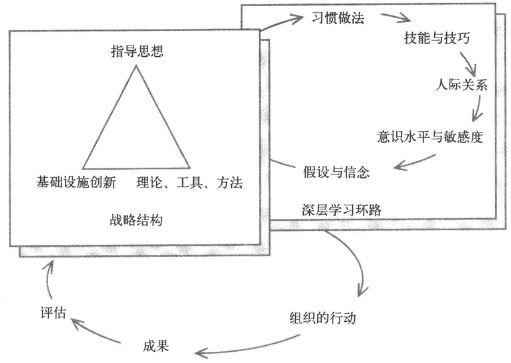
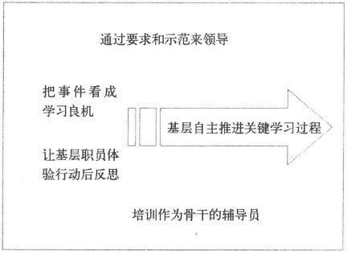
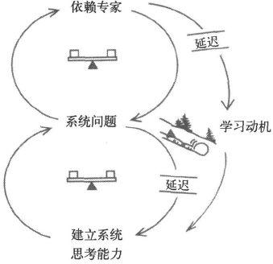
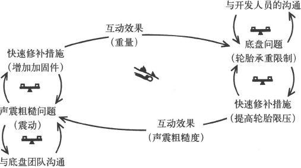
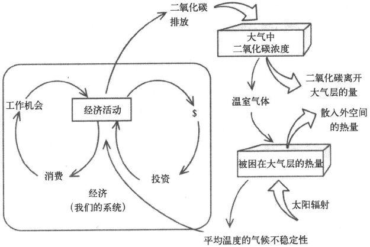
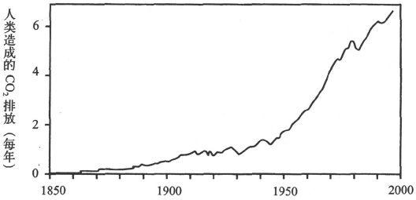
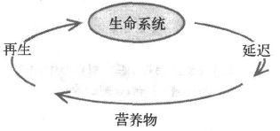
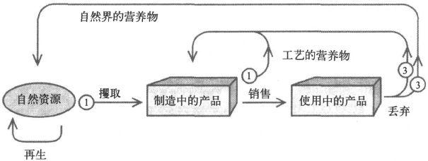

第四部分 实践中的反思
---------------------

#### ｜序　言｜

本部分的内容，是对20次访谈中观点的综合整理，受访者都是我非常钦佩的"学习型组织的艺术与实践"的杰出倡导者。他们背景多样，或来自工商业、政府和非政府组织、初等和中等教育领域，或来自社区组织，是我所接触和了解的众多组织学习实践者的代表。多年来，我一直受到他们的激励。

在英文第一版《第五项修炼》本部分的序言里，我用了"原型"（prototypes）这个词来比喻创建学习型组织的历程和阶段。1903年，莱特兄弟在基蒂霍克的飞行试验，标志着飞机的"发明"。从那时起，到1935年DC-3型飞机成为第一架在商业上获得成功的飞机，这30年间曾经出现过无数个"原型"飞机。（又经过20年，专门技术和基础设施的积累才成熟到一个相当的阶段，使得商业航空完成了关键性跨越，变为一个主要产业。）在那篇序言里，我提出的一点看法是，从技术的发明到其实用性"创新"的成功，是寻求不同的技术开发成果的整合过程。只有通过这种整合集中，才能使创新获得成功。到那时，作个交叉比喻，原型就成功"起飞"了。因此，我当时写道，五项修炼可能成为管理创新领域协同整合的基础。

从1990年本书的第一版写成至今，虽然有许多事情发生了，但原型这一基本比喻，似乎仍旧适用。除了实验之外，学习实践还是别无他法，没有已知的既定答案，也没有万能的灵丹妙药。仅有对标杆管理和"最佳实践案例"的研究，还是不能满足要求------原因是，原型开发过程不只是按照已有的方法进行渐进改良，而是需要彻底的新观念和新实践，以及它们共同创造的新管理方法。幸运的是，现在情况与当时不一样了，现在已经有许多成功的原型，在许多不同的产业和文化背景中脱颖而出了。

工程上的物质原型，通常要在实验室进行测试。而组织原型却必须马上就面对严峻的现实。当今的时代处于在更深的层面相互矛盾的影响力之中，其特征是，在"情况好转"的同时又"变糟"------这使现实更难于驾驭。一方面，15年前第一版中阐述的基本观点，现在已经获得广泛认可；而另一方面，对大多数实践者来说，组织的环境氛围却更加艰难了。

福特公司战略主管兼首席信息官马弗·亚当斯（Marv
Adams）说："毫无疑问，学习实践和不断的知识创造，已经得到主流管理学的重视。但这不等于说，无论经营状况好坏，大多数公司都始终如一地广泛传播并实际应用它。"英特尔公司全球制造部门原主要负责人大卫·马辛（David
Marsing）认为："尽管许多公司提高了对文化本身，及其业绩方面的功效和作用的理解，而且还特意设计了考虑文化因素的工作程序，但他们的技能水平和娴熟程度还很低。"私营企业界之外的挑战情况，也没有什么不同。牛津乐施会（Oxfam）英国总裁、英国国家医疗保健系统（British
National Health Service）原区域主管芭芭拉·斯托金（Barbara
Stocking）说，她一直是个"偏重人的发展的经理人"，"帮助别人发展组织是我的意愿所在。但是这些年来我看到，普遍的变革模式是自上而下的目标驱动，而且，在高管层，很少有人关心人或者组织的成长和发展"。

尽管如此，后面的故事告诉我们，在这些复杂的变流交错和碰撞之中，创新者还是找到了引领变革的空间。他们虽然来自截然不同的组织背景，却受到同一个理念的激发，即：一定有更人性化、更有效力、最终也更有创造性的共同工作的方式。作为经理人和组织机构，他们尽管还是少数，却代表着一群人数不断增加的、经验丰富的领导骨干，而在世界范围内，他们正在开始改变流行的管理体系。对根深蒂固的假设和习惯的变革事业，还有其他的方式开锚起航吗？

#### ｜第12章｜基础

在我们为本书增订版作的访谈中，有一点让我印象最为深刻：1990年本书中的核心理念，许多在当时都显得很激进，而现在已经以各种方式融入人们观察世界的方法中，融入人们的管理实践中。这些理念，如后面章节中描述的，现在似乎已经被认真从事组织学习的实践者所普遍接受，它们成为未来工作发展的新的基础。

每位访谈对象，都用这样或那样的方式，寻求建立更富有反思氛围的工作环境，以使深度汇谈成为可能，并使观察自己的理所当然的心智模式成为可能。通过人的成长来推进组织的发展，是贯穿每个故事的核心理念。许多人还谈到一种心态的转变，即从"修补部件"，到把组织看做活的生命系统，它本来就具备巨大的、往往未被开发的潜力，去学习、去进化、去治愈自己的疾病并恢复健康。

#### 建立深度交流的反思型文化

#### 通过交流的变革

BP公司执行副总裁维维安·考克斯（Vivienne
Cox）说：\"BP公司常常让人感觉像是一台业绩导向的机器，而我就是被这个机器训练出来的。15年前刚开始负责一个业务部门的工作时，我很想尝试一些新想法。我和我的同事约翰和吉恩（我们分别负责紧密相关的两个部门以及这两个部门的联合业务）有一个简单的想法：培育更多的跨越组织边界的合作，分享信息和知识，以便作出更好的决策。

"我们也不确定，怎样才能使这种新型组织模式成功运行。但我们后来决定，最好的办法就是让大家一起交流。如果每个人都能更好地了解别人在做什么，我们就能开始看到各种可能性，进而从中呈现出正确的模式构架和设计方案。我们组织了一系列研习营，大多数集中针对我们当时面对的各类问题，以及解决问题的选择方案。这些交流逐渐形成了新观点，考虑了不同的业务组织方法。我非常惊讶地发现，研习营中出现的观点，并不是我开始时想到的观点，而实际上，我自己的观点是错误的。就像这样，简单地把人聚到一起进行交流，就创造出一系列新的可能性，并带来了业务的改进。"

研习营形成的新观点相当复杂，也很难实施，但后来却成为一个大得多的组织构架的源头------如今，考克斯正在领导着这个机构。

\"那些对话交流中出现的主题，后来证明都是根本性的，意义深远，而且给BP带来了可观的竞争优势。那项工作也给我的职业生涯带来最大的乐趣。我和约翰、吉恩一起，互相激发了勇气，做出了一些不可能各自单独完成的事。我们学到，文化如何才能被改变，而这个是不可能从上层驱动的文化大变革计划中学到的。

"后来在公司的工作中我曾有过不同类型的老板，包括强势的命令控制型老板。这让我得以反思自己在他们那里的经历的差异。我意识到，为业绩目标导向的领导者工作是怎样的感受：那种在交流中才能经历到的真正的生命体验，那种可能性，在这种环境下被剥夺了。换到新岗位，有了更大的自由，我就继续试验，看如何才能让大家一起相互交流。"

考克斯今天是BP公司职位最高的女性。她阐述的观点很简单，但仍然不被主流管理界理解。尽管大家几乎都提倡增进交流，但领导实际项目所要求的那种开放精神，如考克斯那样，却是很少见的，这也部分由于我们对它还所知甚少。

#### 反思型开放

第一版《第五项修炼》的第四部分，讨论了"参与式开放"（participative
openness）和"反思型开放"（reflective
openness）的区别。参与式开放也可以叫做"表现式开放"（expressive
openness），它是指公开谈论自己的观点。这当然是创造更富有学习氛围的工作环境所需要的重要元素。但是，它很不完整，因而很有危险性。作为"参与式管理"（participative
management）理念的延伸，参与式开放在20世纪80年代开始流行。有些组织甚至试图建立正式的组织程序，以便进行开放的沟通。但是，这些努力很多都渐渐消失了，原因是这些方法以及它们的组织支持者根本就没有什么效力。
1
1994年，阿吉里斯在《哈佛商业评论》上发表了一篇经典文章，批评了"阻碍学习的优良沟通"。他认为，正规的沟通技巧和方法，如"焦点小组"（focus
groups）和"组织调查"（organizational
surveys），实际上就是让员工表达自己的想法，又对矛盾问题以及自己在其处理中的角色和作用，不承担任何责任。这些方法失败的原因，是"无法让人反思自己的工作和自己的行为。不鼓励个人的负责态度，也不能暴露深层的、可能带有威胁性或令人窘迫的信息，而只有这些信息，才能激发学习动机，产生真正的变革"。但是，正如阿吉里斯的话所隐含的，要超越参与式开放，可能会很困难，而对寻求保持控制的经理人，尤其如此。

在许多年间，罗杰·萨朗特（Roger
Saillant）曾在福特公司应用组织学习方法，成为公司业绩最好的经理人之一。在20世纪80年代到90年代的大多数时间里，他被调动于不同的生产基地之间，从北爱尔兰、东欧、中国，到墨西哥。他成功地把其中一些，从原来福特公司最差的工厂，转变为最好的生产基地。在另一些地方，他建设了新工厂，成为制造业历史上无可比拟的最优秀的工厂。其中许多直到今天，即他离开10年之后，仍然是福特的顶级生产系统。

那么多年里最让萨朗特惊讶的，不是他的成绩，而是他在福特公司的领导们对他所做的事的反应。萨朗特回忆说：\"我一直以为，只要我遵守公司的核心价值和业务目标，就可以按照我的个性和风格行事。当然，我的老板们后来也知道，我激励员工的方法与众不同，所以才做出了那些成绩。但他们从不问我，是怎么做出那些成绩的------我是说，从来没有一个人问过。我一直觉得很困惑，因为我觉得，他们应该对这些感兴趣，以便在别的地方重复这些成功的方法。但他们只是对我说，'你去这里干（新地点），因为我们需要你去做这个'，或者，'如果你去，就会不一样'。假如有人开始问，'你究竟怎么做的？'那他们就会回避和我交流。

"我觉得，他们那种表现的原因是，他们大概也知道我是怎么做的，但又不想深究。在一定程度上，对于要面对那种脆弱，他们还没有准备。也许他们感到有点害怕，那样向自己挑战，那样暴露自己，那样人性化，都意味着什么呀。也不知道什么原因，我就能理解，如果能够与自己的内心沟通，就可以毫无畏惧地公开暴露自己。对于领导者，这可能会很令人恐惧。"

参与式开放是不够的，因为它不能激发承诺投入，不能建立共识，而这些又都是产生真正变革所必须的。正如一位满脸不悦的高管所说的："好像这里隐含的假设就是，所有问题的解决方法都是：大家一起分享观点。"问题的核心是，共同学习始于真正的相互聆听，而不只是对谈。而聆听却并不是件容易的事。反思型开放是向内反省，让我们向内和自己交流，以便更多地意识到我们思想中的偏见和局限，以及我们的思想和行为是如何帮助制造了问题和矛盾的。

反思型开放是心智模式修炼的基石。没有人能把一家公司、一个家庭或者一个国家都装到脑袋里。我们的生活经历塑造了丰富的内心假设和情感，而关于这些系统我们就有了（在最好的情况下也仅仅是）一些成形的观点和假说。培育反思型开放，可以让我们自愿地、不断地测试这些观点。反思型开放的特点，是真正的思想解放，那是深层聆听和真正交流的第一步。这说起来简单，做起来不容易------因为，如考克斯和萨朗特这样优秀的实践者所知道的那样，建设反思的环境，要从我们情愿开放自己入手------如萨朗特所说，自己要变成脆弱的、"暴露的"状态。组织环境如果没有深层的承诺投入来帮助人的成长，没有因此而必须创造的诚信和相互依赖的精神氛围，就不可能做到这一点。

#### 人的成长

现在想一想，我觉得五项修炼中最根本的修炼，就是自我超越------即创造组织环境，让人获得真正的成长。今天，大多数公司都支持某种人本的哲理，"员工是我们最重要的财富"，他们花不少钱做人力资源开发，主要通过培训。但是，真正投入帮助人的成长，所需要的绝不止这些。许多年来，我一直听考克斯和萨朗特这样的人讲述他们的经历，而他们的故事中的情感内核，始终是一个。虽然来自广泛的生活经历背景，他们却都发展出一种不可动摇的信念，即坚信人的精神的解放和共鸣会产生内在力量。他们都走在一个终生的旅程上：去发现这究竟意味着什么，以及究竟如何去做。

2005年，马萨诸塞州伍斯特市的一些商界领袖，启动了首场"纪念奥布赖恩系列讲座"。系列讲座的目的，是通过每年一次的商界领袖演讲，来继承和发扬奥布赖恩的遗产。演讲人要代表奥布赖恩的信念，即"增加金融资本的最好方法，是增长人力资本"。首场演讲的企业家是哈雷－戴维森公司前CEO，国际组织学习学会网络的创始人之一里奇·提尔林克（Rich
Teerlink）。他指出："真正承诺投入到人的成长，要靠一种信念的力量。你必须相信自己心里的直觉，即人们需要追求一种有意义的愿景，想要作出贡献，想要对结果承担责任；而且，愿意检查自己行为的缺点，并尽力改正错误，纠正问题。这种信念，控制型经理人是不容易接受的。这也就是为什么关于人的成长，'说的'和'做的'之间会有那么大的差距的原因。"

#### 值得承诺投入的目标

沃尔沃瑞典公司前总裁、宜家北美公司前总裁（以及国际组织学习学会首任常务董事）约兰·卡斯泰德（Goran
Carstedt）认为，创造有利于人的成长的环境，要从"值得人们承诺投入的志向目标"开始。卡斯泰德指出，"企业领导者常常要求员工承诺投入组织的目标中。但是，真正的问题是：组织的承诺投入是什么，那值得我花时间吗？"尽管有许多有关组织目标的阐述，有无处不在的愿景声明和价值宣言，但是，如萨朗特指出的，员工对公司的真正承诺还是"有很多尖酸的说法和怀疑态度"。还有很多迷惑和混乱------首先是对公司的目的------按照定义，公司的概念是追求投资回报最大化。许多年前，彼得·德鲁克曾说过："赚钱对公司来说，就像人吸进氧气。如果你吸进得不够，你就得离开这个世界。"换句话说，利润是所有公司企业的业绩要求。但是，那不是个目标。把德鲁克的比喻再延伸一步说，如果公司把利润作为目标，就好比人把呼吸当做生活的目的，那他们真就缺点儿什么了。

具有讽刺意味的是，把企业的目标等同于经济收入底线，这同时还会让企业的财务收入状况走向平庸，交上命中注定的厄运。有无数研究企业长期业绩的案例可以证明这一点。
2
在今天的世界里，越来越多的人有越来越多的自由，来选择自己的工作单位和工作方式，这样一来，组织主张什么、拥护什么、承诺什么就很有关系了。公司如果没有值得承诺投入的目标，就不能培养承诺投入的精神。它会强迫人们生活在支离破碎的世界里，无法激发热情、想象力、承担风险的勇气、耐心、坚忍不拔的毅力，以及对生命意义和价值的追求，而这些又都是达到长期财务成功的基础。

联合利华公司的布里吉特·坦塔维－蒙索（Brigitte
Tantawy-Monsou）说："我就是想让我的个人生活和工作生活，成为同一个生活。"2002年，经历了供应链管理、产品研发和业务卓越管理职业生涯以后，坦塔维－蒙索说，她接触组织学习、自我超越和心智模式修炼，"对我理解我过去的经历很有帮助，因为我总想用科学的方法，总要分析问题。而在这里，我看到了一个新层面，一种'软的'层面。它帮我认识到，可以从社会系统的视角来理解组织和团队，可以用更加全面整合的方法来处理问题"。她发现，系统观点也可以用在她个人身上。"我特别对个人和公司的目标和价值之间的协同校正感兴趣，我个人渴望协同校正，所以，这个新的管理理念，使我引起了共鸣。"

后来，坦塔维－蒙索参加了值得她承诺投入的一些项目，应用组织学习的工具，处理联合利华在可持续发展方面的事务。她甚至还逐渐重新界定了自己的工作岗位，使自己能用全部的时间来做可持续发展方面的工作。"我想在公司内部和外部，都多做点事，多做点真正事关紧要的事，而组织学习的方法，帮助我发展了能力，以产生更多的影响力。这正好和我的职业生涯以及我整个生活的下一阶段巧合。"而如果不是联合利华公司的最高层在好几年之前就开始意识到，环境状况的历史性变化已经威胁着公司的未来，那也不可能发生这些事。作为世界上最大的渔业产品（鱼制食品）的营销商，公司在20世纪90年代就认识到，"如果不进行根本的变革，以实现可持续的渔业，那我们就没有值得投入的渔业产业可言了"，一位公司高管如是说。
3
今天，除了在联合利华公司内部从事商业可持续发展项目的工作，坦塔维－蒙索还在协调国际组织学习学会欧洲"可持续发展协作组"（SoL
Sustainability
Consortium），作为总部在美国的学会的可持续发展协作组的延伸。她说："我一直都喜欢工作。但是，这第一次让我感到，我现在在做对我自己个人来说，真正重要的事。"

#### 有转化力的人际关系

坦塔维－蒙索的故事告诉我们，人的成长要从承诺投入真正重要的东西开始。而它的展开，如波士顿社区组织罗卡（西班牙语Roca，意为"石头"）的人所说，要在"有转化力的人际关系"（transformative
relationships）网络中进行。

罗卡的目标是为年轻人建设安全而健康的社区。罗卡所在的马萨诸塞州切尔西镇，距离波士顿金融街不到两英里，但文化上的距离，使它们之间好像隔着一个世界。那里的居民主要是来自拉丁美洲、东南亚以及非洲的移民。罗卡街道工作者团队原主管西罗姆·冯格（Saroeum
Phoung）说："当一个移民，就意味着你没有朋友，没有工作，没有标准，也没有在自己社区中的地位。家庭的功能被破坏了------这些移民家庭中的父亲往往不会说英语，所以找不到工作。因为他不能养家，随之而来的多重压力反而容易让他成为施虐者。而第二代移民通常甚至面临更多的困难，因为在他们成长的过程中没有稳定的家庭环境。由于没有改进和进步的希望，他们就没有努力的动力。因此，他们就像我原来那样，参加了黑帮。"

罗卡吸收的对象，就是原来的少年黑帮成员、年轻的父母，还有社区成员。他们到街区里帮助别人，重建社区生活。因此，罗卡成为警察、法庭、学校和许多社会服务机构的中间人。罗卡成立18年以来，切尔西镇的犯罪率和暴力事件发生率大幅下降，学生毕业率大幅上升。许多年轻人如果不是因为罗卡，可能就活不到今天，而他们现在都上了社区学院或者四年制大学，找到了工作，生活充实，积极向上。马萨诸塞州政府社会服务部（DSS）主任哈利·斯彭斯（Harry
Spence）说："罗卡的成就是令人惊异的。假如我们有6个像罗卡这样的组织，我们全州在这方面的工作就会大不一样。"

我花很多时间和罗卡的年轻领导者交往，我在不断地向他们学习，了解他们对如何帮助人成长的深层体悟。我在对一组街道工作者访谈时，图恩·克劳奇图得告诉我："创造有转化力的人际关系，是我们工作的基础。""我们接触的年轻人，需要一种人际关系，以帮助他们活下去，"罗卡创始人莫莉·鲍德温（Molly
Baldwin）说，"我们的第一任务，就是与他们见面。他们中有许多人从来没有过自己的依靠，以及能始终如一地给予自己全面支持的关系，我们就把他们当做有自己天然个性的人来交往。而我们这样做的时间久了，他们之间也开始相互这样交往了。"

发展这种"面对面相互支持"，罗卡有核心方法和不断进行训练的场所，他们把它叫做"维和圆圈小组"（peacekeeping
circles），那是基于美洲印第安人的学习和医疗传统中一种集体反思的方法。奥玛·奥蒂兹说："在圆圈小组里，我们学会了真正的相互倾听。"

玛丽娜·罗德里格兹讲了一个有代表性的故事："最近，有一位年轻的女孩怀孕了，她不知道该怎么和妈妈说。她很害怕。这样的情况，往往会造成女孩出走，或者由家里的亲友出来帮忙。但是我们认为，帮助她的最好方法，就是为她建立一个圆圈小组。有位街道工作者和她关系很好，于是就组织了几个人------那女孩和她妈妈都信任的几个人，组成了圆圈小组，我们一起处理了这个问题。相比将问题留给女孩和妈妈自己处理，让她们互相叫喊指责，这样做的结果大不一样。关键是形成交流对话，让妈妈听女孩讲，并能够相互接受对方。这个做法主要是扩大她的圈子，建立她所需要的支撑环境。"

"这又变成了'合作学习'（cooperative
learning），"苏珊·尤尔里奇补充说，"圆圈交流对话就是大家围坐在一起，了解正在发生的事，以及如何应对。你会看到，问题不是哪一个人的问题，而是（每个人的）问题。在圆圈中，大家是平等的，我们都有问题，我们通过互相帮助来学习。"

"我们从纳瓦霍印第安人保留区部落法庭的首席法官那里学会一句话，"鲍德温插话道，"他说，'你不能用一个不好的方法达到好的目的。'圆圈小组始终让我们保持相互的连通，每天都帮助我们创造社区氛围，帮助我们一起面对我们必须面对的问题。"

#### 从我做起

对个人成长的承诺投入很重要------这对于身处领导岗位的人，就是最重要的事。鲍德温说："我总是必须做自我反省的工作。如果我们与警察的意见不一致，我就必须看看，我自己都做了什么，才造成争执不休------许多时候，我真就想到外面去，冲着谁喊，而不愿意保持冷静，去反省自己在当前的矛盾局面中的作用。"

"这些都必须从自我超越开始，"萨朗特说，"从我自己情愿看到自己的缺点和毛病开始，这些缺点和毛病对周围的人来说是如此明显。我绝不可以要求组织中的其他人比我更开放，更愿意学习和改进。"

#### 把组织看成生命系统

现代科学中发展出来的系统观点，背后有两个不同的思想传统。系统的工程理论，提供了实际的工具，如系统基本模式和计算机模拟模型，它们能帮助我们理解复杂的、相互依存的问题。而对生命系统的理解，则会帮助我们感悟团队、组织，以及更大系统的学习与进化的能力。我在写作

#### 机器时代的思考方法

德赫斯的著作《长寿公司》（The Living
Company）促进了我的思考，加快了我把企业作为生命系统来理解的进程。简单地说，把企业看做是生命系统，就是把它看做是人类社区。这个理念，德赫斯已经通过这样的问题明确提出："我们怎样看待企业------是作为人类社区，还是赚钱的机器？"
6
虽然每个人都会谴责后者，但我们当代的语言和管理实践，却说明着另一种情况。

实际上，机器的形象语言充斥着管理行话。我们的经理人"运行"（run）一家公司，这与运行一台机器没什么两样。我们有公司的"拥有者"（owners），这个词对机器而言十分恰当，但用在人类社区，就有点问题。当然，还有领导者"驾驭变革"（drive
change）。对这些形象图景，我常常纳闷，人们是否压根儿就没想过，使用这类语言究竟在说明什么。如果人们想过这个问题，他们也许会住嘴，质疑自己，即使是短暂的一会儿工夫。不管怎样，我们多数人会"驾驭"一辆车，但我们还知道，如果我们试图"驾驭"我们的配偶，或正处在青春期的子女，会发生什么------通常是事与愿违的结果！有趣的是，我们如此轻易地就倾向于使用这种语言，来描述组织变革的需要。这当然就是德赫斯所指出的：我们都很容易把组织看成是机器，而不是生命系统。

德赫斯理解这两者，即把组织看成机器与看成人类社区之间的区别，这得益于他对一个实际问题的追踪，即"长寿公司都有什么特点"。壳牌公司对公司寿命的著名研究项目（见第2章），就是由德赫斯主持的。研究发现，财富500强企业的平均寿命小于40年；同时，世界范围内约有20家公司，寿命达到200年以上。研究结果表明，超越历史、国家、文化、产业背景和技术等方面的差别，长寿公司有一些共同特点，即公司更倾向于把自己看成是人类社区，而不是金融财务机构。壳牌公司原始研究报告说，这些公司"对自己是谁，有一种认同感，超越了它们所做的事"，这使它们有能力去进化，去适应，去学习；而它们的竞争对手就做不到这一点。

生命系统的观点，对于今天全球相互依存和复杂多变的世界，比以往更有相关性------就像世界最大的公司的"秘密"故事所揭示的。尽管收入大约比沃尔玛大10倍，市值比通用电气至少大一倍以上，国际信用卡巨头维萨公司，是商业世界中保守秘密最好的公司之一。当然，不是说这家公司的产品没人知道，也不是说它领导的是一个令人迷惑不解的产业。去年，没有几家公司的顾客能达到世界六分之一的人口！然而，过去10年间，《商业周刊》、《财富》和《福布斯》等杂志上，发表了超过1000篇关于微软公司的文章，350多篇关于通用电气公司的文章，但是，只有35篇关于维萨的文章。为什么呢？因为维萨看上去根本就不像个典型的跨国企业。它的股票还没有公开买卖
〔1〕
，因为它的股权拥有者是数量超过两万的会员组织。它也没有大型公司总部，因为它只是一个网络，由成员组织管理，有一个组织章程，界定其目标和运营原则，规定其决策权力归属于选举产生的各个董事会。它没有一个典型的、受人关注的CEO，来决定公司行动策略（并收取天价工资），因为它的策略，实际上是分散的：自治的各个企业所组成的网络，有为数众多的各种不同的策略。

维萨看上去不像其他大公司，运作方式也不一样，原因是，创建它的灵感不是来自机械的形象，这与其他公司不同。在信用卡产业初期，发生了大规模的发行过热和财务崩溃。那时，维萨的创始CEO狄伊·哈克（Dee
Hock）悟到一件事。他清楚地看出，全球金融交易网络当时已经开始出现强劲的发展势头，必须有一种力量来协调整个网络。但是，"设计一家公司去做这件事，超出了理性的力量"。
7
但他也知道，大自然经常可以做到的，就是这种协调。他想知道，为什么"人类组织机构就不能像热带雨林那样运行？"为什么人类组织不能遵循生物机体的理念和方法模式运行？"假如我们放弃争执，不管究竟应该把新机构设计成什么结构，而以某种遗传密码的模式重新考虑这件事，那又如何？"简言之，维萨的灵感，是要放弃我们"旧的观念与机械论的现实模型"，而去拥抱生命系统的原理，并把它作为组织的基础。后来，哈克甚至为他设想的这种组织形态造了一个新词："浑序"（chaordic）。因为，自然界中"秩序不断地从看似混沌的状态里呈现出来，然而在管理实践中，我们却总是试图强加秩序，原因就是我们害怕被混沌主导"。

生物学家葛雷格里·贝特森（Gregory
Bateson）曾说："我们今天所有的问题，都来源于我们的思想方式和自然运行方式之间的差距。"
8
比如，我们的主要组织机构的遗传物质DNA（脱氧核糖核酸），是基于机器的思考，"所以系统都必须有人控制"。而我们知道，对于健康的生命系统，如人体或湿地，控制是分散的。但我们非常习惯于"必须有人控制"的心态，哈克称之为我们体内的"牛顿式壁橱"，以至于无法想象替代方法。不过，只要我们学会观察，这些替代方法就在我们身边，随处可见。

#### 工作是怎么完成的？

喷墨供货组织（ISO）曾是惠普公司最大、利润最高的部门，这种情况持续了10年以上。这个部门的信息技术与战略主管安·玛莉·阿兰（Anne
Murray Allen）说：

\"我们就是想理解工作是怎么完成的。我记不得我是什么时候开始用系统观点看问题的，反正是很久以前了------多少有点天性如此。《第五项修炼》一问世，我就把它吃透了。那时，我已经是深度汇谈的实践者，告诉客户聆听的力量，以及要怎么做才能一起完成出色的成绩，那甚至是在我来惠普之前的事。到了惠普，我开始做战略，特别是IT在战略中的作用。后来那自然成为知识管理，那时已经成为一个主要关注点。但是，所有那些'学到的经验教训'的数据库，诸如此类的东西，对我来说都没有什么高杠杆效益。而有另一种看法，认为知识就在我们身边漂游，我们需要做的只是捕捉它，给它编码、整理，这个看法我也不看好。现在，它已经没有多大市场了，因为许多公司花了很多钱，搞'知识管理系统'，结果拿不出什么像样的成绩。

"问题的根源在于，不理解知识是什么，它是怎么产生的，怎么在实际条件下运行------因为，知识是社会性的，是指我们知道怎么做，而我们做的时候是相互关联的。工作是怎么完成的？就是这么完成的。知识管理的另一面，就是协作。不能只谈论一面，而不讲另一面。所以，搞知识管理，你就必须面对协作，有各种工具方法来帮助人们协作。今天，我们的工作有许多是关于知识网络的，我们也叫协作网络：大家怎样一起创造价值，并且开辟新的价值来源。这是个相当有机的过程，但还是有理解它的方法，有帮助它成长的方法，而不是阻碍它。"

几年前，阿兰开始和俄勒冈大学的社会网络研究者丹尼斯·萨多（Dennis
Sandow），一起合作进行一系列研究。"我们很快学到了两件事：基于其不同的关键技术能力，来辨认不同的社会网络，这是可能的；大家都愿意参与这项研究。丹尼斯的方法的美妙之处，与大多数学者（的方法）不同。他不是去替别人分析，而是教会工程师们，怎样自己来分析自己的网络。"

萨多说："我真正的目标，是帮助大家反思，看他们自己是怎么做的。对理解自己的工作过程，对向别人解释这些过程，大家自然很感兴趣，特别是要向经理们解释，因为他们总爱搞重组，重新分派大家的工作，而又对这样做的后果没有真正的理解。今天，那些工程师有了一种全新的语言，可以用来和经理们沟通。"

阿兰和萨多的工作，架起了一座新颖的桥梁，它连接着反思的实践、人际关系的重要性，以及把组织机构看做生命系统的领悟。阿兰指出："我们逐渐从学习中体悟到，通过反思，知识网络就会得到扩展和加强。当我们考虑与谁合作，然后一起反思我们合作的过程，我们就互相接受了对方，相互给予了合法性。"例如，ISO曾面临一些重要问题，要求对物质化学有新的理解。ISO当时和两家竞争力很强的售货商合作，开发惠普售货系统的社会网络图。这张网络图不仅澄清了谁了解什么，还帮助建立了信任感和相互依存感："大家觉得受到重视了，他们的忧虑和他们的贡献，都向所有人、以同等清晰的方式展现出来了。几个星期的协作，在早期建立了这种信任和开放心态，使这个网络能够把新喷墨盒的开发时间缩短16周。今天，我们有许多这类的案例，而培育对我们各类知识网络的反思能力，其实用价值也逐步得到了认可。"

回顾合作的历程，阿兰和萨多得出如下结论：\"正如物质科学的哲学理念主导了工业时代，生物科学的哲学理念正在开始主导知识时代。新的理念把知识、人类以及组织机构看做生命系统......（这代表一种转变，从）（

阿兰和萨多对社会系统的观点，受到智利生物学家哈姆伯图·马图拉纳（Humberto
Maturana）的影响。马图拉纳是生命系统认知研究的著名先驱者。他认为，智能行动在社会系统中产生，那里，网络的所有成员都互相接受，成为网络的合法参与者。2000年，ISO管理层邀请马图拉纳做了第一次研讨会。那次的经历令人难忘，有100多位工程师倾听他的讲话，其内容主线是：仁爱就是承认和接受别人为合法的参与者------而且，"情感也能扩展智能"。他的演讲让我想起，我在为德赫斯的书撰写序言时所学到的英语"company"（公司）一词，来自法语compaigne，意思是分享面包，并与"companion"（同伴）一词同根。有趣的是，在瑞典语最古老的语汇里公司一词，"narings
liv"，意思是"滋养生命"。而中国古老的词语"生意"，意思是"生活的意义"，或"生命的愿意"。也许，当我们重新发现作为生命系统的组织机构，我们还会重新发现：作为人在一起工作，有一个真正重要的志向目标，其真正的意义会是什么。

#### ｜第13章｜推动力

建设学习型文化（learning-oriented
cultures）在任何条件下都是一项艰难的工作。需要花许多时间来做------其实，它是个永无止境的征途。它充满风险：要么无法实现真正的文化变革；要么成功实现了变革，但却因此变成想要保持现状的人的一种威胁。建设学习型文化的要求很高，因为学习实践要让我们个人承受很大的压力，而待在舒服的地方总是要容易得多。过去15年间，没有任何迹象能让我改变对这些困难挑战的理解。既然这样，什么才能激励人们开始这个征程呢？

似乎有三种相互关联交叉，又互不相同的动机，激励着人们去开启建设学习型组织的艰难工作。有些人想寻找更好的模式来管理和推动变革。有的人则想建立组织整体不断适应变化的能力。所有人似乎又都认为，一定有更好的管理和组织职场工作的方法，既更加实用，也更加人性化。它可以显著改善绩效，并且创造一种工作环境，让我们大家都真正愿意去那里工作。

#### 不同的变革方式

国际金融公司（IFC）是世界银行的一部分，负责对发展中国家的私营企业部门进行投资。IFC的人力资源副总裁多萝西·滨地－贝利（Dorothy
Hamachi-Berry）说："来到世界银行以前，我在一些组织工作时，曾经历过戏剧性的，但你可能说是机械式的变化。往往是新领导一上任，就出现一个'火坛'，也就是说出现一些强制性原因，让你不得不打烂烧毁所有的东西，然后重新开始。这种方法在我经历过的地方，似乎从来都不管用。1996年我刚到世行，有一位新领导来了，我们就把几百位高级经理人送到大学进修高级管理开发培训项目。他们都学了同样的变革理论模型，但是，你瞧，什么变化也没发生。那时我就想，有没有不同的模式？我开始意识到，不同的模式必须要从愿望开始，包括我们的客户的愿望。"

那时，世行正在试图解决长期阻碍效率提升的组织问题。比如，原来住在华盛顿的"国家经理人"，被派驻到当地国了。想法是让这些经理人身处第一线，以便了解客户的需求、愿望和目标。同时，世行还建立了专业网络，以便加深全球的基础知识背景，此外，还有一个新的矩阵式组织也被建立起来了。

1989年，世行的墨西哥团队与人力资源开发团队中负责卫生健康和教育的成员，一起开始了一个学习实践项目（当时滨地－贝利还是世行总部的人力资源副总裁）。她回忆说："我们有一个出色的国家团队，但他们遇到困境，不知道矩阵组织的新业务模式。"两天的基础研习营过后，这个团队花了好几个月的时间，学习深度汇谈、系统思考、自我超越等修炼工具，总体目标是帮助客户理清自己的开发愿望。世行有个老问题，不能跨越内部部门界限，把投资资金送到地方的创新项目手中。"在墨西哥，我们有客户，有国家团队，以及网络，大家以一种新的协作方式一起工作，这在以前很少发生过。大家一起作为团队来开发解决问题的方法，而不是由世行给出一个处方。这样做的结果是开发出一些令人兴奋的项目，比如，用新方法给偏远山区的儿童提供教育和医疗服务。那是个出色的项目样板，它告诉我们，一旦世行员工与客户联合工作，并让客户有能力自己推动项目开发的进程，而不是相反，那将会出现什么结果。很快，我们就收到更多的项目请求。"

大约就在那时，滨地－贝利从世行调到了IFC，原因是在最高管理层有了一个类似的创新机会。她在墨西哥经验的基础上向前推进。"我们从没有使用像'学习型组织'这样的术语，也没有谈论《第五项修炼》。因为，那样就会听上去太学术了，那些理念就会失去效力。而我们探讨的是建立和明确愿望，包括我们自己的愿望和我们客户的愿望，还有建设深度汇谈和探寻的能力。"

刚开始时，投资官员们对学习工具没有什么需求。他们就是不用那种方式工作。"我们的投资官员是做交易的。深度汇谈和探寻可不是他们的风格------那就像是给他们拔牙。但IFC的CEO彼得·沃伊克（Peter
Woicke）认识到了这类方法的价值，所以我们就集中与他的管理团队合作。彼得很有耐心，我们花了两年时间，但你逐渐就可以看到效果，从人们如何交往，人们一起能做出什么事，就可以看出来。人们学会了坦诚布公，能够公开提出不同意见，能够有意识地浮现冲突，而不是绕圈子。"第一个转折点是沃伊克的好几个直接下属，要求在他们自己的团队进行类似的开发过程。"逐渐地，许多基本的学习演练方法开始在大家的工作过程中出现了。IFC是世行唯一需要关注经济底线的部门：商业成功与开发效果都同样重要。由于可以跟踪商业影响，这些努力的价值就更容易显现出来。现在，这项工作完全是由需求主导的。我们接到很多请求，是业务线经理们自己提出的容量能力建设的要求。"

沃伊克一年前退休的时候，滨地－贝利和她的同事们又有一次机会，来测试他们的文化变革努力的长期效力。\"支持这一方法的CEO走了之后会发生什么？我们知道，许多像这样的非常成功的创新，都遭到了取缔，或者虽然成功，但无法推广。但是，这项工作已经影响了政策，引起了战略转变，而我们的业务也在过去六年间翻了一番。
1
实际上，我们连续三年实现了破纪录的增长率和利润率------在我们的历史上从未这么好过。我认为，我们的成功很大程度上要归功于这么多的业务线经理人，他们体现了愿景的精神，他们吸纳了更多人，建设了学习环境。组织里一旦有一些这样的人，你就会看到一种势头，其他的事就容易多了。

"我们一起共同工作的能力，与客户一起工作的能力，都带来了更好的投资决策，进而取得更成功的业绩，进而更多地影响到可持续发展。这种在商业成功和开发效果之间的协调一致，是我们一贯的目标。回顾起来，很明显，它需要真正的耐心，一种在变革努力中经常缺乏的耐心；它需要情愿以身作则地引领变革，而不是仅仅把大家'送到项目中去'。彼得在世行以外的广泛管理经验，似乎让他确信，探寻能力和真正的愿望至关重要，而他和他的团队又愿意花时间，来开发这样的能力素质。这又与耐心结合在一起，然后大家才能看见实际效果的证据，进而会要求建设他们自己的能力。"

#### 建设适应性组织

#### 它的未来

许多人被吸引到学习型组织工作中来，不仅是要找到一种引领变革的方法，而且还要寻求一种方法来建设组织能力，以便更好地应对不断的变化。福特公司的亚当斯就是其中之一。他把后者称为"适应性组织"（adaptive
organizations）。

"作为一个首席信息官，你会用一种独特的视角来看企业，即把它看成一个整体，"亚当斯说，\"今天，有两个显著的时代特征：我们的组织机构之间有非常高的相互关联度；同时，我们的运营环境既相互依存，又高度不稳定。福特现在有30多万IT使用者，分别在20个基本业务领域，他们通过2400个应用软件相互交往，而这些软件是由10个不同的IT开发团队的6000名IT专业人员开发的，而他们又在与200个不同的IT销售商合作。所有这些又在急速膨胀，包括各类便携式和嵌入式计算装置的爆炸式增长：现在全世界在使用大约350亿个单片机、7.5亿个智能传感器、15亿部移动IT装置，而且数量还在呈指数式增长。这种高度便捷的通信联系，带来了更大的波动性和非线性效应：变化会突然出现，而不像过去那样可以预料。2000年以后的四年间，世界范围由于有意的恶性程序造成的财产损失增长了10倍，达到2000亿美元以上。

"这样的关联度和波动性意味着，我们必须用与以往截然不同的方式从事管理工作。跟上变化的速度是成功的关键。而用传统的自上而下的控制心态已经不行了，但是也不能没有任何管理组织，变成完全混乱无序的状态。发展适应性生存能力的关键，是不断保持管理组织工作过多和过少之间的适当的平衡。"

亚当斯认为，增加组织机构的适应能力，是组织中IT工作的未来。"由于IT专业人员的工作直接涉及把企业连接在一起的基础设施，所以他们能够直接影响组织机构整体性运作模式的成败。"虽然这些专业人员的传统工作责任会继续下去，但同时又会出现全新的方法让他们作出贡献，用亚当斯的话说，这就是"帮助大家看清模式，并处理复杂性问题。大家都被各种各样的信息淹没了。光给IT系统升级是解决不了问题的。这里需要的是，在无处不在的计算机信息处理的背景下，在实时的系统中，完成系统思考和协作工作"。

亚当斯现在正在培养新一代的IT工作团队，他们综合了系统思考和复杂科学，形成了新理念，并应用这些理念与业务部门的经理们共同研究一系列战略、运营和文化变革问题。他们不仅应用系统思考的工具来帮助大家看清系统模式，而且用复杂科学理论中的部分理念来设计战略变革选择框架，比如降低波动性、改变测量方法，及建立新的"互动模式"（interaction
patterns）。

例如，福特公司近来面对一项转变传统财务控制系统的艰巨工作，目的是为了遵守美国《萨班斯法案》（Sarbanes-Oxley
mandates）的最新规定。"《萨班斯法案》规定了公司必须执行的一系列财会监控制度。如果公司不遵守这些新规定，就得不到认证，就会使公司声誉受到影响，增加投资者心中的风险担忧，"亚当斯说，"公司的高级职员也要负个人责任，即对缺乏监控带来的问题负责，所以这是件大事。我们开始以为不可能在一年内拿到认证，因为我们不仅有四十多年历史的各种不同的福特公司监控系统，而且还有来自兼并进来的其他公司的系统，包括捷豹、沃尔沃和路虎汽车。"

亚当斯从不同的业务部门抽调人员组成了工作小组，他们研究了审计数据，结果发现了"脆弱性漏洞模式"（patterns
of
vulnerabilities）。这些模式又通过系统图表和深度汇谈方法得到进一步澄清。他们用这些方法还特别发现了，IT系统在产生脆弱性漏洞中的作用。比如，研究小组意识到问题的来源之一，就是财务报告政策有太多的变化和不一致性。所以，他们就设计了一个政策基线，以取代几十年间积累起来的混乱的政策大杂烩。有关如何界定公司财产也有太多的差异，为此研究小组设计了一个新的更简单的分类系统，以及一个新的更简单、聚焦得更好的测评系统。然后，他们培训了"经过认证的专家"，派他们到世界各地检查财产分类的一致性，并分享最佳案例，从而建立了前所未有的互动关系。很快，"我们就有11000名在世界各地的专业人员，都用一种语言辨认和处理所有监控问题，而且在两周之内就把这些问题中的绝大多数界定完毕。大家认清了自己被困其中的系统，并建立了促进系统变革的适当规模的管理结构。看到由此而使整个组织的能量得以释放，真是件令人吃惊的事。"

亚当斯继续说道："我们对一系列问题都使用了类似的方法。我们在学习如何进行容量能力建设，以使组织在自己的生态系统中的地位能够得到维护，还希望能得到改善。把这种能力建设融入组织文化是需要时日的，但自然已经给我们指出了有效的基本方法，比如：感知或认清模式、概念重组，以及'变异法'（mutation），即实验和反馈法。系统模型的建立、协作与深度汇谈、寻找过分变化和不一致性的案例，这些都是组织系统中的模拟（analogs）演练。如果能把这些有效地结合起来，就会促进创新。"

#### 一支适应型警队

在过去的数十年中，我欣喜地看到全世界有少数公共部门的机构，也采纳了各种学习工具和理念，以满足自己对持续学习力和适应力的类似需求。其中最坚韧不拔地从事这项工作的，是新加坡警察部队（Singapore
Police Force,
SPF）。"我们生活在一个快节奏的世界里，越来越被复杂的、充满不确定性的问题搞得应接不暇，"警察总监邱文晖（Khoo
Boon Hui） 3
说，"我们最近发现，有很多社区受到大量涌入的新式毒品、非法移民、新型犯罪方式和恐怖主义的威胁，但它们却没有作好应对的准备。我们必须建设看清发展趋势、应对潜在问题的能力，并在它们伤害到我们服务的社区之前，解决这些问题。我坚信，只有组织文化鼓励学习实践，我们才能通过对知识进行管理来建立起这种能力。"

十几年前，新加坡发起了建设"学习型国家"的运动，邱文晖带领的新加坡警队，以及许多其他组织，都加入了这个运动之中。

"当我接管新加坡警察部队时，我察觉到一些令人担忧的趋势。大家往往认为，警察的工作平淡无奇、不够体面，而且缺乏挑战性，不适合新一代的知识工作者。我们无法招到需要的人才。当时，新加坡警察部队是一个命令与控制型组织。要应对快速衍变的违法乱纪行为，就得当机立断，几乎没有时间请示上级，但警官却必须严格遵守标准的工作规程，这也就意味着他们无法应对这些问题。然而，给大家'授权'说起来容易，做起来却很难。于是在1997年，我们启动了一项革新计划，不但通过对业务模式的根本改革，实现了警官工作性质的转变，还通过对组织发展的投入，开始培育互信、开放的组织文化。我们知道，这项革新要耗费大量时间，而且困难重重，所以我们访问了从事这方面工作的一些组织，包括国际组织学习学会在美国的企业会员。"

文化不是凭空产生的，而是慢慢发展起来的------它不断保存和改进有用的东西，舍弃没用的东西。"从20世纪80年代初期开始，我们就成功地制定出了社区治安机制，社区人群也渐渐熟悉了我们的警官，他们不再害怕，而是开始信任我们了。尽管如此，警官们仍然不具备足够的知识和技能，难以发现并解决威胁社区安全的潜在问题。因此，我们扩大了他们的业务范围，让他们发动社区成员来帮助发现并解决当地的安全和治安问题。在警官们的协助下，社区成员在解决自己小区的安全和治安问题时，有了更多的主人翁意识。"

"随着警官工作的知识强度越来越高，他们就开始进行学习型组织要求的技能训练，以便能更好地在社区中开展'生成性汇谈'（generative
dialogue） 〔2〕
，并通过系统思考解决问题。为了解决各种长期问题，他们还需要建立起利益相关者网络。"邱文晖解释说，这与在治安机制运行中进行团队合作相吻合，而且二者都是新的概念，都"发挥着集体思考的杠杆作用"。最后，他们还注重各个层面上的领导能力建设，并向警官们反复强调核心价值："由此，警官们被赋予自行斟酌处理问题的权力，相信他们能够作出与共同愿景协调一致的决定与行动。"

随着警官业务范围的扩大，他们还需要在整个组织中有更强的连通感。"他们需要从新加坡警察部队广博的知识储备中进行学习，包括同事和其他警官的个人经历。我们通过叙述和讲故事的形式，从学习个人经历中的隐性知识（tacit
knowledge）着手，让参与过重大事件的警官和大家分享自己的经历。"为了鼓励知识的传播，他们还为一线警官建立了特别的经验分享环节，帮助他们学习如何处理困难的情况，如何应对不合作的个人或群体，以及如何进行"行动后反思"（After
Action Review,
AAR）。这个做法加强了各地方部门的反思实践，同时提高了整个系统的意识水平。这些努力还带来另外一项成果，就是一个电子留言板，警官们可以登陆并分享他们对每件事情的看法。"你在这里看到的是警官们真实的感受和想法，没有经过克制和保留，很多人对此感到惊讶。这个留言板最难能可贵的一点，是发帖人的热情。他们在这里找到了安全感，如果有足够的担忧和关切，他们就会将自己的看法、知识和经历坦率地表达出来。"最后，邱文晖和他的团队改变了强调严格的标准作业程序（SOP）的传统。他们"改写了这些标准作业程序，不再强调条例规范，而是重视基本原则，从而帮助大家根据最佳案例的做法，来行使自行斟酌处理问题的权力"。

在应对像国际恐怖主义这样的新挑战中，新加坡警察部队的这些变革尤其重要。"我们自己没有这方面的经验，所以必须和能够增加我们知识储备的组织和个人建立联系，这样的联系越多越好。"现在，新加坡警察部队在与全世界的许多同行合作，学习他们的经验。同时，新加坡警察部队还加入了一个包含学者、宗教方面的专家和社区领导者的网络，这使他们能够从许多不同的视角分析问题。"与处理其他核心问题一样，我们的兴趣点不在被动反应，而在于与社区伙伴密切合作，以诊断出问题的根源。"

"最终真正推动组织变革的是人。我们成功的核心经验，就是建立信任，并关注组织中的人际连通关系。如果连通关系的质量得到提升，思考的质量也就得到了提升。随着团队成员从更多的方面考虑问题，并彼此分享更多的观点，他们行动的质量就得到了提升，最终使我们取得更大的成绩。"事实上，他们的成绩确实振奋人心。新加坡现在的年犯罪率是每10万人800起，这还不到20世纪90年代中期的三分之二，只有日本的三分之一。在新加坡警察部队的努力下，案件侦破率也有了大幅提高，从10年前的32％增加到了现在的60％，而日本在这项指标上的水平是25％。更重要的是，"我们成功地增进了与社区的感情和联系，这靠的是获取他们的信任、合作以及------尊重。"邱文晖指出。现在，新加坡警察部队能招到的受过高等教育的应聘者，已经高于我们通常期待的比例了。

#### 业绩与幸福感

邱文晖所列举的事例说明，营造更有意义、更有满足感和成就感的工作氛围，会带来极大的业绩提升，这并非偶然。回顾让团队成员相互沟通、重新思考复杂组织结构问题的过程，考克斯给出的评价是："这成了我职业生涯中最有乐趣的工作经历。"虽然他们用了不同的表述方式，但我认为几乎所有有经验的组织学习实践者，心中都有类似的追求。比如滨地－贝利也认为："连通关系的质量在此得到了很大的提升。"

福特公司的亚当斯说："以前，人们觉得改变系统是不可能的。现在，当发生同样的情况时，人们能感受到更多的创造力和对成就的满足感。"

惠普公司的阿兰说："'工作效率'（productivity）是所有事情的关键，它既指个人效率，也指组织效率。我用这个词，并不是说人们必须每天工作12小时而非8小时。我的意思是，人们的工作更有意义了，对业务成果的影响力也大大提高了。"

阿兰的话，让我想起了早期SoL网络中一个很有说服力的故事。在20世纪90年代初期，戴夫·马辛（Dave
Marsing）负责建设9号芯片厂（Fab
9），那是英特尔公司生产"486"微型处理器的最先进的工厂。这项工作极具挑战性，而且压力非常大，在工作期间，马辛的心脏病发作了。幸运的是，他被及时送到了急诊室，心脏也没有受到永久性伤害。但是，当他几周之后重回工作岗位时，他向同事们传递了一个清晰的讯息。

\"我希望他们知道，我再也不会像以前那样，像疯子一般无休无止地加班，我会按时下班，回去与家人一起吃饭。我告诉他们周末需要时可以怎样找到我，但只有在紧急情况下才能这么做。我还告诉他们，在按时完成工作的同时，我们会用更多的时间来交流和反思。刚开始的时候，我感觉他们都不相信我是认真的，但渐渐地，他们发现我的确是认真的。

\"这次转变有着深远的影响。几年之后当我们设计和开发新的11号芯片厂（Fab
11）时，这次转变中创造的文化，深深地影响了我们价值观念和核心理念的形成过程。最后，我们在建设11号芯片厂时打破了英特尔公司的所有纪录，我们达到全负荷生产状态的时间，比最乐观的预测快了9到12个月。我们不但为公司节省下了数以亿计的成本，而且生产出新型芯片，并向客户提供了使用这种芯片的新产品，这些工作都比预计的要提早许多完成，为公司带来了巨大的市场利益。11号芯片厂至今还是世界上最大的、业绩最好的工厂。

"我清楚地看到，我们不再辛苦地工作，而是更聪明地工作。过去，我们当中时不时就有人被救护车接走，而且大家都已习以为常。当我作出承诺，决定不再这样超负荷工作之后，就给别人创造了作出同样选择的空间。最终结果是，我们都开始采用不同的工作方式，获得的成绩也超过了以往那样长时间、超负荷工作的成果。"

像马辛这样的人所追求的幸福感，显然并非是生活毫无困难，没有任何挑战。实际上，人们越是参与和投入自己的工作中，越是对其有承诺感，就越愿意应对工作中的困难。他们甘愿为了工作冒风险，即便要牺牲掉自己的舒适感也在所不辞。他们宁肯在追求对自己真正重要的目标时遭到失败，也不愿为了避免失败而束缚自己，不愿像罗斯福说的"那些冷漠又懦弱的人，他们既不懂成功，也不懂失败"。

奥布赖恩曾经将幸福感定义为："总体上觉得你的生活在向正确的方向行进，而且有机会为社会带来一些改变。"我一直认为这属于那种不寻常的追求，我们认可并珍惜这种追求，但无法通过直接的努力去获得成功。你见过依靠工作而得到幸福的人吗？在我的经历里，这样的人有一个共同特点，那就是他们其实并不幸福。另一方面，如果我们能与珍视的朋友一起追求大家最看重的事，就能找到我们想要的所有幸福。从这个意义上说，幸福感其实就是充实生活的副产品。这就是组织学习实践者的动力来源。

#### ｜第14章｜战略与策略

建设学习型组织从来就没有灵丹妙药，这一点是很清楚的。没有处方，没有固定的所谓三部曲，也没有什么七步法。但是，我们还是积累了许多经验，并不断尝试通过新的实践建立新的工作环境，来激励创造性的成果，并且使人享受工作的乐趣。本次增订版中的访谈工作是一次向实践大师们学习的好机会，学习他们最新的实践艺术，学习他们为这种实践而制定的核心战略和策略。本章在一开始综述了战略思考的含义------它的基本目标是什么？应该聚焦在何处？在此之后，我们将描述应用于不同情况的八种战略。

#### 用战略眼光思考和行动

建设学习型组织的战略思考和行动意味着什么？在《第五项修炼实践篇》中，我和我的同事们建立了一种简单的框架图，它可以帮助大家理解，在建设学习型组织的各个阶段的战略领导力问题。首先，我们的目标是什么？界定学习型文化，并使之牢固生根的根本增长点和创新领域在哪里？如果它出现了，我们怎么辨别？其次，为了创造这样的学习型文化，领导者的注意力应该放在哪里？劲儿往哪里使？怎么做？第一个方面，我们称之为"深层学习环路"（deep
learning cycle）。第二方面，我们叫做"战略结构"（strategic
architecture）。今天，这个圆环三角图提供了一个总体视角，来理解背景各异的领导者所使用的不同战略。

这个框架有好几个组成部分，其主要的划分依据来自我们对学习实践的基本感悟。学习总是有两个层面。第一层面是说，所有学习实践都必须根据实践者做事的能力来评价，即他能做出什么成果，如图中下面的环路所示。但是，如果我只成功地骑了一次自行车，还不能说我已经学会了骑车。在更深的层面上，学习实践是开发一种能力，它让我们能够可靠地反复取得某种成果。就是说不只是骑过一次自行车，而是真正学会骑车，变成"骑车族"------这种能力是从深层学习环路中产生的。战略结构的重点就是建立支撑这种深层学习所需要的学习环境。

深层学习环路包括五个环节：假设与信念、习惯做法、技巧与能力、关系网络，以及意识水平与敏感度。在建立健康的学习型文化过程中，成熟的领导者要注意这些环节中的每一个。这些环节总是相互影响的。先来看假设和信念（也可以从任何一个环节入手）。
3
虽然这些理所当然的世界观往往不被当事人察觉，它们却能塑造组织行为习惯，引导大家待人接物，并且还在组织行为习惯的基础上进一步决定大家发展什么样的技能。
4
例如，如果大家相信真正的聆听非常重要，就会建立像每天工作前"开场破冰"（checkins）之类的习惯，以鼓励大家对自己聆听方式的反思实践。
5
而大家的习惯做法和技能提升又会影响到人际关系网络和意识水平的发展。比如深度汇谈实践技能的开发，会让大家更深入地理解相互依存关系，即自己依靠谁、谁又依靠自己，于是就会加强社会关系网络。或者，如果大家熟练掌握系统基本模式等系统语言，就会开始看清原来看不见的相互依存模式。反过来，"眼见为实"------经历又会对我们的信念和假设起到最直接的强化作用。

人们普遍把组织文化简单看成"事情本来就如此"。但没有哪种文化是静止不变的。我们日常待人接物的方法会不断强化某种文化。上面的框架把这些不同的环节连接成一个深层学习环路，同时表达这样一种重要的假设，即所有这些环节可以并且一定会演变（尽管很慢），而且一旦有变化，就会同时在各个环节发生。深层学习环路既可以强化现有文化，又可能加强新生文化。当我们用不同的方式相互交往时，我们也就同时开启了变革所有环节的可能性。

大家自然想知道，从哪里介入才能影响深层学习环路呢？可能有许多种方式，但有连贯性的策略一般包括三个要素：（1）指导思想；（2）理论、工具、方法；（3）基础设施创新。指导思想就是主导性的理念和原则，它界定组织存在的目的、大家追求什么成就，以及组织要如何运行，即志向目标、愿景，以及价值体系。理论、工具和方法是关于具体而明确的工作方式（比如采购程序的系统流程图，或者解释新产品发布为什么像"救火"行动的模拟模型），包括应用这些理论的实际措施，以解决问题、调解分歧和检测进度。工具对于深层学习过程是至关重要的。富勒曾说，"你不能改变人的思考方式"，但可以提供工具，"通过使用工具来导致思考方式的改变"。与其对应的物质结构设施一样，正式的职位角色和管理层级结构等组织基础设施，决定着精神能量和各种资源的流动方式。本章所述的许多重要创新经历，都基于某种新型的学习实践基础设施，基于与这种基础设施相一致的明晰的指导思想和适宜的工具和方法。

这个框架背后的总体概念在社会学里被称为"结构行动理论"（structuration），也叫做"行动化系统"（enacted
system）理论。第3章介绍了系统思考的核心原则，即结构影响行为，而学会观察事件和行为背后的深层结构，则会逐步提高变革工作的杠杆效益。这种结构是由信念和假设、既成习惯、技能、人际关系网络，以及意识水平和敏感度组成的，而这些就是深层学习环路的各个环节。系统观点的第二个关键要素是，决定着社会系统状态的结构模式来自系统中各成员行动的总和效应。用丘吉尔的话说，我们塑造了结构，结构又塑造了我们。

这种系统结构怎样改变呢？是我们过去的行动塑造了今天的主流结构，假如我们能看清这种结构并开始以不同的方式行动，就会改变它。这个陈述很大，它的可信度在于事实证据，比如本书前面和后面的故事和案例中所描述的事实。但在某种意义上，这也是很直觉的体悟。

城市的街道是一种物质结构，它决定行人和行车的方式。没有街道的地方很难行车。在波士顿最老的城区里，街道布局走向根本就没有任何规则，有玩笑说这都是17世纪奶牛的错。20世纪的街道铺设在过去200年间形成的马路上，而后者又是再早100年间，由马车夫顺着奶牛习惯的路线赶车轧出来的。我们假设，奶牛无法看到它们的行动路线图，估计它们也没有兴趣看它。然而，人类本可以看清这个路线图的结构，并下结论说：应该有更好的路线方案。但波士顿人的怀旧情结显然阻止了这种做法。

波士顿奶牛和街道的故事挪到组织机构里，就会出现两个问题。需要什么条件才能看清我们所促成的结构模式？我们的行为更像奶牛，还是更像人？像奶牛，就是我们之所以在做我们正在做的，是因为我们一直就在这么做，一直因循守旧，墨守成规。而像人，就是退后一步站，看清深层结构模式，然后选择不同的做法。很显然，这类概念框架都很抽象，在实际中究竟要怎么操作，这只有在具体经验中才能真正理解，任何书本知识都不能代替。尽管如此，以下的八条策略以及案例，还是能帮助我们了解目前这方面的具体情况和实际技能。

#### 策略1　学习与工作的结合

组织学习计划受阻的最主要原因，恐怕就是学习活动的支离破碎，即把学习任务安排成"附加"的活动，分立于大家的日常工作之外。在许多年里，许多人把"创建学习型组织"的迫切需要，变成新的培训计划，给大家教授心智模式或系统思考的课程。不幸的是，大家的日常工作中却往往很少有机会应用这些工具。即使经理人有这方面的训练，工作环境中也很少有什么因素能激励反思实践，促进深层地思考问题，以及推进建设共同愿景。如果是CEO发表讲话，提倡创建学习型组织，从而促成各种学习计划的启动，那么结果甚至更糟糕。大家都有一种固定的心态，认为重大文化变革必须由最上层驱动，因此，直到过了许多年，大家才终于意识到这类讲话一般不会起到很好的作用。大家逐渐意识到，这就像举起一杆大旗，上面写着"流行时尚"，"那个又来了"；或者用SoL企业会员哈雷－戴维森公司的经理们经过仔细考虑的话说，"又是一个精品计划"（another
fine program AFP，这是在比较客气的公司里的说法）。

#### 反思与行动

这方面的主要缺陷，是缺少能帮助大家把学习和工作有效结合起来的基础设施。要做好这一点，就必须首先了解大家工作的实际情况，辨别在哪里、用什么方法，才能让特定的学习工具，如提升反思能力的工具，产生实际的作用和效果。这种基础设施还能帮助身处以下角色的人：他们给业务部门的管理团队，提供持续的质量保证支持。

新墨西哥州英特尔公司组织发展部高级经理艾琳·加洛韦（Ilean
Galloway）说："反思之所以在商业界备受责难，是因为我们缺少把反思和行动结合起来的修炼方法。大家说没时间在那儿坐着闲聊，这也对。但是，我们也经常没有时间思考。我生活在高度网络化、相互之间高度关联的工作环境里。在全球性组织中，大家真的就是连轴转，半夜发邮件给地球的另一端的同事，处理各种问题。但我认为，从生理上看，技术发展已经超越了我们人类的能力极限。我不能肯定，通过使用电子邮件、寻呼机和手机，我们能获得多少真正的理解力。这些设备对常规工作问题，的确能带来很方便的沟通，并帮助采取行动。但是，如果面对很复杂的挑战和问题，这些设备反而可能诱惑我们，使我们误以为了解了实际情况。在现实中，复杂的挑战要求使用不同的方法：它必须使我们能够探寻深层的，而且往往是隐蔽的意义，使背后的假设浮出水面，并把整个系统的各个部分联系起来。只有这样，我们才能理解实际情况，才能达成共识，进而采取行动。"

为了阻止批判性思考能力的下降，加洛韦定期把所辖各个团队集中在一起，这经常要花一天或更长的时间。尽管她有时得"强制性地安排大家花时间聚在一块儿，但事后大家总是对这样的机会深表感激"。

她发现，为使这些聚会有价值，就"要在里面安排修炼内容"。"有一位咨询师说，'彼得·圣吉全都搞错了，大家没工夫坐着闲聊。'我并不同意这个说法。我们没工夫做的，是漫无目的地为反思而反思。反思不与行动联系，就使大家觉得这是浪费时间。我的部分工作，就是帮助这些团队开发一种修炼，以看清我们进展到了哪里，并确保大家都能跟上。这样大家就都有充足的精神头来进行反思了。我有一个团队，曾三次到一家家庭式旅店，开整周的会。那个地方有一节列车尾部的餐车，到了关键关口，我们的会就挪到那里开。对他们来说，在那里开会具有象征意义。后来，他们会打电话对我说，'我们得再去餐车里开会了'------他们知道，到了必须作出一些重要思考的时候了。"

加洛韦在英特尔的同事们还了解到，反思并不意味着大家在每件事上都一致。她说："我们的目标是，对我们所说的行动计划，建立起真正的共识和共同的承诺投入。反思意味着我们能听到各种声音，而不是必须满足每个人的需要。这是英特尔公司文化的重要组成部分------我们称之为'不同意，但又承诺投入'。在另一家公司时，我能够承诺投入，但不能告诉团队我不同意那个让团队去实施的行动决策。在英特尔，如果你代表团队参与决策会议，你可以回到团队里说：'瞧，我们团队内部谈过这事，大家知道我有不同的看法。他们听到了我个人的声音，但既然大家已经同意这么做，就必须承诺投入实施这项决策，只不过我们要设立一个检查时间点，看我们的行动到时候是否能够达到预计的效果，如果不能，决策和行动就得重新接受审视。'"

#### 持久学习

行动和反思相结合的文化，能够帮助作出更好的决策，让大家真心承诺投入，也让大家有更多的精神准备。后者意味着，对你所关心的问题，大家可以有一系列更丰富的视角------在今天动荡不安的组织环境里，这就是一个至关重要的能力。但是，意料之外的形势发展所具有的潜在价值，却很少得到挖掘。相反，当形势进展与我们的预想不符时，我们就会马上进入要解决问题的反应式心态，或者，也许会简单地加大力度------而不是放慢脚步，花时间来看清楚，这与预想不一致的事态，是否揭示着有关我们的假设的重要信息。

"正是这种更好的精神准备，才带来了许多长期的回报，"加洛韦说，"不同意但又承诺投入，这种实际修炼的部分原因，就是要建立跟踪决策效果的监察程序。"这包括建立一个明确的时间表，时候一到，加洛韦的团队成员就要回顾关键问题和争论点，并作出评估，看"事情是否像我们预想的那样。或许，我们学到了我们始料未及的东西。不管怎样，原来不同意的人，知道他们提供了有用的视角，来帮助大家进行持续的学习"。

"例如，1999年，我们有一个厂的管理团队作了情景规划。我们看了各种可能的未来情景，它们与大家通常的预期相差甚远，包括像技术市场出现重大崩溃，还包括出现颠覆性技术而带来的冲击。我们强迫自己考虑如何应对这些局面。那时正是牛市高峰期，我们的产能扩大总跟不上速度。然而，还没等我们把所有情景写下来给每个人看，技术市场就突然开始出现萧条。"由于他们已经想到了这种可能性，英特尔的管理团队就有了很大的优势，如加洛韦所说，他们"能够迅速修正行动方案，这包括一些很难的做法，比如，重新调配资源到更需要的地方去，还有，改变我们的制造战略。我们作出了快速反应，并且对我们的新方向有了一个清晰的图景。这都是由于我们对潜在的各种行动方案早已作过反思的结果"。

"我们对这种反思工作非常重视"，她补充说，"如果你不去花时间、不去投入资源把它做好，那就干脆不如不做。有时要花一年多的时间，才能使大家看到一些深度汇谈的价值。"

加洛韦学会了很好地保留会议记录，她用了"图形引导"（graphic
facilitation）以及更传统的记录方法------"什么方法都行，只要能帮助大家看到，自己的声音得到了倾听。有人曾在两年后问我：'可以看那些会议记录吗？'因为争论的问题又出现了，大家又记起曾经出现过的重要观点。这些都是为了在大家真正需要帮助的时候，给大家提供帮助。你必须要有耐心。"

而且，你还必须把反思变成实际工作方法的一部分。在SoL网络中广泛使用的一个简单的方法，就是美国陆军开发的"行动后反思"学习机制。行动后反思，可以用于两天时间的大规模模拟军事演习之后，也可以用于一小时的会议之后。行动后反思的最简单的做法，就是问三个问题：

 

-   实际发生的情况是什么？

-   我们曾期望发生的是什么？

-   从这两者的差距中我们能学到什么？

 

像行动后反思这样的简单学习机制，可以用来把行动和反思联系起来，这是关系重大的举措，而管理层的支持氛围，则是必不可少的基本要素。在美国陆军，行动后反思是经过长期的征途磨难以后，才得以生根的。如一位将军所说，陆军经历了"从报告型文化到反思型文化的转变。我们本来都善于给上级打报告，但不一定知道如何从我们的经历中学习"。在工商界，对此也需要同样的管理层承诺和投入。

------------------------------------------------------------------------

#### 行动后反思

2003年8月14日，底特律能源公司\[DTE Energy，底特律爱迪生公司（Detroit
Edison）的母公司\]里灯光突然熄灭。几分钟内，每一个人都意识到，有不同寻常的事情发生了。这次大停电在短时间内覆盖了美国东北部和加拿大南部地区，大约有5000万人受到影响。但对DTE而言，这次大停电不仅是一次突发事件，还是一次需要紧急应对、能够提高公司应急响应能力的极端事件。实际上，正是对突发事件的应急响应，界定了公司职责的本质。在大停电发生后的24小时内，DTE执行了一系列行动后反思（AAR:
After Action Review） 6
措施，来评价公司在此次事件中的表现，包括使用过剩发电容量重启电力、调派人员、与公众沟通，并满足基础设施的基本需求。行动后反思已经成为DET在应急响应中的标准操作------尽管已经以最快的速度恢复供电，大家仍然在思考采取的应对措施，思考怎样才能在以后做得更好。即使是在危急之中，首席执行官托尼·厄雷（Tony
Earley）说："我看见至少有5个人，也可能是10个，手里都拿着写有'行动后反思记录'的便签本。在应对危机的过程中，没有任何提示，大家都顺理成章地想到之后会有行动后反思。看到这样的情形真是太棒了。"

DTE花了几年时间才把行动后反思整合到企业文化中，以下四项具体策略指导了整个过程：

-   （1）通过要求和示范进行领导。针对一次性事件以及应急措施的重要性，帮助各级经理认识深度学习和持续修炼；帮助他们进行学习实践，并使学习实践既能够反映他们自己优先考虑的事情，又能够反映他们所面临的挑战。

-   （2）把事件看做学习的良机。在组织的上、中、下层，全面发展整个组织的能力，使其认识到日常事件及重大危机都是学习的机会。同时帮助学习小组把过去的事件和现在的事件联系起来，以使过去的经验教训能够帮助改善现在的结果。

-   （3）让基层职员体验行动后反思。向各类团队介绍行动后反思的工具，演示如何提供一个适宜的环境，以便在该环境中了解自身优先考虑的事情和面临的挑战。但不要强行命令，也不要力求完美。

-   （4）培训作为骨干的辅导员。要培养一批专家，他们既清楚怎么样开展行动后反思，还清楚如何指导团队找到"高收益"的实际应用（即投入的切实回报）。

这四个策略的目的，在于让基层自主推进关键的学习过程。大多数部门和团队都知道需要在哪些方面进行改进。"如果在一个领域中改善你们的表现，能够给整个企业带来显著进步，这个领域是什么？"只需要问这一个简单的问题，就能够指引他们找到最适合自己的学习实践方法。行动后反思的潜力在于让工作团队成为他们自己的学习过程的客户，而且是最先的，也是最好的客户。它与知识管理（knowledge-management）的方法中最著名的"捕获并散播"（capture-and-disseminate）模型形成了鲜明对比。

------------------------------------------------------------------------

#### 策略2　从现有条件和人力出发

总之，建设学习型组织的第一核心策略，就是把学习与工作相结合，而活动安排支离破碎的倾向正是这里的主要障碍。当大家认为，没有最高层的支持就什么都无法进行的时候，就会出现与支离破碎的倾向密切相关的问题。人们很容易认为，深层学习的战略构架只和最高管理层有关。但实际上，战略思考对所有各级的领导而言，都是必须的。

"我常常听人说，'没有高层驱动，我们不能启动变革。'"英特尔的加洛韦说，"如果要等高层去驱动每一个需要的变革，我们就得等很长时间。我得承认，那是我的敏感话题之一。这部分是由于我个人的背景。1986年我进研究生院时，觉得像是回家一样。我当时就觉得，这种组织学习和变革的工作，就是对我的召唤。但我又听到所有的教授都不断强调'组织变革必须从高层开始。'那个时候，作为非洲裔美国女性，我知道我无法获得任何组织的领导职位。所以我就花了很长时间冥思苦想，我是否真的相信自己有机会起到某种作用、作出某种贡献。从那以后，有两件事帮了我。一是我开始研究美国的社会变革，如民权运动和女权运动都曾经重新塑造了美国的生活。但这些都不是民选的政府领导启动的，而是草根运动。第二，我碰巧读到美国黑人音乐杂志《黑檀》（Ebony）已故出版人约翰·约翰逊（John
H.
Johnson）的一篇文章。20世纪50年代他试图创办杂志时，白人主流社会说他找不到任何人物去描写：没有非洲裔中产阶级或上层人物，也没有黑人明星。他当时找不到人出资办杂志，但是他说：'社会有一个紧迫的需求，而追求满足这一需求的卓越行动，将是不可阻挡的。'他最终证明了那些主流社会的话是错误的。我把他的话贴到我的墙上，变成了我的战略格言。"

#### 那些"不可能的事"

加洛韦把这条格言变成许多最优秀的学习计划领导者的指导原则：聚焦在大家都认为不可能解决的问题上。

"我努力寻找大家的迫切需要，寻找公司组织已经不抱任何希望去解决、大家都学会无可奈何地忍受的问题。我把它们叫做'不可能的事'。我每年至少处理一件不可能的事，一件会把我吓死的，甚至无法想象怎么入手的事。关键是要开始做，因为一旦开始，大家就会说：'啊，这很容易嘛。'"

"我知道这类项目不会得到很多支持。但正因为得不到支持，才说明项目选对了。我相信爱因斯坦的话：制造了问题的观念和意识，是不能解决问题的。我开始接触问题时就会问：'这个问题在提醒我们什么呢？关于这个问题我还能看到什么不同的情况吗？一旦能够作出回答，我就开始吸收别人加入。我开始和一些人交谈，他们会说：'啊，我有一小时时间，我愿意为你做这件事。'最好我的老板会说：'如果你想做那件事，可以呀，需要我做什么，就告诉我。'于是事情从这里开始聚集能量。"

\"例如，有关处理技术性强的问题，我们去年开始着手降低其平均耗时。许多公司领导都认为不可能显著降低耗时，但我们有位组织发展高级咨询师却看到了'做不可能的事'的机会。她联合一位高级工程师，向限制快速解决问题的思考方式和结构性原因发出了挑战。他们用快速学习圈（learning
circle）小组来测试和反思新方法的应用情况，最后消除了那种认为快速结果就等于质量差的结果的看法。他们取得了非常出色的成果。以前要花数月解决的问题，现在四个星期就够了。

"具有讽刺意味的是，如果我们的努力只停留在组织的上层，有些问题我们根本就不能发现，解决更是无从谈起。但如果你建立起一个团队，大家都相信变革可以从系统中的任何地方开始，那么重大的变革就可能从甚至很微小的种子开始生根、发芽、结果。"

#### 为民所有，为民所选

只有当你能够激发大家的才能和深层愿望时，才可能应对那些"不可能的事"。不可能的事总是可能的，即使在最困难的条件下也不例外------学习实践大师们对此都那样地深信不疑，这永远令我惊叹。

但是，萨朗特很快发现，当地的人"非常关心自己的社区，却从没有机会去承担这类生产运营的管理责任"。他还发现，传统的权力运作方式使得这个任务变得非常困难。在他到任一年，离投产日期只剩下两个月的时候，一些高级技术人员要把他们自己的人安插到一个关键岗位上。而萨朗特一直在试图通过合作的方式建立一个开放的升迁体系，这就产生了直接的价值冲突。一位墨西哥经理来跟他汇报这件事的时候，萨朗特"就知道，他并不真指望我采取任何措施。许多年以来，福特的经理们一直被告知，如果自己想和当地的政界领袖们保持融洽的关系，就必须接受这种事情"。

萨朗特却反其道而行之。当那些高级技术人员承认这件事的时候，他要求他们全体辞职。"我不会忘记当时的场景，我站在外面看着他们离去，许多员工也在看着，可能都在想，下面会发生什么事。说真话，我也不知道会发生什么。"他当时还意识到，"这会立刻招来我的老板们的一大堆责难。但是，假如让那些老熟人关系网继续下去，那我们的新的人事政策就会变成一堆废纸，没有任何意义"。

"大约两个月之后，当我们筹备接待迪尔伯恩（Dearborn，福特公司的总部所在地）的人来参加新工厂开张仪式的时候，我就知道，情况已经发生了转变。天气预报说，在安排参观的前一天晚上会有暴风雨。我躺在床上，凌晨两点时听到下雨的声音，雨下得很大。我当时想的，就是那尚未完工的厂房顶棚。最后，我起床到工厂里。进了厂房，里面很黑，但能听到雨水渗入落地的声音，这可不是小漏啊。我开始四处寻找漏雨的位置，发现竟有人在厂里面走动。我到死也不会忘记那一幕，是阿尔菲戈·托雷斯（Alfego
Torres）在用为开张典礼准备的大叶植物花盆，对准漏水的地方，接住渗水。我差点儿哭出声来。他原来是小时工，在旧体制下绝没有可能得到提拔，但在我们的新人事系统里，他得到了提拔。我当时就意识到，这个厂里的人和社区，已经发生了转机，出现了新局面。这个厂现在是他们的了。"

第二天，天气放晴，厂里迎接重要来访，一切运行良好，但福特的高管们在刚看到竣工的工厂时还是很吃惊。厂房漆成了墨西哥人喜欢的蓝色和粉色，这是由团队决定的；另外还有许多其他有当地特点的建筑和装饰。（许多东西是类似的工厂里从未有过的，例如，室外家庭活动中心，当地的学校，以及家庭卫生设施。）"这可不是福特的工厂。"一位高管对萨朗特抱怨说，"不对，这是奇瓦瓦的福特工厂。"那位高管补充道。

萨朗特继续说道：\"在他们参观的过程中，一位装配线小时工走到我认识多年的公司副总裁身边，要求他熄灭香烟。查理是个烟鬼，他一刻不停地抽烟，我怀疑还从来没人跟他说过，他不能在自己的工厂里抽烟。而这位矮小的墨西哥妇女，面对身高一米九的福特公司高管，请他停止吸烟，不然就得出去。他能怎么办呢？为保持厂区的清洁和健康的工作环境，大家都同意承诺遵守禁止吸烟这一基本规章，而她只是在要求查理做一件我们大家都同意做的事。从那以后，老板们很少再找我麻烦了，其中的原因特别包括：我我们提前

#### 策略3　学会双向交流的文化能力

像萨朗特和加洛韦那样有连续创新成就的人，似乎有一种心态和技能方面的微妙的特征，这使得他们从来不隔断与更大的组织环境的联系------我们把这叫做"学会双向交流文化能力"。这也许听上去很容易，但许多开始很成功后来却失败的学习计划，实际上都是因为不能很好地考虑更大的环境。SoL网络头10年中间最痛苦的经验教训就是发现，成功案例不一定能带来进一步的成功。我们有过许多局部成功的案例，学习工具在小范围应用时非常有效，却无法在公司更大范围里推广。结果，这些成功往往使创新者陷入麻烦。

奥特可公司下属艾普西龙团队（AutoCo\'s Epsilon
team）的新产品开发项目，是最详尽地记载了这种情况的案例之一。这是个年度新款车型的开发团队，它把五年开发周期缩短了一年，还返还给公司已经拨出的项目开发延期费用5000万美元，许多观察家把这个成绩称为"公司历史上最顺利的新车型发布"。
9
然而，项目最后几个月里，公司进行了大改组，该团队的高级领导者没有得到他们想要的理想职位，都提前退休了。当时我们都感到有些意外和震惊，但这个经历也是一次重要的觉醒。

我们后来发现，历史上有很多这类的成功创新，都没能得到推广。比如，阿特·克莱纳（Art
Kleiner）在其《异端邪说的时代》（The Age of
Heretics）一书中，记载了20世纪60年代中期，最早采用团队式和"过程取向"的制造程序的那批人，最后都被迫离开了公司。他们的工作比这种制造业程序被广泛采用的时间，提早了20年。
10
克莱纳把那些人叫做"公司异类"，他们在创新进程的大构架模式中扮演了关键角色，却经常遭受个人的损失。那种"做更好的捕鼠套"的创新理论认为："如果我们成功地实现创新，整个世界就会争先恐后地踩出一条通向我们家门口的路"，这无疑是对大型组织的复杂政治关系，及其对创新的反应模式的非常糟糕的误导观念。

但是，这也不是不可避免的宿命。随着我们不断加深对这一问题的理解，我们发现，问题的根源之一，恰恰是创新者自己的激情和热心。
11
没有这种激情，创新者不会冒着风险去尝试全新的东西，也不会有成功创新所需要的耐心和韧性，更不会吸引其他志同道合的人来分享这种激情。但是，激情同样会给他们带来麻烦。激情会使他们盲目，无视圈子外面的人究竟如何看他们，还使他们无视自己给他人带来的影响。

产生重大业绩飞跃的基础创新，对习惯常规惯例运作的团队和个人，都是一种威胁。尤其当这种创新成就是靠非同寻常的方法实现、别人对这些方法又所知甚少时，它所带来的威胁就更大。而如果提倡这些方法的人，使用神秘的专业术语来描述它，别人就会给他们贴上"狂热崇拜"（cult）的标签。奥特可公司产品开发副总裁说："我一到他们（艾普西龙团队领导者）那里，他们就跟我说什么'推断之梯'（ladders
of
inference）、'系统思考'这类的话。对我来说，这根本就是丈二和尚，摸不着头脑。"

"他们享受了太多的乐趣，"另一位团队领导者坦率地说，"没有正常人能这么享受工作。"业绩评估是一项复杂的工作，而富有激情的倡导者通常会带有偏见。他们会看到业绩改进的某些方面，却容易漠视工作中的其他方面，于是被玩世不恭或者持怀疑态度的人挑出了毛病。后来，我们把这类问题称为"真信者综合征"（true
believers
syndrome）。我们意识到，这正是本来很有希望的创新，却常常不能推广的主要原因。

硬币的另一面，就是我们讨论过的第二个策略："从现有条件入手"，即熟练处理组织内部各种政治力量关系。创新者要建设学习型和开放性文化，他们有时候会感到身处两个世界：一个是自己推动建设的团队或组织的开放性、学习型世界；还有另一个，即在组织机构中占据主流的、更传统的世界。随着我们进一步理解创新者与公司的防卫和免疫系统之间的相互冲突，我们开始看到，要保持创新势头，就要求领导者学会双向交流文化能力，即能够在两个不同的世界之间有效地来回转换，并遵守每个世界的基本运行规则。

#### 秘密的转化

有些创新领导者发现，应对这种局面的策略，就是让创新活动保持在高管层的雷达探测平面之下，低调隐秘地进行。英特尔的马辛，第一次在国际组织学习学会上介绍他在第11芯片制造厂实现突破性进展的过程时，用"秘密的转化"（stealth
transformation）来描述整个经历。他关注的重点，正是如何在实现组织中工作环境转化的同时，不引起整个公司的注意。他的部分做法是避免使用专门术语，避免采用公司系统中别人不好理解的交谈方式。他说："我们没有特意隐藏我们做的事，但同时，我们也没有声张。如果别人问起，我们很高兴和他们分享，并尽力向他们解释。"

在我们采访马辛时，他表示，"秘密的转化"现在仍然需要。"话说起来，今天甚至更需要对权力政治保持清醒的理解，这不是因为高管们的权力欲望更大了，而是因为每个人都有更大的财务压力。你需要去创新，但又不能制造危险报警信号。你的策略必须在文化和语言上经过缜密设计。假如我今天再做第11芯片厂，我还会用同样的方法。我们当时能够实现比'市场上最佳'的业绩更好的水平，而像英特尔这样的公司管理层，总是要作这种比较。但是，我会尽量用高层能听懂的语言，来描述我们努力实现的变革。比如，英特尔有非常注重测量的公司文化。假如我再回公司做，我会和领导者一起开发一系列方法，来测量技术的灵活度和应对市场变化的能力，以保持高投资回报率。我会寻找一些方法，来把这些战略思考与建设更具灵活性和流动性的运营环境相互结合起来"。

#### 使用掌权者的语言

与马辛一样，萨朗特也了解到："你必须使用掌权者的语言。这意味着，必须非常清醒地意识到正式的组织权力分配和使用情况。比如在墨西哥这类地方，我的工作有很大一部分就是把掌权者的语言，即关于数字的语言，与我的属下能理解的、基于深层价值的语言相互联系起来。厂里的人不是对福特高管层的要求漠不关心，但他们不是总能理解并把它和自己关心的问题联系起来。他们有可能理解时，我就简单地告诉他们，如果能够完成高管层对我们的要求，我们就能同时也创造对我们自己关系重大的东西。我努力对高管层保持完全的透明度，并达成明确的协议。他们往往不关心我们如何完成任务，但我希望确保他们不会感到我含糊其辞，或有意隐瞒什么。"

在处理与老板的关系时，萨朗特还遵循一条管理信条："少许诺，多兑现。"这是有效管理期望值的一个谨慎的策略。"我非常严肃地对待承诺。承诺过的就一定要兑现。但是，在信任感很强、热情高涨的工作环境中，大家很容易作出一些断言和宣称，这让持怀疑态度的人总想努力找到否定它的理由。你必须用等级体系中的主流世界观和语言来阐述目标，然后再帮助大家用自己的语言和方式来理解这种目标。大家往往还想有其他目标，或要求更大的目标弹性与延伸范围，这对工作团队是没有问题的，但最好仅限于团队内部。"

#### 策略4　建立演练场

创建"演练场"是建设学习型组织的八项策略中的第四项，它经常融入比较成熟的学习型基础设施中。演练场的理念来自以下简单的事实：没有练习的机会，是很难学会新东西的。虽然大家在听到"学习"这个词时，首先想到的往往是教室的场景，但是典型的教室，一般都没有学习实践的精神内涵，也没有演练的内容。教室学习通常是被动的，其主要内容是听讲和思考，而不是做事。对很多人来说，教室的情景能激起强烈的情绪化的记忆：需要躲避错误的心情，和找到"正确答案"的重要性和压力等。而真正的学习过程，恰恰要求尝试新方法，并会犯很多错误。相比传统的教室，演练场或彩排厅提供了非常不一样的环境：大家主动地去做想要做好的事；大家在犯错误，然后停下来，再试；大家谈论怎么做是对的，怎么做是不对的，然后逐步开发更高的技能，以便最后在关系重大的"演出场"上，做出有效的动作并取得出色的演出结果。因此，建立演练场，安排经常性的定期演练，就成为学习型组织开发实践者的一项共同的策略。

#### 露营与等级制

与加洛韦的反思聚会类似，萨朗特也建立了一个用于世界各地的简单的策略："露营"与"等级制"。他的策略是基于组织心理学家布鲁斯·吉布斯（Bruce
Gibbs）的研究。首先，萨朗特想让大家很好地区分正规的管理系统，即管理工作所测量的东西、正式的职务角色和职能责任，以及既定的目标等，与"我们花时间真正地交谈，更深层地了解各自的情况"，这两者之间的差别。他后来把它叫"露营"策略，因为许多人在孩童时期都有去野营的经历；他希望确定一个地方，在那里大家可以"玩耍、放松，但也处理困难的问题，包括情感问题"。和加洛韦一样，萨朗特也发现引入露营的概念是件很棘手的事，因为大家都很忙，而抽出时间"不干工作"了，这在一开始听上去好像没有任何效率。但是，后来"随着大家了解到事情的真相，就看到它是无价之宝了。结果，露营变成了我们的管理方法的一部分"。

例如，萨朗特曾在北爱尔兰有家工厂，深受那个地区的冲突的影响。工厂经理是天主教徒，而大多数员工都是新教徒。"有两个人10年没说过话，只是因为有一次在停车场里，其中一个人打断了另一个人讲话。"后来，这里的露营过程成为显露"大家重视的价值的真相，并克服维持冲突的习惯"的方法。对许多人来说，他们真正重视的其实是他们的子女。"我发现，他们想让自己的子女有个好的未来。我就告诉我的上司，说要录用20名厂里员工的子女，让他们进入实习计划。尽管工厂还没有完成财务指标，尽管当时福特公司在严格控制员工人数。露营聚会让我确信，作为加深信任感的举动，我们需要这么做。"后来，工厂有了起色，成为一个成功的企业，"原因就是，我们能够拨开所有表面争吵的迷雾，直面真正重要的东西，并且付诸实际行动"。

#### 火墙与旋涡

有些组织把定期的演练和实践，包括在组织设计之中。比如在哈雷－戴维森公司，那里的"管理体系"和"旋涡"（swirl）之间，是有区分的。前者包括业务目标、正式的职务角色和责任，以及控制机制。而后者则是指不断在整个组织中进行辩论、实验及检测的一系列想法和问题。哈雷－戴维森公司用其特有的语言，把分开这两者的隔断称之为"火墙"（Wall
of
Fire）。如果某个想法或目标能够成功穿越火墙，那么其价值已经赢得足够多的人的确信，并值得全公司的承诺和投入。

许多可能非常重要的想法，即使有高管的支持，也可能要留在"旋涡"里许多年。哈雷－戴维森的总裁曾主办一次SoL可持续发展协作组的会议。他在会上说："可持续发展现在还不是我们公司的管理目标。"许多参会者是全身心投入到可持续发展事业的人，所以，听到这种言论，他们多少有点震惊。但是，随着他发言的继续，大家很清楚地看出，他是在十分严肃地对待可持续发展的议题。公司战略副总裁是公司"非正式"可持续发展专项任务小组的主席。他们在做许多与可持续发展相关的事：公司的核心业务战略是营销"哈雷体验"，而不只是摩托车（这产生了很大的二手摩托车需求，从而显著延长了他们的产品使用期）；公司在建立一个重要的业务部门，用旧零部件的再制造给二手车提供服务（不让旧部件落入填埋场）；公司还在建设新的节能环保的产品研发中心。

"旋涡"逐渐清晰地自我成长为一项重要业务，一种孵化器。它催生新事物，同时是让经常性的探索和演练合法化的一种方式。

在哈雷－戴维森总裁发言之后，一位进入《财富》500强前50名的公司代表（协作组的长期成员）说："也许我一直在使用一种错误的策略，总试图让公司的管理层正式拥抱可持续发展。我们是可以建立起一些新目标，以及一些新的测量指标，但是，这很可能只产生一种表面的投入。在大家看清这些问题对企业的未来至关重要之前，也许最好让它们留在"旋涡"里。问题是，目前我们还没有什么办法，对有潜在重要性而又激进的新思想，进行正当的探索。这可能是我们真正的局限。"

演练场有各种不同的形式和大小。从萨朗特的露营聚会，到加洛韦的反思静修营（retreat），再到哈雷－戴维森的组织旋涡，各式各样。也许，我们正处在演练场不断向高级精致化方向迈进的开端，比如福特公司，就正在开发使用一种模拟的微世界
〔3〕 方法。我认为，这些进展都是开发未来学习能力的关键环节。

但是，开发过程始于经理人接受"没有演练就没有学习"这一简单原则。没有一个运动队可以不需练习，就直接参加比赛，还能指望获得成功。同样，没有一个剧团或交响乐队，可以只参加演出，而不需要排练------但这恰恰是我们在大多数组织里所企望的。难怪学习实践的发生少得如此可怜------这样的结果一点儿都不奇怪。

#### 策略5　与核心业务联系起来

对主流组织机构的尊重，能够激励大家学会双向交流文化能力，包括在语言和策略两个方面的能力；还能够帮助大家开发演练场，并且最大限度地缩小与正规管理体系的矛盾与结构冲突。但是，第五项策略要涉及深层的关联，它最终对开发指导思想和意向目标会起到关键作用。激进的新思想和实践方法若要在组织中生根，就必须有肥沃的土壤。要找到这种土壤，在开始时并不那么容易。成功的学习实践者要想产生大规模的影响力，就要学会如何与组织的核心业务联系起来，并且是在最深层的个人和集体的身份认同感方面联系起来；还要学会组织最自然的价值创造方式。

#### 起步：发现我们究竟是谁

没有固定的可行方法来把组织的核心身份认同感，与其历史上从未有过的新事物联系起来。但是，开始的方法，是确信这种认同感是存在的，即确信组织不只是为了赚钱而存在，也不只是为了提供现有的产品和服务而存在。这要求一种真正的探索精神，愿意让自己的内心来引导自己；还要求有心理准备，去发现本来固有的，但从未显现出来的东西。

过去十年里，耐克公司发展出一个非常出色的"为环境而设计"的产品设计和管理人员网络。最初有这一想法的是高级研发部主管达茜·魏斯洛（Darcy
Winslow），她开始想："这个企业组织的境界水平一定不只限于下一个很酷的小发明"。那时，环境设计师麦克·布朗加（Michael
Braungart）和比尔·麦唐诺（Bill
McDonough）刚刚设计了耐克的欧洲总部，然后用毒性物质检测方法测量了耐克的产品和生产过程。结果，用魏斯洛的话说，"这真正打开了我的眼界。于是，我就问自己：'我们真正理解我们以及我们这个产业在制造的产品吗？'"她的问题后来导致一个新岗位的设立：可持续业务战略总经理。"可持续发展是当时耐克管理层谈论的话题，但是，那主要是从合规顺从的角度考虑，涉及政策法规以及与生产合作伙伴们共同处理劳工问题。我告诉他们：'我们如果要真正严肃地对待可持续发展问题，就必须从产品创新和制造领域内部入手。我们必须找到削减我们产品的生产和使用所带来的废弃物和毒性物质的办法。消费者是通过我们的产品来直接感受和了解耐克公司的。'
12 他们说：'很好，去做吧'。于是，我们设立了这个新岗位。"

一般来说，许多到新岗位的人，都要集中关注正在形成的新问题，而且虽然工作责任很大，却没有多少权威。魏斯洛也一样。实际上，没有一个产品开发团队向她报告工作，而她处理的问题，是很大的、没有明确定义的问题，例如，"需要怎么做，才能把可持续发展融入我们公司的业务里面去？"还有，"我们怎么和消费者沟通这个问题？"但是她说，整个可持续发展的理念，"在我内心深处有共鸣，这是很个人的感受。我不用去想、不用去考虑这是否对我很重要，因为我知道'我们必须这么做'。它成为我工作中最能激发身心能量，也是最具复杂性的挑战之一"。

大约就在那时，她读了马尔科姆·格莱德威尔（Malcolm
Gladwell）的《引爆点》（The Tipping
Point）。"格莱德威尔说，如果你能让20％的人都朝着一个方向努力，你就达到了引爆点。所以，我就想，耐克有2.5万人，20％就会是很难达到的人数。"但是，她并不孤单。公司有几位处在不同但又平行的岗位上的女同事，与她一起主持了一个为期两天的会议。会议邀请了耐克200位重要的经理人参加，还请来了布朗加和麦唐诺，以及可持续发展领域的其他几位商界领袖和杰出人物，目的就是让可持续发展进入大家的思想意识。

"我看到大家对我们初步工作的反应，觉得深受鼓舞。我又重温了我热爱这个公司的感受。我们和其他大公司一样有各种问题，但我又重新发现了耐克公司是'谁'。我认识到，我们是一群创新者。这个公司就是搞创新的，而创新就是触动大家的灵魂，而我们都看到了，整个可持续发展领域，给我们提供了尚未为人所知的、前所未有的各种创新机遇。"

要成为变革领袖的人，常常由于无法辨别前进道路上的两个微妙的障碍，而受到限制：他们未能足够地深入自我，发现自己的真正的心灵召唤；同时，他们未能足够地深入组织中，发现它究竟代表什么。如果不能足够地深入自我，我们就只会追随"好理念"，却不能激发自己的激情。如果不能足够地深入组织所代表的内涵，我们会试图把自己的理念"推进"组织中去。

谈论一个组织是"谁"，或者"代表"什么，可能看似奇怪。但如果把组织看成是由人所组成的社区，就不会觉得奇怪了。作为一个社区，组织的形成是由于有足够多的人都关心某件事，都想一起完成它。比如耐克公司，它的创始人都是热爱跑步和运动的人------他们都非常热爱跑步，非常关心给跑步的人制造更好的跑鞋。随着时间的推移，企业演化了，超出了跑步的范围，那就需要深入新的水平，寻找既能够超越，又能够包容初始愿景的核心内涵或内在本质。今天，耐克有11条箴言。第一条是"创新是我们的本性"。当魏斯洛能够看清她对可持续发展的激情其实是创新的激情时，她的整个变革策略就发生了转变。

#### 实地研究：辨别组织创造力的源泉

随着"我们是谁"的问题开始得到解决，还会出现下一个问题：新的愿景怎样才能激发组织的创造过程；在组织中，怎样才能以最自然的方式产生新的价值源泉。这是一个从愿景到现实的过程，我们要从中发现，令人信服的新观念怎样才能最自然地带来组织的行动结果。在耐克，这意味着到产品设计师和生产部门的经理中间去。

随着魏斯洛发现了创新对耐克的重要性，她马上意识到"必须到上游，联系我们的设计师和产品部门经理"。耐克有大约300名重要的设计师，她问自己："我应该怎样和我们20％最有影响力的设计师沟通呢？"答案就是去逐一拜访他们。

\"那是个很有必要的过程。我去敲门，如果感觉有沟通，我就深入交谈。领导者在涌现出来，那些人会自己掌握并实行新理念。在交谈中，领导者自己冒出来了。

\"这与其他可持续发展计划非常不同。比如，'企业（社会）责任'团队有一个指令，说：我们的鞋要完全废除使用聚氯乙烯，实现'无PVC'产品。
13
但是，这项要求等于命令说：'停！你不能那样做了。'对设计师来说，一扇门在他们眼前关上了。而我们是想多开几扇门，我们对他们说：'这么来考虑这件事：从根本上说，有许多尚未被人认识的机遇，可以创造全新的产品，同时还不损害业绩，也不影响运动员。'这要花很多时间，我和他们也不止一次交谈。我必须回去，和他们再谈。但这就像在乱石中发现钻石------他们就在那里，等待着这样的交谈。

"在和大家谈话的时候，我觉得与真正的耐克联系在一起了，包括这个公司的驱动力、自我形象的核心，以及我们成功要素的核心，"魏斯洛继续说道，"和大家交谈得越多，我就越清楚地看到，零废弃物和零毒性是我们自然而然的目标。"尽管耐克还没有"完成攻坚"，把可持续发展融入业务中，并与顾客沟通，但公司还是取得了实质性的进展。"过去五年，我们已经建立了可持续发展长期目标，即'零废弃物、零毒性和100％循环利用'（所有生产过程的副产品和产品中的材料，都能够再利用或可降解）。我们已经开发了一些达到这些目标的新产品，像不使用胶和接合剂，产品在使用周期结束后可以拆开，像用编织方法替代切割，这样就不会产生废料。我们还有一系列的有机棉花制品［耐克帮助建立了有机棉交易所（Organic
Cotton
Exchange），在世界范围促进有机棉市场的繁荣］，一个给设计师提供材料选择信息的内部可持续材料小组，加上许多回收再利用计划。"最近，"提供可持续产品和实现创新"已经成为公司首要的前三项管理目标之一。魏斯洛指出："越来越多的顾客已经理解我们了。谁知道呢，没准儿这就是我们最大的机遇。仔细想想，耐克真的是能够把可持续发展这件事做得很'酷'的少数几家公司之一。"

#### 策略6　建设学习型社区

正如魏斯洛所发现的，当我们自己的深层问题和愿望，与组织的内在本质联系在一起的时候，社区就得到了形成和发展。在共同目标和价值的基础上，建立领导者与之协调融合的、新的学习型社区和人际关系网络，这是一项策略，也是一种结果。它绝不仅限于企业组织。

#### 用心与意的交谈

莱斯·麻真户二（Les
Omotani）是纽约长岛休利特－伍德米尔教育系统（Hewlett-Woodmere
system）的负责人，在此之前，他还曾连续10年担任西得梅因（West Des
Moines）公立学校系统的负责人。麻真户二说："'什么对孩子有益？'------让大家问这个简单的问题能产生巨大的力量，这也许是我们最重大的发现。对这个问题的探索逐步发展成以学习型社区建设为核心的变革战略。"

麻真户二刚到西得梅因时，看到的是"一个很典型的学校系统"。因为城郊开发主要集中在西部，所以这个社区有一部分很富裕。但不同学校之间的成绩差距很大，发展也很不平衡，甚至还有三所"一类学校"（接受州政府资助的低收入地区的学校）。

\"新学校一般都建在西部，跟着人口走向建。但我还发现，其实大家关心所有的学校和学生，盼着他们都好。

"有很多人参加我们组织的定期社区对话，不仅是教师、学校管理人员和家长，当地商界人士和政府官员也都来了。渐渐的，我们开始探讨一些问题，包括主流教育界称之为'不可移动的墙'的问题。为什么一学年只能有180天？如果增加30天的课，那么很多孩子都会从中受益。我们是不是没有给予老城区的学校以足够的重视？为什么幼儿园只上半天课？我们都知道全天的幼儿园教育对孩子们更好。整个对话进程不是由我推动的。虽然花了一些时间，但通过这些谈话，曾经一直被忽视的问题都自然显露出来了。"

与此同时，麻真户二组织了由教师、管理人员和社区成员组成的各类团队，针对不同想法和问题的细节进行研究。对话与实施两个过程并行，这正是反思和行动的结合，两者相互促进。"后来，我们在社区论坛上引入一些新理念、一些正在形成的新想法，尽管不成熟，但也不用担心。我们说：'我们为什么不表示出大家相互间有足够的信任？为什么不说出来，其实可以有不同选择？下一所学校不一定非得建在西部，这钱可以花在别的地方。我们没有改善好老学校，假如我们用不同的方法，将会怎样？'"

他们后来确实用新方法做了许多事。有一所"一类学校"和它的生源学校一起成为"雷昂纳德·伯恩斯坦模范学校"。这所学校用的是以艺术为基础的整合式学习（integrated
learning）方法。麻真户二说："强调'和其他课程一样，音乐和艺术也有根本的重要性'，在这所一类低收入家庭子女最多的学校，这是很有震撼力的，因为美国其他地区的学校都已经削减甚至完全取消了艺术课。"今天，最新的一所小学建在了最老的城区，第二所一类学校也正在全面翻新。而且今年已经是学校系统第六年给所有有需要的学生，提供约210天课程的延长学年计划。麻真户二说："我走以后，这个社区承诺保持我们建立的早期幼教中心所提供的全天幼儿园教育。对我来说，这些理念已经牢固生根，这就是真正的标志。"从整体上看，学校之间的成绩差距已经减小许多了，而且整个系统的学生的成绩都比以前更好了。

"很难向别人解释这些是怎么发生的，"麻真户二说，"并不是某件事导致了这些创新的出现，但那些深度汇谈确实促成了所有事情的发生。全部工作都围绕一个重点：在背景多样的人群中间，开发共同探讨问题的能力，开发大家相互支持的协作网络，并通过这些来激发大家对孩子们的深层关怀。"

\"我是日本裔加拿大人，在加拿大艾伯塔省长大，还在夏威夷与我们的族人一起住过很长时间。在这些文化里，如果一个小孩来到一群成人当中，大家总是把话停下来，看孩子需要什么。我搬到美国以后，引起我注意的第一件事就是，大人不怎么理会孩子。我还注意到，这儿的人们总是直接进入谈话。

"但大家其实都一样，同为人类，我们之间并没有很大的差别。只是我们的生活方式里似乎有些东西，使我们远离了人类本性中固有的对孩子的关心。随着社区变成深度汇谈研究者所谓的'安全的容器'（safe
container）,我们本性中的关爱心会更多地显现出来，而那里的交谈和思考，也和其他地方有了根本的不同。我们有一句简单的话：'作为社区的学校，作为学校的社区。'如果你反复说这句话，自然会懂它的意思。大家记住了这句话，并经常说起。"

用"世界咖啡馆"（World
Café）的方法，我们可以把大型会议变成真正的深度汇谈。"世界咖啡馆"方法的创始人华妮塔·布朗（Juanita
Brown）认为："社区的成长，要从大家探寻对自己有意义和本质内涵的问题入手。"与魏斯洛一样，麻真户二和他的同事们创造了深层交谈的空间。这件事一旦完成，学习型社区就是自然发生的副产品。重要的一点是，要有意识地创造和维护这种"社会空间"。另外还要认识到，学习型社区的创建是一个自然的过程，不需要控制或操纵------实际上，试图去控制它，会很容易产生事与愿违的结果，这一点同样重要。

#### 策略7　与"对手"协作

致力于社区发展可能出现的负面问题，就是拉帮结派，甚至是狂热崇拜：当看法基本一致的人聚集在一起的时候，其他人就被排除在外了。因此，第七项策略是要包容多样性，对领导者来说，这要成为一项指导思想和原则，它超越政治正确性（political
correctness）的姿态，也超越仅仅从感情出发的境界。

几年前，长期研究生命系统和组织机构的玛格丽特·维特里（Margaret
Wheatley）, 14
对当时新出现的"因特网社区"进行了研究。她的评语很令人惊讶："我越是仔细观察这些社区，就越觉得它们像'反社区'。"后来我问她这是什么意思，她说："在因特网上，下线是没有任何代价的。如果有人感到厌烦，或者兴趣转向其他人的话题，他们就简单地退出了，就这样完事了。结果这些'社区'都是物以类聚的，每个人的意见基本一致。这使我意识到，只有在我们互相纠缠在一起不能轻易分开时，才可能形成真正的社区。"

#### 与传统的非伙伴沟通

与不同于自己的人结成伙伴，是马萨诸塞州切尔西的社区服务机构罗卡所采用的核心策略。罗卡注重"构筑跨界之桥"，以突破年轻人困于其中的各种体制的藩篱------这些体制无法与年轻人的现实协调一致，也无法满足他们的需求。奥蒂兹说："一直以来，我们的工作是建立有转化力的人际关系网络，由此，我们可以开始理解社区问题背后的结构模式。这些关系网络从街上的孩子们，包括小混混和不良少年开始，然后逐步包括了其他组织，像警察、法院、学校以及马萨诸塞州政府社会服务部。就这样，我们开始创造了一些特别照顾这些孩子的需要的新体制。"

鲍德温说：\"我们曾经给警察局一类的组织造成很大麻烦，因为我们总想保护这些孩子。后来，我发现了非同寻常的东西。当设身处地以不同的视角来看系统时，你会更有责任心。你会开始意识到，偏见和对自己观点的执著，其实是一种自我保护的方法。这还可以帮助别人反观自我，看到自己的偏见。

"有时会有些小奇迹发生。皮特警官曾参加过一次圆圈小组培训。有一位参与者讲了一则海星的故事：一位老人站在海滩上，他周围有退潮后搁浅的数百只海星。老人捡起一只海星，把它扔进大海。有位旁观的人冲他喊：'那有什么用？不就只是一只海星吗，还有这么多只在搁浅着啊。'老人回应道：'对那只海星来说就很有用。'"

罗卡工作人员阿尼沙·查布拉尼（Anisha
Chablani）接着说："两天后我在街上遇见一位刑警，他问我：'你们都给皮特做了什么手脚？他一直在讲什么海星的故事。'这真是不可思议，我真感动死了，皮特警官！这是我有生以来听到的最酷的事。"

#### 跨部门联合

在不同类型的组织之间建立跨界联系，正在成为影响更大系统的核心策略。联合利华管理委员会成员安德烈·凡·赫姆斯特拉（Andre
van
Heemstra）说："我们发现，通过合作伙伴来增加观点和视角的多样性，是战略变革的关键杠杆之一。"

最近，联合利华完成了一项与乐施会合作的历史性研究，课题是联合利华在印度尼西亚的脱贫工作。
15
两个组织都为此冒了很大风险。作为领先的日用消费品跨国公司和企业社会责任的支持者，联合利华在发展中国家实施正面影响的努力，必须要接受严格审查和评估。而作为全球领先的NGO组织，乐施会曾公开批评偏袒跨国公司的不公平的国际贸易规则，现在又和跨国公司合作，难免会受到指责。凡·赫姆斯特拉说，"我们这样的大公司一直在努力增加内部的多样性文化，但我们还需要增加外部的多样性关联，这很难。但与乐施会联合，公司就能做许多不能自己单独完成的事。"乐施会的总裁芭芭拉·斯托金也是项目的支持者。"我们都知道跨国公司的问题，但我们必须超越扔砖头和责骂的层次。我们开展活动来提高公众意识，让他们认识真正的问题。但对于超越单个公司行为的问题，这是不够的。只有合作，才能创造系统的解决方案。"

#### 下一阶段的多样性

在网络化程度不断增加的世界里，建设背景更加多样和更为包容的社区，是越来越紧迫的任务。如加洛韦所说："我看到的最大的变化之一，就是我们现在需要和非常不同于自己的人合作。工作越来越靠建立联系网络的方法完成。因此，与各种不同背景的人合作的能力，比以往任何时候都更为重要。"加洛韦说："不久以前，人们还主要在'同类人的小圈子'里工作，大家都在同一个工作小组，都来自同一个地方。但是现在，大家经常从世界各地来到一起，做日常的工作。这是更大的圈子，有些人在许多方面都与我们很不一样。许多组织有各种'多样性计划'，包括建立通过多样性支持业务发展的实例，协调人力资源方针和政策制定，以及雇用各类背景的员工。这些基础工作完成之后，创建有包容性的工作环境，就变成每一个员工都要面对的真正的挑战。我们必须检查，团队所选进的人都是谁，我们都作了哪些选择和取舍，这些取舍和选择是否真正出自完成工作的需要。假如我对和华人同事一起共事感到不适应，或者反过来，他对我不适应，那么，我们形成的团队网络，可能就排除了很好地解决我们之间的问题的机会。"

加洛韦指出，应对多样性的传统方法，是把人分成三六九等和各种类别。"真正的问题，却是更为个人化的，更关系到人的成长，而这与大多数公司看待多样性的方法不同。它是关于我们理解和欣赏（别人的）思考方法，沟通方式，以及待人接物的行为模式。它是关于人们在一起生活的问题。"

#### 策略8　开发学习型基础设施

前面的许多例子都说明，学习型基础设施（learning
infrastructures）的创新，常常是有效的学习策略的关键因素。当英特尔、福特、DTE能源公司或耐克公司创造新的，或重新定义旧的管理岗位，来支撑反思实践或系统思考时，它们就创建了学习型基础设施。同样，当经理人建立定期演练场，或投资信息分享技术，以便使工作小组更方便地相互沟通，他们也在建立这样的基础设施。然而，这项工作往往被忽视，也许是由于基础设施的创新，不像阐述新的指导思想那么富有戏剧性，也不像新工具和方法那么具体实在。但是，只阐述新指导思想，而没有配合资源调配，是不合情理的。同样，引进新工具和方法，而没留什么机会去应用，也不会有帮助。

学习型基础设施可以保证学习实践不至于成为偶然发生的事件。一个令人信服的案例是日本质量管理运动的振兴，它揭示了学习型基础设施的重要性。20世纪50年代至60年代初，戴明和约瑟夫·朱兰（Joseph
Juran）等专家，给高层经理们教授了基本原则（指导思想）。后来，许多人接受了基本工具的训练，如统计过程控制等。但是几年后，有几家公司，如丰田，意识到他们需要让第一线员工接受基本工具的培训，同时，最重要的是重新定义岗位责任，以便使员工掌握分析和改进自己工作流程的权力。如果不改变岗位责任，质量控制就会停留在专家责任的范围，不会成为工人自己的责任，工作和学习也就不会有整合效益。

#### 学习型基础设施的先锋

美国陆军是SoL网络的长期战略伙伴。关于学习型基础设施，我们从他们那里学到的最多。在这方面，我还没有发现有哪家公司能与他们的经验和程度相比。

对美国陆军来说，学习型基础设施包括：

 

-   培训和正规教育：这包括初级培训机构，如西点军校，还有各级培训机构，一直到最高级的陆军战争学院，那里有上校们在提升到最高将领级别前必修的12个月的教学计划。

-   演练：运用不同的（包括基于电脑和针对身体的）模拟训练方法，并应用行动后反思等工具总结演练过程，从模拟经历中学习。这里包括陆军国家训练中心这类进行大规模、多天模拟演练的机构。

-   研究：对象是真实的或模拟的作战情况，分析成功的和失败的案例。这包括陆军课程研究中心，其职责是集中经验教训、提升洞察力，设计未来教学和培训，形成新模拟演练以及陆军准则。

-   准则：即最高的政策方针，它涵盖有关成功作战指挥的核心假设和信念。这是由最高上将领导的作战准则办公室的职责。

 

从许多方面看，陆军对学习型基础设施的不断投入，都是基于对从经验中学习的坚定信念和追求。陆军参谋长曾连续几年接待SoL公司会员的高管们，并由陆军"首席历史学家"担任向导，带领他们参观葛底斯堡（Gettysburg）南北战争战场。有两件事给公司高管们留下了深刻的印象：一是陆军"首席历史学家"这个职位本身的设立；二是担任这个职务的人的级别是将军，而且从职位设置一开始就一直这样。在参观的路上我们才明白，这个陆军军官团队全都深入地了解著名的葛底斯堡战役的细节（普遍认为是南北战争的转折点），并能够很快把那场战役的经验教训与他们眼下面对的挑战联系起来。这并不是学术性的历史研究，而是"口头历史"的极好案例：人们对它的意义有很深的直接感受。军官们都清楚当时哪个人指挥了哪场遭遇战，还知道谁在哪个特定的地点受伤或战死（3天的战斗中有6万人阵亡）。这段历史触及了他们个人，与他们自己作为士兵和军官的经历直接联系在一起，并与个人判断和作战行动错误的代价直接联系在一起------他们感到了学习的紧迫性和必要性。

经历这项参观的大多数公司高管都深刻地感受到，学习实践的要求远不止良好的愿望和几个工具方法。如果要让学习实践产生实际的效果，它就必须与组织运作的机制有深层的耦合。许多人得出这样的结论：对研究过去的组织战略策略、运营变革和领导方法，及其成功与失败的经验教训，他们投入得太少，这几近玩忽职守。他们差不多都是"随着事情的发生去不断修补问题"，很少有严肃的指导原则来帮助各级领导工作。结果，新上任的CEO往往都把自己的工作看成是推行全新的战略策略，似乎公司根本没有任何历史，也就不奇怪了。

#### 是否有其他类型的组织，准备严肃对待之？

美国陆军的各种学习型基础设施中，被其他组织采用最多的就是正规教育和培训，但即使是这个，也往往在公司财务压力到来时被迅速裁减。但如果没有其他三种设施，即演练、研究和准则，孤立的培训一般不会产生有的放矢的聚焦作用，更不会变成实际工作中的有效行动。不从管理原则上明确学习型基础设施的关键作用，就不会有根本的改进。也许，学习型基础设施不被广泛重视的真正原因，是大多数经理人仍然只有短期业绩的狭隘视野，不肯为未来的成功而建设容量能力。有一位CEO伤心地说："我们有很多作决策的基础设施，却没有一个是为了学习。"

我个人认为，缓慢的觉醒正在发生：比如DTE对行动后反思的投入，还有英特尔对加洛韦这样的反思型教练的投入。我觉得，如果说"学习型组织"不会只停留在口号标语的层次，那么这种觉醒过程就是跨越的关键。

一些企业高管，像福特公司的亚当斯，也这么看。这个群体的人数还在不断增加。"总的来说，公司在系统地理解问题方面做得很差，"亚当斯说，"这也很容易理解，大家都有时间的压力，还有管理职责上的条块划分。但相互的依赖性在急剧增加，在开发理解和应对复杂性的能力上取得进展的公司，哪怕只是微小进展，都将会获得真正的竞争优势。我们已经看到许多在这方面得到回报的案例：由于采纳了合理的复杂性系统战略，并看清了系统的模式，从而使本来难于驾驭的公司业务问题，得到了明智而适合的解决。"

亚当斯认为，关键"是在组织中建立这些学习能力"，而不只是零敲碎打的学习活动。"下一代学习型基础设施将利用分布式计算技术、模拟技术以及高级的内部咨询资源。还有很长的路要走，但回报将是丰厚的。"

#### 名谓何？

过去几年，我看到人们用许多不同的方式来描述自己创建学习型组织文化的工作，这是件很有趣的事。福特公司的亚当斯讲到构建"适应性企业"。惠普公司的阿兰说的都是"理解工作实际上是怎么完成的，以及协作如何推进了知识网络的演化"。新加坡警察总监邱文晖强调了"在鼓励学习实践的文化中管理知识"的重要性。国际金融公司的滨地－贝利则关注"愿望"和"探寻与深度汇谈的技能"。离开福特以后来到小型燃料电池企业普拉格动力公司（Plug
Power）的萨朗特及其同事，谈的是"学习如何成为学习型组织"（这是我最喜欢的表述之一）。麻真户二代表许多人说："当你有关爱心、去服务，并通过聆听和关注社区里的所有人，包括孩子和老人，来实现领导力时，你不必非给它冠什么名。那里的文化会发生改变，你只需要深入到群众中去，那就是大家需要的。"

当初，在选择"学习型组织"这个词的时候，我和我的同事是很惶恐和担忧的。我们知道这很可能变成一种时尚，而时尚通常只流行一时。
16
但"学习型组织"这一简单形象的表述，似乎很符合基于以下原则理念的组织建设工作：反思的心态、深层的愿望，以及渴望看清系统性障碍并激励各种系统向大家想要创造的未来演进。

戴明博士晚年宣布，"质量管理"、TQM、QM等这些词已经没有任何意义了，因为它们的含义已经是"人们想让它们是什么意思就是什么意思"。但他工作的精髓却是连贯一致的，并且在他一生中不断得到发展和演进。

亲眼看到"学习型组织"注定会遭遇的时尚和后时尚阶段的历史进程，我得出一个结论：大家需要开发自己的语言来描述自己的工作目的和意义，要使描述方式符合自己的环境背景，并使之成为自己的战略开发和领导风格的一部分。我们怎样谈论自己的工作，虽然很要紧，但事情的关键还在于我们自己的反思过程、实验经历和开放历程，而不在于我们使用什么词汇。重要的是我们创造的现实，而不是我们给现实贴上的标签。

#### ｜第15章｜领导的新工作

本书第一版第四部分中传播最广的章节，就是以此命名的。 1
回想起来，我觉得这里面的原因是：大家都知道，要想实现创建学习型组织所要求的那些变革，需要面对巨大的挑战，需要真正的领导力。在那一章的开始，引用了汉诺瓦公司的奥布赖恩的话："我在全国各地和人谈起学习型组织和'精神转变'，反应总是非常积极的。如果这种组织是如此广泛地受人青睐，人们为什么不去创建它呢？我认为，原因正是领导力的问题。人们并没有真正理解，建设这样的组织所需要的那种承诺和行愿。"

在国际组织学习学会2005年度的"高级领导研习营"上，萨朗特（现在普拉格动力公司）和刚刚退休的世界银行东南亚区副总裁西水美惠子（Mieko
Nishimizu），都是研习营高级经理人学员的导师。美惠子在世行广受尊敬，这不仅是因为她在许多国家的创新工作，还因为她帮助了年轻领导者成长------有好几位年轻人，现在已经在世行的关键岗位上了。在研习营最后一天，大家都要求有更多的时间，来了解他们两位是如何成长为领导者的。

在美惠子的要求下，我们三人坐在了学员围成的圆圈的中心。他们两人开始探讨塑造他们个人的各种经历。萨朗特讲述了他在墨西哥、北爱尔兰和中国的故事：在那里，一些以前从不讲话的人，后来却成为杰出的领导者。美惠子讲述了她接受经济学教育的背景，以及最后认识和接受贫困存在的现实的艰难经历。

后来，萨朗特突然发问："西水，你什么时候发生了转变？"我感到，在场的许多人并没有听懂他的意思。但是，我就坐在美惠子对面，可以看到她准确地理解了这个问题。她直接望着萨朗特，回答道："是在开罗的时候。那之前有两天时间，我一直在一家豪华酒店里参加世行会议。我想出去走走，于是就到了'死者之城'，那是开罗城郊的坟场，也是无家可归的人的住所。那些人很穷，住在在发展中国家常见的棚屋里。我坐在一位母亲身边，她的小女儿病得很厉害，这不是什么复杂的病，不过是因为拉肚子而引起的脱水。她们在等药来，但其实只要干净的水和一些盐就能帮她。我观察小女孩，觉得即使等到药品，可能也不管用了。我问是否可以抱抱孩子，母亲就把孩子递给了我。"讲到这里，美惠子的眼里充满了泪水，在场的人都非常安静。"几分钟以后，她就死了。"说到这儿，她停了下来。过了好一会儿，她补充道："我知道，这不是不可避免的；我知道，那个小女孩不应该死。就在那一刻，我发生了转变。"

#### "领导"是什么意思？

2500多年前，孔子代表的儒家思想认为，要成为领导者必须首先学会如何做人："学而优则仕"。
〔4〕
在著名的《大学》里，孔子的弟子阐述了领导力开发的"七步内证层次"的修养理论。
〔5〕
这些理念在世界各地的智慧传统中也都有类似的说法。其实智慧本身，就是与领导力相关的最古老的理念之一。

不幸的是，今天这种领导力的理念几乎完全消失了。"领导"（leader）一词，现在主要是指权位，是最高管理层的同义语。比如，大家总说"只有领导驱动，变革才能发生"，或者"我们这里的问题是领导不得力"。不管这些说法是否准确，它们传达的是一种深层的信息。这些说法都指向在高层管理岗位的特定的人，把他们称为"领导"。为什么不直接说"我们的高管层"，或者"我们的执行经理们"？这样意思会清楚很多。当我们把这些人称为领导时，我们加进了更宽泛的信息：只有在等级体系顶层的人，才有能力促成变革；下面的人是不行的。这是一个非常不幸的、根本性的概念混淆。首先，它宣称：所有其他人都不是领导，都无法推动变革。其次，它过于简单化地理解一个很复杂的重要问题：如何理解在不同层次上的、发挥多样性角色的领导者？如何开发领导者的联系网络，以保持深层变革的势头？

许多年前，当意识到这种情况以后，我们开始考虑"领导力生态"问题：一线领导者、内部网络领导者，以及高层执行领导者，如何共同为这种生态圈作出贡献。我检查了国际组织学习学会中各种各样的建设学习型文化的努力，我清楚地看到，尽管作用不同，这三种领导者都至关重要，缺一不可。后来，这种"分散式领导"（distributed
leadership）就作为实践案例篇写进了《变革之舞》。该书讲述了在启动和保持深层变革势头的工作中，会反复遇到的十大挑战，以及应对这些挑战的各种领导者之间相互依赖的关系。

一线领导，如英特尔的马辛和在福特的萨朗特，他们是整合各种创新实践，并把它们融入日常工作的关键。这包括：测试系统思考工具的有效性，处理各种心智模式问题，深入沟通交流，建立共同愿景并与大家的现实联系起来，以及建立学习和工作相结合的工作环境。没有局部一线领导，不管有多么令人信服的新理念，都不会转变为行动，上层的变革计划背后的意图，也很容易因此受阻。

内部网络领导者是助产士、播种者和联络人，像联合利华的坦塔维－蒙索和英特尔的加洛韦。他们常常和一线领导密切合作，建立本地的自治能力，并整合各种新的实践方法。对于新理念和实践方法在各个小组以及各个组织机构之间的传播，对于各个局部的一线领导者之间的联系，他们都发挥着至关重要的作用。他们建立起更大的网络，推广成功的创新实践经验，传播重要的学习实践知识。

高级执行领导，即组织的高管们，像BP的考克斯和在西得梅因学校系统的麻真户二，影响着总体的创新和变革环境。他们的领导力，是通过开发指导思想、志向目标、价值体系，以及整个组织的愿景来实现的。他们不一定是这些思想的唯一来源，因为这些思想可能来自许多不同的地方。但是，他们必须负起责任，确保令人信服的、激励人心的指导思想在自己组织中的持续活力。高级执行领导对处理阻碍创新的结构性问题，比如糟糕的考评和奖励机制，是至关重要的。同时，他们还必须是以身作则的榜样，身体力行那些价值观和热望目标，从而令所有人信服。在许多方面，这种象征旗帜的影响力，是等级体制中的权威对推进变革进程的最重要的作用，却也是最容易被忽视的作用。高级领导者要拥抱一句古老的格言："行胜于言。"在组织中处于最显眼地位的人，尤其要身体力行。

这些不同类型的领导者都互相需要。局部的一线领导需要高管领导去领悟更大系统中阻碍变革的因素，还需要网络领导来防止自己陷入孤军作战，并来帮助自己向其他从事变革的同行学习。网络领导需要一线领导来在实践中测试理念和想法，还需要高管领导来把局部的洞悉变成组织更大范围的指南和标准。高管领导需要一线领导来把战略目标的概念变成执行能力，还需要网络领导来建立学习与变革的更大的网络。

贯穿这些不同类型的组织领导职位，有三种基本的角色，它们概括了所有领导者的工作特征。第一版《第五项修炼》中有这样一段话：\"根据我们传统的理解，领导者是指引前进方向、作出重要决策，并激励团队斗志的一些特殊人物。这种观点来自个人主义的、非系统性的世界观。领导者就是英雄------那些伟大的男人（女人会非常偶然地出现），在危急时刻'挺身而出'------这种观点在西方尤其普遍。只要这种神话仍然广泛流行，它就会强化对短期事件和英雄式魅力人物的关注，从而忽视系统的影响力和集体学习的作用。传统领导观念的核心，是基于群众无能为力的假设：群众缺乏个人愿景，也不能掌握变革的力量，而这些缺陷就只能由少数伟大的领袖人物来弥补了。

"学习型组织的领导力新理念，则围绕那些更微妙、更重要的任务。在学习型组织中，领导者是设计师，是老师，是受托人。"

今天，我认为这些根本角色的作用，比以往任何时候都更重要。同时我也认识到，这些角色意味着各种艰辛困难和对自我的挑战。

#### 领导，即设计师

把组织想象成一艘远洋客轮，你是它的领导，那你的角色是什么？多年来我们问经理人这个问题，得到的最普遍的回答就是"船长"，其他人可能会说"领航员，确定航向的人"，少数人会说"舵手，实际控制航向的人"，或者"在下面添加燃料的司机，提供动力的人"，或者甚至是"社会工作主管，确保每个人都报名、参与并沟通"。虽然这些都是正当的领导角色，但还有一种角色，其重要性在很多方面都高于所有这些角色，却反而很少有人想到。

这个被忽视的领导角色正是客轮的设计师。设计师对客轮的影响作用之深、范围之广，无人能及。如果设计师造了只能向左舷转动的舵，或者需要六个小时才能转向右弦的舵，那船长喊"右转舵30度"又有什么用呢？在设计很糟糕的组织里做领导是不会有成效的。

把设计师的角色从工程技术系统延伸到社会系统环境中，是件很棘手和危险的事。作为组织机构中的领导，你不是在设计一个与你自己分立的东西。当我们说你是设计师时，你会很容易把组织机构想象成某种机器，某种需要你重新设计的机器。但是，我们都是系统的参与者，不是置身局外的人，这意味着，你不能像重新设计汽车那样，重新设计一个生命系统。

如果领导者把组织机构理解成生命系统，他就会用不同的方法进行设计。他们认识到，可以创建组织机构的软硬件构造，比如新的考评标准、正式职位和程序、内部网站或新颖的会议方式，但真正重要的是，大家在使用这些硬件、程序或在参加会议时，会发生什么。

#### 反复设计与学习型基础设施

能够把学习和工作有效结合起来的基础设施，不是一蹴而就的。相反，它需要领导者理解和适应开放的反复设计过程，并在这一过程中不断演化。

建立新的基础设施，要从允许实验、愿意尝试的心态开始。2003年，沙特石油公司的工程技术和运营服务业务部门决定使用"世界咖啡馆"这种激进的新方法，来组织大型业务会议。在此之前的几年里，该部门的领导团队和各种小型工作团队已经开始使用系统思考和相关的学习工具，来改进解决问题的方法，并澄清业务发展战略。但他们还没能有效地影响到整个公司组织。当时的情况，根据高级副总裁萨里姆·阿尔阿伊得（Salim
Al-Aydh）的说法，是他们部门的创新开始让"大家感到孤独"："我们的做法和公司其他部门没有联系。我们大家没有合上拍，不能让各级各部门理解我们的新想法。"

阿尔阿伊得参加了2002年春SoL在埃及举办的高级领导研习营，亲眼看到了世界咖啡馆方法的应用，他开始考虑用这种方法来推进大规模的学习实践。由SoL网络的老成员华妮塔·布朗和大卫·艾萨克开发的世界咖啡馆交流模式，是简单有效的大型会议深度汇谈的方法。
3
开始时大家要围坐在小咖啡桌，聚焦在大家认为意义重大的共同的问题或主题上。在几个小时的时间里，大家加入多个咖啡桌小组的交谈，从而可以了解全体参会人员对问题的看法。阿尔阿伊得说："咖啡馆的方法对我帮助很大。在研习营上我意识到，这些来自不同背景和不同领域的人，其实面对的是非常相似的问题。通过接触不同的观点，咖啡馆方法帮助我提高了理解力。"

与此同时，沙特石油公司的高管层也在重新考虑在沙特现有经济背景下的公司业务战略。大量的青少年人口正在进入劳动力市场；失业率在30％的高位徘徊；人均GDP下降（与20世纪70年代中期相比实际下降了50％）；依赖石油产业造成的不可持续性。"在我们公司历史上，这是第一次以团队的方式确立战略方向，而深度汇谈开拓了我们的视野。与其他企业一样，我们必须让股东满意。但是，为了发展和繁荣，我们也必须推进地方的经济。我问自己：'我们怎么与员工交流这些问题，怎么让组织的各级人员都了解这些考虑？'大多数人会告诉你，我们作为组织机构的弱点之一，就在与人沟通这方面。我一直在寻找克服这一缺点的方法，在埃及的研习营真正触发了我的想象力。"

2003年，阿尔阿伊得和同事一起举办了"咖啡馆'03"研习营，把主管、经理、总经理、执行董事和高管团队聚集在一个房间，总共有600人。应用咖啡馆交流模式，他们尝试围绕公司战略为什么需要改变，以及与之相关的重大问题进行沟通。"我们给大家提供了一个共同交谈的机会，共同提出问题，发现和理解各种不同的观点。"

咖啡馆'03研习营朝着新方向迈出了一步，但也仅仅是第一步。"我们作了会后跟踪调查，以发现这次活动在多大程度上真正影响了大家的思考和行动。尽管结果比通常的交流方法好很多，但我们仍然对沟通的深度不满意。除非你花足够的时间去回答这个问题：'这对我意味着什么？'否则大家最终还是不能真正理解，这对他们会有什么影响。"

后来，阿尔阿伊得和同事设计了"视界线"（line of
sight）系列会议，把不同组织的人聚集在一起，讨论这些问题如何与他们的日常业务活动相互关联。再后，还有"视界明"（clarity
of
sight）系列研习，那是有15～25人参加的小型会议。通过这些活动，阿尔阿伊得亲自与1000多名员工，围绕变革的需要问题进行了交谈。

"这些聚会很有帮助。有一次，我们谈到人均GDP将下降到735美元，也就是每天2美元。大家就问：'这就是说，如果不改革，我们就会生活在每天2美元的水平，对吗？'我回答说'对'，并解释了我为什么认为这是可能的。'每天2美元'成了我们公司的一句名言。大家开始说：'如果我们不帮助发展地方经济，如果我们不发展石油以外的产业，如果我们不把外包业务交给地方承包商，并培训、雇用更多的当地员工，那么我们最终要生活在每天2美元的水平，我们的孩子会失业，我们会陷入贫困。'"

随着这种质疑和重新思考的势头的增长，咖啡馆的模式也在演变。"随着时间的推移，我们的理解在深化，我们学会了更好地吸引大家参与，以及如何与各利益相关方的思虑和工作实际相联系。我们认识到，内部沟通的改变很棒，但是和公司里周围其他部门的人以及公司外部的人，又该如何沟通呢？"这个问题引发了咖啡馆'04研习营的举办，聚集公司内部和外部的客户来参加研习。进而还举办了视界线'04和视界明'04研修营，由此，沙特阿美公司的人不再只是进行内部沟通。到了咖啡馆'05研习营的时候，他们把参与者扩大到承包商和服务商，有1000多人同时参加了世界咖啡馆交流，地点也挪到了一个大飞机库里。"我们把咖啡馆交流安排在一月份，以便把问题的探讨和当年的运营计划背景联系起来。在这之前，大多数员工从来没有参与过任何计划工作。但我们认识到，如果我们要共同面对这些重要问题，就必须让大家了解，公司为下一步工作在作什么样的计划。"

新的学习型基础设施只涉及阿尔阿伊得的工程技术和运营服务业务部门，以及相关的业务伙伴网络，但也开始引起其他部门的注意。2004年的调查显示，阿尔阿伊得的业务部门的员工对公司战略及其与自己工作的关联的理解，远远超过其他部门。"我认为，基本情况是，我们的努力奏效了。公司认识到其他业务领域也需要进一步的改善和沟通。现在，咖啡馆模式已经开始在整个公司推广。"

世界咖啡馆是个有用的方法，但也不是灵丹妙药。沙特阿美公司咖啡馆交流的故事所揭示的，有关学习型基础设施"设计师"的角色意味着什么这个问题，其实同样重要。首先，你必须看到，大家对沟通和学习的重要需求，还没有得到满足。然后，你要有勇气和灵感去打破现状，用不同寻常的激进方法来满足这一需求。再后，你要保持开放心态，去严格审视初期的结果，去调整和修正方法，并用耐心和毅力去坚持下去，决不能指望一开始就十全十美。最后，作为设计师的角色，领导者必须愿意让其他人去不断发展基础设施，以适应他们自己的情况，决不能想自己操控这一发展进程。

#### IT基础设施

通过反复设计而产生的领导力，也同样会发生在像网站或网络门户这种更流行的沟通基础设施上。在许多年里人们一直假设，这些基础设施会像其技术设计师想象的那样运行。然而，实际上却可能发生相反的情况。例如，第一个"群组软件"发布以后，许多公司都投资购买，希望借此提高内部合作水平。这个意图却往往被内部竞争的既成组织文化完全淹没。我在麻省理工学院的同事万达·奥尔利科斯基（Wanda
Orlikowski）发现，在安装了莲花便笺（Lotus
Notes）文档数据库管理系统软件的某家咨询公司，几乎没人用它来分享新的客户信息或技术信息，大家仍然只是用它做以前做的事，如收发邮件、安排会议时间表等。
4
如果我所知道的就能决定我的地位和收入，那么在这样一种文化里，设想某种新的计算机基础设施能使大家开始合作，是很幼稚的想法。新的基础设施更有可能被用来强化现有文化，而不是改变它。

在设计基于IT系统的基础设施方面发挥领导力，应该从设计负责实施工作的团队组成开始。惠普公司的阿兰说："我在领导惠普打印机部门SAP项目的实施工作时，有80％的团队成员来自财务、采购和制造等业务部门。所有的团队成员都在一个场地工作。你看不出谁是从IT部门来的，谁是从业务部门来的。我们不是在安装新工具器械，我们在改变工作方式。很多年以后，我回顾了领导惠普内部员工门户网站和知识管理项目的经历，那时我们使用的方法也一样。当时的指导战略，是聚焦在如何让技术来促进公司的员工相互沟通、相互帮助，并帮助建立和扩展跨组织界限的知识网络上。这比技术本身要重要得多。"

建立更加新颖的学习型基础设施，比如微世界，也需要同样的指导思想。当年在写这本书的时候，我曾想象这些模拟学习环境会成为未来的一种关键的学习型基础设施，并大胆地在章节子标题中宣称它们是"学习型组织的技术设施"。尽管这些年来，模拟模型已经更加普遍了，但我对微世界的作用的期望并没有实现。我认为罪魁祸首正是过分强调技术本身（这里就是模拟模型），却忽视耐心的反复设计过程，即真正的学习和变革过程。

福特公司亚当斯团队的高级成员杰里米·塞利格曼（Jeremy
Seligman）说：\"我认为《第五项修炼》里描述的微世界理念太超前了，但计算机技术的广泛使用和不断改进，确实已经开始产生影响。我们看到越来越多的管理飞行模拟器（management
flight
simulator）和微世界的应用，它们成为业务战略开发和决策工作的有价值的驱动器。一个福特工厂的经理让1000多名员工经历了车间场地和生产过程飞行模拟，使制造程序中各个环节的员工都在事情发生前就看到可能出现的情景和结果，让他们对自己身处其中的整个系统有了更多的理解。

塞利格曼认为：\"这极大地增加了车间的生产效率，我认为其他工厂也会开展类似的项目。我们还在营销计划工作方面有成功的案例。有一个微世界曾转变了一家很大的地区性企业的领导团队的思考，改变了他们的营销计划、考核指标以及核心战略假设。与马拉松式的会议室讨论相比，这是个很大的进步。因为这种会议室讨论，往往仅局限在有关未来可能性的某些残缺的数据，还有未经缜密构思的某些观点上。

"你必须有耐心，不断寻找针对大家实际需要的切入点和有效参与方式。设计工作的框架和范式在迅速变化。我认为我们会逐步提高和深化理解，并掌握组织机构成功应用微世界的关键要素。"

塞利格曼和亚当斯在实验和改善学习工具方面的不懈努力，来源于一种深层信念，用塞利格曼的话说，那是"关乎企业生死存亡的信念，它在当前竞争激烈的市场条件下，激励着我们去探索如何把这类学习工具，整合到实际工作的环境中"。

#### 指导思想

把设计作为生命系统的一部分来看待，同样适用于更微妙的设计任务，比如"设计"指导思想。奥布赖恩曾说："组织设计被广泛误解成线条和箱子的摆放游戏。其实组织设计的首要任务是设计指导思想，包括：志向目标、愿景，以及大家生活中遵守的核心价值。"虽然高管团队常常会拿出愿景和使命宣言，但还要理解，大家对这些宣言会有各种不同的解释和各式各样的行动反应，因此需要制定各种不同的策略。

这一点在设计指导思想时要记住。会有几种情况发生：首先，你不再为使用正确的词汇而烦恼，而是采用适当的语言来吸引大家参与。长岛学校系统的主管麻真户二说："我们曾经以为，苹果派只有完全烤好了才能拿出来交给社区。而随着教师、管理者和社区成员习惯了一起工作和学习，我们不再害怕给他们展示半生不熟的观点和愿景，因为他们正是和我们一起工作、拿出细节方案的团队。我们已经达到这个阶段了，我们会说，为什么不相信大家，为什么不到社区中间告诉大家：'现在有不同的选择，我们需要一起决定应该作出什么样的选择和承诺'。"

第二，对指导思想宣言，你要有花更长时间来推敲完善的准备。2001年，魏斯洛成为耐克女鞋部的领导，那是公司第一个专做女鞋的部门。她和她的管理团队花了一年时间，才形成服务顾客的四条指导原则。
5
"重要的是寻找这样的原则，它能通过我们的承诺来表达我们是谁。理解这些原则的过程和在生活中遵循这些原则的经历，在我们的团队建设中发挥了核心作用。尽管一定会继续演化，这些原则的效用已经持续了四年。即使在我换了另一个岗位之后，大家仍然会看着这些原则说：'我们眼下的决策有正当的理由吗？'"

第三，正如魏斯洛最后的话所指出的，你要关注指导思想是如何得到应用的。奥布赖恩曾用自己心里的"胡话计"（BS
meter）来判断愿景和价值是真的呢，还是仅仅为"感觉良好"的宣言，或者根本就是胡话。"一天忙完之后，你只需要问自己：'我们的愿景和价值对我今天作的决定有什么影响？'如果没有影响，那么它们就只是些胡话。"从根本上说，前一章讨论的指导思想或主导理念，与仅仅是另一个好主意之间的差别就在于此。2002年春在SoL可持续发展协作组一次会议上，创始成员之一，BP公司的巴尼·巴尔金（Bernie
Bulkin）把他刚刚买来的T恤衫拿出来给我们看，它背面的四个词是：Respect（尊敬）、Integrity（诚实）、Communications（沟通）、Excellence（卓越），然后他给我们看前面的字：Enron（安然）。

最后这一点揭示了人们对指导思想的最根本的误解。人们可能执迷于寻找正确的词汇。甚至问"这是正确的愿景吗？"------其实这反倒是个错误的问题。执著于选用正确的辞藻可能会带来优美华丽甚至鼓舞人心的愿景宣言，但它对实际的变革作用却很小，甚至毫无功效。另一方面，指导思想领域的巧妙的设计师深知，用我的同事弗里茨的话说，"愿景是什么并不重要，重要的是愿景能做什么"。他们把愿景和其他指导思想看成激发和聚焦能量的工具。他们判断这些思想的出发点是其实际作用和影响，而不是听上去有多么悦耳。而且他们不会忘记，指导思想永远是正在创作进展过程中的艺术作品。

#### 对设计师的承认

尽管领导者的设计工作会带来多方面的广泛影响和成果，但却常常得不到承认------了解这一点很重要。这就是为什么轮船设计者的工作没有被看做是领导工作。好的设计在今天产生的成果，可能是很久以前的有效工作的结果，而今天的工作，则可能在很久的未来才产生效益。好的设计的标志性特征，是不造成危机问题------在"领导是英雄"的组织文化中，这恰恰得不到多少注意。那些想要靠控制、靠名气，或者靠占据行动的中心位置来起领导作用的人会感到，起到静默的领导力作用的设计工作没什么吸引力。萨朗特说："假如你聚焦在做好小事、步步为营，而不去计较别人因此而得到荣誉和承认，你就可以在组织里的几乎任何岗位上，成就大事。"

精湛的设计，到了登峰造极的程度，可能根本就是无形的了。2500年前，老子已经精辟地阐述了这一点：

 

-   "太上，下知有之；其次，亲而誉之；其次，畏之；其次，侮之......悠兮，其贵言；功成事遂，百姓皆谓：我自然。"

-   这段话的意思就是：太古无名之君，是最好的领导，下面的人只知道他的存在；次一等的领导，大家和他很亲近，赞誉有加；再次一等的，大家都害怕他；最次的，就遭到大家的轻侮、辱骂......最好的领导，活得真是悠然自在，思虑真是宁静致远，却很少发号施令。功业成就，万事遂心如意。而百姓们都说：我们本来一直就是这样。
    〔

 

这样的领导风格不是没有回报。这样的领导者会在内心深处得到满足，因为自己所在的组织，能够让大家实现真心关怀的结果。实际上，他们会觉得这种满足感，与更惯常的领导所得到的权力和赞誉相比，要有更加永久的意义。

#### 领导作为老师

一个好的老师能让周围的人都得到学习的机会。好老师会创造出学习的氛围，并邀请他人加入进来。相反，差一些的老师则关注教授什么和怎样教授。关于领导者的精神实质，格林里夫有一个极好的形容------"人的栽培者"。

#### 发现组织中能力的差异

能够意识到交流和协作这一重要需求未被满足，常常可以促进组织管理设计工作。同样，领导者作为老师的工作，也往往从发现组织中所缺少的重要能力开始。2001年起，考克斯开始组织沙龙，让BP公司的经理们有机会一起思考未来。她说：

\"当被提升到公司中更高层位置的时候，我开始意识到对于我们来说，一个核心问题就是集体领导力。在BP中有很多个人能力很强的领导者，我们也有一种强调个人问责的文化，常常加剧了员工之间的过度竞争。

\"开始，我的想法是召集会议，展开一系列不限定议程的讨论。会议为期一天半，我邀请了二三十人，请他们加入自己喜欢的谈话中。小组的构成非常多样化，他们包括BP公司中跨部门的和不同级别的人，有高级的和较为初级的经理，还有刚刚加入这个组织的毕业生。大约有三分之一的人来自BP公司以外，第一组的人包括一位校长、一位芭蕾舞演员和一位来自慈善团体的人，也有从事其他行业的人。规则是每人必须至少要认识屋子中的另一个人。

\"从某种意义上来讲，我并不在意谈话取得了哪些具体成果，而更在意的是谈话交流本身。我选择了一些很广泛的主题，例如全球化问题、我们的管理问题以及我们在世界上的影响。有一次我们与约翰逊就'数字专政'（tyranny
of
numbers）展开了一场讨论，我们在管理业务时，倾向于过分关注能够测量的东西。然而大家都清楚地知道，许多重要的事情是无法度量的。
7
那是一场极其吸引人的讨论，大家很高兴有机会谈论自己所关心的事情。话题从哪儿开始并不重要，讨论总是会以自己的方式进行下去。

"像这样为培养新能力而作出的努力，其效果是很难度量的。它成功与否的标准之一，就是看有没有人参加。在考克斯的沙龙这个例子里，尽管它与BP以业绩为导向的文化有所冲突，但人们仍然坚持参加。她的一位高管同事告诉我："维维安的会议让我发狂。"但他还是在繁忙的日程中留出时间，尽量来参加。考克斯也不确定会议到底产生了多大的影响，因为这个沙龙缺少了她的召集之后，并没有自己继续下去。"我感到十分沮丧，直到发现这个沙龙的理念其实得到了传播。也许大家认为自己没有像我一样的职权来举行这个沙龙，也可能他们就是不想做。最终我发现有些人已经被这些讨论改变了，他们开始召开会议、组织研习营，或是用新的、不同的方法来探讨问题。

"在创造学习环境、缩小重要能力差距方面，沙龙同样给考克斯上了有价值的一课。这一课在她被提升到更高级的职位上时，显得尤为重要。当你不能直接参与每件事时，怎样领导一家大规模和具有广泛影响力的组织机构？对我来讲，秘诀在于关注少数几个经过深思熟虑的介入措施，并让自己的行为和它们保持一致。例如，当我们召集大家进行战略讨论时，我唯一控制的就是场地氛围和讨论的方向，我觉得这些是真正需要我做的。其他东西我并不控制，而通过参与者的交流互动来把握。"

#### 教师的两难困境

在本书的第一版中，我谈到了一种根本需求，即帮助人们发展更能"给人带来力量的现实观"。在这里，我指的是一种看待现实的方法，它能够加强而不是削弱我们塑造未来的信心。大多数组织中的大多数人都将"现实"看做必须承担的压力、必须应对的危机和必须接受的约束。如果这样看待现实，那么愿景就只是一个虚无缥缈的美梦，或者在最坏的情况下，是一个自我嘲讽的幻象，而不是一个可以抵达的目的地。那么，领导者又怎么能帮助人们将现实视为创造愿景的媒介，而不是束缚的来源？这是"领导作为老师"的核心任务。

一个办法是帮助人们看到问题背后的系统结构和心智模式，而不仅仅是短期的事件。这有助于我们认识塑造现实的影响力，并认识到我们也是其中的一部分，也能对其产生影响（见第3章："是系统的囚徒，还是我们自己思想的囚徒？"）。但是，培养系统思考能力需要时间和耐心，致力于这条道路的领导者都处于一个进退两难的境地，所有传授难学的新技能的老师都熟悉这种处境。

"我们已经成功地运用系统思考方法解决了一些很重要的问题，"亚当斯说，"但同时也有些担心，因为我看到了关于完成此事的方法上的一些局限。例如，我们不得不将全球35亿美元的IT预算减少将近10亿美元。我们当中的一个小组画出了10张系统思考图，揭示了实现最高杠杆效益的机会，使我们既能削减开支又不削弱能力。我们没有把这些图展示给组织中的所有成员，而是开展了10个工作方案，确保介入措施来自那10张图给我们的启示。我们成功地削减了10亿美元，但我个人觉得很遗憾，因为没有与大家分享那些启示，也没有让更多的人参与系统思考。我们在幕后使用这些技巧，有点像暗箱操作。我觉得如果能看到一幅画面，那就得向大家解释：'这就是为什么我们在这儿介入，而不是在那儿。'"

亚当斯意识到，尽管他的介入措施很成功，但仍然存在两个问题。第一，当时很少有人不得不自己培养看清系统影响力的能力；第二，介入措施之所以成功，是因为他掌握了进行必要变革的资源。其实在大多数情况下，亚当斯和他那些进行系统思考的同事，更多是充当了解决业务问题的"影响者"，而不是"介入者"。因为不同的人在用新方法看问题的时候，必然会采取不同的行动。他说："我们需要描绘出图画，让其他人也能够看到它，而如果能帮助他们自己画出图来，那就更好了。"

亚当斯知道，如果这个进退两难的问题得不到处理，那么就会产生"转移负担"这种模式，这时解决重要问题的压力，就会转给能够分析局势并得出深刻见解的专家组。但如果这么做，建立更大的组织能力就变得没有必要了。而且，人们会习惯于由专家来解决问题，并且很容易失去发展自身能力的动力。随着时间的推移，正反馈压力会加强，这导致人们更加依赖专家。问题可能会得到解决，但组织不会变得更聪明。

像大多数转移负担模式一样，成功的反应策略是抓住短期的机会，并以此建立长期能力。将"应对事件的系统思考"和"促进发展的系统思考"联系起来。

#### 先做一个学习者

从惠普公司喷墨供货组织总经理兼副总裁的职位上退休后不久，默顿作出了一个有力的阐述。要想做一个真正的老师，你必须先成为一个学习者。事实上，与他的专业知识一样，老师对于学习的热情也能够启发和激励学生。所以同样的，对组织学习工具和原则有承诺的管理者，必须成为实践者，而不仅仅是宣扬和鼓动者。在很多年里，惠普公司喷墨供货组织都是公司最大并且利润率最高的分支。默顿认为，学习实践是领导力真正的来源。"回首自己在惠普的职业生涯，我周围有很多技术熟练的人，但那些最终成为最有影响力的领导者的，无论是在哪个层级扮演什么角色，他们都是无可争议的、真正的学习者。无论过去有什么成就，在他们的心目中都微不足道。他们一直谨记，人总有需要改进的地方，并且明白'学习游戏'需要坚持不懈的参与投入，来发现在此时此刻什么是有效的。我很清楚，公司生意兴隆的时候，是因为许多关键岗位上的人都是学习型的员工。如果情况不是这样，我们就会遇到困难。"

很显然，默顿认为领导者必须是学习者，但这个观点的含义需要一段时间才能被人们接受，尤其是对那些投入付出很多的人来说，恰恰是这些投入付出使他们看不到自己对学习的需要。罗卡的鲍德温说：\"有

#### 领导作为受托人

格林里夫在其《仆人式领导》（Servant
Leadership）一书中说："仆人领导首先是仆人......这起始于我们服务他人的自然愿望......然后才是有意识的选择，要立志发挥领导作用。这样的人与没有成为仆人就先成为领导的人截然不同，因为后者也许就是要满足一种不寻常的权力欲，或是要获取物质财富。"

领导者做被领导者的仆人，这个理念可能看似理想化，但我深信这是实用的理念。我曾问过一位海军陆战队上校，为什么仆人式领导的理念在陆战队被广为接受。他说："战场经历反复告诉我们，当大家的生命处于危险之中时，肯定只追随被大家信任的指挥官。他们认为，只有这样的指挥官才会把大家的福祉放在心上。"

受托责任意识（stewardship）也是围绕某种更大的目标。奥布赖恩曾说："真正的承诺和行愿所针对的，总比我们自身更大。"在1990年出版的书中我写过"志向目标故事"（purpose
story），它似乎是各个层次上的自然领导者的指引。我写到，很不同的人"可以从同样的源头引发自己的灵感......追溯到某个深层经历，某种深层的志向目标和使命感，以及在个人愿景背后的、某种更大的'运动演进模式'（pattern
of
becoming）......许多很有能力的经理人，虽然处在领导岗位，却不是这样的领导者，因为他们没有一个大故事......来把他们和某种大事业联系起来......并且来使他们的愿景富于深层意义，并给他们一片更广阔的天地，在那里，个人的梦想和目标，对他们而言只是某种更大的征途上的里程碑和突出事件"。

今天回顾这些话，我看到其中隐藏着两个自相矛盾的悖论。一个是关于确定性和承诺投入；另一个则是关于保持现状与变革。

#### 受托的悖论

知道自己的志向目标的由来，可以很容易产生一种对自己全部人生追求的坚定不移的感觉，这甚至会变成一种封闭状态。反过来，那些缺乏这种人生确定性的领导者，可能会认为他们没有大的志向目标，并因此受到局限。

我现在认为，对自己志向的坚定和明确感，对自己目标的确定无疑，是有危险性的，而且这种危险在今天的世界里常常发生。哲学家埃里克·霍弗（Eric
Hoffer）在其著作《狂热分子》（The True
Believer）中对此有精辟透彻的见解。他提出了以下问题：承诺投入者和狂热信徒，他们之间究竟有什么区别？
10
他的结论是："确定性"。狂热信徒确定：他自己是正确的。按照霍弗的定义，不管做什么事，一旦我们确定自己有正确的答案，并依此行事，那我们就是狂热信徒了。此时我们有封闭的一面，用非白即黑的观点看世界。但真正的承诺投入，却总是伴随着一定的质疑心态和不确定性。在这个意义上说，承诺投入是真正的自主性选择，而非强迫性的冲动。

受托责任的第二个悖论，是保持现状与变革。从某种意义上说，领导力总是关于变革的。领导者的工作，无论是个人还是集体，都是要实现新的不同的秩序，并总是聚焦在正欲破土而出的新生事物上。我认为，对于领导者来说，深层志向目标之所以重要，原因之一是它提供了一个精神支柱。领导者在追求新生事物的同时，还要成为某种他们认为需要保持不变的东西的受托人。而他们要保持不变的东西，恰恰又是激励变革的关键所在。这看似自相矛盾。比如，在魏斯洛等人的故事里，你就可以看到这种情况。她想与耐克公司保持创新者的身份进行"心灵对接"和深层认同：在这样做的同时，她释放了变革的能量。国际金融公司的多萝西·贝利，帮助IFC的经理们把自己协同和联合各个成功的私营企业的变革愿望，与可持续发展的一贯目标结合起来，也是这种情况。英特尔的马辛发现，他和同事们都真正想保持健康的生活现状，并为此需要变革工作方式，还是这种情况。

智利生物学家马图拉纳认为，进化是"通过保持现状而实现转化"的过程，即自然界会保持一些基本的特性，并由此来释放所有变化的可能性。一个简单的例子是动物世界的"双边对称"（Bilateral
symmetry）现象：两只眼睛、两只耳朵、四条腿等。重要的是，在双边对称原则的限制下，发生了如此非凡的多样性进化。变革领导者往往忘记问一个重要而有力量的问题："我们要寻求保持什么东西？"变革自然会引起我们所有人的担心：担心未知的领域、担心失败、担心在新秩序中不再被人需要。如果我们一味执著地关注需要改变的东西，而忽视我们想要保持的东西，这种担心就会加剧。而如果我们能够明确大家想保持的东西，部分的担心就会消失。如果领导者有意识地应用这一原则，往往会发现大家寻求保持的，是身份的认同和人际关系，比如创新者的身份和减贫伙伴关系，或者大家对各自的身心健康和福祉的相互支持。

#### 雄心的性质和力量

令人伤心的是，这种真正的受托责任感与大家今天看到的、完全不同的领导力现实形成巨大反差：滥用权力所表现出的对受托责任的亵渎。维萨创始人哈克说："我认为当今世界的最大邪恶，就是权力和财富在不断集中到越来越少的人手中。"

关于信息技术如何使权力不断分散，关于"分布在各处，却由通讯技术连接在一起的人们，现在能够以从前无法想象的规模，根据从别处传来的信息，作出自己的决定"，今天已经有许多遐想。
11
然而，分散权力和降低权威的可能性，往往与个人欲望，特别是高级经理人的个人欲望相互冲突。惠普的阿兰说："社会网络的滋养和支持作用，如果发生的话，一般是在业务部门的层次，因为那里的产品和服务更直接地关系到顾客。不幸的是，这些协作网络往往被总部高层的雄心或欲望之网吞噬，这种情况我见得太多了。"

乐施会的斯托金看到了雄心、结果，以及总部办公室传统的男性支配地位之间的关联。"现在有很多研究显示，在竞争和雄心方面，女性的领导方式是不一样的。当高管团队陷入地位和职务之争而不能做出成绩时，其中的女性成员就会站出来说：'坦率地讲，我对这个没兴趣。我有家人要照顾，有后半生要过，我不会花大量的时间和精力来搞这些争斗。'我不知道这是由于大多数女性都有其他责任，还是因为女人有这样的天性。但她们倾向于退出争斗，认为'如果做不成什么事，就不要在这上面浪费时间'。总体来看，处在高位的女性的雄心倾向于聚焦在事情本身上，而不在她们自己的未来或职业生涯。"

斯托金的评论揭示了一个秘密，一个在经理人中鲜为人知的秘密：更为广阔的生活可能会帮助经理人保持一种超脱的视野，成为更好的经理人。几年以前，当考克斯将要晋升到BP公司高管职位的时候，她刚刚生下第一个孩子。她对公司的最高经理人说："我只是想告诉你，我生活中最重要的东西不是BP，而是我的女儿。如果你认为这会与那些新职责发生冲突，那最好不要提拔我。"今天，考克斯回顾起来，认为"虽然工作对我的要求非常高，但我对个人优先选择的明确表态其实帮了我的忙，也许还帮了公司其他人。"

#### 可持续的成果

近来，没有理智和不受约束的个人雄心所引起的商业道德沦丧，使整个商业世界都陷入这些问题的困扰中。可大家却忽视了更重要的问题：不管有没有彻底的管理层不法行为，个人雄心怎么就能损害企业已经取得的成果呢？我认为，像斯托金和考克斯这样的领导者，她们能够实现重大的、长期的成果，并非偶然。它是从集中注意力开始的：当职务权威让经理人花很大精力去维护或扩张势力范围时，会损害大家对自己试图实现的成果、或斯托金所说的"事情本身"的注意力。另外，还有时间范围的问题。如果经理人只关注短期的结果，他们往往会不停地介入下属的工作，以保证工作会持续出结果，而且他们的做法也会显得很正当。不管他们是有意还是无意，都会产生转移负担的效果，即对管理层介入的自我增强的依赖性。由此，关注短期结果会成为进一步集中权力的策略和方法。

斯托金说 12
：\"我在国家卫生局（NHS）工作时对此作过很多反思。我观察经理们为了修补眼前的应急问题，如'等候名单目标'，而无暇顾及其他任何事情。但如果不对系统运作方式作任何根本性变革，你一旦放手，问题又会立刻重新出现。和大家一起弄清如何让系统不断产生更好的结果，这需要花更多时间，可是一旦成功，你就不会失去它。我认为：'这也许会让我花更长一点的时间来达到目标，可一旦达到，我得到的将是更可持续的结果。'我们后来开发了指导原则：如果我们需要介入，比如医院，那么我们的方法是，让那里的人更好地了解以后如何进行自我救助。总的来说，就是改善那里的能力，使我们不用一再介入。

"现在在乐施会，我们有个类似的挑战。在人道主义救援工作中，介入危机并成功救助危机会带来很大的心理回报，会带来荣誉和个人满足感。你也知道这种情况：'白人男性身穿短裤飞抵现场并解救危机。'现在我们在努力做到，不用再进入某个国家去开展人道主义救助。如果我们把自己的工作做好，我们就帮助了当地人开发足以自救的能力。我觉得在救援界，动机不在个人控制欲的权力，而是一种更微妙的权力感，它从被人需要的感觉中来。不管怎样，其心态和效果是一样的，即对处于权力感中的人有不断增强的需要。"

#### 做自己愿景的受托人

用一位年轻的罗卡街道工作者的话说，受托责任最终是关于"做对整体有利的、正确的事"。这种承诺会带来我们与自己个人愿景的关系的变化。个人愿景不再仅是个人拥有的东西。比如，不能说"这是我的愿景"。相反，我们成为这个愿景的受托人。我们是属于"它的"，就像它属于我们一样。前面提到的萧伯纳的话精辟地表达了这种关系："你在被一个崇高伟大的志向目标所利用。"

而黎巴嫩诗人卡里·纪伯伦（Kahlil
Gibran），则用略有不同的语气、在稍有差异的主题下，写下了具有同样召唤力的表述。在谈到父母和孩子时，纪伯伦表达了那种特殊的、没有占有欲的责任感，这和作为受托人的领导者对自己愿景的感受一样：

 

-   你的孩子不是你的孩子。

-   他们是生命对自身渴望的子女。

-   他们通过你来到这里，却不是源自你。

-   尽管和你同处，他们并不属于你。

-   你可以给予他们的是你的爱，而不是你的思虑，

-   因为他们有他们自己的思虑。

你提供的居所可以安其身，却不能安其神，

-   因为他们的神魂，乃是属于明天的居所，而那，却不是你可以

-   造访之地，甚至在你的梦里也不可以。你可以试图模仿他们，但是切忌

-   试图使他们像你。

-   因为生命不会走回头路，不会止于昨日。你是弓，

-   从中发出的生命之箭，就是你的孩子。

-   那射手看到无限的时空之道上有那个印记，于是

-   他以其神力拉开了你，以使那箭能急速射向遥远的天际。

-   请你在射箭者的弯弓之臂上得到欣慰。因为，虽然他欢喜疾飞之箭，却也同样欢喜

-   弯弓不抖，稳如大地。

 

#### 如何培养这种领导者？

英语中的动词"lead"（领导）来自印欧语系词根leith，意思是"越过临界点"（cross
a
threshold），跨越门槛，并且常常与死亡过程要跨越的阴阳界限相关。因此，也就不奇怪为什么出色的领导者，如美惠子和萨朗特，都常常有深层的个人觉醒经历：一部分老的自我死去，而新的自我又诞生了。有意思的是，另一个广泛使用却很少真正被人理解的词"charisma"（领袖魅力），也表达着相关的概念。

形容词"charismatic"（有领袖魅力的）往往指强势而有力的，甚至有催眠力的人物，这种人会要求很多特殊的注意力。不幸的是，人们通常认为，是某种个人特质使那个人很"特殊"，比如外貌奇特、声音浑厚。但是，我有幸接触到的杰出领导者，即没有身体外表的奇特，也没有强势的个性。他们的特点是思路清晰，有说服力，有很深的承诺和行愿，有不断学习的高度开放的心态。他们并不"拥有答案"，却似乎能够给周围的人一种自信心，即相信共同"学习就可以掌握我们需要的任何东西，就可以成就我们真心渴望的结果"。

实际上，"charism"（恩赐，与魅力一词charisma很相近）这一概念来自天主教堂，意思是圣灵给予某人的特别的个人"天赋之礼"。于是，有领袖魅力就是指开发自己的天赋。简言之，我们在什么程度上回归自我，就在什么程度上成为真正有领袖魅力的领导者。这就是真正的领导力开发的秘密。

通过观察这种现象在不同领导者身上的表现，我注意到他们成长过程所开发的目标和方法各式各样。有些开发了理念和沟通技能，另一些努力学会了聆听和欣赏别人的观点；有些用了五项修炼作为开发框架，另一些则使用了其他方法。但是，他们都投入自我开发中，如萨朗特所说，他们要"努力成为一个真正的人"。

尽管工作方法上有差异，但似乎还有一个超越这些差异点的共同点。这个共同点就是创造性张力原理。尽管有各种不同，真正有效的领导者似乎都理解，保持愿景的同时坦诚而深入地研究现实所能产生的力量。我见过的优秀的领导者都理解这个道理，不管他是否有意识地考虑过它。

我们没有通过组织学习工作发明创造性张力原理。其实，过去有许多人都曾经描述过这个原理。马丁·路德·金因组织历史性的反种族隔离示威游行被捕，关押在阿拉巴马州伯明翰市监狱。他在狱中写的信中说："就像苏格拉底认为，有必要在心中建立一种张力，以便使大家从神话、谎言和半真半假的束缚状态中解放出来......我们也必须......在社会中建立一种张力，以帮助人们从偏见和种族歧视的黑暗中解脱出来。"
14
金博士以他追求平等之"梦"而闻名于世，而他的领导力，就像在他之前的甘地一样，却深深植根于帮助大家看清现实之中。用他自己的话说，是帮助"把现实戏剧化"。他知道，只要把梦想与现实放在一起，就会产生真正的变革动力。

我发现，"领袖"的标签通常是别人评价时加上去的，这令我很吃惊。真正起领袖作用的人似乎很少这样看自己。他们的注意力一定是集中在要做的事情上，集中在他们身处其中的更大的系统上，集中在与他们共同创造未来的同事身上------而不是集中在他们作为"领袖"的自我的身上。其实，如果不是这样，就可能会出现问题。特别是对处在领导岗位的人，总会有一种危险，用我的长期同事和合著者布莱恩·史密斯（Bryan
Smith）的话说，就是自己成为"自己心里的英雄"的危险。

惠普公司有一位员工在学习公司历史时，问创始人之一大卫·帕卡德（David
Packard），他的领导力理论是什么。这位员工后来说，帕卡德停顿了好长时间，说了一句简单的话："我不知道什么领导力理论。那时，我和比尔［比尔·休利特（Bill
Hewlett），另一位创始人］只是在做我们爱做的事，我们很高兴有人想加入我们。"

#### ｜第16章｜系统的公民

2002年秋，世界银行的美惠子受邀回到祖国，在庆祝日本加入战后国际货币体系"布雷顿森林协议"（Bretton
Woods
Accord）50周年纪念仪式上发表主题演讲。她在演讲中分享了她的个人经历，她如何最终承认了世界贫穷状态的现实，以及她对全球现状的看法。演讲结束时，她精辟地概括了我们这个时代的辛酸：

 

-   未来对于我们来说很陌生。它与过去最大的不同点在于：地球本身变成构筑和度量未来的单位。塑造未来的标志性议题，都是全球性的。我们同属一个无法回避的、相互依存的网络：生态系统的相互依存；更具流动性的信息、观念、人力、资本、商品和服务之间的相互依存；以及和平与安全的相互依存。我们确实被绑在了一起，被编织在同一张命运之网中。

 

建设组织学习能力的推动力，传统上来自寻求更有效的组织变革方法的人们，来自想要建立更具适应性的企业的人们，来自相信增加金融资本需先开发人力和社会资本的人们。但时至今日，随着大家对"同一张命运之网"的觉醒，随着大家意识到我们面对的深刻的社会学习与组织学习实践的挑战，一系列新的外部动力已经开始形成。我认为，今天创建学习型组织的真正潜力，也许将在这两种变革需求的交叉点上展现出来。

所有组织都处在更大的系统之中：产业、社区，以及更大的生命系统。从某种意义上说，如果认为一个公司组织的健康发展，可以脱离它所依赖的产业、社会，以及自然系统的健康发展，那是不合逻辑的。在过去很长的时间里，企业一直把这些更大系统的问题视做理所当然，不予以重视。而现在越来越明显的是，企业作为个体或集体对这些系统产生的影响及其后果将日益严峻。有些影响相当清楚，譬如当制造业企业搬迁造成城镇一半人口失业，或者当发电厂向大气中排放一氧化二氮和二氧化硫。但还有许多影响来自大多数人始终无法洞察到的更大系统的关联。

我在写这段的时候，美国东南湾区海岸带又发生了一场毁灭性的飓风灾害。我和其他人一样在担心那里的人们的安全和福祉，但我还担心我们只关注紧急救援，而不考虑更多：一旦眼前的危机过去，深层的系统问题还会持续存在。飓风灾害中暴露的贫困痼疾的景象让很多人感到震惊。其实，有许多美国人都处于第三世界的生活水平上。飓风袭击最严重的地区，阿肯色州、密西西比州和路易斯安那州，在美国贫困线以下人口比例排名中，分别处在第一、第三和第五位。
1
而过去几个季度中飓风灾害频率和强度的增加，也不只是不幸运的偶然现象。多年来气候专家一直在警告我们，随着海洋温度的上升，气候不稳定会加剧；他们还特别指出，热带风暴经过这些高温水域时就会吸收更多的能量，增加强度，导致越来越严重的飓风灾害。

我认为，气候变化、贫困顽疾与经济繁荣并立是我们时代的象征，就像因特网和全球市场一样。作为个人和企业组织，我们从来没有考虑，买什么产品、使用什么能源等日常决定，会影响到生活在千万里之外甚至地球另一端的人。这就是全球化对人的影响，而这对我们所有人而言，的确都是陌生的。我们从来没遇到过目前这种情况------而未来正在密切审视着当下。

#### 看清系统

系统的公民首先需要看清与我们相互影响的系统。就像啤酒游戏的参与者所学到的那样，如果我们困于无法正常运作的系统中，必定会导致挫败感，除非我们能看清更宏观的模式，以及自己在这些模式形成过程中扮演的角色。一旦做到这些，新的选择就显而易见了。

看清系统基本上包括两方面：看清相互依存关系的模式和洞悉未来。看清依存关系模式的能力，可以从系统模式图等工具上得到帮助，但也能得益于故事、图片和歌谣。洞悉未来，则首先需要解读已经显现，却被缺乏系统洞察力的人忽视的征兆。

如果能看清我们一直看不见的相互依存的关系模式，我们将走向某种意义上的觉醒，"终于明白我们曾知道，只是一直蒙在鼓里，不明白我们其实曾知道"。几年前，某个大型商品开发团队的两组工程专家设计了以下图表，用于体现他们如何无意中制造了问题，影响了对方。

当第一组工程师（NVH噪声---震动---粗糙度）遇到一个与震动相关的问题时，他们选择了应急之道，譬如"增加加固件"，而不是与另一组工程师合作，寻求更综合的解决方案。这个做法的副作用，例如加固件增加的重量，通常会影响到第二组。第二组（负责车辆总重量）也没与第一组NVH工程师合作，而仅仅是从别处减掉多余重量，并采用诸如提高指定轮胎压力的应急之道作弥补，以达到安全标准。但是，提升轮胎压力的副作用是声震粗糙度会相应提高，给第一组NVH工程师带来了新一轮难题。两组工程师共同考虑这个图表后，终于发现了这个困扰他们多年的模式：工期紧张的压力，使他们都不愿花时间寻求综合完善的解决方案，对"应急之道"与权宜之计的依赖逐渐加深。他们坐在那儿摇头无语，预见到了这个模式意味着怎样的未来：彼此间逐步升级的敌意和质量低劣的产品设计。最终，有人这样感叹："看看我们都对自己做了些什么！"

经验告诉我，当人们真切地认识到自己造成的系统模式，理解到它未来将导致的痛苦的时候，便总能找出方法改变模式。对那些工程师来说，改变模式只需要培养相互之间的信任，更紧密地为实现目标而合作。他们真的做到了。其他几次类似的觉醒经历后，整个大团队得到了激励，终于提前一年完成了重要车型的开发，同时还节省了超过6000万美元的已经分配下来的"逾期预算"。

#### 看清全球气候变化系统

以激励变革的方式观察全球系统，表面看似乎更困难，但我认为基本原理是大同小异的。以下是简单的系统模式图，可以帮助大家看清影响全球气候变化的系统。
3
和啤酒游戏一样，我们首先要让我们个人意识的范围超越对自己职位的管理。在这个问题上，传统企业和社会一直以来都在关注经济活动，关注在收入、市场需求和投资之间的正反馈过程中所实现的增长。直到最近我们才发现，像二氧化碳这样的温室气体作为经济发展的副产品之一，正源源不断地被排放到大气中。

就像啤酒游戏里零售商和分销商的订单流入供货商的积压订单一样，这些温室气体也汇入大气中原本存储的二氧化碳中（即增加了二氧化碳浓度）。
4
大气层中的二氧化碳含量增加，使越来越多的热量困在大气层内。由此引发的气温升高对生态系统和经济活动最终会产生什么影响，大部分还是未知数。有些人声称，气候变暖对商业和经济发展有益，但是许多人质疑这种乐观的假设。事实很简单，未来充满了极大的不确定性，包括气候的不稳定、热带疾病的扩散、冰川与极地冰雪融化后注入海洋所造成的影响，以及洋流变化所造成的影响。

近年来，世界各地的人们开始看清整个系统，但关于它对未来几十年有何影响，以及因此是否急需削减二氧化碳排放，却是众说纷纭。为二氧化碳减排而设计的《京都议定书》，在1994年终于得到足够多国家的认可而通过，并在2003年正式生效。但是全球最大的两个二氧化碳排放国------美国（约占全球总排放的25％）和中国（约占全球总排放的11％）都拒绝加入。少数全球性企业的领导人甚至认为，必须采取更激进的行动。执此意见的全球性企业领导人越来越多，比如BP公司的约翰·布朗，就在1997年首先从各大石油公司CEO行列中站了出来，在斯坦福大学作了历史性的演讲，大胆谈论气候变化的危险。
5
对于世界上许多人来说，气候变化始终是个令人不安但却很遥远的担忧。就像一位美国朋友最近说的一样："嗯，那大概在100多年以后才会成为人类的问题。"

-   人类活动造成的全球碳排放量

-   （单位：每年10亿吨）

-   大气中CO2的浓度

-   （单位：万分之一浓度）

-   地球表面平均温度

-   （中间零线是1961～1990年间的平均值）

但这些差别极大的看法昭示了一种悲哀，那就是连最初步的系统思考我们都没有能力实施，无法看到当下的事实对未来的影响。上页图表展示了过去

这个数据的重要性逐渐让这群人如梦初醒。就算世界上的每一个国家都能在明天达到《京都议定书》的目标（将全球碳排量稳定在

谁也不知道全球气候系统会对二氧化碳浓度的持续性大规模增长作出何种反应。更重要的是，谁也不知道我们这些地球的居民该如何减低碳排放量。就像中国的古谚说的那样，我们如果一意孤行，必将自食其果。我们知道，这里面提到的"我们"还包括我们的子孙后代。即使考虑所有的不确定因素，我们也能有把握地说，虽然目前没有看到气候变化的真正影响和严重后果，但我们的后代会看到的------除非我们现在能学会看清我们创造的系统，并改弦更张，向着不同的方向前进。

#### 我们就是系统，要如是生活

如果思考全球性问题，譬如气候变暖，人们很容易迷失方向，感到自己无能为力，甚至感到所有人都无能为力。但全球系统并不只是全球性的，它们也恰恰就近在眼前。

系统世界观的一个秘密便在于此。系统不但远在天边，还近在眼前。我们持有在更大的系统里流行的心智模式，好比我们携带着社会整体性的种子。我们都是全球能源系统、全球食品系统和全球工业化进程的参与者。我们要么按照现在系统运行的模式来思考和行动并加强这个系统，要么作出促进系统变革的思考和行动。塑造我们生活的各种系统本身在不同的层面起作用，因此，我们能在这些不同的层面上开展工作。

然而，这并不意味着任何个人或组织机构能在一夜之间单方面改变这些更大的系统。实际上，根本的法则是谁都不能单方面做到这一点。就算是世界化石燃料消耗量最大的美国和中国，它们的总统和主席也无法左右世界各国目前对化石燃料的依赖。他们也只是更大的系统的参与者，受到的局限通常也比我们想象的要多很多。然而，是人和人所创办的组织机构建立了全球能源系统。它的建立并非基于物理定律，并非板上钉钉不能更改，人类还能创造出新的系统来替代它。

在理解足以造成重要影响的大规模系统性变革问题上，我们都是初学者。但是国际组织学习学会网络中的许多人过去

持有这个见地的当前系统维护者的数量，最终必须达到关键变化临界点，此时我们把这些人的群体称为"战略微系统"。在一个公司里，这个战略微系统可看做是塑造目前系统的个人和团队的一个有代表意义的横截面，比如，汽车工程设计单位的产品开发团队中，有足够多的经理和工程师意识到他们自己制造了妨碍计划实现的障碍。相似的战略微系统可以实现在产业界、在复杂的全球性供应网络，甚至是社会中的变革。有系统思考和相关的学习修炼基础的组织机构，能够促进集体的重新思考和创新工作，并成为更大系统的战略微系统的召集人，以此为实现变革贡献力量。

#### 作为孵化器的企业：新能源系统的种子

 

-   作为企业，要改变世界，先要改变我们自身。这意味着几乎一切都将改变：我们的产品，我们的工作程序，我们的商业模式，我们的管理领导方法，以及我们与他人相处的方式。我们不可能只做零星的少许变动，就期望实现整体的变革。

-   ------罗杰·萨朗特，美国普拉格动力公司

 

富勒曾经喜欢说，我们必须学会利用"能源收入"，也就是来自太阳的稳定能源，来支撑我们的社会，而不是继续依赖我们的"能源资本"，即千百万年前由阳光滋养的、如今深埋地下的生命的残留。创建这样的能源系统来满足现代社会的需求，将需要许多新科技，其中之一当数新一代燃料电池。用氢和氧作为输入端，燃料电池通过电化学反应来发电，副产品只有热和水。多年以来，人们都认为燃料电池是环保能源系统的重要元素之一，但对于大多数商业应用来说，它还未达到有竞争力的价格和使用可靠性。

萨朗特对这一切了如指掌。他离开了工作30年的福特汽车零部件供应商伟世通公司，成为一家小型燃料电池生产厂商的CEO。这个厂只有大约500名员工（不到他以前管理的员工数量的5％），从来没有盈利过。在网络股崩盘时，这家工厂的股票也从最初的每股150美元跌破10美元，卷走了很多雇员的财产。但是，萨朗特曾经做过4年的化学专业博士后研究，多年来一直在构思着如何过渡到氢经济，也深知这对当今的世界形势有多么重大的潜在影响。他还知道，他在把组织学习和世界顶级生产运营的经验带入一个经常遭遇宣传过度而管理不足的行业。

在普拉格动力公司，萨朗特发现雇员们不光士气低落，而且不了解自己工作的重要性。他们是一家技术公司，所以人们关注的都是燃料电池实际可行的设计和制造的技术问题，从来没有想过有关可持续发展的重大问题，也从没考虑过要创建学习型工作文化。"人们从来没思考过，要如何尝试将我们的科技创新与人际交往的创新联系起来，并与更大的世界（及相关的创新）联系起来。"一位工程师说。不过，领导小组很快成立了，里面不光有高级经理，也有工程师和部门经理。"把学习型组织的原则和可持续发展原则相结合，并以此为基础"，开启了建立全世界最优秀的燃料电池企业的征程。

现在，普拉格动力公司的全体员工设计了一个"我们是谁"的宣言："普拉格动力公司是一个在共同目标指导下团结热情的社区集体。我们的目标，是达到三重底线：人类社会、地球环境和经济利益。我们的成功，基于三个要素：我们改造能源产业的愿望、我们参与社区的热情以及我们家庭的爱------这三者同等重要。我们通过榜样的力量来实现领导力，并以坚定的决心和义无反顾的精神投入到工作中。"

在萨朗特到来后的

在许多人批评美国浪费能源的时候，萨朗特看到了这个国家的巨大领导潜力。"美国只占全世界5％的人口，却消耗着世界25％的能源，并产生相同比重的温室气体。我们设计和生产产品的方式为全世界制定标准，但我们当下的制造模式却害得我们每人每年要浪费近454吨材料，换句话来说，就是每人每天超过一吨。美国在西方文化中举足轻重，西方文化在世界上同样举足轻重。我们能否负责任地运用在世界上的主导和优势地位，将会极大地加快或减慢我们所期待的变化。"

萨朗特在世界各地学到的知识，使他对如何推进变革深有领悟。"通过在墨西哥中北部、北爱尔兰、东欧和亚洲的工作生活，我学到了很多为客之道。我认为，我们必须要学会如何在所有的人际关系、社区交往和在地球的生活环境中做一个更好的客人，我们在精神方面需要成长，去追赶科技发展的脚步。我们有远见，头脑聪慧，并且积极进取。但我们首先只能把自己当做全球系统的一部分，并由此扮演好自己的角色。"

国际组织学习学会研究人员卡特琳·科伊弗（Katrin
Kaeufer）曾经研究过许多正在向可持续产品和流程发展的企业。她说："普拉格是我们所研究过的公司中唯一一个将可持续企业与学习型组织紧密联系起来的公司。当我对职员访谈时，他们说到的'可持续性'和'学习成为一个学习型企业'几乎是能够相互转换的。看来大家认为，只有建立起一个学习型文化，才能建立可持续性企业，并已经内化了这个理念，把它牢牢记在了心中。"

 

#### 供货网络：系统要看清自身

-   整合完整的价值链，并使社会、生态和经济系统都保持长期健康活力的创新，将产生最大的影响力。

-   ------达茜·魏斯洛，耐克公司

 

如今的企业都置身于四通八达、横跨世界的供货网络中。近年来，领导者们着眼于管理供货网络以提高效率、减低成本并获得更灵敏的反应能力。但是，与建立真正在未来能保持可持续性的供货网络相比，这些改变都是微小的。要建立起那样的网络，需要促使整个供货网络里的所有组织共同参与，看清他们创造的更大系统，并对合作运营的方式进行创新。

影响人数最多的全球性供货网络是食品产业。食品生产和分销是世界上最大的产业，拥有超过10亿的员工。对于北半球富裕国家的大多数人来说，全球食品产业系统似乎运作良好。毕竟，纽约或者巴黎的顾客可以在深冬时节花1.5美元买到一个甜瓜。但富裕的消费者享受的合理价格与充足供给的背后，是全世界贫穷、政治经济不稳定以及当地环境被破坏的罪魁祸首：全球食品产业链系统。

在过去的

共同看清系统。真正看清全球食品系统的人和主要机构依旧寥寥无几，并且缺乏整合，无法形成变革力量。虽然联合利华公司是世界上数一数二的食品销售商，它能独自完成的工作却非常少。"要为可持续发展的农业作贡献，需要平时不合作的各方共同参与。"凡·赫姆斯特拉说。对于像全球农业这样的系统来说，企业界、政府和非政府组织必须学会如何共同看清系统。

随着可持续食品实验室项目开始发展，我们清晰地认识到，关于现有系统内部的相互依赖性，以及这个系统目前走势的令人伤心的画面，参与者们都深有同感。用他们的话说，他们被困在"冲向谷底的竞次比赛"（race
to the
bottom）里，以越来越快的速度奔向没有人愿意看到的未来。三方面互动的正反馈力量促使这个竞赛不断进行：

 

-   1．提高产量和利润，以促进供应量的增长，这导致投资和进一步的产能增加（食品生产商）；

-   2．提高供应量以降低价格、增加食品的可获得性，进而促进需求的增长，这使生产商看到更多的市场机会，导致供应进一步增加（食品公司、零售商和消费者）；

-   3．价格下降导致产能进一步增加，刺激用来增加效益的投资，以保持农场收入（地方性和更大的食品生产商）。

 

第一和第二方面的力量推动了许多产业的增长，而并不局限于食品业的产能、产量和需求的增长。随着资金丰富、技术先进的大型跨国公司进入市场并占据主导地位，前两种力量被加强了。但食品生产至少有两个新特征，使这些基本经济力量变成了问题。一般来说，随着产量增加、价格下降，商品变成日用品，生产商会寻求低成本生产方式，直到利润下降到使企业失去扩张动机的水平。但是贫穷国家的农民和小型农业公司在面对价格下跌时，经常在零利润甚至亏损的情况下继续增加产量。农民之所以这样做，是因为他们除此之外唯一的选择就是抛弃农田和传统生活方式，迁入城市，去面对更加不确定的未来。他们试图通过使用化肥和杀虫剂等增加效益的生产方式，或是在更多边缘化的土地上耕种，来保证收入水平（第三组正反馈作用）。总之，我们食品系统的现实是，哪怕经济状况不佳，产量依然持续上升，价格也依然持续下降。或者，像可持续食品实验室的成员所说的，"收入提高时，产量会上升；收入下降时，产量仍然上升"。

这关系到食品系统的第二个独特的现实：不能超出环境的可持续性而无限增加产量。农民被逼进了一个只寻求短期产量持续增长的怪圈。这降低了农田的长期生产力，并导致更多盲目保持短期高产出和收入的行为。在过去的50年中，过度生产的国际趋势直接使超过1200万平方公里的表层土壤（中国和印度的国土面积总和）遭到破坏。

各种不同的、相互冲突的心智模式在驱动这个系统。可持续发展研究所所长、可持续食品实验室项目的共同负责人哈尔·汉密尔顿说："全球食品生产系统已经成为无法控制的系统的经典案例。没有人有意作出让系统不可持续的决策。每个人都作出了自己认为最好的决策，但他们都处于同一个严重分立隔离的系统。大多数公司都认为，应用技术来增加生产效率是一切问题的答案。而他们办公室前面的大街上就是决意对抗跨国公司的众多抗议者。抗议者认为，大公司破坏了当地的农业社区和生态环境。而政府则被夹在中间，一方面是公司增加生产的压力，另一方面是农产品价格下降造成农民失去土地、背井离乡以及随之而来的政治不稳定的压力。各个富国政府的应对措施是给他们的农场提供每年5000亿美元的补贴，但穷国的政府就没有这种选择。现在缺乏的就是某种共同思考的方法，让所有这些利益相关方坐在一起，从长计议，找出大家的共同利益。"

可持续食品实验室试图寻找这种共同思考的方法。他们的做法是"感知"（sensing）、"呈现当下"（presencing）和"实现收获"（realizing）------这是一套特别的方法，能让背景多样的各利益相关方一起，来整合处理复杂问题的不同的学习修炼实践。（见附录3。）

协同感知（co-sensing）要求人们在向外观察的同时进行内视反思。可持续食品实验室的团队在向外观察中应用了系统模式图和其他概念工具，还包括去巴西农村的"学习之旅"，大多数人从未有过对食品系统这部分底层现状的亲身体验。面对这种我们参与造成的系统的现状，大家的心中可能会生发强烈的变革动力，当然前提是要有足够的时间，使这一现状的意义和内涵深入我们习惯的感觉和思考方法中，并催生新的个人和集体的深层愿景。通过从概念上理解系统的影响力，又通过学习之旅，即从更感性的体验上看清系统现状，可持续食品实验室团队成员认识到，"冲向谷底的竞次比赛"是场悲剧式竞赛，没有人会成为胜利者。
21 "很明显，整个农业系统都处于病态。"一位公司成员说。

学习之旅结束后两个月，还有一次为期

建立能改变大系统的共同愿景。要判断这些特定的项目的影响，目前还为时过早。但我相信，它们为其他想要看清并改变大系统的人，提供了四项重要的启示。

首先，由于大多数无法理清的系统问题跨越了地域和组织机构界限，因此，应对系统问题的战略微系统也同样要跨越部门界限，由来自商业界、政府和公民社会的代表组成。要组成这样的来自不同世界的代表团队，让他们捐弃前嫌，不互相扔砖头打斗，而是能共同协作，这本身就是项重大的任务。以可持续食品实验室为例，它最初的合作承诺来自联合利华和牛津乐施会，而光是初始团队的建立，就用了两年多的时间。

其次，团队共同看清系统，需要对思考和感知的多方面的学习历程。当大家超越互相指责，认识到自己也是问题的一部分时，大家就开始看到系统了。全球食品系统的动力来自：（1）以一如往常的态度行事的公司，它们不考虑对农业家庭、农村社区和环境的影响；（2）被持续增加生产的压力弄得快招架不住的农场主；（3）我们消费者，以最便宜的价格购买食品，却无法想象食品来自何处。

第三个启示是，集体观察的质量及其所生发的共同承诺，取决于大家一起开发的人际关系的质量。大系统的转变不可能出自大多数企业、政府和非政府组织通常的交易型关系。汉密尔顿说："主要变革的最核心要素，应该是跨越常规界限的领导者之间的关系质量。"食品实验室的参与者开发了深层关系、深层信任以及相互尊敬，他们认识到，团队整体的力量既来自他们之间的共同点，也来自他们之间的差别。

最后，创造和培育新系统的活力不在于找出"答案"，而在于在积极参与和相互信任的人际网络中，发展对现行体系的共识，同时培养对创造新体系的承诺投入。"假如说我学到什么了......那就是我们需要同时面对系统中的所有环节，以便成功改变整个系统。"实验室的一位参与者评论道。另一位实验室成员的观点与麻真户二对大型学校体系变革的看法类似："一开始你不必对所有问题都有答案、对所有要做的事都面面俱到。实际上，假如你真有对所有问题的答案，那可能不是最好的答案。"

随着我们开发容量能力、看清更大的全球系统，深层的模式就会显现出来。在麻省理工学院一次全天的国际制造业会议上，一位领先的劳工权利非政府组织代表谈到跨国服装制造企业的问题，恰好与全球食品生产的情况惊人地相似：价格下跌、持续扩张、工人收入状况低于最低生活标准。然后，令我吃惊的是，他不止一次地谈到全球服装制造业"冲向谷底的竞次比赛"。离开会场时我就想，可持续食品实验室也许不只对食品行业有用，它能让大家学会改变支配着许多全球供应链的动力源头，而这种动力正把供应链推向没有人愿意去的谷底。

 

#### 社会：跨界交流

-   大家都必须共同思考我们想创造的未来，现在就是这样做的时候。如果我们什么都不做，我们的孩子就可能要生活在每天2美元的水平上。

-   ------萨里姆·阿尔阿伊得

 

在相互依存度不断增加的世界里，许多社会却越来越分化隔离、冲突对立，这是很有讽刺意味的。面对复杂问题，人们可能会有很多恐慌心理，而退缩在某种特定的意识形态里，固守某种"真正的"答案，则可能给人带来安全感。但意识形态对每个不同的人群都会有差别，很少有产生共识的机会，所以产生人群之间壁垒森严的隔阂，而且很快会成为一种身份认同，从而使意见分歧不断自我强化。

世界的内在互通性要求所有人类社会重新建立一起交流和共同生活的容量能力，这对中东地区尤为关键。2004年秋季，沙特石油公司应用自己在深度汇谈，尤其是世界咖啡馆交流方法方面的知识，在哈瓦群岛召开了深度汇谈会议。那是一系列非常会议的首次会议。该公司此前一直在进行内部战略对话，探讨沙特社会面对的核心问题，并开始邀请关键业务伙伴参加对话。在许多方面，哈瓦群岛会议就是这个过程的自然延伸，参会者却大大超出了以前的范围。会议召集方是海湾地区组织学习学会（Gulf
SoL），它是由该地区（科威特、迪拜、阿联酋、巴林以及沙特阿拉伯）的二十几家公司组成的SoL网络。比起以前的会议，这次的参会者资历更高，包括了许多公司的创始人和领导者、有影响的非政府组织和学校的创始人，以及知名思想家和学者。而且，这次会议的参与者还包括了妇女------对许多参会者来说，这是他们平生第一次参加男女同堂的会议。

与以前的会议一样，这次的深度汇谈一开始还是展示一份有关海湾地区各国经济状况的调查报告。几乎所有各国都有和沙特一样的核心问题：年轻人的失业率很高，失业人数很多，人均GDP下跌或没有增长，经济过分依赖石油。这一调查报告激发了两天时间的热烈讨论，内容涉及该地区的传统文化、学校、依赖石油的经济体系，以及变革的可能性。

以我的经验来看，一旦有机会对自己最关心的问题进行真正的讨论，大家几乎都有使不完的精力和深入探索陌生领域的精神和勇气。会议间歇时，身穿传统服饰的阿拉伯绅士们来和我交谈，他们面带各种表情，有的迷惑不解，有的惶惶不安。他们说了类似这样的话："我平生从未和女士谈论过这种话题。"我感到，从某种意义上说，女士们对这种严肃的对话更有准备。在许多海湾国家中，法律禁止女性参与职业活动，但她们组织了各种网络来相互支持及提供咨询指导。和其他被排除在外的群体一样，她们一直在等待着这一天的到来，一旦接到参加活动的邀请，她们非但没有害羞，而且说话情真意切，热烈而有折服力。她们对社会面临的紧迫问题能给出清晰有力的阐述，对变革的可能性也有毫不懈怠的积极态度。

我在聆听中还发现，大家面对的问题具有普遍性。与会者面对的核心问题，与各地的人们面对的一样：如何保持传统中大家最珍视的东西，同时又使传统与时俱进，与现实世界和谐发展？我们怎样对孩子们负责？怎样创造条件，让他们保持真正阿拉伯人的身份，同时又能在全球化的世界中兴旺发达？21世纪健康的海湾伊斯兰社会应是什么样的？

哈瓦群岛对话6个月以后，第二次类似的对话举行了。在写本书这部分内容时，人们已经在安排第三次对话了。好几个实际项目已经形成：沙特年轻人求职培训中心，帮助学生完成从学校到职场的过渡；全国指导网络，把成功的企业领导者和年轻人联系起来；在传统学校系统中鼓励创新的各种教育计划，人们广泛认为它们是至关重要的变革领域。许多年轻领导者参加了对话，其中一位参与者在沙特吉达建立了一所女子学院。与传统大学不同的是，这所学院与沙特企业界密切合作，以确保教育面向社会变革和创新的实际需要。

在哈瓦群岛对话闭幕式上，我也坐在大家围坐的圆圈中。一位年长的女导师聆听了许多沙特参会者表达的这次对话对他们的意义，然后她侧身对我轻声说道："这是历史性的时刻。"我仅仅点了点头------我大体知道她这句话的含义，但同时我也意识到，这一切对她、对圆圈中的其他女士以及其他男士真正意味着什么，其实我只有最肤浅的理解。

她的话让我想到两件事。politics（政治）一词来自希腊语polis，意思是公民聚会谈论当下问题的地方。哈瓦群岛发生的事，还有可持续食品实验室这样的项目，是这种聚会的重生，各自的差别使大家来到一起，而不是让大家分崩离析。不重新建立这种对话的容量能力，我们就无法想象用什么方法才能有效地改变地球上现有的共同生活方式及其所引发的一系列失衡状态。

我在第二件事中强烈地感到了似曾相识的处境，那是15年前发生在南非的事。我的好友和同事亚当·卡汉（Adam
Kahane）曾在南非、危地马拉和其他一些地方成功主持公民的对话。 23
但他曾认为，这在以色列和巴勒斯坦似乎是不可能的，因为"双方仍然坚持原有的做事方式，而且都还没有意识到，不改变各自的思考方法和战略策略，就没有未来的出路"。南非的情况很不同，那里的文化冲突和对立状态在20世纪80年代中期开始转变。人们开始看到未来，开始意识到一个简单的事实：他们当时的行为方式只能导致没有人愿意看到的结果。社会中发生这种意识的转变时，原来对立的人们，包括被接受和被排除在外的人，就会开始对话------作为有共同命运的公民的对话。他们看到，为了创造不同的未来，大家要相互依赖，于是，推动变革的新的力量源泉就得到了释放。

从某种意义上说，企业是当今世界上全球化程度最高的组织，但这也让企业感到有些窘迫。大的跨国公司，比如BP、联合利华和沙特石油，也许比大多数国家的政府更全面地了解全球经济、文化和环境的走势。因此，在召集探讨跨越国界、观察更大系统以及应对那些可能被政治党派偏见混淆的深层问题时，这些公司可以扮演至关重要的角色。在促进整体健康方面，在应用具体的探寻方法、系统思考方法、建立共同愿景方法等方面，跨国公司可能是最有效的推动者，因为它们为解决自己的问题已经测试和提炼过这些方法。企业最大的贡献之一，其实就是它们应用这些方法的实践经验。在分散隔离、冲突对立和互不信任的政治氛围中，最好的领导者就是实际体悟到反思对话力量的人，就是从经验中理解到有转化力的人际关系能够解决复杂问题的人。正因为如此，我认为"一如往常"的惯性状况，会在未来数年中发生重大的改变。

#### 面向21世纪的教育

真正的系统公民大多数在20岁以下。今天，越来越多的孩子在成长过程中形成了世界是整体的看法和意识，而从前是没有这种现象的。与他们的前辈相比，他们更多地看到世界范围发生的事，于是自然以不同的方式对待其他文化和民族，并对其未来充满深切的关怀。

几年前我们就开始请孩子和青年人参与SoL的深度汇谈，特别是关于教育的未来以及全球系统的问题。我不会忘记，一名12岁的女孩对一位45岁的高管，以一种不容争辩的语气说："我们觉得，好像你喝了你的果汁，然后又把我们的也喝了。"

年轻人对未来的担忧，可以转变成培育积极有为的系统公民的基础养料。在这方面，学校是可以发挥关键作用的，只要它们把这作为自己的职责，并把自己当做全球系统的一部分。麻省理工学院工学院前院长戈登·布朗（Gordon
Brown）晚年一直支持在学校中的系统思考教育。他曾说："当老师就是当先知。我们不是帮助孩子们准备面对我们的世界，而是面对我们几乎无法想象的未来。"不幸的是，世界范围内的学校都被维持旧体系的艰难和困扰所累，而这个旧体系自身又充满了矛盾和压力，根本无法进行创新。结果是，虽然孩子们在成长过程中有了系统公民的直觉冲动，却没有人鼓励和帮助他们向这个方向发展。

这很有讽刺意味，特别是有越来越多的证据证明，孩子们是自然的系统思考者。如果有机会开发他们的天资，他们就能够掌握高度发达的严谨思考的技能，而且速度之快，超出我们的想象。把系统思考融入整个课堂教学的学校，学生和老师共同工作，是学习者和指导顾问的关系，而不是被动的听讲者与无所不知的专家的关系，学生的天资就会得到充分的开发。如果我们能够成功培育以学生为中心的、以系统思考为基础的教育体系，我认为我们就会看到系统公民的成长，如雨后春笋般迅速；也会看清传统的以教师为中心的课堂教学模式，实际上是多么无效。

我还认为，在这一转变中有一个关键，那就是要承认：教育体系所需要的创新是一个更大的任务，它不是教育界单独就能完成的；这种创新之举将需要整个系统的战略微系统。包括工商界人士和学生自己，来共同创造。纽约长岛休利特---伍德米尔区教育系统主管麻真户二说："我发现，启发大家针对建设真正的学习型社区进行新思考，最可靠的方法之一，就是提升学生的声音的分量，发挥学生在我们的对话、规划和决策过程中的作用。比如去年，我们和学生一起办了'健康咖啡馆'，那是关于健康主题的用世界咖啡馆模式的研讨会。50名学生志愿者成为咖啡桌主持和辅导员，200名社区成员，包括一些教师，参加了研讨。这里的孩子非常渴望承担这类更负责任的、积极的领导者角色。我还认为，这可能演变为一场全国性运动。我们的学校都瘫痪了。教师和管理人员都极度紧张，拼命要摆脱来自心怀不满的企业领导者和忧心忡忡的家长的压力。而我们都清楚，21世纪的教育必须根本摆脱19世纪和20世纪的模式。这就要求创新的空间，而不只是追求成绩的压力。年轻人对此感受最为深切。他们知道自己必须成长为世界的公民。他们需要理解世界所面对的问题。他们想知道如何有效地解决这些问题。不满足这种需求的学校会变得越来越边缘化，越来越没有价值。而且，年轻人都热切期待能参与到其中去。现在真正的问题是：我们也这样期待吗？"

#### ｜第17章｜未来的前沿

我们站在重新塑造流行管理体系的工作前沿。数百年发展出来的局面，不可能在几年之内逆转。也还没有任何迹象让我们乐观，认为新的就一定会稳步取代旧的东西。根深蒂固的思想方式和行为习惯，决定着企业的运作方式，使经理人感到需要保持控制力；还使投资人感到，必须不惜任何代价保持业务增长；更使整个私营经济系统，经常以成本的"社会化"，包括环境和社会资本的恶化，来实现利润的"私有化"。

尽管如此，变革的巨大压力也在聚集：因特网正在突破传统的信息独占方式，不断网络化的组织不再能够从高层来控制，而对全球工业化模式所带来的代价的认识，也在不断增加。

在前面的章节里，我描述了世界各地各种类型的组织中正在出现的创新故事，重点强调了已经在发生的事，包括学习型文化的基本要素，在企业、学校、社区、政府和非政府组织中得到整合的各种方式和方法。所有这些放在一起来看，我觉得某种全新的东西正在出现，而这在15年前本书第一版出版时是不可能理解的。

#### 发现并运用自然的模式

多年来，国际组织学习学会网络对学习的常用定义是：学习是一个过程，它会增强个体和集体取得自己真正想要的结果的能力。这个定义有所裨益，因为它强调了常被错误理解的两个关键性学习要素：（1）学习不是单纯的智力开发、知识积累，而是对有效行动能力的建设；（2）建设这种能力需要时间，而且通常是大量的时间。我们曾考虑过很多关于学习的不同定义，但没有一种能如此简单有效。因此，两年前偶然读到另一个风格迥异，却更为简单的对学习的定义时，我感到十分惊奇。

这个新定义出自世界著名的会计学家H·托马斯·约翰逊（H. Thomas
Johnson）。约翰逊是作业成本法（activity-based costing,
ABC）的发明者之一，也是《管理会计兴衰史------相关性的遗失》（Relevance
Lost: The Rise and Fall of Management
Accounting）的合著者，这本书被《哈佛商业评论》评为"过去75年中最具影响力的管理学著作之一"。
1
尽管作业成本法是被公认的重要发明，约翰逊却认为这仅仅是对绩效管理进行根本反思的第一步，并在接下来的10年间投身于对少数几家全球领先的工业企业的深入研究之中。

丰田是约翰逊研究的企业之一。在《不可测量的利润》（Profit Beyond Measure)

但复杂生命系统的运作方式，正是基于系统局部的感知和行动------实际上，正是通过对生命系统进行研究，约翰逊才理解了丰田的成本管理方法。在森林里没有谁是"负总责"。要是手指被划伤，你的身体会立刻自动释放凝血剂，而不需要等待大脑的指令。任何自然存在的"集中"控制之所以成为可能，正是因为复杂的局部控制网络的存在。我们不知道自己是如何行走的，不过一旦获得了这种"身体知识"（body
knowledge），身体就会直接对有意识的指令作出反应；如果没有这种知识，无论什么中央指令都不起作用。约翰逊认识到丰田的绩效管理方法体现了生命系统的本质：公司经理参与到基层生产技术的持续开发和改进中，并放心地把管理和改进成本绩效的工作交给生产第一线的工人。实际上，丰田对绩效管理的基层化，正是对自然结构模式的发现、理解和表达，也是丰田团队能更好地学习的原因。

对学习的这个简明的定义，揭示了社会系统中大范围的、潜在的根本性变革，从我们一起工作的方式到整个工业系统的性质的变革。例如：正是受到了零废弃物，即"废弃物就是食物"------这一生命系统的卓越法则的启示，普拉格动力公司提出了燃料电池生产"垃圾零填埋"的愿景。自然系统的任何副产品都是另一个自然系统的营养物质。我刚去过中国，在那里国家主席和总理常常谈到的"循环经济"，也是基于同样的自然原理。对所有产品、产品包装和产品生产的全过程进行设计，以实现废弃物的零排放，这体现了工业经济的根本性变革，而希望实现这一愿景的任何国家，都是任重而道远。但是，循环经济的基本概念是十分清晰的，它和工业经济体过去两百多年的发展模式的区别也一样十分明显（见下页图）。

同样是这种学习与自然相和谐的精神，在许多方面指导着可持续食品实验室的工作------这个案例中的和谐是全球范围的。可持续食品实验室的成员清楚地认识到，如果对其赖以生存的社会和生态系统造成系统性损害，经济系统就不可能持续存在。人类的第一个经济系统就是组织食品生产和分配。因此，食品生产和分配系统也自然应该成为首个重新与社会和生态系统和谐相处的经济系统。

-   为什么工业产生废弃物

生命系统遵循循环原理

工业时代的系统不遵循循环原理

工业能够通过仿生减少废弃物

学习实践是发现并运用自然的结构模式，这一精神潜移默化地渗透到了前面几章谈到的所有创新中。当经理们承诺使员工成长，以实现企业的发展，或者承诺把交流作为变革的核心方法时，他们的做法就反映了对人性的深刻理解------我们与生俱来的，希望得到成长并与他人建立联系的愿望。同样，我们需要考虑这种新看法：有自我创造能力的社会网络是组织的自然形式。正如阿兰所说，这就是"工作实际上是怎么完成的"。另外别忘了，使维萨公司彻底进行分权化管理改革的，正是哈克具有启发性的提问："为什么人类组织机构就不能像热带雨林那样运行？"

约翰逊关于学习的定义使我逐步认识到，我们关于组织学习工作的第一要义其实很简单，就是要建设与自然相一致的管理系统。在这里，自然是指人的本性，以及我们身处其中、对其进行经营建设的更大范围的社会系统和自然系统的本性。还记得我和一位中国姑娘的第一次谈话，我问她为什么《第五项修炼》在中国如此受欢迎，她的回答却让我惊讶。她说："我们觉得这是一本关于个人成长的书。中国人相信，应该开发人之所以为人的最深层的本性。我们看过太多与这个基本思想相冲突的西方管理学理论。但你的这本书却肯定并加强了这个信念。这给了我们希望，即中国的基本思想，是与建设成功的组织相一致的。"人类学家爱德华·霍尔认为，学习的欲望是"人类最基本的欲望"。什么是学习的驱动力？毫无疑问，这种驱动力是我们每个人与生俱来的天性------不断探索和发现自然的模式，并把它运用于生活的各方面。

#### 下一代领导者

我现在相信，在未来的几十年里，大部分最重要的领导人将来自我们意料之外的人群。新的秩序必将由新型的领导者创造。因此，以下现象也就不足为奇了：凡是我们看到新型管理系统开始生根发芽的地方，其领导人不是来自传统的权力中心，而是来自主流经济文化外围的弱势群体------女性、穷人和青年。

#### 女性以女性的方式去领导

几十年来，各行业中女性领导者所占的比例持续上升。但第一或第二代身居高位的女性却常常不得不表现得"比男人还要男人"，以证明在男性化标准占主导地位的世界中，她们是真正的领导者。相反的情况则是以"女性"的方式去领导。然而，根据乔伊斯·弗莱彻（Joyce
Fletcher）的研究，这么做的女性往往被贴上"不错的团队成员"的标签，或者背上"优美"、"花瓶"之类更糟的称呼，这些都是使她们无法升迁的死亡标签。弗莱彻指出，在大部分组织中，如果女性根据自己的天性去领导，她们根本得不到同事的重视，也不可能出现在男性化领导模式的视野范围内。

因此，"女性领导可持续发展"项目就成为SoL可持续发展协作组开展过的最有意思的项目之一。
6
这个项目的缘起是我们发现，在这个网络中最有影响力的大部分项目，都是由女性领导者发起的，像耐克的魏斯洛、乐施会的斯托金、联合利华的坦塔维－蒙索、世界银行的贝利和西水美惠子。这种现象让我们思考一个很明显的问题，是"女人的敏感性中的什么东西让她们站出来，推动可持续发展，还是她们的领导方法中有哪些东西，使她们发挥了有效的领导力"？

关于这些问题的答案，有许多可以在前面几章找到。斯托金认为自己是"偏重人的发展的经理人"，认为女性没工夫参与公司的政治和内部斗争，还说到女性的雄心往往不在于个人职位的升迁，而是关于"事情本身"。在研究生院的时候，加洛韦认识到，作为一名黑人女性，她"无法得到任何组织的领导职位"，她从那时起就开始了探索的旅程，去发现作为网络型组织的内部网络领导者的独特力量------她的威信源于知识和正直，而不是职位。

很明显，女性还会被自然地吸引到像可持续发展这类处于大多数企业关注范围边缘的、长期性的问题；而且女性会以合作和发现的态度，而不是以方案和计划的方式，来处理这些问题。例如全球最大的油田技术服务公司，斯伦贝谢公司（Schlumberger）的前高级财务经理之一西蒙·安伯（Simone
Amber），现在主持着一个基于网络的教育项目，即斯伦贝谢卓越教育发展（SEED）项目。SEED有1500名来自斯伦贝谢公司的志愿者，他们为35个发展中国家的20多万名儿童提供辅导。一个没有正式权力和（最开始）没有经费的女性是如何完成这项事业的？其秘诀在于把公司的核心价值和对公司所依赖的社区的承诺投入联系起来，在于激发了人们想要参与到孩子们的生活中去的愿望。SEED技术先进的网站令人赞叹（网站可以用全球七种主要语言浏览），但SEED优秀的志愿者网络，才是项目成功的关键。
7
安伯说："公司中有潜在的良好意愿，尚未被开发，尚未发挥光和热。这些善意的激发和显现要靠大家心灵的沟通，从而避免政治角逐和内部斗争。这是我们能够帮助实现的。"

#### 来自低收入群体的领导者

和其他正规组织的领导者一样，无数来自低收入群体的领导者也正在运用同样的学习原理和方法。他们给基层带去愿景，并深度聆听基层群众的心声，这些社区领导者完成了大的组织机构无法完成的事情------催化系统变革的力量。罗卡的塞拉·平托（Sayra
Pinto）说："我为大家服务的能力和作为一名领导者的能力，本质上就是来自大家都知道我是他们中的一员，我走过了他们走过的路，承受过他们所承受的恐惧和痛苦，而且我知道他们其实有多么聪明、能干。"

和我交往时间最长的社区领导人，可能要数姆瓦利穆·穆西西（Mwalimu
Musheshe）了。带着运用学习原理和实践来推动农村发展的理想，他在20世纪80年代初发起了乌干达农村发展和培训项目（URDT）。
8
这个项目在当时乌干达最贫困的地区开展，穆西西和他的同事教给当地人如何建立个人愿景和共同愿景，如何认识使自己停步不前的心智模式，如何通过相互倾听来解决分歧，以及如何把他们的村子看成一个系统。他们把所有这些与具体项目相结合，像挖更好的水井和修建更安全的谷仓。"最重要的是，我们必须帮他们摆脱世代相传的宿命思想。"穆西西说，"无法把握、无法改变未来的态度，实际上是我们最大的障碍。"如今，这个项目集中力量建设的地区，已经成为乌干达最繁荣的乡村。URDT还开始建设乌干达的第一所女子大学，这样女性也可能成为更大范围的领导者，不再受到缺乏高等教育的限制。

通过开发和培养当地的领导力，像平托和穆西西这样的领导人，帮助当地建立了持久发展的基础，而来自北半球的很多发达国家在国际援助中却忽视了这方面的工作。津巴布韦的库芳达村是发展可持续农业的示范点和学习网络，
9 其创办人玛丽安娜·克努斯（Marianne
Knuth）写道："发展部门在很大程度上仍然用机械和官僚的方法来解决贫困问题，以及所谓的不发达地区问题。在经济发展的名义下，村庄和社区被迫接受越来越非社区化、非人性化的交往方式；在发展的名义下，社区的问题是得到了解决，但却没有顾及社区的主人翁地位，忽视了社区自己建立发展项目的需求......结果，规模较大的发展项目往往只在短期内解决了问题，几年之后，问题又会重新出现（废弃的井眼，坏掉的厕所，或者是在外来的项目建设者走掉之后，无人负责的社区公用抽水机）。"

有意思的是，克努斯并不认为库芳达村有什么特别。"这是一场日益壮大的世界范围的运动，它包括教育、商业、设计和建筑领域的个人和组织。我们就是其中许多伟大的试验中的一个。"她说，"大家都有共同的追求，都在探索如何才能使我们回归一种滋养和激发生命力的工作方式。"

#### 青年领导力

系统变革所需要的领导力越来越多地来自年轻的一代。谈到领导者，年轻人往往被忽略，但他们才是未来主要的也许是最主要的利益相关者。过去，我们在年轻人身上投入最少，这反倒给他们一种独特的能力，去发现主流的心智模式和组织行为模式中的错误和缺陷，同时给他们一种创新的勇气。当年轻人具备了基本的领导能力和协作学习的技能，他们将成为令人惊叹的变革力量。

克努斯作为一名活动家的时间已经很长了。为了去欧洲学习（她的父亲是丹麦人），她16岁就离开了津巴布韦。10年后，她与人合作创办了青年领导者全球网络------"变革先锋"。用她们的话说，变革先锋致力于"忠于自己，做重要的事，从现在做起，密切联系他人，永远保持好奇心"。在过去的几年里，我认识了许多这样的年轻人，并且深深地被他们打动了：他们沉着冷静，在应对困难时充满想象力，并且取得了令人赞叹的成绩。

最近，我和几位变革先锋网络的成员在瑞典举办的一次关于全球变化的重要会议上见面了。参会人士主要是企业高管、政府高官，以及关于全球事务的各方面专家。在我的请求下，主办方为变革先锋安排了一场专门的会议，让他们谈谈进行大范围组织变革的领导方法------这场对话交流展现了变革先锋和更有经验的领导人之间，一些有意思的不同之处。

"我们知道得很少，所以容易有很多问题要问。"先锋网络发起者之一克莉丝特·斯克尔顿（Christel
Scholten）说。斯克尔顿提出并推动了荷兰银行的一个主要的可持续发展项目，现在她负责整个项目的运行。是斯克尔顿锲而不舍地提出问题，才让人们终于看到了她们的重要作用，项目才得以建立。随着谈话的进行，会议上许多经验丰富的经理们开始认识到，过去的知识和成功，反而有可能成为领导变革的绊脚石。有位从业多年的经理发现，不仅过去的知识会误导他的看法，而且"人们往往根据他们自己对我的看法的猜测和期待，来与我交往。结果，我往往下意识地为那些我自己其实并不太在意的观点进行辩护"。与此相反，青年领导者能够保持开放的心态，并且常常通过他们的真心探寻，而不是会起阻碍作用的极力宣扬，来建立起相互理解、共识和承诺投入。

其次，这些青年领导者建立了令人注目的全球性网络。在遇到困难的时候，他们可能会向在孟加拉国、印度、南非、菲律宾或者克罗地亚的伙伴们寻求帮助。通过不断地相互帮助和分享，他们对问题的不同看法兼容并蓄，并且能够动员令人惊叹的资源来推动变革。比如，当为银行的新工作头疼的时候，斯克尔顿从亚洲和欧洲做全球金融工作的先锋伙伴那里得到了鼓励和帮助。

最后，这些年轻人致力于摆脱自己习惯的观点所带来的束缚。几年前，变革先锋的一个小组成立了"虚伪者俱乐部"（The
Hypocrites
Club）。克努斯说："俱乐部的活动方式，是无论什么时候大家见面，都进行一场小型的讲故事比赛。每个人都说说自己为了避免冲突，或者为了让事情更顺利些，是如何放弃了自己的信念而选择背叛或者屈服，或者做违心的事情。有时候我讲的是一直压在心头的事，有时候是发生时并没有注意到的事情。但有些故事其实很好笑，而且到了活动要结束时，我们已经尽力证明了每个人都同样有虚伪的时候。这样的夜晚很有意义。"

#### 三个开放

还剩下一个问题。过去25年，我看到许多人在许多不同的背景下，应用各种不同的工具和原理，推动愿景开发和志向目标的建立，加深交流和反思层次，以及促进系统思考。可以很清楚地看到，有的人取得了出色的成绩，而另一些人却所获甚微。这是为什么呢？我觉得，问题不在聪明才智，甚至奉献精神的差距。可以肯定，这不是由于在组织机构的岗位或职权方面的差异。但是，"出自什么地方"，即缘起的心态，似乎很有关系。奥布赖恩生前最后一段时间曾认为："决定介入措施结果的主要因素，是介入者的内心状态。"

我的同事和《体悟当下》一书的合著者奥托·夏莫（Otto
Scharmer）认为，意向和方向的转变，需从根本性变革的领导者所必须跨越的三个"门槛"或开放窗口中实现：开放头脑、开放心胸、开放意志。

第一个开放是指看到和听到本来就在我们面前，而我们却一直没能发现的东西。这就是跨越一个开放门槛，去"悬挂"习以为常的假设。第二个开放是指看到本心，开放心扉，看到自己与周围的关联，包括与痛苦、困扰、问题和欢乐的关联。这里，我们超越自己的舒适地带，不再责怪外力或别人把事情搞糟了，而是看到自己在问题局面中所扮演的角色。第三个开放门槛，指的是放弃最后一点，即夏莫所说的"小我"，让自然呈现的东西都通过自身呈现出来。此处，我们连接到"通过我们呈现出来的未来，和我们应该在这里做的事"。越过这个门槛，并不意味着有关我们生命意义的所有问题都立刻得到了解答，而是意味着"我们内心被这一问题激活，它支撑着我们前行"。

我认为，面对当前的深刻挑战，越来越多的各种类型的领导者都开始理解这三个跨越和转变。他们对我们所面对的深刻的挑战，有了新的意识：这个挑战，用福特公司亚当斯的话说，就是在"加速提高的相互依存度，与我们的组织机构所缺乏的系统思考和行动的能力"之间的不断加大的差距。而这一新意识，也在通过特定的经历产生。比如，随着更多的人在从事心智模式的修炼，推动更多探寻式的交流与变革，开放心态的力量就明确显现出来了。BP公司的考克斯说："我意识到，当大家不那么倾向于认为自己的观点就是事实的时候，我们就在进入更深层、更有效力的交流对话。大家不再那么烦躁，声音不再那么刺耳；不再对什么东西都那么肯定；并且开始有了幽默感，觉得轻松愉快了。尽管在讨论严肃的议题，我们也不那么一本正经了，我们更爱说笑，更富于探索精神了。那时我就意识到，真正的探寻气氛已经形成了。"

夏莫所说的第二和第三个开放转变，要通过在心智和情感两方面，都看清并连接到我们最深层的愿望。萨里姆·阿尔阿伊得在海湾地区组织学习学会网络中主持的每一场深度汇谈，都从展示孩子的图片、分享自己孙子辈的故事开始。借此方法，就使大家在谈论地区经济前景时，不再仅仅看统计数字，而是想象他们的孩子以及孩子的孩子的未来生活。他说："没有我们的心胸的开放，就不能严肃地共同探讨我们真正渴望创造的未来，并探讨这样的未来所要求的变革。没有心的开放，就绝不可能采取需要采取的行动。"

这种心胸的开放让我们准备面对自己的脆弱，传统上很少有经理人培养了这种素质。萨朗特在回顾20世纪80年代和90年代他在福特公司力挽狂澜的出色业绩时说，他的老板们从不问他是怎么完成这些业绩的。他的结论是，在某种程度上，这些老板们也知道，这需要一种承担做人的脆弱性，而这是件很不舒服的事，他们大多数人是没有准备那么暴露自己的。

随着我们跨越第三个开放门槛，我们就愿意放下我们自己的动机和预定的目标，愿意让比自己个人的意志力更大的影响力来塑造自己的意向目标和战略策略。在三个开放中，这一项最难以用抽象的语言描述，但在这个跨越发生时，就变得非常清晰了。

玛丽安娜·克努斯对库芳达村运行模式的反思，漂亮地阐释了这三个开放的整个过程。"我们定期把津巴布韦各地的社区组织者聚集在一起，相互学习，并使他们更明确地意识到可能阻碍自己的无意识的假设（包括继承下来的和文化背景中的），并使他们了解怎样面对和处理这些假设。但为此我们也必须开放自己，必须意识到我们并没有答案，并不知道他们该怎么做才能实现自己的梦想。"

克努斯认为，通过开放头脑开始产生的力量，会进一步通过"相互连通的魅力"得到增长和扩大。"其实我很容易因感动而流泪，并曾为此感到尴尬。但我现在意识到，这标志着我与某种本质的东西连通了：可能是深层的喜悦、慈悲、忧伤或者灵感。有时这是我自己的感受，它像在告诉我什么；而另一些时候，它是另一个人释放出来的喜悦或痛苦，深深地触动了我。我还意识到，如果我在讲话时因感动而流泪，这也无妨。其实那往往反而会把我正在沟通的对象拉近：我们在另一个层面相遇了，而不只停留在智力层面。我们相遇......在心灵的门槛处，而不只在大脑的门槛处。"

克努斯的第三个开放发生在她从丹麦毕业后，回到津巴布韦，没有明确的计划，只是觉得那是"一个召唤，我必须回去：看究竟怎样才能在世界都认为是贫穷落后又毫无希望的国度里和大陆上，创造或再创造健康兴旺、充满活力的社区。我相信我们每个人来到世上都有某种原因，而如果你能发现这个原因并拥抱它，你的心就会歌唱，你会顺其自然地随着它对你的愿望去生活"。

当处在任何层次、任何环境的领导者经历了这三个开放以后，就不再有什么东西会限制你达到你的潜力和可能了。萨朗特说："如果你在你的追求中实现了真正的单纯和天真，真正变得微不足道，即你不会试图觉得那是你的东西，或者想被别人承认那是你的成就。我知道这很难做到，但如果你做到了，天赐的礼物也就到了。那礼物可能是影响力、力量、意志力、志向目标感、能量和精力，或各种其他的东西，它们来帮助这个事业成功。当你在心中发现了这些，并与我们都隐约感到存在的东西连通了，达到了那种光明境界，你就得到了最大的礼物。那是奇迹出现的地方。"

回顾自己的历程，克努斯简单地说：\"开始是那次会面......我们怎样与人会面决定了其他的一切。我们会面时是否对对方有最好的设想？是否对我们即将接触的人的生命奇迹和非凡经历感到好奇？如果对方是穷人，我们是否准备帮助那个人？

\"昨天我又见到库芳达社区组织者之一安娜·马伦达（Anna
Marunda）她46岁，是个寡妇，每月有2美元已故丈夫的抚恤金，但每季度要给孩子们付30美元的学杂费。过去一年，她组织了妇女编织合作社，最近刚开始向当地的妇女传授编织手艺；她自建了堆肥厕所，并在教其他人自建这种厕所；她还在组织艾滋病深度汇谈小组，并为艾滋病患者提供家庭护理服务。我们谈及过去一年她在自己身上发现的神奇的事。她说，'我了解到我成了我们社区的样板，因为作为寡妇我克服了巨大的困苦和磨难；我了解到我是个坚强的女人，我能够找到内心的平静，我了解到我是个很好的聆听者，很值得信赖，所以大家都来找我，并邀请我参加各种社区组织。'

"我不知道为什么所有这些事都在发生。但我知道，我们遇到的是安娜的智慧，而不是她的贫穷。"

克努斯在笔记本上写下了简单的评论："生命是神圣的，而且应该这样与她会面。"她还写道："我猜想，就简单地放缓脚步，放缓到足够慢，你就会体验到，就会真正欣赏到自己周围的美：晚霞天空的绚丽多彩、奶牛群的温和之美、种子发芽破土而出的奇迹、作为津巴布韦乡土标记的花岗岩巨石落成时的落地生根的感受、与另一个人的喜悦或哀伤深层连通的魅力体验......我每次注意到，并欣赏到这些看似简单的创造行动的神奇，都使我更加确信，生命是无限丰富多彩的、充满着魅力和爱心，而能够保持连通到这种感受的生命，比不能这样做的，就有更加丰富的体验。"

读到萨朗特和克努斯这些话，我不禁深受感动。毫无疑问，我最努力试图表达的就是这种实际的体验，即当我们以这种方式开放自我时所产生的可能性。我见到非常多的奇迹：不可能解决的问题局面，不知为什么迎刃而解了；我见到非常多的人物：他们成长为自己真正的自我，然后就挺身而出去面对下一个难题，并充满轻盈和喜悦。而由于这种经历，他们与内在的自我更近了，他们相互之间更近了，也与生命本身更近了。

有多少人在经历这一历程，就有多少种方式来描述其精神实质：这是与自然、人性和更大的生命系统的特性相一致的管理系统；这是为实现我们的最高愿望而共同工作的方式和方法；这就是我们变成自己想创造的变革本身；或者，借用克努斯的精彩描述：这就是保持连通，与从未曾停止过连通的生命本身保持连通。

 

注释

-   1
    2008年3月19日，维萨股票在纽约证交所上市，而在本书出版时，它尚未上市。------编者注

-   2
    即生成性深度汇谈，是集体交流沟通的高级境界。它在集体深度聆听和探寻的基础上，生成团队的心灵共鸣和集体创意流动，生发并整合集体能量和智慧，以及团队整体与周围环境的协同力。------译者注

-   3
    微世界（microworld），圣吉的"组织学习实验"实际上是一个简化并压缩了的系统动力模拟实验，他称之为"微世界"。------编者注

-   4 英文"to become a leader, you must first become a human
    being"，直译是："要成为领导者，你必须首先要成为人。"翻译内容出自《论语·子张》："子夏曰：仕而优则学，学而优则仕。""学"，本是"修学"，是学礼、学做人，是为人之学、做人之学；即儒家修身、立德之"内圣之学"，或"大学"。"修己以安人"（《论语·宪问》），"内圣"而"外王"。"为政以德"（《论语·为政》）；政，即治理；"政者，正也"（《论语·颜渊》），乃王道政治。曾子在《大学》中所述"八目"，即"格物、致知、诚意、正心、修身、齐家、治国、平天下"。这与后来科举制度中"学"的含义，有根本不同。后者不再为立身而学，而是为"仕"而学，为功名利禄而学，故无法安心、安人、安家、安国、安天下。------译者注

-   5
    即曾子《大学》中之"知、止、定、静、安、虑、得"，称为"七证"；见南怀瑾著《原本大学微言》第二篇。------译者注

-   6
    原文出自老子《道德经》第十一章。此处的解读是根据英文原文的意思，也是《道德经》原文这一段的一般的现代解释。而另一种解释为：

-   太上，即"形而上者之谓道"（《易经·系传》）；太上忘情，并非无情，而是大慈大悲；有一种下等人，我们认为很笨，其实他有真智慧，早已悟"道"，达到了大慈悲。再次一等人，相信并亲近道，要烧香磕头，赞誉不绝。更次一等的人，也许不信道，但内心无形中却有一个可敬畏的东西。又次一等的人，偏不信道，认为信道是神经病，还以为信道对人格是一种侮辱。"下士闻道，大笑而走之"。（英文此处没有引用的一句是："信不足焉，有不信焉"。意即：有些人信是信，却不彻底，半信半疑；有些人根本就不信。三六九等，不一而足。）道不藏私，悠然自得，但却很难用语言形容其境界。等你的事功表达出来，久而久之，大家习惯成自然，就说这本来就合于自然之道，没有什么好大惊小怪的。见南怀瑾《老子他说》第十七章。------译者注

-   7
    海洋表层中的微生物吸收二氧化碳，当这些微生物死亡时含碳酸盐的微生物残骸便下沉到深海中去；因此海洋仍是最大的碳储存库。但研究发现，因为气候变化，海洋从大气中吸收二氧化碳的能力正在受到侵扰。另外，森林、土壤有机质（SOC）、泥炭地等都能吸收和固存碳。热带森林是最大的陆地碳存储库，每年吸收大约13亿吨碳，相当于人类活动引发的碳排放总量的15％。2009年6月5日联合国环境规划署发布的一份报告指出，增加对森林、土壤、泥炭地、海洋和其他关键生态系统的保护、修复和管理，让它们充分发挥捕获和存储碳的作用，可大大削减大气中的温室气体。但目前全世界砍伐热带森林的速度约为每年14.8万平方公里，由此缩减的碳固存能力相当于全球温室气体排放量的近五分之一，高于整个交通行业的碳排放。------译者注

-   8 约翰·艾尔特（John
    Elter）曾获得美国国家科技勋章提名。20世纪90年代后期，他在施乐公司领导著名的"湖"（Lakes）团队，生产出革命性的新复印机技术平台，其产品的94％能够再制造，96％可回收再利用。
