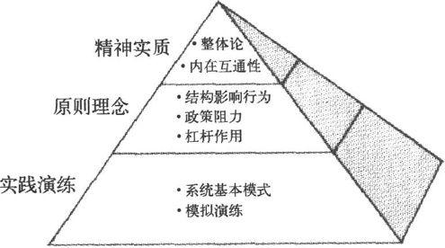
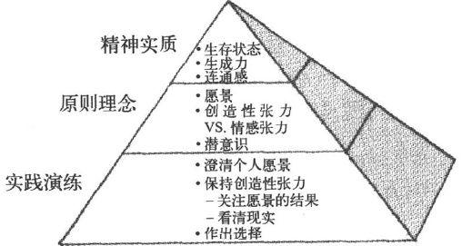
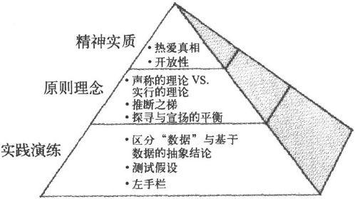
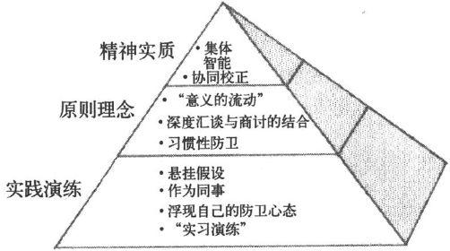
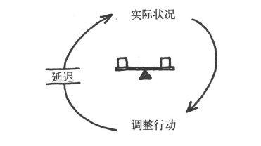
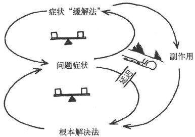
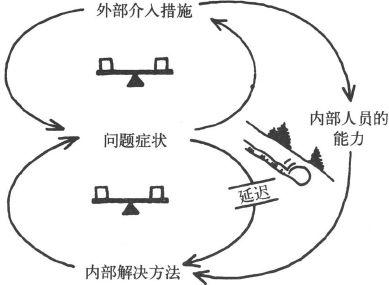
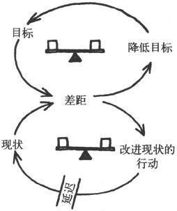
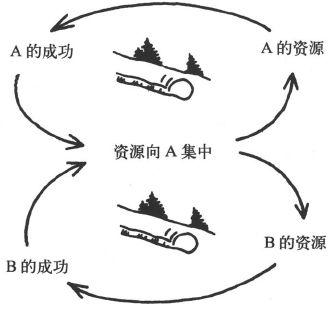
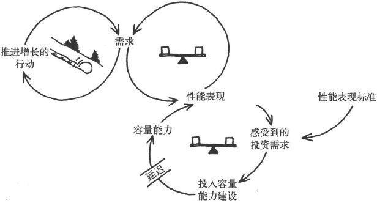

第五部分 尾声
-------------

#### ｜第18章｜不可分割的整体

小时候，我总希望长大了能当宇航员。为了作好这方面的准备，我甚至在大学里选修了航空和航天专业。但是后来，我迷上了"系统理论"，开始转而从事一项新的、在地面上的事业。

可是我对太空仍然保有极大的关注，阿波罗号拍摄的第一组地球照片尤其吸引了我。多年前，宇航员拉斯蒂·斯韦卡特（Rusty
Schweickart）来参加我们的领导力项目时，我怀着极大的兴趣满心期待，终于有机会与他结识了。

我从拉斯蒂那里知道，许多宇航员返回地面后，都感到很难用语言描述在地球上空环绕飞行的经历和感受。拉斯蒂"挣扎"了5年以后（他1969年3月乘坐阿波罗9号绕地试飞了登月舱），才开始找到恰当的语言。

 

-   太空飞船每一个半小时绕地球一圈，如此循环反复。宇航员通常会在早晨醒来，根据旅行轨道的位置，你可能会在中东、北非上空醒来。吃早餐时往外看，你在飞经地中海地区，希腊、罗马、北非、西奈半岛，整个那片地区。只看一眼你就会意识到，你看到的是整个人类多少年的历史------那是文明的摇篮。看着窗外的景象，你就想起整个历史，历史的画面随着你的想象力展开。

-   通过北非以后，你进入印度洋上空，你会看到你头顶上方的印度次大陆，在你经过时一直向下对着你。转到斯里兰卡边上之后，就是缅甸、东南亚，进而到达菲律宾，以及巨大的太平洋上空，它庞大的水体真像个怪物------你无法想象它有多大。最后你到达加州海岸线，找到亲切的洛杉矶、凤凰城、得州艾尔帕索，然后就是休斯敦，那就是我们宇航员的家乡------没错，你找到了阿斯托洛圆顶体育馆。你知道你和它有身份认同，那是执著和眷恋。

-   再往下经过新奥尔良，然后向下看，南面延伸的就是整个佛罗里达半岛。你在这下面的大气层里曾飞行过数百小时，它们都成了你亲切的回忆。随后你进入大西洋，最后又回到非洲。

-   那是种身份认同感：你认同休斯敦，然后认同洛杉矶、凤凰城、新奥尔良等地，每个地方都认同。过一会儿你发现自己在认同北非，你期待着它的到来，知道它会来。果然，它来了。你身份认同的整个过程发生了转变，因为你每一个半小时绕地球一圈，你会开始觉得与整个地球发生了认同感。转变就这样发生了。

-   你往下看着，无法想象自己一次又一次地跨越了多少条边界，可你其实根本看不见它们。你醒来时看到的景象------中东，那里可能有千百人正在相互杀戮，为的就是想象中的某条边界，某条你根本看不见的边界。从你这个角度看到的就是个整体，很美丽的整体。你真希望相互杀戮的每一方都有人在跟你一起看，"从这个角度看，看那里，什么才是真正重要的？"

-   于是，不久以后，你的朋友，还是原来的邻居，你旁边的人，到了月球。他往回看，发现地球不再是庞然大物，也看不见它美丽的细节了，他只与看起来很小的地球遥遥相对。这时，蓝色明亮的地球成了白色圣诞树的装饰，漆黑的天空变为广袤无垠的宇宙，这种意境的转变和对比，可谓淋漓尽致。

-   你不由想到它的尺寸，和它的意义，它同时包含了这两个方面。一方面，它微小脆弱，是宇宙中那么小而又珍贵的一点，你可以用大拇指挡住它。而另一方面你意识到，这个小点，这个蓝白色的小东西，就是对你有全部意义的一切：所有的历史和音乐、诗歌和艺术和战争和生死和爱、眼泪、喜悦、游戏，所有一切都在这个小点上，而你却可以用大拇指盖住它。

-   于是你意识到，那个视角......由于你的转变，从那个角度里看出了新东西。那种（与地球一切的）关系和过去不一样了。你回顾因为照相机出了问题，自己在舱外的活动。并且你有空闲回想发生了什么事。你记起自己瞪着眼睛，盯着眼前走过的情景。因为不在舱内，所以你是在太空中看画面，没有通过窗户看画面；你头上四周像个金鱼缸，但却没有边界。没有条框，也没有界限。

 

拉斯蒂在遨游太空时发现了系统思考的第一原则。但很少有人能经历到他的发现方式：在直接体验的水平发现，而不是在理性或智力的水平。地球是不可分割的整体，就像我们每一个人都是不可分割的整体一样。自然界（它包括我们）不是由整体中的部分组成的，而是由整体中的整体组成的。所有边界，包括国界，从根本上说都是人为的。具有讽刺意味的是，我们发明了边界，最后却发现自己被困在其中。

而且还有呢，在林迪斯法恩第一次演讲以后数年间，拉斯蒂发现自己经历了一系列个人转变，有了全新的洞察力。他辞去了加州能源委员会委员的职务，开始从事新工作，积极参与有美苏两国航天员参加的联合项目。
2
他聆听并理解其他人的经历，同时也开始参加与自己的新理解相符的其他各种活动。

学习盖亚假说（Gaia
hypothesis），对他产生了特别的影响。该假说认为，地球上所有的生命，即生物圈，本身就是一种生命体。
3
这个观念植根于许多前工业化社会，如美洲印第安文化。它"深深地打动了我"，拉斯蒂说："让我体内的科学细胞第一次学到了描述某些太空经历的方法，而此前我连自己描述这种经历都做不到。那时，我体验的地球是我无法描述的。我体验了它的生命力------它整体的生命力。"

领导力研习营结束时，有人即兴发问道："拉斯蒂，告诉我们，你在上面的感觉怎么样？"他停顿了很长时间，最后说了一句："感觉好像看到一个婴儿即将诞生。"

新生命正在生发着。它必定关乎所有一切------关乎整体。

#### ｜附录1｜各项学习修炼

五项修炼的每一项都可以分成三个不同层次：

 

-   实践演练（practices）：你做的事

-   原则理念（principles）：指导思想和理念

-   精神实质（essences）：高水平掌握修炼实质的人的身心状态（state of
    being）

 

实践演练是修炼者集中时间和精力从事的活动。比如，系统思考需要应用"系统基本模式"来看清和理解复杂局面背后的结构模式。而自我超越修炼则要"澄清个人愿景"和"保持创造性张力"，即在关注愿景的同时，把注意力聚焦到现实情况中，让这两者之间的差距来激发能量，成为实现愿景的动力源泉。心智模式的修炼也需要区分直接经验的"数据"，和我们基于这些数据而形成的一般化概况和抽象。

实践演练是任何修炼中最突出的方面，也是个人和团队开始从事某种修炼时，所主要聚焦的活动。对初学者来说，这些都需要"修炼训导"（discipline），即有意识的、连贯的努力，因为那些实践演练内容还没有成为自然而然的第二天性。在激烈的辩论中，心智模式修炼的初学者必须下大气力，才能辨别出他所作出的假设，并弄清为什么作出了这样的假设。一项修习的初学者的努力，常常会经历时间延迟：只有在辩论之后，才会看清假设，并把它与它所依赖的"数据"和推理过程区分开来。但是，修习演练逐渐会更加"实时化"，更加自动化，更加生动有力。你会发现自己不由自主地想到系统基本模式、即时重新创造（不是重新想起）你的愿景；并且，在面对紧迫问题，假设开始起作用的时候，你就能当即辨认出来。

修炼背后的原则理念也同样重要。原则理念是修炼实践背后的理论。比如，系统思考背后的核心原则理念，就是"结构影响行为"；还有"政策阻力"（policy
resistance），即复杂系统总是倾向于抵制改变其行为的努力。前者意味着，结构模式决定行为和事件，影响现实的能力正是来自对结构模式的清晰观察。而后者则意味着，操控行为的努力，比如愿望良好的在破落城区新建住房的计划，通常只会带来短期改善，而长期看来却往往会出现更多问题。类似的，自我超越修炼的原则理念，包括愿景的力量，还包括"创造性张力"和"情感张力"之间的区别。

修炼背后的原则理念，对初学者和大师都同样重要。对初学者来说，原则理念能帮助理解修炼背后的基本原理，了解修炼实践的意义；对大师来说，原则理念是参照，它能帮助不断完善修炼实践，并向他人解释和描述。

精通任何一项修炼，都需要既提升理解原则理念的水平，又提高实践演练的水平。牢记这一点很重要。只理解了某种原则理念，就认为已经"学会"了那项修炼，这是经常发生的思想诱惑。这就是大家熟悉的陷阱：把理性知识的理解与学习实践的收获相混淆。学习实践总要有知性的理解，同时还要产生新的行为习惯："想"与"做"并举，知行合一。这就是为什么要区分原则理念和实践演练的原因。两者都至关重要。

第三层次，是修炼的"精神实质"。这是不一样的东西。没有必要刻意把精力集中在寻求某项学习修炼的精神实质上，这就好像不需要刻意去努力体验恋爱、愉悦或者宁静的感受。修炼的精神实质，是个人或团队在高水平精通修炼实践时，所自然出现的身心状态。这很难用语言描述，但对于完全掌握每项修炼的意义和目的，它又是至关重要的。每一项修炼都会以某种非常根本的方式，改变修习实践者的状态。这就是为什么我们把这些修习叫做人身修炼（personal
disciplines），这甚至包括那些必须在集体中进行的修习。

比如，系统思考导致越来越多地体验生命的"内在互通性"（interconnectedness），从而能够看见整体，而不仅仅是局部。如果家庭或组织中有问题发生，系统思考大师就自然会看到，问题来自背后的结构模式，而不是个别的失误或恶意所为。类似的，自我超越导致越来越深入地感知本体的"当下存在"（beingness）和当下意识：这既包括我们自己内部的状态，也包括外部状态。自我超越还导致更深的"生成力"（generativeness）体验：体验到自己成为塑造自己生命的创造力的一部分。

在精神实质的层面上，各项修炼开始融合。会有一种共同的敏感性来整合各项修炼，这种敏感性就是在相互依存的世界里，成为学习实践者的灵敏度。然而，各项修炼之间仍然有差别，只是这种差别会越来越微妙。比如，"内在互通性"（系统思考）和"连通感"（connectedness）（自我超越）就是很微妙的区分。前者是关于对事物之间相互联系的意识；后者是指意识到自己是世界的一部分，而不是与之分立的。还有，"意向共通性"（commonality
of
purpose）（共同愿景）和"协同校正"（alignment）（团队学习）之间，也是一种微妙的差别。前者指对生存意义的"共同取向"（common
direction）和"共通理由"，而后者则是大家实际共同工作时的"整体功能作用"（functioning
as a
whole）。尽管很微妙，这些差别却十分重要。正如品酒大师可以做到的区分不是品酒新手能够做到的；高水平精通各项修炼的个人和团队可以看到的差别，对初学者而言则可能模糊不清。

最后，建立共同愿景和团队学习这两项修炼，与其他三项不同。因为这两项是集体性的修炼，其实践演练活动需要由团队共同完成，因此必须由团队集体去理解，而作为身心状态的修炼精神实质，也必须由集体来共同体验。

-   系统思考

-   自我超越

-   心智模式

-   建立共同愿景

-   团队学习

不可能同时掌握所有各项修炼。每个人都会经历不同的学习阶段。戴安娜·史密斯（Diana
Smith）设想了一个分三阶段连续开发新容量能力的模型。这对掌握各项学习修炼的入门方法很有帮助：

 

-   新价值观和假设

<!-- -->

-   第三阶段：价值观与操作假设（operating assumptions）

大家可以把反映新的行为价值观和操作假设的规则整合在一起。大家在压力和不确定性来临时能启用这些规则，来帮助自己和别人学习。到了这个阶段，大家已经把规则变成自己的特别模型，并用自己的语言来描述它。

-   新行为规则

<!-- -->

-   第二阶段：新行为规则（action rules）

在第一阶段认知收获基础上，旧的假设"动摇"了。大家开始用新的假设建立行为规则，并付诸实验，以便观察结果。大家可能还需要依赖新的语言来促成新的行为，在压力之下大家会感到很难把握和实行，或串联整合新规则。

-   新认知和语言能力

<!-- -->

-   第一阶段：新认知能力

大家看到了新事物，用新语言名词来表达自己。这帮助大家更好地看清自己和他人的假设和行为，以及这两者的后果。但大家往往不能把新的认知和语言能力，转变为有根本差别的新行为。大家可能开始有新行为，但基本规则、假设和价值观却依然如故。

#### ｜附录2｜系统基本模式

有延迟的负反馈

结构：

描述：个人、群体或组织为某个目标而行动，并针对反馈过程的延迟作出反应，调整行动。如果意识不到延迟，他们就会作出过多的调整和修正，也（有时）可能由于看不到任何进展而完全放弃行动。

早期症状预警："我们原来以为很稳妥，但结果做过了头。"（然后可能从相反的方向上再次做过了头。）

管理原则：在迟钝的系统里，富有攻击性的过分行动将导致不稳定。要么保持耐心，要么使系统反应更灵敏。

商业案例：地产开发商不停地上新项目，直到产生销售疲软------然而那时市场上已经有足够多的其他在建项目，供过于求的结果已成定局。

其他例子：热水开关反应迟钝的淋浴；生产---分销系统供应过度和短缺的波动（如啤酒游戏）；由于生产周期过长而产生的生产率和在制品库存量的波动；股市突然间暴涨和暴跌。

增长极限

结构：

描述：这是在一段时间内加速增长或扩张的自我增强过程。但之后增长开始放缓（系统内的参与者往往无法理解），并逐渐完全停止，甚至有可能逆转，开始加速崩溃。

早期症状预警："我们为什么要担心尚未出现的问题呢？我们增长得很快呀。"（稍后，"我们是有些问题，但只要我们按照原来管用的方法做就没事了。"再后，"我们越是使劲儿努力，越是似乎原地不动。"）

管理原则：不要在正反馈（增长）环路上使劲儿推，要设法消除（或削弱）限制因素。

商业案例：公司制订了平等权利计划，得到越来越多的支持和参与，许多合格的来自少数族群或弱势群体的雇员成功进入公司的各种工作团队。但阻力也逐渐开始增加，人们认为这些新员工并没有"挣得"自己的工作职位，这对其他合格的求职者不公平。这些团队被迫接受这些新雇员的压力越大，阻力也越大。

其他例子：学习一种新技能，比如打网球，最初可能进步很快，你的技术水平和自信心都在增长。但随后你天生的自然的能力开始遇到极限，而这只能通过学习新技术来突破，但对这种新技术你开始会觉得"不自然"。

新公司从零开始迅速增长，达到一定规模以后就要求更专业的管理技能和正规的组织；新产品开发团队表现出色，成绩非凡，但它吸纳的新成员，许多并没有协调的工作风格，也没有创始成员的价值观，于是麻烦就来了；城市开发规模直线上升，直到土地资源枯竭，结果使房地产价格飙升；社会运动发展遇到"非信徒"（nonconverts）的不断增加的抵制；由于天敌消失，动物群迅速繁衍，但很快导致其生活地域里食物匮乏，最终由于饥饿而大量死亡。

转移负担

结构：

描述：为纠正问题而使用的短期"缓解方法"，看似立即奏效，但随着这种纠正方法的反复运用，更根本的长期纠正方法就越来越被忽视。最终的结果是开发根本解决方法的能力萎缩或消失，导致对"症状缓解法"的更严重的依赖。

早期症状预警："你看，这个解决方法一直有效！你说什么，这种做法以后会遇到麻烦？"

管理原则：聚焦在根本解决方法上。假如"症状缓解法"是必要的（因为根本解决法有延迟），那就用它来争取时间，以完善根本解决方法。

商业案例：一项突破性新电路板技术可以用来开发独特的功能，并能在众多新产品应用上带来节约成本的效益。但现有产品的电路板也可以代替它。营销人员可以向理解这项新技术的特殊性能的"特别客户"推销它，并逐步充分利用这些技术来开发完整的新产品线（"根本解决法"），也可以向不关心特殊性能的一般"商品用户"推销只使用现有电路板的产品（"症状缓解法"）。但管理层有季度销售额的压力，因此营销人员就会采取谁要买就卖给谁的方针，而这往往都是一般的商品用户，因为他们人数较多，销售周期的延迟较短。最终这将导致突破性新技术无法发展忠实的客户群体，结果变得和一般产品一样，承受价格和利润空间的压力。

其他例子：不拓宽客户群，而向现有客户推销更多产品（第11章中ATP案例）。借钱还债，不想做严格的开支预算。不降低工作压力本身，而通过饮酒、吸毒或较好的体育锻炼方法来减轻工作压力。上瘾，包括各种场合和各种形式。

特别案例：转移负担到介入者身上

结构：

描述：转移负担中非常普遍又非常有危害的情况，是外部"介入者"试图帮助解决问题，这特别值得注意。介入措施是要改善问题的明显的症状，而且非常成功地做到了这一点，以至于系统内部的人根本无法学会自己解决问题。

管理原则："要授人以渔，而非授人以鱼。"要关注"主人的系统"发展自己解决问题的能力。如果需要外来帮助，"帮助者"应当要么严格局限在一次性的介入（而且大家事先都清楚这一点），要么有能力帮助大家开发自己的技能、资源以及基础设施，以便在将来有更大的能力。

商业案例：一家有创新传统的保险公司承诺以下的原则：其独立的地方分支机构只能偶尔寻求总部的帮助。开始时这条原则实行得很好，但后来整个产业出现了危机。面对突然发生的严重损失，地方机构把更有经验的总部专业人员请来重新制定费率结构------这通常需要好几个月的时间来完成。与此同时，地方经理们聚焦在危机管理上。危机过去了，但下一次又碰到利率结构问题时，地方经理们已经失去了自信心。他们又请总部经理们来做"保险"了。这种情况一连在几年内发生，结果是，地方机构再没有人能独立管理利率结构改变的工作。

其他例子：工作依赖外部承包商，而不是培训内部员工。众多的政府援助计划，试图解决紧迫问题，但却养成依赖性，需要不断增加援助：针对单亲家庭的福利计划；住房和就业培训项目，把贫困人群吸引到有最好项目的城市；给发展中国家的粮食援助，降低了死亡率，同时增加了人口；减少个人储蓄、鼓励拆散大家庭的社会保障体系。

目标侵蚀

结构：

描述：这是转移负担的模式之一，其短期缓解方法使长期的、根本的目标受到侵蚀。

早期症状预警："工作标准现在降低一些也可以，等危机一过再恢复。"

管理原则：保持愿景。

商业案例：虽然产品很棒，而且不断有改进，高科技制造商却在丧失市场份额。但这家注重自己的产品设计"天才"的公司，从未能有效控制生产进度。外来的调查人员发现，其客户对公司交货逾期越来越不满，并正在转向其竞争对手。公司却坚持自己的立场，满足于自己的业绩："我们在答应客户的交货时间内，一直保持了90％的成功交货纪录。"于是公司反而去寻找业绩不佳的其他原因。但实际情况是，每次公司交货开始出现延迟的情况，都会把承诺的交货时间加长一些。结果是，客户得到的承诺交货时间一步步变得越来越长了......

其他例子：成功人士降低自己的标准，渐渐失去成功的表现。公司为了降低成本，隐秘地降低质量标准，而不是投入开发新的可以提高质量（而且可能也降低成本）的工作方法，但仍然一路宣称自己不断保持注重质量的传统。政府"全面就业"的目标，或削减联邦赤字的目标，越来越低。控制危险的污染物排放的目标，或保护濒危物种的目标，遭受侵蚀。

恶性竞争

结构 1 ：

描述：两个人或者两个组织认为，自己的福祉依赖于建立对对方的优势。如果一方占据了优势，另一方就觉得受到更大的威胁，于是便更加咄咄逼人地去重建自己的优势，结果又使前者受到更大的威胁，也使前者更咄咄逼人，如此等等。双方往往把自己咄咄逼人的行为看成是对对方的防卫反应，而各自的"防卫"行动导致双方都不愿意看到的恶性循环。

早期症状预警："如果我们的对手不再咄咄逼人，那我们就可能停止争斗，而去完成其他事情。"

管理原则：寻找"双赢"的方法，让双方都达到自己的目标。在许多情况下，某一方可以单方面逆转这种恶性循环，方法是公开、主动、大胆的"和平"行动，以使对方感到没那么多威胁了。

商业案例：某公司开发了一种婴儿小推车，可以同时坐三个学步年龄的小孩，而且很轻便。这在小孩儿多的家庭群体里立刻成为畅销产品。而几乎在这同时，另一家公司也开发出一种类似的产品。几年后，第一家公司对另一家公司的市场占有率非常嫉妒，决定降价20％。于是第二家公司的销售受到影响，也决定降价。而第一家公司仍然想继续提升市场占有率，于是进一步降价。第二家公司利润开始受损害，虽然不情愿，但还是又跟进，再次降了价。又过了几年，两家公司的利润都降低到难以为继的程度，三座小推车是否能继续存在，也成了疑问。

其他例子：广告战。越来越依赖律师来解决分歧。黑帮火拼。离婚过程。虚增预算：一些部门虚增预算，其他部门为了争得自己的份额也虚增预算，于是导致大家都进一步做更膨胀的预算。为争宠而对公司领导进行游说战。当然还有军备竞赛和反恐战争。

强者愈强

结构：

描述：两个活动为有限的支持或资源而竞争。某一方变得更成功，就会获得更多的支持，而另一方就会失去支持。

早期症状预警：相互关联的两个活动、两个团体或个人，有一方开始表现优异，另一方则在挣扎状态中。

管理原则：寻找两者的总目标，以使两者获得平衡的表现。有时候要切断或削弱两者之间的关联，这样就避免它们对同一个有限资源的竞争（如果两者的关联只是由于偶然的疏忽，却引起对资源的不良竞争，那就需要这样做）。

商业案例：某经理人希望自己的两个亲信都能在公司里得到发展，但由于其中一个生病告假一星期，另一位就得到优惠待遇。前者上班后，经理人由于觉得内疚，于是就躲避前者，结果是后者有更多的机会，感觉受到肯定，工作更成功了，进而得到更多的机会。前者由于心神不定，工作效率也下降了，于是机会就更少了。其实两者开始都有同样的能力。前者最后离开公司。

其他例子：平衡家庭和工作：经常加班过多，影响到家庭关系，于是回家就变成更"痛苦"的事，这又使家庭生活在未来更加被忽视。两种产品在公司里争夺有限的财务和管理上的资源：一个是刚上市就走红的产品，于是得到更多的投资，结果另一个就没有什么投资了，这是一个正反馈过程，对第一个产品是不断增长，对第二个是持续萎缩。害羞的学生一开始上学就遇到问题（也许由于情绪原因，也许因为尚未发现的学习障碍），于是被贴上"笨学生"的标签，结果相比其他有积极表现的同学，他受到的鼓励和关注就越来越少了。

公地悲剧

结构：

描述：个体仅仅根据自身的利益需要来使用有限的公共资源，开始大家都各有所得，后来得到的越来越少，结果促使大家加倍努力获取资源。最后，资源明显损耗、毁坏或完全用光。

早期症状预警："原来每个人都得到许多资源。现在很紧张了。今年要想从中赢利，我就必须加倍努力。"

管理原则：要管理"公地"（Commons） 〔1〕
，如要对大家进行教育，建立自律机制和同行约束；或者建立官方法规，不过这最好由参与使用公地的人来共同制定。

商业案例：某公司的好几个部门达成一致，都使用同一家零售机构。开始时每个区域经理都担心，只用一家零售机构可能无法给每个特定的业务领域都提供足够的关注，因而可能会引起销售额下降。于是其中一位咄咄逼人的经理，就让辖下所有客户账户经理都设立高于真正需要的销售额指标，以使零售机构至少提供他们所需要的最低限度的支撑。其他部门的经理人看到这种情况，也决定采取同样的策略来获取更多的支撑。新零售机构的经理们想照顾好所有这些"顾客"，于是就不断接受各个部门的要求。这导致工作量过大，工作效率下降，人员流失加剧。很快，在这家零售机构工作，已经不比加入法国外籍雇佣兵团
〔2〕 好多少了。

其他例子：不同领导合用同一个秘书班子，使秘书们精疲力竭。某公司六个不同部门的销售人员争夺顾客对六种不同产品的兴趣，致使公司客户服务的声誉下降。（这里的"公共资源"是公司顾客服务的良好声誉。）很成功的零售连锁店接到洪水般涌来的各类制造商的促销建议，最后不得不拒绝这些建议，或者提出不给制造商利润空间的合作条款。各个采矿公司都开采同一个矿产地，使资源枯竭。当然还有各种污染问题，如酸雨、臭氧层破坏和"温室效应"。

饮鸩止渴

结构：

描述：短期内有效的修补措施带来未知的长期后果，可能造成不断使用更多类似修补措施的需要。

早期症状预警："这方法以前似乎一直奏效，现在为什么却不管用了？"

管理原则：保持对长期目标的关注。如可能，要避免使用短期"修补措施"，或者只为"争取时间"才使用它，但同时要开发长期解决方法。

商业案例：制造厂商推出一组新的高性能零部件，马上获得巨大的市场成功。但公司CEO只关心投资回报最大化，所以决定延期购买昂贵的新生产设备，结果使生产质量受到影响，损害了公司的质量声誉。接下来的一年，客户订单急剧下降，投资回报也加剧萎缩，进而使CEO更不愿投资购买新的生产设备。

其他例子：个人和组织通过举债来偿还贷款利息，使将来要偿还更多的利息。为节省开支而减少设备维护频率，结果导致更多故障和更高的维修成本，也使降低成本的压力越来越大。

增长与投入不足

结构：

描述：公司或个人成长遇到极限，但可以通过建设更大的"容量能力"来突破极限，或延缓极限的到来。但对这种建设的投入必须及时充分，并在增长降速之前完成，否则就永远不会完成。人们往往降低关键目标或性能标准，以使投入不足合理化。但这样一来，就会实现一种自证预言：降低的目标导致降低的预期，而这些反过来又被投入不足带来的较差的性能表现所证实。（第7章中神奇科技的案例就是这种模式。）

早期症状预警："你看，我们曾经是最棒的，将来也还会是最棒的，只不过眼下得节省资源，不能过度投资。"

管理原则：假如真有增长的潜力，那一定要在市场需求到来之前建设自身的能力，这是创造市场需求的策略。要保持愿景，特别要关注关键的性能标准，以及目前自身的能力是否能充分适应潜在的市场需求。

商业案例：人民快线航空公司面对市场迅速增长的需求却无法建设自身的服务能力，他们没有投入资源进行培训，或降低增长速度（比如通过适当提高票价），反而试图通过"超增长"来使问题消失掉。结果是服务质量不断下降，竞争愈演愈烈，士气每况愈下。为了应付压力局面，公司的"缓解方法"是继续对服务质量投入过低，直到公司对顾客不再有任何吸引力。

其他例子：公司服务质量或产品质量下滑，却埋怨竞争对手，或抱怨销售部门促销乏力。愿景远大的人，却没有切实估计要实现愿景所必须投入的时间和精力。

#### ｜附录3｜U型过程

U型过程理论是夏莫、约瑟夫·贾沃斯基（Joseph
Jaworski）、亚当·卡汉以及其他许多同事共同开发的设计和引导深层集体学习过程的方法。
1
实际上，U型过程可以为五项修炼应用的时序步骤提供一个组织框架（见下图）。

-   U型过程与五项修炼

U型过程帮助团队协作从事：

 

-   1．感知：通过超越偏见来观察现实，从而深入探寻其心智模式。

-   2．呈现当下：以此进入深层连通过程，个人和集体连通志向目标并形成愿景。

-   3．实现收获：然后，快速形成原型，以把愿景变为具体的工作模型，从而收集反馈，并进一步修改和调整模型。

 

虽然五项修炼可以用在U型过程的全部三个阶段，但各阶段的侧重有所不同。U型过程的"下行阶段"，特别涉及悬挂既有的心智模式，通过直接体验系统的实际情况进行集体探寻，并在不同观点之间进行深度汇谈。个人愿景和共同愿景的形成是U型过程底部的核心内容。而团队学习和继续进行的对心智模式和愿景的反思活动，则是"上行阶段"的特点。

例如，对于可持续食品实验室，感知阶段包括对个人看全球食品系统的方法的反思，还包括在巴西的5天学习之旅。这意味着直接接触艰难打拼的农民及其家人，接触农民合作社、跨国公司的食品加工企业、环保主题的非营利组织，还有政府机构。这些经历对来自公司的参与者尤其有震撼力，因为他们以前从未见过"下面的"真实世界。

"拉丁美洲大部分地区的农民，已经不再是地方开发的主体，而变成了扶贫计划的接受者和救济对象。"一位实验室的参与者说。"我们该怎么帮助这些（从传统的农村社区中流亡出来的）前途渺茫的年轻人？"另一位问道。那次的经历之所以有震撼力，还因为它让大家看到，不同的人看到同一个现实，却对现实有不同的理解。在参观过一家小型农民合作社之后，团队成员的观感包括：工作很辛苦、很有政治观点、不可持续、非常可持续、需要现代化、需要时间来成熟、出色的模式。一位实验室团队成员说道："我感到非常吃惊，我们都看了同一个地方，却看到这么不同的东西......对别人的视角和看法，我的确所知甚少。"

在U型过程的底部，有人静和聆听------聆听当下正在呈现的新事物，聆听我们在创造这些新事物的过程中能够扮演的角色。相对五项修炼来说，U型过程对形成愿景有独到的方法，即在U型过程的底部，在广泛感知现实的过程完成之后再进行。首先，这种次序安排保证大家对自己的现实情况有脚踏实地的深入理解，包括看清不同的人对现实的不同看法。其次，把形成愿景的工作植根于一种更远大的志向目标感之中。尽管开始时的愿景对激励整个学习过程可能很重要，但它一定会在感知阶段得到发展，得以深化，并被赋予更重大的意义。这并不是说，大家会从感知和评估现实的活动中"推导出"自己的愿景。正相反，在U型过程的底部留出时间进入真正的静默和深层的反思，就会激发真心的关爱，体悟某种呼唤的感召力。从创造性张力的原则来看，连通现实的强烈共鸣，会给我们带来新的选择：真诚倾诉我们真心渴望的东西。

在可持续食品实验室核心团队的6天静修营里，30名成员有机会对学习之旅的经历进行了综合总结，这深化了他们创造新的食品替代系统的志向目标感，还开发了初步的原型计划。两天的野外独处使参与者进入了静默和与自然更直接连通的状态。帮助团队准备野外独处体验的经济学家布赖恩·阿瑟（Brian
Arthur），在团队从野外返回时与他们作了进一步交流，他注意到团队的精神能量已经改变了，变成"沉静与善良"的状态。从沉静中生发了一种想象力，它带来了以前没有人能想到的原型计划。

U型过程右侧的上升段也一样包含各项修炼，但团队学习却有着特别的重要性，因为大家在共同探索如何创造复杂系统的新的替代运行方式，既要有可操作性，又要带来根本性的变革。整个收获阶段都用了系统思考、处理心智模式，以及愿景工作的模式，因为之前的感知和呈现当下的过程都在不断地反复。这种情况的发生有两个原因：（1）原型计划工作中有新加入的人（他们必须经历自己的感知和呈现当下的过程）；（2）大家通过试图引发变革和不断回顾愿景，又发现了系统现实中的新事实，或者发现原来的愿景已经发生了变化。根据创造性张力的原则，U型过程上升段中的愿景改变，不是为了减小情感张力而"降低愿景"，而是真切地看到了大家真正想要创造的东西。

所以，实现收获的阶段不只是成功创造了现存系统的替代方案，还是不断深化共识和澄清愿景的过程。有些系统变革的努力会成功，有些则会失败。成功的变革往往以出乎预料的方式发生了，或许走入了始料未及的新的方向。U型过程上升段的真正意图，也是整个U型过程的意图，是在背景多样的大社区里建立容量能力，以看清"现存"并激活新的社会系统，它是复杂的组织机构和跨组织机构网络学习如何学习的过程。可持续食品实验室的主要资助方、美国凯洛格基金会（Kellogg
Foundation）农业计划主任欧兰·海斯特曼（Oran
Hesterman）说："这样的过程我真是从没见过。它把背景如此多样的团队带到一个深层连通的地方------团队成员相互之间的人际连通，以及大家与要共同去做的事的连通。"

注释

修订版序言

1．这张要素清单是由国际组织学习学会（SoL）和哈佛大学教育研究生院"变革领导力小组"（Change
Leadership Group）共同组织的企业和教育创新者小组开发的（Booth Sweeney,
Senge, Wagner, 2002）。

第1章　"给我一根足够长的杠杆......我就能用一只手撬动世界"

1.  Daniel Yankelovich, New Rules: Searching for Self-fulfillment in a
    World Turned Upside Down (New York: Random House) , 1981.

2．基础创新是在很多不同的技术整合成新集合以后才完成的，这一深刻见解来自我的MIT同事阿兰·格雷厄姆（Alan
Graham）。我对他深表感谢。参见A. K. Graham, \"Software Design: Breaking
the Bottleneck,\" IEEE Spectrum (March 1982) 43-50；参见 A. K. Graham
and P. Senge, \"A Long-Wave Hypothesis of Innovation,\" Technological
Forecasting and Social Change (1980) : 283-311.

3.  Arie de Geus, \"Planning as Learning,\" Harvard Business Review
    (March/April 1988) : 70-74.

4．尽管像英特尔和微软等半导体和软件生产商逐渐占据了电脑产业的金融资产主导地位，但苹果公司却是"用户图形界面"的商业化先驱，并把界面友好、使用方便的电脑带给主流大众。

5.  Edward Hall, Beyond Culture (New York: Anchor) , 2007, 207.

第2章　你的组织有学习障碍吗？

1.  Arie de Geus, \"Planning as Learning,\" Harvard Business Review
    (March/April 1988): 70-74.

2．图表来源于美国商务部（the United States Department of Commerce,
U.S...）文件 Industrial Outlook, in 1962 (pp. 58-59), 1970 (p. 355),
1975 (p. 355), 1979 (p. 287), 1981 (p. 320), and 1989
(pp. 34-35)，以及美国国会技术评估办公室，Technology Assessment,
Technology and the American Economic Transition: Choices for the Future
Washington: (US. Government Printing Office), 1988 (p. 326)。

3.  Draper Kauffman, Jr. Systems 1: An Introduction to Systems Thinking
    (Minneapolis: Future Systems Inc.), 1980 (available through
    Innovation Associates, P. O. Box 2008, Framingham, MA 01701).

4.  Chris Argyris, Overcoming Organizational Defenses (New York:
    Prentice-Hall), 1990.

5.  Barbara Tuchman, The March of Folly: From Troy to Vietnam (New York:
    Knopf), 1984.

6．同上。

7.  Jared Diamond, Collapse: How Societies Choose to Fail or Succeed
    (New York: Penguin), 2004.

第3章　是系统的囚徒，还是我们自己思想的囚徒？

1．对这一互动游戏的说明可以参考MIT斯隆管理学院"系统动力小组"，获得地址：Cambridge
MA 02139. http://www.systemdynamics.org/Beer.htm。

2．在实际决策模拟中有四个角色，为了简化已经很复杂的故事描述，其中一个（批发商distributor）在此省略了。

3．但是，模拟都是简化。你可能要问，假如改变游戏中某些细节是否会得出不同的结果。我们也有这个疑问，并且多年来常常设法摆弄和修补游戏。有时我们用三个角色，像这里一样，但通常我们用四个角色。我们曾改变对存货过多和订单积压的惩罚标准。有时我们使用计算机模拟来计算结果，而大多数时间我们是在大桌子上，用硬币代表啤酒，从一个方格移到另一个，代表送货。我们曾改变提前告诉大家的零售商要接到的顾客需求量范围。我们也实验了顾客需求的不同模式。这些改变中有的使危机情况更严重一些，有的则使之轻一些，但都没有改变总体的危机状况。

4．美国国会技术评估办公室：Technology and the American Economic
Transition: Choices for the Future (Washington: U. S. Government
Printing Office), 1988, 324。

5.  Steven Burke, \"Chip Manufacturers Find a Pot of Gold in DRAM
    Shortage,\" PC Week, May 31, 1988, 107; Steven Burke and Ken
    Sieg-mann, \"Memory-Board Prices Surging in the Wake of Growing Chip
    Shortage,\" PC Week, March 1, 1988, I.

6.  J. Rhea \"Profits Peak as Semiconductor Sales Boom,\" Electronic
    News 18: 1 (August 6, 1973); \"Boom Times Again for
    Semiconductors,\" Business Weekly, April 20, 1974, 65-68;
    \"Semiconductors Take a Sudden Plunge,\" Business Week, November 16,
    1974, 64-65; F. Pollare, \"Inventory Buildup: Semiconductor Distress
    Sales Emerge,\" Electronic News 20:45 (February 10, 1975).

7.  Joseph B. White and Bradley A. Stertz, \"Auto Industry Battens Down
    for a Slump,\" Wall Street Journal, May 30, 1989, sec. A.

8．"MacNeil-Lehrer Newshour,"是有关啤酒游戏与商业周期的视频文件（与John
Sterman在麻省理工学院的访谈），aired November 1989, Public Broadcasting
System。

9.  Donella H. Meadows, \"Whole Earth Models and Systems,\" Co-Evolution
    Quarterly (Summer 1982): 98-108.

10\. Leo Tolstoy, War and Peace (Constance Garnett translation).

11．同上。

12\. Janice T. Gibson and Mika Haritos-Fatouros, \"The Education of a
Torturer,\" Psychology Today, November 1986, 50. Also: \"The Mind is a
Formidable Liar: A Pirandellian Prison,\" New York Times Magazine, April
8, 1973.

13．类似的放大作用也是实际业务波动的特征，特别在原材料生产领域，波动要比零售和服务业大很多。见Gottfried
Habeler, Prosperity and Depression (London: Alien & Unwin), 1964; Alvin
H. Hansen, Business Cycles and National Income (New York: Norton),
1951。

14\. John Sterman, \"Modeling Managerial Behavior: Misperceptions of
Feedback in a Dynamic Decisionmaking Experiment,\" Management Science,
vol. 35, no. 3 (March 1989): 335.

15．在计算机模拟中，"无策略"策略会导致零售商更严重的订单积压，因为零售商只能在分销商的积压情况解除以后才能接到完整的送货。这意味着零售商特别容易遭受这个策略的负面影响------正因为如此，在真实世界里，零售商会下比较大的订单。

16．在模拟游戏中，每个单位（每周）订单积压的成本是1美元，每个单位（每周）库存积压的成本是0.5美元，把每个角色的成本算出来，再和其他角色的加在一起，就得出整个团队的成本。四个角色游戏35周模拟的平均总成本是2028美元，（Sterman,
\"Modeling Managerial Behavior\"）,
331-39，三个角色游戏30周模拟的平均总成本是1270美元。"无作为"策略团队总成本是825美元。

17．游戏参与者有可能从游戏经历中学到很多在真实世界的生产分销系统中无法学到的东西------前提是要反复完成游戏，并能与游戏伙伴协作来共同理解游戏中的决策如何影响了更大的系统。这样，啤酒游戏就成为一种"微世界"。

18．由于游戏通常的设计没有让各个角色之间进行沟通，所以没有机会观察参与者面对面交流的情况。尽管如此，目前的团队运作模式还是使团队成员因为出现的问题而陷入相互埋怨和争吵中。其他一些决策模拟演练设计，有特别针对团队学习中互动关系的。

19．观察商业行为模式的普通例子有"趋势分析"（trend
analysis），其目的是使公司能够对人口变化趋势或顾客偏爱情况的改变作出反应。

20\. William Manchester, The Glory and the Dream (Boston: Little, Brown),
1974, 80-81.

21．游戏的物质结构也可以重新设计，但在游戏开始之后参与者是没有办法这样做的。比如，可以重新设计一套信息系统，使分销商、啤酒厂和零售商都能及时了解零售情况。或者，也可能去掉分销商这个中间环节，让啤酒厂直接给零售商供货。在实际生活中，重新设计物质系统（商品、人员、材料、信息等的实际流动；还有超越个人决策直接控制的奖励系统等其他因素）是一项重要的领导工作。但要成功地实现这种设计，需要领导者有系统的理解，就像要改变参与者个人下订单的方式也需要系统的理解一样。因此，主要的任务是开发系统的理解力，然后，对物质系统的重新设计和运行政策的制定，就都能自然形成了。

第4章　第五项修炼的法则

1．这些法则是从系统研究领域许多学者的工作成果中提炼出来的，包括加里特·哈丁，杰伊·福雷斯特，唐妮菈·米道斯，德雷珀·考夫曼，详见参考资料：Garrett
Hardin, Nature and Man\'s Fate (New York: New American Library), 1961;
Jay Forrester, Urban Dynamics, Chapter 6 (Cambridge, Mass.: MIT Press),
1969; Jay Forrester, \"The Counterintuitive Behavior of Social
Systems,\" Technology Review (January 1971, pp. 52-68; Donella H.
Meadows \"Whole Earth Models and Systems,\" Co-Evolution Quarterly
(Summer 1982): 98-108; Draper Kauffman, Jr., Systems I: An Introduction
to Systems Thinking, (Minneapolis: Future Systems Inc.), 1980 (available
through Innovation Associates, PO. Box 2008, Framingham, MA 01701。

2.  This and many other Sufi tales can be found in the books of Idries
    Shah, eg., Tales of the Dervishes (New York: Dutton), 1970, and
    World Tales (New York: Harcourt Brace Jovanovich), 1979.

3.  George Orwell, Animal Farm (New York: Harcourt Brace), 1954.

4.  D. H. Meadows, \"Whole Earth Models and Systems.\"

5.  Lewis Thomas, The Medusa and the Snail (New York: Bantam
    Books), 1980.

6.  Charles Hampden Turner, Charting The Corporate Mind: Graphic
    Solutions to Business Conflicts (New York: Free Press), 1990.

第5章 心灵的转变

1．有关社会科学中的"控制论"和"伺服机构"理论学派综述，参见George
Richardson, Feedback Thought in Social Science and Systems Theory
(Philadelphia: University of Pennsylvania Press), 1990.

2．恐怖分子这个词的使用本身就代表一种立场观点。许多支持"恐怖主义"事业的人认为他们是在为自由而战。我使用这个词是因为它代表了广泛流行的、横跨各种政治立场的观点，这包括大多数中东国家的立场，即针对平民的有组织的袭击，应使用这个词来描述。

3．美国国防部（DOD）、国家安全局（National Security
Agency）和中央情报局（CIA）的自称为"系统分析师"的人，可能比所有其他政府部门都多。其实苏联人是系统理论的先驱者；在过去40年间，苏联数学家在理论方面的贡献也许比所有其他国家都大；部分原因是苏联政府支持了系统研究，因为他们想使用先进的计算机工具来控制国家的经济系统。

4．参见Nancy Roberts, \"Teaching Dynamic Feedback Systems Thinking: An
Elementary View,\" Management Science (April 1978), 836-843; and Nancy
Roberts, \"Testing the World with Simulations,\" Classroom Computer
News, January/February 1983, 28。

5．系统思考的原则和工具源于许多学科：物理学、工程学、生物学、数学等等。这一章中描述的特定的工具，来自麻省理工学院福雷斯特创立的"系统动力学"。这一节中的内容特别基于米道斯提出的模型，及其所带来的研究进展。比如：Industrial
Dynamics (Cambridge, Mass: MIT Press), 1961; Urban Dynamics (Cambridge,
Mass: MIT Press) 1969; and \"The Counterintuitive Behavior of Social
Systems,\" Technology Review (January 1971), 52-68. This particular
section owes a special debt to Donella Meadows, whose earlier article
\"Whole Earth Models and Systems,\" Co-Evolution Quarterly (Summer
1982), 98-108 provided the model and the inspiration for its
development。

6．相比之下，"东方语言"，如汉语和日语，并非基于"主语---动词---宾语"这种线性顺序。David
Crystal, The Cambridge Encyclopedia of Language (New York: Cambridge
University Press), 1987。

7.  The Bhagavad-Gita, or \"The Lord\'s Song,\" translated by Annie
    Besant, reprinted in Robert O. Ballou, The Bible of the World (New
    York: Viking), 1939.

8.  Robert K. Merton, \"The Self-Fulfilling Prophecy\", in Robert K.
    Merton, editor, Social Theory and Social Structure (New York: Free
    Press), 1968.

9.  R. Rosenthal, \"Teacher Expectation and Pupil Learning\" ; and R. D.
    Strom, editor, Teachers and the Learning Process (Englewood
    Cliffs, N. J. : Prentice-Hall); R. Rosenthal, \"The Pygmalion Effect
    Lives,\" Psychology Today, September 1973.

10．这并非意味着自由市场的力量就足以实现现代社会需要的平衡和控制------延迟、信息匮乏、不现实的预期以及垄断造成的扭曲，都会降低"自由市场"的效率。

11．有关精益生产的信息可以从"精益企业"（Lean
Enterprise）网站上找到：www.lean.org。

第6章　自然的模板：识别支配事件的模式

1．下面介绍了两个基本模式；本书使用的总共有八个模式，这大约是专业系统思考学者"脑袋里装的"模式数量的一半。

2．有关通用结构模式的初步课程建设已经开始了。参见Mark Paich, \"Generic
Structures,\" in System Dynamics Review, vol. 1, no. 1 (Summer 1985):
126-32; Alan Graham, \"Generic Models as a Basis for Computer-Based Case
Studies\" (Cambridge, Mass.: System Dynamics Group Working Paper D-
3947), 1988; Barry Richmond et al., An Academic User\'s Guide to STELLA,
Chapters 8, 9 (Lyme, N. H.: High Performance Systems), 1987. David
Kreutzer, \"Introduction to Systems Thinking and Computer Simulation,\"
Lesley College Graduate Course Comp 6100, 1987。

3．这里的负反馈过程是绕着图的边沿走的：从研发预算，到管理复杂程度的增加，产品开发时间的加长，新产品推出频率的下降，最后又回到研发经费的削减。

4．就我所知，贝瑞·里奇蒙（Barry
Richmond）是分析这个结构的第一人。后来我发现，这个结构模式在管理咨询公司中几乎成了流行病，更不用说学术机构迅速发展以后，变得头重脚轻、大教授比重过高的情况。

5.  Peter Senge, Art Kleiner, Charlotte Roberts, George Roth, Rick Ross,
    Bryan Smith, The Dance of Change: The Challenges to Sustaining
    Momentum in Learning Organizations (New York:
    Doubleday/Currency), 1999.

6.  Facts on File 1990 (New York: Facts on File)

7．书中引用的"系统基本模式"样板，包括这个，经过了创新伙伴公司的允许。同时也应用在该公司以下的研习营中：Leadership
and Mastery and Business Thinking: A Systems Approach workshops。

8．有关匿名戒酒协会的信息，参见：Alcoholics Anonymous, 1976; Living
Sober, 1975; Twelve Steps and Twelve Traditions, 1953; 由 Alcoholics
Anonymous World Services, Inc出版., P. O. Box 459, Grand Central
Station, New York, NY 10163。

第7章　是自我局限，还是自我持续的增长

1．下面的模型是根据福雷斯特最早对公司增长的研究而发展出来的。Jay W.
Forrester, \"Modeling-the Dynamic Processes of Corporate Growth,\" IBM
Scientific Computing Symposium on Simulation Models and Gaming (December
1964), and 1. W. Forrester, \"Market Growth as Influenced by Capital
Investment,\" Industrial Management Review, 1968, 83-105。

2.  David Birch, Job Creation in America (New York: The Free Press),
    1987, 18.

3．这张图是通过计算机模拟神奇科技模式中的交往关系画出的，其中的交货时间标准是固定的。为简单起见，模拟中假设了无限的市场潜力，这对神奇科技早年的情况也基本正确。模拟表明，即使有实际的市场潜力限制，只要交货时间标准保持不变，公司的业绩表现也将有巨大的提升。模拟使用的是高绩效系统公司（High
Performance
Systems）提供的系统思考建立模型和动态模拟软件STELLA。实际的模拟模型在以下图书中使用：Jay
Forrester, 1968, and in P.Senge, \"Systems Principles for Leadership,\"
in Transforming Leadership, J. Adams, editor (Alexandria, Va. : Miles
River Press), 1984。

第8章　自我超越

1.  K. Inamori, \"The Perfect Company: Goal for Productivity.\" Speech
    given at Case Western Reserve University, June 5, 1985.

2．麦肯锡公司一项题为"历程"（The
Journey）的研究报告指出，汉诺瓦公司是1978到1993年全部时间里排名都进入地产责任保险业前四分之一的仅有的两家公司之一。这段时间里，共同人寿保险公司（State
Mutual）一直持有汉诺瓦公司的多数股票，奥布赖恩的退休是该公司强行操控的结果。

3.  Henry Ford, Detroit News, February 7,1926.

4.  Robert Fritz, The Path of Least Resistance (New York:
    Fawcett-Columbine), 1989.

5.  William O\'Brien, Character and the Corporation (Cambridge, MA:
    SoL), 2006.

6．同上。

7.  M. dePree, Leadership is an Art (New York: Doubleday), 1989.

8.  George Bernard Shaw, Man and Superman, Preface (Penguin, 1950).

9.  Pierre Wack, \"Scenarios: Uncharted Ahead,\" Harvard Business Review
    (September/October 1985) : 73-89.

10．这个原理来自弗里茨的研究，他把这叫做"结构性张力"（structural
tension）。但在系统思考中"结构"一词有其他含义，所以，为了避免混淆，我们改变了他的用词。

11\. Bill Russell and Taylor Branch, Second Wind: The Memoirs of an
Opinionated Man (New York: Random House), 1979.

12\. Fritz\'s Path of Least Resistance delves into the reasons behind
this habit.

13．同上。

14．同上。

15\. David Kantor and William Lehr, Inside the Family: Toward a Theory of
Family Process (San Francisco: Jossey-Bass), 1975.

16．"潜意识"这个词有很多人都用过，包括弗洛伊德和荣格；但它在这里所代表的现象与其他人所指的还是有所不同的。

17．后面的简短讨论中借用了许多精神传统的说法，从基督教修炼教派（developmental
Christianity）到禅宗，但尤其借鉴了弗里茨的研究。有关这些传统的参考书有：Finding
Grace at the Center, editor Thomas Keating et al. (Still River, Mass.:
St. Bede Publications), 1978; and Shunryu Suzuki Roshi, Zen Mind,
Beginner\'s Mind. (New York and Tokyo: Weatherhill), 1975。

18．引自Fritz, The Path of Least Resistance。

19\. Weston Agor, Intuitive Management: Integrating Left and Right Brain
Management Skills (Englewood Cliffs, N. J. : Prentice-Hall), 1984; Henry
Mintzberg, \"Planning on the Left Side and Managing on the Right,\"
Harvard Business Review (July/August 1976): 49-58; Daniel Isenberg,
\"How Top Managers Think\" Harvard Business Review (July/August 1976):
49.

20\. Karen Cook, \"Scenario for a New Age; Can American Industry Find
Renewal in Management Theories Born of Counterculture?\" New York Times
Magazine, September 25, 1988; Robert Lindsey, \"Gurus Hired to Motivate
Workers are Raising Fears of Mind Control,\" New York Times. April 17,
1987.

第9章　心智模式

1.  H. Gardner, The Mind\'s New Science (New York: Basic Books),
    1984, 1985.

2.  C. Argyris, Reasoning, Learning and Action: Individual and
    Organizational (San Francisco: Jossey-Bass), 1982.

3.  Thomas S. Kuhn, The Structure of Scientific Revolutions (Chicago:
    University of Chicago Press), 1962, 1970.

4.  Ian Mitroff, Break-Away Thinking (New York: John Wiley) , 1988.

5．底特律的例子显示，整个行业都可能形成长期脱离现实的心智模式。从某种意义上说，行业内更容易形成这种问题，因为所有成员都在相互之间寻找最佳实践标准。破解这种执迷状态，最后可能需要有不同心智模式的"系统之外"的人，如外国竞争者。

6.  Pierre Wack, \"Scenarios: Uncharted Waters Ahead,\" Harvard Business
    Review (September/October 1985), 72; and \"Scenarios: Shooting the
    Rapids,\" Harvard Business Review (November/December 1985), 139.

7．米尔顿·莫斯科威兹（Milton
Moskowitz）在他1987年的著作中写道："中东和北非国家坚持自己控制本国石油资源以后，壳牌公司的地位就上升了，并一直享受一种优势，这使它几乎实现了创始人德特丁（Deterding）的目标：超过埃克森公司成为世界最大的石油公司。"Milton
Moskowitz in The Global Marketplace (New York: Macmillan), 1987。

8．除了开放性和公德心以外，汉诺瓦的核心价值还包括"地方性"（localness，即除非绝对必要，任何决策都要在相应的地方级别上完成，而不能由上级完成）和"精益性"（leanness，即不断提高能力，以用更少的资源做出更多、更好的成绩）。

9.  C. Argyris and D. Schon, Organizational Learning: A Theory of Action
    Perspective (Reading, Mass.: Addison-Wesley), 1978; C. Argyris, R.
    Putnam, and D. Smith, Action Science (San Francisco: Jossey-Bass),
    1985; C. Argyris, Strategy, Change, and Defensive Routines (Boston:
    Pitman) , 1985.

10\. Donald Schon, The Reflective Practitioner: How Professionals Think
in Action (New York: Basic Books) , 1983.

11\. G. A. Miller, \"The magical number seven plus or minus two: Some
limits on our capacity for processing information,\" Psychological
Review, vol. 63, 1956, 81-97.

12．非常感谢戴安娜·史密斯（Diana Smith）允许我在此引用这些指南。

13\. John Sterman, \"Misperceptions of Feedback in Dynamic
Decisionmaking,\" Cambridge, Mass.: MIT Sloan School of Management
Working Paper WP-1933-87,1987.

第10章　共同愿景

1．有关Spartacus的事迹参见Arthur Koestler\'s postscript to his novel The
Gladiator, translated by Edith Simon (New York: Macmillan), 1939。

2．关于公司愿景的这些案例分析来自G. Hamel and C. K. Prahalad in
\"Strategic Intent,\" Harvard Business Review, May-June, 1989。

3.  Kazuo Inamori, \"The Perfect Company: Goal for Productivity,\"
    speech given at Case Western Reserve University, Cleveland, Ohio,
    June 5, 1985.

4.  Max de Pree, Leadership is an Art (New York:
    Doubleday/Currency). 1989.

5.  A. Maslow, Eupsychian Management (Homewood, Ill.: Richard Invin and
    Dorsey Press), 1965.

6.  William Manchester, The Glory and the Dream (Boston: Little, Brown
    and Company), 1974.

7.  G. Hamel and C. K. Prahalad, \"Strategic Intent.\"

8．同上。

9．这一节中的观点来自我和创新伙伴公司的许多同事的长谈，特别包括查理·基佛、阿兰·戈捷（Alain
Gauthier）、查罗特·罗伯茨（Charlotte Roberts）、李科·罗斯（Rick
Ross）和布赖恩·史密斯。

10.M. Moskowitz, The Global Marketplace (New York: Macmillan Publishing
Company), 1987.

11\. \"IBM\'s \$5,000,000,000 Gamble,\" Fortune, September 1966, and
\"The Rocky Road to the Marketplace,\" Fortune, October 1966 (two-part
article).

第11章　团队学习

1.  W. Russell and T. Branch. Second Wind: Memoirs of an Opinionated Man
    (New York: Random House), 1979.

2．这张图最早出现于基佛与斯特洛（P. Stroh）1984年的一篇文章。\"A New
Paradigm for Developing Organizations\" , in J. Adams, editor,
Transforming Work (Alexandria Va.: Miles Riler Press), 1984。

3．这一节的内容得益于我与艾萨克以及与波姆的交谈。波姆还热情地应允我引用他的许多观点。参见William
Isaacs, Dialogue and the Art of Thinking Together (New York: Currency),
1999。

4.  David Bohm, The Special Theory of Relativity (New York: W. A.
    Benjamin), 1965.

5．这里引用的波姆的观点，出自在剑桥和其他地点举办的、有他亲自参加的"深度汇谈"会议记录。感谢他允许我引用这些观点，还有他著作中的观点。他与Mark
Edwards同著的书暂定名为Thought，the Hidden Challenge to Humanity (San
Francisco: Harper & Row)。其他被引用的书籍包括 Wholeness and the
implicate Order (New York: Ark Paperbacks)，1983: with F. D. Peat,
Science, Order, and Creativity (New York: Bantam), 1987。

6．例如可参见E. Schein，Process Consultation, vol. 2 (Reading, Mass.:
Addison Wesley), 1987。

7.  C. Argyris, Strategy, Change, and Defensive Routines (Boston:
    Pitman), 1985.

8．同上。

9．同上。

10．例如可参见, D. C. Wise and G. C. Lewis, \"A Fire Sale in Personal
Computers,\" Business Week, March 25, 1985, 289, and \"Rocky Times for
Micros,\" Marketing Media Decisions, July 1985。

11\. Argyris, Strategy, Change, and Defensive Routines.

12．有趣的是，降低讨论敏感问题的危险性，正是"深度汇谈会议"中发生的现象；对话的基本规则很快就会把对说出"正确"或"错误"观点的疑虑打消。深度汇谈成为团队日常工作的一部分时，团队成员对这种危险性的疑虑通常也会削弱。

13．创建一种学习的氛围，即我们所说的微世界，会帮助我们减少防卫心态。在这样的氛围中，大家可以公开谈论有关增加公开性的疑虑。大家的疑虑在这种氛围中表达出来时，可以设计微型实验，帮助大家在保留疑虑的同时，一步一步地尝试新的行为方式。

14\. Donald Schon, The Reflective Practitioner: How Professionals Think
in Action (New York: Basic Books) , 1983.

15．故事中的名字和特定的细节是假的，但深度汇谈本身以及它所针对的组织问题的背景都是真的。这里引用的对话内容是从实际会议记录中（我们研究"团队学习"时通用的方法）减缩而成的，但并没有经过编辑，因为我想保持对话过程本身的实际风格。感谢艾萨克在我组织这段内容时所提供的帮助。

16\. Michael Porter, Competitive Advantage: Crearing and Sustaining
Superior Performance (New York: Free Press), 1985, and Michael Porter,
Competitive Strategy: Techniques for Analyzing Industries and
Competitors (New York: Free Press), 1980.

第12章　基础

1.  Chris Argyris, \"Good Communication That Blocks Learning,\" Harvard
    Business Review, July-August, 1994, 77-85.

2.  Jay Bragdon, Living Asset Management (Cambridge, Mass.: SoL), 2006.
    (forthcoming); Jim Collins, Built to Last (New York:
    HarperCollins), 1997.

3．联合利华召集了其他企业、政府与非政府组织，建立了一个可持续渔业全球认证系统，"海洋受托责任委员会"(Marine
Stewardship
Council)。另外，联合利华还启动了可持续农业和水资源保护计划，见网站：www.unilever.com。

4.  Sayra Pinto, Jasson Guevera, and Molly Baldwin, \"Living the Change
    You Seek: Roca\'s Core Curriculum for Human Development,\"
    Reflections, the SoL Journal, vol. 5, no. 4. For more on Roca, 参见,
    www.roca.org.

5．按照这里使用这些词汇的方法，虽然你可以变成"工具的使用者"，但你就是"组织学习的实践者"。

6.  Arie de Geus, The Living Company (Boston: Harvard Business School
    Press), 2002.

7.  Dee Hock, One From Many; Visa and the Rise of Chaordic Organizations
    (San Francisco: Berrett-Koehler), 2005.

8.  Gregory Bateson, Steps To and Ecology of Mind (New York:
    Ballantine), 1972。

9.  Anne Murray Allen and Dennis Sandow, \"The Nature of Social
    Collaboration,\" Reflections, the SoL Journal, vol. 6, no. 2.

10\. Murray Allen and Sandow, op cit., 1.

第13章　推动力

1．例如，IFC在2002年首次发布明确的可持续发展目标，认为要在财务底线之外提升其项目的影响力（包括公司治理、环境和社会可持续性措施等），对业务发展有利。

2.  Robert Axelrod and Michaei Cohen, Harnessing Complexity:
    Organizational Implications of a Scientific Frontier (New York:
    Basic Books), 2000.

3．后面的引语来自邱文晖2004年11月在亚洲知识管理（Knowledge Management
Asia）会议上的讲话，还包括讨论发言。

第14章　战略与策略

1．这张图从第一次在英文第一版《第五项修炼》中出现，已经有好几次演化，但基本特征仍保持未变。

2．三角和圆圈图形象征着显而易见和模糊不清两种状况，即浮在"水面之上"和潜在"水面以下"的两种东西。有经验的组织领导者就像老师一样，他们知道他们不能造成深层学习环路的改变，就像老师不能造成学生学习一样。他们能做的，就是创造一种氛围，在那里学习更有可能发生。这就是战略结构设计的含义。

3．艾德佳·沙因（Edgar
Schein）认为，大家觉得理所当然的假设就是最深层的文化。其他层面的文化包括人工制品（衣服、演讲、会议风格等等）和表白的价值（如官方的使命宣言），这些都比深层假设容易改变。参见Edgar
Schein, The Corporate Culture Survival Guide (San Francisco:
Jossey-Bass). 1999。

4．深层学习环路上的基本关联是这些环节之间的许多反馈互动的简化。例如，由于习惯做法能提供反复学习某些特定技能的机会，所以能决定技能和技巧的发展，但反过来也成立，以为我们目前的技能决定我们的习惯做法，即我们擅长做什么。

5．开场破冰是在开会之前使团队每个成员都有机会进行反思并分享自己的思想。参见Peter
Senge et al, The Dance of Change: 192。

6．改编自Marilyn Darling, David Meador, and Shawn Patterson,
\"Cultivating a Learning Economy,\" Reflections, the SoL Journal,
vol. 5, no. 2。

7.  Ann Graham, \"The Learning Organization: Managing Knowledge for
    Business Success,\" Economist Intelligence Unit, New York, 1996.

8．同上。

9.  George Roth and Art Kleiner, Car Launch: The Human Side of Managing
    Change (New York: Oxford University Press), 1999.

10\. Art Kleiner, The Age of Heretics (New York: Currency), 1996.

11\. Peter Senge, et al, The Dance of Change: The Challenges to
Sustaining Momentum in Learning Organizations (New York:
Doubleday/Currency), 1999.

12\. William McDonough and Michael Braungart, Cradle to Cradle: Remaking
the Way We Make Things (New York: North Point Press),
2002．有关毒性的研究，更加详细的内容参见www.greenblue.org，以及作者的网站www.mbdc.com。

13．聚氯乙烯PVC在如鞋类产品中，通常被认为是惰性和无害的，但在某些生产过程和焚化过程中会释放有毒气体。

14\. Margaret
Wheatley的网站是www.margaretwheatley.com。她最近的著作是Finding Our Way
(San Francisco: Berrett-Koehler), 2005。参见Leadership and the Nell\'
Science (San Francisco: Berrett-Koehler), 1999。

15\. J. Clay, \"Exploring the Links Between International Business and
Poverty Reduction,\" Oxfam GB, Novib, Unilever, and Unilever Indonesia
joint research project report, 2005. To download a copy of the
report，参见http://www.oxfam.org.uk.

16．在研究系统思考、个人愿景、共同愿景以及心智模式如何与实际工作相结合的头10年中，我们并没有使用这个词Charles
kiefer and Peter Senge,\" Metanoic or ganizations, in J. Adams,
Transforming Work (Alexandria, Va: Miles River Press), 1984。

第15章　领导的新工作

1．与此相关的论文"The Leader\'s New Work."成为MIT的Sloan Management
Review\'s杂志最佳文章之一。Reprint 3211; Fall 1990, vol. 32, no.
1,7-23。

2．参见Peter Senge, \"Leading Learning Organizations: The Bold, the
Powerful, and the Invisible,\" in Frances Hesselbein, Marshall
Goldsmith, and Richard Beckhard, The Leader of The Future: New Visions.
Strategies, and Practices for the Next Era (San Francisco, CA:
Jossey-Bass, Publishers), 1996 and Peter Senge and Katrin Kaeufer,
\"Communities of Leaders or No Leadership at All,\" in Ed. Subir
Chuwdhury, Management in the 21st Century (London: Financial Times
Publishing), 2000。

3.  Juanita Brown and David Isaacs, The World Café (San Francisco:
    Berrett-Koehler), 2005.

4.  Wanda Orlikowski, \"Learning from Notes,\" The Information Society,
    9, 1993, 237-250.

5．这四项原则是：激励她去努力保持健康和活力；尊敬她人生的各个阶段，与她沟通联系；未来导向的生活和工作。

6.  Robert Greenleaf, Servant Leadership: a Journey into the Nature of
    Legitimate Power and Greatness (New York: Paulist Press), 1977, 13.

7．托马斯·约翰逊（H. Thomas
Johnson）是世界闻名的会计理论专家，与人共同发明了作业成本法（activity-based
costing ABC），并在2002年与人合著《不可测量的利润》（Profit Beyond
Measure），记载了丰田等公司在业绩管理方面的根本重新：传统制造业的中央控制的成本管理系统，被成本业绩和创新的地方责任所取代。

8.  Sayra Pinto, Jaason Guevera, Molly Baldwin, \"Living the Change You
    seek: Roca\'s Core Curriculum for Human Development,\"同上。

9．参见Robert Greenleaf, op cit, 13．另参见Peter Block, Stewardship (San
Francisco: Berrett-Koehler), 1996。

10\. Eric Hoffer, The True Believer (New York: Harper Perennial), 2002.

11.
Malone认为要实现IT的潜力，还必须依靠愿意"培育"（cultivating）人的经理。参见Thomas
Malone, The Future of Work: How the New Order of Business will Shape
Your Organization, Your Management Style, and Your Life (Boston: Harvard
Business School Press), 2004, 4。

12．斯托金作为健康局的地区领导，负责管理75家信托公司，每一家公司都有一些医院和社区服务中心，共计大约180000名医务人员和行政管理人员。

13\. Kahlil Gibran, The Prophet (New York: Knopf), 1923, 15.

14\. Martin Luther King, \"Letter from a Birmingham Jail.\" American
Visions, January/February. 1986, 52-59.

第16章 系统的公民

1．参见www.usccb.org/cchd/povertyusa/povfacts.shtml。

2．改编自George Roth, Art Kleiner, Car Launch (New York: Oxford
University Press), 1999。

3．这张图是基于各种相对简单的系统动力学模型和模拟学习工具，其目的是为非专家的一般人研究气候变化的基本原理以及不断改进对它的理解。参见John
Sterman, Linda Booth Sweeney, \"Cloudy Skies: Assessing Public
Understanding of Global Warming,\" System Dynamics Review, Wiley and
Sons, (18), 207-240, and
http://web.mit.edu/jsterman/www/cloudy\_skies.html。

4．大气中的二氧化碳CO2也由于生物、包括人类的存在而增加------因为他们呼出的是CO2。地球的生物总量增加，就会导致CO2总量的增加。

5.  John Browne, \"Rethinking Corporate Responsibility,\" Reflections.
    the SoL Journal, vol. I, no. 4, 48-53. Recently Browne has been one
    of the first corporate advocates for \"carbon stabilization,\" a
    target that requires dramatic reductions in CO2 emissions, as shown
    below.

6．联合国政府间气候变化专门委员会（IPCC）2001年报告，"Climate Change
2001: The Scientific Basis. A Summary for
Policymakers"参见：www.ipcc.ch。

7.CO2浓度和地表温度数据实际上来自对大气层底部和海洋表层的测量结果。

8．这个碳固存数据，包括图表，也在联合国的报告中，但并没有和CO2排放数据一起显示。显然，没有人觉得这个数据很重要，必须把它和排放量图表并列。

9．许多科学家宣称，要稳定大气中的CO2含量，必须减少排放70％以上，因为大气中碳浓度已经超出常规很多而使地球的碳固存能力趋于饱和。

10．一次在欧洲的会议结束时，一位妇女告诉我，她8岁的儿子会问她"浴缸有多大？"我把这个问题转告给我的同事史德门，他已经花好几年时间研究人们对气候变化的理解。他建议，从美国航天局对大气层气体含量长期波动的冰核研究中可以找出最好的答案。从那里我发现二氧化碳浓度在1850年已经接近大约五万年一次的历史周期的峰值。今天已经高于峰值30％，那是过去45万年的峰值，也就是说我们已经大大高于历史上的"浴缸容量"。

11．联合利华是世界上最大的日用品公司之一，他们已经把可持续农业、可持续渔业和水资源问题列入战略计划，并在所有这些领域开展内部和外部协作项目。参见www.unilever.com。

12．部分原因是由于这种效率不足的问题，满足燃料电池商业运营的足够量的氢气将主要从化石燃料（主要是天然气）的氢碳化合物中来，这个提取过程也要产生二氧化碳，尽管排放量要比燃烧煤炭或天然气要小很多。要达到其潜力，未来需要效率更高的燃料电池，它只分解水就可以得到氢气，而分解水所用的电能可以从非化石燃料中来（如风能、地热能、太阳能和核能）。在这样的系统中，氢气只不过是能源的"载体"，而不是能源本身，它可以把太阳能储存起来，以便在需要时使用。

13．萨朗特任CEO的5年期间，普拉格公司核心产品的单位成本降低了82％。2005年对整个行业的研究显示，普拉格动力公司的市场价值份额已从2000年的4％上升到2005年的24％。根据公开的市场信息数据，公司已从行业排名第五位上升到第一位。

14．普拉格的主要产品是质子交换膜PEM燃料电池。这类产品在目前市场上仅有的三种基本燃料电池产品中销量最大。通过广泛分享自己的方法，普拉格希望传播垃圾零填埋的设计原则，以便使整个产业得到提升。他们实际已经影响了该产业的商会，美国燃料电池委员会（U.
S. Fuel Cell Council），后者已经采纳了一系列可持续发展的原则。

15\. Roger Saillant，在鲍登学院（Bowdoin College）进行的演讲on October 5,
2004。

16\. \"Mugged: Poverty in Your Coffee Cup,\" Oxfam International,
September 2002, 参见from www.maketradefair.org。

17．即使对便宜丰富的食品的受益者而言，未来的生产也陷入危险之中。1945年以来，全球可耕作表层土壤破坏已经达到1200万平方公里，是中国和印度的面积总和，而且仍然以每年10万平方公里的速度遭到破坏。为生产食物而进行的灌溉使用了人类索取的淡水资源的70％，其中只有30％～60％被再度利用，因而灌溉成为全球淡水资源的最大用户。参见Jason
Clay, \"World Agriculture and the Environment: a commodity-by-commodity
guide to impacts and practices,\" Washington, E.C.: Island Press, 2004;
Stanley Wood, Kate Sebastian, and Sara J. Scherr, \"Pilot Analysis of
Global Ecosystems: Agroecosystems (Washington, E.C.: World Resources
Institute), 2000。

18\. Chris Pomfret，在IPA可持续发展会议上的演讲，May 2002。

19．最初参与的企业有美国通用磨坊公司（General
Mills），世界最大的养鱼企业荷兰泰高国际集团（Nutreco），巴西跨国食品企业之一萨迪亚（Sadia），世界最大食品分销商美国西斯科公司（Sysco），还有其他15家企业。非政府组织有世界自然基金会、美国大自然保护协会（Nature
Conservancy）、牛津乐施会等共9家。美国凯洛格基金会是地方可持续农业项目的主要赞助者，不仅提供启动资金，还参与实际项目。参见\"The
Sustainable Food Laboratory: a multi-stakeholder, multi-continent
project to create sustainable food supply chains\" at www.glifood.org
and www.sustainer.org。

20．基于对全球农业产品40年的系统研究，这个理论由美国可持续发展研究所开发，深度研究见\"Commodity
System Challenges: Moving Sustainability into the Mainstream of Natural
Resource Economics.\"Sustainability Institute Report, April,
2003。参见www.sustainer.org。

21．有人可能认为，真正的赢家是买到便宜产品的消费者，以及赚了钱的投资者：尽管扩张不可持续，但他们在赚不到钱的情况到来之前就会变卖资产并逃脱掉。然而，所有人都会遭受不可持续的食品供应状况，而且对社会和环境状况的破坏也会同样殃及穷人和富人。

22．最初的原型项目计划包括"构思"（framing，开发使主流社会的价值观与可持续农业相联系的新方法）；"小渔场"（给开发可持续水产业的小渔场主提供进入市场的方便）；"负责任的产品和投资"（改进对投资者和购买方的筛选，以在国际行业范围推动承担更多的社会和环境责任）；"小农场进入市场"（通过市场结构的创新和对基础设施的投资，让拉丁美洲的家庭农场的生计得到改善）；"地区学校和医院食品供应"（建立地区网络，改善对特定机构的食品供应）；"产业链项目"（增加特定产业链生产过程和资金流动的透明化）；以及一个"商业联盟"（推动更可持续方法的一组企业联合起来促进经济的稳定发展）。

23\. Adam Kahane, Solving Tough Problems (San Francisco:
Berrett-Koehler), 2005.

24．教育领域的系统思考运动已经吸引了数千教育工作者和数百个学校参加。见：www.solonline.org;
www.clex.org; www.watersfoundation.org。

第17章　未来的前沿

1.  H. Thomas Johnson, Relevance Lost: The Rise and Fall of Management
    Accounting (Boston: Harvard Business School Press), 1991.

2.  H. Thomas Johnson and Anders Broms, Profit Beyond Measure (New York:
    Free Press), 2000.

3．丰田公司的市场价值总额已经接近、有时还超过"三巨头"的总和（通用、福特和戴姆勒－克莱斯勒）。

4.  Peter Senge and Goren Carstedt, \"Innovating Our Way to the Next
    Industrial Revolution,\"Sloan Management Review, Winter, 2001.
    使用"技术养分"和"生物养分"并循环利用，使之成为流动环路的概念，出自麦唐诺和布朗加的研究。中国工业规划中使用的这类概念的文献汇集见：www.solonline.org。

5.  Joyce Fletcher, Disappearing Acts. Gender, Power, and Relational
    Practice at Work (Cambridge, Mass.: MIT Press), 1999.

6．项目的更多内容，参见www.solonline.org有关"Women Leading
Sustainability"project，以及SoL Sustainability Consortium。

7．有关SEED项目的更多内容，参见www.seed.slb.com.
有关项目背后的教育理念，参见Seymour Papert, Mindstorm (New York: Basic
Books) 1980; also Michael Resnick, \"Lifelong Kindergarten\" in Ed.
David Aspin, International Handbook of Lifelong Learning (New York:
Springer), 2001。

8．参见Web site www.urdt.net。

9．参见Web site.www.kufunda.org。

10\. Peter Senge, C. Otto Scharmer, Joseph Jaworski, Betty Sue Flowers,
Presence: An Exploration of Profound Change in People, Organizations,
and Society (New York: Doubleday/Currency), 2005. 参见 also C. Otto
Scharmer, Theory V (Cambridge, Mass.: SoL), 2006 (forthcoming)。

11．一篇基于Knuth的经历而写的文章\"Stories from An African Learning
Village,\" Reflections, the SoL Journal, vol 6. no. 8-10。参见 Web site
www.solon-line. org; www.kufunda.org。

第18章　不可分割的整体

1．以下内容经"Whose Earth,"授权使用，作者为Russell Schweickart, in The
Next Whole Earth Catalog, Stewart brand, editor (New York: Point
Foundation/Random House), 1980。

2．最近的成果是一本精美的图书，名为The Home Planet，由Kevin
Kelley主编，其中包括多幅宇航员与太空飞行员的图片。该书于1988年圣诞节首发，是第一本在美国（Reading,
Mass.: Addison-Wesley）和苏联同时出版发行的书。

3．有好几位科学家都提出来这个假设，一本包括理念和数据的很好的入门书是Jay
Lovelock, Gaia: A New View of Life on Earth (New York: Oxford University
Press), 1979。

附录2：系统基本模式

1．系统动力学领域有许多人都对这些基本模式或（他们经常使用的词）"通用结构"的发现和表述作出了贡献；在此我想特别感谢Jennifer
Kemeny, Michael Goodman, Ernst Diehl, Christian Kampmann, Daniel Kim,
Jack Nevison和John Sterman。

附录3: U型过程

1.  Senge, et al, Presence: An Exploration of Profound Change in People,
    Organizations, and Society (New York: Doubleday/Currency), 2005;
    Adam Kahane, Solving Tough Problems (San Francisco:
    Berrett-Koehler), 2005; and C. Otto Scharmer, Theory U (Cambridge,
    Mass.: SoL), 2006 (forthcoming).

#### 1990年英文版致谢

写作这部书时，我的感受是更像记者写报道，而不是像作家写著作。书中涉及如此众多的人，而且有更多人在幕后背景中，因此我最大的担心是写致谢时漏掉一些人。

于是我决定按时间顺序写，我觉得这可能是最稳妥的策略。把系统思考作为管理和领导力的一项修炼，源于指导我20多年的导师杰伊·福雷斯特。杰伊的师恩重如山------大家都看得到的是他的睿智，不大容易看到的是他对优异成绩标准的坚持；他会非常仔细地始终把注意力聚焦在最重要的，而不是最容易驾驭的问题上。

哈丽雅特·鲁宾（Harriet
Rubin）和阿里·德赫斯是启动这个写作项目的关键。非常感谢哈丽雅特对我这样一个处女作作者的信任（我是否真值得她信任还需要时间证实），她对这个写作项目的真心关怀，以及她不可思议的直觉，一直使我欣悦欢喜。我学会了主动倾听她的意见，尤其在我的"学术倾向"要干预写作时。阿里在许多年以前就把学习型组织的理念介绍给我，大约两年以前他建议，写一本这方面的书是时候了。但不幸的是，他在壳牌公司的工作使他无法对本书写作发挥我希望看到的更大作用。尽管如此，他的思想和对这一理念的热情都是显而易见的。

MIT、哈佛大学和创新伙伴公司的同事们，对书中某些特定方面作出了重要贡献：约翰·史德门、珍妮弗·凯梅尼（Jennifer
Kemeny）、丹尼尔·金（Daniel
Kim）对有关系统思考章节作出了贡献；比尔·艾萨克和戴安娜·史密斯对心智模式和团队学习的内容提供了巨大帮助；查理·基佛、查罗特·罗伯茨和布莱恩·史密斯在自我超越和建立共同愿景方面提供了大量的专业知识；阿兰·戈捷阅读了全部书稿并提供了许多意见和建议；特别要感谢的是大卫·波姆和克里斯·阿吉里斯，他们帮助我从他们自己的著作中引用了大量内容。

唐·瑞安（Don
Ryan）的艺术作品对我的影响很关键，使我对书的理解产生飞跃，即它应超越仅仅是串在一起的一系列"线性"叙述。感谢双日出版社的珍妮特·克尔曼（Janet
Coleman），是她提供的各种形式的帮助，才使本书"得以完成"。写作期间我无暇照顾，是珍妮特·古尔德（Janet
Gould）和那恩·卢克斯（Nan
Lux）使我们的研究中心得以正常运营；在此期间，除了一如既往地完成各种助理工作，安吉拉·利平斯基（Angela
Lipinski）还完全独立应付了各类对外专业服务工作。罗伯特·弗里茨给我提供的精神支持意义重大，因为他自己是在很短的时间里就成为一名出色的著作家（这自然使新手得益匪浅）。迈克尔·古德曼（Mickael
Goodman）和唐妮菈·米道斯的支持和以往一样对我非常重要。

我想特别感谢三位同事：比尔·艾萨克和丹尼尔·金对项目的几乎所有方面提供了帮助，对关键领域提供专业知识并帮助设计了整个写作项目，丹尼尔甚至不辞辛苦地［在研究人员朱棣斯·布鲁克（Judith
Bruk）的帮助下］完成了所有作者注和参考书的标注工作。没有阿特·克莱纳作为写作教练、评论家、编辑以及某些关键章节的合写人（如"情人啤酒"故事），本书就不会是今天的样子。去年夏天他让我用一句话描述本书的主题------那促使我彻底重新聚焦和重新组织材料（甚至重新写作），而当时的书稿已经经过一年多的"闲散写作"。他耐心的、不知疲倦（或近乎不知疲倦）的推动和毫不松懈的精神，永远让我难忘。我打赌，信义不会让他错过我凌晨3点打给他的电话。

最后要感谢我的儿子内森，他是我日常生活的老师，教我作为学习者去领悟生活的乐趣和忧伤。对妻子戴安的感激我无法言表。就在我开始"加劲儿"重写书稿时，我们的新儿子伊恩到来了。四位家长同时照顾两个"项目"已经是手忙脚乱了。感谢戴安的耐心和坚韧，最主要的是感谢你分享我的愿景。我知道，不达到最大潜力，你不会让我轻易收手。

#### 2006年英文修订版致谢

我们采访了许多有天赋的创建学习型组织的"艺术和实践"大师。很明显，如果没有他们的激励和帮助，没有书中列举的、从他们那里得来的实例和领悟，就绝不会有这次增订版的内容。他们是：

 

-   BP公司的维维安·考克斯；福特公司的马弗·亚当斯和杰里米·塞利格曼；惠普公司的安玛莉·阿兰（退休）和格雷格·默顿（Greg
    Merten，退休）；休利特－伍德米尔学区的莱斯·麻真户二；英特尔公司的艾琳·加洛韦和大卫·马辛（退休）；国际金融公司的多萝西·滨地－贝利；库芳达村的玛丽安娜·克努斯；耐克公司的达茜·魏斯洛，牛津乐施会的芭芭拉·斯托金；美国普拉格动力公司的罗杰·萨朗特；社区组织罗卡的莫莉·鲍德温，奥玛·奥蒂兹，图恩·克劳奇图得，玛丽娜·罗德里格兹（Marina
    Rodriguez），西罗姆·冯格，阿尼沙·查布拉尼，和苏珊·尤尔里奇；沙特阿拉伯阿美石油公司的萨里姆·阿尔阿伊得；可持续发展研究所的哈尔·哈密尔顿；联合利华公司的安德烈·凡·赫姆斯特拉和布丽奇特·坦塔维－蒙索；以及世界银行的西水美惠子（退休）。

 

尤其对于在职的经理们来说，被这样一本书引用是个双刃剑。一方面，所有人都有理由为他和他的同事们的成绩而感到自豪。我希望，把他们的话和故事记录在书中，是对他们工作的一种受欢迎的、微小的认可。但是没有一个个人和组织需要被抬到一个显要位置上，被当做成功创新的典范。每当有写作者问我"学习型组织"的例子时，我总是说"没有模范，只有学习者"。每个人都在做艰难的努力，没有人已经"达到"；而且每次向前迈步都会带来向后的倒退，或者至少是出现偏差。所以，我特别感激他们愿意分享自己的故事，只来帮助别人，而非成为所有正确东西的样板。

我还想在此特别感谢我的一些朋友和同事们，是他们的帮助推动了国际组织学习学会（Sol）全球网络的发展。这个"学习型基础设施的创新"被我们当中的很多人当做是支配一切的战略关注点。Sol作为一个从麻省理工学院组织学习研究中心衍生的自治型网络，它的基本目标在于促进实践者（比如经理人）、咨询师和研究人员之间的合作，进而积累并分享实践经验。所有被采访的人都活跃在这个SoL网络中。

另外，我从许多没有被正式采访过的人士的作品中提取了大量灵感。这些人有的在上面提到过，有些还没有；他们包括：约兰·卡斯泰德（之前在沃尔沃和宜家工作）；罗伯特·汉宁（Robert
Hanig）；SoL常务理事谢丽·伊米迪阿多（Sherry
Immediato）；卡特琳·科伊弗；奥托·夏莫；麻省理工的万达·奥利考斯基（Wanda
Orlikowski）；SoL可持续发展协作组的乔·劳尔（Joe Laur）和莎拉·施莱（Sara
Schley）；BP公司的约翰·列盖特；丹尼斯·萨多；可持续发展研究所的唐·塞维尔（Don
Seville）；里奇·提尔林克（曾在哈雷－戴维森公司工作）；尼克·赞纽克（Nick
Zenuick，曾在福特工作）；SoL中国的张成林（C.Will
Zhang），美达·霍斯曼（Mette Husemoen），宋凯（Kai
Sung），孟庆俊（Stephen
Meng）；当然还有阿里·德赫斯。我和他们中许多人的合作超过了20年并且环布世界各地。和每个人合作都让我感到很愉快。

最后，如果没有这次项目的执行编辑和总协调人妮娜·克鲁奇维茨（Nina
Kruschwitz）的帮助与合作，我这次的修订工作就根本无法启动。妮娜和我一起工作了超过15年，包括《第五项修炼》系列图书，以及最新的《体悟当下》一书。她的风趣幽默和温和的性格，让频繁的截止日期变成了一个持续的反思（"这里真正需要说的是什么？"）和探索发现的过程（"噢，是那个......"）。谢谢你！

#### 译后记

学习型组织不是"学习型组织"

-   凡所有相，皆是虚妄。若见诸相非相，则见如来。

-   ------《金刚经》

 

2009年6月16日，作为国际组织学习学会（SoL）网络中新成立的组织索奥中国（SoL
China，北京索奥管理咨询有限公司）的董事会主席，彼得·圣吉在北京与中信出版集团签署了战略合作协议，并与30家媒体的记者见了面。SoL网络在三十几个国家都有类似维萨公司的分散式、自治、自组织的成员组织。彼得虽然是1997年从麻省理工学院"组织学习研究中心"（Center
for Organizational
Learning）派生出来的创始SoL的首任主席，但早已不是现任主席。他已过花甲之年，这次破例亲自担任一个SoL网络成员组织的董事会主席，也代表了他对中国情有独钟。

记者问起《第五项修炼》和彼得等2008年最新出版的《必要的革命》（The
Necessary
Revolution，中文版也将很快由中信出版社出版）之间有何必然联系，他说这两本书其实是一本。《必要的革命》描述了过去十几年应对全球环境与社会危机以及可持续发展挑战所做的跨界协作的案例，及其应用的系统思考方法和实践原则；而《第五项修炼》中阐述的组织学习各项修炼的修习原则和演练方法，则是这种跨界协作项目团队及其成员组织机构的内部容量能力建设的基本功。两本书的出版虽跨越18年时间，却一脉相承，其关联好比普遍理论原则和当下具体实践。仔细想来，这中间的确有很深的道理。

在麻省理工学院读博士时曾听一位老教授讲起"斯隆学院一位年轻教授"刚刚出了一本书，异常火暴畅销。可我当时处在本书所说的"碎片化"（fragmentation）的学习压力之中，无暇关注邻近大楼里彼得的火暴。10年后在挪威理工大学（NTNU）新泰富研究院（SINTEF）时，我太太美达·霍斯曼（Mette
Husemoen）在SoL欧洲研讨会上结识了彼得，后来还成了他的博士后。记得我们在挪威和彼得第一次见面，他就说中国传统文化中有关人的修养和修身的方法，在西方几乎是完全陌生的，但对现代组织中的自我超越和系统思考修炼意义重大，大有开发的价值和潜力。

今年5月我参加了《新智囊》杂志举办的"智囊沙龙"企业责任论坛，会上国资委的周放生先生引用王岐山副总理在美国回答金融危机起因问题时所讲的话，就两个字："贪婪"。很显然，没有自我超越，这样或那样形式的"贪婪"就早晚会使组织和个人的"生意"覆灭；不认识个人或个体（组织乃至国家）行为在（全球）"系统问题"中的角色并承担相应的变革责任，也不会有真正的系统思考和协作解决系统问题的方案。但如何才能使长期被忽视的东方数千年经典人本文化底蕴的种子，在由西方现代外向型文化主导的（中外）组织机构中生根发芽并与时俱进呢？如何使有关人的成长、发展和修养提升的可能性，在组织管理、教育界乃至社会中形成广泛认同并付诸开发实践行动呢？尤其对中国的组织机构，这是个严峻而深刻的时代挑战。

前几年我和美达负责协调SoL中国项目和"谊来亚"国际创新领导人进修项目（ELIAS）时，就一直带着这个问题。20世纪80年代我在清华读书和工作时感受到的"苏俄"式的西方专业分工"碎片化"，今天虽然有很大改善，但似乎并没有根本性的变革，反倒加上全球市场化的"贪婪"和浮躁。在各种论坛、培训班、研习班上，我被问及最多的是，到底什么是"学习型"组织？却几乎没有人问，到底什么是"修炼"？或者，什么是组织的修炼？

学习型组织，英文为"learning
organization"，直译是"学习中的组织"，或"学习实践中的组织"，或"获取（知识和能力）过程中的组织"；本书，特别是第一章末"心灵的转变"一节，更是强调其精神取向和行动能力。由于它并没有特别的"型"或"式"的含意，所以译成"学习型"有很大歧义，还特别影响了这套理论和以往案例在中国的学习和实践。只是它早已成为习惯用语，恐怕要一直沿用下去。

中国正在进行前所未有的转型------要成为创新型国家，要推动世界和谐，甚至引领全球可持续发展。因此，中国的组织要成为创新型组织，其实正需要突破各种已有的"型"和"式"，并真正培育团队和组织的深层沟通和互动协作，这样才能有强大的"团队"，才能改变"三个和尚没水吃"、都要当"龙头"或"鸡头"的传统习惯。如《必要的革命》中揭示的，可持续发展的挑战不能靠简单地使用过去熟悉的方法，靠解决危机中的问题，靠灭火、消除"危"；根本的出路在于创新，在于寻找"机"；而且关键在跨界协作，即超越传统条块划分、部门或集团利益界限的利益相关方组成的社群协作。靠学习西方200年工业化时代的"型""式"不行了；靠精英个人"才能"、"背景"和领袖"魅力"驱动的家长式领导模式来实现企业发展，像中国过去30年那样，恐怕也不是未来的根本方法了。

未来几十年的变革需要中国的组织开发"集体领导力"，或日"团队创造力"。迎接无型无式的跨越式创新时代，我们要获取新的实践发展能力，必须靠有组织的学习来建设"无束缚"的创新机制，这涉及法律、规章与规范环境，以及工作生活习俗氛围，即书中所说的"学习型基础设施"。团队学习和集体文化创新，是组织容量能力建设的切入点。在中国建设这种团队精神和创新机制，要面对的传统习惯、包括沿袭"体制"方面的挑战之深，是人类史上空前的：主要古代文明体系中，华夏是唯一连续传承至今未断的，但至少从宋朝开始，有千年积弱，百年救亡，又加"文革"10年，内忧外患，社会组织细胞活力历尽内外创伤。现在要从注重模仿外部"先进"，甚至全盘照抄西方，到自主创新，就变成无型可依，无式可守了。也许我们更要学习的是如何"卸载"，如何改变根深蒂固的思维习惯和行为传统。而这样的深度思想解放、深层学习实践，这样的个人和集体修炼与文化变革，若非大愿心，绝无成功可能。

愿心成就精进的勇气。如书中所讲，在坚定的志向目标指导下，在认清现实的基础上建立清晰的愿景，可以让我们保持创造性张力；但无论对个人或组织，真实的愿景都是相对于现实的演进而不断变化的。在现实中，华夏延绵数千年人本文化的底蕴，是中华复兴的深层动力；而千年积弱的传统习惯与全球工业化时代物质消费主义的结合，则成为和谐发展的深层阻力。动力和阻力、危机与机遇并存，有如阴阳一体的变革之舞。可持续发展之道正如《易经》所言：穷则变，变则通，通则久。

这次的翻译任务，包括《必要的革命》等共6本彼得的书，是索奥中国正式成立以后的一项基础工作，不培育团队协作是无法完成的。对这项"投资"或投入的决策和领导力来自索奥中国的董事会集体：彼得·圣吉、刘晓红、宋军、车建新、陈肖纯、罗杰·伯顿（Roger
Burton），具体工作由李晨晔和我负责。彼得和合著者布莱恩·史密斯，双日出版社的代理博达公司的Annie陈，中信出版社的王斌社长、潘岳总编辑和闫向东主编，都帮助促成了索奥与中信的战略合作。策划编辑王冬军则是直接激励和指导了这次《第五项修炼》全新扩充修订版的翻译工作的启动、推进和完成。另外，我们还得到太湖大学堂特聘教授魏承思博士和出版界老前辈董秀玉老师的热心指导，在此深表谢意。

这次全新扩充修订版《第五项修炼》的翻译工作有许多人参加，大家以协作学习的方式进行了部分内容的翻译和全部草稿的阅读修改工作，留下了难忘的记忆。朱蓉参加了第17章"发现并运用自然的模式"、"下一代领导者"和第3章"啤酒游戏"等小节的翻译，以及第1～7章、第12～15章，第16章、17章部分和附录1、3等章节草稿的阅读和修改工作；彭天参加了第8章"保持必要的张力"、第10章"愿景为何夭亡"、第13章"一支适应型警队"和第3章"啤酒游戏"等小节的翻译，以及第8章、第9章、第11章、第18章和第16章、第17章部分和附录2等章节的草稿阅读和修改工作；孙茜参加了第16章"看清全球气候变化系统"小节、"我们就是系统，要如是生活"中两个小节和"2006年英文修订版致谢"中的部分翻译工作，以及1990年英文版致谢和2009年中文版序言的草稿阅读和修改工作，并帮助完成了作者注的标注工作；冯辛可和王焕参加了第15章"领导作为老师"小节的翻译工作，另外冯辛可还参加了第10章草稿阅读和修改工作；李楠参加了第10章、第12章、附录2和全书图表文字的草稿阅读和修改工作，并帮助整理了全书二级目录；游弋帮助阅读了全书二级目录和"2006年英文修订版致谢"，并提出了很好的修改意见；索奥中国行政管理团队的陈红和陈京瑜做了大量组织协调工作，另外陈红还参与了第3章"啤酒游戏"部分内容的翻译和"修订版序言"、第7章部分草稿的阅读和修改工作，陈京瑜参与了"2006年英文修订版致谢"的部分翻译工作；在半年多的时间里，彼得曾多次耐心解释原文中的一些难点和疑点；罗杰也多次帮助澄清原文含义并参加翻译团队的工作；而书中许多重要概念的翻译，是与同事加伙伴李晨晔共同商讨完成的，还与李晨晔共同辅导了翻译团队。目前这个翻译团队还在增加新鲜血液，在索奥中国今后的出版翻译工作乃至跨界交流协作中，一定能焕发出更大的生机和活力。

 

-   张成林

-   2009年8月20日于北京

 

注释

-   1 commons是公共用地，如供大家放牧的草场等。1968年英国人哈丁（Garrett
    Hardin）首先提出"公地悲剧"理论。------译者注

-   2
    法国外籍雇佣兵团在1831年成立以后虽有不少战功，特别如第二次世界大战，但败绩更多。部队间曾因为种族、观点及内部矛盾等引发的争斗屡屡不绝，还曾在叙利亚因效忠的立场不同而互相残杀。------译者注

第五项修炼

学习型组织的艺术与实践

The Fifth Discipline

------------------------------------------------------------------------

The Art & Practice of the Learning Organization

 

 

掌握彼得·圣吉在书中描述的各项修炼，将会使我们：

◎重新点燃真正的学习实践之火种，并集中关注对自己真正重要的事

◎从束缚组织学习的假设和心态中解脱出来

◎排除威胁组织效率的学习障碍

◎在团队工作与宏观整体创造力之间架起桥梁

◎摆脱在工作和个人生活之间的矛盾挣扎

 

 

 

流行的管理体系很摧残人......教育界、工商界和政府机构的管理层的任务，应该是使系统最优化......彼得·圣吉的著作《第五项修炼》是帮助开始这项工作的好书，它让我学到了许多东西。

------爱德华·戴明博士，全面质量管理运动的先驱

彼得·圣吉（Peter M. Senge）

麻省理工学院斯隆管理学院的高级讲师，国际组织学习学会（SoL）和索奥中国（SoL
China）的创始主席。除《第五项修炼》之外，他还与人合著了《第五项修炼·实践篇》（1994）、《第五项修炼·变革篇》（1999）、《第五项修炼·教育篇》（2000）、《第五项修炼·心灵篇》（2004），以及新近出版的《必要的革命》等著作。圣吉被誉为最富创新精神的世界级管理学和领导学思想大师之一。他早年毕业于斯坦福大学工程专业，并获得麻省理工学院社会系统模型硕士和管理学博士，现居住于美国马萨诸塞州。
